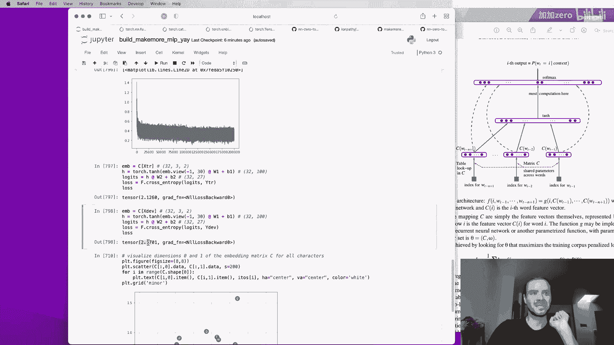
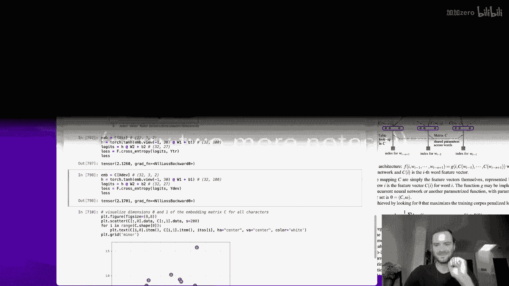
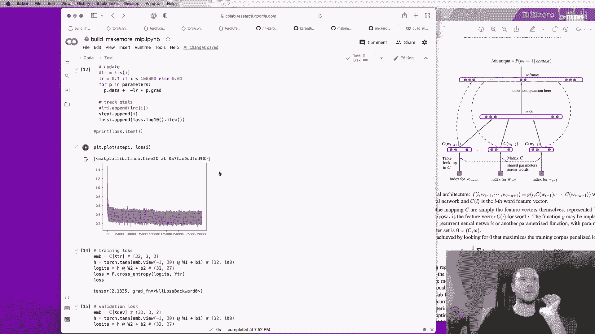

# P3：p3 Building makemore Part 2： MLP - 加加zero - BV11yHXeuE9d

大家好，今天我们将继续我们的实现'现在多做些'项目，在上一节课中，我们实现了大词袋模型，并且我们实现了它，我们使用计数和也使用了一个非常简单的神经网络，该网络只有一个线性层。这是上一节课我们构建的jupyter笔记本，我们看到我们采取的方法，这就是我们只看到了单个之前的字符，并预测序列中下一个字符的分布，我们通过取计数并将其归一化为概率来完成了这一点，这样。每行在这里的总和都为一，现在，这都很好，如果你只有前一个上下文的一个字符，并且这行有效，并且它易于理解，这个模型的问题，当然是，嗯，这个模型的预测效果并不好，因为你只取一个上下文的字符。所以模型现在不再产生听起来像名字的东西，这个问题在于这种方法，尽管是，如果我们要考虑更多的上下文，在序列中预测下一个字符时，事情迅速膨胀，而且这张表的大小，实际上随着上下文的长度以指数级增长。

因为如果我们只考虑一个字符，那就是两个七种可能的上下文，但如果我们考虑过去的两个字符并尝试预测第三个，突然这个数组的行数，你可以这样看，二七乘以二七等于四百九十九，所以，在给定的上下文中。有七百二十九种可能性，如果我们将三个字符视为上下文，突然，我们拥有了二十万种上下文的可能性，因此，这只是矩阵中的行数太多了，对于每种可能性，计数太少，而且，整个东西就爆炸了，工作得不太好。这就是为什么今天我们要转向这里，我们将实现一个多层感知器模型，来预测序列中的下一个字符，我们即将采用的建模方法，遵循了本杰明二十三的这篇论文，所以我现在把论文拉上来了，这不是第一个提出。使用莫尔托感知器或神经网络，来预测序列中的下一个字符或标记的论文，但它肯定是那个时期，影响很大的论文，经常被引用来代表这个想法，我认为它是一篇写得很好的论文，因此，这就是我们要首先查看并现在导入的论文。

这篇论文有十九页，因此，我们没有时间深入探讨这篇论文的所有细节，但我邀请你阅读它，它非常易于阅读，有趣，并且其中还包括许多有趣的想法，在引言中，他们描述了我刚刚描述的问题，然后来解决它。他们提出了以下模型现在，请记住，我们在构建一个字符级别的语言模型，因此，我们在这篇论文中工作的是字符级别，他们有一个词汇表，包含十七万个可能的单词，他们反而构建了一个词级别的语言模型。但我们仍然将坚持使用字符，但现在我们将采取相同的建模方法，他们做的事情基本上是，他们提议将所有这些单词，十七万个单词，并将它们与每个单词关联到一个三十维的特征向量。所以每个单词现在都被嵌入到一个三十维的空间中，你可以这样想，所以我们在三十维空间中有十七万个点或向量，你可能想象这是非常拥挤的，在开始阶段，这是一个很小的空间，有很多点，这些单词被完全随机初始化。

所以它们被随机地分散，然后，我们将调整这些单词的嵌入，使用反向传播，所以在这个神经网络的训练过程中，这些点或向量将在这个空间中移动，你可能想象，例如，意思相似的单词，或者确实有每个单词的同义词。可能会结束在一个非常相似的空间部分，相反，意思完全不同的单词可能会在某个其他地方的空间，他们的建模方法与我们的否则相同，他们正在使用多层神经网络来预测下一个单词，给定之前的单词，并训练神经网络。他们正在最大化训练数据的对数似然，就像我们做的，所以，建模方法本身在这里是一个具体的例子，为什么它工作，基本上假设，例如，你可能试图预测一只狗正在空白的地方跑，现在假设精确的短语一只狗正在空白的地方。在训练数据中从未出现过，并且在后来的测试时间，当模型被部署在某处时，它正在尝试创建一个句子，它说一只狗正在空白的地方，因为训练集中从未遇到这个精确的短语，你处于分布外，像我们所说。

就像你没有任何基本理由怀疑接下来可能会发生什么，但这种方法实际上允许你绕过这个问题，因为也许你没有看到狗在什么东西里跑的确切短语，但也许你看到过类似的短语，也许你看到过狗在空白里跑的短语。也许你的网络已经学会了a和the像经常是可以互相替换的，所以也许它需要a的嵌入和the的嵌入，实际上，它们被放置在附近的空间中，彼此在空间中，因此，你可以通过那个嵌入来传递知识，你可以以这种方式概括。同样，网络可能知道猫和狗是动物，它们在许多非常相似的上下文中同时出现，因此，即使你没有看到确切的短语，或者如果你没有看到确切的走路或跑步，你可以通过嵌入空间转移知识，你可以概括到新的情境。那么让我们不往下滚动到神经网络的图表，嗯，他们这里有一个漂亮的图表，在这个例子中，我们正在考虑前三个单词，我们试图预测序列中的第四个单词，正如我所说，这前三个单词，我们有一个词汇表。

包含十七万个可能的单词，所以，每一个基本上都是输入词的索引，因为有十七万个单词，这是一个数字，介于零和十六万九千九百九十九之间，现在也有一个他们叫做c的查找表，这个查找表是一个十七千乘以的矩阵，说三十。基本上我们在这里做的是，我们将其视为查找表，因此，每个索引都在从这个嵌入矩阵中提取一行，所以每个索引都被转换为三维的，嗯，向量，对应于那个词的嵌入向量，所以这里我们有一个输入层，包含三十个神经元。用于三个词，总共形成九十个神经元，他们正在说，这个矩阵c在所有单词中都是共享的，所以我们总是索引到同一个矩阵，c重复使用，嗯，对于这些单词中的每一个，下一个是这神经网络的隐藏层。这个神经网络的隐藏神经元的大小是一个跳跃参数，所以我们在使用'超参数'时，就像是，神经网络设计师的一种设计选择，这可以大到你想要的任何程度，或者你想要多小就多小，所以，例如，这个隐藏层的大小可以是一百。

我们将会讨论多个这个隐藏层的大小选择，然后我们会评估它们工作的效果，假设这里有一百个神经元，所有的神经元都会完全连接到九十个词，或者九十，嗯，构成这三个词的数字，所以这是一个全连接层。然后有一条长达十的线性，然后有这个输出层，因为接下来可能出现的单词有十七万种，这个层有十七万个神经元，所有的神经元都与隐藏层的所有神经元完全连接，所以这里有很多参数，因为单词很多。所以大部分计算都在这里，这是昂贵的层，现在这里有一万七千个loggets，所以在上面我们有softmax层，我们在之前的视频中也见过它，所以每个逻辑都被指数化，然后所有事情都被归一化为总和为一。所以现在我们有一个漂亮的概率分布，用于序列中的下一个词，当然，在训练期间，我们实际上有标签，我们有序列中下一个词的身份，那个词或其索引被用来提取那个词的概率，然后，我们正在最大化那个词的概率。

相对于这个神经网络的参数，所以，参数是这个输出层的权重和偏置，隐藏层和嵌入查找表的权重和偏置，C和所有这些都是通过反向传播优化的，这些虚线箭头忽略了代表神经网变体的那些，我们在这个视频中不会去探索的。所以，这就是设置，现在让我们实现它，好的，所以我为这次讲座开了一个新的笔记本，我们正在导入pi torch，我们正在导入matplotlib，以便我们可以创建图表。然后我正在将所有名称读入一个字符串列表，如我之前所做的，我在这里展示了前八个，请记住，我们总共有32，000个，这些只是前八个，然后我在这里构建了字符的词汇表，以及从字符到整数的所有映射，反之亦然。现在我们要做的第一件事是，我们要为神经网络编译数据集，而且我必须重写这段代码，我会在片刻后展示给你，它看起来什么样子，所以这是我为数据集创建创建的代码，所以让我先运行它，然后我会简要解释这是如何工作的。

所以首先我们要定义一些叫做块大小的东西，这就是基本上下文的长度，即我们预测下一个字符需要考虑的字符数，我们取多少个字符来预测下一个，所以在这个例子中，我们取三个字符来预测第四个字符。所以我们的块大小是三，这就是支持预测的块的大小，在这里我正在构建x和y，x是神经网络的输入，而y是每个例子的标签，在x中，我错误地处理了第一个五个词，我做第一个五个只是为了效率。当我们正在开发所有代码时，但是后来我们将来这里删除这个，以便我们使用整个训练集，所以我在这里打印单词emma，在这里我基本上展示了例子，我们如何从单个类型的单词emma中生成五个例子。所以当我们只被给予上下文时，点点点序列中的第一个字符是e，在这个上下文中，标签是m，当上下文是这个，标签是m等，所以我构建出这种方法的第一步是，我从一个只包含零标记的填充上下文中开始。

然后我遍历所有可能的字符，我获取序列中的字符，我基本上构建出数组y，其中包含当前字符，数组x存储当前运行的上下文，在这里，你看我打印所有事情，在这里，我裁剪上下文并插入新字符到一个序列中。所以这有点像一个滚动的上下文窗口，现在，我们可以在这里更改块大小为，例如，四个，那么在这种情况下，我们将预测第五个字符，给定前面的四个，或者可以是五个，然后它将看起来像这样，或者可以是说十个。然后它将看起来像这样，我们使用十个字符来预测第十一个字符，我们总是以点号添加，那么让我们回到三个，只是为了，嗯，我们在纸上有这些，最后，当前的数据集如下，从这五个词中。我们创建了一个包含三个两个例子的数据集，神经网络的每个输入都是三个整数，我们有一个标签，它也是一个整数，嗯，为什么x看起来像这样，这些是个别的例子，然后y是标签，所以给定这个。

让我们现在编写一个可以接受这些x的神经网络，并首先预测y的，让我们构建嵌入查找表，C，所以我们有两个可能的字符，并且在论文中我们将将它们嵌入在一个更低维的空间中，它们有十七千个单词，然后他们咬入了，嗯。空间小到三十维，所以他们将十七万字压缩进了三十维的空间，在我们的情况下，我们只有七十二种可能的字符，所以让我们将它们压缩进一些开始就小的东西，例如，一个二维空间，所以这个数据表将是随机数字。我们将有七十二行，然后我们会有两列，所以每二十，每个二十七个字符都会有一个二维嵌入，所以这就是我们的矩阵，在开始初始化嵌入的C中，现在随机，在我们将所有整数嵌入到输入x中的之前，使用这张查找表。C让我来实际尝试嵌入单个整数，比如，说五，嗯，所以现在我们对这如何工作有了一个感觉，这种工作方式的一种方式，当然，我们可以只取c并索引到第五行，这就给我们一个向量，c的第五行和嗯，这是一种做它的方法。

我在上一堂课中提出的另一种方法是实际上看似不同的，但实际上是相同的，所以，在前一次讲座中，我们做的是，我们取了这些整数，然后，我们使用独热编码首先编码它们，所以，如果那个独热，我们想要编码整数五。我们想要告诉它，类数的数量是二十七，所以，那是一个二十六维的所有零向量，除了第五位被激活，现在，这实际上不工作，原因是这个输入实际上必须是一个torch tensor，我正在故意犯一些错误。只是为了让你看到一些错误并知道如何修复它们，嗯，所以这必须是一个tensor，不是int，很容易修复，我们得到一个独热向量，第五维是1，这个形状是二十七，现在注意，正如我在前一个视频中短暂提到的。如果我们取这个独热向量并乘以c，那么，嗯，你会期待什么，首先，数字一，你会期待一个错误，因为嗯，预期标量类型long，但找到了float，所以有点困惑，但是，问题在这里是独热，它的数据类型是long。

它是一个六十四位的整数，但这是一个float tensor，所以PyTorch不知道如何乘以一个int和一个float，这就是为什么我们必须明确地将这个转换为float，所以现在我们可以乘以。这里的输出实际上与前一个相同，因为矩阵乘法的方式在这里工作，我们有独热向量乘以c的列，因为所有的零，实际上它们最终掩盖了c中的所有内容，除了第五行，它是被提取出来的。所以我们实际上到达了相同的结果，这告诉你，在这里我们可以解释这个第一部分，这个整数的嵌入，我们可以把它看作是整数索引到一个查找表c，但等价地，我们也可以把这个小部分看作是这个大神经网络的第一个层。这个层在这里的神经元没有非线性，没有tanh，只有线性神经元，他们的权重矩阵是c，然后，我们将整数编码为独热并喂入神经网络，并且这一层基本上就是嵌入，所以这些都是做同一件事情的两种等价方式。

我们只是去索引，因为速度要快得多，并且我们将丢弃将one hot解释为神经网络的这种解释，我们现在只是去索引整数，创建和使用嵌入表，嵌入一个单一的整数，如五，是很容易的。我们可以简单地要求pytorch检索c的第五行，或者c的行索引五，但是，我们如何同时嵌入数组x中存储的三十二个由三组成的整数，幸运的是，PyTorch的索引方式相当灵活且非常强大，所以并不仅仅限于，嗯。获取单个元素，像这样的五个，实际上，你可以使用列表进行索引，所以例如，我们可以获取第五行，第六行和第七行，这将像这样工作，我们可以使用列表进行索引，这不仅仅是一个列表，它也可以是一个实际的整数张量。我们可以用那个来索引，所以这是一个整数张量五六七，这也会工作得很好，实际上，我们也可以例如，重复行七并多次检索它，并且相同的索引在这里只会被嵌入多次，在这里我们正在使用一个一维的整数张量来索引。

但结果是，你也可以用多维的整数张量来索引，这里有一个二维的整数张量，"所以我们只需要在x处做c，这就行了"，"这个的形状是32乘以3"，"原始的形状是什么？"，"现在，对于那些三个3x3的整数"。"我们已经在这里检索到了嵌入向量"，所以基本上我们有这个作为示例，"十三或示例索引十三"，"第二个维度是整数"，"一个作为示例"，"因此，如果我们对x进行c操作，结果就是这里"，这给我们提供了一个数组。然后我们从数组的两个位置索引到13，然后我们在这里得到嵌入，你可以验证在1的位置，c是确实等于这个的，即在那个位置处的整数确实是等于这个的，你看它们是相等的，所以基本上来说，长话短说。**PyTorch**的索引很棒，可以用来同时嵌入，x中的所有数字，我们可以简单地做c of x，这就是我们的嵌入，这就正常工作了，让我们在这里构建这一层，隐藏层，所以我们有这个w一，我会这样叫它。

这些是我们现在随机初始化的权重，这一层的输入数量将是三乘以二对吧，因为我们有两个维的嵌入，我们有三个，所以输入数量是六，并且这一层的神经元数量由我们决定，让我们以100个神经元为例。然后偏置也将随机初始化为示例，而且我们只需要100个，现在问题在于，我们不能简单地正常，我们将输入，在这种情况下那是嵌入，我们想要乘以这些权重，然后我们希望添加偏置，这大致是我们想要实现的，但是。这里的问题是这些嵌入式向量堆叠在一起，在输入张量的维度上，所以，这个矩阵乘法不工作，因为形状是三，两由三由二，我不能乘以六由一百，所以，我们需要在这里以某种方式将这些输入拼接在一起。以便我们可以做这些事情，目前这不工作，那么，我们将如何将这个3x2x2的矩阵转换为3x6的矩阵呢，以便我们可以在这里实际进行乘法，我想向您展示，通常实现您在**Torch**中想要实现的方法有很多种。

其中一些方法会更快，更好，更短，等等，这是因为**Torch**是一个非常大的库，它包含了大量的函数，有很多很多，所以如果我们只是去文档并点击**Torch**，你会看到我这里的滑块非常小。这是因为你可以在这些张量上调用这么多函数，来变换它们，创建它们，乘以它们，添加它们，对它们进行各种不同的操作，所以这有点像，可能性的空间，如果你现在要执行的一件事是，如果我们可以控制这里。控制f用于连接，我们看到这里有一个函数**Torch.dot.cat**，短语为连接，并且这个连接给定序列的张量在给定维度，并且这些传感器必须具有相同的形状，等等，所以我们可以使用连接操作在朴素的方式。连接这三个嵌入物对于每个输入，所以在这种情况下我们有m p的形状末尾，实际上我们想要完成的是，我们想要检索这些三个部分并连接它们，所以我们想要获取所有例子，我们想要获取第一个，零的索引，然后所有这些。

所以这提取出只是第一个单词的32x2嵌入物，所以基本上我们想要这个家伙，我们想要第一个维度，我们想要第二个维度，这些是三个单独的部分，然后我们将其视为一个序列，我们想要**Torch.cat**在这个序列上。这是列表，**Torch.cat**接受一个张量序列，然后我们必须告诉它沿着哪个维度进行连接，在这种情况下所有这些都是32x2的，我们想要连接，不在维度零上连接，但在维度一上连接。所以传递1给我们得到结果，这个形状是3x2x6，正是我们想要的，所以基本上从3x2，通过连接它们压缩为3x2x6，现在因为这个代码不会很一般化，如果我们想要稍后改变块大小，我们现在有三个输入。三个词，但如果我们有五个，那么我们就需要改变代码，因为我直接索引，**Torch**再次来救场，因为原来这是一个叫做**unbind**的功能，它移除张量维度，所以它移除张量维度。

返回沿给定维度的所有切片的元组，没有它，这就是我们需要的，基本上当我们调用**Torch.dot.unbind**，**Torch.dot.unbind**的m并传递维度，一个索引对应一个，这给我们一个列表。列表中包含张量列表，与这个完全等价，所以运行这个给我们第三行，并且这就是这个列表，所以我们可以调用**Torch.dot.cat**在它上，并且在第一个维度上，这工作，并且这个形状相同，但现在这个是，嗯。这不重要，如果我们的块大小是三、五或十，这就会工作，所以这是一种做它的方法，但结果是在这种情况下实际上有一种显著更好、更有效的方法，这给了我一个机会来暗示一些**Torch.dot**的内部工作原理，张量。所以让我们在这里创建一个包含零到十七元素的数组，这个形状就是十八，这是一张包含18个数字的单张图片，结果我们发现我们可以非常快速地将其重新表示为不同大小和维度的张量，我们通过调用视图来实现这一点。

我们可以说实际上这并不是一个包含18个元素的单一向量，这是一张2x9的张量，或者这是一张9x2的张量，或者这实际上是一张3x3x2的张量，只要这里的元素总数相乘等于相同的值，嗯，这就会起作用。在**PyTorch**中，调用该视图的操作极其高效，这是因为在每个张量中，都有一个被称为底层存储的东西，存储就是数字，总是作为一个一维向量存在，这就是这个张量在计算机内存中的表现形式，它总是一个一维向量。但当我们调用do时，我们在操纵张量的一些属性，这些属性决定了如何将这个一维序列解释为一个n维张量，所以这里发生的事情是，没有任何内存被改变，复制，当我们调用那个视图时，它会被移动或创建，存储是相同的。但是当你调用那个视图时，一些内部的，这个张量的视图的一些内部属性正在被操纵和改变，特别是，那里有一个叫做存储的东西，偏移量，步长和形状，并且这些被操纵，以便这一连串的字节数组被视为不同且多维的数组。

这里有一篇来自**Eric**的博客文章，叫做[Pytorch内部](https://example.org/pytorch_internals)，他在其中谈到了一些关于**张量**的内容，以及张量视图的表示方式，这实际上就像是一种逻辑构造，用于表示物理内存。所以这是一条很好的博客文章，你可以深入阅读，我可能还会创建一个关于**Torch Tensor**内部工作的整个视频，以及这是如何在这里工作的，我们只是注意到这是一项极其高效的操作。如果我删除这个并返回到我们的m，我们可以看到，我们的m形状是三乘二乘二，但我们可以简单地要求PyTorch将这个视为一个32乘6，并且这个32乘6数组的展开方式，只是这两个被堆叠成一行。所以这就是我们要追求的基本上连接操作，你可以验证，这实际上给出了我们之前相同的结果，所以这是元素y等于，你可以看到，这些两个张量的所有元素都是相同的，所以我们得到相同的结果，简单来说。

实际上我们可以直接来这里，如果我们只把这看作是一个32x6，嗯，相反，那么这个数乘法就会起作用，给我们我们要找的隐藏状态，所以如果这个是h，那么每个形状现在是我们三个2个例子的一百维激活。这给我们想要的结果，我在这里做两件事，首先，我们不使用三和二，我们可以，例如，做类似于在零处绘制一个m点形状的事情，这样我们就不会把这些数字硬编码，而且这种方法适用于任何大小的m，或者我们也可以做负一。当我们做负一时，Pytorch会推断这应该被设置为什么，因为元素的数量必须相同，我们正在说，这是PyTorch将推导出的六，这必须是三，两或者任何其他，如果m的大小不同，那就是，这里还有其他一件事。我还想指出一件事，是在当我们做连接时这里，实际上，这种方法效率要低得多，因为嗯，这种连接将创建一个全新的张量，具有全新的存储，所以新的记忆正在被创建，因为没有一种方法可以连接张量，仅仅通过操纵视图属性。

所以这是非常低效的，并且创建了各种各样的新记忆，嗯，所以让我删除这个，现在，我们不需要这个，这里是用来计算h的，我们也想要这个的十个h的点积，以得到我们的oops，以得到我们的h。所以这些现在是介于-1和1之间的数字，由于十个h，我们有形状为3x2x100的形状，这基本上是这里隐藏层的激活，对于我们的每个3x2的例子，现在，我还有一个我没有详细讨论的事情，我们需要非常小心的。并且这是这个和那，在这里，特别是在这里，我们要确保广播将做我们喜欢的事情，这个形状是3x2x100，b1的形状是100，在这里，我们可以看到添加将广播这两个，特别是我们有3x2x100，广播到100。所以广播将对齐在右侧，在这里创建一个假维度，所以这将成为一个1x100的行向量，然后它将垂直复制为每个3x2的行，并进行元素wise的添加，所以在这种情况下，正确的事情会发生。

因为相同的偏置向量将被添加到这个矩阵的所有行中，所以那是正确的，这就是我们想要的，总是好实践，确保，这样你不会踢到自己的脚，最后，让我们在这里创建最后的层，所以让我们创建w2和b2，输入现在是100。输出的神经元数量对我们来说是27，因为我们有27个可能出现的下一个字符，所以偏置也将是27，因此，这个神经网络的逻辑（输出）将是，嗯，h乘以w2加上b2的逻辑，形状是32x27。逻辑现在正好像我们在之前的视频中看到的一样，我们要取这些逻辑，我们要首先将它们指数化，以得到我们的假计数，然后，我们要将它们归一化为概率，概率是计数除以，现在，计数点积沿第一个维度。并保持dims为true，正如在之前的视频中一样，所以概率的形状现在是3x2x27，你会看到，概率的每一行都等于1，所以已经归一化，所以现在我们有了概率，当然我们有下一个实际出现的字母。

并且它来自这个数组，Y，我们在数据集创建时创建的，所以为什么最后一个部分在这里，这是序列中下一个字符的身份，我们现在想要预测，所以现在我们想做的就是像之前的视频一样，我们想要索引到prob的行。并且每一行，我们想要提取分配给正确字符的概率，如这里所示，首先我们有torch。arange的三个二，这有点像从零到三一的迭代器，然后我们可以按照以下方式索引到prob，prob在torch。dot(arrange的三个二)中，它擦除行，然后在每一行中，我们想要抓取由y指定的列，这给了由这个神经网络分配的当前概率，以这个权重设置，它正确地预测了序列中的字符，你可以在这里看到，这看起来不错。对于某些字符，如这个，基本上是0。2，但它看起来非常不好，对于许多其他字符，如这个，是0。0，0，7个0，一个概率，所以网络认为有些是非常不可能的，当然我们还没有训练神经网络，所以这将改善。

并理想上所有这些数字在这里，当然都是1，因为现在我们正确地预测了下一个字符，就像之前的视频，我们要看这些概率，我们要看锁定概率，然后我们要看平均对数概率，并创建负对数似然损失的负数，这里的损失是17。这是我们想要最小化的损失，以使网络预测序列中的正确字符，好的，所以我重写了所有事情，使它看起来更尊重，所以这是我们的数据集，这里是我们定义的所有参数，我现在在使用生成器使它可重复。我集群了所有问题参数到一个参数的列表中，所以，例如，它很容易计数，并看到目前我们总共有大约3400个参数，这就是前向传播，我们按照这种方式开发它，在这里我们得到一个数字，当前参数设置下。这个神经网络表现的损失，我希望让它更加正式，特别是看这里我们取逻辑的地方，我们计算一个损失，我们实际上并没有发明轮子，这只是分类，许多人使用分类，这就是为什么PyTorch中有一个功能强大的交叉熵函数。

以便更有效地计算，所以我们可以直接调用那个交叉熵，并且我们可以传递逻辑，并且我们可以传递目标数组y，这个计算出相同的损失，嗯，所以实际上我们可以简单地放在这里，删除这三行，我们将得到相同的结果，实际上。有许多原因使我们更喜欢使用f交叉熵而不是，像这样自己实现，我做这个是为了教育目的，但在实践中你永远不会使用这个，为什么在那个交叉熵中使用的数字是一，Pytorch实际上不会创建所有这些中间张量。因为这些都是在内存中的新张量，而且这样运行相当低效，相反，Pytorch会聚集所有这些操作，并且经常创建，有融合的核，非常高效地评估这些表达式，这些有点像簇集的数学运算，第二项。反向传播可以变得更加高效，这不仅因为它是一个融合的核，但从分析和数学的角度来看，它们大大，实现反向传播往往非常简单，我们实际上以微分度数出售这个，你看这里当我们实现十h时。

这个操作的前向传播来计算十h实际上是一个相当复杂的数学表达式，但由于它是一个簇集的数学表达式，当我们做反向传播时，我们没有单独地通过x和两次来反向，还有减一和除法等。我们只是说它等于一减去t的平方，这就是一个更简单的数学表达式，我们能够做到这一点，因为我们能够重用计算，因为我们能够数学上并分析地推导出导数，而且那个表达式常常在数学上简化。所以有很少需要实现的，所以不仅因为它在融合核中运行可以更有效，而且因为表达式可以以更简单的形式出现数学上，那就是第一个数字，在那个十字架的底部，第二个数字是，熵也可以显著地更具有数学上的良好行为。让我来给你展示这是如何工作的，假设我们有很多负数，两个，三个，负三，零和五，然后我们在取它的指数并将其归一化为和为一，所以当逻辑值取这些值时，一切都很好，然后我们得到一个漂亮的概率分布。

现在考虑当一些这些逻辑值取更极端的值时，而且这可能在神经网络的优化过程中发生，假设一些这些数字增长非常负，比如，说负一百，那么实际上一切都会出来很好，我们仍然得到你知道的、行为良好的概率。而且他们相加等于一，一切都很好，但是，由于出口的方式，如果你有非常积极的逻辑值，让我们说在这里是积极的一百，你实际上开始遇到麻烦，在这里我们得到一个不是数字的值，而且这是因为这些计数，有一个`m`在这里。所以如果你向`xp`输入一个非常负数的数字，你只会得到一个非常负数，抱歉，不是负面的，但是数字非常小，非常接近零，这是可以的，但是如果你输入一个非常积极的数字，突然我们在表示这些计数的浮点数范围内用尽了。所以基本上我们在取`e`，然后将其提升到一百的幂，这就给我们带来了，因为我们在这个浮点数计数范围内用尽了动态范围，因此我们不能通过这种表达式传递非常大的logits，现在，让我来将这些数字重置为合理的值。

π在torch中如何解决，这就是你看到我们在这里将得到结果的方式，结果表明，由于这里的归一化，实际上，你可以通过任意你想要的常数值来偏移logits，所以，如果我在这里添加1，你实际上将得到相同的结果。或者如果我添加2，或者如果我减去3，任何偏移量都会生成正确的概率，所以因为负数是可以的，但是正数实际上可能会溢出这个exp，Pytorch做的事情是它内部计算逻辑中出现的最大值，并减去它。所以在这种情况下它将减去5，因此逻辑中最大的值将成为零，而其他数字将成为一些负数，然后这个结果的行为总是很好的，所以即使我们有一百在这里，以前不好，但是PyTorch减去一百，这将工作。因此有许多理由称交叉熵为第一，前向传递可以更加高效，后向传递可以更加高效，并且事情可以更加数字形式良好，好的，所以现在让我们设置这个神经网络的训练，我们有前向传递，嗯，我们不需要这些。

我们有损失等于交叉熵，这是前向传递，然后我们需要后向传递，首先我们要设置梯度为零，所以对于`pm`参数，我们要确保`p点.grad`是none，这是同样的在PyTorch中设置它为零。然后损失的后向传递来填充这些梯度，一旦我们有了梯度，我们可以做参数更新，所以对于`p`参数，我们要取所有数据并想要学习率乘以`p点.grad`，然后我们要重复几次，嗯，让我们在这里打印损失，现在足够了。它会创建错误，因为我们还要去为`pn`参数，我们要确保`p点.requires_grad`是设置为true在PyTorch中，这应该就工作得很好，我们开始时的损失是十七，我们在减少它。让我们运行更长并看看你如何看到损失在这里大大减少，所以，如果我们只是运行一千次，我们将得到一个非常低的损失，这就意味着我们现在的预测非常准确，现在这么直接的原因是我们只处理了，三个两个的例子。

所以我们只有前三个词的三个两个例子，因此，使这个神经网络拟合非常容易，只有三个两个的例子，因为我们有3400个参数，只有三个三个两个的例子，所以我们在做叫做，对数据批次进行过拟合。得到非常低的损失和好预测，但这只是因为我们有这么多参数，只有这么少数据，所以使它非常低是很容易的，现在我们无法精确地达到零，这是因为我们可以，例如，看看正在被预测的逻辑，并嗯。我们可以看看在`pi torch`的第一个维度上的max，嗯，Max报告了实际值取最大值时的所有值，嗯，数字，但也报告了这些值的索引，你会发现，索引非常接近标签，但是，在一些情况下，它们有所不同，例如。在这个非常 first 的例子中，嗯，预测的索引是十九，但是，标签是五，我们无法使损失为零，并且，从根本上说，这是因为这里，第一个或零索引是例子，其中省略号应该预测`e`，但你看，点点点也应该预测一个`o`。

并且点点也应该预测一个`i`，然后`s`，所以基本上`e`，`o`，`a`或`s`在训练集中的所有输入上都是可能的结果，所以我们无法完全过拟合，使损失精确地等于零，但在某些情况下，我们非常接近。在哪里有一个唯一的输入对应一个唯一的输出，在这些情况下我们做被称为过拟合的事情，我们基本上得到相同的和精确的结果，所以现在我们所要做的就是，我们只需要确保我们已经完全读取了数据集，并优化神经网络，好的。所以让我们回到创建数据集的地方，在这里我们只使用前五个词，所以让我现在删除这个，删除打印语句，否则我们将打印太多，所以当我们处理包含所有不同单词的全个数据集时，我们现在有了二百二十八万个例子。而不是仅仅三十二个，那么让我们现在滚动回到大的集合，重新初始化权重，相同的参数数量，它们都需要梯度，然后让我们推送这个打印，我失去了那个物品在这里，让我们看看优化如何进行，如果我们运行这个，好的。

所以我们从相对较高的损失开始，然后，当我们在优化时，损失正在降低，但你会发现，每次迭代都需要花费相当长的时间，所以让我们实际上解决这个问题，因为我们在做得太多了，在实际操作中。我们正在前向和后向处理220,000个例子，人们通常的做法是进行前向和后向，对多个数据批次进行更新，所以我们想要做的是，我们要随机选择数据集的一部分，那就是一个迷你批次。然后只向前向后更新那个小型迷你批量，然后我们在这些许多批次上迭代，所以在PyTorch中我们可以，例如，使用`torch.dot`函数，我们可以生成0到5之间的数字并生成32个，嗯。我相信在torch中的大小必须是一个元组，所以我们可以有一个元组32个0到5之间的数字，但实际上我们想要`x`星形的0在这里，所以这创建了uh，索引到我们数据集中的整数，并且有32个他们。

所以如果我们的迷你批量大小是32，那么我们可以来这里，首先做，嗯，迷你批量，所以在这个我们要优化的整数中，嗯，在单个迭代中，`ix`包含这些整数，然后我们想要使用`ix`来索引`x`，只获取那些行。所以我们只获取32行`x`，因此，嵌入式又将是32x3x2的，不是200,000x3x2的，然后，这个`ix`必须被使用，不仅仅是用来索引`x`，而且也是用来索引`y`的，现在应该使用mini batches。这个应该快得多得多，所以，好的，所以是即时的，几乎就是这样，我们现在可以几乎立即运行许多许多示例，并且现在可以大大加快损失的减少，因为我们只处理小批量，我们梯度的质量较低，所以方向并不那么可靠。这不是实际的梯度方向，但梯度方向足够好，即使它只是在三个两个示例上进行估计时也是有用的，因此，有一个近似的梯度更好，只需要比评估精确梯度并走更少步要多走几步，这就是为什么在实际中，嗯，这个效果还不错。

所以我们不再继续优化，嗯，让我从这里拿出这个丢失的物品，然后嗯，把它放在这里的末尾，好的，所以我们大约在2.5左右徘徊，嗯，但是这只是那个迷你批次的损失，那么让我们实际评估这里的损失。对于所有的x和所有的y，只是为了我们完全理解模型目前做得有多好，所以现在我们在整个训练集上大约是2.7，那么让我们运行优化一段时间，好的，2.6，2.57，2.5，3，好的，所以有一个问题，当然。问题是我们不知道我们是否步调过慢或过快，嗯，所以第一点我只是猜测的，所以有一个问题是如何确定这个学习率，以及我们如何获得信心，认为自己正在正确的，嗯，可以说是速度上。所以我会告诉你一种确定合理学习率的方法，它工作如下，让我们将参数重置为初始设置，现在让我们在每个步骤中打印，但是让我们只做大约十个步骤，或者也许也许我们要找一百步，像一个非常合理的集合，搜索范围。

如果你愿意，例如，如果这像非常低，我们可以看到损失几乎不降低，所以那不是，这就像太低了，基本上让我们试试这个，好的，所以我们正在减少损失，但是不像很快，所以这是一个相当好的低范围，现在让我们再重置它。现在让我们尝试找到损失爆炸的地方，嗯，所以可能负一，好的，我们看到我们正在最小化损失，但你看怎么，它有点不稳定，它上下波动很大，嗯，所以可能一可能是一个快速的学习率，让我们试试负十，好的，这不是优化。这不起作用得很好，负十太大了，负一已经相当大了，嗯，所以因此负一像是稍微合理的，如果我重置，所以，我想学习率应该在uh负零点零和零一之间，零和一和uh负一，所以我们在这里可以做的是。我们可以使用uh torch shuttle在空间中，我们想要基本上做这样的事情在零和一之间，但是嗯，步数是一个需要参数的额外项，我们做一千步，这创建了一千个数字在零点零，零一和一之间。

但是实际上步长在这些线性之间并不真正有意义，所以让我来创建学习率指数，而不是零点零零一，这将是负三，这将是零，然后我们想要搜索的实际ars将是十，到li的幂，所以现在我们做的是。我们正线性步长在这些学习率的指数之间，这是零点，零，零一，这是一，因为嗯，零的指数是一，因此我们在这个区间中以指数级分布，所以这些是我们想要搜索的候选学习率，所以现在我们要做的就是这里。我们将运行优化1000步，而不是使用固定的数字，我们将使用学习率索引在这里，Lrs of i和使用这个，i，所以基本上让我重置这个再次，从随机开始，创建这些学习率在负零之间，在零点零之间，零一和一。但是以指数级步进，在这里我们做的是，我们将迭代1000次，我们将使用学习率，嗯，那是开始的，非常，非常低，开始是零点，零，零一，但到结尾将是一，然后我们将用那个学习率步进，现在我们要做的就是。

我们要跟踪所有的，嗯，学习率我们使用了，我们要看结果损失，所以这里让我跟踪统计数据，所以li that append lr和loss side that append loss that item。好的，再次，重置一切，然后运行，基本上我们开始时有一个非常低的学习率，我们一直上升到，嗯，学习率为负一，现在我们可以做，我们可以将t that plot，我们可以绘制两个。所以我们可以绘制学习率在x轴上，我们在y轴上看到损失，你通常会发现你的图表看起来像这样，在开始你的学习率非常低，我们基本上任何东西，几乎什么都没发生，然后我们在这里找到了一个不错的地方。然后当我们增加学习率到足够的程度时，我们基本上开始在这里变得稍微不稳定，所以，一个好的学习率实际上大约在这里，因为我们这里有lr_i，嗯，我们实际上可能想要，嗯，不要，嗯，不是学习率，但是指数。

所以那将是lr_e和i可能是我们想要日志的，所以让我来重置这个并重新计算那个，但现在在x轴上我们有学习率的指数，所以我们可以看到，使用好的学习率的指数，它将大致像是这个山谷在这里。因为这里的学习率太低了，然后这里我们，我们预期相对良好的学习率，大约在这里，然后这里事情开始爆炸，所以大约在-1x学习率的指数是一个相当好设置，10的-1是0.1，所以0.1实际上是在这里大约是一个相当好的学习率，这就是我们最初的设置，嗯，但大致就是这样你确定它，所以现在我们可以删除对这些的跟踪，我们可以简单地设置允许为10的-1，或者基本上否则就像以前那样是1。现在我们有一些信心这实际上是一个相当好的学习率，所以现在我们可以做是，我们可以增加迭代次数，我们可以重置我们的优化，嗯，我们可以使用此学习率运行很长时间，哦，我们不想打印太多打印。

所以让我再次重置并运行10,000步，好的，所以我们是2.48，大约，让我们再运行10,000步，2.46，现在我们做一次学习率，衰减，这意味着，我们将我们的学习率，我们将其降低10倍。所以训练的晚期阶段，可能我们想要，嗯，慢一些，让我们再做一次，实际上放一个只是为了看看，如果，我们在这里产生了一些影响，好的，我们仍在产生影响，顺便说一下，我们在上一期视频中实现的大词对损失为2.45。所以我们已经超过了大词对模型，一旦我对此有了一种感觉，那就是它实际上开始停滞不前，嗯，人们喜欢做，正如我提到的，这个学习率衰减，所以让我们尝试衰减损失，嗯，学习率，我的意思是，我们现在大约达到了2.3。显然这很粗糙，并不是你在生产环境中应该训练它的方式，但这是大致的过程你正在经历，你首先找到一个合适的学习率，使用我展示给你的方法，然后从那个学习率开始，并训练一段时间，然后。

人们喜欢在训练结束时进行学习率衰减，其中，学习率通过，说一个因子10来衰减，然后做几步，然后您得到一个训练的网络，大致上，所以我们已经达到了2.3，嗯，在很大程度上改进了大词对语言模型。使用这里描述的简单神经网络，嗯，使用这三千四百个参数，我们有一件事需要注意，我说我们有一个更好的模型，因为我们正在实现更低的损失，2.3，远低于2.4,5与大词对模型之前，这并不是完全真实的。而且原因不是那样，这是因为实际上这是一个相当小的模型，但这些模型可以变得越来越大，如果你继续添加神经元和参数，所以你可以想象，我们可能没有一千个参数，我们可以有一万个，十万个，一百万个，甚至百万个参数。随着神经网络的容量增长，它变得越来越有能力过拟合你的训练集，这意味着在训练集上的损失将变得，你正在训练的数据将成为非常，非常低，低到零，但是，模型所做的只是记住你的训练集以贝塔，所以，如果你取这个模型。

看起来它工作得非常好，但是你尝试从它采样，你将基本上只能得到训练集中的例子，完全相同，你不会得到任何新数据，此外，如果你尝试在保留的名称或其他单词上评估损失，你将实际上看到在这些上的损失可能会非常高。所以，基本上它不是一个好的模型，所以在该领域，标准的做法是将数据集分成三个部分，像我们所说的，我们有训练集，开发集或验证集，和测试集，所以，训练集，测试，或者嗯，抱歉，开发集或验证集和测试集。通常这将是您数据集的80％，这可能是10％，这个10％大约是，所以现在您有数据的三个部分，这80％的训练数据集，训练集用于优化模型的参数，就像我们在这里做的一样，使用梯度下降，这10％的示例，开发或验证集，它们用于开发模型的所有超参数，超参数是，例如，这个隐藏层的大小，嵌入的大小，对于我们来说，这是100或2，但我们可以尝试不同的东西，正则化的强度，我们目前还没有使用，到目前为止，所以。

有许多不同的超参数和设置，进入定义神经网络的，你可以尝试许多不同的变化，并看到哪个在你的验证集上工作最好，这是用于训练参数的，这是用于训练超参数的，测试集用于基本上评估模型的性能在最后。所以我们只在测试板上评估损失，非常非常谨慎，非常少次，因为每次你评估你的测试损失，并从中学习一些东西，你基本上也开始在测试集上训练，所以你只允许在测试集上评估损失，嗯，非常非常少次。否则你也有风险过度拟合它，以及在模型上进行实验，所以让我们也把我们的训练数据分成训练、Dev和测试，然后我们将在训练上训练，并且只有有必要时才进行评估和测试，好的，那么让我们开始。这里是我们将所有单词放入x和y张量的地方，所以让我在这里创建一个新的单元格，我将在这里复制粘贴一些代码，因为我认为这不太复杂，但是嗯我们试图节省一些时间，我现在将其转换为函数。

这个函数接受一个单词列表并构建数组，仅用于这些单词的x和y，然后，我在这里把所有的单词都打乱，所以，这是我们得到的输入单词，我们随机打乱所有的单词，然后，我们将n1设置为示例的数量。那就是单词的百分之八十，将n2设置为单词的百分之九十，所以，基本上如果单词的长度是三十二万零一，我应该说，我应该运行这个，n1是二十五万，n2是二十八万，所以。我们看到我在这里调用build data set来构建训练集，X和y通过索引到最大到一个进行，所以我们只有二十五万的训练词汇，然后我们将有，嗯，N2减去N1的三，有三千个验证例子或dev例子。我们将有嗯，一个词，基本上减去和二或三千，在这里有204个例子用于测试集，所以现在我们有为这三个分裂的所有x和y的值，嗯，哦，是的，我在这里打印它们的大小，以及在函数内部也是如此，但这里我们没有单词。

但这些已经是从那些单词中产生的个别例子，所以让我们不往下滚动这里，并且现在用于训练的数据集像这样，然后当我们重置网络，当我们在训练时，我们只使用x_train进行训练，x_train和y_train。这就是我们正在训练的所有内容，让我们看看单个批次的情况，我们不训练，也许再走几步，神经网络的训练可能需要一段时间，通常你不这样做，按顺序，你启动许多任务，然后你等待它们完成，嗯。可能需要几天甚至更长时间，幸运的是，这是一个非常小的网络，好的，所以损失还不错，哦，我们无意中使用了一个学习率，它是太低了，所以让我来实际回来，我们使用学习率的衰减为0.1，1，这样训练将大大加快。然后当我们评估时，嗯，让我们在这里使用开发集，使用x_dev和y_dev来评估损失，好的，嗯，让我们不衰减学习率，只做10,000个例子，在这里评估一次开发损失，好的，我们在开发集上大约得到了2。

3的损失，所以运行神经网络的训练并没有看到这些开发集例子，它没有优化它们，然而，当我们在这些开发集上评估损失时，我们实际上得到了一个相当不错的损失，因此，我们也可以看看在整个训练集上的损失，哦。所以我们看到训练损失和开发损失大致相等，所以我们没有过拟合，嗯，这个模型不够强大，只能纯粹地记住数据，到目前为止，我们被称为欠拟合，因为训练损失和开发或测试损失大致相等，这通常意味着我们的网络非常小。非常小，我们预期通过扩大这个神经网的大小来提高性能，所以现在让我们做，所以让我们过来这边，让我们增加神经网络的大小，实现这一目标的最容易方法是我们可以来这里到隐藏层，目前，这个隐藏层有一百个神经元。让我们只是增加一些，所以让我们做三百个神经元，然后这也是三百个偏置，在这里，我们有三百个输入到最终层，让我们初始化我们的神经网络，我们现在有一百万个参数，而不是三千个参数，然后，我们不再使用这，然后。

我想在这里做的是，我想实际上，嗯，跟踪，嗯，那个，好的，让我们这样做，我们再次记录统计数据，当我们跟踪损失时，让我们也跟踪步骤，让我们在这里有一个眼睛，让我们在训练三十万个时训练。或者换句话说，我们去，让我们尝试三十万个，我们现在在点一，我们应该能够运行这个并优化神经实验室，然后这里，基本上我想要plt.dot，绘制步骤与损失的对应图，所以这些是x轴和y轴，这是损失函数。以及它现在是如何优化的，你看，这里有很多厚度，这是因为我们在这些迷你批次上进行优化，并且迷你批次在这个中创建了一些噪音，我们在开发集在哪里，我们正在2.5处，所以我们还没有很好地优化这个神经网络。这可能是因为我们使它更大，这可能需要更长时间让这个神经网络收敛，嗯，所以我们继续训练，嗯，是的，我们就继续训练，一种可能性是批大小如此之小，我们只是拥有太多的训练噪声，我们可能想要增加批大小。

为了让我们拥有一些更准确的梯度，嗯，正确的，我们不会过度振荡，我们可以更好地优化，好的，嗯，这现在变得毫无意义，因为我们已经重新初始化了这些，所以，是的，现在看起来不太令人满意。但是问题就像是一个微小的改进，但太难说了，我们再去一次，2.5，2，让我们尝试将学习率降低一半，好的，我们现在在2.32，让我们继续训练，我们基本上预期看到比之前更低的损失结果。因为现在我们有一个更大的模型，而我们之前是欠拟合的，所以，我们预计增加模型的大小应该有助于神经网络，2.32，好的，所以现在这种情况并不好，另一个问题是，尽管我们在这里创建了十个隐藏层，隐藏层大大增大，但它可能是网络的瓶颈，目前，这些嵌入是二维的，可能是我们强行将太多字符压缩到只有二维中，神经网络无法有效利用那个空间，那就是我们网络性能的瓶颈，好的，2.23，仅仅通过降低学习率。

我就取得了很大的进步，我们再跑一次这个，然后评估训练和验证损失，训练完成后，我还想做一件事，我想可视化这些字符的嵌入向量，在我们扩大嵌入大小之前，因为我们希望将这个瓶颈有可能消除。但是一旦我使这个大于二，我们就无法可视化它们，所以这里，好的，我们现在在2.23和2.24之间，所以我们没有提高太多，也许现在的瓶颈是字符嵌入的大小，它是2，所以这里有一些代码将创建一幅图。然后我们将可视化由训练的嵌入所创建的这些字符的神经网络，因为目前嵌入的大小只是两，所以我们可以可视化所有字符，以x和y坐标作为每个字符的两个嵌入位置，所以这里是x坐标和y坐标，它们是c列的列。然后对于每个，我还包括整个字符的文本，所以实际上我们看到的是一些有趣的，嗯，网络基本上学会了分离字符并稍微聚类它们，嗯，所以，例如，你看到元音a，E，I，O，U在这里聚类，所以那告诉我们。

那就是神经网对这些处理的方式非常相似，因为当他们输入神经网时，所有这些字符的嵌入都非常相似，所以那些非常相似并且可以互换的东西，如果这有意义，那么那些离得很远的点，例如，Q q被看作是一个例外。并且q有一个非常特殊的嵌入向量，换句话说，同样地，点，这是一个特殊的字符，位于这里，而其他字母则像聚类在这里，所以很有趣的是，训练后这里有一点结构，绝对不是随机的，这些嵌入是有意义的。我们现在要扩大嵌入的大小，不能直接可视化它，但我们预期因为我们欠拟合，并且我们做了这个层非常大，但并没有足够改善损失，我们正在思考为了更好的性能，约束可能是这些嵌入向量，现在，所以让我们让它们更大。好的，让我们滚动到这里，现在我们没有二维的嵌入，我们将为每个单词有十个维的嵌入，然后这一层将接收三次十个，所以会有三十个输入，嗯，隐藏层，让我们也让隐藏层小一点，所以不是三百。

让我们只在那个隐藏层中做两百个神经元，所以现在的总元素数量会稍微大一些，达到一万一千，然后，我们在这里需要小心一点，因为好，我们在这里设置的学习率设置为一点。我们是一个硬编码的六，显然如果你在生产中工作，你不想硬编码魔法数字，但而不是六，这应该现在是三十，让我们运行五十万个迭代，让我在这里分开初始化，这样当我们运行这个单元格多次时，它不会擦除我们的损失，此外这里，让我们不日志记录，丢失了那个物品，让我们实际上嗯，日志他们，让我们嗯做日志十，我相信那是一个损失的功能，并且我会在第二个时候显示给你为什么，让我们优化这个。基本上我想要绘制对数损失而不是损失，因为当你绘制损失时，很多次它可以有这种冰棍状外观，将日志压扁，所以它看起来更好，所以x轴是步骤i，y轴将是损失，我，然后这里这是三十。

理想情况下我们不应该硬编码这些，好的，所以让我们看看损失，好的，又变得非常厚，因为迷你批量大小非常小，但在训练集上的总损失是2.3，在测试集或验证集上也是2.3，也是8，所以到目前为止一切都很好，嗯。让我们尝试将学习率降低10倍，并再训练50,000次迭代，我们期望能够打败，嗯，2.32，但再次，我们就像是在非常随意地做这件事，所以实际上我对我们的学习率设置并不自信，我们的学习率衰减。我们只是随机设置，设置得非常好，所以这里的优化实际上是值得怀疑的，这并不是你应该做的，通常在生产中，你会从所有这些设置中创建参数或超参数，然后运行许多实验，看看哪些对你工作得很好，好的。我们现在有2.17和2.2，好的，所以你看到训练和验证性能开始稍微慢慢偏离，也许我们开始感觉到神经网络已经足够好了，或者参数数量足够大，我们开始慢慢过拟合，嗯，让我们可能运行一次这个迭代。

看看我们会得到什么，但基本上，你会运行许多实验，然后慢慢审查那些给你提供最佳死亡性能的实验。一旦你找到使死亡性能良好的所有超参数，你将评估那个模型并在测试集上进行一次评估。这就是你在论文中报告的数字，或者你想讨论和炫耀的地方，嗯，你的模式，所以让我们重新运行图表并重新训练和验证，因为我们现在损失更低，因此这些嵌入的大小正在阻碍我们，非常可能，好的，所以2.16，我们大约得到2.19，从这里有很多方法可以走，有很多方法可以从这里走，我们可以继续调整优化，例如，玩转神经网络的大小，或者我们可以增加，嗯，单词或字符的数量，在我们的情况下。我们将其作为输入，而不是只有三个字符，我们可以输入更多字符，这可能进一步改善损失，好的，所以我稍微改了一下代码，这里有二十万步的优化，在前一百万步中，我们使用学习率0.1。

然后在接下来的一百万步中，我们使用学习率0.01，这是我实现的损失，这些是训练和验证损失的性能，特别是我最能获得的最佳验证损失，在过去的三十分钟左右是2.17，所以现在我邀请你超越这个数字。你有许多可用的旋钮，我认为可以超过这个数字，首先，你当然可以改变隐藏层的神经元数量，你可以改变嵌入查找表的维数，你可以改变输入的字符数，作为这个模型的上下文，然后当然你可以改变优化的细节。我们运行多久，学习率是什么，它如何随时间变化，嗯，它如何衰减，你可以改变批大小，你可能能够实际上实现更快的收敛速度，在训练模型所需的时间上以真正优秀的损失获取你的结果。然后当然我邀请你阅读这篇论文，它共有十九页，但现在你应该实际上能够阅读并理解这篇论文的大部分内容，嗯，它大部分都能理解，并且这篇论文也提出了许多改进的想法，你可以尝试，所以所有这些都在你手中。

你应该能够超过这个数字。

我将把它留给读者作为练习，这就是我们现在的全部，下次再见。

在我们结束之前，我还想展示你如何从模型中采样，所以我们将生成二十份样本，首先我们从所有点开始，这就是上下文，然后直到我们再次生成零字符，我们将使用嵌入表嵌入当前上下文，C现在通常嗯，在这里。第一个维度是训练集的大小，但这里我们只处理一个例子，那就是我们生成的，所以这就是维度，仅为简单起见，嗯，所以这个嵌入然后被投影到状态中，你获得逻辑值，现在我们计算那个的概率。你可以使用f softmax um对逻辑值，这就是基本上对逻辑值的指数，并使它们相加等于一，类似于交叉熵，它小心地确保没有溢出，一旦我们有了概率，我们就从它们中采样。使用torch shot multinomial来获取我们的下一个索引，然后我们将上下文窗口移动到追加索引并记录它，然后我们可以简单地将所有数字解码为字符串并打印出来，所以这些是一些示例样本。

你可以看到模型现在工作得更好，所以这里的单词更像词或名字，如`ham`这样的东西，嗯，嗯，莉莉，你知道它开始听起来有点，像名字，所以我们肯定在进步，但是我们仍然可以改进这个模型，相当多，好的，抱歉。有一些额外的内容，我想提到我想使这些笔记本更易于访问，所以我不想你们要安装jupyter，笔记本和torch和其他一切，所以我会分享一个链接到[谷歌协作](https://colab.research.google.com)，并且谷歌协作在你的浏览器中看起来像一个笔记本。"你可以直接访问一个URL"，"并且你将能够执行所有的代码"，"你在Google Collab中看到的那个"，"所以这就是我在这堂课中执行代码的样子"，"然后我稍微缩短了一些"，"但是基本上。你是能够训练出相同的网络"，"然后，从模型中绘制和采样"，"并且一切已经准备好让你直接在浏览器中玩弄数字"，"无需安装"。

