# P7：p7 让我们从头开始构建 GPT：用代码拼写出来。- 加加 zero - BV11yHXeuE9d

大家好。所以到现在你们可能听说过聊天 GPT。它已经席卷了世界和 AI 社区。这是一个允许你与 AI 互动并给予文本任务的系统。例如，我们可以要求聊天 GPT 为我们写一首小的俳句，关于人们理解 AI 的重要性。然后，他们可以利用它来改善世界，使其更加繁荣。因此，当我们运行这个时。

AI 知识带来了可见的繁荣，拥抱了权力。好吧，不错。所以你可以看到，聊天 GPT 是从左到右生成了所有这些单词。现在我稍早前已经问过它完全相同的提示，它生成了略有不同的结果。AI 的成长能力，忽视来源，学习，繁荣，权重。

所以在两种情况下都相当不错，而且略有不同。所以你可以看到聊天 GPT 是一个概率系统，对于任何一个提示，它可以给我们多个回答，像是在回应它。这只是一个提示的例子。人们想出了许多许多例子，还有整整的网站索引与聊天 GPT 的互动。其中很多都相当幽默。解释 HTML 就像我是一只狗一样。

编写国际象棋的发布说明，写一条关于埃隆·马斯克购买 Twitter 的消息等等。因此，作为一个例子，请写一篇关于树叶从树上掉下来的突发新闻文章。在令人震惊的事件中，一片树叶从当地公园的一棵树上掉落。目击者报告称，这片之前附着在树枝上的树叶自行脱落并掉落到地面上。

非常戏剧化。所以你可以看到这是一个相当显著的系统，我们称之为语言模型。因为它对单词、字符或更一般的标记序列进行了建模，并且它知道单词在英语中是如何相互关联的。

从它的角度来看，它正在完成序列。所以我给它一个序列的开头，它用结果完成了这个序列。因此，在这个意义上，它是一个语言模型。现在我想关注聊天 GPT 工作背后的组成部分。那么，是什么神经网络在幕后建模这些单词的序列呢？

这源于 2017 年发表的论文《注意力机制就是一切》，这是一篇具有里程碑意义的 AI 论文，提出了变换器架构。所以 GPT 是“通用生成预训练变换器”的缩写。因此，变换器是实际在幕后完成所有繁重工作的神经网络。它来自于 2017 年的这篇论文。如果你读这篇论文，它看起来就像一篇相当随机的机器翻译论文。

这是因为我认为作者们没有充分预见到变换器对这个领域的影响。而他们在机器翻译背景下产生的这种架构，最终实际上接管了剩下的数据。

所以，这种架构经过小幅修改后被复制粘贴到了近年来大量的人工智能应用中。这其中也包括了聊天 GPT 的核心部分。现在我想做的就是构建类似聊天 GPT 的东西。

但我们当然无法重现聊天 GPT。

这是一个非常严肃的生产级系统。它经过了大量的互联网数据训练，还有很多预训练和微调阶段。因此，它非常复杂。我想专注的是训练一个基于变换器的语言模型。在我们的例子中，这将是一个字符级语言模型。

我仍然认为这对于了解这些系统的工作原理非常有教育意义。因此，我不想在互联网数据上训练。我们需要一个较小的数据集。在这种情况下，我提议使用我最喜欢的玩具数据集。它叫做 tiny Shakespeare。基本上，它是所有莎士比亚作品的连接。

这就是莎士比亚的全部内容，保存在一个文件中。这个文件大约有一兆字节，里面全是莎士比亚的作品。现在我们要做的是建模这些角色如何彼此跟随。例如，给定一段这样的字符，结合过去的字符上下文，变换器神经网络将查看我高亮的字符。

它将预测下一个序列中可能出现的 G。之所以能够做到这一点，是因为我们将用莎士比亚的作品来训练这个变换器。它只是尝试生成看起来像这样的字符序列。在这个过程中，它将建模这些数据中的所有模式。

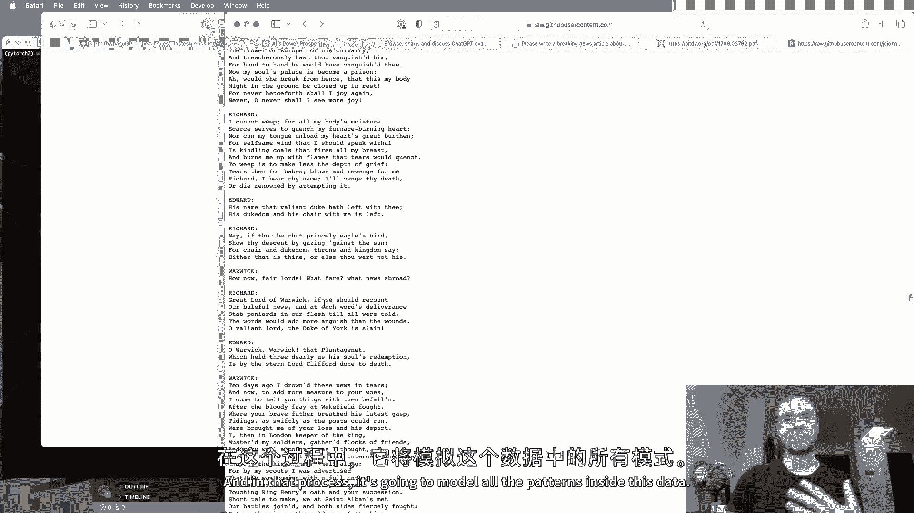

一旦我们训练好系统，我想给你一个预览。我们可以生成无限的莎士比亚作品。当然，这是一种看起来有点像莎士比亚的伪作品。抱歉，有一些问题我无法解决。你可以看到这是一个字符接一个字符地进行。

这有点像预测莎士比亚式的语言。所以，确实，我的主啊。景象离去，再次，国王带着我可贵的诅咒而来。然后，特拉尼奥说了一些别的，等等。这正是通过变换器以类似的方式生成的，像在聊天 GPT 中一样。在我们的例子中，字符是逐个输出的。

令牌就像是这些小的子词片段。所以它们不是按词级别的，而是更像是词块级别的。我已经编写了整个代码来训练这些变压器。它在一个您可以找到的 GitHub 仓库中，名为 NanoGPT。

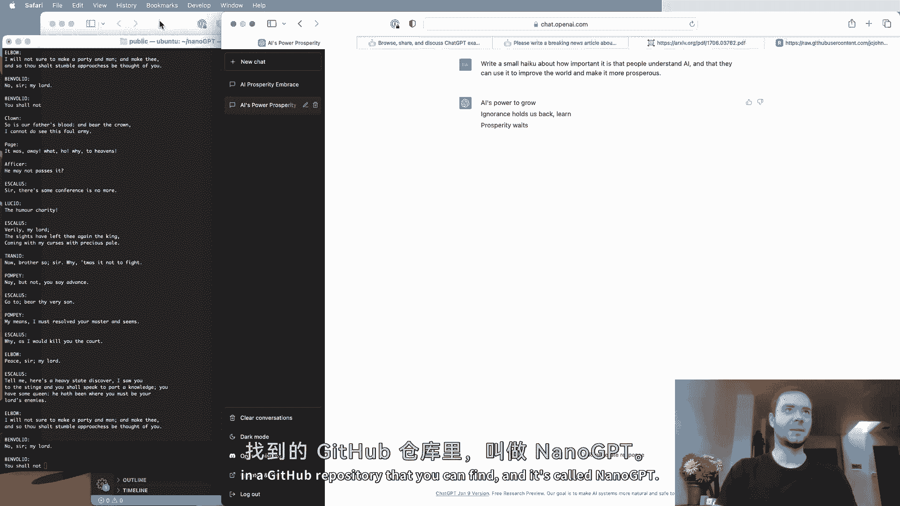

NanoGPT 是一个您可以在我的 GitHub 上找到的仓库。它是一个用于训练变压器模型的任何文本的仓库。我认为这很有趣，因为有很多方法可以训练变压器，但这是一个非常简单的实现。所以它只是两个各有 300 行代码的文件。

一个文件定义了 Chachi P.T. 模型，变压器；一个文件在给定文本数据集上训练它。在这里，我展示了如果您在开放网页文本数据集上训练它，这是一组相当大的网页数据集，那么我就能复现 GPT-2 的性能。

GPT-2 是 OpenAI 于 2017 年推出的早期版本，如果我没记错的话。我到目前为止只复现了最小的 2400 万参数模型。但基本上这只是证明代码库的安排是正确的。我能够加载 OpenAI 后来发布的神经网络权重。

所以您可以在 NanoGPT 中查看完成的代码。

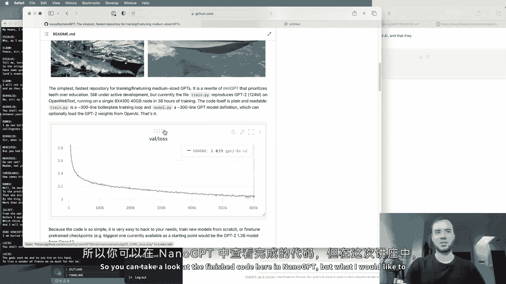

我想在这次讲座中基本上从零开始编写这个仓库。所以我们将从一个空文件开始，逐步定义变压器。

我们将对微型莎士比亚数据集进行训练。

然后我们将看到如何生成无尽的莎士比亚文本。当然，这可以复制粘贴到您喜欢的任何任意文本数据集中。但我的目标实际上是让您理解并欣赏聊天 GPT 是如何工作的。

其实只需要具备 Python 的熟练程度，以及一些基本的微积分和统计学知识。如果您还看过我在同一 YouTube 频道上的早期视频，特别是我的“制作更多”系列，其中定义了更小更简单的神经网络语言模型，那会更有帮助。所以多层感知机等。这真的介绍了语言模型和框架。

然后在这个视频中，我们将专注于变压器神经网络本身。

好的，我在这里创建了一个新的 Google collab Jupyter notebook。这将让我方便地与您分享我们将共同开发的代码，以便您可以跟着一起学习。这将在稍后的视频描述中提供。现在我已经做了一些初步工作。我在这个网址下载了微型莎士比亚数据集，您可以看到它大约是一个 1 兆字节的文件。

然后我打开`input.txt`文件，读取所有文本为一个字符串。我们看到大约处理了 100 万个字符。如果我们打印出前 1000 个字符，基本上是你所期望的。这是微型莎士比亚数据集的大约前 1000 个字符。

目前为止都很好。接下来，我们将这段文本视为 Python 中的字符序列。当我在其上调用`set`构造函数时，我将获得文本中出现的所有字符的集合。然后我调用`list`来创建这些字符的列表，而不是仅仅得到一个集合，这样我就有了一个排序，任意排序。然后我进行排序。因此，我们得到了整个数据集中出现的所有字符，并且它们是有序的。

现在它们的数量将是我们的词汇量。这些是我们序列中可能的元素。当我在这里打印字符时，总共有 65 个字符，包括一个空格字符和各种特殊字符，以及大写和小写字母。这就是我们的词汇量，也就是模型可以看到或输出的可能字符。

好的，接下来我们想开发一些策略来分词输入文本。当人们说分词时，他们的意思是将原始文本作为字符串转换为某些可能元素的整数序列。因此，在这里作为示例，我们将构建一个字符级语言模型，所以我们简单地将单个字符翻译为整数。让我给你展示一段代码，能为我们做到这一点。

我们正在构建编码器和解码器，让我来讲讲这里发生的事情。当我们编码一个任意文本（比如“hi there”）时，我们将收到一个表示该字符串的整数列表。例如 46、47 等。然后我们还有反向映射，因此我们可以将这个列表解码以获取完全相同的字符串。所以这实际上就是将任意字符串转换为整数然后再转换回来的过程，而对于我们来说，是在字符级别进行的。

现在实现这一点的方法是我们遍历所有字符，并创建一个从字符到整数的查找表，反之亦然。然后，为了编码某个字符串，我们简单地逐个翻译所有字符，解码时使用反向映射并将其连接起来。

现在这只是许多可能编码或许多可能分词器中的一种，且它非常简单。但在实践中，人们提出了许多其他方案。例如，谷歌使用的是句子片段（sentence piece），它也将文本编码为整数，但使用不同的方案和不同的词汇量。句子片段是一种子词分词器，这意味着你不是编码整个单词，也不是单独编码每个字符。

这是一个子词单元级别，通常在实践中被采用。例如，OpenAI 也有一个名为 tick token 的库，使用字节对编码分词器，而这就是 GPT 所使用的。你也可以将单词编码为像“地狱世界”这样的整数列表。

作为示例，我在这里使用 tick token 库。我从 GPT 2 获取编码，或者说是用于 GPT 2 的编码。它们不是只有 65 个可能的字符或标记，而是有 50,000 个标记。因此，当它们对同一个字符串“高”进行编码时，我们仅得到三个整数的列表。

但是这些整数并不在 0 到 64 之间。它们在 0 到 50,000 之间，256。因此，基本上，你可以权衡代码本的大小和序列长度。你可以拥有非常小的词汇量的非常长的整数序列，或者拥有非常大的词汇量的短整数序列。

因此，通常人们在实践中使用这些子词编码，但我想保持我们的分词器非常简单。因此，我们使用字符级分词器，这意味着我们有非常小的代码本。我们有非常简单的编码和解码函数，但因此我们确实得到非常长的序列。但这是我们在本讲座中坚持的级别，因为这是最简单的做法。

现在我们已经有效地拥有一个编码器和解码器，也就是分词器，可以对整个莎士比亚训练集进行分词。因此，这里有一段代码可以做到这一点。我将开始使用 PyTorch 库，特别是 PyTorch 库中的 Torque.Tensor。我们将把所有文本编码，并将其包装成 Torque.Tensor，以获取数据张量。

当我查看前 1000 个字符或 1000 个元素时，数据张量看起来是这样的。因此，我们看到有一个庞大的整数序列，这个整数序列基本上是前 1000 个字符的完全对应翻译。

我相信，例如，零是一个换行符，而一可能是一个空格，虽然不 100%确定。但从现在开始，整个文本数据集将重新表示为一个拉伸成非常长的整数序列。在继续之前，让我再做一件事。我想将数据集分为训练和验证集。具体来说，我们将取前 90%的数据集，将其视为变换器的训练数据。

我们将保留最后 10%的数据作为验证数据。这将帮助我们理解模型的过拟合程度。因此，我们基本上会隐藏并保留验证数据，因为我们不想仅仅完美记忆这段莎士比亚文本。我们希望神经网络能够生成莎士比亚风格的文本。

所以它产生真实的、被隐藏的真正的莎士比亚文本的可能性应该相当大。因此我们将用这个来了解过拟合。好的，现在我们想开始将这些文本序列或整数序列插入变压器，以便它可以训练并学习这些模式。现在重要的是要意识到，我们永远不会一次性将整个文本输入变压器。

这在计算上非常昂贵且不可行。因此，当我们实际上在许多这些数据集上训练变压器时，我们只处理数据集的一小部分。当我们训练变压器时，我们基本上是从训练集中随机抽样小块，并一次只训练这些块。

这些块基本上有某种长度和最大长度。通常在我写的代码中，最大长度被称为块大小。你可以在不同的名称中找到，比如上下文长度之类的。我们先从块大小为八开始。让我看一下第一个训练数据字符。

第一个块的大小加一个字符。稍后我会解释为什么加一。所以这是训练集中序列中的前九个字符。我要指出的是，当你像这样抽样一段数据时，比如说这九个字符来自训练集。

这实际上包含多个例子。因为这些字符彼此相连。所以当我们将其插入变压器时，它将同时训练以在每个位置进行预测。

现在在一段九个字符中，实际上有八个单独的例子被打包在其中。所以在 18 的上下文中，47 幸运地接下来。在 18 和 47 的上下文中，56 接下来。依此类推。这就是这八个单独的例子。让我用代码来具体说明。

X 是变压器的输入。它将只是第一个块大小的字符。Y 将是下一个块大小的字符。因此它偏移了一位。这是因为 Y 是输入中每个位置的目标。然后在这里，我正在遍历所有的块作为权重。

上下文始终是 X 中的所有字符直到 T 并包括 T。目标始终是目标数组 Y 中的目标字符。所以让我运行这个。基本上，它说明了我用文字所说的内容。这些是我们从两个字符中抽样得到的九个字符块中隐藏的八个例子。我要提到一件事。

我们在这里对所有八个示例进行训练，上下文从一个到块大小之间。我们进行这样的训练不仅是出于计算原因，因为我们恰好已经有了序列或类似的情况。这不仅仅是为了效率，也是为了让变换器网络习惯于看到从一个到块大小的上下文，并希望变换器能习惯于看到之间的所有内容。

这在推断时会很有用，因为在我们采样的同时，我们可以在生成时仅用一个字符的上下文开始采样。然后变换器知道如何预测下一个字符，最多可以使用一个字符的上下文。因此，它可以预测到块大小之前的所有内容。

在块大小之后，我们必须开始截断，因为变换器在预测下一个字符时永远不会接收到超过块大小的输入。好的，我们已经看过了将馈送到变换器的张量的时间维度。

还有一个需要关注的维度，那就是批次维度。因此，当我们对这些文本块进行采样时，我们实际上会在每次将它们输入到变换器时，有许多批次的多个文本块始终堆叠在一个张量中。

这主要是出于效率考虑，以便我们能让 GPU 保持忙碌，因为它们在数据的并行处理方面非常出色。因此，我们希望同时处理多个块。这些块是完全独立处理的，它们之间不进行交流。所以让我基本上概括一下并引入一个批次维度。这是一段代码。

让我运行一下，然后我将解释它的功能。因为我们将开始在数据集中的随机位置进行采样以提取块，所以我们会设置种子，以便在随机数生成器中，这里看到的数字和你稍后尝试重现时看到的数字是相同的。

现在这里的批次大小是我们每次前向和反向传播变换器时处理的独立序列的数量。正如我所解释的，块大小是进行这些预测的最大上下文长度。假设批次大小为四，块大小为八，下面是我们如何获取任何任意划分的批次。如果划分是训练划分，那么我们将查看训练数据，否则是一个值。

这给我们提供了数据数组。然后，当我生成随机位置以抓取一个块时，实际上我会生成与批次大小相同数量的随机偏移量。因此，因为这是为了，我们将生成四个在零到数据长度减去块大小之间的随机数字。所以这只是训练集中的随机偏移量。然后 X 正如我所解释的。

是从 I 开始的前块大小字符。Y 是其偏移量加一。所以只需加一。然后我们将获取每一个整数 I 在 I X 中的那些块，并使用 torch.stack 将这些一维张量叠加，就像我们在这里看到的。然后我们将它们堆叠成行。因此，它们都成为四乘八张量中的一行。

所以这是我打印它们的地方。当我抽样一个批次 XB 和 YB 时，输入变换器现在是输入 X，一个四乘八的张量，表示八列的行。每个张量都是训练集的一部分。目标则在关联数组 Y 中，它们会在最后传入变换器，以创建损失函数。

因此，它们会给我们每个位置 X 中的正确答案。这四个是独立的行。就像我们之前所说的，这个四乘八的数组总共有 32 个示例。就变换器而言，它们是完全独立的。因此，当输入是 24 时，

目标是 43，或者说在 Y 数组中的确是 43。当输入是 2443 时，目标是 58。或者像当它是 52，58，1 时，目标是 58。你可以看到这些是明确的。这 32 个独立的示例被打包成输入 X 的一个批次。然后所需的目标在 Y 中。因此，现在这个整数张量 X 将传入变换器。

这个变换器将同时处理所有这些示例，然后查找在张量 Y 的每一个位置中预测的正确整数。好的，现在我们有了想要输入到变换器中的输入批次。

让我们基本上开始将这些输入到神经网络中。现在我们将从最简单的神经网络开始。在我看来，语言建模的情况下，最简单的就是 Bagram 语言模型。我们在我的《深入学习》系列中已经详细讨论了 Bagram 语言模型。

所以在这里我将加快速度，让我们直接实现一个 PyTorch 模块来实现 PyGram 语言模型。我正在导入 PyTorch 和 N 模块以确保可重复性。然后在这里我构建一个 Bagram 语言模型，这是 N 模块的一个子类。然后我调用它，传入输入和目标。我只是在打印。

现在当输入和目标到达时，你会看到我只是获取索引。输入 X 在这里，我重新命名为 IDX。我只是将它们传入这个令牌嵌入表中。那么这里发生的事情是，在构造函数中，我们正在创建一个令牌嵌入表。它的大小是词汇表大小乘以词汇表大小。我们正在使用 N.dot.embedding。

这实际上是一个非常简单的包装，基本上是一个形状为词汇大小乘词汇大小的张量。当我们在这里传递 IDX 时，我们输入的每个整数将引用这个嵌入表。它将提取出与其索引对应的嵌入表的一行。

所以这里的 24 将会到嵌入表中，提取出第 24 行。然后 43 会到这里，提取出第 43 行，等等。然后 PyTorch 将把所有这些安排成一个按批次、时间和通道的张量。在这个例子中，批次是四，时间是八，C，也就是通道，是词汇大小或 65。

因此，我们将提取所有这些行，并将它们排列成一个 B 乘 T 乘 C 的格式。现在我们将把这些解释为 logits，这基本上是序列中下一个字符的分数。因此，这里发生的事情是我们根据单个 token 的个体身份来预测接下来会发生什么。

你可以这样做，因为目前这些 tokens 彼此之间没有交流。它们没有看到任何上下文，除了它们自己。所以我是 token 编号五。然后我实际上可以仅凭知道自己是 token 五，就做出相当不错的预测，因为某些字符在技术场景中确实会跟随其他字符。

所以我们在“Make More”系列中看到了这一点的更深入的内容。如果我现在运行这个，我们就可以得到预测、分数以及每一个四乘八位置的 logits。现在我们已经对接下来会发生什么做出了预测，我们希望评估损失函数。

在“Make More”系列中，我们看到测量损失或预测质量的一个好方法是使用负对数似然损失，它在 PyTorch 中也以交叉熵的名义实现。因此我们在这里想要做的是，损失是对预测和目标的交叉熵。这测量了 logits 与目标的质量。换句话说。

我们有下一个字符的身份。那么基于 logits，我们预测下一个字符的效果如何？

从直观上看，logits 的正确维度，取决于目标，应该有一个很高的数字。而所有其他维度应该是很低的数字。现在，问题是这实际上不会运行，这是我们想要的。我们基本上想输出 logits 和损失。这就是我们想要的，但不幸的是。

这实际上不会运行。我们会收到错误信息，但直观上我们想要测量这个。现在当我们查看 PyTorch 的交叉熵文档时，我们试图以功能形式调用交叉熵。这意味着我们不必为此创建一个模块。

但在查看文档时，你需要关注 PyTorch 如何期望这些输入。基本上，这里存在的问题是，PyTorch 期望如果你有多维输入（我们确实有），因为我们有 B 乘以 T 乘以 C 的张量，它实际上希望通道是这里的第二维度。因此，它想要的是 B 乘以 C 乘以 T，而不是 B 乘以 T 乘以 C。

所以这只是 PyTorch 如何处理这些输入的细节。因此，我们实际上不想处理这个问题。我们要做的是基本上重新调整我们的 logits。因此这是我喜欢做的。我喜欢给维度命名。所以 logits.shape 是 B 乘以 T 乘以 C，并解包这些数字。然后我们可以说 logits 等于 logits.view。

我们希望它是 B 乘以 C。 B 乘以 T 由 C 计算。所以仅仅是一个二维数组。我们将把所有这些位置展开成一维序列，并将通道维度作为第二维度保留。所以我们就像是将数组拉伸成二维的。

在这种情况下，它将更好地符合 PyTorch 对其维度的期望。现在我们必须对目标做同样的事情。因为当前目标的形状是 B 乘以 T，而我们希望它仅为 B 乘以 T。所以是一维的。或者你也可以一直使用 -1，因为如果你想布局，PyTorch 会猜测这应该是什么。但让我明确地说 pew 乘以 T。一旦我们重新调整，这将与交叉熵情况匹配。

然后我们应该能够评估我们的损失。好的，现在可以进行损失评估。现在我们看到损失是 4.87。由于我们有 65 个可能的词汇元素，我们实际上可以猜测损失应该是多少。特别是我们已经详细讨论了负对数似然。我们期望的是对 1 除以 65 取对数，并对此取负。

所以我们期望损失大约为 4.17。但我们得到的是 4.87。这告诉我们初始预测并不是非常分散。它们有一点熵，因此我们猜测错误。所以是的，但实际上我们能够评估损失。

好的，现在我们可以在一些数据上评估模型的质量。我们还希望能够从模型生成内容。所以让我们进行生成。现在我将稍微快一点，因为我在之前的视频中已经讲过了这些内容。这里是模型的生成函数。因此我们在这里使用相同类型的输入 idx。

基本上，这是某些字符在批次中的当前上下文。因此，它也是 B 乘以 T，生成的任务就是将这个 B 乘以 T 扩展到 B 乘以 T 加 1 加 2 加 3。所以它基本上是在时间维度中继续生成所有批次维度。因此这是它的工作。我们将为最大新标记这样做。

所以你可以看到底部会有一些东西。但是在底部，无论预测是什么，都会与之前的 idx 连接。在时间维度的第一维上创建一个 b by t 加 1。这就成了一个新的 idx。因此，generate 的工作就是将 b by t 变为 b by t 加 1 加 2 加 3。

我们可以想要的最大新令牌数量。这是模型的生成过程。现在在生成过程中我们在做什么？我们正在获取当前索引，得到预测。这些在 logits 中。然后这里的损失将被忽略，因为我们不使用它。

我们没有可以作为对比的真实目标。一旦我们得到了 logits，我们只关注最后一步。所以我们将从时间维度中提取最后一个元素，而不是 b by t by c。因为这些是对下一个内容的预测。

这给我们提供了 logits，我们通过 softmax 将其转换为概率。然后我们使用多项分布从这些概率中进行采样。我们请求 PyTorch 给我们一个样本。因此 idx next 将变成 b by 1。因为在每个批次维度中，我们将对下一个内容有一个单一的预测。

所以这个 non-samples 等于 1 将使这个变为 1。然后我们将根据给定的概率分布，从采样过程中得到的整数取出，并将这些整数连接在当前的整数流之上。这给我们提供了 b by t 加 1。然后我们可以返回这个结果。

这里有一点，你看到我如何调用 self 的 idx，这将最终进入 forward 函数。我没有提供任何目标。因此，目前这将产生一个错误，因为目标没有提供。所以目标必须是可选的。默认情况下，目标是 none。如果目标是 none，那么就没有损失可创建。所以损失就是 none。

但其他所有事情发生后，我们可以创建一个损失。所以如果我们有目标，我们提供它们并得到一个损失。如果没有目标，我们只会得到 logits。因此，这里将从模型生成。现在让我们试试这个。哦，我这里还有另一个教练，它将从模型生成。

好吧，这有点疯狂，或许让我来帮你理清一下。这些就是 idx，对吧？我创建的批次将只有一次，即 1。所以我创建了一个 1 by 1 的张量，并且它保存了一个零。数据类型是整数。所以零将是我们启动生成的方式。

请记住，零是表示换行符的元素。因此，将其作为序列中的第一个字符输入是合理的。所以它将是我们将在这里输入的 idx。然后我们将请求 100 个令牌。然后生成将继续这一过程。现在，由于生成是在批量级别上工作的，我们必须索引到零维度，以基本上拔掉唯一存在的批量维度。

然后这给我们时间步长，实际上是一个一维数组，包含所有索引，我们将其转换为简单的 Python 列表。所以我们要去根函数。然后我们要去根函数。然后我们要去根函数。然后我们要去根函数。然后我们要去根函数。然后我们要去根函数。

然后我们要去根函数。然后我们要去根函数。然后我们要去根函数。这个函数被编写得比较通用，但现在有点荒谬，因为我们输入了所有这些，我们正在构建这个上下文并将它们连接在一起。

我们总是将它全部输入模型。但这有点荒谬，因为这只是一个简单的背景模型。所以例如，要对 K 进行预测，我们只需要这个 W。但实际上我们输入到模型中的是整个序列。然后我们只查看最后一部分并预测 K。

我之所以以这种方式编写，是因为现在这是一个背景模型。但我希望保持这个函数固定，并希望在我们的字符实际上更深入历史时它也能正常工作。因此，我们希望以这种方式进行处理。这是一个简单的评论。所以现在我们看到这是随机的。那么让我们训练模型，使其变得不那么随机。好的。

现在让我们训练模型。首先我要做的是创建一个 PyTorch 优化对象。所以我们在这里使用的是优化器 addmw。在这个系列中，我们只使用了简单的 castigrade。你可以使用 SGD 获得的最简单的优化器。但我想使用 addmw，这是一种更高级、更流行的优化器，效果非常好。

对于学习率的典型良好设置，大约是负 4 的 3。但对于像这里这样非常小的网络，你可以使用更高的学习率，可能是负 3 的 1 甚至更高。让我创建一个优化器对象，它将基本上接受梯度并使用梯度更新参数。然后，我们的批量大小上面只有 4。让我们实际使用一个更大的，比如说 32。

然后在若干步骤中，我们正在采样一批新的数据。我们在评估损失。我们将上一步的所有梯度清零。获取所有参数的梯度，然后使用这些梯度更新我们的参数。这是我们在“制作更多”系列中看到的典型训练循环。

让我现在运行这个大约 100 次迭代，看看我们会得到什么样的损失。我们从大约 4.7 开始，现在降到大约 4.6、4.5 等等。因此，优化确实在发生，但我们试着增加迭代次数，只在最后打印结果。因为我们可能想训练一百次。好的，所以我们降到了大约 3.6。

大约降到 3。这是最不稳定的优化。好的，它在工作。我们就做 10,000。然后从这里我们想复制这个，希望能得到一些合理的东西。当然这不会是来自巴格拉姆模型的莎士比亚，但至少我们看到损失在改善。希望我们能期待一些更合理的结果。好的，我们降到了大约 2.5 左右。

让我们看看我们得到了什么。好的，显然在这里有了戏剧性的改善。那么我就增加一下令牌的数量。好的，所以我们开始得到一些至少像合理的东西。当然不是莎士比亚，但模型正在进步。这是最简单的模型。所以我现在想做的是，显然这是一个非常简单的模型，因为令牌之间并没有相互交流。

所以鉴于之前生成的上下文，我们只看最后一个字符来预测接下来会发生什么。因此，这些令牌必须开始相互交流，并弄清楚上下文中有什么，以便能够更好地预测接下来会发生什么。

这是我们将启动变压器的方式。好的，接下来我把我们在这个 Jupyter notebook 中开发的代码转换为脚本。

我这样做是因为我只是想简化我们的中间工作，这只是我们目前的最终项目。因此在顶部我放置了我们定义的所有参数。我引入了一些参数，稍后会对此进行说明。否则，这些内容应该是可识别的。可重复性，读取数据。

获取编码器和解码器，创建训练数据的分割。使用那种像数据加载器的东西，它可以获取输入和目标的一个批次。这是新的，我稍后会谈到。现在这是我们开发的背景语言模型，它可以前向传播并给我们一个 logit 和损失，同时也可以生成。接着我们创建优化器，这是训练循环。

所以这里的一切看起来应该非常熟悉。现在我添加的一些小东西。第一，我添加了在你有 GPU 的情况下运行的能力。如果你有 GPU，那么你可以使用 CUDA，而不是仅仅使用 CPU，一切都会快很多。当设备变为 CUDA 时，我们需要确保在加载数据时将其移动到设备上。

当我们创建模型时，我们想要将模型参数移动到设备上。作为一个例子，这里我们有嵌入表，它里面有一个权重存储了查找表。因此，将其移动到 GPU，以便这里的所有计算都在 GPU 上进行，可以更快。最后，当我创建上下文以生成时，我必须确保在设备上创建。

第二，我引入了在训练循环中这个事实。这里我只是在训练循环中打印损失项。

但这是一种非常嘈杂的当前损失测量，因为每个批次都会或多或少地运气好坏。

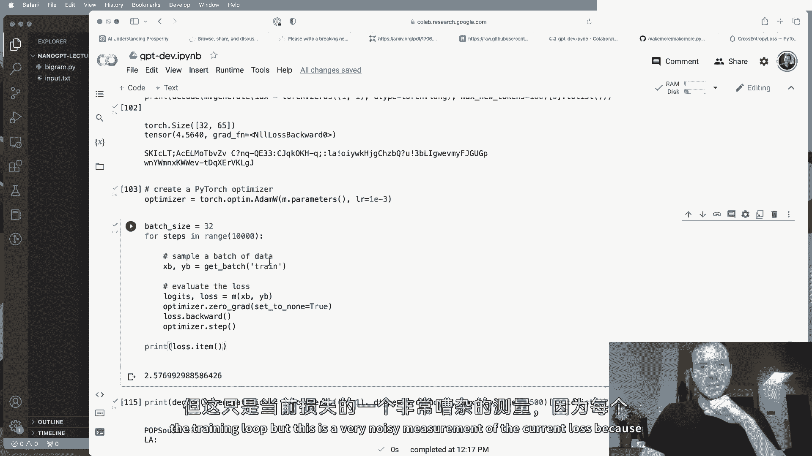

因此，我通常想要做的是有一个估计损失函数，估计损失基本上上升到这里。它平均多个批次的损失。因此，特别是我们将迭代 eval iter 次数，并基本上获取我们的损失，然后获取两个分割的平均损失。因此，这将减少很多噪声。因此，在这里我们称之为估计损失，我们将报告更准确的训练和验证损失。

现在当我们回到上面时，你会注意到这里有几个事情。我将模型设置为评估阶段，而在这里我将其重置为训练阶段。现在对于我们当前的模型，这实际上并不做任何事情，因为这个模型里面只有这个和点嵌入。这个网络在评估模式和训练模式下的行为是相同的。

我们没有丢弃层，没有批归一化层等。但考虑神经网络处于什么模式是个好习惯，因为某些层在推理时间或训练时间的行为会有所不同。此外，还有这个上下文管理器 torch.no_grad，这只是告诉 PyTorch 在这个函数内部发生的所有事情，我们不会调用反向传播。因此，PyTorch 在内存使用上可以更加高效，因为它不需要存储所有中间变量，因为我们从不调用反向传播。

因此，这样会更节省内存。因此，告诉 PyTorch 我们不打算进行反向传播也是一个好的实践。所以现在这个脚本大约有 120 行代码，这就是我们的启动代码。我将其命名为 gram.py，并将稍后发布。

现在运行这个脚本在终端中给我们输出，结果大致如下。当我运行这段代码时，它给了我训练损失和验证损失，我们看到它转变为大约 2.5，使用的是字组模型。然后这是我们在最后产生的样本。所以我们将所有内容都打包在脚本中，现在我们可以很好地进行迭代。

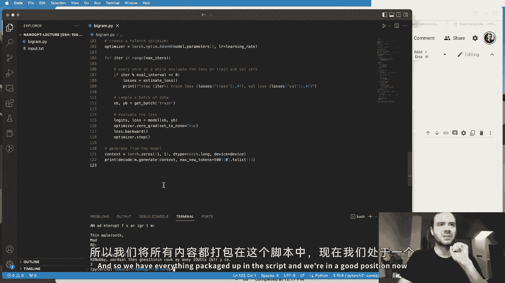

好的，我们几乎准备好开始编写我们的第一个自注意力模块来处理这些令牌。现在在我们真正到达那里之前，我想让你熟悉一个在变压器的自注意力中使用的数学技巧。这实际上是高效实现自注意力的核心。我想用这个玩具示例来熟悉这个操作，一旦我们真正到达那里，这会让事情更加清晰。

再次在脚本中。因此，让我们创建一个 B 乘 T 乘 C 的矩阵，其中 B、T 和 C 在这个玩具示例中分别为 4、8 和 2。这基本上是通道，我们有批次，还有时间分量，以及序列中每个点的一些信息。

所以 C。现在我们想要这些令牌。我们在一个批次中有最多 8 个令牌，而这 8 个令牌目前并没有彼此交流，我们希望它们能够互相沟通。我们希望将它们耦合起来。特别是，我们想要以非常特定的方式进行耦合。例如，第五个位置上的令牌不应与第六个位置的令牌进行交流。

第七和第八个位置是因为它们在序列中是未来的令牌。第五个位置上的令牌只应与第四、第三、第二和第一个位置上的令牌进行交流。因此，信息仅从之前的上下文流向当前时间步。我们无法从未来获得任何信息，因为我们正要尝试预测未来。

那么令牌之间沟通的最简单方式是什么？

我认为最简单的方式是，如果我们是第五个令牌，我想与我的过去进行交流。我们可以做的最简单的方法就是对所有前面的元素进行平均。例如，如果我是第五个令牌，我会想要获取构成我步骤的信息通道，同时也获取来自第四步、第三步、第二步和第一步的通道。

我想将这些值进行平均，这将成为总结我历史的特征向量。当然，仅仅求和或平均是极其弱的交互方式。这种交流是极其损失的。我们已经丢失了很多关于所有这些令牌的空间排列的信息。但这没关系。我们稍后将看到如何找回这些信息。

目前我们希望为每一个批次元素独立地进行操作。对于序列中的每个标记，我们希望现在计算所有先前标记中所有向量的平均值，以及这个标记。所以让我们写出来。我这里有一个小片段，而不是只是随意翻弄，让我复制粘贴并进行讲解。换句话说，我们将创建 X，BOW 是词袋的缩写。

因为词袋是人们在平均事物时使用的术语之一。所以这只是一个词袋。基本上在这八个位置上的每一个都有一个单词存储，我们正在进行一个词袋的操作。所以仅仅是平均。因此，在开始时我们将其初始化为零。然后我在这里做一个 for 循环，所以我们还没有高效。这是后来的事情。

但目前我们只是独立地迭代所有的批次维度。迭代时间。然后之前的标记位于这个批次维度。然后所有内容包括第十个标记。因此，当我们以这种方式切割 X 时，X-preve 的形状将是过去有多少个元素。当然还有 C。

所以从这些小标记中提取的所有二维信息。这是我当前序列中之前的一组标记。然后我只是对零维进行平均或求均值。因此，我在这里平均时间。最终我将得到一个一维的 C 向量，我将把它存储在 X 的词袋中。

所以我可以运行这个，这不会非常有信息性，因为。让我们看看。这是 X 的零。所以这是零批次元素，然后是 X 在零的地方。现在你看到这里的第一个位置，这两个是相等的。这是因为我们只是对这个一个标记进行平均。

但这里的这个现在是这两个的平均值。而现在这个是这三个的平均值，依此类推。因此最后一个是所有这些元素的平均值。这是典型的平均值，所有标记的平均现在得出了这个结果。所以这一切都很好，但这非常低效。现在的窍门是我们可以非常。

非常高效地使用矩阵乘法来做到这一点。这就是数学上的技巧。让我给你看看我的意思。让我们用一个玩具示例来做。让我运行它，我会解释。我这里有一个简单的三乘三的全 1 矩阵。一个三乘二的随机数矩阵 B。

还有一个矩阵 C，它将是三乘三乘以三乘二，这将得到一个三乘二的结果。所以这里我们只是使用矩阵乘法。A 乘以 B 得到 C。好的。那么 C 中的这些数字是如何得出的呢？对了，左上角的这个数字是 A 的第一行与 B 的第一列的点积。

由于 A 的所有行现在都是一次，因此与 B 的这一列的点积将只是对这一列的和。所以 2 加 6 加 6 等于十四。C 中上面的元素也是这里的第一列。A 的第一行现在乘以 B 的第二列。

所以七加四加五等于十六。现在你看到这里有重复的元素。这个十四再次出现是因为这一行再次是全部为一，并且它在乘以 B 的第一列。所以我们得到了十四。而这个也是如此。所以这里的最后一个数字是最后一行与最后一列的点积。这里的诀窍如下。这只是一个无聊的数字。

这只是一个全是 1 的无聊数组。但是 torch 有一个叫做 tril 的函数，短语是三角形的，类似的东西。你可以将其包装在 torch 中，它将只返回这个的下三角部分。好的。所以现在它将基本上将这些数值归零。因此我们只得到下三角部分。

那么如果我们这样做会发生什么呢？所以现在我们将得到这样的 A 和这样的 B。那么我们在 C 中得到的是什么？这个数字是什么？

好吧，这是第一行乘以第一列。因为这些是零，所以这些元素现在被忽略。因此我们只得到 2。然后这里的数字是第一行乘以第二列。因为这些是零，它们被忽略，所以只有 7。这是 7 乘以这个 1。

但看看这里发生了什么，因为这是 1 而这些是零。我们最终发生的事情是我们只是抽取了 B 的这一行，这就是我们得到的。现在这里我们有 1、1、0。因此这里 1、1、0 与这两列的点积将给我们 2 加 6，结果是 8，7 加 4，结果是 11。因为这是 1、1、1，我们最终得到了它们的和。

所以基本上，取决于我们这里有多少个 1 和 0，我们基本上正在对这些行的变量数量进行求和，然后将其存储到 C 中。因此目前我们在进行求和，因为这些是 1，但我们也可以进行平均，对吗？

你可以开始看到我们如何以增量方式对 B 的行进行平均。因为我们不需要，我们基本上可以对这些行进行归一化，使它们的和为 1，然后我们会得到一个平均值。所以如果我们取 A，然后我们让 A 等于 A 除以 torch.dot.sum(A, 1 维) 然后我们就保持它们为真。因此广播将会有效。所以如果我从中读取，你会看到这些行现在的和为 1。

所以这一行是 1，这一行是 0.5。这里我们得到三分之一。那么当我们进行 A 与 B 的乘法时，我们得到什么呢？

这里我们只获取第一行。这里现在我们获取前两行的平均值。好的，所以二和六的平均是四，四和七的平均是五和五。在底部这里我们现在获取这三行的平均值。所以 B 的所有元素的平均现在被存储在这里。

所以你可以看到，通过操作这个乘法矩阵的这些元素，然后将其与任何给定矩阵相乘。我们可以以这种增量的方式进行这些平均值，因为我们只获取并可以根据 A 的元素进行操作。

好的，这非常方便，所以我们回到这里，看看如何对其进行向量化，并利用我们所学的内容使其更加高效。因此，特别地，我们将生成一个数组 A，但在这里我会将其称为权重的简称。

但是这是我们的 A，这就是我们希望对每一行进行多少平均处理，并且它将是一个平均值，因为你可以看到这些行的和为一。所以这是我们的 A，然后在这个例子中，当然我们的 B 是 X。那么现在将会发生什么呢，我们将有一个 X bow two。这个 X bow two 将会乘以我们的 X。

所以我们想一下，这个方式是 T 乘 T，而这是在 PyTorch 中进行 B 乘 T 乘 C 的矩阵乘法。它给我们的是什么形状，所以 PyTorch 会来这里，我们会看到这些形状并不相同。因此，它将在这里创建一个批次维度，这是一个批量矩阵乘法。因此，它将在所有批次元素中并行且单独地应用这个矩阵乘法。

然后对于每个批次元素，将有一个 T 乘 T 乘 T 乘 C，正如我们下面所做的。因此，这将现在生成 B 乘 T 乘 C，X bow two 现在将变得与 X bow 相同。所以我们可以看到 Torch.dot.allclose(X bow 和 X bow two 应该为真。现在，这种方式就像是告诉我们，这实际上是相同的。

所以 X bow 和 X bow two 如果我只打印它们。好的。我们不能仅仅盯着看，但让我尝试 X bow 基本上在零元素处，X bow two 在零元素处。因此只看第一批，我们应该看到这个和那个应该是相同的，它们确实是。对，所以这里发生了什么，关键是我们能够使用批量矩阵乘法来进行这个聚合。

这是一个加权聚合，权重在这个 T 乘 T 的数组中指定。我们基本上在进行加权和，这些加权和根据这里的权重，呈现出这种三角形的形式。因此，这意味着在第 T 个维度的一个标记只会获取来自其周围标记的信息。所以这正是我们想要的。最后，我想再用一种方式重写它，我们将看到这为何有用。

这是第三个版本，它与第一和第二个版本相同。但让我详细说明一下。它使用 softmax。所以这里的 trill 是这个下三角矩阵。权重一开始全是零。好的，如果我刚开始打印权重，它都是零。然后我使用 masked fill。所以这在做的事情是将所有元素中 trill 等于零的设置为负无穷。

所有 trill 为零的元素现在将变为负无穷。因此我们得到了这个结果。然后这里的最后一行是 softmax。如果我在每一行上进行 softmax，维度是负一，那么如果我对每一行做 softmax，这会有什么效果呢？

嗯，softmax 也像是一种归一化操作。所以剧透一下，你会得到完全相同的矩阵。让我再回到 softmax。回想一下，在 softmax 中，我们将对每一个进行指数运算，然后除以总和。因此，如果我们对这里的每个元素进行指数运算，我们将得到一个，而其他地方基本上都是零零零零零零。

当我们归一化时，我们只会得到一个。在这里我们将得到一，一，然后是零，接着 softmax 将再次进行除法，这将给我们 0.5，依此类推。这也是生成这个掩码的相同方式。现在，这个过程更有趣的原因，以及我们最终将在自注意力中使用它的原因是，这里的权重最初是零。你可以将其视为一种交互强度或亲和力。

基本上，这告诉我们我们希望从过去的每个令牌中聚合和平均多少信息。然后这一行表示过去的令牌不能通过将它们设为负无穷来进行通信。我们在说我们不会从那些令牌中聚合任何信息。因此，基本上这个过程经过 softmax 和加权，而这就是通过矩阵乘法进行的聚合。

现在你可以把这些零看作是我们目前设定的。但是简单预览一下，这些令牌之间的亲和力不会始终保持为零。它们将依赖于数据。这些令牌将开始互相观察，有些令牌会发现其他令牌或多或少地有趣。根据它们的值，它们会以不同的程度发现彼此有趣，我将称之为这些亲和力。

在这里，我们表示未来不能与过去沟通。我们将对它们进行限制。然后，当我们进行归一化和求和时，我们将根据彼此的有趣程度来汇聚它们的值。这就是自注意力的预览。总的来说，从这一整节内容来看，你可以通过使用下三角形式的矩阵乘法来对过去的元素进行加权聚合。下三角部分的元素告诉你每个元素在这个位置上融合的程度。

所以我们将利用这个技巧来开发自注意力块。

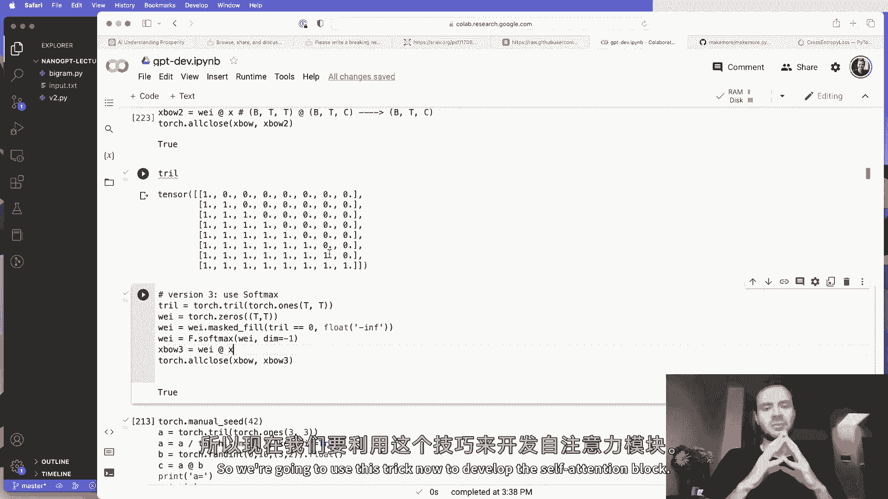

首先，让我们先快速处理一些预备知识。我感到有点困扰的是，你会看到我们如何将 vocab size 传递给构造函数。实际上没有必要这样做，因为 vocab size 已经在上面定义为全局变量。因此没有必要将这些东西传来传去。接下来，我想要做的是，我不想实际上创建。

我想在这里创造一种互动层次，我们不会直接使用嵌入来处理 logits，而是通过这个中间阶段，因为我们将开始扩展它。所以让我引入一个新变量并进行嵌入。这是“嵌入维度数量”的简称。因此，在这里的嵌入可以设为 32。这是来自 GitHub Copilot 的建议。

它也建议使用 32，这是一个不错的数字。所以这是一个嵌入表，并且只有 32 维的嵌入。因此，在这里这不会直接给我们 logits。相反，这将给我们 token 嵌入。这就是我将要称之为的。然后，从 token 嵌入到 logits，我们需要一个线性层。因此，自身。

lmhead，我们称其为语言建模头，是一个从嵌入到 vocab size 的线性层。然后，当我们切换到这里时，我们实际上将根据 Copilot 所说的内容获得 logits。现在我们必须小心，因为这个 C 和这个 C 是不相等的。这是一个嵌入 C，而这是 vocab size。所以我们可以说嵌入等于 C。

然后，这只是通过一个线性层创建了一个虚假的交互层，但这基本上应该能运行。因此我们看到这可以运行，目前看起来有些虚假，但我们将基于此继续构建。接下来，到目前为止，我们已经基于 IDX 中 token 的身份对这些索引进行了编码。接下来，人们通常会做的是，不仅仅编码这些 token 的身份，还包括它们的位置。

所以我们将有一个第二个位置嵌入表。在这里，自身的这个位置嵌入表是一个以块大小和嵌入为维度的嵌入。因此，从零到块大小减一的每个位置也将拥有自己的嵌入向量。接下来，让我从 IDX.shape 解码一个 b by t。

然后这里我们还会有一个暂停嵌入，即位置嵌入，这些是海龟排列。因此，这基本上就是从零到 t 减一的整数。所有这些从零到 t 减一的整数通过表格嵌入，以创建一个 t 乘 c 的矩阵。然后这里被重命名为 x，x 将是令牌嵌入与位置嵌入的相加。

在这里，广播操作将发挥作用，因此 b 乘 t 乘 c 加上 t 乘 c。这右对齐，增加了一个新的维度，并在批处理间进行广播。因此此时，x 不仅包含令牌的身份，还包含这些令牌出现的位置。由于我们只是有一个简单的二元模型，因此这目前并不是很有用，所以无论你处于第五个位置、第二个位置还是其他位置都无关紧要。

在这个阶段，所有内容都是平移不变的，因此目前这些信息不会有帮助，但随着我们对自注意力模块的深入研究，我们会看到这开始变得重要。

好的，现在我们进入自注意力的核心内容，因此这是理解此视频最重要的部分。我们将为一个单独的头实现一个小的自注意力。我们从我们之前的位置开始，所以所有这些代码都是熟悉的。现在我正在处理一个示例，将通道的数量从两个更改为 32，因此我们有一个四乘八的令牌排列。

每个令牌的信息目前是 32 维的，但我们只是在使用随机数。现在我们看到之前的代码对所有过去的令牌和当前令牌做了简单的权重平均。所以只是之前的信息和当前的信息在平均中混合在一起。这就是当前代码所实现的，并通过创建这个下三角结构来实现，使我们能够掩盖创建的这个权重矩阵。

所以我们将其掩盖，然后进行归一化，目前当我们初始化所有不同种类的令牌或节点之间的亲和力时，我将这些术语交替使用。因此，当我们初始化所有不同令牌之间的亲和力为零。

然后我们看到这个权重给了我们这样一个结构，每一行都有这些均匀的数字。因此，在这个矩阵乘法中，这使得我们做了一个简单的平均。现在我们实际上不希望这都是均匀的，因为不同的令牌会发现其他令牌的趣味程度不同，我们希望这取决于数据。例如，如果我是一个元音，那么也许我会在过去寻找辅音，并且我想知道那些辅音是什么，我希望这些信息流向我。

所以我现在想从过去收集信息，但我想以一种数据依赖的方式进行。这就是自注意力所解决的问题。自注意力解决这个问题的方式如下。每个位置的每个节点或每个标记将发出两个向量。

它将发出一个查询，并发出一个键。查询向量大致上是我在寻找什么？

键向量大致上是我包含了什么？

然后，我们在序列中获得这些标记之间亲和度的方式是我们基本上只需在键和查询之间进行点积。因此，我的查询与所有其他标记的所有键进行点积，这个点积现在变成了方式。

因此，如果键和查询在某种程度上是对齐的，它们会相互作用得非常强烈，这样我就能更多地了解特定的标记，而不是序列中的其他标记。现在让我们来实现这一点。我们将实现一个称为自注意力的单头。

这只是一个头。与这些头相关的超参数是头的大小。现在我在这里初始化线性模块，并且我使用偏置等于假，因此这些只会用一些固定权重进行矩阵乘法。现在让我通过对 X 进行前向传递来生成键和 Q k 以及 Q。因此，大小将变为 B × T × 16，因为这就是头的大小，后面也是 B × T × 16。

这样大小的矩阵。所以你在这里看到，当我在我的 X 上前向传递这个线性时，所有 B × T 排列中的所有位置的所有标记都是并行独立地产生一个键和一个查询。因此，尚未发生任何通信。但通信现在发生，所有查询将与所有键进行点积。

所以基本上我们想要的是我们想要方式，现在或这些之间的亲和度是查询乘以键。但我们必须小心，因为我们不能直接相乘，实际上我们需要转置 K，但我们也必须小心，因为这些是带有批量维度的情况。

特别是我们想要转置最后两个维度，维度 -1 和维度 -2。所以是 -2，-1。因此，这个矩阵乘法现在基本上会做 B × T × 16。矩阵乘法 B × 16 × T 会给我们 B × T × T。对每一行 B，我们将会得到一个 T 平方矩阵，给我们亲和度，这些就是方式。

所以它们不是零。它们现在来自键和查询之间的点积。因此，这现在可以运行，我可以运行这个，带权重的聚合现在是这些节点的键和查询之间以数据驱动的方式进行的函数。

所以只是在检查这里发生了什么。权重呈现这种形式，你会发现之前的权重只是一个常数，所以它以相同的方式应用于所有批次元素。但现在每个批次元素都会有不同的权重，因为每个批次元素包含不同位置的不同标记。

这并不是数据依赖的。所以当我们查看输入中的零行时。这些是产生的权重。你可以看到现在它们并不是完全均匀的。特别是作为示例，这一行是第八个标记，第八个标记知道它包含什么内容，并且知道它处于哪个位置。

现在标记基于此创建查询。嘿，我在寻找这种东西。我是元音。我在第八个位置。我在寻找任何位置在四之前的辅音。然后所有节点都会发出键，也许某个通道的内容是我是一位辅音，并且我在四之前的位置。这个键在特定通道中的数值会很高。

就是这样，当查询和键进行点积时，它们可以找到彼此并产生高亲和力。当它们有高亲和力时，比如说这个标记对第八个标记来说非常有趣。当它们有高亲和力时，通过 softmax，我最终会将很多信息聚合到我的位置上。所以我会学到很多关于它的信息。现在我们只是在看这一切发生后的情况。

让我把这个操作也擦掉。所以让我擦掉遮罩和 softmax，只是为了向你展示内部机制以及它是如何工作的。所以在没有遮罩和 softmax 的情况下，它的输出是这样的。这是顶层产品的输出。这些是原始输出，取值范围从负到正等等。这就是所有节点之间的原始交互和亲和力。

但现在如果我是第五个节点，我不想从第六个、第七个和第八个节点聚合任何信息。所以我们实际上使用上三角遮罩。因此，这些节点不能进行通信。现在我们实际上想要有一个合理的分布。所以我们不想聚合负的 0.1，这太疯狂了。

所以我们改为指数化并归一化。现在我们得到一个看似合理的分布。这告诉我们以数据依赖的方式，从过去的任何这些标记中聚合多少信息。因此，方法是这样的，现在不再是零，而是以这种方式计算的。现在单个自注意力头还有一个部分。

而当我们进行聚合时，我们并不是完全聚合令牌。我们聚合并产生一个额外的值，我们称之为值。因此，以产生 P 和查询的方式，我们也将创建一个值。然后在这里我们不聚合 x。我们计算 v，这只是通过在 x 上再次传播这个线性来实现的。

然后我们输出通过 v 乘以的权重。因此，v 是我们聚合的元素或我们聚合的向量，而不是原始的 x。当然，这将使得单一头的输出是 16 维的，因为这是头的大小。

因此，你可以将 x 视为这个令牌的私有信息，如果你这么想的话。x 对这个令牌是私有的。我是第五个令牌，我有一些身份，我的信息保存在向量 x 中。现在对于单一头，我感兴趣的是我拥有的内容，如果你觉得我有趣，我将与你沟通的内容。

这存储在 v 中。因此，v 是为了这个单一头而在不同节点之间聚合的东西。这基本上就是自注意力机制。这就是它的作用。我想对注意力做几个说明。第一，注意力是一种通信机制。你可以真的把它看作是一个通信机制，其中有多个节点在一个有向图中，节点之间基本上有这样的边指向。

每个节点都有一些信息向量，并通过指向它的所有节点的加权和来聚合信息。这是以数据依赖的方式进行的。因此，取决于每个节点在任何时刻实际存储的数据。

现在我们的图看起来不是这样的。我们的图有不同的结构。我们有八个节点，因为块大小是八，并且总是有八个顶级令牌。第一个节点只被它自己指向。第二个节点被第一个节点和它自己指向，一直到第八个节点，它被所有之前的节点和它自己指向。这就是我们的有向图所具有的结构，或者在其他激进的场景中，比如语言建模。

但原则上，注意力可以应用于任何任意的有向图，它只是节点之间的通信机制。第二点是要注意没有空间的概念。因此，注意力简单地作用于这个图中的一组向量。因此，默认情况下，这些节点不知道它们在空间中的位置。

这就是为什么我们需要对它们进行位置编码，并给它们一些锚定于特定位置的信息，以便它们知道自己所在的位置。这与卷积是不同的，因为如果你在某些输入上运行卷积操作。

信息在空间中有非常具体的布局，而卷积滤波器在空间中起作用。因此，这与注意力不同。注意力仅仅是一组在空间中交流的向量，如果你希望它们有空间的概念，你需要特别添加它。

这正是我们在计算相对位置编码并将该信息添加到向量时所做的。我希望很清楚的是，跨批次维度的元素（独立示例）永远不会彼此交流。

它们始终是独立处理的，这是一个批量矩阵乘法，基本上是对批次维度进行的矩阵乘法。因此，也许更准确地说，在这个有向图的类比中，我们实际上是因为背面有四个。

我们实际上有四个独立的八个节点池，这八个节点只彼此交流，但总共有大约 32 个节点在被处理。不过，你可以这样看，四个独立的八个节点池。下一个要点是，在语言建模的情况下，我们有一个特定的有向图结构，未来的标记不会与过去的标记进行通信。但在一般情况下，这并不一定是限制。

实际上，在许多情况下，你可能希望所有节点完全相互交流。例如，如果你正在进行情感分析或类似的任务，你可能会有多个标记，并希望它们完全交流。

因为后来你要预测句子的情感。例如，这些节点之间可以相互交流。因此，在这些情况下，你会使用自注意力的编码器块。编码器块意味着你会删除这行代码，使所有节点能够完全相互交流。

我们在这里实现的有时被称为解码器块。之所以称为解码器，是因为它有点像解码语言，并且它具有自回归格式，你必须使用三角矩阵进行掩蔽，以确保没有代码。这是解码器块的一个案例。因此，基本上在编码器块中你会删除这个，允许所有节点交流。在解码器块中，这将始终存在，以保持这种三角结构。

但两者都是允许的，注意力并不在意。注意力支持节点之间的任意连接。接下来我想评论的是你让我不断提到注意力。自注意力等。实际上，还有一种叫做交叉注意力的东西。它们有什么区别？

基本上，这种注意力被称为自注意力的原因是因为键、查询和值都来自同一个源，即 x。因此，同一源 x 生成键、查询和值。因此，这些节点是自我关注的。但原则上，注意力的范围远比这更广泛。

举个例子，在编码器-解码器变换器中，你可以遇到一个查询不相同的情况。比如，在编码器-解码器变换器中，你可以有一种情况，查询是从 x 生成的。但键和值来自一个完全独立的外部源，有时来自编码器块，这些块编码了一些我们想要条件的上下文。因此，键和值实际上将来自一个完全独立的源。

那些是在旁边的节点，这里我们仅在生成查询，并从旁边读取信息。因此，当我们希望从独立的节点源中提取信息到我们的节点时，使用的是交叉注意力。如果我们仅有想要彼此查看和交流的节点，那么就是自注意力。因此，这里的注意力恰好是自注意力。

但原则上，注意力要广泛得多。好的，最后一点是，如果我们回到注意力仅需论文这里。我们已经实现了注意力，所以给定查询、键和值，我们已经对查询和键进行了乘法操作。我们进行了 softmax，然后聚合了值。这里缺少的还有一个步骤，即除以头部大小平方根的倒数。

这里的衰减是头部大小。为什么他们不这样做呢？这很重要。所以他们称之为缩放注意力。这基本上是一个重要的归一化过程。问题是，如果你有单位高斯输入，即零均值单位方差。K 和 Q 是单位高斯，那么如果你只是简单地处理，就会发现你的方式的方差实际上将是头部大小的数量级，在我们的情况下是 16。

但是如果你将其乘以头部大小的平方根的倒数，那么方差将会是 1，所以它会被保留。那么，为什么这很重要呢？你会注意到，这里的方式会输入到 softmax 中。因此，特别是在初始化时，方式相对分散是非常重要的。在我们的情况下，这里我们算是锁定了，方式处于相对分散的状态。

就是这样。现在问题是，由于 softmax，如果权重取非常正和非常负的值，softmax 实际上会收敛到独热向量。因此我可以在这里说明这一点。假设我们将 softmax 应用于一个非常接近零的值的张量，那么我们将得到一个相对分散的结果。但是一旦我将相同的内容开始锐化，通过将这些数字乘以 8 例如。

你会看到 softmax 会开始变得更加尖锐，实际上它会向最大值尖锐化。因此，它会朝着这里的最大值变尖锐。因此，基本上我们不希望这些值在初始化时过于极端，否则 softmax 将变得过于峰值。而你基本上是在从单个节点聚合信息。

每个节点只从单个其他节点聚合信息。这并不是我们所希望的，特别是在初始化时。因此，缩放仅用于控制初始化时的方差。好了，讲完这些，我们现在来利用我们的自注意力知识试试吧。

在这里的代码中，我创建了这个头模块，并实现了一个自注意力的单头。你给它一个头的大小，然后它创建了键、查询和值的线性层。通常人们在这些层中不使用偏置。因此，这些是我们将应用于所有节点的线性投影。现在我在这里创建这个 trill 变量。trill 不是模块的参数。

在 PyTorch 命名约定中，这被称为缓冲区。它不是参数，你必须通过注册缓冲区将其分配给模块。这样就创建了 trill。下三角矩阵。当我们输入 X 时，这现在应该看起来非常熟悉。我们计算键。

查询，我们计算在 segue 中的注意力得分。我们对其进行归一化，因此我们在这里使用缩放的注意力。然后我们确保它不与过去的内容进行交互。因此，这使它成为一个解码器块。然后进行 softmax，然后聚合值并输出。

然后在语言模型中，我在构造函数中创建一个头，称为自注意力头。头的大小我将保持不变并嵌入。就目前而言。然后在这里，一旦我们通过令牌嵌入和位置嵌入对信息进行了编码。我们将简单地将其输入自注意力头。

然后该输出将进入解码器语言建模头，并创建 logits。因此，这是将自注意力组件插入到我们网络中的最简单方式。我要再做一个更改，就是在生成时，我们必须确保输入模型的 IDX。因为现在我们正在使用位置嵌入，我们永远不能传入超过块大小的内容。

因为如果 IDX 超过块大小，那么我们的位置信息嵌入表将超出范围。因为它只有到块大小的嵌入。因此我在这里添加了一些代码，以裁剪我们将要输入自注意力的上下文。这样我们就永远不会传入超过块大小的元素。

这些就是更改，现在让我们训练网络。好的，我也修改了脚本，降低了学习率，因为自注意力无法容忍非常高的学习率。然后我还增加了迭代次数，因为学习率较低。然后我进行了训练，之前我们只能达到 2。5，现在降到了 2。

4。我们确实看到从 2。5 到 2。4 有一点点改善，但文本仍然不够出色。所以显然自注意力在某种程度上进行了有用的交流，但我们仍然任重道远。

好的，现在我们实现了缩放点积注意力。在《注意力机制是你所需要的一切》论文中，有一种叫做多头注意力的东西。那么多头注意力是什么呢？它只是将多个注意力并行应用并拼接结果。所以这里有一个小图示。我不知道这是否非常清楚。

实际上只是多个注意力并行存在。

所以让我们实现这个过程相对简单。如果我们想要多头注意力，那么我们需要并行运行多个自注意力头。因此在 PyTorch 中，我们只需创建多个头，想要多少头，每个头的大小是多少。然后我们将它们并行运行并简单地拼接所有输出。

我们在通道维度上进行拼接。所以现在的样子是，我们不再只有一个头大小为 32 的单一注意力。因为请记住 N-Embed 是 32。我们现在有四个并行的通信通道，而每个通信通道通常会相应地更小。

因为我们有四个通信通道，所以我们想要八维自注意力。因此从每个通信通道我们将收集八维向量。然后我们有四个，这些拼接在一起给我们 32，即原始的 N-Embed。这种方式类似于如果你熟悉卷积，这就有点像组卷积。

基本上，我们不是进行一次大型卷积，而是分组进行卷积。这就是多头自注意力。因此在这里我们使用 S/A 头的自注意力头。我实际上运行了它，向下滚动。我运行了相同的操作，现在我们大约降到了 2。28。操作仍然不算出色，但显然验证损失在改善，因为我们之前是 2。

刚刚是 4。 所以拥有多个通信通道是有帮助的，因为显然这些标记有很多要谈论的内容。 他们想找到辅音，元音，他们想仅从特定位置找到元音。 他们想找到任何不同的东西。 所以创建多个独立的通信通道是有帮助的。 收集各种不同类型的数据，然后解码输出。

现在回到论文上。 当然我没有详细解释这个图，但我们开始看到我们已经实现的一些组件。 我们有位置编码，添加的标记编码。 我们已经实现了掩蔽的多头注意力。 现在这里是另一个多头注意力，这是一个跨编码器的注意力，我们还没有实现。

我们在这种情况下不打算实现。 我稍后会回来讨论这个。 但我想让你注意到这里有一个前馈部分，然后这被分组到一个块中，反复出现。 现在这里的前馈部分只是一个简单的多层投影。 所以多头注意力。 因此这里的按位置前馈网络只是一个简单的小型 MLP。

所以我想基本上也以类似的方式开始，将计算添加到网络中。

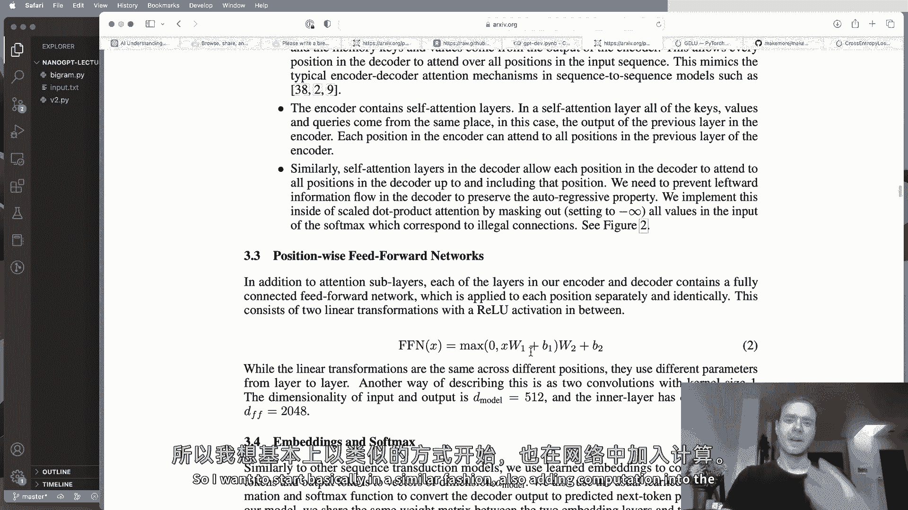

这种计算是按节点级别进行的。 所以我已经实现了它，您可以在左侧看到我添加或更改的差异高亮。 现在在之前我们有多头自注意力进行通信，但我们计算 logits 的速度太快了。

所以这些标记互相看着，但实际上没有太多时间去思考他们从其他标记那里发现的内容。 我在这里实现的是一个小的前馈单层，这个小层只是一个线性层后跟一个非线性层，就这样。

所以这只是一个小层，我称之为前馈和嵌入。 然后这个前馈是在自注意力之后顺序调用的。 所以我们进行自注意力，然后进行前馈，您会注意到这里的前馈在应用线性时，这是在每个标记级别上。 所有标记都是独立执行的。

所以自注意力是通信，一旦他们收集到所有数据。 现在他们需要对这些数据进行独立思考。 这就是前馈所做的，因此我在这里添加了它。 现在当我训练这个时，验证损失实际上继续下降，现在降到 2.24，从 2.28 降下来了。 输出仍然看起来有点糟糕，但至少我们改善了情况。

所以如我所预览的，我们现在开始将通信与计算交错。 这也是变换器在具有通信和计算的块时所做的，它将它们分组并复制。

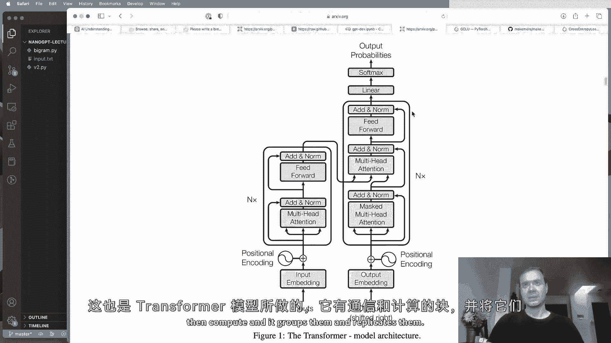

好的，让我给你展示一下我们想要做的事情。

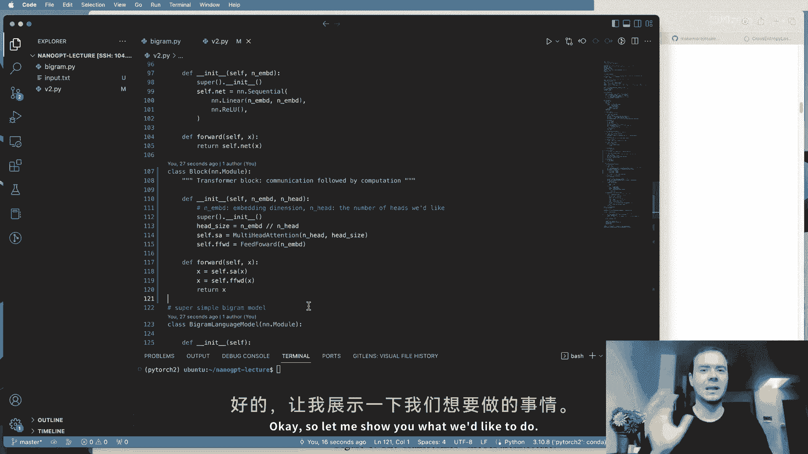

我们想做一些这样的事情。我们有一个块，这个块基本上就是这里的这一部分，只是缺少交叉注意力。

现在这个块基本上交错了通信和计算。计算是通过多头自注意力机制完成的，然后在所有标记上独立地使用前馈网络进行计算。现在我在这里添加的内容是，你会注意到这涉及到嵌入维度中的嵌入数量和我们想要的头数，这有点像分组大小的分组卷积。我说我们想要的头数是 4，因此因为这是 32，所以我们计算得出，32 的头数应该是 4。

头大小应该是 8，以便所有通道的工作效果。因此，这就是变换器结构通常的大小。头大小将变为 8，然后这是我们希望交错它们的方式。接着，我试图创建块，这只是块的顺序应用，以便我们进行许多次的通信前馈，最后我们进行解码。

现在实际上尝试运行这个，问题是这实际上并没有给出一个很好的答案。结果不是很好。原因在于我们开始真正得到一个相当深的神经网络，而深度神经网络会遭受优化问题，我认为这就是我们开始遇到的问题所在。

所以我们需要从变换器论文中借用一个更多的想法来解决这些困难。现在有两个优化措施可以显著帮助这些网络的深度，并确保网络保持可优化性。让我们谈谈第一个。这个图中的第一个是你看到的这个箭头，然后是这个箭头和这个箭头。那些是跳过连接，或有时称为残差连接。

它们来自这篇论文，关于 2015 年直接任务的程序学习，介绍了这个概念。

现在这些基本上意味着你转换数据，但随后你有一个与之前特征的加法跳过连接。现在我喜欢的可视化方式是这样的。这里的计算是从上到下进行的，基本上你有这个残差路径，并且你可以自由地从残差路径分叉。执行一些计算，然后通过加法再投影回残差路径。

所以你从输入到目标仅仅是加加加。这样做的原因是，在传播过程中，请记住，我们之前的微图视频中提到的，加法将梯度均等地分配到输入的两个分支。

所以来自损失的监督或梯度基本上通过每个加法节点跳跃到输入，然后也分叉到残差块。但基本上有这个梯度超级高速公路，从监督直接到输入没有阻碍。

而这些视觉块通常在开始时被初始化，因此它们对残差路径几乎没有贡献。它们就是这样初始化的。因此在开始时，它们几乎是不存在的。但在优化过程中，它们会随着时间的推移而上线并开始贡献，但至少在初始化时，你可以直接从监督到输入。梯度没有阻碍，并且就近，然后这些块会随着时间的推移生效。

这大大有助于优化。

所以我们来实现这个。回到我们的块，这基本上是我们想要做的，即让 x 等于 x 加自注意力，x 等于 x 加自前馈。因此这是 x，然后我们分叉并进行一些通信再返回。

然后我们分叉，进行一些计算再返回。所以这些就是残差连接。接着回到这里，我们还需要引入这个投影。因此这是线性的。这将是我们在连接之后得到的大小和嵌入。因此这是自注意力的输出。

但我们实际上想要应用投影，这就是结果。因此，投影只是这一层输出的线性变换。这就是投影回到残差路径的过程。而在前馈中，这将是相同的。

我也可以在这里有一个自投影，但让我简化一下，让我把它放在同一个顺序容器内。因此这是回到残差路径的投影层。就是这样。

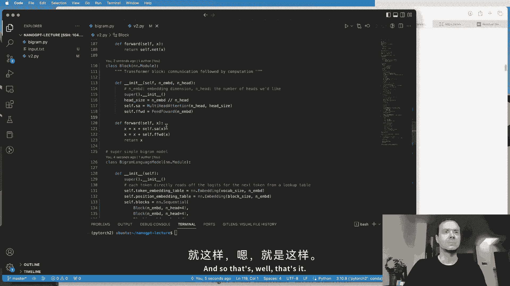

所以现在我们可以训练这个。因此我要再做一个小更改。当你再次查看论文时，你会看到输入和输出的维度对他们来说是 512。而他们表示这里的前馈内部层的维度是 2048。因此有一个四倍的乘数。因此前馈网络的内部层应该在通道大小上乘以四。

所以我来了，我在前馈中将嵌入乘以四倍。然后从四倍嵌入回到一个嵌入，当我们回到投影时。因此在这里添加了一些计算，并在残差路径的旁边增长了那个层。我训练了这个，实际验证损失降到了 2.08。

我们还看到网络开始变得足够大，以至于我们的训练损失领先于验证损失。因此，我们开始看到一些过拟合。我们的生成结果仍然不是很好，但至少你可以看到，这里现在有点像英语的东西。所以是的，我们开始真正接近了。

好的，第二个创新对于优化非常深的神经网络非常有帮助，就在这里。所以我们现在有这个加法，这是残差部分。但这个归一化是指层归一化。层归一化在 PyTorch 中实现。这是之前发布的一篇论文。层归一化与 Bachelorm 非常相似。

所以回想一下我们《Make More Series》第三部分。我们实现了 Bachelormalization。Bachelormalization 基本上确保在批次维度上，任何单个神经元都具有单位高斯分布。均值为零，标准差为一，向上一个标准差。所以我在这里做的是复制粘贴我们在《Make More Series》中开发的 Bachelorm 1D。

在这里我们可以初始化，例如这个模块，我们可以有一个批次的 32 个 100 维向量通过 Bachelorm 层。这保证了当我们仅查看零列时，它的均值为零，标准差为一。

所以它正在归一化这个输入的每一列。现在行默认情况下不会被归一化，因为我们只是对列进行归一化。所以让我们不实现层归一化。这非常复杂。看。我们在这里把这个从零改成一。因此我们不归一化列，而是归一化行。

现在我们已经实现了层归一化。现在列不会被归一化。但行将被归一化。对于每个个体示例，其 100 维向量以这种方式进行归一化。由于我们的计算现在不跨越示例，我们可以删除所有这些缓冲区的东西。因为我们可以始终应用此操作，而无需维护任何运行缓冲区。

所以我们不需要缓冲区。我们不需要。训练和测试时间之间没有区别。我们不需要这些运行缓冲区。我们保留伽马和贝塔。我们不需要动量。我们不在乎是否是训练。现在这是一个层归一化。它对行进行归一化，而不是对列进行归一化。

这里与基本上是相同的。所以现在让我们在变换器中实现层归一化。在我整合层归一化之前，我想提到的是，在过去五年中，关于变换器的细节实际上变化不大。但这实际上是可能来自原论文的部分内容。

你会看到加法和归一化在变换之后应用。但是现在通常会在变换之前应用层归一化。因此，层归一化的顺序发生了重新排列。这被称为预归一化公式，我们也将实现这一点。所以与原论文有所偏离。

基本上，我们需要在层归一化中，层归一化一是结束的点层归一化。我们告诉它嵌入维度中的单词数。然后需要第二个层归一化。这里层归一化直接应用于 X。因此，自点层归一化一应用于 X，自点层归一化二也应用于 X。

在进入自注意力和前馈之前。这里层归一化的大小是 32 的嵌入。因此，当层归一化规范化我们的特征时。

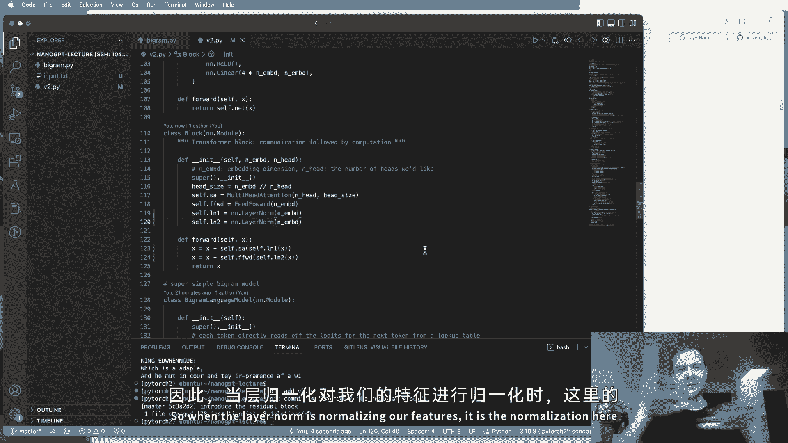

这里是归一化。均值和方差是基于 32 个数字计算的。因此，批次和时间都作为批次维度。

这就像是逐个标记的变换，仅仅规范化特征，使其在初始化时具有单位均值和单位高斯分布。

但当然，因为这些层归一化内部有可训练的参数 gamma 和 beta，层归一化最终产生的输出可能不是单位高斯分布。

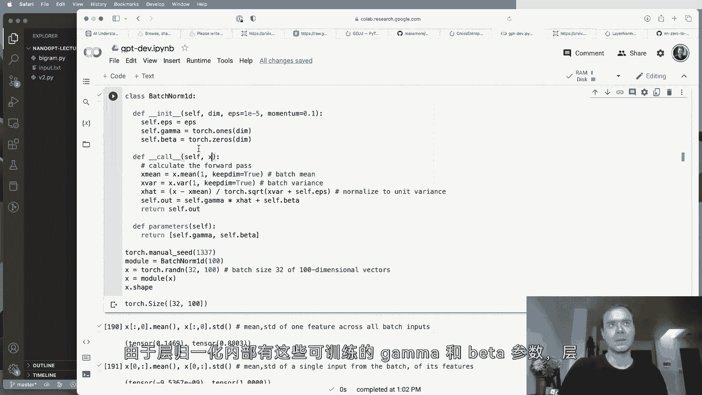

但优化会决定这一点。因此，目前这就是将层归一化纳入其中，让我们训练它们。好吧，我让它运行，我们看到损失降到 2.06，比之前的 2.08 要好。通过添加层归一化稍微有所改善。如果我们有更大更深的网络，我预计它们会帮助更多。

我忘了补充的是，这里也应该有一个层归一化，通常在变换器的最后，并在最终的线性层之前解码到词汇表。所以我也添加了这一点。到目前为止，我们实际上有了一个相当完整的变换器，根据原论文，它是一个仅解码的变换器。

我稍后会谈到这一点。但在这个阶段，主要部分已经到位，因此我们可以尝试扩展这个模型，看看我们能多大程度地推动这个数字。为了扩大模型，我在这里进行了一些外观上的更改以使其更好看。

我引入了一个叫做 n layer 的变量，它只是指定我们将拥有多少层块。我创建了一堆块，并且我们也有一个新的变量头的数量。我在这里抽出了层归一化，所以这是相同的。现在我简要改变的一件事是我添加了一个 dropout。

所以 dropout 是你可以在残差连接回来的前面添加的东西。就在回到残差路径的连接之前。所以我们可以在这里作为最后一层进行 dropout。在多头注意力的末尾也可以进行 dropout。当我们计算基本的相似性时，在 softmax 之后我们也可以对其中一些进行 dropout。

所以我们可以随机防止一些节点之间的通信。

所以 dropout 来自 2014 年左右的这篇论文，基本上它取了你的神经矩阵。每次前向和反向传递时，随机关闭一些神经元的子集。所以随机将它们置为零并在没有它们的情况下进行训练。这样做的效果是，因为每次前向和反向传递时被丢弃的掩码都改变了。

最终它训练了一个子网络的集合。在测试时，一切都完全启用，所有这些子网络合并成一个单一的集合。如果你想这样想的话。所以我建议你阅读论文以获取完整的细节。目前我们只会停留在这是一种正则化技术的层面上。

我添加了它，因为我准备将模型扩展得相当大，并且我担心过拟合。所以现在当我们向上滚动到顶部时，我们会看到我在神经矩阵的超参数上进行了很多更改。所以我将批量大小增大到现在的 64。我将块大小更改为 256。之前的上下文只有八个字符。

现在是 256 个字符的上下文来预测第 257 个。我把学习率稍微调低了一点，因为神经矩阵现在大得多。所以我降低了学习率。嵌入维度不是 384，并且有六个头。所以 384 除以六意味着每个头是 64 维的，这是标准的。

然后会有六层这样做。dropout 将设置为 0.2。所以每次前向和反向传递，20% 的所有这些中间计算都被禁用并丢弃为零。我已经训练过这个并运行过它。那么，隆重介绍它的表现如何？

所以让我向上滚动一下。我们得到了 1.48 的验证损失，这实际上比之前的 2.07 有了相当大的改善。所以我们从 2.07 一路降到 1.48，仅仅通过使用我们代码扩展这个神经矩阵。当然，这个过程持续了更长时间。我想说这是在我的 A100 GPU 上训练了大约 15 分钟。

所以这是一块相当不错的 GPU。如果你没有 GPU，就无法复现这个。在 CPU 上，我不会在 CPU 或 MacBook 等设备上运行这个。你必须分解层数和嵌入维度等。但大约 15 分钟后，我们可以得到这样的结果，我在这里打印了一些莎士比亚的内容。

但我还打印了 10,000 个字符，所以更多，我将它们写入了一个文件。所以我们看到了一些输出。因此，它看起来更像输入文本文件。因此，输入文本文件的样子是这样的。总是有人以这种方式说话。我们的预测现在采用了那种形式。

当然，当你真正阅读它们时，它们是无意义的。所以每个房屋都有其特定的要求。哦，那些准备工作。我们要注意。你知道。哦，哦，伟大的主，差我过去。无论如何，你可以浏览这个。显然是无意义的，但这只是一个在字符级别上训练了百万个来自莎士比亚字符的变换器。所以它在莎士比亚的风格上像是在喋喋不休，但在这个规模上当然没有意义。

但我认为这仍然是一个不错的演示，展示了可能的结果。所以现在我认为这大概结束了这个视频的编程部分。

我们基本上在实现这个变换器方面做得相当不错，但图像并不完全匹配我们所做的。那么这些额外的部分到底发生了什么呢？让我完成对这个架构的解释，以及为什么它看起来如此奇怪。基本上，这里实现的是一个仅解码的变换器。

所以这里没有组件。这个部分叫做编码器，这里没有交叉注意块。我们的块只有自注意和前馈。因此，它缺少这个中间的第三部分。这个部分负责交叉注意。所以我们没有它，也没有编码器。

我们只有解码器，之所以只有解码器，是因为我们只是在生成文本，而不依赖于任何条件。我们只是根据给定的数据集在喋喋不休。使其成为解码器的原因是我们在变换器中使用了三角形掩码。所以它具有自回归特性，我们可以从中进行采样。

因此，它使用三角形掩码来屏蔽注意力，使其成为解码器，并可用于语言建模。原始论文采用编码器-解码器架构的原因是因为这是一个机器翻译论文。

所以它关注的是一个不同的设置，特别是。它预期一些标记，比如说法语的编码，然后预期解码成英语翻译。所以通常这些是特殊标记。您需要读取这些并根据它进行条件化。然后您用一个名为“开始”的特殊标记开始生成。

这是一个特殊的新标记，您需要在开头引入并始终放置。然后网络预期输出“神经网络太棒了”，再加上一个特殊的结束标记来完成生成。所以这部分将与我们之前做的一样被解码。“神经网络太棒了”将与我们所做的完全相同。但与我们所做的不同，他们希望根据一些额外信息来条件化生成。

在这种情况下，这个额外信息是他们应该翻译的法语句子。他们现在所做的是引入编码器。现在编码器读取这一部分。所以我们将仅提取法语部分，并将其创建为标记，正如我们在视频中看到的那样。我们将其放入一个变换器中。但不会有三角形掩码，因此所有标记都可以尽可能地相互交流。

他们只是在编码这个法语句子的内容。一旦他们编码完成，基本上就会在顶部输出。然后在我们的解码器中进行语言建模时，会有一个额外的连接到编码器的输出。

通过交叉注意力引入。所以查询仍然从 X 生成，但现在键和值来自侧面。这些键和值来自于来自编码器外部的节点生成的顶部。

这些顶部，键和值，顶部的内容从侧面输入到解码器的每一个块中。这就是为什么会有额外的交叉注意力。实际上，它是将解码不仅仅基于当前解码的过去，还基于已完全编码的法语句子进行条件化的。因此，这是一个编码解码器模型，这就是我们有这两个变换器和额外块等的原因。

所以我们这样做并不是因为我们需要编码什么。没有条件。我们只有一个文本文件，只想模仿它。这就是我们使用与 GPT 完全相同的解码器变换器的原因。好的，现在我想简要介绍一下可以在我的 GitHub 上找到的 nano GPT。

nano GPT 基本上是两个重要文件。一个是 trained.py，另一个是 modeled.py。trained.py 是训练网络的所有样板代码。

基本上，我们这里的所有内容都是训练循环。只是这要复杂得多，因为我们在保存和加载检查点及预训练权重，并且我们在衰减学习率，编译模型，并使用分布式训练跨多个节点或 GPU。

所以 training.py 变得有点复杂。选项更多等等。但 model.py 应该看起来非常类似于我们在这里所做的。实际上模型几乎是相同的。所以这里我们有因果自注意力块，所有这些对你来说应该是非常熟悉的。我们在生成查询、键、值。我们在进行点积。我们在掩蔽，应用 softmax。

可选的丢弃。这里我们在提取值。不同之处在于，在我们的代码中，我将多头注意力分离为单个头。

然后这里我有多个头，我明确地将它们连接起来。

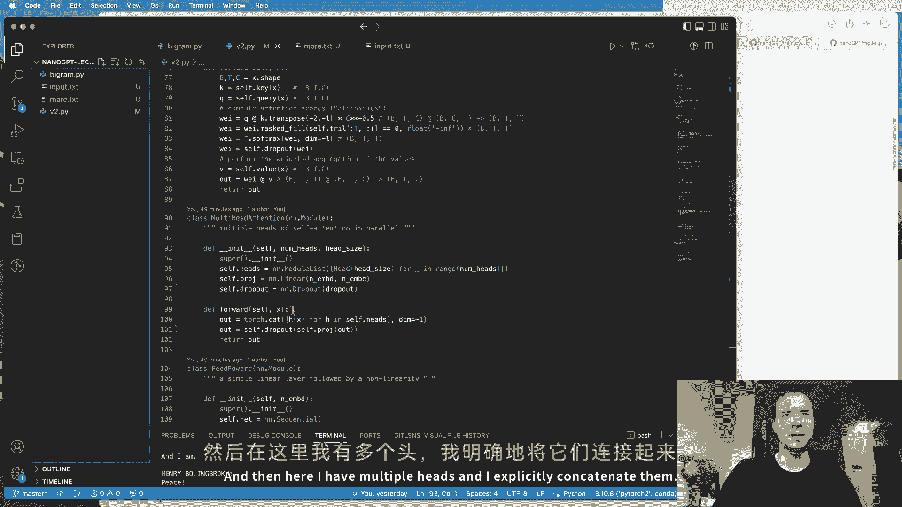

而这里则是将所有内容批量处理，放在一个单一的因果自注意力内部。因此我们不仅有 B、T 和 C 维度。我们还会有第四个维度，也就是头。这样就变得更加复杂，因为我们现在有四维数组张量。

但在数学上这是等价的。

所以发生的事情和我们所做的完全相同。只是因为现在所有头也作为一个批处理维度处理，所以效率稍微高一些。

然后我们有多路感知器。它使用的是这里定义的 Galoon 非线性，而不是 RALU。这么做只是因为 OpenAI 使用了它，我希望能够加载他们的检查点。变压器的块是相同的。我们看到的通信和计算阶段。然后 GPT 将是相同的。我们有位置编码、标记编码和这些块。

最后的层归一化，最终的线性层。这些都应该看起来非常熟悉。这里还有一些额外的内容，因为我在加载检查点和其他东西。我将参数分离为那些应该衰减权重和那些不应该的。但是生成函数也应该非常类似。

所以有一些细节不同，但你绝对可以查看这个文件，并能够理解很多部分。现在让我们把事情带回 Chacupt。如果我们想自己训练 Chacupt，它会是什么样子，如何与我们今天学到的内容相关？

好吧，在 Chacupt 训练大约有两个阶段。第一个是预训练阶段，第二个是微调阶段。在预训练阶段，我们在大量的互联网数据上进行训练，只是试图获得一个首个仅解码器的变换器。以便喋喋不休文本。所以这非常非常类似于我们自己所做的。

除了我们做了一个小小的预训练步骤。因此在我们的情况下，这就是你打印参数的数量。我打印了，约为 1000 万个。因此，我在这里创建的这个小莎士比亚变换器大约是 1000 万个参数。我们的数据集大约是 100 万个字符。所以大约是 100 万个标记。

但你必须记住，开放眼的词汇是不同的。他们不是在字符级别上。他们使用这些单词的子词块。因此，他们的词汇量大约有 50,000 个元素。因此，他们的序列相对更加紧凑。所以我们的数据集。

威廉·莎士比亚数据集的词汇量大约在 300,000 个标记左右。因此，我们在大约 300,000 个标记上训练了一个约 10 百万参数的模型。

现在当你查看 GPT-3 论文，看看他们训练的变换器时，他们训练了多种不同大小的变换器。但这里最大的变换器有 1750 亿个参数。因此我们的模型再次是 1000 万个。他们在一个变换器中使用了这个层数。这是结束的嵌入。

这是头的数量。这是头的大小。这是批量大小。所以我们的批量大小是 65。学习率相似。现在，当他们训练这个变换器时，他们训练了 3000 亿个标记。因此，请记住，我们大约是 300,000。所以这是大约百万倍的增加。按照今天的标准，这个数字甚至不会那么大。

你将超过 1 万亿。所以他们在互联网上训练了一个显著更大的模型。这就是预训练阶段。否则，这些超参数对你来说应该是相当熟悉的。而且架构实际上与我们自己实施的几乎相同。但是，当然，训练这个是一个巨大的基础设施挑战。

你谈论的是通常需要数千个 GPU 互相交流以训练这种规模的模型。所以这只是预训练阶段。现在在完成预训练阶段后，你不会得到一个能够回答你问题的响应。而且这并没有帮助，等等。你得到的是一个完整的文档。

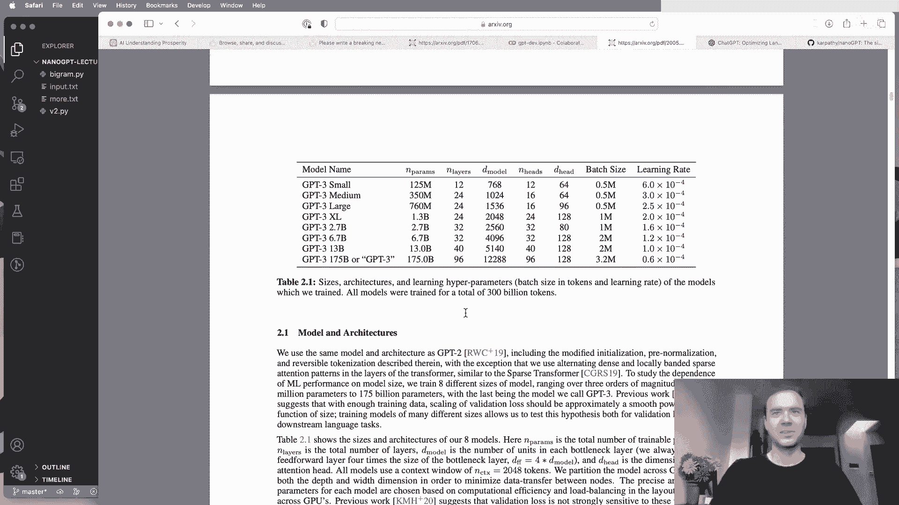

所以它喋喋不休，但它不喋喋不休莎士比亚。它喋喋不休的是互联网。

它会创建任意的新闻文章和文档，并尝试完成文档，因为那是它所训练的内容。它试图完成这个序列。所以当你给它一个问题时，它可能只会给你更多的问题。它会继续提出更多问题。

它将会执行看起来像互联网训练数据中某个接近文档的内容。因此，谁知道，你可能会得到一些不确定的行为。它可能会用其他问题回答你的问题，可能会忽略你的问题，或者只是尝试完成一些新闻文章。正如我们所说，它是完全未对齐的。

所以第二个微调阶段是将其实际对齐为助手。这是第二个阶段。

因此，Upaniya 的这篇聊天 GPT 博客文章稍微谈了一下如何实现这个阶段。

基本上，这个阶段大致分为三个步骤。所以他们在这里所做的是开始收集看起来特别像助手会做的训练数据。因此，他们有格式为问题在上，答案在下的文档。他们有大量这样的文档，但可能没有互联网那么多。

这可能大约有数千个示例。因此，他们对模型进行了微调，基本上只关注看起来像那样的文档。于是你开始慢慢地进行对齐。因此，它会期待顶部有一个问题，并期待完成答案。这些非常，非常大的模型在微调过程中非常有效。

所以这实际上以某种方式有效。但这只是第一步，仅仅是微调。因此，他们实际上还有更多步骤，第二步是让模型响应，然后不同的评分者查看不同的响应，并根据他们的偏好对其进行排名，以决定哪个更好。他们用这个来训练奖励模型，以便能够基本上使用不同的网络预测任何候选响应的吸引力。

一旦他们有了奖励模型，他们就会运行 PPO，这是一种策略梯度强化学习优化器，用来微调这个采样策略，以便 GPT 聊天现在生成的答案能够根据奖励模型获得高分。

基本上这里有一个完整的对齐阶段或微调阶段。中间还有多个步骤。它将模型从文档补全器转变为问答助手。这是一个完全不同的阶段。很多数据并未公开，它是开放 AI 的内部数据，复制这个阶段要困难得多。

所以这大致上就是会给你一个聊天 GPT 的东西。nano GPT 专注于预训练阶段。好的，这就是我今天想要覆盖的所有内容。因此，我们训练了一个仅解码器的变换器来总结，遵循 2017 年那篇著名论文《Attention is All You Need》。

所以这基本上就是一个 GPT。我们在一小部分莎士比亚文本上进行了训练，并得到了合理的结果。

所有的训练代码大约有 200 行。我将发布这个代码库。因此，它也包含我们构建过程中的所有 Git 日志提交。

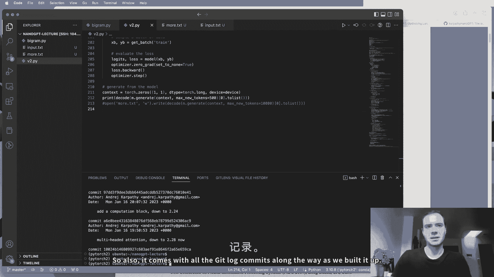

除了这些代码，我还将发布笔记本，当然还有 Google Colab。我希望这能让你了解如何训练这些模型，比如说 GPT-3。它在架构上基本上与我们拥有的相同。但它们的大小在 10,000 到 100 万倍之间，具体取决于你如何计算。所以这就是我现在要说的全部内容。

我们没有讨论通常会在此基础上进行的微调阶段。如果你对的不仅仅是语言建模感兴趣，而是想要执行任务，或者希望它们以特定方式对齐，或者想检测情感等内容，基本上。

每当你不想要仅仅是一个文档补全器时，你必须完成进一步的微调阶段，而我们没有讨论。这可能是简单的监督微调，或者像我们在 ChaiChaPT 中看到的更高级的内容，在那里我们实际上训练一个奖励模型，然后进行 PPO 的轮次，以便与奖励模型进行对齐。

因此，还有很多事情可以在此基础上完成。我认为现在我们开始接近两个小时的时限。所以我将结束这里。希望你喜欢这次讲座。好的，去吧，转变吧。再见。

