# 【Andrej Karpathy：从零开始构建 GPT 系列】 - P7：p7 Let's build GPT： from scratch, in code, spelled out. - 加加zero - BV11yHXeuE9d

 Hi everyone。 So by now you have probably heard of chat GPT。

 It has taken the world and AI community by storm。 And it is a system that allows you to interact with an AI and give it text based tasks。

 So for example， we can ask chat GPT to write us a small haiku about how important it is that people understand AI。

 And then they can use it to improve the world and make it more prosperous。 So when we run this。

 AI knowledge brings prosperity for all to see embraces power。 Okay， not bad。

 And so you can see that chat GPT went from left to right and generated all these words sequentially。

 Now I asked it already the exact same prompt a little bit earlier and it generated a slightly different outcome。

 AI's power to grow， ignoring sources back， learn， prosperity， weights。

 So pretty good in both cases and slightly different。

 So you can see that chat GPT is a probabilistic system and for any one prompt it can give us multiple answers sort of replying to it。

 Now this is just one example of a prompt。 People have come up with many many examples and there are entire websites that index interactions with chat GPT。

 And so many of them are quite humorous。 Explain HTML to me like I'm a dog。

 Write release notes for chess to write a note about Elon Musk buying a Twitter and so on。

 So as an example， please write a breaking news article about a leaf falling from a tree。

 In a shocking turn of events a leaf has fallen from a tree in the local park。

 Witnesses report that the leaf which was previously attached to a branch of a tree detached itself and fell to the ground。

 Very dramatic。 So you can see that this is a pretty remarkable system and it is what we call a language model。

 Because it models the sequence of words or characters or tokens more generally and it knows how words follow each other in English language。

 And so from its perspective what it is doing is it is completing the sequence。

 So I give it the start of a sequence and it completes the sequence with the outcome。

 And so it's a language model in that sense。 Now I would like to focus on the under the hood of under the hood components of what makes chat GPT work。

 So what is the neural network under the hood that models the sequence of these words。

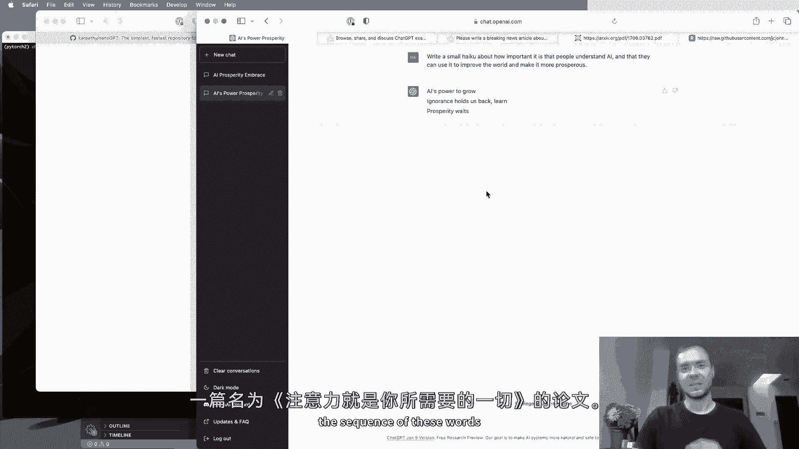

 And that comes from this paper called Attention is All You Need in 2017 a landmark paper a landmark paper and AI that produced and proposed the transformer architecture。

 So GPT is short for generally generatively pre-trained transformer。

 So transformer is the neural net that actually does all the heavy lifting under the hood。

 It comes from this paper in 2017。 Now if you read this paper this reads like a pretty random machine translation paper。

 And that's because I think the authors didn't fully anticipate the impact that the transformer would have on the field。

 And this architecture that they produced in the context of machine translation in their case actually ended up taking over the rest of the data。

 And so this architecture with minor changes was copy pasted into a huge amount of applications in AI in more recent years。

 And that includes at the core of chat GPT。 Now we are not going to what I'd like to do now is I'd like to build out something like chat GPT。

 But we're not going to be able to of course reproduce chat GPT。

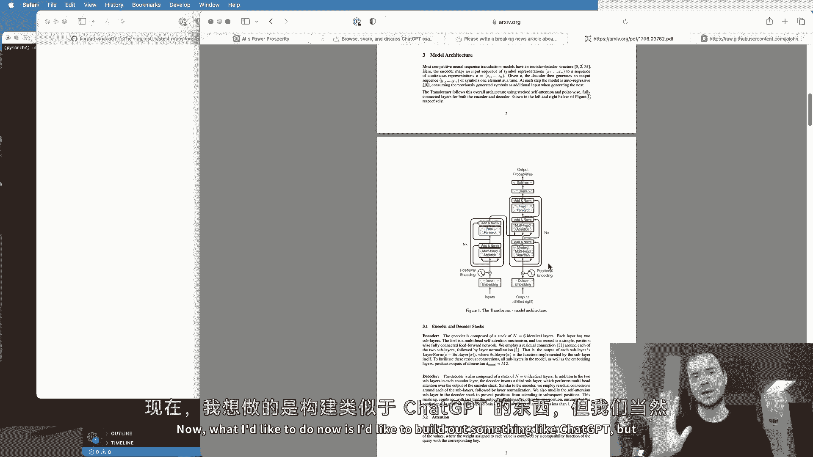

 This is a very serious production grade system。 It is trained on a good chunk of internet。

 And then there's a lot of pre-training and fine-tuning stages to it。 And so it's very complicated。

 What I'd like to focus on is just to train a transformer based language model。

 And in our case it's going to be a character level language model。

 I still think that is a very educational with respect to how these systems work。

 So I don't want to train on the chunk of internet。 We need a smaller data。

 In this case I propose that we work with my favorite toy data set。 It's called tiny Shakespeare。

 And what it is is basically it's a concatenation of all of the works of Shakespeare in my understanding。

 And so this is all of Shakespeare in a single file。 This file is about one megabyte。

 And it's just all of Shakespeare。 And what we are going to do now is we're going to basically model how these characters follow each other。

 So for example given a chunk of these characters like this。

 given some context of characters in the past， the transformer neural network will look at the characters that I've highlighted。

 And it's going to predict that G is likely to come next in the sequence。

 And it's going to do that because we're going to train that transformer on Shakespeare。

 And it's just going to try to produce character sequences that look like this。

 And in that process is going to model all the patterns inside this data。

 So once we've trained the system， I'd just like to give you a preview。

 we can generate infinite Shakespeare。 And of course it's a fake thing that looks kind of like Shakespeare。

 Apologies for there's some jank that I'm not able to resolve in here。

 You can see how this is going character by character。

 And it's kind of like predicting Shakespeare-like language。 So verily my lord。

 the sights have left the， again， the king coming with my curses with precious pale。

 And then Tranios says something else， etc。 And this is just coming out of the transformer in a very similar manner as it would come out in Chachi P。

T。 In our case， character by character in Chachi P。T。 it's coming out on the token by token level。

 And tokens are these sort of like little sub word pieces。 So they're not word level。

 they're kind of like word chunk level。 And now I've already written this entire code to train these transformers。

 And it is in a GitHub repository that you can find。 And it's called NanoGPT。

 So NanoGPT is a repository that you can find on my GitHub。

 And it's a repository for training transformers on any given text。

 And what I think is interesting about it， because there's many ways to train transformers。

 But this is a very simple implementation。 So it's just two files of 300 lines of code each。

 One file defiles the Chachi P。T。 model， the transformer。

 and one file trains it on some given text dataset。

 And here I'm showing that if you train it on an open web text dataset。

 which is a fairly large dataset of web pages， then I reproduce the performance of GPT-2。

 So GPT-2 is an early version of OpenAI's GPT from 2017， if I recall correctly。

 And I've only so far reproduced the smallest one， 24 million parameter model。

 But basically this is just proving that the code base is correctly arranged。

 And I'm able to load the neural network weights that OpenAI has released later。

 So you can take a look at the finished code here in NanoGPT。

 What I would like to do in this lecture is I would like to basically write this repository from scratch。

 So we're going to begin with an empty file and we're going to define a transformer piece by piece。

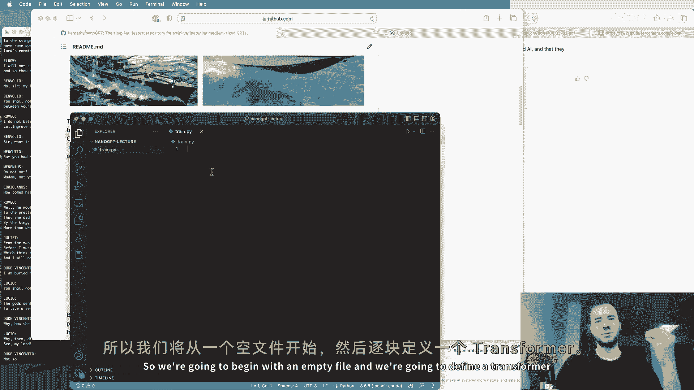

 We're going to train it on the tiny Shakespeare dataset。

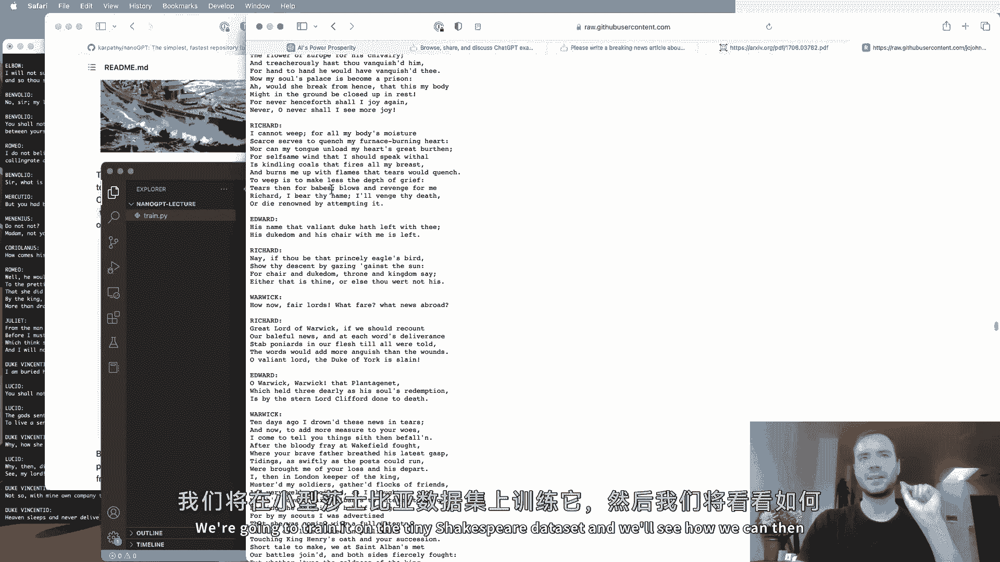

 And we'll see how we can then generate infinite Shakespeare。

 And of course this can copy paste to any arbitrary text dataset that you like。

 But my goal really here is to just make you understand and appreciate how under the chat GPT works。

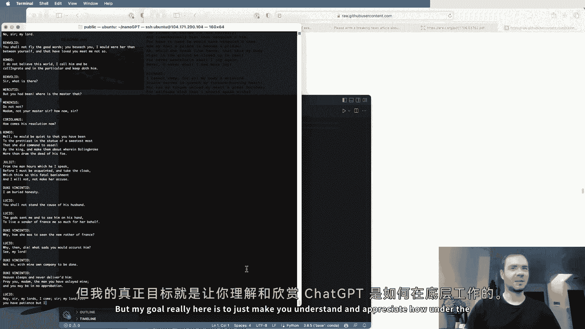

 And really all that's required is a proficiency in Python and some basic understanding of calculus and statistics。

 And it would help if you also see my previous videos on the same YouTube channel in particular。

 my Make More series where I define smaller and simpler neural network language models。

 So multi-layer perceptrons and so on。 It really introduces the language model and framework。

 And then here in this video we're going to focus on the transformer neural network itself。

 Okay， so I created a new Google collab Jupyter notebook here。

 And this will allow me to later easily share this code that we're going to develop together with you so you can follow along。

 So this will be in a video description later。 Now here I've just done some preliminarys。

 I downloaded the dataset the tiny Shakespeare dataset at this URL and you can see that it's about a 1 megabyte file。

 Then here I open the input。txt file and just reading all the text at a string。

 And we see that we are working with 1 million characters roughly。

 And the first 1000 characters if we just print them out are basically what you would expect。

 This is the first 1000 characters of the tiny Shakespeare dataset roughly up to here。

 So far so good。 Next we're going to take this text and the text is a sequence of characters in Python。

 So when I call the set constructor on it， I'm just going to get the set of all the characters that occur in this text。

 And then I call list on that to create a list of those characters instead of just a set so that I have an ordering。

 an arbitrary ordering。 And then I sort that。 So basically we get just all the characters that occur in the entire dataset and they're sorted。

 Now the number of them is going to be our vocabulary size。

 These are the possible elements of our sequences。 And we see that when I print here the characters。

 there's 65 of them in total。 There's a space character and then all kinds of special characters and then capitals and lowercase letters。

 So that's our vocabulary and that's the sort of like possible characters that the model can see or emit。

 Okay so next we would like to develop some strategy to tokenize the input text。

 Now when people say tokenize they mean convert the raw text as a string to some sequence of integers according to some vocabulary of possible elements。

 So as an example here we are going to be building a character level language model so we're simply going to be translating individual characters into integers。

 So let me show you a chunk of code that sort of does that for us。

 So we're building both the encoder and the decoder and let me just talk through what's happening here。

 When we encode an arbitrary text like hi there we're going to receive a list of integers that represents that string。

 So for example 46 47 etc。 And then we also have the reverse mapping so we can take this list and decode it to get back the exact same string。

 So it's really just like a translation to integers and back for arbitrary string and for us it is done on a character level。

 Now the way this was achieved is we just iterate over all the characters here and create a lookup table from the character to the integer and vice versa。

 And then to encode some string we simply translate all the characters individually and to decode it back we use the reverse mapping and concatenate all of it。

 Now this is only one of many possible encodings or many possible sort of tokenizers and it's a very simple one。

 But there's many other schemas that people have come up with in practice。

 So for example Google uses a sentence piece so sentence piece will also encode text into integers but in a different schema and using a different vocabulary。

 And sentence piece is a subword sort of tokenizer and what that means is that you're not encoding entire words but you're not also encoding individual characters。

 It's a subword unit level and that's usually what's adopted in practice。

 For example also OpenAI has this library called tick token that uses a byte pair encoding tokenizer and that's what GPT uses。

 And you can also just encode words into like hell world into lists of integers。

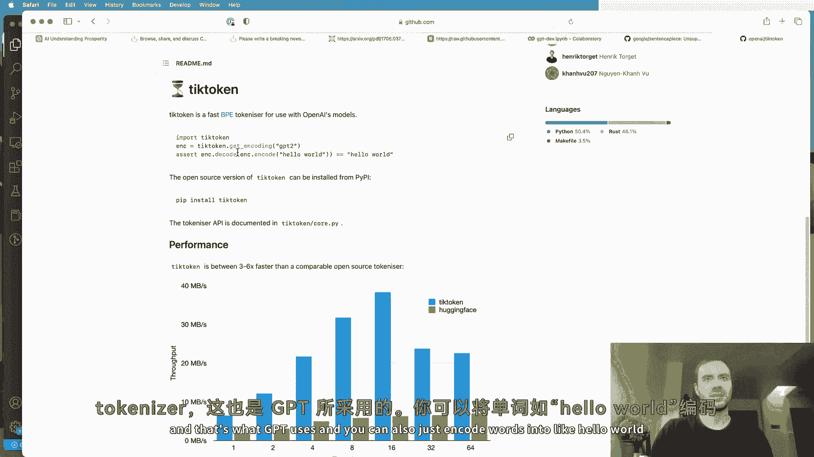

 So as an example I'm using the tick token library here。

 I'm getting the encoding from GPT 2 or that was used for GPT 2。

 Instead of just having 65 possible characters or tokens they have 50，000 tokens。

 And so when they encode the exact same string high there we only get a list of three integers。

 But those integers are not between 0 and 64。 They are between 0 and 5，000 50，000 256。

 So basically you can trade off the codebook size and the sequence lengths。

 So you can have very long sequences of integers with very small vocabularies or you can have short sequences of integers with very large vocabularies。

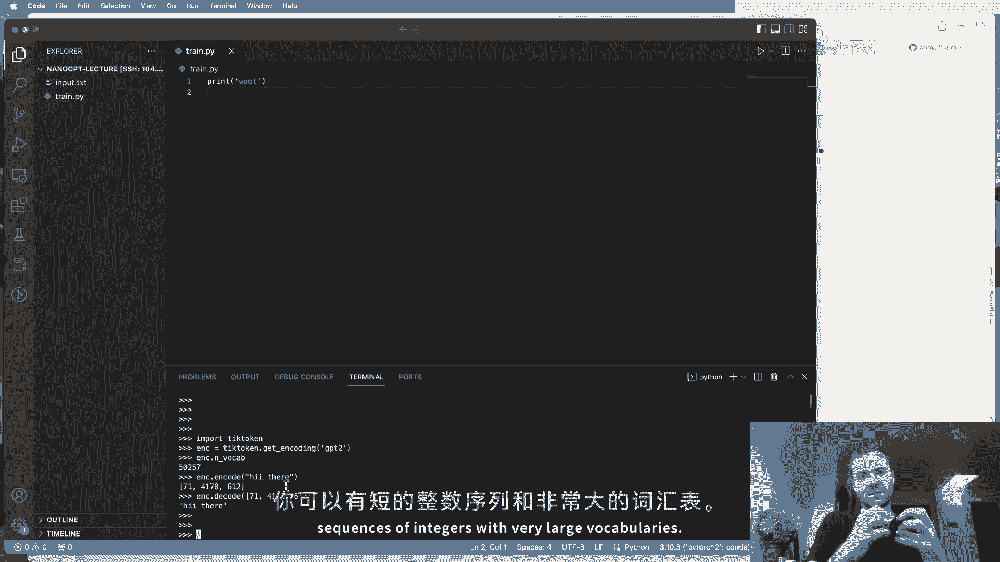

 And so typically people use in practice these subword encodings but I'd like to keep our tokenizer very simple。

 So we're using character level tokenizer and that means that we have very small codebooks。

 We have very simple encode and decode functions but we do get very long sequences as a result。

 But that's the level at which we're going to stick with this lecture because it's the simplest thing。

 So now that we have an encoder and a decoder effectively tokenizer we can tokenize the entire training set of Shakespeare。

 So here's a chunk of code that does that。 And I'm going to start to use the PyTorch library and specifically the Torque。

Tensor from the PyTorch library。 So we're going to take all of the text in tiny Shakespeare。

 encode it and then wrap it into a Torque。Tensor to get the data tensor。

 So here's what the data tensor looks like when I look at just the first 1000 characters or the 1000 elements of it。

 So we see that we have a massive sequence of integers and this sequence of integers here is basically an identical translation of the first 1000 characters here。

 So I believe for example that zero is a new line character and maybe one is a space， not 100% sure。

 But from now on the entire data set of text is re-represented as just stretched out as a single very large sequence of integers。

 Let me do one more thing before we move on here。 I'd like to separate out our data set into a train and a validation split。

 So in particular we're going to take the first 90% of the data set and consider that to be the training data for the transformer。

 And we're going to withhold the last 10% at the end of it to be the validation data。

 And this will help us understand to what extent our model is overfitting。

 So we're going to basically hide and keep the validation data on the side because we don't want just a perfect memorization of this exact Shakespeare。

 We want a neural network that sort of creates Shakespeare-like text。

 And so it should be fairly likely for it to produce the actual like stowed away true Shakespeare text。

 And so we're going to use this to get a sense of the overfitting。 Okay。

 so now we would like to start plugging these text sequences or integer sequences into the transformer so that it can train and learn those patterns。

 Now the important thing to realize is we're never going to actually feed entire text into your transformer all at once。

 That would be computationally very expensive and prohibitive。

 So when we actually train a transformer on a lot of these data sets。

 we only work with chunks of the data set。 And when we train the transformer。

 we basically sample random little chunks out of the training set and train them just chunks at a time。

 And these chunks have basically some kind of a length and some maximum length。

 Now the maximum length typically， at least in the code I usually write， is called block size。

 You can find it on the different names like context length or something like that。

 Let's start with the block size of just eight。 And let me look at the first train data characters。

 The first block size plus one characters。 I'll explain why plus one in a second。

 So this is the first nine characters in the sequence in the training set。

 Now what I'd like to point out is that when you sample a chunk of data like this。

 so say if these nine characters out of the training set。

 this actually has multiple examples packed into it。

 And that's because all of these characters follow each other。

 And so what this thing is going to say when we plug it into a transformer。

 is we're going to actually simultaneously train it to make prediction at every one of these positions。

 Now in a chunk of nine characters， there's actually eight individual examples packed in there。

 So there's the example that when 18， in the context of 18， 47 luckily comes next。

 In the context of 18 and 47， 56 comes next。 And so on。 So that's the eight individual examples。

 Let me actually spell it out with code。 So here's a chunk of code to illustrate。

 X are the inputs to the transformer。 It will just be the first block size characters。

 Y will be the next block size characters。 So it's offset by one。

 And that's because Y are the targets for each position in the input。

 And then here I'm iterating over all the blocks as a weight。

 And the context is always all the characters in X up to T and including T。

 And the target is always the teeth character， but in the targets array Y。 So let me just run this。

 And basically it spells out what I said in words。 These are the eight examples hidden in a chunk of nine characters that we sampled from the two characters。

 And we sampled from the training set。 I want to mention one more thing。

 We train on all the eight examples here with context between one all the way up to context of block size。

 And we train on that not just for computational reasons because we happen to have the sequence already or something like that。

 It's not just for efficiency。 It's also done to make the transformer network be used to seeing contexts all the way from as little as one all the way to block size。

 And we'd like the transformer to be used to seeing everything in between。

 And that's going to be useful later during inference because while we're sampling。

 we can start to sample in generation with as little as one character of context。

 And then transformer knows how to predict the next character with all the way up to just context of one。

 And so then it can predict everything up to block size。

 And after block size we have to start truncating because the transformer will never receive more than block size inputs when it's predicting the next character。

 Okay， so we've looked at the time dimension of the tensors that are going to be feeding into the transformer。

 There's one more dimension to care about and that is the batch dimension。

 And so as we're sampling these chunks of text， we're going to be actually。

 every time we're going to feed them into a transformer。

 we're going to have many batches of multiple chunks of text that are always like stacked up in a single tensor。

 And that's just done for efficiency just so that we can keep the GPU busy because they are very good at parallel processing of data。

 And so we just want to process multiple chunks all at the same time。

 But those chunks are processed completely independently。 They don't talk to each other and so on。

 So let me basically just generalize this and introduce a batch dimension。 Here's a chunk of code。

 Let me just run it and then I'm going to explain what it does。

 So here because we're going to start sampling random locations in the data sets to pull chunks from。

 we're going to be setting the seed so that in the random number generator。

 so that the numbers I see here are going to be the same numbers you see later if you try to reproduce this。

 Now the batch size here is how many independent sequences we are processing every forward。

 backward pass of the transformer。 The block size as I explained is the maximum context length to make those predictions。

 So let's say by size four， block size eight， and then here's how we get batch for any arbitrary split。

 If the split is a training split， then we're going to look at train data， otherwise a value。

 That gives us the data array。 And then when I generate random positions to grab a chunk out of。

 I actually grab， I actually generate batch size number of random offsets。 So because this is for。

 we are， I X is going to be a four numbers that are randomly generated between zero and len of data minus block size。

 So it's just random offsets into the training set。 And then X is， as I explained。

 are the first block size characters starting at I。 The Y's are the offset by one of that。

 So just add plus one。 And then we're going to get those chunks for every one of integers I in I X and use a torch。

stack to take all those one dimensional tensors as we saw here。

 And we're going to stack them up at rows。 And so they all become a row in a four by eight tensor。

 So here's where I'm printing them。 When I sample a batch XB and YB。

 the inputs that transformer now are the input X is the four by eight tensor for rows of eight columns。

 And each one of these is a chunk of the training set。

 And then the targets here are in the associated array Y and they will come in to the transformer all the way at the end to create the loss function。

 So they will give us the correct answer for every single position inside X。

 And then these are the four independent rows。 So spelled out as we did before。

 this four by eight array contains a total of 32 examples。

 And they're completely independent as far as the transformer is concerned。 So when the input is 24。

 the target is 43 or rather 43 here in the Y array。 When the input is 2443， the target is 58。

 Or like when it is 52， 58， one， the target is 58。 So you can sort of see this spelled out。

 These are the 32 independent examples packed in to a single batch of the input X。

 And then the desired targets are in Y。 And so now this integer tensor of X is going to feed into the transformer。

 And that transformer is going to simultaneously process all these examples and then look up the correct integers to predict in every one of these positions in the tensor Y。

 Okay， so now that we have our batch of input that we'd like to feed into a transformer。

 let's start basically feeding this into neural networks。

 Now we're going to start off with the simplest possible neural network。

 which in the case of language modeling in my opinion is the Bagram language model。

 And we've covered the Bagram language model in my make more series in a lot of depth。

 And so here I'm going to sort of go faster and let's just implement PyTorch module directly that implements the PyGram language model。

 So I'm importing the PyTorch and N module for reproducibility。

 And then here I'm constructing a Bagram language model， which is a subclass of an N module。

 And then I'm calling it and I'm passing in the inputs and the targets。 And I'm just printing。

 Now when the inputs and targets come here， you see that I'm just taking the index。

 the inputs X here， which I renamed to IDX。 And I'm just passing them into this token embedding table。

 So what's going on here is that here in the constructor， we are creating a token embedding table。

 And it is of size vocab size by vocab size。 And we're using an N dot embedding。

 which is a very thin wrapper around basically a tensor of shape vocab size by vocab size。

 And what's happening here is that when we pass IDX here。

 every single integer in our input is going to refer to this embedding table。

 And it's going to pluck out a row of that embedding table corresponding to its index。

 So 24 here will go to the embedding table and will pluck out the 24th row。

 And then 43 will go here and pluck out the 43rd row， et cetera。

 And then PyTorch is going to arrange all of this into a batch by time by channel tensor。

 In this case batch is four， time is eight， and C， which is the channels is vocab size or 65。

 And so we're just going to pluck out all those rows， arrange them in a B by T by C。

 And now we're going to interpret this as the logits。

 which are basically the scores for the next character in a sequence。

 And so what's happening here is we are predicting what comes next based on just the individual identity of a single token。

 And you can do that because， I mean， currently the tokens are not talking to each other。

 and they're not seeing any context， except for their just， seeing themselves。

 So I'm a token number five。 And then I can actually make pretty decent predictions about what comes next just by knowing that I'm token five。

 because some characters no， follow other characters in technical scenarios。

 So we saw a lot of this in a lot more depth in the Make More series。 And here if I just run this。

 then we currently get the predictions， the scores。

 the logits for every one of the four by eight positions。

 Now that we've made predictions about what comes next， we'd like to evaluate the loss function。

 And so in Make More series， we saw that a good way to measure a loss or like a quality of the predictions is to use the negative log likelihood loss。

 which is also implemented in PyTorch under the name cross entropy。

 So what we'd like to do here is loss is the cross entropy on the predictions and the targets。

 And so this measures the quality of the logits with respect to the targets。 In other words。

 we have the identity of the next character。 So how well are we predicting the next character based on the logits？

 And intuitively， the correct the dimension of logits， depending on whatever the target is。

 should have a very high number。 And all the other dimensions should be very low number。 Now。

 the issue is that this won't actually， this is what we want。

 We want to basically output the logits and the loss。 This is what we want， but unfortunately。

 this won't actually run。 We get an error message， but intuitively we want to measure this。

 Now when we go to the PyTorch cross entropy documentation here。

 we're trying to call the cross entropy in its functional form。

 So that means we don't have to create like a module for it。

 But here when we go to the documentation， you have to look into the details of how PyTorch expects these inputs。

 And basically the issue here is PyTorch expects if you have multi-dimensional input， which we do。

 because we have a B by T by C tensor， then it actually really wants the channels to be the second dimension here。

 So basically it wants a B by C by T instead of a B by T by C。

 And so it's just the details of how PyTorch treats these kinds of inputs。

 And so we don't actually want to deal with that。 So what we're going to do instead is we need to basically reshape our logits。

 So here's what I like to do。 I like to take basically give names to the dimensions。 So logis。

shape is B by T by C and unpack those numbers。 And then let's say that logits equals logis。view。

 And we want it to be B times C。 B times T by C。 So just a two-dimensional array。

 So we're going to take all of these positions here。

 And we're going to stretch them out in a one-dimensional sequence and preserve the channel dimension as the second dimension。

 So we're just kind of like stretching out the array so it's two-dimensional。

 And in that case it's going to better conform to what PyTorch sort of expects in its dimensions。

 Now we have to do the same two targets。 Because currently targets are of shape B by T and we want it to be just B times T。

 So one-dimensional。 Now alternatively you could always still just do minus one because PyTorch will guess what this should be if you want to lay it out。

 But let me just be explicit and say pew times T。 Once we reshape this it will match the cross entropy case。

 And then we should be able to evaluate our loss。 Okay so at that right now and we can do loss。

 And so currently we see that the loss is 4。87。 Now because our we have 65 possible vocabulary elements we can actually guess at what the loss should be。

 And in particular we covered negative log likelihood in a lot of detail。

 We are expecting log or long of one over 65 and negative of that。

 So we are expecting the loss to be about 4。17。 But we are getting 4。87。

 And so that's telling us that the initial predictions are not super diffuse。

 They've got a little bit of entropy and so we are guessing wrong。

 So yes but actually we are able to evaluate the loss。

 Okay so now that we can evaluate the quality of the model on some data。

 We would like to also be able to generate from the model。 So let's do the generation。

 Now I am going to go again a little bit faster here because I covered all of this already in previous videos。

 So here is a generate function for the model。 So we take the same kind of input idx here。

 And basically this is the current context of some characters in a batch in some batch。

 So it's also b by t and the job of generate is to basically take this b by t and extend it to b by t plus 1 plus 2 plus 3。

 And so it's just basically it continues the generation in all the batch dimensions in the time dimension。

 So that's its job。 And we will do that for max new tokens。

 So you can see here on the bottom there is going to be some stuff here。

 But on the bottom whatever is predicted is concatenated on top of the previous idx。

 Along the first dimension which is the time dimension to create a b by t plus 1。

 So that becomes a new idx。 So the job of generate is to take a b by t and make it a b by t plus 1 plus 2 plus 3。

 As many as we want max new tokens。 So this is the generation from the model。

 Now inside the generation what are we doing？ We're taking the current indices。

 We're getting the predictions。 So we get those are in the logits。

 And then the loss here is going to be ignored because we're not using that。

 And we have no targets that are sort of ground truth targets that we're going to be comparing with。

 Then once we get the logits we are only focusing on the last step。

 So instead of a b by t by c we're going to pluck out the negative one the last element in the time dimension。

 Because those are the predictions for what comes next。

 So that gives us the logits which we then cover to probabilities via softmax。

 And then we use towards that multinomial to sample from those probabilities。

 And we ask PyTorch to give us one sample。 And so idx next will become a b by one。

 Because in each one of the batch dimensions we're going to have a single prediction for what comes next。

 So this non-samples equals one will make this be a one。

 And then we're going to take those integers that come from the sampling process according to the probability distribution given here。

 And those integers got just concatenated on top of the current sort of like running stream of integers。

 And this gives us a b by t plus one。 And then we can return that。

 Now one thing here is you see how I'm calling self of idx which will end up going to the forward function。

 I'm not providing any targets。 So currently this would give an error because targets is sort of not given。

 So targets has to be optional。 So targets is none by default。

 And then if targets is none then there's no loss to create。 So it's just loss is none。

 But else all of this happens and we can create a loss。

 So this will make it so if we have the targets we provide them and get a loss。

 If we have no targets we'll just get the logits。 So this here will generate from the model。

 And let's take that for a ride now。 Oops。 So I have another coach on here which will generate for the model from the model。

 And okay this is kind of crazy so maybe let me let you break this down。 So these are the idx right。

 I'm creating a batch will be just one time will be just one。

 So I'm creating a little one by one tensor and it's holding a zero。

 And the dtype the data type is integer。 So zero is going to be how we kick off the generation。

 And remember that zero is the element standing for a new line character。

 So it's kind of like a reasonable thing to feed in as the very first character in a sequence to be the new line。

 So it's going to be idx which we're going to feed in here。 Then we're going to ask for 100 tokens。

 And then end that generate will continue that。 Now because generate works on the level of batches we then have to index into the zero throw to basically unplug the single batch dimension that exists。

 And then that gives us a time steps is just a one dimensional array of all the indices which we will convert to simple Python list。

 So we're going to go to the root function。 And then we're going to go to the root function。

 And then we're going to go to the root function。 And then we're going to go to the root function。

 And then we're going to go to the root function。 And then we're going to go to the root function。

 And then we're going to go to the root function。 And then we're going to go to the root function。

 And then we're going to go to the root function。 This function is written to be general but it's kind of like ridiculous right now because we're feeding in all this we're building out this context and we're concatenating it all。

 And we're always feeding it all into the model。 But that's kind of ridiculous because this is just a simple by-ground model。

 So to make for example this prediction about K we only needed this W。

 But actually what we fed into the model is we fed the entire sequence。

 And then we only looked at the very last piece and predicted K。

 So the only reason I'm writing it in this way is because right now this is a by-ground model。

 But I'd like to keep this function fixed and I'd like it to work later when our characters actually basically look further in the history。

 And so that's why we want to do it this way。 So just a quick comment on that。

 So now we see that this is random。 So let's train the model so it becomes a bit less random。 Okay。

 let's now train the model。 So first what I'm going to do is I'm going to create a PyTorch optimization object。

 So here we are using the optimizer addmw。 Now in a make more series we've only ever used the castigrade in the sent。

 The simplest possible optimizer which you can get using the SGD instead。

 But I want to use addmw which is a much more advanced and popular optimizer and it works extremely well。

 For typical good setting for the learning rate is roughly 3 in negative 4。

 But for very very small networks like the case here you can get away with much much higher learning rates。

 1 in negative 3 or even higher probably。 But let me create the optimizer object which will basically take the gradients and update the parameters using the gradients。

 And then here our batch size up above was only 4。 So let me actually use something bigger let's say 32。

 And then for some number of steps we are sampling a new batch of data。 We're evaluating the loss。

 We're zeroing out all the gradients from the previous step。

 Getting the gradients for all the parameters and then using those gradients to update our parameters。

 So typical training loop as we saw in the make more series。

 So let me now run this for say 100 iterations and let's see what kind of losses we're going to get。

 So we started around 4。7 and now we're going to down to like 4。6， 4。5， etc。

 So the optimization is definitely happening but let's sort of try to increase number of iterations and only print at the end。

 Because we probably want to train for a hundred。 Okay so we're down to 3。6 roughly。

 Roughly down to 3。 This is the most janky optimization。 Okay it's working。 Let's just do 10，000。

 And then from here we want to copy this and hopefully we're going to get something reasonable。

 And of course it's not going to be Shakespeare from a Bagram model but at least we see that the loss is improving。

 And hopefully we're expecting something a bit more reasonable。 Okay so we're down at about 2。5 ish。

 Let's see what we get。 Okay dramatic improvement certainly on what we had here。

 So let me just increase the number of tokens。 Okay so we see that we're starting to get something at least like reasonable ish。

 Certainly not Shakespeare but the model is making progress。 So that is the simplest possible model。

 So now what I'd like to do is obviously this is a very simple model because the tokens are not talking to each other。

 So given the previous context of whatever was generated we're only looking at the very last character to make the predictions about what comes next。

 So now these tokens have to start talking to each other and figuring out what is in the context so that they can make better predictions for what comes next。

 And this is how we're going to kick off the transformer。

 Okay so next I took the code that we developed in this Jupyter notebook and I converted it to be a script。

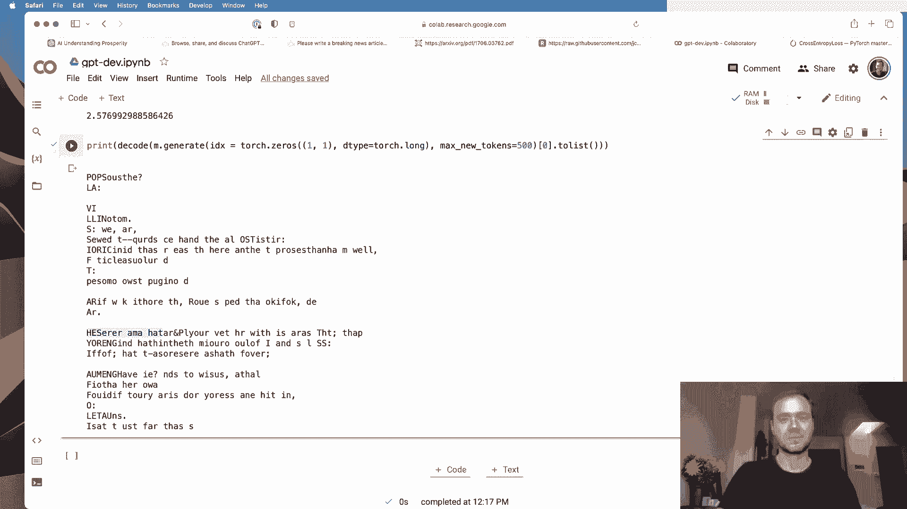

 And I'm doing this because I just want to simplify our intermediate work which is just the final project that we have at this point。

 So in the top here I put all the parameters that we defined。

 I introduced a few and I'm going to speak to that in a little bit。

 Otherwise a lot of this should be recognizable。 Reproducibility， read data。

 get the encoder and the decoder， create the train into splits。

 use the kind of like data loader that gets a batch of the inputs and targets。

 This is new and I'll talk about it in a second。 Now this is the background language model that we developed and it can forward and give us a logit and loss and it can generate。

 And then here we are creating the optimizer and this is the training loop。

 So everything here should look pretty familiar。 Now some of the small things that I added。

 number one， I added the ability to run on a GPU if you have it。 So if you have a GPU then you can。

 this will use CUDA instead of just CPU and everything will be a lot more faster。

 Now when device becomes CUDA then we need to make sure that when we load the data we move it to device。

 When we create the model we want to move the model parameters to device。

 So as an example here we have the in embedding table and it's got a dot weight inside it which stores the sort of lookup table。

 So that would be moved to the GPU so that all the calculations here happen on the GPU and they can be a lot faster。

 And then finally here when I'm creating the context that feeds it to generate I have to make sure that I create on the device。

 Number two what I introduced is the fact that here in the training loop。

 here I was just printing the loss dot item inside the training loop。

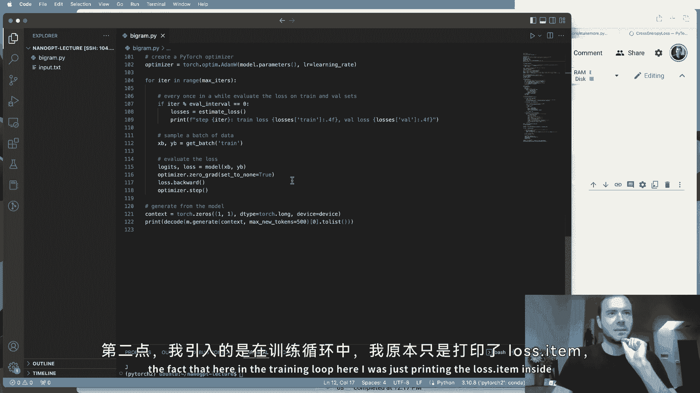

 But this is a very noisy measurement of the current loss because every batch will be more or less lucky。

 And so what I want to do usually is I have an estimate loss function and the estimate loss basically then goes up here。

 And it averages up the loss over multiple batches。

 So in particular we're going to iterate eval iter times and we're going to basically get our loss and then we're going to get the average loss for both splits。

 And so this will be a lot less noisy。 So here what we call the estimate loss we're going to report the pre accurate train and validation loss。

 Now when we come back up you'll notice a few things here。

 I'm setting the model to a valuation phase and down here I'm resetting it back to training phase。

 Now right now for our model as is this doesn't actually do anything because the only thing inside this model is this and then dot embedding。

 And this network would behave both would behave the same in both evaluation mode and training mode。

 We have no dropout layers we have no bathroom layers etc。

 But it is a good practice to think through what mode your neural network is in because some layers will have different behavior at inference time or training time。

 And there's also this context manager Torched up no grad and this is just telling PyTorch that everything that happens inside this function。

 we will not call dot backward on。 And so PyTorch can be a lot more efficient with its memory use because it doesn't have to store all the intermediate variables because we're never going to call backward。

 And so it can be a lot more memory efficient in that way。

 So also a good practice to tell PyTorch when we don't intend to do back propagation。

 So right now this script is about 120 lines of code of and that's kind of our starter code。

 I'm calling it by gram。py and I'm going to release it later。

 Now running this script gives us output in the terminal and it looks something like this。

 It basically as I ran this code it was giving me the train loss and the val loss and we see that we convert to somewhere around 2。

5 with the by-gram model。 And then here's the sample that we produced at the end。

 And so we have everything packaged up in the script and we're in a good position now to iterate on this。

 Okay， so we are almost ready to start writing our very first self-attention block for processing these tokens。

 Now before we actually get there， I want to get you used to a mathematical trick that is used in the self-attention inside a transformer。

 And it's really just like at the heart of an efficient implementation of self-attention。

 And so I want to work with this toy example to just get used to this operation and then it's going to make it much more clear once we actually get to it。

 To it in the script again。 So let's create a B by T by C where B， T and C are just 4。

 8 and 2 in this toy example。 And these are basically channels and we have batches and we have the time component and we have some information at each point in the sequence。

 So C。 Now what we would like to do is we would like these tokens。

 We have up to 8 tokens here in a batch and these 8 tokens are currently not talking to each other and we would like them to talk to each other。

 We'd like to couple them。 And in particular we want to couple them in a very specific way。

 So the token for example at the fifth location。 It should not communicate with tokens in the sixth。

 seventh and eighth location because those are future tokens in the sequence。

 The token on the fifth location should only talk to the one in the fourth， third， second and first。

 So it's only so information only flows from previous context to the current time step。

 And we cannot get any information from the future because we are about to try to predict the future。

 So what is the easiest way from tokens to communicate？

 The easiest way I would say is if we're up to if we're a fifth token and I'd like to communicate with my past。

 The simplest way we can do that is to just do an average of all the preceding elements。

 So for example if I'm the fifth token I would like to take the channels that make up that are information at my step。

 But then also the channels from the fourth step， third step， second step and the first step。

 I'd like to average those up and then that would become sort of like a feature vector that summarizes me in the context of my history。

 Now of course just doing a sum or like an average is an extremely weak form of interaction。

 Like this communication is extremely lossy。 We've lost a ton of information about spatial arrangements of all those tokens。

 But that's okay for now。 We'll see how we can bring that information back later。

 For now what we would like to do is for every single batch element independently。

 For every teeth token in that sequence we'd like to now calculate the average of all the vectors in all the previous tokens。

 And also at this token。 So let's write that out。 I have a small snippet here and instead of just fumbling around let me just copy paste it and talk to it。

 So in other words we're going to create X and the BOW is short for bag of words。

 Because bag of words is kind of like a term that people use when you are just averaging up things。

 So it's just a bag of words。 Basically there's a word stored on every one of these eight locations and we're doing a bag of words。

 So just averaging。 So in the beginning we're going to say that it's just initialized at zero。

 And then I'm doing a for loop here so we're not being efficient yet。 That's coming。

 But for now we're just iterating over all the batch dimensions independently。 Iterating over time。

 And then the previous tokens are at this batch of dimension。

 And then everything up to and including the teeth token。 So when we slice out X in this way。

 X-preve becomes of shape how many elements they were in the past。 And then of course C。

 So all the two dimensional information from these little tokens。

 So that's the previous sort of chunk of tokens from my current sequence。

 And then I'm just doing the average or the mean over the zero dimension。

 So I'm averaging out the time here。 And I'm just going to get a little C one dimensional vector which I'm going to store in X bag of words。

 So I can run this and this is not going to be very informative because。 Let's see。

 So this is X of zero。 So this is the zero with batch element and then X bow at zero。

 Now you see how the at the first location here you see that the two are equal。

 And that's because it's we're just doing an average of this one token。

 But here this one is now an average of these two。 And now this one is an average of these three。

 And so on。 So and this last one is the average of all of these elements。

 So this is the typical average just averaging up all the tokens now gives this outcome here。

 So this is all well and good， but this is very inefficient。 Now the trick is that we can be very。

 very efficient about doing this using matrix multiplication。 So that's the mathematical trick。

 And let me show you what I mean。 Let's work with the toy example here。

 Let me run it and I'll explain。 I have a simple matrix here that is three by three of all ones。

 A matrix B of just random numbers and it's a three by two。

 And a matrix C which will be three by three multiply three by two。

 which will give out a three by two。 So here we're just using matrix multiplication。

 So A multiply B gives us C。 Okay。 So how are these numbers in C achieved？ Right。

 This number in the top left is the first row of A dot product with the first column of B。

 And since all the row of A right now is all just once。

 then the dot product here with this column of B is just going to do a sum of these of this column。

 So two plus six plus six is fourteen。 The element here in the upper of C is also the first column here。

 The first row of A multiplied now with the second column of B。

 So seven plus four plus five is sixteen。 Now you see that there's repeating elements here。

 So this fourteen again is because this row is again all once and it's multiplying the first column of B。

 So we get fourteen。 And this one is and so on。 So this last number here is the last row dot product last column。

 Now the trick here is the following。 This is just a boring number of。

 it's just a boring array of all ones。 But torch has this function called the trill。

 which is short for a triangular， something like that。

 And you can wrap it in torch that once and it will just return the lower triangular portion of this。

 Okay。 So now it will basically zero out these guys here。 So we just get the lower triangular part。

 Well what happens if we do that？ So now we'll have A like this and B like this。

 And now what are we getting here in C？ Well what is this number？

 Well this is the first row times the first column。

 And because this is zeros these elements here are now ignored。 So we just get a two。

 And then this number here is the first row times the second column。

 And because these are zeros they get ignored and it's just seven。 This is seven multiplies this one。

 But look what happened here because this is one and then zeros we。

 what ended up happening is we're just plucking out the row of this row of B and that's what we got。

 Now here we have one one zero。 So here one one zero dot product with these two columns will now give us two plus six which is eight and seven plus four which is eleven。

 And because this is one one one we ended up with the addition of all of them。

 And so basically depending on how many ones and zeros we have here we are basically doing a sum currently of the variable number of these rows and that gets deposited into C。

 So currently we're doing sums because these are ones but we can also do average。 Right？

 And you can start to see how we could do average of the rows of B sort of in incremental fashion。

 Because we don't have to， we can basically normalize these rows so that they sum to one and then we're going to get an average。

 So if we took A and then we did A equals A divide a torch dot sum in the of A in the one dimension and then let's keep them as true。

 So therefore the broadcasting will work out。 So if I read from this you see now that these rows now sum to one。

 So this row is one this row is 0。5。50 and here we get one thirds。

 And now when we do A multiply B what are we getting？

 Here we are just getting the first row first row。 Here now we are getting the average of the first two rows。

 Okay so two and six average is four and four and seven averages five and five。

 And on the bottom here we're now getting the average of these three rows。

 So the average of all of elements of B are now deposited here。

 And so you can see that by manipulating these elements of this multiplying matrix and then multiplying it with any given matrix。

 We can do these averages in this incremental fashion because we just get and we can manipulate that based on the elements of A。

 Okay so that's very convenient so let's swing back up here and see how we can vectorize this and make it much more efficient using what we've learned。

 So in particular we are going to produce an array A but here I'm going to call it way short for weights。

 But this is our A and this is how much of every row we want to average up and it's going to be an average because you can see that these rows sum to one。

 So this is our A and then our B in this example of course is X。

 So what's going to happen here now is that we are going to have an X bow two。

 And this X bow two is going to be way multiplying our X。

 So let's think this through way is T by T and this is matrix multiplying in PyTorch a B by T by C。

 And it's giving us what shape so PyTorch will come here and we'll see that these shapes are not the same。

 So it will create a batch dimension here and this is a batch matrix multiply。

 And so it will apply this matrix multiplication in all the batch elements in parallel and individually。

 And then for each batch element there will be a T by T multiplying T by C exactly as we had below。

 So this will now create B by T by C and X bow two will now become identical to X bow。

 So we can see that Torch dot all close of X bow and X bow two should be true。

 Now so this kind of like commoses us that these are in fact the same。

 So X bow and X bow two if I just print them。 Okay。

 we're not going to be able to just stare it down but let me try X bow basically just at the zero element and X bow two at the zero element。

 So just the first batch and we should see that this and that should be identical which they are。

 Right， so what happened here the trick is we were able to use batch matrix multiply to do this aggregation really。

 And it's a weighted aggregation and the weights are specified in this T by T array。

 And we're basically doing weighted sums and these weighted sums are according to the weights inside here that take on sort of this triangular form。

 And so that means that a token at the teeth dimension will only get sort of information from the tokens perceiving it。

 So that's exactly what we want。 And finally I would like to rewrite it in one more way and we're going to see why that's useful。

 So this is the third version and it's also identical to the first and second。

 But let me talk through it。 It uses softmax。 So trill here is this matrix lower triangular ones。

 Way begins as all zero。 Okay， so if I just print way in the beginning it's all zero。

 Then I use masked fill。 So what this is doing is weight that mask fill it's all zeros and I'm saying for all the elements where trill is equal to zero make them be negative infinity。

 So all the elements where trill is zero will become negative infinity now。 So this is what we get。

 And then the final line here is softmax。 So if I take a softmax along every single so dim is negative one so long every single row if I do a softmax what is that going to do？

 Well softmax is also like a normalization operation。

 And so spoiler alert you get the exact same matrix。 Let me bring back the softmax。

 And recall that in softmax we're going to exponentiate every single one of these and then we're going to divide by the sum。

 And so if we exponentiate every single element here we're going to get a one and here we're going to get basically zero zero zero zero zero zero everywhere else。

 And then when we normalize we just get one。 Here we're going to get one one and then zeros and then softmax will again divide and this will give us 0。

5 and so on。 And so this is also the same way to produce this mask。

 Now the reason that this is a bit more interesting and the reason we're going to end up using it in self attention is that these weights here begin with zero。

 And you can think of this as like an interaction strength or like an affinity。

 So basically it's telling us how much of each token from the past do we want to aggregate and average up。

 And then this line is saying tokens from the past cannot communicate by setting them to negative infinity。

 We're saying that we will not aggregate anything from those tokens。

 And so basically this then goes through softmax and through the weighted and this is the aggregation through matrix multiplication。

 And so what this is now is you can think of these as these zeros are currently just set by us to be zero。

 But a quick preview is that these affinities between the tokens are not going to be just constant at zero。

 They're going to be data dependent。 These tokens are going to start looking at each other and some tokens will find other tokens more or less interesting。

 And depending on what their values are they're going to find each other interesting to different amounts and I'm going to call those affinities I think。

 And then here we are saying the future cannot communicate with the past。 We're going to clamp them。

 And then when we normalize and some we're going to aggregate sort of their values depending on how interestingly they find each other。

 And so that's the preview for self-attention。 And basically long story short from this entire section is that you can do weighted aggregations of your past elements by using matrix multiplication of a lower triangular fashion。

 And then the elements here in the lower triangular part are telling you how much of each element fuses into this position。

 So we're going to use this trick now to develop the self-attention block。

 So first let's get some quick preliminaries out of the way。

 First the thing I'm kind of bothered by is that you see how we're passing and vocab size into the constructor。

 There's no need to do that because vocab size is already defined up top as a global variable。

 So there's no need to pass this stuff around。 Next what I want to do is I don't want to actually create。

 I want to create like a level of interaction here where we don't directly go to the embedding for the logits。

 But instead we go through this intermediate phase because we're going to start making that bigger。

 So let me introduce a new variable and embed。 It's short for number of embedding dimensions。

 So an embed here will be say 32。 That was a suggestion from GitHub Copiled by the way。

 It also suggests 32 which is a good number。 So this is an embedding table and only 32 dimensional embeddings。

 So then here this is not going to give us logits directly。

 Instead this is going to give us token embeddings。 That's what I'm going to call it。

 And then to go from the token embeddings to the logits we're going to need a linear layer。 So self。

lmhead， let's call it short for language modeling head。

 is an in linear from an embed up to vocab size。 And then when we swing over here we're actually going to get the logits by exactly what the copilot says。

 Now we have to be careful here because this C and this C are not equal。

 This is an embed C and this is vocab size。 So let's just say that an embed is equal to C。

 And then this just creates one spurious layer of interaction through a linear layer but this should basically run。

 So we see that this runs and this currently looks kind of spurious but we're going to build on top of this。

 Now next up。 So far we've taken these indices and we've encoded them based on the identity of the tokens inside IDX。

 The next thing that people very often do is that we're not just encoding the identity of these tokens but also their position。

 So we're going to have a second position embedding table here。 So self。

 that position embedding table is an embedding of block size by an embed。

 And so each position from zero to block size minus one will also get its own embedding vector。

 And then here first let me decode a b by t from IDX。shape。

 And then here we're also going to have a pause embedding which is the positional embedding and these are this is tortoise arrange。

 So this will be basically just integers from zero to t minus one。

 And all of those integers from zero to t minus one get embedded through the table to create a t by c。

 And then here this gets renamed to just say x and x will be the addition of the token embedding with the positional embedding。

 And here the broadcasting note will work out so b by t by c plus t by c。

 This gets right aligned a new dimension of one gets added and it gets broadcasted across batch。

 So at this point x holds not just the token identities but the positions at which these tokens occur。

 And this is currently not that useful because of course we just had a simple binary model so it doesn't matter if you're on the fifth position the second position or wherever。

 It's all translation invariant at this stage so this information currently wouldn't help but as we work on the self attention block we'll see that this starts to matter。

 Okay so now we get the crux of self attention so this is probably the most important part of this video to understand。

 We're going to implement a small self attention for a single individual head as they're called。

 So we start off with where we were so all of this code is familiar。

 So right now I'm working with an example where I change the number of channels from two to 32 so we have a four by eight arrangement of tokens。

 And each and the information each token is currently 32 dimensional but we just are working with random numbers。

 Now we saw here that the code as we had it before does a simple weight simple average of all the past tokens and the current token。

 So it's just the previous information and current information is just being mixed together in an average。

 And that's what this code currently achieves and it does so by creating this lower triangular structure which allows us to mask out this way matrix that we create。

 So we mask it out and then we normalize it and currently when we initialize the affinities between all the different sort of tokens or nodes。

 I'm going to use those terms interchangeably。 So when we initialize the affinities between all the different tokens to be zero。

 Then we see that way gives us this structure where every single row has these uniform numbers。

 And so that's what that's what then in this matrix multiply makes it so that we're doing a simple average。

 Now we don't actually want this to be all uniform because different tokens will find different other tokens more or less interesting and we want that to be data dependent。

 So for example if I'm a vowel then maybe I'm looking for consonants in my past and maybe I want to know what those consonants are and I want that information to flow to me。

 And so I want to now gather information from the past but I want to do it in a data dependent way。

 And this is the problem that self-attention solves。

 Now the way self-attention solves this is the following。

 Every single node or every single token at each position will emit two vectors。

 It will emit a query and it will emit a key。 Now the query vector roughly speaking is what am I looking for？

 And the key vector roughly speaking is what do I contain？

 And then the way we get the affinities between these tokens now in a sequence is we basically just do a dot product between the keys and the queries。

 So my query dot products with all the keys of all the other tokens and that dot product now becomes way。

 And so if the key and the query are sort of aligned they will interact to a very high amount and then I will get to learn more about that specific token as opposed to any other token in the sequence。

 So let's implement this now。 We're going to implement a single what's called head of self-attention。

 So this is just one head。 There's a hyper parameter involved these heads which is the head size。

 And then here I'm initializing linear modules and I'm using bias equals false so these are just going to apply matrix multiply with some fixed weights。

 And now let me produce a key and Q k and Q by forwarding these modules on X。

 So the size of this will now become B by T by 16 because that is the head size and the same here B by T by 16。

 So this being that size。 So you see here that when I forward this linear on top of my X all the tokens in all the positions in the B by T arrangement all of them in parallel and independently produce a key and a query。

 So no communication has happened yet。 But the communication comes now all the queries will dart product with all the keys。

 So basically what we want is we want way now or the affinities between these to be query multiplying key。

 But we have to be careful with we can't make us multiply this we actually need to transpose K but we have to be also careful because these are when you have the batch dimension。

 So in particular we want to transpose the last two dimensions dimension negative one and dimension negative two。

 So negative two negative one。 And so this matrix multiply now will basically do the following B by T by 16。

 Matrix multiplies B by 16 by T to give us B by T by T。 Right。

 So for every row of B we're not going to have a T square matrix given us the affinities and these are now the way。

 So they're not zeros。 They are now coming from this dart product between the keys and the queries。

 So this can now run I can I can run this and the weighted aggregation now is a function in a data band and manner between the keys and queries of these nodes。

 So just inspecting what happened here。 The way takes on this form and you see that before way was just a constant so it was applied in the same way to all the batch elements。

 But now every single batch elements will have different sort of way because every single batch element contains different tokens at different positions。

 And so this is not a data dependent。 So when we look at just the zero row for example in the input。

 These are the weights that came out。 And so you can see now that they're not just exactly uniform。

 And in particular as an example here for the last row。

 This was the eighth token and the eighth token knows what content it has and it knows at what position it's in。

 And now the token based on that creates a query。 Hey， I'm looking for this kind of stuff。

 I'm a vowel。 I'm on the eight position。 I'm looking for any consonants at positions up to four。

 And then all the nodes get to emit keys and maybe one of the channels could be I am a consonant and I am in the position up to four。

 And that key would have a high number in that specific channel。

 And that's how the query and the key when they dark product they can find each other and create a high affinity。

 And when they have a high affinity like say this token was pretty interesting to this eighth token。

 When they have a high affinity then through the softmax I will end up aggregating a lot of its information into my position。

 And so I'll get to learn a lot about it。 Now just this we're looking at way after this has already happened。

 Let me erase this operation as well。 So let me erase the masking and the softmax just to show you the under the hood internals and how that works。

 So without the masking and the softmax way it comes out like this right。

 This is the outputs of the top products。 And these are the raw outputs and they take on values from negative to to positive to etc。

 So that's the raw interactions and raw affinities between all the nodes。

 But now if I'm a fifth node I will not want to aggregate anything from the sixth node。

 seventh node and the eighth node。 So actually we use the upper triangular masking。

 So those are not allowed to communicate。 And now we actually want to have a nice distribution。

 So we don't want to aggregate negative point one one of this node that's crazy。

 So instead we exponentiate and normalize。 And now we get a nice distribution that seems to want。

 And this is telling us now in the data dependent manner how much of information to aggregate from any of these tokens in the past。

 So that's way and it's not zeros anymore but it's calculated in this way。

 Now there's one more part to a single self-attention head。

 And that is that when we do the aggregation we don't actually aggregate the tokens exactly。

 We aggregate we produce one more value here and we call that the value。

 So in the same way that we produce P and query we're also going to create a value。

 And then here we don't aggregate x。 We calculate a v which is just achieved by propagating this linear on top of x again。

 And then we output way multiplied by v。 So v is the elements that we aggregate or the vectors that we aggregate instead of the raw x。

 And now of course this will make it so that the output here of the single head will be 16 dimensional because that is the head size。

 So you can think of x as kind of like private information to this token if you think about it that way。

 So x is kind of private to this token。 So I'm a fifth token and I have some identity and my information is kept in vector x。

 And now for the purposes of the single head here's what I'm interested in。

 Here's what I have and if you find me interesting here's what I will communicate to you。

 And that's stored in v。 And so v is the thing that gets aggregated for the purposes of this single head between the different nodes。

 And that's basically the self-attention mechanism。 This is what it does。

 There are a few notes that I would like to make about attention。 Number one。

 attention is a communication mechanism。 You can really think about it as a communication mechanism where you have a number of nodes in a directed graph where basically you have edges pointed between nodes like this。

 And what happens is every node has some vector of information and it gets to aggregate information via a weighted sum from all nodes that point to it。

 And this is done in a data dependent manner。 So depending on whatever data is actually stored at each node at any point in time。

 Now our graph doesn't look like this。 Our graph has a different structure。

 We have eight nodes because the block size is eight and there's always eight top tokens。

 And the first node is only pointed to by itself。 The second node is pointed to by the first node and itself all the way up to the eighth node which is pointed to by all the previous nodes and itself。

 And so that's the structure that our directed graph has or happens to have in other aggressive sort of scenario like language modeling。

 But in principle attention can be applied to any arbitrary directed graph and it's just a communication mechanism between the nodes。

 The second note is that notice that there's no notion of space。

 So attention simply acts over like a set of vectors in this graph。

 And so by default these nodes have no idea where they are positioned in the space。

 And that's why we need to encode them positionally and sort of give them some information that is anchored to a specific position so that they sort of know where they are。

 And this is different than for example from convolution because if you run for example a convolution operation over some input。

 There is a very specific sort of layout of the information in space and the convolutional filters sort of act in space。

 And so it's not like an attention。 An attention is just a set of vectors out there in space they communicate and if you want them to have a notion of space you need to specifically add it。

 Which is what we've done when we calculated the relative the positional encodings and added that information to the vectors。

 The next thing that I hope is very clear is that the elements across the batch dimension which are independent examples never talk to each other。

 They're always processed independently and this is a bashed matrix multiply that applies basically a matrix multiplication kind of imperilable across the batch dimension。

 So maybe it would be more accurate to say that in this analogy of a directed graph we really have because the backside is four。

 We really have four separate pools of eight nodes and those eight nodes only talk to each other but in total there's like 32 nodes that are being processed。

 But there's sort of four separate pools of eight you can look at that way。

 The next note is that here in the case of language modeling we have this specific structure of directed graph where the future tokens will not communicate to the past tokens。

 But this doesn't necessarily have to be the constraint in the general case。

 And in fact in many cases you may want to have all of the nodes talk to each other fully。

 So as an example if you're doing sentiment analysis or something like that with a transformer you might have a number of tokens and you may want to have them all talk to each other fully。

 Because later you are predicting for example the sentiment of the sentence。

 And so it's okay for these nodes to talk to each other。

 And so in those cases you will use an encoder block of self-attention。

 And all it means that it's an encoder block is that you will delete this line of code allowing all the nodes to completely talk to each other。

 What we're implementing here is sometimes called a decoder block。

 And it's called a decoder because it is sort of like decoding language and it's got this autoregressive format where you have to mask with the trindula matrix so that no code is not。

 And this is a case of a decoder block。 And so basically in encoder blocks you would delete this。

 allow all the nodes to talk。 In decoder blocks this will always be present so that you have this trindula structure。

 But both are allowed and attention doesn't care。 Attention supports arbitrary connectivity between nodes。

 The next thing I wanted to comment on is you keep me， you keep hearing me say attention。

 self-attention， etc。 There's actually also something called cross-attention。 What is the difference？

 So basically the reason this attention is self-attention is because the keys。

 queries and the values are all coming from the same source from x。

 So the same source x produces key queries and values。 So these nodes are self-attending。

 But in principle attention is much more general than that。

 So for example in encoder decoder transformers you can have a case where the query is not the same。

 So for example in encoder decoder transformers you can have a case where the queries are produced from x。

 But the keys and the values come from a whole separate external source and sometimes from the encoder blocks that encode some context that we'd like to condition on。

 And so the keys and the values will actually come from a whole separate source。

 Those are nodes on the side and here we're just producing queries and we're reading off information from the side。

 So cross-attention is used when there's a separate source of nodes we'd like to pull information from into our nodes。

 And it's self-attention if we just have nodes that we'd like to look at each other and talk to each other。

 So this attention here happens to be self-attention。

 But in principle attention is a lot more general。 Okay and the last note at this stage is if we come to the attention is only need paper here。

 We've already implemented attention so given query key and value we've multiplied the query on the key。

 We've soft-maxed it and then we are aggregating the values。

 There's one more thing that we're missing here which is the dividing by one over square root of the head size。

 The decay here is the head size。 Why aren't they doing this one？ It's important。

 So they call it a scaled attention。 And it's kind of like an important normalization to basically have。

 The problem is if you have unit Gaussian inputs so zero mean unit variance。

 K and Q are unit Gaussian then if you just do way naively then you see that your way actually will be the variance will be on the order of head size which in our case is 16。

 But if you multiply by one over head size square root so this is square root and this is one over then the variance of way will be one so it will be preserved。

 Now why is this important？ You'll notice that way here will feed into softmax。

 And so it's really important especially at initialization that way be fairly diffuse。

 So in our case here we sort of locked out here and way at a fairly diffuse numbers here。

 So like this。 Now the problem is that because of softmax if weight takes on very positive and very negative numbers inside it。

 softmax will actually converge towards one hot vectors。 And so I can illustrate that here。

 Say we are applying softmax to a tensor of values that are very close to zero then we're going to get a diffuse thing out of softmax。

 But the moment I take the exact same thing and I start sharpening it making it bigger by multiplying these numbers by eight for example。

 You'll see that the softmax will start to sharpen and in fact it will sharpen towards the max。

 So it will sharpen towards whatever number here is the highest。

 And so basically we don't want these values to be too extreme especially at initialization otherwise softmax will be way too peaky。

 And you're basically aggregating information from like a single node。

 Every node just aggregates information from a single other node。

 That's not what we want especially at initialization。

 And so the scaling is used just to control the variance at initialization。

 Okay so having said all that let's now take our self-attention knowledge and let's take it for a spin。

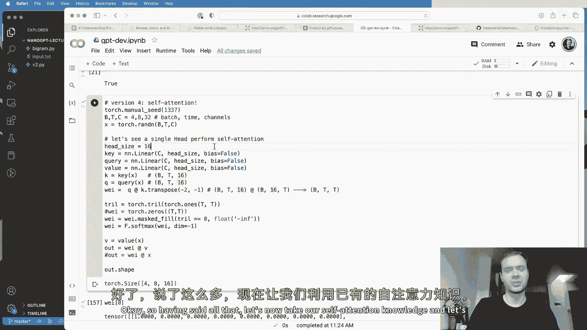

 So here in the code I created this head module and implements a single head of self-attention。

 So you give it a head size and then here it creates the key query and the value linear layers。

 Typically people don't use biases in these。 So those are the linear projections that we're going to apply to all of our nodes。

 Now here I'm creating this trill variable。 Trill is not a parameter of the module。

 So in sort of pytorch naming conventions this is called a buffer。

 It's not a parameter and you have to assign it to the module using a register buffer。

 So that creates the trill。 The lower triangular matrix。

 And when we're given the input X this should look very familiar now。 We calculate the keys。

 the queries， we calculate the attention scores in segue。

 We normalize it so we're using scaled attention here。

 Then we make sure that sure doesn't communicate with the past。 So this makes it a decoder block。

 And then softmax and then aggregate the value and output。

 Then here in the language model I'm creating a head in the constructor and I'm calling it self-attention head。

 And the head size I'm going to keep as the same and embed。 Just for now。

 And then here once we've encoded the information with the token embeddings and the position embeddings。

 We're simply going to feed it into the self-attention head。

 And then the output of that is going to go into the decoder language modeling head and create the logits。

 So this is sort of the simplest way to plug in a self-attention component into our network right now。

 I have to make one more change which is that here in the generate we have to make sure that our。

 IDX that we feed into the model。 Because now we're using positional embeddings we can never have more than block size coming in。

 Because if IDX is more than block size then our position embedding table is going to run out of scope。

 Because it only has embeddings for up to block size。

 And so therefore I added some code here to crop the context that we're going to feed into self。

 So that we never pass in more than block size elements。

 So those are the changes and let's now train the network。

 Okay so I also came up to the script here and I decreased the learning rate because the self-attention can't tolerate very very high learning rates。

 And then I also increased the number of iterations because the learning rate is lower。

 And then I trained it and previously we were only able to get to up to 2。5 and now we are down to 2。

4。 So we definitely see a little bit of improvement from 2。5 to 2。

4 roughly but the text is still not amazing。 So clearly the self-attention has been doing some useful communication but we still have a long way to go。

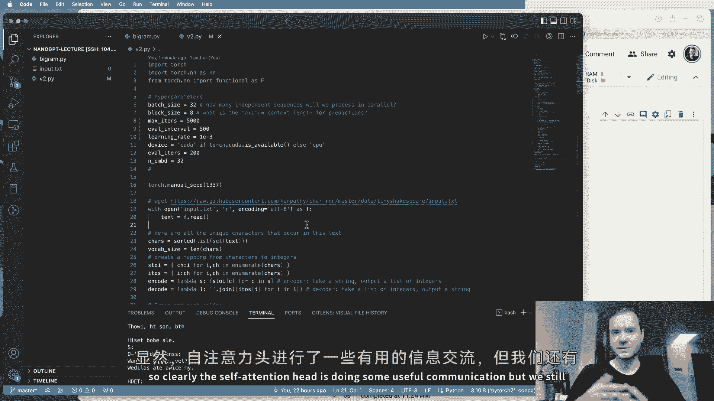

 Okay so now we've implemented the scale。product。attention。

 Now next up in the attention is all you need paper。 There's something called multi-head attention。

 And what is multi-head attention？ It's just applying multiple attentions in parallel and concatenating the results。

 So they have a little bit of diagram here。 I don't know if this is super clear。

 It's really just multiple attentions in parallel。

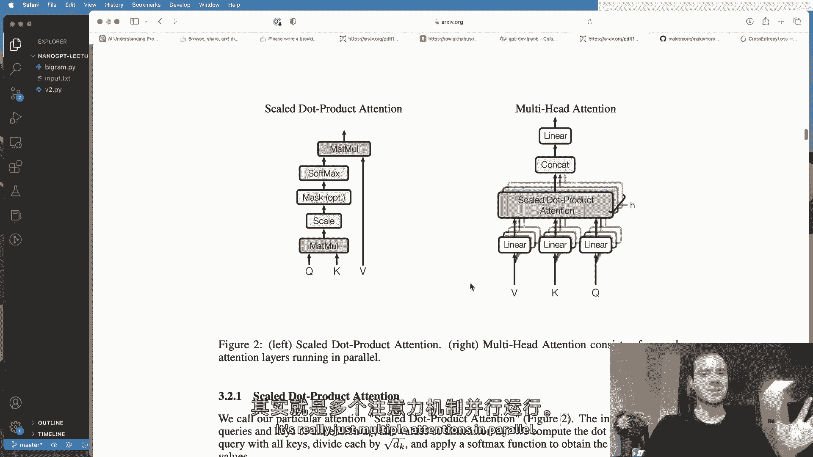

 So let's implement that fairly straightforward。 If we want a multi-head attention then we want multiple heads of self-attention running in parallel。

 So in PyTorch we can do this by simply creating multiple heads。

 So however many heads you want and then what is the head size of each。

 And then we run all of them in parallel into a list and simply concatenate all of the outputs。

 And we're concatenating over the channel dimension。

 So the way this looks now is we don't have just a single attention that has a head size of 32。

 Because remember N-Embed is 32。 Instead of having one communication channel we now have four communication channels in parallel。

 And each one of these communication channels typically will be smaller correspondingly。

 So because we have four communication channels we want eight dimensional self-attention。

 And so from each communication channel we're going to gather eight dimensional vectors。

 And then we have four of them and that concatenates to give us 32 which is the original N-Embed。

 And so this is kind of similar to if you're familiar with convolutions this is kind of like a group convolution。

 Because basically instead of having one large convolution we do convolution in groups。

 And that's multi-headed self-attention。 And so then here we just use S/A heads self-attention heads instead。

 Now I actually ran it and scrolling down。 I ran the same thing and then we now get this down to 2。

28 roughly。 And the operation is still not amazing but clearly the validation loss is improving because we were at 2。

4 just now。 And so it helps to have multiple communication channels because obviously these tokens have a lot to talk about。

 They want to find the consonants， the vowels， they want to find the vowels just from certain positions。

 They want to find any kinds of different things。 And so it helps to create multiple independent channels of communication。

 gather lots of different types of data and then decode the output。

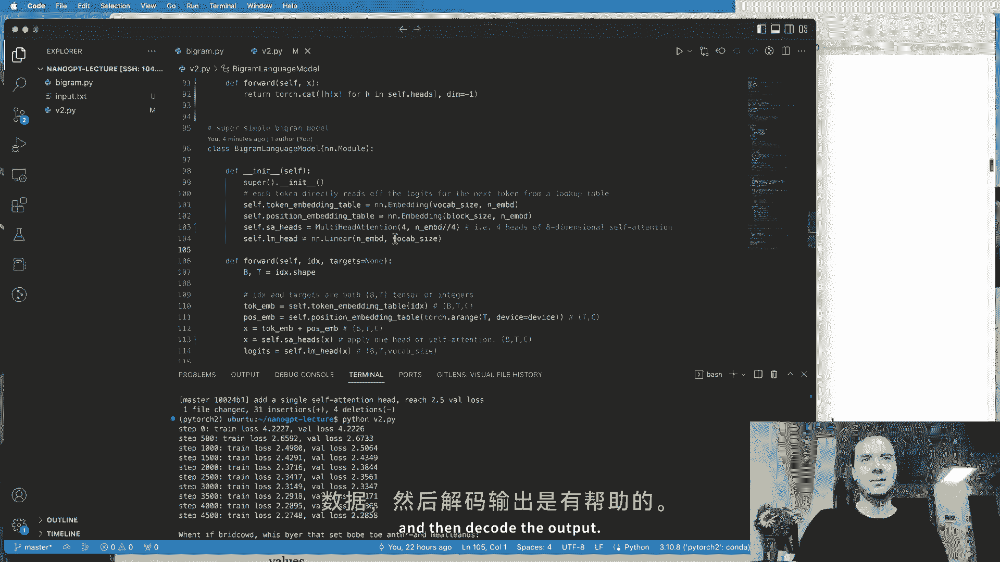

 Now going back to the paper for a second。 Of course I didn't explain this figure in full detail but we are starting to see some components of what we've already implemented。

 We have the positional encodings， token encodings that add。

 we have the masked multi-headed attention implemented。

 Now here's another multi-headed attention which is a cross-attention to an encoder which we haven't。

 we're not going to implement in this case。 I'm going to come back to that later。

 But I want you to notice that there's a feed-forward part here and then this is grouped into a block that gets repeated again and again。

 Now the feed-forward part here is just a simple multi-layer projection。 So the multi-headed。

 so here position wise feed-forward networks is just a simple little MLP。

 So I want to start basically in a similar fashion also adding computation into the network。

 And this computation is on a per node level。 So I've already implemented it and you can see the diff highlighted on the left here when I've added or changed things。

 Now before we had the multi-headed self-attention that did the communication but we went way too fast to calculate the logits。

 So the tokens looked at each other but didn't really have a lot of time to think on what they found from the other tokens。

 And so what I've implemented here is a little feed-forward single layer and this little layer is just a linear followed by a row nonlinearity and that's it。

 So it's just a little layer and then I call it feed-forward and embed。

 And then this feed-forward is just called sequentially right after the self-attention。

 So we self-attend then we feed-forward and you'll notice that the feed-forward here when it's applying linear。

 this is on a per token level。 All the tokens do this independently。

 So the self-attention is the communication and then once they've gathered all the data。

 now they need to think on that data individually。 And so that's what feed-forward is doing and that's why I've added it here。

 Now when I train this， the validation loss actually continues to go down now to 2。

24 which is down from 2。28。 The outputs still look kind of terrible but at least we've improved the situation。

 And so as I preview， we're going to now start to interspers the communication with the computation。

 And that's also what the transformer does when it has blocks that communicate and then compute and it groups them and replicates them。

 Okay， so let me show you what we'd like to do。

 We'd like to do something like this。 We have a block and this block is basically this part here except for the cross-attention。

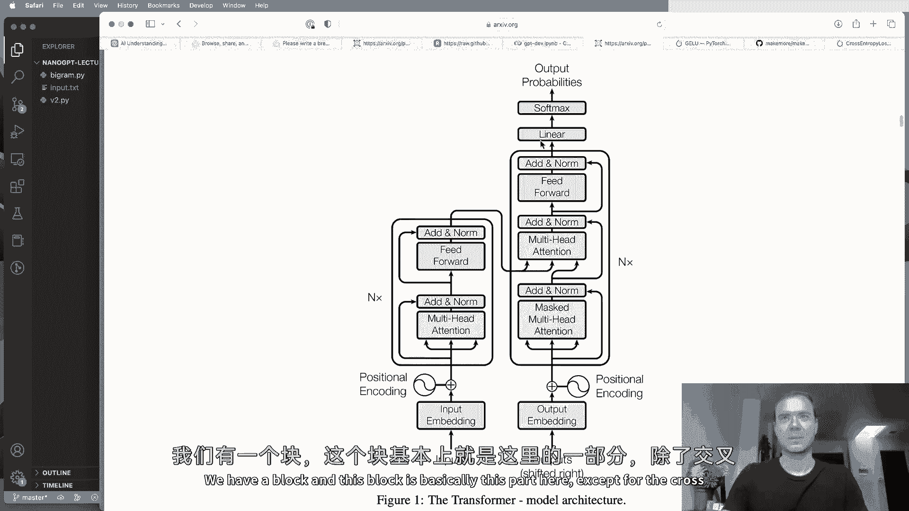

 Now the block basically intersperses communication and the computation。

 The computation is done using multi-headed self-attention and then the computation is done using a feed-forward network on all the tokens independently。

 Now what I've added here also is you'll notice this takes the number of embeddings in the embedding dimension and the number of heads that we would like which is kind of like group sizing group convolution。

 And I'm saying that number of heads we'd like is 4 and so because this is 32 we calculate that because this 32 the number of heads should be 4。

 The head size should be 8 so that everything sort of works out channel-wise。

 So this is how the transformer structures sort of the sizes typically。

 So the head size will become 8 and then this is how we want to interspers them。

 And then here I'm trying to create blocks which is just a sequential application of block block block so that we're interspersing communication feed-forward many many times and then finally we decode。

 Now actually try to run this and the problem is this doesn't actually give a very good answer。

 A very good result。 And the reason for that is we're starting to actually get like a pretty deep neural net and deep neural nets suffer from optimization issues and I think that's where we're kind of like slightly starting to run into。

 So we need one more idea that we can borrow from the transformer paper to resolve those difficulties。

 Now there are two optimizations that dramatically help with the depth of these networks and make sure that the networks remain optimizable。

 Let's talk about the first one。 The first one in this diagram is you see this arrow here and then this arrow and this arrow。

 Those are skip connections or sometimes called residual connections。

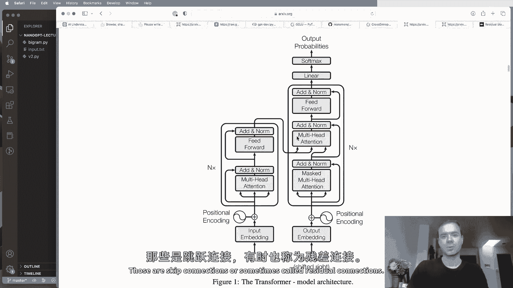

 They come from this paper， the procedural learning from a direct mission from about 2015 that introduced the concept。

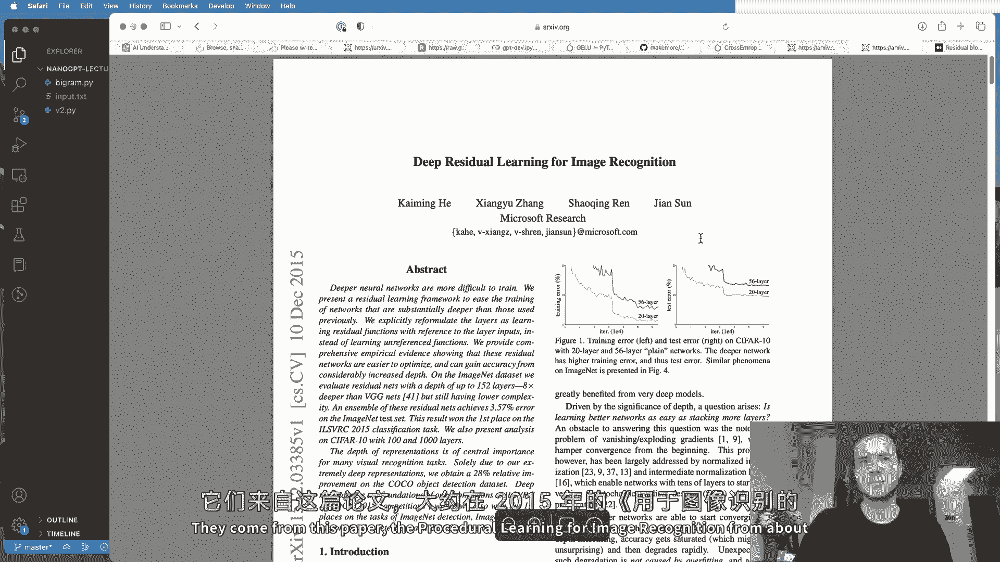

 Now these are basically what it means is you transform data but then you have a skip connection with addition from the previous features。

 Now the way I like to visualize it that I prefer is the following。

 Here the computation happens from the top to bottom and basically you have this residual pathway and you are free to fork off from the residual pathway。

 perform some computation and then project back to the residual pathway via addition。

 And so you go from the inputs to the targets only the plus and plus and plus。

 And the reason this is useful is because during that propagation remember from our micrograt video earlier addition distributes gradients equally to both of its branches that fed us the input。

 And so the supervision or the gradients from the loss basically hop through every addition node all the way to the input and then also fork off into the residual blocks。

 But basically have this gradient super highway that goes directly from the supervision all the way to the input unimpeded。

 And then these visual blocks are usually initialized in the beginning so they contribute very very little if anything to the residual pathway。

 They are initialized that way。 So in the beginning they are almost kind of like not there。

 But then during the optimization they come online over time and they start to contribute but at least at the initialization you can go from directly supervision to the input。

 Gradient is unimpeded and just close and then the blocks over time kick in。

 And so that dramatically helps with the optimization。

 So let's implement this。 So coming back to our block here basically what we want to do is we want to do x equals x plus self attention and x equals x plus self that feed forward。

 So this is x and then we fork off and do some communication and come back。

 And we fork off and we do some computation and come back。 So those are residual connections。

 And then swinging back up here we also have to introduce this projection。 So and then that linear。

 And this is going to be from after we concatenate this this is the size and embed。

 So this is the output of the self attention itself。

 But then we actually want the to apply the projection and that's the result。

 So the projection is just a linear transformation of the outcome of this layer。

 So that's the projection back into the residual pathway。

 And then here in a feed forward it's going to be the same thing。

 I could have a self that projection here as well but let me just simplify it and let me couple it inside the same sequential container。

 And so this is the projection layer going back into the residual pathway。 And so that's it。

 So now we can train this。 So I'm going to do one more small change。

 When you look into the paper again you see that the dimensionality of input and output is 512 for them。

 And they're saying that the inner layer here in the feed forward has dimensionality of 2048。

 So there's a multiplier of four。 And so the inner layer of the feed forward network should be multiplied by four in terms of channel sizes。

 So I came here and I multiplied four times embed here for the feed forward。

 And then from four times and embed coming back down to an embed when we go back to the projection。

 So adding a bit of computation here and growing that layer that is in the residual block on the side of the residual pathway。

 And then I train this and we actually get down all the way to 2。08 validation loss。

 And we also see that network is starting to get big enough that our train loss is getting ahead of validation loss。

 So we start to see like a little bit of overfitting。

 And our generations here are still not amazing but at least you see that we can see like is here this now grief sink。

 Like this starts to almost look like English。 So yeah we're starting to really get there。

 Okay and the second innovation that is very helpful for optimizing very deep neural networks is right here。

 So we have this addition now that's the residual part。

 But this norm is referring to something called layer norm。 So layer norm is implemented in PyTorch。

 It's a paper that came out a while back here。 And layer norm is very very similar to Bachelorm。

 So remember back to our Make More Series part 3。 We implemented Bachelormalization。

 And Bachelormalization basically just made sure that across the batch dimension any individual neuron had unit Gaussian distribution。

 So with zero mean and unit standard deviation one standard deviation upward。

 So what I did here is I'm copy pasting the Bachelorm 1D that we developed in our Make More Series。

 And see here we can initialize for example this module and we can have a batch of 32 100 dimensional vectors feeding through the Bachelorm layer。

 So what this does is it guarantees that when we look at just the zero column it's a zero mean one standard deviation。

 So it's normalizing every single column of this input。

 Now the rows are not going to be normalized by default because we're just normalizing columns。

 So let's not implement layer norm。 It's very complicated。 Look。

 we come here we change this from zero to one。 So we don't normalize the columns we normalize the rows。

 And now we've implemented layer norm。 So now the columns are not going to be normalized。

 But the rows are going to be normalized。 For every individual example it's 100 dimensional vector is normalized in this way。

 And because our computation now does not span across examples we can delete all of this buffers stuff。

 Because we can always apply this operation and don't need to maintain any running buffers。

 So we don't need the buffers。 We don't。 There's no distinction between training and test time。

 And we don't need these running buffers。 We do keep gamma and beta。 We don't need the momentum。

 We don't care if it's training or not。 And this is now a layer norm。

 And it normalizes the rows instead of the columns。

 And this here is identical to basically this here。

 So let's now implement layer norm in our transformer。

 Before I incorporate the layer norm I just wanted to note that as I said very few details about the transformer have changed in the last five years。

 But this is actually something that's likely the parts from the original paper。

 You see that the add and norm is applied after the transformation。

 But now it is a bit more basically common to apply the layer norm before the transformation。

 So there's a reshuffling of the layer norms。 So this is called the pre-norm formulation and that the one that we're going to implement as well。

 So select deviation from the original paper。

 Basically we need to in the layer norms layer norm one is an end dot layer norm。

 And we tell it how many words the embedding dimension。 And we need the second layer norm。

 And then here the layer norms are applied immediately on X。

 So self dot layer norm one in applied on X。 And self dot layer norm two applied on X。

 Before it goes into self attention and feed forward。

 And the size of the layer norm here is an embeds of 32。

 So when the layer norm is normalizing our features。

 It is the normalization here。 Happens。 The mean and the variance are taken over 32 numbers。

 So the batch and the time act as batch dimensions both of them。

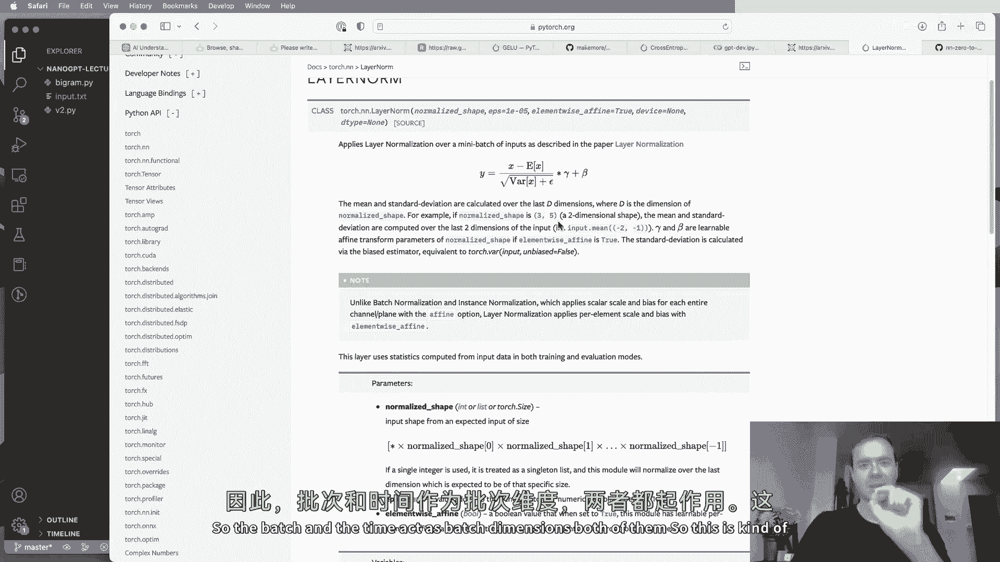

 So this is kind of like a per token transformation that just normalizes the features and makes them unit mean。

 unit Gaussian at initialization。

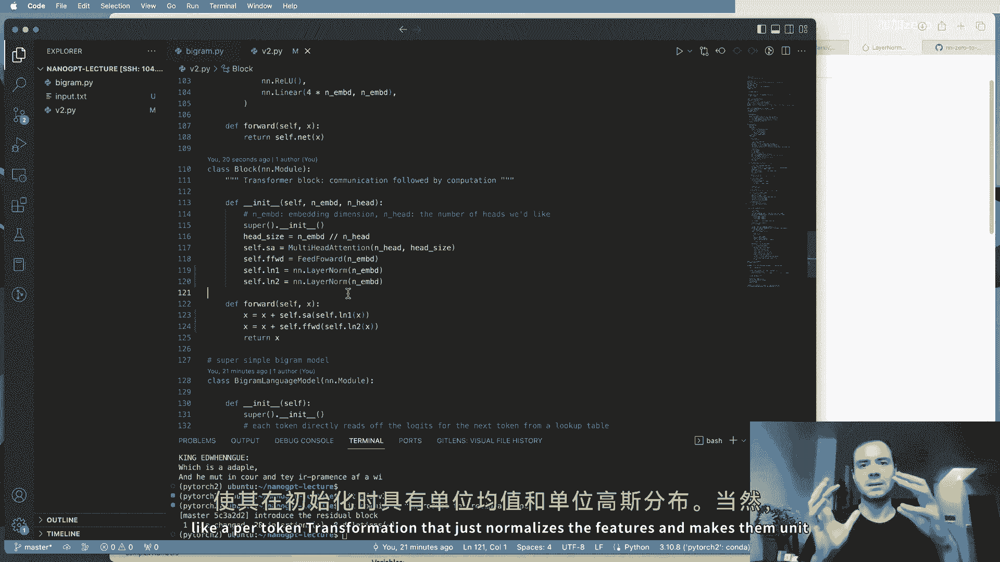

 But of course because these layer norms inside it have these gamma and beta trainable parameters。

 The layer normal eventually create outputs that might not be unit Gaussian。

 But the optimization will determine that。 So for now this is the this is incorporating the layer norms and let's train them up。

 Okay， so I let it run and we see that we get down to 2。06， which is better than the previous 2。08。

 So a slight improvement by adding the layer norms。

 And I'd expect that they help even more if we have bigger and deeper network。

 One more thing I forgot to add is that there should be a layer norm here also typically as at the end of the transformer and right before the final linear layer that decodes into vocabulary。

 So I added that as well。 So at this stage we actually have a pretty complete transformer according to the original paper and it's a decoder only transformer。

 I'll talk about that in a second。 But at this stage the major pieces are in place so we can try to scale this up and see how well we can push this number。

 Now in order to scale up the model I had to perform some cosmetic changes here to make it nicer。

 So I introduced this variable called n layer which just specifies how many layers of the blocks we're going to have。

 I create a bunch of blocks and we have a new variable number of heads as well。

 I pulled out the layer norm here and so this is identical。

 Now one thing that I did briefly change is I added a dropout。

 So dropout is something that you can add right before the residual connection back。

 right before the connection back into the residual pathway。

 So we can drop out that as the last layer here。 We can dropout here at the end of the multi-headed retention as well。

 And we can also dropout here when we calculate the basically the affinities and after the softmax we can dropout some of those。

 So we can randomly prevent some of the nodes from communicating。

 And so dropout comes from this paper from 2014 or so and basically it takes your neural mat。

 And it randomly， every forward backward pass， shuts off some subset of neurons。

 So randomly drops them to zero and trains without them。

 And what this does effectively is because the mask of what's being dropped out has changed every single forward backward pass。

 it ends up kind of training an ensemble of subnetworks。

 And then at test time everything is fully enabled and kind of all of those subnetworks are merged into a single ensemble。

 If you want to think about it that way。 So I would read the paper to get the full detail。

 For now we're just going to stay on the level of this is a regularization technique。

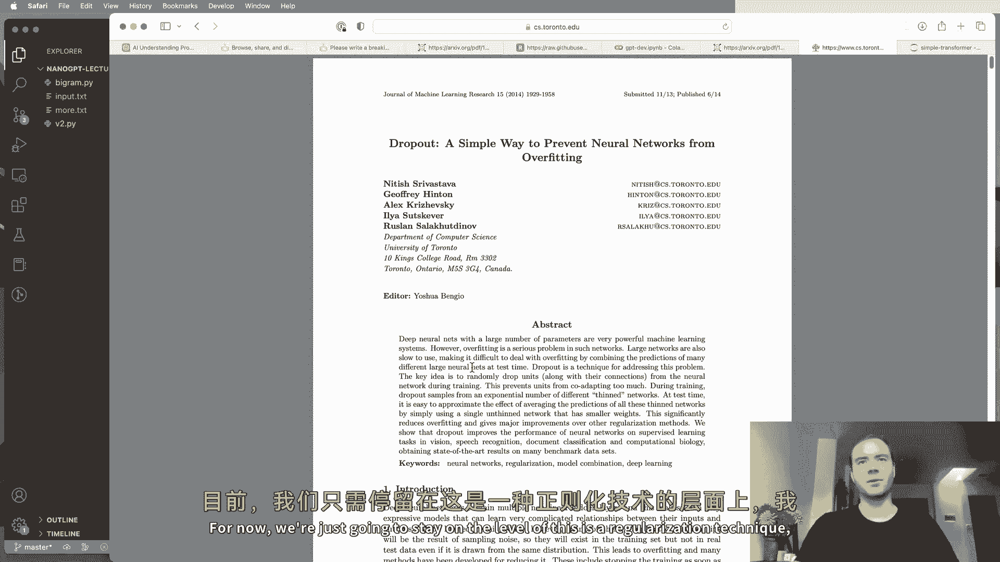

 And I added it because I'm about to scale up the model quite a bit and I was concerned about overfitting。

 So now when we scroll up to the top we'll see that I changed a number of hyperparameters here about our neural mat。

 So I made the batch size be much larger now 64。 I changed the block size to be 256。

 So previously it was just eight characters of context。

 Now it is 256 characters of context to predict the 257th。

 I brought down the learning rate a little bit because the neural mat is now much bigger。

 So I brought down the learning rate。 The embedding dimension is not 384 and there are six heads。

 So 384 divide six means that every head is 64 dimensional as it as a standard。

 And then there are going to be six layers of that。 And the dropout will be at 0。2。

 So every forward backward pass 20% of all these intermediate calculations are disabled and dropped to zero。

 And then I already trained this and I ran it。 So drumroll how does it perform？

 So let me just scroll up here。 We get a validation loss of 1。

48 which is actually quite a bit of an improvement on what we had before which I think was 2。07。

 So we went from 2。07 all the way down to 1。48 just by scaling up this neural mat with the code that we have。

 And this of course ran for a lot longer。 This may be trained for I want to say about 15 minutes on my A100 GPU。

 So that's a pretty good GPU。 And if you don't have a GPU you're not going to be able to reproduce this。

 On a CPU this would be I would not run this on a CPU or a MacBook or something like that。

 You'll have to break down the number of layers and the embedding dimension and so on。

 But in about 15 minutes we can get this kind of a result and I'm printing some of the Shakespeare here。

 But what I did also is I printed 10，000 characters so a lot more and I wrote them to a file。

 And so here we see some of the outputs。 So it's a lot more recognizable as the input text file。

 So the input text file just for reference looked like this。

 So there's always like someone speaking in this matter。 And our predictions now take on that form。

 Except of course they're nonsensical when you actually read them。 So it is every crimp to be house。

 Oh those preplation。 We give heed。 You know。 Oh oh sent me you mighty lord。

 Anyway so you can read through this。 It's nonsensical of course but this is just a transformer trained on the character level for one million characters that come from Shakespeare。

 So there's sort of like blabbers on in Shakespeare like manner but it doesn't of course make sense at this scale。

 But I think I think still a pretty good demonstration of what's possible。

 So now I think that kind of like concludes the programming section of this video。

 We basically kind of did a pretty good job in implementing this transformer but the picture doesn't exactly match up to what we've done。

 So what's going on with all these additional parts here。

 So let me finish explaining this architecture and why it looks so funky。

 Basically what's happening here is what we implemented here is a decoder only transformer。

 So there's no component here。 This part is called the encoder and there's no cross attention block here。

 Our block only has a self attention and the feed forward。

 So it is missing this third in between piece here。 This piece does cross attention。

 So we don't have it and we don't have the encoder。

 We just have the decoder and the reason we have a decoder only is because we are just generating text and it's unconditioned on anything。

 We're just blabbering on according to a given data set。

 What makes it a decoder is that we are using the triangular mask in our transformer。

 So it has this autoregressive property where we can just go and sample from it。

 So the fact that it's using the triangular mask to mask out the attention makes it a decoder and it can be used for language modeling。

 Now the reason that the original paper had an encoder decoder architecture is because it is a machine translation paper。

 So it is concerned with a different setting in particular。

 It expects some tokens that encode say for example French and then it is expected to decode the translation in English。

 So typically these here are special tokens。 So you are expected to read in this and condition on it。

 And then you start off the generation with a special token called start。

 So this is a special new token that you introduce and always place in the beginning。

 And then the network is expected to output neural networks are awesome and then a special end token to finish the generation。

 So this part here will be decoded exactly as we have done it。 Neural networks are awesome。

 will be identical to what we did。 But unlike what we did they want to condition the generation on some additional information。

 And in that case this additional information is the French sentence that they should be translating。

 And what they do now is they bring the encoder。 Now the encoder reads this part here。

 So we are only going to take the part of French and we are going to create tokens from it exactly as we have seen in our video。

 And we are going to put a transformer on it。 But there is going to be no triangular mask and so all the tokens are allowed to talk to each other as much as they want。

 And they are just encoding whatever the content of this French sentence。

 Once they've encoded it they basically come out in the top here。

 And then what happens here is in our decoder which does the language modeling。

 There is an additional connection here to the outputs of the encoder。

 And that is brought in through cross-attention。 So the queries are still generated from X but now the keys and the values are coming from the side。

 The keys and the values are coming from the top generated by the nodes that came outside of the encoder。

 And those tops， the keys and the values there， the top of it feed in on the side into every single block of the decoder。

 And so that is why there is an additional cross-attention。

 And really what it is doing is it is conditioning the decoding not just on the past of this current decoding but also on having seen the fully encoded French sentence。

 And so it is an encoded decoder model which is why we have those two transformers and additional blocks and so on。

 So we did not do this because we have nothing to encode。 There is no conditioning。

 We just have a text file and we just want to imitate it。

 And that is why we are using a decoder only transformer exactly as done in GPT。

 Okay so now I wanted to do a very brief walkthrough of nano GPT which you can find on my GitHub。

 And nano GPT is basically two files of interest。 There is trained。py and modeled。py。 trained。

py is all the boilerplate code for training the network。

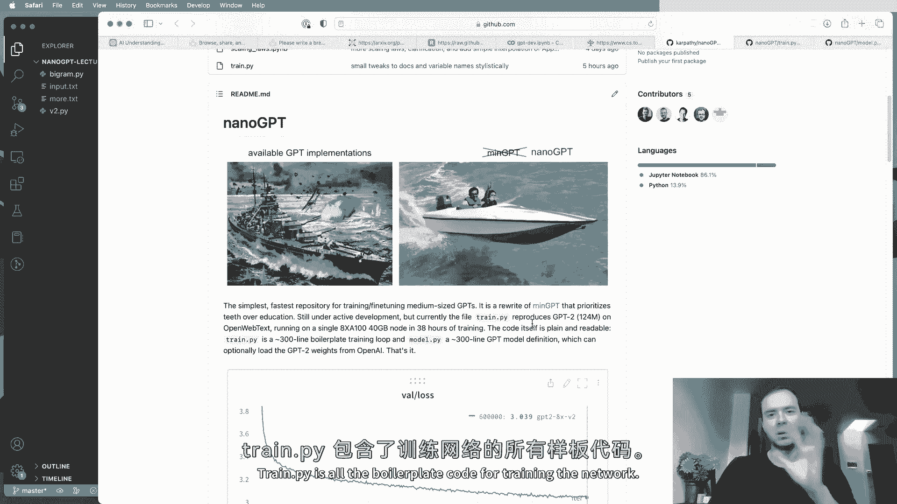

 It is basically all the stuff that we had here is the training loop。

 It is just that it is a lot more complicated because we are saving and loading checkpoints and pre-trained weights and we are decaying the learning rate and compiling the model and using distributed training across multiple nodes or GPUs。

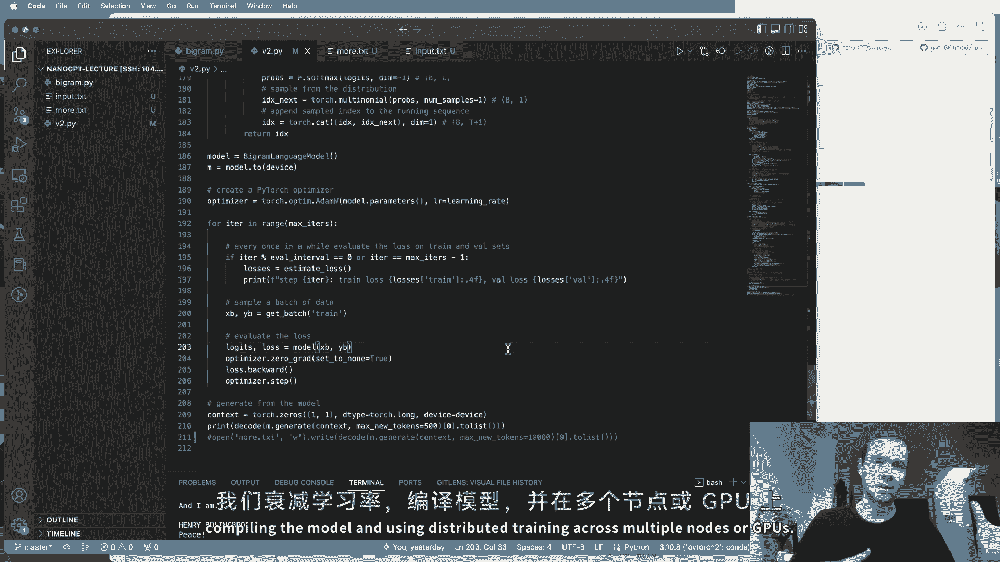

 So the training。py gets a little bit more hairy， complicated。 There is more options etc。

 But the model。py should look very very similar to what we have done here。

 In fact the model is almost identical。 So first here we have the causal self-attention block and all of this should look very very recognizable to you。

 We are producing queries， keys， values。 We are doing dot products。 We are masking， applying softmax。

 optionally dropping out。 And here we are pulling the values。

 What is different here is that in our code I have separated out the multi-headed attention into just a single individual head。

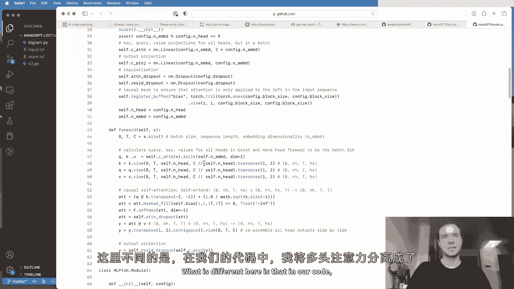

 And then here I have multiple heads and I explicitly concatenate them。

 Whereas here all of it is implemented in a batched manner inside a single causal self-attention。

 And so we don't just have a B and a T and a C dimension。

 We also end up with a fourth dimension which is the heads。

 And so it just gets a lot more sort of hairy because we have four dimensional array tensors now。

 But it is equivalent mathematically。

 So the exact same thing is happening as what we have。

 It's just a bit more efficient because all the heads are now treated as a batch dimension as well。

 Then we have the multiple-way perceptron。 It's using the Galoon nonlinearity which is defined here instead of RALU。

 And this is done just because OpenAI used it and I want to be able to load their checkpoints。

 The blocks of the transformer are identical。 The communicate and the compute phase as we saw。

 And then the GPT will be identical。 We have the position encodings， token encodings， the blocks。

 the layer norm at the end， the final linear layer。 And this should look all very recognizable。

 And there's a bit more here because I'm loading checkpoints and stuff like that。

 I'm separating out the parameters into those that should be weight-decade and those that shouldn't。

 But the generate function should also be very very similar。

 So a few details are different but you should definitely be able to look at this file and be able to understand a lot of the pieces now。

 So let's now bring things back to Chacupt。 What would it look like if we wanted to train Chacupt ourselves and how does it relate to what we learned today？

 Well to train in Chacupt there are roughly two stages。

 First is the pre-training stage and then the fine-tuning stage。

 In the pre-training stage we are training on a large chunk of internet and just trying to get a first decoder-only transformer。

 To babble text。 So it's very very similar to what we've done ourselves。

 Except we've done like a tiny little baby pre-training step。

 And so in our case this is how you print a number of parameters。

 I printed it and it's about 10 million。 So this transformer that I created here to create little Shakespeare transformer was about 10 million parameters。

 Our dataset is roughly 1 million characters。 So roughly 1 million tokens。

 But you have to remember that opening eyes is different vocabulary。

 They're not on the character level。 They use these sub-word chunks of words。

 And so they have a vocabulary of 50，000 roughly elements。

 And so their sequences are a bit more condensed。 So our dataset。

 the Shakespeare dataset would be probably around 300。

000 tokens in the opening eye vocabulary roughly。 So we trained about 10 million parameter model on roughly 300。

000 tokens。

 Now when you go to the GPT-3 paper and you look at the transformers that they trained。

 they trained a number of transformers of different sizes。

 But the biggest transformer here has 175 billion parameters。 So ours is again 10 million。

 They used this number of layers in a transformer。 This is the end in bed。

 This is the number of heads。 And this is the head size。 And then this is the batch size。

 So ours was 65。 And the learning rate is similar。 Now when they train this transformer。

 they trained on 300 billion tokens。 So again， remember ours is about 300，000。

 So this is about a million fold increase。 And this number would not be even that large by today's standards。

 You'd be going up 1 trillion above。 So they are training a significantly larger model on a good chunk of the internet。

 And that is the pre-training stage。 But otherwise these hyperparameters should be fairly recognizable to you。

 And the architecture is actually like nearly identical to what we implemented ourselves。

 But of course it's a massive infrastructure challenge to train this。

 You're talking about typically thousands of GPUs having to talk to each other to train models of this size。

 So that's just the pre-training stage。 Now after you complete the pre-training stage。

 you don't get something that responds to your questions with answers。 And it's not helpful and etc。

 You get a document complete。

 So it babbles， but it doesn't babbles Shakespeare。 It babbles internet。

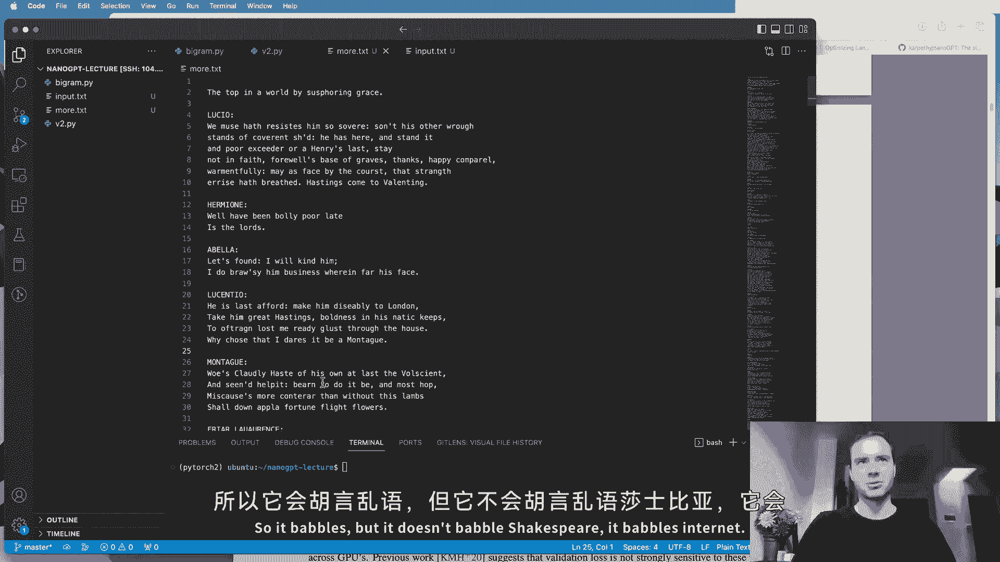

 It will create arbitrary news articles and documents。

 And it will try to complete documents because that's what it's trained for。

 It's trying to complete the sequence。 So when you give it a question。

 it would just potentially just give you more questions。 It would follow with more questions。

 It will do whatever it looks like some close document would do in the training data on the internet。

 And so who knows， you're getting kind of like undefined behavior。

 It might basically answer to questions with other questions。 It might ignore your question。

 It might just try to complete some news article。 It's totally unaligned as we say。

 So the second fine-tuning stage is to actually align it to be an assistant。

 And this is the second stage。

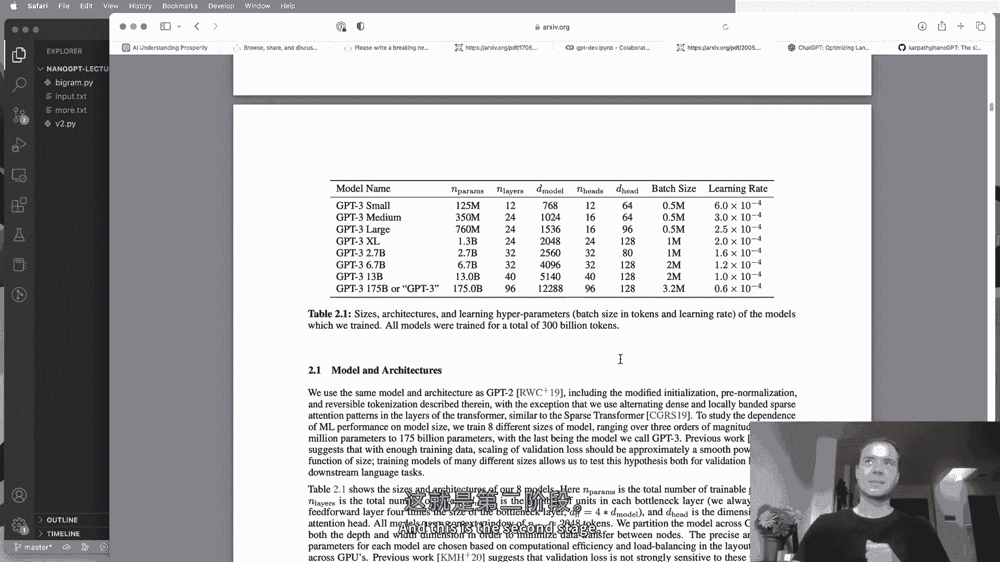

 And so this chat GPT blog post from Upaniya talks a little bit about how the stage is achieved。

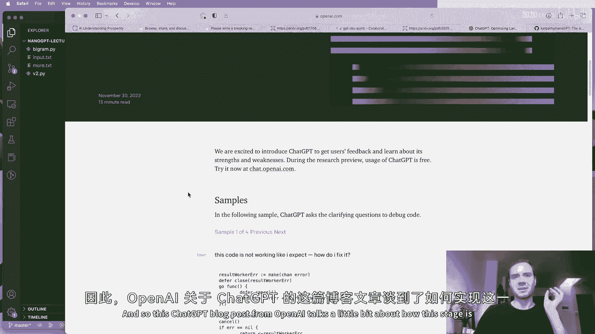

 We basically， there's roughly three steps to this stage。

 So what they do here is they start to collect training data that looks specifically like what an assistant would do。

 So they have documents that have the format where the question is on top and then an answer is below。

 And they have a large number of these， but probably not on the order of the internet。

 This is probably on the order of maybe thousands of examples。

 And so they then fine-tuned the model to basically only focus on documents that look like that。

 And so you're starting to slowly align it。 So it's going to expect a question at the top and it's going to expect to complete the answer。

 And these very， very large models are very sample efficient during their fine-tuning。

 So this actually somehow works。 But that's just step one。 That's just fine-tuning。

 So then they actually have more steps where， okay。

 the second step is you let the model respond and then different graders look at the different responses and rank them for their preferences to which one is better than the other。

 They use that to train the reward model。 So they can predict basically using a different network how much of any candidate response would be desirable。

 And then once they have a reward model， they run PPO。

 which is a form of policy gradient reinforcement learning optimizer to fine-tune this sampling policy so that the answers that the GPT chat GPT now generates are expected to score a high reward according to the reward model。

 And so basically there's a whole aligning stage here or fine-tuning stage。

 It's got multiple steps in between there as well。 And it takes the model from being a document completer to a question-answer。

 And that's like a whole separate stage。 A lot of this data is not available publicly。

 It is internal to open AI。 And it's much harder to replicate this stage。

 And so that's roughly what would give you a chat GPT。

 And nano GPT focuses on the pre-training stage。 Okay。

 and that's everything that I wanted to cover today。

 So we trained to summarize a decoder-only transformer following this famous paper "Attention is All You Need" from 2017。

 And so that's basically a GPT。 We trained it on a tiny Shakespeare and got sensible results。

 All of the training code is roughly 200 lines of code。 I will be releasing this code base。

 So also it comes with all the Git log commits along the way as we built it up。

 In addition to this code， I'm going to release the notebook， of course， the Google Colab。

 And I hope that gives you a sense for how you can train these models like， say， GPT-3。

 That will be architecturally basically identical to what we have。 But they are somewhere between 10。

000 and 1 million times bigger depending on how you count。 And so that's all I have for now。

 We did not talk about any of the fine-tuning stages that would typically go on top of this。

 So if you're interested in something that's not just language modeling， but you actually want to。

 say， perform tasks， or you want them to be aligned in a specific way。

 or you want to detect sentiment or anything like that。 Basically。

 anytime you don't want something that's just a document-compleiter。

 you have to complete further stages of fine-tuning， which we did not cover。

 And that could be simple supervised fine-tuning， or it can be something more fancy like we see in ChaiChaPT。

 where we actually train a reward model and then do rounds of PPO to align it with respect to the reward model。

 So there's a lot more that can be done on top of it。

 I think for now we're starting to get to about two hours mark。 So I'm going to kind of finish here。

 I hope you enjoyed the lecture。 And yeah， go forth and transform。 See you later。

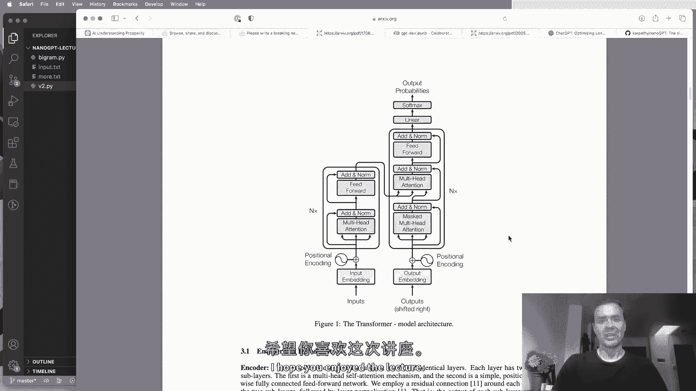