# P1：Lecture 01 - Course Intro, AI, ML - 爱可可-爱生活 - BV1wV411q7RE

好的，好，所以欢迎大家，很高兴你们这么多人在这里，我对新学期感到非常非常兴奋，所以让我潜入其中。

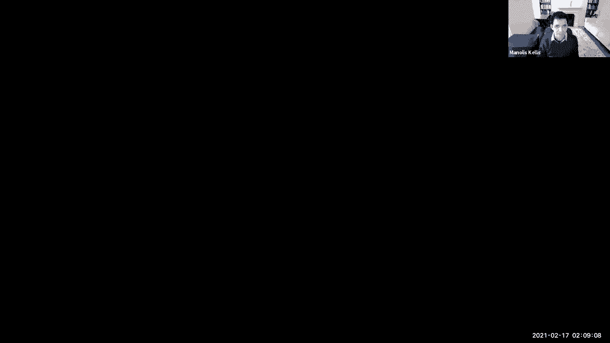

所以你来这里是为了生命科学的深度学习，所以这是麻省理工学院，呃，课程编号六八七四，也被称为本科生的6802，本科生2390本科生2490，然后HSD五零六，顺便说一句，是声音，好的，你们能听到我说话吗。

是呀，是的，听起来不错，太厉害了，所以我们将在基因调控的基础上进行大量的研究，以及它们如何适用于疾病，它们如何用于治疗设计，它们如何适用于病历和医学影像，计算生物学中一些最重要的问题。

所以让我们深入探讨课程后勤，所以课程最初是由大卫开发的，吉福德、大卫和我在20年春天教过这个，但是大卫今年春天休假，所以我在没有他的情况下教书，呃，尽管许多讲座实际上是建立在，呃。

大卫和我都教了很多年的课程，在机器学习和生物学的界面上，以及许多其他理论和应用课程，所以当我们走的时候，我会指出其中的许多，目标是在生命科学的任务中引入应用机器学习，所以我们将在星期二和星期四见面。

从一个p开始，I’直到下午两点半，我们的电台将在星期五下午三点，我和我们的辅导课将在星期五下午四点举行，m，大部分时间，我会给你更多的细节，这些是可选的，但他们真的很有帮助，呃。

指导大家创造出令人敬畏的最终项目，我们会在网站上公布办公时间，根据第一天或调查，这是我们的教职员工，呃，迪伦，阿章，苔丝和杰基，我想知道，如果你们能打开你们的视频，每个人都说一个快速的嗨。

也许按照你被展示的顺序，所以我只想简单地介绍一下我自己，并说我的研究是关于，的面积，嗯，我想机器学习和基因组学被广义地解释为，从对基因组的基本理解到基因组电路和表观基因组学。

应用这些知识来理解人类疾病背后的机制，呃，迪伦，快速介绍，嗯你好，每个人，我叫迪伦，我是麻省理工学院计算机科学专业的三年级博士生，好像我对很多不同的事情都感兴趣，但总的来说，我对应用计算统计学来解决。

生物学中的重要问题，通过这堂课，我真的很期待见到你们，然后嗯，我对如何将机器学习应用于生物学的许多不同方面都感兴趣，很高兴能帮你们找到不同的方法，看看你的想法是什么，呃j嗨，我是JG。

我是计算机科学专业的二年级博士生，是的，是的，我非常研究将深度学习应用于生物学，主要是尝试使用这些新的最先进的深度学习技术，从这些庞大的生物数据集中解开事情，否则你可以解开，这就是你知道的。

基本上我所做的，这门课的重点是什么，所以很期待看到，同时涵盖所有这些主题并会见你们所有人，太厉害了，呃测试嗨，我是苔丝，我是六年级的本科生，计算机科学，我以前和卡拉斯教授上过两节课。

去年秋天我也和他一起流泪，所以我真的很期待今年春天再和他一起打球，看看有什么很棒的项目，你们都想出了很高兴见到你们，全部，我觉得你很沉默，不过没关系，我想是我，我是唯一剩下的，大家好，我是杰基，你。

她的代词，我是生物工程专业的三年级研究生，我从事机器学习，应用于合成生物学和药物发现，所以真的很感兴趣，基本上任何深度学习，适用于任何与生物学有关的东西，嗯，这就是为什么这门课很适合。

我真的很兴奋能和你一起学习，也想看看你很棒的项目想法，我想就这样了，太厉害了，所以嗯，然后我们有多个课件页面，你可以看到去年的课程，所有讲座录音的链接。

所以对于那些有兴趣展望未来课程将涵盖的内容的人来说，你可以看看这个，然后可以通过这个URL到达画布网站，更容易记住，你可以用任何课程编号来代替这个，它仍然有效。

你可以通过这个电子邮件地址给我们发电子邮件，或者单独通过这里好的，所以就背景而言，对于班上的学生来说，我们基本上有几个基础，我们正在建设，其中之一是微积分和线性代数，所以只是基础，你知道的。

张量、矩阵、向量和特征值的数学与计算，等等，第二个基础是概率和统计，所以这在机器学习和深度学习中很普遍，我们将在此基础上再接再厉，然后下一个是，编程，所以我们会有习题集，都是关于编程的，我们会成为。

建造实验室，让你真正深入探索，课程中的所有主题，所以有一个坚实的基础是很重要的，然后我们还会有一个生物学入门，我们将建立的基础，就伟大的贡献而言，我们会有五个习题集，你就能放弃最糟糕的一个。

它们加起来将占你成绩的30%，我们将寻找您自己的个人贡献，呃，然后你可以通过谷歌云和Jupyter笔记本来完成它们，我们将有一个小测验，也就是一个半小时，你会有一张纸条，算两个，你成绩的百分之五。

我们将有一个最终的项目，这将由两到三名学生组成的团队进行，数到三，你成绩的百分之五，然后最后，呃，抄写和参与将占你成绩的10%，然后包括指导会议，头脑风暴，客座讲座，然后潜入初级文献。

我们会更多地讨论这个问题，嗯，所以再一次，您可以使用Piazza或员工电子邮件询问任何问题，您将很快收到您的谷歌云优惠券，在您的电子邮件中能够使用。

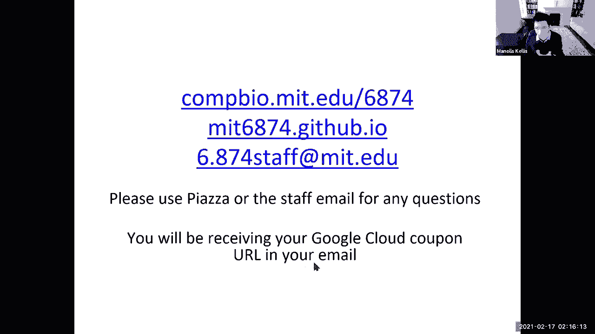

你知道吗，更先进的计算，所以最大的问题是为什么这门课。

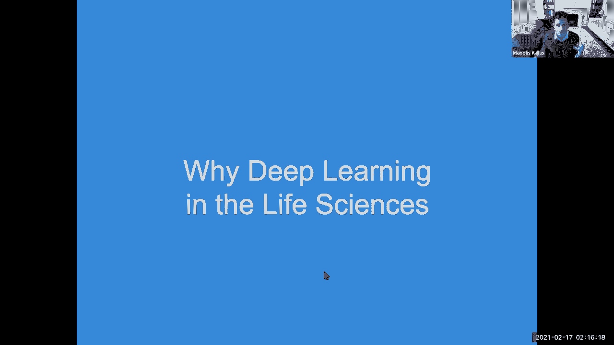

你们为什么都在这里，为什么我们在生命科学中需要深度学习，所以首先，大约8%的深度学习出版物是关于生物信息学的，这是一个巨大的数额，所以呃，你知道你听说过国际象棋等等，但深度学习的最新最大新闻实际上是。

阿尔法折叠和呃，你可能听到了，它是如何解决蛋白质折叠的，这基本上意味着它对特定的比赛和实验方法一样准确，你知道这是一件大事，所以这就是我们在这里的原因，因为深度学习可以从根本上改变，呃。

你知道我们周围的生活，尤其是生物学，以及我们对生物学的理解，特别是生命科学，我们看到三个不同领域的汇合，一方面，我们有廉价、高质量的大数据集，其中包括测序，这些包括成像，医疗记录，文本数据库。

只是大量的数据，第二个是机器学习方法有了真正的基础进步，组合新数据集的多种方式，新算法，多种方法结合在一起，然后第三个呃，收敛是计算，如此高性能，图示，呃，允许机器学习实现非常快的计算单元。

你可以通过课程接触到这些，所以基本上完全改变了，嗯，你知道科学领域，因此，你知道，部分促成了这一点，我们基本上有很多计算生物学课程，许多不同的大学，正在培养像你们这样的一代又一代的学生。

出去处理这些数据集，这是这些课程的集合，所以我教了一门完整的课程，我看到很多很多人已经上过了，这也太厉害了吧，所以重叠相对很少，所以在这里，我们将真正深入到深度学习中，覆盖了很多秋天没有覆盖的区域。

所以这两门课都值得上这门入门课程主要包括基因组学，还有我们在这里不太关注的进化话题和网络，当然啦，基于IAP的深度学习课程导论，那是真正杰出的，我真的希望你们中的许多人已经或将要接受，一有机会。

大卫教授的医疗保健机器学习，桑塔格和皮特·希，生物学中有统计物理学，所以这是我们部门的三个，然后如果你跨部门看，我们基本上也是算法和计算技术的基础，在系统生物学中，然后是第七道菜中的几道菜。

定量和计算生物学，系统生物学，进化生物学，面向数学研究生的定量生物学，18块买17块，计算分子分子生物学导论，还有一八四一八，这是一个伟大的，呃，第八课生物学中的统计物理研讨会课程。

所以我真的鼓励你探索这些领域，课程有时会重叠，但在内容和精神上非常非常不同，所以我真的鼓励你多拿一个，所以我总是问我的学生为什么计算生物学，今年在聊天中做这件事很有趣，所以基本上我要做的是，呃，问你。

呃，为什么计算生物学，所以我要经历，嗯，就一轮，让我们让每个人把他们的答案打出来，或者你可以举起你的手，或者你可以大声说出来，所以我们要在这里尝试一些互动参与，这是呃，在Covid的时候很困难，但是呃。

你知道，人类需要它，所以重量类型，好的维多利亚，去吧，这么多数据，回答得好，朱娜·凯蒂同意，这么多数据，事实上，这是第一个答案，大量的数据，事实上，大量的数据，所以组合学，大量的数据，我是呃，你知道。

这里有一整块板子，潜在的答案，所以你们可以，真的很难回答问题，无需计算，规模巨大，宏观和微观，哇太棒了，对复杂生物问题的大量计算能力，辉煌的安踏、普雷斯顿和维多利亚，埃里克王实验可能需要很长时间。

太奇妙了，所以计算实际上可以帮助加快发现，Ucache就像说的那样，科学发现，没药根据现有数据推断生物行为，艾伦·科斯塔，生物学中有许多抽象的层次，很难手工掌握，我喜欢那样。

许多抽象层实际上为整个深度学习提供了信息，以及计算中的许多抽象层，维多利亚适合数学建模，找出复杂的过程，才华横溢，安德鲁情结，与生物数据和期望预测的高度非线性关系，非线性将成为深度学习的一个基础方面。

这些都是精彩的答案，可以用一个数据集提取大量知识，我喜欢那样，所以不仅仅是，假设，海量海量数据，回答是或否，而是收集大量数据，然后根据这些数据进行计算，得到比，你想要的，从生物数据中理解模式是苛刻的。

如果没有计算，持久是不可能的，这很有趣，因为很多人说计算生物学家，为什么一个计算机科学家要学习生物学，我的回答是还有别的办法吗，这有点有趣，因为生物学实际上已经改变了，呃，我们上周刚发了一篇自然论文。

描述了人类基因组计划20周年，这实际上是20年前人类基因组计划出版的今天，随着现在的到来，世界在某种程度上发生了变化，一切都是关于数据的，而不是，呃，一种假设，呃，在某个时候，马丁嗯，降维使数据可视化。

我太喜欢了，基本上，人类的大脑实际上有很大的能力通过视觉线索捕捉模式，我总是喜欢说的是规则号，基因组学的一个是看看该死的数据，所以如果你有办法可视化数据，通过这些数据集提取有意义的模式的方法。

你实际上可以走很长的路，事实上，我有第二个电脑屏幕，让我向学生们展示并排的景色，画廊辉煌，所以你实际上可以看到你的许多脸，这是美妙的，高维数据，所以批评，高维数据，它通常有基本的底层模式，我喜欢那样。

事实上，这是我的第二个，呃，是有规矩的，有模式，生物学不仅仅是一个疯狂的烂摊子，有基本的原则，驱动这一点的潜在模式，这是我们可以帮助理解的最基本的方面之一，贝拉说，假设生成，我喜欢那样，也是。

它基本上说，我们不会只是简单地测试假设，我们有时会产生假设，事实上，这使得我们现在可以从计算中驱动实验，而不是计算，只为一个假设服务塞纳，对基础生物学研究的需求增加，哦，你知道的。

从你的嘴里到创始机构的耳朵里感谢你，经常，呃，我们忽视了基础研究，而为应用研究服务，我认为这里真正的基础是，我们使用的计算方法，不仅能告诉我们这些数据集如何应用于疾病。

也是它们如何形成基本的新的基础理解，CN帮助改善临床保健，正好相反，这也是真的，他基本上说，我们不仅理解基本原理，还通过能够在数千人中收集相同的数据，有时数以百万计的人，我们实际上可以改进，呃。

临床保健马丁处理大量零，让我们看看，我是想看你们好一点，嗯，处理单个单元格数据中的大量零，这是一个非常好的，所以当我们潜入单细胞章节时，我们将讨论丢失的数据集，以及我们如何模拟失踪的模式。

他们告诉我们的数据，就像计算似乎以可接受的保真度为生物任务工作一样，哦，我喜欢它有，呃，两边，其中之一是它似乎起作用了，这很好，这也是深度学习的一个惊喜，深度学习不能对每一个可能的功能进行建模。

但它可以建模的功能实际上非常适合，对于现实生活中正在发生的功能，所以你知道，我们碰巧居住的世界似乎很适合深度学习，事实上，我们面临的生物任务也是如此，然后是可接受的保真度，表明预测不会是完美的。

但有时生物学本身并不完美，这没关系，我们必须同意这不会是一个数学证明，而是一个近似值，这有时甚至比描述生物现象的完美答案更有趣，使用数学公式，我喜欢这样所以不仅仅是寻找模式，还可以建模，阿江。

许多单独的数据集不是实验性的，揭示潜在联系所需的可复制计算，这是如此真实，很多人我喜欢开玩笑，它需要一个计算的人，知道你不能相信计算，需要一个实验的人才知道你不能相信实验。

但实际上当你把它们放在一起的时候，你们可以互相喂食，一个人实际上可以帮助，呃，加强另一个丹尼尔的推论，使处理规范化数据变得更加容易，以便能够以有效的方式进行分析，非常的酷，所以不仅仅是建模本身。

而且规范化的处理需要全局视图，传统方法不可能做到的事情，所以事实上你可以接触到整个基因组，给你一个完全不同的整个基因组数据的视图，它可以让你以一种非常不同的方式关注每个部分。

基于复杂表达数据的疾病复发预测，所以你知道一个非常应用的，呃，有点，你知道吗，预测结果的数据驱动方法，可以帮助药物发现，艾琳，这是一个美丽的答案，呃再次，我们要看一个图表，神经网络。

以及它们如何被用来设计和学习化学结构的模式，与特定，呃，折叠和特定目标，实验研究中的大风，我们通常专注于一条途径，使用计算生物学可以让我们更全面地了解疾病，那是我，呃总是有点像，咆哮，也就是，如果你去。

呃，制药公司，你基本上会和神经科谈谈，然后是心血管科，然后这个，呃，你知道，肾脏代谢紊乱等，如此当，事实上，对于每一种疾病，所有这些部门都应该互相交谈，因为几乎没有只影响一个器官的复杂特征。

所以说这是疯狂的，你们要研究心脏，我们将研究肝脏，我们会有不同的建筑，呃，而是，计算生物学让我们做的是真正整合所有这些不同的方面，嗯很好，卡什，模拟，长期的时间过程，如疾病传播，疾病进展，等。

我喜欢那样，所以说，这不是一次性的，但是因为我们使用的是计算，不仅仅是解的数学接近，我们实际上可以模拟这些过程随时间的发展，通过发展，通过疾病进展，通过肿瘤治疗，互动等等，塞纳减少了发现和开发时间，好。

所以通过先计算，然后在一组非常狭窄的假设上做实验，你实际上缩短了发现时间，常春藤甚至可以帮助理解没有事先生物学知识的复杂现象，嗯是的，是的嗯，所以在许多方面我们可以使用贝叶斯方法的概念。

并将浪涌范围缩小到我们认为合理的搜索空间，和我们以前看到的一致，但同时我们可以以某种方式说好，这显然超出了我们先前的预期，你知道，扩展得更远，所以塞纳也答应了，在制药行业完全同意，呃。

可能是指常春藤实际上是指以前被视为常见的常春藤，嗯，汽车会加速很长时间吗，和资源密集型过程，如药物开发，完全同意，呃，深度学习现在是找到正确目标的基本部分，越来越多地为这些目标设计药物。

合成测试数据的创建看到了一个伟大的答案，所以我们基本上没有生成对抗网络，我们可以开始生成一个人的假图像，或者我们可以开始为自动驾驶汽车生成大量新的训练数据。

或者我们可以为我们的机器学习算法生成大量新的训练数据，在计算生物学中，我们可以创建图像，我们可以创建序列数据，等等清晰的设计，更多信息丰富的实验，很好地建立在我们以前见过的东西上。

有时台架实验比计算预测需要更长的时间，完全同意类似的话题，Utkarsh数据驱动网络解决种族平等问题，同时理解跨人口统计的生物学，天哪，多么重要的话题啊，所以到目前为止，许多遗传学都集中在。

我们星球遗传变异的一小部分，就像说你知道，地球上有百分之百的多样性，我们只专注于10%，这是疯狂的，可笑的，极其偏见的，缺少了很多你知道数据在哪里，但也使预测更加有偏见，对世界人口的一小部分更准确。

而不是真正的公平，呃，遗传数据集，一个很好的观点，不要离开我的睡衣，嗯哼，所有的权利，我想这就是有用的评论的结尾，所以嗯所以这是，嗯，你知道吗，有规律的模式查找，这一切都是关于可视化模拟的数据能力。

时间关系，猜测验证，生成用于测试的假设，提出解释观测的机制和理论，变量组合，它去了泰晤士报，大量的数据效率，减少实验空间以覆盖基础设施组合数据集的能力，相关性，高阶关系。

然后从假设产生到检验的循环被浓缩，我最喜欢的是生活本身就是数字化的，在内心深处，这一切都是关于理解细胞指令集，我们从编程语言进化而来的，除了我们作为科学家开发的，然后这些是来自。

呃，去年春天，去年秋天，然后我们会有另一张幻灯片，用你自己的答案，所以嗯，我想先从幻灯片开始，就像这样，向你展示了理解生物学的艰巨任务，所以如果你寻找基因，你知道他们从80克开始。

他们用三个停止密码子中的一个停止，塔阿·塔阿·格加，但是如果你在基因组中寻找ATGS，你看到他们无处不在，有，你知道基因组中每个地方都有一个潜在的开始，这是在一个数据本身是数字的地方。

在这一切背后有一个序列，你可以，实际上你知道那个序列，呃，而不是用测量来测量它，呃嗯，想象一下，呃，蛋白质折叠和药物设计有多复杂，带有表达式数据，使用单细胞数据，它非常嘈杂等等。

所以我们的任务是从噪声中提取信号的挑战，能够认识到，基因组中有意义的模式在哪里，所以这些是基因组的一些组成部分，即使是蛋白质编码基因，哪些是报价，未引用，容易的部分，现在太难了，对于监管主题。

这是非常困难的，这实际上将是第一批，类的第一个模块，所以这把我们带到了一个，主要任务的快速概述。

以及我们将面临的主要挑战，这是课程的大纲，我们在这里，这是一个课程介绍和一些概述，然后我们将有一个更正式的机器学习基础，呃，周四的讲座，然后讨论卷积神经网络，递归神经网络和图神经网络下周。

然后我们要讨论可解释性，降维，和随机嵌入的单细胞数据和其他地方，以及生成模型，甘斯与变分自动编码器，所以敌对网络，这将是第一个模块，它将是关于机器学习的，关于模型及其解释的一切，然后在第二个模块中。

我们将深入研究基因调节回路，这就是基因组学的部分，这可能是与我教的课程重叠最多的部分，秋天我们将讨论dna的可访问性，推动者，增强剂，染色质基因调控与降维，转录因子，dna甲基化，基因表达与剪接。

但与秋季班相反，这一切都将是关于深度学习的，以及我们如何使用深度学习方法直接从基因组推断这些结构，然后我们将讨论单细胞或DNA测序，然后这个模组就结束了，基因调控模块。

我们的第二个单元将是关于疾病的变异，那么我们如何利用深度学习来发现遗传变异，去了解基因变异是如何影响这个电路的，我们的遗传变异如何影响基因表达水平，以及我们如何利用电子健康记录和病人数据。

推断与疾病表型相关的个体间的变异，在第四个模块中，我们将讨论结构的两个方面，呃，特别是蛋白质-蛋白质相互作用、蛋白质结构和蛋白质折叠，以及药物开发，所以这一切都是关于图神经网络以及它们如何帮助我们理解。

蛋白质、化学物质和药物之间的相互作用，那么最后一个模块将是关于成像的，生物学中许多不同类型的应用都需要图像分析，这是非常适合深度学习的东西，所以我们将研究成像和形态学的治疗学，视频处理，结构测定，等等。

等等，然后在最后一部分，我们只是要涵盖边界，这将是医疗保健中的文本应用程序，神经科学与癌症和传染病，所以这些是主要的模块，通过这些，我们实际上将使用习题集，作为向你介绍这些前沿的一种方式。

你将有一个在谷歌云中的编程环境，所以您将通过Python使用TensorFlow，您将能够调用许多代码段，已经写在上面的，你要实现各种模型，并填写代码，使，使整个模块完整，你实际上将使用谷歌计算云。

所以我们，呃，呃，请求平台，谷歌平台教育学分，然后我们会寄给你那些，所以第一个模块中的第一个习题集，都是关于张量流的，只是热身而已，你可以用它来完成一个相对简单的任务，比如字符识别，那么如何将像素集。

并认识到这是数字五，第二个习题集将使用这些技术，现在潜入基因组数据并识别序列模式，第三套习题集是深入到两个单细胞，rna查找数据，关于嗯遗传变异。

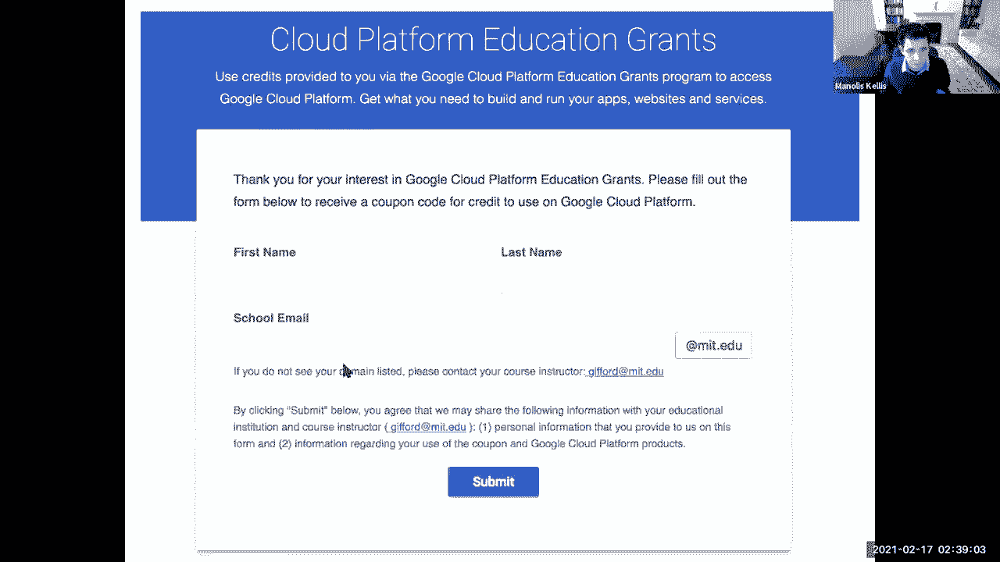

呃和疾病，第四套习题集是关于蛋白质折叠和药物设计。

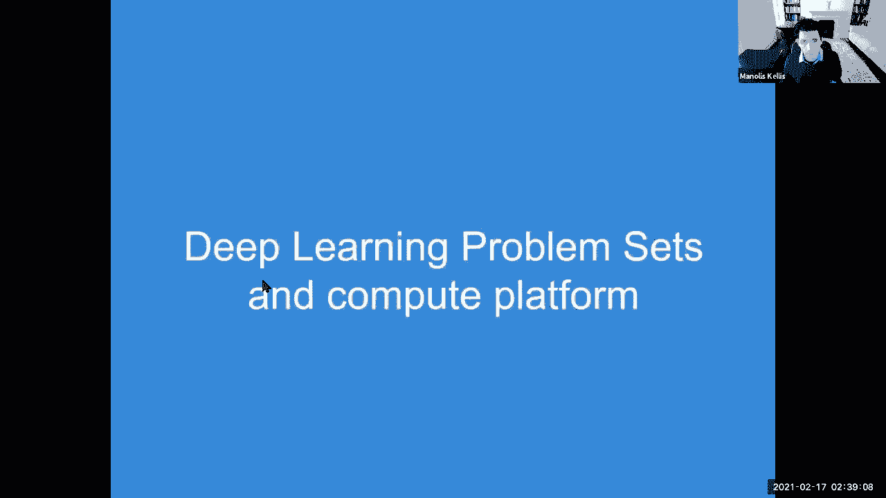

所以用这些图神经网络来折叠蛋白质，第五套习题集是关于医学图像分析的，所以这些是呃。

四道习题，我们会成为，嗯。

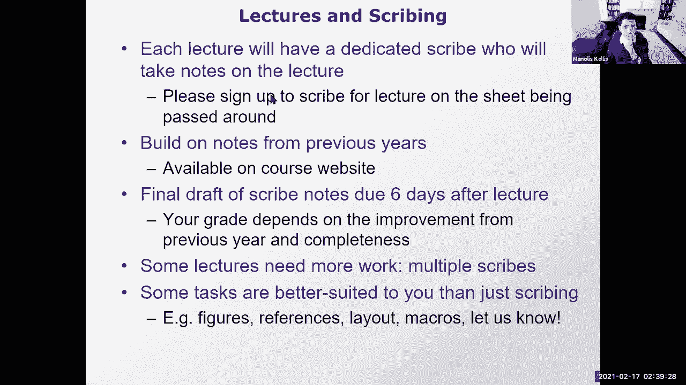

好的，现在让我来谈谈这门课的其他方面。

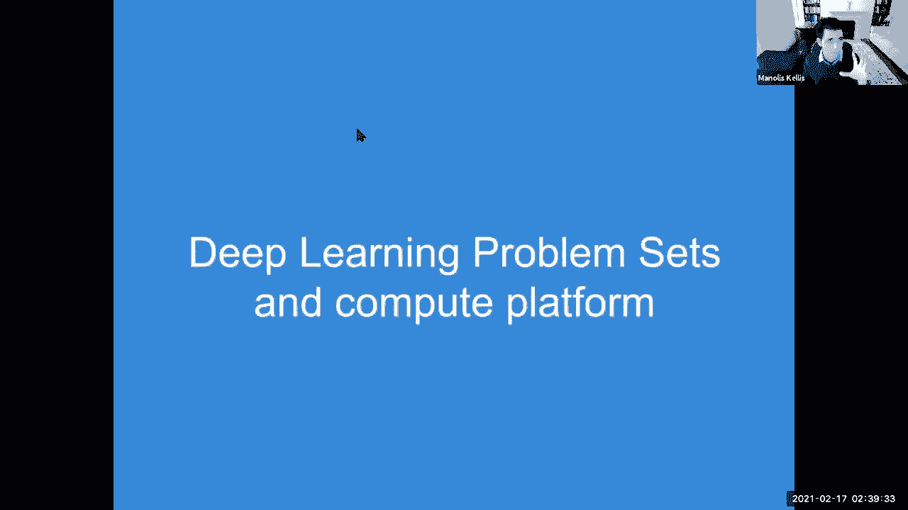

所以我们也会有一个专门的抄写员为每节课，谁来做讲座的笔记，我们今天不需要做那个，但是我们将在星期四开始，所以我们会寄给你一张报名表，让每个人都报名，然后你们要以去年的课堂讲稿为基础。

我们会要求你有一个抄写员笔记的最后草稿，讲座后六天左右，这将允许学生在自己的学习中建立在你所说的基础上，然后一些讲座需要更多的工作，我们会有多个抄写员，然后有些任务可能比描述更适合你，比如说，数字。

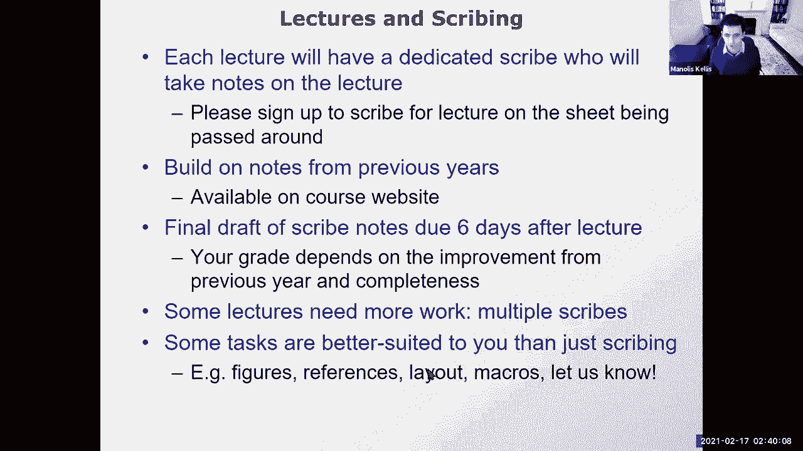

参考文献，布局，宏，只要让我们知道，然后我们可以给你一些专门的任务，我们将进行一个半小时的测验，我们还没有确切的时间安排，所以我们会联系确定每个人的可用时间，和时区，所以不是期中考试，这不是期末考试。

这只是一个小测验，它很友好，好玩，交互式，可爱有趣毛茸茸的，目的是骗你们学习，我们是，你知道吗，我们总是喜欢，好的，我们如何诱骗他们学习，我们发现小测验能欺骗学生学习，这就是为什么我们有一个小测验。

目标是展示对材料的掌握，在测验前的四个模块中，并了解要点，强调讲座，P集中揭示的微妙之处，并应用你的新技能来解决实际问题，我们会有真实的知识问题，假的，证明和多项选择，我们会有一个更深入的理解问题，呃。

将以简短回答的形式提出的一组问题，以及我们将要解决的一些实际问题，简单算法及一些设计问题，也许只是一个你必须上来的地方，通过一个创造性的解决方案，结合了来自多个，另一个，生命科学中深度学习的很酷的事情。

这只是一个有十年历史的领域，这在那之前并不完全存在，所以发明这些方法的人并没有在18世纪死去，他们现在还活着，超级活跃，他们甚至知道如何使用缩放，因为他们有时和你一样大，嗯，所以对于呃，几次讲座。

我们实际上会邀请一两个客座讲师进行简短的演讲，关于该领域的主要文件，我们将在这些开始时介绍该领域和基础材料，呃，讲座，所以基本上在最初的半个小时里，我们将介绍该地区的材料，然后我们将有一个客座讲座。

或者两个客座讲座，有能力提出问题，深入研究他们的论文，所以这有点酷，因为你们实际上可以和现场的人互动，我们将对每位嘉宾的演讲进行简短的问答，事实上，与讲座相关的抄写员将帮助协调一些Q和A。

所以你们可以提前问问题，然后脚本将主持讨论，然后我们会更详细地讨论那一周的演讲和论文，在相应的背诵部分，然后这个，你又知道了，我们的目标是使课堂具有互动性，让它值得去讲课。

让所有这些很酷的新材料都值得学习，而不是坐以待毙，然后在YouTube上看这个，因此，我们将在这些讨论的基础上制定研究项目方向，在辅导会议上，你将有机会更深入地研究自己的项目，和你的导师一起工作。

这将带我们进入课程的最后一种活动，这不是最终的项目，但是你的团队项目或学期项目，我们不称之为最终项目，因为这不是你要做的事，在课程结束时。

这是我们在整个课程中都要做的事情，所以我真的鼓励你们看看课程表，开始思考，好的，我最感兴趣的话题和领域是什么，也许我应该报名描述我最感兴趣的讲座，这将允许我再次，见见那个领域的研究人员，呃。

在那个领域投资，当我们开始有这些，深蓝色的讲课和浅蓝色的背诵，我们将穿插绿色的指导课程。

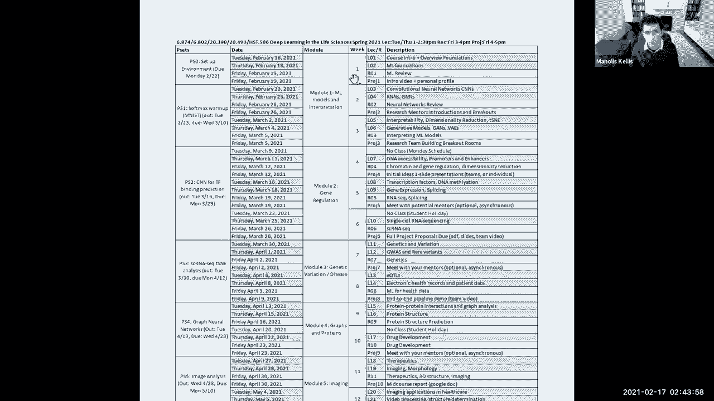

这些指导会议是为了帮助你设计自己的项目，与导师会面，想出主意，想出合作伙伴，并与合作伙伴交流你的想法。

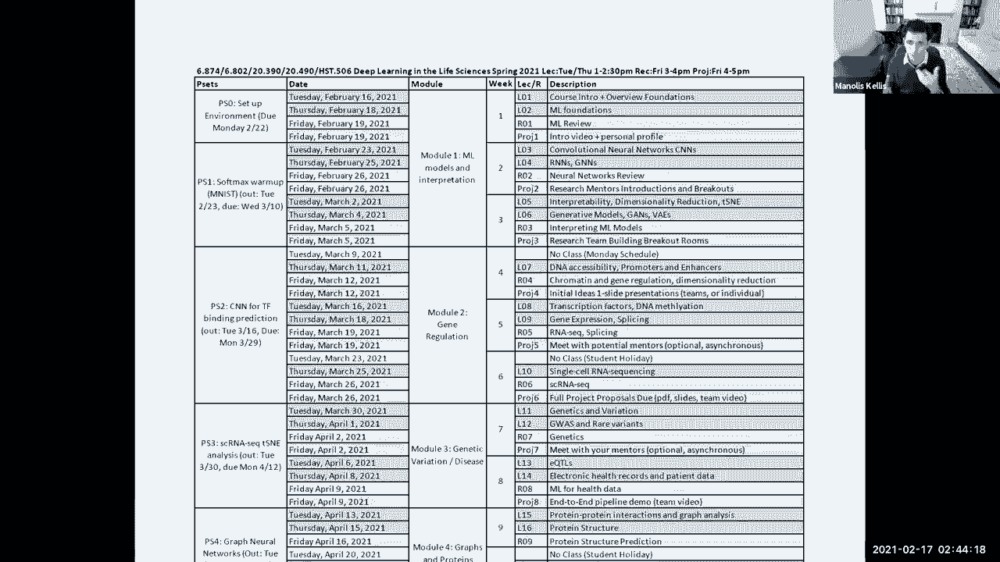

和你的导师，所以我们要进行分组会议，呃或多或少为每个模块量身定做，所以我们将有一个基因调节突破，疾病爆发的变异，呃图和蛋白质突破，和一个成像突破肯定，然后基于人们的兴趣，我们可能会有额外的突破。

我们要么有工作人员，要么有研究人员，在这些领域活跃的人参加了分组会议，所以你可以从他们身上反弹想法。

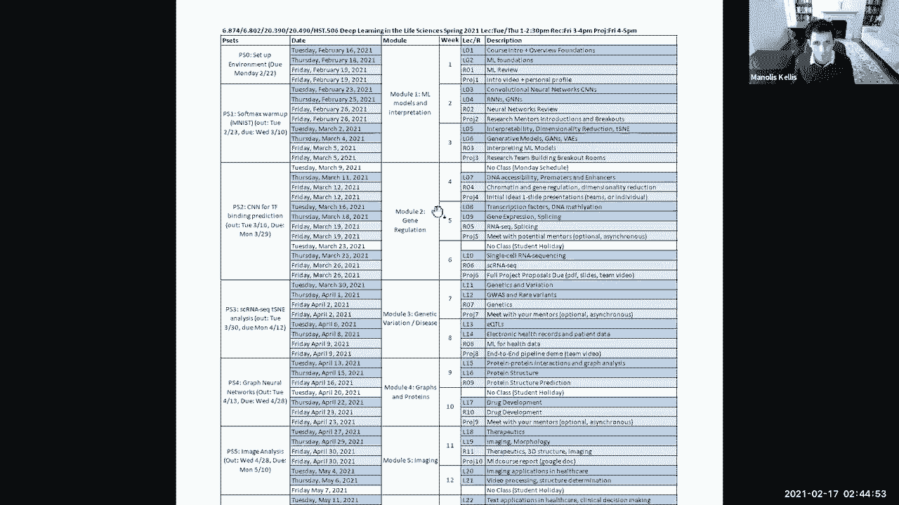

所以说，这将使你现在准备成为一名活跃的计算生物学研究员，因此，在计算上构建一个生物问题，收集相关文献和数据集，并使用新的算法来解决这个问题，新机器学习技术，并从生物学上解释结果，但我们也会，呃。

作为课堂的一部分，在教育的许多无形方面帮助你，我们传统上没有这样的课程，就是，这对奖学金和助学金非常有用，你如何在拥有互补技能的团队中工作，如何接收同行反馈，你如何识别，你知道，你自己同龄人的潜在缺陷。

呃，在每一个，你有什么改进建议，您如何接收这些反馈并相应地修改您的建议，你如何用科学论文的形式写出你的结果，我们会有一个专门的讲座来介绍如何，你如何呈现你的书面结果。

以及你如何向科学观众展示你的整体结果，所以再一次，这个学期的项目将是镜像的，你在现实生活中经历的这些无形的任务，嗯，事实上，当我们问学生，多少指导，你会不会，呃，更喜欢，呃，你知道，我们问得很好。

不喜欢指导，蓝色在哪里，然后我肯定会接受一些指导，呃，指导听起来是个好主意，确定里程碑和最后期限是有帮助的，然后到目前为止最常见的类别是，指导越多，越好，看来你们对导师会议很兴奋。

所以我们实际上要有那些。

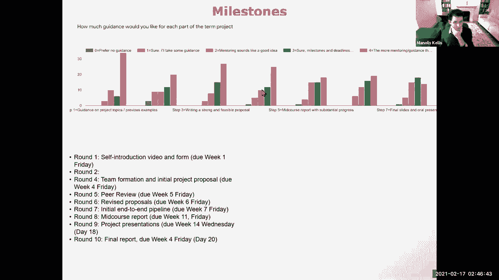

所以现在我们要尝试一个你以前没见过的新东西，也就是，谁很兴奋，酷，这么快，保罗，呃，这些是匿名的，如果你完全不兴奋，你可以打一个哈欠，或者如果你很兴奋，你可以点击那里，我看到一些哈欠进来了，呃。

超级兴奋，耶，两个哈欠真棒，所以两个两个超级兴奋，这太棒了，我们还在赢，嗯酷，所以到目前为止我有四个六个答案，嗯，所有的权利，所以在那里分享结果，你变得超级兴奋，就是胜利，呃，二十六十六四零二，嗯。

这太棒了，你们只是说说而已，让我感觉好些，嗯好吧，二号，目前进度如何？呃，你好吗？刚刚好吗，太快了，太慢了，非常的酷，所以看起来和，你知道，上面9个，下面4个，这是伟大的，然后嗯，最后。

到目前为止你们跟得怎么样，我只是在尝试我不同的民意调查，这太棒了，好，所以很酷，所以六十六，二五七零二，如果你有问题，在聊天中键入它们，然后我们无畏的助教会回答他们，但如果你有他们无法回答的问题。

他们会打断我问，最后一部分是努力结识你的同龄人，尽早组建具有互补专业知识的团队，这就把我们带到了什么，我其实已经让你做了，也就是，呃，让我们看看Jackie提交的个人资料和视频介绍，非常的帅气。

所以在简介中，呃，你们已经提交了，嗯，几个学生简介。

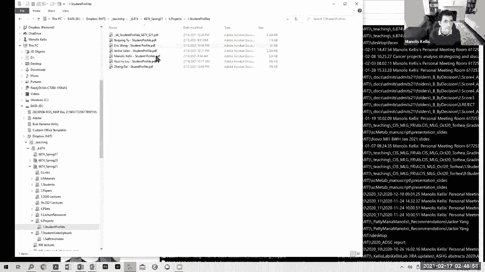

哪个很酷，所以说，然后我要潜入其中的两个，这些是呃哇，一个非常年轻的，班上很年轻的学生，所以嗯，我基本上问了每一个，呃，班里的人，但包括我们的助教基本上介绍自己，这是杰基，所以她基本上是打招呼。

这是我在CS生物方面的学术背景，这是我的专长，以下是我以前做过的研究项目，以下是我最感兴趣的计算生物学领域，这是项目的类型，我很想做。

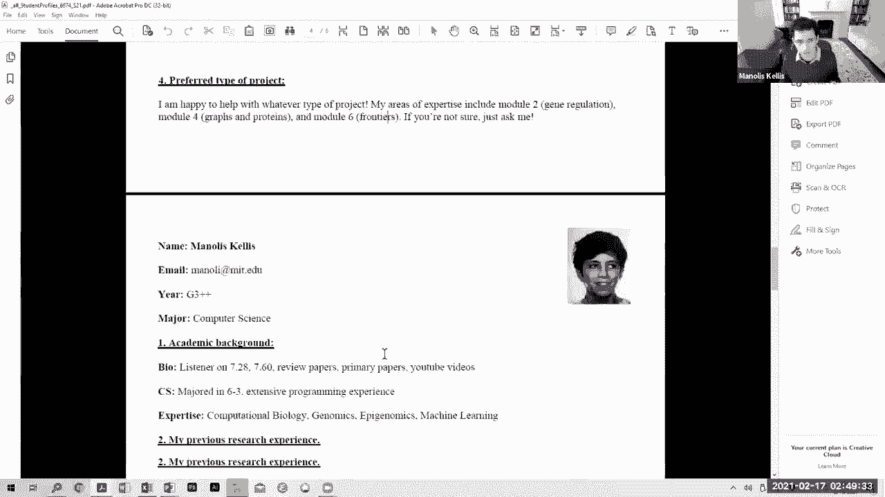

好的，这些是我自己的答案等等，好的，所以请回答这个，因为它们将是可搜索的，然后你就可以说，哦，对图像分析感兴趣的人，让我搜索图像，等等，等等，这将是超级连接。

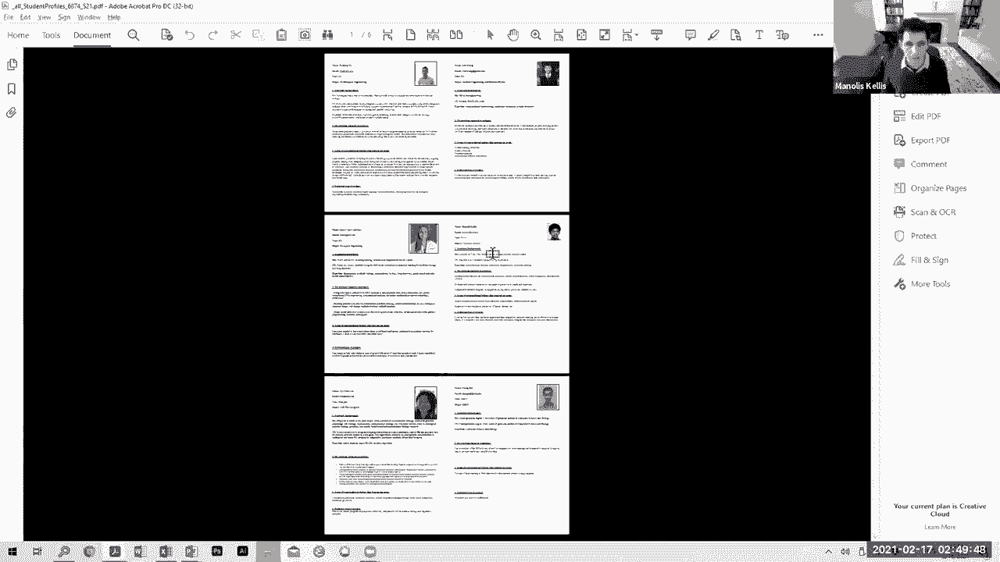

一旦你找到了你感兴趣的人，然后你可以去相应的视频和呃，收听视频介绍，呃，那些学生，所以呃，到目前为止，只有两个勇敢的助教提交了熊。

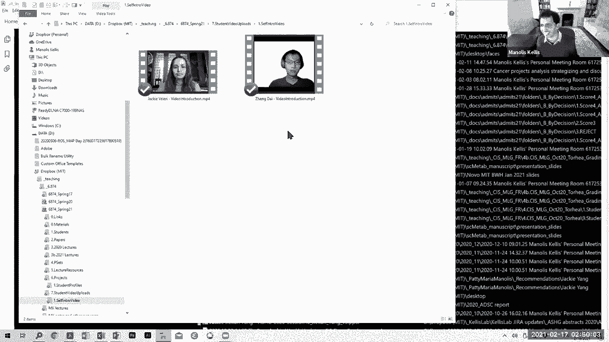

我很抱歉让你们难堪，但是嗯，你知道的，努力相遇，因为这是做学生的一部分，我们不想因为流行病而失去这一部分，所以嗯，你知道的，这些是你的同龄人，呃，努力迎接他们，好的，那么为什么我们有所有这些里程碑。

所以里程碑，确保有足够的计划和反馈，基本上找到符合你技能和兴趣的项目，建立一个有共同利益的团队，灵感的补充技能，我们将提供去年项目的链接，和一些最近的文件为您的建议。

我们已经建立了里程碑、交付成果和解释，我们还有一份中途报告，在那里您已经可以看到项目的终点，你可以概述你的报告，你的方法和你的数字，所以我们要定期进行辅导，高年级学生和博士后。

只要核心员工都会成为你的导师，我们将就这些不同的模块主题进行小组讨论，分享想法，指导和反馈，我们还将进行一些同行评议，我们将鼓励你们每个人批判性地思考同行的建议，在你的区域内，提供反馈和建议。

并回应批评和调整路线，因此，再次，这是一个浓缩在一个术语中的现实世界的经验，进行同行评议，年度报告，你必须预算你的时间和精力，必须提前计划，并通过你需要达到的里程碑向后工作，你想去的地方，你的合作。

找出对你的团队做出反应的最佳方法，并确保他们对你有反应，如何写论文和如何发表演讲，所以这是这个绿色的部分，呃。

这里的时间表，所以嗯，大家可以看到，所以在第一周之后，这个星期五，我们会有这些介绍视频，以及已经提供给每个人浏览的个人资料，我们只是要有一些分组会议，让每个人都见面，这个星期五四点，呃，下星期五四点。

我们会有一些研究导师加入讨论，介绍一下自己，第三周主持或参加分组会议，我们将有一些研究小组建立突破室，在那里你可以进入突破室，再次就特定的主题组建团队，在这段时间里，你可以，当然啦。

相互联系并开始形成这些主题，你不必等待这些事件，但对于你们中更害羞的人来说，这将是一个很好的机会，以确保你不跟随，从裂缝中掉下来，那么在第四周结束时我们希望有一个初步的想法，一张幻灯片演示文稿。

如果你已经有了一个团队，这可以来自你的团队，如果你没有一个非常好的团队，这可以是在个人层面，它基本上是在说嘿，以下是我想做的，然后我们会给你这些想法的反馈，都是在周五的辅导会议上。

以及与导师的突破和个人会议，然后到第五周结束时，你会和潜在的导师开个会，所有这些绿色的东西都是可选的，如果你们在没有他们的情况下做得很好，哇太棒了，但似乎你们大多数人都有兴趣拥有它们，所以我们要让他们。

嗯，再次，这也可以是同步的，在第五周结束时，你会和你潜在的导师见面，现在到3月2日，也就是课程的第六周结束时，这将是到期的，一次又一次，这对你很有帮助，规划你的项目，然后从里程碑向后工作。

所以我们要向你要一份PDF和一些幻灯片，还有团队视频，你在哪里，在那里你介绍你的建议，在那里你介绍你的团队，和数据集，以及您将为这些项目使用和构建的工具，这又是课程的早期。

但考虑到去年的所有讲座都已经有了，鉴于文件，哦，我应该，我应该提到的是，对于每一次讲座，我们都整理了一些论文，让你。

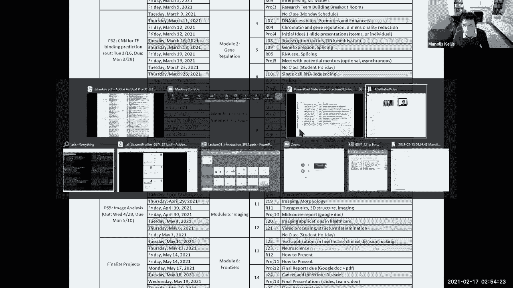

让我们看看P文件，我们在那里，所以每个模块，我们有一组论文探索了这个领域的不同方面，这是机器学习的入门模块，这是关于基因调控和基因调控电路的第一个模块，所有这些都在画布上，所以我可以去画布网站给你看。

哪里有一个Canv，如果你点击文件，然后你在下面，文件，然后你会看到那些由，嗯，再次，如果你对特定领域感兴趣，读一下那些报纸，我们会更新这些，随着时间的推移，根据人们的反馈，以人民的利益为基础。

我们将邀请客座讲师，他通常是这些论文的第一作者或资深作者，所以请继续关注，呃为了那个，但同样，你可以提前阅读来选择这些主题。

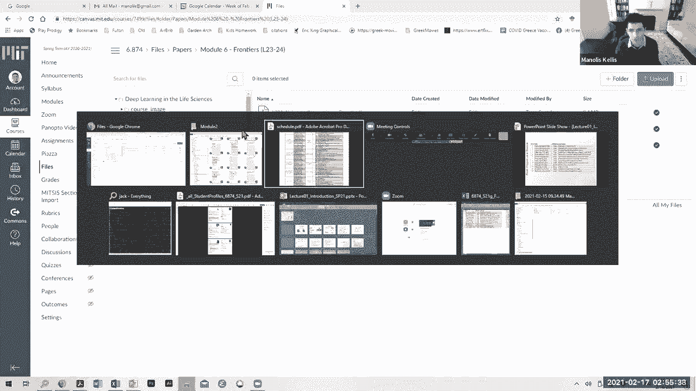

然后根据那些，我们就会，嗯，有能力和学生见面，然后嗯，组成团队，并获得对这些的反馈。

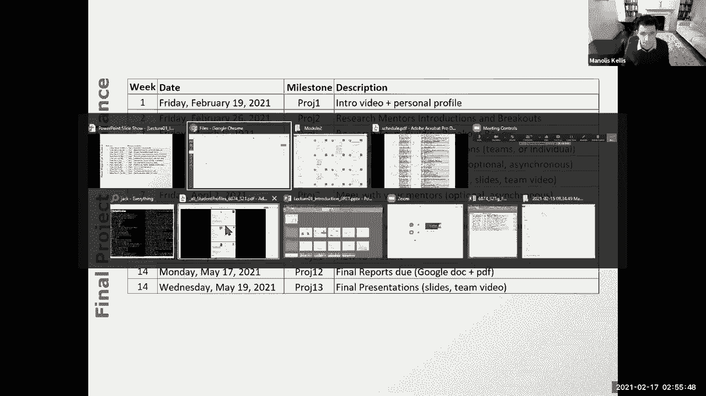

那就是全部建议书到期的时候，然后我们会有更多的机会和你的导师见面，然后到第八周结束时，我们希望确保您有一些数据可以使用，那个，你有一些工具，呃，一起工作，我还在这里分享我的屏幕吗，呃，是的，它是。

东西都到位了，所以我们会让你再录一个视频，再说一遍，这只能是五分钟长，你只要打个缩放电话，然后跳过记录说，好的，嗯，这是我的数据，这是我的数据结构，我在这里找到了数据集，这里很刻薄，中加载数据。

也许一些基本的可视化来表明数据实际上是有效的，等等，等等，所以目标是确保你不是，你知道的，发现自己在最后一周，说着，哦天啊，事实证明，我希望处理的数据集不可用，好的，然后你的端到端管道演示是唯一的八周。

你不必做任何事，超级有创意的或新奇的，你只需要确保数据在那里，也许还有第二个数据集，那是为了，你知道的，把两者结合起来什么的，你的工具就在那里，您可以加载数据等等，好的，然后两周后。

您将与您的导师进行另一次可选的异步会议，然后在端到端管道三周后，和学期结束前三周，我们会有一份中途报告，它将共享一个谷歌文档，在那里我可以看到你在工作，我看得出来你，你知道，把数字占位符，节标题，呃。

介绍和讨论，你知道你的初步结果等等，基本上到那时你已经有五个星期的时间在你的项目上工作了，所以我们有点希望，那时你可以看到隧道的尽头，你基本上可以说好，图1还没有完全准备好，但它会显示这一点。

图4还没有完全准备好，但它会显示这一点，并图五，我不知道会是什么样子，但它要研究这方面，这对学习如何写论文也很有帮助，因为它再次允许你从它向后工作，设计你的呃你的项目，然后呃，前一个星期五，呃。

最终项目到期，我要再做一次一小时的演讲，你可以在网上找到，如果你谷歌Minoscars，如何呈现，所以你已经可以用了，如果你愿意，或者你知道让版本现场直播，嗯在那个星期五，然后是最后一周的星期一。

你的最终项目将在谷歌文档中到期，PDF将有机会给你一些反馈，然后是你们的最后陈述，包括幻灯片和团队视频记录，将在决赛前的星期三到期，嗯嗯，演讲，好的，我们还没有完全确定，测验的时间，所以我们会联系的。

根据每个人的可用性，好的，所以如果你对这个项目有疑问，呃，请随时在聊天中询问，然后无畏的助教会对此做出回应，好的，嗯，你有很多可用的资源，所以呃，生物工程系正在运行，嗯，一套指导和反馈，呃实验室。

呃杰基，你想说两秒钟吗，是啊，是啊，我很乐意，嗯，大家好，除了作为课程的助教，我也是一个数据和编码，实验室研究员，这意味着我们提供，除了一些讲习班，一对一的辅导和同伴支持，这意味着调试还是项目头脑风暴。

或者想知道如何在线使用GitHub或软件包，基本上任何涉及生物数据的东西，幸运的是，对这门课的每个人来说，这都涵盖了这门课，嗯，这样你就可以，我会在聊天中删除链接，在我说完之后，你不能和我预约，嗯。

因为这有点二次探底，但是还有很多其他的人，他们中的许多人都上过这门课，所以我认为这是一个很好的资源，如果你发现你需要的不仅仅是广场上的问题，或者来办公时间，我觉得你应该去看看，所有的权利，所以呃。

我们昨天进行了初步调查。

这就是你，所以呃，我们有一个新生选修这门课，可能是个坏主意，但你知道有一些很棒的新生，所以你知道我们会准备好惊喜，然后大二，呃，八个低年级学生，五个歌手和两个男人，然后呃，你知道。

很大一部分一年级毕业生，上这门课的最佳时机，你们三个，你四岁也是上这门课的最佳时机，然后G 2及以上，上这门课的好时机，介绍到一个很酷的新领域，和许多研究领域，呃，什么专业，你是，呃。

课程六和课程二十是，你知道绝大多数都是预期的，然后呃，你知道，丰富的多样性，这也是这门课的美妙之处之一，人们来自非常非常不同的背景，然后就你目前的身体状况而言，嗯，但你知道你们中的三分之一在校园里。

另外三分之一在城里，但不完全是在校园里，然后有几个人，呃，在同时区，然后呃，我们有八个或者对不起，六名来自中国的学生，所以对你们来说，我们会安排，呃，a，那怎么叫，办公时间七点，东部时间晚上八点。

你的时间是早上7点或8点，不幸的是辅导课程会有点难，嗯，为了这样做，但是发邮件告诉我们你还要多久，呃，在中国，如果你在那里，整个学期都会根据自己的背景找到调整的方法，所以我们基本上问你的背景是什么。

你知道你在算法和编程方面的背景水平吗，机器学习，深度学习，等，我知道你知道，这些曲线对机器学习和深度学习都是倾斜的，这是伟大的，那是你知道的，就研究而言，学习它的最佳地点。

你知道有些人已经有了一些先进的研究，这是伟大的，然后在生物研究方面，你没有那么多专业知识没关系，因为这应该是一门入门课程，所以你将能够学会，然后在算法或编程方面，再次在一些暴露和高级之间。

就主要驱动因素而言，这是完全正确的水平，上这门课的原因，所以你知道机器学习，生物学是迄今为止最大的驱动力，你知道不是因为任何要求或任何其他原因，这又是非常好和令人放心的。

这就是你希望在项目的每个部分得到多少指导，每个人都回答了。

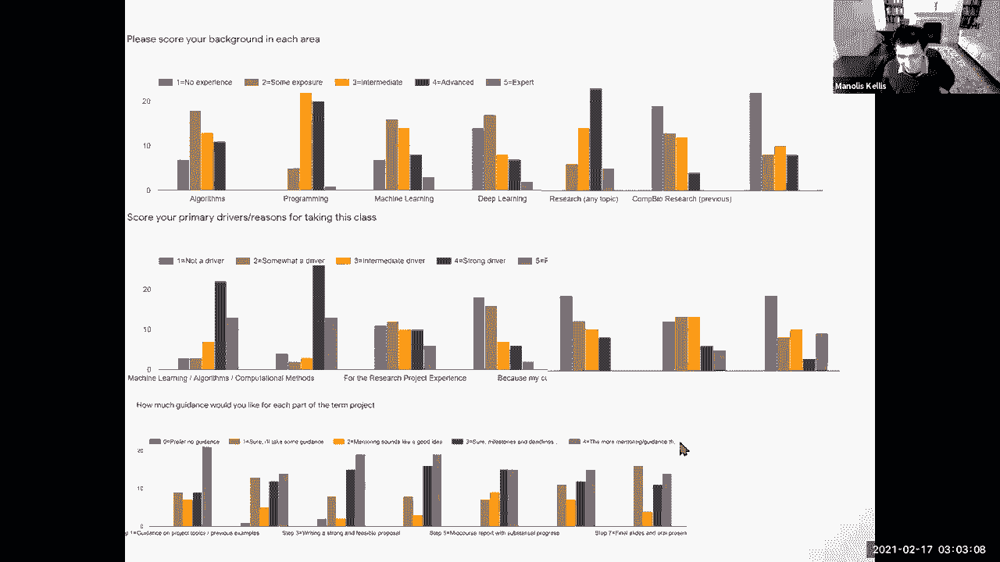

指导越多，越多越好好吧，所以事不宜迟，我将花几分钟介绍一些机器学习的主题，我们将在课程中讨论，我会在第二堂课上做一个更正式的介绍，然后我还会介绍一些生物学，我们将在课程中讨论。

所以欢迎你参加一整堂机器学习课，获得背景知识。

但我想，至少，向您介绍…的一些领域，你知道的，更广泛的机器学习，我们将再次处理，非常的人，你知道的，经常有人问，那么什么是人工智能，什么是呃，深度学习，为什么机器学习，等等，以此类推，所以嗯。

如果你看看，呃，传统上对人类来说很难的，你可以看看国际象棋，你可以看看围棋，大家可以看一下，你知道，数学积分，记忆事物推理，你知道吗，然后是逻辑和计划，所以这些是那种，你知道吗，我们希望大脑工作的地方。

像一台机器，这些地方，呃，你知道的，很明显，你知道我们仍然比机器好得多，所以就一般智力而言，能够解决问题，你知道的，能够操纵对象的一般设置，能够在复杂的场景中开车，当外面下雪的时候，天很黑什么的。

就像能够识别图像一样，能够记住十年前见过的人的脸，让它们在你的大脑中老化，因为你已经很久没见他们了，诸如此类，理解语言，能够相互交流，你知道的，玩危险游戏，等是传统上对人类来说很容易的事情。

但对机器来说很难，这些是人类传统上很难做到的事情，但对机器来说很容易，机器学习真正改变的是什么，机器实际上开始变得非常擅长这些事情，我想这就是为什么这个领域，呃，太刺激了。

我得承认我不是为你们做这张幻灯片的，我其实是为我三年级的儿子做的，他是玻璃，所以这就是为什么他的照片是一个小个子的人，但不管怎样，所以基本上深度学习更多的是沿着这些路线。

然后古典人工智能更多的是沿着这条线，所以我们将专注于深度学习和其他东西，但我们也会有点，包括一些不一定深入的传统机器学习，所以再一次，传统的人工智能大多是通过组合来破解的。

然后对每个国际象棋位置都有很好的计分功能，然后搜索这些位置，然后呃，你知道你会有一个人类会在国际象棋的所有规则中编程，你会有一个人为每个位置手工制作评分功能，这基本上可以说明这个特定的位置有多好有多坏。

然后你会搜索所有你可以用最大分数做出的动作，然后搜索你的对手可以用最小得分做出的所有动作，这就是迷你最大算法，然后重复多次迭代，然后你选择能给你最好分数的动作，假设你的对手打得完美。

深度学习正在改变这一切，它基本上是在说，3。我不想让专家来告诉我这个职位的得分，我想了解一些关于它的直觉，什么，你知道的，某种深度学习，呃，国际象棋的各个方面现在都能用阿尔法零。

这种自我游戏不是明确地教机器，什么是应该遵循的好规则？你基本上是让机器，弄清楚规则，我认为这是根本不同的方式，过去做过的事情，这也适用于国际象棋，这适用于理解一个游戏，理解现实世界中的情况。

现实世界非常简单，你知道，呃有组织的，但这也涉及到理解自然环境的极端复杂性，这就是深度学习真正革命性的地方，人工智能和机器学习，在过去的四十年里，我们作为一个整体认为可能的任何事情。

基本上这是在过去十年左右发生的事情，我们意识到哇哦，机器实际上可以擅长其中的一些事情，这是真的，嗯，这场革命是可能的，因为训练数据的融合，计算能力的，和新算法，这将是三个支柱，我们的成功将建立在。

但是机器每次看到这样的场景都在做什么，机器正在做的是建立一个场景的内部表示，最好的思考方式是，有一组可观测的，然后是我们从这些可观察到的东西中做出的一系列推论，当你们看的时候。

这个场景基本上是刺激你的视网膜后部，这实际上是一组像素，对视觉刺激做出反应的一组神经元，透过你眼睛的晶状体投射，到你的眼睛后面，你的视网膜基本上是把所有的信息发送到你的视觉皮层。

以或多或少像素化图像的形式，从像素化的图像，你有一层理解，建立了一个世界的表示，那么机器学习是怎么回事，深度学习的全部内容是建立世界复杂性的表征，在那里我们可以推理和计算，传统机器学习的表示很简单。

深度学习的这些表示是分层的，我喜欢介绍的方式，这就是观测到的宇宙的一半，这是世界所在的地方，这些是观察结果，数据，这是你眼睛的像素，不管是下雨还是太阳，晴天还是下雪，然后是世界的隐藏成分。

在那里你基本上建立模型、假设和推断，比如说，哦，我在外面看到了这种行为模式，一定有公共汽车，也可能是夏天，或者可能有一个，你知道吗，α螺旋等等在蛋白质中，折叠等等，基本上机器学习就是对世界做出推断。

生成模型允许你做什么，我们要谈谈，你知道吗，生成和分类，呃，模型判别模型，生成模型允许你表达一个事件的前向概率，所以基本上如果是公共汽车，然后我希望看到这组像素，如果是秋天，然后我希望看到雨等等。

诸如此类，所以你表示一个事件的正向概率，鉴于世界的隐藏状态，但是贝叶斯规则允许你做的，和贝叶斯规则日期，你知道已经有几个世纪了，你可以用这些向前指向的箭头来估计，观察到的季节，所以你可以估计下雪的概率。

考虑到现在是冬天，这是正向概率，给定一个季节的观测概率，所以这是你，你知道吗，引用未引用，从一系列标记的观察中学习，然后你可以用它来反转方向性箭头，而不是说好，考虑到下雨，我希望看到下雨。

但现在你可以说，好的，现在我看到雨，我的概率是世界的模型实际上是，给定的雨可以用贝叶斯规则计算，好的，这是向前概率，因为我有一些数据，对不起，我有一个假设，进行观察的概率在哪里。

然后反过来给出我有一些数据，假设的后验概率是多少，好的，所以目标是从数据的概率，给定假设对给定数据的假设的概率，好吧那么，而不仅仅是通过从，我可以说出根据观察到的世界隐藏状态的概率是多少。

这就是贝叶斯规则允许你做的，贝叶斯规则只是说假设的概率，假设的后验概率，给定的数据可以计算为似然的乘积，这是收集这些数据的概率，当我们的假设为真的时候，乘以该假设的先验，也就是说。

我希望多久会有一辆公共汽车在我前面，如果我开车穿过森林，或者如果我在收集数据之前开车穿过纽约市，这是你的前任，然后边缘是我们通常可以，你知道吗，当我们做假设检验时，你知道吗，如果一个假设对另一个假设。

d的p将总是相同的，所以我们不会太担心这个，但这将是收集这些数据的概率，在所有可能的假设下，所以你可以忽略所有的假设，然后把所有这些假设加起来，每个乘以该假设的概率得到T的p，好的。

这是机器推理学习的基础，对世界的隐藏状态做出结论，给定对世界可观察状态的观察，a，贝叶斯规则的推导是，呃琐碎，如果你画一个维恩图，这是一个，这是B，这是一个交集B，这就是概率的全部宇宙。

那么给定b的这个p乘以b的p，这里的这个东西和b的p是一样的，给出了a的p，所以基本上我也可以，由a的p乘以b的给定p的p，或者我可以到达同一个十字路口，b的p乘以给定b的p，好的。

然后我可以用一种方法或另一种方法来划分，基本上得到A给定的B作为B给定A的函数，这让我得到了假设的概率给定数据，即使我的生成模型只有这个，好的，这是贝叶斯推理的一个方面，这将是经典机器学习的一个方面。

有点，你知道的，为世界建立一个生成模型，然后推断出一些关于这一点的东西，这对监督学习的分类很有帮助，比如说，某些点的标签，您需要一个将标签准确分配给新点的规则，当然次级问题是我应该关注哪些特点。

在传统的机器学习中，特征工程是，哦好吧，我要计算大脑的表情时间，肝脏表达作为我的斧头之一，然后是比例，另一个轴，或者我会手工制作一套边缘探测器，从我的数据集中选择正确的功能，在深度学习中。

深度学习的美妙之处在于这些特征现在可以从数据中自动学习，我们将在卷积神经网络中看到什么，比如说，你留出了一组参数，你直接从你学习的数据中学习，不是这些超参数，但是这些共享的参数，就是这些卷积滤波器。

比如说，应用于整个图像或整个基因组并被重用，这是很多特征学习和表征学习，现代人工智能和现代机器学习，尤其是深度学习，这是为了分类，非常相似的概念适用于回归分析，你不只是试图预测一个类。

但是您试图为输出变量推断一个值，我们将在周四正式确定这一切，和聚类，这是无监督学习的一种形式，所以在监督学习中，我有一些标记数据，我你知道，比如说，我有，呃，你知道，我注释过的数以百万计的图像。

这是一辆公共汽车，这是一个祖母，这是一只鸟，这是一个，你知道猫等等，因此，带有注释的数据集，我可以应用监督学习根据物体的特征对不同类别的物体进行分类，2。我可以自己动手，也可以自己动手。

而聚类是无监督学习，基本上说这里有一个，你知道的，一百万张图片弄清楚，你实际上可以把数据聚集在一起，在某种维度上结合在一起，但真正非凡的是，您还可以从这些数据集中学习特性和表示，当然。

这两个问题是相互关联的，所以基本上，呃，你知道的，分类和聚类是通过，迭代学习和一个方面，一种迭代学习是期望最大化，在那里你迭代地估计你的生成模型的参数，然后为Prod生成注释，为了你的积分，你从你的。

呃，模型，然后估计这些点的标签，这两者基本上是同一枚硬币的反面，嗯，如果你知道世界的模式，您可以从该模型生成数据，如果你观察到标记的数据，您可以估计模型的参数，和无监督学习，你基本上可以通过。

通过说好来学习你的数据集，我要先提取一些特征，我将使用这些特性来标记符合这些特性的对象，然后在这些物体的基础上改进功能然后突然想到了公共汽车的概念，尽管以前没有人告诉我公共汽车是什么。

所以你可以用传统的机器学习来玩这些游戏，或者用深度学习，在那里你可以推断世界的表示，并通过这种迭代方法推断具有相似属性的对象集群，和有辨别力的学习，有呃，你根本不想学习表示的例子。

也许建模数据的完整分布是不可能的，你想做的是关注元素之间的边界，所以再一次，这与生成模型方法正好相反，而不是试图学习一个捕捉所有数据的模型，您要做的是学习数据之间的最佳分隔符。

所以我们将看到生成性和判别性的学习方法，你知道的，力量，当然啦，支持向量机是核，数据的这些转换，事实上，你可以计算判别阈值，它是线性的，但在非线性变换的空间中，它有效地允许您创建非线性分类器。

我们将讨论各种很酷的技巧，分类，业绩，对于任何选定的阈值，我们如何相对于随机分类器，你在这个接收器上下移动，工作特性曲线，一个术语，嗯，战争和通信渠道丢失与否的日期，你知道的。

任何一种方法都可以在不同的阈值下运行，沿着这条线移动以实现任何类型的分类目标，我们还将学习线性代数，以及我们如何利用，呃，线性代数和矩阵运算来理解跨生物系统的网络，我们将讨论概率网络和图形神经网络。

和贝叶斯网络，以及我们如何使用节点作为概率变量和边，描述信息流之间的互信息或约束，在这些边缘之间，我们将研究低维投影，矩阵的特征分解，和，呃，你知道的，刷新一些线性代数，我们将研究正规化的特殊形式。

它惩罚了模型的参数数量，使用线性或二次惩罚函数，允许您现在最小化，你知道的，通过限制非的数量来进行过拟合，零参数和大参数数，可以让你有更多，我想再次提到，并不是所有的学习都是深刻的，所以再一次，呃。

你知道的，强调我刚才告诉你的，口头上，传统人工智能包括知识系统，你可以手工设计一个程序把杂货放进袋子里，基于特定的规则集，如果程序员没有想到每一个可能的规则，那你就有麻烦了。

那么经典的机器学习仍然使用手工设计的特性，而是没有手工设计程序，它基本上会使用你制作的功能从数据中学习，那么表示学习不仅可以让你拥有手工设计的功能，但实际上已经学会了特性，并从这些特性映射到您的输出。

深度学习允许你通过层构建更抽象的特征，从简单的特性开始，这就是你所知道的，我们将在这节课中重点讨论，所以深度学习特别应用于生命科学的所有领域，我们如何构建简单的特性，我们如何构建更抽象的特性。

我们如何从这些特征映射，这些灰色的盒子在哪里，学习发生的地方，呃，你知道的，将跨越所有级别，所以如果你想把一辆车、一个人或一只动物分类，你是从层次结构通过一层像素建立起来的，然后是一层边缘。

一层角和轮廓，一层物体零件，并最终基于特定的引用，正在放电的神经元，建立在其他神经元组合上的，你在学习轮子的概念，你在学习人脸的概念，你在学习，你知道，关于世界的具体概念。

然后你可以用它来预测世界上的物体，所以这是非常多的，深度学习对如何了解世界的类比，但事实证明我们，因为人类在我们识别物体的方式上并不遥远，所以如果你看看我们大脑计算中实际发生的事情，我们再次有图像投射。

然后层层神经元学习越来越抽象的推理层，我们有低级计算，你知道的，在单个神经元水平上决定一个事件是否经过了某种激活，一些兴奋阈值，然后决定全力以赴，说是的，我已经看到了，然后开火，然后你知道，超极化等等。

然后这些神经元不是孤立地作用的，它们在复杂的神经网络中作用，通过这些非线性呃，积分器，然后决定是否观察到了特定的信号，这就是你的视觉皮层实际上发生的事情，可能在许多其他感知领域，甚至在我们的大脑中推理。

在哪里，特征特定子集的受体，然后形成更复杂的特征，所以这是一个被一遍又一遍地重复的架构，如果你看看我们的视觉皮层和运动皮层，有类似的信息层，事实上，通过我们自己的单细胞数据，呃，人脑的。

我们实际上认识到，额叶皮层中与上层匹配的特定亚型神经元，运动皮层的现代神经元，人们认为不存在于运动皮层之外，所以事实证明有很多分享，即使在这些多层架构的不同层和不同区域之间的单个单元分辨率下。

这是你知道的，哺乳动物从我们的，呃，脊椎动物的近亲，比如爬行动物，基本上主要有大脑的皮层下区域，我们基本上作为哺乳动物扩大了新皮层，作为灵长类动物，进一步扩大了新皮层到如此巨大，呃，质量，作为人类。

我们基本上已经做到了这一点，你知道吗，巨大的硬件扩展，许多人认为这基本上是推理发生的地方，那是意识产生的地方，那就是你知道的地方，某种抽象思维是可能的，这基本上就是让我们研究所有这些的秘密，你知道的。

无数的任务，在内心深处，这是一系列简单的操作，我们现在已经移植了，从生物空间到计算空间，具有特定激活功能的网络体系结构，这些功能基本上决定何时触发，基于，你知道的，我看到的输入信号量。

这个激发应该是阶跃函数还是西格玛函数，sigma sigmoid，或者你知道，非线性的，呃，基于梯度学习的函数算法，允许您通过这个网络估计误差，然后向后传播这些重量，所以我们将深入了解这一切的细节。

在接下来的几节课中，关于课程的计算部分，然后呢，嗯，正规化为避免过度适应训练集，测试集，验证集，卷积滤波器，呃，用于压制表示的自动编码器，到更简单的表示，然后欺骗有监督的算法作为无监督的方法，等等。

等等，所以这就是我今天要停下来的地方。

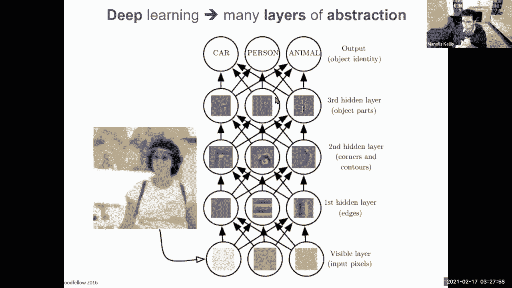

然后呃，基本上欢迎你参加这门课，我会，嗯。

给你介绍这门课程的生物学方面，当我们根据需要潜入这些方面时，但如果你有兴趣深入了解，呃，这基本上是建立在，呃，这五个模块，呃，我描述的，呃没事吧，所以呃，用那个，呃，再来一次投票，他对这门课很兴奋，呃。

让我们看看停止分享结果，重新启动，在那里打保龄球，你真棒，曼诺利斯，聊天中有几个很好的问题，当我们在等待人们回答的时候，是的，所以让我在这里停止投票，然后呃，很酷的人都超级兴奋，五四四二二零二。

然后雷兹问还有多少自由度，你会说，一个简单的真正的脑神经元有，与简单的前馈或卷积人工神经元相比，这些都是很棒的问题，再问他们一次，当我们谈论，呃，这些人工神经元在接下来的几节课中，我们怎么知道什么信息。

层层深入网络抓手，比如说，视觉任务，我们如何知道某一层是否抓住边缘，颜色，等等，这是一个关于这些解释的奇妙问题，那是给呃的，位置um，关于可解释性的一个大问题，我们将有一整节课专门讨论可解释性。

可能会讲五六堂课，如果我没记错的话，太厉害了，所以感谢大家的到来，我们很高兴你能来，然后呃，期待着在整个学期与您互动，别忘了，呃，填写你的学生档案并录制你的视频介绍，并上传到Dropbox。

您将能够立即看到您的，以确保它上传，也是你所有的同龄人，谢谢大家，我们很高兴你能来，拜拜，谢谢你，谢谢你，谢谢你，谢谢大家，谢谢你，谢谢，嗨，每个人，你们能留下来吗，哦，你介意吗，哦耶，去吧，普拉蒂克。

去吧，你介意吗。