# P17：Lecture 17 - Deep Learning for Protein Folding - 爱可可-爱生活 - BV1wV411q7RE

二话不说录制，我非常高兴地欢迎布鲁诺·科雷亚，他今天将为我们做三个客座讲座中的第一个，关于蛋白质折叠，所以我们真的很荣幸，我们有布鲁诺，然后我们就有了新保书，所以布鲁诺，把它拿走，是呀，让我们看看。

好的，所以兄弟们，今天能和你们在一起真的很高兴，嗯，我很感激我的工作的一部分是能和学生交谈，当人们仍然非常渴望对新的主题感到兴奋的时候，我希望在这之后，这很短，两个五分钟，我必须告诉你。

我们在实验室里做的一些事情，你和我一样对研究蛋白质结构感到兴奋，今天我们要谈的是，就像，嗯，我们通常所说的实验室表面指纹，我们使用几何深度学习来研究什么，嗯。

蛋白质结构中表面指纹的功能特征类型实际上可以教会我们，嗯，我今天要告诉你们的主题的核心，作为发动机，这个引擎就是这个领域的专家通常所说的几何深度学习，最终几何深度学习是什么。

基本上是研究高维类型数据的概念，你有的地方，非常丰富和数据结构，你可以向他们学习，所以假设你知道，如你所知，深度学习一直在做，你知道很多像，在许多不同领域取得的进展，但也许最引人注目的是图像分类，对呀。

所以如果你想想图像分类实际上是一个很像，数据集的铺设类型，在生物学中，我们实际上没有很多像，你知道的，看起来像图像的数据集，他们是，他们一般要富有得多，它们有类似于时间的维度，它们有其他类型的维度。

我们认为我们可以把每个小队，所以几何深度学习试图，在我们拥有更丰富和高维数据集的领域工作，我会给你一些例子来说明这些数据集是什么样子的，我先给你们简单介绍一下蛋白质的结构和功能。

然后我们将讨论如何研究这个表面，指纹和蛋白质结构，然后我会告诉你们一些关于设计的知识，如果我有时间，如果我没有时间，它是，也可以，好的，蛋白质对嗯，事情是这样的，呃，蛋白质编码在我们的基因组中。

一般来说他们，他们基本上你知道，生活的累赘，所以他们我们确实得到了这个，这些编码在我们基因组中的代码是根据它们的DNA对，然后最终细胞机制将把这个密码翻译成氨基酸，这些分子最神奇的地方之一是。

通常它们的功能与它们的三维结构有关，所以你在这里看到的这些聚合物以一种非常卡通的方式表现出来，将采用三维结构，然后这实际上可以执行，细胞中的分子功能，所以他们可以做催化或化学，它们可以做机械功能。

它们可以是二进制识别，和，它们真的控制着所有类型的细胞行为，和我们的有机行为，好的，关于蛋白质功能的一些看法，所以我敢肯定，你们中的许多人现在都渴望有一种叫做抗体的抗源，对呀，嗯，你猜怎么着。

这是一种抗体的结构，都是这样的，这是你知道的最，或者我应该说这些天流行的分子，就我们希望体内有什么而言，保护我们免受这些流行病的侵害，但你也有其他蛋白质，例如，储存，储存，呃，铁样油墨输送。

所以实际上泵的蛋白质，呃，离子，呃反对，呃对抗渐变，同样的事情我在这里有同样的想法，细胞间的通信，刚性，麦肯多，呃，细胞实体中in in的性质也是由蛋白质结构完成的，最终最神奇的事情之一是化学。

就催化而言，好的，所以我会先发制人地解决我被问到的一个共同点，这是研究蛋白质表面的工作，由alpha处理，然后呃，事实的现实是，答案是否定的，所以阿尔法折叠所做的，我相信你们都知道阿尔法形式。

你可能不知道蛋白质的确切结构是什么，但你知道什么是阿尔法折叠，然后呃，你知道阿尔法折叠所做的是在这一点上解决，就我们所知，从序列中预测结构的长期挑战，到目前为止，这是分子生物学中最突出的挑战之一。

你真的可以在这里看到，所以现在我给你看的是两个的叠加，模型序列或由alpha形式创建的模型，与实际结构相比，你看这是，你知道这些预测绝对不可思议，然而，函数预测问题是另一回事，我们喜欢使用结构。

为了预测他们体内有哪种功能性指纹，在，它们的结构，在它们的表面，例如，我在这里给你们举两个例子，很多，哦，我来把这个，嗯是的，例如，最重要的事情之一，为了确保细胞正常工作，蛋白质如何相互作用的想法。

在这里，我向你们展示了一个或几个网络，事实上，蛋白质与蛋白质的相互作用，在不同生物体中已被表征的um，这仍然是我特别关注的事情，比结构更难预测，尽管预测一个结构仍然很难，而且仍然很难，或者也可以，例如。

思考蛋白质实际上是如何与其他代谢物和细胞相互作用的，所以所有这些对拥有，对这些分子在细胞中的作用有了充分的了解，现在，让我们更多地走向，为什么为了理解结构的功能，研究结构很重要，所以我在这里。

我引用弗朗西斯·克雷格的话，对呀，基本上你已经知道当他们在研究DNA的结构时，他们已经有点喜欢这个了，用这种陈词滥调，嗯，如果你想了解函数，你，你当然应该学习结构，当我们谈论研究蛋白质结构时。

研究蛋白质结构的方法有很多，你可以表示蛋白质结构，所以我最初告诉你的氨基酸菌株，它们的二级结构就像你知道的，这更多的是对分子的架构定义，分子的三维形状是什么，折完之后。

或者你可以有更多的类似于图表的东西，不同的积木代表和坚持，或者你开始进入不同类型的表示，例如，你可以做平行，你知道蛋白质的原子表示是没有的，不再，不少于一点云，然后你知道更高的层次是代表蛋白质的想法。

因为嗯，连续分子表面，正如我在这里向你展示的那样，这将是我们将要研究的数据类型，接下来的幻灯片，我现在要告诉你的。

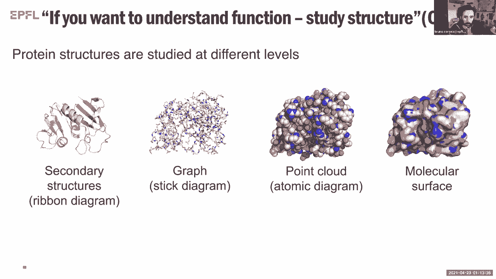

思考蛋白质表面的有趣之处在于，有趣的一件事是，这些表面中的许多实际上可能有不同的序列，所以不同的序列，嗯，它们也可以来自蛋白质的不同结构，但他们可能，或者它们可以有类似的功能。

这基本上把我们带到了这个想法，我们在蛋白质中观察到的许多相似之处实际上只能检测到，在地表，而不是架构层面，或者在序列级别，这就是你这样做的典型目的，对于那些感兴趣的人来说。

他们被很好地用于研究蛋白质序列，你知道当你有一个蛋白质序列时，你要做的第一件事是，你知道你爆炸了，而你塑料，你问，好的，还有其他蛋白质看起来像这种蛋白质吗，一旦你明白了，到底像不像这种蛋白质，你说。

好的，嗯，如果我的蛋白质看起来像这个，也许它在做类似的事情，但这里的概念有点不同，就是，如果我的表面看起来像这个序列的独立性，它在做类似的事情吗。

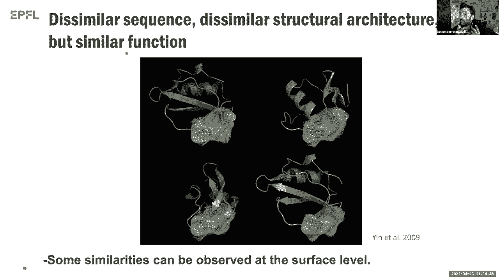

好的，非常好，所以我喜欢这样做，这个类比，研究蛋白质表面就像研究人的脸一样，你知道，当你对你在人们脸上看到的模式有足够的了解时，你可以告诉他们很多关于他们的事情，你知道的，他们来自他们的精神状态。

蛋白质也一样，那是，或者至少这是我们的假设，我们，当然是合伙人，呃，偏离了传统的深度学习，这使得它基本上更多地在两个D型中工作，嗯，数据集类型，更多的是图像或声学信号，我们更倾向于几何深度学习的想法。

这显然更适合我们有权利的问题，所以哪一个更像是三维的，所以，让我告诉你我们使用的引擎实际上是如何工作的，所以几何深度学习的原型对象是图，我相信你们对图形和曲面都很熟悉，当然你知道这些表面也可以有。

也可以采用不同类型的数据结构，这些不同类型的数据结构可以是体积的，也可以是，例如，点云，或者它甚至可以有点像，网格和网格基本上只是你表面的三角剖分，你可以，然后您可以使用，所以网格表示正是我们所使用的。

所以我们现在要专注于这个，现在你有了这个网格，所以你可以看到你有节点，你有边缘，你有连接每个节点的边缘，所以现在我们可以创建我们的基本数据结构，我们将用来研究这里的蛋白质，你知道吗。

首先我给你看了一只兔子，但这本质上是我们要用的，补丁的这个想法，基本上这些补丁是什么，这些数据结构是网格的子集吗，然后在每个节点中，我们将有，嗯几个特点，我现在就告诉你它们是什么，我要让你非常抽象。

但是你可以在这些节点中的每一个节点中都有类似的特征向量，你会申请，um极坐标系，在这种情况下，你将定义你想要的半径，你想在这个网格周围伸手，然后你知道这里最大的创新之一。

创新之处在于我们将其应用于蛋白质，但我们亲爱的同事已经把它应用到其他事情上了，呃，迈克尔布朗斯坦，嗯，基本上，这个数据结构指的是，你如何为这些高斯函数中的每一个设置本地权重，迈克尔喜欢称之为软像素。

基本上这是什么，你会给你的补丁中的每一个区域一个可学习的权重，然后然后然后然后你会，你将在那里工作，然后在这之后，你实际上应用了一个特殊的卷积过滤器过滤器，到这些数据结构，还有两个可学的参数。

你在这里看到的，g和e都是可学的，在这个卷积之后，你把这个补丁的信息归结为一个向量，当然，这个向量会有不同类型的长度，你知道这是一件，那么你必须努力才能提高你的表现，好的，所以呃，让我们看看。

我们是如何将其用于蛋白质的，所以我们从蛋白质的三维结构开始把这些结构转化成网格，然后把它分成不同的补丁，你在这里看到的，只是我给你们看的测地线补丁，你看，呃呃呃，我们这里的不同网格结构的节点。

然后你也听到了半径的概念，然后我们开始把属性放进去，我想你知道这是我们工作中最激动人心的部分之一，因为那时我们开始思考，好的，所以就，如果我们想了解这种蛋白质结构的化学和结构，我们应该编码什么，对呀。

最终我们选择了两到两种不同类型的照片，所以我们把这些点编码成每一个点，在这些网格中，不同几何特征，所以形状指数，它告诉你，嗯，的，表面本身的拓扑，就像同样的事情一样，作为距离相关曲率，然后在上面。

你知道我们的生化心脏开始大声说话，我们开始将化学特征编码到其中，所以疏水性，所以这个网格上的一个特定节点有多疏水，它有什么类型的静电特征，然后我们一起编码了一个极坐标系。

所以现在这个网格中的每个点都知道它相对于所有其他点的方向，然后我们把所有这些数据输入几何深度学习方法，我们为特定的应用层训练不同的指纹描述符，现在演讲的下一部分是告诉你，我们有什么类型的应用程序，好的。

现在这是这是惊人的，我爱，我喜欢这个概念，如果你不介意回到上一张幻灯片，现在，你如何将所有这些与序列联系起来，基本上现在我们对曲面关键问题进行编码，这个，这种数据结构没有序列感知。

我们只是在研究后面的原子和化学性质的模式，这与蛋白质折叠问题无关，与对接有关，它与某种，如果你有彼此靠近的东西，你怎么从那开始，但基本上如果我有一个分子，你就不能告诉我它的结构，但你可以编码它的结构。

了解它的结构，找到相似的结构，如果你有绝对完美的结构，但有，但你知道，我认为这是一个，这是一个很好的观点，我绝对没有让它像，非常清楚，的确，我们在这里学习的这个这个这个数据结构，他们完全不知道，嗯。

我必须告诉你这真的很有趣，有点像智力刺激，因为你知道这有点像整个想法，让我们学习在某种程度上，在这些模式中可能存在序列退化，因为序列不同，我们也许可以呈现同样的，有相同的图案，是啊，是啊，是啊，是啊。

是啊，是啊，例如，用一个模仿的trna，或者一种模仿，停止密码子的trna，你就能绘制出它们的结构，原则上不管它们是由什么组成的，是呀，就是这样是的，所以有点像，你知道吗，在某种程度上。

我们想知道哪种模式是，这是我们现在正在研究的东西，存在于不同的结构中，因为也许我们可以从不同的，呃，对于不同的功能，这种蛋白质可能有，仅仅因为它们表面有这些图案，我喜欢继续，我不想打断你们，好的，是呀。

我你知道，我没有时间，3。我没有时间把所有的材料都看完，不过没关系，我们该停的时候我就停很好，所以应用程序，对呀，为什么我们，为什么我们对学习结构的这种性质感兴趣。

原因是它们将帮助我们更多地了解特定的结构，我们可能不知道对，所以我们感兴趣的一些问题是，我们能不能，例如，对蛋白质中存在的更好的口袋进行分类，在理解哪种辅因子或代谢物方面，他们又绑在一起了吗。

不知道这些口袋里有什么顺序，但他们有买的功能吗，特别是DD有一件事，嗯，我想在某种程度上是抽象的，但对我们来说非常非常有趣，蛋白质结构中的权利，是否有更有可能与其他蛋白质结合的位点。

即使你不知道还有什么蛋白质是好的，所以只有表面贴片更有利于蛋白质的溶解性，其他更多用于蛋白质相互作用的表面斑块，然后一个更常见的练习类型是这个想法，我能预测哪种类型的结构吗。

或者你可以从两个对接的蛋白质中获得哪种类型的结构，所以我能用表面Stic预测两个蛋白质的对接结构吗，我们比较了我们的预测器的特异性，口袋的um到其他预测器，最终我们看到的是巨大确实表现出了。

与其他类型的袖珍特异性预测器不相上下，在这项研究中，我们真正想做的一个问题是，因为你知道，硬件生物化学家，我们真的很想明白，好的，但你知道，为了预测这种类型的特异性，我们可以向这些网络提出什么问题。

是化学反应更重要吗，是不是，更重要的几何学，两者都对吗，所以我们开始对我们的网络进行消融研究，试图理解，好的，如果我们只编码化学，我们做得有多好，我们，你知道的，在这种情况下，我们只做零65。

但如果我们只有几何学清楚，我们做得不太好，所以说，当然，这意味着几何学本身并不，没有编码很多信息，但化学代码更多，但当我把两者都在一起的时候，然后事情看起来好一点好，那么就，呃，就准确性而言。

试图预测哪些斑块更有可能与其他蛋白质相互作用，在这里，我认为我们做了一个很好的进步，它不是因为它不是那种，你知道，我们以前的近距离，但是呃，我们开发了这个被称为Massive站点的网络。

我们把它和其他蛋白质进行了比较，在这里我们可以肯定地预测，嗯，给定特定的蛋白质表面，哪些位点更有可能与其他蛋白质相互作用，如果你在这里比较，火箭方面的这些差异，你看肯定比我们以前看到的要明显得多。

所以这很有趣，那么就对接问题而言，嗯，我们在这里所做的基本上是，你知道吗，我会很快带你通过这个，我们基本上是做指纹扫描，嗯，所有的，可能与其他补丁交互的补丁，我们选择最有希望的指纹。

然后我们有一个对齐的阶段，我们重新排名，我只想在这里提出一个观点，也许在这张幻灯片中，我们比较了大规模搜索，基本上是一个对接程序，最好的对接程序之一，这些程序存在于文献中，所以这是z和z n。

我想你知道，这个结果非常惊人的一点是取决于你如何研究结果，以及你如何选择你的成功数量，假设你有一个完美的预测器，这里有一百这里有一百这里有一百，但是当你把不同的选择条，你的数字下降了。

但是如果你看到这些数字，他们最终，我们可以得到与最佳预测器相同数量的正确解，有趣的是我们可以做到，你知道，为了更快的数量级，为什么我们可以更快地进行这些数量级的计算，是因为我们不是在三维空间中进行计算。

我们实际上只在一个D空间上进行计算，关于矢量距离，通过对向量距离的计算，我们可以加速，基本上你知道，假设我们现在可以对接蛋白质中的所有蛋白质，一切对一切，你知道，在很短的时间内做到这一点。

而z doc将无法做到这一点，所以这是相对的，你知道我们很兴奋，因为现在它大大加快了这个过程，所以呃，也许我只剩下三分钟了，所以我不会告诉你我们是如何用这个来设计的，但我想告诉你我们接下来是怎么进去的。

在下一代，呃巨大的，我们称它为D质量，表示可微质量，所以如果你跟进所有的故事，基本上我们之前在做什么，基本上是创造一个蛋白质网格，然后我们基本上是用手，手工描述符来映射，um静电学映射。

几何学来绘制所有这些东西，所以所有这些都是，我们基本上是在质量的顶部完成的，我们已经为结构计算过了，所以我们认为这里还可以，嗯，如果我们摆脱这些预处理步骤，我们实际上可以有一个首尾相连的。

描述表面的点云，也是对几何和化学特征的计算，所以几何并不那么难，但化学特征实际上相对坚硬，因为基本上你在这里所说的，你可以计算一个分子的静电学，只要有表面点，所以这就是我们在这里所做的，嗯。

通过发展这个巨大的，所以你在这里看到的一些差异，有很多预处理步骤，嗯，你看到的旧版本，现在我们所拥有的本质上是一个完全可微的网络，它是被训练的，也是为了计算静电，嗯，这个的静电特性，这个点云。

所以当你看到，例如，如果我们比较我们以前使用的我们可以认为是基本的真理，和大规模的预测，例如，就蛋白质表面的静电势而言，他们其实没什么不同，我们在这个口袋里看到了一些不同，但老实说，他们是，他们有点像。

呃，与我们这些预测所需的不相上下，好的，所以在还剩一分钟的时候，我该怎么跟你说，听一下设计部分，我想这样可以，好的，好的，关于设计部分的一点，所以让我们看看，好的，设计部分总是令人兴奋的。

我可能要花五分钟以上的时间，但让我们看看，所以我们取了这种蛋白质，这种蛋白质叫做PDL 1，这种蛋白质的作用本质上是，对控制非常重要的癌症，控制T细胞活性的非常重要的靶点，好吧，我们想做的是。

所以有许多针对这种蛋白质的单克隆体，但我只想没事，我们真的能用美国宇航局来瞄准这种蛋白质并设计，与新颖的蛋白质-蛋白质相互作用，我们，我们用Massive预测了一个更容易，被设计分子靶向。

然后我们提取目标表面的指纹，由于我们必须进行对接计算的速度，我们实际上可以创造，碎片，你知道的，有一亿个蛋白质模体的片段，我们可以对接到这个网站上，然后我们把图案对接到这个网站上。

所以当你最终从这些计算中得到的是，什么是最有可能的Moto与这个网站互动，我们有兴趣从事的，然后你知道，因为与我们需要在实验室做的实验有关的原因，那个。

我们通常使用大量的这种显示来筛选许多不同类型的或大型库，然后我们把这个结合位点转移到，呃呃，球状折叠蛋白，现在我要跳得很快，只是为了向你展示关键的结果，好的，关键的结果是这样的，好的，通常。

如果你是一个计算蛋白质设计师，你必须做什么才能让人们相信你的结果，你的预测是正确的，你必须解决一个实验结构，我在这里给你看的是什么，是我们用大量和实验结构的重叠来预测的，它是在实验室里解决的。

你可以看到粉红色的实验结构，你有模型和种子模型，我们用巨大的，呃在嗯，橙色和黄色，所以现在，嗯，这个的均方根偏差，这个复合体大约是一埃，这基本上意味着所有的原子都在彼此的顶部，这意味着预测。

嗯完全匹配它应该匹配的，如此如此，然后然后嗯，除了结构，这也是绑定到PDL的活页夹，一种具有90纳米摩尔亲和力的蛋白质，对于那些更喜欢亲和力常数的人来说，这基本上意味着有很高的亲和力相互作用更重要的是。

这绝对是最后一张幻灯片，我们没有重现自然界已知的主题，因为我们也知道有本地配体，也就是绑定到pdl的PD，一个看起来像你在那里看到的绿色结构，但一旦我们实际重叠了我们设计的结构，它看起来。

它看起来一点也不像本机结构所显示的，意思是你知道，我们用这个表面指纹扩大了粘合剂的空间，我想我真的需要尊重时间，我想非常感谢你，所以我们这里也已经有了Jingo，所以给布鲁诺一个大大的手，然后是金波。

请开始分享你的屏幕，所以谢谢你，这是一个非凡的，我希望我真的希望我们有整整一个半小时，可能非常感谢，谢谢布鲁诺再见，欢迎你留下来，当然，我总是问每个人的问题是，如果学生有兴趣做这方面的项目。

你有没有兴趣，可能会建议他们，很乐意，是啊，是啊，那就太好了，是啊，是啊，我可以告诉你，如果你想漂洋过海，瑞士真的很美，听起来不错，非常感谢，拜拜拜拜，所以说，所有的权利，每个人，请和我一起欢迎基诺。

他将告诉我们通过深度学习预测蛋白质结构。

所以GGo把它拿走，你是静音的，你的视野是关闭的，但我们可以看到你的指针和你的侧面，好的，是啊，是啊，谢谢。是啊，是啊，给了我这样一个机会，呃，把你的头，你能不能，呃，感觉摄像机就在那里，完美，好的。

是啊，是啊，不确定，为什么我的好，好的，所以耶，呃，我要谈谈，呃，呃，如何用计算机预测，呃，触觉结构蛋白，呃，我是说，我说的顺序没有用任何呃，实验数据，所以这是一个非常古老的问题，已经研究了很多年。

之前进展不是很好，因此，许多蛋白质结构预测的方法被开发出来，所以呃，从广义上讲，我们可以把所有这些方法分为两大类，一个是呃，基于模板的建模，另一个是时间自由建模，所以通过基于模板的建模，我们是说，呃。

我们可以在pdb中使用某种结构作为模板，为预测下的强序列建立模型，所以在呃，这个方法是，呃，所以这种方法实际上是一种非常可靠的方法，也可以找到一些好的模板，它是第一选择，呃，用于之前的轮询预测。

直到最近，呃，现在呃，现在的临时自由建模，实际上对于许多蛋白质的许多靶点，时间自由建模现在比基于模板的建模具有更好的精度，所以临时自由建模，呃，使用了，呃，之前，呃，主要是呃。

当你在pdb中找不到模板时，但现在呃，即使你可以在pdb中找到一些模板，你也应该考虑，临时模特，选项，呃，除非模板与序列非常相似，所以之前，呃，二千零一十六，呃，当我们谈论，呃，蛋白质结构预测。

通常意味着我们需要大量的计算能力，即使如此，呃的成功率，临时自由建模，呃是，呃是众所周知的，呃，即使只有呃，小蛋白质和非常大的蛋白质，那么几乎不可能得到一个正确的股票预测，呃顺便说一下，所以在这个，呃。

呃，在这个，呃讲座，我将主要集中在呃，临时免费，呃，模型，呃，方法，所以这里有一个呃非常受欢迎的，临时建模的老方法，所以这个方法称为片段程序集，这是这样的图片，给你看看这个方法的大意。

所以基本上给出一个正在生产的蛋白质序列，我们把序列剪成一些小片段，每个都有9到11个残留物，然后我们每一小段，然后我们去pdb，我们搜索片段，在pdb上找到每一小段的片段，例如，对于每个节目片段。

我们可以找到大约两百个可能的碎片，所以这一小段的结构可能与一些碎片相似，然后我们可以运行采样，我们从金融部分的每个片段中取样，并将所有碎片组装在一起，形成一个完整的确认，然后我们计算能量函数。

并以有利的能量保持确认，这就是碎片组装的基本思想，但是为了这个方法，这个方法来生成呃，一些很好的确认，然后我们必须在，是啊，是啊，我们需要对大约十万个甚至一百万个构象进行采样，即使是很小的蛋白质。

它需要很大的计算能力，所以如果呃，这需要很长时间，如果你想喜欢，比如说超过150吨的样品蛋白质，成功率已经知道了，所以这是呃，以前流行的临时建模方法，所以直到最近，所以我们有一个，呃。

所以社区想出了一个新的策略，临时建模，所以这个方法和组装完全不同，所以给定一个蛋白质序列，我们先，呃，首先我们运行同源性搜索，呃，所以我们找找，最大的单一数据库，找一些秘密的家居模型。

并建立一个6和9的倍数，所以顺便说一句，所以呃，流行的碎片组装方法也会做谐波搜索，但是这个新方法使用序列，模特和呃有什么不同，数据，所以我们构建了一个多环境，然后从九的模型中，我们可以。

呃实际上是一些有用的信息，比如，比如说，我们可以得到一个侧写，呃，信号剖面，只是，呃，所以在编码信息，这个蛋白质每个位置的信息种类，然后我们也这样做，我们也可以做一些分析，所以系数分析会识别出那些呃。

可能被称为世界的位置，然后我们将这些信息输入一些机器学习模型，尤其不是深度学习模型，从相似的配置文件，我们可以预测局部结构，就像第二个结构，如果我看到三角形，然后从呼叫中获得哪些信息，以及用户配置文件。

呃，我们可以预测，呃，之间的感应应力，呃，任意两个残基，呃，尤其是在，假设我们可以预测距离的上下文，呃，在蛋白质中的任何两个原子或残基之间，然后我们输入这个呃预测信息，呃，预测器感应指标。

以及预测的局部结构，优化引擎把它构建成三个坐标，所以他们说，呃，当你，用于多序列对齐，这是基于整个蛋白质，或者人们也试图在结构域水平上排列蛋白质的较小部分，是啊，是啊，所以这是一个很好的问题。

所以不同的人使用不同的策略，所以呃，例如，所以对于一些程序，他们要求至少50%的保险，但在我的实践中，我没有这样的要求，所以对我来说，有时我也盖一个，那么也许对于一个小域，我也想有一些保险。

所以我通常在晚上要求覆盖残留物的数量，至少有百分之六十到八十的，呃，序列，质量顺序很好，你知道另一个问题是关于进化距离，在许多许多序列上覆盖，在非常非常远的距离上，又保留了结构，你多久收到一次。

找到进化空间的最佳位置有多难，是啊，是啊，这是个很好的问题，所以我认为这仍然是问题的答案，所以是的，确定哪个序列，我们应该用多少，所以现在我们只要用这个非常简单的方法，我们只是用价值，有点像说。

我们说E值是10到3，但我不认为这是最佳的，呃解决方案，所以我认为更好的策略是你，您可以使用不同的值或不同的标准来生成不同的，呃，多重系统，对于每一个，您可以生成一个模型，然后你用最小的能量取模型。

所以这将给你一个一般的演讲，会给你一个更好的三维造型，明白了，谢谢。是啊，是啊，所以当然是的，如果可以的话，你可以找一个人类专家，如果你找到专家，谁能感谢你，我对你的排列，我想这也会提高莫的同伴，是啊。

是啊，所以这是一个呃，呃，相对较新，呃，无模板建模策略，所以这里的关键部件是，我们如何预测感应矩阵，所以指关节的结构就不那么重要了，如果你有一个好职位，稍微有点帮助。

但这里最重要的部分是如何预测感应指标，所以我们可以接受，嗯嗯，呃，建模交互匹配，用呃，内容匹配或距离匹配，下面是距离匹配和内容匹配的定义，我想我们这里有四个住处，然后我们就可以计算欧几里得距离。

然后我们把所有这些距离信息写在矩阵中，这个矩阵叫做距离矩阵，当然，这个度量是非常复杂的，因为它的条目数是一个平方，呃，用呃序列网，然后我们就可以简化，我们可以离散地重新生成一个内容矩阵。

所以我们通常可以把它作为一种，所以如果距离小于8，然后我们写下，呃一个，否则我们这里是零，所以在这个内容矩阵中，一个表示两个原子，或者在三维空间中相互靠近的两个残基，所以在内容矩阵中，第一个是线性的。

呃，关于呃，序列网，所以它比这个度量更简单，所以在呃，的，这个社区的研究主要集中在内容匹配上，因为这种精度，呃，那种位置很低，所以呃，所以社区只有，呃，处理这个更简单的问题，但只有直到21718年。

从那时到现在，我们可以做得比预测更好，所以目前的指标已经研究了很多年，在很长一段时间里，精度大约是20%，所以呃甚至喜欢说，很多人认为逆位和蛋白质折叠本身一样难，但实际上，呃，大约十年前，所以呃。

大约十年前，呃，反位置，呃可以，呃渐渐地，呃变得更容易，这样我们就可以做位置了，比以前好多了，所以这里有一些想法，呃，这是有用的，对这个职位非常有效，所以第一个想法是一个全球统计学家，联盟分析。

第二个是深度卷积神经网络，用于预测接触距离，最后，它是一个变压器般的网络，用于接触预测，所以我要告诉你，呃，这个呃向你解释，这三个呃想法，所以所以这张照片，嗯只是呃解释，所谓的幻觉，所以看这里。

我想我们有，看看这个工具和残留物，加一个，呃，呃变异，那么很可能是我们也变异的另一个，为了保持这个结构的稳定，然后当我们看这个序列的时候，9的倍数，然后接下来这个位置对应于这篇文章。

这列和这列对应于这列，所以当我们看这两列，通常只有两列，它们高度相关，所以这意味着，当我们在倍数中找到一些列时，如果他们有关联，那么很可能对应的，它们的对应将在蛋白质结构中接触，所以根据这个观察。

然后我们可以去分析这种多重C9方式，所以如果我们能开发一些方法来识别共同进化的残基，做接触预测，然而，这个问题很有挑战性，所以，呃，等等，很久以前，所以呃呃。

所以我们说这个社区的研究人员使用了很多信息来做到这一点，但是哪些信息引入了太多，只有积极的一面直到十年前，我们有一个更好的方法，就像所谓的全局统计方法，所以全局法比互信息法工作得更好。

但这个全球信息的问题是你需要大量的，序列同源物，为了得到一些好的预测，否则这个全球学期就会不及格，就在那时，所以他就在这个晚上，所以我给你看两张照片，这张图片显示了蛋白质家族的分布。

所以上面的给你看旁边的，支持至少有一种结构的家庭的人的分布，所以你可以看到中间尺寸大约是680，所以这张照片，是的，是在1917年加入的，但也许不是媒体尺寸更大，这是呃，上面的图片。

所以你可以在这里看到那些软结构的pofamily，他们通常有很多顺序，下图显示了这些没有任何结构的家庭的大小分布，所以你可以在这里看到，中位数只有一百左右，所以它比呃小得多，以排序结构而闻名。

这意味着全局通常只适用于具有软结构的家族，但这不适用于那些没有子结构的家庭，是啊，是啊，所以这意味着全局样本不是很有用，呃在实践中，所以我们需要另一种方法来处理这个手柄给没有很多，甚至同源物。

所以这就是为什么，我们想开发一种更好的方法，呃做这个姿势，所以除了进化分析，或腐蚀分析的全局，然后这个社区的另一条线是监督学习，呃预测，上下文，所以联盟分析可以被视为无支持的学习。

因为它不使用任何结构信息，所以它只是基于呃倍数，六六九，和监督学习，所以我们将利用序列信息和结构化信息，所以现在我们我们我们应该使用，所以这个方法我们在pdb中使用拉伸信息。

这是以前的监督学习方法所采用的一个典型程序，假设我们想预测这里序列的上下文，然后对于任意两个uh残差i和j，这里我们为i取一些序列特征，也是g的一些序列，当然，我们也可以把一些特征对作为能量。

例如我们可以，呃，利用互信息，甚至是由呃全球统计法导出的呃联盟信号，所以我们可以把这种特征拟合到机器学习模型中，然后预测眼睛的能量是否有联系，所以这是一个典型的程序，呃，以前的呃，和机器学习模型。

我们就可以，是啊，是啊，许多不同的机器学习模型已经被尝试过，就像支持向量机运行的神经网络一样，甚至是深深的信仰网络，但还是，呃，连DPN都用在了两个儿子的TRA中，所以精度还是没有，呃非常好。

仍然是百分之二十到三十，因此，DBM方法与传统的方法相比没有任何优势，呃，神经网络方法，所以这种程序的主要问题是，呃，我想说这种方法是一种局部监督学习方法，因为当他们为两个人做预测时，呃，残差。

所以你可以忽略其他技能中大量的信息，所以这是围绕这两个位置的唯一用户信息，并且不使用整个蛋白质中的信息，所以这是这种方法的一个主要问题，想想，呃，蛋白质，呃，所以每个人都有很多技能。

所有的东西都完好无损地放在一起形成一个马厩，呃，在单元格中的形状，如果你只拿两个残留物，从这些蛋白质中，这两次重建不太可能形成稳定的形状，所以原则上，得到一个好职位，如果您只将信息用于，呃从两个蔬菜。

所以这是以前的一个主要问题，监督学习法，如此处理如此如此处理这个，然后我们开发了一种新的方法，所以这种方法将预测蛋白质中的所有接触，呃同时，因此，与其只看信息，只有这两个技能。

然后我们将查看整个蛋白质中的信息，所以这种方法被称为全深，卷积残差神经网络，所以在这里，呃工作，所以我们首先也要利用深度学习，我们可以显著提高位置，如果你想知道细节，你可以看看我们的报纸。

所以实际上对于一些很难的人来说，呃蛋白质，呃测试蛋白质，我们可以把精度提高三倍，使用深度学习的精确度，然后我们也会发现通过使用预测联系人，我们可以在里面折一些，车客串了，所以来这里是一个在线基准。

所以它和汽车不一样，Casper是一个离线的，呃，基准CAIS在线基准和呃更有趣，更有趣，所以我们发现这个模型对memane蛋白非常有效，所以尽管在铅中我们知道我们没有很多记忆蛋白的软结构。

但实际上我们不必通过meprotein来训练我们的深度学习模型，而且效果也很好，对记忆蛋白很有效，模型趋势或单一冠军蛋白也很有效，呃用于复杂接触预测，是啊，是啊，你不必训练，当然。

如果你再训练说使用复杂的，它会改善，但即使你不重新训练模型，它还是很好用的，效果很好，所以只是呃，利用这一点，呃呃，这个方法，所以现在我要告诉你一些关于这种方法的技术细节，所以这里有一个关键的想法。

所以正如我提到的，所以我们想同时预测所有的联系人，所以我们做模特，两个径向或两个原子之间的连接，呃呃，所以我们把它们建模为图像，所以每次呃有时苍白，或者每个铃铛，uh被视为图像中的像素。

然后对于我们想要预测的每个像素启用，所以我们想预测感应应力，对呀，所以我们预测这种蛋白质的所有计数，那么我们可以把这个问题类似地表述为图像语义赋值，当然有一些区别，但它有点类似于语义分割，通过这种方式。

他们可以应用一个非常深的卷积神经网络顺口溜，执行情况，你是说空间上连贯的，因为图像的问题是补丁在一些地方是有意义的，你知道的，卷积可以工作的地方，而不是通过同一列将非常遥远的方面联系起来，比如说。

但不一定是x y空间中的局部，是啊，是啊，所以这里所以这里所以在这个公式中，大多数情况下，我们对结构主题进行建模，喜欢喜欢，如果所有这些相互接近的策略，在太空中，在睡眠空间，是啊，是啊。

但我们当然也可以，我们实际上也应该，我们应该我们也可以模拟感应，说，呃，在一列或一行中的，是啊，是啊，是啊，是啊，你知道一个特定的氨基酸是如何下降的，会影响整个柱，完全正确所以是的。

所以这就是这个模型的改进，所以其实，是啊，是啊，去年，在这方面有一些改进，是啊，是啊，i模型，这种意图，是的很好，谢谢。是啊，是啊，所以通过使用这张图像来模拟蛋白质结构，然后我们就可以，是啊，是啊。

我们可以同时预测一个蛋白质的所有接触，呃通过使用呃，卷积，呃，神经网络，所以他假设，呃，大家都知道，呃，什么是卷积，然后，呃，在这里，我只想提到剩余的，所以残差是一个非常重要的手，是啊，是啊。

所以通过使用残差，呃，然后它使我们能够使用一个非常深的，呃，卷积网络，如果你不使用残差，你最多可以用，他们可能会有十个运动层，然后但是油箱不够，呃呃，这远远不够，呃对他们来说，现在我们用一百层。

比十年好多了，现在其他团体甚至使用下一任经理，用六百年，是啊所以看起来像这样嗯，层数越多，精度就越高，不用担心，呃都很合适，是啊，是啊，所以这是呃，呃，剩余，呃，神经网络，然后这里，呃。

只是给你看输入和输出，就像我之前提到的，所以我们首先我们有一个6的倍数，六和九，在这里，我们可以得到两种特征，为什么顺序功能和学生档案，以及预测局部结构，否则特征和互信息。

所以我们把它们输入卷积网络来获得上下文预测，这是一个网络架构，所以这是这样的，因为我们有两种特征，我们使用两种网络，所以这是序列特性，所以我们把顺序特征输入到一个D中，呃，网络。

然后我们可以把它们工作到Pafeature，然后我们将这对特征拟合到两个D中，呃，你知道吗，最后我们得到了预测，你知道的，当然你不必用那个不是很重要，因此您可以直接使用特性中的顺序特性。

然后把它们放进火鸡里，呃，让我们，所以这是呃网络，呃建筑，所以它只是两个D电阻，这是最重要的，所以是的，所以通常越多，越好，这里有一些向你展示的结果，就像这里一样，这是二千零二千一十六班的排名。

我是唯一的团体谁使用深，因此，尽管我们还没有在季节中完全实施这种方法，但我们的方法还是排名，呃首先，那时候，然后也有很大的差异，呃是的，所以它只是空的，而且区别不是，它不是很大，但只是一些防御。

所以这个军衔，然后就第二个，第二个，呃，所以这是呃，十二班和十三班多组，呃重新实现这个算法，这是十三班的排名，所以你现在可以看到，许多小组做得很好，比传统方法好得多，所以只要给你看传统的。

你知道的准确性，呃传统的，呃，你知道的，所以你可以看到传统方法的区别，这是一种全局统计分析方法，以便您可以查看主题是如何，呃，全局通常是不起作用的，因为许多类型的简单，它只是没有那么多的序列，说。

他们中的许多人都有十到二十个，只有十个或二十个序列同源物，所以这向你展示了一些顶级的方法，这个，呃精度和f值，一些顶级的方法，像这样只有13和这个前场，只有我的程序RX和组，所以这是f 1值。

所以你可以看到一个值，所以在SP13班，上层和上层之间的巨大差异，所以这个精度，当然还有一些，让我们说只是真的，那是一个十三后的面包师小组那次开发的三人组，从而进一步提高了精度。

然后我的小组也进一步提高了精度，在13点之后，所以耶，在高科技上现在是精确的，可以达到百分之八十，比之前的要高很多，所以在这里我向你展示进展，关于过去八年的沉思，嗯，这张照片里有四个演员的变化。

所以x是一个预测器，为什么精度，所以每种颜色代表一个类别，所以你可以在十班看到，对呀，所以精度是最好的大概是客户11的20%，一个大约是27%，所以这是最好的精度，12个类是47%，然后这个尖，呃，呃。

十三是百分之七十，现在我们可以做80%的相同的驱动，这一切，只是计算能力，还是每次都是真正的新架构，好的，是啊，是啊，所以这个，呃，在十班是由传统的，作为敌人的方法和顾客三十，呃，密码十一。

所以它结合了呃，传统的主管学习方法与代码分析和客户，所以呃，一半来自深度学习方法，一半来自序列数据库的扩大，因为十三是一个纯粹的，不同于更好的工程，更好地实施呃，你认为我们的立场是什么。

你觉得还有很多空间吗，还是你觉得我们有点饱和了，我想对于那种职位，我想通过使用像alpha这样的变压器作为工具，他们应该能够做得更好，而不仅仅是，呃，然后我的方法，是啊，是啊，所以这是，呃，呃。

内容定位进展，所以你可以看到这个位置通过使用深度学习得到了显著的改善，所以系统的精度是80%，所以这是一个非常有用的，呃，比以前有用得多，就像什么时候只有20%，然后几乎没有用，没有用一点用都没有。

但当其中的70%或80%非常有用时，所以在反位置之后，在我们发现，呃，计数器可以显著改进，然后我们移动去做配置，所以我们，所以我们实际上不必改变深度学习模型，所以这里我们用网络，所以我们做证词。

所以我们先，呃，所以我们通过预测，因为我们可以显著改进基于，呃，建模，是啊，是啊，所以我们在1918年初发表了这篇论文，当我们移动到这个位置来做临时的自由建模，所以等我们有了像样的位置。

然后我们需要计算改造，所以有两种方法，线条使用度量，最初是为了，下一个NMR，呃实验性的，所以他们有一个L或呃呃测量，他们想建立一个三维模型，这样你就可以，呃，我们可以用。

但体面的几何学实际上对预测的不是很好，因为他们生产，还有一些，呃，误差仍然比通常的数据大，另一种方法是把能量最小化，所以我们可以把预测和概率转换成某种能量势，我们通过梯度下降或采样来最小化电位。

然后我们可以计算模型，在这里，梯度下降非常有效，非常快，而且您也可以使用确认示例名称，现在即使你使用确认取样，你不必尝试很多诱饵，我想你通常只需要一百个诱饵，那应该没问题，因为能量函数比以前精确得多。

所以这是一个呃，将预测转化为三个D模型的方法，现在这里的一些结果--更多的是关于三维建模，所以首先我们需要证明人们确实可以产生新的结构比如新的结构，所以我们不希望那些仅仅记住训练蛋白的人，好吧。

那么为了证明这一点，我们计算测试蛋白和训练蛋白之间的相似性延伸，如此如此在这张照片中，X显示了测试蛋白和我们的训练蛋白之间相同的结构相似性，为什么我们预测的质量，预测，建筑物。

所以你可以看到大多数测试蛋白质，他们预测结构的质量比呃，测试蛋白与训练蛋白的结构相似性，所以这意味着，深度学习确实可以产生新的结构，呃，而不仅仅是简单地复制训练蛋白，然后我们也学习，呃。

我们需要多少顺序作业，对呀，所以这张图片显示了预测模型质量之间的关系，和六个家庭作业的数量日志的数量，这样您就可以看到日志值何时优于3，那么对他们中的大多数人来说，我们可以有很好的预测。

所以第一个是三个，它的意思是，这个数字看起来大约是二三十个。呃，简单模型，所以那是另一回事，我们有几十个兄弟，我们可以为预言举办婚礼，是啊，是啊，所以这是一个，所以这意味着我们不需要三分之一的昏迷。

所以如果您使用代码分析，只是全局状态方法，你需要1000个Sequpower锁，然后我们还研究了代码的重要性，即使我们不用颜色，对他们中的许多人来说，这些信息实际上，对于许多蛋白质，我们可以偷。

对其中的十三个做出了很好的预测，他们预测的结构仍然比结构之间的相似性有更好的质量，呃，训练蛋白，所以这意味着，呃，呃，确实是深度学习，然后可以一些，然后一些重要的序列结构信息，呃，即使没有系数信息。

好的，所以这是结果，我们有一些有趣的发现，然后使用所有这些现有的预测作为对训练集的反馈，基本上从协同进化开始预测，更多，你知道一个更大的空间，作为输入函数，然后得到更好的基于序列的预测器，不依赖于卷积。

是啊，是啊，我认为这是个好主意，其实有人想，是啊，是啊，它试图看到，这样你就可以，是啊，是啊，你可以用教练的方法来得到一些结构，然后用结构来监督做监督学习，是啊，是啊，可以这么说，是啊，是啊，呃，呃。

一些结果，然后接下来是什么，所以下一步，所以是的，在这之后，呃网络和一些，是啊，是啊，呃，非常好的改进，比如我们可以更好地使用序列结构信息，像Facebook开发一些非常有趣的，当然还有。

除了脸书和其他群组，也说其他团体做了什么，然后我们也可以使用模板信息，正如我现在提到的，实际上对许多蛋白质来说，有一些很好的模板，这样我们就可以将模板信息与他们的深度学习结合起来，进一步改进建模。

实际上，我的团队在，呃，二千一八和深沉的头脑在去年做了这件事，因为向下装配的顺序，倍数中的序列，所以不是所有的序列，它们同样重要，所以我们现在可以看到倍数中的权重，六和九，当然。

我们也可以使用更好的深度网络架构，比如我们可以用网络代替代码，或者只是用变压器网络代替网络，所以在网络架构方面，我觉得最重要的是变压器，所以我们可以，呃是的，我们可以用变换来代替，呃，网络。

所以在Facebook上，呃几年前，但Facebook不做监督，呃变压器和深层心灵使用超级变压器，嗯喜欢喜欢网络和非常好，当然，另一个技巧是做几乎，呃到端到端框架，所以这会改善，呃，表演也是。

脾气也是如此，样品的模板信息也很重要，所以如果我们能找到一个合理的或者好的模板，那么您应该尝试将模板信息与多个六环境结合起来，呃然后提高呃，三维模型精度，这里我给你们看一些例子。

尤其是对一些非常大的蛋白质，如果你能找到一个合理的模板，然后试着用它，是啊，是啊，我认为使用它很重要，在这里，这种蛋白质有500个，将近五百吨，作业不到二百六份，所以不是很多单一的商业，呃。

所以如果你不使用模板，然后通过深度学习，那么这就是模型，所以他们，是啊，是啊，实际上，所以他们的领域排列得不好，所以对于每个域都预测得很好，但他们的方向是红色的财产是不正确的，所以这里有一个嗯。

带模板的模型，我们只使用模板，但不是多重的东西，我是说如果我们能把它们结合在一起，然后我们就可以得到一个更好的模型，所以结合模板和深度学习，我们可以改进，物理学是这样的。

我是说深度学习能走这么远真是太神奇了，但可以帮助你走得更远，还是物理在这一点上基本上没有用，好吧，所以这是，呃，呃，我想呃，呃，呃，呃问题，我不认为呃，我们对此有一个明确的答案，所以呃，所以中间。

谁是物理学家，所以他有一些财政上的，基本细化方法，这样他就可以重新定义我们的模型，这样他就可以重新定义我的模型，利用基于物理的方法，但他无法改进阿尔法为两人制作的模型，如此如此如此，所以说，是啊，是啊。

取决于模型，所以对于一些模特来说，那么物理方法仍然可以帮助提高很大，但就像，但实际上对于那些模特来说，现在我也有一个深度学习的方法来提炼，是啊，是啊，好的，所以是的，仅举一个例子，然后这里是另一个例子。

所以这个例子有这个项目有700多米的设备，所以现在我们可以，是啊，是啊，我们不用模板也能做得很好，利用深度学习，我们就可以，是啊，是啊，为这么大的蛋白质模型做好准备，是啊，是啊。

因为这个项目有一万三千多个东西或君主，是的，对于这么大的蛋白质来说，然后这是用模板构建的模型，但没有任何，呃，没有顺序，呃，同源物，然后我们就可以把它们组合在一起，然后我们就可以得到一个更好的模型。

所以我们可以组合模板，然后多重六九，然后使用深度学习，是啊，是啊，所以你知道，这两个例子告诉你，对于一些非常大的蛋白质，是啊，是啊，如果你能找到一个合理的模板，然后我想也许用它来结合它和，呃。

提高模型质量的不同方法，实际上在去年的第14期，几个团体采取了这种策略，就像工具的alpha，还有呃，他们是面包师小组也使用临时信息，然后呃，这样我就向你们展示了两个人使用的工作流程，所以在流程二之后。

是啊，是啊，你用一个更简化的，呃呃工作流程比你知道的，比我这里的方法，所以是的，给出序列和预测，会发现一个秘密，呃家庭作业和建立一个多重六，我遇到了，然后也找一些模板，如果有好的模板。

那么我们只提供两种信息，我们将我遇到的多个和模板输入，深度网络，所以在这里你可以看到，所以阿尔法不做，不使用全局，根本没有测试，只要直接把医疗和钱装进，所以这是有道理的，简单也使得端到端的学习成为可能。

然后变压器就会进入比率之间的相互作用，然后代替生成公司信息的距离，然后这种感应匹配将适合另一个深度网络和另一个网络来产生，呃三个D坐标，是的，这是一个工作流，呃，加载工具，所以既然你可以在这里看到。

没有确认样本，没有梯度下降，所以没有能量最小化，所以这几乎是首尾相连的，呃，框架，所以错误，这个三维模型中的压力误差可以直接回到输入端，变成六九人的倍数，也进入了现在的时代，是什么阻止了每个人这样做。

它就像巨大的计算能力还是你所知道的，是啊，是啊，所以接下来如果你想用变压器，你真的需要，是啊，是啊，很多很多GPU，为了把转换做得很好，而GPU内存是一个瓶颈，明白了训练数据呢，那也是瓶颈吗，呃。

所以根据内心深处，他们他们他们他们只有但不是，他们只使用，呃来源，如在pdb，是啊，是啊，所以你需要使用比我们更多的训练数据，但仍然可行，所以假设我们使用一个较小的训练集，他们用一个更大的。

但我认为这还是可行的，呃，是少校，所以主要的瓶颈是我们如何实现这个变压器，呃，当我们没有很多GPU的时候，对呀，也就是，呃，人们也可能会雇佣一个专家，人类专家微调，六个人和九个人手动搜索相同的同系物。

这些都是非常重要的，是啊，是啊，所以即使是你也可以找到，说只有五到十个超级战斗机器人就会有很大的不同，那你，你没有任何序列同族体，这让我觉得是一个瓶颈，如果我们建立一个机器学习模型。

可以选择更好的同源物，对对，我想这需要，是啊，是啊，我认为这是最糟糕的研究，我们如何找到更好的家庭作业，我们如何才能找到做得更好看，什么事？是啊，是啊，是啊，是啊，呃，只是我觉得这个，这是我们可以。

呃进一步提高，是啊，是啊，是啊，是啊，完美好吧，嗯是的，从最后一张幻灯片开始就快完成了，是啊，是啊，我向你展示三维建模的进展，所以只要按模式想象你，呃给客户或组织者，所以给你看看这个。

所以每条曲线代表不止一个尖点，所以，呃，当然啦，呃，代码越高，这意味着，更好的质量，呃，呃，呃，我们我们可以，呃预测，所以在这张图片中X是，所以我们安排，1。这任务从不易到难，所以在右边。

所以这是最不同的目标，分数从零到一百，所以一百分是满分，所以你可以看到缝隙，嗯，就像这样，一切都看到了进步，在最具挑战性的目标上，所以从一班到十二班，所以费用是在二千零一十六在十二班。

虽然我启动了神经网络，但我没有机会为三维建模提供一个漂亮的上下文，所以模型还是由，呃通过所有的方法，所以你可以看到从第一类搜索，呃十二，所以这在时间上是三个建模，你大概提高了十七分，方法上有人的标志。

然后利用神经网络，从顾客到顾客十三和十四，然后使用，你知道，我们可以把比分提高三十三分。是啊然后呃呃，通过使用和端到端转换模型，所以这个工具可以通过大约零食点来改善数字，是啊，这是一个重大的飞跃。

所以你可以看到来源，所以通过使用深度学习，我们可以把质量提高5 2在最具挑战性的测试标签上，美丽，是啊，是啊，但当然，在现实世界中，实际上我们没有这么多，呃，许多挑战，这么难的话题。

在现实世界中我会说你只要看看中间，所以也许这是一个更现实的性能跳跃，可爱，非常感谢你的精彩演讲，我只想让每个人都加入我，真的真的非常感谢你，好的，是呀，谢谢。是啊嗯所以呃。

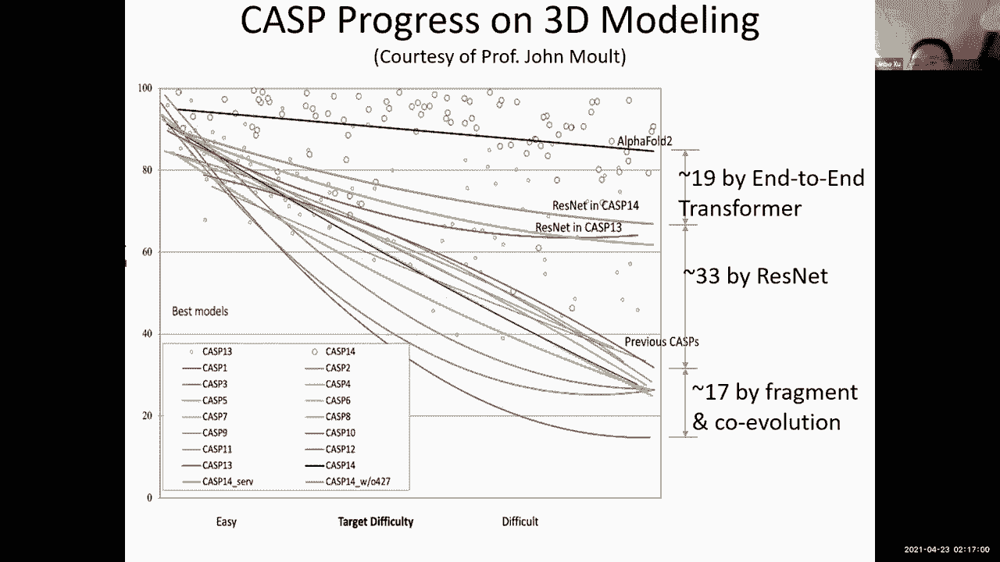

我们今天很幸运有第三个客座讲座，一直在耐心等待，如果你不介意加入我们，也非常感谢你的到来，请分享你的屏幕，它是，今天能请到你们三位真是太荣幸了，然后呃，我想我们的学生很感激。

所以非常感谢你，所有的权利，把它拿走，非常感谢你的邀请，很高兴在这里看到金布和宝儿，这很好，我们现在有这种虚拟能力，嗯，所以我认为吉姆实际上给了一个相当好的，嗯，阿卢的感觉，目前有点看台。

我很乐意回答人们对我们的过错提出的任何问题，我也是，因为我知道这是一种立竿见影的，它现在对很多人感兴趣，嗯，我不会在股票上太多关注它，我会把注意力集中在我们从那以后一直在做的工作上。

但我很乐意回答问答中的问题，或者任何你知道的时候，甚至在做演讲的时候，如果有什么是最好的。

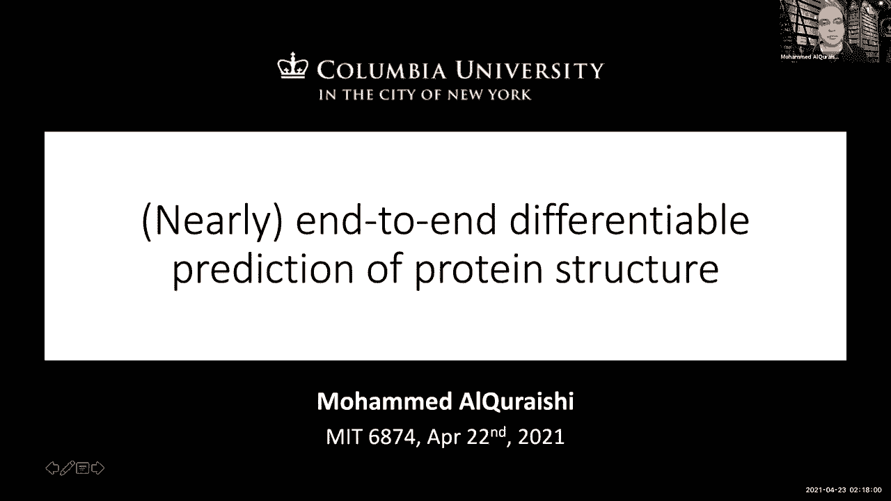

可怕的细节，以及它与，我所描述的美丽，谢谢。不客气，嗯，所以，我将开始，也许这个有点凹陷，吉姆我们谈过的一些事情，但只是为了适应，我看待空间的方式，在过去的几年里，这种预测的算法空间是如何发展的。

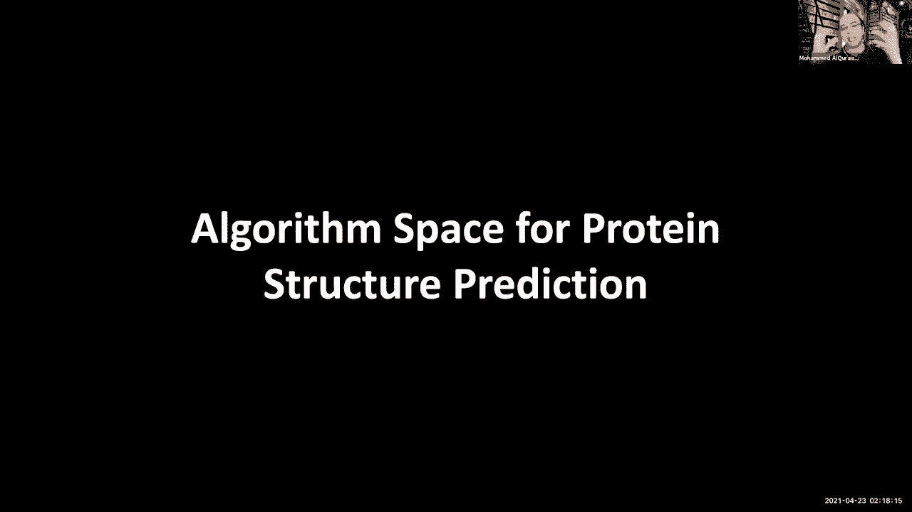

在过去二十年里，真的，你知道很明显有很多方法，在其中你可以想象这个算法空间，但我基本上会考虑两个主轴，一个是有多少信息进入它和给定的算法，多少序列信息，另一个显然是方法的准确性，它工作得有多好。

所以如果你还回头看，你知道早期最早的方法，你知道回到90年代和戈塔在一起，这些是，这些真的是受到了，你可以使用基于物理的模型能量函数的想法，与取样相结合，以获得蛋白质的最低能量状态。

这可能对应于这个负状态，所以在这种特殊的情况下，输入基本上只是单个序列，蛋白质的，就像我说的，我说我和其他一些方法，或者至少在物理学的一部分，灵感，不完全如此，但至少部分，嗯。

这些方法确实适用于单个序列，但在那里，我想公平地说，即使到今天，准确性仍然有些有限，如果你加入额外的信息，它们会更好地工作，像结构模板，就像朱巴提到的，但尽管如此，我的意思是，不使用任何附加的序列信息。

在这个问题上做得很好仍然很困难，现在事情真的开始改变了，我大约十年前，20世纪初，当共同进化的想法出现时，带着，一个基本概念是你建立了一个多重序列，我可能，然后你看看AS是如何相互进化的。

最初的方法都是无人监督的，所以他们基本上只是试图提取信息，用各种各样的锅，模型，近似类型，但是没有一种定向学习，这只是纯粹的卷积，你知道这只是纯粹的统计推断，嗯，但这通常涉及到而不是后处理。

就像Juu提到的，实际上把蛋白质变成一个明确的三维结构，我认为这些比，纯粹基于物理的方法或准物理的方法，但是他们但是但是但是他们，你知道吗，没有产生很大的不同，这是一种，这是一个有趣的想法。

似乎很有希望，特别适用于膜蛋白和单膜蛋白，一般都是，我们只是没有那么多关于它们的结构数据，因为这些是无人监督的，它实际上工作得很好，不管我们有多少结构数据，但我认为公平地说，在20世纪初。

至少他们没有真正产生巨大的影响，开始改变，实际上与九动物园的工作与X博士和大约二十六啊，这是一种，我会说，真正带来深度学习的第一种方法，你知道有基于神经网络的方法，你知道相当老的，并包括。

但是但是真正的深度建筑，啊杠杆作用，你知道在过去的十年里发生的所有创新，真的真的从2016年的X博士开始，特别是残差网络体系结构，我肯定吉姆会把一切都告诉你的，接下来是另一个，呃，建筑创新。

其中在x后的错觉公式中，我们还在使用二进制接触的想法，所以这两个残基在里面，本质上处于in而不是相邻的二元状态，他们通常是八个人，但是一些关于距离的概念，嗯，接近和这些限制，我应该说。

然后被用来利用物理空间，为了跟随蛋白质，但是大写x18实际上改变了这个想法，然后说，如果我们做儿科距离呢，连续距离，而不是这种二进制上下文，这是一个简单的改变，但它有一个相当大的变化，有点完美。

我会说有一个，呃，它采取了这个想法，并把它设计得很好，做了一个更深的网络，诸如此类的事情你知道，这个问题早些时候提出来了，你知道更好的神经网络工程，这真的让这个领域进步了很多，产生了一大堆。

我想说后续工作，包括铁塔，它来自面包师小组，这有点，你知道，添加了额外的想法，就像，就像角度信息，除了距离信息，现在，只是在20岁之前，你知道，二十八年初，嗯，呃我自己，和另一组，其实，来自马拉哈佛。

发展我会描述它的特征，所以第一套端到端可微的方法，所以这里的想法是，你知道吗，这里实际上有两个两个想法，首先试图抛开进化数据，进入中间状态，使用位置特定评分矩阵的想法，在那里我们基本上观察单个的残留物。

一次一个，并观察它们从突变到其他残留物的倾向，但没有明确地建模剩余交互，就进来的序列信息而言，这是一个想法，另一个想法是试图制定整个方法，以端到端可微的方式，这样你就可以从序列到最终预测的结构，没有。

呃，没有任何基于物理的引擎，没有任何后处理步骤，一个人想这么做是有充分理由的，我一会儿就回来，呃，但是但是但是这些是最初的一些方法，就像我在这里描绘的那样，它们不一定比现有的方法更有效，事实上。

他们并没有真正与这里基于进化的方法竞争，但他们是，我觉得他们能做的有点挑衅性，他们确实有一个优点，那就是在，你知道，比现有方法快几个数量级，Nemathis其他方法，甚至试图从单个序列，但是但是你知道。

毫不奇怪，有点遭受了性能惩罚，因为那个，嗯，现在快进到2020Raptor，x，呃，有点，有点，你知道吗，继续建立在这种基本思想的基础上，实际上，你知道的，正如我们刚才描述的吉姆，回到过去。

试图从PSM中做事，如此如此，我们试图抛开那些复杂的信息，看看我们是否能把它推向更难的方向，在相反的方向，现在我们有阿尔法2号，它真的说了好吧，嗯，我们要把厨房的水槽扔向，尤其是以一种。

我们要把这些MSA物体带到哪里，把它们当作本质上的uraobjects对吧，不要试图从中提取任何汇总统计数据，嗯，为了潜在地捕捉一个人可以想象几件事，比如说，高阶相关，我让你知道。

我们有三胞胎或四胞胎吗，比如说，也可能是序列进化的大部分全球方面，比如说，系统发育，对呀，这些都不是，嗯，不是，不容易从，你知道，嗯，成对相关，两者之间的残差和序列之间是肯定的，我是说。

我想我实际上低估了它的效果，这真的有点，我说在y轴上再高一点，我想问题差不多解决了，基本上，嗯，至少对于多序列情况，这也是一种NN函数方法，我认为这也是可能起作用的关键因素之一，就像我一样，嗯。

但我今天要告诉你的是我所考虑的，在某种程度上是圣杯，它真的能像一个2一样工作得很好，但是从单个的蛋白质序列中这样做，与任何一种复杂的信息相反，还有这本书，我会描述这一点，所以仍然出版，是在试图推进。

在那个更难的方向上。

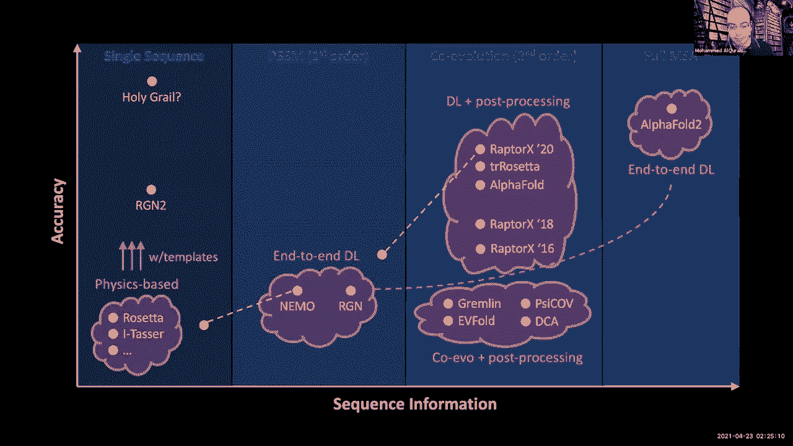

所以这是一个高级的地图，显示了事物目前存在的地方，但让我分解一下，算法的排序是空间的排序，各种成分似乎基本上组成了它，尽管你可以想象其他的建筑主题，基本上是说在某种程度上，牢房里发生了什么。

无法进入右边的这三个中的任何一个，我们知道细胞正在解决左边的问题，所以基本上从基本原理上来说，一种蛋白质，如果你能在体外折叠，它应该能做到这一点，信息应该在那里，但我想问你的是，它真的能在体外折叠吗。

换句话说，牢房里有多少陪护实际上在指导，实际上有多少信息，在这些蛋白质的一级序列中，好吧，这是个好问题，所以我想我想你你你，你们两个都是，从某种意义上说，如果我们能从共同进化的角度来做到这一点。

无论我们应该从序列中做什么，因为你知道原则上至少信息是我们知道细胞是正确的，但另一方面，我们也知道它不是，因为还有额外的信息，我怀疑的是，所以有这么多，这里有两种观点，你们中的一个是说要非常纯粹。

说我真正想要的是像物理引擎一样的东西，它基本上涵盖了最低能态，你知道给定，给定溶液中的肽链，如果有问题的话，然后然后是的，我是说，我认为你是正确的，能够真正跟踪蛋白质，事实上，你必须真正反映细胞环境。

包括所有这些其他核心因素，还有什么修改，还有陪护等等，等等，然而，我们所看到的，所以如果一个人不是很纯粹的话，他说我仍然可以预测一些单独的序列，因为这是一个有用的事情，为它做好的应用程序。

但是但是但是我仍然想得到家乡的州，没有必要恢复或需要所有这些身体方面的存在，我想那还是有可能的，阿尔法二就是一个迹象，所以那里有几个案例，所以阿尔法折叠中的几个例子，很有趣的预测，因为例如他们。

我在最后有一些想法，我只想告诉你，例如他们，预测活动站点，在你知道的地方，所有侧链原子都处于近乎完美的位置，即使这个练习实际上是由，我想是锌离子，但他们他们没有，他们不模拟锌离子，是啊，是啊。

他们只是他们只是预测序列，是的，嗯，但大概是因为他们已经看到了足够多的晶体结构，是的它们知道这种特定的方向，除了那组特定的残留物，真的很喜欢那样面向他们，在晶体结构中，会有一个锌离子。

但我只是要有效地归罪于它，现在，一个相关的问题，我想这和你的圣杯问题有关，如果我想预测一个新个体的蛋白质改变突变的影响，或者发生在癌症或者以前没有人见过的东西，将阿尔法折叠到，例如失败。

或者在主序列中是否有足够的信息可以捕获，哦哇哦，这将极大地改变结构，或者是因为它受到太多其他信息的限制，如果它缺少一个离子，例如，它仍然找到它，它会关心突变吗，所以我想我们不知道，因为它是。

它并没有真正以那种灵敏度进行过测试，我想你知道一年前我会说可能不会，因为这些东西有一个基于MSA的，他们获得，你知道的，数十万个序列，所以所有关于平均发生在整个家庭中的事情，现在，我不太确定，因为。

因为你刚才说的话，嗯，尤其是因为他们建立结构模块的方式，它实际上是在三维空间中运行的，据我们所知，它只是在结构上运作，所以它没有任何额外的信息，所以它实际上可能在这样做的过程中学习了一些内隐的物理。

所以那里可能有足够的信息，足够的约束让它实际检测，你知道一个突变会做什么，但是但是但是这肯定没有被证明，我是说，然后是的，我是说这仍然是个问题，和，我想我确实认为这将是一个有趣的建议，在接下来的几年里。

能够采取这些方法，并将它们应用于各种不同的，你知道说，需要以相当直接的方式进行解析的应用领域，在这方面，比如特定的区域或特定的类型，订购pog，所以说，你知道，比如说，你知道，癌症中的突变或完美。

我喜欢它，非常感谢，继续好，谢谢。嗯，所有的权利，所以回到这个，这种算法空间，或者更确切地说，算法的分解，就像我说的，有三种主要成分作为输入，这就是它的内容，呃，有一个躯干，这是事情，这是一种推理。

典型的神经网络，有输出，你产生的东西，那可能是一个三维结构，但在大多数情况下，直到阿尔法折叠2，我们所做的一些工作，这通常是某种代理对象，不是结构的东西，但这与结构有关，然后被发送到后处理管道。

生成最终的三维结构，我应该说我要突出右上角的这里，你知道的，正如我所描述的那样，建筑的各种变体，映射到它的不同方法，我之前提到过nn可微的概念，我觉得我们是在，这很重要的原因是，所以输出。

你从躯干产生的东西，是在机器学习框架中得到优化的东西对吧，这就是定义损失函数的地方，这就是你进入的，基本上到右边的梯度下降，所以如果你是，嗯，如果你在优化某种代理数量，那是那是一种远端。

从一天结束时你想要的东西，然后你就在桌子上留下了一些东西，从根本上说，这就是价值主张，mtn可微性，我想说的是深度学习在过去十年里取得的成就，而不是把这些不同的组件拼凑在一起，这样你就可以做。

你可以从头到尾共同优化整个事情，是的，所以，所以，是的，在这种情况下，这种可微性的想法是，这种，绿黄蓝部分是可微的部分，除此之外的一切都不是现在说的那么好，我在右上角突出显示的方法。

根据分解把它们固定在这里，你知道的，在输入侧，就像我说的，你采取多序列对齐，你基本上是在提取成对相关性，呃，从那些残留物中提取的，然后转换成联系人地图，二进制接触图，至少最初是这样的。

所以基本上是一个完整的东西，去噪，呃，方法，这需要一种凌乱的东西，使它，把它清理成类似地面真相的东西，更紧密地，用alpha折叠，用dr x 20218，这包括连续的距离，不仅仅是离散的距离。

然后实际上使用包括方向信息的想法，但这是一个普遍的相同的普遍范式，但是附加的附加类型的数据，所有这些方法基本上都很轻，我说，当然啦，处理通常使用某种基本管道，实际上是因为它往往是最，让我们说，最老练的。

做这件事最成熟和条件，甚至有一个真的亮了一点，埃塔托做出他的预测，现在，这里要注意的一点是，这可能相当慢，对呀，数十万小时，取决于这个后处理的范围，顺便说一句，我落到了，所以我们可以说，很少有后处理。

只是用琥珀，嗯，但实际上需要相当多的影响时间，我可以谈谈，你知道巨大的影响时间，有点不清楚，为什么，但是，呃，但是有点有趣，因为他们，他们好像进了邮筒，说着，但神经网络最终超级慢，所以，所以，所以。

你有它，嗯，但回到这一点，阻碍最终结构优化的后处理问题，这就是我先前提出的观点，另一种技术点，对呀，这里正在创造的这些东西，就像在路上，以他们的方式，它们目前是配方，最远的距离，定向的或定向的。

他们天生就有，它们天生就有可能自我不一致，因为这真的是一个过于确定的对象，你知道你实际上不需要所有这些距离来确定，嗯，一组点如何在欧几里得空间中实现，所以因为你有点过于坚定，你基本上可以做，呃。

在不能嵌入三维空间的系统中的自我预测，对呀，这是一个基本的几何事实，而且那个，在某种程度上，这是剩下的任务，当然啦，处理是采取这些潜在的自不一致的预测，然后使它们自洽，从它们身上得到一个三维结构。

所以现在我可以转移到RN和NEO，我们所做的一些工作，和其他人，他的基本想法是说，好的，让我们实际预测最终的神学结构，但我们不要引入这些代理量，尤其是这意味着，因为我们预测的是最后三场比赛，d结构。

和自一致性将作为模型权利的额外约束，这其实很好，这意味着你的神经网络基本上必须表现为，以一种永远不会让它成为普通的胡说八道的方式，在模型上的任何附加约束中，很可能会改进这本书，对吧。

所以它是一种它总是一个胜利，当你可以的时候，当你可以的时候，当您可以放置额外的约束时，所以当我们开始做这件事的时候，域的种类是预测单个序列，或者是的，用一个单一的序列来做出一个不太奏效的预测。

我一会儿会提到这一点，呃，但是我们制定这个的方式，这是最初的RG，第一个模型基本上是参数化周围的局部几何形状，你们要做的，使用一组离散的扭转角字母表，所以这些是五个边的欧米茄，它们对应于。

所以它们本质上是Chan角，你基本上有一个离散的字母表，你们在这个位置，然后你要做的就是预测字母表上的概率分布，所以你有点你有点挑，但我们不从分布中取样，因为我们想保持和微分，所以我们所做的。

这有点技术性，所以我不会加倍，做得太多了，但基本上我们把这些角度投射到复杂的平面上，然后做一个数学技巧，基本上，嗯条约，就像它们在笛卡尔空间，即使他们躺在一个圆圈上，提取a，我是说我是说坐标。

然后把它弹回圆圈上，所以本质上，这是一种提取角度的方法，对于从角度分布得到的几乎平均场近似，我们现在认为这可以用一种更数学的原则性的方式来完成，以身体更好的方式，但至少我们是这样做的，第一次。

所以这样做了，我们现在在每个，在每一次迭代或你们所做的每一次，然后我们简单地构建一个结构，迭代，所以一个在自动，咄咄逼人，如果你这样做，如果你们做我们我们我们，我们，我们预测TOAN角。

我们在此基础上旋转，呃，呃，扭转，扭转，我们预测键的旋转，我们在此基础上去泰特，呃，旋转，然后我们做债券延伸，然后我们在此基础上扩展，然后这个过程一遍又一遍地重复，本质上是一次一个原子地重现链。

不清楚我们的二号错在做什么，在NTN可微方法方面，他们是如何建造结构的，因为他们是，它们从这种星图到三维坐标，他们没有真正描述这个过程，他们可能在做一些自动攻击的事情，就像我在这里描述的那样。

他们可能在做别的事情，啊，那种还有待观察，但这至少是我们如何制定的，是啊，是啊，基本上你太专注于，但事实上，这些残基之间有如此多的相互作用，你似乎不是模特，在最初几个原子进入后，或者像残留物一样进来。

你知道进来，它们开始互相交流，然后塑造了最初的结构，你似乎一直在做每一个决定，并完成它，这可能部分是真的，这并不完全正确，让我指出一个微妙的地方，因此损失函数定义在全三维结构上。

损失函数不是根据我们匹配这些角度的程度来定义的，如果是这样的话，这是行不通的，正是因为你提到的这一点，因为局部精度不会导致全局精度，损失函数是根据全局精度定义的，所以现在预测是真的，你知道吗。

在一天结束的时候，你在一次预测每个特洛伊木马，但当你到了那个阶段，有多层，在这种情况下是一个循环网络，这有点已经看到了，内部代表，所以我怀疑发生的是内部，结构的同质化是如何隐含的，几乎像一个隐式图。

或者类似的事情正在发生，所以当它做出预测的时候，它已经解决了这些问题，但这是一个假设，你知道，我们真的不知道它是如何工作的，呃，但是但是但是我们所知道的，或者什么是关键点。

当结构是用toan角参数化的时候，实际损失是一个全球性的，你能观察一下训练的过程吗，看看什么正在得到优化，或者是涉及，是啊，是啊，你可以，是啊，是啊，实际上我以前有一个动画，我不知道，这些幻灯片里没有。

有点有趣，我是认真的，它似乎至少有一种盯着它看，最初它学习相当局部的几何学，相当局部序列结构相关，你知道在训练开始的时候，但随着时间的推移，它肯定是一种更全球化的方面，开始把一些碎片放在一起。

所以情况似乎确实如此，嗯，实际上阿尔法折叠2似乎在做类似的事情，这样做，做他们的谈话铸造十四，如果你看看它们内部形成的Vista枪，它开始于某种局部结构，但随着时间的推移，它开始捕捉，你知道。

在多结构域蛋白的情况下，域间相互作用的排序，即使是很有趣的。

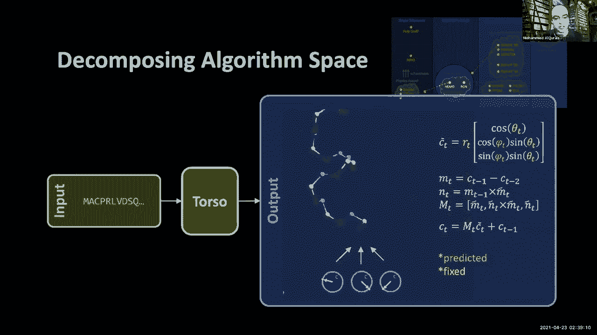

所以它从本地到全球，谢谢。是啊，是啊，是啊，是啊，是啊，是啊，这就是我们如何设置参数化输出，然后我说我之前说过，你知道吗，在2018年的那个时候，我们没有切中要害，单个序列。

所以我们基本上去了这些PSMS，产生或总结单个氨基酸的分布，它是单序列情况和，和那种共同进化的案例，这个玩具，所以你知道，有一个，有一个问题是我们当时用什么，我们用一口井，可以使用卷积网络。

您可以使用循环网络，我是说，我想现在很清楚变形金刚是要走的路，但至少对于当时的架构来说。

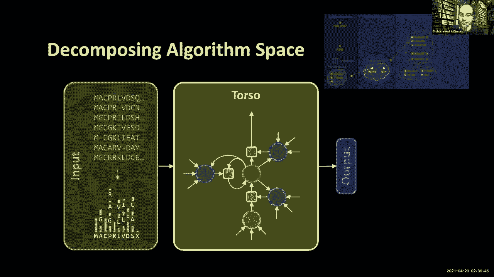

它是一个反复出现的或当前的体系结构，所以只是为了给你一个感觉，这是我们当时做出的预测之一，有点，我会说有点，你知道一个中间预测，分布的中位数，所以呃，你知道他们看到的螺旋军团和所有预测的一样。

但是两分钟没有那么多，也是二级结构的种类，螺旋本身并没有被很好地预测，它们在结构中过度缠绕，在我们这里做的预测中，他们基本上是从身体上开始的这在一定程度上与，我们参数化社交的方式，一个角度导致了这一点。

对这种东西，最佳的，嗯，任何病理。

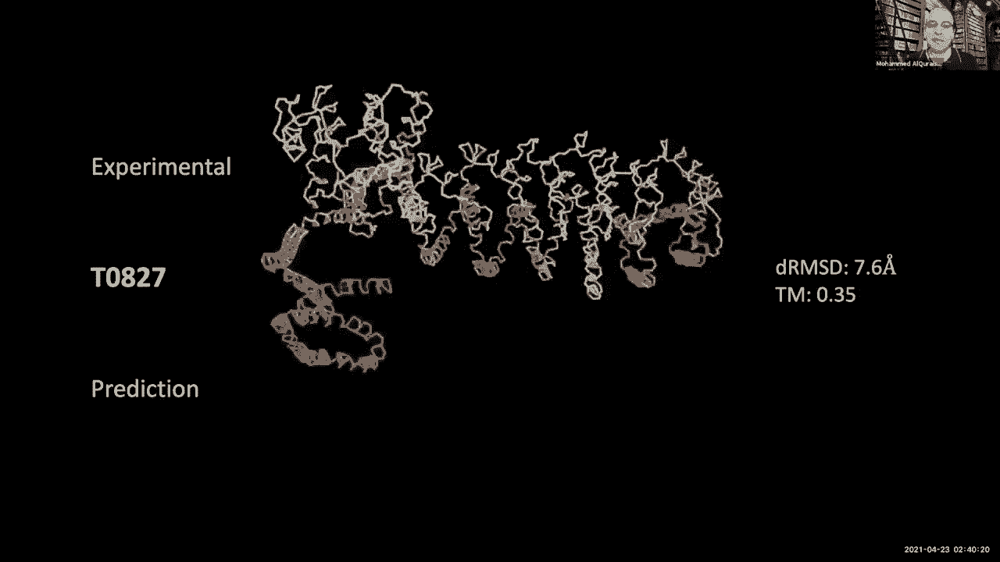

但是但是但是至少当时的情况是这样的，所有权利。

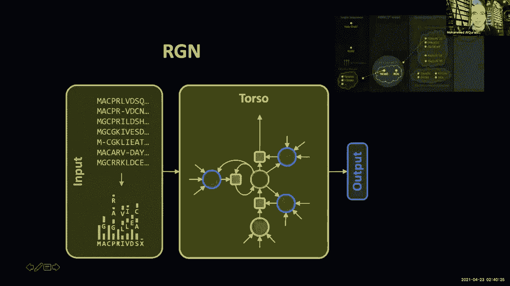

所以现在回到这张照片，让我告诉你从那以后我们一直在做什么，嗯一般般一般般，我们把这种参数化的想法，进化了一点，用这种，这种结构被称为自由阿瑟结构，你不能从微分几何中得到相当基本的想法，我就不详细说了。

但让我说说最重要的一点，就是那个嗯，基本上现在我们只关注cα，所以我们实际上不会费心，所有的骨干原子，我们用这些旋转矩阵来参数化它，这实际上简化了数学，让这件事变得简单得多，两者都只是计算上的。

但也只是就你如何制定它而言，因为它本质上是为了延长链条，现在你所需要做的就是看到矩阵乘以，而不是我之前描述的复杂程序，这就有了解决病理二级结构问题的好处，这基本上确保了我们生成的第二个二级结构。

在螺旋等方面，是身体上的，它有点弯曲，我们对蛋白质的了解，所以这是一件真正的作品，最重要的是，现在我们实际上又回到了单一序列的想法，但顺便说一句，我们这样做是通过将它输入语言模型。

ju提到了msa变压器和来自facebook的esm one b，在某种程度上，这些真的很壮观，我们有点掌权，开发了一个非常相似的语言模型，我只是让你知道，如果你没看过GPT 3。

你知道这些方法你给他们一个简短的提示，它只是给你一页又一页的流畅文本，呃所以所以这是一个类似的想法啊。

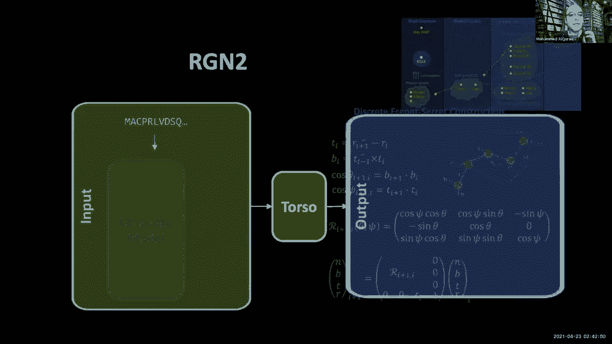

与Facebook的E M One B模型非常相似，但有些细微的差异，所以基本的想法是我取一个序列，你把掩码系统作为du，如果你得到一个串联变压器，然后你试着重述最初的序列，我可以说，然后。

然后的想法是，现在如果我们要做，什么时候，我们做预测，我们要把每个残留物嵌入，就这个潜在的空间而言，以这种方式在这个语言模型中，然后以此为输入来做出我们的预测，这里的一些区别，从ASM 1B方法。

我们不只是做单个的残留物，我们也采用片段，我们认为这对模型的挑战更大，这可能代表了你在生物学中看到的一件事，我们也做这个把戏，我们在两种不同的蛋白质中拼接，然后我们问它这两种蛋白质是否。

这个序列是无扰动序列还是混合序列，这种挑战，我们认为也提高了。

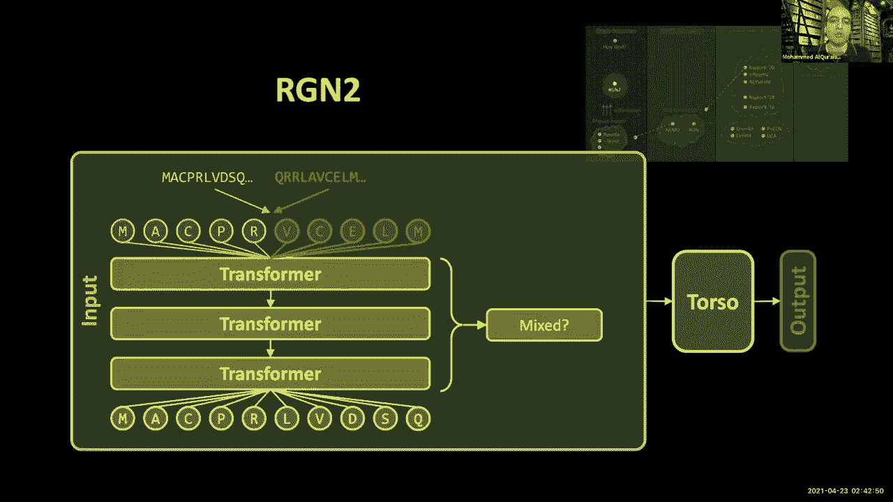

提高训练绩效，这些都是非常酷的把戏，我喜欢这个概念，我们在学期早期的表现学习课上讲了很多，我很好奇，人们有没有创造这种类型的任务，而不是不得不解决一堆，你知道吗，折痕，你在强迫系统学习这些表示。

通过这些任务，允许很多，你知道吗，几乎自监督学习，是啊，是啊，我是说，我想我想这实际上正在进行非常非常多的调查，我是说，在核心问题上已经做了很多工作，对，基本上只是从NLP中吸取想法，并将其应用于这里。

并缩放它，我想你知道吗，Facebook的模特们真的很擅长，但在构建新任务方面没有太多的创新，这可以真正利用蛋白质的生物学，甚至只是一种新的任务时期，所以我认为这是一个相当有希望的方向。

想出更好的方法来训练这些模型，是啊，是啊，到目前为止，我喜欢你的主意，这太棒了，谢谢。所以他们都描述了建筑，所以我们在这里做的一件事，有点妥协是回到一些，做一些后期处理，因为它提高了性能，基本上。

这是我们还能，我们仍然可以预测我们仍然训练模型，对于初始结构是可微的，但我们确实增加了额外的后处理步骤，就像我们的错。

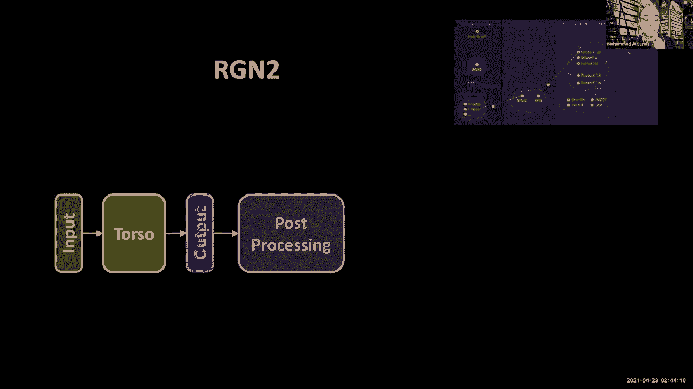

两个似乎可以，因为这提高了性能，然后这是一堆罗塞塔魔法。

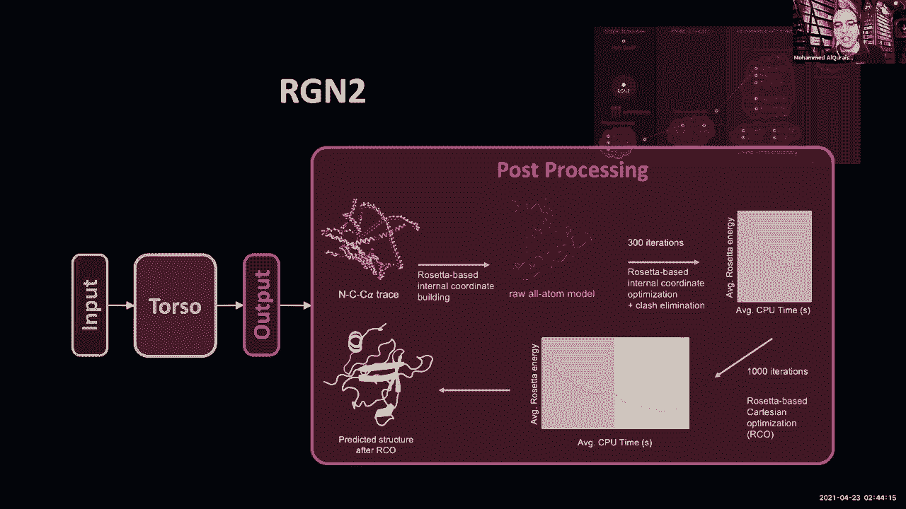

所以说，我想，我想详细讨论它，只是为了时间，所以现在让我给你看另一个人的，然后我站了起来，所以从第一集到第二集，这是一个目标，我要给你们看的这个也是14号铸造的，就是刚刚发生的那个，所以这有点有趣。

我说这是地面，这是基本事实，因为当时我们没有，我不认为我们真的有一个结构为这一个，所以这就是你一直以来，它预测，我们有RMSD，因为cast告诉我们rmsd是什么，即使我们没有结构。

所以RMD是尊重地面真相的，即使我们可能没有，哦，我会让你知道的，对不起，我们这里确实有，因为我看到它是白色的，所以在这里我们确实有它，好了，这是海洋预测，你很穷，八月和两个预测，你看。

你已经知道显著的差异了，你知道拥有手臂是d，然后是预细化，然后当我们做精炼的时候，我们显著降低了这一点，你知道，几乎在皇冠预测的吐唾沫的距离内，尽管我们使用端到端差分方法的速度，你知道我们失去了很多。

因为因为现在这个细化步骤，只要一分，是啊，是啊，所以我不跳，跳上这个，反复，记住，这不是从多序列对齐中得到的，这是基于一个单一的序列，通过那个语言模型，对呀，所以这是这里的关键，在你知道的地方。

但我们使用的信息要少得多，我给你看一些，现在一些公认的精选例子反对奥洛特2，我会在一些比较一般的例子中给你们展示一些最好的例子，所以这些都是预测，对齐到这里，我们没有基本的真相，所以我们不太清楚。

我们真实的东西看起来有多好，但就真实的东西而言，我是R，因为演算告诉我们这些数字是什么，嗯和所以嗯，所以这给了你一种感觉，所以这些是，你知道的，在最好的情况下，至少我们在阿尔法断层2附近，呃。

即使我们使用的是单个序列，他们在用，充满了像这样的例子，呃在这里你看到一个，你知道上升和阿尔法断层2之间的差距要大得多，在某种程度上，这有点有趣，因为我们中没有人做得特别好。

我是说原则上我们做得更好一点，但我是说我觉得他们都很蹩脚，这里有趣的是什么，尽管这似乎是作为多埃里克贝塔桶一部分的单体，我们的这个特别有拉伸性，我们预测的是更球状的东西，我们不知道柜台。

所以我们实际上不知道那东西是什么样子的，但是但是但是你知道这是一个有趣的例子，嗯，至少在这个地区，2。我们意见一致，没有错，但这里有一些我们偏离的地方，如果我们如果我们有，你知道我们确实有一些实验结构。

这些是其中的一些，我可以在这里给你看，所以你看到了，你知道在某些情况下我们做得很好，在我们做的一些事情中，所以总的来说，你知道肯定不是那种基于进化的方法，在系统的意义上。

但是但是但是我们知道我们在某些情况下赢得了什么，然而，为了时间起见，让我跳过这一点，我们做得很好的一个领域，系统地，呃是在两个不同的地区，一个是单蛋白，一个是我们的新蛋白，所以我的意思是。

单点蛋白质是蛋白质，本质上是嗯，在序列空间的黄昏区，完全没有序列同源物，所以我们基本上是这样做的，我们把三类数据集，我们确定了似乎有，呃，它们似乎形成了自己的集群，这意味着他们在那个集群中没有其他东西。

显然在30%的序列同一性内，然后我们在自动方法上评估预测的方式，在这种情况下，我们的第二个错误还没有，所以我们不，我们不能对此进行评估，所以在这个象限里是什么，所以我们看两个指标，RD和GTS。

这个定量是我们做得最好的地方，我们在这两个指标上做得最好的是什么，而这一个是我们在两个指标上都做得更糟的，这里你有一个分裂，对于单蛋白，我觉得在百分之八十三的病例中，用这个图。

我们实际上做得比你总是设置的更好，所以这真的很令人兴奋，因为这现在是一个政权中的单一预测，你不能用卷积，这种方法似乎真的对整整两个人产生了影响，但至少你知道一个最先进的公共可用系统，所以那很酷。

这真是太棒了，我的问题是这些蛋白质是什么，我是说这些是不是像一些以前没有人见过的奇怪的外来细菌，你做过吗，你对这门课有什么见解吗，关于这些蛋白质是什么，是啊，是啊，我想我想他们主要是你在那里说的。

有一些新的蛋白质，甚至喜欢在，你知道哺乳动物或昆虫什么的，因为你知道其中一些还很年轻，如果你，如果你从树上下来，他们可能只是没有足够的基因组测序，所以你实际上可以得到一个新的蛋白质，基本上是从头开始的。

出现的自然的新事物，你只是在没有，没有任何序列同源性，有一个与此相关的问题，也就是进化可能还没有完全优化，这些蛋白质的结构，对呀，绝对是的是的，这是我们从，其他蛋白质可能根本不适用于这里。

因为它们还没有完全处于稳定的状态，但没有，那很有趣，那非常非常有趣，我没有想到这一点，但是是的，那是个好主意，这是一个很好的观点，实际上如此如此他们可能，在某种程度上是一种分配的转变，有一个结构。

从你原本期望的，是啊，是啊，是啊，是啊，绝对，所以这是我们做得很好的一套，从系统上来说，这不是樱桃采摘的，另一个说我已经知道设计蛋白质了，不幸的是，球队并不理想，我们正在努力，但是呃，但同样。

这些是我们做得最好的，我想大概有百分之五十左右所以百分之五十我们做得最好，也许百分之十我们做得更糟，剩下的40%是一种分裂，这些蛋白质的有趣之处在于，它们实际上是用罗塞塔设计的，所以我们真的可以考虑。

做得比它更好，即使它们是设计的，而是一个能量函数，但实际上有一个能量函数来产生这些非蛋白质，嗯，所以再次，这是另一个有意义的领域，这些类型的基于序列的方法会有所不同，当然我的意思是这可能是超出。

预测突变等等，但设计显然是自然的自然方向，这些方法会在哪里，会很有用，所以让我结束这一点，那么，那么，为什么这个有用的权利，如此如此，如果你做得不好，至少有一个相当显著的速度，你知道在几个数量级上。

这可能对像对接这样的事情很有用，尤其是如果你想在结构上灵活，在那里你预测不同的蛋白质构象，基于一个小分子的位置，像马尼拉这样的事情，像遗传变异，如果你想在原则上预测突变是如何改变事情的，单序列的。

基于单个序列的方法看起来更好，但我们还不知道，这就是证据，但现在对于它的两个或某个版本是，至少，我们实际上可以面对面地比较，但同样，这可能不一定，我能从头开始预测吗，但知道最初是，这个罐头。

我想看看对结构的影响，这可能是一个完全不同的问题，听起来像是个精炼问题，你用NSA预测一般故障，然后你会发现它进入了实际的结构，使用，不断发展的偏见是另一个例子，你知道你有变化很快的事情，很难跟踪他们。

显然是在设计，就像，我只是说了所有我认为会很令人兴奋的领域，最假设的是有一种疯狂的新病毒，它有一个拼接的三个部分，来自三个不同亲戚的刺突蛋白，我是说那太疯狂了，对呀，否，但这正是那种事情。

希望你对此非常有用，对呀，是啊，是啊，原来如此，嗯，我只是，你知道的，我实际上提到了做这些工作的人鲁兰和苏里，只看到我们当前的插槽，然而，因为我在那里，我搬到了哥伦比亚，然后呃。

谢尔盖现在正在做自己的创业，他是教堂实验室的学生，我希望所有的学生，呃和我一起，真的，谢谢布鲁诺，谢谢乔，我是说，我们很荣幸，一次又一次，说到那个疯狂的快速离开的病毒，你知道失去的生命有可怕的负面影响。

和失去的生计，和平时应该封闭的人之间的空间，但我们利用了这样一个事实，即通常应该离得很远的人，可以靠得更近，谢谢你从，呃，世界的三个地方，加入我们，这是超级有启发性的，谢谢你们三个，我期待着更多的互动。

呃，有时我们问，如果学生对你所在空间的期末项目感兴趣，你有兴趣共同监督他们吗，是啊，是啊，当然啦，太厉害了，美丽，太厉害了，谢谢你们三个，然后我可以请助教，请留下来，谢谢。谢谢大家，感谢掌声说七分钟后。

所以这就是多么有趣，呃，你知道吗，所有这些主题都是。

