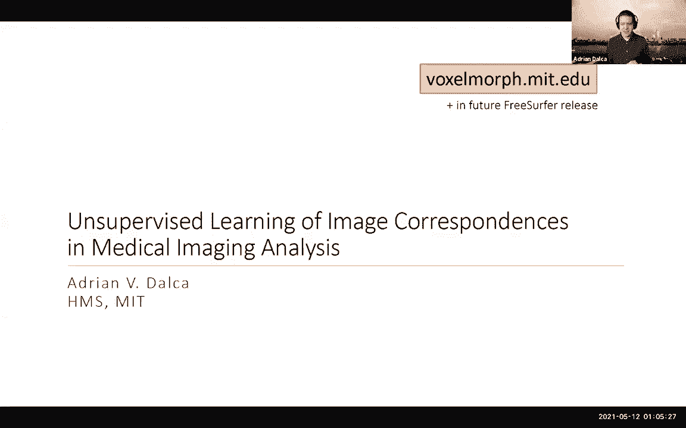
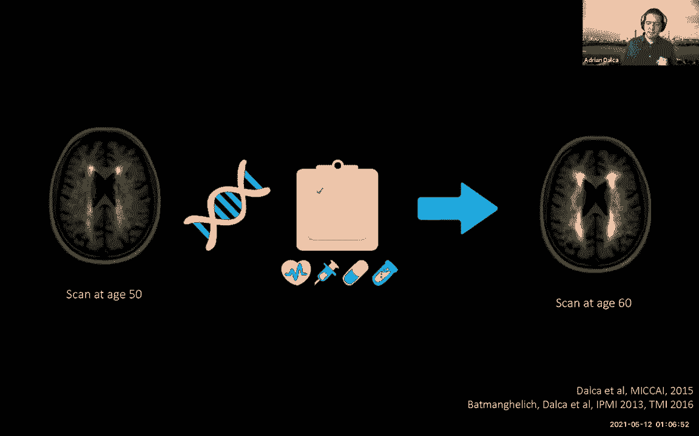
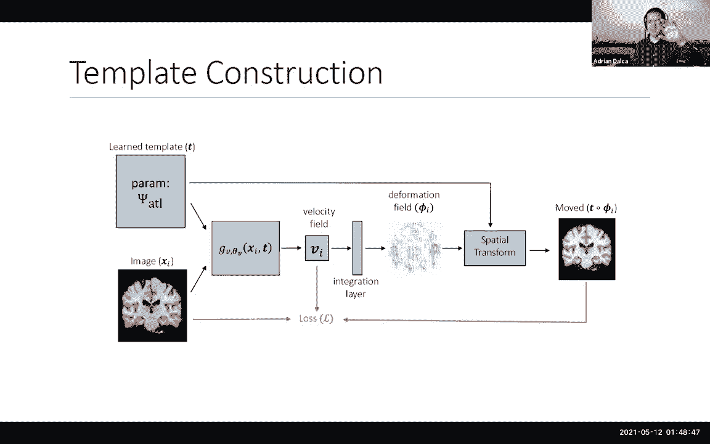
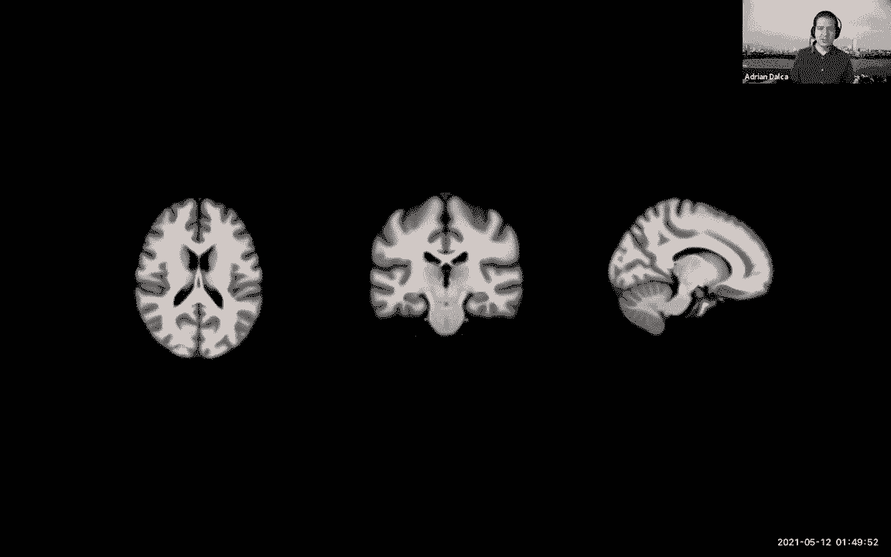
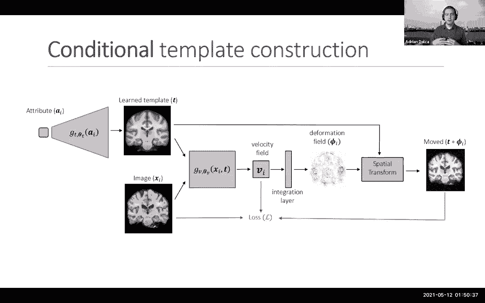
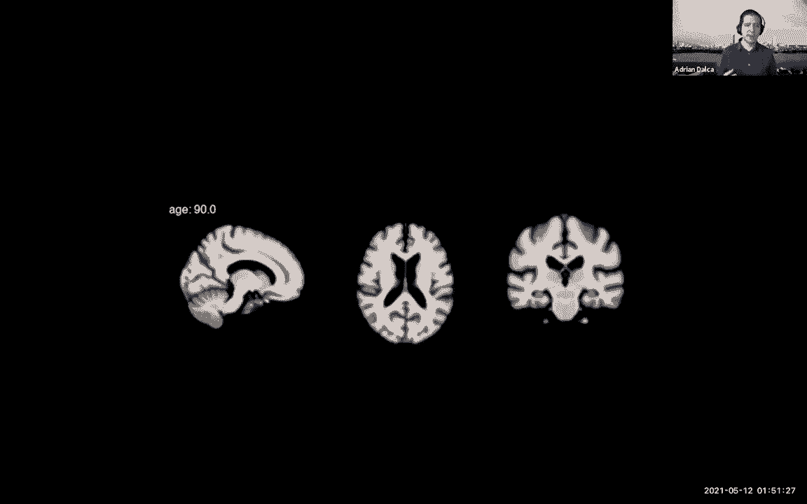

# P20：Lecture 21 - Deep Learning Image Registration and Analysis - 爱可可-爱生活 - BV1wV411q7RE

所有的权利，今天欢迎大家，我们很高兴有阿德里安的客座演讲，我们开发了很多我们一直在学习的图像分析方法，获取医疗数据，所以阿德里安，很高兴你被带走了，好的谢谢，很高兴来到这里，所以我要谈谈机器学习工具。

用于图像对齐，用于医疗应用，然后呢，我不知道这里是怎么运作的，但你知道，请根据我的意见，如果你有问题，请打断一下。

所有的权利，所以我将主要谈论近地天体图像，特别是脑核磁共振，但我今天所说的一切都适用于，所以你知道，在你脑海中的许多应用程序中，这可能适用于，好的，所以医学图像提供了很多关于人体解剖学的信息。

所以在我的博士学位中，我做了很多分析医学图像的工作，以这样或那样的方式，我们做了一些事情，比如，我们关心的某些结构，我们做了分析，捕捉到事物是如何随着年龄的增长而变化的，例如。

大脑中的空间疾病可能有一种特殊的模式，我们模拟了这个模式，试图做出预测，与临床输出的解剖学相关，我们甚至做了一些事情，比如预测大脑的未来，所以你拿一个大脑，你得了空间病，你把病人的其他因素。

比如遗传学和临床变量，你看看我们如何预测这个人会是什么样子，否则你的大脑会在十年后看起来像，这给了我们想要的治疗信息等等，但我在博士学位中所做的一切的核心。

有一次行动是一切的核心，它是将图像对准一个共同的参照系，它是如此重要，以至于它被开发了许多，很多年了，但我们当时有一个大问题，我们真的真的，你知道的，像年轻的学生。

我们真的想为我们的数据想出非常漂亮的模型，这是个问题，因为每次我们想对齐一些东西，这将需要永远，因为我们有成千上万的大脑要分析，但这不仅是一个问题，我们必须有一次将这些大脑，但这是一个问题。

因为我们不能开发复杂的模型，因为这些模型作为一个内部步骤必须进行对齐，所以这是非常令人望而却步的，好的，所以我今天要讲的要快得多，是底部的那个小酒吧，它是，在CPU上不到一分钟，在GPU上不到一秒钟。

那很快，它是，我有点嫉妒现在所有能使用这个的学生，但更重要的是，它真的改变了我们在这种领域进行研究的方式，这就是我真正兴奋的部分，好的，所以当我谈到注册时，让我说得更准确一点，我是说你有两个形象。

通常是大三卷，你想要的是这个变形场，在每个地方，你有一个小箭头告诉你如何移动一个图像，使其与另一个图像匹配，所以目标是这个变形场，为了说明这一点，你知道这有多重要，我们将大脑对齐或注册到模板上。

我们一直在互相注册主题，一直在比较解剖学，我们在手术前后对齐一个受试者，十年前到现在，看看事情发生了什么变化，看看肿瘤是怎么生长的，我们把信息从一个传播到另一个，从一个大脑到另一个大脑。

所以解剖学的一部分，诸如此类的事情，所有这些都与对齐有关，和许多其他领域，计算机视觉，甚至计算生物学，我真正开始研究的地方，当我对齐的时候，所以这都是相关的，所以因为这一点的重要性，人们做了大量的工作。

这一切都归结为一个优化问题，基本上你想找到这个变形场，所以我会经常使用这个符号，这个变形场和这个变形场应该有两个性质，首先是它也很匹配，那很简单，对吧，二是应该以某种方式加以规范。

所以这是一个相当标准的优化策略或设置，几十年来，人们做了越来越好的图像匹配术语，越来越好的平滑项，更好的方法来优化整个事情，已经做了很多研究，所以很棒，但归根结底，这是一个缓慢的过程。

因为你得到了这两个三D图像，你假装你以前从未见过图像，你开始扭动它们，所以正如我提到的，需要几个小时，阿德里安，我能问你一个，你知道一个非常普遍的问题，我看着你的大腿，我找不到答案，所以我要问那个。

也就是说，如果我做一个图像拼接，当我你知道，回到我们的手机自动完成之前，与实地合作是一回事，地标之间的匹配是另一回事，好吧，所以我很好奇田野是否一直在寻找，我是说，这个学科一直在关注领域，或者是地标。

因为两者有很大的不同，因为我可能会在我的地标上偏离一毫米，我马上就知道，但在我的领域里，我可能会落后更多，我可能都没注意到，所以就像你说的，从某种意义上说，它们是非常相关的，我要说的关系是什么。

田野所做的是，他们用地标来匹配大脑的部分，然后从这些地标中，他们为其他一切插值田野，完美美丽，所以有点，它不是一个巨大的领域，这是房东之间的一堆子领域，基本上是这样的，所以这是它的一个分支，是呀。

很多很多的研究都是这样的，但很多根本没有地标，很多只是自动找到一个密集的场，所以我想说，三年前，基于学习的方法出现了，并试图解决这个问题，非常有趣的事情，就像大多数基于学习的东西一样。

我认为这些方法完全忘记了几十年来在注册方面所做的研究，他们说我们要把这个当成黑匣子问题，我们假设你得到了这两幅图像，你把它们放进这个黑匣子里，你得到一个变形场，我要用某种监督，这意味着。

我需要一个非常大的数据集，它有成对的图像和它们之间的地面真相变形场，我把这当成一个大的回归问题，这是个好主意，嗯，有一些工作表明这是可能的，但问题是，我们从来没有真正的地面真理变形场。

你不能从专家那里得到它，因为一个专家需要几个小时或几天才能画出所有这些小箭头，他们可以做地标，但那也是极其昂贵的，因为这都是三个D，所以很难找到对应关系，你可以运行模拟，但最后它不是一种很优雅的。

每个人都可以使用的端到端解决方案，所以这是我们出现在现场的部分，我们想每个人都有一件事，也就是数据，每个人都有未标记的数据，所以我们能用这些图像来学习同样的事情吗，这就是我今天要讲的方法。

以及所有的后续工作，好的，所以就像我之前说的，我们来到现场，所有这些都忘了，所有经典模型，所有的信息和注册方法，但他们真的真的很快，因为它现在只是一个前馈神经网络，所以在剩下的演讲中。

我基本上有两个部分，但首先我要谈谈基本模型，如果有人被困在这里，请让我知道，因为接下来的一切都假设你完全理解它，然后我要谈谈一堆不同的项目，从那以后我们所做的，我真的很兴奋，因为他们真的开辟了道路。

我们考虑注册和下游，建模和工作好吧，所以框架真的很容易，如果你有地面真理变形，你得到两个图像，现在你把它们推入神经网络，它大多是一个单元，虽然我想现在它正在变成变形金刚什么的，但这只是一个神经网络。

你得到了一个变形场，你如何告诉神经网络它是否得到了正确的变形场，你有监督数据，你以某种方式接受差异，所以让我们假设我们没有这些变形场，我们如何告诉神经网络它是否做得很好。

所以这就是我们开始研究这些经典模型的地方，并试图从这些发展中借鉴，事实证明，我们总是有办法告诉算法，不管它做得好不好，我们可以取那些损失函数，我们用来优化单个变形场，现在我们要优化整个神经网络。

基于这些字段，例如，这就是我之前说过的，你有一个损失函数，说好，这个字段更好地匹配图像，它必须是光滑的，你不只是把它应用到一个图像上，但您可以将其应用于数据集中的所有图像。

所以你一直向你的网络提供随机的图像对，在这种情况下，变形场必须有一个低损失，我在这里没有优化变形场，我在优化一个能产生变形场的网络，借鉴了经典的方法，因为我使用了基于损失函数的直觉。

但我当然在优化神经网络，所以我不得不用，或者为什么我们使用随机梯度技术，现在诸如此类的事情，我们如何确保这些损失是可微的，或者对他们中的一些人来说很容易，有点难，但在一天结束时，你把变形场。

你实际上扭曲了一个图像，你做的方式，这只是线性插值，然后你有你的两个图像，所以你可以用花哨的方式或简单的方式来比较它们，你可以通过空间梯度来检查你的变形场是否光滑，所以实际上很容易再次实现这整件事。

使用随机梯度技术，嗯，在一天结束时，你学会了这个大网络，输出这个变形场，很酷的是，你从来没有真正需要一个地面真相变形场作为例子，所以你周围的任何数据都可以训练这个网络，现在，在这一切之下。

我们发表了一堆论文，表明实际上有很好的，理论上与一堆其他事情的联系，比如说，到概率模型，我们的领域开发了这些概率模型，你知道，为你提供了各种优雅的图像之间的联系，在变形场之间，不确定性估计。

诸如此类的事情，我现在不想细说，但我很乐意回答问题，但本质上，如果你建立了这些概率模型，你试着推断，你试图用神经网络来近似这个推理，你最终得到了解决方案，所以这很好，因为你下面有某种接地，看起来不错。

好的，所以这真的有效吗，嗯，它实际上是，这不是一个微不足道的问题，但我们首先关心的是速度，是因为整个问题是事情花了太长时间，所以我们测试了一堆优化基线，有些花了两个小时非常非常好。

那么他们中的一些人可能在准确性上有轻微的损失，但他们是十分钟，二十分钟，所以这样更好，但我们当时运行了体素变形，所以这是两年半前的事了，或者在CPU上不到一分钟，在GPU上不到一秒钟，所以这很酷。

因为你可以很快得到整个输出，现在明显快了，但我们怎么知道我们是否真的做得很好，所以你做得很好的方式，所以如果你想对齐一个图像，拍摄一张更合适的图像，并将其与第二张图像进行比较，你可能认为你做得很好。

但实际上你可能不会因为变形场可能不光滑，也许它从背景中复制了一些像素，然后它在大脑的中间移动，真的很难弄明白，所以我们实际上所做的是概述解剖学以进行评估，所以在这里你可以看到我创造了这个，呃哎呀。

很抱歉，你可以看到我在这里创建了这些轮廓，在脑室和海马上，我是说这些只是大脑中的结构，我在运动图像中做过，我已经在固定图像中做过了，现在当我扭曲第一张照片时，我检查解剖是否吻合。

所以你可以从视觉上看到它们很匹配，心室看起来差不多等等，所以从质量上来说，它看起来做得很好，但现在我你怎么知道，定量看这口井，我我我测量，我做了一些体积重叠测量，所以这里，在x轴上是一堆不同的解剖结构。

我们概述了，底线是这个算法，体素Orph与基线基本相同，而它的数量级更快，那么这里发生了什么，这个神经网络能够估计优化过程的输出，所以这很酷，因为现在我们可以用这个近似来做各种各样的建模。

所以我将继续讨论所有这些其他类型的事情，首先，我们对这意味着什么做了大量的分析，然后一些小的，所有的权利，所以我们一直有的问题是，当我们第一次训练体素变形时，我们刚刚收集了所有能收集到的数据。

因为我们认为神经网络，神经网络需要大量的数据，所以让我们训练一个真正大的，你知道，对于非常大的数据，但大家都来问我们好，是啊，是啊，但我只有大约50张照片，我还能用你的神经网络吗。

所以我们现在做了这个分析，那时我们没有铃铛和哨子，无数据增强，没有什么花哨的，我们用十张照片训练了四个模特，二五，五十一百，我们发现你非常接近最先进的技术，即使只有十个图像也不完美。

但只有十张照片你就很接近了，所以这让我们思考得很好，变形场几乎是对的，我们就不能把体素arv的输出，稍微优化一下几秒钟，只要摆动那些矢量，事实证明，如果你这样做20秒，你得到了最先进的或更好的。

所以换句话说，呕吐物真的很有用，即使你只有十个图像，和大多数数据集，现在你至少有三四五，嗯，所以这很好，因为现在它适用于，我们一直看到的另一件事是人们总是说好，你知道我在注册这些解剖学。

假设我在记录这个大脑，但我真的不在乎，我真的只关心海马体，因为我想把它和遗传学什么的联系起来，我真的不在乎整个大脑，那么我们如何告诉算法你真的只关心海马体，在实践中，古典的。

你需要在测试数据中概述海马体，所以如果你有五千张图像，你得勾勒出5000个尿，那是个问题，嗯，我们认为是好的，也许如果你只有几张没有线条的图像，也许你可以在训练中使用它，所以网络永远看不到轮廓。

各种标签，他们只看到图像，这确保了测试时网络将只看到图像，但在训练中，我们告诉电视台，你必须做你以前做的一切，但现在你还要确保海马的标签匹配，或者你有的任何标签，这是教网络做的，通常是教它注册。

但它也在教它海马在哪里，并在那里花费更多的能量，通过现在再做一次训练，在测试时间，我们只是给它图像，不要有海马标记或任何东西，但第一次，我们看到我们实际上可以显著地改进最先进的技术，对呀，所以说。

比经典方法所能做到的，这是实质性的，就在这里，显然没有P值问题什么的，嗯，这是因为引擎盖下的网络正在学习，这种联合任务，它在学习对齐，但它也在学习一种柔和的，引擎盖下的um分割，所以它能做到这一点，嗯。

继续讨论最近的项目，又是相关的，所以我们有，我要进入一个基本上解决两个问题的项目，其中之一是这里的医学图像实际上非常多样化，我给你看大脑核磁共振，这是六种不同类型的核磁共振成像，他们都是同一个大脑。

他们都是，嗯，你所说的核磁共振成像，但它们是我们所说的不同死亡率，你的图像看起来不一样，所以我们知道网络有这个问题，当你训练他们的时候，他们是，你很容易受到你训练过的数据的影响。

并推广到其他数据是一个挑战，所以如果我在第一个模态上训练，很多人实际上倾向于，我的网络可能永远无法注册或对齐这些图像或这些图像，甚至是彼此之间的模式，所以这有点令人失望。

因为如果你在实践中向临床医生或科学家发布一个工具，现实是它不会很有用，即使你知道它很快而且很精确，所以我们想，好的，我们怎么过去，现在我们可以试着收集大量数据试着训练一个大模型。

但这个模型仍然永远不会推广到新的数据和新的序列，人们想出的或行动或其他正确的事情，那么，我们如何使这些网络对他们从未见过的事情变得强大呢，就在那时，我们想出了这个想法，本质上模拟大脑。

但这个想法是模拟如此多样化的大脑，如此极端，如此不切实际，以至于网络基本上会看到如此多的变化，相比之下，它会决定忽略它，所以让我告诉你我的意思，但是呃，Adrienne，是啊，是啊，我是说，这已经是。

嗯，基本上这里有很多学派，所以其中一辆在自动驾驶汽车里，比如说，有一个世界的物理模型，然后在里面模拟新奇的场景之类的东西，然后训练模型，另一个基本上说我有一个存在的世界，我将根据一组转换来修改这个世界。

在这两种情况下，你投入的转换，以及您投入的场景类型，每一个都是一个关于多样性的模型，它将能够学习，我很好奇，你是如何推动这些转变的，这对你所学的东西有多大影响，还是你只是想不一定与身体相关。

但至少足够多样化，以至于模型必须对这种可变性保持稳健，对所以，真的很多样化，你永远不会看到的疯狂数据，模拟我们认为真实的数据，利用现有的数据，按照我认为你描述的方式修改它。

后两者的问题是它们在某些方面仍然受到限制，所以如果你，如果你模拟的数据有点逼真，你会经常很好，至少在我们的实验中，我们所能做的，我们不能让网络变得如此强大，尤其是对离群值。

如果你从真实的数据开始并试图修改它，这对我们来说要困难得多，因为，嗯，基本上我们没有再，这是一个，我们无法使网络暴露在足够的可变性中，如果这有道理的话，是的嗯，让我也看看这张幻灯片，还有几个。

看看我是否不回答，你很清楚，嗯，所以我们需要的是，幻灯片的第一个版本是标签，呃一些，一些图像标签，现在你可以下载这些，你知道从网上，因为有些大脑在某个时候被贴上了标签，对，所以你可以下载标签地图。

无图像，所以我们所做的是随机变形这些图像，所以现在我们产生了一种解剖学上的变异性，我们随机填充值，标签内部有一堆不同的噪声模式的强度，所以现在我们得到了一个看起来像大脑的东西，我们在这里加入了各种效果。

我显示的只是一个模糊的图像，但我们实际上有一堆不同的效果，我们添加了一些类似的错误，你可能会做核磁共振，然后你会得到这是你的最终图像，这就是我们模拟数据的方式，我们模拟越来越疯狂的数据。

就像这些是你永远不会看到的图像，你永远不会在同一个组织里，大脑左边是黑色大脑右边是白色，但关键是网络将暴露在如此多的可变性中，真实的数据将包括在那里的某个地方，所以这就是我的想法。

所以我们开始做这些实验来注册，我是说，首先我们有一些分段论文，但我们看注册，你知道你拿了一个大脑，以两种不同的方式扭曲它们，填写不同的值，不同强度，那是你的模拟数据，嗯，然后在某个时候我们想。

我们真的不是大脑的约束，如果我们只是随机填充形状呢，从一些随机的斑点开始，以两种不同的方式使它们变形，填充随机强度，那是你的，这是数据，所以我们适合，我们把这些图像推入模型，这给了我们一个变形场，现在。

我们如何判断这些信息是否有用，你不能，从图像上看真的很难判断，因为图像中充满了非常不同的对比度，所以你必须想出这些统计方法等等，但请记住，我们从一些分割图开始模拟这些图像。

所以我们总是可以说我们总是可以给网络提供图像，但我们可以问网络它是否很好地注册了分割图，这确保网络基本上学会从图像中找出形状，但它也学会了忽略确切的强度，算出来了，强度无关紧要。

这就是我们在这里试图创造的不变性，对嗯，所以让我来总结一下我们所做的，所以我们最后训练了一堆不同的模特，我们训练了一些体素形态模型，从特定类型的核磁共振开始，但试图综合这种核磁共振成像周围的变异性。

然后我们尝试了这个模型的两个不同版本，我们称之为合成变形，因为我们正在合成贝塔，这个模型的两个不同版本，一个随机形状的，一个有随机大脑图像的，这就是我现在要展示的，红色是经典的方法。

绿色是用一些可变性训练的体素形态模型，和蓝色是下降变形模型，但这里我注册的是，是相同强度的图像，和我训练的强度一样，当你注册时也是同样的强度，像图像一和图像二的强度相同，所以经典模型做得很好。

我们现在已经推动体素变形做得更好了，因为我们增加了一些可变性和鲁棒性，而且我们在这些网络上也变得更好了，我们训练的模型从来没有看到任何真实数据的合成模型，但是呃，他们要么有模拟的斑点，要么有模拟的大脑。

做大致相同的体素更多，如果他们做得比经典模型更好，用完全合成大脑训练的模型比所有人都做得更好，但大致相同，没什么大不了的，但它当然是一个浅绿色的体素形态，只是中间的很差，所以嗯对。

所以我们训练了两个版本，其中一个是用这个度量训练的，称为归一化互相关，我们知道这是一个非常稳健的指标，用于相同的对比度，然后我们也用另一个指标训练，称为规范化互信息，总的来说，这是一个很好的指标。

但在相同的对比中，它没有那么好，发生的事情是，这是一个，它计算这些统计数据，我是说，你知道互信息，对呀，所以它计算这些近似的统计数据，为了做到这一点，它有点需要这个，这是一种，它需要这样的视野。

而且非常近似，所以基本上底线是，它没有那么结实，如果这有道理的话，对呀，嗯，但这又取决于你想做对什么，我们知道这些在对比中，所以使用NCC进行培训更有意义，当我们开始研究模式时会发生什么，我们有模式。

我们还没有看到并试图在模式和，所以这就是发生的事情，他们做得不太好的经典方法，部分原因正是我刚才说的，的，迫使我们在模式之间寻找的度量标准是，这些统计方法是什么，它们往往远没有那么准确。

他们仍然有正确的想法，但你开始遭受体素变形模型，尤其是和NCC一起训练的那个，在模态中做得很好的深绿色的，刚刚完全崩溃了，因为他们以前从未见过这些图像，他们以前从未见过这些模式，所以它就崩溃了。

现在都是真实的图像，这些都很抱歉，我应该说清楚的，所有真实的图像，令人惊讶，哇哦，所有真实图像和Synth Morph数据模型都非常健壮，我不得不承认我很惊讶这个相反的问题。

有没有可能把训练空间弄得这么大，真实的图像，你知道的，是这样一个小子集，你不再真正捕捉到他们的特征了，是啊，是啊，所以这绝对是个很好的问题，答案是嗯，我们认为这是模型容量的函数。

所以如果你模拟了极其多样化的数据，你的模型相当有限，你有一个问题，它在训练中做得很好，但它开始在真实数据上受苦，因为，就像你说的，这只是一小段，是啊，是啊，更大，你做这些模型，虽然。

它们开始能够很好地覆盖整个空间，在机器学习领域真正非凡的是什么，更普遍的是我们现在所学到的，有能力，就像我们以前想的那样，哦，少参数是你要做的，整个领域都在向无，你只需要大量的参数。

只要用正确的方式训练它，是啊，是啊，和我，这是一个，我不知道在某些方面这是一个苦乐参半的答案，但是是的，这是，但它和我们自己的大脑没有什么不同，我是说，我们的大脑有巨大的能力来完成我们正在做的简单任务。

然而，我们可以做一个镜头学习，还有各种疯狂的东西，是啊，是啊，是啊，是啊，否，你完全正确，给大家看一下，呃，也许在实践中有一点，呃，这意味着什么，为什么我们真的真的很兴奋，所以我在这里，我在模拟对不起。

第一个是大脑扫描，只是同样的扫描，好的进来，像十二个不同的场景什么的，第二个是同一个大脑，但我们得到了一个大序列，你可以模拟一堆不同的序列，所以同样的大脑完全相同的位置，但不同的序列对吧，平滑变化。

和以前一样的东西，红色是经典模型，绿色是，绿色是voxomorph，蓝色是我们的方法，你可以看到，当你开始使情态变得复杂时，随着它的变化，经典模特正在遭受更多明星的痛苦，但是合成变形，它确实受了一点苦。

但你可以看到它相当健壮，我们开始问自己，为什么会这样？就像网络这样做是什么，我们又开始戳网络，这四个不同的对比度，体素形态，如果你看最后一个，如果你在网络的末尾查看网络中的功能，你会看到同样的功能对吧。

对这些图像对的响应不同，所以你知道这是相同的功能，同数同信道，但你知道它看起来有点不同，因为它在对它所看到的做出反应，但既然变形已经学会了完全忽略对比度，就像它以某种方式提取了重要的解剖结构。

这些功能是在一段时间后，他们只是对对比度变化不再有反应，所以不知何故，在网络中有，它正在学习这样做，有一堆不同的特征，我们有可量化的东西，但我确实想继续前进，我想再报道几个小项目，嗯。

我想很快就有问题了，哦很好，好的，所有的权利，有一件事，所以有两个非常重要的事情困扰着，嗯，每个人都是这样的不变性，我真的相信我们已经解决了很大一部分，另一个问题很好，这是一个普遍的问题。

我们需要超参数调谐，经典注册也是如此，神经网络也是如此，通常会有一些非常非常重要的超参数，对我们来说，其中一个超参数，最重要的是这个，它在图像匹配和正则化之间进行权衡，这一直是个问题。

它总是有人一些东西，有人大部分时间都在调音，显然研究生，大多数时候他们是通过，一开始你训练三五个不同值的模型，你不知道，然后你意识到，哦，我得到了，你知道它在这个范围内的某个地方，但我得训练更多的模特。

然后你训练更多的模特，然后你的数据会有一点变化，整个过程又重新开始了，所以这是一个极其痛苦的过程，所以我们想，这里有一个奇怪的方面，这些模型可能没有什么不同，嗯，你知道他们有一些轻微的变化。

可能他们他们不是，你直觉上知道，他们没那么疯狂，所以我们想好了，我们能训练一个真正大的模型，一种超级体形类型的模型，我们称之为超形态，在那里它学习超参数对您注册的影响，现在说清楚。

它不会给你注册的最佳超参数，因为没有这种事，嗯它，最佳超参数随任务和数据而变化，临床医生想要什么之类的，但是这个网络会学习每个超参数的影响，价值，这种可能性是，在一天结束时，你训练一个模特。

你只需要在之后调整它，而不必重新训练，无需等待优化，什么都没有，嗯，那么我们怎么做呢，呃，这是体素形态的一种变体，确切的架构并不重要，重要的是，您取这个超参数值，你把它作为输入输入到网络中，好的。

你通过给它一堆不同的价值观来训练它，你也在损失中应用这些价值，所以当你说零点五的值，网络将此视为输入，但它也知道，哦，我得给你一个适度规整的变形场，如果值为零，网络上说，哦。

我知道我不会因为我的正规化而受到惩罚，所以我要给你一个疯狂的变形场，尽我所能，等等，所以网络通过看到超参数值，它学习对变形场的影响，我们实际上如何做到这一点，我们实际上玩过一些架构，但有趣的是。

非常有效的是这些，这些叫做超网络的东西，基本上这些是什么，他们是，它们是相当小的网络，具有价值，在我们的例子中，它们取一个值，它们输出体素的权重，MARV网络，输出单位的权重，所以他们本质上改变了功能。

作为一个，的函数，这工作呃再次有点令人惊讶的好，所以举个例子，你能做的就是训练一堆体素变形模型，这需要很多时间，对呀，所以我们训练我忘了，我想这里有十二个体素变形模型，所以你看到这些灰色的圆圈。

现在这需要很多时间，它们是离散的，他们只在某些时候，然后我们训练了一个单一的Hypervox模型，这需要稍微长一点的时间，但你只训练一个，你可以看到现在在推论中，您只需调整超参数值，它和其他型号很匹配。

对呀，所以这意味着一个超变形模型能够捕捉到这个巨大的范围，阿德里安，这似乎并不局限于体素形态，这可能是一种更通用的机器学习技术，是啊，是啊，耶耶，所以我一开始就应该这么说，我肯定已经转向了，是的。

所以非常同意，我今天所讲的内容在很大程度上适用于，我可以评论很多关于这有多迷人，嗯，即使只是这个设置，甚至只是一个术语的设置，另外，正则化在机器学习中非常流行，更不用说其他设置中的其他超参数了。

但这种设置是如此广泛，为什么我们能够，所以好吧，这可以在一堆不同的版本中工作，您可以这样做，但为什么这实际上工作得这么好它不需要，你知道十倍的时间大约需要一个点，单个模型时间的五倍。

所以你知道你的体重是百分之一百五而不是一千二百，为什么你能很好地，原来当你训练两个，三个，四五个不同的超参数值模型，模型一遍又一遍地学习同样的东西，只需稍加修改，因此，超网络超变形能够利用，共享信息。

基本上只是学习这个三角洲。

这意味着很多事情，我最初的想法更多的是关于，我能把这个给临床医生吗，他们能调整超参数值吗，事实证明，现在你可以，它几乎是实时的，你可以调音，有一个旋钮会影响大脑的变化，这只是一个举例说明。

很明显你想要更多的微调，你想要各种各样的其他东西，但你知道它的交互性非常强大，但我们实际上发现了一些，令我们惊讶的是，最优超参数值变化很大。

有很多东西，和只有一个模型的能力，你可以在之后调整，意味着你可以手动调整这个，或者你可以根据一些很小的验证数据来调整它，突然间，数据集，所以这里有四个不同的数据集，最优超参数值不同，根据数据的质量。

数据集中患者的年龄，等等，您所做的注册任务的类型将为您提供不同的超参数值，如果你在受试者之间或受试者到一个参照系，或者类似的东西，它会有不同的超参数值，按区域最优，所以如果你注册了同样的大脑。

但你更关心海马体，与你更关心心室相比，您将希望选择不同的超参数值，所以所有这些都表明了几件事，首先，一次训练，具有单个超参数值的单个模型不是最优的，你不应该这么做，至少用于注册，但可能对于很多任务。

其次就是训练这个庞然大物模型，其实没有那么大，只是它看起来很大，是一个非常强大的工具，但我很难调和，大脑不同区域的超参数需要有多不同，事实上，你可以从随机图像扭曲开始，那倒是真的，这是一个很好的观点。

另一个具有这些随机形状的模型的优势是，嗯，你在那里得到了别的东西，这有点难以形容，你真的真的真的很专注于解剖学，嗯，所以你在学习辨别解剖学，嗯，即使在这里非常微妙的噪音中，什么我什么。

我们接受了超形训练，我们只是训练一个正常的，在真实数据上训练，这有点不同，因为这一个根本不会尝试匹配形状，在不同的地区，这将更容易受到噪音的影响，那将是，它将匹配有很大对比度的形状。

但它不会匹配对比度有限的形状，所以直接回答你的问题，这可能是一个非常不同的，这张图看起来可能很不一样，在合成变形的情况下，所有的权利，我最不想报道的是，我知道我快要迟到了，但这是最后一个项目。

因为我真的很喜欢这个这个主意，很多时候，我们将所有的数据对齐到一个共同的参照系上，但是在很多项目中，我们没有一个共同的参照系，我们可以选择一个例子作为一个共同的参照系，它有各种各样的问题，经典地。

我们建立引用，我们建立这种中心，大脑或其他解剖学，但是这个复杂的过程，你初始化它，在某种程度上，也许你只是模糊了一个图像什么的，然后你把每个人都注册到那个图像上，你平均是注册，然后你再登记每个人。

你平均，这需要永远，嗯，所以经典的有算法，老实说，这在实践中并没有真正做到，因为它需要很长时间，所以我们开始思考这个，每个人都说很好，我们可以注册，但是我们需要一个模板，所以我们想，等一下。

地图集已经了解了一些关于人口的信息，对呀，它可以看到所有这些数据，所以我们不说，我们正在学习一个将图像注册到地图集的网络，而不是给网络地图集，如果我们同时告诉它估计这个地图集呢，因为它正在学习注册。

基本上我们要说的是，哦，这里有一个图像，但它不再是输入，你必须估计强度，所以我们要给它提供数据，我们只是要把它，一次给它一个图像，随着时间的推移，网络学习，什么是最好的地图集。

我可以对齐图像的最佳公共参考框架。

这就是我们得到的，而且真的很酷，因为这看起来很适合我们的数据模板，但我们也从来没有做过任何复杂的改变，这真的只是体素变形，在让它学习这本地图集时做了几个小改变，重要的是它学会了很好的解剖学。

我马上就给你看，但我兴奋的真正原因是，因为现在我们有了这个工具，它是如此灵活，我们可以解决很多问题，有很难解决的基本经典问题，例如，假设你有大量的受试者，这意味着通常单个模板不是一个好的表示。

所以如果你的分析不是那么好，所以，假设你有十五岁和九十岁的人，在您的数据集中，那些大脑看起来会不一样，所以你真的很想构建不同的模板，所以传统上人们会做的是，他们会把人放进垃圾箱，学习单独的地图集。

有各种各样问题的课程。

因为它非常离散，非常近似，所以我们的想法是好的，什么，如果我们学习就是我们所说的条件模板，所以我们根本不打算学模板，我们将学习一个函数，它给我一个模板作为，作为属性的函数，我关心它可能是年龄，可能是性。

可能是某种遗传信息，可能是某种诊断，但我们要以年龄为例，所以现在我要吃东西了，当我得到病人的大脑时，我要把它传到网络上，但我也要在那个病人的年龄喂食，随着时间的推移，网络学会了这个非常平稳的时代。

依赖地图集。

正如它所看到的，你知道的，全部人口，它现在看起来像这样，我只是给你看七个例子，对吗，七个不同的年龄，但你可以看到它正在学习这个大脑和这个大脑之间的某些影响，所以他们非常，呃，比如说，这里的心室要小得多。

对于十几岁的人来说，嗯，这里的心室要大得多，事实上我可以用视频的形式展示这个，我喜欢的，这是一个非常令人沮丧的视频，如果你了解你的解剖学，基本上，这表明大脑随着时间的推移而缩小，中间的这些心室。

基本上只是充满了液体生长，大脑的其他部分，又是，大脑的其他部分收缩，最酷的是，我们仅从数据中了解到这一点，我们从来没有模拟过任何解剖学，我们从来没有明确地，你知道。

