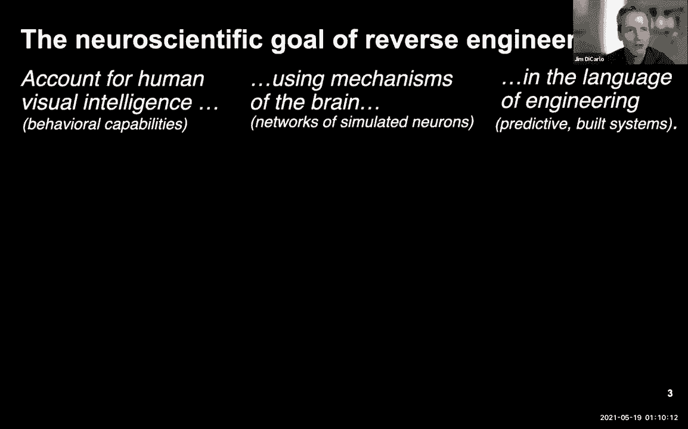
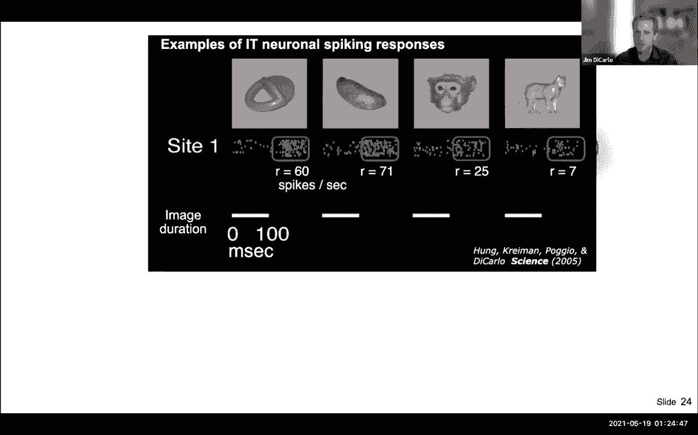
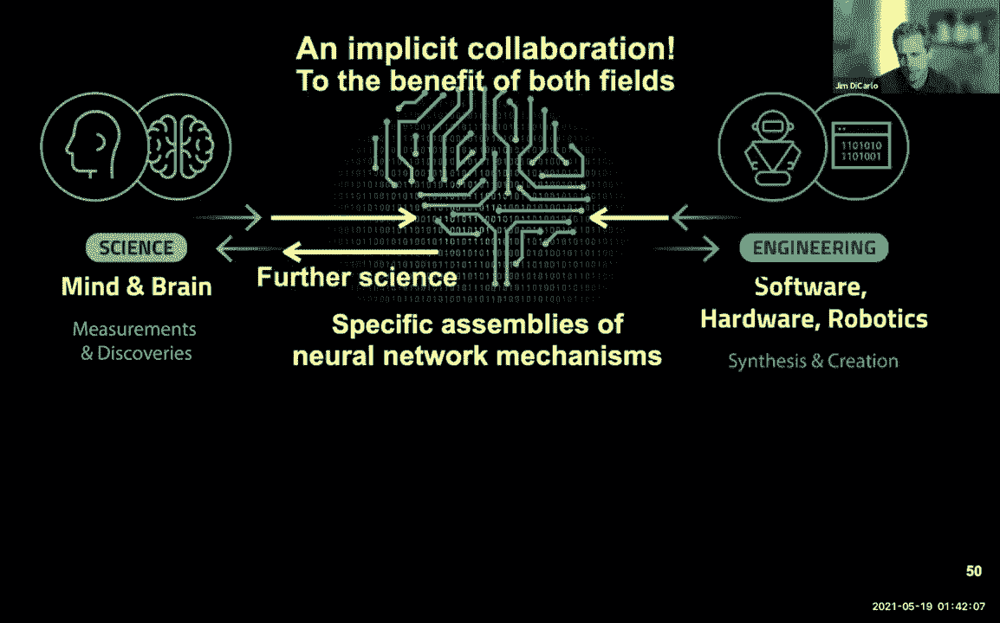
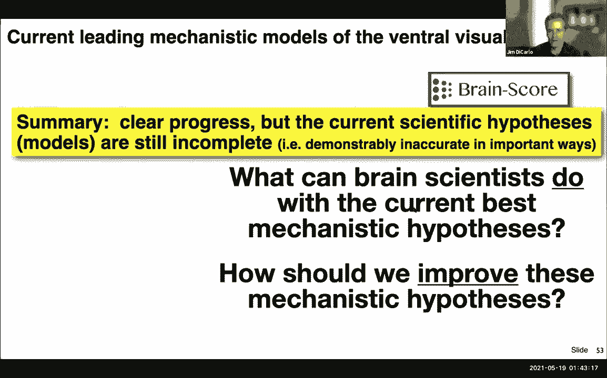
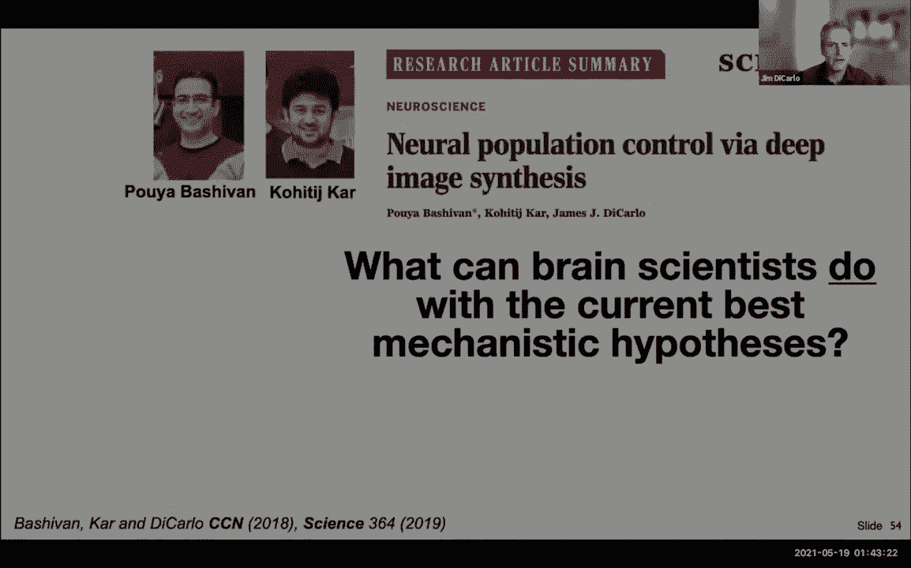
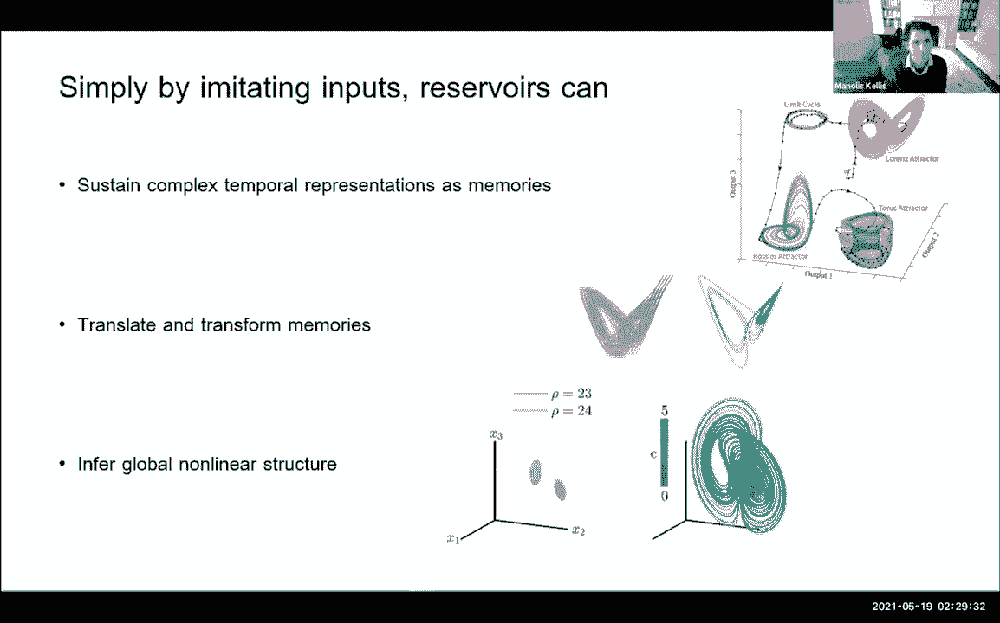

# P22：Lecture 23 - Deep Learning and Neuroscience - 爱可可-爱生活 - BV1wV411q7RE

所以欢迎大家，很荣幸向大家介绍吉米卡特，今天谁会给你，这让我们以一种非常互补的方式，到目前为止我们一直在做的事情，所以我们一直专注于深度学习，适用于理解各种事物，包括你知道的大脑，包括许多不同的疾病。

吉姆将要告诉我们的是我们应该如何理解深度学习，我们在神经科学上积累的所有知识，所以吉姆把它拿走，好的，谢谢谢谢米诺拉斯，呃，乡亲们，我希望你能听到我，嗯，这是这真的是给你的，所以我这里有一堆幻灯片。

但是嗯，我只是想给你一个大的视角，但我在这里的措辞有点不同，我想我要说的是，深度学习和大脑有什么关系，那里有什么联系，至少在视觉科学领域，我会告诉你这是如何导致进步的，和在啊，在两个方向上。

那就是脑科学影响了深度学习领域的大部分工作，但它也从中受益，我会试着向你展示这种相互作用，也许如果我们有时间描绘一幅未来的画面，所以我想到了模型，比如来自深度学习的模型，作为科学假设。

大脑功能的各个方面是如何工作的，神经科学家和认知科学家所做的，是根据数据来评估这些假设的质量，那是，这就是我更喜欢看相互作用的方式，计算科学与经验科学之间的关系，就像大脑和认知科学，所以嗯。

我演讲的标题，探索机械智能是如何，我喜欢用另一种方式说，这只是称之为逆向工程，人类数字智能，所以我要告诉你一点我的意思，通过逆向工程的思想，我希望你能看到它是如何与你的，你的深度学习课程，从广义上讲。

所以目标是，这和我刚才说的有关，这种逆向工程方法的神经科学目标是，理想情况下，在某一天解释人类智力的所有方面，如果你只限于说人类的视觉智能，我会在一分钟内进一步缩小范围。

当我说像人类视觉智能这样的东西时，我的意思是我们观察到的行为能力，我们标记为一组与智能领域相对应的东西，在这种情况下是由击中你眼睛的光子和你产生的输出驱动的，给定这些输入模式。

所以这基本上是视觉或视觉感觉的一个领域，我想要那个解释，或者我们中的许多人想要那个解释，作为科学家，用机制的语言，我们希望用机制的语言来表达，我们知道在执行它的系统中，在这种情况下，大脑，那个。

当然我们知道这是一个由模拟神经元和神经元组成的网络，我们希望能够，所以说，因此，我们想解释在模拟神经元的网络中，所以你开始看到深层网络之间的联系，或深层复发网络与神经科学，因为你知道。

我们每个人的头脑中都有一个深刻的循环网络的例子，现在，我们只是不知道是哪一个，所以我们希望这些视觉智能的描述是用工程学的语言，这又是，这不仅仅意味着，我说你脑袋里有一袋神经元。

但我告诉你那袋神经元的参数，这让我有了预测性的构建系统，可以与数据进行比较，让我们做有趣的事情，在脑科学和更广泛的人工智能方面，所以嗯，真的是这三个方面，我觉得，没有一个是真正有争议的，左边。

左边的那个通常是科学家们，像大脑和认知科学家这样的经验科学家，他们通常从什么开始，也就是观察到的，它们是否来自行为，它被广泛地称为认知科学，或者曾经被称为，还是来自大脑，这就是所谓的神经科学。

和大脑内的测量，嗯，右边是合成工具，来自工程，你是否在建立一个深厚的关系网，不管你是在建立一个机器人系统，你是不是在构建某种算法，现在令人兴奋的是，这两种不同的方法，这些又是从科学和工程中释放出来的。

有点聚在一起，特别是深度人工网络，又是这些，你应该把这些特定的人工网络视为假设，关于大脑功能的各个方面可能起作用，也可能不起作用，事实证明，一些深层网络是当前的主要假设，视觉系统的。

这就是我今天要告诉你的，实际上也有一些关于听觉系统的主要假设，但我今天不会告诉你这件事，嗯，所以那的历史，我今天一直想给你的，是一个关于背景的历史，我们是如何走到这一步的。

然后也许指出我们未来可能走向的方向，我希望每个人都能听到我，幻灯片在前进，如果有人有任何问题，请把聊天，或者有人可以在那里插话，有人能不能放弃。

我知道我不是在对着墙说话，否，这完全有道理，这听起来超级刺激，好的，所以让我们来做历史，所以首先我应该说，在开始的时候，这些是我小组里的人，一切我他们的科学智慧，他们做到了，我只是工作的大使。

一路上我可能会提到他们的一些名字，但是你在我实验室看到的任何研究，这真的是他们的工作，我只是在这里强调，我已经广泛地提到了人类的视觉智能，所以这里有一个例子，你有一个像素阵列击中你的眼睛，现在他们。

他们是，你知道的，一百万像素左右在你的眼睛里，它们只是亮度强度，嗯，从你的屏幕上消除，不知何故，你对世界上有什么做出推断，你对里面的东西做出推断，例如，你们的车，有没有人，当然你们都在说，当然啦。

有一些，嗯，这是一个很难的问题，顺便说一句，你是怎么做到的，这就是我们一直关注的，但你可能也能做这样的事情接下来会发生什么，向右走安全吗，还是我应该呆在左边，和其他类型的预测，驱动的或物理驱动的问题。

我们通常会得到所谓的视觉智能，我把这些都是视觉智能的问题，它不是一种清晰定义的区域，但我有点订购他们在排序，也许我们思考它们的难度，也要告诉你，在这方面取得的进展，脑科学主要是一种，外面有什么，有效性。

我们还没有右边所有东西的好模型，比如预测，事情接下来会发生在哪里，以及大脑是如何执行的，但是我们开始有以前的模型来估计，场景中有什么，就像，有车吗，有些人只是想把事情缩小一点。

所以你知道当你看着那首歌的时候，你可能以为你一下子就接受了一切，但如果你从生物学上不知道这一点，你应该知道你的视野并没有很高的敏锐度，你的同性恋中心有很高的敏锐度，如果你看着这个小红点。

如果你现在看着你的屏幕，我要讲的大脑区域，大脑的一组区域，它们覆盖了中心十度，大约是你的两只手保持一臂长，所以如果你为自己这么做，我想在这里给你们举例说明十度左右。

所以我们不是试图分析大脑是如何进入整个场景的，但只是中心的10度，我在这里粗略地说明了这一点，你可能期待那个场景的方式，当我展示它和说话的时候，你在做这些快速的眼球运动。

你甚至不知道你在现场做所谓的眼跳，你在每个位置停留几百毫秒，然后转移到其他地方，边走边取样，所以这就是你的传感器系统，实际上，视觉系统实际上接收了这些数据，我告诉你，因为它允许我们操作，嗯，所有的场景。

对智力的理解到一个更狭隘的问题，在实验室里研究更容易处理，结果是一个很好的起点，我们称之为问题，你的操作，你在每两百毫秒内做什么，一瞥，我在这里演示的每一个十度快照，现在剪下了快照。

我们只是我们只是专注于评估，那些Snapchat里有什么，有车或人是一个标志，我刚刚给这种窄域核心目标识别贴上了标签，因为我们称之为核心，因为我们认为看到理解是基本的，但这也不是完全的视觉智能问题。

是一辆车，这里有一个人，关于潜在内容的其他问题，不仅仅是他们的车，但是汽车或人在阳光下的姿势角度是什么，这些是我们和其他人再次问的问题，这是一个更窄的行为空间，这让我们可以开始操作你如何完成这些任务。

所以给你，是你试图，我要亲自测试一下你，你可以直接去做，在家做，如果你看这个点，我要给你闪个图像，那只是大约一百毫秒，比你天生的精神病还要短，居住，你的执着，停留时间。

我希望你能注意到它更像是一只鸟而不是大象，所以你可以想象我可以测试你一整天，我不漂亮，但是什么样的物体，然后说，好的，又有一个人面对着，不是车，给你，这是一张自然的照片，希望你注意到这是一个负担。

而且还不够，好的，我可以测试你和其他灵长类动物，其他智人，就像我们在这个电话中的所有人一样，我们测试了其中的许多，我们测量你成功和失败的详细模式，我们真正感兴趣的事情之一是。

再次将你与当前的计算机视觉系统进行比较，因为其中一些现在是一个主要的假设，你的视觉系统是如何以某些方式工作的，所以我就把它们看作是两个不同的物种，我们知道我们在很多方面仍然比计算机视觉系统更好。

在过去的十年里，很难看到这些差异，这表明计算机视觉的进步，的确，其中一些进步是由，嗯，通过对我们的系统如何解决这些问题的理解，所以这对你来说并不奇怪，这个差距正在缩小，但尚未关闭。

我想在这里给大家介绍另一个物种，这是一只恒河猴，一种非人灵长类动物，它在做你刚才做的任务，但是通过做一个触摸屏，所以它触发了一个图像的呈现，然后再在两个选择对象上选择它们，有一套，大约有三十个。

这种动物正在使用的一些物体，提前不知道，它会得到什么对象，只是说，我看到一些东西，我看到了什么，绿色表示它做对了，嗯黑色的意思是它弄错了，你看大部分都做对了，但他并不总是把每件事都做对。

他有成功也有失败，就像你我一样，我们可以在那里测量，出了问题，我们可以测量，嗯一整天，获取大量数据，这里有一个数据的例子，我们左边的行为数据，智人和我们的恒河猴表亲在右边。

我不想带你进入这张幻灯片的细节，除了说，这些是您看到的许多对象的成对比较，让我们做左边，颜色强度表明很难区分那些物体，在许多图像中，所以这是一种物体测量，我们有比这更细粒度的测量，但我只是给你看。

所以给你一个大局的信息，我们无法真正区分我们的能力和灵长类动物的能力，表兄弟，在那里做这些任务，现在假设这是这个规范化的，或者在绝对规模上，我们真的也好不到哪里去，这些是绝对刻度数，如果你仔细观察。

d质数略低，在灵长类动物中，比我们低几个百分点，但我在这里强调不同物体上的模式，这当然不足为奇，当你看着这个，像刀和扳手，比我不知道的蜘蛛更难区分，现在我的另一个问题是深度学习是如何，呃，热图，是呀。

我有一张幻灯片，我没把它放在甲板上，但是目前的深度学习系统，如果我拉出这个情节，他们现在也很相似，嗯，这个情节又回到了我之前提出的观点，但如果我看图像纹理。

我可以看到我们测试的所有深度学习系统和这两个系统之间的差异，所以我们对我们的表亲做了，这是一个更高的视图级别，但是当你一张张放大图像时，那么你仍然可以看到系统之间的差异我可以把图表拉出来，如果你有兴趣。

我的意思是，这是简短的回答和所有这些东西伤害，谢谢。是啊，是啊，好的，我只是想为这个团体做准备，我们在恒河猴身上基本上有了一个定量上近乎完美的模型，你和我在这个领域所做的猴子，这对你来说并不奇怪。

或者你知道，跟随进化，我们不必重建我们的整个视觉系统，你知道我们做其他事情，猴子当然不会这么做，但我们在这里研究视觉，事实证明，我们可以用这个定量模型，所以这里有一个大局，你应该在你的脑海里。

我们基本上就像一只猴子，我们比计算机视觉系统好一些，虽然刚刚讨论过，越来越难看到这些差异，这种差异对我们来说非常有趣，所以现在我想让你把这个平等放在这里，它将允许我们说，人类的大脑机制是什么。

我们很想知道那些，但那些更难直接研究，但我们可以更多地接触到非人灵长类动物，这是非人类灵长类动物的大脑，所以在剩下的大部分时间里，我要告诉你们的主要是非人类的有限大脑，但你要记住。

我们得出的任何推论都很可能适用于人脑，这已经通过各种方式进行了测试，我只是没有时间带你看更多的人类数据，所以我在这里把物种换成恒河猴，我希望我激励得很好，现在我想谈谈涉及到的一系列视觉区域，休息猴。

我在做那种核心视觉识别任务，它们不仅仅是大脑的一个区域，有一组大脑区域，当然还有我不给你看的眼睛，大脑中间有一个标志，我不给你看，嗯，然后这里有一系列的皮层区域，被称为腹侧视觉流，所以这些是外面的区域。

大脑的底部边缘，这里显示的每一个都用不同的颜色表示，它们之间既有前馈连接，也有反馈连接，注意到它们是一层很深的层，这里有插图，这是几十年来已知的解剖学，老的，嗯，我们知道一些事情，例如。

如果你闲暇大脑的这些部分，你在这类任务中有缺陷，我想为你强调一下，这个最高级别的区域，叫做颞间皮层，所以你听到我说，把它想象成大脑中最高级的区域，当然不会就此结束，但投射到大脑的其他部分，参与行动。

决策等，所以这些是大脑中几乎纯粹的视觉区域，好的，所以我已经为你计划好了，在底部的每个区域都有数百万个神经元，我会一直提到这个，当我们进行谈话时，我希望你能看到这里已经有了一个很深的关系网。

我们应该用深度网络建模，然后我们将告诉你我们在这方面是如何取得进展的，但这又是解剖学的动机，好的，我们对这个区域的功能了解多少，如果我把一个像，就像这里的这个图像，所以当然是像素的模式。

它被捕捉到你的眼睛后面，你眼睛后部的这种尖峰活动模式，和视网膜神经节细胞的模式，你的视网膜后面已经有大约一百万个了，然后沿着你的视神经传递，通过lgn和丘脑。

然后沿着这些皮层区域依次进入新的神经活动模式，一，二，v，4，i，and，i，is，to，the，four，and，i，and，i，I，is，just，how，here，is，how，is，to，to。

the，way，here，is，here，is，is，is，to，用这些彩色的圆圈，就像激活神经元和非激活神经元一样，嗯，这在几个方面过于简单化了，神经元有分级激活，这也是一种过于简单化的做法。

这不是一个严格的前馈链，正如我在这里概述的那样，但这是一个很好的第一近似值，从前馈模型开始，它让我们取得了很大的进步，所以我也想给你一个时间尺度的感觉，从图像开始大约100毫秒，在眼睛里引人注目。

在IT皮层的这个高水平区域，这些最初的活动模式，那个，你可能还记得，你停留了大约200毫秒，所以这是在正确的时间框架内做一些事情，比如，允许您暂停搜索，或者在搜索中的下一步进行选择，作为你在现场的取样。

因此，这些时间尺度与你公开的行为取样尺度相匹配，当您对视觉图像进行采样时，如果我切换到新图像，新的，一种新的神经活动模式再次出现，滞后约100毫秒，如果我呈现了一个旧的图像，活动模式又回到了旧的模式。

滞后约100毫秒，你知道，这是一个可复制的模，一些随机性，我一会儿就给你看，但你可以整天玩这个游戏，你可以非常迅速地显示大量的图像，测量出很多图案，每个图像产生一个新的模式，这些图案原来是相当强大的。

我一会儿就给你看，好的，那么我们为什么，我们怎么知道这一切，我们从研究恒河猴中知道这一点，猴子和其他物种，当他们在做我给你看的任务时，或者固定屏幕，比如说这个，当我们展示这些图像时，然后我们用记录电极。

电生理学，这是一种侵入性电极，在单个神经元附近采集电活动，就像这里显示的这张图像，我们从单个神经元中提取单个尖峰波形。

我们在这样的区域内进行这种随机抽样，嗯，让我向你们展示这些数据是什么样子的，只是为了让你对元素数据有一种感觉，如果你从IT皮层的单个神经元记录，记住有数以百万计的人，这里只有一个录音网站。

每个刻度标记都是蓝色的，这是一个神经元的单独尖峰，你看到这是一个图像，这是一个尖峰模式，这是图像的持续时间，它在屏幕上的一百毫秒，你可能会注意到，末端有很多尖刺，这里有一对夫妇在这里进行。

如果我一遍又一遍地重复这个图像，你看得很好，这是这里有一点背景，但平均利率活动明显上升，这种情况再次发生，在大约一百毫秒的滞后中，注意它是不一样的，所以我提到了随机性，但你可以看到这种平均利率的上升。

我可以通过给你看其他图像来为你提供背景，这是同一个神经部位，为了回应这幅图像的十个演示文稿，你又看到了很高的活动率，另一个图像是一种较低的速率，还是有一点反应，这是另一种更低的，不是完全零响应。

这只是一个例子，这是一个网站，四个图像继续，我会暂停，我有点好奇的是，在更自然的猴子图像上的点，我只是好奇他们是否更接近原始人，这样你需要更少的激活，他们的抽象概念需要更少的神经元来编码。

因为这对他们来说太自然了，这些是你从，这些数据是神经科学家几十年来做出的推论，也许猴子的脸很特别，可能是你刚才说的那些话，我只想让你，我想这些都是可以做出的推论，我想我只想让你拿着这些。

就像图像进来一样，神经尖峰出来，他们之间发生了什么事？我们也许可以更多地谈论这些推论，但是你可以从这个例子中得出太多的结论，我给你看的数百万神经元让我再给你看三个，这里有另外三个例子。

也许他们已经改变了你的推断，这里有另一个例子，我不知道它喜欢它的第二个，第三个和第四个，这是另一段录音，尤其喜欢第三和第四个，到目前为止，我不知道谁知道这是否改变了你的推断，但这些样本来自一些特征库。

嗯，你知道的，我给你看只是为了让你对元素数据有一个感觉，好的，这也取决于你把电极放在哪里，也许另一只猴子正在编码它们在其他地方的同伴的图像，基本上你现在问了几个问题，首先要知道它内部有空间组织。

对人脸之类的东西反应更多的神经元往往聚集在一起，神经元一般聚集在一起，所以神经元有相似的选择性模式，由模式相似的神经元生活，如果我把它量化为一个矢量模式，不是一堆图像，你可以显示出大约一毫米的空间尺度。

或者你有相似的神经元，他们不一样，但他们在这方面是相似的，大脑皮层，所以它们不是随机的盐和胡椒，然后然后是的，有特别的区域，那里有特别的脸、身体和地方，我被研究过，尤其是在被确定为特殊聚集的人类中。

这就是你之前的问题，太好了，谢谢，好的，所以现在我只想让你把这些看作是回应，从里面出来，皮层，你可以继续，开始量化它，而不是试图担心每个人的尖峰，我要把这个窗口的平均射速，滞后一百毫秒。

在这些图像后面放一个数字，所以现在我们基本上已经把这些时间点处理数据转换成了一个数字，每个图像一个数字，对于每个神经位点，所以这里有这个网站的四个数字，这是平均尖峰率，我们可以放松一下，当然。

改变时间窗口。

我们在更高级的工作中确实这样做了，但今天的谈话，我只是想让你在这里保持简单，把它想象成一个数字，它现在映射到我在这里再次向你们展示的这些模式，一种响应模式几乎是比我显示的更高的二进制负载，当然。

我刚才给你们演示了一个分级数字，所以现在我们开始了，我要去，现在拿着i皮层，向你展示我们是如何获得更多数据的，不仅仅是那些例子神经元，我们做一些事情，比如放入这些慢性记录阵列。

现在每个地方都植入了数百个位点，记住，这仍然只是数百万个神经元的样本，但我们的采样仍然很少，事实证明，我们可以从数百个样本中学到很多，这本身就很有趣，嗯，但是这些慢性和记录阵列真正酷的是什么。

我们可以在同一侧记录几周甚至几个月，所以我们可以在每个站点测量成千上万的图像，所以我们最终从每只动物身上得到了数百或数千个样本，在测试成千上万的图像时，每一个都重复了很多很多次。

这些是在无菌手术中植入的，支架闭合了，有脑组织本身，有一个皮肤，或者有一个头骨，这一切最终都关闭了，动物的头上有连接器，塞上N字，每天，记录神经数据，当他们专注的时候，或者做任务或者展示图像。

然后你从这里得到这些数据，我现在给你看这个绿色的，高响应，高粒，低响应黑色，这是平均射击率，我一会儿就给你看了，我们只是给每个神经部位一个数字，现在有数百到数千个神经位点，通常沿着这个y轴。

这是对一个示例图像的响应，通知，有些神经元很高，有些很低，有些又高了，有些很低，嗯，这只是其中的一个样本向量，你，我们不录，很明显我们记录了，正如我提到的许多，这里有八张照片，通知，当你切换图像时。

神经活动的模式是不同的，这就是我之前示意性地告诉你的，我给你看了一些真实的数据，嗯，然后这是我们实际上记录了成千上万的图像，这是几千张照片，所以我不能全部给他们看，嗯，这里他们是按类别分类的一组。

顺便说一句，他们属于，你可以看到里面的一些结构，但这是我们从类似地区获得的数据量的一个例子，和冒险流中的其他领域，我们试图在其中做出推论，关于成年动物的引擎盖下实际上运行的算法模型。

所以我们的问题实际上是关于这个成人系统中运行的是什么，当我们观察它的时候，不是它如何学会到达那里，这些问题也很有趣，但我们观察到的是此刻系统中运行的东西，那么我们知道什么，我们知道很多。

实际上当你做这种录音的时候，我们早期看到的一件事，上面有一些参考，我就这么说，不带你浏览数据，如果你训练线性解码器，所以你会想到简单的线性分类器生活在这个功能集的顶部，所以你把这个当成一个特色包。

你有一套线性解码器，对每个对象类别说一个，如果你在小样本数据上训练他们，十个数量级，或者每个物体的数百张图像，然后测试它们推广到其他物体图像的能力，你从解码中得到行为模式。

所以现在我们要从它解码到一种行为模型，如果你愿意，你会得到行为模式，与我之前给你们展示的基本上没有区别，对人类和猴子来说，你还问了当前的深度网络，你再得到这个矩阵，换句话说。

你可以在一个线性的步骤中从这里到这里，用一些训练数据，你不能从像素上做到这一点，或者实际上这里的任何其他区域，所以这就说这，它的特征空间就像行为模式旁边的线性，现在，当然，神经机制比线性解码器复杂得多。

但它有点像在说，这项任务中所有计算上有趣的问题都解决了，当你到达这个神经活动的时候，因为这就是我喜欢思考这种结果的方式，所以这让你，如果你是一个脑机接口的人，你真的对注入感知感兴趣，或者矩阵之类的东西。

这些模型可以让你想象，如果你在里面说电极并注射，激活神经元或使用光基因，激活你如何做到这一点，以引起一定的感知，他们告诉你怎么做，我们不能完全测试，我们已经测试过了，事情似乎符合这个想法，嗯。

那是完全不同的脑机接口故事，我今天不打算谈的，我只是给你指出来，这种联系允许您开始考虑BMI应用程序，知觉注射，我想谈的是，所以我刚刚提到了我今天想说的，今天剩下的时间就是这里和这里之间发生的事情。

所以哦，顺便说一句，这就是为什么这是一个强大的集合，因为这些是很好的功能空间，这意味着它们作为视觉系统和人工智能相关性是强大的，好的，对不起，跳过这里，我今天想做的是，从这里到这里发生了什么事，你看。

这是一个很深的网络，它是通过这些转换从图像中计算出来的，我们的问题，我们是什么，这就是现在，十多年前，我们在问这些问题，在这里机械地发生了什么，所以这些是这个图像的一些非线性变换。

我们对这些转变很感兴趣，在这个领域又有了突破，我们是其中的一大部分，大约二千零一三年，我要带你通过，我对那个故事的看法，这就是你如何思考我希望你如何思考网络有多深，深度学习与视觉科学的连接，至少在腹流。

我想这就是这次演讲的目的，所以大局，这真的是它的内脏，但你应该知道的是，有很多工作要做，神经科学的指导说，你知道这个系统的很多事情，这些是关于发生了什么的事情，视觉系统的低水平。

你可能听说过视觉区域的边缘过滤器，v一，如果你做过计算机视觉，这些都是神经科学的教训，众所周知，其中许多都是在视野中平铺的，因此，您可以在每个位置应用筛选器，在每个地方几乎相同，现在用工程术语来说。

这叫做卷积，当然，深度卷积网络现在被实现了，当然是在神经科学的教科书里，人们还知道，你会做一些事情，比如近似线性点积，它又像这样的过滤器，后面是一些输出非线性，可能如下所示。

你又有了一些归一化的增益控制，这些就像微观机制，生物机制已经被研究出来，并被认为是视觉系统网络的一部分，来自生物学，根据我给你看的那种测量，但从道德上来说，从视觉上的低级区域，我能问你一个问题吗？

我已经有很长时间了，我只是不知道有没有人知道答案，但是对于边缘检测的这些低级特征，当我们进行深度学习时，当我们建造这些，你知道卷积神经网络，我们正在学习所有这些原始的，所有这些过滤器都是从头开始的。

但当你在许多图像上训练他们时，你看到的是他们都在学习这些边缘，我对进化的系统很好奇，像灵长类和其他动物，lgn处的滤镜是否硬编码为边，或者它们是否被重新学习，边的概念，比如说。

当我的孩子们盯着天花板的时候，我可以理解为他们在想，他们在LGN的基本过滤器是什么，或者他们在训练这些过滤器来识别更高的边缘，那么过滤器中有多少实际上是硬编码的，一路向下，那对我们来说是个很好的问题。

这是发育神经生物学的问题，实际上是黄鼠狼的诺贝尔奖，在60年代末，基本上是为了这种工作，嗯，有很多后续工作和辩论，就像生物学中的一切，灰色的阴影，所以很多这样的过滤器需要一些经验来制作它们的完整形式。

但取决于物种，您可以看到这些过滤器的元素，甚至不限制出生时的视觉体验，当然它也会发生变化，各物种，所以它是一种内置的东西的混合物，除此之外，在一些学习中，这就是那个短篇小说，但这是一个复杂的问题。

仍在解决中，非常感谢，当你提到深度网络时，我今天不打算谈这个，但是当你训练深度网络时，你不必强迫这个，这是生物学学到的东西，但深度网络训练，当然啦，最后用过滤器，我们现在正在进行的工作的一部分是。

这些滤镜很难与我们在视觉区域观察到的区分开来，v一，即使它们不是手工编码到那些深层网络中的，然后就变成了一个问题什么样的优化，我们能根据什么样的过滤器来区分它吗，我们学习，v一。

所以这是你为我们工作的积极优势，我只想说，我只是，这对班级来说是更多的灵感，只是为了提醒他们，这是东西，你知道的，几十年来收集到的我给你看的这些东西，你知道这是从科学上知道的。

这是你在所有教科书中找到的，当你呈现这一切的时候，你应该看看这个然后走吧看，这是一个深卷积网络，就像是的，神经科学教科书上是这么说的，只是，这不是计算机视觉主要使用的。

在很大程度上试图实现计算机视觉的成功，他们用了它的一部分，但也许不是所有这些东西，这并不是说科学有所有的答案，如果有的话，它已经征服了人工智能的世界，它没有所有的答案，我会告诉你事情是如何融合在一起的。

作为一个好的起点，我在你提出之前概述了它们，这是一层很深的层，你知道我一直在暗示的分布式代码，嗯，正如我提到的，这导致了人们建造模型，这一次，80年代的福岛可能是第一个深卷积网络。

你知道那里的第一个模特，汤米便便，我在BCS的同事，构建这些HMAX类模型，乡亲们，我实验室的学生，在这种模型上乱搞，你知道这些是运行图形处理器的，或者说这是黄金时期，大约十年或十五年前。

当这有点尖端的时候，嗯，我只想说，这对科学至关重要，如果你是神经科学家，你就像，这有什么关系，就像，对我来说，这些都是假设，所以这些模型中的每一个都是有人试图建立一个假设，说明它是如何工作的。

可以与大脑相比，现在那是那不是目标，但不幸的是，它还没有起作用，所以当你做了三十年，从神经科学数据中得到的指导，这里有一些假设，它们真的不起作用，他们对视觉系统中发生的事情的假设是不够的，我该怎么说好。

他们有很多方式觉得自己很短，但对我们来说最重要的是，他们是不够的，即使它们是机械的，假设它们是不充分的，他们之前没能预测神经数据，我们可以通过观察单个神经元来量化所有这些，试图在这些模型中找到神经元。

并询问它们排列得有多好，及其反应模式，再次为了时间的利益，我不会带你经历这些的，向你展示一个典型的黑色例子，这是V4中一个神经元的反应，这个中层视觉区域，对一大堆图像的反应，你看到上下弹跳。

有很多不同的图像，那些是那些向量，我之前给你看过绿色的，这是模型对此的最佳预测，我希望你能看到，这里很糟糕，一次又一次，这就是这里量化的，我们担心什么时候可重复性，还有各种各样的东西，这是交叉验证的。

所有这些好东西都不带你经历，那个，这是一个失败，也不是完全失败，但它相当糟糕和面积，更糟糕的是，然后就变成了，好的，什么变化好，思考这个问题的方式，问题是，神经科学的架构并不是真正的，结果是正确的。

只是，这些模型的大部分参数都不为神经科学家所知，他们无法被提取，直接从灵长类动物的大脑说，所以他们是由脑科学结果决定的，相反，合作的突破来了，这是几个在我实验室工作的人，丹尼·埃文斯，他现在是博士后。

他当时是博士后，巴哈当时还是研究生，我们在这里基本上实现了这个循环，哪个是主要的外卖，我想让你从我的演讲中吸取教训，这是我今天给你们的主要论文，让你们读第一篇论文，我给你总结一下。

这里是你把人工神经网络的想法，就像这个，这也不是什么新鲜事，这是几十年工作的启发，你知道这些是标准的线性非线性网络，以这种方式堆叠起来，现在很常见，深度卷积神经网络，嗯，这是一个宏的灵感。

这些是脑科学的架构，至少有一个指导，然后我们有了这个，我们所做的，有一个，我们认为改变这里的场而不仅仅是试图把神经元放在这里，我们说过，让我们让这东西做点什么，让我们做核心识别，这是一项任务。

我们以为它在做什么，这是在问题的变化和转换中检测对象，我一开始就设置好了，然后工程师进来说，好的，你希望这一切发生得很好，我们需要优化一堆未知参数来使其工作，我们最初的工作是以一种特殊的方式进行优化。

现在不太常见，我们在后面的工作中会经历这一点，可能你在课堂上学到的大部分时间，这是深度学习，所以你从顶部的损失函数中优化，你一直在优化一个背部支柱标准的背部支柱，这里有一堆细节。

优化那些过滤器的所有微观参数，当你让它做这样的任务时，或者你想让它做的任何任务，我不认为这个蓝色的部分是生物学的一部分，我认为它是一种工程工具来实现生物学通过其他机制实现的东西，所以就是这样。

我更喜欢看这个，但它允许我们修复参数，我们无法科学地测量，每次用我的语言进行优化时都会产生，作为一名科学家，它产生了一个新的模型，关于视觉系统中可能发生的事情的新假设，你停止优化。

你可以把这个东西当成一个，作为一只成年猴子，如果你愿意，你可以比较一下，一个接一个的神经元和你在每月测量的神经元，所以每次优化运行就像一个新的人工腹侧流，我就是这么想的，和发现，突破，如果你愿意。

当你这样做的时候，现在你把科学和工程优化都带来了，这些模型的内部开始看起来更像，我们在猴子大脑中测量的内部，我之前说过，早期的模型未能重述，所以这就是大局带回家，你应该从这节课中，嗯，我只想带你经历。

只是向你们展示一些这是如何工作的例子，我如何将模型与大脑进行比较，所以这是底部的大脑，这是顶部的一个模型，记住它已经优化过了，所有参数都是固定的，所以我称之为早期机械科学假说，然后我们可以比较一下。

这就是这个的伟大之处，作为模范家庭，就是，这些不是概率模型假设，这些实际上是神经网络，这意味着它们的物理实例可以在颗粒上进行比较，我们测量系统的内部数据，不管是v1v2v4i t。

我们可以进行一对一的比较，这使我们能够根据经验建立模型，然后引导前进，所以这是这类假设的一个非常重要的部分，不仅仅是因为它们能很好地完成计算机视觉任务，但它们作为早期的机械假说是好的，可能会发生什么。

那么我们如何进行这些比较，我给你看这个只是为了给你一种感觉，这里有一个网站的回应，记住这是这个数据量，我之前给你看过了，这是一个横跨数千张图像的神经站点，您可以在这里看到对每个图像的响应，现在不是时候。

这些是不同的图像，下面是一些示例图像，这些只是在这里按类别分组的，现在是，这是模型，然后我们去它的水平，我们把神经元从这里拉出来，它的水平，我们可以比较他们，有几种方法可以做到这一点，嗯。

最简单的思考方式，只要找到单独看起来的神经元，就像这个神经元使用你的一些数据，然后检查所持数据的预测，这就是我要给你看的，以下是对保留数据的预测，你看这个看起来很不错。

就匹配这个特定神经元的详细反应模式而言，好像我们在这个模型中重述了这个旅程，尽管我们没有使模型与数据相匹配，它只是从这个优化过程中出现的，通知并不完美，但它又比我们以前的型号好得多，我给你看的是失败。

所以嗯，这导致了这又是，这是我们心中的突破，我想告诉你关于你的事，得到V的这个解释是所有的水平，我给你看，但所有层面都是如此，我只是今天不给你们看，所以总结，大的图景是你现在在硅腹侧流神经元中。

它的功能与生物腹侧流神经元非常相似，嗯，我要跳过这个，为了时间的利益，基本上是说，优化性能导致获得和匹配大脑，所以这是我们前进的一种持续的循环。

也许是一个讨论的问题，当你考虑优化进一步的模型时，什么是对的，什么是错的，因为我只想在演讲快结束的时候，好让我们有时间讨论，如果我们还剩下，只是说看，这就是把这些模型看作假设，我一直在说明。

他们来自科学和工程，而是在科学的影响下完成的，它们可以成为，大脑是如何执行这些感觉系统过程和其他过程的，也是，所以我提到了视觉，我已经提到试镜了，乔希·麦克德莫特的实验室。

在麻省理工学院是一个真正值得关注的人，还有其他人在这些其他领域工作，他们在这里采取了类似的方法，如果你对脑科学的其他问题感兴趣，当然这些模型如你所知，嗯，因为你在这个班，他们在工程上有影响力。

现在这就是人们所说的，引用AI，我不喜欢叫这个AI，但这是一个例子，正在使用的东西，就像我们现在一样，而不仅仅是对视觉进行深度推理，深度学习的思想可以应用于，作为一种非线性优化，许多数据驱动的问题。

那就是，当然，广义上所说的，此刻的AI，人们到处都在用那把锤子，如你所知，我希望我已经把我对深度学习和深度网络的看法联系起来了，因为它们现在与视觉科学有关，当然，我们感兴趣的是这些假设，但他们并不完美。

所以现在我们想用它们来指导进一步的科学，甚至更好地优化这些模型，我们认为这可能会导致更多的工程回报。

所以你应该有的大局，从我告诉你的情况来看，有很大的进步，杯子是半满的，这些模型作为大脑如何工作的假设，当我说大脑是如何工作的，我是说在视觉智能的一个领域和一个方面，仅仅是视觉物体识别，核心视觉识别。

嗯和嗯，但这些模型都不是完美的，我们可以看到他们的差异，这些差异对我们来说，指导新车型更新的果汁，试着把这个杯子装满，我们跟踪它，如果你有兴趣提交一个模型或比较大脑数据，班上任何有模型的人都想比较。

请去头脑得分点，www。icj-cij。org，你可以上传你的模型，你可以在上面得分，你搭配得有多好，我给你看的数据，你做得有多好是建立一个大脑部位的模型，你可能有最好的模特，那就太好了，我们想用。

如果你做那个工作，你想请去那个网站，所以我想我已经说过了，我想嗯，为了时间的利益，我将以这张幻灯片结束，向前看问题很好，你能用这些假设做什么，为什么它们算作一种理解，对此我有话要说，也许你可能很好奇。

我们如何努力改进这些，当然，我对此有话要说。

这是实验室正在进行的工作，但我想正如我所注意到的，我差不多快结束了，我要跳到我的结论幻灯片。

因为我不想，嗯，我不想打断下一位发言者的话。

所以让我给你一些带回家的信息，我今天一直想告诉你，所以背景是腹侧流产生了皮层大脑区域，产生一个带有线性解码信息的人口表示，围绕核心识别任务的图像可推广解决方案，我给你看了那些彩色矩阵。

我们映射IT数据来解释行为，这是我告诉你的第一件事，然后我向你解释整个故事，这就是那篇评论文章里的内容，如果你为核心识别任务优化一些深度网络架构，利用工程优化，然后你冻结网络，这些A和N的内部表示。

结果与所有级别的内部表示非常相似，我给你们看了一个神经元的例子，其中包括，你知道专门研究像这样的脸，提问中提到了一个磨坊，我想强调这一点，这个结果和，但并不意味着大脑通过反向传播来学习。

它只是把它当成一个优化工具，这与进化在这个网络中给我们的东西趋同，可以用不同的方式进行优化，通过进化的遗传学和无监督的方法，在你的问题中，负实际上也指的是，嗯，这些模型，我没有给你看这个。

因为我没有时间，他们可以开始做一些事情，比如，让我们做一些事情，比如大脑深处的超激活神经元，所以如果我们有这些模型，我们实际上可以开始在大脑中做非常酷的事情，从控制像素水平，我们不能没有模型。

所以他们充当了一个，因为有一个很好的假设，他们允许我们这样做，即使在他们不完美的形式，这些都是我认为是进步的事情，我要告诉你，但我会告诉你那种，有很多事情需要解决，正如我提到的，它们与腹流还不完全相同。

即使是我们在大脑排列方面检查过的最好的模型，嗯，例如，他们，他们没有很多循环电路，我们知道这是我给的过程中重要的一部分，在开始的时候，我大致描述了一下，但我们从生理学上知道这是至关重要的，我也是。

我们最近在这方面做了一些工作，所有这些都意味着作为一名神经科学家，我们有更多的工作要做，我们得得到更多的数据，我们得做更多的模型，我们认为我们可以收敛到更精确的模型，这导致了人工智能的收益。

也只是理解我们的大脑是如何工作的，作为传感器系统，尤其是视觉智能系统，我就这样结束了，如果有时间我很乐意回答你的问题，谢谢哇，所以这真的是非凡的，我想请大家和我一起，真的很感谢吉姆，那真的很壮观。

所以嗯，2。他们的匹配既使人失望又使人激动，人们会希望我们最终能以某种方式超越人类的智力，但也许我们更亲密的事实，暗示这是因为我们作弊了，我们有点你知道，呃，建立在数百万年的进化基础上。

不仅仅是灵长类视觉皮层，但你知道，呃眼睛你知道，呃，视觉感知，等，所以嗯，所以这是一种评论，第二个评论是关于认知，在哪里，许多与视觉系统相同类型的架构，一直在额叶皮层重复，在听觉皮层。

在运动皮层也是如此，等等，等等，所以我很好奇一般的建筑是否是在视觉空间中进化而来的，现在在其他空间被重复使用，或者这是不是你知道的，这是否真的限制了我们的思维方式，和更有趣的机器学习思维架构。

人工智能可以把我们带到其他思维模式，或者这是不是，你知道吗，真的嗯，一个非常适合我们生活的世界类型的建筑，以及数据和推论的类型，非常适合我们居住的世界，所以我只是好奇，如果你能告诉我们一些关于。

你知道你目前的观点是什么，你不必有所有的答案，因为这个领域并没有所有的答案，我们站在哪里，创新就在那里，超越深度学习的创新空间，只是试图模仿更多我们大脑已经进化的东西，能把我们带到，你知道的。

不一定是超人，但不同于人类类型的智力，你知道他们有很多很好的问题，我会试着总结其中的一个，所以首先当你说深度学习，我听说你知道一些建筑的优化，所以我认为脑科学的大部分创新，将来自建筑的选择。

优化工具将有望匹配或可用于，然后允许优化，这又是，我有，作为填补我们无法测量的东西，就像，我想那有很多工作要做，喜欢不同的架构，上面有优化，我展示给你的架构只是一个前馈架构，当你谈论认知时。

当然你开始涉及推理，内存存储，会涉及时间的事情，对呀，所以我觉得接下来要做的就是，前馈网络，获取视觉系统的前馈传递，但这是我提到的反复出现的问题，我们可以研究单个系统，尤其是猴子。

可能会让我们洞察潜意识中的事情，但在未来的道路上，你可能会称之为认知的元素，你知道，我想我只是想强调我们的很多视觉过程，你又知道了，它们是自动的，我知道我们喜欢专注于我们的推理。

但我们的很多力量都来自于此，潜意识的过程，有一件事我想说的是这些区域皮质区域，解剖学上，我们知道大脑看起来是一样的，你去其他地方，你放大解剖结构，外面又没有新的结构，对呀，所以我们是我们。

你知道你的问题是，事物为它延伸吗，解剖学上，答案是肯定的，但我们只是对解剖学的一部分进行建模，我喜欢思考它的方式，所以我希望你能看到解剖学是如何联系的，递归的思想，然后它可能连接到下游区域。

涉及更多的认知，正如你所说的那样，但我还有两个问题来自学生，主要是我要稍微重述一下，所以一个问题是有多少前馈，所以我们看到了一些剩余的网络，作为在图像识别方面非常强大的架构之一。

其中一些层向前突出了几层，其中一个问题是有多少互连，在这些近端层之外，有多少这样的长期预测，你认为你在这个领域扮演了多大的角色，相信他们在玩，是呀，这是另一个很好的问题，我可以给你看一张幻灯片。

向你展示了一些现在，但我会试着总结一下，因为我没看到我的幻灯片在手边，但这基本上就是一切，我告诉你就像一个过于简单化，这些区域有跳过连接，腹侧溪流周围有一堆灰色地带，与这些区域反复联系在一起的。

所以这不是拔出一块那么简单，我表现在腹流，孤立地学习，这就是现在正在进行的工作，如果我有时间再谈谈，我会向你展示我们是如何做到这一点的，基本上是沉默的连接，尝试阻止连接，然后看看系统发生的事情的影响。

嗯，但是是的，我想我不知道我是否偏离了你的问题，但在那里，也许我失去了螺纹磨坊，但有很多联系，我们正在努力，这是个难题完美，最后一个问题是，这个问题是克里斯·帕森斯提出的。

最后一个问题是由Joe Bobo u提出的，所以他呃，基本上，呃，暗指新张力的概念，在哪里，比如说，你知道，灵长类动物需要更长的时间来发育，人类需要更长的时间来发育，我们的大脑很有可塑性。

我们还在通过接触世界来学习这些功能，这可能让人类适应了，你知道的，戏剧性的，进化与技术创新，嗯，相比之下，你知道，很多动物一出来，他们开始从狮子身边走开和逃跑，等，我的问题是，呃，我们要问的问题是，做。

你可以看到它们是硬编码函数和过滤器的一部分，即使在视觉皮层也可能更高，当你去到我们认为更基础的物种时，在进化上，对于更大的额叶皮层来说，编码可能不那么难，更大的那种你知道的，皮层物种，所以如果你看看。

你知道，灵长类的大脑，人脑，和嗯，你知道，嗯，有点低呃，脊椎动物的大脑和你之前知道的，即使我只是好奇，如果你能评论一下，硬编码的比例，多少不是这个问题，嗯，是啊，是啊，我喜欢这样想。

当然像我们两个视网膜这样的视觉可能是硬编码的，喜欢跨物种，我们的视网膜很稳定对吧，但是你在系统中越往上走，你看到的可塑性就越大，猴子有一定程度的区域，然后是人类，多余的脑组织有点像。

如果你观察猴子的视觉系统看起来像猴子的一半，大脑，或者三分之一的猴子，和挤了回来的人，它只是像，你知道的，看起来像人脑的十分之一对吧，所以所有下游地区，你知道吗，如果你跟着，只会有更多。

你不必改变可塑性，我展示给你的地方仍然有更多的灵活性，因为你有很多其他领域，猴子甚至没有权利，新鲜的，但我不知道这些区域是否本质上更灵活，或者只是他们在网络中的定位，那是另一个相关的问题。

但这就是我如何概念化，我们正确的地方，现在就像，有很大的灵活性，那不需要，你应该很高兴地认为，我们都有一个灵长类系统在我们的头脑中运行，你应该没意见，或者你有进化，但你有其他东西，你应该有一部分是猴子。

一部分是超越的，这没关系，对呀，我是说，那是那是，我就是这么想的，这让我们可以用一种我们无法研究的方式来研究它，你和我，谢谢你的多层吹气，呃讲座，呃哈哈哈我思想的所有层次，谁被吹到这里。

然后我想我要代表所有的学生感谢你，因为这真的重塑了我们的，我们对整体的看法，呃当然到目前为止，这是一个完美的方式，最后一堂课，所以谢谢你，吉姆，然后我期待着很多，更多的对话，谢谢你邀请我。

谢谢大家的出席好的，我会签字的，谢谢太棒了，我们很幸运还有杰森·金，谁会告诉我们，他和Danielle Bassett的团队在这方面所做的工作，在深度学习之间，机器学习与神经科学，所以杰森呃，把它拿走。

呃你好，你好，我要分享我的屏幕，大家能听到我吗，每个人都看到了正确的屏幕，不错嘛，不错嘛，那么大家好，呃，谢谢你邀请我，呃，我叫呃，杰森·金，我是复杂系统实验室的博士生。

由宾夕法尼亚大学的丹尼巴塞特博士领导，基本上不可能继续吉姆的演讲，但我会的，我会尽我所能把他的一些想法发扬光大，我来这里是想谈谈，呃，一些关于大脑的工作，作为詹姆斯所说的递归神经网络，当然还有。

如果有人有任何问题，请随意打断并询问它是名称的真实性，神经网络只是它们的神经元网络，正如你们在本学期所学到的，人工神经网络有各种各样的形状和大小，并在形式和功能上与它们真正的生物对应物密切相关。

现在你知道，我们刚刚听到一个广泛的，之前关于这个的一个很棒的讲座，但你知道，卷积神经网络，许多这样类型的网络架构很大程度上是受到一个真正的，生物脑系统，就像你知道的，视觉感受野，在这个特殊的例子中。

单个神经元发射得更快，响应简单视觉输入的特定方向或位置，但故事并没有就此结束，正如我们通过提问所听到的，在人工和真实神经系统的交汇处，以及如何理解真实的工作原理。

这类问题的一个例子是这些接受场是如何从训练中产生的，他们从哪里来，嗯，正如吉姆提到的，你知道的，他们怎么样，他们是如何从训练中脱颖而出的，如果我们拍一组自然图像。

并通过主成分分析等方法进行一些简单的分解或特征提取，我们得到的不是看起来像接收场的基地，相反我们得到了这些网格，空间频率增加的类似模式，如果我们想让这些基地看起来更像接收场。

一个简单而优雅的解决方案是学习，不仅仅是有效的代表性基础，但也是稀疏的，因此，如果我们在成本函数中包含一个稀疏项，稀疏代码有一个恢复的基础，实感受场的许多性质。

这些来自高效和稀疏编码的思想仍然被用来研究，人工和真实的神经系统，杰森，我能请你评论一下稀疏的量化吗，当您在相同的输入数据上运行这些特性时，他们给出了不同的答案，这就是你如何量化稀疏。

还是从它们权重的相关结构的内部表示，或者类似的东西，我知道，所以在这种情况下，稀疏性基本上是所有这些不同的基函数，你想要的是当你表示任何给定的图像时，在一组自然主义图像中，你想用尽可能少的碱基。

与这种非常相似的空间规则梯度相反，你需要，嗯，每一个基础的少量，这种稀疏约束在某种程度上是说，好的，嗯，我想对任何给定的图像使用尽可能少的碱基来表示我的图像，你是如何计算的，呃，在计算上。

如何计算稀疏性，是呀，所以这些基函数中的每一个，或者你知道，这些感受野，为了重建图像，需要加权和，啊，具有一定AI系数的基函数，我们希望尽可能多的系数归零，是的，是的，从数学上来说。

它就像一个l-1范数，对呀，谢谢正规化，基本上，是啊，是啊，完全正确完全正确，这些想法并不新鲜，对呀，很久以前就已经想通了，嗯，但只是你知道，我想说的是通过观察，你知道的，试图。

来概括我们在生物神经网络中看到的许多东西，用人工的，我们学习了一些原理，这些原理可以帮助我们建立更好的人工系统，了解真实的人可能在做什么，我认为在这个十字路口有很大的潜力，尤其是在递归神经网络中。

现在循环网络的力量在于它们有内存和隐藏的状态动态，提供了大量的计算能力，正是这种计算能力，我们通常期待，当我们如此，你知道吗，思考模拟真实递归网络的计算能力，当我说真正的递归网络时，我是说，你知道人脑。

或者更具体地说是你的大脑，是呀，你，现在正在听这个演讲的人，此时此刻，你的大脑正在无缝地整合视觉和听觉信息，或者通过查看电子邮件或Facebook来同时处理多项任务，什么的，但不仅仅是解析信息。

你的大脑实际上可以改变知识和记忆的内部表示，例如，你知道的，花几秒钟看看这个魔方，你知道的，注意几何形状和所有的颜色，现在如果我问你，我如何旋转立方体来解决它，你可以告诉我顺时针旋转顶面。

但你现在不是把立方体作为输入，相反，您使用的是存储在工作记忆中的多维数据集，并在空间上操纵它，给我解立方体的方向，事实上，如果我们顺时针旋转顶面，如果颜色匹配。

所以今天我想谈谈我们如何更多地了解人工和真实的网络，通过研究递归网络中的类脑行为，我们首先要看的是，递归神经网络如何学习存储和修改，内部表示和记忆，所以这不是什么分类任务，从某种意义上说。

这是一项预测任务，嗯，但目标是一旦我们学会了，或者一旦我们教会了我们的神经网络如何再现输入，一旦它把它存储在内存中，我们如何才能学会修改这种表示，然后我们来看看，递归神经网络如何分离重叠信号。

就像我们在鸡尾酒会效果中所做的那样，通过研究循环网络中的这些类似大脑的行为，我们的希望是找到原则，就像在，你知道吗，卷积，或者前馈案例，扩展人工循环网络的能力，并帮助我们了解真正的工作原理。

所以让我们从工作记忆开始，现在在循环网络中，事实证明，真正的神经系统实际上在存储和操纵表征方面非常出色，一个很好的例子是大脑中一个叫做海马体的区域，现在在这个视频中，你会看到老鼠移动的实际位置。

以及它从被称为位置细胞的神经元中解码的位置，你可能以前听说过，当老鼠在太空中移动时，我们看到了这一点，解码的神经活动跟踪其位置，虽然这已经很酷了，更有趣的是，老鼠可以操纵它的表象来规划未来的轨迹。

你刚才看到的是解码后的神经活动计划着未来的轨迹，在右边移动之前，我们再看一个，最后，老鼠的实际运动遵循我们刚才看到的计划轨迹，所以除了这些空间记忆，神经网络也可以改变时间记忆。

这方面的一个很好的例子是鸣禽，一只鸣禽幼鸟通过模仿成年鸟来学习唱歌。所以在四十天前这首歌没有任何特定的结构，你可以在频谱图中看到，五点钟，五天前我们观察到一些更复杂的波形。

在80天大的时候我们看到了一首完全成熟的歌曲重复的主题，现在我们能做的就是，我们可以执行一些特殊的扰动，改变鸣禽对其歌声的表示，特别是通过冷却一个叫做hvc的区域的温度。

鸣禽实际上线性地延长了它鸣叫的持续时间，我个人认为这有点荒谬，神经网络可以操纵这样的信息，在计算机中形成对比，有一个非常精心设计的二元表示系统，所以如果我们要加两个数字，六，七和十七。

我们首先要把数字编码成二进制，然后我们必须修改二进制空间中的编码并解码结果输出，每一步都经过精心设计，即使其中一个比特的故障也会导致很大的错误，但是神经网络没有预先设计的编码方案，修改和解码信息。

所以我想让我们思考的问题是，神经网络如何学习操纵信息的微妙过程，仅仅通过观察例子，所以要回答这个问题，我们必须做出一些建模决定，首先，我们必须为我们想要学习的记忆创建一个模型，就像许多真实的记忆一样。

我们希望我们的模型随着时间的推移而改变，我们希望它包含一些结构，我们希望它相当复杂，这种记忆的一个很好的候选者是混沌吸引子，具体来说，我们将研究洛伦兹吸引子，洛伦兹吸引子，呃。

根据这里所示的一些常微分方程在时间上向前演化，它一般都是蝴蝶的形状，但具体的轨迹是不可预测的，对初始条件很敏感，如果我们想储存这些记忆，我们看到神经网络的一个模型，一个常见的模型是一个简单的。

常被称为水库的非线性动力系统，所以这个油藏是按照一个简单的常微分方程演化的，如上图所示，它的示意图如下，你可能在这里见过许多这种特殊形式的神经网络，R是水库的状态，在这种情况下。

它将被认为是递归神经网络的隐状态，x是这个储存器将要看到的三维输入，C是我们稍后将使用的一些外部控制参数，d是随机偏差项，所以本质上，我们要做的是，我们要把内部隐藏状态的贡献加起来。

提供控制项和偏置项的输入，并通过非线性乙状结肠函数，g这里我们取双曲切线，所以你知道，所有权重的实例化实际上都是随机的，所以b，c和a都是随机初始化的，在整个过程中唯一的训练就是改变输出重量。

你能提醒我控制器是什么吗？呃，所以说，控件是我们如何实际修改，神经网络对所学记忆的表示，所以控制可以是来自大脑上游或下游区域的一些信号，但它实际上是一个标量数字，我们可以调整，我们自己控制上上下下。

你能给我们一个环境的实际例子吗，这样的控制会改变某物的意义，你能给我们举个例子吗，所以我认为目前有一些神经科学实验室正在做的工作，研究某种信仰，你知道的，猕猴不同的任务条件，可以表明，在大脑的某些区域。

的基线发射率，你知道更多的认知上游大脑区域啊倾向于更高的火力，当猴子期望任务是一种类型时，然后当它预计这是一个不同的任务时，发射率更低，因此控件为您提供上下文，这种背景可以促进，在期待某事的背景下。

它可以精确地协同作用，你知道，上下文和Boost是正确的术语，甚至在猕猴的例子中，他们发现的是，嗯，有点像，你知道的，这种与上下文相关的触发速率使网络偏向于一些基线激活的替代级别，网络围绕着它发展。

我的意思是这正是我们要在这里观察到的机制，但现在当你开始考虑学习所有这些时，基本上有这种背景，调节能力也意味着你需要更多的数据来训练，也可能意味着通过模块化来训练相同类型的函数，在A和C之间。

你可以学习一个共同的A，它被调制，而不是一组更大的参数，这就是你如何看待这个基本上是好的，你知道的，在…的背景下，有什么限制，当然当然嗯所以你知道，邻接矩阵总是n的平方参数，所以我们对此无能为力。

当我们考虑上下文变量时，我们认为他们，你知道的，我们把它们想象成相当低维的东西，所以C实际上并没有增加更多的自由度，像参数空间搜索得到了它，谢谢。你看到的大多数例子都不是向量，但它是一个标量。

所以Bic是一个n乘以一个向量，所以它会有，就参数总数而言，影响最小，你今天要看到的所有东西实际上都只是，你知道的，a b和c和d是随机初始化的，我要给你看的所有东西都是为它工作的。

对于这些随机初始化的参数，所以我们想问的第一个问题是，我们如何将记忆存储在神经网络中，我们怎么能，你知道的，让我们的神经网络进化出我们想看到的任何记忆，以前的工作已经证明了一个简单的。

储存记忆和蓄水池的神奇方法，有很多种方法可以做到这一点，但一般的想法是首先你用，你知道蓝色的吸引子时间序列，哪些是驱动水库的输入，并生成我们用黄金显示的神经状态，所以我们取三维洛伦兹输入。

我们只是在时间上向前发展，哪些是黄金的储集州，然后我们所做的就是训练黄金储层的线性组合，产生输出的时间场景，模仿输入的红色系列，我们正在努力，我们不想学习任何滞后，这只是一个精确的复制品。

我可以用t的r来用线性组合再现t的x吗，这里w是3乘n的线性组合矩阵，最后储存这些记忆，我们执行反馈，我们用训练好的输出来代替输入来产生一个自主系统，所以这看起来有点像作弊，但是你说，好的，嗯。

t的w r看起来像t的x，让我们做一些状态反馈，用t的wr代替x得到预测储层方程，这只取决于隐藏的状态，当我们根据储层输出绘制真洛伦兹的轨迹时，我们发现这两个系统都是关于拖拉机或拖拉机的进化，嗯。

所以在某种意义上，这个非常简单的方案，只是学习模仿输入，你所观察到的足以将记忆储存在我们的神经网络中，所以现在我们已经储存了记忆，下一个问题是你知道，我们如何修改神经网络中的记忆，那到底是什么意思。

所以首先我们需要定义我们想要学习的修改，然后这里，我们要看的是拖拉机在x一个方向上的平移，所以在这个例子中，我们用四个翻译版本的吸引子驱动我们的神经网络，在每次转换时。

我们将此上下文或控制参数C的值从零更改为，一二三，所以对于这四个移动的洛伦兹版本，每次我们展示我们的神经网络，其中一个，我们要把c的值从0改为1，再改为2到3，所有要做的就是。

它会使水库的基线状态发生偏差，然后我们要做的是，我们将像以前一样训练输出重量，把我们的状态或隐藏状态的诗句进行线性组合，呃重建翻译的输入，然后我们执行反馈，注意到我们没有对c参数执行反馈。

我们只在X上做过，x 2和x 3参数，它允许我们在没有控制参数的情况下将c作为自由变量进行更改，我们看到的是储存器记忆是自主进化的，关于洛伦兹吸引子的演化，一旦我们在这种情况下做了反馈。

当我们改变c的值时，我们观察到水库，它的内部代表学会了外推和插值，在这种情况下，平移操作只是沿着x方向，重要的是，你知道的，我们唯一需要做的就是展示我们的水库。

并将其经验与某个上下文参数z的输入联系起来，这个翻译可以在任何方向上成功地学习，包括x，x两个和x三个方向，现在你可能会说在拖拉机上翻译并不特别困难，你可以看着一个物体，有点，你知道的。

在精神空间里移动它，一个更复杂的修改将是，实际上改变吸引子流形本身的几何形状，那么我们可以用这个简单的方案来改变吸引子的实际形状吗，答案是肯定的，所以和前面一样，我们提供了洛伦茨的四个训练例子。

在x一个方向上挤压的吸引子，进行培训和反馈，令人惊讶的是，我们发现储层也可以学习插值和外推转换操作，关于其内部代表权的报告，这些转换可以是相当任意的，不管是延伸，一元剪切或多元剪切，所以在这一点上。

我们真的想突破计算的极限，这些储层可以外推，所以我们想在学习系统中给它一个看似不可能的任务，当我们更改参数行时，洛伦兹经历了所谓的亚临界跳跃分叉，对于行较小的值，大的轨迹并不混乱。

但它们会朝着一个固定点前进，当我们把路增加到两个四个，固定点变得不稳定，一旦划到两个五，不动点失去稳定性，我们开始得到我们以前看到的洛伦形轨迹，所以说，不可能的任务是看到。

储层能推断出多少这种全球分叉结构，训练也是如此，我们有一个朝向固定点的稳定轨迹的水库例子，在罗伊等于23，当我们给水库，上下文C等于零，行等于2-4，当我们将上下文变量设置为1时。

然后我们进行了培训和反馈，我们把控制参数改成c等于5，我们发现令人惊讶的是，水库不仅正确地预测了，不动点的局部稳定性损失，也是洛伦茨拖拉机的整个全球结构，你知道我们想给它一个更不可能的任务。

所以我们展示了水库稳定的例子只有一个机翼进行了训练和反馈，再次发现，即使有这组非常有限的信息，嗯，的，神经网络能够正确预测这种分叉的储层，我们的神经网络可以学习更多类型的预测，嗯，我不会说太多细节。

但基本上洛伦兹吸引子还有其他几种分叉机制，其中如果行等于一百，然后它以一个周期的周期进化，当您减少行的值时，周期的周期加倍为两个周期、四个周期和八个周期，依此类推，以此类推，直到轨迹变得混乱，基本上。

如果你只展示你的递归神经网络，一个循环轨迹的几个例子，那么它实际上能够完全复制这种高度非，线性周期倍增分岔格式，和，它还可以学习预测其他几种动力学的分叉图，正规形式，比如鞍形节点和超临界节距叉。

我们发现这些神经网络也可以学习预测非，动力学运动轨迹，这里有一个改进的Jansen连杆的例子，这是一个有一个自由度的机制，并描绘出紫色曲线中显示的轨迹，当我们改变四肢的长度时，说虚线表示的肢体，呃。

轨迹改变，本质上发生的是，如果你在轨迹上训练你的神经网络，从杆长的小范围变化，嗯，神经网络能够准确地预测和外推，呃，的非线性轨迹，呃，更多，嗯，在模组长度上有更戏剧性的变化，我们还发现。

如果你不给它一个上下文参数，但是多个上下文参数，然后当你训练你的水库，劳伦斯吸引子在多个方向上被平移，你把x 1转换成一个控制参数，和X3平移到另一个控制参数，然后神经网络能够独立地调整这些参数。

在空间中移动它的记忆表示，所以在这些例子中，你可能想知道，水库学习这些计算的能力背后的机制是什么，嗯，我可能快没时间了，所以我不会说太多细节，但本质上发生的事情是如果水库场景的例子足够近，然后是W矩阵。

我们学会了把水库状态训练成输入，实际上最终学习了储层向量场变化之间的微分关系，更改z参数，它想看到的学习投影的变化，你可以，你知道的，通过推导和所有的东西，但本质上，这就是背后的直觉。

它是W矩阵也在学习，你知道它在绘制水库响应的差异变化，由于将上下文变量更改为它希望在其表示中看到的差异变化，同样的数学也适用于变换，以及分叉的机制，嗯，最终会发生什么，我不会说太多细节。

但基本上是递归神经网络，不仅学习空间坐标的连续变化，而且在它自己的特征值谱中，由稳定性映射，所以基本上，洛伦兹系统的情况是当你把23排增加到25排，固定点失去稳定性，递归神经网络的作用是。

它实际上模仿了特定类型的，你知道的，顶部分叉的光谱特征，随着C参数或弓参数的增加，这些例子就在那里，它们是例子，嗯，在我们的实验室里，我们。

我们决定我们想要一种更普遍的方法来思考这些神经系统中记忆的形成，嗯，这并不是单个神经元确切地编码，输入刺激的独立部分，对呀，它不是作为神经元，一个精确地跟踪x 1变量神经元2精确地跟踪x 2。

而不是来自分布式表示的神经元，以某种方式将刺激映射到神经动力学，将刺激映射到神经动力学的一种方法，是广义同步的概念，关于某个映射函数phi，广义同步背后的基本思想是，某些神经系统的活动。

T的x可以写成其输入的非线性映射，T的s通过映射文件，然而，我们可以写出神经表示实际上是不够的，作为表示的输入的函数，你知道的，真正形成和学习，我们还需要地图是可逆的，也就是。

我们需要能够将输入写成神经状态的函数，也是，这个逆的存在，然后允许网络用自己的表示来驱动自己，这就是将输入存储为存储器背后的关键机制，而这个可逆的概念，广义同步能够做出一些强有力的预测。

所以在这篇论文中，我们实验室的博士后，迪辛卢，能够让递归神经网络做一些很酷的事情，所以理论上规定，当前的网络应该能够存储许多这些混乱的记忆，你应该证明确实是这样，所以这是一个递归神经网络，有点被转换。

让我们学习这四个吸引子在它的表示空间的不同部分，它能够切换，它能够，它能够切换它想要进化的吸引子，当然还有，与理论的任何实现，我们会得到一些有趣的，有时是疯狂的行为，所以当学习成功的时候。

然后我们就能够正确地学习和稳定所有的记忆，正如你以前看到的，在前面的示例中，我们可以毫无问题地在它们之间切换，然而，如果记忆没有正确地学习，那么其中一个记忆可能不稳定，这意味着你知道。

我们的神经网络可能会开始思考它在记忆中学到的东西，而是因为它不稳定，它的大脑会走神转向主食记忆，我们甚至观察到一些创造性的例子，有时网络的表现，你知道的，并不完美。

所以它展示了一些期望流形本身的瞬态漂移，因此，在一些情况下，我们已经证明了水库，就可以，你知道的，维持混乱的记忆，他们可以翻译和转换记忆，它们可以推断看不见的全局非线性结构。

所有这些都是通过模仿这些类型的例子，所以你知道这里没有学习，只是模仿神经系统看到使用储存器状态本身，只要简单的模仿，我们能够学习表示和计算，工作记忆的这些操作，我不知道我们是怎么准时的。

但我们确实有时间问几个问题，呃和呃，我有，我有几个，所以我的意思是，这一切都很迷人，和，我们看到的一件事，在类中递归神经网络的上下文中，事实上，您可以有效地使用数据的时间过程。

在那里你不断地试图预测未来，好奇的是，如果有很多模型可以证明你是如何知道的，活生生的大脑在工作，在那里你不断地惊讶于你知道的未来，你在调整你对世界的内在状态，在那里你不断地学习预测。

并将其作为大量无休止的训练数据，因为你知道你的整个生活就是这样的生活体验，我只是想知道你是否看到了这些类型的结构，你有没有，你知道这种反馈学习的神经科学证据是什么吗，这也适用于你展示给我们的模型，啊。

我明白了，我明白了，嗯，从反馈学习的神经科学证据来看，嗯，这是一个困难的问题，因为这是一个漂亮的，这是一个相当极端的学习条件，就是你有一组线性的输出权重，你知道线性定义，神经状态的线性组合以再现输入。

啊，我们看到了一点，吉姆说过，至少你知道在视觉皮层的某些部分和视觉流，我们能够得到项的线性可分性和可重构性，但我会说，嗯，你知道这只是递归神经网络的一个特殊品牌，你可以重现很多类似的现象，啊。

用你知道的，时间反向传播，一旦你在LSTM或其他什么上做了时间的反向传播，然后你就问了，好的，嗯，神经生物学的动机和可行性是如何的，是通过时间和神经系统的反向传播，所以呃，这就是我们在某种程度上。

我们已经考虑过了，我们可以去，嗯，你知道的，更传统的时间反向传播算法，但就生物物理动机而言，那是一个，这是个棘手的问题，我是说它不一定需要在时间中反向传播，因为，你在那里所做的是你在人为地扩大网络。

而不是有一组固定的参数，在那里你不断地判断外部世界的结果，违背你对那个世界的期望，也许形成了显著的记忆，当这个期望与观察结果大相径庭时，呃，然后不是记忆刺激，如果它只是移动它向前移动，这是我们的想法。

就像，我可能是最可行的机制是通过一些错误纠正权利，你在观察一些输入，因为你观察到了输入，它不仅在你的递归神经网络中传播，但你也有这种输入，就像一个参考，根据错误纠正机制进行一些调优。

所以我们探索了更多重英类型的学习算法，来存储这些吸引子和操纵，他们很难去工作，强壮的令人敬畏的，呃，还有其他问题吗？我们还有一分钟，呃杰森，任何智慧的临别赠言，任何智慧的临别赠言，嗯是的。

基本上这个谈话，我想说的一切，是为了促进递归神经网络，嗯有点，的计算能力，你知道，有时间记忆的，你知道，从计算的角度来看，它是，超级酷，因为你得到了更多的计算能力和表达能力，我真的想做的是，我想。

我想把我们的重点从思考神经网络和深度学习转移到，作为一种工具，对呀，即使它是一个生物物理驱动的工具，我想开始更多地考虑他们，作为系统，真正的神经系统，就像，你知道，广义人工智能，等，他们有很大的潜力。

我们的大脑是，正如吉姆所说，它们只是递归神经网络，我们只是，我们只是不知道建筑和形式，所以在我看来，就像我们没有理由不能理解你知道每个人，你知道的，我们能够做的非常复杂的认知功能。

和我们能够在脑海中保持的操纵，没有理由，我们无法在机制的神经上下文中理解这些，然后设计它们，所以是的，所有要说的话，呃，递归神经网络很酷，记忆很酷，计算能力很酷，这不仅仅是输入输出的东西，是啊，是啊。

所以基本上考虑重新解释一下你所说的话，并重新措辞，你的意思是，呃，也许在这门课程中，我们在教学方面犯了错误，作为函数逼近的深度学习，呃，某种工具，而当你想到记忆的那一刻，当你想到时间成分的时候。

当你想到这个反馈的时候，这些路径你真的应该把它看作是系统，一种有生命的呼吸相互作用的系统，它有一些状态，随着与世界的互动而不断更新，你知道近似值，基本上是对的，对对对，这是一个系统，你知道。

它是自己的自主主权实体，对呀，嗯，它能够，它能够做很多事情，因为它有自己的内在动力，我认为有很多类似的直觉，很多原则，很多像强大的，人工和真实的应用，想着你知道的，系统就是神经网络本身，嗯。

我认为我们有很大的潜力，在未来几年可能会非常富有成效，但又一次，你在这里描述的是一个可以增强的架构，在这些州中的每一个，全CNN，用全卷积神经网络，从视野中进来，从听觉，从各种附加，你知道的。

与世界的互动，从作为一个具体化的智能系统所发生的操纵和驱动，这实际上不仅可以预测世界，但实际上伸出手来，弄清楚世界是如何变化的，所以我们应该考虑这些认知系统，都在，你知道，嗯，计算机，在我们的大脑里。

作为嗯，这些活着的，呼吸的东西在它们体内有大量的功能，近似值，力量，但那是，我是说，是什么让他们以某种方式活着，这就是，在所有这些子组件的上下文中，但基本上在你看来，核心是一个RNN。

其他一切都是铃铛和哨子，基本上在某种意义上是的，在某种意义上就像，我不知道除了复发还有多少，我们必须考虑得到所有的，你知道人类认知，就像这对我来说是如此迷人，你从前馈到循环，看起来只是一个小小的修改。

但是内存的增加绝对从根本上改变了，神经网络能想到什么，因为嗯，这就是我今天想说的，感兴趣的人，他们真的被震撼了，你脑子里到底在想什么，看看海马体，以及它与我们的许多不同方面的联系，你知道的。

我们的中枢神经系统，和周围神经系统，以及记忆是如何通过神经元的煤燃烧来编码的，在这些活生生的呼吸相互作用的系统中，所以我想，呃，你知道这是呃，真的真的很鼓舞人心，杰森，我真的非常感谢你。

然后呃，这实际上结束了我们的生命科学深度学习之旅，所以我想感谢你，都反映了我们已经走了多远，我们基本上从纯理论开始，然后我们研究基因组学和遗传学以及单细胞和癌症的变异，神经科学和电子健康记录。

以及令人难以置信的主题多样性，我们又回到了起点，利用我们所获得的所有知识，你知道的，用我们自己的神经系统来观察所有这些，呃，我们设计的认知系统，让我们开始解释灵长类动物大脑中发生的许多事情。

甚至可能是人脑，和我们对认知的看法，所以无论如何，谢谢杰森把这个包起来，这么漂亮这么大，多亏了吉姆，感谢大家坚持上课，谢谢你昨晚提交你的期末项目，我们很高兴看到你的视频，然后呃。

看他们看我们周四讲座的录音，恭喜大家，然后呃，谢谢。呃。