# P4：Lecture 04 - RNNs, LSTMs, Transformers, GNNs - 爱可可-爱生活 - BV1wV411q7RE

 Today we're covering recurrent neural networks and long short-term memory modules and transformers。

 and graph neural networks。 So it's quite a cool set of topics and we're going to have guest lecturer for part of the。

 class introducing you guys the concept of partial guest lectures which we're going to。

 try to do for most of the lecture for the class。 So first of all we've looked at convolution neural networks already。

 we've looked at classical。

 neural networks。 Today we're going to be looking at temporal sequences。

 So first of all we're going to start just like last time of how do you see， today it's。

 going to be how do you read， how do you listen， how do you understand and write and can machines。

 do that。 So we're going to look at how context and attention matter and then how to encode the temporal。

 context using hidden market models and then using recurrent neural networks。

 Then we're going to look at cool new architectures for dealing with vanishing gradients and specifically。

 how do you avoid long sequences decaying their weights to zero and their influences to zero。

 over many nodes by using memory modules。 And then we're going to look at a very cool new architecture called the transformer modules。

 that actually manages to learn these temporal relations without actually unrolling the sequence。

 and without actually using these recurrent neural networks。

 And we're going to be very cool encoder decoder shifted architecture and these attention。

 modules that allows you to do that。 And then we're going to shift to graph neural networks which are very cool ways of going。

 beyond the structured two dimensional views that we saw for convolution neural networks。

 or the structured linear one dimensional views that we saw that we're seeing today for recurrent。

 neural networks where the graph connectivity patterns across almost any type of network。

 connection can actually be used to guide the training。

 And we're going to have a guest lecturer Neil Band for this。

 So let's dive right in how do you read listen understand and write。

 So let's see what do you guys hear and why so let's optimize for video clip， optimize。

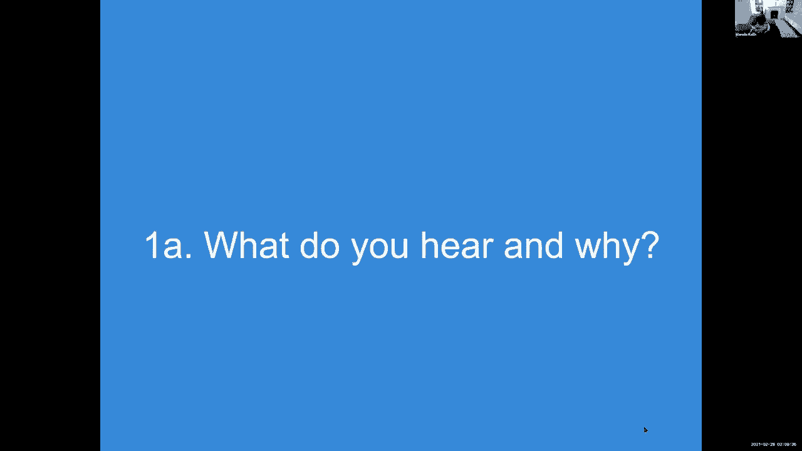

 for sound。 Okay， so what do you see there？ You see the cat even though this character is exactly the same as that character you guys。

 can actually see very clearly that it's about the cat you never had to actually wonder how。

 to read that particular sentence。 And the reason for that is that as you're scanning the characters in that sentence you。

 can actually interpret the every character in the context of the rest of the sentence。

 So you basically have this top down processing that allows you to interpret particular stimulus。

 in very different ways。 I want you to start reading this in your head according to researcher at Cambridge University。

 it doesn't matter in what order the letters in the word are the only important thing is。

 that the first and the last letter be at the right place the rest can be a total message。

 you can still read it without problem this because a human mind does not read every letter。

 by itself but the word as a whole。 It's very remarkable right。

 And then this message serves to prove our mind can do amazing things impressive things。

 in the beginning it was hard but now on this line your mind is reading seven is reading。

 it automatically without even thinking about it be proud only certain people can read this。

 please forward if you can。 So it's very remarkable right。

 So you know the context allows you to sort of you know change the order of the words change。

 the meaning of different characters。 Here's another one you all pronounce it data or data data data。

 So again you're feeling in the rest and there's something known as phonemic restoration。

 The state governors met with their respective legit plateures convening in the capital city。

 The state governors met with their respective legit plateures convening in the capital city。

 So you can actually hear syllable。 The state governors met with their respective legit plateures convening in the capital city。

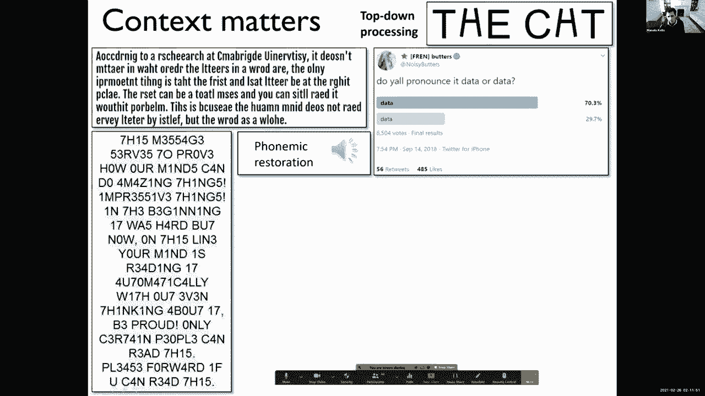

 That are simply not there。 Here's another one where now we're going to be messing with not just text and context and。

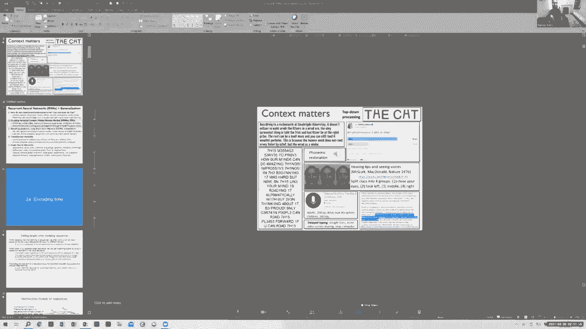

 individual characters and you know pronunciation and missing words。

 But now we're going to be looking at the combination of the input you get from your visual stimuli。

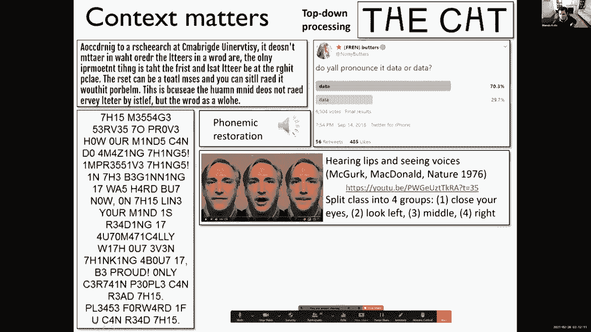

 And your auditory stimuli。 So if you if you look at the person on the left or the person on the right in this video。

 you're going to be hearing a different character each time。

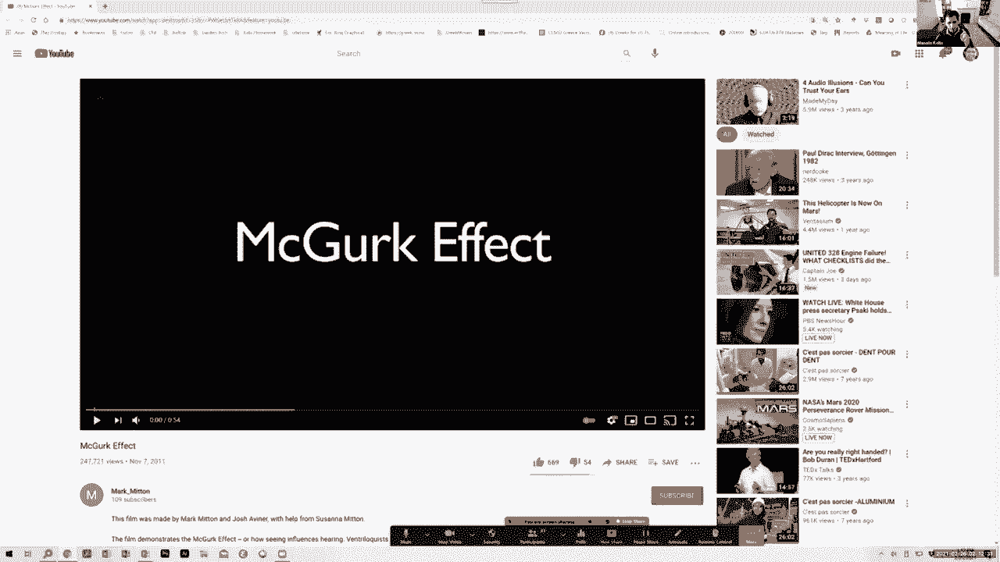

 So what's really remarkable here is that if you watch the lips of the person on the left。

 you hear a V。 If you watch the lips of the person on the right you hear a B。 And if you。

 watch the lips of the person in the middle you hear a D。 Even though it's exactly the， same sound。

 So let's try it again and just randomly pick one each time and we're going to see what。

 you hear each time。 The most remarkable for me is the difference between the left most and the right most。

 So this is known as the McGurk effect and it's basically allowing you to utilize information。

 from the full experience to fill in the rest。 Again using both temporal and spatial and auditory and visual context information。

 It's a very cool effect which is this delayed auditory feedback which basically delays the。

 input that it hears by exactly 200 milliseconds which basically causes a maximal disruption。

 for adults。 And if you delete by 500 milliseconds it causes a maximal disruption for the children。

 Basically if you're trying to shut someone up just replay back what they're saying with。

 a slight delay and because we're processing that context it'll really mess them up。

 And if you're trying to type into Google Docs or into your Zoom video sharing and there's。

 a slow computer and if you're looking at what you're typing you will make a good deal， of mistakes。

 What I need to do is actually close my eyes and type it out and then see it appear eventually。

 because again that tiny delay will cause disruption。

 And again the whole idea is that when we listen to someone talking the change in our brain's。

 processing from not caring what kind of sound it is to recognizing it happens very very early。

 And this happens as soon as linguistic information becomes available。

 And what's really interesting is that the way that our brain does that is by constantly。

 training a recurrent neural network。 What does it do？

 It basically tries to predict the next sentence at every moment in your， let's see， let's stop。

 the optimal for sound。 So basically it's， so we're able to constantly make predictions about the world and the beauty。

 of our cognitive architecture that we're going to look into much more detail today in。

 the context of recurrent neural networks is that you have all of the training data that。

 you wish if what you're constantly doing is predicting what's going to happen next and。

 then you're constantly checking back against reality。

 So you basically take an unsupervised problem of I'm walking around the world to a supervised。

 problem of oh wow I constantly realized that what I was predicting didn't happen and I'm。

 updating my neural network according to that knowledge。

 So we're anticipating what we're likely to hear and we're learning what sound signal。

 the language is more frequently ordering and the brain can actually predict what comes。

 next and it is thought that this process it in fact at the root of understanding that。

 understanding is all about first predicting and that's what we're going to be doing today。

 with RNNs with transformers and with these sort of temporal models。

 So the question now is computationally how do we encode this temporal context？

 How do we ensure that our computers can do what our brains seem to be doing quite naturally？

 So we're going to look at very simple models like your market models and then recurrent neural。

 networks。 So how do we encode time is the question。

 So when a blind machine learning to sequences we want to turn an input sequence into an。

 output sequence that lives in a different domain。 For example we can turn a sequence of sound pressures into a sequence of word identities。

 So we're transforming one sequence into another sequence and sometime there will be a separate。

 sequence。 For example someone will go in and annotate a video sequence with the ball is being kicked。

 and you know there's a child that falls or you know a car is turning and so on and so， forth。

 But other times when there's no separate target sequence you can actually get a teaching signal。

 by trying to simply predict the next term of the input sequence and that is extremely。

 powerful and the reason for that is because you are inherently constructing a model of。

 the world by doing that and that model of the world has an infinite amount of training， data。

 So the target output sequence is the input sequence with just a shift of one step and it。

 seems very naturally to try to predict you know small patches or one utterance at a time。

 for these temporal sequences。 So you can predict the next term of the sequence and therefore it turns this unsupervised learning。

 where all you have is one sequence into a supervised learning。

 We can use methods that were designed for supervised learning without having a separate。

 annotated signal。 So you can build memoryless models for inferenities you can basically build these auto regressive。

 models where you're predicting the next term in a sequence from a fixed number of previous。

 terms using delay tabs。 So you can build a model that basically says given node A and B what is the function that。

 transforms nodes A and B into node C。 I'm going to the value of node C。

 So you're learning a function where C is computed from A and B and then you're applying this。

 function at every time step。 So if you have a sequence of a thousand characters or a thousand words you're learning a single。

 function that you're going to apply at every point in your sequence。

 So let's see who's with me so far about this key concept here that we're learning a single。

 common function which we're then applying to the entire sequence。 Awesome。 So 48， 38， 14， 0 there。

 So and that's what these feed forward neural networks have been able to do the whole time。

 You basically have input A， input B， some hidden node and from that hidden node you're predicting。

 output C。 So what we can do is simply directly predict it or introduce our hidden nodes architecture。

 with these convolutional networks or any other type of deep learning architecture can。

 go into predicting that next future event。 And that's where it becomes interesting。

 Because that allows us to now start linking together input T minus three。

 We can have all of them together going to some other hidden unit and then predicting here。

 and so on and so forth。 So you can unleash your creativity in designing these types of models as long as you can apply。

 the same exact function at every time point。 So that basically means that your function has to actually learn something about the underlying。

 language。 So if we give our generative models some hidden state and if we give this hidden state its。

 own internal dynamics then suddenly you can build much more interesting models。

 We can store information that's hidden for a long time and we're going to see how these。

 long-shirted memory modules allow that information to be stored for an infinite amount of time。

 because there's no decay。 But even for recurrent neural networks without the LSTM modules this decay is going to be。

 exponentially dropping and then potentially reinforced through additional signals that， you see。

 So again if the dynamics are noisy and the way we aggregate inputs from the hidden state。

 is noisy we will never actually know that exact hidden state and that exact hidden state。

 can be extremely complex but we can infer probability distribution over the space of。

 these hidden state factors。 At the end of the inferences tractable for different types of hidden models where we can。

 basically have the hidden nodes feeding information to each other from the previous time point。

 to the next time point。 So this is when the hidden information is propagated。

 That basically means that in making my next prediction I have access to the previous information。

 about the hidden model。 So basically the information is flowing through the hidden nodes and then the inputs could。

 be driving either the hidden nodes directly or you know the current hidden node could be。

 receiving information from the input and that's where it becomes interesting。

 Again you have so much money ability in these architectures because you could actually simply。

 recompute whatever you computed here by simply feeding that there。

 So the computation that goes into those hidden nodes is really as complex as you would like。

 it to be。 So you can predict the next output or you can predict the input or you can predict you。

 know any kind of combination of them。 So what hidden Markov models can do is they basically have an output function which is。

 computed from every current state。 So you basically have hidden states and you're moving from state to state and then the output。

 only depends on the current state and then the next state only depends on the previous， state。

 So the only thing that matters in hidden Markov models is the current state that the model。

 is in and you have some probability distribution of producing a given output。

 And the state that you're in and the way that these models are run is that you only。

 have one sequence and you're trying to build a model that predicts that sequence。

 So you are using a generative model as we saw in the very first lecture this concept。

 that there's a hidden world out there。 Sorry there's a hidden model and then an observable world and the output for hidden Markov models。

 is the observable world。 The output is directly observable and what you're trying to infer is the hidden state。

 that most likely gave rise to that output。 So in hidden Markov models the state of the system is hidden but what you're observing。

 is how likely how probable is the particular sequence that I have given the set of hidden， states。

 The hidden Markov models have a discrete one of however many hidden states and the transitions。

 between the states are stochastic and controlled by a transition matrix and the outputs are。

 produced by an emission matrix which is itself stochastic。

 So you can't quite be sure what the hidden state is。

 You can represent that explicitly but you can represent the probability distribution。

 over those hidden states。 The challenge of course， so who's with me on hidden Markov models？

 So you basically have two types of parameters。 You have an emission matrix that basically tells you given the hidden state that I'm in。

 what is the probability of observing each output and you have a transition matrix which。

 basically tells you given the hidden state that I'm in currently then what is the probability。

 of transitioning to each other hidden state。 So the transition matrix is what captures the linear relationships between these models。

 and then the emission matrix is what allows you to start representing an interpretation。

 of the world。 The observations are here and your interpretation of the world are the state that you're in at。

 any one position。 So who's with me on hidden Markov models？ So 40， 41， 19， 3， 0。

 So the limitation of hidden Markov models is that at every time step you must select one。

 of the hidden states and with end states you can only remember log n bits。

 So basically to remember a lot of previous information you have to encode log n of number。

 states in order to actually remember log n bits you have to create n states。

 For every piece of information you need to have every state as some bits of information。

 and then you have to encode a lot of previous information with an enormous number of states。

 And if you consider the information that's in the first half of an utterance and how that。

 information contains something about the second half the sentence needs to fit， the semantics。

 need to fit， the accent， the rate， the volume， the vocal tract part， the statistics must。

 all fit and all of these aspects combined could be hundreds of bits of information and。

 that basically means you would need two to the hundred possible states to represent all。

 that information。 So the challenge of hidden Markov models。

 I mean they're extremely powerful but the challenge。

 of hidden Markov models is that you can't encode too much information about the previous state。

 And that's where recurrent neural networks come in because they allow you to encode things。

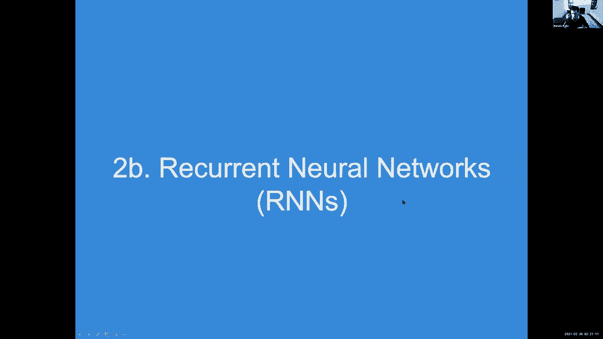

 in much more explicit ways。 So you're combining two properties for recurrent neural networks。

 The first is that you have a distributed hidden state that allows you to store a lot。

 of information about the past very efficiently。 So that hidden state is explicitly mentioned。

 You don't have to encode it in sort of a Markov chain that moves along different sort of。

 hidden state。 And also you can have nonlinear dynamics and that allows you to update the hidden state。

 in much more complicated ways。 Whereas for your hidden Markov model you have just a very simple equation driving it。

 And with enough neurons and enough time of observations recurrent neural networks can compute。

 almost anything that you can compute with your computer。 So they don't have to be stochastic。

 So recurrent neural networks are actually deterministic。

 You can think of the hidden state of recurrent neural network as the equivalent of the deterministic。

 probability distribution over hidden states in a linear dynamical system or in a hidden。

 Markov model。 Whereas linear dynamic systems and here Markov models are stochastic by their nature。

 The posterior distribution or this posterior probability distribution of the United States。

 is a deterministic function of the data。 When you have a particular sequence you know exactly what the posterior probability distribution。

 of the hidden state will be given an observable sequence。 So there's nothing stochastic about it。

 It's a probabilistic model that allows you to interpret probability distributions but。

 it's not a stochastic model。 Whereas the neural， the recurrent neural networks are basically inferring these using you know。

 much more complicated equations that we're going to see shortly。

 So recurrent neural networks can have all kinds of very cool behaviors so they can oscillate。

 which can be helpful for motor control implications。 They can settle to point attractors。

 This can be good for retrieving memories。 It can behave cautically which basically allows you to sort of make unpredictable decisions。

 which can be you know possibly bad for information processing but could be good for I don't know。

 secrets or for you know random locations and so on and so forth。

 And they could learn to implement lots of different programs that each capture a different。

 aspect of the knowledge about the world that you've learned from your sequential sequence。

 and then they can run in parallel and interact and then produce very complicated effects。

 But the computational power of our NN is what makes them very hard to train and for many。

 years we could not exploit that computational power despite many efforts but now we think。

 creases in compute and with new cool algorithms they've become tractable。

 So feed forward networks and recurrent networks can be thought of as equivalent by simply unrolling。

 the time。 Basically if you have say three nodes that are dependent on each other you could basically。

 think of them as at time zero at time one at time two at time three bringing information。

 from their past cells to their future cells and that actually simply makes it equivalent。

 to feed forward network but with possibly an infinite number of stacks because you can。

 have just an infinite number of time points。 So every layer of this feed forward network you have a snapshot of time and then at the。

 next snapshot of time you just simply receive some inputs from some nodes which happen to。

 be the same nodes at the previous time step and then you're sending some output to some。

 nodes which again happen to be the same nodes at the next time step。

 So if there's a time delay of exactly one at each connection then it's just a layered。

 network that keeps reusing the same weights and that's what's important。

 What we were saying earlier is that to predict the character five from four and three you。

 have to use exactly the same function as to compute character seven from six and five。

 and so on and so forth and that's exactly what's shown here the fact that the weights。

 that I'm using are absolutely shared across every layer of my network。

 All right let's see who's with me so far。 Great。 So we're at 21， 42， 34， 3。

 0 and how's the pace so far？ Okay， we're going slightly fast but not way too fast。 Okay。

 so again the concepts are very simple。

 Let's now dive into the specific architectures that we can use for those recurrent neural networks。

 So the way that these are represented in the in your book in the Goodfellow book you basically。

 have these observations， X feeding into hidden units and you have some function that computes。

 that hidden unit from the current X and that's simply you're just trying to model the world。

 with no outputs。 You're basically receiving information from the previous instantiation of yourself to the。

 current time point each time。 You could have a single output after the entire sequence。

 For example you could say okay I'm reading a big passage on Twitter and then I'm trying。

 to decide if the person is happy or angry or tired or etc。

 On Twitter it's probably angry but you basically have these set of inputs that are being computed。

 exactly the same way and every time。 So basically all of these weights are exactly identical as unrolled across over time and。

 then in the end I have some output function。 And I may have a training corpus where I know the annotation of a bunch of tweets。

 Some are happy， some are angry， some are melancholic and so forth and then in the end my loss function。

 is the discrepancy between what I should be predicting and what I am predicting in my， network。

 So then I can train my network using exactly the same tools that we've seen so far using。

 back propagation to update the weights but what's really cool is that you're updating。

 the weights which are shared at all of these different levels。

 So you could unroll your network and then train the weights under the constraint that。

 this weight here and this weight here and this weight here are all the same。

 So who's with me on this one？ Very cool。 Okay so we're at 28442260。 Are there any questions so far？

 So let me look at the chat here and see if the questions have been answered。

 So TAs are there any questions that haven't been answered on the chat？

 We're working on answering all of them but I think there's nothing unanswered。

 Okay so I'll keep going maybe a little more slowly。

 So that's one way of doing it we can basically have the hidden layer feed through from the。

 previous time set to the current set and again this can be enormous and this can receive。

 information from the current input and from the previous savings thing。

 Another way to do it is to have not just a single decision at the end of the long sequence。

 that basically says yes the person was happy or no the person was angry to have an output。

 prediction function at every step。 So basically I want to predict a why at every time point。

 For example I might be translating I don't know French into German。

 So I'm reading a French sentence and I'm outputting the corresponding German sentence。

 But what's really interesting here is that I have information flowing between these， hidden units。

 So the fact that I see you know dependent verb in a subordinate sentence at this point in。

 the English sentence or in the French sentence means that I'm going to have to now propagate。

 that information to the end of that sentence to put the verb in the German construct。

 And that's what these information flowing between the hidden units allows me to do。

 So I have an output variable that I want to predict。

 I have an input variable at every time's time point。

 And then I have my output function from my hidden layers and then a loss function at。

 every time step that basically tells me how close am I to the output that I desire and。

 how can I update my weights to match this function。

 And the way that I'm updating the weights is exactly the same back propagation but now。

 back propagation through time that allows me to just unroll that network and then work。

 back through those weights。 So then the memory is coming from the hidden units of the previous time step to the hidden。

 units of the current time step。 Another way to encode that memory from the previous time step is instead of having it。

 flow from the previous hidden units to the current hidden units， what I can do is actually。

 flow back the output from the current from the previous time step to the current hidden， unit。

 So I don't have access to the entire computational structure that I have here。

 I only have access to the output。 And then the challenge of this is that this can only be trained sequentially because I。

 need to have actually produced an output before I can use that as an input to the next time， step。

 And then the alternative is instead of having the output be fed into the current hidden unit。

 you could actually have the correct output， not the output of my model but the correct。

 label for that previous utterance be fed to the current model。 And you know。

 this would be at train time and then at test time， you would just， since。

 you don't have the known output anymore， you would just use the output of your previous。

 time time step as an approximation of the previous one。 Okay。

 So let's see who's with me here on the subtle variations between all of the ways that you。

 can construct these temporal relationships between previous units and current units。 Very cool。

 Okay。 So 24， 40， 32， 6， 0。 So let's now dive into the training。

 So we basically saw all of these different architectures and we， you know， what we repeatedly。

 seen is that this can be thought of as， okay， well， I have an output function that I'm。

 trying to predict。 And then I have the correct answer and I have a loss。 And based on my loss。

 I'm going to take the derivative， the partial derivative of every， one of my。

 of basically the partial derivative of my loss versus every one of my weights from。

 all those previous hidden units。 So we're now doing back propagation using an update that will allow us to now approximate。

 that output function， why through the deviation of the output that we're currently computing。

 using our current set of weights to basically update the weights using the derivatives of。

 that loss function relative to each other weight under the constraint， of course， that。

 all of these are being trained simultaneously across all of that。

 So if you're comfortable with that notion or if you're comfortable with the unrolling and。

 then simply following the arrows for the back propagation， then there's nothing fancy about。

 recurring neural networks。 You can just simply， you know。

 carry out the exact same procedures that you had before。 Okay。

 So are there any questions that have not been answered？ All right。

 So now let's dive into the training with this back propagation through time。

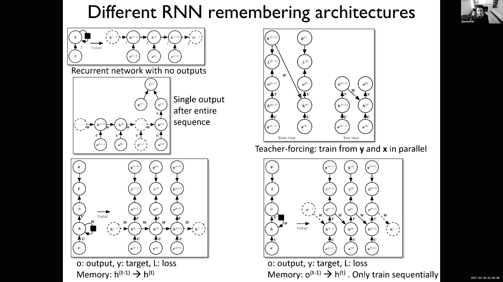

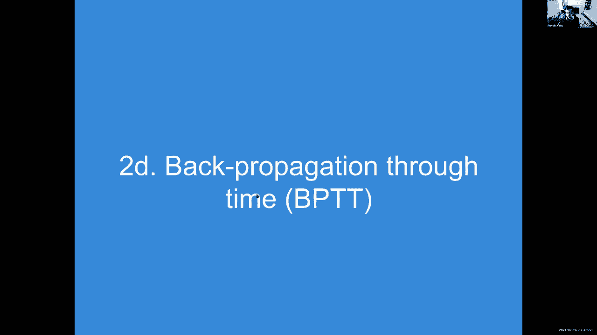

 So this is exactly the same thing you saw before， but now expanding this network out。

 So we can modify the back propagation algorithm to incorporate linear constraints between the。

 weights and we can compute a gradient as usual， but then modify the gradient so that they satisfy。

 these constraints。 So we basically have some constraints that the weight at time point one is the same at。

 time point two。 Therefore， when you compute these derivatives。

 you basically have to obey that constraint， that these weights are the same。

 So if the weight started off， satisfying the constraints， they will continue to satisfy the。

 constraint across all time。 So you can basically think of the current。

 the recurrent neural network and simply a layered。

 feed forward network with shared weights and then train the feed forward network with。

 the weight constraints。 You can also think of this training algorithm in the time domain。

 The forward pass will build up a stack of the activities of all the units at each time。

 step and then the backward pass will peel the activities off the stack to compute the。

 error derivatives at each time step。 So you can think of it as either layer through this， you know。

 t minus two， t minus one， t， t plus one， et cetera， or you can think of it actually temporarily。

 And after the backward pass， you can add together the derivatives at all the different times。

 for each weight。 And then this is basically back propagation as you know it。

 So how do you get the targets when modeling the sequences？

 So when applying a machine learning tool to sequences， you want to turn an input sequence。

 into an output sequence that lives in some other domain。 For example。

 translating a German sentence into a French sentence or translating a video。

 into a set of annotations for what's happening in that video or translating sound into words。

 and transcribing the words that are being spoken。 And that would be a place where we actually have the outputs already labeled and we're。

 trying to predict those outputs。 But then when there's no separate target sequence。

 you can get a teaching signal by trying to， predict the next term of the input sequence。

 So the target output sequence is the input sequence with an advance of one step。

 And that seems much more natural than trying to predict one pixel of an image or a patch。

 from the rest。 And for temporal sequences， there's an ordering and you can predict the next one and sort of。

 go back to that supervision that we talked about earlier。 So all of this is nice and fun。

 but there's a challenge。 And the challenge is that when you have these very。

 very long sequences and you're translating， for example， a French sentence into a German sentence。

 that sentence might actually be very， very， very long。

 And the influence that this particular word has over time will basically get multiplied， by。

 I don't know， 0。1 times 0。1 times 0。1 times 0。1 and basically vanish exponentially over， time。

 So that basically means that after a sufficient number of steps， any kind of influence that。

 I have from any word in my sentence will basically decay to zero。 Can everybody see that？ Great。

 So how do we deal with that？ The way that we can deal with that is by remembering inputs or intermediate variables over longer。

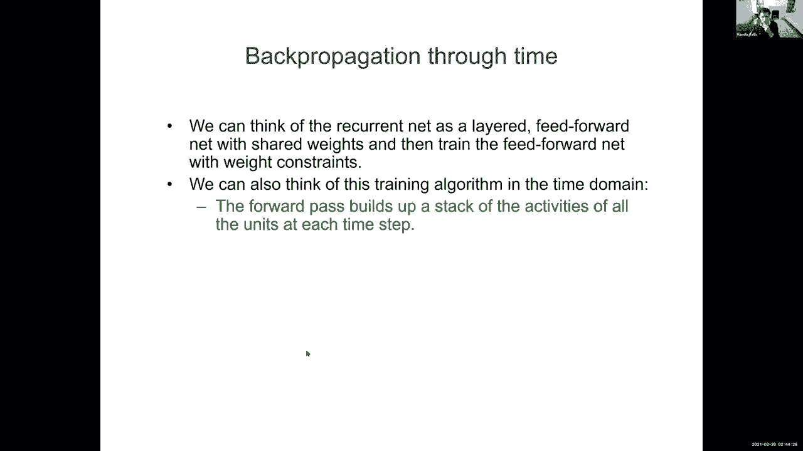

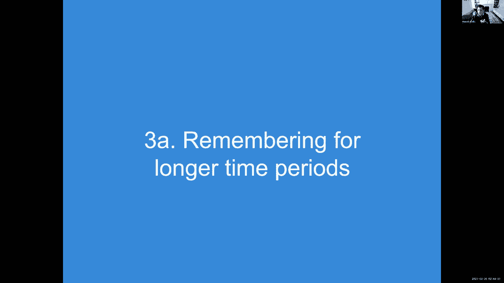

 time periods。 So there's many ways to increase the length of the memory。 So for example。

 you could have an echo state network where you initialize the input to。

 hidden and the hidden to hidden and output to hidden very carefully so that the hidden state。

 has a huge reservoir of weakly coupled oscillators which can be selectively driven by the input。

 So you basically augment your hidden state where you have amplifiers where you're basically。

 repeating the word。 So I put one of my friends would say that when they were driving in her countryside。

 they， would basically pass tunnels and after every tunnel she would say， "3， 3， 3， 3， 3， 3， 3。

 and then she would say the next tunnel， she would say， "4， 4， 4， 4， 4， 4， 4， 4。"。

 So that's basically an echo state network。 So it basically repeats the same word over and over again。

 So if you're trying to remember a word for a long time， you can just simply in your hidden。

 state have emitters that keep repeating that word and that's basically the echo state network。

 And it only needs to learn the hidden to output connections。

 There's a case in free optimization that basically deals with vanishing gradients by using an。

 optimizer that detects the directions with a tiny gradient and a very small curvature。

 And you can look that up and you can also initialize with momentum。

 You can basically just like an echo state network， you can initialize and then learn。

 all of the connections using momentum。 So we saw how you can basically use the momentum in traditional feedforward networks by looking。

 at which way is the gradient going and maintaining that momentum。

 Here you could basically initialize with a momentum that then sort of propagates that。

 signal and sort of maintains that signal over time。

 But perhaps the most powerful of those is the long short term memory module。

 And you can basically make the neural network out of modules that are designed to remember。

 values for a long time。 So let's now introduce this long short term memory module。 So in 1997。

 these authors solved the problem by getting a recurrent neural network to remember。

 things for a long time， for example， hundreds of time steps。

 And the way that they did that is by designing a memory cell using both logistic and linear。

 units and multiplicative interactions。 So the way to think about that is that information gets into a cell whenever you write。

 when you， turn on the right gate and the information stays in the cell， it effectively is like an。

 echo network that has perfect echo as long as you shut the doors。

 And then you can decide from the network and from the information that you're learning whether。

 to shut the door or open the door at any one time step。

 So the information basically stays in the cell as long as the keep gate is on and the。

 information is read from the cell as long as the read gate is on。

 So you basically have these gates that are maintaining that echo chamber。

 The information is getting repeated constantly， it's getting passed on unchanged and undiluted。

 by any kind of weight decay。 And the network decides when is the right time to remember or forget a piece of information。

 So you can preserve information for a long time by using a circuit that implements the。

 equivalent of an analog memory cell by explicitly deciding when to encode and when to decode， it。

 So you basically， and this all sounds like magic。 But the way to think about it is that all you're doing is giving your neural network the。

 tools that it needs to carry out particular operations like remembering and forgetting。

 and maintaining information。 You're not explicitly saying remember this now。

 but you're giving it a capability of saying， oh， well， I better remember this。

 And then I might use it at the end of a very long German sentence to figure out what the， verb was。

 for example。 So you basically have a right gate that receives input that basically you decide whether to。

 call the right gate based on the rest of the information inside the network。

 So you're basically seeing a word that's really important or you're saying the word not。

 You're like， oh， wow， not。 That basically means that the rest of the sentence I better remember that not state。

 And you're like， okay， I'm going to the network basically decides that that word was really。

 important。 So it's going to write and remember that word。 And then eventually it will decide， okay。

 now there's a period I can stop remembering， that and I can turn on the read gate， for example。

 and forget that word or I can maintain， the keep gate and sort of keep remembering that word。

 So whenever I need the word， I can just read it and whenever I want to forget it， I can。

 just turn off the keep gate。 Okay。 Let's see。 Who feels that they're learning stuff？ So let's see。

 Awesome。 Good。 48， 46， 3， 3。 So now let's see how we can implement these gates。

 So to preserve information for a long time in the activities of recurrent neural network。

 we can use a circuit that implements that analog memory cell。

 And it's basically a linear unit that has a self link with a weight of one。

 And that self link basically never decays。 You just remember that value exactly till the end of time。

 And that information is stored in the cell by activating the right gate。

 So when the right gate opens， you just receive the input from here and you completely ignore。

 what was in there。 And the information is retrieved by activating the read gate。

 And then the information that you remembered 100 times steps ago is now completely unchanged。

 because it's been maintained in this sort of repeating echo chamber with no other inputs。

 It's a close bot and you're remembering it constantly until you need it and then you， let it out。

 And you can keep erasing it or you can keep repeating it with no decay。

 And you can back propagate through the circuit because the logistics have these very nice。

 derivatives that you can actually decide。 As you're learning through the network。

 you basically give your network the capability， of remembering or of forgetting or of rereading。

 of storing a memory and retrieving a memory。 You're giving it these capabilities and then the network itself can basically decide when。

 was it helpful to remember and when was it helpful to forget particular words。 So here's an example。

 You basically have your input sequence over time and you're reading a number by activating。

 the right node and basically now stores this number and then the keep node is turned on。

 And when that is turned on， you don't just decay but you maintain it perfectly。 And then again。

 you don't read anything， you don't write anything， you read anything。

 and then eventually you want to read it and then it's been maintained perfectly through。

 the network。 So for example， this can be helpful in reading cursive handwriting。

 So it's a very natural task for a recurrent neural network。 The input is a sequence of X。

 Y and time coordinates for the tip of the pen where P indicates whether。

 the pen is up or down to you're basically saying， where is my pen and am I writing？

 And then the output is a sequence of characters。 And again in 2009。

 this author showed that this RNN with this long short term memory module。

 is the best system for reading the cursive writing。

 And they use a sequence of small images as input rather than the pen coordinates。

 And you can actually watch a demo of this online handwriting character recognition。

 So what you will see is a series of characters that are being inferred from the handwriting。

 And you can see this over time， the state of the system， which is basically sort of giving。

 different weight at different points。 And the very cool thing is that you will go back and you will see what is being remembered。

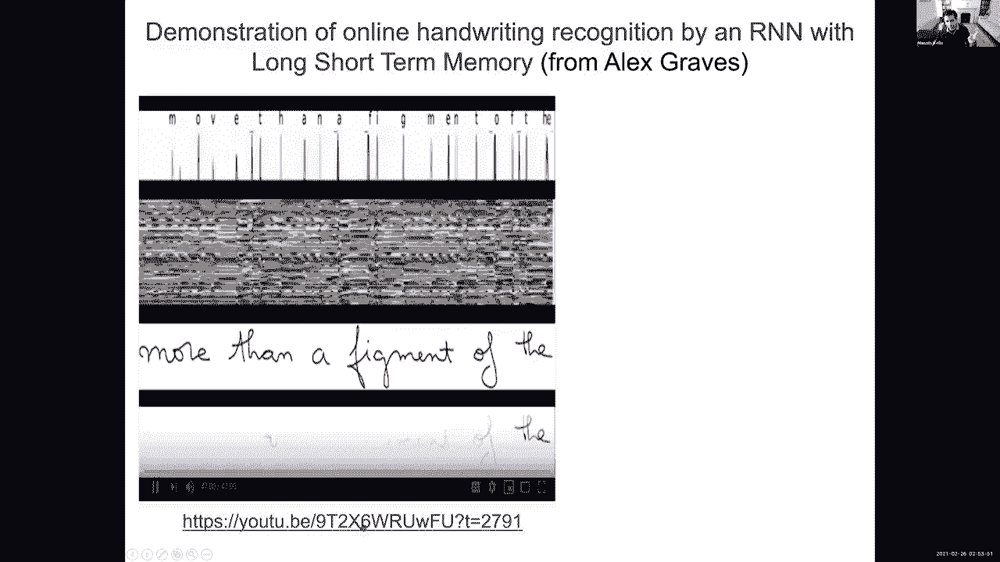

 at every point along this system。 So let me show this。

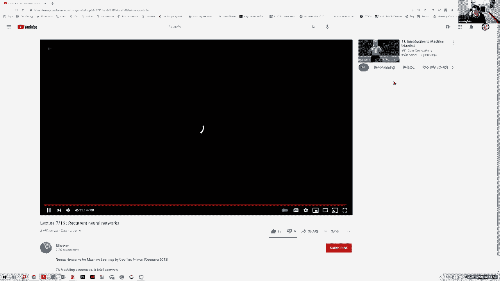

 So you can see now as the。 And this video， hold on a second。

 So you can see here as the handwriting is happening， the different characters are being。

 interpreted。 And then you will see them actually changing and you can see the posterior probability。

 for each of those as you go。 And over here you are basically learning what characters are important and what parts of。

 the system are important。 And you can see for example this part here continues being important for a while and。

 then eventually fades。 Ask what would make that move？ So you are learning this as you go。

 So this is one very cool application of these recurrent neural network。

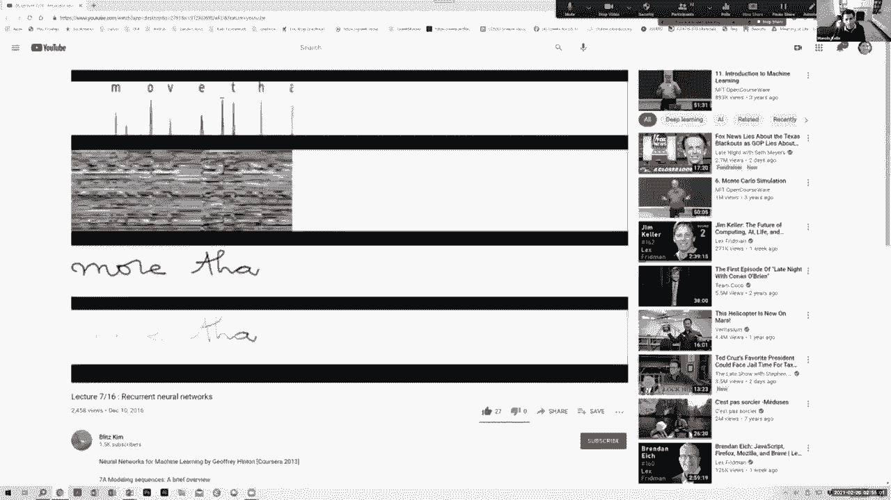

 So in the first row you basically see when the character is first getting recognized。

 and never revises its output。 So basically sometimes you will see that the difficult decisions are actually delayed。

 Row two shows the state of the subset of the memory cells and these get reset when a character。

 is getting recognized。 Row three shows the writing。

 Basically you see the x and the y coordinates and that is an optical input which actually。

 works better than pen coordinate。 And then in row four you see the gradient back propagated all the way to the x and y inputs。

 from the currently most active character。 And you can see which bits of the data are actually influencing the decision。

 So again I am leaving that link in there。 You can play it again and watch this。 Okay。

 We have any other questions or comments？ So let's see。 So who is with me so far？

 So basically what you can see is this back propagation through time through different。

 time steps and then this memory module being remembered and how that memory gets erased。

 every single time you are making a decision you are like okay I don't need to remember。

 all of these anymore。 So 23 62 13 3 0。 Okay so in terms of initialization you can basically deal with boundary cases you need。

 to specify the initial activity state of all the hidden and output units。

 You can just fix these initial states to have some default value and again it is better。

 to treat the initial states as learned parameters rather than explicitly encode them and you。

 can learn them in the same way that you are learning the way to start off with some random。

 guess for the initial state and then at the end of the training segment you can back propagate。

 all the way to the initial state to get the full gradient of the error function with respect。

 to each initial state and then you adjust the initial states by following the negative， gradient。

 So you can basically teach these signals by sort of going downward through time and you。

 know across all of these networks。 The network basically learns patterns that corresponds to nodes in the finite state automaton and。

 this automaton is restricted to being exactly one state at each time and the hidden units。

 are restricted to have exactly one vector of activity at any one time and for a recurrent。

 network that can it can emulate a finite state automaton but it is exponentially more powerful。

 because it doesn't have this exponential number of weights that are needed。

 And just you know maintain a very fixed number of weights。

 And again there is this backward pass which is basically telling you how this information。

 is updated at any one time by following a particular linear tangent to your sigmoid function。

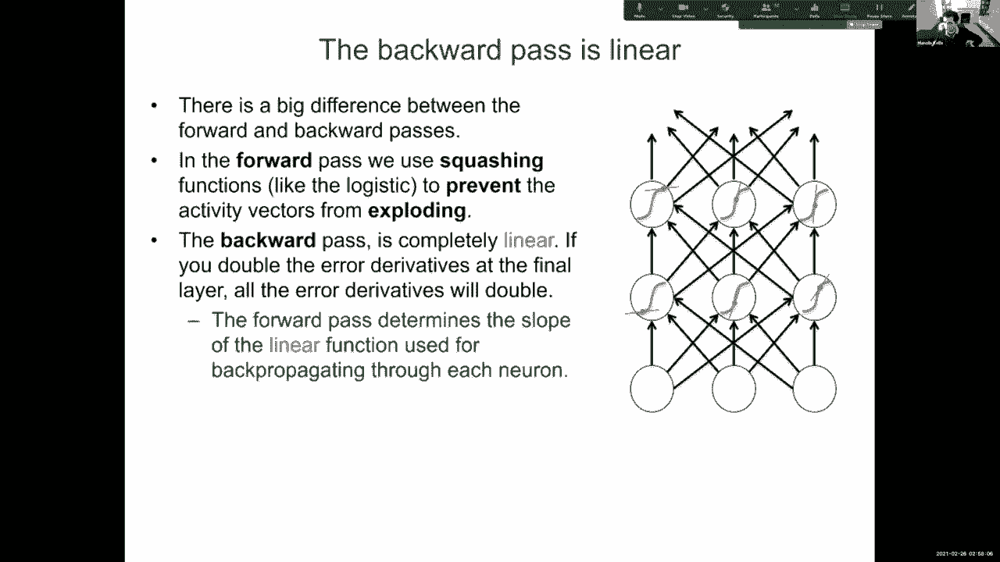

 So this long short term memory module is explicitly modeling the relationships and the memory。

 aspect and the time aspect。 So we basically saw how hidden Markov models can explicitly model time。

 How recurrent neural networks can explicitly model time by sort of unrolling these dependencies。

 over many time points。 And we saw this long short term memory module that allows you to deal with vanishing gradients。

 in a very graceful way by allowing these memory to be maintained unchanged over a long time。

 until it is needed。 So I want to now switch to a very cool new development which is a transformer module that。

 allows you to learn temporal relationships without having all of these unrolling and without。

 using these recurrent neural networks。 And the way that it does this is through these attention modules and a transformer model。

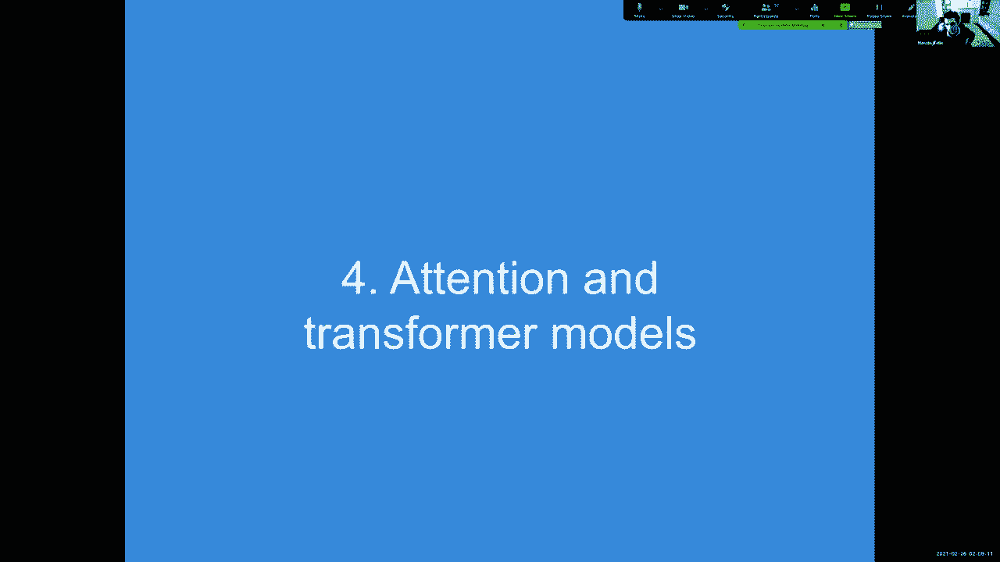

 So what does it do？ It basically has an input which is for example a word in the French sentence and an output。

 which is a word in the German sentence。 But then the way that it actually captures the temporal relationships is not by having。

 a stack of units at every time point which then get unrolled over time but by explicitly。

 encoding a positional encoding that basically tells you where in my sequence am I now as， an input。

 So suddenly you're just remembering an index and you don't need to actually have this whole。

 unrolling over time and then you have an input embedding that can be as many stacks as you。

 would like tall and then an output embedding which can again be as tall as you would like。

 But then the cool part is that the output is actually shifted by one relative to the input。

 So that allows you to now start predicting not the current word in the German sentence。

 but the next word in the German sentence。 And that's how you have the properties of the recurrent neural network be achievable。

 by constantly predicting the next item。 So you get this temporal relationship simply by shifting your output embedding from your。

 input embedding by one and then the power of all this comes from the attention modules。

 that are basically deciding based on the set of words in your sentence in your German sentence。

 and your French sentence you're deciding where what are the most important words in。

 the particular sentence that you're looking at and by sort of having that attention be。

 shifted across the multiple time points you can actually achieve that temporal relationship。

 So you have this encoder you have this decoder and then you are computing a particular attention。

 function based on a query which is a matrix which is a vector representation of one word。

 at a time in your sequence and then you have all of the keys K which is a vector representation。

 of all of the words in your sentence in your sequence。

 So that basically means that I have access to the entire at any one time point of prediction。

 and then I also have a set of values which is again a vector was nature of all of the。

 words in the sequence。 Now for the encoder for the decoder and for the multi head attention module。

 V is the same， word sequence as Q。 So V and Q are the same but for your attention module。

 V is actually， different from Q and it uses the encoder and decoder sequence to basically decide which。

 of these words to pay attention to at the time。 And it's basically doing this through this operation here which you can encode through。

 a metric multiplication of Q and K and then a scaling and then a mask and a softmax and。

 you know just a multiplication and your dot product attention is basically receiving all。

 of these linear inputs through each of those and then could cat name them and then predicting。

 a single word at a time for the German sentence translation。

 So you're explicitly encoding the contact information of the entire sentence each time。

 in producing each of these words and then the relationships between consecutive words in。

 each are encoded in this input output relationship which is shifted by one。

 So you can basically the reason why it's called the transform is because it can transform one。

 sequence into another sequence using the full context for each and that can be useful for。

 a sequence translation or for any kind of sequential task。 So who's with me on this？

 So again it's the same types of architectures that we've seen before where you can stack。

 multiple of these modules together but now you're using this temporal encoding indirectly。

 through the shifting between the two。 Okay so we're at 11， 27， 43， 11， 8。

 so halfway there and we're going to review those in recitation。

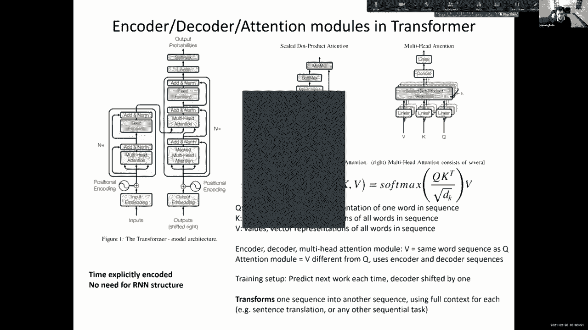

 Alright so now we're going to shift to graph neural networks and I don't know if Neil are。

 you there？ Yes I am。 Oh awesome。 So I'm going to give you control of my screen and then you can take over。

 Can you control my screen？ I believe so let's see。 Awesome。 Working awesome。

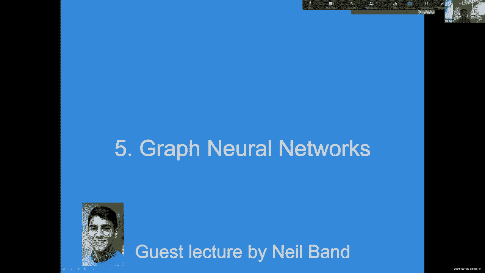

 Great。 Alright hi everyone so I'm Neil。 I'm actually a graduate student at Oxford but I have been working with Middle School Group。

 for about a year now and I'm going to be presenting on graph neural networks which I think is。

 a really exciting new sort of application area that has a lot of potential application。

 in computational biology。 So just to do some kind of you know pointing out some interesting references these slides。

 are mostly based from Thomas Kiff's presentations who has kind of been like one of the people。

 spearheading this sort of movement has produced a lot of the most interesting and applicable。

 models for this。 But I think I'll point to one of these in particular if you're interested in just learning。

 a lot more about graph neural networks I would go to this thread of resources from。

 PtoR Village Kubich it's on Twitter and it covers like basically everything you would。

 want to know about graph neural networks and it's very good。 Cool。

 So we may not necessarily get through all of this and feel free at any time please to interrupt。

 me with questions because I think if anyone has a question it's likely someone else does。

 But more or less I'll motivate graph neural networks I'll describe a brief introduction。

 in history of them。 Talk about how they can be used to solve classic network problems。

 And then if we have time we can dive into some basically research frontiers of graph neural。

 networks so their application and deep generative graph models as well as latent graph inference。

 So for example there's some kind of secret causal structure operating between a bunch。

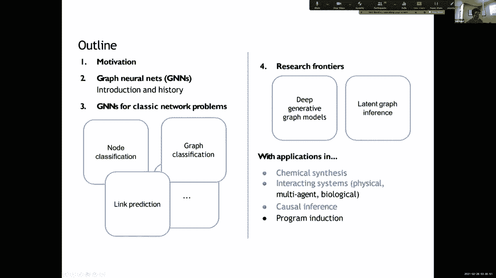

 of different nodes in a graph and you're trying to infer that structure using just observations。

 of those nodes。 So just one second I'm going to shift to the， let's see。 Hold on。

 don't move for a sec。 Okay， perfect。 Okay， go ahead。 Awesome， thank you。 You have to click again。

 Oh yeah， perfect。 Okay， cool。 Yeah， so I think this is exactly what was being reviewed previously but a lot of machine。

 learning kind of what do you think of when you can only think of machine learning is probably。

 an image classifier maybe you know classifying cats and dogs or something over this sort of。

 regular grid like structure so in the context of images。 Just once I'm going to take that off。

 Great。 So hopefully people can see you know， great。 Better。 Okay。 Yeah。

 I think you may have advanced。 Oh， sorry。 I'm not sure if I could。

 I don't know if I can actually go back。 Just click again and then you'll be able to control again。

 Oh， there we go。 Okay， cool。 Awesome。 So yeah， you know。

 images obviously operating over regular grids。 The kind of language models that Manon was just talking about are operating over 1D grids。

 you know， in the context of an RNN maybe you just only have the context coming from the。

 left in the context of a transformer you might have sort of this full context over the sentence。

 but still they get to leverage this sort of idealized representation that's has this。

 nice grid structure。 So what do you get out of that？ Well， first of all。

 you can do something like weight sharing or translation equivariance。 So for a CNN。

 you're just going to be applying the same kernel repeatedly over the image。

 and you obviously get to use the same kernel in each of those instances。

 You can also build up sort of these hierarchical representations。

 You might have like a certain stride you're using in a convolutional neural network that。

 allows you to encourage the model to start to learn these like kind of higher order interactions。

 between different parts of the input space or， you know， say like a max pooling operation。

 or whatever， they all sort of accomplish the same thing。

 So ideally we want to start to apply this to graphs。

 And there's so many instances of this in our world kind of naturally， like you might be。

 looking at social networks。 We have a bunch of nodes that are users。

 you have some feature information about the users。 You also have。

 say like information about the edges， you know， the friendships or whatever， between them。

 Same thing and say neuroscience。 We have a brain connectivity map。

 We have like time series representations for each node。

 And then you might have these kind of known a priori facts about sort of like cerebral connections。

 between each of these regions of interest。 So you can almost see here like there could be potential for a nice hierarchical type of。

 model where you apply like an RNN over this and then you apply a GNN over the connections。

 between these different regions。 And then even in say things like quantum chemistry or trying to generate molecules or。

 generate different materials， you have a bunch of atoms that have these features that connected。

 by bonds that also might even have their own types。

 So in this case you have feature information over the nodes as well as over the edges。

 And this is really just the tip of the iceberg。 You know。

 there's applications of this very prominently in biology with things like gene， regulatory networks。

 You might use it in applications for computer graphics， applying it over 3D meshes， transportation。

 networks， knowledge graphs， which are sort of a green interest in like databases or。

 industry and really tons of different structures that， you know， resemble or can be fitted into。

 the formula of graphs。 So to point out some explicit applications in this area。

 there's been a lot of cool stuff， even in just the last year as this stuff is sort of caught on and it's gotten more scalable。

 So for example， DeepMind actually just deployed graph neural networks to predict the expected。

 time of arrival for Google Maps。 And it's led to these kind of massive improvements across the world。

 So up to like 50% improvement and predictive performance in some cities。 You know。

 Magic Leap is a company that focuses on VR。 And one thing they're interested in doing is doing feature matching between different。

 perspectives。 So you can treat that as sort of like a graph known that with prediction problem where you're。

 basically trying to infer different edges in like a bipartite graph that are mapping between。

 different objects that are seen from various perspectives。

 It's actually being deployed in the large Hadron Collider to do analysis on billions of。

 particles now。 And further， you know， just one example of it being applied in biology。

 trying to infer， what parts of a protein are actually， you know。

 being involved in a protein-protein interaction。 This is actually getting into sort of geometric deep learning。

 which thinks about learning， over meshes and more kind of like exotic topologies。

 not necessarily just a graph that doesn't， have like， you know。

 angles between the nodes that are explicit。 So in our case。

 just to formalize the notation a little bit， we have vertices， you know， a， set of nodes。

 edges E and adjacency matrix A。 And then we have， you know。

 basically three different types of features we might be dealing， with。

 So there might be features as mentioned for each of the nodes。 So if we're looking at a molecule。

 something like the type of the atom， there might also， be edge features。 So， you know。

 H sub ij might be referring to basically the bond type between nodes or， atoms i and j。

 And then finally， we might also have graph level features g， which could， be， for example。

 just some sort of representation you've summed up by， you know， literally taking。

 all the representations of each of the nodes and aggregating them in some way。 So just to motivate。

 you know， why we might care about having a really specific model for， this field。

 let's think about like how we might just take a naive sort of fully connected。

 network and try to do a prediction over a graph。 So let's take our adjacency matrix。

 we have overall the nodes。 And then some encoding of node features， in this case。

 maybe just the identity of the， nodes is encoded by this， let's concatenate it。 And then， you know。

 in this case， say we， you know， are observing sort of what the input。

 would be to this fully connected network for the node B。 So in this case， we have sort。

 of all of its adjacency relationships and then something referring to its feature。

 And let's kind of think about what some of the issues might be from trying to do this。

 So immediately， the number of parameters is going to scale with a number of nodes， which。

 in practice is really not going to be applicable for a lot of situations that people want to。

 use graphs。 So for example， Pinterest actually does use graph level networks。

 If they tried to use an approach like this over 6 billion nodes， it would be， you know， ridiculous。

 especially because now it'd be like a linear predictor over the nodes。

 And then they introduce many more layers that， you know， are quadratic in the number of nodes。

 So it's not going to really work。 It's also not applicable to graphs of different sizes。

 So if you're doing， you know， training on a bunch of graphs of size five with this sort。

 of four matter input format， and then you move to a graph of size six， it's not really。

 clear how you're going to deal with that。 Maybe there's some weird ways you could like pre train the network and then use it to initialize。

 some weird subset of the network， but it's going to be very clunky。 So in general， you know。

 graphs change， we want to be able to deal with that。 And finally。

 kind of a sneaky issue is that it's not invariant to node ordering。

 So what that basically means is that if you swap around the labels， so you literally just， you know。

 take A and replace it with D or whatever， ultimately the underlying mathematical structure。

 is the same。 It's still the same graph。 But that would also mean that you need to permute the different rows and columns of this adjacency。

 matrix。 And then the prediction you would get is not going to be the same。

 So there's some like kind of very complicated ways that people have tried to build this into。

 feed for networks to just encode for different sorts of sorts of kind of like symmetries in。

 the data。 But we're going to explore one kind of elegant way to deal with this in the context of graphs。

 because they have to deal with a very wide class of invariances specifically that you。

 can permute all of the nodes arbitrarily and you'll get the same prediction。 Oh yeah。

 And then one way that people have dealt with this is just by trying to define a canonical。

 sorting over the nodes。 But again， that's going to be really bad if you're dealing with Pinterest graph and you。

 need to do like breadth first search from the highest degree node， you know， to be able。

 to have a particular type of node order。 Cool。 So now let's discuss just kind of the basic formula of graph all networks。

 So in this case， we're just trying to compute some kind of representation for each of our， nodes。

 So again， at each layer of the graph all network， you're going to do this update for every single。

 one of the nodes。 In this case， we're just looking at the update。

 like focused on one particular node。 In this case， this node in red。

 So you want to sample information from its surrounding neighborhood from this actual， you， know。

 the literal graph that you're taking as input。 So you know。

 you could look in its K-hop neighborhood， you can look in its K equals two-hop neighborhood。

 So that would mean you have a graph neural network of depth two。

 So you're sampling nodes from this neighborhood。 You're going to take feature information from the neighbors。

 So for example， again， if you're just looking at the input of the graph， that might just。

 be things like the atom type for each of these different nodes in a molecular graph。

 You're going to add it up in some sort of principled way。 And then from this。

 you have some sort of updated representation of this node in the， center。

 You can use this to predict， you know， a node level feature。

 You could also use it to sum up over all the different nodes that are in the graph and。

 then make a prediction at the graph level。 So ultimately。

 the core kind of graph neural networks is just to learn in a principled way。

 how to propagate information across the graph in order to， you know， compute these node features。

 that do some sort of downstream computation with them。

 We're going to use an error signal and that propagate through the network in order to do， that。

 And it turns out that this really isn't very different from what we see in convolutional。

 node networks。 So if you look at this animation on the left， as input， we basically have this。

 you know， 2D grid。 And then we're doing these updates in some way to create basically new hidden representation。

 So you can look at this， this like more tealish one as like whatever the computation is in。

 the next layer， right？ So the update we're basically doing is for each of the center。

 the center nodes within， basically the receptive field of this kernel， right？

 So you're doing an update for the center node。 You're looking at all of the hidden representations。

 which in this case are just the literal RGB， values or the RGB vectors。

 if it's the actual input image of all the surrounding pixels。

 you're applying some weight to each of them， summing them up。

 And then that gives you your updated hidden representation for this center node。

 And so this looks a little weird because we're not doing padding as we would normally do in。

 the context of a CNN， which would keep the layers at the same level and we're not doing。

 striding and those sorts of things。 But you can sort of see the picture here。 You're adding up。

 you know， with a bunch of different weights， the hidden representations。

 of the neighbors and also itself。 So sort of the middle， the middle node。

 And then you're applying some kind of nonlinear function and you get your new hidden state。

 for the center。 So it's kind of nice because we can describe problems that we're used to within this framework。

 So to now make it clear what exactly we're doing， we have a target node we're trying。

 to update and we can sort of unroll this almost like an RNN but not exactly where we're sort。

 of observing a bunch of different state or information from different parts of the graph。

 So in this context， we are trying to do the two layer graph neural network update for， node A。

 So in the immediate layer prior to this representation， we're trying to compute。

 we have information coming from neighboring nodes BC and D。 And in this case， you know。

 we might aggregate them and then apply some nonlinear function， which makes this basically。

 a little neural network or， you know， nonlinear function， we're applying to obtain the state， of A。

 If we unroll one layer above that， we have， you know， all these updates we're doing。

 for each of those nodes kind of in the interim。 So the update for B would be from its neighbors。

 A and C in the graph， update for C。 You can see the kind of the picture here。 I think。

 the important thing to stress here is that this is not the same as depth， sort of the。

 depth of the network you would encounter in the context of CNN's or transformers or anything。

 else where in that case， what you get from depth is just being able to model higher order。

 interactions between different parts of the input space。 Whereas in this case， you might。

 actually be just getting more information overall because you're actually entering into。

 spaces of the graph that you might otherwise not even be kind of encountering into or digging。

 into to update any particular node。 Because ultimately， you know， this is like a， this。

 is getting information from a two hop neighborhood of node A in the graph。 And so if the graph。

 is like really huge and has a huge diameter， you might actually have to do like a sufficiently。

 deep GNN to get information from very disparate parts of the graph。 And again， we're doing。

 this update for each of the different nodes。 They basically define， I see a question。

 Let me don't worry about the questions。 We will answer them。 Sure。 Okay， great。 Awesome。

 So each of these node updates again defines its own subtree。 You'll notice that if you。

 look at each of these subtrees， there might be kind of duplicated parts of it。 So for， example。

 the update for this purple node and the pink node on the right has the same， subtree here。

 So obviously， if they're actually at the same layer， you don't want to duplicate， that computation。

 And in practice， the way we handle this is just there's nice matrix based。

 representations of the GNN updates that we're doing。 And that basically prevents you from。

 actually duplicating this computation。 So now we can look at this formally at the kind of。

 like the main paper that sort of kicked off this field in the context of deep learning。

 in some sense， is from Kipf and Welling， which are graph convolutional networks。 So they。

 considered undirected graphs。 So let's say we're trying to calculate the update for this node。

 in red here。 And we're getting information from its neighbors as well as itself。 The update rule。

 we're going to be doing is we're applying some sort of weight matrix to each of the hidden。

 representations from its neighbors。 So this this term in the right is information we're getting。

 from its neighborhood。 And again， we're summing over all of the indices J in the neighborhood of I。

 And finally， there's this normalization constant。 This could be fixed。 Maybe we could say， you know。

 have a constant equal to the number of neighbors from that node if we are doing some kind of。

 prediction on the graph that we don't think should kind of scale or be dependent on just how many。

 say， friends you have on Facebook or whatever， it should just be dependent on， you know， their。

 average contribution to you or something like that。 And then further， there's some update that's。

 actually contributed by your previous state from the last layer in the network。 And all in all。

 then we apply a nonlinear function and we get our new state for that node。 Yeah， so sigma again。

 it could be it could be like a sigmoid or it could be a logistic function。

 or anything that can have a gradient back propagated through it。 And it'll be element-wise for the。

 vector。 So in terms of scalability， you might immediately think， let's say we are doing a。

 prediction on Facebook and we just want like a， I don't know， one layer， two layer graph neural。

 network to predict over this， we're going to encounter some nodes that might have like billions of。

 different connections or whatever， like hundreds of millions of different connections。 And so we。

 want this to not immediately blow up to be， you know， one where we need to execute our network over。

 every single node or every single edge in Facebook。 So a really kind of simple but elegant way to。

 deal with this problem is to just subsample messages。 And by that。

 we mean you basically cap the number， of contributors to the update of any particular node to be say like 1000。

 And then you would just， uniformly sample among all the different edges that are incident to that node to actually do the。

 update for that node。 So a lot of nice elegant things have been introduced by this model as。

 compared to the fully connected network version through which we were trying to solve this。

 So we have weight sharing over all locations。 So let's think about like what this W sub one。

 actually is。 It's a D by D matrix where D is the the dimensions of the hidden representation。

 So it's， it's not at all bound by the number of nodes or the number of edges in the graph。

 And we have， at a particular layer， one matrix that is used for all the contributions from neighbors。

 regardless of where you're applying this update throughout the graph， it's the same matrix。

 And then we have one matrix that's used for self updates。 So all in all， we just have two D by D。

 matrices for each layer。 And there's realistically going to be between like two and eight layers in。

 a graph neural network。 So it's far less weights than we have in the fully connected network。

 It's actually like interactively less。 So it's also invariant to permutations。 If you drag around。

 different nodes or you label them or whatever， it's going to be applied in exactly the same way。

 because ultimately we're just applying the same weight matrix and then we're summing up over them。

 And a sum is an invariant operation。 It's also a linear complexity because we're just applying this。

 each time for each edge， this， this， you know， weight operation。 And it's also applicable in both。

 transductive and inductive settings。 So what does that mean？ Like you could be doing a massive。

 classification problem on a huge graph， you could train over a subset of the graph and basically hold。

 out information or label information from some part of the graph。 And then you actually predict。

 on that at test time， which is kind of cool because it automatically allows you to do some sort of。

 like semi supervision or sort of like learning from the features from those other parts of the。

 graph， but not necessarily the labels。 So it's it's very elegantly extends to a lot of classic。

 situations where you might have labels over some parts of the graph and others。 You can also be。

 applied in inductive settings where say you have a set of molecules that have some obvious property。

 like it's solubility or something you're training on those。

 and then you get a completely new set of， molecules and you need to do predictions on them。

 That would be inductive。 So what are some issues with this that， you know。

 some of these new GNN approaches have sought to， fix？

 They require often a gating mechanism or residual connections for deaths。 So just like。

 we've been talking about LSTMs and things you can use to sort of augment the ability of RNNs to。

 remember states for the future， same things can be applied in GNNs。 They also have only indirect。

 support for edge features。 So as I mentioned， if you're looking at a molecular graph， there's。

 features about the bonds， you want to incorporate that information in some way。 And that's the next。

 thing we'll look at is an adaptation to deal with that。 Quick announcement， we're going to run。

 about 15 minutes over， but everything will be on the conecto， so you'll be able to listen to the。

 lecture can to run off the other class。 Okay， good。 So before we move on to any more models。

 let's just make sure we like fully understand how exactly this update mechanism works for this。

 kind of critical model that realistically， if you're going to try to apply this to a problem。

 you'll probably start with this GCN's。 So in their case， they were testing on， citation networks。

 nodes or papers， edges are a citation link。 So， you know， I said at this， person， whatever。

 And each of the node， node features are just like a backwards feature。

 And we're trying to predict what the paper category is for each node。

 So here we have the two layer update that they do that ended up outperforming basically everything。

 else pretty handily。 You have the input bag of words features X。 So again， this would be like an。

 N by D， let's say just N by D， where D is the like the vectorization of the feature， it might be。

 like a one hot encoding or whatever。 And you have N nodes again。

 And then you have this weight matrix， for the layer zero。 And again。

 this is just going to be a D by D one。 It's not at all depending on the， number of nodes。

 And then you have some adjacency matrix， which actually encodes how you're propagating。

 this information throughout the graph。 And the reason why there's a hat is because they've done。

 some normalization on it， which basically allows the graph to actually propagate information。

 not just to your neighbors， but also to yourself in the next， in the next level of the GNN。

 You apply a nonlinearity in this case of value。 And then you basically do the same thing again。

 you just have a different weight matrix for layer one。 And you have the same adjacency matrix or。

 normalize a D than C matrix。 And then finally， you apply a softmax over each of the rows。 So again。

 the output from like this chunk that's in the， the parentheses is going to be an N by D matrix。

 You apply a softmax over the rows and that gives you a classification for whatever the。

 the actual class of that， that node is going to be。 And so， you know， in this case。

 the D at the end， or whatever， might be the number of classes that you're actually from the particular。

 Cool。 So now we're going to talk a little bit about a more expressive version of GNNs。 So those。

 with edge embeddings or basically a fully neural message passing， like formulation of the problem。

 So basically， it's an iterative process where you have two different types of updates。

 One goes from， from nodes to edges。 And so in particular， if you're。

 you're trying to get the state of one of these， edges。 So let's say it's H sub ij。

 you're going to take a concatenation or some aggregation of the。

 the representations from H sub i H sub j。 And then you're going to apply a nonlinear function that is。

 specific to the edge updates。 But again， it's still the same function for all the different。

 updates you're doing for edges throughout the graph。

 And then the second step is going to be an edge， to vertex update。 So for， you know。

 this new update to vertex H sub j tick， you're going to be summing up。

 all the incident edges to that， that node。 So in this case， all of the nodes i and the neighborhood。

 j， and then you're going to apply some nonlinear function that's specific to the vertex。

 So nice things we see with this。 Again， we support edge features。 It's super flexible。

 literally any arbitrary graph you get， you're going to be able to fit it into this formula and。

 this should work for that。 It also still supports sparse operations。 You can write it in the nice。

 matrix operations we described previously， means it's going to run quickly on a GPU issues though。

 These edge based activations can be huge。 So， you know， oftentimes people for hidden dimensions。

 and say like transformers or GNNs could use between like 128 and， you know， 1000 or more than 1000。

 dimensions for each of these vectors。 And again， edges don't have the nice thing about nodes where。

 you know， you theoretically could have n squared number of edges for a very dense graph。 So this。

 is going to become quickly intractable if you have a really big graph。 And therefore， it's going to。

 be much slower。 So it turns out that a nice middle ground between not having edge features at all。

 and having these very explicit vector， sort of vector representation edge features is to do。

 something inspired by transformers or in general inspired by the attention function。 And so really。

 the key to this whole attention idea is just when you're doing the update for something in particular。

 you have some set of things that can， that can update it or give， you know， contribute some。

 information to its update。 So in this case， we're looking at the update for this central node。

 H sub， of H sub one， and it has all of its neighbors here。

 So we can compute these attention scores that are， denoted as alpha here for each， each。

 basically each pair that we're considering in this update。

 So for each of the nodes contributing from its neighborhood， we can also， you know， compute many。

 of these or multiple of these for whatever the number of heads are that we're using in our。

 attention update。 And basically what these scores might mean is， you know， save for head one。 This。

 is like we're doing an update for property one。 And in this case， you know。

 a subset of your neighbors， might actually not be contributing much important information。

 But another one of your neighbors， might be contributing the vast majority of that property。 Say。

 like， you're trying to， you know， infer some information on a genetic disease and that that neighbor is your mom or something。

 Obviously， it's going to contribute more and the attention function gives you a way to immediately learn that。

 from signal。 So the actual update you're looking at here is you're applying some learned weight matrix。

 So I'm looking at the computation of the attention score between nodes， I and J here on the right。

 You， have some linear function that's applied to each of the。

 the hidden representations of yourself， as， well as your neighbor。

 Then you apply some learned attention vector to it。 You apply a nonlinearity。

 and then overall you're doing a softmax over all your different neighbors。 So basically， you're。

 trying to just， you know， have some almost like a probability distribution over all of your neighbors。

 the extent to which they're actually contributing for this particular feature。 And again， we can。

 compute many of these different functions for each of our heads， which are you can think of as。

 encoding different properties。 And then we have an update for our central node， summing over。

 all of the neighbors in its neighborhood， applying a weight matrix that is specific to the。

 the attention head。 Also applying a scalar constant that is this attention score。

 the extent to which， it ought to be updated by this neighbor for that particular head。

 And then we're summing up over， all of the neighbors and over all of the heads。

 normalizing by the number of heads and then applying， some kind of nonlinear function。

 So what are the great things we get out of this？ Realistically， you're only going to have， you know。

 four or eight or 16 heads at max， which you can basically， think of as that's the。

 that's the extent to which you actually need to compute， like anything specific。

 to one particular edge。 And you don't even actually need to like store these for， you know。

 layer two， of the graph。 It's completely irrelevant what the attention score was that you computed at the。

 previous one， because this score is computed purely from， you know， the dot product between the。

 hidden representations that you're propagating through the levels。 You do have this learned。

 attention vector a transpose your a and this is actually kept for that particular layer or。

 learned for a particular layer。 But again， it's just one year applying throughout the graph。

 So again， this is going to be slower than GCN still because it's a little bit more， expressivity。

 but it's much faster than GNNs with edge embeddings with neural message passing， because again。

 you don't have any sort of state you need to carry forward for each edge。

 And it actually does suffer from some optimization difficulties， because for the same reason。

 sort of transformers are hard to optimize。 But there's been a ton of work on sort of better。

 optimizing those。 So it carries over to this field。 Awesome。 So I think the。

 the next thing we can do， is just basically a summary of everything we talked about。

 And can you go back for a second？ One of the students is asking how is AT calculated？ How's the。

 So that's a that's a learned way。 A is a vector that you're learning for a particular layer。 So in。

 the same way， you know， we have this learned matrix W， which is like a D by D matrix， just。

 projecting each of the hidden representations。 We also just have a learned attention matrix。

 Technically， you don't even need this if you want to just learn directly from the dot product。

 but this is just kind of brings it closer to what we would be doing in the context of transformers。

 which is like you， you perform your dot product and then you apply some kind of like some additional。

 value。 Could you also explain how we're dealing with the fact that there's variable connections。

 for every node。 And therefore， if you're learning from those。

 it's going to be hard to reuse the weights。 So can you explain the the reuse of the weights given that there's a variable connection？

 Are you， just worrying about one node at a time or one neighbor at a time and then there the W is shared？

 Yeah， so um， so I guess one important thing to keep in mind is like all of these updates are being。

 performed in parallel throughout the graph。 And you're totally right， like there are， there are。

 certainly optimisation issues as a result of that。 And that's one of the reasons why， for example。

 a lot of practical GNN research recently has just been stuff like， let's fix the normalisation。

 constant for each of these updates that's happening everywhere to make sure that we're not destabilizing。

 things because one node has a ridiculous number of neighbors or something like that。 But yeah。

 these updates are being performed in parallel throughout the graph， which means。

 for layer one or whatever， the learning signal that you're receiving to update A is basically a。

 signal that is summed over all of the nodes for which it's being applied。

 which is every one of them。 And same with same with weight matrix W。

 And those are the only learnable weights in this case， because again。

 the attention scores are something that's actually computed from the hidden representations。 Great。

 Cario。 Great。 Okay， this next slide is basically a summary of everything we've talked about。

 So I think it's worth just kind of staring at for a little while。 So as our input， again， we have。

 this matrix X， it's an N by D matrix， then we're going to apply repeatedly these updates that take。

 the same form every time。 The only difference is that we have a different hidden representation as。

 input H， H superscript L。 We have a different weight matrix that's learned， W superscript L。

 And then the normalized adjacency matrix， which just tells you how you're going to propagate。

 information over the graph is always going to be the same。 It's never going to change。

 And then we're going to apply some nonlinear function to get the new update for at layer L plus one。

 So we apply this repeatedly。 This means that if we have a very large number of layers in our graph。

 it's very likely that we're actually going to end up having the update for each node by the end of。

 all of these layers coming from every other node in the graph， perhaps even repeatedly traversing。

 over the same nodes to do this update。 Whereas if we have a very shallow graph neural network。

 it might mean that the update we're doing for a particular node is just from a very small。

 neighborhood， or， you know， to hop neighborhood or something around that node。

 it might not necessarily， be an update based on all other information in the graph。

 So eventually we have our final hidden， representation。

 And then we can immediately do a pretty large class of problems with this。

 So we can do node classification， where we just apply a softmax function on those。 And we can say。

 classify how， you know， what the class of this paper is in the case of citation networks or。

 something like that， we can do graph classification。 So there's many different ways to do this。

 But one， naive way would be let's just sum up all the hidden representations across all the nodes。

 and then just do a classification on that。 Maybe you're doing molecular prediction。

 and you're trying to determine solubility of a molecule。 Or interestingly， you can even do link。

 prediction， where you just have another function potentially could even have its own learnable。

 parameters， and say take the dot product between the representations for any two nodes， and then。

 apply another nonlinear function， in this case， a sigmoid， and just get out a probability of that。

 edge existing。 And now you can get into things like graph auto encoders and sort of regenerating。

 graphs， where you're literally predicting whether or not an edge ought to exist。 And this is kind。

 of cool because you can end up doing sort of predictive stuff on like whether or not interactions。

 should exist between genes or whatever， like there's a ton of applicants of this in biology。

 All right， so I think we're going to stop there， and we're going to have to have a new come back。

 So， quick poll， who would like to see Neil come back， let's see。 It's pretty unanimous， Neil。

 That's awesome。 You know， Miss Yahn？ I'll go on one second。 Great。 And， yeah。

 so 88% super excited and 12% yay， and then zero zero zero for the other classes。

 And then the last question that I have is who feels that they， you know， they're with us on the。

 graph neural networks。 So this is， you know， how well are you following a GNN part of the lecture？

 Awesome。

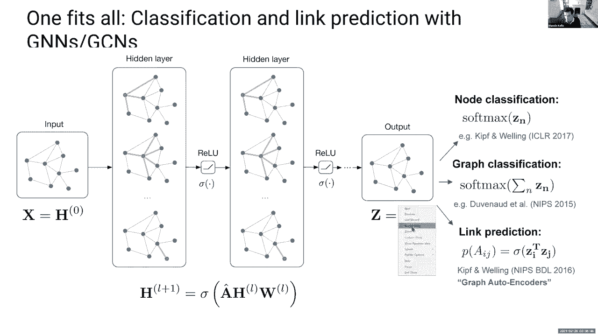

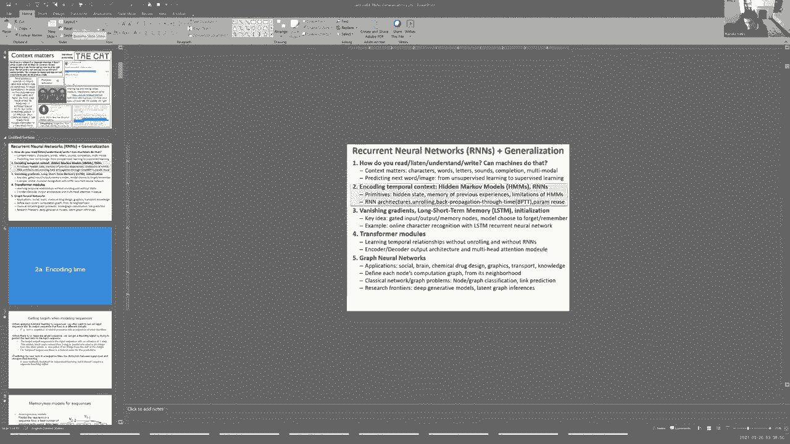

 Great。 Okay， so 35 35 24 6 0， we will， I guess， review all this in recitation。 But the main thing I。

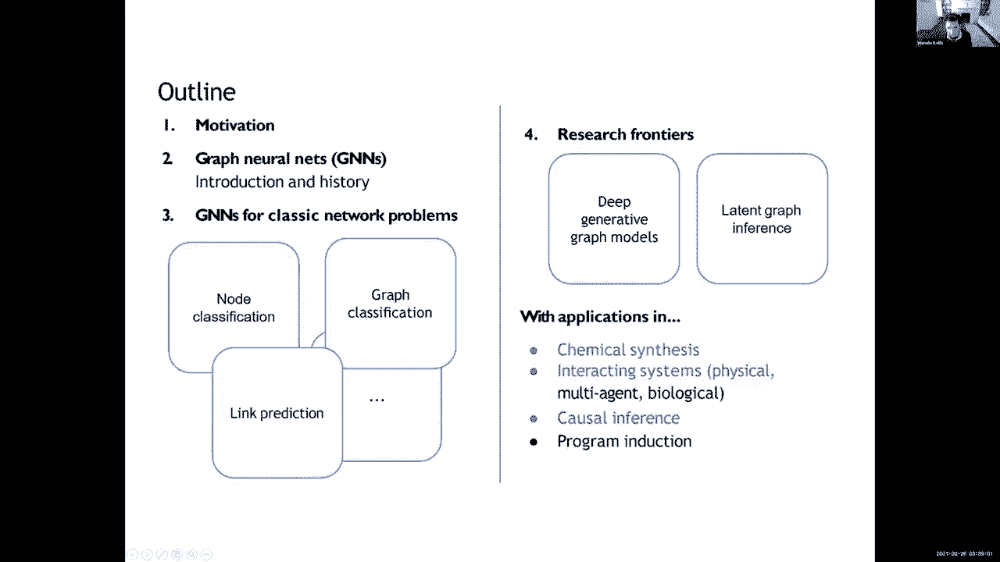

 want to do is to summarize what we learned about today。 So last time we talked about convolutional。

 networks， which was this concept of sharing the weights in a very hierarchical fashion to learn。

 higher and higher representations。 Today we talked about temporal models。 We saw the limitations of。

 hearing mark of models in the context of the state， epic interim code。

 And then we saw several different， types of recurrent neural network architectures that allow you to propagate information from a。

 temporal series through either hidden nodes or from the output of the previous one or from the。

 predicted target of the previous one and so on and so forth。 And we saw how we can actually do。

 back propagation through time by expanding this network and reusing the parameters。 Again。

 the key concept here is that we're reusing the parameters just like for convolutional networks。

 We were using the same filters throughout for recurrent neural networks。 We're using the same。

 filters throughout the same functions。 And then we saw this very cool long short-term memory module。

 that allows us to now decide when to remember something and when to forget something based on。

 the information from the network。 And then we saw this novel architecture for transformer modules。

 that allow you to learn these temporal relationships through this encoder， decoder， and attention。

 architecture combination。 And then we saw a very different way of connecting these networks。

 instead of going through time like for the recurrent neural networks or through abstraction layers。

 like for the convolutional neural network。 We basically can connect them in an arbitrary graph。

 and the concept of flowing information from the local neighbors of every node to infer。

 functions at the level of nodes or at the level of edges。

 And this is a very active area of research。 We're going to have a whole module of the class on graph neural networks。

 but I wanted you guys to， have at least some exposure early on because these are going to be very powerful for your projects。

 So we're going to come back to graph neural network when you start talking about protein， structure。

 about drug design and interactions， and about computing on regulatory networks and graphs。

 And I think we're going to have to have Neil back for the second half of his awesome lecture。

 So with that said， who feels that they've learned something overall？ So let's see。 [pause]， Lovely。

 Good。 Well， thank you all for sticking around over time。 Sorry that we ran a little over。

 but we will have plenty of general knowledge material throughout the course and in recitation。

 and also in the more advanced modules of the class。 So 79， 21， 0， 0， 0， 0。 All right。

 Thank you everyone and then see you tomorrow for the mentoring events and for the， recitation。

 So don't forget to sign up for which topics you would like to talk about。

 And now that you've seen how cool graph neural networks are， maybe we'll get a little more。

 you know， sign up for that。 All right。 Thank you so much， Neil。

 A big round of applause from everyone。 Let's see。 How do you do that reactions？ There you go。

 Awesome。 So congrats， Neil。 Thanks so much for a great lecture。 And then TAs， please stick around。

 and everyone else， thank you。 And Neil， please do stick around。

