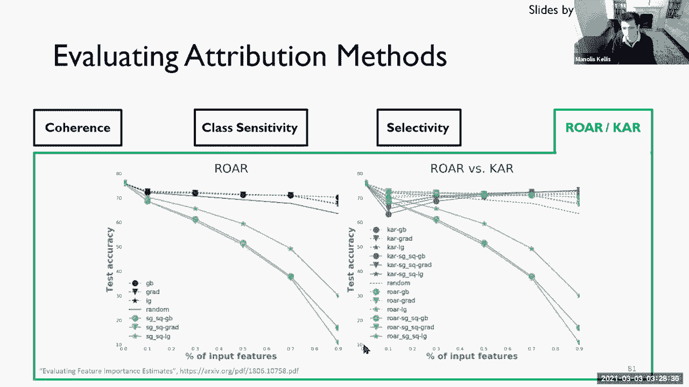

# P5：Lecture 05 - Interpretable Deep Learning - 爱可可-爱生活 - BV1wV411q7RE

所有的权利，欢迎大家，所以今天我们要讨论可解释的，呃，深度学习，大多数幻灯片都来自基督的贝苏金，他有一个美丽的演讲，从2019年，这里稍微修改了一下，所以我们基本上要看看。

我们一直在建造的这些漂亮的模型，嗯犯错误，或者他们怎么是对的，我们能解释他们实际学到的东西吗，所以我们先来看看可解释性的定义，我们如何将隐式神经网络信息转换为人类可解释的信息。

为什么可解释性对调试很重要，因为有了发现，要求作出解释的权利，当有人说，哦对不起，你不能有抵押贷款，我想知道为什么你不能有抵押贷款，我们将讨论反特殊和后特殊的解释方法。

所以解释的反特殊方法基本上是学习本身，以受约束的方式做，所以唯一可以解释的方式，解释的模型是可学的，post hoc基本上说得很好，我们要建立超级复杂的模型，然后我们要回去解释它们。

我们可以在不同的地方解释它们，然后我们将研究解释深度神经网络的不同方法，所以解释模型与决策，解释模型是宏观的，并专注于理解模型的内部，而解释决策是微观的，侧重于实际应用。

然后我们将具体地看解释模型的第一部分，四种不同的方法，所以重量可视化，构建近似黑匣子但可解释的代理模型，我们要看激活最大化，基本上是看哪里的激活最多，然后我们将研究基于示例的模型。

然后我们来看看解释决定的第二部分，以及基于示例的模型属性方法，那么为什么特定的梯度，吵吵闹闹，两种不同类型的梯度归因，平滑梯度和内部梯度，还有呃，基于后道具属性的不同方法，所以反褶积和引导反向传播。

然后呢，我们将研究如何评估不同的归因方法，通过一致性在质量上，所以属性是否突出，通过类别敏感性区分特征和感兴趣的对象，属性是否对特定的类标签敏感，然后我们要看看定量敏感性，通过删除具有高归因的特征。

观察阶级概率是否真的大幅下降，然后我们要看看，然后保持和再训练，所以我们期望如果有很低的类概率，因为没有看到特定的图像，删除像素再训练，然后使测量的精度应该会下降，所以让我们直接潜入，为什么可解释性。

那么什么是可解释性，所以当丽莎·多尔基本上和阿尔法戈比赛时，他有一条漂亮的线条，他基本上是在描述，你知道的，基本上是非人类的动作，然后他出来说哇，我花了，你知道人类花了成千上万个小时。

你知道几百年来下围棋，但我们根本没有得到它，所以机器基本上告诉我们游戏有更深层次的东西，alphago本身并没有透露游戏的深层含义，它只会压垮所有的人类玩家和所有的机器玩家，所以机器在学习一些东西。

但我们不能提取知识，从能够解释优于性能的深度学习方法，人类应该希望能给我们一些见解，为什么机器做得更好，有什么诀窍，我们可以从图像分类中学到什么见解，看自动驾驶汽车，我们想知道是否发生了事故，1。

汽车为什么向右转，或者为什么车没有坏，或者是什么解释，这样我们就可以将，你知道的，机器学习的故障，或者对条件，或向保险公司，或者是地图上的敌对特征，故意欺骗机器的，在诊断疾病时等等。

你不想出现在你医生的办公室，医生说，哦，把这些药吃了，你说，为什么，医生说，我也不知道。机器告诉我，所以你想知道的是，为什么机器会说为什么机器会对肿瘤进行特殊的分类，作为一个好斗的，你知道白血病。

比如说，然后呃，为什么呃，我们开的特殊药物，或者为什么诊断是这样的，你知道，为什么我说病人明天就会死，我们你知道，我们想知道，因为这实际上可以教会我们，第一名，今后如何做出更好的诊断，第二。

如何质疑这个病人的特定诊断，第三个，如何全面了解模型的特点，然后进行训练，你知道更好的特征选择或更好的分类器，或者甚至能够教人类如何通过机器翻译做出更好的预测，你想知道为什么我们的，你知道的。

以特定方式翻译的特定文本，等等，等等，所以可解释性是极其重要的，机器学习的典型方法是，你建立了一个巨大的数据集，你用一个巨大的模型扔出大量的计算能力，你不必太担心这些模型是如何以及为什么工作的。

你所关心的就是你能做分类，你可以做本地化，你可以做物体检测，你可以做分割，但在某个时候，你想知道这些是如何以及为什么工作的，因为所有这些不同的原因，所以我们想做的是从这些黑匣子中提取一些可解释的信息。

因此，这有助于验证模型是否按预期工作，所以因为错误的决定实际上会付出极其高昂的代价，你想让每架飞机停飞吗，你想不想，你知道的，停放每一辆自动驾驶汽车，当发生事故时，直到你弄清楚发生了什么。

还是想让模特说，好的，以下是我无法做出决定的具体条件，如果有混合分类，你希望能够归因于，数据或模型的特定特征，所以用标准的机器学习，你基本上有你的数据，你建立你的机器模型，然后你用一些。

你知道测试错误训练错误泛化错误等等，可解释的机器学习，您希望从您的机器学习模型中提取一些可解释性，然后能够由人类检查模型实际上在学习什么，然后通过数据或模型给出反馈，从对那些错误的解释。

从黑匣子模型内部发生的任何事情的检查，然后有一组经过验证的预测，所以基本上你在优化，不仅仅是泛化错误，也是为了人类的体验，这就是可解释的机器学习的全部内容，然后下一个目标是。

当然是为了深入了解什么是机器学习，呃，我不知道，呃，肿瘤的图像，我们可以，然后训练我们的医生识别，让人和机器一起工作，所以我们想了解物理，生物学上的，疾病的化学机制，这就是这门课的主要内容。

然后了解你知道的不仅仅是我们的大脑是如何运作的，但我们作为人类是如何做出决定的，当我们看图像的时候，所以我不知道你是否记得那些幻灯片，我们得到了很多评论，呃，与嗯，松饼对吉娃娃，然后百吉饼和，呃。

你知道吗，裹得严严实实的狗，嗯，很多人都说，哇哦，我正在通过看这些图像来了解我自己的大脑是如何运作的，所以了解更多关于，也许我们如何解决特定的复杂任务，然后呃，正如我前面提到的，解释的权利，比如说。

如果算法是以判别的方式训练的，例如，如果，你知道的，一个人的肤色在雇用决定中被考虑在内，他们父母的收入是首要因素，他们上的是什么学校，你希望能够废除这些偏见，你希望能够系统地与偏见作斗争，不幸的是。

这是所有训练集所固有的，经历了几十年的歧视和几个世纪的歧视，不仅仅是在美国，但在世界各地能够能够说，这就是为什么模型做出这些预测，让我们消除所有这些偏见，然后有一个清除这些偏见的算法，希望能超越，呃。

你知道的，训练数据集受到，所以再一次，U，欧盟有一般的数据保护，法国有一项数字共和国法案，他们的目标不仅是做出这些公正的决定，还能向每个人证明，谁是其中一项决定的主题，2。为什么做出这样的决定。

这就是解释的权利，所以说，在我走得更远之前，我要看看到目前为止谁和我在一起，看起来，可爱的权利，百分之九十，百分之十零零零零，这太棒了，好的，所以嗯，正如我前面提到的，两种类型的可解释性。

第一个可解释性是将可解释性构建到模型的设计中，从基本上选择可解释的模型开始，然后训练他们对他们达到的精度感到满意，所以决策树可以是，你知道的，我饿了吗，我有两个五美元吗，我去餐馆吗，购买汉堡包，去睡觉。

等等，所以如果模型有足够的表现力，那你就知道我们很好，因为这基本上让我们可以说，每次我做了一个决定，我通过我的决策树确切地知道，为什么做出这个决定，问题是这些决策树受到了荒谬的约束，完全没有力量的苔藓。

最，呃，你知道的，真实世界数据集，相比之下，深度学习有数以百万计的参数，所以我们不打算建立可解释的模型，首先，我们要做的是，是构建后的可解释性，所以基本上我们要建立这些复杂的模型。

然后在事实发生后开发特殊的解释技术，模特们实际上在做什么，所以一个是安提霍克，所以基本上在你看到任何数据之前，您基本上在模型中构建了互操作性，第二个是事后的，当你的模型被拉伸后，然后你说，哦，好的。

伟大，现在我有黑匣子了，让我弄清楚黑匣子里发生了什么，大家和我在一起，所以再一次，八十三四零零，所以我们有数以百万计的参数用于大多数深度学习模型，所以你知道这些一直在增加，两者都在你知道的空间复杂性中。

参数复杂度，训练复杂性，数据集要求，等，所以我们需要做的是找到真正解释这些的方法，我们可以分类，或至少根据其地方程度分级的特设可解释方法，所以一直到模型的顶部，我们可以问，模型学习的表示是什么。

那么基本上我如何识别边缘、眼睛和耳朵，你知道，轮子，嗯，一路向下，你可以问为什么一个特定的输入是这样分类的，对这种分类有贡献的像素是什么，然后在中间，你基本上可以问中间的表示。

最大限度地激活特定神经元的模式或图像是什么，基本上说哑铃，这些是激活函数，有点，我们将研究不同级别的后解释性，在这些决议的每一级，所以你可以把它们看作是模型级别的，我逼近的整个函数x是多少。

当我区分这些蓝点和绿点时，分类的边界是什么，比如说，在中级，你可以说，嗯，哪些特征是真实的，呃，蓝色输入，然后是分类的，因为我不知道，汽车，最后一个问题是为什么这辆车被这样分类，所有的权利。

所以我们基本上，定义可解释性，基本上是将隐式信息转换为人类可解释的信息，我们把可解释性的动机放在第一位，验证模型是否按预期工作，以便能够调试它，进行生物学发现，或者了解我们正在分类的特定类别的对象。

和作出解释的权利，然后我们把安提霍克，它们是训练可解释模型和可解释性的事后方法，它们专注于在已经建立的复杂模型之后解释它们，我们看到了局部性程度的梯度，所以让我们直接进去看看，呃。

构建可解释神经网络的方法有哪些，在模型级别和决策级别，所以再一次，我们将从模型级别查看整个梯度，一直到单个对象的决策，所以我们可以把它们大致归类为解释器模型，要么解释模型本身，要么解释决策。

然后决定可以基于任何一种归因方法基本上是说为什么，是什么特征导致了这个特定的决定或例子库，基本上解释了，导致某一特定决定的主要例子是什么，然后在模型这边，我们将研究如何分析表征本身。

如何从模型中生成数据，以及如何理解这些例子，所以说，在解释模型层面，我们称之为宏观的，因为它们观察的是整个类，你知道的，我们前面展示的决策边界，这些将是，你知道的，我们将研究不同的方法来做到这一点。

要么总结这个深度神经网络，用一个更简单的模型，比如说，决策树，然后不是接近世界的现实，但是模型的决定，所以模型大概是在学习一个报价，未引用，世界的清理版本或世界的模型版本，我们将近似这个模型。

而不是现实世界，我们将研究如何建立类别的原型示例，并找到最大限度地激活单个神经元的模式，在层次结构的不同级别，所以我们将寻求更好地理解模型的内部表示，使用这些宏观模型，然后对于显微镜，我们将问。

你知道实际上，为什么深度神经网络做出了这个特殊的决定，验证模型的行为确实符合我们的预期，然后找到支持特定决定的证据，所以我们将基本上使用这个两级层次结构，通过这两种类型的模型，好的，所以在第二层。

我们将研究表示分析，特别是权重可视化，以及建立代理模型等等好的，现在让我们来看看解释模型，所以基本上集中在模型的内部表示上，所以我们将研究四种类型的方法，第一名，我们如何分析表征。

所以基本上我们如何以图像格式可视化，我们深度神经网络的内权，我们如何使用可解释的模型来表示神经网络，我们所说的代理模型，然后我们如何理解最大化特定激活单元的输入。

那么我们如何通过这种激活最大化方法生成数据，然后我们如何专注于在这些决定中最重要的特定例子，所以我们又回到了解释模型的部分，然后我们将转向解释决定，现在我们潜入代理，基于迷宫的数据生成和示例。

然后表示将被内置到，分为广泛的可视化方法和代理模型方法，看看从图像中提取的特征是什么，当我得知这是一辆车，这是一个，这是极有见地的，这是一个，你知道的，真正改变了深度学习领域。

因为它能够在报价中查看峰值，一种深度学习方法的大脑，所以嗯，如果你还记得从，呃，卷积神经网络讲座，我区分了模型的左半部分和右半部分，左半部分是所有这些卷曲层，我称之为左半表示学习，然后右半部分只是分类。

基本上现在我们已经从这些特征中提取了这些层次的特征，我们正在决定是汽车还是马，或者一个人，或者飞机，等等，好的，所以说，我们想知道这些深度学习模型是如何做出这些推断的，他们的内部陈述是什么。

这就是非常有洞察力的地方，基本上意识到，如果我拿单个神经元，我向后投射到图像上，这些神经元正在学习的特征是什么，那么你所看到的是非常有洞察力的，它基本上告诉你，的确，就像嘿的动机一样，让我们告诉你。

弄清楚动物视觉皮层是如何工作的，观察猫或猴子的大脑内部，然后了解单个神经元是如何放电的，当我给猫看一条面向这边的边，或者这样，我们在五六十年代就能理解，那个，事实上，特定的方向导致反应，在特定的神经元。

这就是你在这里看到的，当这样有边缘时，这些神经元就会发射，这些是发射的神经元，当那边有一条边的时候，以此类推，还有其他神经元发射，当有，你知道的，从一种颜色到另一种颜色的圆圈或渐变，我是说。

这是极有见地的，你知道，相当惊人，那个，的确，的，视觉系统和人工卷积神经网络是纯粹学习的，你知道的，没有硬编码的从零开始，这些特性中的任何一个都是，事实上，识别人类可以解释的原语，好的。

所以我希望我不是这里唯一兴奋的人，但是呃，让我们看看，呃，他对往里面看很兴奋，那个呃，神经网络的大脑，好的，太厉害了，我不是这里唯一兴奋的人，所以六十三二六七零四，我有一个哈欠，这是伟大的，嗯好吧。

所以嗯，我们基本上可以在卷积神经网络中可视化过滤器，我们可以理解CNN了解到的各种特征，但问题是他们还有很长的路要走，过滤器太多，我们有五百万个参数，我们有，你知道成千上万的内部节点，所以你知道。

我们不想去想象每一个来理解，为什么当我看到一辆车的时候我看到了一辆车，所以我们能做的就是开始潜得更深一点，基本上是在寻找不同的方法来提取关于特定决策的更多信息，例如。

我们可以用一个更简单的模型来总结深度神经网络，例如，我可以使用决策树，或者我可以用线性模型，或者一个图表，基本上决定了，也许我的意思是，对不起，不是，也许，但肯定没有模型的准确性，而是更直接解释的东西。

所以这些在不同的论文中被称为元模型或近似模型，或响应响应面模型或模拟器，但是，关键思想是我们要训练一个可解释的机器学习模型，在我们的黑匣子模型的输出上，有一个特定的目标来解释它，这不会是确切的。

但会很接近，希望和可解释的，当然，所以我们决定用一个更简单的模型来近似，不是现实世界，不是真实的现实世界，但是预测，同样，这是模型不可知论的，我的黑匣子是什么做的并不重要，我将使用一个简单的模型。

它既独立于原始世界，并且与黑匣子的实际工作方式无关，仅仅基于它的输出，好的，到目前为止谁和我在一起，我们在这里要做的，所以让我们看看，嗯，哎呀，所以我们要做的是在输出上训练一个模型，不在输入上。

但是在我们黑匣子模型的输出上，然后试图理解如何使用这个并行模型做出决策，这告诉我们，哦，嗯，它在这里，似乎这些是正在做出的特定决定，好的，所以我们是五十四，一个，十零，零，好的，那是代孕模特。

也许到目前为止最令人兴奋的是这种激活最大化，所以我们将生成数据，但几乎与我们的模型相反，所以我们要找到模式，最大限度地激活特定的神经元，好的，所以说，如果我是，你知道，试图在这里对一种特定的鸟进行分类。

然后我可以说好，嗯，你知道的，的，基于这些类型的图像，好的，所以我们要研究的是如何最大化，在所有可能的输入中，它最大化为该特定类别生成特定权重的概率，所以基本上那个班的重量，给定我的参数将被输入最大化。

好的，那么在这件事上谁和我在一起，所以呃，我们在所有可能的输入参数上最大化，使类条件最大化的参数，该类的后验概率，好的，所以和我在方程左边的人，所以我在所有的输入中寻找最大化该类的输入。

基本上说鹅在这里是最大的，好的，现在是33 6 2 5 11 0在右边，这是嗯，我们要做这个最大化的约束，所以我们将使用一个正规化术语，这基本上会告诉我们，我不想选择任何可能的输入。

但我想选择真正有意义的输入，因为基本上当我看到这个的时候，我对这个鹅的模型不太感兴趣，而是，我想看到的是对人的眼睛来说，像一只鹅，这就是正规化术语的用武之地，好的，所以如果我只基于类概率最大化。

我会得到没有多大意义的图像，但是如果我最大化地使用这个额外的正则化术语，然后我可以将输出限制为，你知道的，人类可解释的，这就是卷积的作用，这就是反向运行卷积模型的地方，你知道会发挥作用还没有，但很快。

但基本上我们要找的是一个X星，它使这个类最大化，在0和9之间的哪个数字之间，我识别哪个字符的概率，你知道我想认出数字三，然后这个是，你知道的，在该约束内实际上可解释的一个特性，所以我们想最大化x。

最大化类后验概率，但在这个X实际上是人类可解释的限制下，所以如果我们基本上迭代这个搜索，对于类的最大化和正则化，它基本上告诉我们，你知道的，确保这尽可能接近实际输入，或者成为，你知道的，人类可解释的类。

我们会看到更多这样的事情，当我们开始考虑潜在变量和潜在参数时，基本上可能告诉我们是三个倾斜的方向，向那个方向倾斜，拉伸，等，所以我们实际上可以有中间潜在参数。

这种参数参数化了我通常会得到的这个嘈杂的向量，所以这是最初的解决方案，然后呃，你可以看到它很模糊，所有的角色基本上都是你知道的，只是，你知道，非常凌乱，经过大量的训练，你开始看到零，一个，两个，三个。

四，五个，六，七，八，九种解决方案，但同样，这些不是很漂亮，这些仍然是所有可能的激活函数的覆盖，将一个字符与所有其他字符区分开来，所以它们不是很有用，同样，你知道，鹅对鸵鸟的表现又不是很有用。

所以我们需要做的是，重新定义我们的优化问题以包括附加约束，所以再一次，此数据生成框中的激活最大化为给定类构建典型模式，比如说，喙和腿，目标是图像中不存在无关的背景对象，但缺点是。

我们得到的并不真的像这些与类相关的模式，它实际上降低了给定类的解释质量，通过看到字符的叠加对机器来说很有意义，但对人类来说没有多大意义，所以我们要做的是，而是强制生成的数据x星。

最大化该函数以更紧密地匹配数据，而不是找到使类概率最大化的输入模式，我们将为给定的类找到最有可能的输入模式，所以这是非常不同的，而不是搜索，在数据集的训练集中根本没有发生。

因为没有人拍过这样的照片也没有人写过这样的人物，我们基本上会要求该类最有可能的输入模式，然后最有可能的是这里的钥匙，所以我们现在要寻找的不仅仅是，最大，所以基本上和我在一起的人中最大的一个。

关于…的微妙之处，我们不只是在寻找任何一种人工建筑，一组像素的，但我们要找的是一个真正的，手写字符，可能是由进入的人类之一生成的，呃输入，好的，所以呃，四十四十二十零，那太好了。

而不是找到可能在这里某个地方的输入模式，在这里的某个地方，最大限度地提高了分类的区别，而是，我们要找一个X星，在用户可能输入的输入中，为给定类查找最有可能的输入模式，所以这就是这个约束的来源，因此。

与其单独最大化这一点，基本上可以给我们任何地方的任何东西，我们基本上是在阶级世代的空间内最大化事情，好的，所以再一次，我们可以看看激活最大化，一些原始的约束，或者在可能的输入空间内激活最大化。

然后这些技术需要一个无监督的数据模型，要么是一个密度模型，它基本上告诉我们哪里的数据最密集，所以某种，你知道的，特征密度分布基本上告诉我们我们要做，我们将从可能的输入范围内取样，而不是你知道这里的路。

或者不需要完整数据分布的生成器函数，但是能够从该分布中取样，而不必显式地表示整个分布，好的，所以这将是我们将要使用的两种技术，如果你现在看，最大限度地激活特定节点的原始字符集，他们完全没有保险。

所以这只是一个简单的激活最大化，你把它初始化为平均值，然后你可以看看这个的多个进展，其中可以初始化为类意味着，然后突然间这就更容易解释了，因为你现在，来自该分布中，所以基本上在分布的平均值内。

通过显式建模该分布，或者从该分布的概率密度函数中取样，即使没有显式建模，所以这是一个非常简单的，am，这是观察激活密度最大化，所以基本上你初始化到类意味着，但你在用全密度函数。

然后你基本上可以建立一个生成模型，生成单个角色，通过从平均值中取样，和，您可以看到将这个模型连接到数据是如何导致更清晰的可视化的，好的，所以与其看这样的东西，我们基本上有，你知道的，你可以看到薄荷旁边。

你可以看到口红，然后呃，你知道特定的鸟类或甲虫等等这些并不完全是图像，这些不是很自然的图像，但他们是，强制您的表示在代码空间中，而不是你知道任何可能来自外面的东西，好的，到目前为止谁和我在一起。

这种无约束激活最大化的区别，这种受限的激活最大化，更一般地，他的激活最大化和数据生成，从模型回到图像，最大限度地产生特定的特征，嗯，在这里可能会有帮助好吧，所以我们在四十四十二十零，所有权利。

所以我们研究了建立可解释模型的多种方法，查看模型的内部，所以我们看了体重可视化，我们研究了建立代理模型，嗯那个，你知道吗，特定输出，我们研究了激活最大化，在从输入分布采样的约束下。

现在我们将转向基于示例的，所以基本上解释这些模型，我们能做的就是找到表示或不表示图像类的图像实例，所以我们可以看看最大均值差异和一个叫做mmd批评的方法，它实际上是在麻省理工学院开发的。

并于2016年在NIPS上展示，基本上对最近的原型进行正面或负面的分类，所以基本上当你看数字的时候，你基本上可以说，嗯，以下是未遂事件，这又是一件事，帕特里克·昆森一直在谈论，我如何学习拱门的概念。

好吧，我想接近错过，什么不是拱门，这是信息丰富的，这就是机器学习社区正在做的事情，在寻找这些未遂事件时，你知道的，但接近特定的输入，所以所有这些基本上都可以教模型如何改进，你可以了解它犯了什么错误。

它为什么会犯这些错误，通过给它喂那些批评，然后你可以改进模型使其更好，比如说，在对两个犬种进行分类时，你想找到最接近那个品种的狗，不是，繁殖到基本上，然后识别出那个品种的显著特征。

将它与未遂事件区分开来，如果你看看，你知道，狗的错误分类，你想说，嗯，为什么它被错误地分类了，通常这些是穿着戏服的狗，然后那些批评，这些错误的分类基本上可以再次告诉你，我为什么要犯这些错误。

你知道更好的，改进还是不改进模型，你可以在这里看到基于原型的数量，你知道的不同方法，减少他们的误差，基于，你知道的，这种最大均值差异方法的特定全局或局部特征，好的，所以这个，你知道的，我们基本上看了。

直接可视化神经网络不同层的权重，我们研究了建立代理模型，这些模型可能没有那么准确，但更容易解释，我们研究了如何看待激活最大化，在某种程度上生成信息最丰富的功能，然后最后。

我们如何为原型图像和原型批评选择特定的例子，哪些是区分特定类别的最有信息的，好的，所以呃，让我们看看，谁在整个部分和我在一起，所以说，所有的权利，所以四十四，六，十五，零，零，然后再进行一次投票，嗯。

他们觉得自己学到了一些东西，好的，所以呃，我们在五点五，四一零，然后是唯一一个让我留在他身上的人，没有，我真不明白教授为什么这么兴奋，一直到底部，所以民意调查是匿名的，3。我永远也猜不出你是谁。

但要保持诚实，这太棒了，我需要这个哈哈哈哈，好的，呃很好，所以呃，回到我们的轮廓，我们看到了为什么可解释性如此重要，我们首先看到了解释的模型方面，我们在看宏观的，理解模型的内部。

然后我们看到了四种不同的方法，权重可视化，代理模型，激活最大化与基于示例，我们不打算转向第二部分，从微观上看…的实际应用，为什么一个特定的决定，我们将再次，通过四种不同的方式来解释模型所做的决策。

我们将以示例为基础，我们将研究主动归因方法，为什么一个特定的渐变，吵吵闹闹，我们将研究基于梯度的归因，具有平滑的渐变或内部渐变，然后用卷积和引导的反向传播进行基于反向道具的归因，所有的权利。

所以现在看看模型级解释的局限性，所以基本上你知道挑战，当然是什么将是最好的形象来解释类摩托车，所以我们，你知道的，研究了产生不仅仅是一种叠加混乱的方法，而是从输入分布中采样，但是挑战，当然是输入分布是。

你知道的，极其多样化，你知道，这些中的任何一个可能会被不同的人喜欢，比如说，在摩托车爱好者中，可能会认为这实际上是最触发摩托车对他们来说的事情，因为他们习惯了开车，你知道，不同的人可能更愿意接受不同的。

班上最好的代表，但我认为他们几乎都有同样的代表性，所以总结一个概念或一个范畴，像摩托车一样复杂的图像是极其困难的，并很好地解释了什么是模型学习，当它学习的时候，你知道的，摩托车将与概念的多样性一样大。

它试图解释，所以基本上当我们通过多层深度神经网络学习时，摩托车的概念，我不知道，二十，我们想知道，那类的所有不同例子是什么，我们将要问的问题，通过这个模型解释没有很好地回答的问题是，我们如何找到原型。

基本上摩托车通常是什么样子的，你知道的，经历这一切来决定是摩托车还是摩托车，什么是，你知道吗，典型的，第二个挑战是我们如何证明我们的决定是合理的，为什么这个特殊的例子被归类为摩托车。

那么在我们的许多人中，很多层导致了那个例子，被，你知道的，摩托车，那么我们能证明这些决定是合理的吗，这就是解释决定的意义所在，所以说，呃，基本上我们如何将这些决定归因于，梯度或反向传播或特定示例。

我们将研究解释决策的四种方式，深度学习模型正在制造，第一个将是基于示例的，然后我们来看看归因方法，那么为什么梯度是嘈杂的，比如说，基于梯度的归因方法和基于后道具的归因方法，所以让我们潜入。

所以基本上基于实例的是询问哪个训练实例对决策影响最大，所以如果我把这归类为，然后我想浏览一下我所有的训练图像，然后说这些图像中哪一个对这个决定影响最大，你知道，也许向日葵的图像对课堂贡献不大。

给有学问的班级，但是这个图像，事实证明，它作为一个训练例子对学习的重量做出了很大的贡献，当最终在这里对这张图像进行分类时，向日葵，好的，所以它不会告诉你这张图像的哪些特征是重要的，把它归类为向日葵。

它告诉你训练集中的输入图像，事实上信息最丰富的地方，所以它也没有特别突出，这些图像的哪些特征是最重要的，这些是解释这些黑盒方法的影响函数，所以他们，你知道吗，基本上研究这些神经网络模型解释的脆弱性可以。

你知道吗，通过这些例子非常有帮助，基本上说，好的，嗯，我不能告诉你我是怎么学会向日葵的，但我可以告诉你哪些图像促成了向日葵的这种特殊分类，这非常重要，因为你基本上可以说好，你知道的，如果我把狗归类为羊。

我可以回去说，嗯，这是你称之为狗的图像我用它来归类为绵羊，所以它基本上告诉你最近的图像，不基于像素接近度，但基于对某一特定图像分类的影响，好的，让我们看看到目前为止谁和我在这个概念上是一致的。

所以基本上我们不是在问，这张图像的像素是什么让我分类，但我们要求在你们庞大的训练队伍中，是什么图像影响了你对图像的决定，呃，最没事，所以四个，三个，五个，七，零，零，嗯好吧，所以这是基于示例的。

所以它基本上是回到你的输入训练集的单个例子，我们在指导一个特定的决定，好的，所以这很像法律上的，你基本上你知道，所以最高法院会说，根据1956年对州的决定，你知道我们假设你知道，这现在指导着我们的决定。

嗯，你知道吗，呃，我们不能的判决，你知道，给这个人定罪之类的，所以这是你知道的同样的事情，但现在通过神经网络的训练示例，所有的权利，所以这是基于示例的，第二个是研究归因方法，所以给出一个图像和一个决定。

这是一个基于这些激活像素的三，这里，问题是，我们可以分配给每个像素，一直到xn，属性值，这基本上告诉我们，你知道的，那个特定的像素对调用这个特定字符的决定有多大影响，一个三，好的。

所以这与我们的深度卷积神经网络正交，所以基本上对于任何深度神经网络，你有某种功能，然后我们想推断的是一个归因分数，这给了我们每一个，呃像素，该像素对输入图像分类的贡献是多少，好的，因此。

您可以直接在图像上可视化这些属性，你基本上可以说好，对于图像的每个像素，我有分数，所以我为什么不直接想象那个分数，你可以看到这里的结点，具体在这三个方面是，事实上。

决定将这张照片归类为三张照片的最强贡献者，它没有告诉我三是什么样子，但它告诉我这个特殊的图像，我为什么把它归类为三，例如，你知道当自动驾驶汽车撞上一棵树时，你基本上可以说好，你为什么决定。

你可以回去说好，这些是我的图像或视频流中的像素，这基本上让我决定你知道，右转是该元素的正确类，所以基本上我们要看，这个特定图像的这些单独像素是如何，对于负责做出决定的特定阶层来说。

所以我们基本上是通过函数来传递这个，然后从函数向后工作，基本上说，最多的像素是什么，呃，为此提供信息，因此，您可以将这些属性可视化为，你知道吗，五乘五像素的图像，或者在更复杂的图像中，例如。

如果你的标签是你知道守卫或蛇，那么你基本上可以说我的投入有哪些方面，其中信息最丰富的，现在你可以看到不同的，呃，基于梯度的方法和排序，做出这个特定决定的像素是什么，这是非常丰富的信息。

这也是目标是可解释的机器学习，所以目标是说好，我的形象的哪个方面导致了把它归类为蛇的决定，或者在，你知道下雨，等等，然后你可以看到像素实际上是如何集中在这条蛇周围的，但不仅仅是蛇本身。

所以有一些功能基本上说得很好，原来背景，蛇通常被黑暗的东西包围，事实上对做出它是蛇的决定是有信息的等等，等等，好的，所以这是非常翔实的，因为它基本上告诉我们，并不总是蛇本身的像素。

但也是周围的图像促成了这种分类，所以我们基本上可以用这个来建立一个显著性图，基本上告诉我们，图像中最突出的像素是什么，这样你就可以有一个基线属性，显著性图，它基本上告诉你分类函数决定的梯度。

该特定图像相对于给定输入图像x的，所以你基本上可以用梯度来计算显著性，相对于这个函数的x，它基本上是这个函数相对于特定图像的偏导数，所以我们可以计算出显著性，基于我们为反向传播开发的完全相同的方法。

基本上当我们在训练我们的深度学习模型时，我们在更新重量，我们正在进行完全相同的数学计算，求相对于权重的导数，但现在我们求导，相对于该特定图像的像素，所以我们现在计算显著性图，使用完全相同的传播。

但不是相对于权重的导数，我们现在看的是相对于像素的导数，好的，那么到目前为止谁和我在一起，关于我们在显著性上所做的，我们现在基本上要问，我是如何通过观察每个像素来将某物归类为蛇的。

以及对这一分类有多大贡献，通过分类函数f将梯度带回来，然后将其归因于图像的单个像素，然后通过这个函数将这些像素可视化为热图，所有的权利，所以三六五十四零零，太棒了，嗯，所以这是第一次尝试。

所以基本上我们可以看到，哦太好了，有什么东西围绕着那台机器，有什么东西围绕着这些，你知道的，狒狒和这些水牛周围的东西，还有这个寺庙等等，这基本上引导我们做出我们正在做的特定决定。

但问题是这些显著性图非常嘈杂，你可以看到那里，你知道吗，到处都是分散的像素，它不会告诉你，嗯，嘿，这是确切的轮廓，我希望水牛看起来像，所以它们只与感兴趣的对象大致相关。

所以问题是我们如何真正改进这些显著性图，为什么这些显著性地图如此嘈杂，事实上，第二个问题将指导第一个问题，即我们将假设不同的原因，为什么他们会这么吵，然后开发方法来依次解决这些原因中的每一个，好的。

所以现在让我们试着理解，为什么这些地图这么吵，所以第一个假设是显著性图确实是真实的，随机分散在图像上的某些像素实际上是，网络如何做出决定的核心，噪音实际上很重要，当我在塞伦盖蒂给一只瞪羚分类时。

瞪羚像素在我的分类中和事实一样重要，我通常在塞伦盖蒂看到瞪羚，所以也许我的眼睛，当他们决定将这只瞪羚分类时，作为瞪羚实际上是被引导的，不仅仅是瞪羚本身的像素，也是通过周围的像素，有点像我们之前看到的。

这里实际上被高亮显示的像素是，事实上，那条蛇周围的暗像素，这可能是因为我们通常在黑暗的地方看到蛇，或者在明暗的地方，暗示他们在隐藏，这可能是其中的一部分，呃，激活，这是第一个假设，嗯，还有第二种假设。

也就是说，梯度可能只是不连续的，我们的深度神经网络实际上使用分段线性函数，如relu，你知道的，整流线性单元，最大池，等，基本上，你知道，渐变是，事实上，你知道，到处都是零，呃，你知道的，所以基本上。

如果你看relu函数，以及我是如何通过relu函数获得梯度的，它被纠正了，线性单位在整个负空间中处处导数为零，所以很难平稳地穿过这个空间，所以说，你知道吗，可能挑战在于梯度实际上是不连续的。

这些激活和最大池，基本上是在说好，我要最大限度地利用任何激活的东西，在图像的整个部分，其实不利于这些平滑的梯度学习，以及一切看起来如此嘈杂的原因，是因为我不能很可靠地弄清楚。

在空间中找出一个非常干净的渐变，基本上可能是重要分数的突然跳跃，呃是由于输入的无限小的变化，都是，基本上你知道跳上跳下，所以如果你看看神经网络的层，你知道三层，功能可以有些平滑。

我正在学习的功能可以有点流畅，和学习，这些梯度实际上可能是可行的，但随着我添加越来越多的层，那么对某物是否是瞪羚的射击是极其不连续的，它基本上是以极快的速度上下跳跃，基于输入的细微变化，所以你。

你们可能都听说过这些对抗性的例子，在那里我可以修改瞪羚图像的像素，以人眼看不到的方式，但我们会把这只瞪羚归类为，我不认识德国坦克，然后呃，你知道这和那个有关，从某种意义上说，这不是一个光滑的函数。

主要是因为有这么多不同的层，我可以通过选择一个局部最小值来欺骗分类函数，有点，你知道的，向下移动像素来进行错误分类，所以第二个假设，也许我们的梯度实际上是不连续的，而且噪音很大，因为层数很多。

因为这些不容易，你知道的，不能轻易求导的函数的可导函数，所以让我们看看谁在这个概念上支持我，关于梯度的不连续性，以及分段线性函数是如何促成这一点的，通过我们神经网络的许多层，太棒了44，四十五四，零。

好的，第三个假设是，也许我们的功能实际上饱和了，也许一个特定的特征可能会对全球产生强烈的影响，但在局部有一个小的导数，因为你知道这个特殊的功能在这里有大部分的激活，导数不能完全捕捉到这一点，呃方面。

所以基本上你知道，这个函数已经最大限度地激发了，它不能再高了，所以我你知道我在这里已经饱和了，我不能，嗯，你知道吗，在这一点上学习任何更流畅的东西，好的，这是我们将要研究的三个假设。

然后用这些假设我们会说，我们如何实际改进显著性图，那么我们怎样才能基本上改进这个相对于输入的偏导数呢，所以我们将研究修改这个函数的不同方法，基本上确保结果不那么烦人。

所以一种可能是实际上添加噪声来扰动输入到其他输入，然后在一些摄动的，布景，有一些方法实际上是取扰动集的平均值，所以不只是做一个扰动x星，我们基本上做多个扰动，所以我把我原来的图像，我用很多方式扰乱它。

在此基础上我会试着平滑这个梯度，通过不看一个特定的图像，但是通过观察这个特定图像附近的一组图像，然后问好，也许在这个特殊的例子中，这样激活函数就有噪声了，在另一个例子中，它会以另一种方式发出噪音。

在另一种情况下，它会以另一种方式发出噪音，但如果我取多个激活的平均值，那么它们可能会会聚在实际的像素上，似乎定义了，不如我们休息一下，所以呃，杰基，你上次做得很好，你介意带头做伸展运动吗？是啊，是啊。

你让我从我的所有权利，所以我们回来了，现在让我们看看这些不同的方法是如何执行的，所以基本上增加一些噪音，或者修改反向传播算法，以便能够更好地捕捉更平滑的梯度，好的，所以基本上又是，我们这里有三个假设。

其中属性方法为每个输入像素分配属性分数，我们可以基于基线构建一些显著性图，归因方法最终非常嘈杂，我们有三个假设，一个是真的，所有这些像素的贡献都是相等的，和瞪羚身上的像素一样多。

第二个是梯度可能是不连续的，或者功能饱和，然后我们要看看我们要改变的解决方案，无论是渐变还是后面的道具，或者包含带有一些额外噪声的多个图像来绕过这些挑战，还有许多其他的归因方法，我们不会去看。

所以其中一个是，你知道渐变星时间输入，所以基本上如果你有渐变，你有这个非常嘈杂的功能，但是如果你把梯度乘以输入，你最终会有一个更干净的表示，你也可以把渐变，你可以在那里读到，你能做分层相关性传播吗。

所以你可以基本上而不是只看整个图像的相关性，你基本上可以在多个层面上查看相关性，你可以用泰勒，分解，深度提升是我们实际上要回到的东西，当我们开始看这些，序列中的um调控基序，然后还有图案。

网络和模式属性，您可以在这里阅读，所以现在让我们来看看这些，呃，实际平滑渐变的方法，好的，所以基于假设二，即梯度是不连续的，我们可以试着把渐变弄平，所以我们基本上可以定义一个光滑梯度函数。

而是看许多的积分，许多不同的样品，所以基本上这是这些随机的小扰动，然后看这些小扰动的平均值，然后这个想法是你知道，即使我们的渐变非常，嗯，通过平滑这个函数，我们实际上要平滑梯度回到。

好像这是一个浅层的网络而不是一个非常深的网络，好的，那么谁同意我的这个特殊想法，然后积分所有这些扰动，有效地产生了你知道的效果，在许多例子中上下移动，并最终导致更平滑的功能，太厉害了，所以呃。

五二三三五，零，零，所有的权利，所以确实，当你开始添加一些噪音，基本上如果噪音水平为零，你基本上可以看到激活确实在全身发生，你就像没事一样，嗯，伟大，那个，这可能是因为你知道草和你知道的一样有信息。

我们在这里看到的特定GNU，但是也许但是通过增加噪音，你可以看到在许多不同的，我的形象稍微不安的版本，我基本上可以看到角总是得到，你知道吗，嗯，并不总是，但比背景更频繁地被分类，如你所知。

或添加到该分类中，你可以在这里看到，即使有20%的噪音，你可以看到以前非常扩散的信号，现在开始积累在那个特定的图像上，这是非常令人兴奋的，它基本上说随机噪声扰动，这不是对抗性噪音，这是随机噪声。

仍然导致相同的分类，并在许多方面证明了该模型的稳健性，但他们也证明了我们所学到的，通过我们的表现，通过许多不同的表示层学习是，事实上，GNU的概念，它非常可靠，对这些扰动非常鲁棒，事实上。

对于任何一个图像，是呀，当然很吵，但是做出正确的分类，但在许多稍微扰动的图像版本中，你可以看到它利用的突出特性是，事实上，反复地落到动物本身，基本上你知道，周围的都是。

仅仅是因为一张图像基本上导致了这种嘈杂的渐变，相对于一个特定图像的DX，但是那个嘈杂的渐变，它在这里被可视化为嘈杂的，因为像素到处都是，其实就是，通过添加图像的随机波动来平滑到实际图像中。

并通过附加噪声对其进行采样，嗯好吧，所以呃，让我们看看谁觉得他们在这里学到了东西，所以呃，向上，所以我们有，呃，百分之六十一五岁，四岁时36%，零零，然后那个，我还是不明白教授为什么这么兴奋，哈哈哈哈。

坚持住，坚持住，保持坚强，别让我影响你对这里的材料感到兴奋，这是第二个假设，那么事实上，梯度与任何一个特定的图像都是不连续的，但通过对围绕它的多张图像进行采样，我们实际上会得到一个更平滑的渐变，事实上。

这个假设似乎是正确的，第二个对不起，第三个假设是，这个函数实际上饱和了，基本上，你知道的，这里的x只是，你知道的，超过最大可能的激活，我只能对一只鹿如此兴奋，在那之后，我只是，你知道的，别再弄了。

我不知道，嗯，看到鹿的兴奋，所以我们可以做的是缩小x，而不是饱和在反应曲线之外，我们基本上可以通过缩放它来把它带回来，但简单地说，你知道，嗯，我们缩放图像，使其不饱和，基本上把x带回到更接近，你知道的。

职能分配，所以与其有像鹿一样的东西，我们可以减少这些活动，呃，拉近它的距离，这就是内部渐变的作用，基本上是在说，而不是有极端，我要把它拉近一点，到我的曲线仍然可以积分的地方，你知道离视线更近的地方。

在饱和点之前，然后你基本上可以看到通过改变这个渐变，通过用某种渐变的缩小版本来获得缩放版本，当我把它缩放到零点零二，零点零四，三点零六，等等，我基本上可以你知道的那种，如果我不缩放它，我说好。

导致相机捕获的激活是什么，那么你知道这是不太容易解释的，而是把它带得更远更远，甚至喜欢最初激活的百分之二，然后显著的特征开始出现，你知道，也许你会说这是最好的，也可能这是最好的，等等，等等。

但你可以清楚地看到，嗯，你知道，也许是从这种饱和中带回来的，呃，空间，好的，那么在这个概念上谁和我在一起，所以基本上第二个，你知道的，第三种假设是梯度实际上是饱和的，一种方法是将图像缩放回。

它们仍然可以被解释为这样的空间，然后通过重新缩放图像的像素来不那么极端，你把图像带回了，所有的权利，所以呃，2 2 5 2 20然后是4和4，我想我们得在局里复习一下，所有的权利，所以呃。

我们现在讨论的是解释这些决定，我们研究了这些基于梯度的方法，这些基本上平滑梯度或采取内部梯度，现在让我们来看看基于后道具的方法，我们可以看到不仅仅是卷积神经网络，但实际上反卷神经网络。

所以基本上逆转了这些卷积滤波器的操作，然后也引导反向传播，所以再一次，这里的挑战是通过相位整流线性单元进行反向传播，基本上意味着我们的导数在整个过程中为零，一大块空间，所以当我们向前传球的时候。

我们将能够把这些归零值，突然间你知道不是很有用，所以基本上这就是Relu正在做的，这个整流的线性单元，基本上是清零所有低于我们激活阈值的功能，然后简单地返回激活阈值以上的输入函数，好的。

然后你知道它的表示是这样的，但挑战是，当然在后面，你知道吗，在向后传递中，向后传播基本上是你知道的，不再能够恢复这些零，所有这些渐变都不起作用了，所以卷积神经网络所做的是。

通过重构图像将特征模式映射到输入空间，然后获得有效的特征重建，他们再次通过Relus传递重建的信号，然后他们通过消除负梯度来消除噪音，所以在向前传球时你会失去你的梯度，在向后传球时。

你知道不能再通过它来区分来生成你的图像，但是用解卷的方法，你基本上也在强迫你的渐变以相反的方式工作，所以与其拿，你知道的，只向前看，你现在也开始把Relu带向相反的方向，这实际上是在消除负渐变。

只保持正梯度，这实际上允许你有效地构建代表原始图像的图像，所以你现在可以把这个，具有反向传播的卷积神经网络，去掉负梯度，然后再次考虑对这些图像的前向激活，所以基本上在向前传球，你基本上有。

你知道这个归零的relu，后传的，你有这个反向传播，你知道的，从这些梯度向后移动，然后用呃，反褶积，你把所有的负渐变都归零了，然后用引导反向传播，你把从前进通道收集到的信息结合在一起。

我应该在哪里清零我的输入，然后相应地引导反向传播以消除负梯度，然后考虑这些向前激活，所以如果你看看反向传播，你基本上有，你知道是什么让我决定这是一只猫，你有这个显著性激活图，基本上是在说，哦好吧。

在整个图像的某个地方，光是反褶积就有一些东西，你基本上是在生成最，最强烈地引发了猫的概念，因此，通过卷积滤波器向后生成图像，通过使用这个引导后支撑它结合了向前传球的方式，梯度反向传播。

你实际上是在引导反向传播，特别是对激活最强的特性，好的，所以再一次，我们要复习那些，呃，在明天的朗诵中，现在让我们看看如何实际评估这些归因方法，所以基本上，我们要看看，评价这些属性的定性和定量方法。

所以你知道，回顾一下我们所拥有的是一个深度神经网络，这是对一个特定的类做出预测，然后我们问，负责这种特定分类的输入的特征是什么，所以现在我们看到了一个，我们将研究既是定性的评估方法。

基于连贯性和阶级敏感性，以及基于选择性的定量，然后呃，去掉一个，呃，所以让我们先来看看连贯性，所以我们谈到的归因应该下降，基本上，这些归因分数应该落在辨别特征上，即感兴趣的对象。

如果你看看我们谈到的不同方法，我们谈到了深深提升，我们要回顾一下，呃，在几堂课上，我们谈到了显著性地图和平滑梯度，然后取梯度时间，输入和构造这些的其他方法，你可以看到这些捕捉得有多好，嗯，你知道。

负责的特定像素，比如说电吉他，所以这里的Vgrad方法实际上很好地捕捉到了这一点，用于，你知道羽毛笔，你可以看到这里的功能，很好地抓住了笔，或者狗，其中一些正在泄漏到主人身上，和。

这里的深叶法是捕捉甲虫，但其他方法有点，你知道的，泄漏到周围，你可以评估这些归因分数对感兴趣对象的集中程度，您基本上可以问这些属性对特定类标签有多敏感，所以如果你想区分，比如说，呃，你知道的。

斗牛獒的虎猫，比如说，大家可以看到，每个类别的积极和消极归因分数实际上是区分这两个类别的，或者他们是否融合在一起，你可以看到，比如说，这里，研究生似乎是如何顺利地将这些课程分开的，呃。

你非常非常强烈地知道，所以这些都是定量的询问方式，第一名，我掉在正确的像素里了吗，我区分的第二个，不同的类是两个类的正分数和负分数的梯度，呃，有点位于我希望他们在的地方，你也可以看看这些方法的选择性。

您基本上可以删除具有高归因的单个功能，然后看看它们是否真的导致了类概率的大幅下降，所以你基本上可以根据属性值对所有像素进行排序，然后删除信息最丰富的单个像素，然后评估分类函数。

然后测量我的分类分数是多少，通过删除属性值最高的像素来减少，如果真的，它最大限度地减少，基于被赋予最大属性得分的像素，那我就知道我的归因方法表现得很好，这是像素翻转过程，基本上我可以，我可以说，好的。

我有一个二，一个1和一个零，我要翻转属性得分最高的像素，并查看分类如何更改，所以在这里，你知道，可以迭代地删除仍在使用的特性，最后得到带数字的数字，数字不再识别的图像。

因为我已经最大限度地抹去了信息最丰富的功能，我可以根据功能的数量来问，已删除的像素数，我的分类分数下降了多少，你可以在这里看到，通过三种不同的分类方法，这种分类的准确性，通过根据显著性对像素进行排序。

我下降得非常非常快，然后我只有一个相对较小的后期下降，然而，如果我保持稳定，然后后来下降，它基本上会告诉我我的归因分数没有对图像进行排序，足够好，好的，所以让我们看看谁和我在一起，呃，这里的排序概念。

基于显著性，然后问，我真的看到分数有最大的下降吗，基于被移除的特征，最突出的，好的，我们现在是五十四，零零，然后嗯，然后你就可以看到这个你知道的，呃，在更大的分类面板上，因为我是你知道的，移除呃。

三十像素或一百像素，这些嗯分类分数实际上是如何下降的，基于，呃，多少次翻转，然后曲线上的面积基本上告诉你，你能以多快的速度减少，如果一个显著性特征很强，你应该能减少很多，非常迅速，然后保持平整。

这会给你一个更高的曲线面积，如果你减少得很慢，它会在曲线上给你一个更小的区域，所以基本上你对显著性归因和分类归因的准确性是，事实上取决于，你知道可以用这条曲线定量测量，最后一部分是移除和再训练。

所以基本上敏感度可能不准确，类概率可能会降低，因为深度神经网络从未见过这样的图像，但实际上你能做的是移除并重新训练或者保留并重新训练，因此，测量分类器的性能是如何变化的，当基于属性方法删除特定特征时。

然后移除和替换分数基本上是要求，如果我替换10%的像素，被估计为最重要的，或者如果我替换了10%的像素，估计是最不重要的，我重新训练我的深度神经网络，测量精度的变化，那我发现了什么。

然后这基本上是在告诉你，这是我的原始输入和类预测，然后我可以用它来估计，使用某种归因方法，信息最丰富的像素是什么，然后我可以根据估计修改输入，通过忽略最有信息的，最显著的特征。

然后看看我的模型在修改后的图像中做得有多好，然后你知道相应的预测，然后你可以看到这里，或者这种保留和再训练实际上是在表演。

这给了你另一个定量的模因，或者评估你的，呃，你对那个决定的解释的准确性，所以回顾一下我们今天讨论的内容，是嗯，为什么可解释性如此重要，我们如何转换这些隐式神经网络信息，被捕捉到人类可解释的信息。

动机是我们可以验证模型是否按预期工作，我们可以调试分类器，我们可以有新的发现，获得新的见解，关于这个模型为什么以及如何工作，以及我们为什么以及如何理解特定的放射学图像，呃或特别的。

你知道像围棋和国际象棋这样的游戏，和作出解释的权利，我们看到了两种用于训练模型的反例方法，它们只能被解释，但这是一个巨大的挑战，和事后方法，这是迄今为止最常见的，他们正在建立复杂的模型。

然后在事实发生后，用不同程度的局部性来解释它们，然后我们有两种方法，其中一个在解释模型，这是一种理解模型内部的宏观方法，与解释决定，这是微观的，并着眼于模型解释在宏观上的实际应用。

我们看到了深度神经网络对汽车的重量可视化解释，比如说，或者一组与，我不知道，房子、汽车或人可以，事实上，学习这些中间特性并直接可视化这些特性，让我们一瞥模型的内部工作原理，我们如何建立代理模型。

这些模型不是根据现实世界的复杂性训练的，但关于模型的分类决策，我们看到激活最大化，一个非常，非常，强大的技术基本上让我们可以说，最大限度地触发类别鹅的输入是什么，比如说，但后来，在激活的最大化之外。

给了我们这些无法解释的特征，这些完全无法解释的图像，我们看到了我们如何实际上限制激活的这些特征，约束，直接从输入模型的高密度区域采样的图像，这给了我们更多可解释的短裤图像，你知道，鹅等等。

我们还看到了解释这些模型的基于示例的方法，然后超越解释模型，我们看到了如何使用特定的例子来解释决策，这是训练集的一部分，导致了训练，学习的模型，作出特定的决定，你可以说，嗯，我否认了你的，呃，你知道。

诉讼，因为这些特殊的情况，都是，这样你就可以开始解释模型的决定，而不是模型的内部表示，我们看到了不同的归因方式，以及像素是如何，事实上，相当，你知道吗，在许多情况下侧翼图像，然后我们有多种假设。

为什么渐变这么吵，然后我们看到了平滑渐变的方法，通过对图像的扰动进行采样，然后使渐变更平滑，然后将这些像素从这个非常分散的，对图像本身的像素进行排序，我们目前在这些扰动中遇到的地方。

然后如何通过重新缩放图像来恢复饱和度，然后把它带到一个坡度仍然平滑的地方，嗯，在饱和点之前，然后我们如何使用反向传播，像反褶积和引导反向传播，基本上约束模型，并找到对特定图像做出决定的最显著的特征。

然后我们看到了多种方法来评分这些视觉方法，在那里我们可以突出最有区别的特征或感兴趣的对象，我们看到了连贯性和阶级敏感性，以及去除高归因特征的量化指标，然后看看类概率的下降有多大，然后是移除和再训练方法。

我们可以移除单个像素，然后测量精度的下降好的，让我们看看今天谁觉得自己学到了什么，伟大，所以我们有70%，百分之三十，零，零，零，然后最后，他们觉得到目前为止他们总体上听完了讲座。

所以我们将再次回顾我们站中的一些主题，但感觉你们对我很好，到目前为止太棒了，所以二百五十六十七，零，零可怕，嗯，谢谢大家，嗯，我星期四见你。或者嗯，在我们深入研究健康和基因组学之前。

深度学习理论的最后一次讲座。