# 【双语字幕】MIT《面向生命科学的深度学习》课程(2021) by Manolis Kellis - P12：Lecture 12 - Disease Circuitry Dissection GWAS - 爱可可-爱生活 - BV1wV411q7RE

所以呃，今天欢迎大家，我们在谈论人类遗传学，全基因组关联研究与疾病回路，我们将有一个关于深海的客座演讲，所以呃，今天的目标是我们如何解释遗传变异，所以我想从我自己的基因组开始，这其实是我自己的基因组。

我在这三个基因中有三个突变这些突变显示在这里，它们实际上增加了我年龄的风险，相关性黄斑变性，我们如何通过进行全基因组关联研究来知道这一点，然后找到与疾病相关的个体遗传变异。

在携带这种疾病的个体中存在差异，和个体，使我们无法预测导致疾病的基因位置，所以我们今天要讨论的是第一个，我们一开始是如何找到这种遗传变异的，第二，一旦我们找到他们，我们如何弄清楚它们是如何工作的。

我们如何利用它们来开发新的治疗方法，所以它是现代生物学和现代医学最重要的领域之一，我们将有一系列关于这个的讲座，但今天，我们介绍了人类遗传学的基础，以及解释中的计算挑战。

所以我要谈谈第一个人类遗传学遗传，孟德尔裂隙，单核苷酸多态性和其他变体，然后呢，狩猎病，基因狩猎，我们如何利用连锁和基因组，广泛的关联研究，以识别与疾病相关的位置，然后我要谈谈联动，均衡，单倍型。

共同继承与精细映射的挑战，然后我将通过一个案例研究，我们如何真正理解基因调控机制，非编码遗传变异，利用该脂肪与肥胖相关基因座的案例研究，这与肥胖有很大的联系。

然后我要谈谈我们是如何将大规模的遗传变异联系起来的，我们以前已经研究过的表观基因组信号，通过编码路线图和最近的EPMAP，然后是一些用于变体解释的机器学习工具，包括深变体。

单个调节区域重要性的大量预测器，然后是深海，我们实际上有一位客座讲师，所以让我们潜入人类遗传学，这是一堂关于人类遗传学的课，压缩的，也许五分钟后，所以人类遗传学很久以前就开始了，人们早就知道。

如果你在下一代有选择地繁殖毛皮更多的动物，你最终会得到更多的皮毛，我们最后吃的是玉米而不是特桑特，这种中美洲奇怪的不可食用的植物，我们最终和人类最好的朋友在一起，而不是嗯，我请你吃饭。

人们早就明白了眼睛和头发颜色的遗传模式，诸如此类，很长一段时间以来，人们一直在假设继承是如何发生的，从古希腊开始，呃，然后延续千古，人们已经明白了你知道可能有什么，随机突变，性状随机混合，自然变异。

然后是成功者的生存，这似乎是为了达到目的，但不幸的是，呃，你知道，柏拉图与斯多葛派，你知道，越多，嗯，某种宗教观点持续存在，呃，物种的改良，和某种神的干预，还有这个呃，一直坚持到拉马克，然后呃。

你知道的，直到达尔文，用嬗变的概念，还有一个概念，即有一种复杂性的力量推动生物体变得更加复杂，当然，达尔文走过来说，对不起，还不错，而是随机变化，通过选择获得的站立的自然变异。

然后幸存下来的给了这种驱动力的外表，如果环境变得复杂，遗传学领域大约与达尔文同时开始，尽管孟德尔的工作在接下来的五十年里没有被重新发现，许多人无法调和孟德尔所展示的简单遗传学，在他的PS中。

复杂的遗传学在人类中可见，人们注意到眼睛颜色和头发颜色的持续变化，身高，你知道的，肤色在某种程度上，那么多不同的人类特征似乎是在一个连续体中变化的，而不是你知道的，离散，呃，套，相比之下。

孟德尔展示的是颗粒遗传的概念，没有混合，有一些离散的遗传单位后来被命名为基因，有显性或隐性的等位基因，一个显性等位基因基本上会在再生中出现，比如说，棕色眼睛，而蓝眼睛。

你需要有一个隐性等位基因从两个谱系下来，以便只有当父母双方都是，事实上，你知道蓝色把蓝色等位基因给他们的孩子，然后是离散基因座独立分类的整个概念，你知道的，有点混搭，你知道的，概率预测的比例。

所以无论如何，这就是事态，孟德尔已经制定了继承规则，但无法将其与持续变化的生物特征相协调，在世纪之交，一切都改变了，与费舍尔和其他统计学家，基本上意识到。

连续的表型变异可以简单地用多个孟德尔基因座来解释，所以概念是是的，高度似乎在不断变化，但即使你只有五个身高基因，每一个都会把你向上或向下推一英寸，它看起来是一个连续的分布，这是非常重要的一点。

所以我想看看这次是谁跟着我，孟德尔离散遗产之间的和解，然后呢，观察到的表型性状的连续变化实际上可以用多种，报价，未引用离散位点，所谓孟德尔位点，所以你们完全支持我，百分之八十六，百分之十四零零零。

所以嗯，这是，呃，现在的基础，在过去的一个世纪里的遗传学，这基本上把我们，从理解多重孟德尔特征实际上可以解释遗传连续变异，理解遗传的分子基础，表明染色体和DNA可能是携带遗传物质的东西。

最终解决DNA的结构，理解那个结构上有点枯燥的分子，事实上，继承的基础，孟德尔一直在与偏离他的独立分类的美丽规则作斗争，这种偏差实际上成为人类遗传学的主力，怎么可能，因为。

Morgan和Sturtevant展示了彼此相近的特征，在染色体里，这又是在我们理解所有这些的分子基础之前，但靠近它的是染色体中彼此靠近的基因，倾向于偏离独立的分类，如果你在看。

黄绿色的幼苗和棕色的腹部，那么这些实际上是独立分离的，他们遵循孟德尔的规则，但是这些基因座离彼此越近，偏离越多，它们越倾向于互动，共同继承，有些东西被称为平衡，如果足够远，它们独立隔离。

但如果他们离得更近，众所周知，它们处于连锁不平衡状态，好的，那么到目前为止谁和我在一起，如果两件事倾向于共同继承，那是因为它们在染色体上实际上是接近的，如果事物独立分离，独立的排序。

那是因为他们相距甚远，好的，为青少年创造86岁更容易，真漂亮，好的，所以这基本上成为孟德尔性状映射的基础，所以回到80年代，我们已经能够在人类染色体上有一组标记，基本上是，重复长度多态性使我们能够说。

每个人携带的多态性是什么，然后寻找与这些标记共同分离的变异，为了能够追踪这些区域，不同的特征在人类基因组中编码，所以链接映射的概念是，如果我想弄清楚，我体内控制内核颜色的基因在哪里，你知道的。

UM模型系统，或者控制，嗯，人囊性纤维化，然后我就能看到它与什么分离，根据分数，我就能把它映射到基因组的一个区域，那么谁和我一起绘制基因图谱呢，使用链接，利用不同性状之间的分离频率，哇太棒了。

看来你们都是遗传学大师。

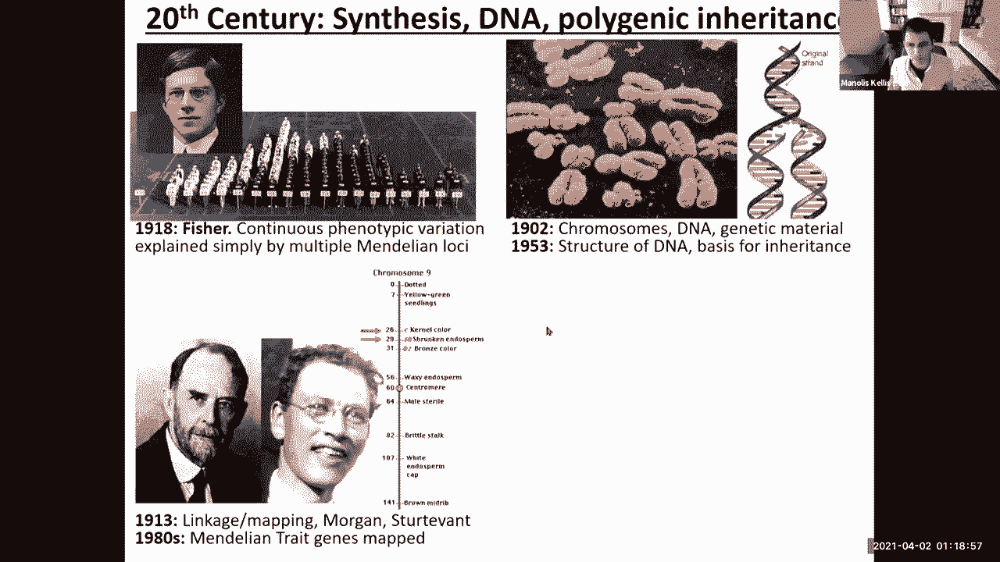

所以九十十分零零零，哇太棒了，所有的权利，所以这是传统的方法。

这是呃，孟德尔um映射，当这些特征有很强的影响时，这是可能的，在那里你可以说，好的，嗯，这个人有囊性纤维化，这个人没有囊性纤维化，让我们找出它们在染色体上的位置并绘制它们的地图。

巨大的革命发生了复杂的特征，到目前为止都没有受到这种分析的影响，并将其回顾到这种类型的分析中，在两千年里，我们看到的是这种能力不仅能绘制出强烈的效应变化，但也是人类基因组中的弱效应变异。

并开始系统地理解这些，呃，我向你们展示的例子，我自己的基因变异使我有点衰老的倾向，相关性黄斑变性，在这里，你的风险增加了两倍，这种变体只会让我增加10%的风险，因此，这些变体将无法用传统的链接方法映射。

所以我们今天要看的是，我们如何利用全基因组关联研究系统地绘制它们，这基本上是看每一个片段，基因组中的600万个片段，以及单核多态性是如何随着疾病的变化而变化的，我们很快就会进入G，所以让我们从基础开始。

变异的基础是什么，让我们看看不同类型的变异，我们将讨论片段，或单个核苷酸多态性，是一个字母的变化，我们将讨论小inde，它们是，你知道吗，t a t gg被添加到这个位置，除了已经有的C。

我们将讨论速记和重复，它们是，呃，你知道吗，gtc，gtc，gtc，gtc，在那里，我们大约每一万只诱饵熊中就有一只，然后这些大的结构变体和复制数变体在中位长度，5000个核苷酸，基本上可以插入或删除。

这些大约每百万个核苷酸就会发生一次，好的，那么到目前为止谁和我在一起，所以我们有剪子，inels，strs，结构变异和拷贝数变异，我们主要集中在片段上，但你应该意识到所有其他的变化，那么这些做什么好呢。

大多数时候他们什么也不做，因为它们大多落在非编码区域，但有时它们要么落在管制区，它们有一个效果，我们将在讲座结束时讨论这个问题，或者它们属于蛋白质编码区，然后它们有很大的效果，如果你看，比如说。

从A到T的突变这个盒子应该在上面，这实际上会导致镰状细胞贫血，基本上血细胞镰刀状，他们不能再携带那么多氧气了，这是不好的一面，好的一面是血细胞镰刀，他们不能再携带疟疾病原体了，所以说。

非洲疟疾盛行的地区，这很明显是由于对突变的选择，你知道更难，你知道的，功能正常，正常携带氧气，但这也救了你的命，如果你知道疟疾病原体碰巧让你，所以这些是全基因组关联研究的主力，也是我们周二要关注的事情。

即表达数量性状基因座，所以这些研究不是着眼于表型变异相对于遗传变异，而且与snp变异相关的基因表达变异，好的，所以说，单核苷酸多态性通常有两个等位基因，基本上如果你有C等位基因或G等位基因。

这是变量可以采取的两种不同状态，他们认同他们的摆脱，所以你会说，一八，九一一，零七一一，两个，三个，是，呃，的，所有这些变体都被聚集并内置到数据库DB片段中，在商业领域有超过1亿种已知的变体。

它们时不时地改变遗传密码，或者它们扰乱了监管区域，好的，到目前为止谁和我在一起，全基因组关联研究的主力，即单核苷酸多态性，哇哦，我们达到了90%以上，哇哦，这里显然太慢了，所以呃，九十五零零，好的。

所以另一种变化是速记和重复，所以你可以看到亨廷顿病，实际上与亨廷顿基因有关，该基因显示，而不是有九个重复的CG，cg，cg，cg，你实际上可以有三十多个重复，然后这导致了这种异常的蛋白质聚集。

它会损害神经元，导致脑细胞死亡，最终是表型效应，如情绪变化，协调，说痴呆症，等，下一种变化是插入和删除，所以说，比如说，囊性纤维化有C T插入，基本上呃，你知道吗，导致这种终结性的丧失。

最终导致肺部感染，囊肿和纤维化，你知道，也极其有害，所有的权利，所以我们要讨论的是，呃，基于参考人类基因组序列是否匹配的参考和交替等位基因，主要或次要等位基因基于它们在特定人群中是否更频繁。

祖先等位基因与派生等位基因，基于它们是否匹配人类和黑猩猩最常见的最近祖先，然后根据他们的疾病关联来确定风险等位基因和非风险等位基因，然后你应该记住，其中一些是特定于环境的，对于疟疾来说。

风险等位基因则相反，然后对于镰状细胞病，好的，然后我们将讨论共同的，和私人变体，所以常见的变异体超过人口的5%，低频变体通常定义在0。5%到5%之间，稀有方差小于0。5%，然后是私人的。

新变体通常是特定家庭的私人变体，从某一特定个人的受孕开始，然后躯体变异是一个人的子集，基本上这些都是在你的转变中发生的变体，从单个受精卵到人类，在细胞分裂过程中，你实际上可以有额外的突变，比如说。

我肺的这一部分可能有一个G，当我身体的其他部分在那个突变中有C时，因为祖细胞给了，作为一个基因产生了我肺的那一部分，好的，和我在一起，呃，一号参考文献，衍生风险和风险。

然后是常见到罕见到体细胞变异的频率，好的，太厉害了，你们在这件事上完全在行，所以八十，二十零零嗯，好的，所以嗯，我们有一个很大的挑战，在我们前面，我们有两个基因组副本，在我们的每一个细胞里。

23条染色体，两万个基因，30亿个DNA字母和数百万个多态性位点，那么我们如何找到这些疾病基因呢，所以我想让你们所有人得到的主要概念是，常见变体和罕见变体的区别是什么，所以基本上。

罕见的变体允许你做的是观察强烈的效果，变体，所以这些都是变体，呃，稍等一下，我在找，嗯。

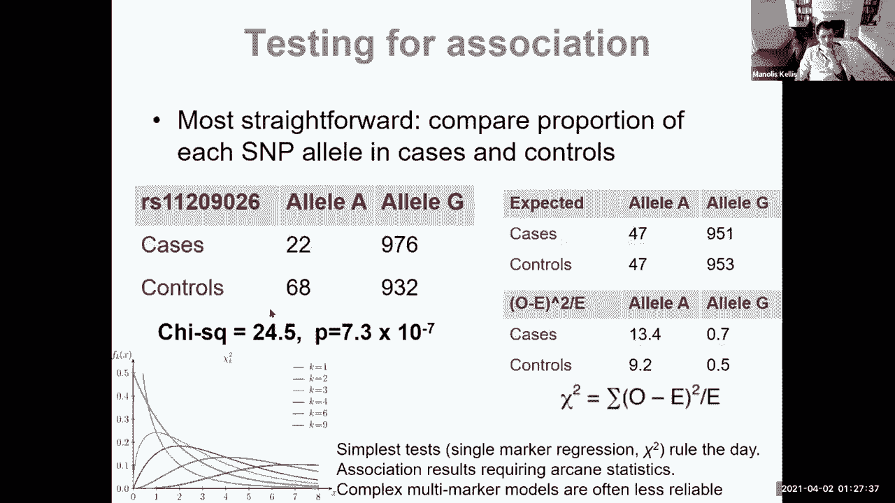

我没有幻灯片，不幸的是，所以说，你知道吗。

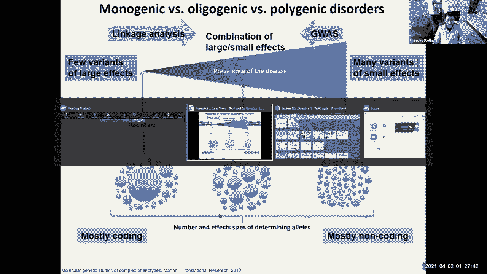

呃，我要找到这道光，应该很容易。

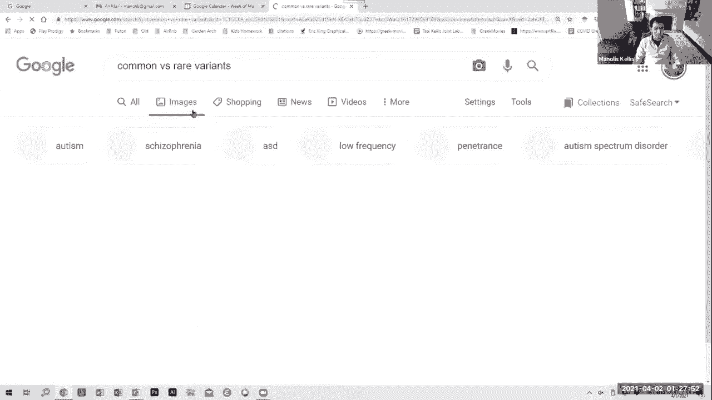

给你，好的，所以有两种呃，变体，哎呀，哎呦，哦，给你，所以大家集中注意力，这是超级重要的，一方面，如果我们进行孟德尔分析，我们发现导致孟德尔疾病的基因，引起孟德尔病的等位基因非常罕见。它们有很大的影响。

所以它们非常罕见，它们有很大的影响，相比之下，与全基因组关联研究相关的等位基因非常常见，它们的影响非常小，这是巧合吗，一点也不，这种负相关的原因是如果某物有非常强的影响，如果它引起某种特定的疾病。

那么进化就不会让它上升到高频，好的，相比之下，如果某物的效果很弱，那么它上升到高频是完全可以忍受的，我们沿着这个轴看的原因是，因为我们根本没有能力抓住这些部分，也就是说，有大量罕见的变体一直在发生。

几乎没有效果的，这些根本没有被基因组关联研究或孟德尔研究捕捉到，但在这里，我们基本上有孟德尔研究，效果很好，因为有很强的效果，但问题是我们只需要去寻找家庭，因为这些影响是如此强烈，以至于他们。

这些变体根本不常见，好的，那么，在常见变异和罕见变异之间的反比关系上，谁和我在一起呢，频谱的两边被调谐到联动分析，与全基因组关联研究的比较，一个是对一个基因或最多两个基因的孟德尔分析。

或者你知道极少数的基因，另一个是成千上万的弱效应基因变体太棒了，所以你们是九十一五零，零零，这是真棒。

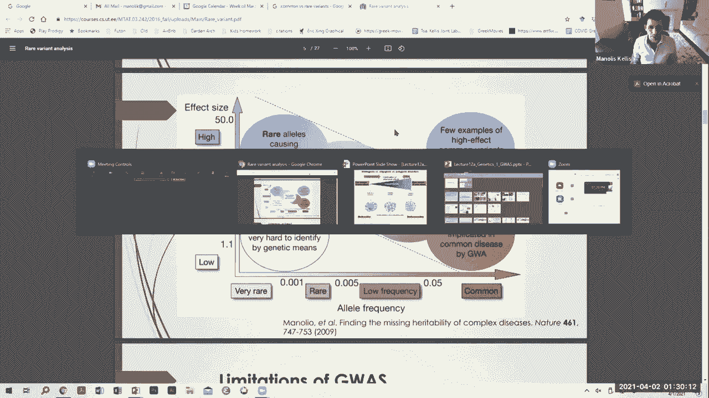

全基因组关联研究，一方面，在看很多，小效果的许多变体，这些是多基因疾病，基本上是在研究单基因疾病，你知道这些效果很强，但变体是，变异的频率在人群中是非常罕见的，一方面，这些大多是非编码的。

因为这就是你通过稍微改变电路来获得微弱效果的方法，这些大多是编码，因为这就是你如何通过直接改变蛋白质来获得巨大的效果，越来越多的地球人获得了权力，能够进入某种，你知道吗，很多，效果的多种组合。

我们能够去越来越弱的频率，然后联动分析正在获得力量，基本上能够检测到越来越多，你知道吗，卤源性疾病，但他们是，你知道，非常适应光谱的这两个方面，好的，我们已经讨论过的LinAnalysis。

我们如何在染色体上有标记，基本上告诉你你在染色体的哪个部分我在13%，百分之四十八，百分之五十四，等，然后你可以将不同的特征映射到最接近它们的标记上，以及它们与其他标记的距离。

使你能够非常精确地确定它们在DNA上的位置，好的，这就是连锁分析，你做的方式，那是家族的血统，你基本上说，好的，嗯，这是我们正在研究的一个标记，这是另一个记号笔，这是另一个记号笔，以此类推。

你可以看到这些是如何与疾病分离的，事实上，这个标记似乎与病例分离，因此，我的猜测是，无论什么基因导致了这种疾病，我正在追踪他的表型，事实上，在物理上与基因组的位置密切相关，我在这里走得有点快。

但我想确保你们和我在一起，所以链接分析的作用是它在染色体上有所有这些标记，然后当它有一个表型，它在整个群体中追踪，它问哪些标记，它是与，你就是这样想出来的，好了，现在，我知道你们很诚实。

因为我们现在是54550，哇太棒了，人类遗传学的大部分主力，计算上的大多数挑战都在这里，我们如何理解多基因变异，用于孟德尔分析的统计数据已经制定了几十年，一旦你弄清楚了基因，就没有那么多计算挑战了。

但这是一个巨大的调查领域，所以这就是我们要关注的，所以我们将研究全基因组关联研究，他们基本上收集了什么，传统上大约五五开，当我研究精神分裂症时，我要去找六万箱，我要找到六万个控件，如果我在学习任何一种。

你知道，像肥胖或糖尿病，我要去猎杀六万，查找尽可能多的控件，所以下周四我们要谈谈，呃英国，生物库和大表型队列，在那里我没有50%的精神分裂症患者的奢侈，借口，所以对于病例来说。

我最终得到的是与人口流行率相对应的分数，如果千分之一，例如携带疾病，然后在我的生物库里，只有千分之一的人会有这种表型，好的，这就是机箱控制设计，你应该知道对于基因组关联研究，我们代理的案件太多了。

所以你收集了一堆案子，一堆控件，然后你去给它们做基因型，这是非常重要的，因为我们不必重新排序，每一个个体的基因分型都非常便宜，测序人类基因组每个核苷酸花费我们一美元，那是三十亿美元。

这是对第一个人类基因组的测序，同时对一个人进行基因分型大约需要200美元，我们说的是30亿美元，而不是30亿美元的200美元，我不会在一千个控制中做一千个病例，但是为了两百美元，哦当然，给我一万箱。

给我十万箱，好的，所以基因分型技术是可能的，因为我们能够编目常见的遗传变异，我们能够对一群人进行测序，然后系统地编目人类群体中常见的遗传变异是什么，然后去看看这些变体这里是G版这里是C版。

然后创建与G版本或C版本杂交的探针，取决于你是否携带，基本上是一个的两个副本，另一个的两个副本，或两者兼而有之，不管你是纯合子，让我们说风险，纯合的，纯合的，无风险或杂合子，好的。

大家和我一起讨论案件控制的这两个概念，代表案件获得权力，但我们在生物银行没有这种奢侈，基因分型而不是测序，原因是它便宜得多，好的，那么让我们看看谁和我一起进行基因分型和病例对照研究，所以我所做的是。

我收集了六万精神分裂症患者，六万人没有，然后我看看它们的共同变体以及它们的不同之处，好的，所以我们是五十四，六零，零或四，然后你做很多质量控制，你看样品质量，你看相关性，消除有血缘关系的人。

而不是相关的，有因血统而产生的身份，也有因州而产生的身份，这是你应该意识到的两个概念，你不想让兄弟姐妹在你的书房里，因为这可以极大地增强随机方差的能力，这两个人碰巧有，即使是什么导致他们有相同的表型。

事实是我不知道他们在同一个家庭长大，或者他们分享了父母给他们的大量罕见的变体，然后你想纠正人口认证，我们会听到一些关于这一点的，下周四按阿尔的价格，所以你有一堆病例控制，你纠正了这样一个事实。

你知道日本人在这里，然后你知道欧洲人在这里，非洲人在这里等等，然后你做了很多QC，不仅仅是你的样品，还有你的剪裁，基本上确保基因型质量好，它不偏离正态分布，等位基因频率和你所期望的一样。

然后你你基本上这是QC的一种类型，在那里你做一个分位数分位数图，你基本上是在密谋，预期的p值是多少，如果这是正态分布的，这意味着什么这基本上意味着如果我采样600万个片段，我想你知道其中一个，呃。

我希望，假设一千个片段才能达到名义P值，或者十的负三，好的，所以基本上我想确保，如果我随机抽取我期望的p值，根据我正在做的测试数量，实际上匹配观察到的p值分布，我想确保这种情况发生在绝大多数发行版上。

除了信号实际所在的地方，这是真正联系在一起的地方，单核苷酸多态性没问题，所以QQ图可以让你寻找实际信号的存在，通过观察p值分布，好的，那么现在我们计算的p值是多少，P值来自卡方统计量。

这基本上是一个表格，告诉你基因组中的每一个片段，有多少箱子带着那个片段，有多少人携带等位基因，一点点那个片段，有多少控件携带了该片段的A，所以你基本上是在问，那个片段有不平衡，好的。

让我们看看这里等位基因的数字，你看我们有，你知道吗，九百箱，九百控制，很好很好，这就是我在这里所期望的，但是哇，等一下，我看到的更多，我控制中的等位基因A，所以这表明也许等位基因，不管怎样。

等位基因A具有保护性，好的，所以和我在一起的每个人，所以说，呃，我希望，均匀比，如果您希望在等位基因和等位基因G的情况和控制之间，但我看不出我看不出病例的等位基因a少得多，而对照组有更多的等位基因A。

好的，我如何衡量那口井的统计意义，我基本上可以看一个卡方统计数据，它基本上告诉我，考虑到我在这张桌子上的两个自由度，然后我可以看到一个具有两个自由度的卡方分布，基本上可以让我读出那个事件的p值。

我计算的方法是观察到的-预期平方除以预期，这就是我得到卡方分布的方法，然后我从桌子上抬起头来，我的列联表中有多少个自由度，然后就得到了它的p值，所以如果我有一个2。5的chi平方，这很远。

基本上接近于零，那是10的p值，到负7，谁和我在一起，我如何计算这些P值用于全基因组关联研究，所以我把基因组的每一个片段，我看A和G的频率，在控制的情况下，两个等位基因中的每一个。

我用卡方统计来寻找频率的偏差，然后根据矩阵的自由度数查找p值，好的，所有权利，六十二，二四四零，有什么问题吗？请把它们输入到聊天中，所以现在我可以执行了，如果有人想闭嘴问一个问题，拜托了，呃这样做。

但基本上这是，你知道的，一个非常简单的测试，简单地要求，与我所期望的有偏差吗，如果那个片段对表型没有影响，如果有一个影响，基本上意味着，我期望偶然看到分布的概率很小，这就是p值告诉我们的。

P值基本上是说我们可以拒绝假设，假设，根据等位基因对表型没有影响，我们可以肯定地拒绝它，你知道的，十到零下七，这是我所期望的，那么大的一个方块，只有你知道，百万分之一，好的，这些是p值。

我现在要在基因组中计算，我现在要在曼哈顿的一个阴谋中策划，曼哈顿的情节告诉我们，以曼哈顿镇的摩天大楼命名，曼哈顿阴谋告诉我们的是，卡方统计量的负对数10p值是多少。

这种平方统计量是在基因组的每一个片段上计算的，然后我问有多少片段有一个非常，极小p值，十到负十，十到负十三以此类推，好的，谁和我一起在曼哈顿的地块上，所以我在曼哈顿告诉我，是对数减去对数十吗。

该咬合与疾病随机相关的概率的p值，如果这个p值非常大，减去log 10 p值是非常高的，如果p值非常小，这基本上意味着这个片段与疾病没有随机联系，所有的权利，呃，七十四二一五零好的。

所以在我有了曼哈顿的阴谋之后，我可以取相同的p值，并将它们绘制在q q图上，然后我可以结合多项研究做各种额外的分析，我可以说好，呃，你知道的，在丹麦他们做了一项关于精神分裂症的研究。

在美国他们做了一项关于精神分裂症的研究，在亚洲，他们对精神分裂症进行了一项研究，所以我现在可以把所有这些，呃基本上有一个队列的组合，然后让我更有信心地评估每一个片段的关联，下一步是我们如何进行功能分析。

了解这些片段的作用是什么，比如说，我可以去打扰一下，就这样在A和G之间，然后看看它是否会改变发光活性，呃为了呃，增强器主要测量这是否是夹点，事实上扰乱了增强器，我们将在整个学期中更多地讨论这个问题。

当然，我可以做其他分析，我可以寻找基于基因的分析，我可以找路径分析，多基因风险估计，剪裁剪裁交互，我们将在，呃，下个星期二，所有的权利，挑战，当然，我们正在测试数以百万计的片段，我们是呃。

测试基因组中的每一个片段，因此，如果我看到一个p值是10到-7，我已经测试了七次，七减七，基本上是十到零下六，我测试了十到六种元素，那么也许我不应该那么兴奋，这就是全基因组意义的来源，这就是红线的作用。

这条红线基本上告诉我，考虑到我正在进行的大量测试，我不会兴奋的，除非某物的值是10的负8，好吧，或者5，10倾向于负8，如此略低于如此略显重要，这就是我们定义的基因组意义。

这基本上是基于20年前的信封背面计算，我基本上说好，我们最好再严格一点，因为我们的很多人都报告说有名义上的意义，你知道，这个领域并没有开始不信任我们，所以我们应该你知道，基于原始。

基因组中大约有一百万个独立的片段，让我们做一个信封背面的计算，基本上说，零点五除以一百万次测试，那是五的十倍减去八，这个数字就是这样产生的，事实证明，这个数字实际上相当准确，在很多呃重访之后，呃，以后。

所以我们谈到了曼哈顿阴谋，我们已经讨论过qq情节了，接下来是精细映射，好的，这是嗯，挑战它，原因是，人口仍然是一个非常小的人口，我们是，你知道的，自从我们离开非洲接管世界以来，人口非常多。

但我们的遗传变异仍然是相对较小的群体，这意味着，没有足够的时间让我们所有的片段，独立，人类基因组中只有少量的重组热点，已经，你知道的，世世代代破碎，基本上就是，当这种变异与疾病相关时。

然后附近的一堆其他变体，与该变体共同遗传的也与疾病有关，然后在我经历了这个重组热点之后，另一个重组热点，那么就没有其他变体与该变体共同继承，因此，这种因果变异的信号不会泄露出去，在这些联系之外。

这个平衡块边界，好的，所以让我回顾一下，过一会儿我们将再次深入讨论这个问题，但只有少量的重组发生在人类染色体上，跨越任何一代人跨越我们所有的世代，你知道，自从离开非洲事件以来。

这基本上意味着如果我在那个区域有一个变体，如果我在这个区域有A等位基因，我可以预测我也有，我们就叫它吧，这里的A等位基因，等位基因在那里，A等位基因在那里，A等位基因在那里。

所以如果我继承了我不知道嗯爱尔兰人，这里的呃版本，然后我到处都有继承的爱尔兰版本，但如果我继承了意大利版本，然后我到处都有意大利版，好的，那么，关于变异不是孤立遗传的这一事实，谁同意我的观点呢。

但它们是分块遗传的，因此，如果该区块中的一个变体具有爱尔兰等位基因，那么这个块中的每一个变体都有爱尔兰等位基因，好的，好的，非常的酷，所以嗯，因此我们需要做的是在我们发现该地区的联系之后。

我们现在需要去说，好的，嗯，但是那个区域的哪个单核苷酸多态性片段是，事实上对该协会负有责任，五五四一五零零，所以95%的人都在60%或以上，这是伟大的，所以呃，让我们在这里休息一下。

看看谁觉得他们学到了什么，好，所以我们在48，四十八零零，零是伟大的，然后是四个，嗯，好的，所以呃，和对速度的快速民意调查，我是不是开得太快了，太慢了，呃或者刚刚好，我肯定太快了，哦，恰到好处，嗯。

好的，所以投票的人说他们什么都没学到，也在说，啊，反正你开得太慢了，所以呃，就写百分之六十八，有点太快了，百分之二七，然后太慢了，百分之一，让我们深入研究一些结果。

所以这是克罗恩病的第一个基因组关联研究之一，由马克·戴利和他在布罗德研究所的同事们进行的，它发现了什么它在这里发现了一个区域，你可以看到所有这些点，它们远远高于基因组的意义，为什么有这么多的点。

原因是当你有一个链接不平衡区域，它们都有不同程度的联系，你看，你把它压扁，你知道的，当你展示整个基因组时，你基本上可以看到，所有这些其他片段基本上都是一字排开的，好的，所以这里有一个这样的区域。

这里的另一个这样的区域，哎呀嗯，稍等一下，当我移动的时候，国家等级被称为，你能和他们谈谈吗，我在做我的演讲，稍等一下，芭芭拉，我妻子正在上楼，两个不同的例子，其中一个也是通过链接发现的。

另一个不是通过链接发现的，所以这有点有趣，对呀，我告诉过你G在一边，然后连接在另一边，但是连锁分析也发现了这个区域，然后呃，全基因组关联研究只发现了，为什么如果你看一个也是通过链接发现的，不是十五张牌。

它的频率是百分之五，它的效果大小是三点零，这意味着什么这意味着如果你携带风险等位基因，那么你患这种疾病的可能性是其他人的三倍，患克罗恩病，相比之下，i，two，three，r。

这里实际上是一个保护性等位基因，这个等位基因降低了你的风险，所以稀有的等位基因，不太常见的等位基因降低了你的风险，这意味着什么这意味着当我做病例对照队列时，我为案子赚了很多钱。

我基本上只能找到风险增加的方差，因为我有很多案子，我很少会发现保护方差，好的，这些都是一些微妙的地方，但是你需要获得重要意义的联系谱系，对于这个有保护作用的人来说，将有3万人，三万个家庭，这根本不可行。

如果你看一个g十六l一，a g十六l一，那么它是一个风险等位基因，但这只会增加你40%的风险，而这个是百分之三百，对于这个人来说，发现40%的增长的微小影响，你需要四万度，好的，这就是为什么连锁分析。

G实际上是在普通和罕见的不同制度下作用的，这就是我想给你们看的著名幻灯片，一方面，你有一个共同的方差，g被捕获，另一方面，你有罕见的强效应等位基因，连锁捕捉到，好的，所有的权利，所以现在，呃。

我们讨论了一点单倍型，让我给你更多的背景，所以嗯再次，我们思考单倍型的方式是当你沿着基因组行走时，你基本上可以问，相关结构是什么，在所有这些并排排列的不同片段之间。

这个相关结构告诉你所有这些片段都是共同继承的，它们之间有一种联系，对不起，有一个重组热点，所有这些片段都是共同继承的，然后是另一个组合热点，所有这些都是共同继承的，热点的另一个住宿。

所有这些都是共同继承的，另一个在这里，以此类推，但它不仅仅是超级离散的，你知道这里有一个弱者，但也有很强的相关性，等等，所以基本上不是同意，否，只是重组的频率，谁和我在连接上是平衡的，呃。

这里的热点以及它们是如何在基因组上工作的，哦，对不起，对不起，错了保罗，你掉得太远了吗，你变得便宜，酷，所以呃，百分之九十的人都在六十岁或以上，这是伟大的，嗯好吧，所以这基本上是重组，呃。

然后我们可以量化它，呃，各种有趣的方式，然后呃，它因人群而异，你知道的，去非洲的染色体或略有不同，对不起，那个，你知道的，某种持续的非洲人口，与去欧洲的染色体相比，或者去亚洲的染色体彼此非常不同。

然后你可以在每个人中有不同的重组热点，然后有一种重组机制导致了这个热点，这种消除机制是由p d m 9指导的，基本上去找一个主题，然后在减数分裂过程中产生双链断裂，染色体排成一行。

每个配子都有正确数量的染色体，好的，这些双股断裂，和入侵的力量，和某种重组是排列染色体的关键，这也是你得到重组事件的原因，好的，所有的权利，所以我们现在发现了一个关联，我们如何弄清楚它是如何工作的。

所以我要告诉你们一项研究，克拉瑟和许多其他同事，呃，包括你知道的，我实验室的几个人，嗯参与了，几年前发表在《新英格兰医学杂志》上，这也许是对一个非，编码疾病位点，好的，这是从一个片段开始的。

从与疾病相关的单个核苷酸多态性，然后问，它是如何工作的，好的，然后一个人需要采取的六个步骤，呃，就是我们在这里拍的，所以让我们先潜入片段，这是对肥胖或体重指数的全基因组关联研究结果。

体重指数是衡量肥胖的指标，回到2007年，这个轨迹，它很快被更名为脂肪和肥胖相关的FTO实际上是，发现与肥胖有最强的遗传联系，所以人们基本上说，好的，这里有重要的东西，当你打开引擎盖。

就像我之前给你看的那样，你把它们并排排列，你看这里有两个重组热点，但是在这个5万个核苷酸区域中有89个常见的变体，都与疾病有关，所以这是摆在我们面前的挑战，我们如何理解，这东西是怎么工作的？

我们知道这个地区发生了一些事情，但我们不知道它是如何工作的，所以呃，步骤是什么，第一步是我们需要弄清楚它在哪里起作用，相关的组织和细胞类型是什么，第二个挑战是我们如何找到下游的目标基因。

因为这些是非编码变体，可能会影响FTO的表达，但也许它们影响了其他隐藏在远处的基因的表达，事实上，他们确实如此，我们如何在这个地区的许多变种中找到哪一个，是因果关系，就是。

如果我去基因组编辑这个或那个或那个，我会恢复表型吗，还是我需要找到正确的一个来这样做，我们怎么找到，控制它的上游调节器是什么，一个区域，其约束力因失去该变体和数字五和六而中断，我们如何建立细胞。

以及由此产生的有机体表型后果，呃，这些目标基因中，那么谁和我在一起，至少前面的挑战，的六个问题，它通过什么基因在哪里起作用，通过什么变体，然后它最终在细胞和组织层面上做什么，所以呃。

百分之一百的人都在百分之六十以上，伟大，五十三四十七零零，嗯，好的，那么我们该怎么做呢，第一个挑战是组织，这就是我们基本上看的地方，107种不同组织的表观基因组注释，整个路线图表观基因组学项目。

我们发现了这些超级增强剂，这一万两千个核苷酸增强子控制元件增强子通常很小，四百个核苷酸，也许一千个，如果你真的很幸运，但这是一万两千个核苷酸，这是一个主要的监管控制区，它正好位于这个关联区域。

它作用于白色脂肪细胞和米色脂肪细胞的祖细胞，它与肥胖有关，它决定了你的脂肪细胞是否分化为脂肪储存细胞，或者脂肪燃烧细胞，猜猜哪一个与肥胖有关，储存脂肪的人导致肥胖，燃烧脂肪的人导致了一些瘦的人。

因为它们燃烧了所有多余的卡路里，好的，这就是增强器起作用的地方，但是，我们还不知道剪断与这个过程有任何关系，第二步，正如我提到的，是找到目标基因，在这里，我向你们展示了人类基因组的重组热点。

以及附近所有的基因，你可以看到遗传关联非常紧密地局限在一个基因上，FTO，制药界超级兴奋，这就像伟大的，这里只有一个基因，我们知道是什么基因，但问题是，因为远程链接，和我们几周前谈到的远程循环。

所以其实，含有FTO遗传变异关联的区域，它是否与一堆其他基因有关，无论是右边还是左边，表明他们中的任何一个都可能是目标，因为他们正在形成这些循环，所以下一个挑战是我们如何找出。

所有这些候选基因在风险等位基因和非风险等位基因之间的表达发生变化，所以我们基本上去测量纯合子的表达，这些基因中的每一个都有风险和纯合的非风险个体，我们发现fto基因本身的表达没有变化。

取而代之的是这里的这个基因，它有很多，许多推荐块，这里的基因实际上位于一个点上，两百万个核苷酸一直到这里，几个基因之外的基因实际上是唯一两个在表达上发生变化的基因，表明x3和x5实际上是，目标基因。

到目前为止谁和我在一起，为这些非编码位点寻找目标基因，太厉害了，哇哦，你们真的和我在一起，注意风险等位基因实际上增加了表达，六十三七零式，风险等位基因增加表达，所以这是一个函数增益，这让我们意识到。

大多数时候我们都在说，哦，那个基因因疾病而失活，但没有，这两个基因，不能再绑定，下一个挑战是理解什么是因果片段，在那里我们使用调节母题分析和进化保守，我们能够确定单个核苷酸的改变。

破坏了这个进化保守的丰富母题，在那个位置有一个C，肥胖高危人群，我们去测试了一下，如果我们在CIS级别改变这个片段，如果我们在反式水平上改变上游调节器，那么我们实际上可以显示两者之间的上位性。

我来解释一下这个八十个丰富的主题是由这个，一个丰富的相互作用域蛋白，我们基本上说，我可以把上游的调节器撞倒吗，我可以改变风险和非风险个人之间的片段吗，只有当你有正确的主题，调节器处于活动状态。

你看到的压抑，如果你破坏了上游调节器或剪断，然后你看到德压抑，所以有一个上游调节器通常结合这个母题，当剪断发生时，阻遏子不能再结合，增强剂过度激活，和RX3和RX5被过度激活。

所以在增强子水平和基因表达水平上，只有完整的主题和完整的调节器才能得到抑制，这更复杂，但让我们看看谁在压力分析上跟着我，我们有了主题，我们有上游调节器，如果我们破坏两者，然后我们就有了去压抑。

如果我们打乱，如果我们两个都完好无损，那么我们就有了正确的压制，果然没问题，稍微低一点，三十五七四九零，嗯，好的，然后下一步很棒，我们有电路，我们有组织前脂肪细胞，来决定你是去燃烧脂肪还是去储存脂肪。

我们有目标基因IRX树和RX五，我们有基于基因组编辑的因果核苷酸，我们有上游调节器，里b，它实际上是如何运作的，然后我们需要看看细胞的后果，我们发现，我们的x t和rx 5与线粒体功能呈负相关。

并与脂质代谢呈正相关，事实上，个体线粒体较少的风险，它们有更大的脂肪细胞，表明从能量直流电控到能量储存的转变，我们基本上能够建立我们的模型，说我们能够从一个我们一无所知的协会地区，到剪掉，有母题的。

具有上游调节器，具有下游目标基因，并有生物过程，这基本上意味着我们可以介入并改变电路，并表明通过击倒下游的目标基因，我们可以在肥胖表型的线性之间来回转换，我们能够改变老鼠，把它们从正常体重变成超级瘦。

通过改变那个基因不被表达，然后这些老鼠在高脂肪饮食中无法增加体重，正常小鼠体重增加，这些老鼠无法增加体重，用CRISPR进行基因组编辑铸造九种基因组编辑，我们可以证明把T变成C，把C变回T。

能够改变下游靶基因的表达，然后再向下，所以从八十个丰富的主题，我打乱了主题，基因被去抑制了，阻遏子不能再结合，我恢复了那个主题，基因又被抑制了，然后我们可以从风险等位基因到保护性等位基因，把c改成t。

还原母题，然后砰的一声，生热过程，用耗氧率来测量实际上在细胞水平上完全恢复了，因此，这使得我们现在能够理解这个snp背后的机制，所以我想说我们写了一篇论文，关于三点中的一点信息。

人类基因组的20亿个核苷酸，从C到T，在脂肪燃烧细胞和脂肪储存细胞之间转换，好的，所以摆在我们面前的挑战是我们想再做一次，十二万次，我们想开发计算方法来系统地做到这一点，这就是我们今天要听到的。

来自我们的客座讲师，我希望他在这里，嗯，是呀，哦，完美的安妮来了，嘿嘿，一月，非常感谢，呃，你能分享你的屏幕并把它拿走吗，然后在星期二，我们会有很多关于，我们如何在系统层面系统地做到这一点。

所以简会告诉我们，我们可以使用我们已经听说过的深度学习技术，现在开始预测片段的影响，一次剪十二万根，而不是一次剪一个，呃果酱。

把它拿走，好的，谢谢。所以我是珍乔，我听不到你。

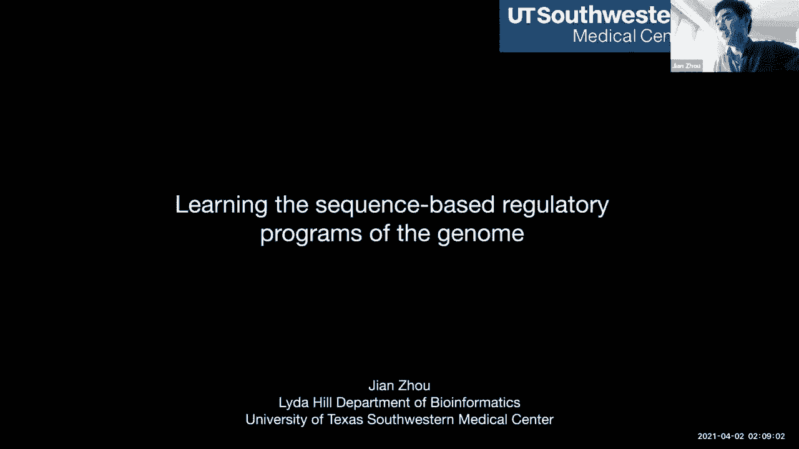

你的麦克风必须关闭，因为你不是哑巴，现在听我说，不，还是什么都没有，哦，你能听到他，但悄悄地，好的，让我提高音量，哦，我的音量关了，好的，太棒了珍，他们能听到你，我不能，好的，所以没事，对，是啊，是啊。

完美。

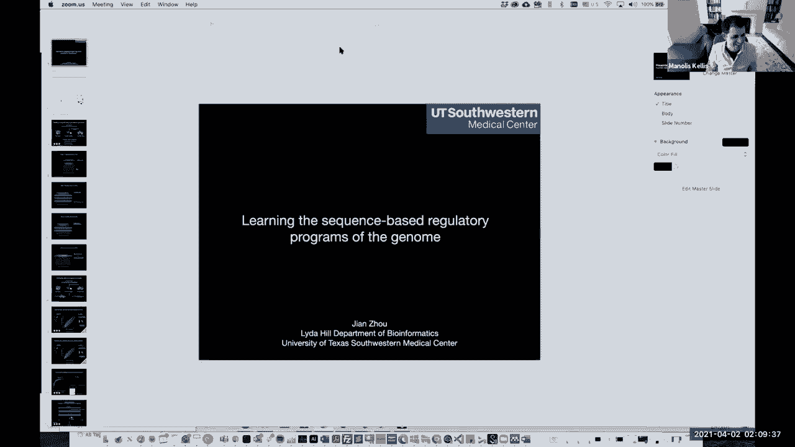

好的很好，所以我是珍，我是UT西南地区的助理教授，我很高兴，嗯，今天和你谈谈我们在部署基因组序列模型方面的一些工作，尤其是符合今天的主题，我将专注于这些模型的应用，事实上预测。

所以我将从一点动机开始，我们对研究这个问题很感兴趣，首先，我们每个人都有不同的基因组，正确和基因组可以给我们不同的特征，并可能使我们容易患不同的疾病，任何两个基因组之间都有许多差异。

甚至可能会有差异突变只有你和一个人，因此，用实验方法来研究这些问题是非常困难的，如果不是不可能的话，单个基因组变异，所以说，因此，我们希望有一个方法，计算预测这些基因组差异的影响，另一方面，当然啦。

同一个基因组产生了所有这些不同的细胞类型，相同的基因组必须在不同的细胞类型中得到不同的利用，在不同的细胞类型中调节这些表达和其他过程，当然，有大量关于这一点的研究，但我们仍然没有达到我们可以说的水平。

比如给定一个序列或给定一个特定的突变，它对所有这些细胞类型会有什么影响，所以我们想更好地了解风暴是如何，基因组序列的序列、突变和方差影响着所有这些，um细胞类型，特定条例及其对人类健康的影响。

所以我们采用机器学习的方法来利用我们的基因组序列，以及可用于建立模型的大量功能基因组数据，可以预测基因组序列和序列变化的影响。

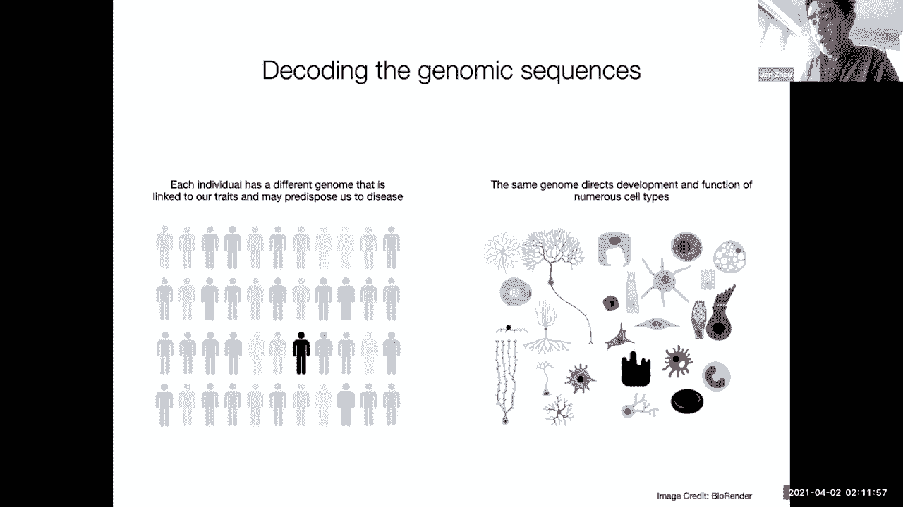

所以我会从头开始，所以我们看到的第一个问题是我们认为，作为基于基因组序列调控的第一步，即基因组序列如何决定单个转录因子的结合，随后染色质的组织，包括组蛋白修改和计数可访问性，所以我们希望能够做到。

我们想训练模型，从整个基因组的基因组序列中预测，并预测不同转移因子和组蛋白修饰的结合，在这个序列的中心，在不同的细胞类型中裁剪可访问性，当时还没有任何基因组序列的深度学习模型。

我们选择使用深度学习模型的原因，特别是深卷积网络模型，主要是因为它满足了我们三个，嗯，我们想要构建到我们的调节序列模型中的要求，所以首先，我们希望模型能够使用大序列和长序列上下文，因为很明显。

如果你只看一个主题，你不会，准确预测GF结合是不够的，所以我们真的希望能够利用序列上下文，其次，因为我们希望利用大序列上下文来有效地使用它，然后呢，我们必须能够模拟序列不同区域之间的非线性相互作用。

第三，因为我们预测了所有这些不同的转移因子和染色质的性质，我们希望能够分享从所有这些测试中学到的序列特征，因为预测一个转移因子结合的序列模式，也可用于预测另一个相关相互作用因素的结合。

所有这些蛋白质和活塞标记都在相互作用，所以对一个人来说有信息的东西对另一个人来说也是有信息的，所以您希望模型能够共享彼此的信息，所以一个深卷积网络模型可以给我们所有这三个特征，事实上。

它在做出这些预测时非常有效，所以我只想简单介绍一下模型的实际设计，因为我意识到你已经了解了几个卷积网络模型，基于卷积网络的序列模型，所以这在当时是新的，但现在他们已经，很多研究都在使用卷积网络结构。

研究基因组序列，但基本原则还是一样的，所以在卷积网络中，我们使用卷积层来学习不同级别的序列特征，在较低的水平上，它学习，你可以把它看作是学习母题的等价物，在更高的层次上，它学习更高阶的序列模式。

比如你可以考虑的主题，所以那些较长的序列模式，并且能够学习那些分层的多层次或特征，我们必须在网络中建立一个空间缩放机制，因此，您可以通过使用池机制来实现这一点。

或者你也可以通过在卷积中引入膨胀来实现这一点，你需要引入某种空间缩放，在顶部，我们的网络，我们总是在整个序列中提取信息，我们想把整个序列的信息组合起来，有很多不同的方法可以做到这一点。

但有一点要记住如果你想做出特定位置的预测，比如说，在我们的情况下，我们想预测这个序列中心的效果，那么您希望保留空间信息，所以我们不想使用一些嗯层，比如全局最大池，这会抹去你的空间分辨率。

所以你会想要做出有特定位置的预测，那么您需要使用一些机制来保存空间信息，用这个模型训练，所以说，我们实际上有一个很好的模型来预测这些训练，载体和组蛋白修饰，我们能做什么呢。

即使模型是在整个基因组的基因组序列上训练的，而没有看到任何基因组变异，我们实际上可以要求模型对任何序列做出预测，和，这意味着我们可以用它来预测任何地球变化的影响，比如说，在这种情况下。

我们想预测把这个核苷酸从A变成C的效果，然后我们可以给模型两个序列，只相差一个变体，然后我们可以看看模型中的两组预测，对于这些变体中的每一个，如果我们预测狮子座a，我们对这个转移因子有很高的束缚。

而我们对狮子座C的束缚大大减少，那么我们预测这种变体实际上会减少反式，减少这个转移向量的束缚，所以现在的问题是我们如何知道如果我们的预测是准确的，所以当时没有多少，即使现在。

在染色质水平上改变影响的变异体的高质量例子并不多，以便地址，我们实际上研究了那些非常深入的基因组数据集，在本例中，我们研究了大约30种细胞类型的DNA序列数据集。

然后在那些深度测序的DNA SEQ数据集中，我们在这个样本中寻找有异方差的位置，对于那些杂合子变体，然后我们寻找其中一个等位基因是否更有代表性，在此数据集中比其他等位基因表示，比如说。

如果参考狮子座在以下数据中更多地表示，这可能表明这个等位基因可能比另一层更敏感，反之亦然，有了这个，我们可以得到大量的假定变体，这对DNA敏感性有影响，我们现在也可以要求模型做出这个预测。

所以我们可以给模型这个，它的序列携带这个变体，并更早地预测参考LEO和替代方案的不敏感性，并与模型预测，我们现在可以和我们的实验结果进行比较，对呀，所以我们用这个图把它形象化，在x轴上。

我们绘制了替代方案的预测，从零到一的概率尺度，在y轴上，我绘制了参考层的概率，每一个点都是一个变体，现在我们要把这个和，哦，我要用实验结果给它上色，所以如果我们的预测是正确的。

那么那些对角线的点是参考偏置的，这意味着它更敏感，对参考的dna敏感，应标记为蓝色，而那些在对角线以下的应该是更有偏向的，并且应该贴上红色的标签，事实确实如此，尤其是如果你调查这个情节。

我们的精度越来越高，如果你找那些，嗯，变体是对狮子座其他部分的预测和对赫利奥的预测之间的更强差异，或者当我们过滤最有信心的预测时，我们可以看到做出这样的预测的更高准确性。

所以我们可以用这样的曲线来量化这个性能，其中x轴本质上是到对角线的距离，在y轴上，我们看到预测的准确性，哪个等位基因非常敏感，这里的每一行都是一种单元格类型，这里的粗线是所有三种五种细胞类型的平均值。

这个评估实际上有一个特点，那个，我没告诉你，在我们的标准中出现假阳性实际上是强有力的，所以我们正在检测那些参考层和替代的有偏方差，我们不能保证，但不保证，我们检测到的每一个变异实际上都有因果影响。

所以这可能会有假阳性，但如果我们的模型是好的，然后它就能过滤出真正的积极因素，当我们设置一个阈值，筛选强烈预测会产生强烈影响的变体，对呀，所以如果模型好，然后它就能挑出真正的积极因素并预测它的方向性。

如果模型不能做到这一点，那么它就不会有更高的精度，所以这允许我们评估这一点，即使是那些不完美的，去标准，我们也为组蛋白标记QTLS做了这个，这些变异与组蛋白标记有关但不一定是因果关系。

我们可以看到我们也可以预测，与较高组蛋白标记有关的等位基因，最后对于过渡因子，我们最初没有做这个评估，因为测量传输因子发现的芯片棒数据集通常具有较低的覆盖率，但实际上，后来，一个独立小组也做了这项评估。

向大家展示一下，DC实际上也很擅长预测，瞬态因子数据集的狮子座不平衡，即使测量噪音更大，我们有能力预测这些变体的影响，现在我们可以，当然啦，适用于预测任何变体，包括那些我们从未见过的，例如。

对于单个序列，我们可以将所有可能的单核突变引入序列的每个位置，并预测其效果，我把这种方法叫做硅诱变，和硅负极生成，我们可以这样看序列，所以我们知道这些位置的突变会降低这个转移因子的结合。

而其他一些突变会增加这种转移载体的结合，我们可以将其应用于几种不同的非致病性突变，我们看到的是，不仅仅是已知的突变在影响这种转变因子方面有报道的影响，绑定，我们还预测了围绕这一点的许多其他突变。

这个有类似甚至更强效果的网站，这意味着如果将来，我们有一个患有同样疾病的病人，但是有不同的突变引起同样的效果，即使它不是最初的突变，我们也许可以预测这种突变可能有，可能通过相同的机制引起相同的疾病。

那么我有多少时间，通常这节课两点五结束，但我们通常会说百分之一百的时间是30，我想过了三十岁可能不是个好主意，好的，所以我的目标是30完美，好的，现在我要告诉你们另一个分子水平效应预测的例子，当然。

在我们能够预测铬水平的影响之后，我们希望能够预测，我们是否能特别研究清表达水平上的变体的影响，在这方面有很多挑战，我不会说这个问题已经解决了，这个问题远未解决，但这是我们第一次尝试解决这个问题。

其中一个实际上，预测基因表达的两个挑战是，首先，它依赖于更大的调节序列，所以你需要考虑一个更大的区域，其次，实际上训练数据更少，提供训练样本，所以我们考虑基因表达的预测。

那么我们就会受到基因组中基因数量的限制，所以我们没有无限数量的训练样本，所以我们必须聪明地构建我们的功能，不要过度拟合此数据集，所以这样做是为了解决第一个问题，我们实际上只看一个40千比特对的广阔区域。

并应用了一个预先训练的泵送液位预测模型，在这个窗口的每个不同位置预测，使用滑动窗口，所以我们实际上预测了每个剖面的空间模式，现在有了这种特殊的社区配置文件模式。

我们想训练一个模型来预测这个模型中的基因表达，我们实际上只是使用正则化线性模型，它学习每个量子图谱对每个不同位置的基因表达的贡献，所以我们从每个基因表达谱预测中了解到这些平滑的贡献模式。

我们如何用线性模型来做到这一点，所以说，他们看到的每一条曲线实际上都是基函数的线性组合，指数基函数，为了做到这一点，我们可以。

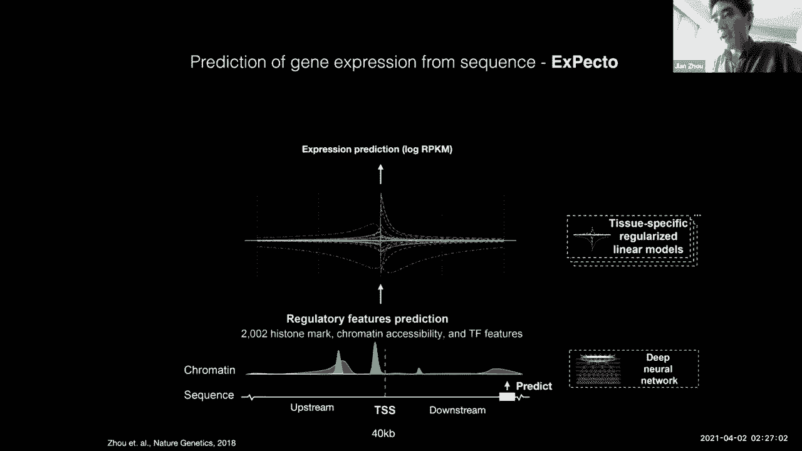

其实很简单，我们可以在这里改变我们的空间模式。

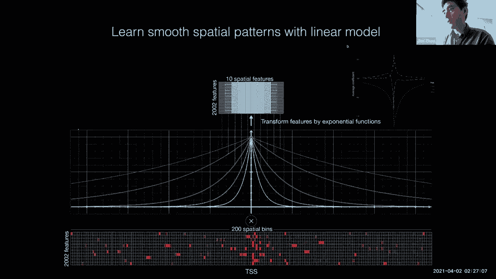

现在我把它表示为一个矩阵。

这里的每一列都是不同的空间位置，我用多个指数基函数变换它，申请下游，上游5个，和，我们可以计算这些空间特征的加权和，对于这些指数基函数中的每一个，导致多个概括的空间特征。

现在如果我们在这些线性空间特征上训练一个线性模型，我们实际上是在学习这些指数基函数的线性组合，关于这些组合图谱对基因表达的贡献。

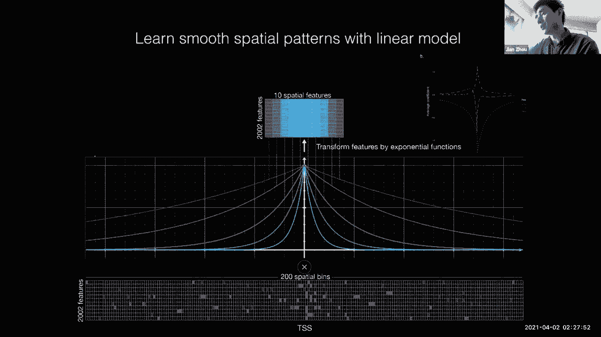

当然啦，这些常见的剖面也是从序列中预测的，所以现在我们可以做同样的把戏，我们可以预测任何变体对基因表达的影响，我们也可以用类似的方法来评估，所以现在我们使用的是关于情商的数据，tls。

我们知道哪个变体与，变体的哪个LEO与更高的表达有关，我们也看到我们可以非常准确地预测所有这些方向性，使用我们的方法跨多个数据集，所以我想只要有时间，我就会跳过剩下的部分。

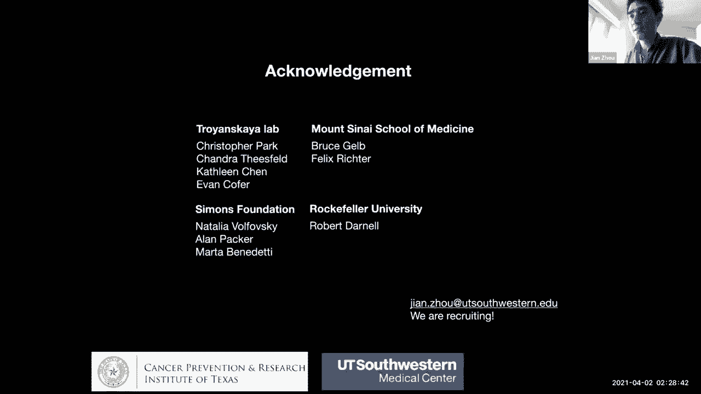

我会说我会说我很想听到自闭症的故事，呃变体，尤其是因为我认为这种罕见的极端是特别有趣的。

好的，我再给你们讲一个关于自闭症的故事，伟大，所以说，所以说，我们喜欢运用我们的能力来预测，基因组变异对实际人类疾病数据的影响，对呀，所以我们考虑的一个应用是这些新的，包括突变导致自闭症等疾病。

所以正常的突变是一个突变家族通常在人类群体中非常罕见，这是一种只在你身上的突变，但不是你父母中的任何一个，我们通常对这些基因组突变知之甚少，特别是对于正常的非编码突变，所以这很难归因于。

这些非限制是否会导致疾病，所以在自闭症的情况下，我们以前不知道的，正常的编码突变是自闭症的主要原因，我们现在知道的关于我自闭症的大部分知识都是从编码突变中学到的，但目前还很难发现模仿的贡献。

这是我们掌握的数据，所以我们有来自单纯性家族的自闭症突变教派，这意味着我们有一个自闭症个体和另一个没有自闭症的个体，也就是我们的控制，所以我们可以从患有自闭症的两个问题中获得突变。

然后是不受影响的兄弟姐妹，然后我们可以比较这两组突变看看是否有显著的差异，如果我们用数字来比较这两组突变，实际上很难看出区别，即使你分集到不同的基因组区域。

所以我们认为也许我们可以用不同的方式来看待这个问题，现在我们有能力预测这些突变的影响，所以我和我的合作者克里斯制作了这些来训练，这两套不同的模型，所以一个类似于我所说的深海，预测腐烂剖面。

另一个被训练来预测铁结合蛋白的结合图谱，它预测铁水平的影响，所以现在有了这两个模型，我们实际上可以将突变的影响总结为一个分数，在dna水平和rna水平上，现在我们可以比较程序突变和简单突变。

看看问题突变是否比简单的限制有更强的影响，对，这确实是我们看到的，所以我们看到了这两个问题，对于DNA水平和C和RNN水平，与兄弟姐妹相比，我们在问题上看到了更强的影响，我们看到更强的效果。

如果我们专注于以前已知与自闭症相关的基因集，通过编码突变，这些只是精选的基因集，所以在这里我给你看，我们在这项研究中考虑的基因集，所以在所有的基因集合中，并且有多次假设校正，在所有这些测试中。

这些基因集是校正后有意义的，我们看到有最强的是，比如说，大脑表达了影响眼睛和结合蛋白结合的基因，也适用于所有这些重要的类别，我们看到问题带的影响比兄弟姐妹更大，这也证实了我们正在检测一个贡献。

从这些突变到自闭症，最后，我们还想做一些公正的分析，所以这里我们使用的是以前已知的基因集，我们希望能够看到非编码突变的贡献，以相对公正的方式，这在健身房是很有挑战性的，因为我们缺乏统计能力。

所以在单个基因水平上说这是不可能的，与兄弟姐妹相比，我们在程序中看到了更强的影响，所以我们做了一个基于网络邻居的分析，所以现在我们在看，所以给定一个基因网络。

我们已经从以前的研究中得到了关于功能关系的信息，关于我们现在可以看到的单个基因及其网络邻域的基因，与兄弟姐妹突变相比，我们是否有更强的效应程序突变，所以我们可以做一个加权测试。

这是由所有邻里基因的网络连接加权的，对感兴趣的基因进行比较，现在我们看到这些是网络邻居，强烈地丰富了，与兄弟姐妹相比，在问题上有更强的影响，这些基因实际上聚集成两组，所以一个是突触相关基因。

另一个是染色质调节相关基因，实际上，这两个群体碰巧是享有特权的群体，以前在自闭症个体中发现的UM编码突变表明了这个问题，所以这表明编码所指示的机制的收敛，和非编码突变，所以我就停在这里。

去看我最后一张幻灯片，让我们感谢我所有参与这些研究的合作者，如果你有任何问题，也可以给我发邮件，也就是，伟大，非常感谢你我看到你想用你的代码，早些时候，你想炫耀一下，呃，哦耶，所以我们有一个。

我们有一个序列模型库，实际上是为了帮助你开发，训练和评估序列模型，这也是我们所依赖的图书馆的模型，我们欢迎您使用它并给我们反馈，非常的酷，这个图书馆是由一个才华横溢的学生开发的，有一个下巴。

它有一个非常漂亮的希腊名字，是呀，月亮女神，所有的权利，太感谢你了。

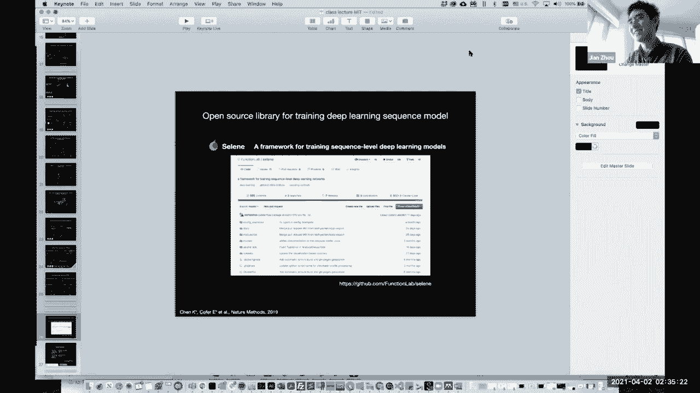

所以我想让每个人都告诉我，呃，你们觉得自己学到了什么，呃，让我们看看真棒，太厉害了，我看到很多掌声，太棒了看看那个，百分之百，这真的是最好的，百分百的零，这太棒了，好的，太厉害了，再次感谢你的精彩演讲。

感谢大家留下来。