# 【双语字幕】MIT《面向生命科学的深度学习》课程(2021) by Manolis Kellis - P3：Lecture 03 - CNNs Convolutional Neural Networks - 爱可可-爱生活 - BV1wV411q7RE

所以今天我们要讨论一种非常特殊的深度学习，也许是最著名的一个，因为它实际上是革命的基础，我们在许多不同领域的深度学习中看到的，它真的把机器学习和深度学习带到了全世界的良心上，如你所知。

有无数令人惊叹的优秀在线资源，今天我想说，呃，1。六号，所以这是一个非常棒的课程，亚历山大·阿米尼和阿巴·索莱马尼发展了，我希望你们中的许多人接受了这一点，iap，所以对于你们这些人来说。

这将主要是一个回顾，还有苔丝·费尔南德斯，她在网上发布的非常棒的Coursera笔记，我们也会提供这些，他们真的超级酷，当然还有大卫·吉福德在前几年的许多幻灯片中。

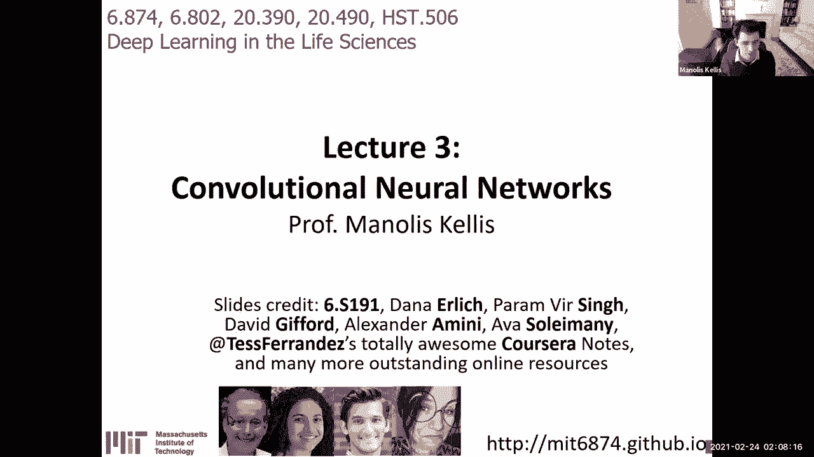

今天我们要讨论卷积神经网络，或者CNN，所以下次你听到CNN，你显然应该考虑卷积神经网络，没有人能想到，我们将讨论经典机器视觉的场景理解，特征、场景和滤镜的基础，然后呃，基础深度学习模型再次将整个领域。

走到大众良知的最前沿，令人难以置信的性能改进，与以前的方法相比，和一些很酷的现代CNN建筑，只是很多，许多不同的应用，首先我想说的是人类喜欢认为，我们发明了一堆东西，但事实上大自然已经打败了我们。

呃很多很多次，事实上，一个卷积神经网络，实际上在你的大脑中发挥作用，是卷积神经网络早期架构的灵感来源。

我想再给你看这张照片，因为这是深度学习的核心，从简单的特性开始的概念，在能够识别之前，你提取了越来越高的抽象级别，一个人从它的部分，或者动物从它的部分，或者一辆汽车从它的零件，这是所有计算机科学的核心。

抽象的概念，你在上面建造更高的建筑的概念，在许多上进行较低的构造，很多层，这是深度学习的核心，但这也是人类视觉的核心，这就是你们如何认识周围的世界，我们今天拥有的卷积神经网络结构有很大的根源。

在八十年代，他们自己也扎根于五六十年代，神经科学的关键基础研究，特别是研究动物视觉皮层，当然还有，这些录音早在1968年，和，呃，他们的学业，事实上，你知道，差不多十五年前，胡贝尔和韦塞尔。

基本上研究了猫和猴子的大脑和视觉特性，他们基本上认识到了一些塑造这个领域的原则，机器学习与深度学习，第一名，事实上，有接受场，当图像投射到你的视网膜上时，最终连接到视觉皮层的神经元。

你基本上在最低层有像素，有细胞接收这些像素，在这些图片后面，但这些细胞并没有完全连接到整个图像，有特定的神经元连接到图像的不同补丁，这些补丁是重叠的。

所以对任何一个神经元来说只有一个有限的接受场的整个概念，只观察图像的一部分，然后下一个神经元将观察到一个稍微不同的子集，等等是这些卷积滤波器的根源，和我们今天讨论的卷积神经网络，所以第一个原语。

第一个原理是计算是局部的，第二个原理是他们在这些动物的视觉皮层中发现，有简单的细胞会对边缘做出反应，只有当他们把它转向正确的方向时，然后神经元就会发射，然后他们会把它拒之门外，神经元就不会再发射了。

当神经元发射的角度正好时，不同角度有不同的神经元，这基本上教会了他们视觉的根源在于简单的原始操作，像边缘检测，你可以构造这些边缘探测器，从单个神经元的更简单的构建块，探测不同地方的明暗。

并在多层解释中阈值化信号，所以这是第二个原则，第三个原理是在视觉皮层的更高层，有更复杂的细胞实际上对，不管边缘是在这里还是那里检测到的，所以有更高阶的神经元，基本上会同样好地发射。

如果边缘在这里或这里或这里或这里，或者如果一个物体在这里，这里和这里，所以他们有，你知道的，每只猫都有一只老鼠，当图像中有老鼠时会激发的神经元，它就会开火，不管鼠标的位置是这样还是那样还是那样。

所以一定有一些东西可以学习这些更高级别的抽象，从这些低级的原语，位置不变性的概念又是，在我们将要看到的池层的基础上，在卷积神经网络中，基本上简单地观察更大的视场，简单地说，有老鼠吗，我以前的神经元。

检测代表鼠标的特征，然后在小鼠Qui引用检测器神经元之后，向图像中的任何地方开火，然后我有一个汇集层，基本上说有老鼠在任何地方，所以呃，谁是我，到目前为止谁和我在一起，在这些非常基本的积木上，呃。

动物视觉皮层，可爱，好的，所以五八三五六，零，零，分享结果，我们开始了，然后停止分享结果，你知道的，由此产生的东西是有层次的，视觉皮层的这些层，事实上，与我们的机器视觉原语的层次在很大程度上是相同的。

底部有像素，然后是边缘，即乐队，根据对比对非常给定的倾斜做出反应，然后你从那些，然后是构建场景的原语，这种分层抽象的概念基本上是简单的构建块，和局部计算，再加上学习和不变性。

产生了识别我们周围复杂场景的能力，继续这些原始的，人和动物的视觉系统和认知系统，你有很多与神经网络相同的原理，所以让我们回顾一下，当然啦，在基底有一个化学信号，它积累在树突连接上。

所以突触前重音基本上会把化学物质送到柱子上，突触树突，这些会迁移到神经元细胞体中，然后导致检测到来自前一个神经元的信号，好的，这就是加法运算和权重运算的具体实例化，所以重量基本上是我有多少受体。

然后增加的是我接受了多少神经递质，好的，所以这是求和称重的基本构件，然后像，你知道的，重量次数，输入，另外，偏见只是我对那个神经元的有效激活阈值是多少，我们将更多地讨论这一点，然后通过树突，细胞体。

树突收集这些电信号和化学信号，细胞体使用一些求和操作将这些传入信号集成在一起，所以说，它是所有树突加权输入的总和，然后它向AX产生一个传出信号，这个轴突将这些电信号传递给数百个其他神经元的树突。

基本上说是，我看见一只老鼠，所以你基本上可以接收到这里有一条边，那里有一条边，我在这里，和胡须加在一起哇哦，我想我看到了一只老鼠让大家，知道你看到了一只老鼠，这就是神经元水平上发生的事情。

每个神经元接收来自许多树突的多个信号，当跨过门槛时，它发射，所以说，如果我没有足够的证据，我被编程去感知，那我什么都不说，但我一看到证据就爆炸了，我开火，这就是我们将要谈论的，呃，当我们谈论激活函数时。

所以基本上激活函数会告诉我，我开火了吗，相同的确切金额，无论多么微弱地跨过门槛，或者在我跨过门槛之后，我开始开火，然后信号的振幅与，超过这个阈值我收到了多少输入，我们将研究这两种类型的函数。

然后轴突将输出信号发送到下游神经元，然后这是不同的激活函数，呃，大多数神经元的，所以基本上微弱的刺激被忽略了，你基本上有一个弱刺激，这里，什么都没发生，然后跨越某个阈值的刺激仍然被忽视。

但如果它们越过了神经元的特定阈值，如果去极化足够高，然后神经元实际上发射，然后这是它发射的时间视图，然后重新极化，它超极化，然后它又回到了它有趣的状态，所以如果你继续向它开火，它是超极化的。

所以在激活的一段时间内它不会有反应，这实际上是我们大脑中一个非常有帮助的过程，所以请注意，在每个神经元水平上都有一个非线性，所以基本上，非线性意味着我根本不开火，因为你知道很多很多超过这个阈值的信号。

但当我跨过门槛，然后我炒了很多，所以这不是一个线性系统，这有很多计算优势，也就是说，如果每个神经元基本上都在做线性计算，我们只能计算线性函数，因为线性变换的线性变换仍然是线性变换，所以没有可能的抽象。

如果你没有非线性，这是在积木的基础上建立的，使我们的大脑发挥作用，所以神经元，这些是基本的原语，神经元不是孤立地作用的，它们连接到网络中，这些网络基本上接收来自多个其他神经元的输入。

以这种特殊的方式总结它们，然后决定他们是否开火，所以神经元连接成电路，这就是神经网络概念的用武之地，这些网络有一些突现的性质，这就是学习如何通过加强这些神经连接而成为可能，通过将单个神经元映射到概念。

这些概念可能很简单，像边缘一样简单，像一个角一样简单，或者像一根胡须一样简单，或者像老鼠一样复杂，或者像我不知道的那样复杂，自由还是愤怒，或，神经元连接成电路，有紧急属性，学习记忆。

然后简单的原语排列成简单的，重复的和极大的和深的网络，这是我想让你感激的事情，你的大脑里有860亿个神经元，每一个都与数万个神经元相连，有成千上万的联系，这些都是低估了，所以人脑是惊人的大而强大。

因为它只有三磅重，考虑到它消耗，任何现代计算机能量的微小波动，考虑到它在数万年前就进化了，它仍然完全有能力处理世界的复杂性，在环境中，它急剧增加，我想让你停顿一下，欣赏，你大脑中的神经网络有多大多深。

以及如何过度进化或过度设计，如果你希望他们是为了这个世界，它们最初进化的地方，所以这是基础，我们基本上有，你知道这些一层又一层的抽象，让我们潜入，你怎么能做一个边缘探测器，比如说，我怎么做一条线。

你知道，只对特定方向的线发射的线探测器，我能做到这一点的方法是，我可以在低层装一个边缘探测器，或者有一堆神经元发出积极的信号，和一群负连接的神经元，如果这些是耦合的，你会对这里的光和那里的黑暗做出反应。

如果这些反过来，你会对这里的黑暗和那里的光明做出反应，好的，所以你可以用非常原始的计算来检测边缘，但是你可以通过把这些原语放在一起来检测一个条，基本上，我这里有一个优势，那里有一个优势。

所以也许我有一个酒吧，如果我有完全相反的配置，我有一个黑白酒吧或黑白酒吧，所以通过将这些神经元连接与激活神经元耦合，抑制神经元，感知其他神经元电位差异的不同神经元，你基本上可以有这些非常基本的线性基元。

你可以有一个圆形的原语，基本上有多个神经元被，你知道来自相反方向的消极或积极刺激，你可以把它们结合在一起，看看神经元是如何发射的，电信号在你大脑中发生的方式是它们不会发射，你知道在呃，它们发射的频率。

所以当神经元基本上检测到老鼠时，它不会叫老鼠，会说耗子耗子耗子，老鼠老鼠老鼠，然后你就会停下来，好的，所以他们，它们是频率编码的，而不是充分解码的，所以这些是我们可以成为的视觉概念的原始。

它可以编码在神经连接中，然后从这些原始，你的视觉皮层的更高层实际上是从点到方向的感知，一些颜色，一些基本的形状，曲率和更复杂的特征，这就是深度学习的深层部分，这些抽象层对应于V视觉皮层层。

这些复杂的概念是由更简单的部分构建的，有等级制度，我想让你欣赏的另一个特点是，味道，气味，视线，触摸，所有这些感官刺激都使用了非常相似的学习架构，和，你知道的，神经链接之梦，你知道。

能够为失去手臂的人控制机械臂，嗯，你知道，呃，手臂嗯，源于我们大脑的能力，为了额外的刺激而重新配置，有人带着皮带走来走去，把地球的引力场，然后他们接受一个非常微妙的刺激，当他们转向这样或那样的方式。

我们的大脑是有可塑性的，最终将学会如何融入这种刺激，不用再想了，那个，哦，它在向左抽动我，所以那条路一定在北边，而是简单地知道北方在哪里，南方在哪里，所以有一些例子，呃，受伤的个人，然后受伤的人有。

比如说，失去了他们的，呃，你知道的，我不知道，视觉皮层可以重新编程，利用大脑的不同部分来感知相应的信号，在动物身上的实验基本上表明，如果你只是简单地从大脑的一个部分获得视觉刺激，你知道。

把它们映射到听觉皮层，它会听得很好，它会很好地理解这个世界，所以当蝙蝠飞来飞去的时候，你知道在黑暗中通过发送某种，呃，回声定位信号，他们不是在想回声定位，他们没有想到，你知道反应，他们正在看，报价。

引用世界，就像你看世界的方式一样，当你环顾四周，所以这些电路是可以互换的，你可以在受伤或动物实验中重新连接它们，我想让你欣赏的另一件事是，你的大脑有多大，你知道的，一只与我们有着相同生物学的老鼠。

以及最近的扩张是如何通过灵长类血统进行的，并以人类血统达到高潮，如果你看黑猩猩的头骨，你基本上可以看到你知道相同的确切特征，除了他们错过了这个戏剧性的硬件扩展，新皮层就是这些皮层下区域上方的区域。

在哺乳动物中急剧扩张，与我们的报价相比，引用爬行动物大脑，然后这个，呃，新大脑皮层在社交网络的进化压力下急剧扩张，以及灵长类动物的社会结构，这基本上导致了我们的同理心能力，为了理解情感，为了理解。

你知道，微妙的暗示，为了纪念亲人，或者认出他们，你知道，在更高的抽象层次上的各种附加，我们现在几乎什么都选择，我想让你欣赏的另一件事，神经网络可以学习的功能并不完全通用，他们不可能学会每一个数学函数。

但它们学习了大量的功能，很好地适应了我们居住的物理世界，这恰好是我们的神经网络实际上进化的物理世界，所以人类选择了这种电路，许多新的应用，但这种电路进化得更早，所以基本上是为了，你知道的。

在过去的七万年里，在我们的硬件中，取而代之的是，正是我们所处的环境使我们的认知能力如此之强，呃，有能力，另一个，我告诉你的原因是这一切都是，因为机器学习仍然与我们在动物大脑中发现的这些结构非常相似。

有巨大的建筑空间，新奇地超越了传统的图像，我们今天看到的建筑，我想让你欣赏的另一件事是，有视觉错觉可以让我们，以某种方式解码我们大脑中实际发生的事情，我想让你看看这些图像，简单地数一下松饼的数量，好的。

我已经看到很多微笑了，这有点酷，所以嗯，基本上松饼和吉娃娃，um检验，让你的大脑很难，因为你基本上意识到相同的原语对两者都有影响，这些视觉错觉基本上在不同的地方发出相互冲突的信号，你大脑中的过滤器或层。

我想让你告诉我有多少百吉饼，酷所以嗯，现在我要你告诉我这些线是否平行，所以很明显蓝线是弯曲的，但事实上这是玛丽莲的照片，但当我放大这张照片时，你会发现，嗯，这实际上是阿尔伯特·爱因斯坦，但没有。

又是玛丽莲，哦，是阿尔伯特爱因斯坦，是玛尔，那么这里发生了什么，基本上你大脑中的低频过滤器基本上识别，阴影的细微变化，而你大脑的高频特征识别出非常精确的特征，通过用不同的频率编码两张不同的照片。

他们实际上在你的大脑里发生冲突，你可以看到我前面提到的圆完全同心，线条完全平行，但这些视觉错觉又一次教会了我们大脑中这些相互矛盾的信号，一次又一次。

这个极其令人不安的图像在你的大脑中激发了各种各样的东西，然而你知道你知道你能简单地解释为一个人，所以这些视觉错觉基本上揭示了原始人，你大脑中的积木和建筑中的计算。

深度学习可以利用这种相互冲突的原语来创造这些强烈的体验，比如说，看到一个人，变成这种可怕的动物组合，或者机器学习系统的对抗性混乱。

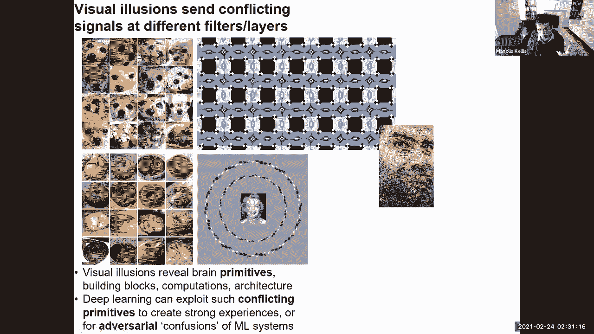

通过在低级基元上编码，会让鸵鸟看起来像，我不知道飞机，反之亦然，所以嗯，我想在此基础上再接再厉，来看看。

的主要成分是什么，呃，卷积神经网络，卷积神经网络的，所以我们谈论的第一个属性是局部性，即低水平神经元对局部斑块做出反应，到当地的接收场，计算受到极大的限制，因为以同样的方式。

深度学习卷积神经网络构建块是这样的，我们将要看到的这些卷积滤波器的计算，又是本地的，它不是一个完全连接的网络，相反，我们将在图像的局部补丁上计算，或基因组的局部补丁，第二个是有过滤器。

就像我们在视觉皮层看到的那样，在你的大脑里，在卷积神经网络中，我们将建造这些低级过滤器，执行同样的操作，整个网络，整个图像，或在整个学习任务中，不管是不是图像，我们看到的第三个特性是层和抽象的概念。

有几层神经元在学习越来越抽象的概念，我们将把这个映射到CNN的方式，我们要有隐藏单元的层，抽象概念将从更简单的部分中学习，从构建块中学习，我们看到的第四个概念是激活阈值。

神经元在超过某个激活阈值后发射的事实，这在系统中引入了非线性，这基本上使学习成为可能，以同样的方式，我们将使用激活函数，所以我们看到了雷鲁，比如说，这个整流的线性单元，我们看到了SoftMax。

我们看到了切线，呃，和其他函数，基本上引入了这些非线性，从而扩展了我们可以捕获、编码和学习的可能功能的宇宙，在我们的大脑和卷积神经网络中，我们看到的第五个概念是汇集的概念，也就是说。

有一些更高水平的神经元对精确的位置不变，老鼠在场的地方，他们要么拿走前一层的总和，要么拿走前一层的最大值，卷积神经网络也是如此，我们将建造，不仅仅是这些卷积层，基本上从低级原语中提取高级信息。

但我们也要添加这些池层，简单地说，我在这张照片的任何地方看到老鼠了吗，还是我在那块补丁里看到了胡须，这将给我们位置不变性，这是非常重要的，但它也允许我们减少参数的数量。

因为我们将拍摄这些非常非常高的像素数图像，你知道的，呃，提取出少量的是，没有关于这些图像中是否出现了特定特征的问题，这也使我们能够加快计算速度，因为我们甚至不必计算图像中的每个像素。

我们只需要计算本地补丁，我们看到的另一个方面是它们是多模态的，基本上有神经元在提取，所以在视觉错觉中，我们看到一些神经元基本上是快乐地放电的，其他神经元为，嗯，原因是我们对同一个图像有多种解释。

共同居住在每一个，呃，我们大脑中图像的延伸，有些是这样检测边缘的，有的在检测边缘，这样，有的在探测圆圈，有的在探测胡须，以此类推，所以你基本上对相同的两个有多种解释，D图像共同居住创造一个卷。

创建同时应用多个筛选器的深度，在卷积神经网络中，我们要做同样的事情，而不是有专门的神经元来计算特定的操作，我们现在将有多个过滤器同时应用，每一个都捕捉了原始图像的不同方面。

他们中的一些人可能认识到了低水平的阴影，其他，高分辨率像素和边缘，等等，我们谈到了饱和度，一些神经元激活后会疲劳的事实，信号也很哑，那么去极化之后，有一种超极化，这基本上使神经元无法发射，过了一段时间。

有多个重复刺激的案例，比如说，如果你和我会毁了剩下的讲座，给你们听好了，你的笔记本电脑有风扇声，就像，对不起，现在，在接下来的演讲中，你将听到，直到你再次忘记它，所以你的神经元能够让重复的信号平静下来。

它们不是以同样的方式提供信息的，在神经网络中，我们将研究限制单个隐藏单元重量的方法，我们将研究各种方法来使，你知道的，如果一个神经元已经放电了一段时间，减少它发射的数量，这样我就可以注意环境的显著特征。

我们将讨论辍学学习，就像我们谈到的那样，其实，几节课前，能够随机扔掉个人，u输入节点到特定神经元，多轮学习，这样他们就不会过度依赖任何一个特定的人，它们不会再合身了，这是在人脑中也发现的一个特征。

我们也有，呃，在人脑强化中，基本上，随着时间的推移，有一些有用的联系得到了加强，我不知道试着，你知道的，把篮球扔进去，你是第一次这么做，第二次或第三次，或者如果你想骑自行车。

你知道你的大脑实际上正在学习如何做一项新的运动任务，它加强了有助于完成这项任务的联系，并限制其他连接，这些联系使比尔·塔拥有表观遗传记忆，具有转录记忆，用，你知道的，附加类型的连接。

你的大脑里有小胶质细胞，并修剪掉没有被充分利用的神经元连接，并加强这些联系，呃，随着时间的推移，它们确实被利用了，所以这基本上是我们在反向传播中看到的原语，我们在整个层次结构中调整这些神经元的权重。

根据手头的学习任务，所以你在努力学习如何骑自行车，你在调整你的运动、认知和平衡的重量，呃，纠正你自然学习的东西，如何通过或多或少相同的，呃，或者至少非常相似的过程，还有前馈边，比如说。

在我们的大脑里有一些神经元有很长的连接，从较低级别，一直到更高的层次，如果你看看我们今天要讨论的Resnets，这些剩余网络实际上是在馈送这些低电平信号，它同样具有避免消失的小梯度的计算优势，呃。

跨越许多不同的层，让您更深入地了解体系结构，所以再一次，最后三个可能更伸展一点，但我想让你做的是欣赏，在人脑内部使学习成为可能的很多原因是，事实上，使用相同的原语和相同的工程结构，我们已经把。

卷积神经网络，我标记所有这些的原因是，因为我不希望你仅仅满足于当前的架构，我想让你想得更远，那个，我想让你们想想一些原始的个体，你觉得对在现实世界中导航有帮助。

以及这些原语实际上是如何编码到新的计算体系结构中的，还没有，所以呃，的。

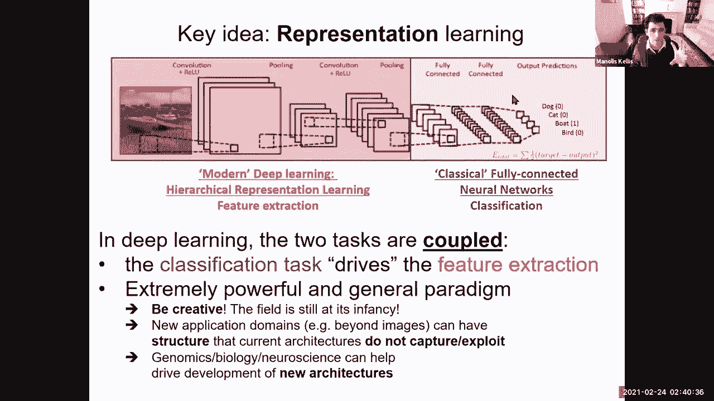

我想我要在那里停下来看看，呃，到目前为止谁和我在一起，呃，让我们看看，嗯，这非常非常好，所以嗯，我们有59个，三个，二九，零，零，然后我想问你的最后一件事是，呃，他们觉得自己学到了一些东西。

所以我们有五一三七六三三，这是伟大的，好的，最后一个关于速度的问题，目前进度如何？还有呃塔斯，聊天记录里有什么问题吗，你想再次为全班同学提出的，我喜欢现在有两三条信息，我的意思是，你知道的。

这是一种能够实时提问的很酷的体验，回答他们好吗，所以是的，我们在聊天中确实有一个未回答的问题，这是一个完全连接的，那么如何看待需要局部性或不需要局部性的应用程序呢？好的，我喜欢那样。

所以这是一个很棒的问题，我会回来的，事实上在下一张幻灯片上，原来如此，它是，这是个很好的问题，我想这张幻灯片会回答这个问题，所以我想的方式，我想你可以想象这些深度神经网络实际上是两个部分。

所以我认为第一部分是简单的表象学习，然后还有一部分是关于分类的，你确实在我们的大脑中看到了这两者，所以我们确实有完全连接的层，我们有卷积层，和，我想让你们认识到这两者之间的二分法，传统的神经网络。

60年代的经典神经网络是完全连接的网络，这里的挑战是你要把图像的每一个像素，对着同一个神经元大喊大叫，从所有这些像素加在一起是不可能说的，哦耶，那里有只老鼠，但首先有这些分层的学习。

跨多个特征的特征提取，所以这里的每一个堆栈都是一个2D过滤器，它被计算，但是一个不同的二维滤波器，然后是一个汇集层基本上是说我在整个补丁中发现了什么，然后从这些检测中，这些额外的卷积层和额外的池，等。

然后是完全连接的层，那么这里发生了什么，我们正在学习一个复杂的非线性函数，通过这些relu和其他激活非线性，这里的激活函数非线性，但我们不是在原始像素上这样做的，但我们是在一系列的表示上这样做的。

我们在深度学习中学到的，然而，这里真正真正酷的是，这两个任务是耦合的，分类任务一直向下传播，它实际上是在塑造，它驱动着表征学习的特征提取任务，这是一个非常强大的一般范式，所以我想让你意识到。

我们甚至还没有开始探索，这个领域还处于起步阶段，你可以有创造力，有新的应用领域远远超出了图像，再次，图像，或多或少是我们周围的感官自然世界，推动了机器学习的许多领域，但我们的大脑有点过时，我们基本上有。

你知道的，我们希望我们的机器做的更复杂的场景，人类实际上可能不太适合的任务，你，应该考虑当前架构所没有的结构，甚至没有开始捕捉或利用，事实上，我对这门课感到兴奋的原因是。

我希望你们对基因组学这个应用领域感到兴奋，和生物学，神经科学与影像学，你知道，所有这些电子健康记录和这些多维多模态，也许可以帮助推动新架构的开发，这些新的架构实际上可能广泛适用于数据科学。

你知道在金融界，你知道的，经济学，地质学和天文学，等等，我们有新类型的数据，这些数据还不能用于，我们进化出的认知任务，用于，它们是，事实上，在某种程度上简单得多，比我们现在看到的极其多维的数据集，好的。

聊天中还有其他问题吗，如果没有，嗯，现在让我们使用我们谈到的这些原语，基本上学习复杂的场景，我想让你以某种方式反向工程你的大脑，看看我在几节课前给你们看的这张照片，但现在通过镜头。

我实际上是如何认识到这一点的，因为你的大脑在做我们讨论过的所有计算，它在做所有这些卷积滤波器，这些边缘探测器，这些物体探测器，这些抽象，它向你展示了一个高度解释和高度解释的世界观，而不是去想原始的像素。

但我想让你把它脱钩，开始考虑，所有这些在你大脑中瞬间发生的操作是什么，每次看到这样的场景就去解读，所以我们要看的是，我们如何使用卷积神经网络，将像素转换为概念，所以你看到的是，当然啦，亚伯拉罕·林肯。

电脑只看到一堆数字，它们是简单的像素强度值和像素简单的图像元素，所以图像只是一个数字矩阵，但是你可以通过，眼睛、胡子和鼻子，你知道，耳朵和头发，等，林肯的标志性形象可以用信息看到，否则那就毫无意义了。

这些数字中没有任何东西有这种意义，那么这个迷你是从哪里来的呢，它现在使用所有这些构建块，所有这些工具，看看我们如何通过计算来计算它们，在…的概念中，在卷积神经网络的背景下，好的。

所以让我们从第一个词开始，卷积神经网络，那么我们一直在谈论的这些卷积是什么，这些又是在利用空间结构，他们正在进行局部计算，非常重要的是，事实上，我可以有同样的过滤器，同样的计算应用于图像的每一个补丁。

意味着我不必学习十亿个参数，我只需要在一个五乘五像素的地方学习两个五个参数，而不是你知道十亿个参数，如何将这些五乘五的块应用于图像的每个像素，这是卷积神经网络的第一个基本概念。

关键的想法是我们重用参数，卷积操作共享参数，这里有一个例子，在那里，我在图像的每一个补丁中计算相同的精确操作，所以这里有一个三乘三的例子，五乘五图像上的卷积，所以我在用同样的过滤器。

在图像的每一个部分都有相同的精确计算，好的，那么计算到底是什么，比如说，我的过滤器可能是零一零一零一，所以它有效地识别X是好的，所以每次有一个X它就会发射，所以在这里它基本上是用，你知道吗。

第一个强度四，因为我的过滤器之间有四个相同的像素，图像的第一个补丁，所以它给了我第二个4，有三种常见的，所以它给了我第三个3分，有四种常见的，你给我一个四，以此类推，诸如此类，好的。

所以这是卷积卷积只是取，它将其应用于图像的每一个补丁，它正在计算特征图，它基本上告诉我图像的每一个补丁中都有多少特征，好的，让我们看看到目前为止谁和我在一起，和我一起讨论卷积滤波器的概念，有很多。

我们将要看到的卷积滤波器的许多层解释，但在基础上，这只是一个矩阵运算，它只是两两计算，你知道的，逐像素，滤镜与图像补丁的比较，太厉害了，所以呃69 2 2 8 0 0，它是伟大的，好的，这是卷积滤波器。

这样我们就可以将卷积滤波器应用到图像的每一个部分。

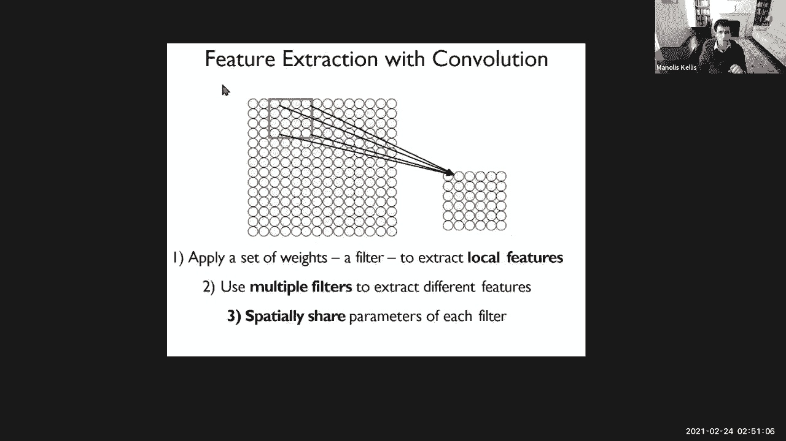

这有效地进行了特征提取，它基本上是在告诉我，我在这里看到X了吗，我看到一个X，我在这里看到了一个X，在这里，我们有一个特征图，基本上告诉我们，这个特征在哪里映射到图像的所有补丁上，所以我们用一组砝码。

提取局部特征的筛选器，特点是我看到了一个边缘，或者我看到了胡须，或者我在不同的抽象层看到了一条腿，我们将使用多个过滤器来提取多个特征，所以一个人要这样寻找边缘，一个人会这样寻找边缘，以此类推，以此类推。

以此类推，关键原则，我们在空间上共享每个滤波器的参数，我们基本上在这里的最后有一组参数，也就是完全连接的层，我们对每个过滤器都有一组参数，所以这个特殊的过滤器，这可能是边缘探测器。

这可能有一个三乘三的参数网格，所以你知道的九个参数右指向边缘检测器，少指向边缘检测器的另外九个参数，另一个，呃，你知道圆探测器的九个参数，好的，所以这些参数是共享的，我基本上可以每个特性都有一个参数。

我把特征提取应用到整个，呃，一次图像，对于隐藏层中的每个神经元，您从补丁中获取输入，你计算一个加权和，然后你应用偏见，那么为什么偏见，因为不是所有的东西都是线性函数。

基本上你知道每个神经元都有一定程度的，你知道它发射的激活，这就是偏见，在没有任何数据的情况下，在没有任何数据的情况下，我总是得到B，但在有数据的情况下，我基本上得到了输入的一些线性函数。

由相应的权重加权，好的，所以我们在施加一个重量窗口，我们在计算一个线性组合，我们用非线性函数激活，好的。

所以在基础上，每一个卷积滤波器操作都是这样的，这是计算是超级琐碎的第一部分，这只是一个操作，我做了一遍又一遍，第二部分是这些过滤器，这些引用未引用的内核，这些卷积滤波器基本上是从图像中提取特征。

我们基本上是在学习表征。

所以说，卷积运算基本上是在说，哦，我要探测到一个垂直的边缘，所以这里有一个三乘三的过滤器，可以检测垂直边缘，然后在这样的图像中，那个过滤器在图像中间发射最强的，如果如果我，你知道的。

如果你看Photoshop，比如说，可以在Photoshop中选择不同的滤镜，您可以选择锐化或边缘检测或强边缘检测，基本上，这些特征已经被硬编码了几十年，Adobe Photoshop内部。

人们基本上选择了已经使用过的硬编码功能，你知道一遍又一遍地，所以如果你有一个输入图像，即使是最简单的一减一的过滤器，基本上会产生一个输出，它将立即检测到图像的边缘，有很多很多这样的过滤器或内核。

为什么我们称它们为内核，因为它们会转化，把原来的空间变成投影空间，我们在第一节课中看到，当我们谈到支持向量机时，内核能有多强大，因为你基本上可以创建一个转换，将原始空间映射到转换空间，例如。

ED检测是最简单的检测之一，锐化是另一个，模糊是另一个，高斯模糊是另一种，所有这些你都可以在脑海中简单地看到它们在做什么，所以这个是在一维中检测边缘，这里检测到一个边缘，你知道的，中心与外围，这里。

中心对整个外围等等，诸如此类，注意到他们都试图有一个零一的输出，对于零一输入，所以他们不是，你知道的，他们除以九。

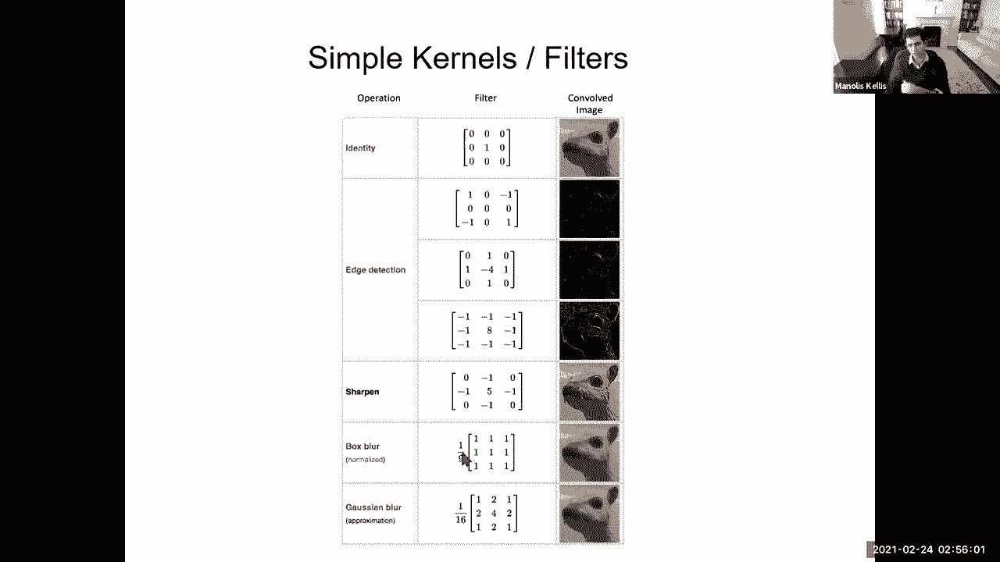

他们正在正常化，这样他们就不会结束，呃过于敏感，这是第二个概念，事实上我们正在学习特征，我们正在学习原始数据的表示，第三部分是我们实际上可以学习这些表征。

我们不必依赖三十年的过滤器，我们可以为手头的任务重新学习它们，正如我前面提到的，您的任务是驱动您学习的过滤器，如果有些过滤器对检测老鼠没有帮助，那么猫就不会进化出这些过滤器。

所以就像不同物种进化的方式一样，卷积过滤器从出生起就在他们的神经元中硬编码，有时是在出生后通过暴露在特定环境中学习的，相同的过滤器可以重用于对该物种最有帮助的任务，如果有些任务非常，对特定物种很有帮助。

然后在进化上，它们最终会在神经网络中被硬编码，他们生来就有，即使没有任何学习，然而，有一些过滤器通常是有帮助的，比如说，边缘检测在任何地方都有帮助，也许人脸检测在任何地方都有帮助，所以我们可以思考。

这让你转移学习，你知道的，更先进的体系结构，我们基本上可以说好，也许我不想重新学习我对世界的整个描述，每一个新的任务，也许我想应用一组卷积滤波器，到与边缘检测相关的图像语料库，船只探测，目标检测。

动物检测，等等等等，然后我用这些做了巨大的核心，圆周率或数据尸体，然后我可以只学习手头特定功能的最后一层，例如，如果我有医学图像，你知道的，成千上万的病人，我在看他们的肺，比如说。

我可能会学习卷积过滤器，这与肺部生物学非常相关，从一个巨大的语料库，然后应用到垂涎的病人身上，比如说，嗯，最近才出现的，而不是有几十年的训练数据我可以使用，所以我基本上可以在这里预习，表示的中间层次。

甚至高级别代表，然后再训练呃，后续u。

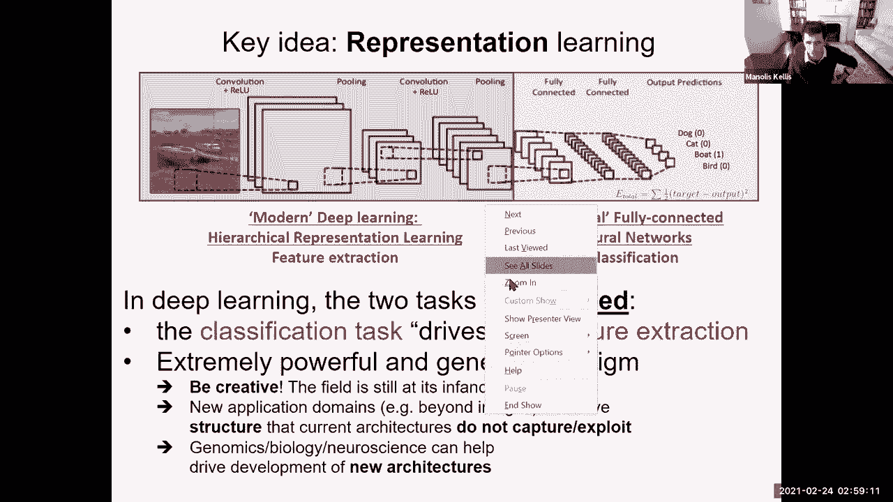

正如我前面提到的，的，卷积神经网络的美丽与力量，你学会了这些过滤器。

你学会了卷积滤波器，从图像中提取公共特征，所以要识别一个你可以寻找的人，你知道吗，普通过滤器可能会有所帮助，比如鼻子，眼睛和嘴巴，但这些是完全没用的如果你想识别不同类型的车。

这里重要的特征是车轮车牌和前大灯，它们完全没用，如果你有一个建筑建筑的数据库，你试图，我不知道，估计这里的相关功能是门窗和台阶的价格，所以在每一个新的图像类别中都有非常不同的功能。

所以卷积神经网络的核心思想，我们要学习学习，不直接从数据中硬编码特征层次结构，而不是手工设计它们，所以不用在Adobe Photoshop中手工制作滤镜，我们基本上可以从头学习数据集中的特征，还有这些。

呃，直接为手头的任务学习特性，所以如果你手头的任务是在机场区分不同的人，那么低层次的特性将与您的任务是架构性的非常不同，或者如果你的任务是汽车，然后你能看到的中层特征已经开始识别眼睛和耳朵，哦。

鼻子等等，然后高级特征开始识别面部结构，所以这些被调整到手头的特定分类任务，然后通过整个互联网反馈，所以通过不同的层，不同的卷积层，你基本上是在提取这些特征，所以我忘了提，我们为什么要提到。

为什么我们首先称它们为卷积，因为这实际上是一个卷积操作，因为你在卷曲，基本上意味着你在扭在一起，两件事如此旋转，进化，卷积，等等都是同一条路线，它基本上意味着你知道把一个扭曲到另一个。

然后反褶积把它们拆开，所以卷积意味着你要通过过滤器扭曲这个。

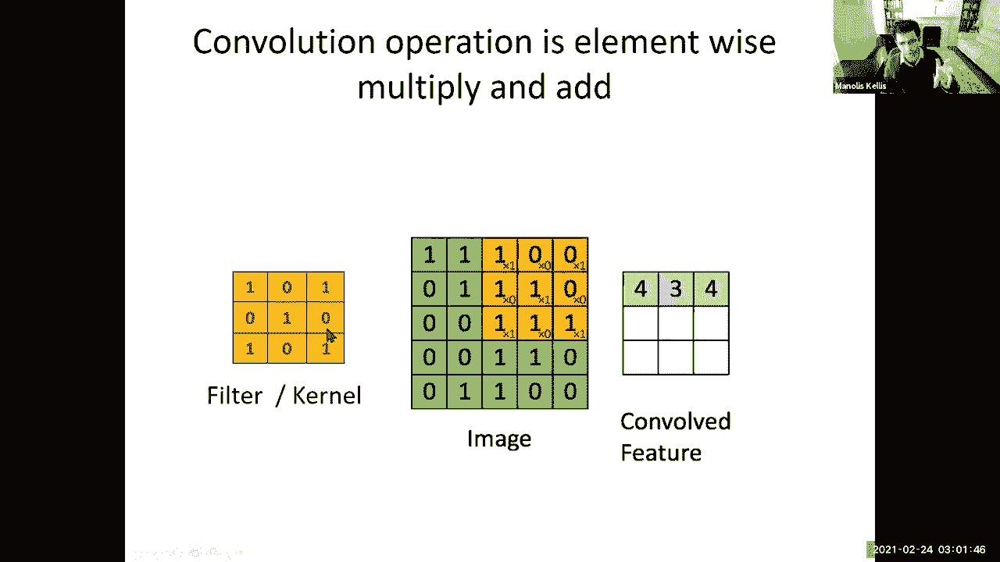

好的，所以这就是，你知道的，下一个任务，基本上学习这些卷积滤波器，我们在大脑中谈到的下一个特征是检测，有没有优势，是不是有只老鼠，我看到胡须之类的了吗，这就是非线性出现的地方，因为如果你没有这些非线性。

一切都在同时大喊大叫，你基本上得到了胡须的过滤器，基本上给我低水平的噪音，尾巴的过滤器又给了我低水平的噪音，不断地穿越世界，我不能集中精力在任何事情上，相反，如果我引入这些非线性，我一直保持沉默。

直到我真正看到一条尾巴，他们就像，哦，有一条尾巴，这就是非线性出现的地方，你可以，你可以把它们看作是检测，就像说有什么东西在那里或不在那里。

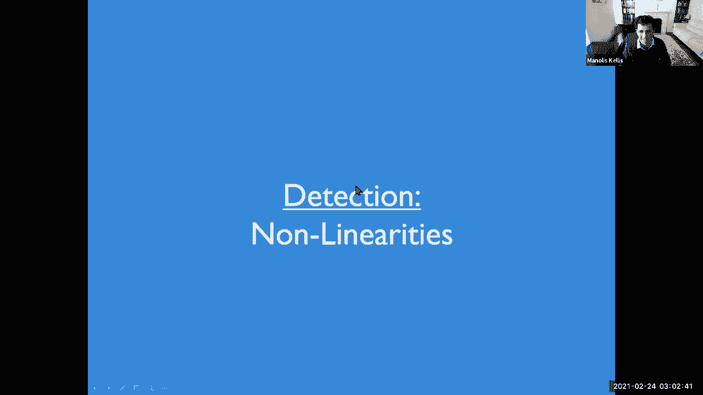

是啊，是啊，我想它冻住了，嗯，如果它只是，不只是你，你们回来了吗，是呀，我们回来了吗，是啊，是啊，我们回来了，好的，伟大，谢谢你让我知道，嗯好吧，这些是我们讨论过的非线性。

我们讨论了几种不同类型的非线性，我想从这里提取的概念，它是关于检测的。

它是关于观察有什么东西在那里，我们讨论的下一个概念是池层，这给了我们位置不变性。

池允许您做什么，基本上是在某种截面中找到最大值，它减小了表示的大小，它加快了计算速度，它使一些检测到的特征更加健壮，这基本上是知道，我在图像的任何地方都检测到了一些东西，这就是我所需要知道的。

然后我可以采取行动，这是基于在任何地方检测到一些东西，例如，这是最大池，二乘二过滤器，步幅二，这基本上意味着我在一个二乘二的网格上计算，我把网格的最大值，然后我不计算这个中间的。

我每次跳两下你可以玩这些参数，你可以调整你的过滤器有多大，你的步幅有多大，你是要取最大值还是平均值，它有许多有用的特性，像降维，空间不变性等等，所以它又一次放弃了极其精确的空间位置。

它并不关心到底是什么像素产生了那个特性，但它是一个功能，不是虫子，你的位置不变实际上是有帮助的。

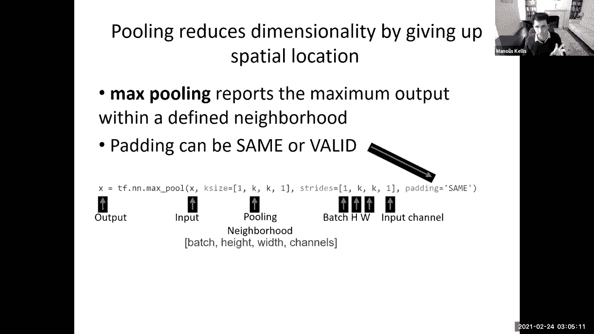

这又一次让人想起了我们大脑中实际发生的事情，最后一个U概念是分类，基本上，这就是我们到达完全连接层的地方，我们基本上在学习这些，你知道现在使用的更复杂的函数，利用整个场景的信息。

所以如果我试图对环境中的特定场景做出反应，我想知道你知道，哦，有一棵树和一只鸟。

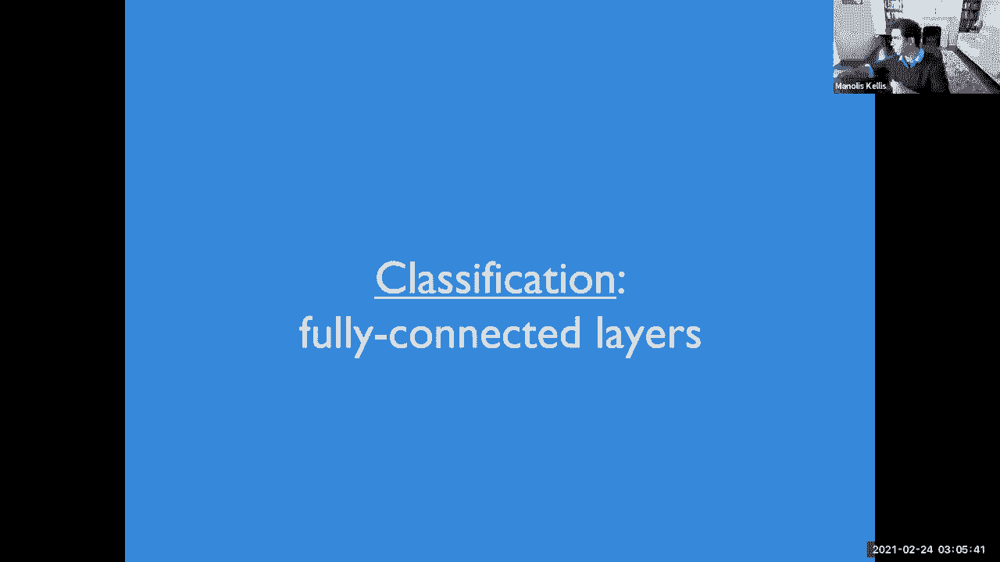

然后呃，你知道一只兔子，等等，由此我可以采取适当的行动，这基本上是完全连接的层，隐藏层的每个神经元都在，连接到输入层中的所有神经元，没有更多的空间信息，我们现在已经完成了所有的特征提取。

现在只是分类的问题，这需要很多很多的参数。

然后这些完全连接的层允许你捕捉，您现在从网络中提取的特性的组合，所以在所有这些卷积层之后，我现在在这里有功能，我现在正在结合、利用和倍增，你知道这让我最终决定某物是人还是猫，或者一只狗，等等，等等。

所有权利，还有一些额外的，嗯，你知道的，呃，捕获的方面。

其中一个是边缘盒，这些都是边缘情况，嗯所以嗯，你如何处理这样一个事实，当我计算我的卷积时，我不能完全计算第一个像素，因为你知道我的图像最终会缩小，所以如果我拿一个六乘六的图像或者三乘三的滤镜。

所有的边缘基本上都不会得到很好的处理，解决方案基本上是用零边框填充图像，有很多不同的，呃，填充选项，所以你可以简单地不垫，或者你可以根据你的过滤器大小垫，以便输出大小与输入大小完全相同。

所以你保持了这种不变性，同样，您可以在输入处归零，所以输出是一样的，也可以只选择有效的卷积，并且只有当整个内核包含在输入中时才有输出，但问题是它缩小了产量。

或者您可以通过对输入进行零填充来使用完整的卷积，以便每当输出值包含至少一个输入参数时产生输出。

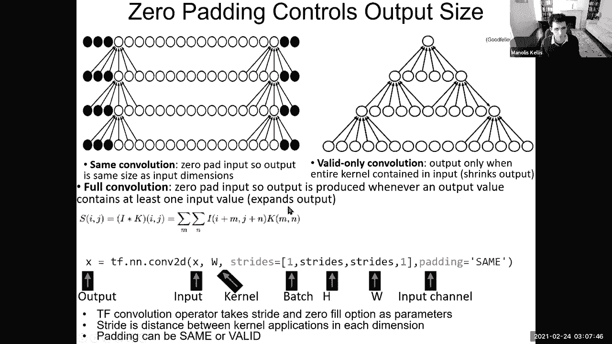

这实际上扩大了输出，所以再一次，你在这里有很多不同的选择。

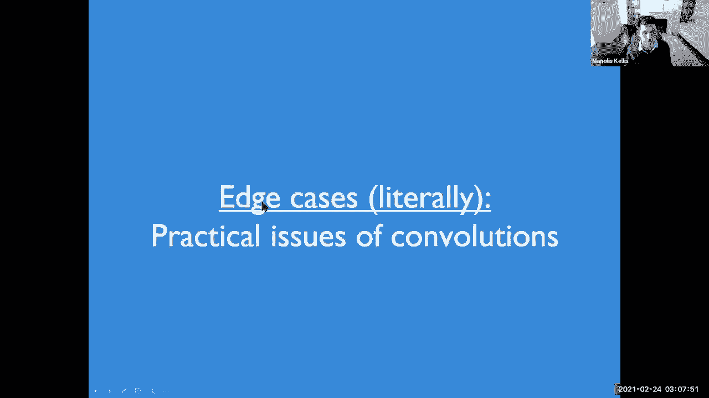

嗯，还有其他实际问题，比如说，这样的步幅，你每次跳多少，所以你可以跨两步或三步，或者一步，然后嗯，你也可以有膨胀的卷积，所以你可以计算一个三乘三的补丁，但是不是只在这里计算三乘三补丁。

你可以计算三乘三批，通过扩大你所看到的单个像素之间的距离，一次又一次，不要认为这只是在像素的层面上，你可以把它看作是在这些高阶特征的层面上，你每次都在学习，所以如果你的输入在这里。

你可以用膨胀1做一个隐藏层，兴高采烈的隐藏层，一个隐藏的层，有欢欣鼓舞的四个，等等。

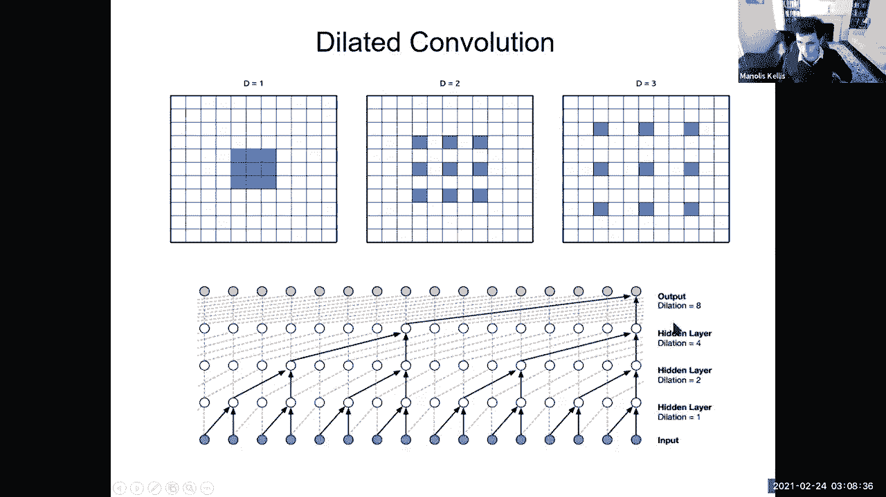

所以另一个非常重要的概念是，在现实世界中，从一个图像到另一个图像的特征显著不同。

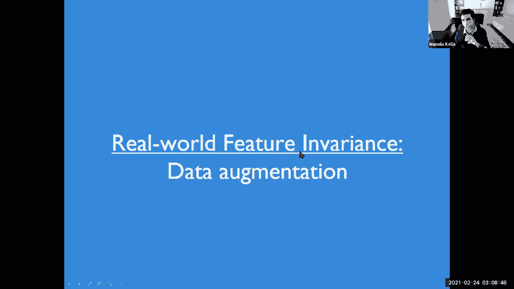

例如，如果我给你看这三张照片，你清楚地认出他们中的每一个人，事实上，如果你仔细观察，你认识到这是从三个不同角度看到的完全相同的雕像，如果你看看这里的企鹅，你认识到这是同样的企鹅，不管光度如何。

你认出一只猫，是否有部分遮挡，还是扭曲了，还是在豹纹沙发上，你认出椅子，不管椅子有多疯狂，你认得人，不管他们之间有多大的不同，那么我们如何为机器学习实现这一点呢，基本上我们讨论过的所有过滤器和网络。

你知道不完全是为了这个，你知道问题是，如果我的x和这个一模一样，是呀，我的过滤器会识别它，但如果我的前男友长这样呢，我如何学习过滤器，即使是畸形的X也能识别，所以一种方法是功能工程。

你知道如何使我的过滤器对转换不变，但有一个更简单的方法，而不是学习如何对变换保持不变，让我们首先简单地转换图像，所以我们基本上可以增加数据，通过镜像我的猫形象，通过随机裁剪，我对猫的印象。

通过随机旋转和剪切翘曲，通过改变猫的颜色，所以我还在学习猫的概念，但不是只有一个猫的形象，我现在对那只猫的图像有成千上万的扰动，有效地实现了同样的目标，而不是学习让我的特征变得不变，我把方差加进去。

而是直接到训练图像上，因此，我要学习的功能。

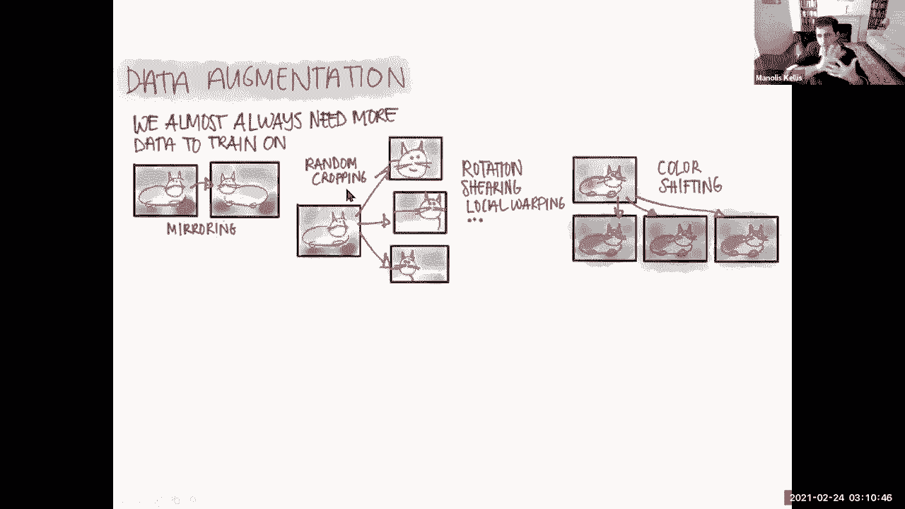

将对此保持不变，这样你就知道我能识别物体，不管他们在场景的哪个位置，无论什么方向和旋转，所以基本上这辆巴士那辆巴士和那辆巴士的大小都在变化，在形状上改变方向，等，但我仍然能认出他们并把他们归类。

自下而上的数以百万计的特征，我们将学习卷积滤波器，我们将通过转换图像来学习它们来实现这一点。

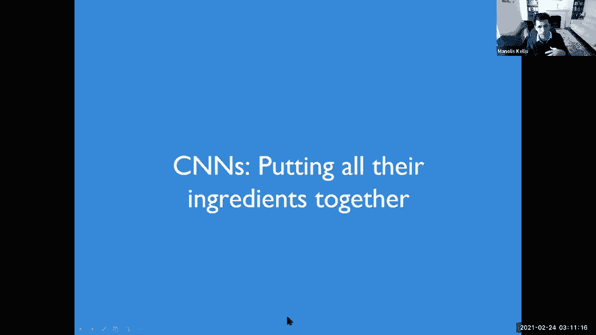

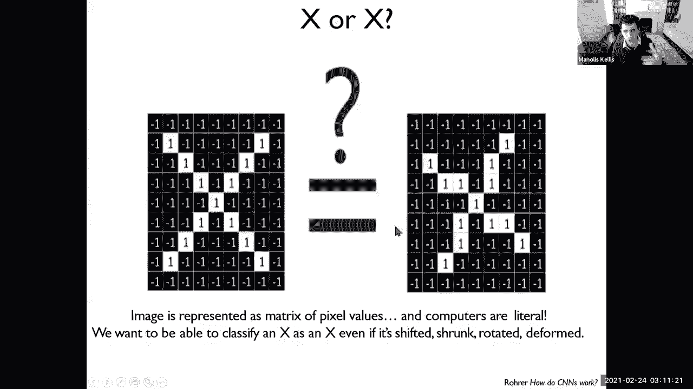

呃不变性，好的，所以让我们看看到目前为止谁和我在一起，我们如何实现对所有这些转换的不变性，被呃，转换我们最初提供的图像，所以有点像学习如何扔篮球，你可以，你知道吗，扔了很多次，你有效地养活了一群人。

你大脑的参数，呃为了那个好吧，所以我们有六十六三十四零零零，所有权利，所以我们已经覆盖了大量的地面，我们现在可以看到我们是如何把所有这些放在一起的，好的，所以现在让我们回顾一下。

在我们进入所有这些不同的组件之前，我们有的第一张幻灯片，我们谈到了局部性，通过这些卷积滤波器，我们谈到了过滤器和特性的概念，基本上执行相同的操作，关于抽象，关于这些渐进式高阶概念，我们谈到了脱粒。

通过这些激活功能，我们谈到了汇集，这个最大和平均池，和位置不变性，简化参数和加快计算，我们谈到了多模态，事实上，我可以计算很多很多过滤器，给我一卷，而不仅仅是我网络每一层的矩阵，我们谈到了饱和和增强。

和前馈边缘等等，诸如此类，好的，所以让我们把它扑灭，现在把一切都放在一起，这是典型的深度卷积神经网络，所以我们基本上有一个三九乘三九的图像作为输入，这是一个RGB图像，红绿蓝。

所以我们将有一个39乘39像素的体积，次数，三种不同的输入，在那之后，我们现在在图像上计算20个不同的滤镜，用两步的步幅，所以这基本上意味着我要有10个深度，因为我在计算这个三七乘三。

七或三九乘三九图像，在每个像素上，我们不要担心边缘，然而，在每个像素上，我计算了20个过滤器，但我不是在计算，它们就像每一个像素，我每秒钟都在计算，所以在那之后，我基本上会有一本十卷的书。

因为我的A过滤器长度为5，然后哎呀，对不起，我在跳到前面，所以呃，我在我的十个过滤器上计算三个特征，对不起，我在计算十个过滤器，这基本上创造了十个卷，然后你知道我们就是这样从这里到那里的。

我觉得最重要的是，根据我正在计算的过滤器的数量，如果我在这里计算20个过滤器，我最终会得到一本20卷的书，如果我在这里计算40个过滤器，我将以40的体积结束，以此类推，好的。

所以我基本上每次都在计算多个特征，在我的网络的每一层改变卷的形状，最后，我把我的关系网拉平了，所以如果我有一个7乘7乘40的不同层，所以这里我基本上有40个概念，我已经计算过了。

图像的每一个七乘七的补丁，好吧，我的40个概念可能是猫，鼠标，愤怒，黑色，你知道，吓人，等，好的，这是我学到的四个概念，这些概念是在一个七乘七的补丁中，现在我把这四个概念都扔到我图像的每一个补丁上。

我有这个一千九百六十平的特色空间，然后我把它带到我的，你知道的，最终U全连接网络，比如说，所以这是一个深度卷积神经网络，这是另一个例子，而不仅仅是一遍又一遍地拥有这些卷积层，我现在有一个卷积层。

然后是一个池层，另一个卷积层，另一个池层，然后多层这些完全连接的，根据我正在计算的过滤器的数量，然后汇集，等等，诸如此类，同样，我们可以一次检测多个特征，所以如果我在这里说一个RGB频道。

我可以在那里计算多个特征，然后可以计算两个过滤器，一个用来探测胡须，一个用来探测尾巴，现在我知道在我的特征图中，我在哪里看到胡须，我在哪里看到一条尾巴，好吧，等等，等等，如果你跳到代码中，这就是如何在。

你知道张量流，所以你基本上可以说导入TensorFlow作为TF，然后我将基本上使用Keras引擎进行深度学习，然后我要创建一个二维卷积层，你知道的，呃，不同的过滤器大小与此特定的激活功能。

有不同的池子，不同的步幅等等，然后我就会变平，基本上这是我的第一个卷积层，然后我再加一个卷积层和一个拉力层，池层中的另一个卷积层，然后我要把这个压平，然后我要创建这些完全连接的层具有不同的激活功能。

这基本上给了我一个架构，我将能够对现实世界中的物体进行分类，好的，所以让我们看看谁觉得他们今天学到了什么，所以六十七，两个，一个，三个，六，三个，呃，助教们还有什么问题没有回答。

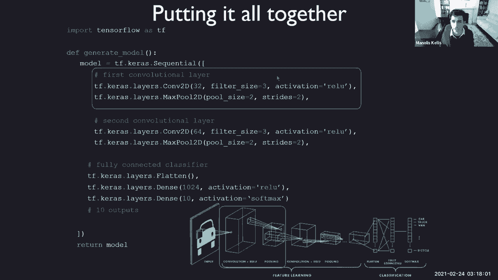

所有的权利，所以现在让我们看看不同的体系结构，比如说，这是简·卢坎的第一批作品之一，这是呃，鲁内特五号，是用来识别文件的，它基本上帮助建立了我们今天如何看待卷积神经网络，用一系列卷积滤波器和子采样。

完全连接的最后一步，呃，层和输出，所以它能够识别，你知道的，手写支票或文件，你知道它或多或少地使用了我们刚才谈到的架构，它只有6万个参数，但随着我们深入网络，你知道的，卷积滤波器数，呃，你知道的。

一次又一次地改变，所有这些都是通过反向传播完成的，所以基本上你是对你的误差函数相对于，输入，但也很抱歉，相对于你的完全连接层的重量，而且也相对于每个过滤器参数，所以如果我有一个三乘三的过滤器。

我可以问如何改变那个像素，或者过滤器的那个位置，当它通过整个矩阵计算时，这对我的整体表现有什么影响，然后你要对误差函数求偏导数，与你所有的，呃，个别参数，然后你知道你基本上做了卷积，你有你的非线性。

你有你的池和你的完全连接的层在最后。

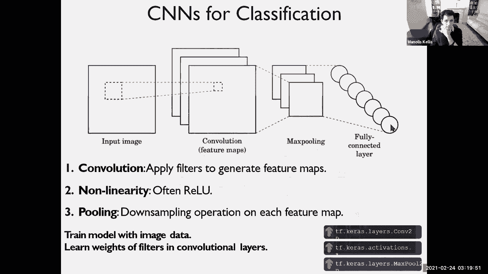

一次又一次，因为你知道，探测汽车，你可以有卷积层，呃，整流线性单元激活函数，卷积基本上是应用特征提取检测，特征提取检测，然后你知道，呃，位置不变性等等。

最后你的完全连接层基本上会给你分类，正如我们所说的，如果我计算五个不同的，我基本上有五个深度，这些只是你的不同层次，你知道的，按宽度划分的高度，操作。

所有的权利，所以所有这些都是卷积神经网络的基本组成部分，希望你能明白为什么它们很棒。

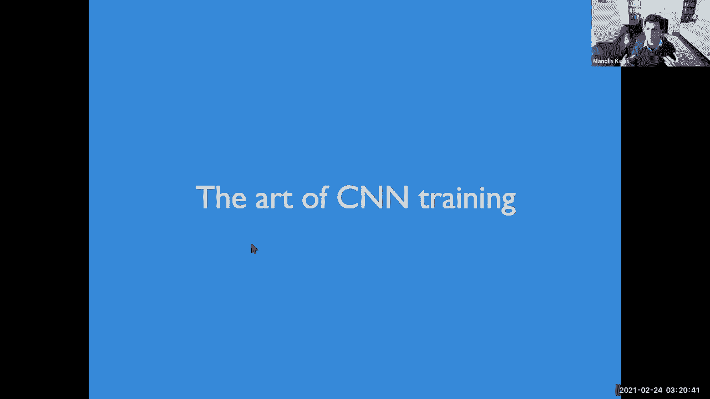

为什么它们实际上很自然，为什么他们以非常自然的方式完成任务，所以训练卷积神经网络在很大程度上是一门艺术，这是大量研究已经进行的事情，所以用经典的机器学习，你有，你知道，大约几百个，数以万计的样本。

你可以用60%的数据进行训练，你可以用你知道你的开发或你的验证集另外20%，然后你省略了另一个测试集，其中有20%的数据，你要确保他们都来自同一个地方，从相同的分布中，事实上你的训练集不仅仅是一堆。

你知道的，超级专业猫咪图片来自网络，你的测试集是你知道你的业余模糊猫图片从你的应用程序，所以你知道你想确保你的训练集和测试集，您的开发集实际上来自相同的发行版，但深度学习的挑战是你有更多的参数。

你在学习许多不同的层次，所以你需要更多的训练数据，所以你没有牺牲的奢侈，40%的数据用于开发和测试，相反，您将98%的数据用于训练，然后你有数以百万计的样本，所以现在你有足够的时间来搁置你的开发和测试。

好的，所以正常化在训练中很重要，所以如果你的数据在不同的维度上是不对称的，然后你想重新来过，以便每个维度之间的方差为，呃，同样的，当然，您希望对您的，您的测试、开发和培训集，我们前面谈到的另一个挑战是。

如果您的数据是规范化的，你可以在各种方向上拍摄你的渐变，但是如果您将数据规范化，事实上，你可以使用更高的学习率，我们上次讲到梯度下降和滑动的学习速度，消失或爆炸的坡度是一个巨大的挑战。

当你有许多深度神经网络，很多层，你可以有非常，非常小的偏差，变得非常大，或者你可以在一开始就有这些重量，几乎没有明显的效果，所以基本上每一层之后，你基本上可以有，你完全知道这一点。

对于小数字或这些爆炸梯度，对于大量，在这两种情况下，梯度下降基本上需要很长时间，一个解决方案是非常仔细地选择初始值，你知道的，调整方差，输入数，另一个呃，与学习相关的挑战是如何选择批处理大小。

所以你基本上可以说，我将在每一次迭代中对我的整个数据集进行训练，当然，这是极其昂贵的，而是，你可以选择小批量，每次对每个小批量使用梯度下降，在迷你批之间旋转，确保您不仅仅是在一小部分数据中进行训练。

但也要确保你不是那种，你不必遍历整个呃，每次数据集，所以如果你使用批量1，那基本上是随机梯度下降，就是每次选择一个随机元素，然后根据它在该元素上的表现来调整梯度，如果您选择尺寸M，然后基本上是小批量的。

呃，你知道的，小批量和大批量之间有很多权衡，嗯，有各种很酷的，呃，培训技术，所以rms支撑根主平方，呃方法是，你知道，允许速度较慢，更快的学习，基于呃，这些参数之间的归一化，然后呃。

你也可以改变你的学习速度，你知道的，不同的功能取决于时代的数量，基本上从更大的学习开始，然后你知道用一些被称为模拟意义的东西，基本上就是调音，学习率基本随历元数的增加而降低。

你的超参数，呃，深度卷积神经网络是有效的隐藏单元数，迷你批量，层数，学习率，学习速率的衰减率，等，然后这些超参数，哪些是你的参数，是重量和偏见，超参数基本上是体系结构，然后训练参数。

所有这些都会对你的整体表现产生巨大的影响，用经典的机器学习，你基本上会做一个网格搜索，你基本上会说这是我的超参数一，这是我的超参数二，让我试一堆不同的值，你知道做一个网格搜索。

但问题是一次迭代需要很长时间，你知道你基本上可能没有那么大的影响，另一种方法是在参数空间中随机搜索，找到表现最好的，然后在那些，特别是，你也可以随机均匀取样，或者调整均匀性，比例尺那是对数。

或者去你知道的地方，参数实际上是最大的，呃，意思是，然后呃，有嗯，很好的类比，呃，你知道熊猫训练，基本上就是你，呃，像个熊猫妈妈，你花了几年的时间抚养一个孩子，你知道你有一个模特，你把它调成，你知道。

通过把你所有的精力都投入到这件事上，或者鱼子酱的方法，就是你生了很多模特，每个都有一组不同的超参数，然后你在这些上面学习。

选择你的训练套件是非常重要的，您的开发集和测试集，有很多挑战，嗯，你在训练中的表现如何，与测试集的比较，与您的开发集，我们会更多地谈论这些。

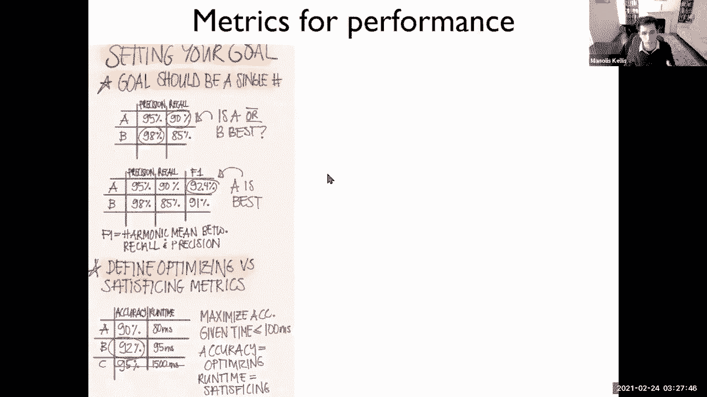

呃，下次，所以呃结束。

我想，嗯，也许潜回。

呃，我想我们今天谈的，这是卷积神经网络的关键特征。

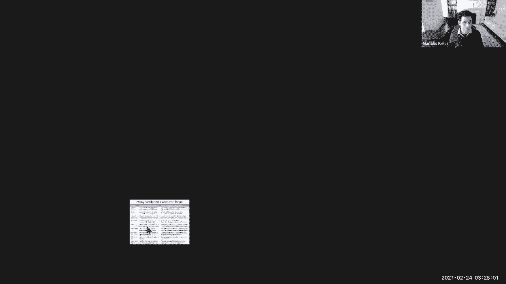

基本上我真正想让你们做的是，不是太关注物流，还有哦，一直都是这样做的，这就是我要做的，我也是，我只需要了解，卷积神经网络的所有不同方面，我想让你们关注的是这些方面背后的基本原则，这就是我试图做的。

自始至终强调，基本上我们讨论了卷积，你知道为什么它们很重要。

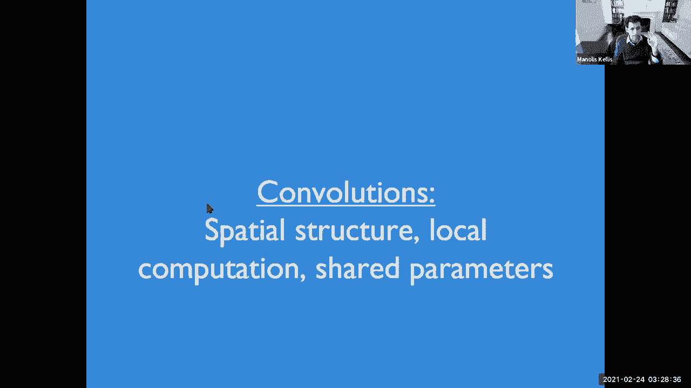

你知道空间结构，这个地方，参数共享，我们谈到了我们正在学习表征的事实，那些过滤器，提取特征，我们谈到了这样一个事实，我们正在学习这些表征。

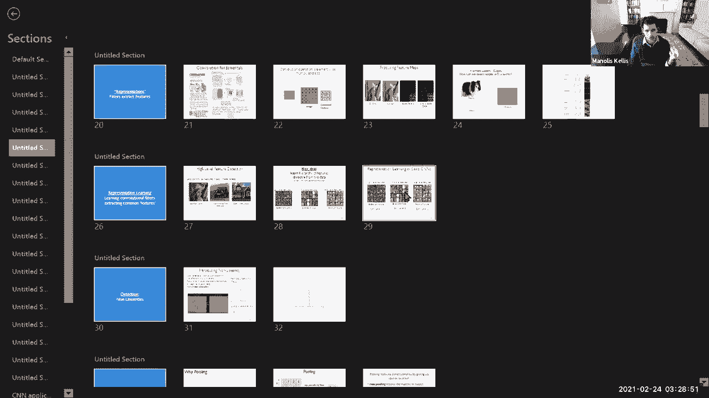

我们正在调整这些以适应手头的特定学习任务，这些表征学习是由我们的分类任务驱动的。

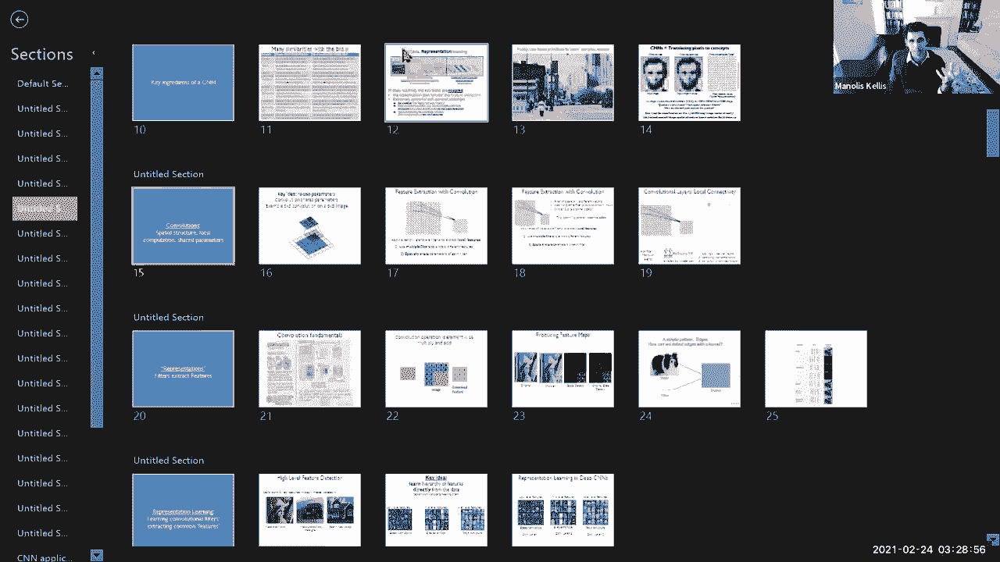

我们谈到了这些检测，是或不在场或不在场，而这些非线性，我们谈到了汇集层，基本上创造了这个位置不变性，以及关于分类的最后一层，如何处理边缘，有衬垫的，以及如何，你知道，实际问题，如大步，和，非常重要的是。

我们如何使我们的训练对小扰动不变，通过基本上制造小的扰动，把它们扔到我们的学习模型上。

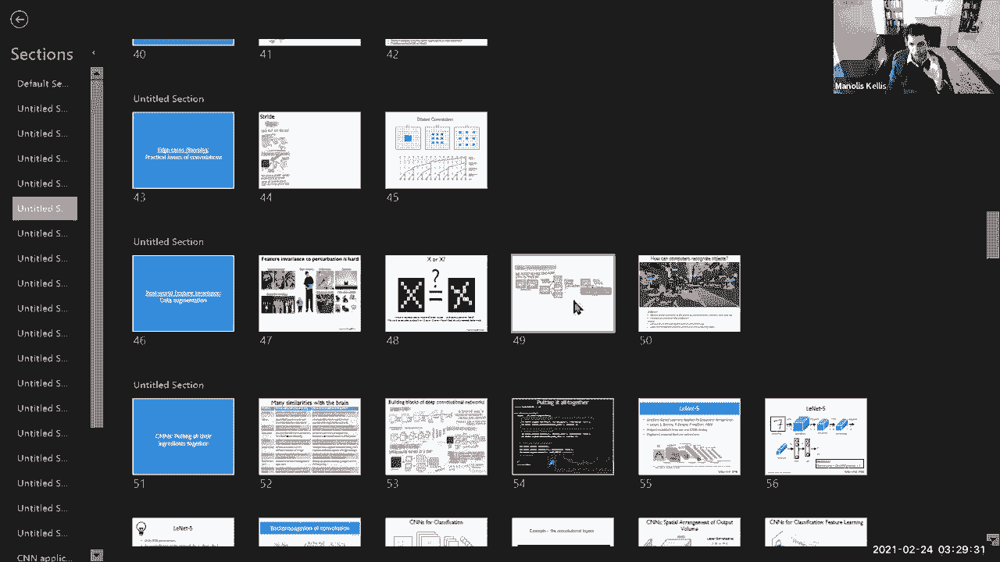

然后把它们放在一起，不同类型的体系结构，如何组合所有这些原语，这就是我真正想让你带回家的。

事实上，这是一种非常通用的技术，你可以在很多很多不同的设置中使用它。

然后我们会有很多机会通过这门课，更多关于训练模特的艺术。

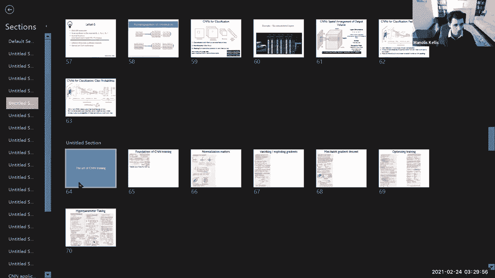

所有的权利，所以呃，最后一个问题，谁觉得他们今天学到了什么，所以说，可爱，再次感谢，在聊天中的惊人存在，看到大家都在问问题真是太好了，所有这些都可以通过Panopto获得，我希望你们已经尝试过了。

所以我们有71个，二四三零三，太厉害了，所有的权利，嗯，谢谢大家，然后我们星期四见。