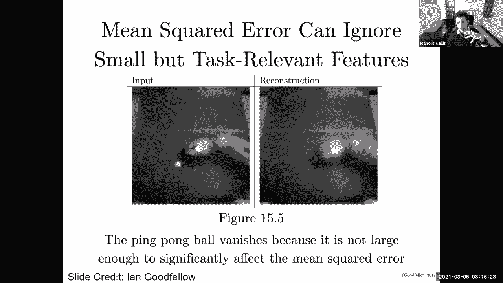
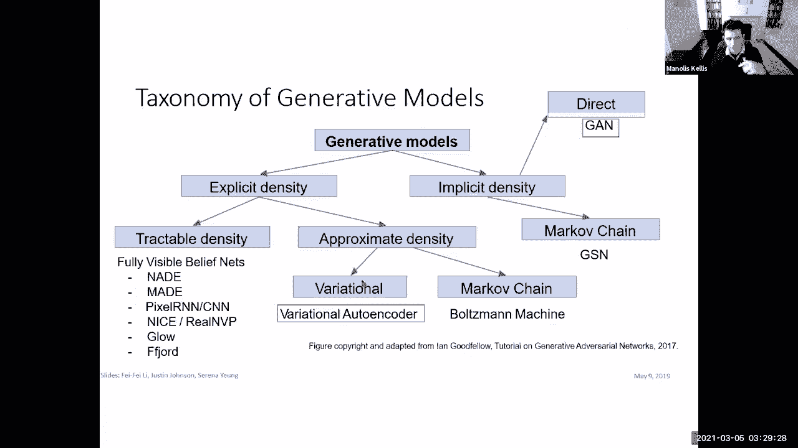

# 【双语字幕】MIT《面向生命科学的深度学习》课程(2021) by Manolis Kellis - P6：Lecture 6 - Generative Models, GANs, VAEs, Representation Learning - 爱可可-爱生活 - BV1wV411q7RE

所有的权利，欢迎大家，所以今天我们讨论的是生成模型，那么生成模型意味着什么呢，这些模型实际上可以在世界上创造东西，实际上可以为世界建模，不仅歧视，而且实际上产生，所以我们要看看两个最受欢迎的模型。

所以生成对抗网络和变分自动编码器，更广泛地说，我们将讨论模型如何学习表示，我有一群很棒的人要感谢幻灯片，所以他们列在这里，他们会列在每张幻灯片上，所以我们基本上已经看到了表征学习的概念。

所以当我们谈到卷积神经网络时，我们说过，呃，你知道的，传统经典全连通神经网络的区别，我在卷积神经网络讲座上提出的观点，是巨大的进步来到这里，我们知道这件事，自从60年代以来。

我们知道了一种完全连接的网络，这很好，很美，我们有无数的参数可以学习，如果所有这些都是完全线性的，那么它并不比单层线性模型好，但是当我们引入非线性的时候，这些都非常强大，能够学习非常酷的功能。

但深度学习的真正创新来自左边的这个部分，也就是说当我们呃，讨论卷积神经网络，我们谈到了这个分类任务，或多或少是学习世界表征的借口，而且那个，模型的大部分力量来自于学习滤波器的卷积，他们自己。

在最低的水平上，他们学习边缘和角落，然后呢，你知道的，我不知道，呃，轮子，更多的一般场景等等，所以这就是很多提前的力量来的地方，剩下的你可以即插即用，表征学习，特征提取是我强调的。

作为卷积神经网络中最重要的概念，事实上，这是同样的事情，在，你知道的，图的递归神经网络，所有这些自动编码器中的神经网络，变体自动编码器，对抗网络，所有这些都是关于表征学习的，所以这是关键的普遍想法。

我想让你出去，本课程的，更广泛地说，机器学习，分类任务实际上是驱动特征提取任务的概念，特征提取是世界上所有知识表示的来源，这实际上是一个非常强大的一般范式，我想发挥创造力，这个领域仍处于起步阶段。

除了图像之外，还有许多具有结构的应用领域，当前的体系结构尚未捕获和利用，所以当你开始思考表征学习时，这是一个对自己的建筑进行非常创新的地方，在基因组学、生物学和神经科学中。

您实际上可以使用应用程序域区域来开发潜在的新体系结构，这就是我认为这个项目的全部，我们如何利用现有的架构，但在某些情况下，我们是否可以扩展到现有的体系结构之外，学习一些关于现实世界的表征。

我在最后一种机器学习中做我想做的事情，全班重点讲座，在我们深入应用程序领域之前，就是进入生成模型，就是把这个处理掉，只要在那里放一个大X，基本上说我们真的需要分类吗，我们真的需要标签吗，在我看来。

令人兴奋的部分是Z是这个潜在的空间表示，我们有一个X，这是一堆数据，我们有一个Y，那是一堆标签，我们在，你知道的，区分猫和船的图像，多么令人兴奋啊，嗯，是啊，是啊，挺可爱的，而且很刺激。

因为你可以整天喜欢看猫的照片，永远不会被船认错，你知道那很棒，但最重要的是，它实际上是在学习一个世界模型，因此，最大的问题是，是啊，是啊，伟大，有数以百万计的标签图像在那里与Y's。

但如果我们完全放弃Y呢，然后有很多，多个数量级的更多数据，在那里我们可以在不知道任何明智的情况下学习Z，好的，所以今天的目标是，我们怎样才能除掉Y，专注于学习表征，用各种其他很酷的方法。

那么到目前为止谁和我在一起，每个人都可以看到，你知道的，我们试图在表征学习中得到的观点，所以这之所以令人兴奋是因为嗯，这和无监督学习不太一样，无监督学习，基本上说找到一些聚类这些数据，或者某种预测任务。

或者一些监督任务，通过只利用数据并欺骗数据成为它自己的主管，所以它不是完全没有监督，但也没有很好的监督，对于数据的其他部分，明确的目标是学习非常酷的表示，为什么我们的代表学校。

因为您可以使用表示来生成世界的视图，你基本上可以向后运行模型，基本上说给定一个潜在的空间表示，给出一组向量，基本上告诉我，我看到前灯，我看到一个旋转的姿势，我看到你知道，老年人，我可以改变这些向量吗。

然后通过这个架构来生成图像，然后将这些压缩的世界表示扩展为世界的例子，这就是生成模型，向后拥有模型，并有效地从Z到更多，所以在递归神经网络的背景下，基本上利用时间序列的性质，我不知道。

语音数据或视频数据，或者我们从世界上收到的任何输入，利用时间方面，作为一种学习表征的方法，它捕捉了世界的一些有意义的东西，然后预测下一个项目，所以在视频或演讲中，或任何形式的文本，你实际上可以预测未来。

每个人都和我一起讨论CNN和，通过未来实例预测构建表示的概念，然后突然有了世界上所有你想要的训练，因为你每天都在学习，你知道你经常说的监督例子，哦，世界是前，你知道的，有点像我所期望的那样，如果没有。

你很惊讶，一个孩子的整个pkaboo，孩子基本上对躲猫猫的世界有一个看法，有点，你知道的，惊艳世界，突然，当你闭上你的脸，你重新打开，世界上发生了一件意想不到的事情，这就是预测的兴奋之处。

所以我们在五点五，三个，五个，六，零三，呃，所有的权利，这就是预测未来，递归神经网络与英伟达，另一个非常非常酷的想法是文本前任务，我们并不真正关心，你知道吗，呃，手头的任务，我们关心的是。

这个任务给了我们一个学习表征的借口，其中一个例子是预测自我，这就是自动编码器的全部，你基本上是在说太好了，我能有一个世界的压缩表示吗，这让我可以重新预测相同的原始图像，所以这是一个，那是托词。

没有人真正关心预测图像本身，你已经有了图像，但是通过压缩表示的概念，然后通过夹子重新扩展到图像本身是，事实上有足够的意义，你可以真正了解世界背后的表示，所以我们将深入研究自动编码器。

然后看到变体到变体自动编码器，明确地模拟这些模型的方差和分布，预测自我的一个例子，另一个例子是在两幅图像之间预测，哪个图像出现在，另一个，如果你看到一个人射门，然后碗在更低的地方。

预测球进入球门的画面的唯一方法，球进入球门是你有一些物理模型，你有一些运动模型，你有一些因果关系模型，所以预测前后是极其困难的，除非你真的了解这个世界，这迫使你学习这些潜在的表征。

另一个例子是从图像中删除补丁，然后你试图预测缺失的补丁，你基本上给图像一个输入，也就是没有缺失拍打的图像，然后是一个y向量，它来自x，但没有，但是没有移除补丁的补丁，换句话说，原始图像。

所以基本上X现在是没有补丁的图像，然后为什么原来的图像，你试图预测图像的剩余像素，这样就不会再发生了，除非你有一些世界的代表，或者你旋转一个图像，你试图再次预测正确的旋转，谁在乎那个任务。

但诀窍是它在欺骗你学习潜在的表征，或者你你给一个黑白分明的，您将数据的原始图像部分，你把原始图像作为Y，现在您有了一个带有标签的训练示例，也就是Y，它是原始图像，然后作为X，你创建一个黑白版本的图像。

极化任务再次迫使你学习世界的表征，或者你可以取一张图像下来，使用上采样版本作为Y，并使用向下采样的版本作为X，然后强迫自己有效地学习世界的表征，在预测图像的路上，或者你知道，连接声音和视频。

所以所有这些任务都是文本前的任务，你并不真正关心你手头正在构建的任务，您在欺骗没有标签的输入数据，改造它，让这种转变成为你的前任，并使原始图像成为Y，然后用它来呃，创建一个监督学习任务好的。

那么到目前为止，谁同意我的第二个借口概念呢？嗯好吧，所以呃，我们在，哎呀，呃55 45 0 0，好的，所以呃，另一件事是，他们觉得自己已经学到了一些东西，我只给你看了大概的轮廓，但谁觉得他们已经像。

哇哦，这是一个很酷的概念，太厉害了，非常的酷，很多人都在学习，这太棒了，我只有，我一直有我最大的粉丝，一个一直在底部一个人也许不同的一个，每次都可能是同一个，但是呃，我们现在是5点35分13点0分。

然后一个人，没有，我真的不明白为什么，那个人在哪里，教授很兴奋，好的，所以让我们直接潜入，所以我们先来看看托词任务，然后我们要看看自动编码器，然后我们要看看变分自动编码器。

然后我们将潜入生成一个生成的对抗网络，然后天空是极限之后好的借口任务，所以目标是你有一些输入信号，然后你通过你的网络处理这个信号，有效地学习网络的表示，最后，你用你的输入信号来创建一个训练信号。

某种借口任务，你真的不在乎，所以基本上你处理图像，然后处理后的图像是网络的输入，例如，我可以删除处理过程中的补丁，或者我可以把它变成黑白的，或者我可以下去取样，最后，输入信号进入训练。

正如你试图预测的那样，但你并不真的想预测你已经拥有了它，你关心的是中间发生的表征学习，好的，目标是学习好的表示，方法是构造一个你并不真正关心的文本前任务，但它能让你学习，因此，你可以得到比。

如果你必须把自己限制在人们实际上给它贴上标签的地方，只有数以百万计的，但有数十亿或数万亿的，所以你，你知道的，是呀，几百万是很多，但远不足以学习整个世界的复杂表示，为了我们正在制造的机器。

所以一些借口任务，比如说，推断图像的结构，你基本上把图像分成补丁，然后你知道不同的补丁在哪里，要做到这一点需要大量的概念化，这就是为什么这个任务实际上很有用，或者你缩放、扭曲或旋转图像的转换。

然后你试图恢复原始图像，它也有一些关于世界或利用时间的概念，或者使用多个图像，呃，在多种模式下等等，一次又一次，这些是任务的一个非常粗略的分类，然后有些任务实际上适合许多类别。

您只需选择一个或多个并发的类似方法，你知道，如果嗯，有些，呃，任务呈现在另一个任务之前，这并不一定意味着它是以前发明的，所以这里有一个推断图像结构的概念，所以你基本上从你的图像中剪下九个补丁。

然后你的任务是这个补丁旁边的这个补丁，或对那个或对那个，或者说基本上这些任务的相对位置是什么，所以如果你基本上如果我给你一个这个和那个的图像，我告诉你哪个在上面哪个在下面哪个在左边哪个在右边。

那你们对这个世界有了一些概念，所以当你看这个的时候，你可以看到这是巴士的顶部，这是公共汽车的中间，所以你知道，很可能这是你知道的上面那个，但如果我给你看，你知道轨道和轮子的照片，和树木的图片。

你知道火车的顶部，你可以计算出哪一个相对于彼此的位置，所以如果网络能够再次识别与，标记为，因为我是用未标记的数据构建的，最好的方法是实际识别手边的物体，所以你又一次把这些给了一个网络，然后是一个分类器。

它决定它们去哪里，这是一个非常直观的任务，应该能够学习对象部件，但不利的一面是，它假设训练图像是以规范方向拍摄的，训练是补丁，但你在学习图像表示，然后网络可以作弊，所以你不想让网络简单地知道有。

你知道吗，天空总体上更蓝，这更有可能是向上的，你想有点，你知道吗，强迫它在不作弊的情况下学习真实的表示，它的颗粒不够细，因为其他照片真的没有底片，输出空间实际上只有，你知道的，要区分的八个位置。

所以它实际上是相当有限的，所以拼图是另一个例子，你现在不仅需要决定两个补丁的相对方向，但你必须重建原始图像，所以我给你这个，你必须弄清楚你知道一般的安排是彼此，其实很简单，你做一个简单的旋转。

你基本上拍了一张照片，你旋转，然后你试图让网络预测图像的原始旋转，听起来很傻，但它的效果非常好，它实际上迫使网络学习，呃，世界观，如果你真的能识别内容，这就容易多了，因此，机器最终学习关于世界的概念。

所以这个过程是非常简单的解释和使用，而且相当有效，概念是它再次假设，再次拍摄训练图像，他们的规范方向，没有旋转的图像，你知道没有细纹分辨率等等，如此如此另一个图像，托词任务的另一个例子是I。

你知道歪斜、鳞片或伸展，或，你知道以某种方式改变我的形象，然后你必须计算出逆变换，你又有了一个编码器，解码器，你必须学会世界的表现，为了能够做到这一点，另一种是删除图像的补丁，你又有了Y。

它来自于原始图像，你基本上把你的原始图像，你把它当作Y作为目标预测，然后作为x，你知道在某种程度上通过移除补丁来搞砸它，然后目标是，我能想出，你知道缺失的补丁，我们的目标是掩盖一部分，你有编码器。

然后解码器必须对世界有一些明确的表示，另一种很酷的事情是给图像着色，你把它转换成黑白图像，然后你让网络对无数这样的配对进行训练，你现在基本上是在学习一些关于物体的东西，我你知道，另一个是，比如说。

您可以有一个可视化注释的词汇表，为了这些话，你可以有各种各样的，你试图从你的例子中分类的例子，图像表示，所以这些都是，你知道吗，建立同样的概念借口任务锚经历，看看应用于此的例子的多样性。

我前面提到的另一个例子是多模态，你基本上是在看一个人，弹吉他或打鼓，你有一个声音输出，你试图将两者相匹配，这些借口中的一些本身就有帮助，你知道的，但目标总是学习潜在空间的表示，好的，所以呃，到目前为止。

他们觉得自己在这里学到了一些东西，嗯哼，所有的权利，55，四十零，零六，嗯好吧，所以呃，这是你知道的第一种表示，所以你基本上是在创造这些借口任务，然后你试图学习世界的表现。

这将使你解决这些看似复杂的任务，通过实际学习一些关于世界的有趣的东西，正如我提到的，最早的，也许所有这些都是托辞，你实际上试图从自我中预测自我，而是通过夹子，然后那个夹子实际上是代表。

所以你可以把它想象成把它翻过来，然后通过世界的压缩表示将其扩展回来，好的，这就是自动编码器的作用，所以基本上这个概念是你有一些输入数据，您试图提取一些特征，您试图将x编码为较低维的表示形式。

然后你试图用x来预测对不起，你试图再次使用低维表示z来预测x，因此，这是一种学习低维特征表示的无监督方法，来自未标记的训练数据，所以你在训练，你是，你把一个无监督的学习任务变成了一个有监督的学习任务。

所以Z通常比X小得多，所以有一些降维，取缔网络的目标，所以你只有很少的信息可以通过网络的中间流动，就是强制对数据的变化进行有意义的表示，因为如果没有计划，然后你可以简单地预测每个像素，但如果有夹子。

你在迫使网络真正学习一些有意义的东西，所以最初这只是一个线性和一些乙状结肠函数，后来就变成了，你知道的，呃，再加上深度学习和全连接层，Relus与卷积神经网络，等，因此。

目标是从您寻求构造X HAT的特性中，这是你编码的解码版本，然后你的目标是X HAT如何捕捉原始的X，所以损失函数只是原始和预测之间的差值，你可以用，比如说，四层卷积滤波器，夹紧。

基本上是四层卷积滤波器为您的编码器，然后是一个四层向上的卷积，它基本上是取更小的表示，然后将它们扩展到，你知道吗，边缘、形状和像素，最终没问题，那么到目前为止谁和我在一起，呃，自动编码器，所以目标又是。

你在接受你的输入，你把它夹在中间层，中间层几乎没有信息流动，然后你用它来预测，最终输出，呃，特征，好的，所以七十五，五零零零，好的，现在有点酷的是，我们基本上是在考虑建立世界的表现，Z是世界的表示。

但这里是非常酷的，我实际上创建了一个生成器函数，我可以用我的Z从世界上构造图像，我可以改变Z，然后构建不同的图像，真正酷的是Z实际上是在一个有意义的空间里，Z实际上可能会告诉我相对的特征。

以及世界上不同特征的存在，我实际上可以用来生成更多的世界图像，所以呃，你知道我可以扔掉编码器，或者我可以扔掉解码器，我可以使用网络的不同部分，我基本上可以说你知道。

我能把这个调得多好来捕捉世界的不同方面，所以我可以在这里有一个生成模型，我可以在那里有一个表示学习模型，所以模型的两个部分都很有帮助，我可以扔掉这个，有个发电机，我可以把它扔了，让一个表象学习者。

你知道，编码器现在可以用来初始化，监督模型，所以基本上我可以有一个发电机或者我可以扔掉这个部分，我实际上可以有一个表示学习者，这实际上很有帮助，即使是甘斯，还有我们将要看到的各种其他特征。

以及各种先进的机器学习，有一个自动编码器是很棒的，因为它给了你一个有意义的功能空间，将数据有意义地投影到较低的维空间，在那里你可以进行所有这些操作，到目前为止谁和我在一起，有点像。

我可以分别使用编码器或解码器执行不同的任务，我可以用解码器作为生成模型，我可以使用编码器作为特征空间矢量表示学习，然后我可以用它来比较不同图像中的相似性，或者用它们来寻找，你知道的。

我不知道不同图像的变体，做预测等等，以此类推，所有的权利，所以呃，七十二五五，零零，酷，所以我们在这里，我们谈到了托词任务，我们谈到了变分，对不起，我们谈到了自动编码器，通过钳夹预测细胞。

现在让我们深入研究变分自动编码器或V AES，它在许多方面都非常有用和强大，所以这个，变分自动编码器的概念是有效的，自动编码器的概率旋转，它允许我们从模型中采样以生成额外的数据，好的。

所以在这个z向量中，最初z是静态的，它没有告诉我们变化有多大，但是，变体自动编码器的概念是我们现在将有，不仅仅是卑鄙，所以基本上我们从多维表示中学习，一组标量，对于每一个标量，我将有一个相关的变体。

所以对于我所学到的标量向量，我不会有与每一个相关的方差，所以我们假设训练数据是从一个潜在的，不可观察潜在表示，他们将从产生，你知道的，这是从底层潜在表示生成图像的解码器部分。

所以我们将从那些潜在的真正的先驱者中取样，呃，空间矢量，然后我们会从中生成图像，所以再一次，x是一个图像，Z是用于生成图像的潜在因素，这些是图像的各种属性，比如说，这是男的还是女的，这是个老人吗？

或者一个年轻人，那个人戴眼镜吗？或者不戴眼镜，晒黑了没有，等等，等等，它们是朝左还是朝右，他们幸福吗，他们悲伤吗，所以所有这些向量，应该以他们更好的方式调整，最好的，捕捉世界，这是自动编码器的唯一目标。

但作为副产品，它们最终成为世界的有意义的代表，在哪里，如果我改变这些参数，我实际上可以从这些参数中获得不同图像的实例，好的，所以我基本上可以从条件中取样，从先前的取样。

然后使用解码器网络有效地生成额外的图像，所以我们想估计这个生成模型的真实参数，我们可以通过选择，Z的分布，比如说，一些高斯，然后我们可以有x的条件p给定g，像我们希望的那样复杂。

我们希望能够从该分布中生成图像，如果我改变我的z，我基本上可以得到这些图像的变化，然后我可以通过神经网络来表示，因此，训练生成模型的策略是学习模型参数，最大限度地提高训练数据的可能性。

现在我们基本上要看概率分布，在我的模型的学习参数上，在我的解码器的θ上，来自世界的图像网络，这些图像将从先验分布中取样，这是一个非常简单的高斯，现在最酷的部分是这个深度神经网络，从X生成这些图像。

然后我把它积分到所有可能的z上，然后我得到了一个更有意义的分布可能来自世界的图像，而图像上所有可能的像素的空间是巨大的，所有可能的现实世界图像的空间急剧缩小，好的，所以每个人都和我在一起。

我正在对一组图像进行取样，从潜在向量的潜在分布，而不是从像素的底层分布，这可能是巨大的，这有点，你知道，这个非常酷的一个特点，这些网络，好的，所以呃，二十五，五十二，十二十二，零，所以问题是，当然啦。

这实际上是一个棘手的分布，所以基本上你知道这是一个巨大的空间，很难在上面取样，所以我们要做的是变分自动编码器，概率地生成这些模型，通过显式建模均值和方差，这将是一个对角协方差矩阵。

所以每个向量都只有一个向量，而不是全协方差矩阵，具有一对一映射的方差向量，在每个潜在标量与该标量的相应方差之间，所以基本上，我们的解码器网络将从可能的，潜在空间向量，或者在现实世界中生成数据。

这可能是基因组数据，音频数据，图像数据，嗯，你知道任何关于现实世界的数据，我们将有这些的均值和对角线协方差，z给定对不起x给定z，所以基本上这些是可以从底层分布中采样的图像。

然后这里我也有一个对角线协变，这个图像在Z空间中的所有可能编码是什么，然后我们会，嗯，你知道的，从底层分布中概率地抽样这些，编码器的美妙之处不仅仅是一个Z，但是Z的方差，我现在可以从正态分布中采样x。

我可以取样你知道潜在的表现，同样地，我可以采样X和Z，所以我们基本上可以考虑那些，就像呃，首先是识别或推理成分，这基本上是说给定一堆像素，我认出了一艘船，以及关于船和一代网络的一些变化，基本上是说。

因为我知道有一艘船，它有一个长度，它有一个刻度，它有一个大小和方向，等，我正在生成，所以你基本上可以推导出呃，生成这些图像的概率，这是分布图像，你可以从，你知道，只是拿着这个的日志。

然后有一个来自Z分布的期望，然后你可以像我们以前看到的那样使用贝叶斯规则，在条件概率上基本表达这一点，所以x给定z乘以z的p除以z给定x，因此，您将用from基本规则中的相应项替换它。

然后你可以用所有这些乘以常数，你可以把它转换成三个组件，基于你的潜在空间，基本上有三个期望，然后你实际上可以把它们表示成这只不过是KL散度，这是原始Z之前的两个分布之间的差异。

然后从x的编码器空间表示z，然后这是正好相反的kl散度，基本上这是嗯嗯，双向解码器和编码器，第一项实际上是解码器网络，给你图像的概率，考虑到你潜在的空间，以及在两者之间转换的神经网络的所有参数。

你可以通过抽样来计算这个术语的估计，你可以取样，您可以使用参数化技巧，我稍后会告诉你，为了做这个采样，第二项是高斯项之间的kl项，编码器和原始先验器的，这是编码器，是原始的先验码。

它有一个非常好的近距离解决方案，你可以通过，然后这个术语实际上是棘手的，所以就像我们之前看到的，这和这里的术语是一样的，我们不能计算尺度发散项，但它的美妙之处在于，因为这是一个加号。

我们知道分布之间的kl散度总是正的，我们可以把这个函数看作是一个下界，我们知道这个数据的可能性，给定我们的模型参数，观察数据的概率，至少是这个学期，再加上一些，你知道的，呃，附加正项，好的。

你不必担心所有的数学，但你绝对可以，呃，你知道吗，查一下，但这一切的美妙之处在于我们有一个易于处理的下限，我们可以把它的梯度，我们可以优化，在给定z的情况下，x的p实际上是可微的，而kl项是可微的。

然后我们有一个棘手的术语，这总是积极的，这一切的美妙之处在于，当我训练我的关系网时，这两者之间的差异会越来越小，但这将通过梯度下降和通过改善参数来实现，我网络的西塔，我的编码器和解码器。

phi和所有这些都将是，至于这两个实际上可微的项，我们将使用这个变分下限，这将是我的损失函数，图像集，然后我的编码器和解码器网络的两个参数，这将是我们能在多大程度上重建输入数据，第二部分是。

我们能多好地近似图像的先验分布，使用这个解码器网络，它基本上给了我们这个编码器网络，这就给了我们x的z，好的，所以我们要最大化这里的下界，然后我们将最大化最小化这里的误差项，好的，所以把它们放在一起。

我们将使用我们的输入数据来建模，不仅仅是一个X，但是A都是平均Z和每个Z的方差，用它来取样，而不是每个图像都有一个Z，我们现在将从显式的，此数据的建模均值和方差，然后用z，我们不会产生一个x。

但我们将产生一个平均值和一个标准差，我们将再次从中取样以生成样本，所以我们要最大化原始输入的可能性，被构造为一个术语，我们将最大化后验分布的相似性，以及它与我们的先驱者有多接近。

对于输入数据的每一个小匹配，我们将计算向前传球，然后返回，支撑着所有这些，所以我们现在又一次变得无人监督，它基本上是试图通过，不仅仅是一个卑鄙的人，也是这些潜在变量z及其对应的方差，所有的权利。

所以让我们看看谁觉得他们学到了什么，所以我们在41，四十八，四，零和七，那么我们现在如何以有意义的方式使用它，所以我基本上可以决定对我所有的像素图像进行编码，在mnist数据集中。

您在上面做了第一个问题集，我可以用我潜在的空间中的两个维度来编码所有这些，我基本上可以说好，我不想学一个八乘八像素的，你知道六十四维向量，我想学的只是一个二维向量，这将允许我构造所有的数字。

你知道零一二三四，和九，好的，只用二维，所以我有z 1和z 2，所以我现在强制我的变体自动编码器，将所有可能的字符的空间捕获为两个维度，再说一遍，这是不可能的，如果你的图像是随机的。

这些是手写字符的真实图像，但现在我可以沿着z 1和z 2向量变化，我可以从中生成任何类型的角色我看到的任何类型的角色，任何类型的图像都将被表示，只用这个的二维坐标，同样地，如果我应用这两个面。

我只学习两个维度，这个网络不能产生一切，它可以生成狗，你知道汽车和航天飞机，但它可以生成人脸，它只能在潜在维度Z的空间内生成面，这是一个二维的空间变化集，事实证明，网络学习的是沿着一维的。

它在学习头部是向左还是向右，沿着另一个维度，它在学习我是否皱眉，还是我很高兴，好的，所以通过对Z上的先验物进行对角化，我们基本上是在学习独立的潜在变量，以及Z编码的不同维度变化的可解释因素。

你知道一个很好的特征表示可以用这个来计算，这个编码器网络来自，呃，将图片转化为潜在的空间图像，所以进入潜在空间矢量实际上是捕捉世界的那个方面，最后一个组成部分是，我实际上可以生成数据。

我可以用解码器改变参数，然后生成人脸图像，生成场景的部分图像，等等，等等，所以这里真正酷的是我们现在有了一个解码器，我们有一个生成的编码器，我们有一个世界的生成模型，我们有一个编码器。

基本上学习面部特征的潜在表示，和一个生成模型，让我们解码潜在的空间，并通过…的先验分布来改变潜在空间，所以总结一下变分编码器，是传统编码器的概率旋转，它们允许生成数据，它们定义了一个棘手的密度。

然后导出并优化该密度的变分下限，优点是它是生成模型的原则性方法，它允许对这个潜在空间的推断，给定s，这对所有其他任务都是非常有用的表示，我们将看到编码器的变分，和许多其他工具实际上是。

经常把这些学到的表征，作为一个子任务，然后你可以用于机器学习中的各种其他事情，缺点是它使可能性的下界最大化，也可以，但没有你知道的那么好，明确地评估这一点，例如像素RNN和像素CNN，您可以查找。

缺点是，这些样本实际上是，与这些生成的对抗网络相比，更模糊，质量更低，大家可以看到，潜在的表示可以变化，并生成看起来像不同人的图片，但这些看起来不像真的照片，所以就像我们的内部代表一样。

这些卷积神经网络的可视化，看起来不太像图像的真实特征，这些不是人的真实照片，我们基本上需要改进生成图像的质量和清晰度，一次又一次，变分编码器有很多活跃的研究领域，为更丰富的近似后部寻找更灵活的近似。

而不仅仅是对角线高斯，还有高斯混合模型混合模型正在被使用，以及如何在潜在变量中合并结构，比如说，如何为不同的类别提供不同的发行版，等等，等等，那么到目前为止我们看到了什么。

我们基本上看到了世界上世代的概念，作为潜在空间的采样，我们看到了我们如何真正欺骗，通过基本上改变我们的特征来建立一个有监督的网络，呃，将我们的输入图像转换为，你知道的，一些退化的输入数据。

然后预测原作来学习这些中间表示，我们还看到了即使只是使用未转换的x作为输出，但是强迫这个中间位置是一个较低维的潜在空间允许第一压缩，第三，通过从这个潜在的空间中取样来生成额外的数据，然后呢，我们看到。

我们如何通过变分自动编码器实际捕捉参数分布，以及我们如何使这些潜在的空间参数更有意义，通过必须正交，或通过，你知道的，对他们进行明确的培训，你知道，特定类别的图像，或者让它们可调，等等，等等。

以及这些潜在空间参数是如何，事实上，在许多情况下，实际上有意义，所以好吧，所以让我们看看，呃，到目前为止，他们觉得自己学到了一些东西，非常的酷，所以嗯，我们在六十三五，零零五，然后呢，呃。

到目前为止速度如何，好的，所以嗯，百分之六十的人觉得刚刚好，然后我们有，呃，百分之四十略高于，然后每一端只有一个人，所以这很有帮助，然后呃，最后，呃，谁对他们今天学到的东西感到兴奋，一个很酷的主题表示。

学习生成模型，并且能够捕捉世界的表征样本从这些表征中生成图像，酷，如果你还不兴奋的话，你很快就会兴奋得多，我们现在是55，二十五，所有的权利，所以呃，杰基，我要你再组织一次伸展运动，是呀。

所以我在为此做准备，我抬起头来，伸展，好的，哇哦，大家好，让我们，所有的权利，所以呃，今天的最后一个话题是，我们如何实际提高输出图像的质量，我们看到这可以非常强大，但我们也看到样本本身可能非常模糊。

所以有什么真的很棒的，是一个人基本上回来说这个图像有问题，不太对劲，也许你应该解决这个问题，或者你应该解决这个问题，训练等等，这样的人可能很贵，雇佣数十亿人，你需要训练这些图像和分类器，那基本上说啊。

这个形象不好，可以非常非常慢，所以也许我们应该简化任务，也许不是说，嗯是的，你应该把那边的小补丁修好，因为它很模糊，也许我们应该告诉，是啊，是啊，不好，或者是的，好，好的。

所以也许我们可以让一群人在机械土耳其人上提供反馈，关于这个形象是真人还是假人，试图更好地生成实际物体的图像，或者人或者房间等等，基本上是这种生成性的对抗网络试图这样做。

对抗性的部分是你实际上要雇佣一个人，谁来告诉你你是否错了，那将是你的对手，所以你要训练你的网络，基本上在预测生成图像方面做得更好，你知道的，假人，然后你要雇佣一支评估大军，基本上会说，是啊，是啊。

那是真人，那不是真人，但又一次，当然啦，尽你所能，正如你们通过阅读文献已经知道的那样，不是雇佣一群人，我们只是要训练一个深度学习神经网络，去做评估的任务，我们将在评估假图像方面变得更好。

我们会在同时生成假图像方面做得更好，这就是这些网络的对抗性，所以它们是生成的，因为它们能够生成图像，它们是网络，因为它们是深度神经网络，他们是敌对的，因为你在训练，你知道的，两个网络相互对抗。

一个会在生成假图像方面变得更好，另一个要走了，更好地检测假图像，所以这就是，这是关键思想，这是伊恩·古德费罗发明的，谁实际上是我们书的作者，在2014年，生成的概念。

生成对抗网络是我们想从复杂的高维训练分布中取样，没有直接的方法来做到这一点，所以解决方案将是从一个简单的分布中取样，比如说，我们将从随机噪声中取样，我们将学习随机噪声的变换，从自然世界变成图像。

或者培训班上的图像，所以如果我有一个训练课，每一张脸，地球上每个人的，那么任何一种随机噪声采样都只会产生与该分布匹配的图像，所以我们将从训练分布中取样，用作输入，随机噪声让我们探索空间。

不是世界上所有的像素，但在世界上所有的人的形象中，这样我们就可以，我们可以表示随机噪声和训练集样本之间的复杂转换，使用，当然是神经网络，所以我们将有一个发电机网络，这将从生成器中构建假图像。

这就是美丽的地方，而不是在机械土耳其上雇佣数十亿人，我们要建立一个鉴别器网络，你会很擅长区分假图像，由我们的发电机网络生成，从我们训练集的真实图像，它会告诉我们某样东西是真的还是假的，好的。

我不需要找任何人去给任何东西贴上标签，我可以从一个分布中生成大量的图像，对不起，我可以收集大量的汽车图像，我可以训练一个网络来生成更多这些汽车的图像，所以我猜，是啊，是啊，训练是这样一个事实。

我放了大量的汽车图像，好的，所以发电机网络会试图愚弄鉴别器，通过生成真实的图像，和，鉴别器网络将试图区分真假图像，到目前为止，谁同意我的概念，所以我要让两个网络相互对抗的概念。

一个试图从发行版生成图像的，另一个试图探测，嗯，你知道吗，它基本上可以访问所有这些，作为做决定的一种方式，或者只是真的或者假的，但不需要，嗯，实际上说出图像的哪一部分是不正确的或类似的东西。

这是一种形式的，呃，你知道的，只有弱监督学习，而不是非常详细的反馈，所有的权利，所以我们是65，二，五，十，零，好的，所以让我们直接潜入，所以我们要用一个迷你麦克斯游戏来有效地训练，解码器将是。

所以将要决定的鉴别器，无论图像是否真实都将试图最大化一个函数，生成器会试着最小化这个函数，好的，所以鉴别器想要最大化这个函数的目标，x的d，这样如果图像是真实的，它就接近于1，如果图像是假的。

它就接近于零，生成器是为了最小化这个目标，这样这里的距离接近1，呃，如果你知道相反的方向，所以基本上判别器将输出一个可能性，图像是否真实，所以我们基本上要有数学，最小和最大。

所以我们要通过鉴别器来训练这个，然后通过发电机，然后通过鉴别器返回，通过发生器返回，我们将同时训练不同的重量，所以通过这个我们将运行呃，整个网络的背景，或者只通过鉴别器，我们又可以夹住鉴别器的重量。

只交易发电机，我们可以把重物夹在发电机上，只训练判别器，基本上进行这种联合的可能性，通过生成器的权重和参数的函数，和歧视者，所以我们将要看到的期望，根据输入数据x的分布是多少。

它将是应用于x的距离函数的对数，这是判别器的输出，基本上是在说真实数据，那个函数是什么，然后加上分布，编码潜在空间的期望，给定潜在空间的分布，减去发生器结果的鉴别器输出，所以基本上z是随机噪声输入向量。

然后我会从随机节点噪声输入矢量生成图像，给定我通过发电机网络学习的权重参数，我要用，你知道真实数据上的鉴别器的积极因素，然后为生成的数据上的鉴别器减去1，所以我们想要的是，歧视者应该能够说。

从随机噪声中产生的任何类型的图像的得分都应该是零，否，那是假图像，从实际输入中生成的任何类型的图像都应该是一个，所以这里有最小值和最大值，把这个减去，我们有效地做的是。

其中一个是试图最大化真实图像的得分，并将虚假图像的得分降至最低，另一个试图做完全相反的事情，好的，所以我们有两件事要做，一个是产生假数据的鉴别器输出，另一个是真实数据的鉴别器输出，其中一个。

鉴别器试图最大化分数，基本上是真数据高，假数据低，生成器正试图将分数最小化，通过实际上试图实现完全相反的目标，好的，到目前为止，谁同意我的目标函数，所以我们要做的是发电机。

鉴别器在这个完全相反的分数上有完全相反的目标，如果你猜对了，分数基本上更高，你知道的，将真实数据分类为真实数据，如果将假数据归类为真数据，则更低，这就是鉴别器正在使用的东西，但发电机的目标正好相反。

所有的权利，所以我们在四十五，四十五，呃八个，然后是零，零，所以这基本上是一个双人游戏，我们有一个迷你最大目标函数试图最大化这些双倍分数，然后我们在，通过在鉴别器上最大化和梯度下降，通过最小化发电机。

所以梯度信号基本上是，你知道的，向样品移动，基本上当样品已经很好的时候，它能很好地区分它们，以及当样品可能是假的，不幸的是，当你看到这个的时候，训练有点平淡，所以这个，你知道的，这是一个问题。

基本上意味着训练实际上会非常，非常慢，但你可以用一个技巧，你可以把这个放在一边，而不是在发电机上做梯度下降，你在用不同的目标函数做梯度上升，而不是最小化鉴别器正确的可能性，我们要最大化。

鉴别器出错的可能性，所以我们要给它，样本是假的，因为在路上沼泽样本，它现在会有一个更大的，梯度，我们将能够更快地训练，所以基本上愚弄歧视者的目的是一样的，但现在我们将对坏样本有更高的梯度信号。

实际上在实践中效果要好得多，这通常是标准，所以顺便说一句，联合训练两个网络是非常具有挑战性的，而且可能不稳定，所以选择具有更好损失景观的目标实际上有助于训练，这是一个活跃的研究领域，事实上。

当今一些最强大的甘斯，极低分辨率图像，所以四乘四像素，然后八乘八像素，然后十六乘十六像素，等等等等，所以逐渐提高分辨率以获得训练的稳定性，而不是从全分辨率图像开始，然后你知道网络可能非常不稳定。

在开始的时候，你从很低的分辨率开始，你进入了一个两者兼而有之的空间，发生器和鉴别器性能良好，然后你就有点，你知道吗，通过该状态进一步缩放，穿过那个空间，所有的权利，所以嗯，你知道吗。

GAN训练算法是为了一些训练和迭代，对于一些步骤，你将取样一小批M噪声样本，噪音荆棘的Z，所以我要取样随机噪声，我要生成，输入数据，然后我们要更新鉴别器，通过上升随机梯度，相对于鉴别器模型的参数。

然后更新生成器的参数，使用完整的，呃网络，所以基本上使用生成这些图像的生成器和这里的参数，但现在我正在钳制发电机的参数，因为我只是在优化鉴别器的参数，所以我要取相对于鉴别器参数的梯度，然后在后面做支撑。

然后我们将取样一小批噪音样本，从噪声先验，然后通过提升随机梯度来更新生成器，利用改进后的目标，然后现在，我一点也不担心歧视者，如果我夹住，梯度不关心鉴别器，因为现在它是相对于生成器参数的梯度。

那么我只考虑发电机参数的θ，从随机噪声中生成图像，然后辨别这些图像，为我的鉴别器使用一组固定的参数，所以我基本上是通过生成的图像交替训练鉴别器，然后再次训练发电机，为这些图像固定的鉴别器，好的。

所以让我们看看谁和我一起在这里的两个台阶上，先夹紧发电机，然后求相对于鉴别器的导数，然后夹紧鉴别器，然后通过生成器参数求导，这很可爱，所以呃，四四二八二四零，四，所以训练结束后我们可以找点乐子。

因为我们基本上已经训练了发电机网络来产生可怕的，现实世界看起来像图像并将它们与，你知道吗，实际数，呃，和一个试图区分它们的辨别者，如果鉴别器越来越好，发电机越来越好，那么在某个时候。

它们将超越人类的表现，他们将能够，呃，你知道吗，产生惊人的好图像，所以再一次，的，如果你只是看均方误差，而不是有实际的鉴别器功能，然后你知道如果你把，该图像编码器的特性，它基本上会从图像中抹去乒乓球。

因为误差比较小，但如果鉴别器能分辨出，球不见了的瞄准，那么甘实际上会做得比任何一种，呃，你知道的，均方误差，类似的均方误差会说，哦，嗯，这是一个很好的图像，因为平均来说，错误并不那么严重。

但它完全不见了，这里少了很多锐度，鉴别器网络能够检测到，这就是我们在这里所做的美妙之处，事实上，这个鉴别器可以开始关注极其精确的细节，易于检测，如果你训练神经网络这样做，但完全看不见均方误差。

你得到的样本实际上是，永远不会与您的初始数据完全相同，所以如果你看看最近的邻居，从这些图像的训练集中，它们不完全一样，他们总是略有不同，这基本上告诉你模型还没有太合适，你可以在这里看到最近邻的例子。

所以再一次，这是过去几年漫长旅程的开始，我的意思是，你知道的，甘斯感觉就像七年前的古老历史，他们真的改变了世界，但在那个空间里发生了很多事情，第一个是简单地将甘斯与这些卷积架构耦合，所以基本上现在。

GAN模型实际上没有这种表示，从卷积神经网络中学习层次结构。

因此将它们与卷积架构耦合可以，基本上给你更多的力量，因此发生器可以是一个向上采样网络，具有小步卷曲，这个鉴别器可以简单地是一个卷积神经网络，所以一个深的建筑，卷积甘，就是用跨步卷积取代任何类型的池层。

分步卷积，允许你通过它们进行梯度下降，更自然，在发生器和鉴别器中都使用批范数，为更深的架构移除完全连接的隐藏层，因为谁在乎这不是表征学习，不作陈述，你真正关心的是表征学习。

然后在生成器中对所有层使用relu，除了输出，然后用H，然后在所有层的鉴别器中使用泄漏的relu，基本上让训练变得更自然，所以你基本上可以构建这些卷积架构，让你，你知道的，学习成千上万的四乘四的特征。

数百个八乘八的特征，你知道数百个16乘16的特征，等等，有效地学习通过这个网络训练的各级表现，这是模型中的一些样本，所以当你训练你的生成对抗网络时，将这些卷积架构用于房间。

你基本上可以生成建筑上合理的房间，你现在基本上可以回到你的图像的潜在空间坐标，你基本上可以说出这个图像的潜在空间坐标是多少，图像的潜在空间坐标是多少给了我一组向量，一组标量。

我现在可以在这些标量之间插值把这个房间变成那个房间，并将其转化为这个，以此类推，诸如此类，你可以看到这种转变有效地在各个层面上产生了逼真的房间，如果你只是想，你知道的，变形，老办法，这个给他们。

你会经历毫无意义的中间，但你可以在这里看到的是，所有这些都是，你知道吗，好看的房间，所以你可以从模型中取样，和，允许您，你知道，添加，比如说，在男人身上学到的太阳镜，但在女人的脸上，拿着太阳镜。

呃男人移除无玻璃男人，然后再加上无玻璃女人的矢量，这些都是非常古老的图像，但是这些，这基本上是在告诉你，网络在这个延迟空间中有效地学习，真正有意义的表示，你知道的，呃从呃，你知道现实世界，所以再一次。

你可以谷歌甘动物园，然后你可以看到所有不同的，呃，已创建的生成对抗网络模型，和，你知道，这是这个名单在增长，在更好的训练和生成方面做了很多工作，你可以看到很多改进，有我前面提到的进步甘斯。

在那里你可以先学习，一个四乘四的图像和一个八乘八的图像，十六乘十六，和逐步平均分辨率，有效地，导致了这个训练有素的生成器和鉴别器网络，你知道的，生成这些，你知道的，如果这个人不存在。

你们可能都听说过的图像，你也可以进行领域知识转移，比如说，在你的输入中，你可以有马，在你的输出中，你可以有斑马矢量，然后你可以在它们之间来回转换，你知道我们不喜欢拿苹果和橘子比较。

但这实际上可以把苹果变成橘子，橘子变成苹果，你实际上可以升级图像，你可以，你知道的，拍一张所有东西都对焦的相机图像，然后学习你从更漂亮的相机上得到的图像，你可以从一个场景把冬天的矢量变成夏天的矢量。

然后在优胜美地把夏天变成冬天，你可以把描述，然后更改文本以从再次匹配的描述中生成图像，潜在空间向量只是改变潜在空间的参数，你基本上可以勾勒出一个，你知道的，一个包的可怕草图。

然后用你现在取样的纹理填充它，从袋子的潜在空间，包图像，所以你的网络知道如何创建这个的唯一方法，你知道可怕的素描是通过从袋子的表现中取样，它不知道如何制作看起来不像袋子的东西。

所以无论最符合这幅手绘草图的潜在空间是什么，它将通过发电机生成一个自然袋的图像，或者你可以拿一个，并通过学习将从哪个卫星图像中采样来将其转换为卫星图像，根据这张地图的潜在表示投影。

你知道这已经过去了很长时间，例如英伟达，产生了这个，你知道这个人不存在，允许你现在从那些样本中取样的网站，他们所做的是在某种程度上取代了传统的建筑，只要有大量的参数空间，它现在显式地学习这些正交参数。

它允许您现在分解图像的不同组件，所以这是他们的标准图像，这是地球上的普通人从他们训练的图像来看，你基本上可以把任何人，将参数从潜在空间改为普通人，然后进一步改变到那个人的反面。

所以你基本上可以把你认识的这个人，把它通过普通人转换成潜在的空间表示，那个人的对立面，碰巧是另一个看起来很正常的人，但在那个潜在的空间里，表现与这个人正好相反，同样的，你可以把那个人拿去。

得到完全相反的东西，在潜在的空间里，你看到这个人看着左边，戴着眼镜看着右边，不戴眼镜，你知道的，稍老的男人，稍微年轻一点的女人，你知道的，等，等，等，同样的，你基本上可以应用不同的，呃。

每个不同类型特征的风格空间的维度，所以基本上如果你有一个来源的课程风格，所以基本上我们现在正在生成图像，所以我们要拍这个人的照片，然后在这里应用那个人的风格，所以如果我把这些人都改造成这个人的风格。

你知道你可以看到眼镜从这里贴在那里，这里的人向量应用在那里，即使，你知道的，呃，核心风格来自于那个图像，你可以看到这些二维的表现，真的很令人惊叹，它基本上说你已经真正学会了一个潜在的空间向量。

这代表了世界上绝对有意义的东西，网络不能产生坏图像，它只是无法输入任何信息，z矢量你给它，输出的x图像会非常非常好看，所以天空是极限，在经历了这么多之后，所以我只想给你们一个生成模型的分类。

所以你基本上可以有显式建模的密度函数或隐式建模的密度函数，生成的对抗网络所做的并不明确，你知道，建立密度模型，就像编码器的变分一样，但正在隐式地建模，通过将这个发生器和这个鉴别器网络耦合在一起。

你可以从隐式密度中得到马尔可夫链，而不是直接明确地直接建模密度，对于显式密度模型，你实际上可以有一个马尔可夫链穿过它，你实际上可以有一个可处理的密度函数，你实际上可以显式地计算，有许多模型表明。

有完全可见的信仰网络，或者你可以用变分法近似这个密度，或者马尔可夫链法，所以我鼓励你探索所有这些不同的呃，建筑和，很不幸我们没时间了，但是呃，本·林格里斯实际上在这里。

在变焦上在绘制甘斯图方面做了一些漂亮的工作，NDA实际上表明这两个模型是等价的，所以我们可能会邀请他作为客人，呃，明天在车站演讲，但我想告诉你们的是深度学习的力量，不是来自x和y或完全连接的层。

深度学习的力量真的来自潜在的空间表征学习，以及让深度学习如此流行的分类任务，让人们意识到它有多强大，只是一个真正进入表征学习的借口，呃，有那个范式的范式，我们可以改变，没有Y的。

我们可以获取未标记的数据，混合匹配任务，有很多很多的想法是可能的，但我真正想要的信息，你们所有人要得到的是你们的想法可以更好，这是一个非常年轻的领域，这不像我们从，你知道的，粒子物理学，或世纪之交。

牛顿，或，呃，相对论性的，呃，几十年来一直在制作的模型，否，这是五岁的，在事情的宏伟计划中，这是难以置信的年轻，所以我真的希望你们把一切都释放出来在你们的模型实验中发挥创意，外面有这么多开放的建筑。

这么多模型，你可以混搭，你知道创造所有这些令人难以置信的新奇任务，你知道，我要旋转图像并预测的概念，正确的方向听起来微不足道，但这是一个重大的进步，因为做到这一点的唯一方法是真正学习有意义的东西。

世界的潜在表现，所以有很多借口任务被发明出来，预测自我，预测缺失补丁前后，正确填写，旋转，上色，抽样，多模态学习，我们看到，自动编码器，基本上可以简单地抑制自我预测任务，通过较低维度的潜在空间。

我们看到了这些可以很好地应用于面部或mnist字符，呃，手写的数字我们看到了你如何捕捉不仅仅是平均值，还有这些自动编码器的变化，并能够从潜在空间和图像的分布中采样，基本上创建不仅仅是一个解决方案。

而是一个解决方案的空间，这是建立一个真正的世界生成模型的第一步，在那里，您可以从潜在空间参数的真实底层分布中采样，获取捕捉现实世界中图像多样性的图像，而不是可能像素的巨大空间，这是巨大的，完全没有信息。

它实际上是脸、船或起居室的小得多的空间，等等，等等，我们如何使这些潜在的空间参数有意义，通过使编码器的变分受到限制，在它们的空间向量中正交，基本上使潜在空间的尺寸彼此不同，并使其明确，使它们可调。

然后我们如何完全放弃表示，而不是密度函数的显式表示。

通过第二个网络隐式地了解这一点，所以基本上使用第二个网络来训练这个，它基本上告诉你某件事是真的还是假的，我们看到了这是如何显著提高输出图像的质量的，与变分编码器相比，基本上现在有了与真人无法区分的图像。

都是从一个潜在的空间中取样的，这个空间现在有与有意义的事情相关的维度，像男人一样，女人，你知道的，年老年轻的眼镜，不戴眼镜，你知道的，等等，等等，等等，所以潜在的空间表示是真正捕捉，关于世界的知识。

它真正捕捉到了真正有意义的直觉，我想说的最后一点是天空是极限，这个领域是如此年轻，我们现在将有一系列关于生命科学应用领域的讲座，但这适用于任何地方，所以呃，敬请关注，这会变得更有趣，明天的背诵课见。

助教们请留下来，然后请留下来，但其他人明天，我们首先要有一个车站和进入会议，我们可能会利用聚集镇进行指导会议，让人们通过，我们将努力最大限度地发挥这里的有用性，在鉴别器网络中基本上告诉我们。

我们做得好不好，但没有那个，我们将尝试各种不同的技巧。