# P2：2、MIT 6.S087 Foundation Models & Generative AI. HOW IT WORKS - Moss学长 - BV114tLemEdn

好的，可以，欢迎参加第二堂关于金融AI的讲座，这堂课应该很有趣，我们将深入探讨我们如何训练和获得这些基础模型，以及生成AI和，如果我问你，我认为这是一些关键的突破，这将给你对正在发生的事情广泛理解。

我的意思是，有些人更专注于，也许对过去几年中发生的工程技巧更感兴趣，但我认为这些是概念性的突破，所以讨论所有这些都将很激动人心，那就是今天，我们将遍历所有不同的算法。

这意味着我们如何定义计算机的目标和目标，以跟踪世界和数据并从中学习。

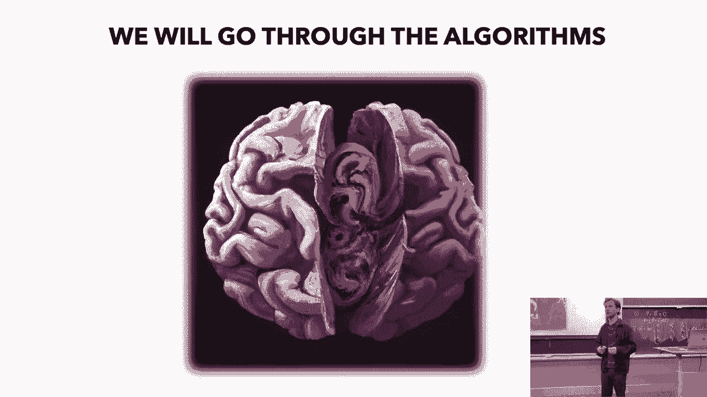

快速回顾上一堂课，对吗，我们提供了对大多数AI的简短、简洁的答案，以及从观察中学习，这意味着意义是上下文化和关系的，我们开始了一段哲学之旅，问，世界的结构如何，规则似乎非常奇特，我们需要处理那个混乱。

因为数学无法拯救我们，这就是新网络和新型AI出现的地方，并帮助解决这个问题，如果你想从世界中学习，如监督学习，当你从专家那里学习时，它不扩展得很好，因为你依赖于人类来标记整个世界，整个世界无法标记。

所以它不能很好地概括，强化学习也不起作用，因为它太危险太慢，如果你没有起点，我们可以在这堂课上讨论，比如如果你有，如果你有一些起点，你可以做到，但如果你对世界没有任何理解，你不能进行强化学习。

因为你甚至不知道从哪里开始，你将无法取得进步，不幸的是，你将在取得任何进步之前死亡，这是关键，有些人称此为无监督学习，这就是我们如何获得这些技术的，那么，我们从无标签数据中学习。

我们一般从这些数据中学习，这意味着它可以很好地扩展，我们只需要数据，然后，我们可以从那里学习结构，好的，我们再次说，你关联，相比之下，狗狗与其他概念如猫一起出现，然后，你也会学习到猫。

你将获得对意义的非常关系性理解，这就是我们在这里利用的，所以今天，我们将更详细地讨论这些不同的方法，所以我们谈论自然语言处理和语言，基本上，是关于自然语言处理开始时和早期阶段的事情，然后。

我们如何发展到chatto p类型的技术，这包括因果语言模型cllm和大规模语言模型，mlm，我们将讨论对比学习，这在视觉和图像领域非常流行，我们将讨论谜题和游戏。

扩散中的噪声也在文本到图像生成中非常流行，如稳定扩散或编码器，GANs，所以生成对抗网络，神经网络，然后我们将稍微谈谈生成方法和与表示学习的对比，然后我们也将谈谈自主代理一点。

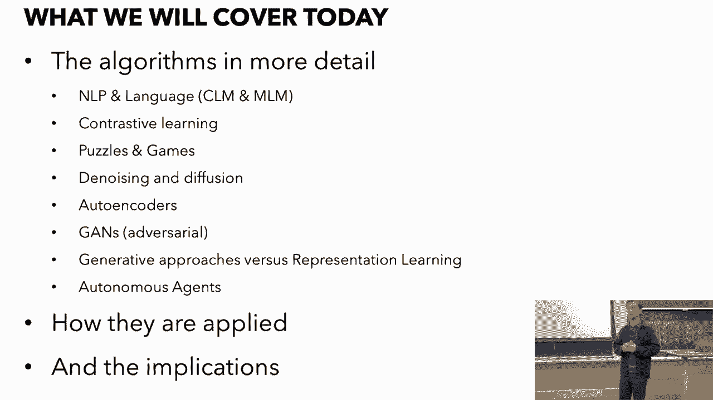

那么让我们开始吧，所以我们将从语言开始，这也是很多这种概念突破实际上开始的地方，所以语言语言有点特殊。

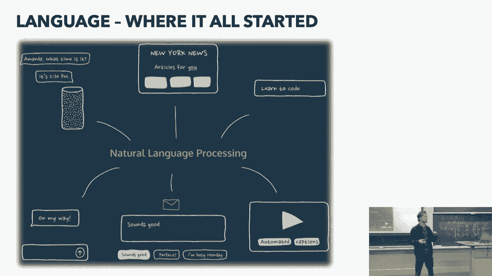

这也是我要论证的，实际上语言有点特殊，它是人造的，对吧，我们为某种目的创造了它，我们不仅以语言进行交流，我们也以语言思考，而且这可能是语言中更感兴趣和重要的一部分，是我们以这种方式思考，而不是这种方式。

它允许我们与他人交谈，我认为如果我们遇到智能外星生命形式，即使他们不能相互沟通，他们还将有一种语言来思考和计划，等等，我们稍后会讨论这个问题，实际上，它是一种高效的通用媒介，用于传输和验证想法。

我将尝试稍后使这更加个性化和具体化，但这也暗示了我们如何使用这些大型语言模型来理解语言，以创建种自主代理，甚至更接近人类的智能，因为很多都隐藏在语言本身中。

好的，所以那是几年前的事了，我老了，但当我开始我在斯坦福的职业生涯十二年前，我想这可能不准确，然后有一个特定的研究团队数据集和每个特定语言任务的模型，所以你会有一个研究团队。

一个数据集和一个他们正在优化的模型，一个翻译算法，然后你有一个单独的研究团队，模型和数据集用于问题解答，然后另一个，你知道我说产品，数据，模型和研究人员围绕分类和预测等，所以这是一种孤立的努力。

人们正在优化，专注于构建解决方案和收集数据，但你知道我们开始问自己，如何处理，这是否真的好，我们是否分散得太广了，我们都在处理与语言理解和语言相关的解决方案，你知道这看起来非常相关。

任务似乎不像人类有各自用于这些不同语言任务的大脑，所以也许存在一些客观或某种语言中的东西我们可以优化，并学习这种达到理解语言的底层问题的方法，然后我们看到所有这些不同的任务。

这只是我们使用这个大型好语言的下游任务，以解决大脑问题，也许我们可以优化这个，这就是我们开始问自己的，对吧，嗯，对吧，让我们说，我们想要完成这个，对吧。

这看起来如何，对吧，我们想要某种方式能够消化，比如一个模型，AI模型或计算机模型，能够消化语言，对吧，然后将其放入某种表示空间或特征空间，转换为有用的格式，对吧。

并且我们可以使用那个格式并将其发送到其他任务，对吧，所以让我们说，假设我们有这种AI模型可以消化语言，可以将其意义编码为某种表示，如数字，对吧，例如，然后我们可以将这些输入到所有任务中，对吧。

这是一个很好的起点，因为我们如果能够特征化和表示语言，并且我们也触及了文本的真实含义，这是非常的，作为这些下游任务的有用工具，非常有用，所以如果有我们参与，这将会很好，人们基本上开始朝着什么方向工作。

特征和表示，在语言学习中，句子，这是一段具有相似意义的文本，或者在这个高维意义空间中映射得非常接近，并且它像是一种非常非常精细的意义表达方式，好的，所以让我们稍微关注一下他们的意义部分这里。

这是非常抽象和繁琐的，那么我们如何实际表示意义，在某种程度上，你知道，我们如何，我们如何，如果模型能够理解意义，我们应该怎么表示单词的意义，假设我们有四个词，猫，小猫，狗和罂粟，这只是为了教学目的。

也呈现图像，只是为了稍微展示这些是微妙的概念，我们只关注单词，但我们在这里添加一些图像，只是为了看到这些是新的微妙概念，显然你知道猫和小猫之间有很强的关系，因为它们属于同一物种，对。

而且显然狗和幼崽之间有很强的关系，因为它们属于同一物种，对，太好了，如果我们理解这些单词之间的关系，这是一个很好的起点，但当然实际上比那要微妙得多，因为小猫和罂粟之间也存在很强的或至少一些关系。

在那种描述幼小动物或可爱的幼小动物的意义上，嗯，狗和猫，也许你知道它们更偏向于成年人或成熟的动物，所以这里也存在这种微妙的意义，我们需要表示，如果我们试图代表这个单词的意义。

仅仅通过将它们映射到一个数字，例如，你知道计算机，喜欢数字和数字，但如果它将这些单词映射到一个数字，我们将不得不选择，你知道，你是否应该知道这些事物代表关闭，因为它们属于同一物种，因为它们属于同一物种。

或者我们应该专注于它们对应的年龄类型，所以我们如何解决，这相当简单，我们只是说，嗯，我们将这些词映射到实际上的组合或数组的数组中，对，所以它是一个高维向量，它被称为这样，因为我们能够代表，你知道。

一个词的含义有很多微妙之处，然后我们可以让，例如，第一个，我的意思是，现在所有这些数字都是相同的，但在实践中，在现实生活中，它们将会不同，对，因为它们是，这些词是不同的。

或者我们可以让高维向量的第一个位置对应物种，对，所以如果他们在这个槽位中有相同的数字，他们来自同一物种，然后我们可以添加第三个数字代表年龄，所以如果他们在这个位置相似，他们处于相似的年龄。

在所对应的动物方面，好，所以现在我们只是快速地，结论出我们需要使用高维向量来代表词的含义，因为词的含义非常高维，它微妙，但实际上，词的含义并不是最好的视角。

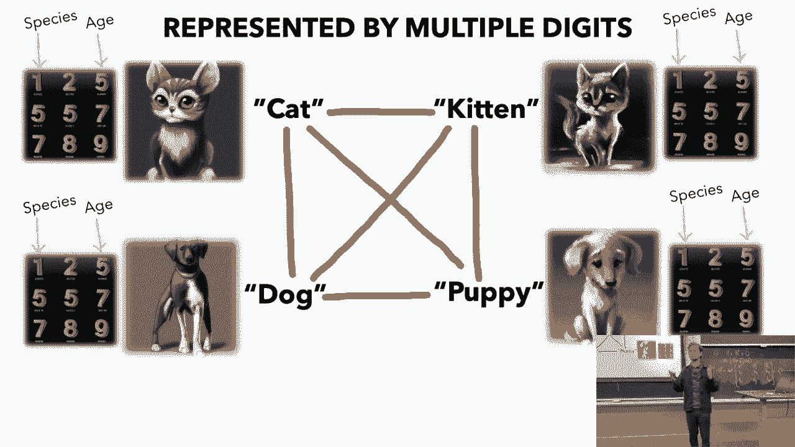

因为不是我们想要关注的词的含义本身，让我们以河岸和金融银行为例，在这里，银行在 both 上下文中完全相同，但它们意味着非常不同的事情，取决于它们如何与其他词一起出现，所以实际上。

词的含义非常非常上下文化，它取决于周围的其他词，所以我们需要某种方式，嗯，也要考虑到这一点来真正学习，你知道，要映射，嗯，文本的含义到有用的向量中，我们需要考虑整个文本在某种方式，当然，就像我说的。

当人们开始工作在这个项目上时，有了词嵌入，人们开始专注于仅仅将单词映射到我，实际上它工作得非常好，但你知道，当你想要达到下一个级别时，你也必须考虑上下文和整个中心，就像一个上下文线索一样。

所以我们也将不学习如何映射。

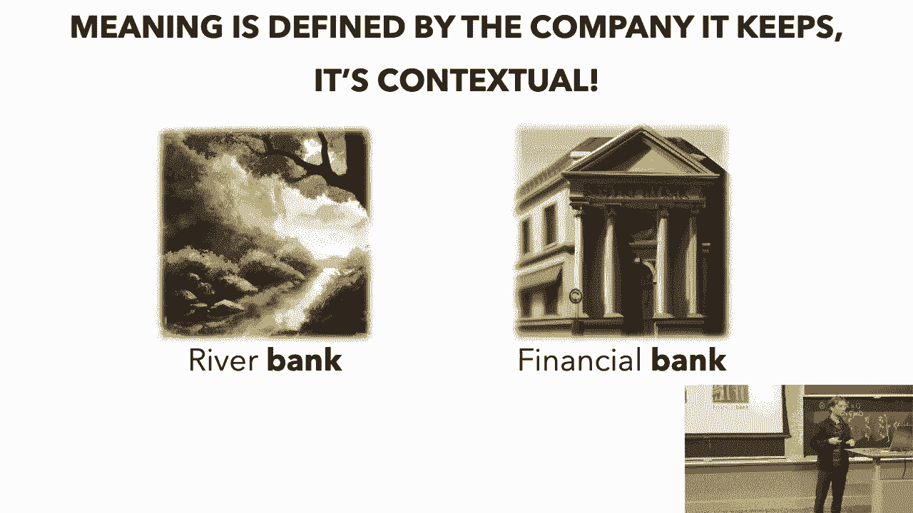

你知道，一个单词到一个向量，我们将将任何文本序列映射到一些在这里的关键意义，因为我们没有那种灵活性，而且这种意义实际上是上下文的，取决于句子，事情会改变，并且你知道如何得到，取决于其他单词。

它似乎与'okay'一起出现，所以我们现在知道我们要完成的事情，我们有这些高维向量作为工具，我们如何添加。

我们如何很好地学习语境意义，我的意思是我们在上一次课程中也稍微讨论了这个问题，但是，事实是我们只是已经大致理解了意义，就像语言的意义是如此的语境化，这也给了我们学习它的队列或指南。

我们将考虑单词的出现频率。

我之前说过，通过定义意义作为公司定义的意义来代表和学习意义，它保持，就像自我参照那样，但是那也是非常非常强大的，因为我们只需要学习词语的意义，取决于它们与其他词语一起出现的方式，反之亦然。

但实际上它听起来有点像循环逻辑，但实际上它工作得非常非常好，而且这种显示意义就是语言的意义是由其使用定义的，没有抽象的词典会起作用，它只是由其使用定义，而且语言的意义随着语言的使用而变化。

我们都知道这一点，嗯，好的，所以，我们可以在这里做一件事，那就是，出乎意料地效果很好的是，嗯，从互联网上取一句句子或一些文本，那里有无尽的供应，然后，我们就随机遮蔽或哔哔一个序列中的词汇，然后。

我们训练一个模型，让一个AI模型预测什么，那个遮蔽的词汇是什么，所以，构建一个从行中下载文本的脚本非常容易，随机选择一个位置，你知道，删除要放置面具的位置，你知道那里，然后，你知道你隐藏它从电脑面前。

所以，电脑只能看到我去蜂巢银行游泳，然后，它有从，你知道，它有必要从周围的词中推导出，那个缺失的词是什么，所以，它有必要学习如何关联一个词的意义和它的周围词的意义，并且它意味着什么，对吧，它意味着什么。

如果它能说你知道，如果它能成功地说我去蜂巢银行游泳，如果它能预测河流，这意味着它知道如何解释在这个上下文中的银行，对吧，游泳的线索在这里暴露了它，它也知道然后突然开始理解这里的文本意义。

因为它能解码这个，同样地，同样地，如果它是我去蜂巢银行存钱，如果它能预测财务再次，它也现在知道如何解释这个序列，并且这个单词的银行，因为它理解金钱和它们如何对应于种类的财务银行，而不是河流银行。

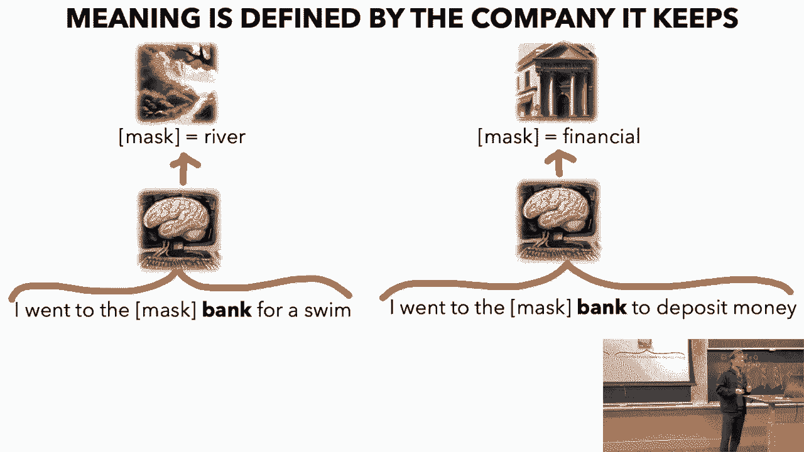

太棒了，所以我们有像我们的第一次迭代，我们现在将根据大规模语言模型来训练这个模型，所以我们将从网上获取大量的文本，我们将遮蔽单词并尝试根据周围单词预测这些大规模单词。

这实际上导致对文本和语言的非常非常好的特征表示，所以我们得到这个模型，我们在一些文本上运行它，我们得到对应于上下文的特征，现在，我们可以将这个模型适应到我们关心的不同任务中，我意思是。

这种极其革命的方法改变了语言空间永远，它工作得非常好，对吧，所以突然现在，你可以优化一个学习语言的模型。

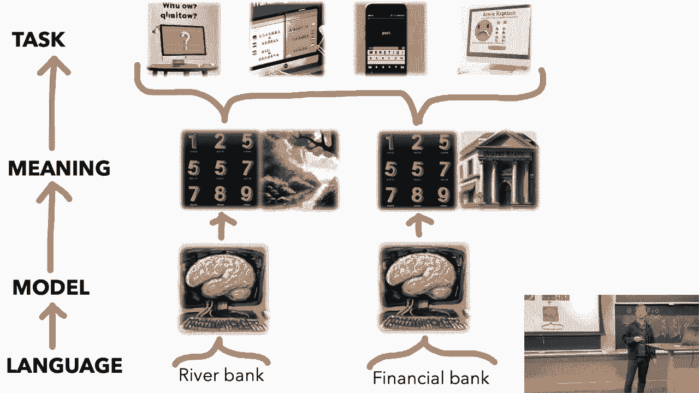

现在，它像是一个你可以在上面构建的起点的表示，你知道，你可以在上面构建，所以，然后你将有这个，你知道，这个大型模型在这里中间，它将代表并学习语言的意义，你可以你知道，你可以使用这个跨越这些任务的，但是。

你将在这些特征上训练一个小型模型，只是为了将它与某种类型的问题解答、翻译或情感分析等关联起来，对吧，和完成，所以你将使用这些类型的特征用于下游任务，是的，这就像不清楚你从这个高维向量中如何得到。

以及如何定义所有这些小型计算机和模型，使它们能够在其上学习，这不清楚，而且它还是如此，仍然涉及到一些工程和每个任务特定的解决方案，但仅仅是那种你现在可以利用的能力，这个大模型在某种程度上理解语言。

你知道从某种从某种表示学习方法，你知道的途径给你带来了很多在性能方面的提升，所以现在您可以开始优化这些模式，变得越来越好，并且将它们用于广泛的任务中，这是非常非常强大的，好的，所以现在也。

你知道，当我们试图解决这些问题时，人们开始谈论预训练与下游统计，下游任务或微调，所以当我们取用这个模型时，我们使用大规模语言模型来训练它，获取对语言的一般理解，这叫预训练。

所以这就像我们在到达具体的下游任务之前如何训练一个模型一样，可能在那里我们真正关心的下游任务，所以这就像两个独立的步骤，你在某个设置中预训练这个模型，然后继续训练它，或者你可以在它上面进行微调。

为想要完成的特定任务调整，所以，假设你获得了，你知道你，你在文本上进行大规模语言建模，然后你想要将亚马逊评论分类为正面和负面，这时你使用这个大模型来创建他们的亚马逊评论的特征。

然后你在这个上面训练一个小模型，只是为了学习它是否是正面还是负面，在一些你已经标记的数据上，但是只是为了让你有这个理解语言的大模型，使它们富有成果和有用，但是 okay，所以但是再次，所以像你有预训练。

这是你知道的重要，但是你实际上关心的是下游任务的集合，所以在研究中我们使它稍微更抽象，因为我们像是说，我们不知道你可能感兴趣的下游任务，所以我们要定义一个集合，但在应用过程中。

你通常知道你关心的下游任务，所以，我的意思是，但是，即使在研究中，这无疑也是一个更受欢迎的下游任务集，因为这些通常用处广泛，所以，焦点也在于此，然后，目标是使预训练和下游任务尽可能相似，对吧，所以。

他们应该，预训练应该尽可能有用于您关心的下游任务，我的意思是，假设，假设您想要，你知道，学习如何驾驶汽车，例如，你知道，在你坐在车里之前，你想要有最好的观察和最好的游戏类型。

或者你知道你在做任何事情之前，你实际上坐在车里学习尽可能多的驾驶知识，在你坐下之前，这就是我们正在关注的，在这些事情上也一样，我们想要使预训练尽可能有用，你知道，如果你想要驾驶汽车。

也许你会和一些教练一起坐，或者你知道你只是观察某人，你知道你实际上和你的，爸爸或其他人一起坐在车里，当车开得正确时，这比从远处看更有用，这也与模拟和现实有关，我们希望。

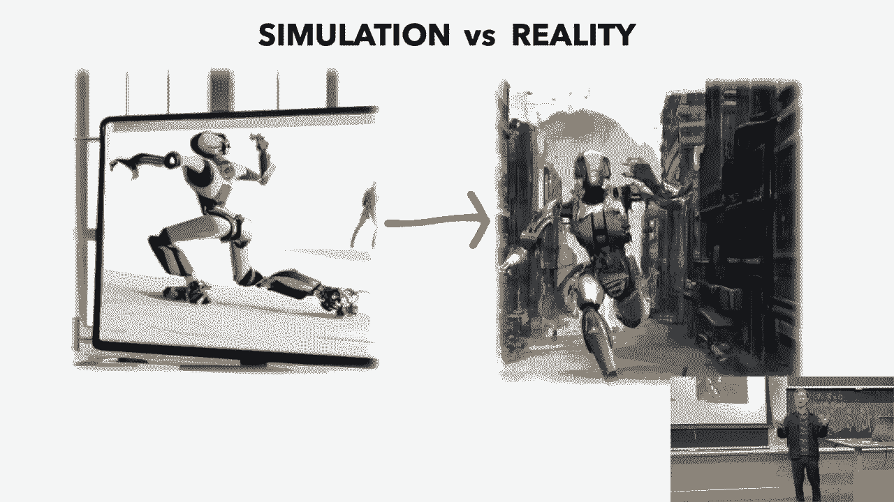

如果无法负担，而且我们不确切知道我们将应用到的特定现实或情况，我们希望我们的模拟尽可能接近，好的，现在，你知道，这就是我们做的，所以现在我们已经学会了如何在这个高维向量中嵌入文本，这些向量编码意义。

这很棒，但你知道，语言本身传达意义，那么，为什么我们要进入这个高维嵌入空间，当我们可以直接从一种文本到另一种文本时，因为语言本身非常，非常灵活，你知道，当我们查找一个词时，例如，对吧，我们抬头看看。

想要找到一个词典定义，找到一些围绕它的上下文，所以为什么不用语言本身作为一种非常灵活的方式来表示意义，甚至对文本的意义进行解释，所以嗯，这是下一步人们开始做的事情，我们试图做的事情是。

我们将尝试去除这些中间维度的向量，并将其转换为文本，所以这里，例如，对，所以，定义河流岸和金融岸时，应将整个上下文考虑在内，然后解释其含义，换句话说，对，它是自我参照的，但含义本身也是自我参照的，对。

所以，我们可能并没有失去太多，好的，这也很 nice，因为语言非常灵活。

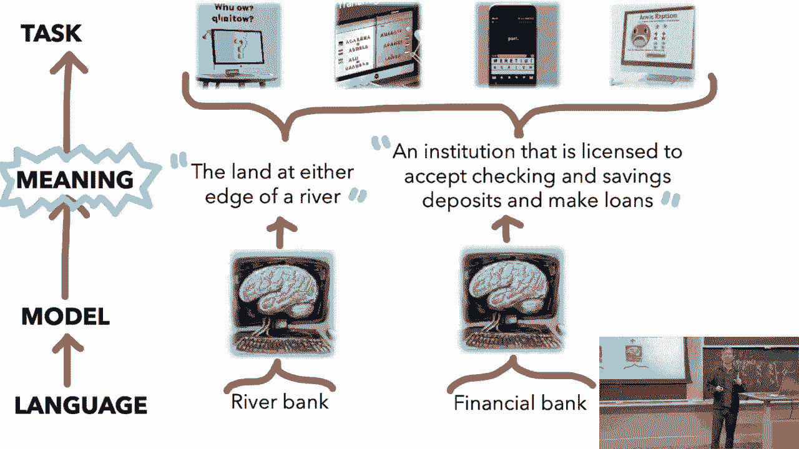

你知道，是一种编码东西的方式，我们也可以编码我们所有的任务，只需要文本，我们不需要编码，你知道，正负可以编码为零和一对吧，我们可以只编码为正负，无论是作为单词还是作为文本，所以你知道，这是开始的地方。

人们会将所有这些不同的任务编码为数据，并以计算机想要的形式呈现，但现在我们只是简单地将其编码为文本，从那种人类角度看，它们有一定的意义，如果我们现在有了文本到文本模型，我们不是。

我们不是那种我们将如何到达它们的方式，但如果你有从文本到文本的模型，可以消化文本并输出文本，至少在工程方面，这些格式是一样的，所以如果我们，如果我们将我们的所有下游任务重写为文本到文本，那么你可以。

你可以，你可以将任何任务重写为文本到文本，你看这里，我的意思是，我的意思是，这就是你知道的mf约束本身，非常可能取任何任务，然后以文本的形式书写，所以你知道，而不是说，你知道，回答这个问题。

银行有权利简单地以文本形式提供答案，如果是多选题，我可以说，是选项a或者什么，如果有德语是，它也是文本完成和分类，也都是文本，积极或消极，这就是输出，实际的描述，如果是积极的还是消极的。

所以现在的好消息是实际上它接受文本，我们可以将我们的所有下游任务，无论它们可能是什么格式，所以可能会有针对特定任务的一些标记数据集的额外训练，但在从高维向量到特定输出的转换方面不会有工程。

因为现在所有的输入和输出都只需要文本，这就是非常棒的，因为它也意味着它将更容易让我们进行一些微调，同时处理很多任务，在这些任务之间我还能获得协同效应，这就是谷歌用他们的模型T5做的，而且非常非常成功。

嗯，基本上这就是它做的，就像，好的，我们将定义人们可能关心的所有不同任务，以及存在的基准，它只需要文本，然后，我们的模型也被训练成文本到文本，所以，从工程角度来看，差距将更小。

希望从性能和他们到达的方式来看也是如此，这个模型非常非常简单，从高层次来看，他们现在基本上只是取了一些文本，在这个文本中，大规模地组合了单词，然后，你试图预测，只是预测，你知道被烘烤出的特定词。

没有预测并使用这些词正确地重新创建整个句子，所以，而不是现在成为某种类型的掩码词预测，它是全文本的掩码文本，所以，它是一种非常小的概念变化，但在工程上，需要一些工作才能使其工作，但现在你有一段文本。

一个文本模型，你可以这样做，好的，所以，并且，我们主要讨论的两个不同的概念是，那就是一种基本叫做大规模语言模型的东西，我们在其中随机选择一个，我的意思是，这与ti方法非常相似，就是遮蔽词。

然后预测整个句子，但是，大规模语言模型是当你遮蔽一个词时，在任何句子或文本的任何一点，然后你试图根据周围的词来预测它，另一方面，因果语言模型实际上是你只遮蔽最后一个词。

而你只尝试根据之前的单词预测最后一个单词，当我们讨论这个的时候，当我们深入研究chp和transformer的时候，并且解释它是如何训练的，但是，它是如何训练的，并且你如何优化它。

你知道大规模语言模型与因果语言模型之间的区别在于，在大规模语言模型中，它可能会稍微慢一些，但你得到的回报是，当你试图时，预测最后一个单词，就像我去银行游泳学习大众语言一样，基本上每个词都尽力嵌入或有用。

能够关注到其他所有的词，无论是在前面还是在后面，所以这就是我的意思，我没有告诉你为什么，但就是这样工作，在因果语言模型中，你知道，银行，因为它嵌入自己，并且它使自己对更大的句子有用，它只能向后看。

这就是变压器的工作方式，我要告诉你为什么，这样工作，但这是大大的差异，结果，因果关系的训练将更快，因为你可以通过一些工程技巧使它更可并行化，但希望你知道这些中的一些应该对你来说更有意义。

所以如果mini是关系性和上下文的，你应该能做得更好，如果你能关联和理解你面前的东西，以及你身后的东西，在某种程度上你有更大的上下文，这意味着你有更多的上下文，这意味着你对意义的理解更好，这真的很酷。

实际上，所以大规模语言模型在大多数事情上都做得更好，除了一项任务，因为如何优化因果语言模型，而且这是因果语言模型做得更好的唯一任务，是根据之前的单词预测下一个单词，正确的生成，因为它被优化为那样。

而且它可以使用较少的计算来训练更多的数据，但结果是实际上这确实是一个非常非常好的任务要做得好，为什么好，因为现在我们可以简单地说像好，所有这些不同的任务，除了文本到文本的任务，这不是现在只是文本完成吗。

如果我们有一些输入提示，然后我们开始生成一个词，平底锅，数据正在像增量一样生成下一个词，对，因为我们现在有一个可以基于先前单词生成下一个词的模型，我们可以只是运行这个在自己的输出上再再运行。

我们可以生成直到某个同行或什么，直到我们满意，但是，它就只是生成完成句子，对，所以，接下来最合理的事情是什么，你知道，回答这个问题，河岸是什么，我的意思是最合理的完成它，如果它擅长。

那就是实际上给出正确的答案，对于换乘来说也是一样的，你知道翻译成德语，我的名字是，但是，这个的最合理的完成形式是，从生成基于先前单词的下一个词来看，实际上就是生成正确的翻译。

这对所有这些不同的产品都是真实的，这就是确切的，我的意思是，它听起来可能简单得疯狂，但这是chp背后的突破，只需要一个极其简单的概念，那就是预测下一个词或短语，基于之前的单词或短语到巨大的规模。

它就变成了一个多任务解决者，因为你只需要根据之前的单词预测下一个单词对吧，所以你可以问所有的策略问题，它很容易解决，对于开放背后的人们，我实际上喜欢，我的意思听起来，你知道在事后，听起来简单，好像。

我们怎么能看到，但是像，那是一个巨大的赌注，像谁想到这样，如果我们采用简单的语言模型，预测下一个词基于之前的词，到巨大的规模，我们得到了一种可以解决任何任务的人类水平的智能，但是像好像你是疯了。

但是不像，我们要试试这个花费，就像一百万美金的计算能力，这辆火车和火车，看看会发生什么，当某个时候它开始有点这些涌现的能力，非常像人类，这就是发生的情况，棒极了，所以总结一下我们的语言，语言和东西再次。

意义由它保持的公司定义，所以我们不能专注于一个词本身，因为它必须是一个词序列，因为它们相互影响，但是那也是我们可以通过自我参照来学习意义的线索，对，我们只是学习根据周围单词预测遮蔽的词汇。

所以它在语言中非常，非常美妙，你可以从这个观察中学习，首先我们说我们将使用高维嵌入空间来准确，或像足够地编码意义，因为它是高维和微妙的，但是然后我们说像，哦，实际上，表现得好一点。

如果我们可以将预训练与下游任务对齐，甚至在工程上也会更多，这样你就不需要从像取样到一些高维嵌入空间，到一些指示变量或一些数字，目前，我们可以直接从文本到文本，这很好，然后。

即使你可以在预训练和下游任务中基本上有相同的目标，意味着，仅仅为了基于之前的单词预测下一个单词，这对你来说甚至更好，你知道的，如果你只是训练一个模型来预测基于之前的单词的下一个单词。

你知道如果你有数据足够，如果你解决了我们关心的所有任务，如果它能做得很好，我们可以几乎开始丢弃下游数据，我们真的不太关心它，我们甚至不知道下游任务，因为只要你能以提示描述它，这将对你有效。

并且完全符合p的正确值，它就像你描述的那样，只需要一个提示，一些输入，并且它将为您解决任务，所以让我们现在。

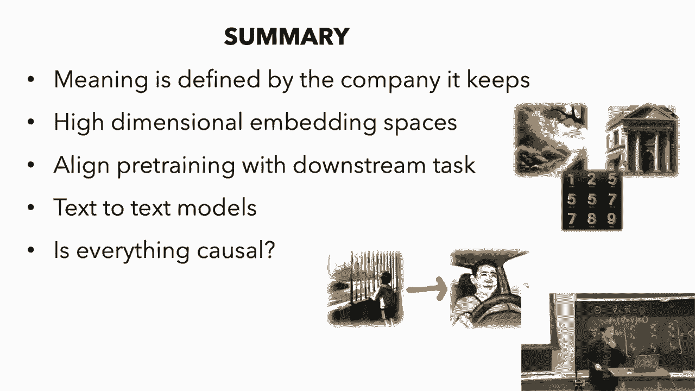

嗯，跳转到其他模式如视觉，例如，我的意思是，这也是chp背后的人试图为图像做的同样的事情，所以你只需要一张图片，说像嗨，它是一系列，从上到下，从左到右，右一个像素，一个时间，你只需要开始预测它。

并且如果它能够，你知道，准确地或真实地完成基于先前的图像的图像，以便在某种程度上误解涉及的概念，像嗨，我正在完成猫吗，还是 sidewalk 或者什么，所以这肯定有一种，你看它起作用。

但这不是人们使用的，因为它没有提供最新的技术成果，而且它不是计算效率高，人们使用的东西，尤其是在视觉方面，是这种通过对比或对比性学习的学习。

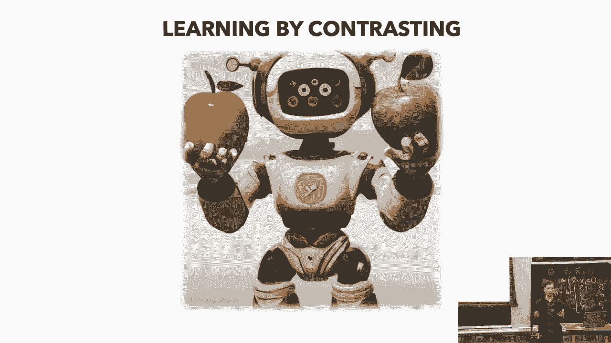

所以我们稍微谈谈他最后一节课，但它与这种积极对和实际消极对的想法工作，但整个想法在这里，而且我认为这实际上是一种基本的，我们不应该理所当然地接受它，但整个想法在这里是，我们想说人们拍照东西。

就像自然图像，我们像说，你知道我们不会随便拍照，我们拍照东西，你知道那是在同一环境中的，对吧，也许我们还会把它们放在一起，如，你知道，比如一个足球和一个足球门什么的，所以我们会说出现在同一图像中的东西。

平均来说，比出现在不同图像中的东西更相关，平均来说，对吧，你可以找到这种情况的例外，这完全并不成立，但是，当你统计性地看像数十亿张图片时，这些是真实的，这就是事实，如果我在这里拍照。

你们似乎有一些更多的东西，我与随机图像中的人相比，有更多的共同之处，这是我从网上上传的，是的，你的哈佛大学，你对这些东西似乎有些兴趣，所以这是有意义的，统计上，好的，因此，因为我们需要小心一点。

我们需要做一些事情，假设你知道，我们只是尝试，所以我们拍摄一张照片，是的，你知道你们有一些共同之处，因为你们在同一张图片里，所以我们只是裁剪这张图片，我们有一台电脑来创建两个不同的无序裁剪。

有时它们可能会重叠某人，它们可能会捕捉到错误的东西，但是，统计上，当你这样做足够多的数据时，它会起作用，你拍摄一张照片，你拍摄两个不同的裁剪，并将它们放在一起，所以像表示，现在。

这个模型创建的这两个高维向量，对这些两个裁剪，将会被推在一起，所以当他们来自同一张图片时，它们会更近，当然，这是一个非常简单的解决方案，因为如果我们只是拍摄照片，我们裁剪它们，然后。

我们希望裁剪靠近在一起，如果我们将一切都映射到同一个向量上，那么一切都会非常非常接近，所以再次，它也指出一切都相对，如相似性是相对的，为了这是相似性，它需要差异性，以便这个，可以被视为接近的。

也需要有一种感觉，某物离得很远，所以我们需要这样做，我应该不会让它坍塌，我们只是说，是的，我想要这个，你知道，来自同一张图片的两个裁剪应该被映射到，你知道，向量，高维向量，彼此靠近，但是远离其他图像。

我将把你推向远离其他图像，所以我不能坍塌，所以也存在一种距离感，我需要近和远，然后再次正确，就像你可以得到一些类型的，嗯，更多的抽象关系，像不在这里的东西，像东西不需要在同一幅图像中出现就能接近对吧。

你可能有两只不同种类的狗，永远不会在同一幅图像中出现，但只要它们出现在与其他共享概念一起出现的图像中，对吧，所以如果这两只狗与有牵绳的主人一起出现，如果它们看起来有空间，那么仍然会有一种接近的表示。

所以它可以填补这个差距，好的，所以这在实践中被实现，在实践中我们将其转换为分类任务，基本上，我们对每个集合的，你知道，前后出现的图像和裁剪，我们向计算机提供一个裁剪，然后我们说，嘿，我们有三个其他裁剪。

在这里，你需要分类或选择这三个中的一个是你的积极修复，对吧，哪一个属于你，你知道，哪一个，你不属于哪一个，所以它基本上需要分类并检索正确的积极模式，在这里是，它相当简单，对吧，但你已经可以看到。

像它需要理解一点，你知道误解这张牵着狗的主人的图像，并检索狗，我意思是你可以看到绳子，但通常你知道这比这难，说像你知道狗在散步，绳子，通常猫不像我，你可以这样做，然后你知道，这只是对于所有裁剪的总和。

通常你会有，你知道，一万或什么的，所以从一万个候选者中挑选出正确的积极对变得更加困难，你知道，从十万个候选者中，好的，所以这工作做得真的很好，嗯，它是，你知道，它给我们提供了一个非常好的图像表示。

可以在许多不同的环境中使用，因此，人们经常使用这个，当然，我们也可以在任何地方做这件事，我们能够定义正负对，所以它非常普遍，对吧，所以如果我们取，我们可以做同样的事情，基本上用于语言模型。

当我们取一个句子，我们创建积极的修复只需稍微腐败或掩盖它们，并说它们应该被映射，这不应该破坏句子的意义，所以它们应该被映射在一起，远离这个随机的句子，比如，这是我的手机从一条线上。

只要我们能够有这个种类的积极三对和负对，我们可以应用对比学习，这也使它非常普遍。

好的，现在，我们将从新的角度来看待，不会想太多，你知道，通过定义意义与谁相伴，这是一种哲学术语，但我们只说我们将像计算机一样玩。

玩游戏并说你知道，如果计算机能够解决这个简单任务，我们相信它必须理解涉及的概念，我意思是这也是一种非常有益的视角，这也是一种很好的思考方式，来考虑这些模型如何学习解决一些简单的任务，你可以或游戏。

你让计算机通过诱惑数据来玩，并开始学习关于它，是的，现在，Mini不再由它保持的公司定义，而是由它如何帮助你解决任务定义，我认为一个例子是当你从一条线上取一些文本，你只是打乱所有单词。

然后让计算机尝试再次将它们放回正确的顺序，对吧，为什么你会做得很好，这可能并不太有意义，但你开始思考，比如，如果你有一个包含随机单词的集合或袋子，你怎么开始思考把它们放回正确的顺序呢。

你将不得不考虑语法，你必须考虑意义，描述什么，以及如何构建一个有意义的故事，那么让我们假设你知道，假设你能够将这个并真正开始按照正确的顺序输入，这意味着你在利用不是你对语言的理解来做到这一点。

所以某种方式这个任务，如果做得好，需要语言理解，并且它这样做，你可以在这个大规模文本数据上进行训练，并且它开始做得真的很好，实际上它甚至能够把它放得这么好，你知道，常常以正确的顺序出现。

而且准确到连这些电脑也不需要以正确的顺序出现，你可以只是听到这些词含糊不清地说出来，然后它可以隐含地将它们放在对应的顺序中，并使用那个顺序，所以，这 kind of 显示词序并不重要。

重要的是出现的词袋，某种方式，同样，我们也可以对图像做同样的事情，我们可以只是取一张图片，我们可以创建这种拼图，其中我们创建了方块，对，我们打乱那些方块，然后让我们让电脑尝试预测那些方块的正确排序，对。

再次，是的，如果你想能够把i放在对的位置上并填充，你 somehow 需要开始理解一张脸的通常方式，嗯，轮廓正确，如果你还有其他概念，比如你知道狗的尾巴是什么，前部和类似的地方在哪里。

所以如果你想做得很好，你就会开始理解，你知道视觉概念是如何出现的，你也知道你需要能够理解它们，我们还可以做一些事情，我称之为噪音游戏，再次，它也是一种共同的分母，这就是我们可以从网上获取图片的地方。

非常便宜，对吧，我们可以创建正方形，并将它们随机排列得非常便宜，就像，没有人类需要进化，这只是一个脚本，对吧，同样，你可以从网上获取一张图片，非常便宜，你可以有亿万张，万亿。

然后你可以添加一些像这样的噪音，这里的高斯噪音，计算机可以创建非常，非常便宜的噪音，所以你可以从网上获取一张图片，你可以添加一些噪音，不同的水平，对吧，然后你可以说像你知道一样。

你可以训练计算机尝试去除噪音，所以噪音，完全正确，我们 somehow 能够开始看到轮廓，然后我们可以大致推断出这张图可能代表的是什么，然后我们可以填充细节，这种迭代的去噪步骤被称为扩散，对。

所以如果你知道 '稳定扩散' 这个名字，这就是它来自的地方，所以当你想到这个的时候，当你在这里尝试完成这个序列的时候，你在利用你对图像和视觉的理解来做到它，所以，这个模型实际上在学习。

你知道视觉物体和图像是如何构成的，因为它们的工作方式，因为它能够解决这个任务，并且注意，你知道，如果你在里面或融入，有时候，这像纯随机噪声在非常左边，这根本不是图像。

它基本上可以从纯噪声中猜测或创造出图像，所以突然也，我们有像生成器可以生成从无中生有图像的东西，所以这里我们将这个训练在脸上，我们可以只是生成面孔并采样，你知道，我们可以用于广告或什么的不同面孔集。

我不知道，而且好，我们还有一个叫做压缩游戏的东西，这里我们取一些数据和图像，例如，我们将其映射到一个高维对象，就像你知道像素和颜色等东西，只需要几个数字，比如让我们说三个两个数字，从像几个。

甚至可能一个百万像素值等东西，只需要三个两个数字，然后我们在模型中尝试重新创建它，以便将数据通过这个瓶颈，然后重新创建图像，准确地恢复原始图像，所以它必须只保存对我们来说最重要的数字。

以便能够恢复原始图像，那么这是否起作用，是的，如果你，如果你有一些好的建筑结构，它工作得非常好，并且它能够准确地压缩图像，你可以使用这种压缩来解决任务，对吧，因为这总结了图像以非常高效的方式。

这些被称为自编码器，好的，你也可以与其他人玩游戏，所以这里我们有一个模型，我们可以叫那个试图创建看起来真实的图像面孔的艺术家，对吧，所以它会做的就是你现在有一个数据集，充满了无数的面孔，对吧。

真实的面孔，你可以从一些在线数据中心获取，只需下载，然后让你让这个模型，艺术家需要创造一个，你知道这是最佳尝试来创造一个面孔，然后你将看到这个，这是其尝试创造一个面孔和一个对批评家的真实面孔。

这是另一个AI模型被训练来区分这两个的，所以然后你知道批评家是被训练来区分真实和假象的图像的，艺术家是被训练来欺骗批评家的，因为艺术家想要批评家不确定，它想要使它的图像在面孔方面看起来如此真实。

所以批评家不确定实际上是否真实，当你开始画画的时候，你会画出一些东西，然后你看着它，会觉得，哦，实际上，这看起来真实吗，还是不真实，就像妈妈会说的，然后你会改进，对吧，虽然这不同，但它本身。

这就是对抗性训练和网络被称为的东西，它训练起来相当不稳定，正如你可以想象的那样，我的意思是，如果某人在批评方面变得极其出色，你知道几乎很难取得任何进步，然后因为他们几乎太领先了，所以当你训练这个模型时。

需要是一种相对邪恶的公平竞争环境，所以输入和输出在准确性和其他方面处于相似的水平，好的，所以这就是我们现在正在谈论的东西，在所有我们快速通过的不同方法中，你是否知道，一些专注于数据嵌入的方法。

或者像表示数据，一些类型的表示学习以及生成数据，好的，所以这些仍然是两个稍微不同的概念，对，我们想要嵌入一些数据到一个嵌入空间，在那里我们可以使用那些特征来完成某些任务，对，我们基本上想要压缩数据。

以便我们可以用于图像分类，或者用于，你知道，文本分类，或者你有什么，而且我们也有生成，其中我们想要基于某些生成数据，通常一些采样或一些提示，对吧，我们要说就像嗨，你知道，我们不会看这张图片。

我们想要能够生成它并，很多时候，实际上，许多非常擅长嵌入的模型，你可能甚至不会专注于生成，而是被训练于生成，而且，所有的编码器都是被训练于嵌入和生成的，可能在嵌入方面比生成更好，所以，这也是许多权衡。

就像，你知道你可能只想训练和专注于嵌入方面，你不想要，基本上参数和计算的数量是原来的两倍，你不关心生成，而且一些方法可能在一个方面更好而在其他方面更差，等等，所以这就是为什么这种情况发生的原因。

所以你知道我们开始理解的一些事情，我现在不说，你怎么实现这个，但是有一些我们在研究基础上知道的事情，以及这些模型如何被使用，如果能够将这个映射到相同的嵌入空间，那将是很好的，就像一个剥落的床铺嵌入空间。

意味着它将你知道的等效意义映射到相同的向量上，也许它并不清楚为什么这很好，如果你只是直接从图像到图像，但现在如果你添加了其他模态，如果这个嵌入空间是共享的，那将是非常棒的。

并且你可以直接取你最喜欢的嵌入，并且你可以你最喜欢的生成器，它可以在两者之间插入，所以你可以喜欢，你知道插入a并使图像更好，然后你可以像精确地嵌入一个面孔一样，然后你可以，你知道插入一般而言。

理解相同嵌入空间的语言，然后我可以生成相应的语言，对，相应的语言意义在像标题这样的语言之中，对，所以像面孔，一个男人的面孔，所以你可以捕捉他，反之亦然，对，你可以输入语言的嵌入和文本。

然后你可以插入你的图像生成器，它可以生成你知道的文本图像模型，这当然非常有用，随着我们添加更多的模态，如观众信息，它变得更加有用，对吧，我们作为人类能够听到一些东西，你知道我们可以阅读它们。

也许谈论看到它们，如，我们肯定有一个共享的嵌入空间，我们自己的头，现在我们可以看到事物，你知道你知道不同的模态，但我们仍然知道如何关联那些事物的意义，对，就像因为我们听到狗，我们不看到，我们不。

那不是一个完全独立的嵌入空间，如果我们看到它，对吧，我们仍然理解它是一只狗，我们概括关于狗，你知道，取决于如，无论我们使用哪种感觉，对，因为嵌入空间是共享的，它将非常，非常低效。

如果我们为每个特定的感觉都有一个独立的嵌入空间，对吧，对吧，如果我们想要利用这些协同效应，好的，这不仅在处理不同的感觉和模态方面有用，在商业上也极其有用，假设你有一个能够理解不同语言的模型。

所以让我们说，你有一个能够，你知道，基于消费者的食品购买情况，能够创建一种嵌入，就像一个由高维向量构成的用户 profile，基于你的食品习惯，了解你是谁，但如果我能嵌入那个，但如果生成器被禁用。

从嵌入中生成时尚，你知道的物品或产品，因为然后我可以说，我知道你知道，我知道你的食品习惯，现在我可以推荐你在时尚物品方面的购买，所以我可以从了解你是谁和食品物品如何对应时尚物品，我可以交叉。

向你销售更多的东西，更深入地理解我们，所以这是有用的，好的，我承诺，我们将讨论语言是一种高效的沟通和验证意义的媒介的声称，所以像，好的，我们现在仍然，你知道，谈论了嵌入空间很多，作为高维向量的数字。

但是再次，也许我们可以给语言一个特权地位，就像，好的，我们将使用语言本身作为我们的通用嵌入空间，对吧，所以无论它是什么，这是音频，如果是图像，或者是文本，我们将将这个放入文本和语言的嵌入空间。

对吧 语言本身和你知道为什么这是有用的，也许也许它是好的，因为我们可以窥探幕后，看到人类在做些什么，因为它生成文本，作为某种中间表示，是的，这是有趣有用的，但这并不是实际上的原因。

你知道为什么它是如此有用和基本，我认为它为什么有用与为什么我们实际上以语言思考是一样的，即使我们不能说话或交流，语言仍然是一个非常重要的，因为即使我们不能说话或交流，语言仍然是一个非常重要的。

非常有用的中介，这是因为像我们对语言的理解帮助我们标准化知识，并且它帮助我们更快地学习新事物，并且我们可以改进，并且我们可以确保一致性，我们学到的东西，所以让我给你一个这个所有内容的例子好吗。

假设我们要训练一个机器人为我们解决任务，所以可能我们想要机器人，你知道的，给出，我们给出任务的描述，比如做三明治，然后我们要教机器人做这件事，所以最初我们如何做。

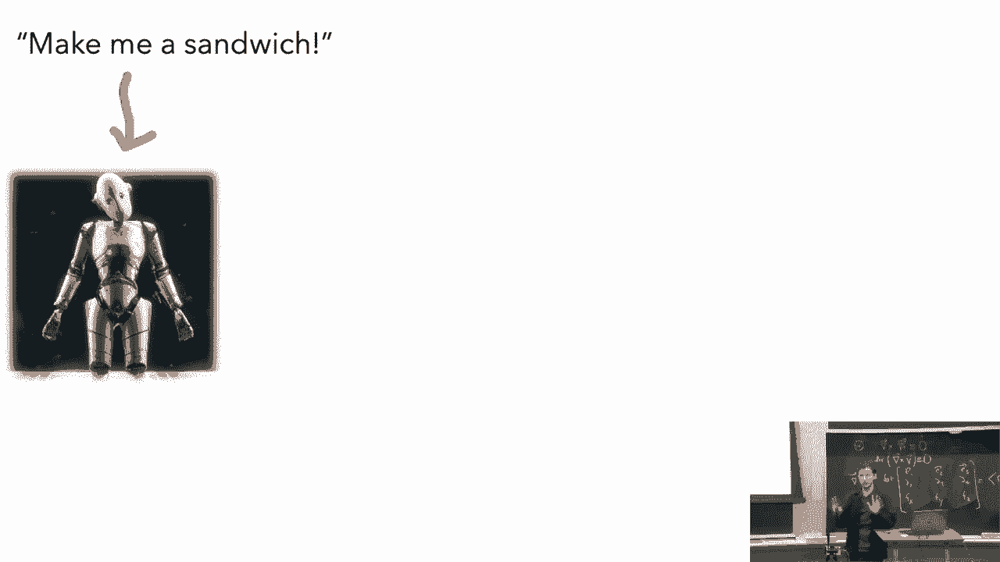

你知道我们如何做，是我们有一个模型，一个AI，它映射这个提示，和一些输入到一个高维嵌入空间，就是以数字形式表示的，然后它从那个空间映射到一个动作集，所以现在，这，你知道的。

代表现在机器人需要执行的任务在数字上，我们并不清楚具体发生了什么，但它以数字形式表示，然后它必须执行一个计划，对吧，所以它某种程度隐含地编码了，比如涉及的步骤和你需要完成的事情等，等等。

这就是我们在机器人开始时做的，人们现在还在做，等等，但如果我们不将这个映射到高维向量，如果我们只是映射到这个更多的语言，对吧，所以现在我们将这个提示'做三明治'映射到，像某种计划和分解。

所以它说我会去厨房，从储藏室取面包，从冰箱取黄油，从抽屉取刀，我用刀在面包上涂黄油，最后，我会从厨房离开，带着三明治回来，好的，这有意义对吧，我们可以看它做了什么，像，哦，这有意义，很好。

但是为什么我们会这样做呢，我们曾经说过，通过强化学习训练这些机器人是非常非常困难的，如果你对世界没有理解，如果我们没有对世界的理解，所以通常你不会做得很好，而且对于机器来说，解决这个问题非常非常困难。

所以假设你实际上是输出一些完全不有意义的东西。

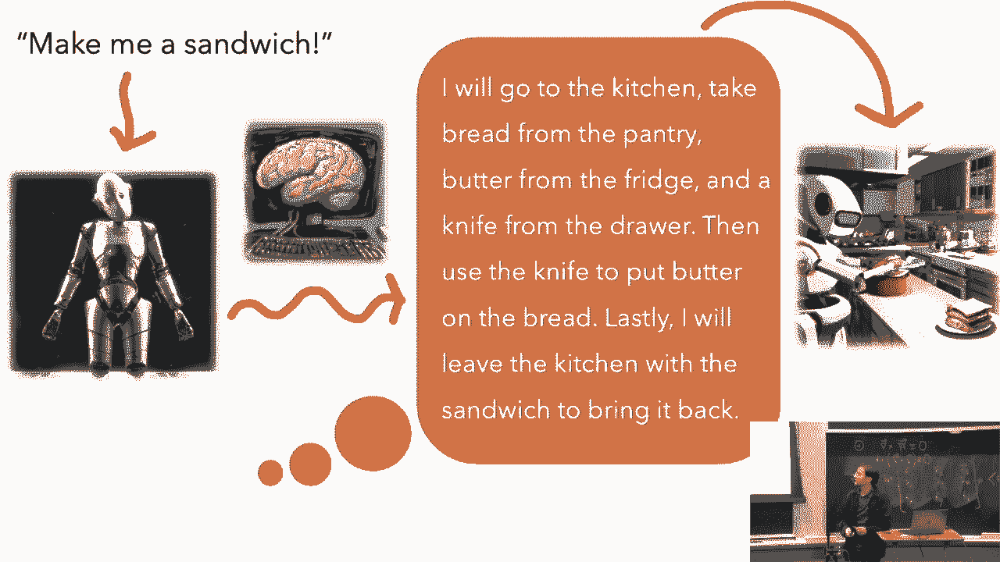

所以假设你做得不好，所以现在你知道一个坏的模型，这个输出是我会从冰箱里拿黄油，并从冷冻室里拿刀，就像从冷冻室里拿刀一样，对我们来说，这不 make sense，好的，然后使用黄油再次在刀上涂抹面包。

就像在刀上准备黄油并不合理，我的意思是，使用的词汇是正确的，但是，你知道，它们在这里不是以正确的方式相互作用的，然后，我会去洗手间拿面包，像是谁会把面包放在洗手间，可能最后有几个人。

我会带着三明治离开厨房，应该带回来，好的，你刚刚在洗手间，但现在你在厨房里离开，像是这个计划没有意义，像，我甚至不知道，需要了解任务的信息，仅仅我知道语言就像这样看起来可能会出错，所以这是非常非常酷的。

因为我们仅仅通过知道语言就可以验证和查看它，说像哦，这不会结束得好，你需要纠正自己，如果我们能够做到，仅仅通过使用我们的语言，正确的语言模型能够做到这一点，所以，然后他们可以查看这一点并说哦。

这是一个伟大的中间诱惑，因为我知道语言作为一个高效的媒介来验证和纠正想法，所以我现在可以这样看哦，机器人，你不清楚世界是如何运作的，因为你不知道事情是如何运作的，我会帮助你把它放在一个更好的格式中。

是的，所以我们可以只是问，tp hey，请纠正这个文本，它不知道涉及的任务是什么，但它可以使其大大改善。

可能这里不是完美无缺，但可以使其大大改善，以使它更加有意义，是的，所以我会从冰箱里拿黄油，然后我从抽屉里拿出，然后使用黄油涂抹面包，然后我会去厨房最后做三明治，我会带着三明治离开厨房立即吃。

所以当它仅涉及到文本任务时，查佩是一个革命，是的，它也在机器人和其他任务中产生了革命，因为在这种意义上理解语言对于在其他领域改进非常有用，是的，它允许我们在推理和思考中做出种捷径。

而且还可以将其他东西概括为理解特定设置中的节点，并且可以用较少的数据做得更好，实际上，对于像强化学习这样的东西，你知道你需要有这个世界模型才能开始有任何进步，因为你可能想要了解，比如。

我会把这个刀插入这个人类，这不是个好计划，如果你理解语言，你会说，哦，不，不，不，不要那样做，你不，你不，你不想通过试错来学习，你想要知道，他们准备好了，好的。

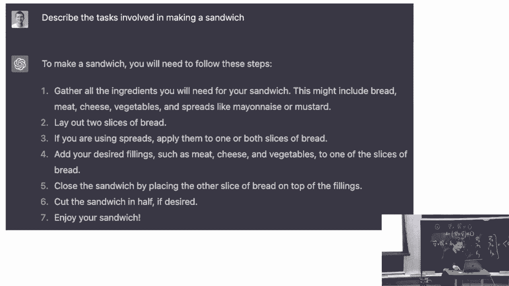

好的，所以这实际上非常类似于自主代理，他们利用的语言方式，所以现在你有这些大型语言模型是在网上训练的，只能理解语言任务，你现在可以实际利用这一点来进行规划和使用工具，以一种我们并未预见的方式，几乎正确。

几乎非常非常人性化，所以，一个自主代理基本上就是一个大型语言模型，它是迭代地应用在自己输出上的，对吗，所以它被允许，你知道，改正自己，一步一步地改进自己，通常，你知道，有一次机会看看你的提示。

然后给出你想要的输出，但如果它能够，你知道，看看你的输入，分析它，创建输出，然后看看他自己输出，分析那个并创建更多的输出，它可以自我改进，找到自己的错误并做计划和打磨，它可以极其强大。

当你允许它使用自己的结果作为输入时，你知道，迭代后它变得极其聪明和优秀，它就像几乎有点，你知道，你必须在现场解决一个问题，通过给你一些时间来实际迭代和改进你最初的估计或计划。

所以这对反思和改进这种方式有很大的帮助，所以对于大型语言模型的分析，生成与这有点关系，但你可以查看一些提示，分析并生成一些输出，然后你将那个输出输入到模型中，我们再做一遍。

然后我们还可以将这个工具添加到这个过程中，所以基本上你描述一些工具使用语言，然后大型语言模型也可以使用这些工具，你知道，迭代地，例如，假设你写给你的大型语言模型，现在是自主代理，现在代理。

因为它被允许重新运行自己，创建一个包含两张狗照片和描述的网站，是的，首先，它可以做，好的，很棒，我将制定一个计划，所以可能第一步只是像五步这样，然后它读取那个，我说，好的，我将从第一步开始。

所以你可以制定一个包含五步的计划，第一步，然后它说，好的，像这样，我将使用互联网搜索互联网，检索两张狗的照片，我获得了这些照片，我将它们在网站上放置，我将这些照片放置，照片在网站上，太好了。

现在它看到自己的输出和网站代码输出，它看到很棒，我已经完成了任务一，你知道，我将继续任务二，我将添加文本，它再次添加文本以验证你知道，然后它将在这个输出上运行自己，验证网站看起来是否良好。

也许它只是一般的，实际上我在这里发现了一个错误，这不应该在这里，我将其集成，然后它在输出上运行，最后一次像很好，现在一切都看起来很好，让我现在告诉我，你知道我还是所有者吗，我已经完成，并对此感到满意。

但这种使用工具的能力和就能像自己运行，这种方法是自主代理执行的，并且为这些模型增添了许多类型的性能和能力，一些例子，这些模型使用的工具的权利是互联网权利，在互联网上滚动并检索信息，基本上非常有用。

所以你不需要记住所有的东西来自自己，你可以使用和分析信息，计算器是一个例子，对，即使是对于大型语言模型来说，计算也是非常非常困难的，非常非常大数字的乘积，等等，所以为什么不直接使用计算器来把它装进去呢。

而且我们现在看到的是其他基础模型，对，比如这种语言理解和某种程度的意识的特权地位，你知道那就是我们大脑的一部分，令人惊讶的是，我的意思是，意识和我们意识到的只是我们大脑的一个非常小的部分。

而且我们大脑的大部分都更加自动，并且在特定任务上具有特殊性，所以我认为我们看到的，而且我认为我们将看到更多的是，就像这些大型语言模型，或者像连接不同大脑和东西的连接器。

但它将这些东西输入到其他基础模型中的特定区域，这些模型在某些设置中具有特殊性。

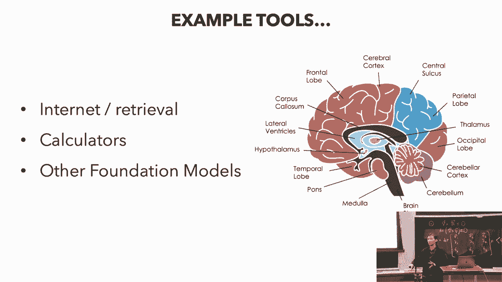

好的，所以，我们现在看到的是什么，我们在机器人等领域看到，有一个语言模型是非常有用的，实际上，它是至关重要的，然后当然你也知道，这在机器人学中也有帮助。

你也想要添加其他能力，或者你想要有视觉能力，而且模型也是通过理解图像和视觉来训练的，因为你不想重新训练那个，因为机器人要从起点开始，这对有用对吧，而且这也显示了所有这些不同智能是如何非常协同工作的。

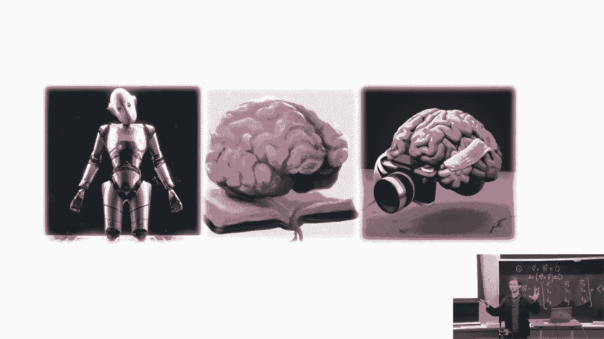

我认为还有一件事让人们惊讶，因为这种新的AI在更深层次上非常智能，还显示智力是非常协同的，每次我们试图将其分开，它会失去能力，并且变得，你知道，现在甚至很多时候做对都变得更难，当你试图解决更多。

它变得更容易，不仅性能变得更好。

而且变得更容易，并且，智力是非常集中的，你的每个指尖都没有大脑，你只有一个大脑，对吧，但也可能这是一个限制，因为我们没有一个单一的大脑，你知道，作为人类，对吧，我们的大脑是由许多子大脑构成的。

所以这有一个微妙之处。

我想我在后续的讲座中会谈论这个问题，我们看到不同的基础模型出现，了解这一点将有用，那些财务模型将会什么样子，但是嗯，我认为，我们早期看到的是，人们感觉市场将会非常碎片化，就像会有很多空间给专门化的。

你知道稍微专门化的大脑去做特定的任务，但是并不正确，在AI方面，市场非常像赢家通吃，因为如果你尝试做更多，你会做得更好，所以，我的意思是语言和视觉不会分开有脑部，对于音乐，对，它们之间有很多协同作用。

所以，需要有一种方式将它们 all 连接起来，并获取最佳性能的协同作用，对，类似，当涉及到商业时，就像一天是，当我们单独攻击推荐系统时，你知道，一种单独的智能，就像与孤立的单独智能相关的推荐。

而且这种智能就像一种单独的东西，不，这些都是相关的事情，这是关于现在理解你的业务的，理解你的消费者，在这种情况下，这是积极的方面，智能是中心化的，所以你应该利用数据，并知道如何从这一切都中学习。

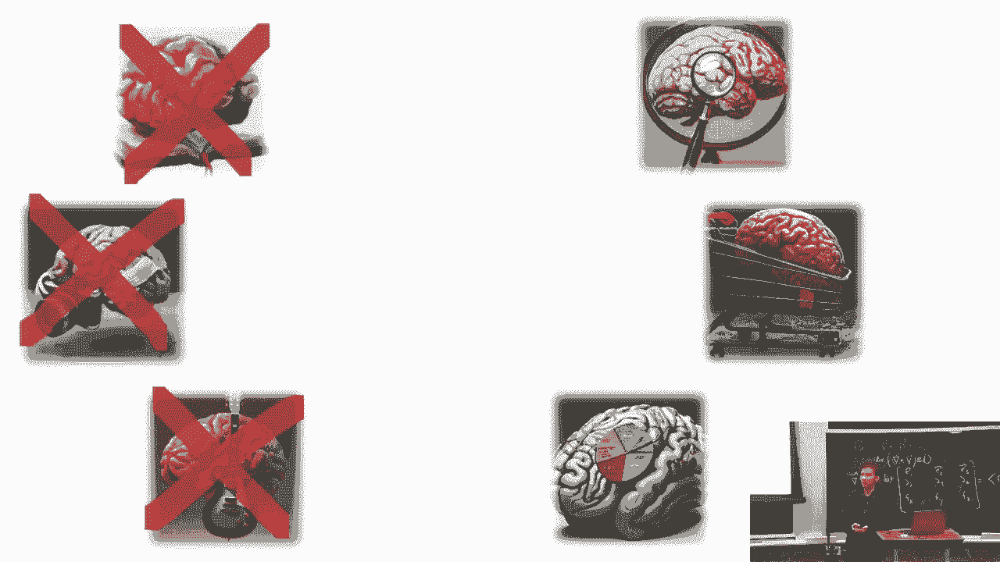

所有这些不同的专业领域都是正确的，所以你基本上把所有的这些都放入一个巨大的单一大脑中，我的意思是，但是，我也意味着互联网泡沫，例如，你开始看到这种情况，我的意思是。

每个人都在互联网上为狗粮建立了一个网站，比如在一九九九年对吧，但现在基本上只有亚马逊对吧，所以某种程度来说，我的意思是，我在夸大，但是，在很多地方都会是同样的情况，就像，对于有些人来说，空间不会太大。

比如现在的这些小型炒作玩家，像这样，当然，这是一种警告，让人感到害怕，因为我们正在将越来越多的权力交给少数人手中，就在一天结束时，就像你知道的，这些不是意识的实体，就像这些人在后面控制这些模型一样。

他们是利益相关者，商业模式，他们有决定权的力量，而且他们会，他们将从这中获得利益，而且他们正在获得更集中的权力，现在您知道，图表化的部分正在占据市场的一大份额。

然后突然人们不会再在所有我们的产品中尝试它，对，每个人都在使用它，如果全世界的人都在使用同一个大型语言模型，它非常非常脆弱，因为我们都在做同样的事情，所以如果它出错，它就会出错，系统性。

我将更详细地谈论在es上的东西，但也是正确的，这也是令人兴奋的，因为我们看到的智能是如此的巨大，所以你可以解决我们自己无法解决的问题，它将能够极大地受益于我们，如果你负责且聪明地使用它。

而且我将在后续的讲座中有答案，好的，所以下次我们将更加亲手操作。

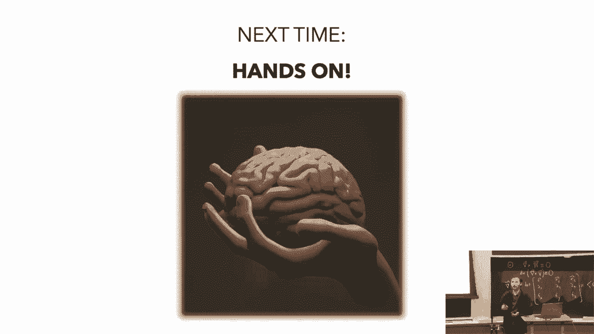

下次我想我们详细讨论Transformer模型，所以我们正在研究，它精确地解释了这是如何工作的，我们将解密Transformer模型，实际上这相当简单，我认为这不那么重要，我将告诉你为什么。

这样你就可以告诉你的朋友，你的鸡尾酒派对，Transformer并不酷，然后讲座结束后，我们将深入研究文本，到像稳定扩散这样的形象模型，以及是的，然后之后我们将有关于，基本上。

什么样的不同基础模型正在出现，以及它将如何从商业上看起来，我们将有一场嘉宾讲座，两场嘉宾讲座，所以在这两场讲座之后，我们将有两场与嘉宾讲座的讲座，然后我们还有伦理问题，好的。

