# 2024年最新 MIT 6.S087 基础模型和生成式人工智能入门课程 - P3：3、MIT 6.S087 Foundation Models & Generative AI. CHAT-GPT & LLMs - Moss学长 - BV114tLemEdn

好的，欢迎参加第三堂关于基础人工智能的讲座，所以今天我们将讨论聊天，Gpt和嗯对了，我的意思是，我认为对于很多人来说，Tdp是那款或那款人工智能，真正让人们理解的工具，这是不同的。

现在我们能够做以前无法做到的事情，并且肯定能创造一些轰动，所以希望这次讲座后您能理解基本的概念，同时也能某种程度理解最好的，最好的开放，AI是由研究者创造的外星生物，在实现聊天方面，实际上它可能。

从回顾来看，它可能，我的意思是，看起来容易，但实际上是一项非常勇敢的尝试，一点也不明显，在当时，这种方法实际上会起作用，所以应该很有趣。

只是快速浏览一下我们的课程安排，对吗，所以今天是标准的16，下次我们将讨论稳定扩散图像生成，然后我们将讨论新兴的基础模型，基本上，基础模型和生成AI在商业空间，我们将有两位嘉宾。

然后以AI伦理和法规的讲座结束，以及一个讨论组。

好的，在我们开始之前，我们谈论了，以及一个介绍，一个简短的，高层次的直观回答，什么是最生成性的AI，我们稍微偏离了主题，探讨了世界的结构，因为这允许我们思考我们应该如何在世界中学习，在第二堂讲座中。

我们详细介绍了所有不同的算法，是的，今天我们将更深入地探讨，在聊天和将所有事情都联系在一起方面，再次强调，所以在基础生成性AI中，我们做什么，我们应用这种无监督学习，其中我们学习没有标签的数据，所以。

我们可以获取你想要的任何数据，因为没有人类在其中，所以没有我们如何扩大这个规模的限制，我们从中获得什么，你知道，通过从观察中学习，从数据中直接学习，是一种非常上下文化和关系性的理解意义。

我们之前已经给了这个例子。

但从监督学习的角度来看，你知道，从数据中学习，我们可以获得一种非常具体的理解，你知道，狗的标记示例，而且在强化学习中，你专注于优化某些目标，并且你理解狗在与使你快乐或满足的方式中的关系。

在某种意义上或优化你的目标，但在无监督学习中，对吧，它是基础模型的基础技术，你从观察狗在不同环境中学习，并且你得到一个非常关系的狗定义，所以它是主人牵着绳子走的东西，它与猫的比例为1：3。

它追逐没有王座的薯条，这就是你对狗的定义，今天我们将讨论一个非常工程密集的领域，你知道，GPT，嗯，它依赖于许多技巧和工程洞察和突破，我们并不打算覆盖，我认为，尽管你知道，就像谈论汽车一样。

你可以理解汽车的高层次视角，并获得一些见解，如何工作，它如何工作，现在，这对你没有必要深入理解所有的工程细节，但在现实生活中，这些工程细节真的很重要，而且很难得到正确，这是我们在这堂课中不会深入探讨的。

因为当你将某事物提升到一定规模时，你需要瘫痪许多机器等，考虑高参数，这是一个完整的科学，因此，它并不容易，但在这种课程中很难教，你必须通过实际构建这些东西来学习。

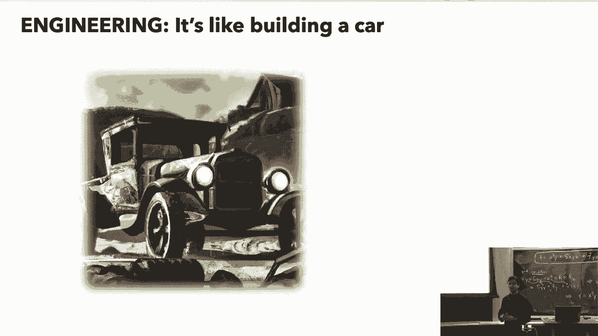

嗯。

好的，所以嗯，在这堂课中还有一些哲学思考，嗯，也包括在课程中，我认为，再次像我们之前讨论的那样，这里有一个主题，那就是为什么新的AI如此强大，是因为它不迫使事物遵守简单的规则。

它实际上解放了我们理解并压缩我们所看到的能力的能力，并直接处理那个混乱，这就是AI如此强大且人性化的原因，当我在GPT中谈论这个问题时，我们试图做出非常高级和明确的陈述，但当然，细微之处很重要。

我认为这非常有趣，我引用了一位十八世纪和十七世纪的将军的话，他说这句话的人，悲悯理论，它与心灵相对立，他的意思是他是位将军，所以他在战斗中和战争中战斗，在那个时候，人们喜欢来讨论战争。

像我们应该有一些规则，士兵在战斗中应该如何行为，但是，我已经经历过战争和战争，首先，不要遵守规则，所以，在受到攻击之前，每个人都有计划，基本上，所以你知道，当人们开始射击你，当你处于战争的迷雾中。

你不知道发生了什么，在那里，没有简单的规则可以帮助你，而且他还说，关于思维，他这样理解，他说，就像那样，实际上，通过与士兵的合作，他已经意识到，士兵和人类被挖掘，我们并不善于按照我们试图记忆的规则行动。

我们非常直觉，非常快地对事情做出反应，凭借我们的直觉，这才是真正真正重要的，这就是我们擅长的，所以，如果你强迫一个士兵试图记住很多规则，这就是在战斗中应该的行为，你基本上限制了你可以做的事情。

这也是我认为新类型的AI可以利用的东西，好的，所以检查，GBT和正确，这是一个真正的突破，它具有我们可以交流的人类般的语言掌握能力，它可以基本上为我们解决一个非常广泛的任务集。

任何可以以文本语言表达的事情，它可以它基本上可以解决，现在也是如此，当用于等等的gpt变为，它能够处理多模态，但它极其强大，所以让我们尝试将其分解，首先，这个名称实际上代表什么，聊天部分是显而易见的。

它代表聊天，然后gpt代表生成式预训练变换器，并且有一个含义，这是实际上这是什么的一种好描述，而且我认为，如果你看到这两个不同的，这里的三个不同的概念，它们几乎也是对应长度，在重要性和影响力上。

它们对于使chgt工作起着相同的作用，所以聊天部分将最后覆盖，在某种意义上，它是最不重要的一个，你如何训练这个模型并达到这个结果，然后，变压器是这个模型的基本引擎，在某种意义上。

所以让我们从生成式预链开始，这意味着什么，我们如何预训练这个模型，这就是开放AI花费99%计算资源的地方，是为了做这一步预训练，所以它非常，非常重要，"好的"，所以我们要做的就是，嗯。

"只需从互联网上随机获取一些文本"，所以我们有一个词序列，"然后我们就尝试根据之前的单词来预测下一个单词"，所以让我们假设我们有，"我们从i这里开始作为输入"，"然后我们想要稍微预测一下目标"。

所以我们非常清楚，我们知道，或者电脑通过下载文本某种方式就知道这整个序列是什么，但当它训练其ai模型时，它会隐藏一部分，所以它只输入i到ai模型，而ai模型应该对它做些什么对吧。

所以假设现在要做一个猜测，或者下一个词是什么，所以基本上你允许模型做出一个猜测，然后可能它就错了，然后你可以给出一些负面反馈，然后当它做对时，你可以立即给出一些正面反馈，所以这就是高层次的。

我们要实现的目标，所以首先你开始考虑的实际上是，有多个，你知道给出一个序列只是一个事实，正确的预测，它仍然在这个例子中，就是实际上会跟随的单词，但是，有很多单词不是正确的猜测，所以也许你想要。

你知道你想要允许模型尽可能地利用这个例子，所以你基本上可以做出很多猜测，你可以给他们提供大量的信息，关于很多不同且错误的猜测，所以你在这里能够给模型提供更多的信息，比如，嘿，实际上，等一下，这是错误的。

雨伞也是错误的对吧，然后它开始正确起来，然后你给予一些积极的反馈，我们将会这样做，我们将会最大化这个，所以我们将为所有英语词汇创建预测的分数，你知道的，英语词汇表，听起来极其昂贵，实际上也很昂贵。

所以我有一些不同的技巧来使这个工作，但你会做出一个猜测和一个分数，对于英语中的所有单词的预测，在英语语言中，但只有一个会是正确的，但它也会提供很多反馈，因为有很多信息关于哪些是错误的。

现在我们要做的就是，我们将会创建这些概率分数，这意味着这些只是非负数，它们将相加等于一，所以它们实际上对应于模型的，对于出现下一个单词的猜测可能性，比如，下一个单词出现的可能性。

所以你创建一个所有可能的英语单词的分布，然后分数对应于这个单词出现后的可能性，你所看到的，好的，所以这里，你知道，到这个时候，模型被看到，它创建了一个分布，你知道这里有四个单词，但所有的英语单词，然后。

你知道你真的你揭示了哪一个是正确的，所以这是接下来应该出现的正确的东西，然后，你将这个交给模型，它被称为反向传播，所以你给模型一些反馈，如果你将正确单词的概率分布或分数推大或增加。

然后减少所有其他的分数，所以你知道下一次它看到相同的例子或类似的例子，实际上它做得更好，你知道这只是一个单一的例子，但你积累所有这些方向和信息，跨越一批例子，你在同一时间看到的，所以。

得到越来越好的分布需要一步一步的小步，以及更复杂的下一个词分布，基于之前的词，并在大量的例子中这样做，当然，你知道我们有无限的数据，因为我们可以从一行中获取文本数据，当然，我们做这是全部和序列的。

所以我们可以充分利用序列，所以我们预测 uh，每个可能的下一个词，uh，在所有正确的组合中，现在，我们已经训练它。

我们有一个模型，可以预测下一个词，基于之前的词，所以，我们又有一个起点，例如，对我来说，不是一个很有趣的提示来建模，但它是一个起点，它给了我们一个分布，现在，英语语言中可能出现的所有单词的总和。

然后我们只是取arg max，或者我们可以采样，你在哪里取arg max，这是哪个最有可能出现的词，接下来，我们取arg max，并将其放入序列中，然后我们得到一个更长的序列，然后。

我们可以在这个序列上运行模型，然后，我们做同样的事情，我们只是继续下去，我们可以让我们的秘密越来越长，我们可以继续这样做，你知道，例如，直到我们达到句号，或者像某种特定的标记。

说我们直到完成整个句子为止，例如，嗯，这有点贵，uh来做，因为你必须一次生成一个东西，但当然，训练是更快的，因为那时你不需要生成并运行在自己的输入上，你只是想看输入来获取，但实际上，我们这里必须看提示。

生成下一个词，添加它并再次运行，所以它有点贵，而且在这个意义上是序列的，但你不需要这样做在训练中，只有在评估和训练中，最昂贵的是什么，所以这很好，在某种程度上，还可以，所以你知道，如果我回家了。

这不是一个很有趣的提示，什么样的提示会更有趣呢。

我们之前稍微讨论了一下这个，所以现在你知道了，如果它真的很擅长根据之前的单词预测下一个单词，我们可以给它有趣的提示，并且它可以开始为我们解决有趣的任务，仅仅通过能够根据之前的单词预测下一个单词。

所以我们看到，我们基本上有这个不同的语言任务，我们只把这些给模型，如果它真的很好，它应该能够生成我们正在寻找的明智的东西，如果你尝试这个为聊天的。

对，它确实这样做，基本上已经杀死了许多专注于特定任务的研究实验室，因为现在它做得真的很好，我从建模角度看，这就是基本情况，这就是查德普的概要，好的，所以，那是什么，我意思是听起来可能合理和有道理。

当然，它被设定与tdp不同，规模巨大，这是以我们以前从未见过的数据量和参数规模训练的，所以这现在是一岁的，但是，我认为这可能是GPT-3。5或者类似的东西，第一个版本，如果它使用了175亿个参数。

而且只是训练最终的模型，不像，包括您必须做的所有迭代，以尝试不同的东西，但只是训练最终的模型大约花费了500万美元，仅在计算上，就像电费账单一样，这是他们在这个上花费的巨大的计算资源，再次。

所以这是一个非常非常简单的方法，但是，从未见过的规模已经出现，而且，这就是重新打开眼睛的大问题，然后，那里研究的情况就像，你知道我们已经在做这个语言模型有一段时间了。

试图通过预测基于先前单词的下一个词来理解语言，然后，我们正在，你知道我们在用它做一些事情，但是，我的意思是很少有人认为如果你只是足够放大这个规模，它就会成为一个多任务解决者，并显示出人类般的智能，而且。

这实际上确实会工作，人们开始谈论这些新兴的能力，因为也不是线性的，就像你开始添加和放置，放置更多的计算和参数，然后像，哦，它还不是很有用，但到某个时候你开始变得极其有用，所以这也是一种巨大的信仰飞跃。

当我们说，就像哦，我们就全押上，让这个越来越大越来越大，然后从后视镜看，就像，也许这是有道理的，但可能是这样，它可能不工作，然后人们说，哦，这是一个愚蠢的赌注，像，你为什么认为它那么简单。

想法和方法将导致如此复杂的智能。

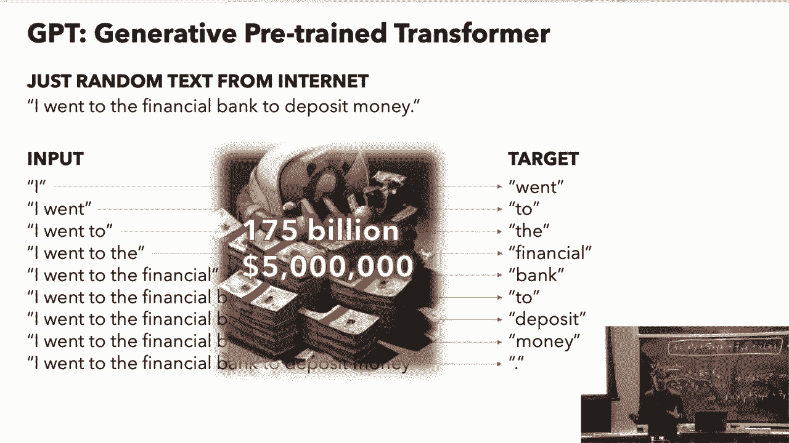

所以它过得还可以，所以我们覆盖了预训练的整个部分对吧，所以嗯，你知道，我们已经说过我们基本上如何训练我们的模型，但这个模型看起来什么样子。

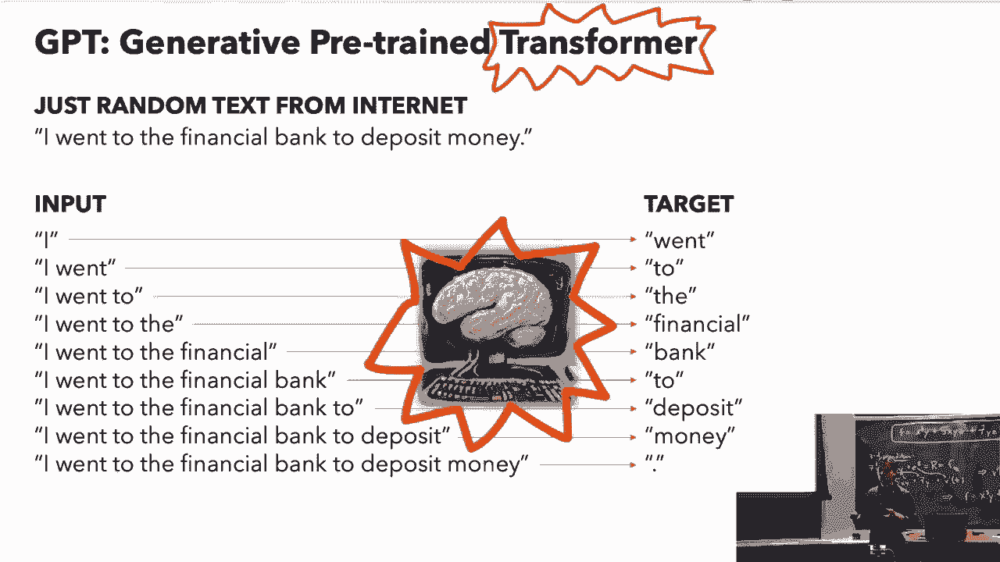

这种引擎看起来什么样子，所以，如果整个东西是一辆车，那么预训练就是如何教司机开车，然后Transformer是它利用的引擎，有些人确实声称这个Transformer部分极其极其重要，所以有一些争论。

是什么使TPD和大型语言模型成为可能的最影响因素Transformer，它肯定是其中的一个重要部分，我会让你自己判断，但我认为不如我们即将提出的实际建模视角重要，好的，为了理解Transformer。

我们将开始思考我们如何处理序列，文本是一个单词的序列，所以我们只是思考如何处理序列，好的，假设我们有从网上下载的这句话，我们想要逐词处理，我们想要预测下一个词，所以我们有我们的模型，它基本上看第一个词。

在这里创建一些中间嵌入或特征，然后，它在第二步中使用这些来预测下一个单词，好的，我们继续，然后，它看第二个单词，所以我刚刚走了，但是要想做好工作，你也想要能够从那里集成之前的单词到特征中。

所以它 kind of 也处理并包括到第二个向量中，包括之前的单词和当前单词，以创建对整个句子到目前为止的新表示，然后它使用这个来预测下一个目标，好的，我们继续，我们做同样的事情，嗯。

当然我们做这个为了某事，我认为这可能听起来很琐碎，但是，在这里需要注意的是，每一步都标记有相同的数字，你知道，所有这些都可以并行完成，所以这里第二步的所有事情都可以并行完成，它们不需要等待任何事情。

第二步需要等待，第一步完成，但是所有的二都可以并行运行，它们不依赖彼此，第三步可以在之后运行，它们不，它们不依赖于彼此，第三步可以在第三步完成后运行，因为第三步不依赖第二步，所以如此等等，这是关键。

因为在深度学习中我们使用这个，计算机被称为 gpus，基本上，成本是，你知道，如果某事可以并行完成，它是单个成本，我们不在乎，你在并行中做了多少工作，它是单个成本。

如果我们可以将多个步骤合并为一个并行步骤，这是单个成本，我们尽可能多地并行运行事情，所以这里基本上你知道这是一次成本为四，因为所有这些不同的数字都可以并行运行，所以这将只是一次成本为四，然后。

当然处理整个序列的成本将是九，这可能是，你知道，有些人可能会认为这是一个相当好且合理的工作，因为这是一个序列，我们必须以某种方式处理它，我们并行化了大多数步骤，也许这就是我们能做的最好的了。

这被称为循环神经网络，当我们以序列方式处理时，我们尽力压榨尽可能多的信息，但你当前的过程依赖于之前的，之前的步骤，而且这些极其极其流行，并且有一种被称为lstm的版本，长短期记忆网络。

它表现得极其极其出色，有些人说它性能你知道几乎比transformers好很多很多次，但他们只需要更长的时间来训练，因为我们可以理解它为什么在一个点上，但它们表现得极其极其出色，而且注意这里。

有些方式使得研究者说，这个非常非常直观，比如，文本，我们从左到右阅读文本，我们一个词一个词地读，因此，我们的模型应该能够有效地从它们中学习。

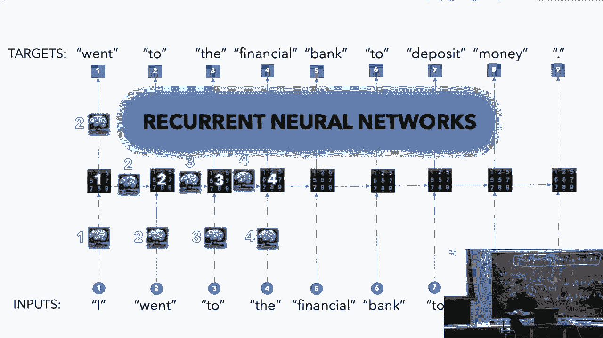

好的，所以我们要稍微简化一下，只是想想信息在这些网络或模型中如何流动，再次对于网络，我们基本上只有这个非常简单的信息流动，其中，信息的流动方式基本上是顺序的，对吧，所以，从a到b的信息。

你可能需要8或9步，才能使用，比如，让我们想想这个问题，当你想要预测一个旅行时间时，大约需要8或9步在这里被使用，就像，让我们想一想，嗯，现在从transformer开始，它基本上开始得也一样。

所以我们让第一个，我们知道我们只是处理第一个词，并基于那个预测下一个目标，但是，当看第二个词时，与顺序不同，我们不会像之前那样使用我们被使用的过程，我们会直接集成从i到目标的信息，所以我们会。

我们不会强制执行这个顺序结构，我们直接获取信息，所以我们不会，我们不会强制执行这个顺序结构，我们直接获取信息，让前一个词的信息流动到当前词，然后等等，我们已经看到了这么多，然后在第三步也是如此。

我们还将让信息直接流动，并与前一个词建立直接连接，并且不强迫事情按顺序发生，嗯然后，在这里，重要的是在开始之前要注意，当我们按顺序发布东西时，你需要等待前一步完成才能进行下一步，但这里不。

因为这里一切都被独立处理，所以你不需要等待，因为每个目标都有一个节点，或者抱歉，一个边缘连接到前一个词，所以他们都可以并行运行，他们不需要等待任何东西，他们基本上在为每个步骤重新做所有的工作。

因为他们都添加了到前一个词的东西，所以现在所有这些步骤，像没有一个步骤需要等待另一个步骤，那里没有依赖性，他们可以直接前往源头并使用那个信息，当然，你知道我们为整个序列这样做，然后再次强调。

如此对于最后一个目标，所有这些计算都可以并行进行，是的，所以他们在某种程度上在目标处聚合，并且所有这些都可以并行进行，因为它们不重叠，但是，也对，这也可以在同一时间并行进行，因为八不依赖于九。

而九依赖于八，所以它们也可以并行进行，这是相同的步骤，这是真的对于所有这些步骤，是的，所以这直到我们整个输入字典中有一个完整的字典为止都 makes sense，然后，我们将做说如九种不同的组合的输入。

或者这如何工作，当我们后来计算所有单词上输出分布的时候，作为预测，我们谈论了第一个事情，我想我可能有点混乱，但这与生成部分有关，我们正在生成下一个，是的，是的，但如果我们已经生成了下一个词。

那么我们如何知道，哦，嗯，嗯，抱歉，抱歉，所以确切地，现在只有训练时这行才起作用，对，实际上我会稍后讨论这个问题，所以只有在训练时我们才能这样优化，但那也是，那是一个很好的问题。

但它也像深度学习中的一种东西，我们基本上几乎，我的意思是，训练是最昂贵的部分，因为那时你需要优化并执行反向传播来更新，更新你的参数，当你这样做的时候，它会非常昂贵，当你完成时，你冻结它。

你不再更新任何东西，这将使运行速度大大提高，所以它将大大减少，那是一种修改，但是，它稍微失去了一些感官本质，嗯，我们关心的是，我的意思是，我们关心既快又好，我的意思是，但无论如何。

这将比循环网络训练快得多，所以你将能够获得大大提高的性能，然后部署时的差异将不那么显著，好的，因为在训练时我们可以这样做因为我们不会将单词附加，我们只是在序列中看到它们，我们可以这样做，嗯。

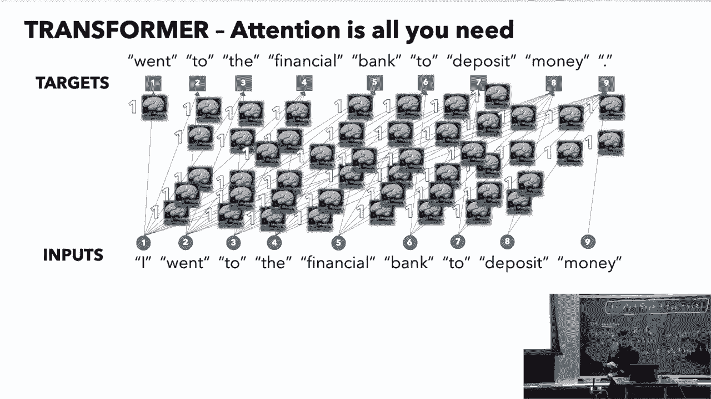

实际上，这是我的笔记，这当然只在训练时起作用，嗯，好的，所以现在你又知道了，我们像这样看它们，嗯，就是我的意思，也许我的意思，最大的区别是什么，有些地方看起来是对的，其中一个。

顶部的网络看起来非常结构化，就像是处理事物的一种强烈的偏见，顺序地，底部看起来非常混乱，而且看起来像啊，那就是很多连接，它可能很难理解序列的意义，由于你同时被所有输入喂养，所以可能惊讶的是。

一个比另一个更好工作，另一个，你知道一个肯定需要更多的数据才开始学习有用的东西的，所以转换通常需要更多的数据才开始做好工作，但这是另一个我们正在处理的事情，你知道，真的，在这里忘记了对吧。

所以在循环网络中，事情一件件处理，所以模型可以理解你知道财务在之后，因为它看到第一个然后财务，但在变压器中，你知道在下面这里，比如如果你只看到的词，而且他们都必须，你知道对于如果你看预测。

我们将在步骤九进行，如果你看到所有这些词同时 right，有一种像样的，你可以重新排列所有的单词，你基本上看到同样的东西，所以没有顺序，没有顺序结构，实际上，对于任何变换器来说。

但是一切都在同一时间被输入，所以再也没有顺序了吧，你同时看到所有事情，所以没有顺序，所以，你怎么解决这个问题呢，你再次做你能做的最简单的事情，我们就在这里删除数字，使它更明显，只有知道单词，没有顺序了。

因为所有的东西在变压器中都是连接的，在哪里有一个循环网络，仍然有顺序，由于处理方式的性质，所以我们如何解决，这就是对于变压器的，我们就会为每个单词添加一个位置编码，所以我们只是再次添加位置。

这就像变压器必须弄清楚，序列是否重要，就是要使用那信息，即使现在，它已经有了这些信息在手中，因为我们要编码一个序列结构，不是通过处理事物的方式，而是只是附加一个位置编码。

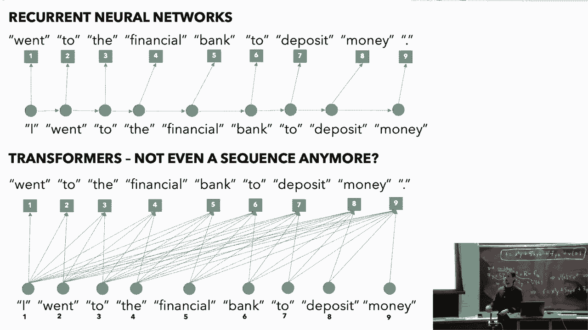

你知道，这实际上是，相当反直觉的，你知道，就像看到一本书中的所有单词同时，像是很快，但是非常混乱，然后，你需要通过一个小的你知道的数字，来理解事物的实际方向，所以，如果你去电影院，并以帧为单位思考。

你可以坐下来在一秒钟内消化整个电影，就像超级高效，但你看到了所有的帧，你知道，在同一时间闪烁，然后在你的头脑中，如果你需要，你需要将它们按序列排列，你知道，以理解电影的情节，这通常很对。

但变压器并不必要隐式学习这一点，因为它不是直接发生的，好的，所以为什么这也很好，因为它很快，而且对于新的网络来说，记忆非常困难，所以对于网络来说，记住东西很困难，所以假设你知道，如果你读一本书。

或者你看电影，如果你想理解结尾部分，可能回看开头部分是有益的，书的开头部分或什么，你知道，或者如果你记得这些信息，但可能你知道，如果你不记得，你可能需要回去查找，所以在 raccoon 网络中。

循环网络中，因为我们在这里假设事物是序列的，所以为了某物被使用，比如关于序列中的第一个词的信息，要在最后一步中使用，所以，你知道，关于步骤 i 的信息，所以，你知道，在这个步骤中，当你消化金钱时。

你需要在某种方式记住这个过程中的信息，向右走，对于网络来说，做很多工作非常困难，这是为了使工作更好而做的，但变压器的一个好处是它有直接的连接，所以如果你不喜欢，它有很多连接。

但如果它是一种非常强烈的重复性的东西，那么第一个词和最后一个词相关，某种方式，它可以非常快速地捕捉到这一点，并使这个边缘非常非常强，从而杀死其他边缘，所以你可以非常快速或高效地集成信息。

所以你可以在序列中非常高效地集成长距离信息，因为并没有真正的序列结构，但当我们强制序列结构或循环网络，这更难，因为 then 我们需要记住当我们处理东西时，好的，所以总结一下变压器，我们做了一切。

我的意思是，我们所关心的一切在，当涉及到深度学习时，"那是我们尽可能多地想要并行做事情的意思吗？"，"因为如果所有的事情都并行进行，那就是一个成本"，"并且，一个变压器正在优化地做那个。"。

"因为它只是使一切都并行发生"，"然后它移除序列结构"，我们必须，你知道，将该信息添加到模型中的位置编码中，而且，这也很好，它是，你知道，结果发现，这个长的，而且，数据中的信息通常非常有用。

以便能够高效地集成，而且，内存很难，所以，变换器擅长集成这种信息，并能够通过这种方式做得更好，他们取代了这些循环网络，再次，正确，这就是我们在谈论的，尤其是在训练期间，但是，当涉及到推断时。

这种差异并不像训练期间那么严重，或者当我们部署它们时，并且，再次像自从我们现在有了自我超学习一样，并且我们可以通过在互联网上下载文本来训练，并且没有人类的循环，数据的规模是如此之大，你知道如此之大。

以至于我们可以通过学习很多，你知道我们可以学习，我们可以学习并负担得起使用大量数据来学习基本事物的成本，所以前者的结构要少得多，必须重新学习大量的结构，但由于我们有这么多数据，我们不需要标记数据。

我们有能力负担得起这一点，对吧，我们可以负担得起以前从未见过的规模进行训练，这也是为什么这工作如此出色的原因。

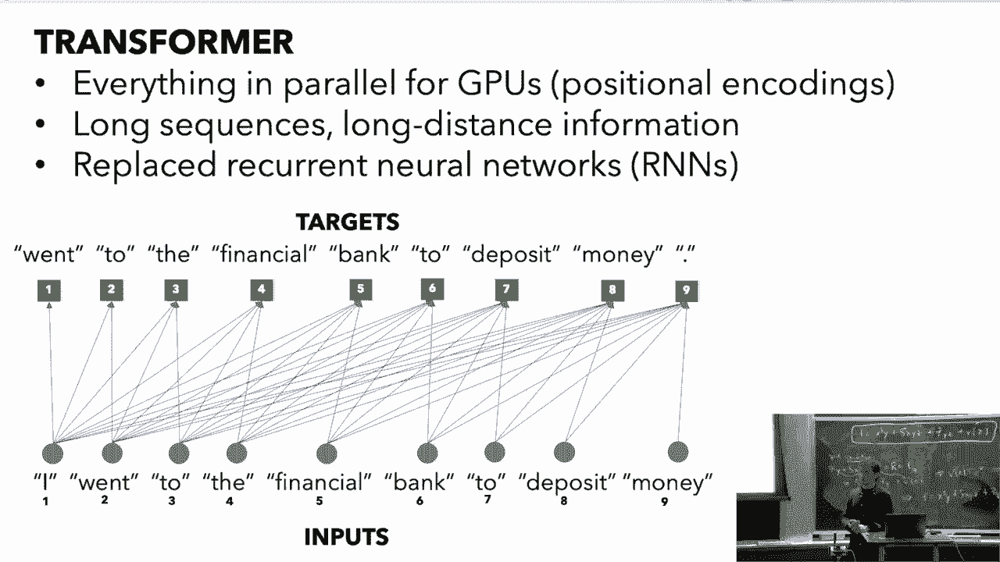

好的，所以嗯，现在我们有一个语言模型，正确，我们知道如何训练它，而且我们知道它可以使用哪种引擎来高效工作和良好运行，所以现在我们可以看到最后一部分。

那就是聊天部分，并且。

你知道你，你现在可以训练这个模型，因为你叫gpt三点五或者什么，并且你现在想要转向聊天gt right，所以我们有一个一个非常好的模式，所以基本上我们已经完成了所有要求的百分之九十九的工作。

而且很多人还在争论这一步的重要性，但是开放访问确实有所不同，但是，你知道，当我们有这个模型时，我们看到我们看到这种，哦，它工作得相当好，但是，我们希望能够改进它，它有一些愚蠢的失败案例。

我们只是想让它稍微复杂一点，所以首先我们要做的就是，模型现在已经被训练在，你知道，互联网上的任何来源上，你可以想象对吧，所以小说，维基百科，Facebook帖子，你知道基本的事情吗，但你怎么。

用户是如何使用，这是通过一些聊天机器人，对，所以它的交流像人类交流，这就是他们叫的，当然，它已经被训练了大量的文本，不是人类交流，现在我们只是要说，我们想要能够专注于并调整自己。

以便更好地理解和处理信息，通过人类对话进行少量的训练，所以我们打算，我们不会去收集我们人类对话的最佳数据，来自我们所有可用的来源，我们将在仅使用那个数据上进行更长的训练。

所以我们将仅在人类对话数据上微调参数，以便你可以专注于其参数并专注于特定的用例。

好的，所以我们这样做，甚至更接近一步，如果我们做得更好，我们现在甚至工作，但是打开，我想进一步说，就像，在这个模型中存在一些我们正在解决的观察问题，现在当我们训练在这个文本数据上时。

每个目标都同样有价值，我们似乎没有，我们实际上没有，区分，好或坏的对话，所以模型并不清楚什么是好的对话或坏的对话，它只知道从互联网上的什么对话是可能的，但我们只是想说，是的，你知道什么是可能的对话。

但我们真的很擅长如果你想要理解什么是不有帮助的对话，和什么是有帮助的对话，所以你可以给我们有帮助的对话，好的。

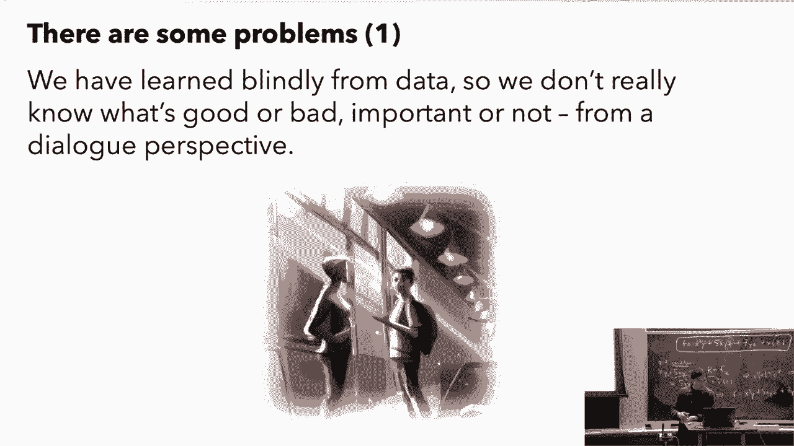

另一个问题是我们似乎过于贪婪，当我们训练东西来预测下一个词基于之前的词时，我们只关心给出最可能的下一个词，但如果你想要生成句子，你真的不关心优化下一个词的可能性，你关心优化你整个句子的可能性。

而且很多时候你可以牺牲，你知道短期利润为最佳长期利润，同样，生成这些序列时也会出现这种情况，我们真正关心的是科学家们在最后结束时的得分，当我们完成它时，我们不关心选择最好的。

你知道在每个步骤中的最佳选择，你知道，每一步，所以，例如，在这里，如果你稍微往下走一点，到银行，你可以，你可以伸出手，在句子的末尾达到更高的最优分数，那当然我们关心的是，所以某种方式我们过于贪婪。

我们应该稍微更加重视长期优化，因为如果你给出一个完整的句子，我们关心那个句子的质量，这就是我们想要优化的。

好的，然后第三个微妙之处或者与当前模型有点困难的是，是我们希望这个模型稍微更加强壮，让我们说，结果发现这个模型现在已经在网上的文本上训练过了，当然，这个真的很好用，"但是，人们将会使用这个"。

"并与其互动"，"可能在某些方面并不完全与其训练数据对应"，所以，我将去看看我之前从未见过的事物，所以这可能是一种使用方式的分布性转变，"它被训练在什么上"，"并且正确"，正如我们所说。

"当我们部署这个模型时"，他们将会，你知道，生成一个词，将它添加到自己的序列中，将它添加到序列中，就像它的当前顺序一样，然后按照序列运行，所以通过运行自己输出，它可以创建更长的序列。

所以他一个词接一个词地添加，而且没有任何AI模型是完美的，所以也许随着他们开始添加词，我会积累一些错误，而且它会稍微有点偏差，它就像这里一样稍微有点偏差，例如当你说你知道我去了金融。

然后你知道有一些小的错误发生，它就开往了餐厅，你知道 somehow 很难看到那个，好的，现在基本上就要失控了，因为它偏离了它被训练的地方，它就只会生成无意义的东西，所以，我们想要能够说，比如。

如果你发现自己，你知道一点路径，你应该能够找到你的路返回，尽可能强壮，对于任何类型的用例，而且当你生成你不想要的东西时，你知道，离开道路，你想要能够尽可能多地找到你的路返回，尽可能有用。

好的，所以，这就是我们想要解决的问题，什么是好的对话，什么是坏的对话。

我们不想那么贪婪，而且我们要更加强壮，学会软纠正，这就是我们要从人类反馈中学习强化学习的地方，这就是openai在chdp上做的事情，这对很长时间都备受期待，但现在人们谈论它的次数少了。

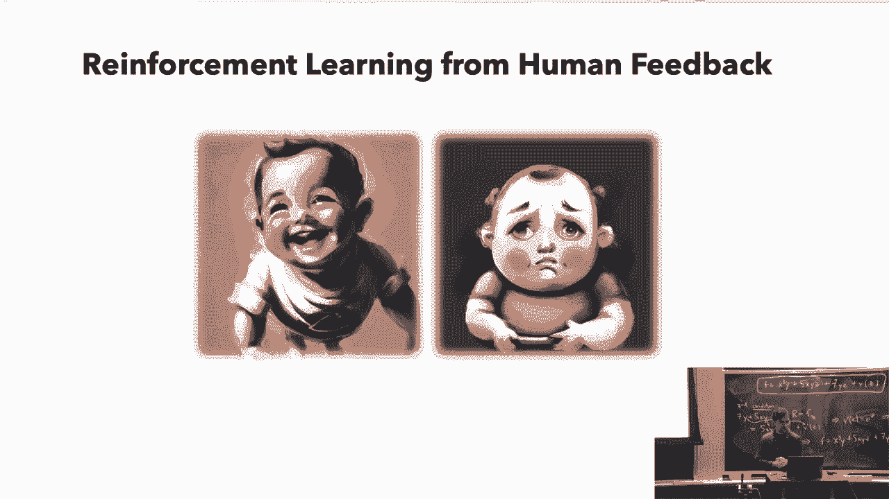

好的，那么我们在哪些方面做得好呢，我们有一个伟大的模型，这个模型已经在对话上进行了精细的调整，并且它还能够针对不同的问题生成非常优秀的回答，所以我们现在将要将这个模型应用在一组提示上，我们将生成四个。

所以我们将为任何答案采样四个提示，对于任何我们有的提示，假设这非常便宜可以做到，假设我们有，你知道，我们在网上找到了一百万条提示，现在，我们对每条提示运行我们的模型四次，使用不同的随机座位。

然后我们采样并获取四个不同的回答，所以现在我们有一百万条提示和四个候选答案，好的，然后我们会说我们相当富有，所以我们会支付给人类来标记这些，他们将对这条提示进行排名。

或者这些模型的答案对这些提示产生的结果，所以我们要支付真正的人类来评分他们，并说他们是好是坏，他们将排名，他们将排名这些输出的质量，好的，但是再次，人类是非常非常昂贵的，所以我们不想使用它们太多。

所以再次，我们将回到强化学习，并对人工智能中的深度学习说，做得好，我们现在有一百万个排名前四的提示，但我们为什么不现在就训练一个新的人工智能模型，基本上只是为了模拟一个人类评估平等，并排名这些提示。

所以嗯。

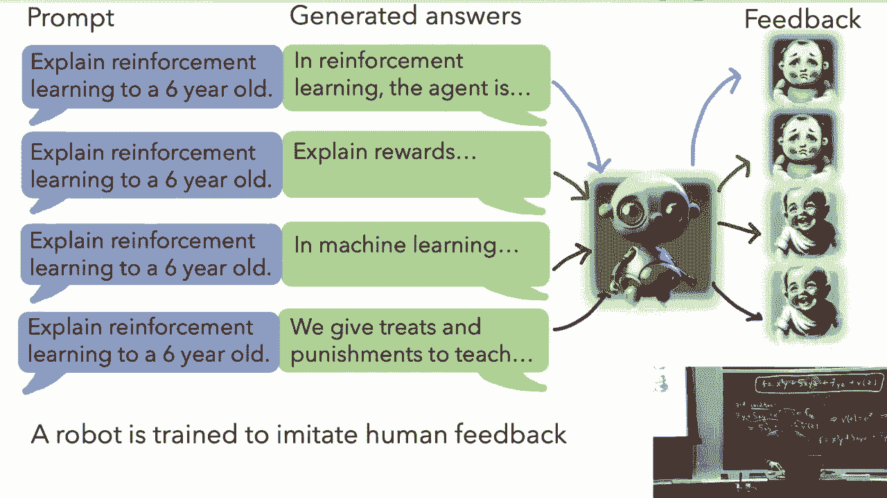

我们现在将取这个，嗯模型，这个机器人基本上可以查看提示并生成答案，并且它是，然后它试图预测一个人类会给出的这个答案的分数，这个提示我只是学会了模仿人类对这些答案的排名，好的，为什么这个好呢，这个好。

因为现在我们可以基本上像要像要一样地排名和评分答案，因为计算非常便宜，所以我们可以扩展到这个设置中的任何数量，所以这就是这比这便宜得多，好的，我们现在有什么呢，我们有一个机器人或AI模型。

它能够接受一个提示和一个答案，然后给它一个分数，如，让我们说，介于一和五之间，说这个有多好，我们现在解决的问题是我们知道什么是好或坏的对话，因为机器人或计算机学会了模仿人类。

那些明显知道什么是好的对话的人，所以机器人现在也知道通过对话什么是好的，所以现在我们可以在任何提示和答案上运行这个机器人，并得到答案有多好的分数，这个答案是如此的。

我们现在突然至少有一些关于什么是好或坏对话的见解，我们已经解决了这个问题，好的，在最后两个问题中，我们不打算使用强化学习来解决，那么强化学习是什么，嗯，我们之前想过这个问题一点。

但是有一个非常重要的事情，强化学习的特性是这个延迟的反馈，在强化学习中，我们将有一个非常好的模型的起点，但我们将允许它开始生成东西，它生成一个词，把它放入自己的输入中，并重新运行自己。

所以它变成了一个更长更长的序列，一个接一个，所以我们从开始，我现在有一个概率分布，我们决定下一步做什么，然后我们去了，然后又有几个选项再次，我们再次采取下一步，在这个阶段没有反馈。

我们不知道我们是否做得好还是不好，在此之前，我们有即时反馈，因为我们有一个目标，我们可以在这里学习做得更好，但这里没有即时反馈，我们是自己，只有在我们达到一些预定的标记，如同伴，例如，然后我们停止。

然后我们将我们产生的序列交给这个机器人，然后机器人告诉我们说嘿，这是好是坏，所以只有在我们像嘿的时候，我们完成了，我们将其交给机器人，他来评分，然后我们得到反馈，好的，为什么这样，为什么这很难，嗯。

这很难，因为让我们假设我们再做一次，所以我的意思是我们生产的时候，我去了一个散步期，我的意思至少这是一个很好的句子，它像是中等分数，至少，但是让我们假设我们现在生成，我去了唇眼行行期。

我意思是那不是一个很好句子，它没有任何意义，基本上这是非常非常差的分数，但你知道，强化学习的一大部分现在，是如何理解这些信息的，你有两个信号，你开始在第一步做相同的步骤，然后它们开始分开。

实际上会花费一个什么，往往大约是另一个，你怎么将这个融入，这种延迟的反馈，实际上如何学习生成好句子，并且，因为我们，我的意思是，我们实际上并不清楚我们如何做出更好的决定，这就是强化学习的意思，就像。

你如何找出实际上帮助你达到目标的方法，并优化你的分数函数，即使它被延迟，嗯，好的，所以，在做这个时，一个非常非常重要的事情是探索与利用，那么让我们假设现在。

基本上我们的模型已经看到了这两个接收到不同反馈的案例，在这些中的一个中，你将得到一个相当好的分数，而在这个较低的地方，你得到了一个相当差的分数，那么让我们假设我们再次运行这个模型，它从i跑到了结束。

然后让我们假设它，有点记得你到目前为止看到的东西，然后它可以说，在这里我们可以说我们可以尝试稍微贪婪一些，正确的话，我们就爆炸我们已经看到的一切，所以，如果你走这条路线到，我去散步了。

那么至少我们知道我们将会做好工作，而且比这个我们已经看到的替代方案更好，那么基本上这意味着我们只是利用我们已经看到的信息，并根据我们目前收到的知识做最好的，但是，这个问题是如果我们这样做。

你知道我们看不到任何新的东西，我们只是探索和探索他们已经收到反馈的东西，他们已经对我们有了很好的了解，嗯，我们永远不会做得很好或更好，因为我们只探索序列，他们看到的路，和这，当然，这不好。

因为如果你开始探索不同的路线，例如，你可能再次找到一种更好的解决方案，这是非常优化的，这就是你想要完成的，你，你知道，你想要探索你的空间，以便能够比之前做得更好，并看到和看到数据中你没有见过的部分。

以获取更多，你知道，有用的反馈和分数来自机器人，以及，我认为在这里强调一个非常重要的点，是，这种探索不能完全随机，对吧，让我们假设你只是，一个序列，你知道的，五十个随机单词，我意思是这将是完全无意义的。

你不会，你不会得到任何好的反馈，对吧，你将是完全无意义的，随机，你将无法获得任何有用的反馈，这将非常非常困难来改进，所以，为了生成你知道的这种探索，你知道，你想要进行一种非常非常定向的探索。

围绕语言仍然有些道理，因为机器人会给你提供好的反馈，并且你可以开始你知道地取得进步，这就是为什么你和OpenAI能够使用强化学习，是因为他们已经有一个非常好的语言模型，他们只是在知识的边缘进行探索。

这个模型的模型已经如此强大，基本上他们只探索好提示或好答案，但它仍然做一些探索，但它们不是做随机探索，它们使用当前的知识来进行有效的空间探索。

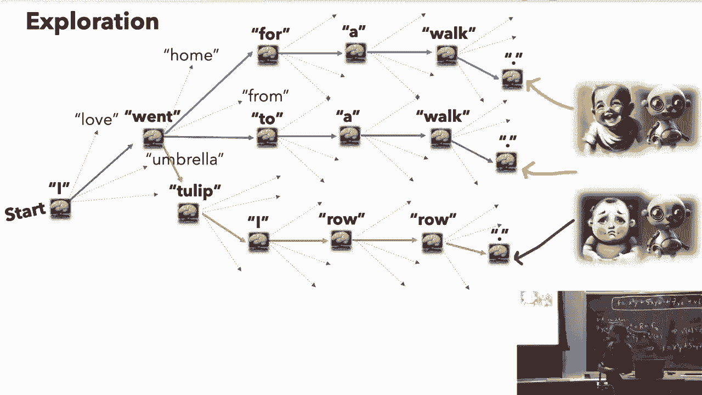

好的，所以现在强化学习是被迫平衡探索与利用，与我的延迟交谈，实际上，满足感会导致非常不贪婪和独立的坚韧性，所以，这些都是在应用强化学习时，只有到最后才得到反馈的结果，所以，你知道的更少，监督对吧。

你更靠自己，并且你必须处理没有持续反馈的不确定性，你必须自己找出事情，这导致你更加坚韧，而且在这里再次在强化学习中，我们只关心最后的信号，所以我们不关心做最好的下一步，我们关心优化整个输出。

所以现在我们在处理这些问题，其中的一些对应，你知道，如果我们要养育一个孩子，例如，如果给孩子一些自己的空间，他们可能会做得更好，来自己找出事情，而不仅仅是不断地宠爱他们，至少成为更坚韧的人，好的。

我们已经解决了我们的问题，我们使用了人类，我意思是我们实际上为标记的数据支付了人类，这可能与我们的原则有些不符，但我们还是做了，因为开放AI富有，所以他们支付人们来标记东西，但他们知道不想花费太多钱。

所以他们创建了一个AI来复制人类工作的任务，至少他们得到了一个，你知道，机器人或计算机模型，现在能够说哪些是好的或坏的对话，好的，我们仍然想要，你知道，我们仍然想要优化，你知道我们不想太贪婪。

我们想要优化整个输出，我们想要更坚韧，我们为此付出了很大的努力，所以我们使用强化学习来优化并使这个机器人快乐，所以我们现在已经解决了所有这些问题，并且我们有一个甚至更好的模型，好的。

但现在我们有一个甚至更好的模型，但我们一开始有一个好模型。

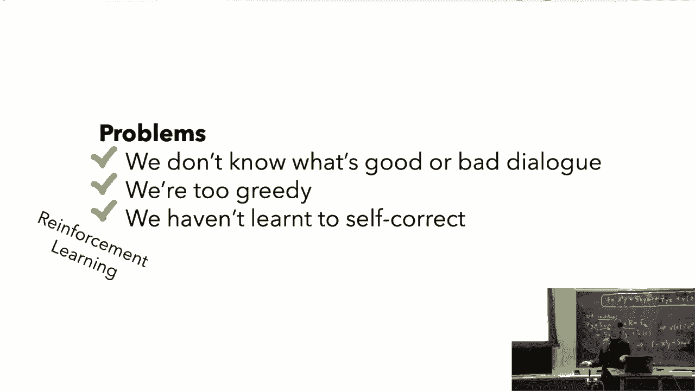

所以，为什么停止在这里对吧，为什么不我们直接用这个模型来生成，你知道对于每个提示，生成新的答案，甚至更好的答案，然后您将这些答案现在提供给人类进行评分，并训练一个新的机器人来模仿这个评分。

然后您使用强化学习来训练这个，以获取甚至更好的模型，这并不是什么阻止的，如果您只是再次运行整个循环，其中一些也有意义，因为如果您现在有一个更好的模型，您实际上想要，您想要向人类获取更多的反馈。

这对这个模型更有相关性，因为这个模型现在比之前的模型更好，所以您想要反馈，这对您当前的能力最有用的反馈，如果您是一个学习写作的孩子，或者你知道的任何事情，随着您变得更好，您想要更复杂的反馈。

这就是我们对这些模型可以做的，我们可以只是运行这个步骤并再次做所有事情，如果您知道您可以，您可以做多少次就做多少次，当然，对于某些人来说，你可能知道，边际回报递减，我不知道确切的。

我认为打开大约两次或三次就足够了。

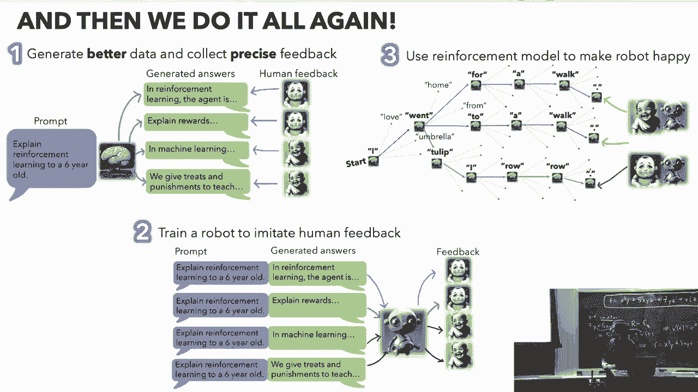

酷，嗯，仅仅基于之前的单词预测下一个单词，基本上就是这样，嗯，谁知道这在这种规模上会起作用，那个，你知道，能够达到，达到这种智能，我们看到的这种智能，我们以前认为很难。

但transformers允许我们利用更多的数据并快速训练，因为我们可以并行化，并行化所有这些步骤在训练期间，然后当我们完成这个，我们有一个非常复杂的模型，我们花费了99%的计算时间和在这个模型上。

一直在宣传transformers来预测基于之前的单词的下一个单词，然后我们可以调整一些事情，使它与人类交互更加友好，如果您是人类，那么在人类对话的数据集上进行微调，然后您集成人类反馈和强化学习。

为了从这中获得更多的性能，好的，又再次，嗯，嗯，也许我的意思是，嗯，嗯，也许有点用，我们可以，人们通常使用它，我的意思是，有更多的，当涉及到A的研究空间时，差异更加明显，我的意思是，Gentai。

在某种程度上，更加重视能够生成某些输出的能力，直接创建某些东西，嗯，但显然，CHP知道如何阅读和写作，在某种意义上，这是我所说的术语，好的，太棒了。

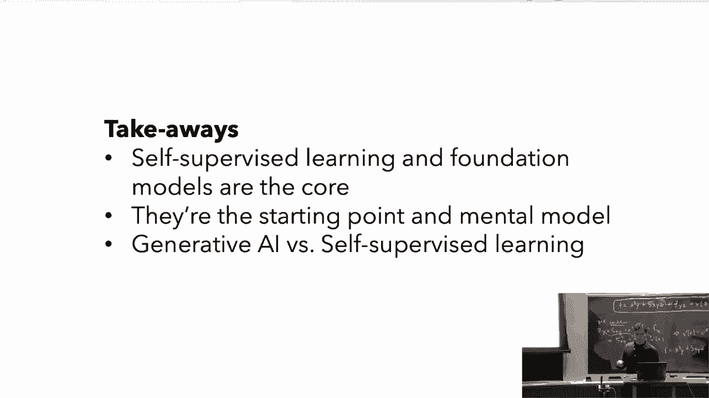

下次我们将讨论，我们将对稳定扩散进行类似的深入研究，但我认为这将更加概念性地有趣，嗯，所以我们将非常有趣，是的。

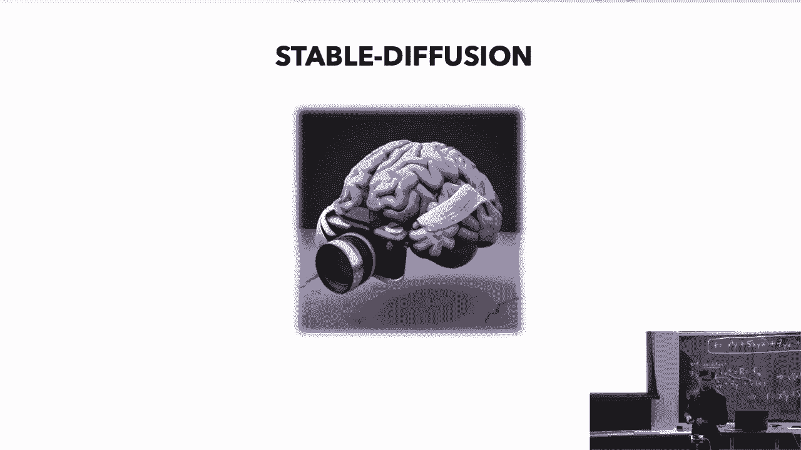

请访问我们的网站以获取更多信息，等，如果您有任何问题，请随时。

是的，所以我可以假设那个或这个概率的所有值，但一旦那里的内容发生变化，他们就可以开始谈论，基于收费的主题，那是对某事的一种版本，是的，是的，很棒的问题，好的，所以问题是，给定之前的单词。

接下来的单词的分布或概率是否会改变，给定提示，是的，那就是，那就是，你知道，整个要点，对吧，因为因为你训练来生成分布，给定之前的单词和提示是之前的单词，所以这就像是的，你拥有的序列越长。

上下文或提示越长，更具体的提示，分布将越尖峰，因为模型在特定上下文中的信息越多，用于案例，它越知道如何坍缩到你想要了解的空间，所以如果你只说你知道，如果你开始从无提示采样模型。

它将生成互联网上最普遍的起始点，或者是像随机文本一样，但如果你说像嘿，我对历史感兴趣，这是这个，然后它会说像哦，好的，我知道历史，我将从维基百科生成东西，历史，blah。

它将能够坍缩并创建一个目标更明确的分布，并且，如果没有关于上下文或你的兴趣的数据，作为一个人，我们不能针对你进行定制，他们无法从空气中创造出魔法，它只能最好地利用提示和已知的信息。

这也是为什么在你周围有数据如此重要，写好提示，等，这也是为什么提示工程只是为了能够像，如何创建最佳的提示以得到你想要的东西，是的，所以嗯，只是为了像双重检查，所以对于强化学习与人类反馈的组合，嗯。

机器人学习评估响应的部分，那是监督学习，因为是的，它是监督学习，然后实际生成的模型是强化学习，因为它生成响应，是的，那是一个很好的点，实际上，好的，所以是的，在我们现在谈论的这里。

基本上我们涉及到了几个模型，我们谈论了强化学习，对，所以确实机器人只是试图复制人类将分数放在评分上的步骤，我们生成的提示的答案，是的，因为你有这些标签，你现在想要复制吗，所以它是使用监督学习训练的。

但你知道它实际上如何工作，那就是那个模型也利用，我们拥有的预训练模型，所以它是作为一个起点，所以再次，就像你现在可以看到的那样，那就是监督学习，你有有限的标签，你已经有一个世界模型，你可以利用，然后。

你可以更有效地利用你的标签，对吧，所以，创建基于先前单词的下一个词的第一步，那就是百分之九十九的工作，然后我们有监督学习，我们从人类那里学习，但我们已经有一个起点了，所以更容易，然后我们做强化学习。

我们试图生成，所以我们有一个模型，现在只是强化学习，但是，你知道，这就是自我超级明星如此迷人的地方，因为它现在是使所有其他AI技术真正富有成果的基石，是的，嗯我在想，这些语言模型是基于什么模型的。

像孩子一样，是否与任何类型的认知科学有关，类型的学习，因为我看到那种像变压器的模型，一个普通人如何学习，对，当你在学习新的内容时，是试图与所有其他你知道的东西一起生活，是的，所以我在思考。

如果像有一些工作被完成，我的意思是，是的，好的，嗯，所以问题基本上就是，Transformer是否受到关于我们如何让我们的孩子学习正确的研究启发，大脑如何工作，我意思是，你会找到很多关于。

你知道建立那些连接的工作，然后，有一个巨大的辩论在，就像深度学习社区一样，那就是，实际上这是真的，是不是有点 wishful thinking，回过头来，我们做出这个连接对吗，我的意思是。

很多人随意地谈论，我也是，你谈论我们大脑工作方式的相似性，有些人说，哦，那不对，你知道我们必须非常非常小心，因为我们在某种程度上在拟人化，从某种意义上来说，我认为AI与有强连接，对。

但是就像什么先出现一样，实际上我认为人们有一些直觉，他们尝试和调整，然后突然有些东西起作用了，他们继续工作在直觉上，实际上理论更多的是事后诸葛亮，所以有些工程师在尝试，实际上工程师来自谷歌对吧。

所以将会是变压器，他们玩东西，他们想要完成某些事情，然后像，哦，这有道理，这可能是我该怎么做的方式，然后只需要一些直觉，然后它就起作用了，然后当它起作用时，理论家们会进来说像哦，这使我想起了这个和这个。

所以肯定没有强烈的，就像这样孩子们学习，然后我们复制那个，我越说越可能描述变压器是如何产生的，就是工程师们在捣鼓并尝试事情，然后它就像，哦，这现在起作用了，他们并不完全意识到自己被什么启发，你知道。

所以你没有与神经科学家的合作，是的，这意味着与神经科学家在深度学习中的合作非常罕见，实际上，是的，那是一个好问题，是的，它是，它是，我认为它非常罕见，是的，嗯，在预测过程中，嗯，下一个工作，嗯。

基于之前的，嗯，我想知道，为什么，为什么不，只是遮蔽，随机的视觉和遮蔽区域，该区域是，嗯，工程师像，下一个市场更倾向于，眼睛或什么，是的，嗯，是的，像问题一样，我们为什么想要预测最后一个词。

基于之前的单词，为什么不我们直接取一个随机词，遮蔽它并尝试根据周围的单词预测它，而且，对于这个问题的答案是我们以前那样做，我们以前只是遮蔽周围并预测那个，而且它效果更好，但由于工程。

你可以基于基本的变压器，你可以使它，这可以像你的作业一样，但如果你看变压器的工作方式，如果你遮蔽一个词，嗯，那么你会喜欢，那么你只会，嗯，我猜测，如果你这样做，你知道。

如果你只根据之前的单词预测最后一个单词，你可以构建这种注意力，这就是transformer所做的，它被称为注意力，当它转向之前的单词时，嗯，你可以以一种特定的形式构建它，类似于三角形的形式。

所以你可以处理缺失的词汇，就像你可以基本上一次性完成，所以你可以，这可能是'和'，'任一'，就像你有这种张量积，你可以定义这种高维矩阵积的方式，这是一种高效的方式，所以你基本上可以在一次目标中完成。

预测目标就像你可以，如果你有一个句子，你可以，你可以运行整个句子并基于之前的单词预测下一个单词，对于句子中的所有单词，都可以在一次目标中完成，如果你做大规模语言模型，你不能那样做。

然后基本上你有全注意力，所以你可以向前和向后关注，但你只能运行在目标上，那是你遮蔽的目标，这意味着在 terms of like，在 terms of 模型接收的信号，如果你有一个长度为两千的序列。

你有两千，你知道自回归的信号，因为你可以使用每个目标本身，但如果你遮蔽，你可能遮蔽像15%的词汇，然后它只有像只有50%在获取反馈方面，所以最终，这意味着当你尝试这个时，empirically。

做它或积极地，并且这个技巧能使用每个，你知道，每个单词都是自己的目标，仅仅导致在这个任务中生成基于之前单词的下一个单词方面的性能提高，所以是的，所以是，我猜想这是工程和经验的结果，好的。

这不是在理想世界中，如果你有较少的计算资源，你将有一个，你知道，你更倾向于用干净的建模方式，但现在因为这些限制和计算东西，你只是尝试说嘿，这里有加速，他们说，哦，实际上效果更好，给定相同的计算量，是的。

这给你一些答案的感觉吗，我们也可以在线下讨论这个问题，那么这些模型的主要挑战现在是什么，还有像语言模型这样的其他模型，它们可能更好，但可能更贵，人们不使用它，或者像这样是最好的，是的，我认为是这样。

你有什么，这些大型语言模型的一些挑战是什么，嗯，嗯，一个挑战是，嗯，让他们行为，像，我们想让他们理解的意思，像好，我们想让他们成为，你知道有点政治正确，至少对我们公正和善良，我们不想让他们编造事实。

我们想要它们成为，我的意思是我们想要尽可能多地依赖，如果如果如果你喜欢，提出一个事实性问题，而且他们给我们提供的是错误的，他们对此充满信心，也许它是坏的，所以像，我认为我们开始看到的是他们和人类一样。

即使它是在错误中，他们像是很好，他们好像有一些偏见，我们要谈谈这个，像他们有偏见，他们对事物有一些刻板印象，而且他们也像我们一样，我意思是他们遭受了愿望性思考和某种类型的想象，他们宁愿在那里，你知道。

让你开心而不是完全说实话，这就像你和你必须找到一种方式去平衡这些东西一样，是的，然后这就像一些问题立即出现了，然后其他人正在肯定地工作于什么，并且开场正在研究自主代理，基本上。

你怎么能把规划融入到这个中，所以如果你现在知道，让模型能够，嗯生成，你知道消化一些输入，生成一些输出，然后你知道消化那个输入，在这个规划步骤中，有这种类型的软件和输出，所以它变得具有极大的能力。

所以你基本上可以代替一次性处理你的提示，如果你可以，有几次尝试并改进自己，并且只给你提供响应，在它完成内部迭代和处理后，它将能做得更好，然后再次，如果你加入一些工具，你可以在互联网上搜索获取更多信息。

你可以检索信息，他们将能做得更多，所以这种规划肯定是人们知道的，你知道这些模型，非常有用，当然，再次，它会更昂贵，因为它需要运行更长时间等，但它非常有用，所以当你有这个像开放的，我谈论了商店和东西。

所以这些都是强化学习技术，如何做好规划，所以如何融入规划是人们谈论得很多的，然后当然，多模态性，不难看出，这种预测下一个词的想法，基于之前的单词，对应得非常好于视频，仅仅预测下一个帧基于之前的帧。

为什么人们做得不好，因为视频突然在计算上达到了一个新的水平，它需要的，因为它们有很多视频，一帧非常昂贵，因为它是高维的图片或图像，但显然，通过观看视频，你可以学到很多关于世界的东西，对吧。

甚至你可以更好地理解人类是如何工作的，因为你可以看到人们在视频中生气、悲伤或快乐，对吧，在任何视频中，并开始捕捉这些线索，你可以将视觉部分连接到文本部分，并得到一个能够同时做这两件事的多模态模型。

确实非常高级的方法，我认为这些人也在努力做这件事，好的。