# 2024年最新 MIT 6.S087 基础模型和生成式人工智能入门课程 - P4：4、MIT 6.S087 Foundation Models & Generative AI. IMAGE GENERATION - Moss学长 - BV114tLemEdn

欢迎来到第四堂课，嗯，在名为人工智能金融模型的课程中，今天我们将简要提及数据和数据，这是这种新型人工智能的关键组成部分，确实值得开设自己的课程，但我们要稍微谈谈它，然后我们将覆盖稳定扩散。

这是一种文本到图像生成技术，人工智能没有人工智能，好的，那么在这门课程中我们还剩下什么。

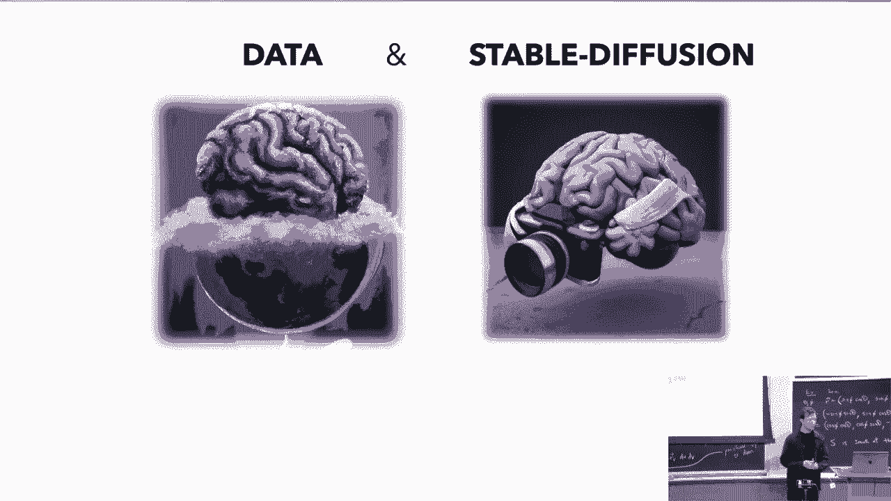

所以下周我们将有一堂关于新兴基础模型及其应用的讲座，这就是基础模型在野，在市场上和在商业环境中，尤其是我们还将有两位嘉宾，曼佐将谈论人工智能在基因组学和应用在生物学中的艺术，并将谈论自主代理。

然后最后一堂讲座将是人工智能伦理和法规，然后我们将在讲座结束时有一个小组讨论，并讨论人工智能的伦理方面。

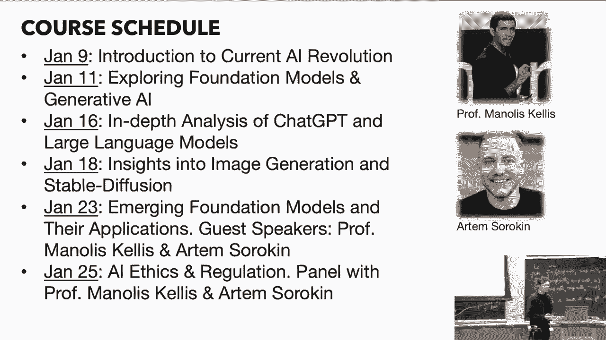

好的，所以总结一下，稍微，第一堂课是介绍，一个非常快速的，直观的回答，什么是基础模型和强化人工智能，我们稍微偏离了主题，进行了一些哲学思考，第二堂课通过从高层次的视角回顾了人工智能的历史。

然后我们深入探讨了最后一堂课的cht，那么在基础模型中我们做什么，关键在于什么，它能够从观察中学习，你不需要人类在循环中，并且你可以无限制地放大，这是从中获得的，这是一种非常类型的上下文相关关系理解。

意义是由公司定义的。

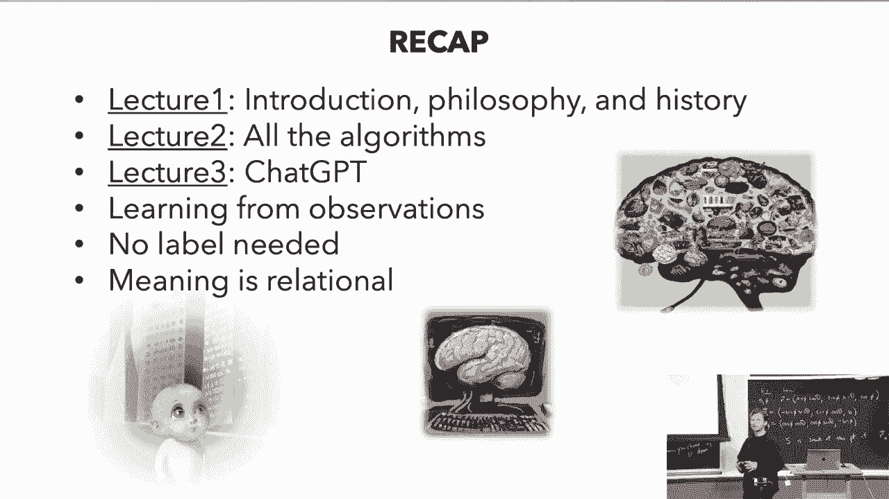

它保持，它是自我参照的，对吧，所以狗是，嗯，由主人牵着绳子散步的动物，它是有，猫，它是有，追逐的，追逐的，这就是我们理解狗的方式，实际上不是你的父母，通过标签化它，或者你真的优化在某些目标上。

比如强化学习是你在不同的上下文中观察狗，像狗这样，并关联狗与其他概念，这就是你理解狗的方式，那是你的，你知道，那就是主要技巧，嗯，再次，嗯，我认为这是一种，你知道真实的，当涉及到你知道的ai时。

它是一种非常理解力最强的，是直觉的，它依赖于所有这些不同的关系边缘，所以你永远不会完全理解某件事，你可以总是变得更好，这很大程度上是关于熟悉度，熟悉自己，所以如果你不理解一切，一堂讲座是可以的。

只是试着获得一些直觉并熟悉，熟悉它，然后继续前进，好的，所以，嗯，数据，为什么它如此重要，嗯，我认为一种，对于人工智能突破的所有我们看到的视角的一种补充，是从数据的角度来看待的，实际上。

新的ai是如何看待数据的，旧的数据类型，但以新的方式看待数据，所以它变得更加强大，使用更多的数据，这基本上就是现在正在发生的事情的一大部分，数据真的很关键，在某种程度上，我认为数据是，你知道。

如果你想在实际设置中应用ai，所以你可能会关心看数据，标准数据对你来说将是关键的，所以这是一个非常相互依赖的概念，像ai和数据一样，手牵手，开发更好的模型非常困难，如果你不理解数据，反之亦然。

如果你开始应用，ai到你自己的设置中，理解你的数据，你知道，你有哪些数据，并且，人工智能如何利用数据，人工智能如何利用数据，以及想要什么样的数据，这对你来说将会非常重要，如果我们看这张图片。

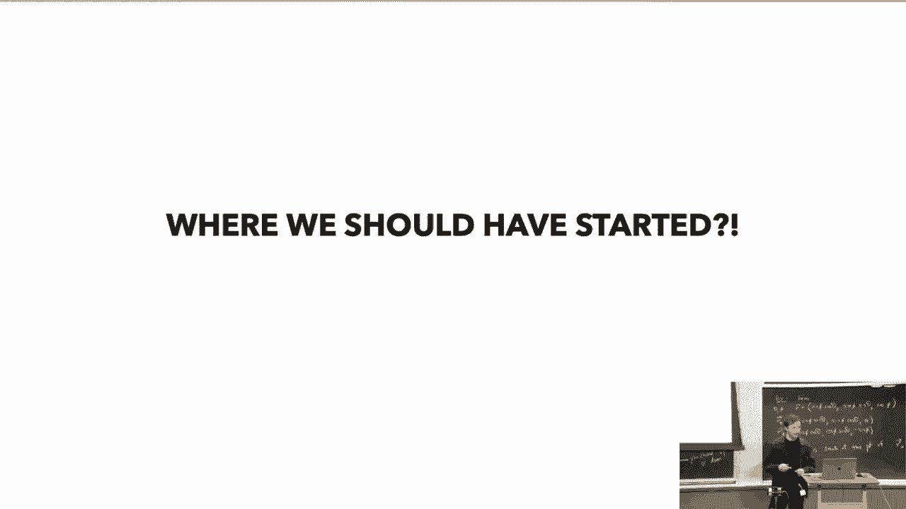

我们之前关于新的人工智能发展的看法，就像是一座冰山，对吧，冰山的尖端是。

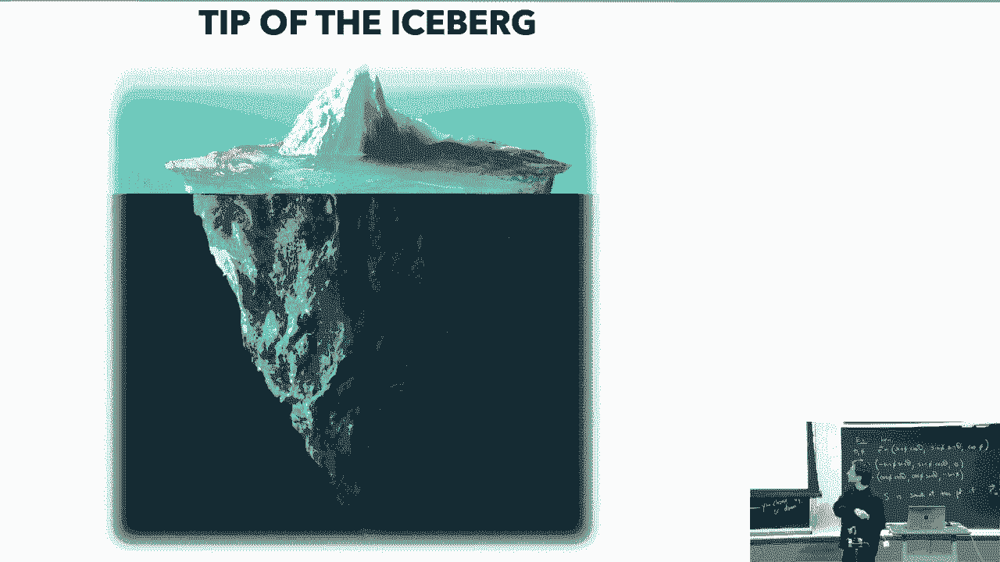

Gpt和稳定扩散，例如，正确的，人们正在谈论的热门话题，当然，在下面是关于理解自我的，监督学习，学习训练神话，为了在这些基础模型上使这些AI正确，生成AI，然后一个非常大的，你知道。

在以下那个人们谈论得不太多的部分，数据是非常重要的，这就是推动这场革命的全部动力，而且我认为，所以，我们来看看openai，例如，这个构建过程进行的很顺利，也许只需要十到，你知道。

十个工程师为一年或六个月的时间实际开发出我们现在正在使用的聊天机器人版本，但版本，对，那不是很多，我意思是这就是为什么现在有很多初创公司试图复制，Gp，Gp t只不过有很多钱和计算资源。

以便用小团队训练数据，而且他们可以复制它，所以这就像本身，我意思是它它，当然令人印象深刻，但与互联网是如何创建的相比，它显得有些苍白，以便他们可以充分利用互联网，下载它并训练它，但是互联网是。

你知道我们花了二十年，你知道数十亿人上传了大量的数据，那那是一个巨大的努力，那你不能复制，没有人可以复制，那，创建一个从零开始创建互联网的过程，没有公司可以，这将太太昂贵，因此。

互联网在某种程度上使得这一切都变得可能，基本上，它是人类历史上最伟大的数据收集努力，我认为这对chp来说，比任何技术都更重要，是的，所以，数据真的很关键，再次强调，我的意思是，如果我必须选择。

对你来说也是如此，如果你必须选择是拥有聊天p还是互联网，你更愿意拥有数据和网络，因为你可以重新训练它，你可以创建更好的版本，所以，数据真的很关键，并且有访问它的能力，这也将成为一个问题，现在。

考虑到版权等，人们想要这样说，Stack Overflow，但如果我们有这个数据，现在你通过使用我们的数据来竞争我们，而且人们现在也会越来越重视数据，这真的很有趣，看看它将如何影响ai的发展。

因为互联网使用起来如此容易。

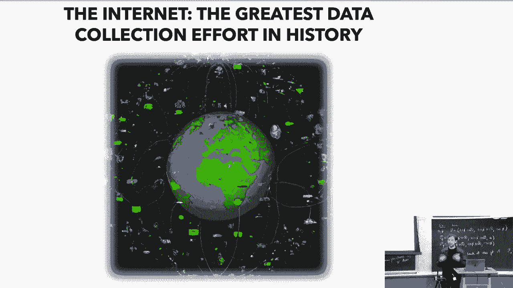

而且人们并没有真正关心，再次强调，当你为公司工作，无论你做什么，并且你有自己的问题，开始看数据，数据包含了所有的秘密，所以，这是一个，这是一个非常，非常重要的事情，不能忽视。

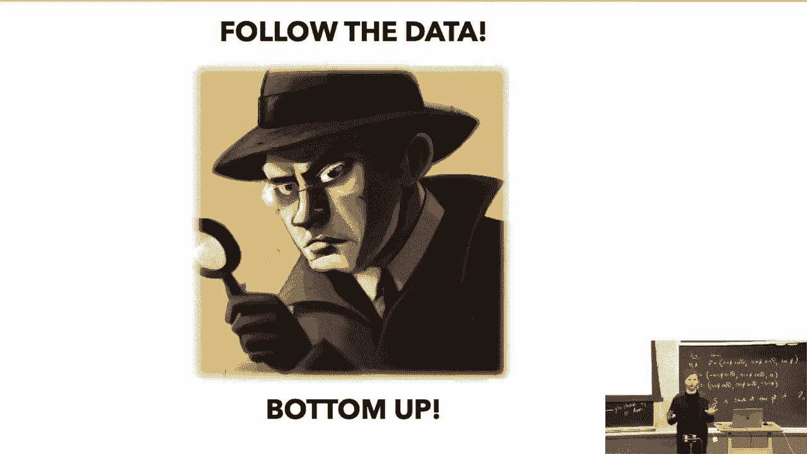

好的，所以，这门课程的一小部分哲学思考将关于数据，同样，这意味着对于chatty dp来说，有趣的事情并不是技术，它不是chp的大脑，而是互联网，也许这是一种对所有人类的相似视角，比如。

也许我们不那么了不起的智能，但实际上我们创造的数据，以及整个生态系统创造的数据，这才是真正重要的，也许我们只是基因的数据创造者，例如，如果你知道关于'自私基因'试图复制自己的事情。

也许我们只是在为另一个目的收集数据，基本上就是这样，假设一个外星人来到地球并发现了地球，也许我们只是在为另一个目的收集数据，基本上就是这样，让我们说，如果外星人来到地球并发现了地球，他会说，哦。

他们可能想绑架我们，来看看我们的大脑，而且这个教派理解我们，也许他们会说嗯不，你们对我们不感兴趣，我们想要你的数据，我们只是想，像地球的所有历史一样，以及这里正在发生的事情，收集那个。

而且他们可以他们可以衍生出自己的人类，改进版本，所以也许就像数据，有些方式真的很关键，我们试图集中精力，我的意思是我们有时专注于AI本身，但背后的数据，这些创造物极其重要，好的，嗯，好的。

所以条件图像生成基于我们今天要讨论的图像生成，所以这里最流行的两个模型之一是叫做达利和稳定扩散。

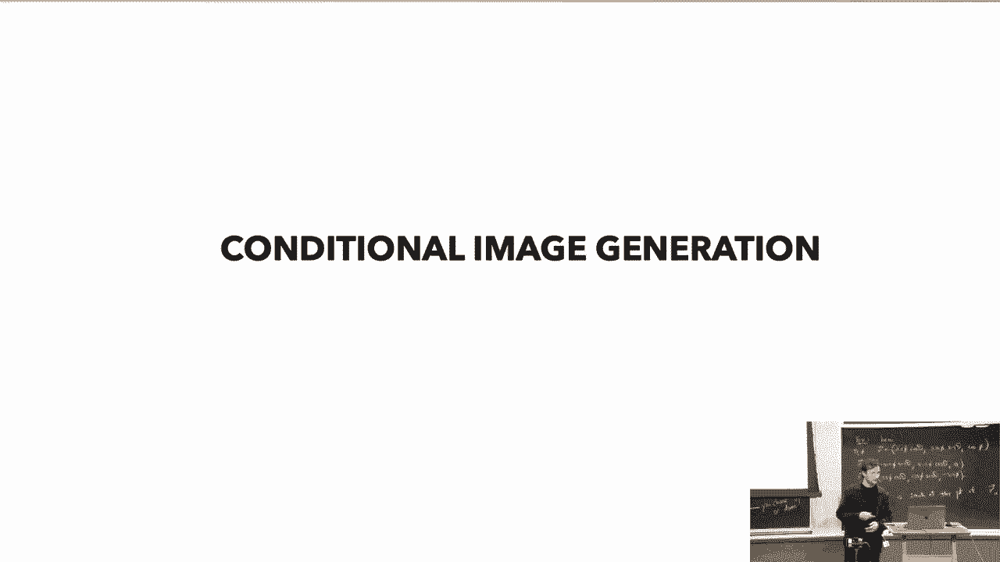

这是一年前，你可以看到两种不同的比较版本，在左边你有达利，在右边你有稳定扩散，这说的是亚马逊雨林中的科技太阳能毯子乌托邦，它做得很好，嗯，看起来真实，而且它，它遵循提示，并且它有一些想象力。

能够创造这个，我们可以快速检查它的进步，所以现在是GPT，问同样的问题，我会说它看起来，甚至更好，嗯，那很好。

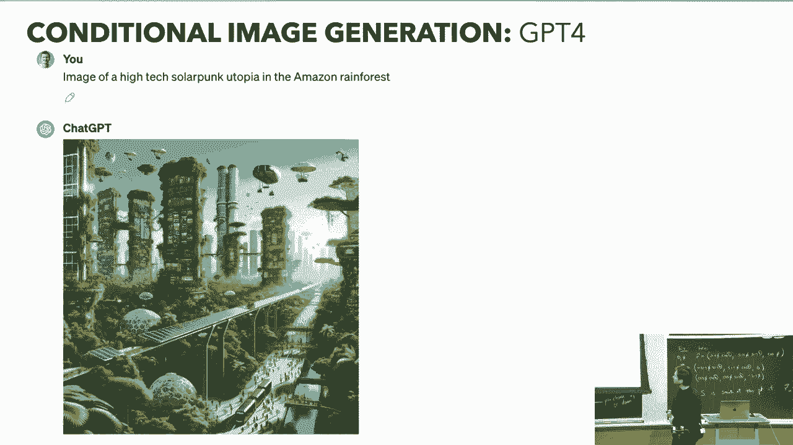

有所进步，当然，就像我的意思，几乎所有在这个讲座中的图像，幻灯片都是来自文本到图像模型，这就是我如何创建这个奇怪的图像的，提示可能很困难，我认为提示变得越来越容易，但你也可以在网上销售提示来获取。

你知道的，以获取，所以人们可以得到他们想要精确的图像，这很有趣，我认为人们在开始对提示工程非常兴奋，但现在似乎已经变得，你知道，稍微少了一些兴奋，随着模型的改进，创建你想要的提示和图像也变得更容易。

再次，一年前，Facebook，我认为Google发布了这个图像生成器，嗯，所以他们从静态图片转向了视频，这是我们看到显著改进的东西，我希望今年能获得工作得非常出色的东西，所以我们可以从零开始创建视频。

当然，技术的基本方法非常相似，但现在你需要扩大规模并考虑帧，这仅仅是一系列的图像，好的，要成功地创建图像，并使其具有图像条件生成能力，我们有几件事要完成。

所以我们想要具有高真实图像质量，我们想要图像看起来真实且真实，这很重要，我们还想要语言和创建的图像之间的高对应关系，如果我们写一些东西，我们想要看起来像我们正在写的东西，我们不想要写一些。

然后得到完全不同的东西，它将有一个强烈的对应关系，我们还想要某种方式捕捉到围绕概念的各种图像，让我们说，我们想要生成狗，我们想要能够生成所有可能的狗，某种方式这就是如何显示的，AI理解狗的含义更加深入。

你知道狗在更细腻的意义上是什么，因为它可以创建所有不同的版本，这将非常有用，因为你想要采样，并且它显示了某种性能标准，我们还想要它快，用于训练和使用，那么我们如何做得好。

我们将使用工程和聪明的技巧来完成所有事情，除了高语言和对应关系之外，我们将再次依赖于数据，所以它将是，你可以看到它是标记的数据，所以图像和文本之间的对应关系，你可以从，你可以从那里获取它。

从不同的脚本和在线抓取，但你需要对应关系来获得非常好的性能，你可以减少对数据的需求，但是你要，你需要将这些数据融入到你们到现在为止构建这些模型的方式中。

好的，所以让我们来谈谈我们如何着手进行这项工作，我们如何生成，学习如何生成图像，也许我们可以首先谈谈如何绘制人脸作为起点，所以让我们假设我们要学习和绘制人脸，我们想要训练。

我们的人工智能想要学习如何绘制人脸。

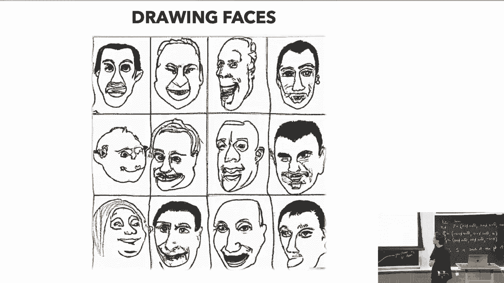

然后我们达到了能够生成同样的人脸一遍又一遍的东西，对吧，我们相信这个模型在某种程度上做得很好，并且它能够理解一个，你知道，意味着一个人脸，或者如果面部包含什么，可能不是因为你只是，你知道它崩溃了。

一个单一的实例，也许只是记住了一些东西，所以我们想要一些多样性，但也希望它更有用，我们希望能够像你一样生成十个阶段，我可以在我的幻灯片中使用，对，你想要不同的阶段，你不想要同样的面孔，它更少。

实用性降低，所以你想要能够生成不同的东西，所以当你想到它时，你会首先注意到的是，哦，那么这些深度学习模型仍然是确定性函数，所以如果你给它相同的输入，你将得到相同的输出，所以这里没有随机性。

为了新的网络能够利用创建不同样本或实例，你知道如果你给它相同的输入，它将产生相同的输出，随机性对于网络来说非常非常困难，几乎无法自己创建，所以你需要将随机性作为输入给它，就像它是其环境的一部分。

让我们假设，而且你知道，也许对我们自己也是如此，那就是如果你能够非常非常小心地精确地重新创建相同的环境，如果你发现自己处于相同的环境中，你也会采取非常相似的行为，也许当我们发现自己处于新的环境中。

实际上这对我们有益于创新，所以也许我们也可以从这中学到一些东西，但对于网络来说，至少我们已经给他们了一些随机性，他们可以利用这一点来探索和生成不同版本，好的，所以我们将作为网络输入的一部分。

我们将喂入一些随机性，对，所以它将，每次运行时，它都有一些不同类型的输入，所以你可以利用这一点来说，比如，我现在要创建一个看起来像这样的脸，或者像那张脸那样，它可以利用其随机性来创建一个面部分布的样本。

所以现在每次它得到稍微不同输入时，它可以生成不同类型的脸，现在我觉得我们感觉好了，现在，我们相信比我开始理解绘制面孔的含义更多，它实际上做得很好，因为它能够做很多不同的阶段。

而且它也变得越来越对我们有用。

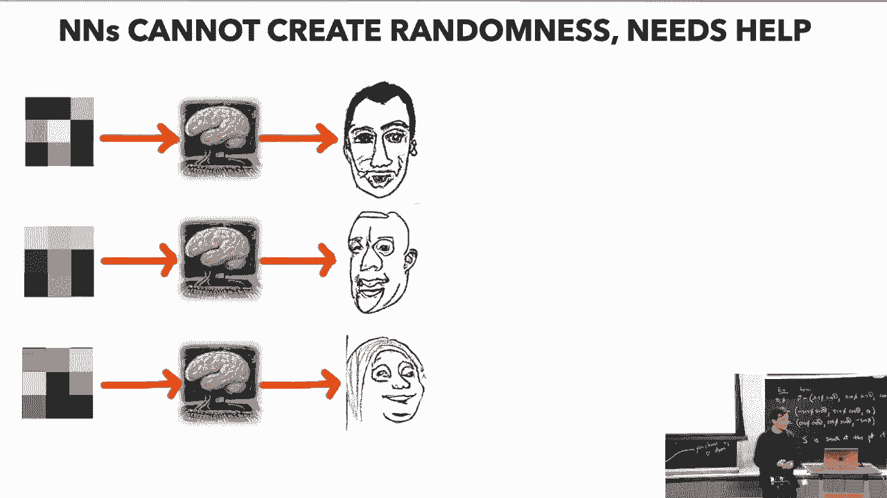

而且重要的是，我们希望随机性以一种方式存在，对我们来说很容易从计算机中采样，所以我们可以从计算机中非常便宜地创建这种随机性，把它输入并运行模型，所以我们不需要创建随机性，但它是由计算机自己创建的。

计算机非常擅长创建这种伪随机输入，我们可以使用，好的，我现在。

让我们说，我们要给这个模型提供，嗯，随机输入，你想要生成一些面孔，我们如何做得好，我们可以尝试仅仅以单一目标来绘制面孔，对，只有随机性，去除所有其他随机性，模型在一个单一目标上完成可以获得一次尝试。

或者我们可以说，你可以逐个去除随机性，这将非常有用，因为它在某种程度上将变得容易对他们所有人来说，你只需要在一个步骤中做所有事情，它可以去除一些随机性，然后基本上把它，你知道。

运行运行自己输出并尝试去除更多的随机性，我想你知道，以及人类，当我们学习如何绘制时，我们绘制东西，我们不仅仅是在一个单一目标中绘制，我们可能当人类学习如何绘制时，我们大致勾勒出来。

然后迭代改进我们的绘图，我们将尝试为这个新网络提供相同的能力，好的，所以这也为什么有用。

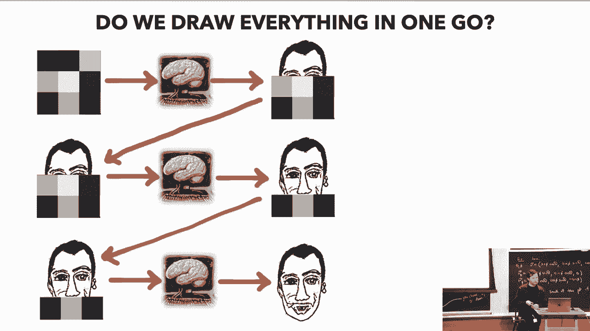

因为它有用，因为现在当你考虑你知道的不同级别的随机性，你可以只删除一部分，在那里有一些不同级别的困难，所以也许如果你想从一个完全随机的输入，一些噪音到只删除一些噪音并添加一些特征那里，这基本上是。

也许这更难，因为它需要更多的想象力来开始，但在这里当我们只需要完成脸颊时，也许这更容易，所以突然我们也将在输入中具有不同级别的随机性，我们有不同级别的困难，这是有用的，对于模型来说，都是有用的。

当它在使用时，因为它可以迭代尝试改进其随机性，像改进自己，我只需要生成生成，一切都在一个单一的目标中，你可以生成一些，然后添加到那里，你知道它自己运行在其输出上，对吧。

但如果在训练过程中看到不同级别的随机性，所以它必须从左到右走，在这些不同级别上是好的，因为它可以在某个难度级别上开始做出一些进步，你知道，然后它可以开始改进，这是因为我从那里学到了一些东西。

然后当它学到了一些东西，然后达到了下一个级别，它可以更有效地利用更困难的例子，我知道你们记得，但当我们谈论生成对抗网络时，因为它非常困难，因为你有一个批评家和艺术家，他们必须非常同步。

所以批评家需要能够给出反馈，在艺术家目前所在的水平上，对吧，技能水平，但如果一个超过了另一个，它就会崩溃，这就是训练过程中实际发生的情况，但这里我们给了一个，你知道在训练过程中不同级别的困难。

如果你能创建这些例子，那么模型就能做，利用一些例子并开始改进，然后我们可以创建有用的例子。

好的，所以为了能够创建，嗯，非常像各种各样的，不同输出样本的样本，对，我们需要能够采样噪声，而且计算机擅长创建某种类型的噪声，我们将使用这个，将一切都集中在一个单一目标中是非常困难的。

所以我们将允许计算机迭代地改进自己，所以它可以从一些噪音开始，添加一部分图像，你知道，但是不能在一次中去除所有节点，然后继续迭代，如果你想这样做得对，噪音需要在输入和输出中都有一部分。

所以如果它不需要去除所有声音，它仍然可以成为它生成的输出中的一部分，并且它可以在自己的输出上运行并，好的，嗯，并且处理不同噪音水平对于训练来说是好的，因为它可以从不同难度级别获取训练示例。

而且在我们实际使用它时也是良好的，因为它可以迭代地改进自己。

我们再次喜欢在GANs中这样，艺术家只有尝试创建一张图像的机会，然后一个批评家批评它，在这里，艺术家和批评家必须处于相似的水平，因为艺术家应该欺骗批评家，让这种感觉像是好的，面部创作的体现，例如，对吧。

所以当艺术家创造一张面部图像时，批评家从一个图像分布的中得到一张真实的面部图像，然后它也会看到这张由艺术家创造的假面部图像，并学习如何批评并说应该学习说像是这样的，哪一个是真实的图像，哪一个是假的。

艺术家应该欺骗批评家，所以批评家感觉或相信艺术家实际上正在创造看起来真实的面孔，但是，非常非常困难，因为反馈需要，就像艺术批评家需要处于相似的技能水平，以便他们可以 kind of 共同，发展和共。

学习一起，好的，所以我们实际上看这些。

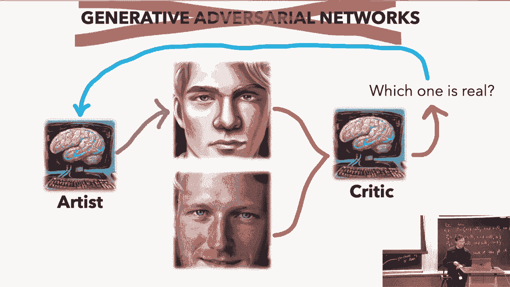

嗯，你知道，当绘图专业人士画什么东西时，他们会从一些轮廓开始，然后，他们添加细节，从人类专业人士这样做的角度来看，这似乎也是一个好主意，这就是我们要尝试的，模仿，就像你可以在这里看到的一样。

他们不是从有一些随机噪音开始，然后从底部删除，不像从顶部到底部，如果他们从一些轮廓开始，然后他们会添加更多的细节，不仅仅是删除面部的顶部，面部中间到低面部。

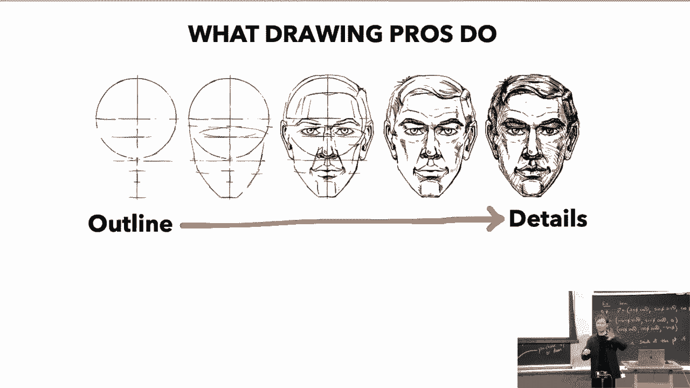

它们从某种轮廓过渡到细节，这也是我们要做的，而且我认为这就是为什么这也非常非常强大，指出正确的方向并取得一些进步要容易得多，然后立即找到精确的位置，所以如果某人问你乌兹别克斯坦在哪里。

你可能不知道精确的坐标或位置，但你可以指出正确的方向，所以也许你指出，如果你是美国，你指向欧洲，然后你可以做出一些进步，然后你可以继续这样前进，但这种方式很容易学习，并且可以通过这种方式做出一些进步。

当你需要得到一些方向的反馈时，好的，所以我们将尝试如何重现这个，是我们将拥有一个这样的设置，我们开始时有一些，像完全噪音一样的嘈杂图像，计算机可以生成的高斯噪音，然后模型会开始添加一些特征。

添加一些图像的开始，所以基本上去除一些噪音并开始朝着某种类型的，某种类型的图像，在这种情况下是一个脸，然后当它完成这一步骤，它可以在自己的输出上运行并继续下去，然后它可以做出更多的改进，甚至更多的决策。

关于这个脸应该怎么看，从纯粹的噪音开始，添加一些面部轮廓。

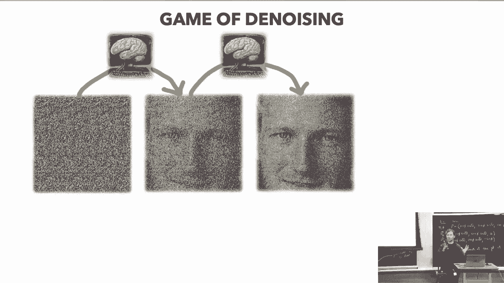

然后在随后的步骤中添加更多的细节，然后我们可以运行这个，直到你知道我们对输出满意并交付它，这个被称为，你知道再次，这个步骤中的一个被称为噪点，所以你去除噪音并添加一个图像，如果你在几个步骤中做噪点。

它被称为扩散，所以这就是稳定扩散的地方，它执行多步去噪，好的，而且我们也，当然想要，嗯，从文本到图像的基础是，所以我们有这些对应关系，带有文本的图像和，我们还看到这一点并基于这一点条件模型。

所以在其创建过程中，它可以通过访问此文本来引导其世代，所以您可以大致进入一个基于这个提示的空间，对这个空间有用，嗯，我们不需要开始从零理解语言，从 scratch。

我们可以利用预训练的语言模型来获得一些理解语言的好起点，这有帮助，但我们仍然需要这些对应关系来实际训练模型，好的，那就是一个非常，非常高级别的，嗯，扩散状态融合模型是如何工作的，我们将更详细地讨论。

并谈谈我们如何实际围绕这个创建训练数据，如何训练模型，然后它如何被使用，最后我们将在讲座结束时讨论一些更详细的细节。

所以，当然这是非常的，非常棒的，如果我们有，嗯，大量的这些不同的设计草图，你知道，所以我们可以从互联网上获取一张图片，把它交给一个人，并且这个人可以创建一些类型的设计草图到细节，然后，那将极其极其昂贵。

将一亿张图片提供给数百万的人类，谁能尝试创建不同级别的抽象，所以我们将尝试使用电脑来重新创建它，我们做到这一点通过添加。

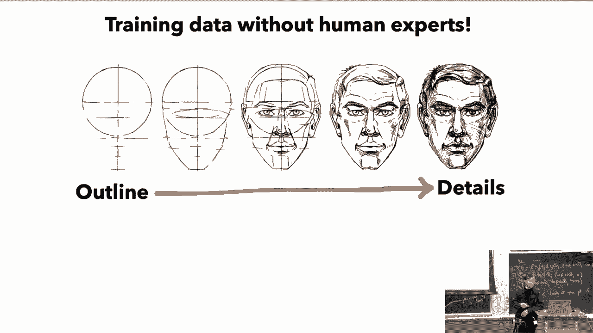

从互联网上获取一张图片，这便宜，创建噪音也很便宜，然后我们只是基本上将这些两个添加在一起，然后我们将添加不同级别的噪音，因此，我们得到了一个图像，这是我们实际上想要重新创造的图像。

我们添加了一些我们可以生成的噪声，计算机可以生成，然后，我们在这一侧得到了输入，然后，我们有目标，这只是我们从开始就有的图像，所以你想要学习如何从图像的噪声版本到这个目标，所以这非常便宜来创建。

因为噪声非常便宜来创建，计算机可以做到，而且很容易下载，这就是为什么这个循环不需要任何人类，当然，我们也想要，嗯，嗯，有不同的噪声水平，因为我们想要能够从任何类型的噪声水平到更少的噪声。

因为当我们实际上训练它时，我们想要任何噪声水平到更少的噪声，因为当我们部署它时，它将被部署，你知道，迭代地在自己运行，所以当它实际上被部署时，可能会遇到许多不同类型的噪声水平。

所以我们只会有不同的噪声水平来创建不同类型的对，对于无数的不同图像和无数的不同噪声水平，我们还会偶尔添加一些纯噪声，所以然后它基本上没有任何关于图像的概念，它必须凭空想象来创建从纯噪声的图像。

但这也很重要，因为当我们实际上部署这个时，我们想要开始，我们想要能从纯噪声开始，对吧，因为我们想要能从空气中生成，一些东西，当然，我们还想要使这个更加有用，有用到足以随机采样。

我们将添加与图像对应的文本，以指导生成，所以我们可以告诉我们可以给出一个提示值或稳定扩散，它生成我们想要看到的图像，好和，然后当我们训练这个模型时，我们现在有一个输入，这是一个有噪声的，嗯，你知道。

图像加上一些噪声水平和噪声，模型接收到这个输入，它接收到我们通过语言模型喂入的提示，只是为了使它更有用的特征或或潜在的特征，我们将这个输入喂入模型，然后它应该生成一个关于它如何认为真实图像看起来的猜测。

并朝着我们已知的真实图像迈出一步，然后，我们可以查看，和然后，我们可以查看，我们可以查看，或者我们可以有一些损失函数，它看看我们的猜测与想要达到的实际目标之间的差异，我们可以提供一些方向的反馈，比如说。

你走对了方向，但这是你知道如何改进自己的方式，这就是我们如何训练这个的。

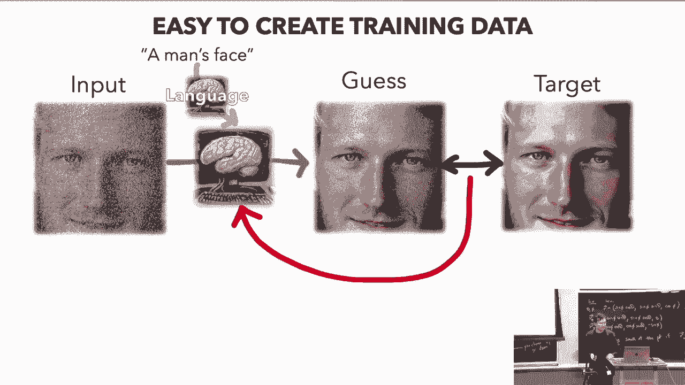

然后当它再次训练时，我们将喂养，当它已经被训练在所有不同类型的图像和噪声水平上时，我们将实际开始使用纯噪声和一些文本提示来启动模型，然后它试图向真实图像或实际图像迈进，然后我们可以运行这个多少次。

第一步第二步第三步三步，我们只是重新运行模型并得到越来越好的图像，我们停在某个点说嘿，我们现在很高兴，但这里非常重要，因为现在正在部署，没有需要从网上下载任何图像或其他东西。

因为它可以从纯噪声中生成图像，我们可以仅通过计算库自己创建它，好的，所以嗯，好的，这就是那种稍微详细一点的，关于稳定扩散如何工作，图像生成如何工作的高级视角，我们现在将稍微深入探讨。

稳定扩散如何使模型做出非常有趣的选择来改进这个管道，它们连接了我们在整个课程中谈论到的很多概念。

首先，他们和曼诺意识到图像的细节非常重复，也许你不想在训练或模型中花费太多努力来生成细节，所以如果你看这里，如果你放大这个阶段，比如这些可能对AI模型来说并不难添加，它们是重复的，所有这些课程和日期等。

你可以只是，你知道，它不会太难为模型，这是他们相信的，所以他们不应该在创建细节上投入太多工作，创建轮廓或重要的面部特征很困难，细节的要求会较低，我的意思是，也许这是一个经验观察，面部的重要特征的轮廓。

细节的需求会较低，我的意思是，可能是一个观察，但是，这就是我认为的，而且，因为这些扩散模型像工作在像素空间，所以，它需要一些像素图像，对，所以，也许它是一千二百二十四次。

一千二百二十四添加了与维度相同的噪声，然后，那就是一个非常大输入的，就像，你知道，一百万像素，然后，它去除了一些噪声并再次创建了相同的分辨率，对，带有较少的噪声，它一直在上面运行，一遍又一遍，完善自己。

这很昂贵，然后，因为解决方案相当昂贵，所以，它是一种，然后，使用的类型确定运行此的成本，这训练和部署，所以非常非常棒，如果我们能神奇地减少这张图片的分辨率并运行在，在较小的图像上运行扩散，对。

所以你能够将分辨率缩小八倍，我想对，实际的像素数是，你知道，大大缩小，平方，对。

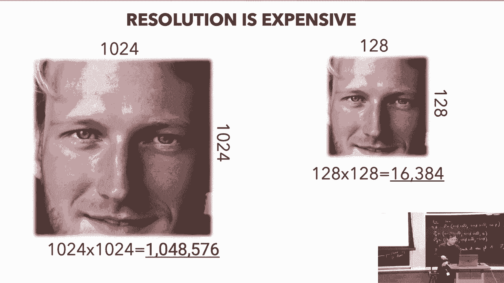

好的，所以，他们，他们如何实现，这是通过他们将要做的事情来实现的，对，游戏压缩和顺序编码，所以他们将尝试将图像推入正确的方向，嗯，并将其压缩到一个较小的空间中，并且，而不是使用随机的，嗯，向量。

一个小向量，它将尝试创建一个较小的图像，然后能够上下缩放而不失去任何重要的信息，所以他们将学习压缩到低分辨率的图像，这基本上就是一个非常好的图像压缩和总结，不包括可能不重要的所有细节。

可能并不难重新创建对吧，所以实际上，当你看到这一个，它在训练，较小的图像实际上是一个小图像，你知道，所以它只是学习以聪明的方式压缩这个，当你看看这个，实际上，这个小图像就像是一个小图像。

所以它只是学习以聪明的方式压缩这个，并且因为它生成的订单代码真的很擅长创建这些细节，所以它非常擅长放大图像并增加分辨率，并且我们将将其分开，到自编码器，到一个编码器和一个解码器。

所以编码器是那一个接受大图像的，将其压缩为小图像，那就是编码器，然后我们也将有一个解码器，它从小图像变为大图像，目前我们假设这些我们已经有，这些，它们在缩小和放大图像方面工作得非常好。

我们基本上没有失去，你知道，在过程中没有关于图像的信息，因为这些细节并不是他们真正关心的，所以让我们说现在我们有一个完美的编码器和解码器，我们如何充分利用这个。

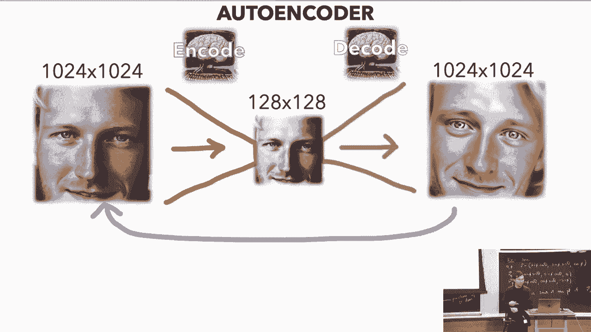

我们现在可以从网上获取我们的图像，我们可以将其编码为较小的图像，我们可以在那较小空间中创建噪声，然后，你知道如何在这个较小空间中扩散噪声吗，然后当我们完成时，我们可以重新创建原始图像，好的。

所以让我们详细讨论这个实际上如何工作，但现在你知道，在因子中，我们可以只是像我们以前做的那样做一切，但我们只需要在一个较小空间中做，这在计算训练方面节省了大量的计算，而且，当它被部署时。

速度也会大大提高，好的，那么这个效果怎么样，我们从网上获取一个大型的图像，然后通过我们的完美编码器运行它，就可以得到一张较小的图像，这就是我们的新目标，现在，我们也添加了较小的噪声，你知道。

在我们得到的分辨率中，我们输入一个图像，现在我们可以看到这个输入到我们的模型，这是提示，我们试图创建并删除一些这个，正确的噪音，我们试图噪音，删除一些噪音，然后我们可以将自己与我们的目标进行比较。

给出反馈并改进自己，对吧，所以我们现在就做这种训练，但在较小的空间中，当然，我们可以生成噪音，因为这是为我们自己设计的，你知道在小空间中，不同类型的噪音在不同的水平，所以我们只是重新做整个事情。

结果发现这工作得非常好，对了，所以我们做的是，而不是从一条线获取图像，我们从一条线获取图像，我们将其通过编码器缩小，然后我们在那里进行训练，当我们现在使用这个时。

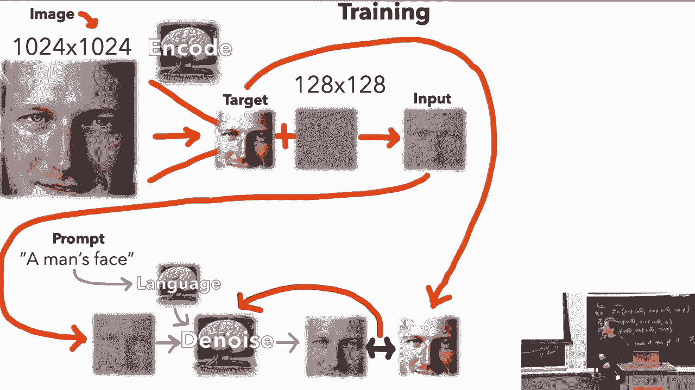

注意我们只在训练中使用了编码器，但现在当我们想要部署这个时，我们将有一些用户在他的电脑上输入，当我们看到提示时，我们输入这个提示，电脑会创建纯粹的噪音，所以可能的最大噪音水平是全部。

我们有一个你知道的模型，它编码语言，我们将它喂给我们的去噪模型，它获取纯粹的噪音并开始向真实图像迈进，然后我们可以运行，你知道，将这个输出在我们希望修复的区域重复运行多少次就多少次，当我们完成，你知道。

快乐，并且取决于我们想要提供的计算资源多少，对，这个垃圾程序需要多少步骤，你知道，会得到一种递减的回报，但是你运行它直到它足够好为止，然后你将其喂给你的解码器，并选择缩放到用户感兴趣的图像分辨率。

那么你就交付那个，只要编码器和解码器工作得非常好，你不会失去任何东西，所以希望，嗯，这有些道理，能够获取低分辨率图像的技巧是很棒的，嗯，这使得训练更快，部署更快，因为噪声这一步，我们做多次迭代。

也许我们做一百次一千次，所以这将是最多的，迭代次数将是最昂贵的，唱这个训练和部署的一部分，这就是为什么它很好因为我们只在部署期间解码一次，我们在训练期间只编码一次。

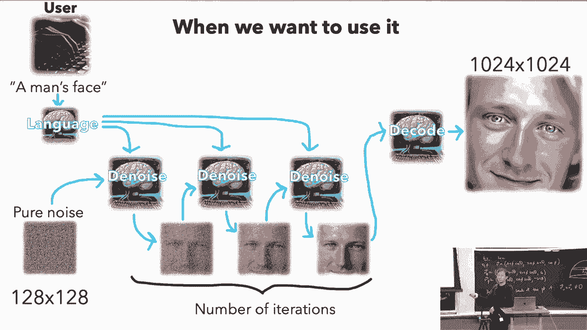

所以不 very 昂贵，好的，所以我们现在说已经有了这个完美的编码器和解码器，在顺序编码器中，现在，我们将讨论我们如何正确地获取它们，所以，为什么和什么样的技巧我们使用，以便使它们工作良好。

好的，所以，在自动编码器设置中，我们想要取一些来自Linnet的图像，以及数据集中的任何图像，我们想要运行通过我们的编码器到一个较小的图像，一个压缩版本，然后，我们希望运行它通过我们的解码器并放大它。

我们想要得到原始图像，是的，我们想要能够无失信息地重复这个过程，实际上，这意味着，有很多微妙之处，比您可能最初认为的更难，首先，您必须决定，例如，您如何，如何测量，如果您得到了原始图像。

什么是一个好的损失函数或视角，表明这些图像有多近，因为你需要一些损失函数，因为你想要最小化这些图像之间的差异，但在经过这个顺序编码器后，但你如何做到，所以，您可以尝试的第一个事情是，你知道人们做了什么。

您可以说，我们只是比像素像素，它将输入图像的像素值与输出图像的像素值进行比较，执行负数或类似的操作，我会做负数，以确保差异非常小，是的，所以，这对什么有好处，那个好处是。

如果顺序编码器完美地复制原始图像，那么损失就是零，所以，优化的好，是的，当你做得很好时，损失被完美优化，当然，但是，有关于它实际上如何能够以我们认为合理的方式测量相似性的明显缺点，例如。

如果您现在取一张图像，并只是稍微移动图像，这些仍然是非常相似的图像，但由于稍微移动，像素对应关系发生了变化，但这些图像仍然非常相似，但由于稍微移动，像素对应关系发生了变化，当你对两张图片进行负运算时。

结果将非常不同，就像这里，例如，这些图片稍微偏移了一些，所以你在比较眉毛和眼睛，你可以看到这些图片非常，非常不同，尽管它们显然非常相似，所以仅仅做负运算或减去图片，并看那个并不足以捕捉相似性。

我们人类感知到的那一部分，好的，那么我们能做得好的是什么，稳定的不足首先决定要做的是，他们实际上现在引入了生成对抗网络，他们说生成对抗网络已经被使用了很长时间，从经验上看，我们发现它们擅长捕捉细节。

所以他们打算利用这个在这个工作中，因为生成对抗网络擅长细节层面，而不是整体比较，他们将从每张图像中取小片，然后你将将这个片喂给，以便你现在有一个片，来自原始图像和重新创建图像的片。

你将将这个喂给批评家的片，这就是训练好的，它被训练说哪一个是从原始图像来的，真正的实际来自真实图像的片，哪一个是从重新创建图像来的，所以它做出猜测，然后我们通过说训练它，好的，实际上，这个才是原始的。

这个假的，所以下次你看到类似的东西，你做得更好，对吧，但是当然，编码器解码器被训练来欺骗批评家，所以编码器和解码器被训练使补丁看起来非常相似，从角度看，这竟然非常成功地捕获了所有不同的细节。

所以你知道当我们当我们生成一张脸的图像时，就像你不会去过度关注毛孔并过于在意，只是它看起来相当相似，你会对它满意的，这就是他们这里利用的，当然，你在所有的不同区域和自由度上都这样做，这个扫描，好的。

所以这现在解决了生成图像的详细信息的问题，所以我们可以再次缩小和放大图像，而不会失去这些能力，因为当我们要求达利亚稳定未来为我们生成图像时，我们想要看起来真实，我们希望细节在那里。

我们不想要一个没有毛孔或类似的面孔，对，我们想要看起来真实，现在我能够做到这一点。

但是像是有一件事是缺少的，在设置中，我们有一个只是局部损失的，但我们仍然也希望整体图像看起来漂亮，你知道类似的，从更大的角度来看，对，我们希望面孔被组装得像一个面孔，不仅仅是补丁，你知道被皮肤覆盖。

但他们想要眼睛在正确的位置，等，所以我们现在也打算包括一个损失或兼容的图像，从更全局的角度来看，不仅仅是补丁级别，而是更全局，我们将，我们将尝试因为这个将，这将被人类使用，他们将判断这个输出的质量。

我们将尝试模仿人类如何判断图像，或他们如何认为图像相似或不相似，所以我们可以尝试以人类方式比较这些图像，是的，嗯，所以实践并不等于理论，你有模型，你获得各种组的，以及有多少补丁看起来相似或像。

如何解决这个问题，哦是的，所以嗯，所以我认为，在这个工作中，他们实际上比较一对补丁，并在两个地方取相同的补丁。

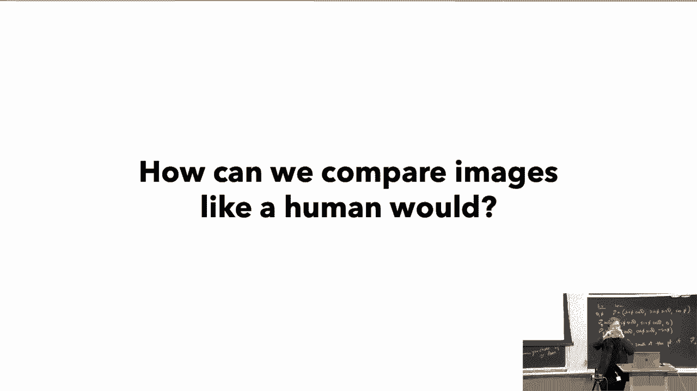

那么现在是一个问题吗，如何处理这些补丁不是完全对齐，现在是否有问题，这些补丁并不完全对齐，如果你想想，因为我们不是用那个就，我们并不，我们并不，我们并不，我们并不减去并获取一个值。

这个模型实际上看这两个并说哪一个可能是一个实际的真实图像，对，就像哪一个是从原始图像来的，哪一个是从假象图像来的，如果看到这样，你自己这样看起来对你来说很难分辨，因为他们看起来都像来自真实面部图像的。

所以像与他们在相似性上不一致的方面，现在是相当无关紧要的，因为你作为批评家只会根据那个部分来看，说，这实际上看起来像来自真实图像还是不像，这使得这个损失现在不那么具有信息性，因为，它，它。

它不像简单地做负一样简单，它实际上需要理解更多的部分如何看起来像，批评家，批评家是另一个模型，是的，所以它是另一个被训练成对抗性模型的模型，所以当我们完成我们的朋友之后，批评家，批评家不再使用。

所以当我们完成时，我们将丢弃批评家，好的，好问题。

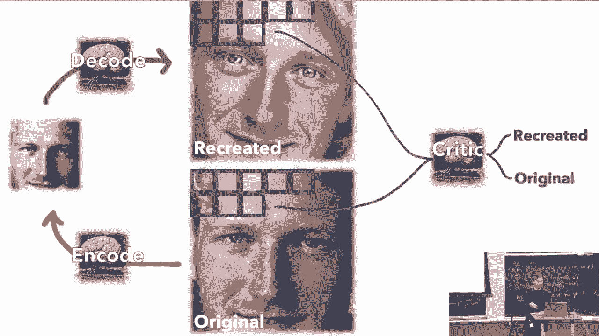

好的，好的，我们已经完成了对过去级别的比较，所以我们能够处理细节，但我们想要能够处理整个图像，是的，我们想要一些更全局的损失来比较图像，我们想要一些你知道的，像这样的图像从人类视角看相似。

因为最终人类将使用它们，好的，所以他们实际上说的是已经做了很多工作，我们在这堂课中谈论过对比性学习，所以这又是自我超学习上，关于你如何学习好图像特征的，好的，我们做得好的地方在哪里，在这种情况下。

我们我们从网上获取图像，我们说在同一图像中出现的概念更相关和相似，比在平均不同图像中出现的概念，当你看很多图像时，所以在学习中，你只是取一张图像，并创建两个随机的裁剪，部分，然后在你知道的地方。

你训练这个，训练，一个模型来说，比如，嗯，好吧，如果你，如果你对模型有一个作物，模型应该能够说，在我数据集中的所有可能的作物中，哪一个来自同一张图像，并且哪些来自其他图像。

所以它需要能够识别来自同一张图像的作物块的部分是正确的，所以这里，在某种方式，你知道，它必须理解，如果你看到未成熟的，一种作物或被牵绳的人类部分，它可能正在遛狗，所以有些人理解这两件事有关。

而且狗比猫走路的可能性更大，例如，他又有一个作物，他必须理解这些不同的事情它们如何相关，而且当你训练这个，它会产生一个输出，你用作特征，一种潜在空间特征，它总结图像。

所以基本上在这个过程中创建了一个压缩向量，它总结像特征，这张图片的表示，如果你愿意，而且结果显示在你看的地方已经做了很多工作，而且这些模型的表示学习到，然后你看距离，你拿两张图片，你通过这个嵌入运行它。

我们从学习中得到的，然后你得到特征表示向量，然后你看一个简单的l像简单的，你知道，在这个嵌入空间中，负向的减法距离，一个潜在空间，这个距离非常接近人类如何判断的，图像的相似性或不相似性，所以。

他们基本上取测试的方式是，他们取一张图像，然后，他们可能会有，嗯，让我们说，也许我不知道我确切地知道，但是，它可能像取五张图像，然后让那些人类将它们分组，像，好的，哪一些最接近，或者他们取像一张图片。

然后对于目标说像将这些图片按照它们离这张图片的距离进行排名，然后这些模型会做得与人类对这些图片进行排名的方式非常相似，所以这是一种经验性的，这也暗示实际上我们也在学习类似的方式，好的，很好。

为什么为什么这很好，很好，现在很好，因为我们有这个嵌入，我们可以，我们不需要训练它，现在开始训练，我们可以冻结它，但我们有一个可以创建，你知道我们图像的全球特征，然后我们可以查看这种潜在空间中的距离。

因为这里的距离，当这是这个距离在这个表示或潜在空间中很小的时候，那么根据人类来说，它们是非常相似的，所以现在我们可以优化和最小化这个距离在这个潜在空间中，以获取全局相似性，这些图像之间的某种方式，好的。

所以现在我们就结合这个，所以我们既有批评家，你知道我们试图欺骗，我们有一个嵌入式，我们试图使其快乐，但在这个潜在空间的表示中，它们是对齐的，所以我们得到局部和全局的细节都大致对齐，这证明效果良好。

并将其转换为良好的形式，你的意思是，你可以想象，例如，这两个损失可能会相互矛盾，相互对抗，但实证上这效果良好，它们很好地收敛，好的，那么嗯，总的来说那么嗯，关于噪音的事情，当我们处理一些噪音时。

我们尝试通过添加细节和朝着某个方向进行步骤来精炼它，实际上可以从空气中或纯噪音中创建，如果你对它训练在不同的噪音和扩散级别上，这是我们能够迭代做到的时候，所以我们有能够处理一些图像噪声的降噪模型。

并朝着正确的方向进行步骤，使图像看起来更好，看起来更像真实的图像，当我们这样做得正确时，在几个步骤中改善图像，它被称为扩散，而且如果我们基于某些语言输入进行条件，所以我们有语言和图像的对应关系。

我们可以使 this 生成不僅僅是随机的，但实际上，你知道，根据提示使你快乐，所以他们遵循提示，你给的是提示和实际生成的图像之间的对应关系，因此，扩散在像素级别工作，因此，它很昂贵，因此。

如果你有高分辨率，那么你需要一个非常昂贵的模型来训练和部署，所以，如果你可以在压缩的小分辨率空间中进行，你将获得很多，这就是为什么稳定扩散使用顺序编码来压缩图像，转换为更小的图像，并在那里进行所有训练。

当我们创建这个订单编码器时，所以编码器和解码器，我们在思考相似性的方式上必须小心，以获取实际上有用的东西，而且我们也必须从人类如何判断相似性中汲取一些灵感，因为最终我们的模型将被部署给人类。

我们希望他们对我们的产品满意，我认为这也很酷，因为所有这些不同的方法都在这里，我们使用了一种语言模型，让我们在on上训练，让我们说只是下一个词在下一个词预测上，我们使用了之前谈论过的鼻子扩散。

我们使用了使用GANs训练的编码器，就像这样生成对抗网络，然后我们还甚至使用了一个，你知道，来自图像的对比学习，为了得到一种我们可以用于训练我们的编码器或解码器的有用表示，所以这就像真的很酷。

而且他们如何能够 kind of，你知道拼接在一起，如果这可能，当然因为他们依赖于无标签数据，对吧，所以他们可以在大规模上进行训练，而且嗯，所以我认为那也是一个非常酷的事情。

你如何将这些不同的东西结合起来，并且觉得可以，并且稍微一点，我的意思是，我认为这也挺不错的，我们可以利用一些我们的人类直觉来设计和使用，然后也许我们可以说像，当我们绘制图像时，我们如何思考。

这对能够提高自己有用，并且当我们看时，例如，人类如何判断相似性，判断相似性也非常鼓励人，因为我们中的一些人也开始稍微接近，也许可以帮助我们理解我们自己的工作方式和大脑如何学习。

因为我们开始看到这些相似性，再次，我认为这非常有趣，那就是网络中的创造力，来自噪声，就像如果你给相同的输入，期待相同的输出，而且可能像我们大多数人一样，我认为可能我们很多都有，你知道同样的例行公事。

如果你想在工作中或者在研究中创新，你可能偶尔需要跳出你的舒适区，并将自己置于精确的方式，也许即使你去一个新的设置工作，你也会更有创造力，因为你的大脑并不好使制造随机性，它在你的环境中利用随机性很好。

这也是相当酷的，好的，我们还讨论了冰山尖的部分，而且我们做了一些更多的，我们基本上填充了一些底部的部分，当然，这是顶部的部分，我们有tdp和稳定扩散，还有人们正在谈论的这酷东西。

大多数已经在研究中存在一段时间的ai都对此感到兴奋，但是然后也，当然，数据，数据花了很长时间创建互联网，你知道我们很难复制，所以数据对于使这些ai模型工作至关重要，而且我认为。

与ai一起工作的许多人在研究中低估了，我们的数据集经常被筛选，清理和结构化以供我们使用，以一种现实世界不是的方式，所以如果你想从理论到实践，那么数据真的很重要，好的，所以嗯，那就是今天的内容，是的。

你可以尝试，如果你有任何问题，我现在可以回答它们，是的，所以你去那里，那辆火车就是上去的那辆，你应该去那里，那是一个好问题，嗯，好的，我的意思是，我们在这门课上没有覆盖变分编码器，对，嗯。

我不知道他们用了哪一个，我不知道，他们使用了一个非常小的录音机，我使用常规颜色，但是，我们可以稍微谈谈离线功能，嗯，那个是什么，我们为检测模型使用的损失函数是什么，就像我用的，嗯再次。

和对比学习的对比度，对，扩散损失是得分，可以说是叫做得分匹配，对，那是一个，我的意思是，它是嗯，它不是特别数学上复杂，但是，它稍微有点数学上复杂，如何定义它，所以我认为从高层次的直觉来看，嗯，你试图。

你试图从，你试图从像一种分布，那是随机高斯噪声，这是我们非常喜欢创建的，一种分布是高斯噪声，然后你有所有图像的分布对吧，你想要能从你的高斯噪声中采样，然后将自己或传输到自己的图像空间，好的，是的。

如果你只是随机噪声，就很难，你应该取，你知道一步直接跳到真实图像的空间，好的，所以让我们假设图像在这里，然后噪音水平非常，仅仅像'砰'一样跳很难，但如果你聪明，你可以创建训练样本。

所以训练时你不必像这样走完全程，你可以在整个中间创建样本，所以我的意思是，你可以取一张图片，添加一些噪音，最终落在全正态噪声和完整图像之间的中间，然后你在训练，你可以开始学习，而且。

损失基本上具有方向性，意味着如果你在这里，得到一个训练样本，你会向，你知道的真实图像，获取像方向性适应度反馈一样，说像，好的，你是否在正确的方向上前进，这就是你获得的反馈，这是非常好的。

原来这样的反馈很受欢迎，很容易从学习中获益，而且很好，因为现在训练期间你已经看到了所有不同的组合，如介于全部和高斯噪声的真实图像之间，以及所有的中间值，你在训练中看到了所有这些，所以当你被部署时。

并且你只设置了这个东西，你可以实际上采取这样的行动，像这样，从噪音空间到图像空间，实际上最终到达一个现实的图像，所以你可以通过去除噪音来找到你的路，像扩散一样迭代，并找到自己想要处于的空间。

只要你朝着正确的方向走，所以基本上现在，因为这个模型已经被训练来从美国到欧洲的任何地方，我们可以说，它通过走正确的步骤来学习的，那么让我说嗨，让你知道，去巴基斯坦吧，可以是这样，我要开始向欧洲迈步。

然后走向终点，一步一步，然后最终我们会发现自己在正确的地方，正确的地方，基本上这样能理解吗，是的，改变方向，不像这个，是要跟着一个走的，就是就是，因为快要接近了，嗯，好的。

