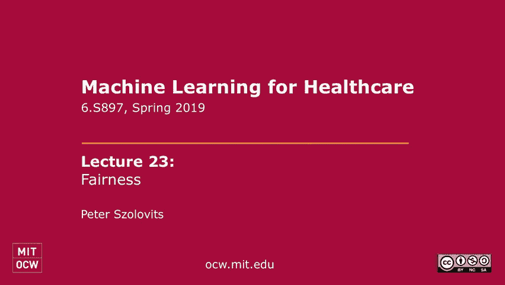
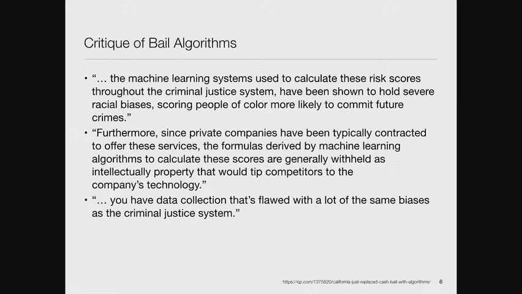
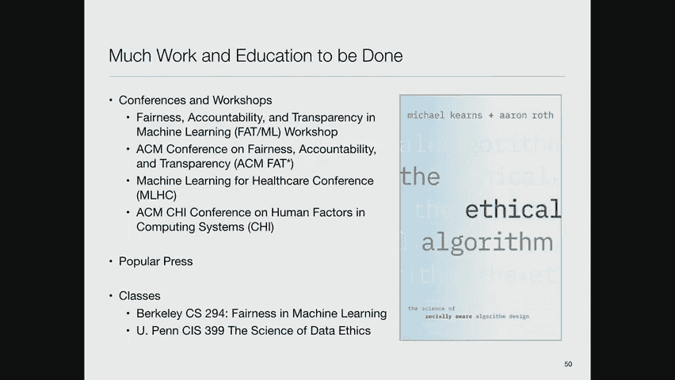

# P23：23.Fairness - 大佬的迷弟的粉丝 - BV1oa411c7eD

所以一年多前，我接到一个电话，来自这个委员会的NASM是国家科学院，工程与医学，所以这是一个庄严的老人的身体，有很多花白的头发，他们做了足够重要的事情，被选入这些学院。

他们的研究机构被称为国家研究委员会，有一堆不同的委员会，其中之一是科学委员会，技术与法律，这是一个非常有趣的委员会，它由大卫·巴尔的摩主持，他曾经是麻省理工学院的教授，直到他成为加州理工学院的校长。

他口袋里碰巧也有诺贝尔奖，你知道他是个很有名的人，是U的成员，s，哥伦比亚特区巡回上诉法院，所以这可能是最重要的巡回法院，比最高法院低一级，他碰巧坐在鲁斯·巴德·金斯伯格占据的座位上。

在她被提升到最高法院之前，从上诉法院，所以这是一件大事，所以这些都是重击手，来谈谈我在这里列出的一组主题，所以区块链和分销商，信任，人工智能与决策，这显然是我被邀请谈论隐私和知情同意的部分。

在大数据时代，法学院科学课程，新出现的科学问题，技术与法律，利用诉讼针对科学家的问题，有你不喜欢的观点的人，你如何交流的更普遍的问题，对持怀疑态度的公众来说，生命科学的进步。

所以这是处理时代的反科学基调，所以我们这组讨论人工智能和决策的人，我对焦点有点惊讶，因为汉克·格里利是斯坦福大学的法学院教授，他做了很多工作。

Charisse Birdie在一个叫做审前司法研究所的地方，她的问题是法律问题，那就是现在有很多公司有软件可以预测，如果你在等待审判期间获得保释，你有可能不保释吗。

所以这对法官决定多少保释金是有影响的，以及是否让你保释，或者把你关在监狱里等待审判，matt lundgren是斯坦福大学的放射学教授，并在构建卷积方面做了一些非常酷的工作，神经网络模型检测肺。

embi，E和其他各种东西，成像数据，你知道的，下一个家伙和苏雷什·曼·文卡塔·苏布拉马尼安作为教授，他最初是犹他大学的理论家，但也开始思考隐私和公平，这就是我们的小组，我们每个人都做了简短的谈话。

然后进行了非常有趣的讨论，我非常惊讶的一件事，有人提出了不应该taal的问题吗，作为巡回法官，上诉法院，聘请像你们这样的人在他的法庭上做书记员，所以像你们这样的人，他们也碰巧在法学院上学。

其中现在有许多人接受过，计算方法和机器学习，但也有法律背景，他对我说了一些很有趣的话，他说不行，他不希望那样的人，这让我有点震惊，所以我们问了他们一点为什么，他说好，因为他认为法官的角色，不是专家。

但作为一名法官，平衡问题双方的论点，他担心如果他有一个有很强技术背景的职员，那个人会有很强的技术意见，这会使他的决定产生这样或那样的偏见，所以这提醒了我，我妻子是个律师，我记得她在法学院的时候。

她会告诉我她正在上的课，很明显，学习法律就是学习如何获胜，不学习如何找到真相，法律中有一个哲学概念，它说真相会从问题双方的激烈争论中出来，但作为一名律师，你的职责是尽你所能努力辩论，支持你的论点。

事实上，在法学院，他们教他们，在辩论中，你应该能够站在任何案件的任何一方，并能够为它提出令人信服的论点，所以Tadel在他所说的中强化了这个概念，我觉得很有趣，嗯，只是想谈谈司法领域。

因为这是最受公众关注的一个，决策自动化，用于确定各种服务的资格，评估在何处部署卫生检查员和执法人员，划定选区界线，所以你听到的所有关于不公正选区划分的讨论都是关于使用计算机的，实际上是机器学习技术。

试图找出如何，你知道的，这取决于谁负责重新划分选区，然后你定制这些不公正的地区，为了最大限度地提高你获得多数的可能性，人们赞成这些想法，在某种程度上，它们为保释注入了清晰度和精确度，假释和判刑决定。

算法技术可以最大限度地减少人类判断的产物，所以我们知道人们实际上是有偏见的，所以法官有偏见，以及参与法律体系决策的陪审团，所以通过将其正式化，你可能会赢，然而，反过来说，利用技术确定谁的自由被剥夺。

以及根据什么条件引起对透明度和可解释性的重大关切，下周我们将讨论透明度和可解释性，但今天的比赛是关于公平的，嗯，这里有一篇去年十月的文章，去年9月说到今年10月，如果你在加州被捕，你是否获得保释的决定。

将由计算机算法制作，不是被人，不是百分之百，这位县官员有一定的酌处权，谁来推荐，法官最终决定，但我怀疑在这样做有一些令人震惊的结果之前，它可能会很常用，现在对这些保释算法的批评是基于许多不同的因素。

一个是，例如，如果你是两个一模一样的人，但你们中的一个碰巧是白人，你们中的一个碰巧是黑人，你被保释的机会要低得多，如果你是黑人比如果你是白人，现在你说好，如果我们是通过算法学习这个，这怎么可能呢，嗯。

这是一个复杂的反馈回路，因为算法是从历史数据中学习的，如果历史上法官不太可能允许非裔美国人保释，比对一个高加索美国人，那么算法就会知道这是正确的做法，并将很好地结合这种偏见。

然后是第二个我认为非常可怕的问题，在这个特定的领域，这些算法是由私人公司私人开发的，它不会告诉你他们的算法是什么，你可以付钱给他们，他们会告诉你答案，但他们不会告诉你他们是如何计算的。

他们不会告诉你他们用什么数据来训练算法，所以它真的是一个黑匣子，所以你不知道盒子里发生了什么，除了看它的决定，嗯，所以。

数据收集系统的缺陷与司法系统本身的缺陷相同，所以不仅有算法来决定你是否能获得保释，也就是，毕竟，在你的审判到来之前，这是一个相对暂时的问题，虽然那可能是很长的时间，但也有算法对量刑等问题提出建议。

所以他们说，这个病人是惯犯的可能性有多大，当他们出狱的时候，他们又要冒犯了，因此，他们应该被判更长的监禁，因为你想让他们远离街道，这是一个关于威斯康星州一个特定的人的特殊故事，令人震惊的是。

州最高法院做出了不利于这家伙的裁决，说对算法输出的了解是足够的透明度，为了不侵犯他的权利，我想很多人认为这是一个令人愤慨的决定。

我肯定会上诉的，而且有可能被推翻，反过来说，我一直在做，你知道的，一方面算法可以帮助人们远离监狱，所以不久前有一篇有线文章，我们可以用算法来分析人们的案件，然后说，哦，这个人看起来真的需要精神治疗。

而不是需要坐牢，所以也许我们可以把他从，从刑罚系统转入精神病治疗，让他远离监狱，让他得到帮助等等，所以这是能够使用这些算法的积极一面。

现在不仅仅是犯罪，也有很长时间的讨论，你可以在网上找到这个，比如说，算法能比人类雇佣得更好吗，所以如果你是一家大公司，你有很多人你想雇佣他们做各种工作，很容易说，嘿，我做了很多很多的招聘决定。

我们有一些结果数据，我知道，哪些人被证明是好员工，哪些人被证明是糟糕的员工，因此我们可以，关于使用这种算法，并将其用于申请工作的人，然后说，好的，这些是我们要采访的人，可能更高。

因为他们看起来是更好的赌注，现在我得告诉你一个个人故事，当我在加州理工学院读本科的时候，加州理工学院的教职员工决定他们想让所有教职员工委员会的学生成员，所以我很幸运，我服役了三年。

作为加州理工学院本科招生委员会的成员，在那些日子里加州理工学院只花了大约二十二万，每年有230名学生，这是一所很小的学校，我们会在全国各地飞行，并面试申请人池中所有申请人的前一半。

所以我们不仅会和学生交谈，也对他们的老师和辅导员，看看当时的环境是什么样的，我想我们很清楚一个学生可能会有多好，基于此，所以是的，录取决定做出后的一天，其中一位教授，就像一个思想实验说的。

我们应该这样做，我们应该把二百三十人，我们刚刚提供了入场券，我们应该把他们都拒之门外把接下来的二百三十人，然后看看老师们是否注意到了因为现在似乎是一个相当平坦的分布，当然。

我和其他人认为这是不公平和不道德的，而且会是，你知道的，浪费了我们挑选这些人的所有时间，所以我们没有那样做，但后来天空熄灭了，他看了我们关于人们排名等级的数据，SAT平均成绩，他们推荐的勾号。

关于他们是真正非凡的还是仅仅杰出的信件，他建立了一个逻辑回归模型，否，这是一个线性回归模型，预测这个人大二的平均成绩，这似乎是一件合理的事情，他得到了一个相当好的适合，但令人不安的是，在加州理工学院。

学生人数，呃，原来你的测试版，好的，所以如果你的英语在sat考得特别好，作为加州理工学院的大二学生，你可能会做得更糟，如果你做得不好，所以我们想了很多，但当然，我们认为那真的很不公平，惩罚某人擅长某事。

尤其是当学校有这样的哲学取向说，我们应该寻找受过广泛教育的人。所以这只是一个例子，嗯，和更多的科学星期五有一个很好的节目，你可以听关于这个问题，所以我问你，你说公平是什么意思，你知道。

如果我们要定义这个概念，什么是公平的，您希望算法具有哪些特性，为了某种特定的目的而评判你吗，是啊，是啊，无法确定，至少在我看来，一个具体的定义，但因为预审成功了，比如说，我想我的意思是。

不同人群的错误率相似，你可能关心的协方差，比如说，良好的开端，好的，所以说，相似，错误率绝对是人们谈论公平的标准之一，稍后你会看到艾琳，艾琳在哪，就在那里，艾琳是公平概念的大师，是啊，是啊。

当模型说某种因果关系不应该是真的观察时，我希望社会是什么样子，我不知道如何用一个简短的短语来描述这一点，但这很棘手，对呀，我是说，假设我希望是这样，不同种族的罪犯应该有同样的权利。

这似乎是一个公平的好目标，我如何做到这一点，我是说，我可以假装一切都一样，但客观上今天不一样了，数据不支持这一点，所以这是个问题，是啊，是啊，相似的人应该受到相似的对待，在独立于敏感属性的情况下，化妆。

我知道，这是另一个，这是另一种典型的公平观念，这给距离函数带来了很大的压力，两个人在哪些方面相似？哪些特征你显然不想使用，敏感特性，禁止的特征以确定相似性，因为那样人们就会以你不想要的方式不同。

但是定义这个函数是一个挑战，所有的权利，嗯，让我向你展示一个更技术性的方法来思考这个问题，所以我们都知道像选择偏见这样的偏见，采样偏差，报告偏差，等等，这些是传统意义上的偏见。

但我会给你看一个我参与的例子，HSD学生，他开始研究遗传学的问题，以确定某人是否有心脏疾病的风险，用于心肌病，肥厚型心肌病，这是一个很大的词，这意味着你的心脏变得太大变得有点松弛，它开始停止抽水。

最终你会在相对年轻的时候死于这种疾病如果你真的患有这种疾病，一项主要针对欧洲人的研究，他们发现许多患有这种疾病的人都有某种基因变异，他们说这一定是这种疾病的原因，因此，如果你有这种基因变异。

这就成为了公认的智慧，人们会劝你不要打算长寿，你知道这有各种各样的后果，想象一下，如果你想要个孩子，当你四十出头的时候，你的预期寿命是五岁，当你有一个十几岁的孩子时，你想死吗，你留给你的配偶。

所以这是人们必须做出的一系列重要决定，现在发生的事情是，在美国，有这样的测试，但问题是，很多非洲人和非洲人，美国人经常有这种基因变异，却没有患上这种可怕的疾病，但他们都被告知他们基本上要死了。

只是在多年后，当人们注意到这些本应在基因上死亡的人，他们说不会死，嗯哼，也许我们误解了什么，他们误解的是用来开发模型的人口，A是欧洲血统的人口，而不是非洲血统的人口，所以你走得很好，我们一定吸取了教训。

所以这篇论文发表于二十六年，这是这个地区的第一个，这是三周前发表在《自然》杂志上的一篇论文，科学报告说，嗯哼，欧洲血统人群中发现的遗传风险因素，不能提高骨质疏松的预测，中国人群骨折与骨密度。

所以这是同样的故事，完全一样的故事，不同疾病，后果可能不那么可怕，因为被告知你老了会骨折，并不像被告知你的心脏要停止工作那么糟糕，当你五十多岁的时候，但我们有了，所以从技术上来说，偏见是从哪里来的，嗯。

我提到了标准来源，但这里有一个有趣的分析，这来自几年前的康斯坦丁·阿尔费里斯，二千零六，他说，嗯，你看，在一个完美的世界里，如果我给你一个数据集，有一个不可数的，无限多的模型可能解释数据中的关系，好的。

我无法列举出无数的模型，所以我要做的是，选择一些模型家族来尝试适合，然后我要用一些试衣技巧，像随机的，梯度，血统，或者一些可能会找到全局最优的东西，但也许不是，也许它会找到一个局部最优。

如果你把o算作所有可能的模型族中的最优可能模型，如果你把我算作最好的模特，这是可以通过特定的学习机制学习的，你调用，你称之为学过的实际模型，那么偏差基本上是o-l，因此。

与目标模型相关的学习方法存在局限性，方差是l减去a，错误是由于你学习事物的特定方式造成的，比如取样等等，好的，你可以通过排列数据来估计不同模型之间差异的重要性，从本质上随机化关系和数据。

然后你会得到这些模型的性能曲线，如果你在95%的置信区间之外，然后你有一个p等于零5，这个模型不是随机的结果，好的，这是典型的处理方式，现在你可能会说，但是，难道不是歧视吗？我们做机器学习的原因。

法律意义上的歧视，而是区分不同人口意义上的歧视，所以你可以说好，是呀，但是区分的一些基础是合理的，一些区分的依据是不合理的，我们为社会目标决定，我们希望它们无关紧要，我们不会考虑他们。

所以从研究了一段时间的人那里得到的一个教训是，歧视是特定领域的，所以你不能定义歧视意味着什么的普遍概念，因为它与这些问题密切相关，实际上是什么，在你所做的决定中，道德上是无关紧要的。

所以在刑法中会有所不同，比在医学上，比在招聘方面，比在其他各个领域，大学录取，比如说，而且它的功能也是特定的，所以你必须考虑到各个特征，从历史上看，政府试图规范这些领域，因此。

信贷受到《平等信贷机会法》的监管，《民权法》规定的就业，公平住房法规定的住房，《民权法》规定的公共住宿，最近，婚姻由《婚姻保护法》原规定，你可以从它的标题中看出，反对人们可以结婚。

他们不是他们想捍卫的传统婚姻，但大约六年前被最高法院驳回，具有歧视性，如果你回头看，这很有趣，可能在你们1967年出生之前直到1967年，对一个非洲人来说是非法的，美国人和白人结婚，在弗吉尼亚。

如果你去领结婚证，这实际上是非法的，你被拒绝了，如果你在州外结婚回来，你可能会被逮捕，这件事发生得很晚，特雷弗·诺亚，如果你在每日秀认识他，写了一本书叫《天生犯罪》，我觉得，他父亲是瑞士白人。

他的母亲是南非黑人，所以他在种族隔离法律下的存在是非法的，他不得不假装他的母亲是他的看护人，而不是他的母亲，以便能够在公共场合出去，否则他们会被逮捕，所以这个最近，当然啦，也消失了。

但这些是一些监管问题，所以这里有一些法律承认的受保护的阶级，种族，颜色，性，宗教，国籍，公民身份，年龄，怀孕，家庭状况，残疾，退伍军人身份，和，最近，某些司法管辖区的性取向，但不是全国各地。

关于歧视有两种法律学说。其中一个谈到了不同的待遇，这和这个有点关系，另一个谈论不同的影响，并说不管机制是什么，如果不同种族群体的结果有很大不同，典型或性别群体，那么就有初步证据表明有什么不对的地方。

有某种歧视，嗯，现在的问题是你如何为自己辩护，反对，比如说，当你说的时候，一个完全不同的影响论点，为了成为一个不同的影响，这是非法的，它必须是不合理的或可以避免的，例如，假设我在雇人去爬五十层的大楼。

正在建设中，你申请，但事实证明你有健康状况，你有时会头晕，我可能会说你知道吗，我不想雇用你，因为，我不要你，从一栋在建大楼的五十层扑通一声摔下来，这可能是一个合理的辩护，如果我起诉你，说嘿，你在歧视我。

基于这种医疗残疾，一个完美的防御是，是啊，是啊，这是真的，但这与工作有关，所以这是处理它的一种方法，现在你如何很好地证明不同的影响，法院已经决定你需要能够证明大约20%的差异，为了称之为不同的影响。

所以问题是，当然啦，就是，我们能改变招聘政策吗，或者我们为了实现同样的目标而使用的任何政策，但少了一个，影响的差异，所以这就是挑战，现在，有趣的是，不同的待遇和不同的影响真的是相互冲突的。

你会发现这在这个领域的几乎所有事情上都是正确的，所以不同的影响是关于分配正义，尽量减少结果的不平等，不同的待遇是关于程序的公平和机会的平等，那些并不总是吻合的，换句话说。

很可能机会平等仍然会导致结果的差异，你不能轻易地把那个圆平方，嗯，有很多歧视一直存在，文献中有大量的证据，其中一个问题是，比如说，像这样的问题，不同的种族或不同的民族，事实证明。

我们没有一个很好的平衡集，欧洲人的数量，血统等于非洲人的人数，美国人，或者西班牙裔，或者亚洲人，或者你选择的任何人口血统，因此，我们对多数阶级的了解往往比对少数阶级的了解要多得多，只是额外的数据。

这些额外的知识可能意味着我们能够降低错误率，仅仅因为我们有更大的样本量，好的，所以如果你想把这个正式化，这是莫里茨·哈特教程的一部分，这是大约一年半前在KDD给出的，我觉得，莫里茨是伯克利的教授。

所以这里有很多材料，所以他这样把问题形式化，他说，看一个决策问题，我们的一个模特，在我们的条件下，我们有一些X，这是我们所知道的个人特征集，我们有一些，它是受保护的特征集，就像你的种族，或者你的性别。

或者你的年龄，或者我们试图防止歧视的任何东西，然后我们有一个分类器或一些分数或预测函数，在任何一种情况下，这都是x和a的函数，然后我们有一些Y，这是我们有兴趣预测的结果。

所以现在你可以开始区分一些不同的公平概念，通过观察这些元素之间的关系，所以文献中出现了三个标准，其中之一是评分功能独立于敏感属性的概念，所以这表明r独立于，换句话说，记得上一张幻灯片上。

我说r是r的函数，作为x和a的函数，所以很明显，这个标准说它不可能是，空函数，另一个概念是分数的分离和给定结果的敏感属性，所以这是一个说不同的群体将受到类似的待遇，换句话说，如果我告诉你小组的结果。

你知道的，工作表现好的人和工作表现差的人，则评分函数独立于受保护的属性权，这样就有了更多的回旋余地，因为它说受保护的属性仍然可以预测结果，只是你不能在评分功能中使用它，给定个人属于哪个结果类别。

然后充足是相反的，它说给定评分功能，结果独立于受保护属性，所以说，我们能不能建立一个公平的评分函数，将结果与受保护的属性分开，所以这里有一些关于这些的细节，如果你看独立，这也被称为各种其他名称。

基本上它说的是一个特定结果的概率是相等的，一个是一样的，不管你在上课，受保护属性中的A或类B，好的，那么这告诉了你什么，它告诉你评分功能必须在整个数据集上是通用的，而且不能区分A类和B类的人。

那是个很强的要求，然后你可以操作不公平的概念，要么通过寻找这些概率之间的绝对差异，如果它大于某个ε，那么你就有证据表明这不是一个公平的评分函数，或者比率测试说我们看比率，如果它与一个显著的不同。

那么你就有证据表明这是一个不公平的评分函数，顺便说一句，这与四五规则有关，因为如果你让Epsilon占20%，那就和四五法则一样了，现在的问题是，这种独立的概念有问题。

所以它只需要同等比例的决定来雇佣或给某人一个肝脏，为了移植，或者你感兴趣的任何话题，如果招聘是基于一个好的评分组A，但是在b中是随机的所以，比如说，如果我们对A组的了解比对B组的了解多得多呢。

所以我们有一个比B组更好的得分方法，所以你可能会遇到这样的情况，你最终雇佣了同样数量的人，两组人中的相同比例，但在一组中，你在挑选好的候选人方面做得很好，在另一组中，你基本上是随机做的。

A组的结果可能比B组更好，这意味着你正在为未来开发更多的数据，这表明我们真的应该雇佣A组的人，因为他们有更好的结果，所以有一个反馈循环，或者，当然也可能是恶意造成的，所以你知道。

我可以作为招聘经理来决定，我没有雇佣足够的非裔美国人，所以我要随机抽取一些非裔美国人，雇佣他们，然后也许他们会做得很糟糕，然后我会有更多的数据来证明这是个坏主意，好的，所以那是恶意的，嗯。

还有一个技术问题，这是有可能的类别，该小组是结果的完美预测者，在这种情况下，他们当然不能分开，他们不能相互独立，现在，你如何实现独立，嗯，有许多不同的技术，其中一个，也就是X和A的某种组合。

你通过最大化x和z之间的互信息来做到这一点，通过最小化a和z之间的互信息，这是我在机器学习中看到的一个想法，为了健壮性而不是公平，人们说你知道问题在于给定一个特定的数据集，您可以过度适应该数据集。

所以其中一个想法是做一个类似甘的方法，你说我想训练我的分类器，让我们说，不仅要很好地得到正确的答案，但也要尽可能地努力识别哪一部分数据集，我的例子来自，所以这是同样的想法，这是一种表征学习的思想。

然后根据这个表示建立预测器R，这可能不是完全独立于受保护的属性，但它尽可能独立，通常这些学习算法中有旋钮，取决于你如何转动旋钮，你可以影响哪个效果，你是否会得到一个更好的分类器，那更有歧视性。

或者更糟糕的分类器，它的歧视性较小，所以你可以这么做，在预处理中，你可以在损失函数中做某种合并，依赖概念或独立概念，说我们要在一个特定的数据集上训练，强加这种想要A和R之间独立的概念。

作为我们愿望的一部分，所以你又一次在与其他特征进行权衡，也可以做后期处理，所以假设我建立了一个最优R，不担心歧视，然后我可以做另一个学习问题，我现在要建立一个新的F，它考虑了r和受保护的属性。

它将最大限度地减少错误分类的成本，还有一个旋钮，你可以说，我想在多大程度上强调错误分类，对于受保护的属性，所以这仍然是在谈论独立，下一个概念是分离，它说，考虑到结果，我想把A和R分开。

以便图形模型向您显示，受保护的属性仅通过结果与评分功能相关，所以你不能从一个学到另一个，除了通过结果，因此，这承认受保护的属性可能，事实上与目标变量相关，所以一个例子可能是不同种族的药物试验成功率不同。

在哪里，制造商已经确定这种药物在某些亚人群中效果更好，比其他人群，FDA实际上已经批准向这些亚人群销售这种药物，所以你不应该向人们推销它，它对谁不起作用，但你可以专门为那些它确实有效的人推销它。

如果你想想我们之前谈到的个性化医疗的想法，我们感兴趣的种群变得越来越小，直到可能只有你，所以可能有一种药物对你有效，不是为了班上的其他人，但这正是适合你的药，我们可能会达到这样的地步。

在那里我们可以制造这样的药物，在那里我们可以批准它们在人类中的使用，这里的想法是，如果我有两个种群，蓝色和绿色，我画了这两个种群的ROC曲线，他们不会一样的，因为这种药物对这两个人群的作用不同。

但另一方面，我可以把它们画在同一个轴上，我可以说看这个有色区域的任何地方都可以是一个公平的区域，因为我将对两个人群得到相同的结果，所以我不能为蓝色人群实现这个结果，或者绿色人口的这一结果。

但我可以同时为两个人群实现这些结果中的任何一个，所以这是满足这个要求的一种方法，当它不容易满足的时候，所以分离相对于独立的优势在于它允许r和y之间的相关性，即使是完美的预测器。

所以Y R可能是Y的完美预测，它激励你学会减少所有组的错误，所以关于随机选择少数群体成员的问题在这里不起作用，因为这会抑制ROC曲线，到了没有你想要的可行区域的地步，所以说，比如说，如果是抛硬币。

然后你就有了对角线，唯一可行的区域是在对角线下面，不管预测器对其他班级有多好，所以这是一个很好的特点，最后一个标准是充分性，它翻转r和y，所以它说回归器，预测变量可以依赖于受保护的类。

但是受保护的类与结果是分开的，例如，在二元情况下，Y的真实结果的概率，给定r是某个特定值，R和A是一个特定的类，与相同结果的概率相同，给定相同的r值，但是不同的阶级，好的，所以这与，所以说，它需要。

不同组的正预测值和负预测值的奇偶性，好的，所以这是另一种流行的看待这个的方式，例如，如果得分函数是概率，或分配分数的所有实例的集合，其中r有r部分的正实例，那么评分函数就被说成是校准得很好的。

我们以前在课上讨论过这个问题，如果事实证明R没有得到很好的校准，你可以黑它，你可以通过逻辑函数来很好地校准它，然后将接近适当校准的分数，然后你希望这个校准会给出校准的程度。

会给你一个很好的近似这个充足的概念，教程中的这些家伙还指出，一些数据集实际上导致了很好的校准，甚至不需要非常努力，例如，这是UCI人口普查数据集，这是一个二元预测，是否有人年收入超过5万美元。

如果你有任何收入，如果你超过十六岁，和特征有十四个特征，年龄，工作类型，样品重量，人口普查局的一些统计黑客，你的教育水平，婚姻状况，等等，你看到的是雄性和雌性的校准相当不错，它几乎正好沿着四度五度线。

没有做任何特别戏剧性的事情来实现这一点，另一方面，如果你看看白人对黑人的种族校准曲线，白人并不奇怪，校准得相当好，黑色没有校准好，所以你可以想象建立某种转换函数来改善校准，这会让你们分开。

现在有一个可怕的消息，就是你可以证明，就像他们在本教程中所做的那样，不可能共同实现这两个条件中的任何一对，所以你对公平意味着什么有三个合理的战术概念，他们互不相容，除了一些琐碎的情况，我没时间细说了。

但是谷歌有一个非常好的东西，他们说明了，采用这些公平概念中的一个或另一个，关于综合人口，你可以看到权衡是如何变化的，选择不同的公平概念的结果是什么，所以这又是一种很好的图形黑客，它会在幻灯片里。

我敦促你去看看，但我不会有时间去讨论它，他们指出了另一个问题，有趣的是，所以这是一个场景，你试图雇佣计算机程序员，你不想考虑性别，因为我们知道女性在计算机人员中的代表性不足。

所以我们不希望这是一个允许的属性，为了决定雇人，所以他们说，嗯，有两种情况，其中之一是性别A影响，不管你是不是程序员，这在经验上是正确的，做程序员的女性较少，事实证明。

访问Pinterest在女性中略多于男性，然后访问GitHub在程序员中比非程序员中更常见，那个很明显，所以他们说，你知道的，如果你想要一个关于某人是否会被雇用的最佳预测。

它实际上应该同时考虑到Pinterest和GitHub的访问，他们不喜欢这种型号，所以他们说，嗯，我们可以使用最优的分离分数，因为现在作为一名程序员，你的性别与评分功能分开了。

所以我们可以创建一个不同的分数，这和最优分数不一样，但被允许，因为它不再依赖于你的，关于你的性别，关于你的性别，这是另一个场景，再次从性别开始，说，哦快看，我们知道获得计算机科学大学学位的男性比女性多。

所以那里有一种影响，计算机科学家比非计算机科学专业的学生更有可能成为程序员，有人参观过格蕾丝·默里·霍珀会议吗，你们中的几个，是啊，是啊，所以这是一个非常酷的会议。

格蕾丝·默里·霍珀发明了虫子的概念或术语，是一个非常著名的计算机科学家，从20世纪40年代开始，当时他们很少，为了纪念她，每年都有一个女计算机科学家会议，所以很明显。

你参加格蕾丝·霍珀会议的可能性取决于你的性别，这也取决于你是否是一个计算机科学家，因为如果你是历史学家，你不太可能有兴趣去参加那个会议，所以在这个故事中，最佳得分将取决于。

基本上取决于你是否有计算机科学学位，但分开的分数只取决于你的性别，这有点有趣，因为这是受保护的属性，这些家伙指出的是，尽管你有这两种情况，很可能是数字数据，你估计这些模型的统计数据是绝对相同的。

换句话说，相同比例的人是男性和女性，同样比例的人或程序员，它们与其他因素有相同的关系，所以从纯粹的观察角度来看，你分不清哪种样式的模型是正确的，或者您的数据的公平性版本，所以这是个问题。

因为我们知道这些不同的公平概念是相互冲突的，所以我想通过给你们看几个例子来结束，所以这是一篇基于艾琳工作的论文，所以艾琳喊，如果我是，美国医学协会伦理杂志，我不知道它的存在，我决定不只是膨胀。

我想展示一些真正的作品，艾琳一直在做一些真正的工作，所以玛西娅，他是我的一个学生，我说服她参与进来，我们开始研究这些机器学习模型如何识别，也许可以减少一般医疗和精神健康方面的差距，为什么这两个区域。

因为我们可以访问这些地区的数据，所以普通医学实际上并不那么普通，这是来自模拟和精神健康中心的重症监护数据，是我们从大众那里获得的一些数据，波士顿的麦克莱恩综合医院，两家都有大型精神病诊所，是啊，是啊。

这就是我刚才说的，所以我们问的问题，是否存在基于种族的偏见，性别和保险类型，所以我们对社会经济地位很感兴趣，但我们的数据库里没有，但你的保险类型与，无论你是富有还是贫穷，如果你有医疗补助保险，例如。

你很穷，如果你有私人保险，你很有钱，所以我们就这么做了，然后我们看了看笔记，所以我们想看到的不是编码数据，但你在医院时护士和医生对你的评价，预测再入院30天，你是否有可能回到医院。

这些是我们使用的一些主题，LDA标准主题建模框架，和往常一样，主题包括一些垃圾，但也包括许多公认有用的主题，所以，例如，与癌症明显相关的肿块癌转移，心房纤维，香豆素，与心功能相关的纤颤，等等。

在重症监护室领域，在精神病学领域，你有躁郁症，锂，躁狂发作，与慢性疼痛相关的药量，等等，所以这些是我们使用的主题，所以我们说当你看着，怎么，不同的主题，不同的主题在不同的亚人群中出现的频率。

所以我们发现，比如说，白人患者有更多丰富焦虑和慢性疼痛的话题，而黑色，西班牙裔和亚裔患者对精神病有更高的热带丰富度，有趣的是男性患者有更多的药物滥用问题，女性患者一般抑郁和耐药抑郁较多。

所以你知道如果你想创造一个刻板印象，男人，女人抑郁，保险种类怎么样？私人保险患者焦虑和抑郁程度较高，较贫穷的病人或公共保险的病人再次有更多的药物滥用问题，你可以形成的另一个刻板印象，然后你可以看看。

那是在精神病患者中，在重症监护室人口中，男人仍然有药物滥用问题，嗯，我们在猜测这与，关于按种族分列的妇女鳕鱼诊断不足的已知数据，亚洲病人对癌症有很多讨论，黑人病人对肾脏问题有很多讨论。

肝脏问题的西班牙裔，白人有房颤，所以再一次，在这些不同的群体中最常见的刻板印象，和保险类型，那些有公共保险的人往往有多种慢性病，所以公共保险患者有心房，纤颤，起搏器，透析，这些是，心脏病和慢性肾脏疾病。

和私人保险患者对骨折有更高的主题丰富值，所以也许他们更富有，他们做更多的运动，摔断了胳膊什么的，只是报告数据，只是事实，所以这些结果实际上是一致的，通过对这类数据的大量分析，现在艾琳想看的是这个问题。

我们能得到类似的错误率吗，或者我们得到的错误率有多相似，答案不是那么多，比如说，如果你看看ICU的数据，我们发现零一损失指标的错误率对男性来说要低得多，比女性更适合，统计上显著降低。

所以我们能够更准确地，模型男性反应或男性预测30天再入院比我们没有遗憾，如果重症监护室的死亡率比我们女性的死亡率高，私人保险患者的结果比公共保险患者的结果，它们之间的置信区间有巨大的差距，所以这表明有。

事实上，我们拥有的数据和我们正在建立的模型中的种族偏见，这些都是特别简单的模型，当你看不同种族人口的比较时，你会看到相当多的重叠，我们推测的一个原因，就是，我们关于精神病患者的数据少得多。

比我们对重症监护室病人所做的，所以模型不会给我们准确的预测，但你仍然看到，比如说，a具有统计学意义，种族，虽然这里有很多重叠，嗯，再次在雄性和雌性之间，我们在预测男性时得到的错误更少。

但没有百分之九十五，私人保险与公共保险，我们确实看到了分离，在哪里，因为某种原因，事实上，我们能够为医疗保险的人做出更好的预测，比我们或医疗补助，比我们对病人和私人保险，所以把它包起来。

这不是解决问题的办法，但这是对问题的检查，和这本伦理学杂志，几个月前，我觉得它很有趣，所以出版了，我最后想说的是一些威利的作品，所以我冒着风险在真正在这里工作的人面前发言，让自己难堪。

所以这是模拟临终护理中的不信任，它是根据威利的硕士论文改编的，然后一些由此产生的论文，有趣的数据，如果你看看非裔美国人的病人，这些是模拟数据集中的病人，嗯，你发现的是，用于机械通风。

黑人使用机械通风的平均时间比白人长得多，在p等点处有一个相当不错的分离，零零五级，所以这两个人群之间的0。5%水平，所以有一些事情发生了，黑人病人被保持机械通气，比现在的白人病人长。

我们当然不知道确切的原因，我们不知道这是不是因为生理上的差异，或者是因为和他们的保险有关，或者因为上帝知道这可能是许多不同因素中的任何一个，但事实就是如此，我们提到的EICU数据集。

这是一个更大但不太详细的数据集，也是重症监护病人的，菲利普斯公司捐赠给罗杰马克实验室的，在那里我们再次看到，机械通气持续时间的分离，与我们在模拟数据集中看到的大致相当，所以这些是一致的，另一方面。

如果你看看血管升压剂在黑人和白人中的使用，在p等点十二电平上，你说好，有一点点证据，但不足以得出任何结论，或者在ICU的数据中，p等于四二显然是微不足道的，所以我们不在那里提出任何要求。

所以威利问的问题，我认为这是一个很好的问题，不是生理上的差异，甚至这些社会经济或社会差异，而是病人和医生之间信任程度的差异，好吧，这是个有趣的想法，我当然不会告诉你这件事，如果答案是否定的。

所以他采取的方法是寻找案例，那里显然有不信任，所以有危险信号，如果你读了笔记，比如说，如果病人违背医嘱离开医院，是一个很好的迹象，他们不信任医疗系统，如果家人，如果这个人死了，而家人拒绝让他们做尸检。

这是另一个迹象，也许他们不信任医疗系统，所以有这些不信任的红字指标，比如说，病人拒绝签字，我看到你同意并表示希望成为，不要复苏，不要插管，似乎对医疗保健系统非常沮丧和不信任，也有不良用药史。

遵守和后续行动，所以这是一个很清楚的迹象，你可以建立一个相对简单的，这就是我所说的尸检，所以问题是，当然，并不是每个病人都有如此明显的标签，事实上他们中的大多数人都没有，所以威利的想法是。

我们能从这些明显的例子中学到一个模型吗，然后将它们应用于不太明显的例子，为了得到一种青铜标准或远程监督，更多人口的概念，根据我们的模型，有不信任的倾向，没有像这些例子中那样明显的不信任。

所以如果你在mimic中查看图表事件，比如说，你会发现与这些明显的不信任案例相关的是，就像那个人被束缚了一样，对呀，他们真的被锁在床上，因为护士们害怕他们会站起来做坏事，不一定像攻击护士。

但更像是从床上摔下来或从地板上游荡，或者类似的东西，如果一个人在痛苦中，这也与这些不信任措施有关，反过来，如果你看到有人洗头，或者有一个关于他们的地位和舒适的讨论，那么他们可能不太可能不信任这个系统。

所以威利采取的方法是说，嗯，让我们对这六百二十个信任的二进制指标进行编码，并对标记的示例建立Logistic回归模型，然后将其应用于未标记的示例，我们没有如此明确的迹象的人。

这给了我们另一群可能不信任的人，因此有足够的人我们可以对它进行进一步的分析，所以如果你看看不信任指标，你有这样的东西，你知道的，如果病人在某种激动程度上激动，他们更容易不信任，反过来说，他们很警觉。

他们不太可能不信任，所以这意味着他们的精神状态更好，如果他们不痛苦，他们不太可能不信任，等等和，他们有一个发言人，他是他们的医疗保健代理人，或者有很多家庭交流，但反过来，如果约束，如果必须重新施加约束。

你知道其他各种因素，那么他们更有可能不信任，所以如果你看看这个预测，你发现了什么，对于预测机械通气和血管升压剂的使用，黑人和白人病人之间的差距，实际上不如高信任度人群和低信任度人群之间的差距重要。

信任病人，所以这表明这里可能导致这种差异的基本特征是，事实上，不是种族，而是与种族相关的东西，因为，黑人比白人更不信任医疗系统，为什么这可能是你对历史的了解，是的我是说你参加了城市培训课程。

你看过贝尔蒙特的报告，谈论像塔斯基吉实验这样的事情，你知道的，我相信这会给人们留下深刻的印象，关于医疗保健系统将如何对待他们种族的人，我是犹太人，我母亲几乎没有经历过奥斯威辛，所以我明白。

由于这些历史事件而产生的一些强烈的家庭情感，也有医务人员在集中营的囚犯身上做实验，所以我希望像我这样身份的人，可能也有类似的不信任问题，现在你可能会问--嗯--是不信任，事实上，只是严重程度的代表。

人们只是更不信任，这就是我们所看到的，只是反映了他们病得更重的事实，答案似乎没有那么多，如果你看看这些严重程度评分，比如绿洲和树液，看看它们与不遵守和尸检的相关性，这些相关性值很低，所以他们不是。

他们没有解释这种现象，然后在人群中你又看到了这一点，笔记中表达的情绪有显著差异，尸检得出的不信任指标没有显示出强烈的关系，他们之间的强烈差异，所以我没时间了，我把最后一句话留给你。

在这方面还有很多工作要做，这是一个非常丰富的地区，既是为了技术工作，也是为了试图理解需求是什么，以及如何将它们与技术能力相匹配，有各种各样的会议，活跃在这一领域的人之一，其中一对人迈克。

宾夕法尼亚大学的卡恩斯和亚伦·罗斯将出版一本书，叫做道德算法，今年秋天就要上市了，这是一本很受欢迎的报刊杂志，我没有读过，但看起来应该是，应该挺有意思的，然后我们开始公平地看到整个班级。

出现在不同的大学，所以宾夕法尼亚大学有数据伦理学，我已经在伯克利的机器学习班上提到过这种公平。

这实际上是我们讨论过的话题之一，我是一个委员会的成员，该委员会正在计划，新施瓦茨曼计算学院的活动，和，在技术课程中注入公平和道德观念的概念，是我们一直在讨论的事情之一，大学显然还没有开学。

所以除了这节课，我们没有别的东西了，还有其他一些类似的事情正在进行中。

