# P1：Introduction to Deep Learning - 爱可可-爱生活 - BV1jo4y1d7R6

大家下午好欢迎收看麻省理工6S 91深度学习入门，我叫亚历山大•阿米尼，我很高兴今年能成为你们的导师，以及这种新的虚拟格式的Ava Soleimani，我们将在两周内覆盖一吨材料，所以我认为对我们来说。

直接投入到这些讲座中真的很重要，但在我们这样做之前，我确实想激励为什么，我认为这是一个非常棒的研究领域，当我们去年教这门课的时候，我决定尝试以非常不同的方式介绍这门课。

而不是我告诉全班同学1191有多成功，我想让别人来做，所以其实，我想从今年开始向你展示如何，我们去年推出了六一一。

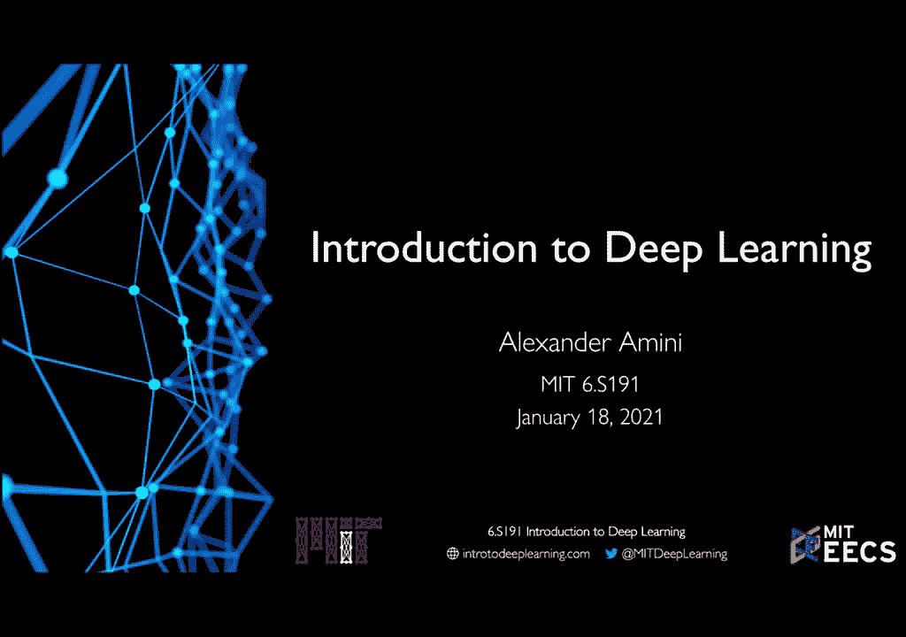

大家好，欢迎来到麻省理工学院，深度学习官方入门课程，在麻省理工学院任教深度学习正在彻底改变许多事情，从机器人技术到医学以及两者之间的一切，你会学到这个领域的基础知识，以及如何构建这些不可思议的算法。

事实上，这整个演讲和视频都不是真的是用深度学习和人工智能制作的，在这个班上，你们将了解到今天与你们谈话是多么的荣幸，我希望你喜欢这门课，所以如果你不知道这实际上不是一个真正的视频或音频。

你实际听到的音频被故意降低了一点，甚至更明显地表明这不是真的，并避免一些潜在的滥用，即使有故意降级的音频，去年课程结束后，这个介绍在网上疯传，我们得到了一些非常棒和有趣的反馈。

老实说，去年之后，当我们做这件事的时候，我以为我们今年很难超越它。

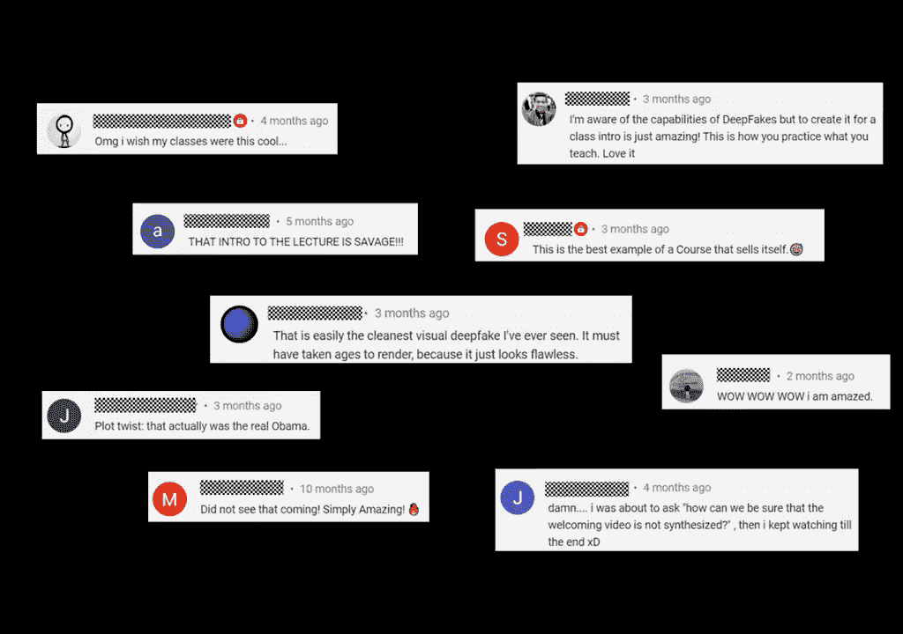

但实际上我错了，因为我喜欢这个领域的一点是，它移动得如此之快，即使在过去的一年里，先进的技术也有了显著的进步，你看到的我们去年使用的视频使用了深度学习，但这不是一个特别容易创作的视频。

它需要奥巴马演讲的完整视频，它用这个智能地将场景的部分缝合在一起，让它看起来和出现，就像他在说话，我说的话，看看这里的幕后，现在你可以看到和我声音相同的视频，大家好，欢迎来到麻省理工学院六一，九十一。

深度学习官方入门课程，在麻省理工学院任教，现在实际上可以只使用一个静态图像，不是完整的视频来实现完全相同的事情，现在你可以看到八个奥巴马的例子，现在只使用一个静态图像创建，不再有完整的动态视频。

但我们现在可以用深度学习实现同样不可思议的真实感和结果，当然啦，没有什么能把我们限制在一个人身上，这个方法推广到不同的脸，再也没有什么能把我们限制在人类身上了，或者算法以前见过的个人嗨，大家好。

欢迎来到麻省理工学院六一，九十一，麻省理工学院教授的深度学习官方入门课程，生成这些类型的动态和移动视频的能力，从一个单一的图像对我来说是非凡的，这证明了深度学习在这门课上的真正力量。

你实际上不仅会了解这项技术的技术基础，但也有一些非常重要和非常重要的，这项工作的伦理和社会影响，我希望这是一个让你对这门课感到兴奋的好方法，六是一，九十一，让我们开始吧。

我们可以从后退一步开始问自己什么是深度学习，在智能背景下定义深度学习，智力实际上是处理信息的能力，以便它可以用来为未来的决定提供信息，现在，人工智能领域实际上是一门专注于构建算法的科学，要做到这一点。

建立处理信息的算法，这样它们就可以为未来的预测提供信息，现在，机器学习，你可以把这看作是AI的一个子集，它实际上专注于教一个算法从经验中学习，而不是被明确地编程，现在深度学习将这一想法更进一步。

它是机器学习的一个子集，专注于使用神经网络，自动提取原始数据中的有用模式，然后使用这些模式或特征来学习执行这项任务，这正是这门课的内容，这门课是关于教授算法的，如何直接从原始数据中学习任务。

我们想为您提供一个坚实的基础，技术上和实践上，在引擎盖下让你明白，这些算法是如何构建的，它们是如何学习的。

所以这门课分为技术讲座和项目软件实验室，我们将从今天开始用神经网络来覆盖基础，这些都是我们在本课程中所看到的一切的基石，今年我们还有两个全新的非常激动人心的热门话题讲座，关注不确定性和概率深度学习。

以及算法偏见和公平性，最后，我们将以一些非常激动人心的客座讲座和学生项目演示来结束，作为最终项目竞赛的一部分，你们所有人现在都有资格赢得一些非常激动人心的奖品。

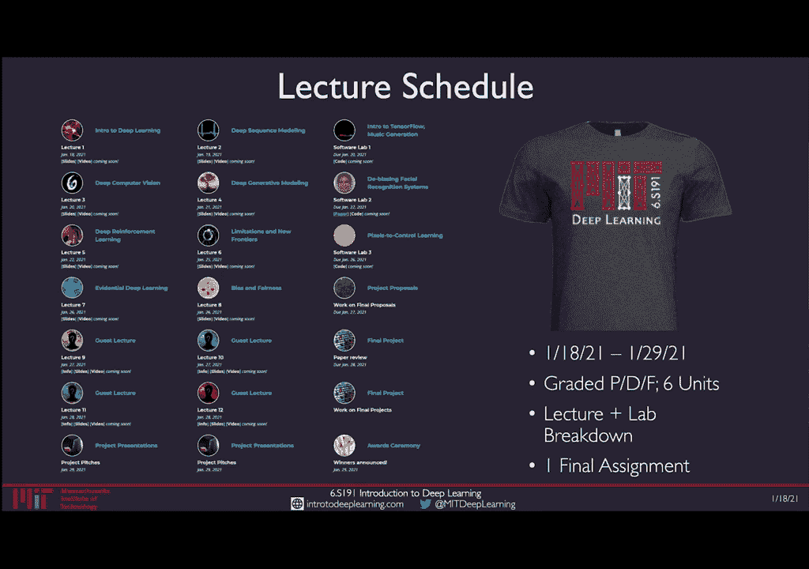

一点物流，在我们深入到讲座的技术方面之前，对于那些为了学分而选修这门课的人，您将有两个选择来满足您的信用要求，第一个选择是在最多四个人的团队中工作，或者单独开发一个很酷的新深度学习想法，现在。

这样做将使你有资格赢得一些你可以看到的奖品，在右手边，我们意识到在这堂课的背景下，也就是两个星期，那是极短的时间，提出一个令人印象深刻的项目或研究想法，所以说，我们不会根据这个想法的新颖性来评判你。

而是，我们不会根据这个想法的结果来评判你，而是这个想法的新奇，你的思维过程，这个想法有多大的影响力，但不是结果本身，在上课的最后一天，你要给评委们做一个三分钟的演讲，然后谁会给获胜者颁奖，现在又是奖品。

三分钟来展示你的想法和项目是非常短的，但我相信展示和传达你的想法是一门艺术，在这么短的时间内简明扼要地，所以我们会严格要求你，到那个严格的最后期限。

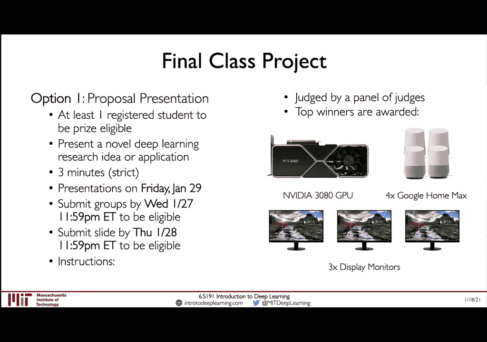

满足分数要求的第二个选择是写一页纸的复习，在这里的一篇深度学习论文上，等级是基于，更多关于主要思想的写作清晰和技术交流，这将在星期四到期，上课的最后一个星期四，你可以选择任何你想要的深度学习论文。

如果你想要一些指针，我们提供了一些指导性文件。

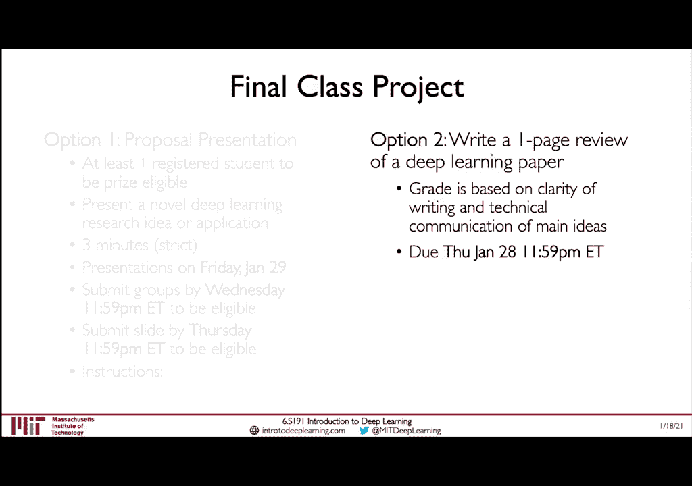

可以帮助你开始，如果你想用其中一个做你的评论，除了最终的项目奖，今年我们还将颁发三项实验室奖，一个与每个软件实验室相关联的，学生们将再次完成，本课程成绩不要求完成软件实验室。

但它会让你有资格享受这些很酷的价格，所以请，我们鼓励每个人竞争这些奖项，并有机会赢得所有奖项。

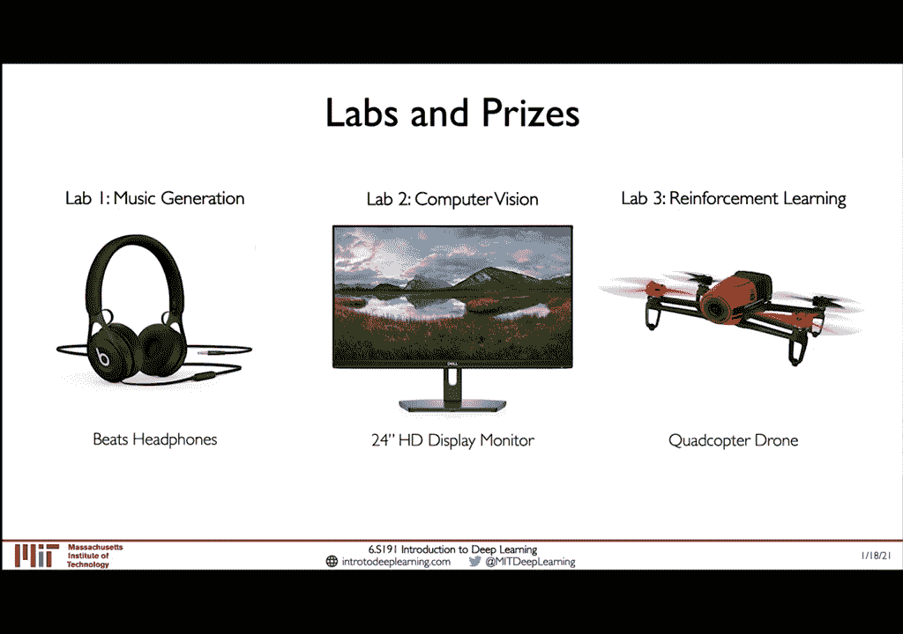

如果你有任何问题，请贴一个广场，浏览课程网页，查阅讲座的公告及数码录音，等，如果您有任何问题，请发电子邮件给我们，还有软件实验室和办公时间，就在聚集镇举行的每一次技术讲座之后，所以如果你有什么问题。

关于软件实验室，特别是那些，或者更一般地说，关于过去的软件实验室。

或者关于那天发生的讲座，现在这支队伍，所有这些课程，有一群不可思议的助教和助教，你可以随时联系到，以防你对你正在学习的材料有任何问题或疑问。

最后我们要感谢所有的赞助商，没有他们的帮助，这个类是不可能的，今年是我们教这门课的第四年，一年比一年大，我们真的向我们的赞助商大喊一声，帮助我们每年都做到这一点，尤其是今年，考虑到虚拟形式。

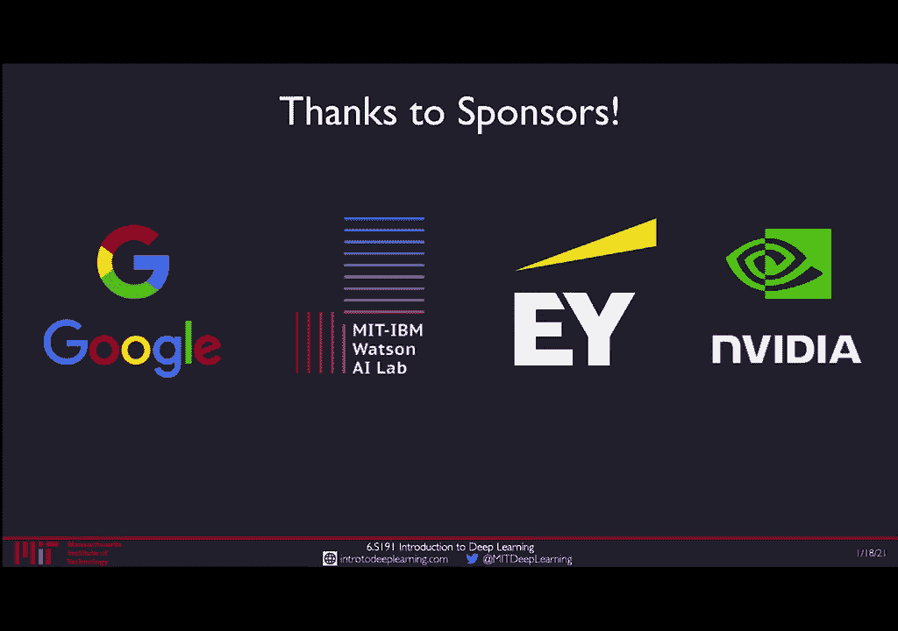

所以现在让我们从有趣的东西开始，让我们先问自己一个问题：为什么，为什么我们都关心深度学习，具体来说，我们现在为什么要关心。

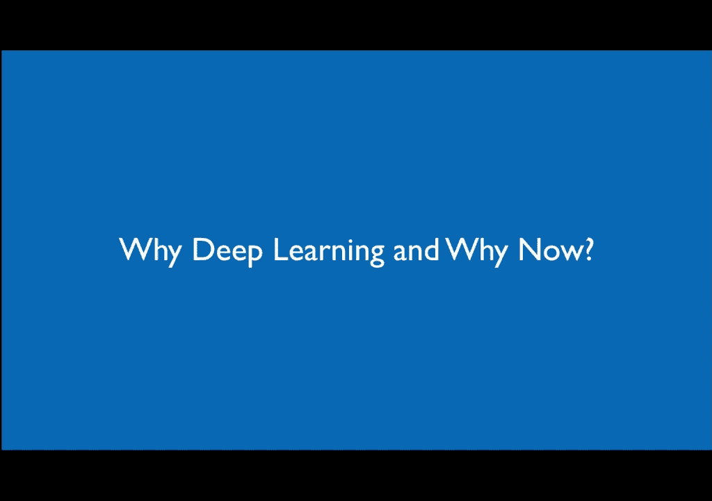

要明白首先真正理解是很重要的，为什么是深度学习或者深度学习是如何的，不同于传统的机器学习，现在传统的机器学习算法在他们的数据中定义了一组特征，通常这些功能是手工制作或手工设计的，结果。

它们在实践中往往很脆，当他们被部署时，深度学习的关键思想是直接从数据中学习这些特征，以等级的方式，那就是我们能不能学，如果我们想学习如何检测人脸，比如说，我们能学会首先从检测图像中的边缘开始吗。

将这些边缘组合在一起以检测中层特征，例如眼睛、鼻子或嘴巴，然后更深入地将这些特征组合成结构性的面部特征，这样我们就能认出这张脸，这是这种分层的思维方式是深度学习的核心。

作为我们在这门课上学到的一切的核心。

实际上是基本的构建块，尽管深度学习和神经网络实际上已经存在了几十年，所以一个有趣的问题是我们为什么要研究这个，现在是研究这些算法的绝佳时机，原因之一是数据变得更加普遍，这些模型非常渴望数据，而此刻。

我们生活在一个比以往任何时候都拥有更多数据的时代，其次，这些算法是大规模并行化的，所以他们可以从根本不存在的现代GPU硬件中受益匪浅，当这些算法被开发出来的时候，最后。

由于像TensorFlow这样的开源工具箱的构建和部署，这些模型变得极其流线型。

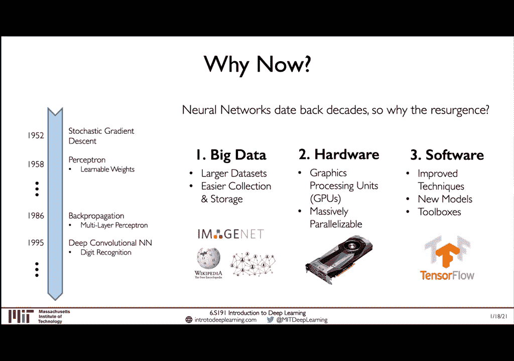

所以让我们从深度学习的基本组成部分开始，每一个神经网络都只是一个神经元，也称为感知器，所以我们要走过感知器到底是什么，它是如何定义的，我们将建立更深入的神经网络，从那里一路走来，所以让我们开始吧。

我们真的在基本的积木上。

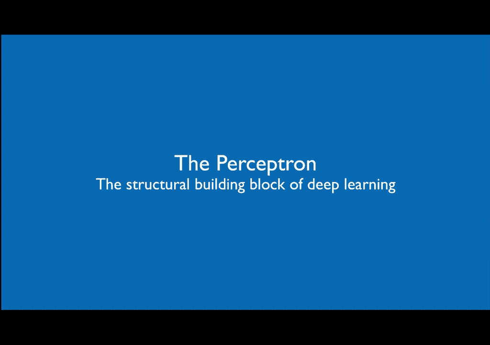

感知器或单个神经元的概念实际上非常简单，所以我认为对你们所有人来说，理解这一点的核心是非常重要的，让我们从实际讨论信息的正向传播开始，通过这个单一的神经元，你可以在左手边看到。

这些输入中的每一个或这些数字中的每一个都乘以它们相应的权重，然后加在一起，我们得到这个单一的数字，加法的结果，并通过所谓的非线性激活函数，产生我们的最终输出y，我们实际上可以--这并不完全正确，因为。

有一件事我忘了提，我们在这里也有所谓的偏见项，它允许你现在向左或向右移动激活功能，在这个图的右手边，你可以看到这个概念在数学上被说明或写成一个单一的方程，你实际上可以用线性代数重写这个。

矩阵乘法和点积来更简洁地表示这一点，所以我们就这么做吧，让我们现在用x大写x来做，它是我们输入的向量，x 1到xn和大写的w，这是我们的权重向量，w 1到w m，所以每一个都是长度为m的向量。

输出是非常简单的，通过取他们的点积得到的，加上一个偏差，在这种情况下是w零，然后应用非线性g，一件事是我没有--我一直在提这件事，有几次，这个非线性，G到底是什么，因为我已经提到过几次了，嗯。

它是一个非线性函数，这种非线性激活函数的一个常见例子，就是右边定义的乙状结肠函数，事实上，非线性函数有很多种类型，你可以在这里看到另外三个例子，包括乙状结肠函数，在整个演示文稿中。

您将看到这些TensorFlow代码块，这将实际说明如何，我们可以把我们在这节课里学的一些主题，并使用TensorFlow软件库实际使用它们，现在我在上一张幻灯片上展示的乙状结肠激活函数，非常受欢迎。

因为它是一个给出输出的函数，它作为输入，任意实数，任何激活值，它输出一个总是在零到一之间的数字，所以这使得它非常非常适合于问题和概率，因为概率也必须在零到一之间，所以这让他们很好。

适合于现代深度神经网络中的那些类型的问题，RELU激活功能，你可以在右边看到，也因为它的简单而非常受欢迎，在这种情况下，它是一个分段线性函数，当它是，呃，在消极制度中，严格地说，它是正政权中的恒等函数。

但有一个非常重要的问题，我希望你们现在正在问自己，为什么我们甚至需要激活函数，我想在整个课程中，我确实想说，无论我在课程中说什么，我希望你总是在问为什么，这是必要的一步。

为什么我们需要这些步骤中的每一个，因为通常这些问题可以导致真正惊人的研究突破，那么为什么我们需要激活函数，现在激活函数的重点是在我们的网络中引入非线性，因为这些是非线性函数。

它允许我们实际处理非线性数据，这在现实生活中是极其重要的，尤其是因为在现实世界中，数据几乎总是非线性的，想象一下我告诉过你在这里分开，从红色点开始的绿色点，但你只能用一条直线。

你可能会认为多条线或曲线很容易，但是你只能用一条直线，这就是使用具有线性激活函数的神经网络的效果，这让问题变得非常困难因为无论神经网络有多深，您只能产生一个单行决策边界，你现在只能用一条线分隔你的空间。

使用非，线性激活函数允许神经网络逼近任意复杂的函数，这就是神经网络异常强大的原因。

让我们用一个简单的例子来理解这一点，这样我们就可以建立我们的直觉，甚至更远，想象一下，我现在给你这个训练有素的网络，左手上有重物，第3面和第2面，这个网络只有两个输入，x1和x2。

如果我们想得到它的输出，我们只是做我之前说过的同样的故事，首先取我们输入的点积，用我们的体重，添加偏差并应用非线性，但让我们来看看这个非线性的内部是什么，它只是我们的输入和，以二维线的形式。

因为在这种情况下，我们只有两个输入，所以如果我们要计算这个输出，故事和以前一样，我们取x和w的点积，我们添加我们的偏差并应用我们的非线性，那么这个非线性的内部是什么呢，好吧，这只是一条两行，事实上。

因为它只是一条二维线，我们甚至可以在二维空间中绘制它，这被称为特征空间，输入空间--在这种情况下，输入空间中的特征空间是相等的，因为我们只有一个神经元，所以在这个情节中，让我描述一下你所看到的。

所以在两个轴上，你可以看到我们的两个输入，所以在一个轴上是x 1，另一个轴上的一个输入是x2，我们的其他输入，我们可以在这里画一条线，我们训练的神经网络的决策边界，我在这个空间里给你的一条线。

现在这条线实际上对应于这个神经网络可以做出的所有决定，因为如果我给你一个新的数据点，例如这里我给你负一二，这个点在这个空间的某个地方，特别是在x 1等于负1时，x2等于2，那只是空间中的一个点。

我要你计算它的加权组合，我可以按照感知器方程得到答案，所以这里我们可以看到，如果我们把它插入感知器方程，我们得到1+3+4，结果是负6，我们把它插入非线性激活函数，我们得到的最终输出是零点，零零二现在。

事实上，记住乙状结肠函数实际上把空间分成了，要么，因为它输出零到一之间的所有东西，它在点五的一个点之间分割，大于零点五小于零点五，当输入小于零且大于点5时，那是输入为正的时候，我们实际上可以说明空间。

但是当我们处理一个小维数据时，这个特征空间，就像在这种情况下，我们只有二维，但很快我们就会开始谈论我们有成千上万或数百万人的问题，或者在某些情况下，这些是我们神经网络中数十亿个输入的权重。

然后画这些类型的情节变得极具挑战性，不再是真正可能的了，但至少，当我们在这种输入数量很少的情况下，和少量的重量，我们可以制作这些情节来真正理解整个空间，对于我们获得的任何新输入，比如说，输入，就在这里。

我们可以确切地看到这个，一个点的激活函数小于零，它的产量会不到五个，它的大小实际上是计算出来的，通过将其插入感知器方程，所以我们无法避免，但我们可以立即在决策边界上得到答案。

取决于我们位于超平面的哪一边。

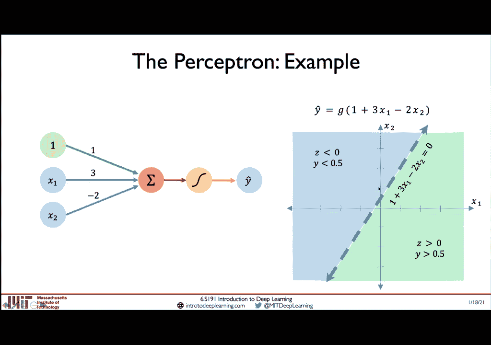

当我们把它插进去的时候，所以现在我们有了如何建立感知器的想法，让我们从建立神经网络开始，看看它们是如何结合在一起的。

让我们重温一下我之前给你们看的感知器的图表，如果你从这门课上得到的东西很少，我真的希望每个人都能把感知器的工作原理拿走，有三个步骤，永远记住他们，点积，你可以用你的输入和你的重量的点积，你加上一个偏见。

你应用你的非线性，有三个步骤，让我们把这个图表简化一点，让我们清理一些箭头，去掉偏差，我们现在可以看到这里的每一条线都有自己的相关重量，我会去掉偏见项，就像我说的简单，注意这里的z是点积加上偏差的结果。

在我们应用激活函数之前，虽然g，但最终输出是简单的y，等于Z的激活函数，也就是我们的激活值，如果我们想定义一个多输出神经网络，我们可以简单地在这幅图中添加另一个感知器，所以没有一个感知器。

现在我们有两个感知器和两个输出，每一个都是正常的感知器，就像我们在从每个X中获取输入之前看到的那样，i x 1到x m取点积，添加偏见，就是这样，现在我们有两个输出，这些感知器中的每一个。

虽然会有一套不同的重量，记住我们会回来的，如果我们想要，所以说，实际上这里要记住的一件事是，因为所有的输入都是紧密相连的，每个输入都与每个感知器的权重有联系，这些通常被称为致密层或有时完全连接层。

现在我们上完这堂课了，你会得到很多实际编码的经验，并使用一个名为TensorFlow的软件工具箱实际创建了其中的一些算法，所以现在我们已经了解了单个感知器是如何工作的，以及致密层是如何工作的。

这是一堆感知器。

让我们试着看看我们如何真正建立一个像这样的致密层，从零开始做那件事，我们实际上可以从初始化我们致密层的两个组件开始，就是权重和偏差，现在我们有了稠密层神经网络的这两个参数。

我们实际上可以定义信息的前向传播，就像我们已经看到并了解到的那样，信息的前向传播只是点积，或者我们的输入与我们的权重的矩阵乘法，在一个偏差，给我们这里的激活函数，然后我们应用这个非线性来计算输出。

现在TensorFlow实际上已经为我们实现了这个致密层，所以我们不需要从头开始，相反，我们可以像这里所示的那样称之为，所以要创建一个有两个输出的密集层，我们可以指定这个单位等于2。

现在，让我们来看看所谓的单层神经网络，这是一个我们在输入和输出之间有一个单独的隐藏层，这一层被称为隐藏层，因为，不像输入层和输出层，这个隐藏层的状态通常是不可观察的，它们在某种程度上是隐藏的。

他们也没有严格执行，既然我们现在有了这种转变，从输入层到隐藏层，从隐藏层到输出层，每一层都有自己指定的权重矩阵，我们称W为第一层的权重矩阵，第二层的权重矩阵，如果我们放大这个隐藏层中的一个神经元。

让我们采取，比如说，z 2，比如说，这是我们以前看到的完全相同的感知器，我们可以再次计算它的输出，用完全相同的故事，获取它的所有输入x 1到xm，应用权重增加偏差的点积，这就给了我们z 2。

如果我们观察不同的神经元，让我们假设z 3，我们在这里得到一个不同的值，因为通向Z3的重量可能和通向Z2的重量不同，现在这张照片看起来有点乱，所以让我们试着把事情清理得更干净一点，从现在开始。

我就用这个符号来表示我们所说的致密层，或完全连接的层，在这里你可以看到一个例子，我们如何创建这个精确的神经网络，再次，使用带有预定义稠密层表示法的张量流，这里我们创建了一个顺序模型。

在那里我们可以把层叠在一起，第一层有N个神经元，第二层有两个神经元，输出层。

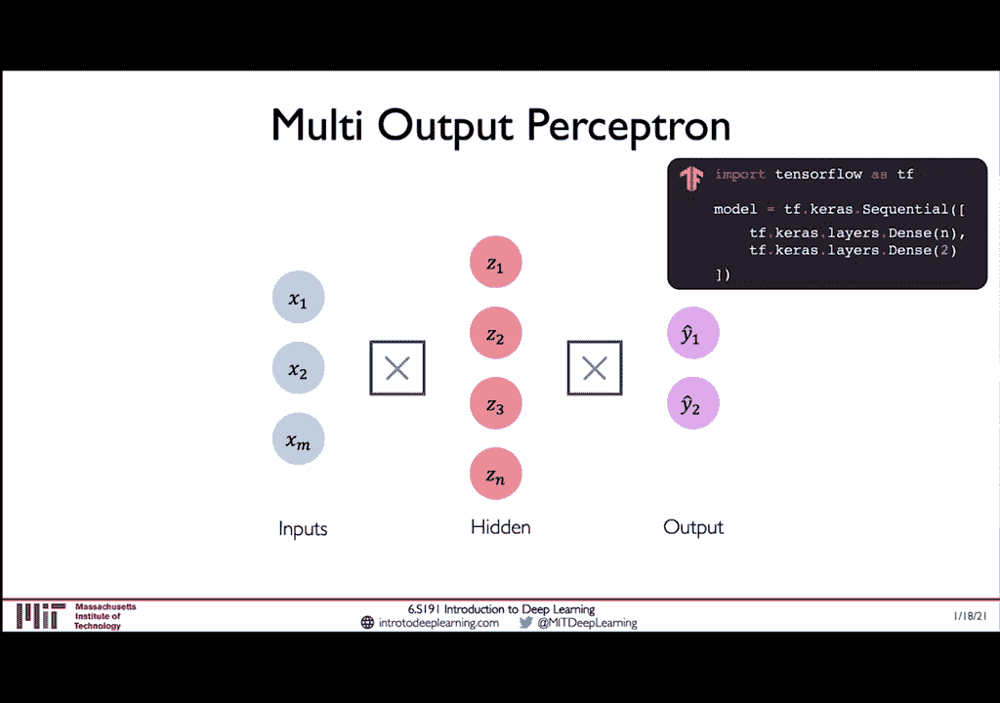

如果我们想创建一个深度神经网络，我们要做的就是不断地把这些层，创建越来越多的分层模型，一个，在那里，最终输出是通过越来越深入网络来计算的。

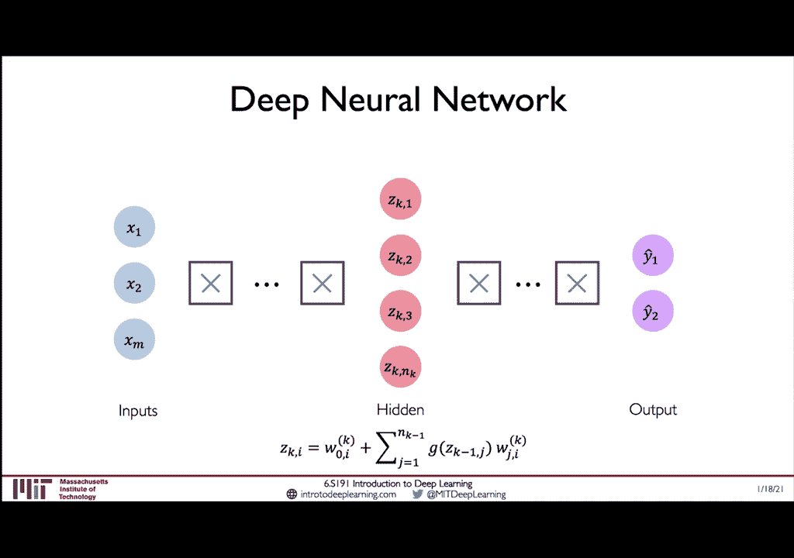

并再次在TensorFlow中实现这一点，和我们以前看到的很相似，使用TF Keras顺序调用，我们可以把这些密集的层堆叠在一起，每一个都由密集层N、1和2中的神经元数量指定。

但是最后一个输出层固定为两个输出。

如果这是我们有多少输出，好的，所以这太棒了，现在，我们有一个想法，不仅是如何直接从感知器建立神经网络，但是如何将它们组合在一起形成复杂的深度神经网络，让我们来看看如何将它们应用于一个非常真实的问题。

我相信你们所有人都应该非常关心。

这里有一个问题，我们想建立一个人工智能系统来学习回答，我会通过这门课吗？我们可以从一个简单的两个特征模型开始，一个特征，假设你在这门课上参加的讲座数，第二个特征是你花在最后一个项目上的小时数。

你确实有一些来自1991年所有过去参与者的训练数据，我们可以像这样在这个特征空间上绘制这些数据，这里的绿色点实际上表示学生，所以每一分是一个通过这门课的学生，这门课不及格，你可以看到他们的。

他们在这个特征空间中的位置，取决于他们听课的实际小时数，他们参加的讲座次数，以及他们在最终项目上花费的小时数，然后你花了，你已经听了四堂课了，你在最后一个项目上花了五个小时，你想明白，呃，你会不会。

或者你如何建立一个神经网络，考虑到班上的其他人，你会及格还是不及格？呃，这个类基于您看到的训练数据，所以让我们做吧，我们现在有了这样做的所有要求，所以让我们建立一个有两个输入的神经网络，x 1和x 2。

其中x 1是我们参加的讲座数，x2是你花在最后一个项目上的小时数，我们会有一个隐藏层，有三个单元，我们将把这些输入到最终的概率输出中，通过这个类，我们可以看到我们通过的概率是零点，百分之一或百分之十。

那不是很好，但原因是因为这个模型，呃，从来没有真正训练过，它基本上只是一个婴儿，它从来没有看到任何数据，即使你已经看到了数据，它没有看到任何数据，更重要的是，你还没有告诉模型如何解释这些数据。

它需要了解这个问题，首先，它对这门课或期末项目一无所知，或者任何一个，所以要做的最重要的事情之一是你必须告诉模型，当它能够，当它做出糟糕的预测时，为了让它能够纠正自己。

现在神经网络的丢失实际上定义了这一点，它定义了一个预测有多错误，所以它作为输入，预测输出和地面真相输出现在，如果这两件事相距很远，那损失就非常大了，另一方面，这两个东西离得越近，损失越小，损失越准确。

模型将是，所以我们总是想把我们想要招致的损失降到最低，我们想预测一些尽可能接近地面真相的东西，现在让我们假设我们不仅仅有一个学生的数据，但正如我们在这个案例中所看到的，来自许多学生的数据。

我们现在关心的不仅仅是模型在预测，只有一个预测，但它在所有这些学生中的平均表现如何，这就是我们所说的经验损失，它只是每个例子中每一次损失的平均值或平均值，或者每个学生，训练神经网络时。

我们想找到一个网络，最大限度地减少经验损失，在我们的预测和真实输出之间。

现在如果我们看看二进制分类的问题，其中神经网络，就像我们在这种情况下想做的那样，应该回答是或否或零，我们可以使用所谓的软最大交叉熵损失，现在Softmax交叉熵损失实际上是建立的，实际上写在这里。

它的定义是，两个概率分布之间的交叉熵，它测量地面真相概率分布与预测概率分布的距离，让我们假设不是预测二进制输出，我能通过这门课吗？否则我不会通过这门课，相反，你想用实数来预测期末成绩，不是概率或百分比。

我们想要你现在在这门课上的成绩，在本例中，因为输出的类型不同，我们还需要在这里用一个不同的损失，因为我们的输出不再是零一，但它们可以是任何实数，它们只是你最后一堂课的成绩，例如，因为这是一个连续变量。

我们要使用的等级，所谓的均方误差，这只测量误差的平方，我们的基本事实和我们的预测之间的平方差。

在整个数据集中平均，好的很好，所以现在我们看到了两个损失函数，一种用于二进制输出和回归连续输出的分类，现在的问题是我认为我们需要开始问自己，我们如何取损失函数，我们已经看到了我们的损失函数。

我们已经看到了我们的网络，现在我们必须真正理解，我们怎么能把这两件事放在一起，我们如何使用损失函数来训练神经网络的权重。

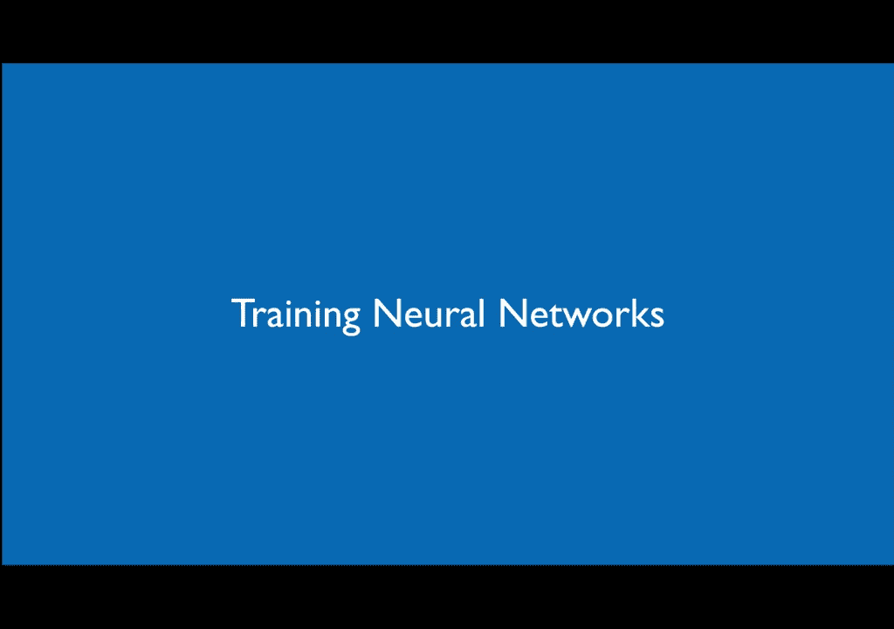

这样它就可以学习这个问题，嗯，我们要做的是找到神经网络的权重，这将最大限度地减少我们数据集的丢失，这本质上意味着我们想在神经网络中找到W，使w的j最小化，w的j是我们在前面的幻灯片中看到的经验成本函数。

数据集中每个数据点的平均损失，现在记住，w大写w只是神经网络中所有权重的集合，不仅仅是一层，但从每一层，所以w为零，从零层到第一层再到第二层，都串联成一个，在这个优化问题中，我们想优化所有的W。

以最大限度地减少这种经验损失，现在记住我们的损失函数只是我们体重的一个简单函数，如果我们只有两个砝码，我们实际上可以在这个重量网格上绘制整个丢失的景观，所以在底部的一个轴上你可以看到重量1。

另一个你可以看到重量为零，这个神经网络中只有两个权重，非常简单的神经网络，所以我们可以为每一个w 0和w 1绘制，损失是什么，我们期望看到和获得的错误是什么，从这个神经网络，现在训练神经网络的整个过程。

优化它就是在这片失落的风景中找到最低点，它会告诉我们最优的W0和W1，我们怎么能做到呢，我们要做的第一件事就是选择一个点，所以让我们从这个点开始选择任意的w零w一，我们可以计算出那个点的景观梯度。

现在梯度告诉我们最高或最陡的上升方向，好的，所以这告诉我们哪条路是向上的，好的，如果我们计算我们的损失相对于我们的重量的梯度，这是损失梯度的导数，关于重量，它告诉我们在这片失落的土地上哪条路的方向。

从我们现在所处的位置，而不是往上走，虽然我们想找到损失最小的，所以让我们取梯度的负值，朝着那个方向迈出一小步，好的，这会让我们更接近最低点，我们只是不停地重复这个，现在我们计算这个点的梯度。

重复这个过程，直到我们收敛，我们将收敛到局部最小值，我们不知道它是否会收敛到全局最小值，但至少我们知道它应该，理论上收敛到局部极小值，现在我们可以将这个算法总结如下，这种算法也称为梯度下降。

所以我们从随机初始化所有的权重开始，我们开始，我们循环，直到收敛，我们从其中一个重量开始，我们的出发点，我们计算梯度，告诉我们哪条路是向上的，所以我们向相反的方向迈出了一步，我们在这里迈出一小步。

Small是通过将我们的梯度乘以这个来计算的，我们稍后会更多地了解这个因素，这个因素被称为学习率。

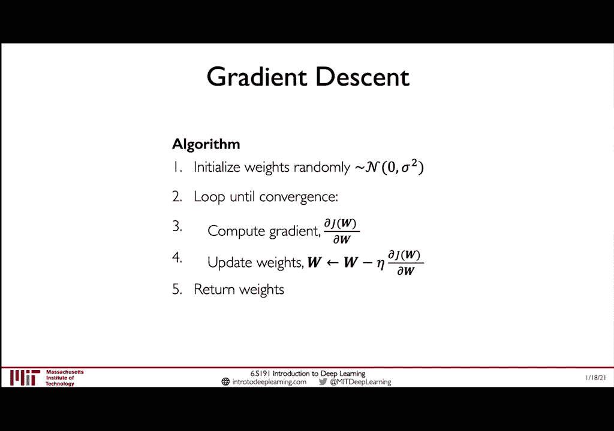

我们稍后会了解更多，现在又在张量流中，我们实际上可以看到梯度下降算法的伪码是用代码写出来的，我们可以随机化所有的权重，这样基本上就可以初始化我们的搜索，我们在空间的某个点的优化过程。

然后我们一遍又一遍地循环，我们计算损失，我们计算梯度，我们向梯度的方向迈出一小步，但是现在让我们来看看这个术语，这就是我们计算梯度的方法，这解释了损失是如何随着体重的变化而变化的。

但我从来没有告诉过你我们是如何计算的，那么让我们来谈谈这个过程，这在训练神经网络方面非常重要。

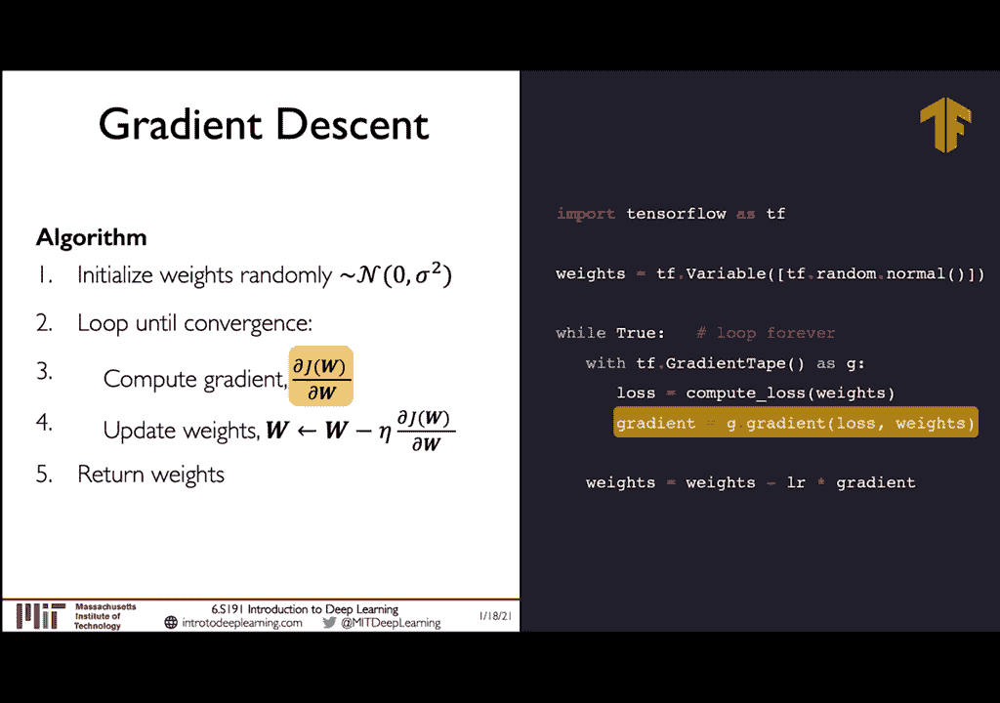

它被称为反向传播，那么反向传播是如何工作的呢，我们如何计算这个梯度，让我们从一个非常简单的神经网络开始，这可能是现存最简单的神经网络，它只有一个输入，一个隐藏神经元和一个输出。

计算W的损失j相对于其中一个权重的梯度，在这种情况下只有两个，比如说，告诉我们W2的一个小变化会对我们的损失产生多大影响，所以如果我们绕着无穷小的，那对我们的损失有什么影响，这就是梯度会告诉我们的。

w 2的j的导数，所以如果我们写出这个导数，我们可以应用链式法则来计算它，那么具体是什么样子的呢，我们可以把那个导数分解成，j的导数说呃，dw/d y乘以输出对w 2的导数，现在的问题是第二部分。

如果我们现在要计算，不是W 2损失的导数，但现在关于W一个的损失，我们可以做和以前一样的故事，我们现在可以递归地应用链式法则，所以现在我们必须再次将链式法则应用到第二部分，现在第二部分进一步扩展。

所以我们的输出对z 1的导数，它是第一个隐藏单元的激活函数，我们可以反向传播这些信息，现在你可以看到从我们的损失开始，一直到W 2，然后再递归地应用这个链式法则得到w，这让我们可以看到W2和W1的梯度。

所以在这种情况下，我再次重申，这告诉我们这个DJ，dw one，告诉我们体重的一个小变化会如何影响我们的减肥，所以我们可以看看我们是否增加了少量的体重，会增加我们的损失。

这意味着我们会想要减轻体重来减少损失，这就是梯度告诉我们的，为了减小或增加我们的损失函数，我们需要往哪个方向走，我们在这里展示了神经网络中的两个权重，因为我们只有两个砝码。

但是想象一下我们有一个非常深的神经网络，不仅仅是两层或者一层是隐藏的单元，我们可以重复这个，递归应用链式法则的过程，确定模型中的每一种方式需要如何改变以影响损失，但真的，这一切归结为。

只是递归地应用这个链式法则公式，你可以在这里看到。

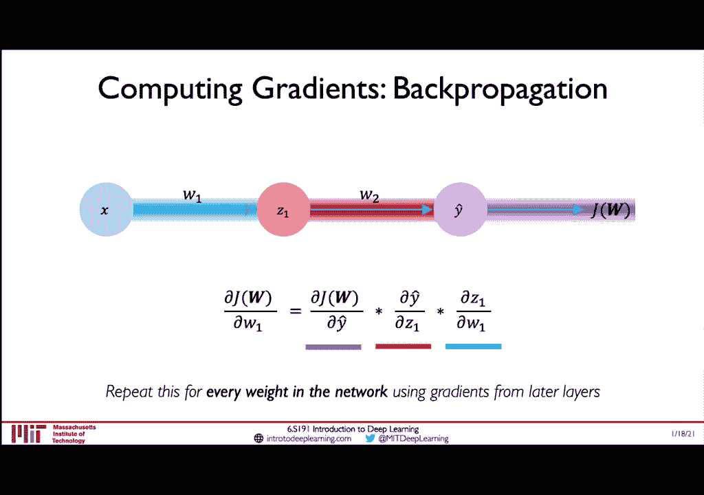

这就是反向传播算法，理论上听起来很简单，它只是对导数和链式法则的一个非常非常基本的扩展，但现在让我们来谈谈在实践中训练这些网络的一些见解，这使得这个过程在实践中变得更加复杂。

为什么像我们看到的那样使用反向传播现在并不总是那么容易。

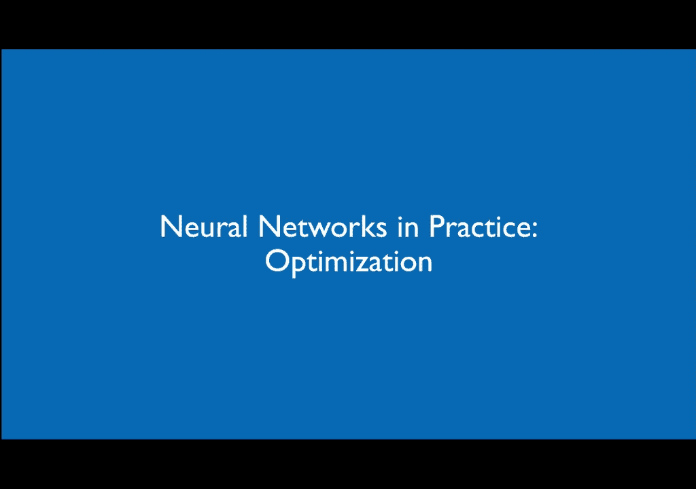

在实践中，训练神经网络和优化网络可能是极其困难的，它实际上是极其密集的计算，这是什么的可视化，真实神经网络丢失的景观看起来像是在二维上可视化的，现在你可以看到这里的损失是极其非凸的，意思是它有很多。

许多局部最小值，这使得使用梯度下降这样的算法非常非常具有挑战性，因为梯度下降总是最接近第一个局部最小值，但它总是会卡在那里，所以找到如何到达全局最小值，或者是神经网络的一个很好的解决方案。

通常对你的超参数非常敏感，比如优化器在这个丢失的景观中从哪里开始，如果它从潜在的糟糕的地方开始，它很容易卡在这些局部最小值中。

现在回想一下我们谈到的梯度下降方程，这是我给你看的下一次体重更新的方程，将是你目前的体重，减去少量，称为学习速率乘以梯度，所以我们有这个负号，因为我们想反其道而行之，我们把它乘以梯度。

或者我们乘以这个小数字，这里叫埃塔，这就是我们所说的学习率，我们想多快学习，现在，它实际上不仅决定了学习的速度，这可能不是最好的说法，但它告诉我们有多大，我们应该在实践中采取的每一步，关于那个梯度。

所以梯度告诉我们方向，但它不一定告诉我们方向的大小，所以ADA可以告诉我们我们想要信任这个梯度的程度，沿着坡度的方向走，在实践设置中，甚至ETA这一个参数，一个数字可能非常困难。

我想给你们一个快速的例子来说明为什么，所以如果你有一个非常不凸起或丢失的景观，你有局部最小值，如果你把学习速度设置得太低，那么模型就会陷入这些局部极小值，它永远也逃不过他们。

因为它得到了它实际上优化了自己，但它将其优化到一个非常，到非最优最小值，它也可以非常缓慢地收敛，另一方面，如果我们把学习速度提高得太多，然后我们实际上可以超调我们的最小值，实际上分道扬镳，失去控制，和。

基本上，呃，彻底引爆训练过程，其中一个挑战实际上是如何预，如何使用足够大的稳定学习速率来避免局部最小值，但足够小，这样它们就不会发散和转换，或者它们没有完全分开，所以它们足够小。

实际上可以汇聚到那个全局点，一旦他们到达那里，那么我们如何才能很好地设置这个学习速率呢，一个选项，这实际上是一个在实践中有点流行的，就是尝试很多不同的学习速度，这实际上是有效的，这是一个可行的方法。

但让我们看看，如果我们能做一些比这更聪明的事情，如果我们能说，而是，我们如何建立一个自适应的学习率，实际上着眼于它失去的景观，并适应它在景观中看到的东西，实际上有许多类型的优化器可以做到这一点。

这意味着学习率不再是固定的，它们可以增加或减少，取决于该位置的梯度有多大，我们想要多快，我们学习的速度有多快，嗯，和许多其他选项，也可以与权重的大小有关，在这一点上，震级，等。

事实上，这些也作为TensorFlow的一部分被广泛探索和发布，在你的实验室里，我们鼓励你们每个人真正尝试这些不同类型的优化器，并试验他们在不同类型问题中的表现。

这样你就可以获得关于何时使用的非常重要的直觉，不同类型的优化器是它们的优势所在，在某些应用中也有缺点。

所以让我们试着把所有这些放在一起，所以在这里我们可以看到使用TensorFlow定义模型的完整循环，在第一线，在这里定义优化器，您可以在这里用您想要的任何优化器替换它，我只是使用随机梯度下降。

就像我们之前看到的，并通过模型给它喂食，我们永远循环，我们这样做是向前的，预测，我们用我们的模型预测，我们用我们的预测来计算损失，这正是损失再次告诉我们的，我们对地面的预测有多不正确，真理y。

我们计算我们损失的梯度，关于我们神经网络中的每个权重，最后我们应用这些渐变，使用我们的优化器来步进和更新我们的权重，这真的是把我们在课堂上学到的所有东西都带到了课堂上，并将其应用于一个整体。

用Tensorflow编写的一段代码。

所以我想继续这个谈话，谈谈在实践中训练这些网络的技巧，现在，我们可以专注于这个非常强大的想法，将您的数据批处理成迷你批处理。

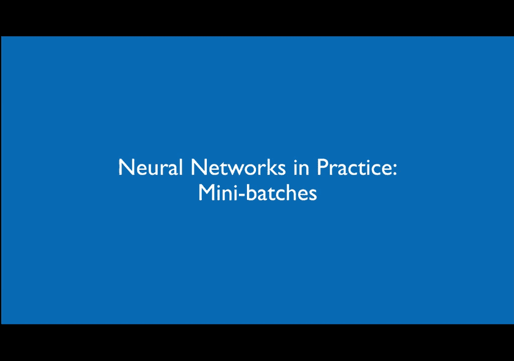

所以在我们看到梯度下降之前，我们有以下算法，我们看到要计算的梯度，使用反向传播实际上是非常密集的计算，尤其是如果它是在你的整个训练集上计算的，所以这是整个数据集中每个数据点的总和。

在大多数现实生活中的应用中，在每一次迭代中计算这个是不可行的，在优化循环中，或者，让我们考虑这种算法的另一种变体，称为随机梯度下降，所以不是计算整个数据集的梯度，我们就挑一个点。

计算该单点相对于权重的梯度，然后根据梯度更新我们所有的权重，所以这个有一些优点，这很容易计算，因为它现在只使用一个数据点，速度很快，但它也很嘈杂，因为它只来自一个数据点，取而代之的是，有一个中间立场。

而不是计算单点的噪声梯度，让我们更好地估计一下梯度，通过使用一批B数据点，所以现在让我们选择一批B数据点，我们将计算梯度估计估计，就像这一批的平均值一样，因为这里的b通常没有那么大。

在几十或几百个样品的顺序上，这比常规梯度下降计算速度快得多，而且它也准确得多，然后是只使用单个示例的纯随机梯度下降，现在这增加了梯度精度估计，这也让我们可以更顺利地收敛。

这也意味着我们可以更信任我们的梯度，而不是随机的，梯度下降，这样我们实际上也可以提高我们的学习速度，迷你批处理还导致了大规模的可并行计算，我们可以在不同的工人和机器上分开批次。

从而在我们的Gpus上实现更多的并行化和速度提高。

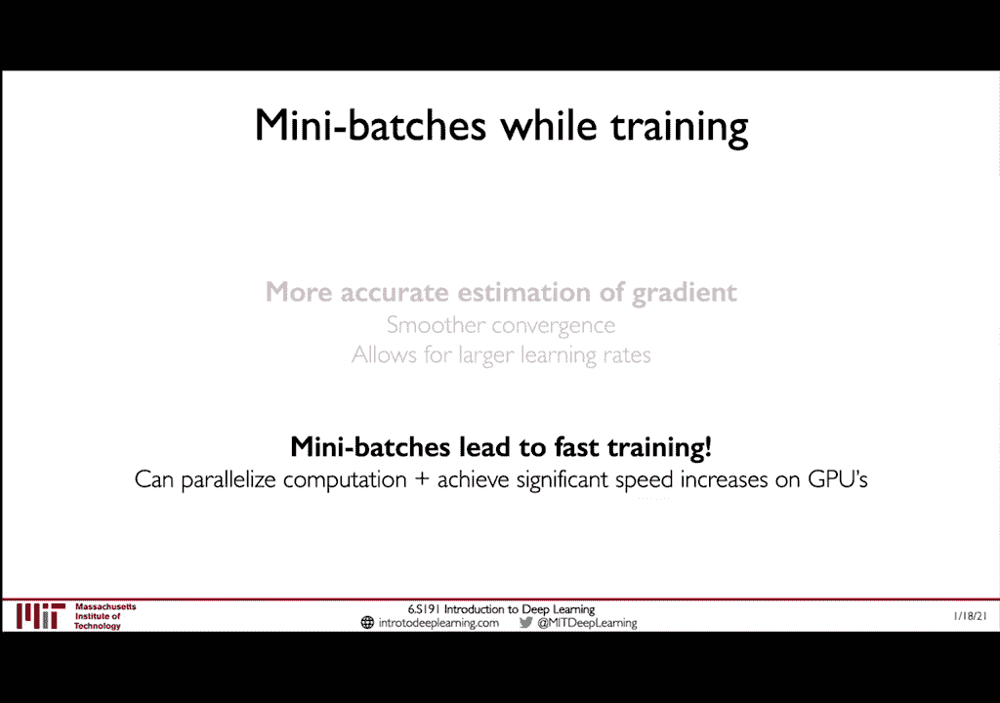

现在我想谈的最后一个话题是过度适应，这也被称为泛化问题，是所有机器学习中最基本的问题之一不仅仅是深度学习。

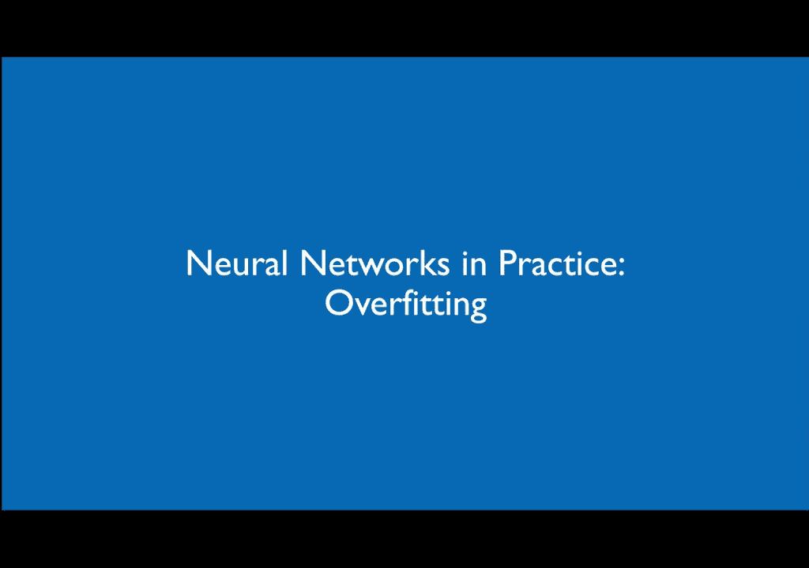

现在就像我说的，过度适应是理解的关键，所以我真的想确保这在每个人的脑海中都是一个明确的概念，理想的机器学习，我们想学习一个准确描述我们测试数据的模型，不是训练数据，尽管我们正在根据训练数据优化这个模型。

我们真正想要的是它在测试数据上表现良好，所以说得不一样，我们希望构建能够从训练数据中学习的表示，但仍然很好地推广到看不见的测试数据，现在假设您想建立一条线来描述这些点。

欠拟合意味着模型根本没有足够的能力来表示这些点，所以不管我们如何努力适应这个模型，它根本没有能力在远处表示这种类型的数据，右手边，我们可以看到极端另一个极端，在这里，模型太复杂了，它的参数太多了。

它不能很好地概括中间的新数据，尽管我们可以看到所谓的理想契合，不是太合适，不是不合身，但它有中等数量的参数，它能够以可推广的方式适应输出，当它在测试时看到全新的数据时，它能够很好地概括为全新的数据。

现在来解决这个问题，让我们来谈谈正规化，我们怎样才能确保我们的模特不会过度合身，因为神经网络确实有大量的参数，我们如何对他们实施某种形式的正规化，现在，什么是正则化正则化是一种约束我们优化问题的技术。

这样我们就可以阻止这些复杂的模型被学习和过度适应，所以再一次，我们为什么需要它，我们需要它，这样我们的模型就可以推广到这个看不见的数据集，在神经网络中，我们有许多技术来给模型施加正则化。

一种很常见也很容易理解的技术叫做辍学，这是深度学习中最流行的正则化形式之一，而且很简单，让我们重温这张神经网络的图片，这是一个两层神经网络，两个隐藏层，在培训期间辍学。

我们所做的就是随机地将这里的一些激活设置为零，有一定的概率，所以我们能做的就是，假设我们选择的概率是百分之五十或百分之零点五，我们可以为每个激活随机下降，50%的神经元，这是非常强大的。

因为它降低了我们神经网络的容量，这样他们就必须学会在测试集上表现得更好，因为有时在训练场上，它只是不能依赖其中的一些参数，所以它必须能够适应这种辍学，这也意味着他们更容易训练。

因为至少在每一次前向被动迭代中，我们只训练了百分之五十的重量，只有50%的梯度，这也将我们的梯度计算时间缩短了两倍，因为现在我们只需要计算，在每一次迭代中，我们在上一次迭代中退出了50%的神经元。

但是在下一次迭代中，我们将去掉另一组50%的神经元，一组不同的神经元，这给了网络，它基本上迫使网络学习如何采取不同的途径，去得到它的答案，它不能过于依赖任何一条途径，并过度适应那条道路。

这是一种真正迫使它推广到新数据的方法，我们将要讨论的第二个正则化技术是早期停止的概念，这里的想法是非常基本的，它是它基本上是让我们停止训练一次，我们意识到我们的损失正在增加，或者我们称之为测试集。

所以当我们开始训练的时候，我们都知道过拟合的定义是，当我们的模型在测试集中的性能开始变差时，所以如果我们留出一些训练数据来引用，未引用测试数据，我们可以监控我们的网络是如何根据这些数据学习的。

在它有机会过度适应之前停下来，所以在x轴上，你可以看到训练迭代的数量，在y轴上你可以看到训练后的损失，迭代次数，所以当我们一开始继续训练的时候，两条线继续减少，这正如我们所料，这很好。

因为这意味着我们的模型最终会变得更强，尽管网络的测试损失停滞不前，并开始增加，注意，训练的准确性总是会继续下降，只要网络有记忆数据的能力，这种模式在剩下的训练中继续下去。

所以在这里重点关注这一点是很重要的，这就是我们需要停止训练的地方，在这一点之后，假设我们的测试集是真实测试集的有效表示，模型的精度只会越来越差，所以我们可以在这里停止训练，拿这个模型。

当我们部署到现实世界时，这应该是我们实际使用的模型，任何东西，任何从左手边拍摄的模型都将不适合，它不会利用网络的全部容量，从右手边拿走的任何东西都太合适了，但实际上在测试中表现比它需要的要差。

所以我将结束这堂课，通过总结我们所讨论的三个关键点，到目前为止，我们开始了神经网络的基本构建块，我们学到的感知器是如何将这些感知器堆叠和组合在一起的，形成复杂的分层神经网络。

以及如何用反向传播从数学上优化这些模型，最后，我们讨论了这些模型的实用方面，你会发现今天的实验室很有用，包括适应性学习率，批处理和正规化，感谢你们参加1991年的第一次讲座。

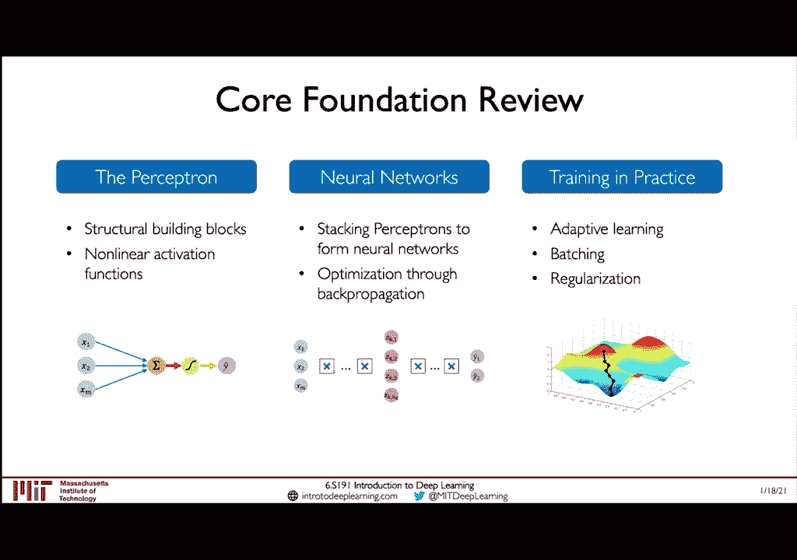