# 【双语字幕】MIT《深度学习导论(6.S191)》课程(2021) - P10：Taming Dataset Bias via Domain Adaptation - 爱可可-爱生活 - BV1jo4y1d7R6

我很高兴今天在这里，和你们谈谈我非常兴奋和感兴趣的事情，因为这是我的研究领域，所以总是很有趣，讲一个关于自己的研究的话题，所以我的话题是驯服数据集，通过领域适应性um和我相信。

您已经在本课程中讨论了一些材料，偏见问题，也许是公平问题，所以这将与那漂亮的东西相吻合，嗯，我想，好吧，嗯，我大概不需要，告诉大家，或花很多时间看如何成功，深度学习已在这里用于各种应用。

我将主要专注于计算机视觉应用，因为那是我的主要研究领域，所以我们知道，在计算机视觉中，深度学习已达到我们可以检测到的程度，在各种场景中非常准确地区分不同的对象。

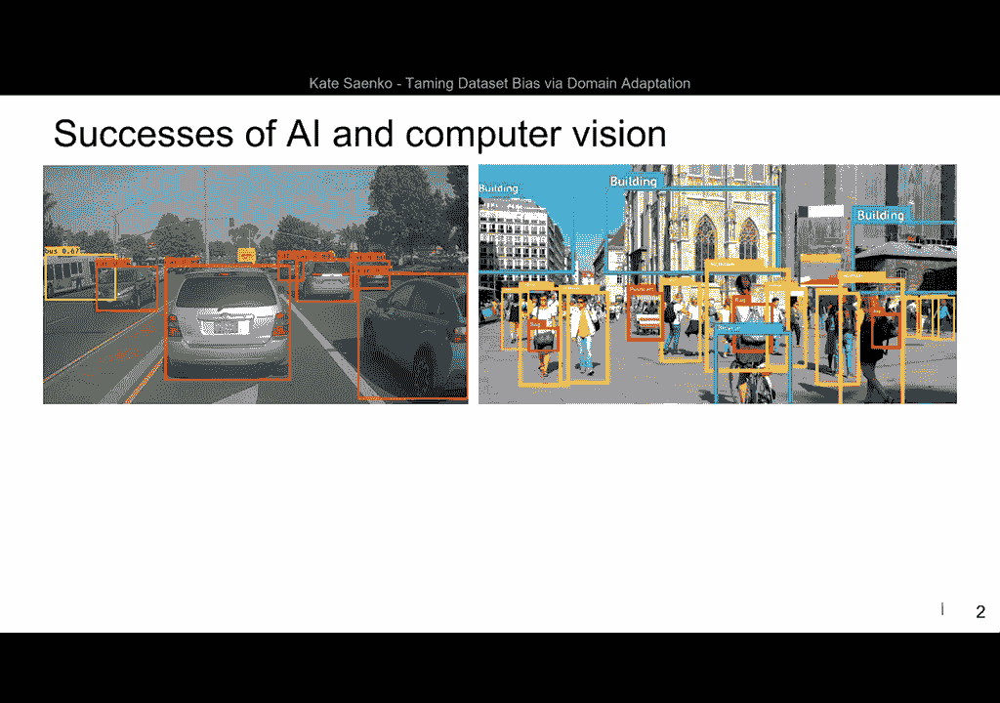

我们甚至可以检测到不是，真正的人，甚至是卡通人物，只要我们接受培训，数据，我们可以训练模型来做到这一点，我们可以做脸，识别和情感识别，所以有很多应用，深度学习非常成功，但也存在一些问题。

它和我想谈的那个，是数据集偏差，所以在数据集偏差中，您会发生什么，您有一些数据集，比如说您正在训练计算机视觉，模型来检测行人，您想将其放在自动驾驶汽车上，嗯，所以你去收集了一些数据。

您用边界框标记了行人，并训练了您的深处，神经网络，并且在您持有的测试集上效果很好，从相同的数据集中提取出来，但是现在，如果您使用相同的模型，在您的车上尝试识别不同环境中的行人，就像在新英格兰。

这是我现在和现在的位置，事实上，如果我看着我的窗户，那正是，好像下雪了，那种穿着厚外套的人，看起来与我的训练数据不同，我会说我是在加利福尼亚收集的，我们看不到很多，如此直观地下雪，我正在。

应该贴上我的模型的标签看起来与我的训练数据完全不同，所以，这就是我们所说的数据集偏移，它导致，在缺少检测方面存在问题，并且通常我们的准确性较低，正确的训练模型，所以它也被称为数据集偏差。

在主要区域中称为“域右移”，这里再次出现的问题是训练数据，嗯，看起来不错，我要说看起来与众不同，但我要定义更多，嗯，以后会以一种特定的方式具体化，这看起来与，目标测试数据。

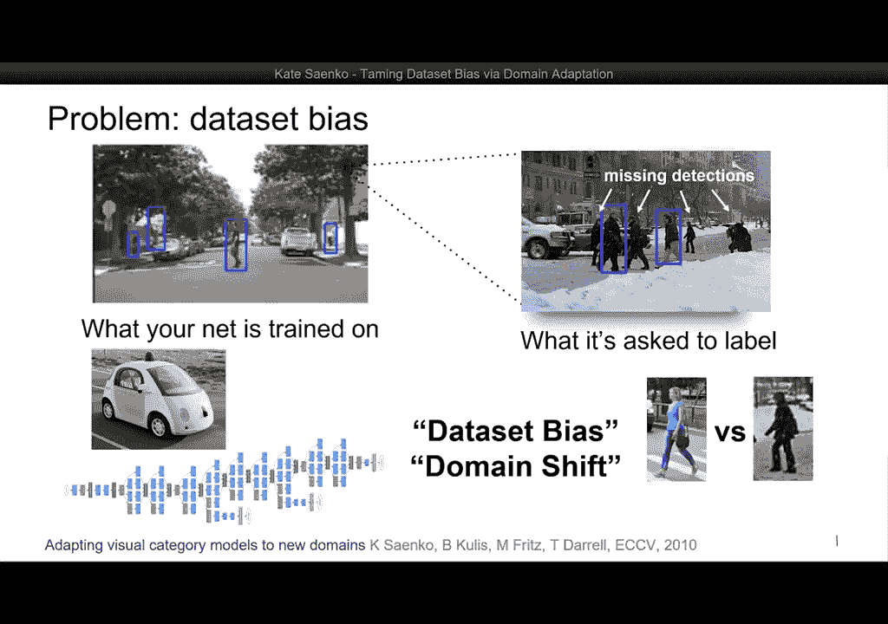

数据集偏差何时发生得很好？一些不同的情况，我只在这里展示一些，它们实际上是，我会争辩说，您收集的每个数据集都会发生这种情况，但是，一个示例是您如上所述收集一个城市中的数据集，而您想在其他城市进行测试。

或者您可能是从，网络，然后您想将模型放在机器人上，从其环境中获取图像，该环境中的角度和背景以及，照明完全不同另一个非常普遍的问题是，然后我们要转移的模拟训练，到现实世界，所以这是对现实的模拟。

数据集移位在机器人技术中非常普遍，这是发生这种情况的另一种方式。

是如果您的训练数据集um主要是，某个特定人群的话说，如果我们与人打交道，那可能主要是，浅肤色的脸，然后在测试时，您会得到较黑的皮肤脸，您没有训练这类数据，因此再次出现数据集偏差，或您正在对婚礼进行分类。

但您的，训练数据来自西方文化中的婚礼图像，然后，测试时间，您有其他文化，因此您再次设置了数据，因此可以，发生我的观点是，它可能发生在许多，实际上，我相信无论如何，您收集的数据集无论如何都会有数据集偏差。

只是因为特别是在视觉上，域我们的视觉世界是如此复杂，只是，很难收集足够的品种以涵盖所有可能的情况。

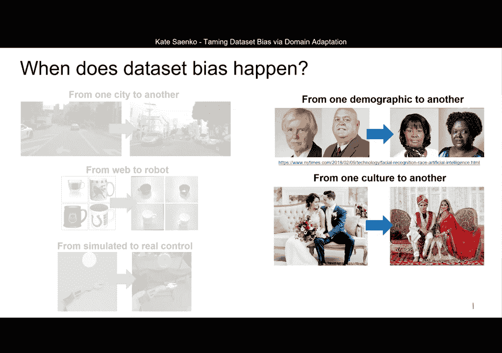

因此，让我们更具体地讨论为什么这是一个问题，我会给你一个例子，我将在整个演讲中使用，只是为了在这个右边加上一些实数，我们可能现在都知道mnist数据集，因此。

这只是用于对神经网络进行基准测试的非常常见的手写数字，因此，如果我们在神经网络上训练神经网络，然后在，在mnist上的同一域中，我们知道我们将拥有非常好的性能，高达99的精度。

这或多或少是一个已解决的任务，但是如果我们在此街景房号数据集上训练我们的网络，嗯，同时也是10位数字吗？数字，但从视觉上看，这是与街景视图不同的域，现在，当我们在mnist数据集上测试该模型时。

该数据集，性能大幅下降这真的是很糟糕的表现，正确地执行10位数字的任务，实际上，即使我们以此进行训练，小得多的变化，所以这是从usps到，mnist在视觉上实际上看起来与人眼非常相似。

但是这两个数据集之间有一些小差异，仍然性能下降嗯几乎一样，呃像以前一样，如果我们交换，我们仍然有，在mnist上进行训练并在usps上进行测试时表现不佳，所以这仅仅是为了像这样输入一些数字。

我们应该很久以前就已经解决的非常简单的任务，在深度学习中，它是行不通的，所以如果我们有此数据集，转移，我们在新域上测试模型，几乎休息了，所以，好的，但这是一个非常学术的数据集，现实世界有什么意义。

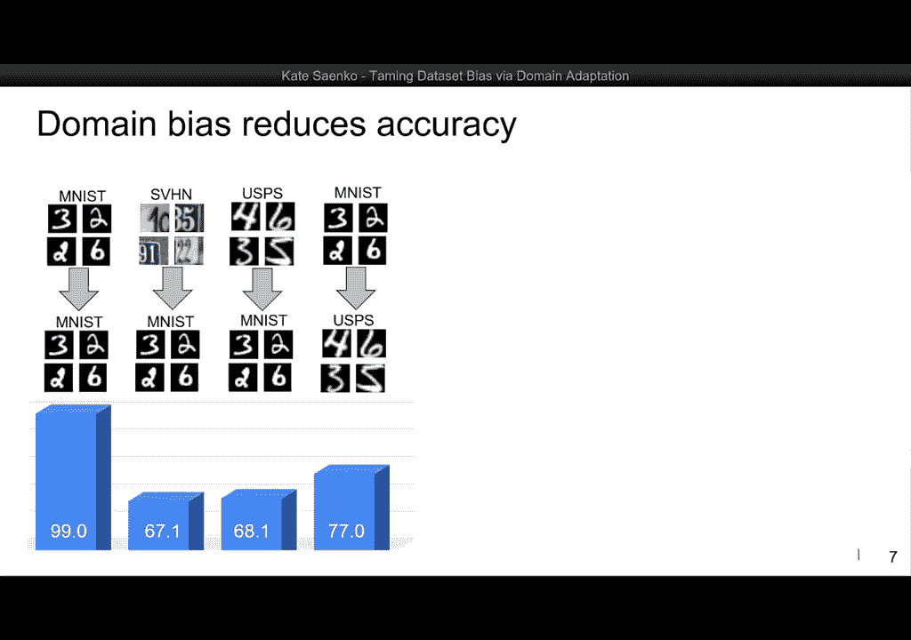

数据集偏差的数据我们已经看到了数据集偏差的任何实际含义，在现实世界中，我会说是的，我们有，这是一个有几个研究的例子，人脸识别模型和性别识别模型的商业，在现实世界中为解决这些问题而部署的软件。

这些研究表明，人脸识别算法，在识别非裔美国人和亚洲人的面孔方面远不够准确，相较于高加索人的面孔和，数据集为何会因为培训而发生变化，这些模型使用的数据集偏向，高加索人的面孔。

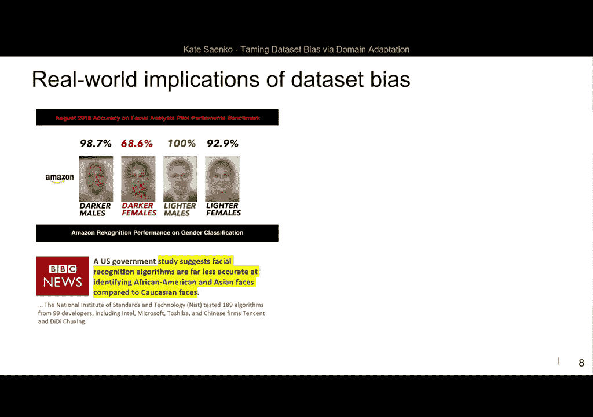

所以我想另一个现实世界的例子，节目是一个非常可悲的例子，实际上前一阵子有一个，无人驾驶车祸实际上是第一次，机器人杀死一个人的时间，所以发生了事故，这对超级自动驾驶汽车是致命的，根据一些报道。

他们认为这辆车的原因，未能停止的原因在于其算法并非旨在检测行人，在人行横道之外，所以您实际上可以想到，如果您的训练数据仅包含一个数据集偏差问题，行人在人行横道上是合理的，假设是正确的。

因为大多数时间行人都遵循，规则，在人行横道上穿越，只有几次，他们你知道你可能会看到人们在拥挤的行走，你可能不会看到很多东西，数据集中的例子。

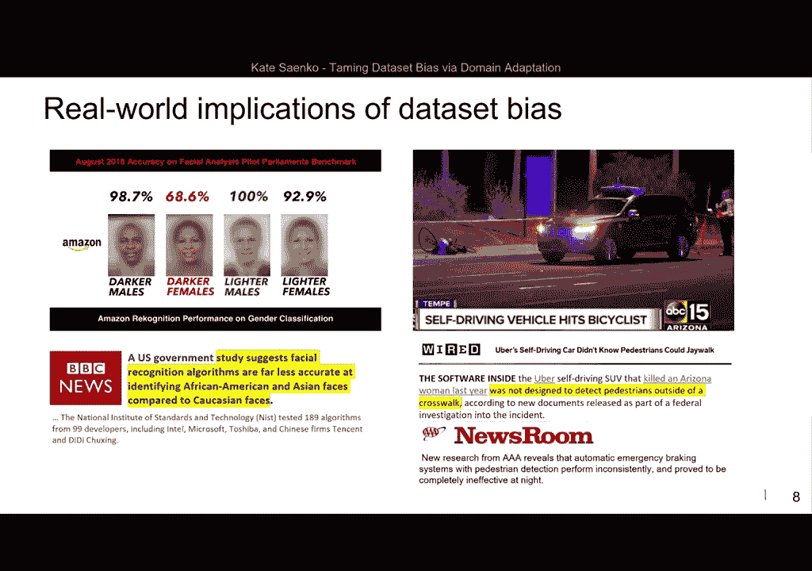

所以您可能想知道这一点，请稍等一下，我们是否能解决问题，通过收集更多数据来获得更多的问题，数据并很好地标记它是的，从理论上讲我们可以，但是它很快变得非常非常昂贵并需要说明，为什么让我们举这个例子。

这又是在自动驾驶领域，这是来自伯克利bdd数据集的图像，实际上已经有很多域，所以它有夜间，图像也有白天图像，这里的标签是语义，分割标签，以便每个像素都被标记，例如道路或行人，等等，如果我们想贴上标签。

um 1000个具有这些多边形的行人，成本约为一千，美元，这就是您所知道的标准市场价格，但是，如果我们现在想乘以该倍数，我们想要的姿势时间变化性别变化，时代种族服装风格的变化，所以，如此等等。

我们很快就会看到我们有多少数据，必须收集正确的东西，在那里我们也希望骑车的人，自行车，所以这变得非常炸毁。

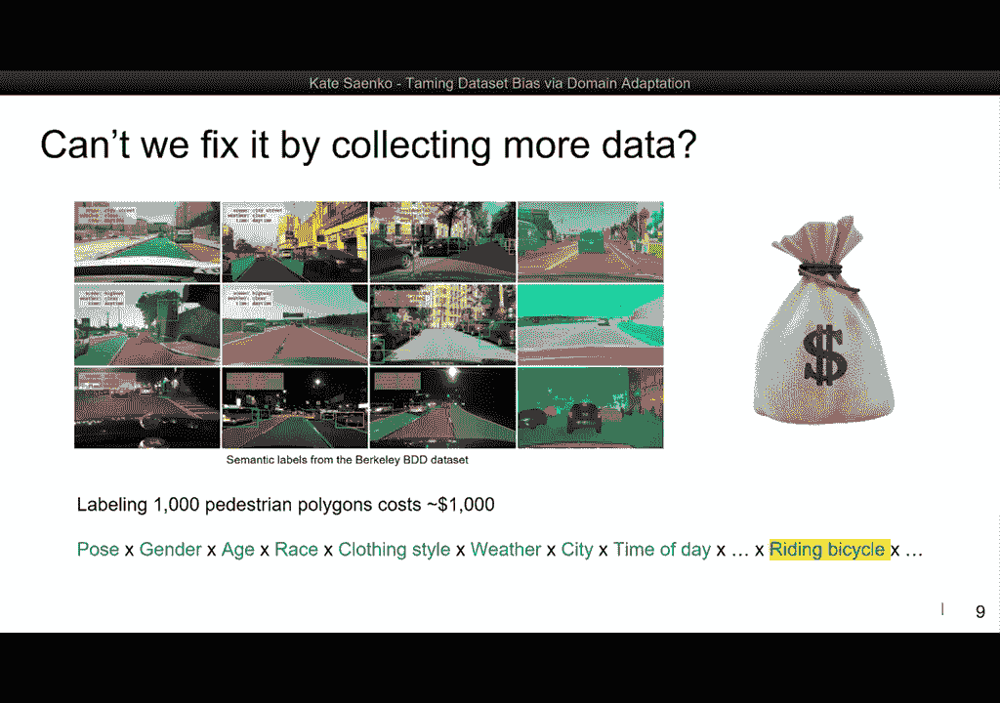

很快变得非常昂贵，所以也许我们想要做的是，可以使用未标记数据而非标记数据的设计模型，我今天在谈论的数据，嗯，现在让我们考虑一下，是什么原因导致的，我们已经看到过的性能不佳，基本上有两个主要原因。

我认为第一个原因是培训和测试数据分布，是不同的，您可以在这张图片中看到，所以这里的蓝点是从中提取的特征向量，数位域mnist数位域使用经过训练的网络，数字域，所以我们训练网络，我们，倒数第二层激活。

然后使用t-sne嵌入对其进行绘制，以便我们可以在2d中对其进行绘制，这样您就可以，看到这些蓝点是训练的突出点，然后我们采用相同的网络并从目标域中提取特征，你可以在这里看到基本上是这个，但是。

与黑色和白色不同的颜色，所以这些是红点，您可以很清楚地看到，输入中的分布在，培训和测试领域，这是我们面临的一个问题，在蓝点上受过训练的分类器不会一概而论，到红点，因为这种分布转移了另一个。

问题实际上是有点微妙，但是如果您看一下如何更好地将蓝点聚集在一起，它们之间有空格，所以根据类别这些是群集，的数字，但红点散布得多，而不是，很好地分为几类，这是，因为该模型学习了源域的判别功能。

这些功能对目标人群的区别不大，域，因此测试目标点不在，使用这些功能分组到类中，因为，你知道他们只是模型需要的功能，不能从源域中学习，那么我们该怎么做呢？

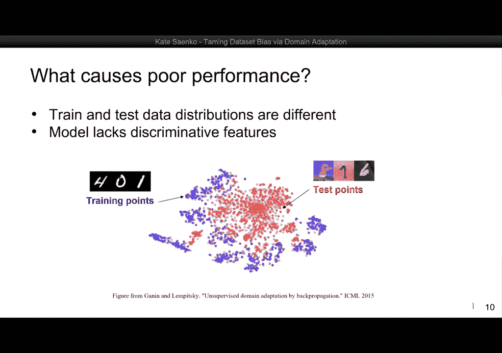

好吧，我们实际上可以做很多事情，在这里，实际上是可以用来处理数据的方法列表，设置移位是相当简单的标准操作，例如，如果您只使用更好的，CNN的主干，例如resnet 18，而不是alexnet。

您会因域转移而导致较小的性能差距，每个域的批处理规范化是一个很好的技巧，嗯，您可以将它与实例规范化结合起来，当然可以，数据扩充使用半监督方法，像伪标签，然后我今天要谈的，可以使用域适应技术吗。

让我们定义域适应，好的，所以我们有一个包含很多未标记数据的源域，抱歉，其中有很多标记数据，所以我们有，在我们的源域中输入xi和yi标签，然后我们有一个包含未标记数据的目标域，所以没有标签只是输入。

我们的目标是学习一个分类器，在目标分配dt下实现了较低的预期损失，对，所以我们正在学习源标签，但我们希望，目标的绩效和领域中的关键假设，记住非常重要的适应，是在域适应中，我们假设我们，看到未标记的数据。

我们可以访问它，这很重要，我们没有标签，嗯，因为我们再次假设它非常昂贵，或者我们无法将其标记为，出于某些原因，但我们确实获得了未标记的数据。

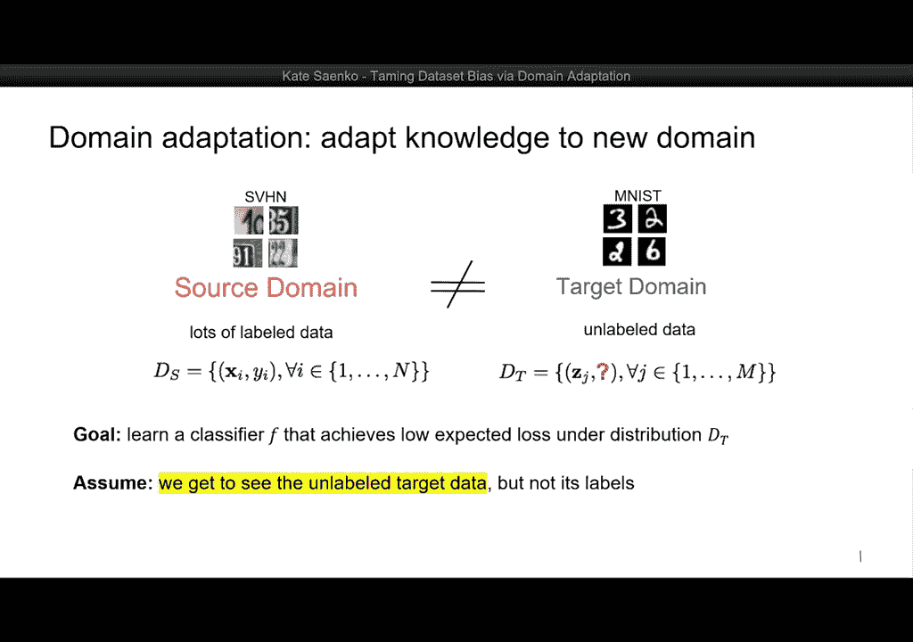

好吧，我们该怎么办，嗯，这就是我剩下的谈话的概要。而且我敢肯定我会很快去的，我会尽力在最后抽出时间来提问，如果有的话请，问题把他们记下来了，所以我来谈谈，在这一点上非常非常标准的常规，对抗域对齐技术。

然后我将讨论一些已应用的最新技术，解决这个问题，然后我们将总结一下，好吧，让我们从对抗域对齐开始，好的，所以说我们的源域带有标签，我们正在尝试训练神经网络，在这里我将其拆分为。

编码器CNN是一个卷积神经网络，因为我们要处理图像，然后是分类器，网络的最后一层，我们可以对其进行培训，通常使用标准分类法，然后我们可以从编码器中提取特征以在此处进行绘制。

可视化这两个类别只是出于说明的目的，我正在展示，两个，然后我们也可以想象一些，分类器正在学习的类别之间的区分符概念，决策边界现在我们也有未标记的目标数据，它来自我们的目标域，我们没有任何标签。

但是我们可以，编码器并生成功能，正如我们已经看到的，我们将，看到源蓝色特征和目标之间的分布变化，橙色功能，因此，对抗域对齐的目标是，采取这两个分布并使它们对齐，因此更新编码器cnn。

以便将目标特征分布在，和来源一样，所以我们该怎么做，好吧，它涉及添加域识别符，将其视为，另一个需要采取的神经网络，我们从源域和目标域获得的功能，它将尝试预测域标签，因此其输出为二进制。

标记源或目标域可以，因此，此域区分符试图，区分蓝色点和橙色点，好的，所以我们只对域标签上的分类损失进行训练，然后这是我们的第一步，然后我们的第二步将是修复，域标识符，而是更新编码器，这样编码器。

导致域识别器准确性较差，因此它试图愚弄，通过生成特征来区分域，在源域和目标域之间基本上没有区别，好吧，这是一种对抗性的方法，因为这种对抗性，第四，我们训练域鉴别器，做好区分域名的工作，然后我们修复它们。

我们训练，编码器欺骗鉴别器，以便它可以，不再区分领域是否一切顺利，我们有一条线。

分布，那么这实际上有效吗，让我们来看看我们的，从前面的数字示例，所以我们在这里，还是两个数字域，您会在适应之前看到，红点和蓝点的分布非常不同，现在在对特征应用这种对抗域对齐之后。

我们可以看到事实上特征分布现在已经很好地对齐了，您或多或少无法分辨出分布的差异，可以在红色和蓝色点之间进行操作，并且，不仅可以使特征对齐，还可以改善功能。

我们训练的分类器的准确性，因为我们仍在这里训练，使用源域标签正确地分类，这实际上是，是什么阻止了我们的分歧，呃，您真的很傻，就像将所有内容映射到一个点，因为，我们仍然有必须满足的分类损失。

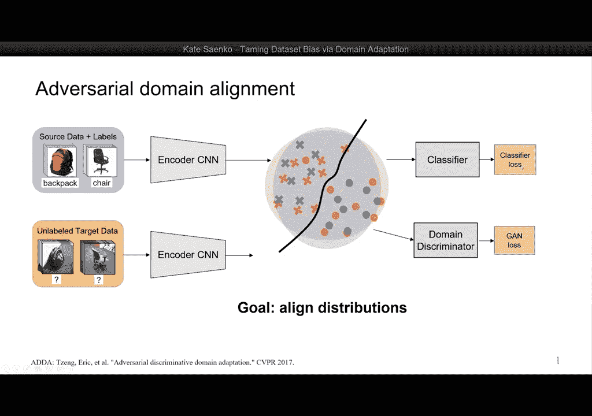

因此分类器也有所改善，让我们来看看有多少，所以在这里，我将展示我们的cdr17论文的结果，称为ada或对抗性区分域适应，因此，使用这种技术，我们可以在训练这些时提高准确性，域。

然后在这些目标域上进行大量测试，所以这是一个重大的改进，但并不是那么好，因为它有点困难，在svh端到端的转移，因为这是最难的，这些变化很大，所以到目前为止外卖，领域适应可以提高目标上分类器的准确性。

数据完全不需要标签，我们根本没有在这里标记目标域，使用未标记的数据进行交易，因此您可以将其视为一种形式，无监督微调的权利，所以微调是，我们经常做的事情，以改进某些目标任务的模型，但是它需要标签。

所以如果没有标签，这是我们可以做的，我们只有标签数据，我们可以进行这种无监督的微调。

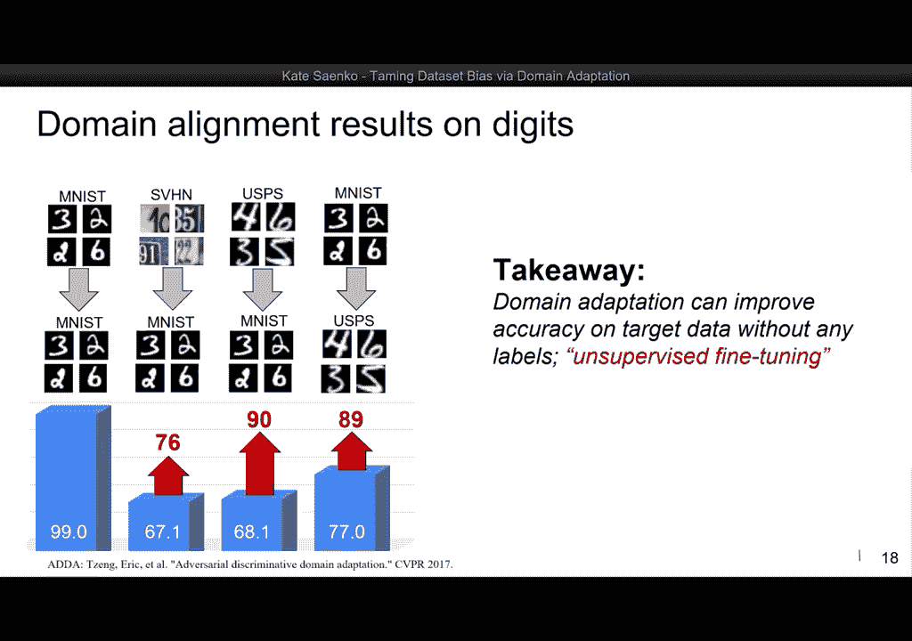

太好了，到目前为止，我还谈到了域，在特征空间中对齐，因为我们接下来将更新特征。

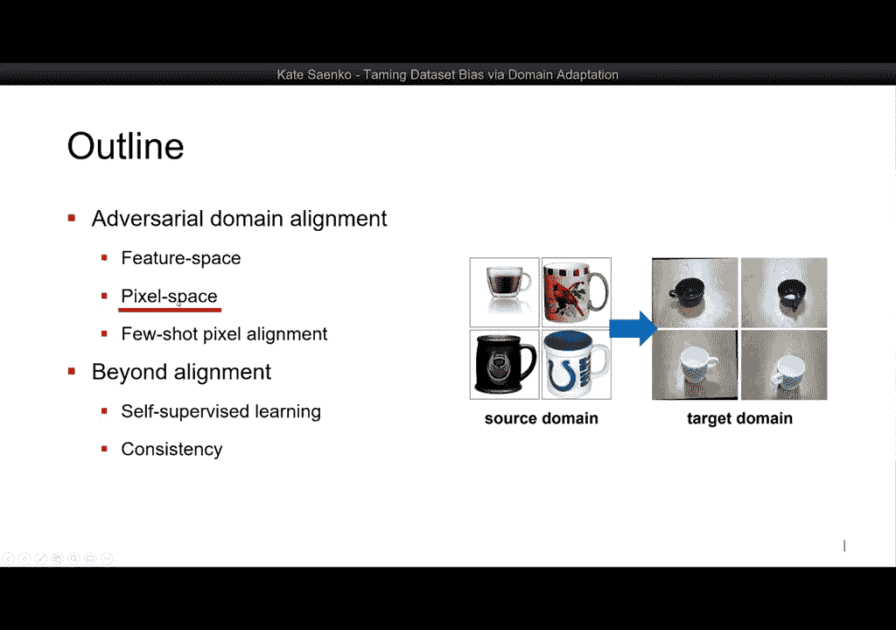

想谈谈像素空间对齐，所以像素空间对齐的想法是，如果我们可以将图像本身作为源数据，该怎么办，像素，实际上只是使它们看起来像它们来自，目标域，我们实际上可以做到这一点，这要归功于，对抗生成模型的器官。

其工作方式与，我已经描述过了，但是他们的区别是，看整个图像不是功能，而是实际的图像，被产生，所以我们可以采用这个想法并将其应用，在这里再次训练，获取我们的源数据并在图像域中对其进行翻译，使其看起来像它。

实际上来自目标域，所以我们，可以执行此操作，因为我们有未标记的目标数据，并且有一个，几种方法，仅用于对此图像进行成像，翻译一个著名的被称为cyclogan，但基本上这些是有条件的。

使用某种损失来对齐两个域，在像素空间，所以如果我们现在有这个井的意义是什么，转换后的源数据，我们仍然有该数据的标签，但现在，看起来它来自目标域，所以，我们可以针对这个新的伪造目标进行训练。

例如带有标签和，希望它可以改善目标上的分类器错误，顺便说一句，我们仍然可以应用我们以前的，功能对齐，因此我们仍然可以在，功能就像我们之前所做的那样，串联在一起的两件事，它们实际上确实提高了性能。

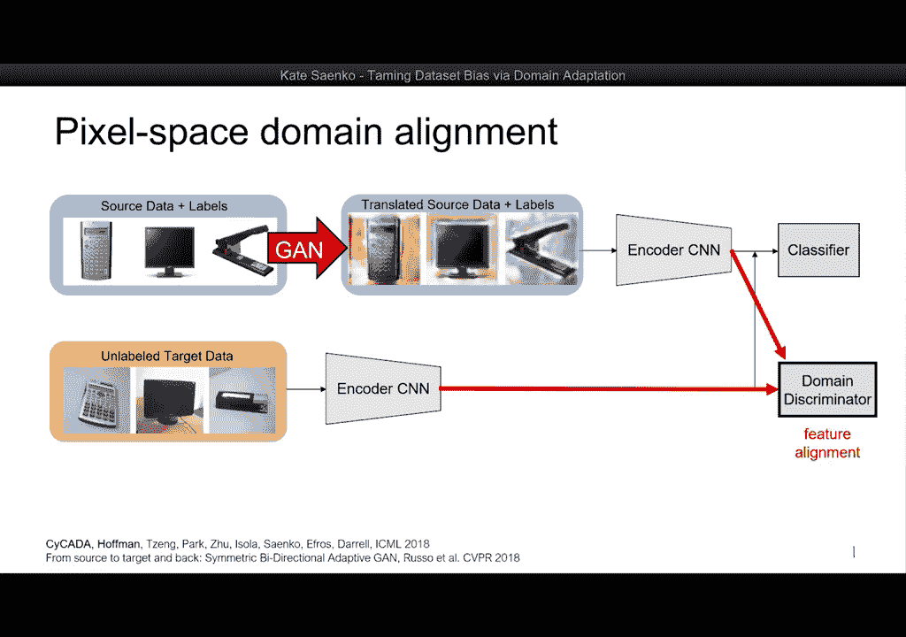

当你在很多问题上都做的时候，好吧，让我给你看一个例子，这是一个，训练领域，这是呃，所以我们试图，做语义像素标记，所以我们的目标是，网络是将每个像素标记为道路或道路等几种类别之一，汽车或行人或天空。

我们想在这个gta域上进行训练，来自侠盗猎车手游戏，它是很好的数据来源，因为它，基本上是免费的，标签是免费的，我们只是得到它们，从游戏中，然后我们要对此进行测试，城市景观数据集是收集的真实世界数据集。

在德国的多个城市中，您可以看到它的外观，所以我将向您展示像素化的结果，这两个域之间的像素域对齐，所以你看到这里我们实际上是在，数据集并将其翻译为游戏，因此此处的原始视频来自，城市景观。

我们正在将其翻译为GTA游戏，好吧，如果我们应用这个会发生什么，域适应的想法，所以这里我们的源域是gta，这是改编后的源图像的示例，我们从gta提取并将其转化为真实的，域。

然后当我们在这些分类器上进行训练时，翻译的图像，我们的准确性从54提高到83。6，每个像素的精度，因此它在精度上确实有很大的提高，再次在目标域上不使用任何其他标签。

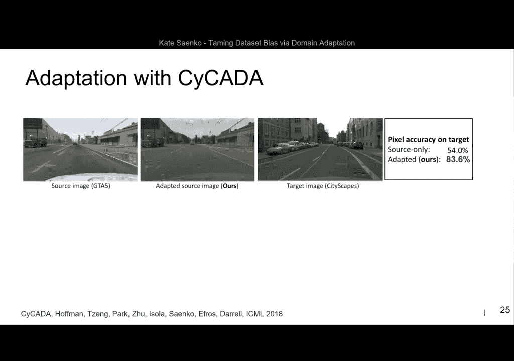

再回到数字问题，记住那真的很困难，从街景图像位数到mn位数的转变，现在，通过这种像素空间自适应，我们可以看到，我们可以，从街景域中获取这些源图像，然后，使它们看起来像mnist图像，所以这个中间。

情节中间，该图左侧显示了svhn的原始图像，将它们翻译为看起来像羊皮纸，所以如果我们现在就进行培训，我们可以，将我们在mnist上的准确度提高到90。4，如果我们将其与我们的比较。

仅使用特征空间对齐的先前结果，我们到了76，所以我们在这方面做了很多改进，所以这里的要点是无监督的图像到图像，翻译可以发现并对齐对应的，两个域中的结构，所以有相应的结构，正确，我们在两个域中都有数字。

并且它们具有相似的，结构以及此方法正在做什么，um通过发现这些结构并使它们对齐来对齐它们，彼此对应。

很好，所以接下来我想继续谈谈fu Shot像素对齐。

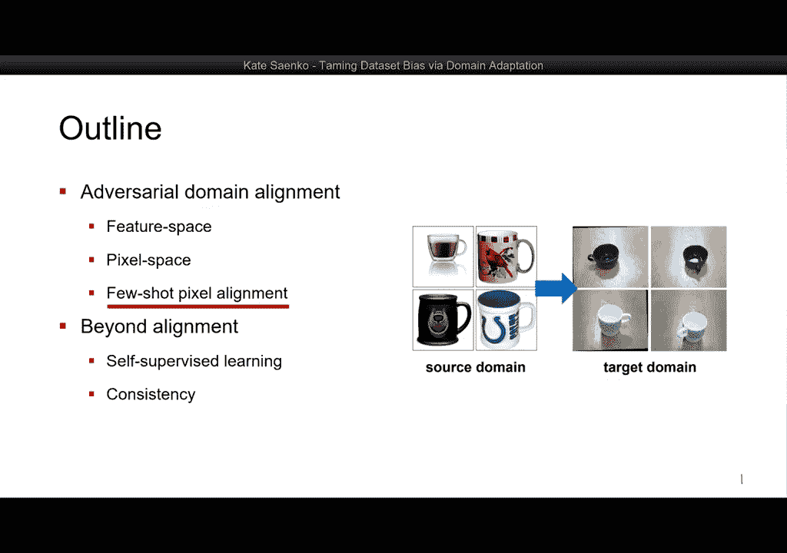

好的，到目前为止，我没有明确地告诉您，但是我们实际上认为，我们有很多未标记的目标数据，是的，因此在该游戏从游戏改编成，真实数据集，我们从真实图像中获取了很多图像，世界，他们没有标签，但我们有很多，他们。

所以我们就像我不知道成千上万，图片如果目标域中只有几张图片会发生什么，好吧，事实证明我谈论的这些方法并不能真正解决这个问题，他们需要更多图像的情况下，所以我们要做的是与我的研究生和我的合作者。

在nvidia，我们想出了一种可以，只翻译一个或几个，也许两个，或者，目标域中最多有三个或五个图像，所以假设我们有，我们的源域中，我们有很多被标记的图像，在这里，我们将看一个不同动物的例子，物种。

因此域将是物种，的动物，所以在这里我们有一个特殊的狗品种，现在我们想将此图像转换为其他域，这是另一种狗，但我们只有一个这样的例子，狗，所以我们的目标领域只给了我们，在一张图片中。

所以我们的目标是输出源代码的翻译版本，保留该源图像内容的图像，但添加了目标域图片的样式，所以这里的内容是动物的姿势和风格，是动物的种类，所以在这种情况下，它是狗的品种，您会看到我们实际上能够做到这一点。

相当成功，因为您可以看到，我们已经保留了狗的姿势，但是我们改变了，从目标图像到一只狗的品种，好的，所以这是一个非常酷的结果。

嗯，我们实现这一目标的方法是修改现有的模型，您基本上通过更新样式编码器在左侧看到的功能块，该模型的一部分，因此我们将其称为可可或内容，条件样式编码器，因此我们模型的工作方式就是这样。

拍摄内容图像和样式图像，它使用编码器对内容进行编码，这只是一个卷积网络，然后还需要样式和内容，将其编码为样式矢量，然后此图像解码器将，内容向量和样式向量相结合，它们一起生成最终的输出图像。

而且该图像上有甘色损失，确保我们生成的图像看起来像我们的目标，所以以前的工作之间的主要区别，单位和我们称为cocof单位的单位是此样式编码器的结构，不同的是，这取决于两个内容，图像和样式图像还可以。

因此，如果我们在，这个模型的引擎盖多了一些细节，再次是主要的区别，这是在样式编码器中，对，所以它需要样式图像um，用功能对其进行编码，并且还可以学习，一个单独的样式偏差向量，该向量与，图像编码。

这些是整个学习的参数，数据集，所以他们是恒定的，他们不相信他们不依赖，图像本质上是做什么的，它会有所帮助，模型类型学习如何解决姿势变化，因为在不同的图像中，有时姿势会发生非常剧烈的变化，一幅图像。

我们看到了动物的整个身体，然后我们，可能有非常被遮挡的动物，只是头部可见，在此示例中，然后内容编码为，结合这些样式编码以生成最终的，自适应实例中使用的样式代码，规范化框架（如果您不熟悉的话），不用担心。

只是将两者结合起来的一种方式。

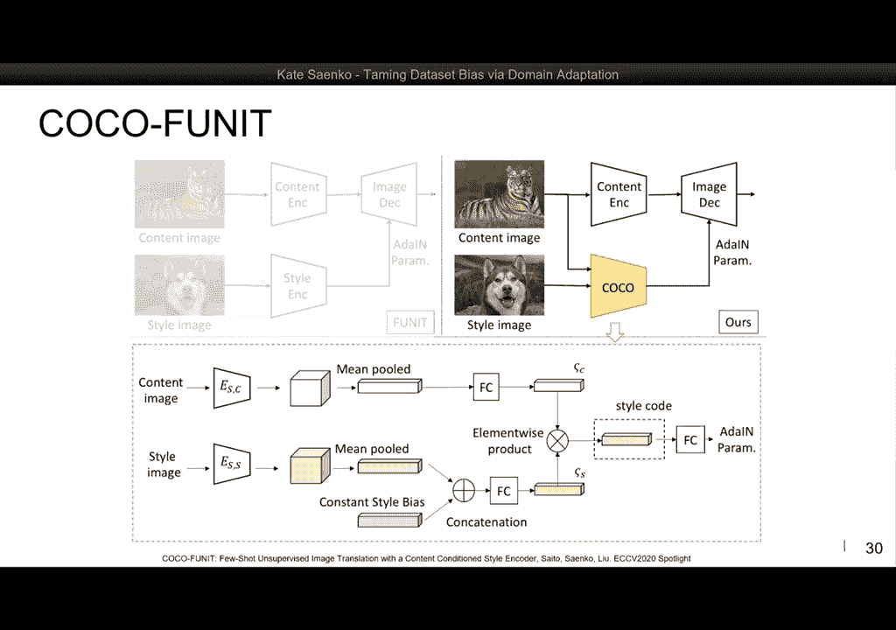

向量来生成图像，所以这是我们的一些示例输出，最上面的模特，我们有一种风格，所以它是一个形象，从我们想要的动物身上看到的目标物种，喜欢，然后在下面是内容，是从本质上讲是来源的姿势，我们要保留。

然后在底部的底部，您会看到我们的模型生成的结果，生产的，所以你可以看到我们实际上是，能够保存，内容图像的姿势很好，但要结合风格或种类，对于目标样式图片感到遗憾，有时我们甚至知道，像猫的东西看起来更像狗。

因为，目标域是狗的品种，但姿势与原始猫相同，图片或最后一张图片实际上是，看起来像狗的熊，因此，如果我们将其与之前的方法进行比较，我之前提到的单位，我们看到我们的模型，比后代好多了，在这种情况下。

很多时候都无法产生，逼真的图像，只是不产生令人信服的图像或，真实感，所以在这里我要播放视频只是为了向您展示更多结果。

实际上，我们正在整个拍摄整个视频。

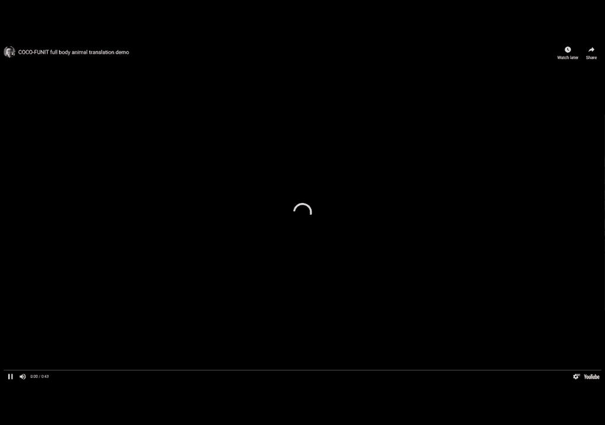

并将其翻译成一些目标域，这样您就可以在顶部看到各个域。

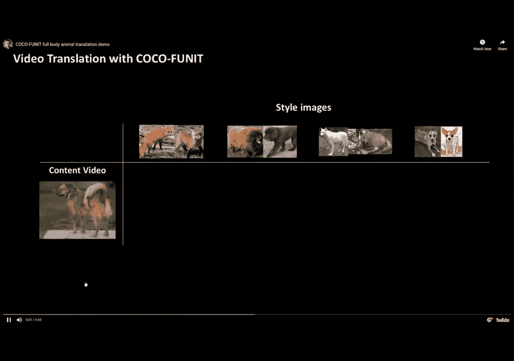

在这里，所以相同的输入视频将是。

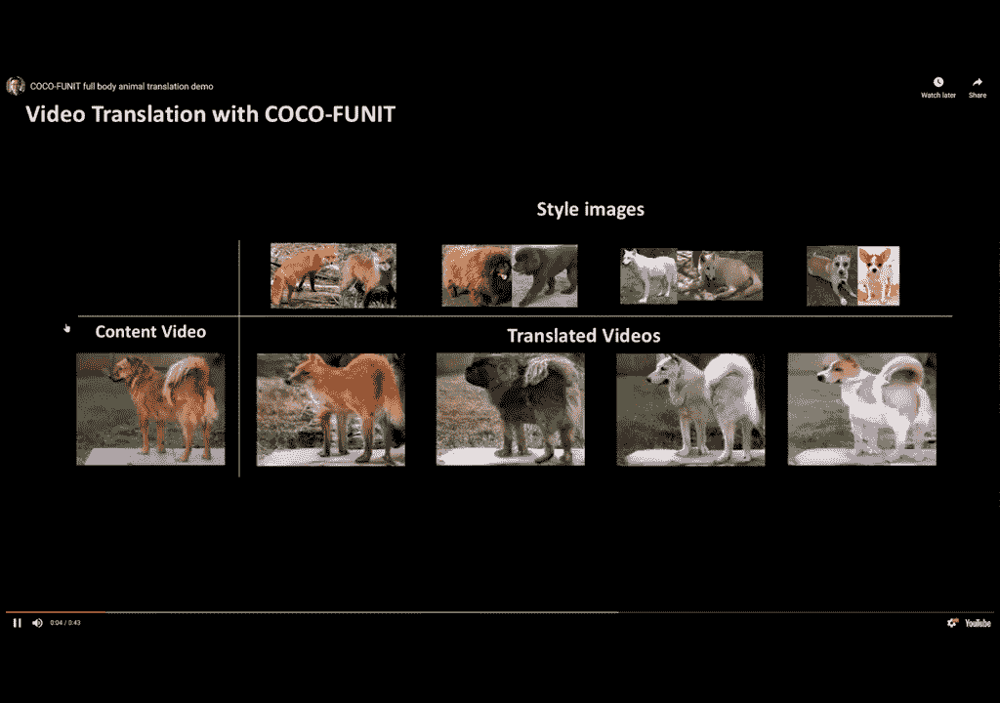

转换为这些目标领域的每一个，每个目标域都有两张图片。

对，所以第一个实际上是狐狸，现在这里还有另一个例子。

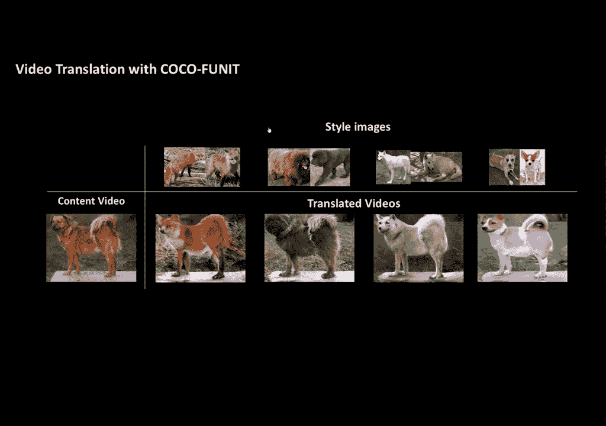

与不同的鸟类，这样您就可以看到鸟的姿势保留了原来的姿势。

视频，但其种类已更改为目标。

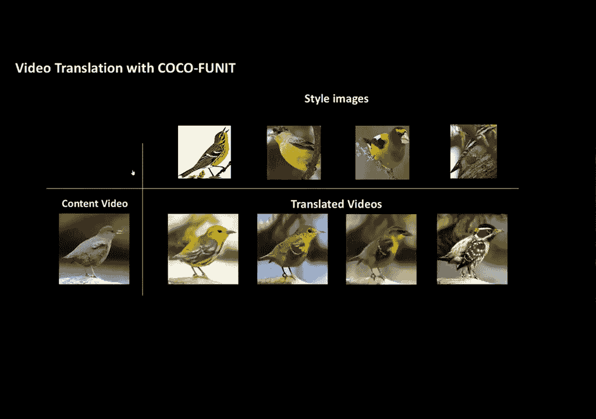

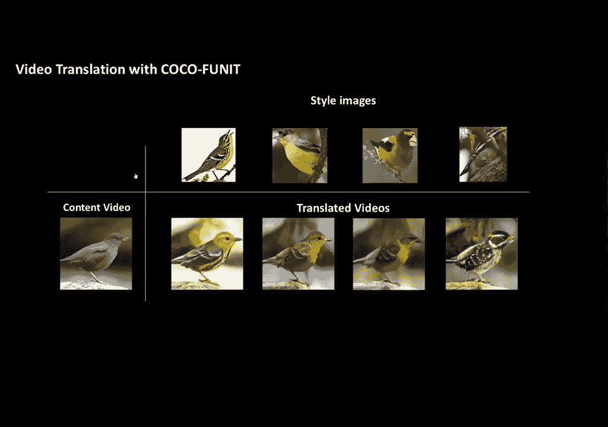

因此，您知道那里的成功水平各不相同，但总的来说，它在做。

比以前的方法更好，这是这里的另一个最终示例，我们再次将内容图像与样式和，产生输出并不确定什么种类，这将是某种奇怪的新物种，好吧，总而言之，就是以内容为条件，和样式图像一起，我们可以改善样式的编码。

并在此视图案例中改进域翻译。

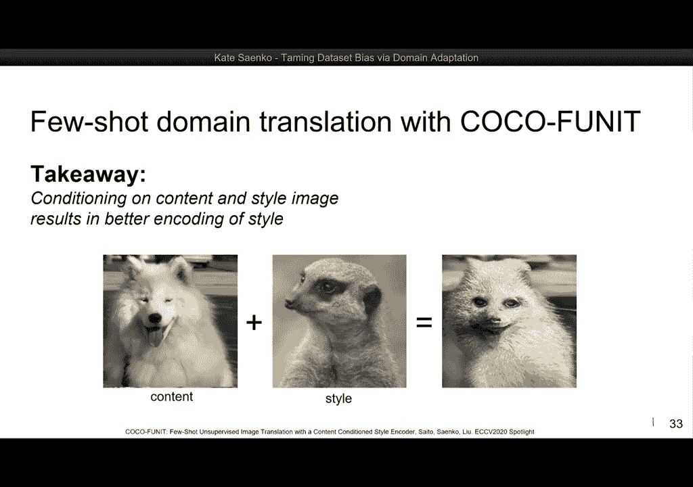

好的，所以我还有一点时间，我实际上有多少时间大约10分钟，是的，好的，所以在最后几分钟，我想，谈论我们已经完成的最新工作，超越了我之前谈论过的对齐技术，提高他们，第一个是自我监督。

学习这样一个假设，所有这些，我说过的制作方法是类别相同，在源头和目标上，如果，违反了假设，为什么我们会违反这个假设，因此，假设我们有一个对象的源域，并且我们想转移到，来自这个真实来源的目标领域。

例如图纸，领域，但在图纸领域，我们有一些，其中一些图像相同的图像，我们在源代码中具有的类别，但某些源类别是，在我们的目标域中缺失，好像我们没有杯子或大提琴，而且我们甚至可能有新的类别。

源中不存在的目标域中，好吧，这里是类别转换的案例，不只是功能转移，不仅是视觉域转移，而且实际上是类别，正在移动，因此这是域对齐的困难情况，因为，域对齐我们总是假设整个域都应该对齐，在一起。

如果我们尝试这样做，情况下，我们会有灾难性的适应结果，所以我们。

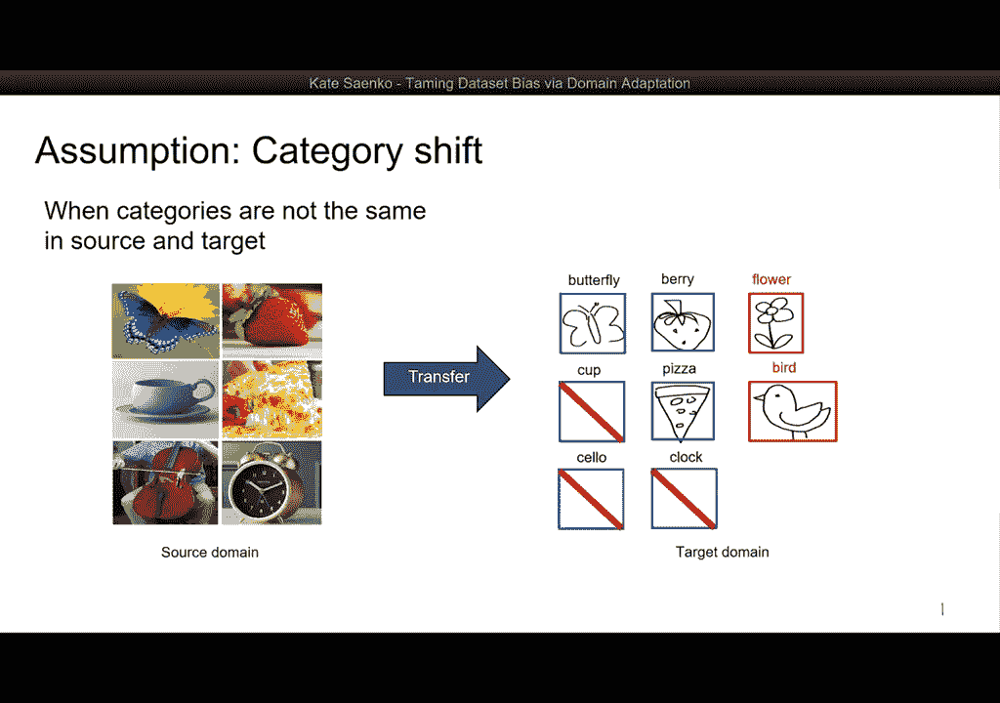

实际上可能比什么都不做更糟，没有适应性，所以在我们最近来自欧洲的论文中，在2020年，我们为此提出了一种解决方案，不使用域对齐，而是使用自我监督的学习，好吧，这样的想法是，假设我们有一些。

源数据被标记为蓝点这里我们有一些，未标记的目标，其中一些要点可能是，对未知的类，所以我们要做的第一件事就是发现，点对靠近的点对，我们以这样的方式训练特征提取器，嵌入在一起，所以我们基本上。

试图将相邻点聚拢在一起，同时将更远的点推得更远，之所以能够做到这一点，是因为我们从一个预先训练的模型开始，已经这么说了，我们说它已经在imagenet上进行了预训练，所以已经给了我们一个漂亮的。

良好的初始化，因此在此邻域聚类之后，这是无监督的损失，或者我们可以称其为自我监督，我们已经更好地将我们的功能进行了聚类，正在将来自已知类别的未标记目标点聚类，更接近已知类的源点，然后。

它将目标中的黄色未知类聚类成远离，那些已知的类现在我们要做什么，是增加了熵分离损失，这进一步鼓励了具有，对不起，我觉得um与，已知的类别，所以这本质上是一个离群的拒绝，正确的机制，所以。

如果我们看一个点，我们看到，它具有很高的熵，可能是离群值，所以我们想，拒绝它，并将其推到更远，所以最后，我们获得的是一个编码器，它使我们具有此功能，相同类别的点聚集的分布，接近源头。

但新颖类的要点聚集在远离。

来源，好吧，如果我们将其应用于称为“远景挑战”的数据集，正在训练合成图像并适应目标域，即，真实图像，但其中一些类别缺失，在目标中，我们又不知道，现实生活中，因为目标未标记，对，所以如果我们批准。

如果我们采用我刚刚描述的这种舞蹈方法，与最近的很多领域相比，可以提高性能，适应方法，并且与仅仅进行培训相比，源，所以如果我们，仅在源数据um上进行交易，然后如果我们在这个域上进行交易，在整个域上对齐。

这就是我们的da和n方法，实际上看到我们比不做任何事情都具有更差的准确性，而不是再次在源代码上进行培训，因为这是同一类别，这个问题违反了假设，但是使用我们的方法，我们实际上。

不仅可以做源代码培训，还可以做得更好，并提高准确性，好了，最后我想提一个很酷的功能，嗯，这个想法已经变得嗯，在半监督文学中最近更为流行，我们可以。

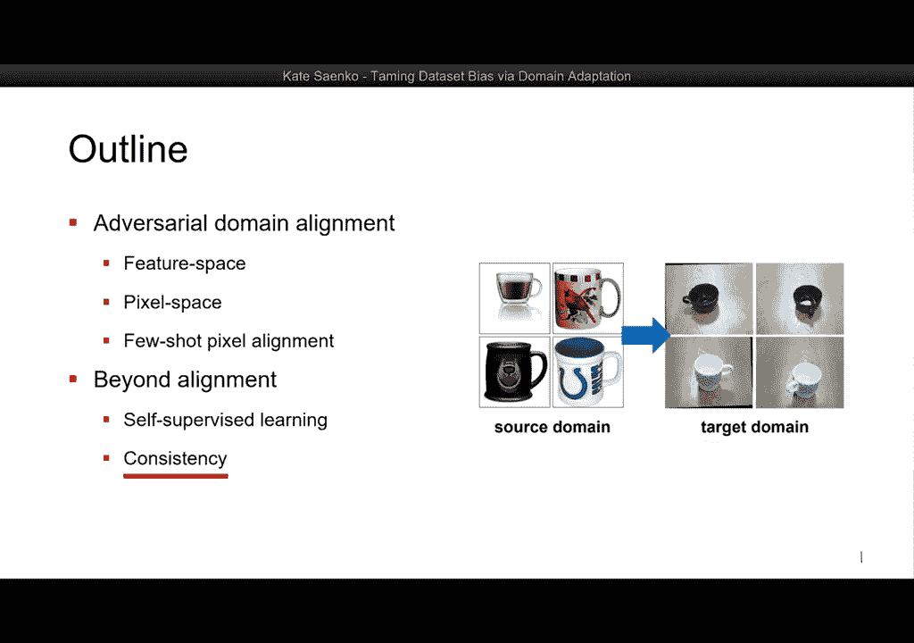

实际也将其应用到这里，所以在这里我们再次开始，在源域和目标域上进行自我监督的预训练，但是在这种情况下，我们要做的是不同的呃单元监督任务，而不是，此处的聚类点是我们预测图像的旋转，因此，我们可以旋转图像。

但我们确切知道图像的方向，但是，然后我们训练特征提取器来预测，例如，该方向是旋转90度还是零度，好的，但是这又是另一个自我监督的任务，它可以帮助我们，预训练更好的特征编码器。

对我们的源域和目标域更具歧视性，然后我们应用这种一致性损失，那么一致性损失是什么，所以在这里，我们将对未标记的图像进行一些数据增强，好的，我们将采用预先训练的模型，然后，使用该模型生成概率分布。

目标um的类别um在原始图片上以及在，增强的未标记图像，其中增强是，您知道裁切颜色转换会增加噪点并增加小，旋转之类的东西，就是这样，旨在保留对象的类别，但会更改图像，然后我们取这两个概率输出，我们。

添加一个损失以确保它们一致正确，所以我们告诉我们，模型的外观，如果您看到此的增强版本，图片您仍然应该预测相同的类别，对于该图像，我们不知道它是什么，因为该图像未标记，但是它，应该与原始图片相同。

因此有了这个主意，因此我们将。

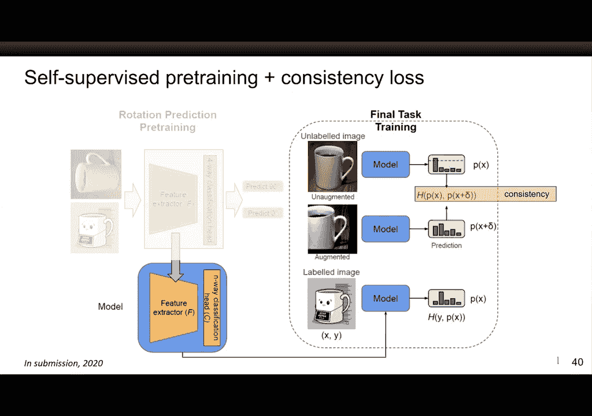

此旋转预测预训练与，一致性培训，我们称此包为一小部分，品尝我们得到的结果只是因为我没有太多时间，但是，基本上在这里，我们再次从合成，拜访挑战中对真实图像的数据集。

但是现在我们假设在我们的目标域中标记了一些示例，我们实际上可以通过这种打包方法来改善，关于域对齐方法（称为mme）的内容很多，这就是我们的，在这种情况下的以前的工作，所以基本上我要你，摆脱这一点的是。

域对齐不是，唯一的方法，我们可以使用其他方法，例如，自我监督培训和一致性培训以提高。

目标数据的性能还不错，所以我在这里止步，只是总结一下我在说什么，我希望我已经说服了您，数据集偏差是一个主要问题，我已经讨论过如何使用领域自适应技术来解决它，尝试使用未标记的数据来传递知识。

我们可以认为这是无监督微调的一种形式，我谈论的技术包括对抗性对齐，还有一些其他依靠自我监督的技术，一致性培训，所以我希望你喜欢这个。

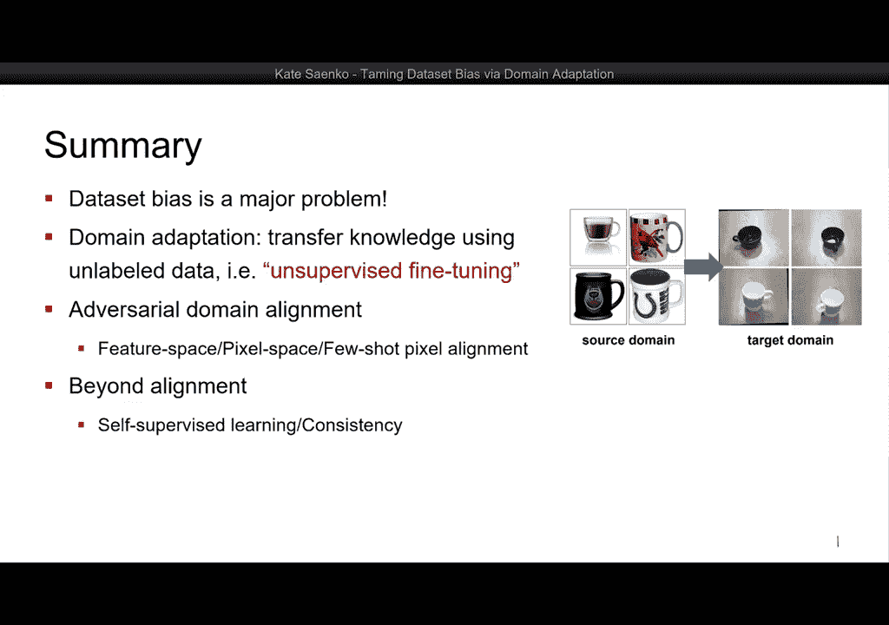

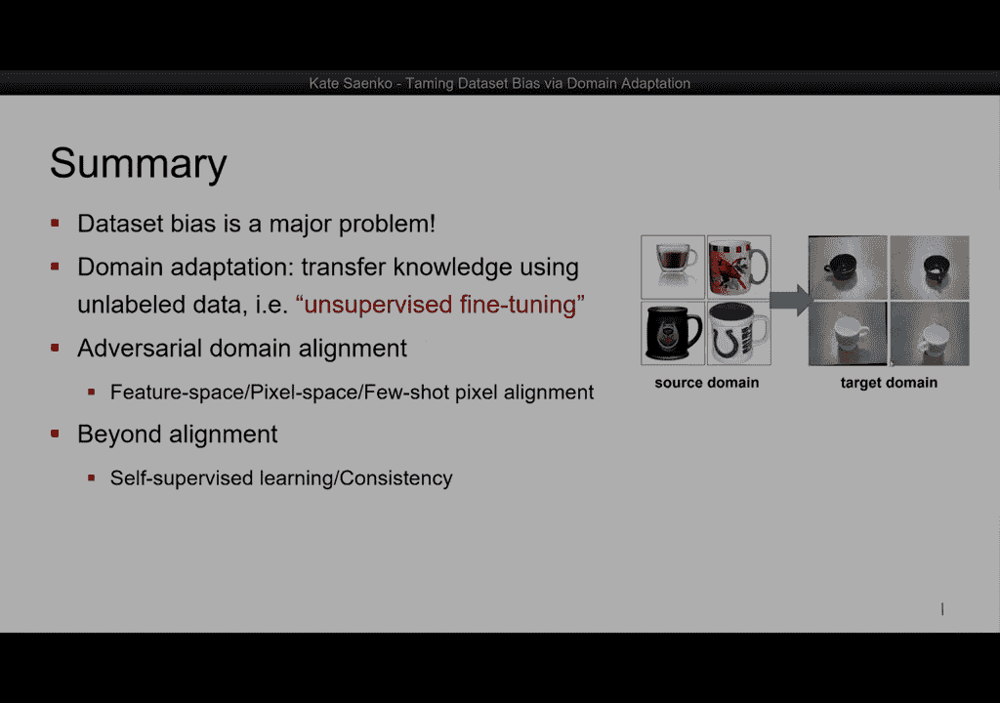