# 【双语字幕】MIT《深度学习导论(6.S191)》课程(2021) - P8：AI Bias and Fairness - 爱可可-爱生活 - BV1jo4y1d7R6

嗨，大家好，欢迎来到我们六一九一年的第二次热门话题讲座，我们最近将在那里学习算法偏见和公平，这个话题正在成为现代深度学习中一个真正普遍的问题，更普遍的是AI。

这是在人工智能管道的各个阶段都可能发生的事情，从数据收集到模型解释，在这次讲座中，我们不仅会了解什么是算法偏差以及它是如何产生的，但我们也将探索一些新的令人兴奋的方法进步。

在那里我们可以开始思考如何制造机器，能够识别并在某种程度上实际减轻这些偏见。

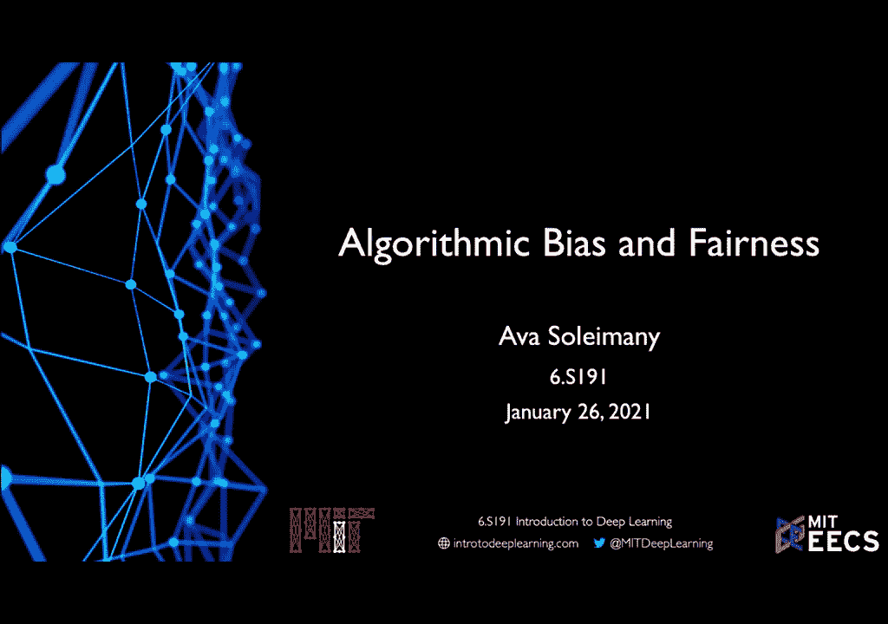

算法偏差的概念指出了神经网络和人工智能系统，更广泛地说，容易受到重大偏见的影响，这些偏见会导致非常真实和有害的社会后果，今天比以往任何时候，我们已经在社会上看到了这一点。

从面部识别到医疗决策再到语音识别，最重要的是，算法偏见实际上会延续现有的社会和文化偏见，例如种族和性别偏见，现在我们开始欣赏并认识到深度学习中的算法偏差，是一个真正普遍和严重的问题。

从这一点开始我们真的需要各个层面的策略来真正解决这个问题，首先，我们必须理解算法偏见到底意味着什么。

所以让我们考虑一下这个图像，你在这张照片中看到了什么，你如何描述它，你可以说描述这个形象的第一件事是西瓜，如果我告诉你仔细看看，更详细地描述一下呢，好的，你可能会说西瓜片或者西瓜籽。

或者像多汁西瓜这样的其他描述符，层层西瓜，西瓜片挨着，但当你自言自语的时候，我想知道你们中有多少人想过把这个形象描述为红色西瓜，如果你像我一样，很可能你没有，现在让我们考虑一下这个新图像。

这里的图像中有什么，现在你可能更有可能放置黄色描述符，在描述这个西瓜的时候。

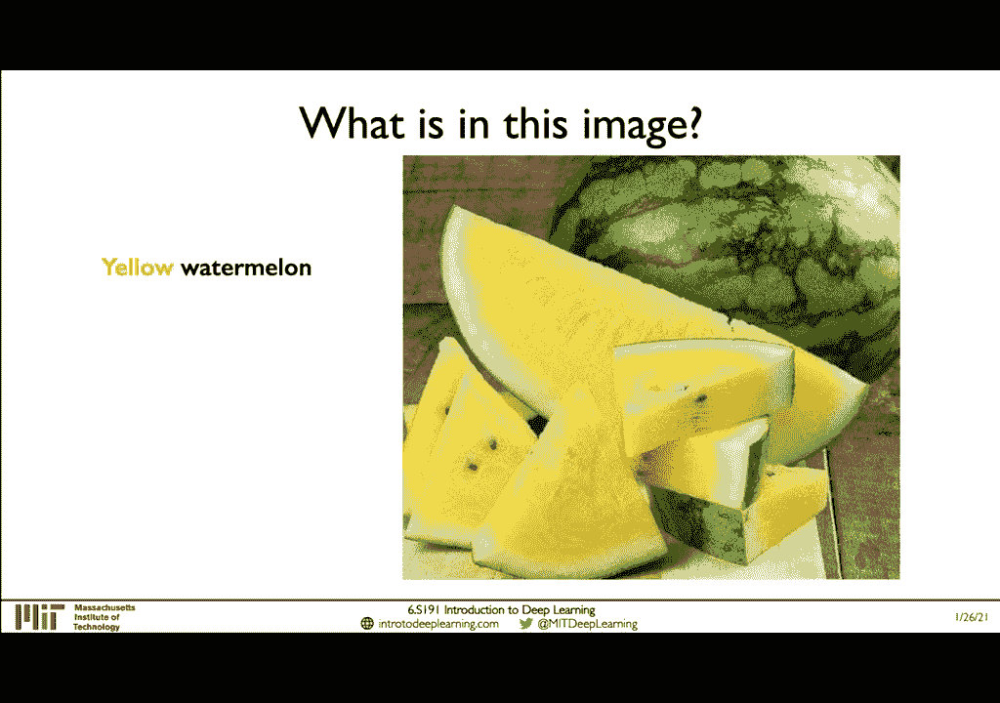

你的最佳答案可能是黄色西瓜，然后用带种子的切片，多汁，等等等等，但为什么会这样呢，我们为什么不说红色西瓜，当我们看到这张原始图像时，当我们看到这样的图像时，我们倾向于把它当成西瓜，而不是红色的西瓜。

那是因为我们自己的偏见，比如说，由于地理原因，我们习惯了看到这样的西瓜，有这个红色，因为这代表了我希望看到的典型西瓜肉，但也许如果你来自世界的另一个地方，黄色西瓜的发源地。

你可以对西瓜应该是什么颜色有不同的原型感觉，这指出了一个更广泛的事实，即我们是如何，当人类去感知和理解世界时，在生活的各个方面，我们倾向于给事物贴上标签和分类，作为一种强加秩序的方式，简化和理解世界。

结果，这意味着，对于所有事物，通常都会有一些典型的表示，我们可以认为是一个原型，根据我们每个人观察到的频率，我们的倾向是指出不适合我们的东西，作为个人认为的规范，那些对我们来说不典型的事情，比如说。

给我的黄色西瓜，当特定的标签时，批判性的偏见和刻板印象可能会出现，会扰乱我们的决策，不管是人类驱动的还是算法建议的，在这节课中，我们将重点讨论算法偏差的来源，并讨论一些新出现的方法来对抗它。

让我们首先考虑偏见在深度学习中是如何表现出来的，和AI，我们今天看到的深度学习中最普遍的偏见例子之一，在面部检测方面，最近，有几个评论分析实际上评估了商业的表现，面部检测与分类系统，比如说。

性别分类器分析，这篇评论显示，商业管道在深色女性脸上的表现明显更差，相对于其他人口群体，和另一个分析，它考虑了面部识别算法，再次发现，有色人种女性的错误率最高。

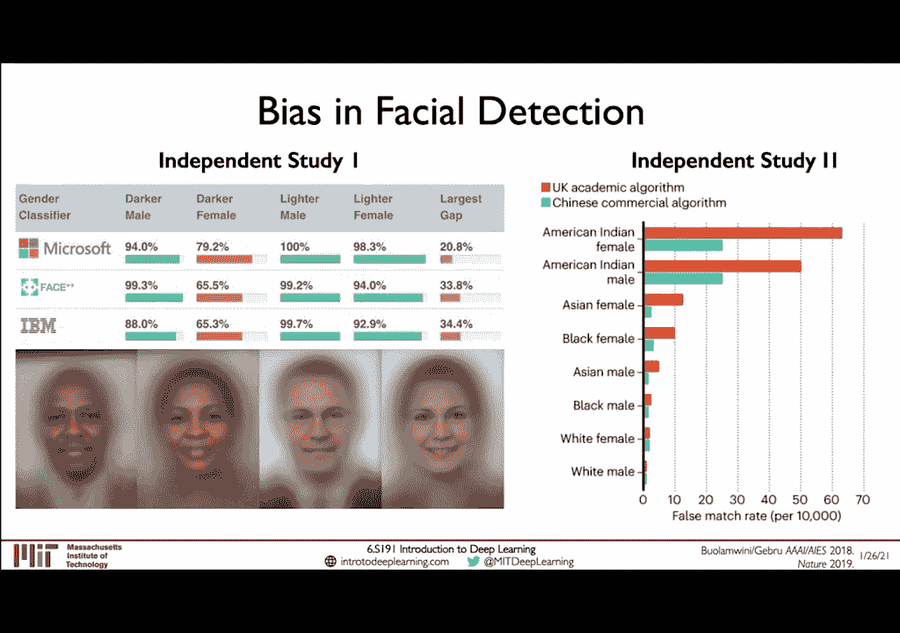

这种算法偏见的概念可以以无数种不同的方式表现出来，作为另一个例子，让我们从总体上考虑图像分类问题，假设我们有一个训练有素的CNN，左边的这张照片，它展示了一个典型的例子，一个新娘在北方。

现在的美国和欧洲国家，在最近的分析中，当这张新娘的特殊照片被传到CNN时，它是在开源大规模图像数据集上训练的，CNN输出的预测数据类标签是，也许不出所料，像新娘这样的东西，连衣裙，婚礼仪式，预期的女性。

当这个图像，这是世界其他地方新娘的典型例子，比如在南亚，被传到了同一个CNN，现在预测的阶级标签实际上并没有反映新娘的磨牙标签，服装事件，服装艺术，因为你在这里看不到任何关于新娘或婚礼的东西。

甚至是一个人，如此清晰，这是一个非常，非常重要的问题，这根本不是深度学习所期望或期望的行为，我们可能认为已经解决了报价，未引用图像分类。

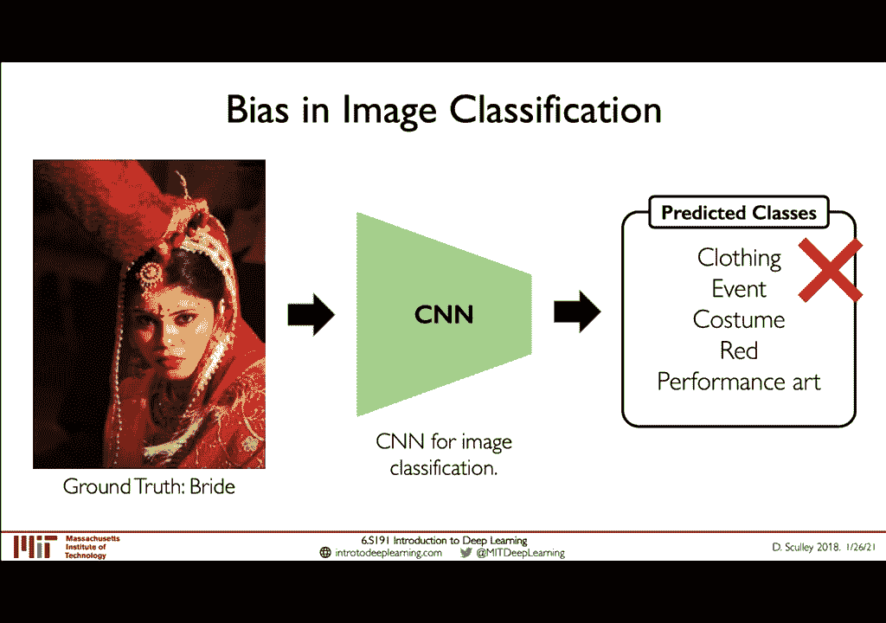

事实上，我在这里展示的类似行为，在另一个物体识别设置中也观察到了，当再次，这张香料的照片是从北美的一个家庭拍摄的，被传给了CNN，受过物体检测训练，目标检测与识别，此图像中检测到的对象的标签符合预期。

调味料香料，香料架配料，正如我们现在所期望的那样，对于左边显示的香料图像，实际上是从菲律宾的一个家里拿走的，当这张照片被传到同一个CNN时，再一次，预测的标签没有反映地面。

真相标签这个图像又是香料的图像，我指的是一些非常非常有关的事情，现在，这个分析真正有趣的是，他们问，好的，我们不仅观察到这种偏见。

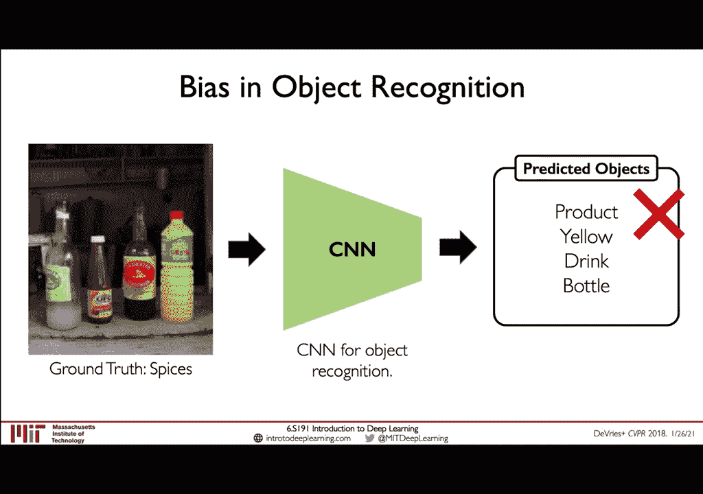

但真正的驱动因素是什么这种偏见的原因，从这个分析中发现，物体识别模型的准确性实际上与房屋的收入有关，测试图像是在哪里拍摄和生成的这表明这些算法有明显的偏见，支持来自高收入家庭的数据。

而不是来自低收入家庭的数据，为什么这可能是这种偏见的来源，嗯，事实证明，用来训练这样一个模型的数据，其中绝大多数是从美国拿走的，加拿大和西欧，但在现实中，这种分布与世界人口的分布完全不匹配。

鉴于世界人口的大部分在东亚和南亚，所以我认为这是一个非常有力的例子，因为它可以表现出，它展示了偏见是如何永久化并在多个层面上存在的，在深度学习或人工智能管道中。

这个特殊的分析开始发现和挖掘其中的一些偏见，而且确实，正如我提到的，偏见确实会毒害人工智能发展和生命周期的所有阶段，从不平衡的数据开始，关于类标签甚至特性，会对模型本身造成不必要的偏见。

实际培训和部署管道，这可能会加强和延续对评价的偏见，以及分析的类型，应该做的，评估不同人口结构和子群体的公平性和绩效，最后，在我们人类对结果和结果的解释中，这些人工智能系统的决定，在那里。

我们自己可以注入人为的错误，强加我们自己的偏见，扭曲这些结果的含义和解释。

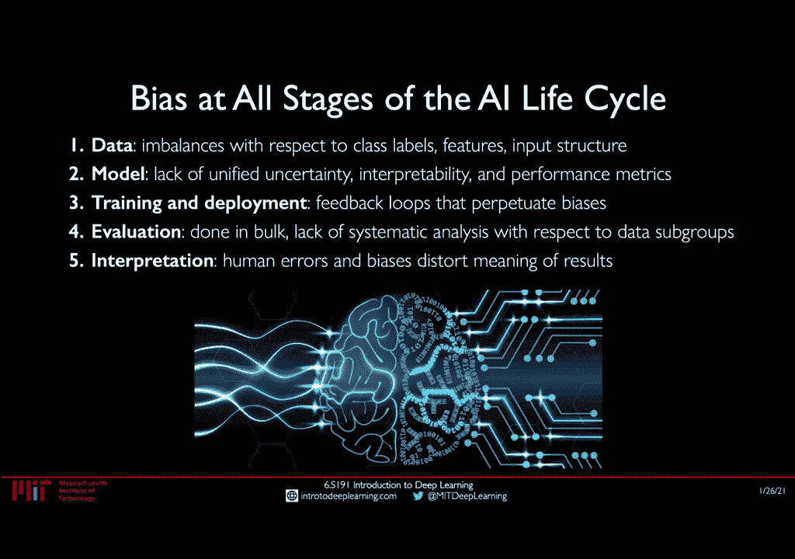

所以在今天的讲座中，我们将探索算法偏差的问题，在第一方面，这种偏见的不同表现和来源，然后我们将讨论不同的策略，减轻这些偏见中的每一个，并最终致力于提高人工智能算法的公平性，这绝不是一个已经解决的问题。

事实上，这个讲座背后的设置和动机是介绍这些主题，所以我们可以开始思考如何继续推进这个领域。

所以说，让我们从思考一些，在深度学习系统中可能表现出的常见类型的偏见，我认为我们可以把这些大致归类为数据驱动或解释驱动，在数据驱动侧，我们经常会面临数据被选择的问题，使得没有实现适当的随机化。

或数据中特定类型的数据或特征的表示频率较高或较低，相对于其他人，以及我们作为用户可用的数据的例子，并不反映现实世界中特定情况发生的可能性，所有这些，正如你所看到和欣赏的，都是非常，非常交织和相关。

解释驱动偏差，更多地提到人类对结果的解释如何永久化的问题，其中一些类型的问题，比如说，关于错误地将相关性和因果关系等同起来，试图对人工智能系统的性能或推广得出更普遍的结论，即使面对非常有限的测试数据。

最后，实际上支持或信任算法的决定，而不是人类的决定，我们绝不要，这是对可能存在的常见偏见的调查吗，它只是为了让你思考不同的方法，和不同类型的偏见，所以今天我们要谈谈这些类型的偏见，首先我想从解释开始。

驱动的相关性问题，谬误，和过度概括好吧，所以让我们假设我们有一个情节，正如你所看到的，显示了两个变量随时间的趋势，正如你所注意到的，这两个变量的数据在一起跟踪得很好，让我们说，事实证明，事实上。

这些黑点显示了美国获得计算机科学博士学位的人数，我们可以很容易地想象建立一个机器学习管道，可以使用这些数据，预测给定年份将授予的计算机科学博士学位的数量，具体地说，我们可以使用红色变量。

因为它似乎与CS的数量有很好的相关性，博士们试图作为我们机器学习模型的输入，试图预测黑色变量，最终我们想做的是，你知道的，对特定数据进行训练，从特定的时间框架设置并在当前的时间框架中进行测试。

二十一或更远，试图预测将被授予的计算机科学博士学位的数量，嗯，事实证明，这个红色变量实际上是拱廊产生的总收入，在某一年，这是一个变量，与计算机科学博士学位的数量相关，在这个特定的时间框架内，但事实上。

它掩盖了一些潜在的因果因素，这就是最终推动计算机科学博士学位数量增长的原因，这是相关性谬误的一个例子，相关性谬误实际上会导致偏见，因为在这样的数据上训练的模型产生了拱廊作为输入产生的收入。

计算机科学博士，因为输出很容易分解，因为它实际上没有捕捉到导致，我们最终试图预测的变量中观察到的趋势，所以相关性谬误不仅仅是相关性，不等同于因果关系，当错误或不正确地使用时，它也会产生和延续偏见。

让我们也考虑过度概括的假设，所以说，让我们假设，我们想在一些马克杯的图像上训练CNN，从一些精心策划的内部数据集，并采用我们的结果模型，并部署到现实世界中，试图很好地预测和识别杯子，马克杯。

现实世界中的实例，可能与训练模型的实例不太相似，和过度概括，假设和偏见意味着，或者反映了这样一个事实，即我们的模型可以在选定的马克杯表现形式上表现得非常好。

那些与它所看到的训练例子相似但实际上失败并显示性能的例子，在数据中表现不太显著的马克杯上表现不佳，尽管我们希望它能概括，这种现象通常可以被认为和描述为分布转移，它确实会使网络在示例上的性能更差，嗯。

它以前没有遇到过的。

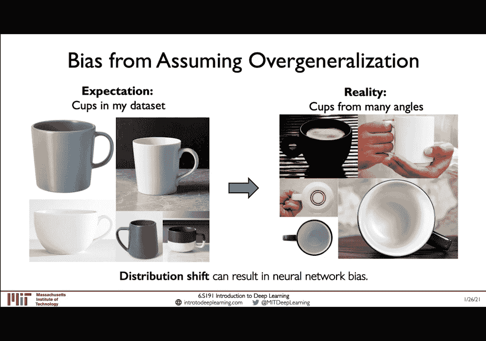

最近提出的一项战略，试图缓解，这种偏差的来源是从数据集开始的，并试图构建一个改进的数据集，该数据集已经考虑到潜在的分布变化，这样就完成了，比如说，通过指定，说，训练用图像。

然后相对于特定变量移动以构造测试数据集，例如，在这种情况下，列车和测试之间发生的分配偏移是，关于这里图像的时间和地理区域。

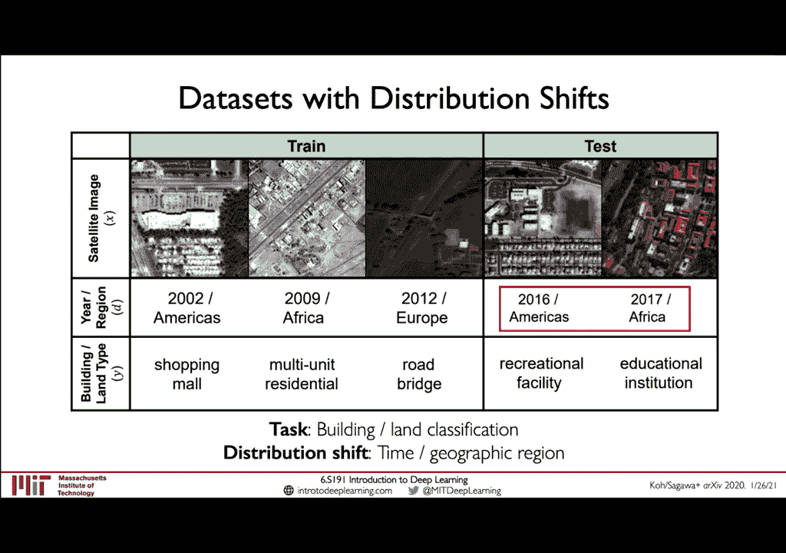

或在医学图像的情况下，这可能意味着从不同的医院为每个列车验证和测试获取数据，随着对分配转移问题的更多认识被揭露，数据集，就像，这实际上可以帮助尝试驯服和调整可能发生的泛化偏见。

因为它们内在地强加了在发行版上已经测试您的模型的必要性，移位实例系列，所有的权利，所以希望这能给你一种解释的感觉，驱动偏见，以及为什么它们会有问题，接下来我们将把大部分注意力转向，依我看。

深度学习中一些最普遍的偏见来源和形式，它们是由首先出现在数据中的类或特征不平衡驱动的，让我们考虑一下阶级不平衡是如何导致偏见的，让我们考虑如下所示的一些示例数据集或如下所示的一些示例数据，和，让我们说。

那个，左边的这个情节，显示了我们试图建模的数据的现实世界分布，关于某些系列的类，让我们假设我们在该数据中可用的数据，这些课程的频率实际上与现实世界中发生的完全不同。

在这些类之间对模型的准确性会产生什么影响，模型的准确性是否反映了数据的真实分布，否，取而代之的是，模型的准确性最终可能会有偏差，根据它具体看到的数据，使它偏向于改进或更高的精度。

而不是在更频繁出现的类上，这绝对不是想要的，最终想要的是什么，我们希望得到的模型在性能方面是无偏见的，它在这些不同类别中的准确性，不同类别的准确性应该大致相同。

如果我们的目标是训练出一个在所有这些课程中表现良好的模型，为了理解我们如何实现这一点，我们首先需要理解为什么从根本上，班级不平衡可能会给实际训练模型带来问题。

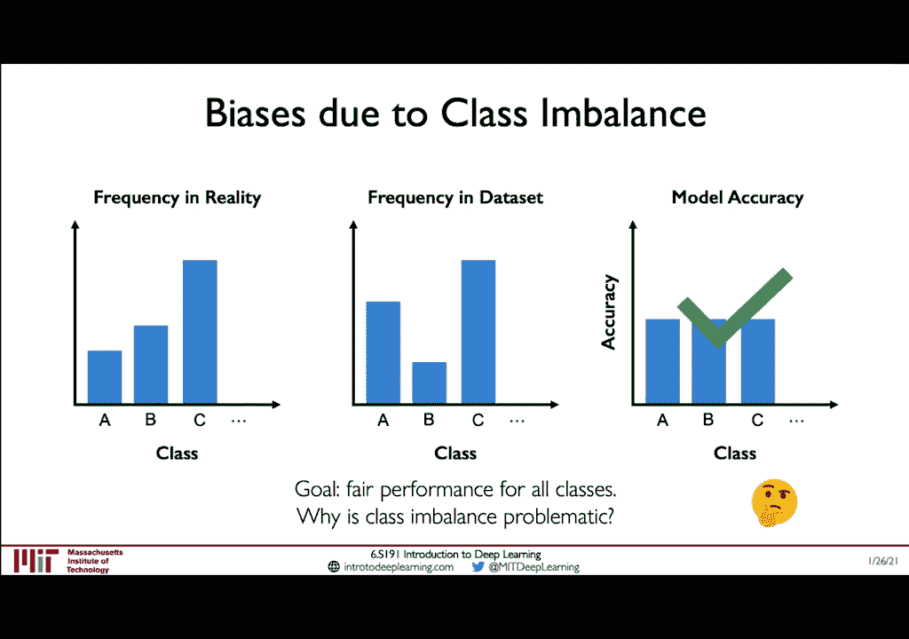

了解这个问题的根源，让我们考虑一个简单的二进制分类任务，假设我们有这个数据空间，我们的任务是构建一个分类器，它可以看到数据空间中的某个点，并将它们归类为橙色或蓝色，我们从随机初始化分类器开始学习。

这样就把这个空间分开了，让我们假设我们开始看到数据点，它们开始被输入模型，我们的数据集是类不平衡的，这样每一个橙色点，模型看到它现在会看到20个蓝点，学习的过程，你从梯度下降中知道。

将对分类器进行增量更新，根据它所观察到的数据，例如，在这种情况下，看到这些蓝点之后，转变将是试图根据这些特定的观察来移动决策边界，这将会发生，现在我们做了一个更新，更多的数据会一次又一次地进来。

他们都将再次成为蓝点，由于这种一到二十的班级不平衡，结果，决策边界会相应地移动，到目前为止，我们所看到的随机样本反映了这种潜在的阶级失衡，但是让我们假设现在我们第一次看到一个橙色的数据点。

这个决定边界会发生什么，嗯，它会移动，试图将决策边界移近橙色点，来解释这一新的观察，但最终请记住，这只是一个和一个橙色点，每一个橙色的点，我们就会看到20个蓝色的点，所以最后，我们分类器的决策边界将以。

占据更多蓝色空间，因为它会看到更多的蓝色样本，而且会偏向多数阶级，所以这是一个非常，学习如何最终倾斜的非常简单的例子，由于明显的阶级不平衡，我向你保证，阶级不平衡是一个非常非常普遍的问题。

在处理真实世界的数据时，您几乎肯定会遇到这种情况，你必须处理和策划。

事实上，一个阶级不平衡特别相关的环境是在医学和医疗保健领域，这是因为许多疾病的发病率，比如癌症实际上是相对罕见的当你观察普通人群时，所以要理解为什么这会有问题。

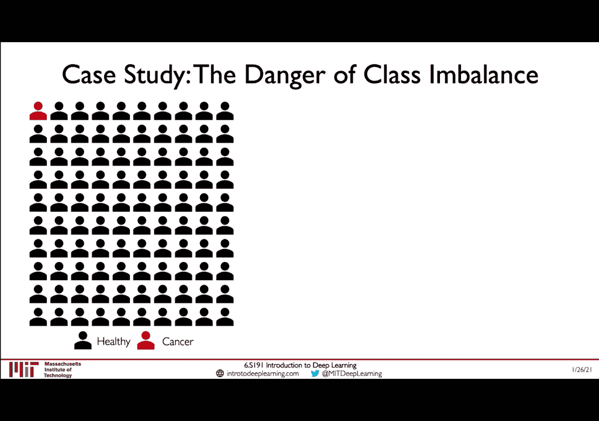

以及为什么这不是一个理想的训练和学习环境，让我们想象一下，我们想尝试建立一个深度学习模型，从医学图像中检测癌症的存在，如核磁共振扫描，让我们假设我们正在研究一个脑瘤，称为胶质母细胞瘤。

这是现存最具侵袭性和最致命的脑瘤，但也很罕见，大约每十万人中就有三人发生，我们的任务是训练CNN，从大脑核磁共振扫描中检测胶质母细胞瘤，和，让我们假设，我们数据集中的类别发生率反映了真实的。

该疾病的世界发病率，意味着对于十万个大脑扫描的数据集，他们中只有三个人真的得了脑瘤，如果用这种方式训练模型会有什么后果，请记住，分类模型最终是被训练以优化其分类精度的。

所以这个模型基本上可以追溯到一直预测健康，因为如果它这样做了，它实际上会达到九十九点，百分之九十九七的准确率，即使当它看到脑瘤时，它预测是健康的，因为这是健康在其数据集中发生的速度。

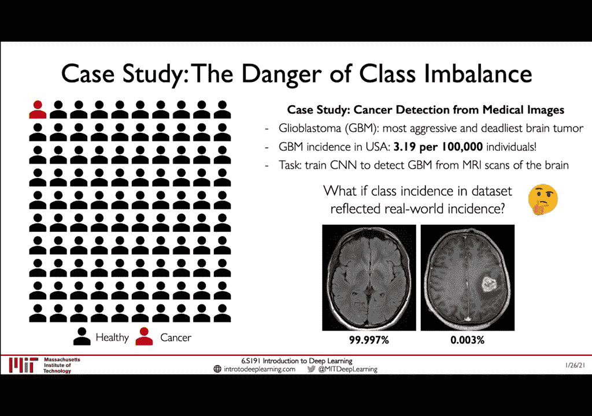

很明显，这是极有问题的，因为建立这个管道的全部目的是检测肿瘤，当他们出现的时候，所有的权利，那么我们如何减轻这种情况，为了理解这一点，我们要讨论两个，在学习过程中经常用来实现班级平衡的非常常见的方法。

让我们再次考虑我们的简单分类问题，其中我们随机初始化分类器，划分我们的数据空间，缓解这种阶级不平衡的第一个方法是选择，并以班级平衡的方式分批喂食，那意味着，我们现在将使用显示一比一类别比例的数据批。

在学习过程中，我们的分类器将看到关于这些类的相等表示，并相应地移动决策边界，再一次下一批进来的人又会是阶级平衡的，决策边界将再次更新，我们的最终结果将是一个相当合理的决定边界，大致相等地分割空间。

由于数据，模型所看到的信息比所看到的要多得多，数据明显不平衡，并在实践中，这种平衡的批量选择是一项极其重要的技术，试图缓解，这个问题，另一种方法是实际权衡单个数据点被选择用于训练的可能性。

根据它们在数据集中出现的频率的反比，所以更频繁的课程会有更低的权重，不太频繁的类会有更高的权重，最终的结果是，我们将产生一个类平衡数据集，不同的班级最终将对模型的学习过程做出同等的贡献，另一种方式。

我们可以可视化这个重新加权的想法是通过使用这些数据点的大小，反映他们在训练期间被选中的概率，什么例子，等待的意思是我们可以增加在训练中选择稀有课程的概率，并降低选择公共类的概率。

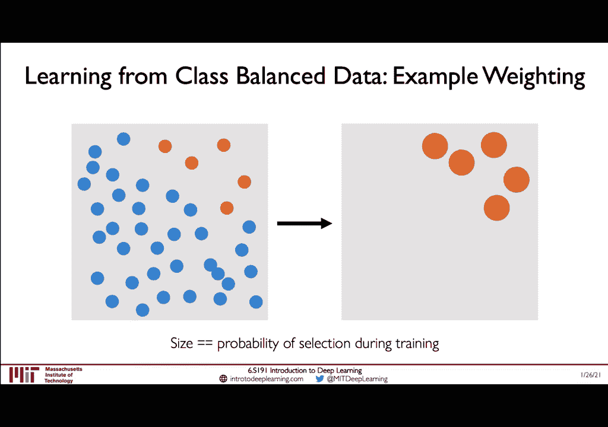

到目前为止，我们一直关注阶级平衡的问题，阶级失衡，并讨论这两种缓解阶级失衡的方法，如果我们的阶级是平衡的，每个阶级内部还会有偏见和不平衡吗，为了得到这个，让我们考虑一下我们试图训练面部检测系统的问题。

让我们说，我们有相等数量的脸和非脸的图像，我们可以用来训练模型，可能有隐藏的偏见潜伏在每个类中，事实上，这可能更难识别，甚至更危险，这可能反映了班级内部特征空间缺乏多样性，也就是说，此数据的潜在空间。

继续面部检测示例，这种特征的一个例子可能是个人的头发颜色，他的图像在我们的面部类数据中，事实证明，在现实世界中，发色的地面真实分布在七十左右，世界上百分之五到八十的人口有黑头发。

18%到20%的人有棕色头发，2%到5%的人有金发，大约2%的人有红头发，然而，常用于图像分类和人脸检测的一些金标准数据集，根本没有反映这种分布，因为它们已经结束了，代表棕色和金色的头发，下面代表黑发。

当然还有，与此形成鲜明对比的是，一个完美平衡的数据集将对这四种头发颜色有相等的表示，我在这里说，这是一个故意的和结束的，故意把问题过分简单化，事实上，包括头发颜色在内的所有特征都存在于光谱中。

数据空间中的光滑流形，所以理想情况下，我们最终想要什么，是一种，我们可以捕捉到更多关于这些特性如何在数据流形中分布的微妙之处，并利用这些知识积极消除我们深度学习模型的偏见，但为了本例的目的。

让我们继续简化视图，让我们假设我们把这个金本位数据集，并用它来训练CNN进行面部检测，在测试时最终会发生什么，我们的模型最终对它的性能有偏见，在这些不同的头发颜色人口统计中。

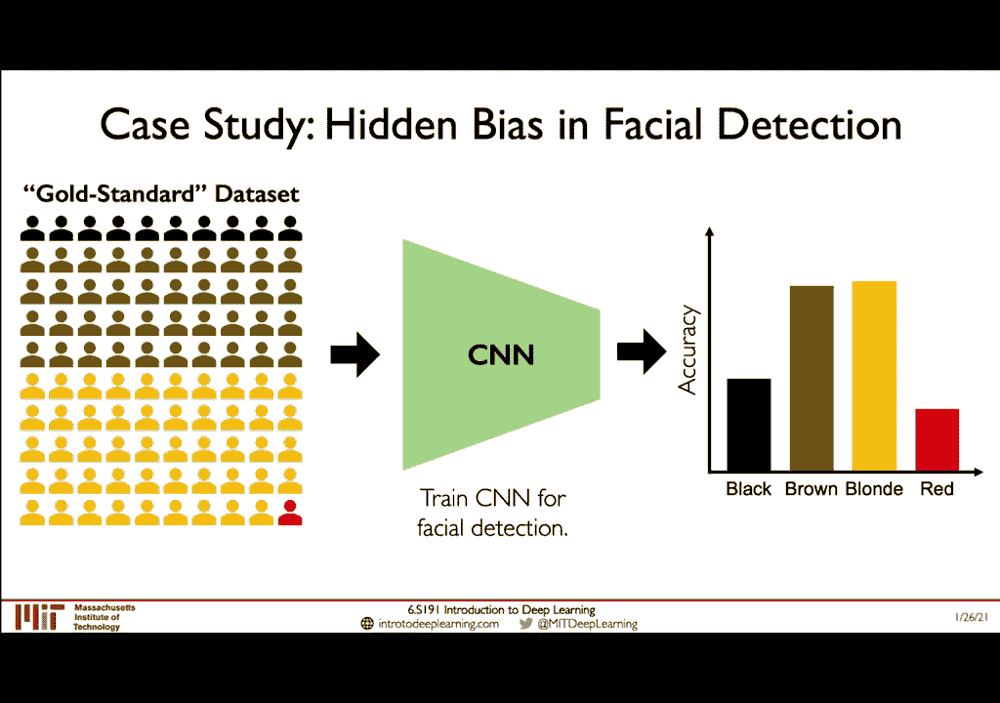

而且确实，正如我在本课开始时介绍的那样，这些完全相同类型的偏见在大规模中表现得相当强烈，商用级，面部检测与分类系统，我认为这些考虑加在一起提出了一个关键问题，我们如何真正识别潜在的偏见。

这些偏见可能是隐藏的，而不是非常明显的，比如肤色或者发色，我们如何将这些信息集成到学习管道中，从那里会有一个超越这一步，学习管道和技术如何实际使用这些信息来减轻这些偏见，一旦他们被识别出来。

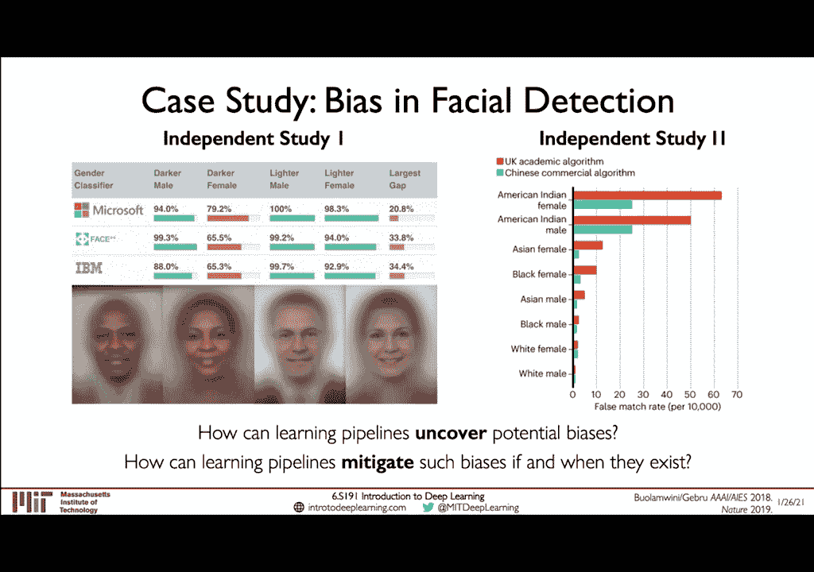

这两个问题介绍了深度学习中一个新兴的研究领域，这就是使用机器学习技术的想法，实际提高这些系统的公平性，我认为这可以通过两种主要的方式来实现，第一个是偏见缓解的想法，在这种情况下。

我们给出了一些偏差模型数据集学习管道，这里我们想尝试应用一种机器学习技术，它旨在消除信号中导致不必要偏见的方面，结果是这种偏见得到了有效的缓解，沿特定轴减小，我们从中移除信号，产生一个公平性提高的模型。

我们也可以考虑技术，而不是试图消除信号，尝试添加回信号，以更多地包含数据空间中代表性不足的区域，或特定人口结构，最终增加模型看到特定数据切片的程度，和一般情况下，是一个研究领域。

我希望在未来几年能继续发展和进步，随着这些问题越来越多。

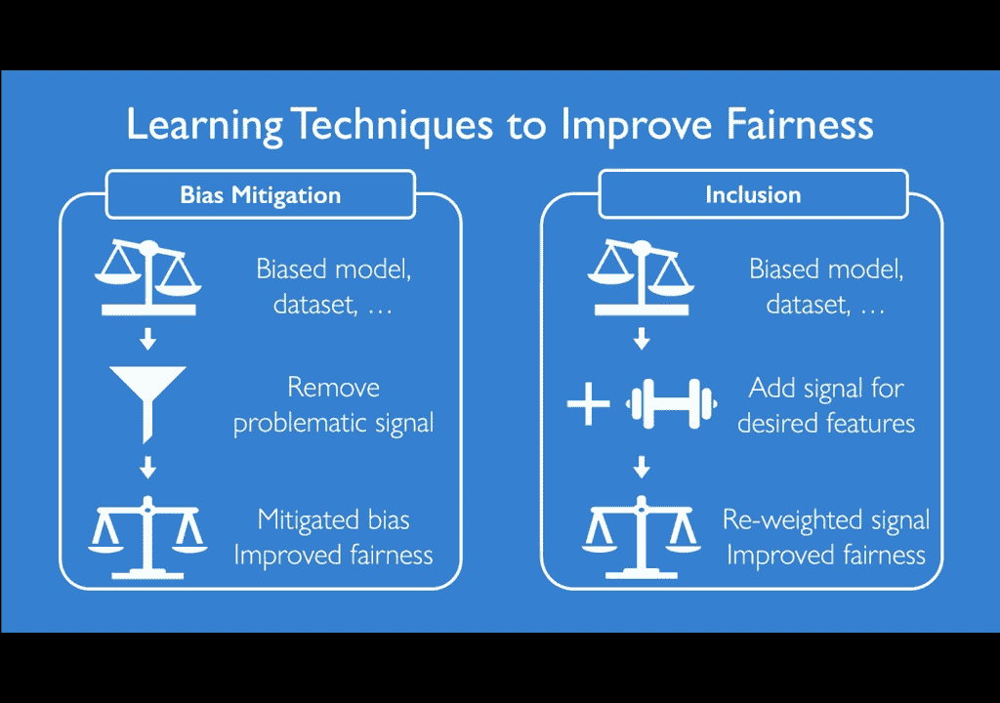

所有权利，因此，讨论和理解学习技术是如何减少偏见和提高公平性的，我们首先需要设置一些定义和度量，关于我们如何正式评估偏见或公平，机器或深度学习模型的，所以为了这些例子，我们将考虑监督学习的设置。

具体分类，分类器最终应该在一些敏感特征或特征系列中产生相同的输出决策，考虑到它应该预测什么，因此从这里移动，如果分类器的决策改变，我们可以定义它是有偏见的，在暴露于特定敏感特性或特性输入后。

这意味着对于特定变量z是公平的，如果分类器的输出相同，不管我们是否以那个变量为条件，所以说，比如说，如果我们有一个二元变量z，预测正确的可能性应该是一样的，是z等于零还是z等于一，所以说。

这给出了一个框架，我们可以考虑，如何评估监督分类器的偏差，我们可以做到这一点，我们可以更进一步来实际定义性能指标和评估分析，确定这些偏见和公平程度，通常做的一件事是衡量不同子群体或人口统计数据的表现。

我们对此感兴趣的是这种加重评估，所以让我们说，如果我们在处理彩色形状，这可能是关于保持形状不变的颜色特征，或者保持颜色不变的形状特征，我们也可以看看表演，在不同子群体或人口统计数据的交汇处插入。

在我们的形状和颜色的例子中，这意味着同时考虑颜色和形状，并将蓝圈与，在橙色方块上的表现等等，等等，现在我们已经定义了一个什么样的集市，一个公平的分类器会是什么样子。

还有一些我们可以评估分类系统偏差的方法，我们现在有了一个框架来讨论一些最近的工作，这些工作实际上使用了深度学习方法。

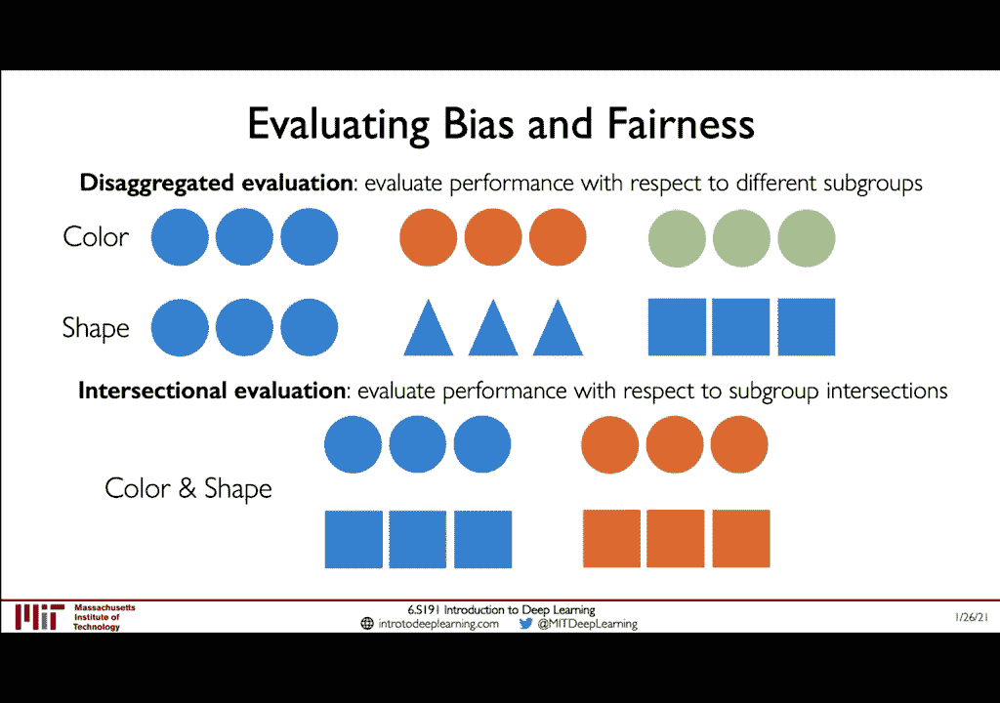

减少监督分类方面的偏见，所以第一种方法使用多个，本框架下的任务学习设置和对抗性训练，它的工作方式是我们，人类用户需要从指定一个属性开始，我们试图设计来对抗Z，学习问题是这样的，我们训练。

我们将训练一个模型来共同预测和输出Y，以及这个属性z的值，所以给定一个特定的输入x，网络将，这将通过嵌入和隐藏层传递到网络，在输出端，网络将有两个磁头，每个磁头对应于其中一个预测任务。

首先是对目标标签y的预测，和，二是敏感属性值的预测，我们试图贬低的，和，我们的目标是，去尝试，以消除敏感属性的任何混淆影响，关于任务预测决策的结果。

这种效果的消除是通过在训练中强加一个敌对的目标来完成的，特别是，通过在反向传播过程中否定属性预测头的梯度，和，这样做的效果是，以消除该属性预测对，任务预测，当这个模型被提出时。

它首先应用于一个语言建模问题，其中指定的敏感属性为性别，感兴趣的任务是完成类比的问题，目标是预测可能填充类比的单词，比如说，他是个像医生一样的女人，当一个有偏见的模型在这个特殊的类比上被测试时。

它返回的顶级预测是护士之类的，保姆，未婚夫，这清楚地表明了潜在的性别偏见，然而，无偏模型，使用这种多任务方法，指定性别作为属性，更有可能返回儿科医生或医生的例子，或医生的同义词。

建议在一定程度上减轻性别偏见，然而，这种方法的主要限制之一是对我们的要求，人类用户指定要针对其设计的属性，这可能在两个方面受到限制，首先，因为可能会有隐藏的和未知的偏见。

这些偏见从一开始就不一定是明显的，最终，我们实际上也想对这些有偏见，此外，通过指定敏感属性是什么，我们，人类可能无意中传播了我们自己的偏见，通过告诉模型我们认为它对什么有偏见，所以最终我们想要的。

我们所渴望的，是一个自动化系统，可以试图识别和发现数据中潜在的偏见，没有任何注释或规范。

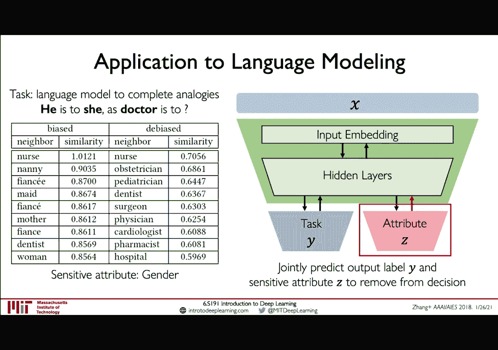

事实上，这是生成模型的一个完美用例，特别是那些能够学习和发现数据集中潜在变量的人，在面部检测的例子中，如果我们得到一个有许多，许多不同的面孔，我们可能不知道是什么。

这个数据集中特定潜在变量的精确分布将是，在这些不同的变量方面可能会有不平衡，比如说，面部姿势，最终可能会，在我们的下游模型中导致不必要的偏差，正如你在第二实验室使用生成模型所看到的。

我们实际上可以学习这些潜在的变量，并利用这些信息自动发现，潜在景观区域中代表性不足和代表性过高的特征，并利用这些信息来减轻其中的一些偏见，我们可以通过使用变分自动编码器结构来实现这一点，在最近的工作中。

我们展示了基于这个VA网络架构，我们可以利用它来了解数据集的潜在结构，在一个完全公正的，无人监督的方式，比如说，在人脸图像的情况下拾取，特别是潜在的变量，如方向，这些变量再次从未被指定到模型中。

它把它作为一个特殊的潜在变量来学习，通过观察许多不同的面孔例子，并认识到这是这种学习到的潜在结构的一个重要因素，然后我们可以估计这些学习到的潜在变量的分布，这意味着这些潜在变量可以取的值的分布。

某些情况会被过度代表，例如，如果我们的数据集有许多特定肤色的人脸图像，这些将被过度代表，因此，选择特定图像的可能性，在训练中有这种特殊肤色的人会不公平地高，这可能会导致不必要的偏见，有利于这些类型的脸。

反过来说，有阴影等罕见特征的脸，深色眼镜，帽子可能在数据中代表性不足，因此，选择具有这些特性的实例进行实际训练的可能性，模型会很低，由此揭示潜在结构的分布，从而产生不必要的偏差。

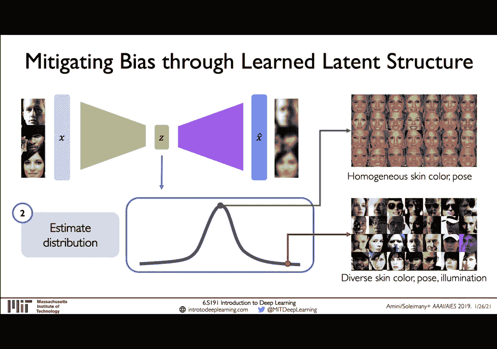

我们展示了，这个模型实际上可以自适应地调整单个数据实例的采样概率，在训练过程中重新称重，这样这些潜在的分布，和，这种重采样方法可以用来，自适应地生成更公平、更有代表性的培训数据集。

深入挖掘这种重采样操作背后的数学原理，这种方法的关键点是，通过该联合直方图近似出潜在空间分布，在单个潜在变量上，具体来说，我们估计每个潜在变量的单个直方图，为了这个近似的目的，假设这些潜在变量是独立的。

这样我们就可以利用他们的产品来得出一个共同的估计，整个潜在空间的联合分布的估计，并根据这一估计的联合分配，然后，我们可以定义在训练期间对特定数据点x采样的调整概率，基于该输入实例x的潜在空间，特别是。

我们定义选择该数据点的概率，根据潜在空间上近似联合分布的逆，它再次由这些单独的直方图定义，并进一步由偏置参数alpha加权，它调整使用这种方法所需的去偏置程度，并将其应用于面部检测。

我们展示了我们实际上可以，我们可以，实际上增加了对特征不足的人脸重新采样的概率，这在质量上表现出来，当我们检查顶部的面时，重采样概率最低和最高。

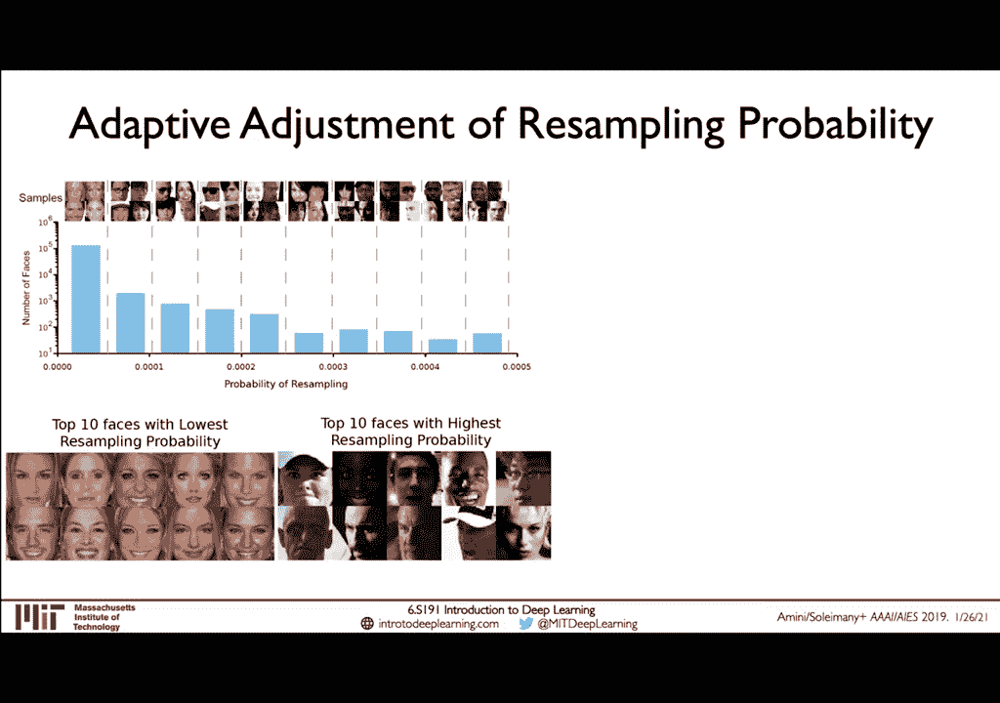

分别是，然后我们可以在训练过程中部署这种方法来实际选择批次，以便用，这种习得的偏置算法对于肤色等特征会更加多样化，姿势与照明，这种方法的力量在于它进行了这种重采样操作，基于自动学习的学习特性。

不需要人类的注释，属性或偏见应该是什么，因此它更容易推广，并允许同时消除对多种因素的偏见，来评估这个算法实际上在多大程度上减轻了偏见，我们对最近的面部检测系统评估基准数据集进行了测试。

平衡了男性和女性的性别以及肤色。

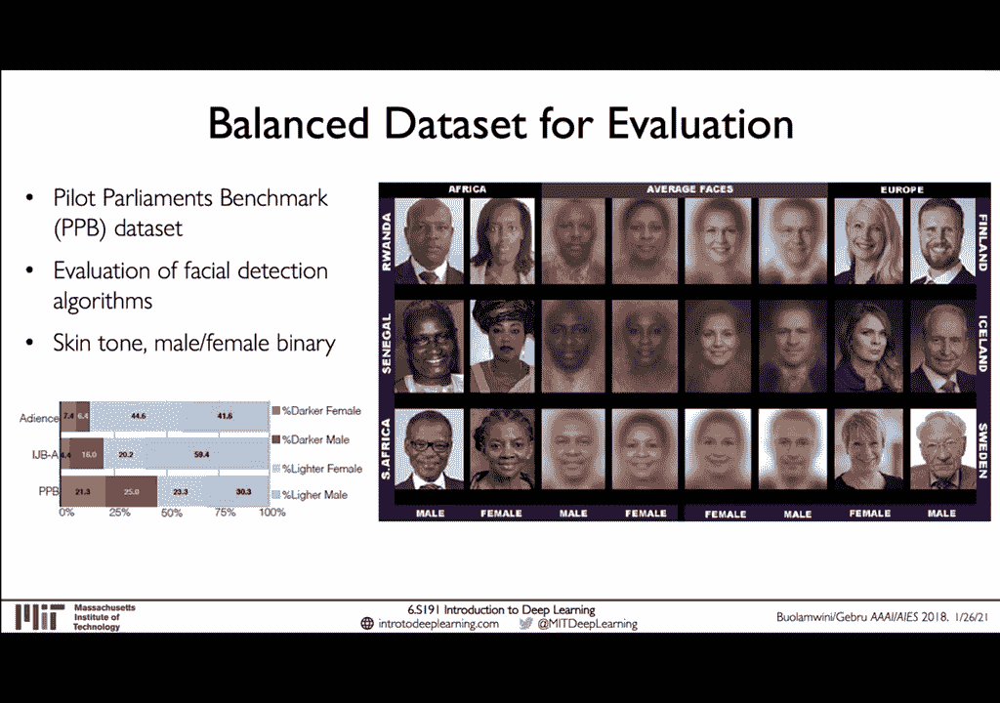

并确定存在的偏见程度，我们评估了此数据集中跨子组的性能，根据男女注释和肤色注释分组，当我们首先考虑模型的性能时，没有任何偏见，所以所谓的有偏见的模型，我们观察到它在深色男性身上表现出最低的准确性。

在轻邮件上的准确率最高两者相差约12%，然后我们将这个精度与D偏置模型的精度进行了比较。

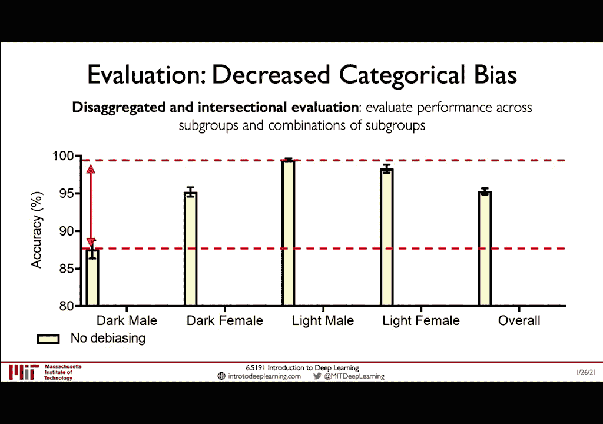

发现随着D偏置的增加，总体增加，特别是关于子集和子组，比如深色的雄性和深色的雌性，而且批判性地，深色男性和浅色男性在准确性上的差异显著减小，用降偏模型，表明这种方法实际上可以显著减少分类偏见。

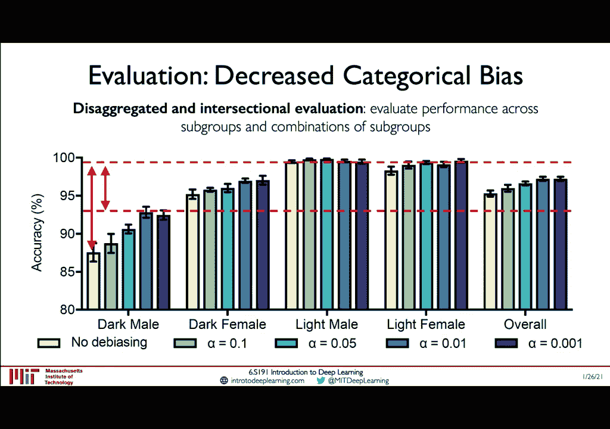

在今天的讲座中，我们已经探索了不同的偏见是如何在深度学习系统中产生的，它们是如何表现的，我们还讨论了一些新出现的策略。

实际上使用深度学习算法来减轻这些偏见，最后，我想通过提供一些观点来结束，我认为提高人工智能公平性的关键考虑因素，第一个是我喜欢称之为最佳实践的，在人工智能的科学和实践中应该成为标准的事情。

比如提供文档和报告，关于公布数据集的报告，以及总结训练等事情的模型，信息评价指标与模型设计，这个存在的目标，提高这些数据集和模型的重现性和透明度，当它们被使用和部署时，我认为需要采取的第二类步骤。

这些新的算法解决方案，在学习过程的各个方面实际检测和减轻偏见，今天我们考虑两种这样的方法，但是在这个领域还有很多工作要做，真正构建健壮和可伸缩的方法，这些方法可以无缝地，无缝集成到现有和新的AI管道中。

实现，我认为第三个标准将是数据集生成方面的改进，在来源和代表性方面，以及关于分配转移，以及可以成为标准做法的正式评估，评估新模型的公平性和潜在偏差，这些模型首先是输出的。

我认为真正关键的是持续的对话和合作，人工智能研究人员和从业者，以及最终用户，政治家，公司，伦理学家，因此，人们对算法偏见的潜在社会后果有了更多的认识和理解，并进一步，讨论可以减轻这些偏见的新解决方案。

并促进包容性和公平，我将以此结束。

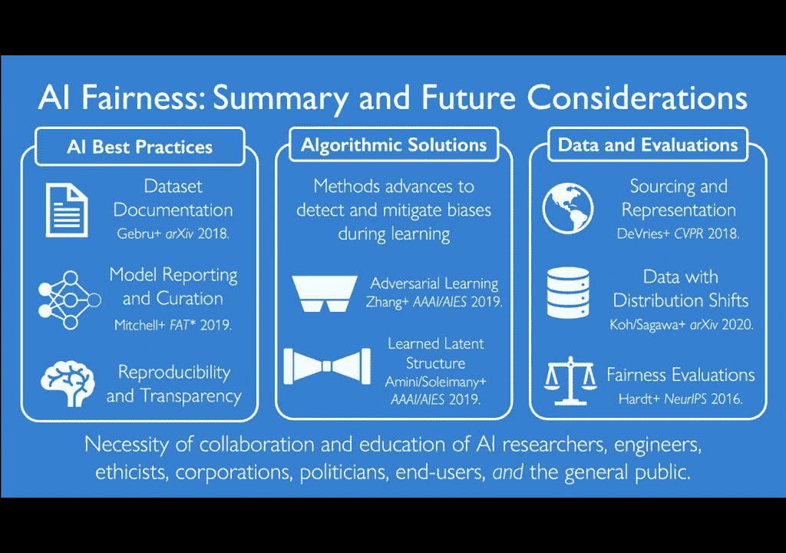

我想提醒你们，对于那些参加这门课的人，实验室竞赛的参赛作品将于美国东部时间今天午夜提交，请在画布上提交，一如既往，如果你们对这节课有什么问题，实验室，课程的任何其他方面，请到球场来，聚集城镇。

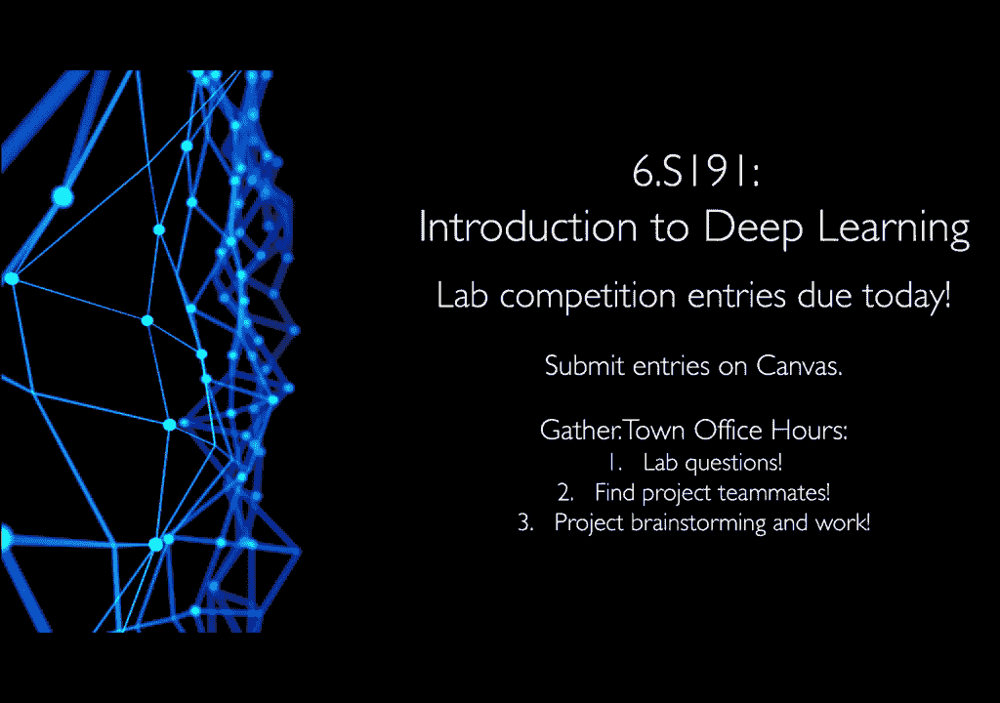