# 【双语字幕】MIT《深度学习导论(6.S191)》课程(2021) - P9：Deep CPCFG for Information Extraction - 爱可可-爱生活 - BV1jo4y1d7R6

谢谢，所以我在全球eui带领呃，今天，我们将与您讨论我们已经完成的一些工作，信息提取专门针对深层cpcfg，因此希望如此，我们将介绍一些您可能以前从未遇到过的概念，在我们开始之前，可能会免除一些意见。

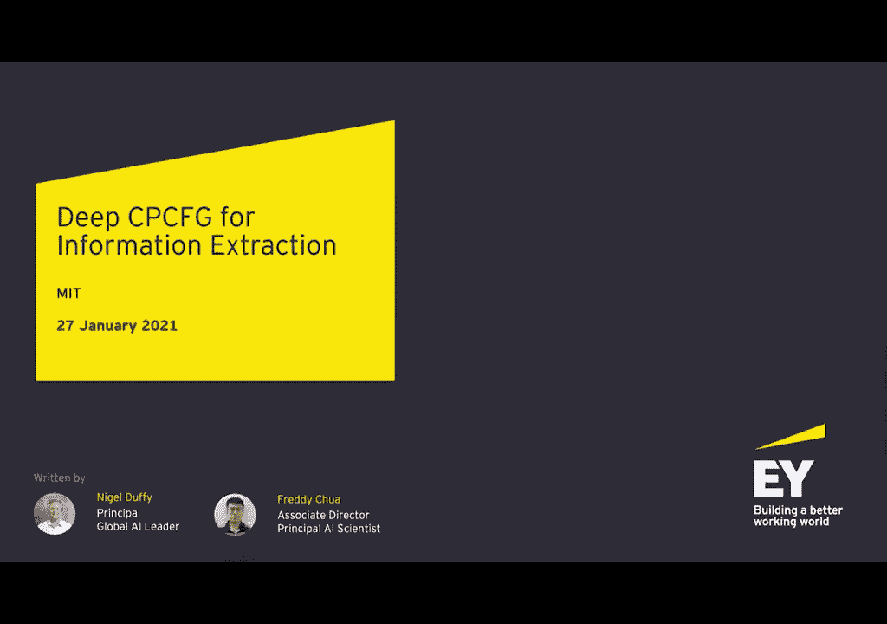

在此演示文稿中表达的是我的和，星期五不一定是我们雇主的，我会让你阅读其他免责声明，AI对于ernst年轻非常重要，你们中的许多人都会很熟悉。

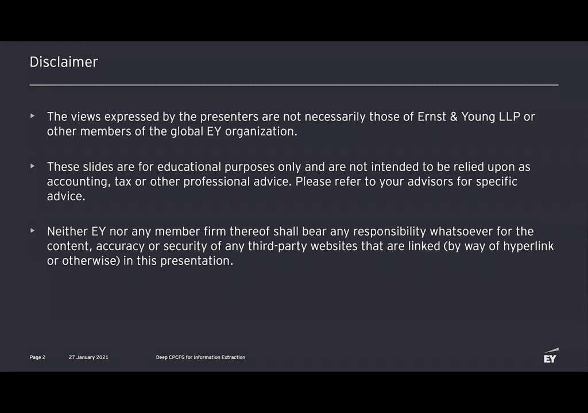

与该公司一起，我们是一个全球性组织，在150多个国家/地区的30万多人中，我们为客户提供一系列服务，包括保证，咨询策略，转型与税收，无论是在我们提供的服务方面，还是在我们的环境中。

客户自己的转变非常重要，我们看到许多行业正在发生巨大的破坏，包括我们自己由ai驱动的活动，正因为如此，我们在，在这方面的投资，我们已经建立了全球性的网络。

遍布全球的AI研究与开发实验室网络，您在世界各地看到的世界，我们也有，大量的全球AI交付中心，我们对艾有极大的热情和激情，这样我们的社区就有超过四千五百个成员，在内部，我们保持呃有意义。

与学术机构的关系，包括，例如麻省理工学院，我们当然会积极参与，政策制定者监管者立法者和非政府组织围绕与人工智能有关的问题。

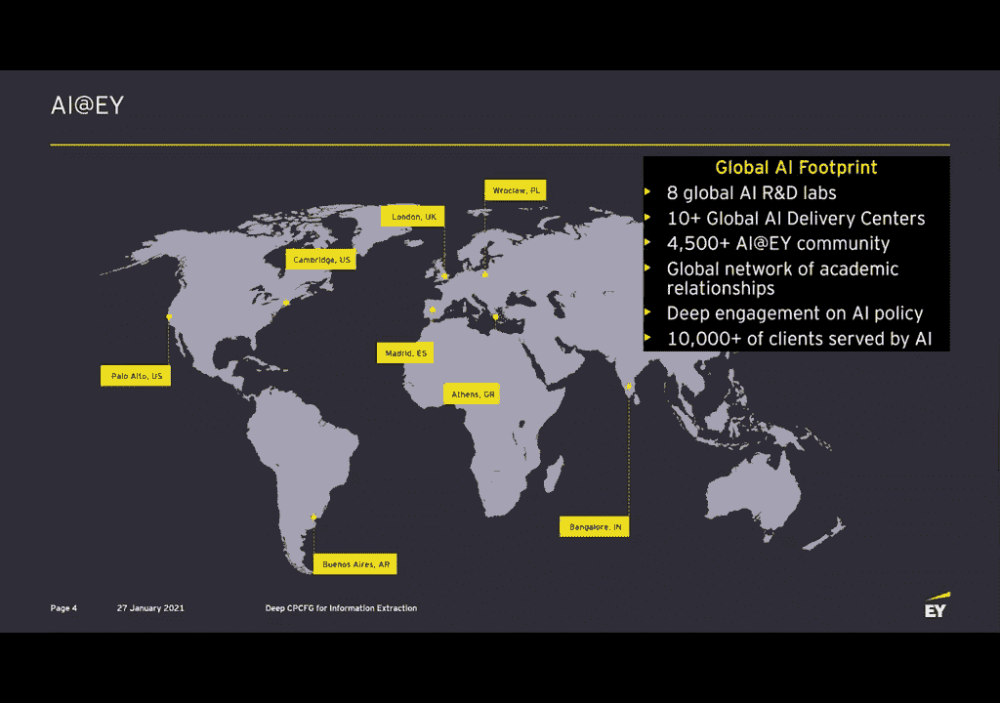

我们需要特别关注的一些领域，首先是文件情报，今天我们要讨论的，这实际上是，重新使用AI来阅读和解释业务文档，关键是有一些我们不一定要谈论的商业文件，关于电子邮件或网络帖子或社交媒体帖子，或，产品说明。

我们谈论的更多是诸如合同之类的东西，租赁合同收入合同雇用协议，我们在谈论法律法规，我们正在谈论发票，采购订单和证明之类的文件，交货的范围很广，各种文档，数十万甚至数十万，这里有成千上万种不同类型的文档。

我们在100多个国家/地区以100多种语言显示了这些信息，在数十个不同的行业和行业领域中，在ui，我们已经建立了一些我认为在我们所拥有的空间中真正引人注目的技术。

构建了一些现在可以在更多产品中部署的产品，超过85个国家/地区，并有数千个项目使用，而且这个空间对我们来说非常重要，我们帮助，在nurips组织了有史以来第一次有关文件智能的研讨会，在2019年。

我们当然会在该领域发布并申请专利，对我们很重要的其他两个领域将不会成为本主题，说话，但我想我会暗示，是交易智能，所以这里的想法是，我们看到，我们的客户执行许多交易，并且我们出于税收目的审查了这些交易。

以及出于审计目的，我们将处理数千亿，一年的交易量，交易数据，并且存在巨大的机会，机器学习和人工智能，以帮助分析那些交易，以帮助，确定例如税收或会计处理方法，还可以做诸如识别异常或异常行为之类的事情。

或者，潜在地识别欺诈对另一个非常重要的领域，我们是值得信赖的，因此，鉴于我们在，金融生态系统我们是金融信任的提供者，市场，我们必须帮助我们的客户，我们自己以及，广泛的生态系统建立了围绕AI的信任。

我们参与其中，大量与学者ngos和，监管者和立法者为了实现这一目标，但这次谈话的目的是要谈论，这次演讲的目的实际上是在谈论文档智能。

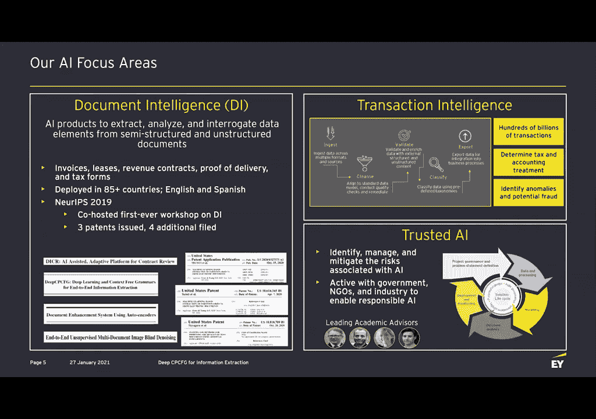

特别是我们将讨论从什么中提取信息，我们称半结构化文档之类的东西，税表，您会在屏幕上看到该文件，在您面前，这是一种报税表，其中将包含相关信息，形成那个，这些框中包含的内容，因此我们需要将其拉出。

这些形式的信息往往相对简单，因为，始终位于这些位置，但您会阅读，这些信息或提取这些信息不只是一个问题，阅读文字，我们还必须获取布局信息，考虑到这一点，甚至存在一些复杂性，这份文件是正确的。

这里有一个财产的描述，这是一个，列表，因此我们不知道此列表中可能有多少个条目，一个可能有两个可能会有更多，当然，例如当这些文件是，手写的或何时扫描的或何时。

更多变量，例如，一张支票，你们中很多人可能拥有，个性化支票，这些支票在，就其背景而言，就其布局而言，通常它们是手写的，通常当我们看到它们时，扫描的质量通常很差，并且，因此提取信息可能会带来挑战。

这又是驱动力，在很大程度上，由于可变性，我们有发票等文件，发票非常简单，但您会注意到，知道这里有订单项，每个都有多个订单项，其中的一个对应于该发票下的单个交易，并且可能有零个订单项。

或者可能有十个或数百个或，成千上万甚至在某些情况下成千上万，发票中的订单项数量具有挑战性，因为，企业可能有成千上万，甚至数以万计的供应商，并且每个供应商都会有一个，发票格式不同，因此。

如果您尝试将代码规则提交给，从这些文档中提取信息，它往往会失败，因此机器学习，方法的设计确实是为了应对这些文档中的这种变化，类型和这种复杂的信息提取。

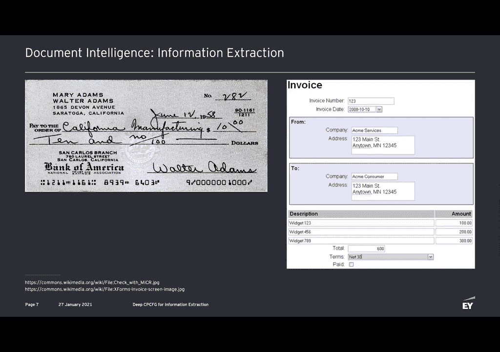

挑战让我在这里再谈几个其他例子，而且您还会看到另外两个问题，左侧的收据是非常典型的右侧，它是扫描文档，显然它已经被弄皱或弄皱了，输入的信息可能会偏移半英寸，因此，此客户ID未与此处的客户ID标记对齐。

依此类推，这带来了更多的挑战，而该文档在右侧是，一张非常典型的发票，您会看到扫描的质量，相对较差，其中包含许多订单项，而且它的布局与我们的发票有很大的不同，在上一张幻灯片或左侧的收据上看到了，因此。

在我们进行演讲的过程中，存在很多可变性，引用此文件为收据，并，我们将用它来说明我们的方法，所以我们的目标是，从此收据中提取关键信息。

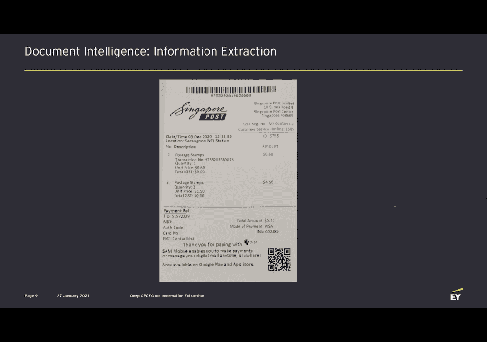

因此，让我们来谈谈我们想要提取的信息种类，所以第一种是我们称为标头字段的字段，例如，何时执行这些交易的收据权的日期，它包括收据ID um或发票ID，它可能包括这个总数，而这些信息非常。

对于会计而言很重要，请确保我们已经支付了收据，并支付了发票，我们认为这些发票对于税收目的很重要是，我们已经支付了这笔费用，无论是应纳税还是不纳税，适当的营业税，所以我们确实很在意这一点，信息。

我们将其称为标头字段，因为通常它们确实出现在文档的顶部，通常在顶部或底部，但它们是，通常一次出现的信息总共有一个，发票或收据没有对应的多个值。

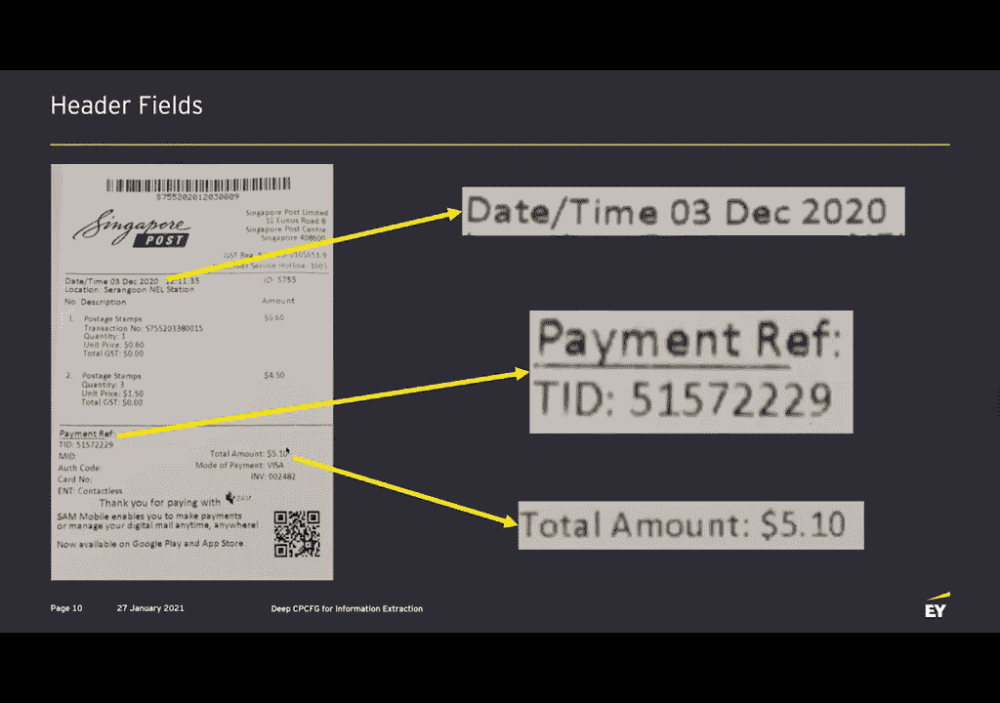

因此，您知道有一种相当明显的方法，我们可以将其深层应用，了解此问题，我们可以获取此文档并运行它，通过光学字符识别和光学字符识别，以及，服务或供应商已经相当不错，这样他们就可以在周围产生基本的边界框。

标记，因此它们会产生许多边界框，并且每个边界框，包含一个令牌，其中一些令牌，与我们要提取的信息有关，所以这五美元和十美元，美分就是总数，所以我们可以做的是，应用深度学习对这些边界框进行分类，对。

我们可以使用输入来进行深度学习，可能是整个图像，可能是该边界框的某些上下文，但是我们可以用它来对这些边界框进行分类，并且对于此标头信息来说可以很好地工作，但是有一些挑战，所以这里有。

这5美元和10美分的金额也是4。50， 60美分这里的1。50分是我们的60分，如果我们将所有，那些我们可能会被标记的多个，作为收据，我们如何消除歧义，那些，因此消除歧义的问题是。

基本以及这些中经常发生的情况，系统是存在对启发式或规则进行编码的后处理，经过人为改造以解决这些歧义，并且，变成了巨大的脆性来源，并且进行了巨大的维护，随着时间的流逝，我们会再说更多。

我们在这里看到的另一种挑战是该供应商地址之类的字段，因此此供应商地址包含多个令牌，因此我们需要将多个令牌分类为属于该供应商，解决，然后我们面临的挑战，这些令牌实际上属于供应商地址，其中有多少个，在那里。

我们按什么顺序阅读它们，恢复此地址，以便在一台简单的机器上，学习方法仍然可以实现一些价值，留下了许多需要解决的问题，通常可以通过此解决，手工设计的后处理，这变成了。

对于订单项更具挑战性，我们将在整个演讲中强调，订单项，因为这是许多重要，出现了巨大的挑战，因此在这里我们有两个订单项，对应于购买邮票的交易，也许是不同的，邮票种类，每一张都有说明，已发布的邮票。

此邮票具有与这两个邮票关联的交易号，它将有该笔交易的总金额，可能有一定数量，您可能有正确的单价，所以有多个，我们要提取的信息，所以现在我们需要确定这些信息在哪里，我们需要确定有多少个订单项。

该信息与哪些订单项相关联，因此这60美分，与第一个订单项或第二个订单项相关联，作为人类，我们可以读懂这一点，而计算机显然要难得多，时间，特别是考虑到那里的可变性，有成千上万种可以组织这些信息的不同方式。

所以这是根本的挑战，所以这些是我们想要的文件。

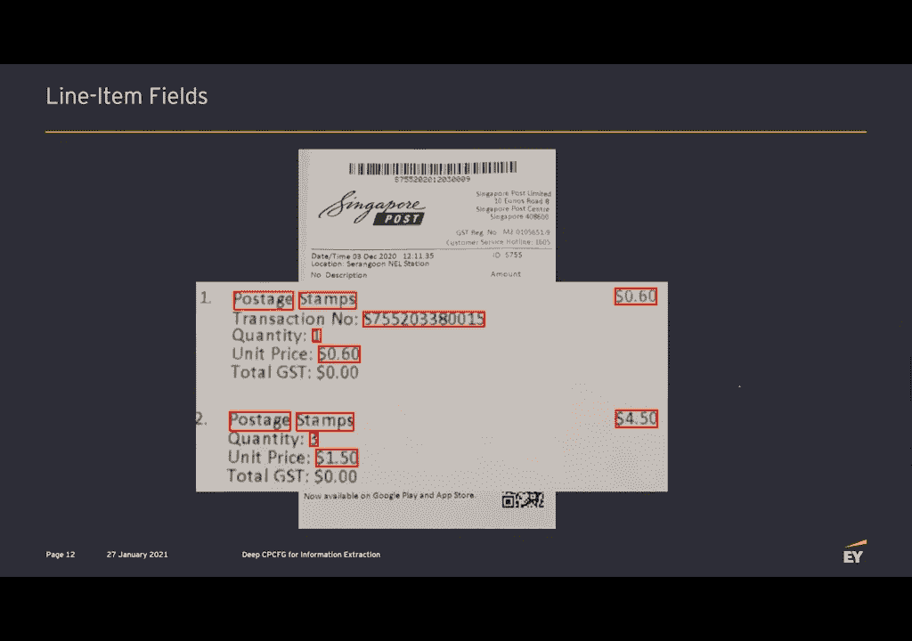

阅读，另一方面，是记录数据权的系统，通常此信息将是，通常由人类撤出并进入，到某些数据库中，这说明了某种数据库，模式，如果这是一个关系数据库，我们可能有两个，表第一个表包含标题，信息，第二个表包含所有。

订单项，这就是我们所需要的数据，可能会在记录系统中包含这两个信息，想要提取但也要提取可用的信息，我们为了这次演讲的目的训练这个系统。

更适合将其视为文档类型架构，以json为例，例如，现在我们有了标头信息，前三个字段，这不完全是json模式，而是，它应该看起来像这样，这是前三个，字段具有某种类型信息，然后我们有许多。

订单项和订单项数未指定，可能为零，也可能是，不止一个，然后每个人都有它的，拥有信息，因此我们面临的挑战是提取这些信息，这些文件和我们提供的培训数据中的某种信息，是原始文件和这类信息。

所以我想花一点时间谈论我们的理念，深度学习的基础上，您知道很多人都在考虑，深度学习就像大型深度网络一样。

不同的哲学，如果你认为机器如何经典，建立学习系统首先，我们要做的是，将问题分解为子部分，在这种情况下，这些子部分可能会，包括例如对边界框进行分类的内容，用来识别表格或提取行的内容，以及。

表格的每一列然后变成自己的，机器学习问题，为了解决该机器学习问题，我们，必须定义一些学习目标，我们必须找到一些数据，然后，我们必须训练该模型，所以这会带来一些挑战，这些数据不一定自然存在。

对这些文件我们不适用，一定有带注释的边界框告诉我们，信息在文档中的位置不会告诉我们，哪些赏金对应我们要提取的信息，因此，为了以这种经典方法进行训练，我们必须，创建数据，我们还必须定义这些目标。

我们为一个目标定义的目标之间可能会出现不匹配，这个问题和另一个问题，并造成摩擦和错误传播，当我们开始将这些部分整合在一起，然后最终，通常，这些系统在结束时会进行大量后期处理，根据特定的文档类型进行定制。

并且经过精心设计，所以发生的事情是这些系统非常脆弱，如果我们更改系统的任何内容，我们就必须更改许多有关，系统，如果您想采用该系统并申请，这是一个新问题，我们通常必须对后处理进行重新设计，对于我们来说。

我们在其中有成千上万种不同类型的文档，数百种或一百多种语言，您知道我们只是，不能对所有这些问题中的每一个都进行工程上的努力，能够完全一样地应用相同的方法，每个人都使用相同的软件，实际上，对我而言。

这是深度学习作为一种哲学的核心价值，是关于端到端的培训吗？我们有这样的想法，我们可以培训，整个系统端到端基于我们所面临的问题，试图解决和数据，我们从根本上拥有自然数据，我们可以利用。

因此我们再次将问题分解为，细分，但我们建立了深层网络，与每个子问题相对应的组件，然后我们将这些网络组合成一个大型网络，我们从头到尾进行培训，这很棒，因为整合，设计此网络时，问题就会出现一次。

很容易维护数据采集问题，因为，我们将其设计为一种端到端的方法，对问题存在的自然数据进行建模，当然，在如何设计这些网络方面也存在一些挑战，真的，在这种情况下，这是我们面临的主要挑战。

构建这些构建基块以及如何组成它们，因此，在这种情况下，我们将讨论如何进行此操作，组成深度网络组件以解决问题。

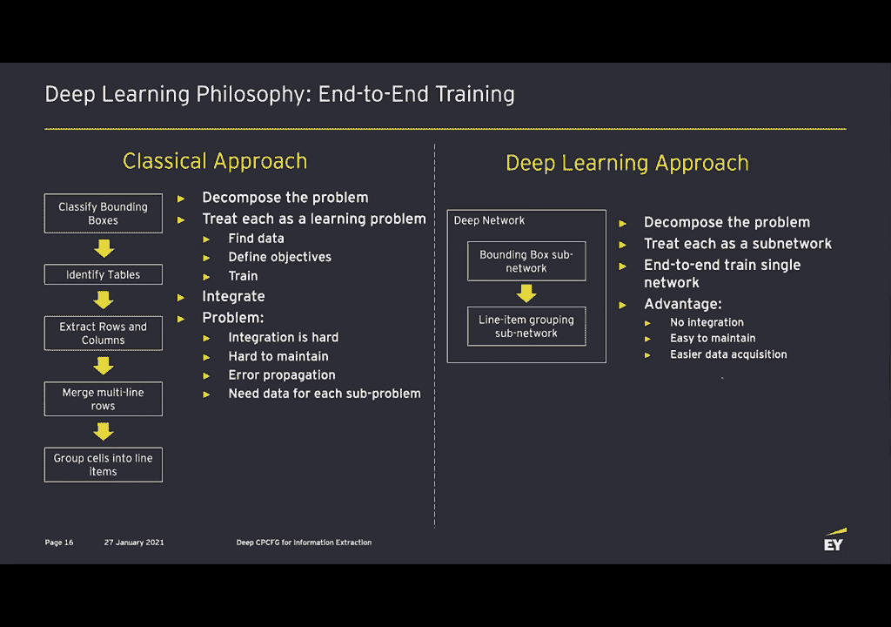

结束，所以在这里我们要做的就是对待这个，问题作为解析问题，我们将其纳入文档中，我们将，将它们解析为二维，这是一些关键的地方，创新在两个方面进行解析，在这里我们使用，深度网络。

因此深度网络将告诉我们所有潜在的，为这些文档之一解析树，这是最有可能的，或与数据最匹配的最合适的，然后我们将简单地阅读，从那棵分析树上关闭记录数据系统，没有帖子，处理过程中。

我们只是从字面上读取了解析树，然后我们读取了，该json数据作为输出，所以再次。

嗯，所以我们在这些文件上，在这些输入文档的左侧，右侧，我们通过ocr运行它们以获取，包含标记的边界框将输入设置为系统，然后，系统的输出是此json记录，描述我们从文档中提取的信息，正确。

它描述了我们提取的信息，没有描述布局，文档中仅描述了我们提取的信息。

好的，那是基本的方法和机制，我们将在这里使用的是上下文无关的语法，和上下文无关的语法，无论何时您想解析，都必须，有一种语法可以针对您的语法针对上下文进行语法分析。

具有计算机科学背景的人确实是计算机科学的主力军，它们是许多编程语言的基础，并且，他们是很好，因为它们相对容易解析，我们不会讨论语法上下文的技术性，我认为，这里要知道的关键是它们由。

规则的规则有一个左手边和一个右手边，以及我们的方式，想想这是我们可以采取左侧，并考虑认为它是由组成或组成的，右侧，因此订单项由说明和总计组成，描述描述的数量可以仅仅是一个，单个令牌，也可以是一系列描述。

正确的描述可以是多个标记以及我们的方式，以这种语法编码，以这种递归方式，好吧，现在我们将应用此语法来解析这种json，而且我们确实必须对该语法进行一些扩展以捕获我们关心的所有内容。

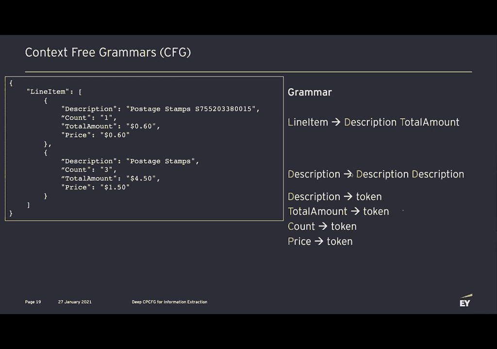

关于，但这种语法仍然非常非常，简单的权利，这是一个小的简单语法，真正捕获我们要提取的信息的模式，现在让我们谈谈如何解析一个简单的订单项，我们有一个简单的订单项，那就是邮票，我们每个都有3个邮票。

50美元，总共450美元。所以我们要做的第一件事是，嗯，对于我们替换的所有这些令牌，我们确定了一条规则，令牌出现在右侧，我们将其替换为左侧，因此，如果我们查看此邮资令牌，则将其替换为d。

说明我们本可以用t代替它，在这种情况下，金额或c为计数或p为价格，我碰巧知道d为，正确的令牌，所以我将其用于说明目的，但关键，观察到这里有些模棱两可，是的，目前尚不清楚，其中哪些替代是正确的，要做的。

这又是深度学习要解决的地方，这种歧义，所以解析的第一阶段是，呃，我们到处都是替代品，我们看到的是右侧，规则，我们用规则解析的左侧代替，歧义随着我们去，下一步是通过建设和技术。

这些语法总会在它们上有一个记号的原因，左侧，或者他们有一个，抱歉，这看起来好像有些问题，所以他们要么在右侧有一个令牌，要么有两个，呃符号在右边，所以既然我们已经处理了所有令牌。

我们现在正在处理这些符号对，因此，我们必须确定要替换的符号对，再次用左手边，所以这是我们的描述描述，用描述代替并，同样，我们用数量和价格代替，好的，所以我们重复一下这个过程，并得到一个完整的分析树。

这里的最终符号是一条线，项，这样告诉我们这整个事情是线性的，由数组成，价格和总金额还可以，所以我说有些含糊，这个歧义的一个地方是呃三和五十美元，我们怎么知道这实际上是一个计数和一个价格对，这可能。

就像描述和描述一样容易，因此很难解决这种歧义，但这是学习的机会，这就是学习的来历，通常可以学到五十美元，可能不是描述的一部分，与我们要提取的其他一些信息有关，因此。

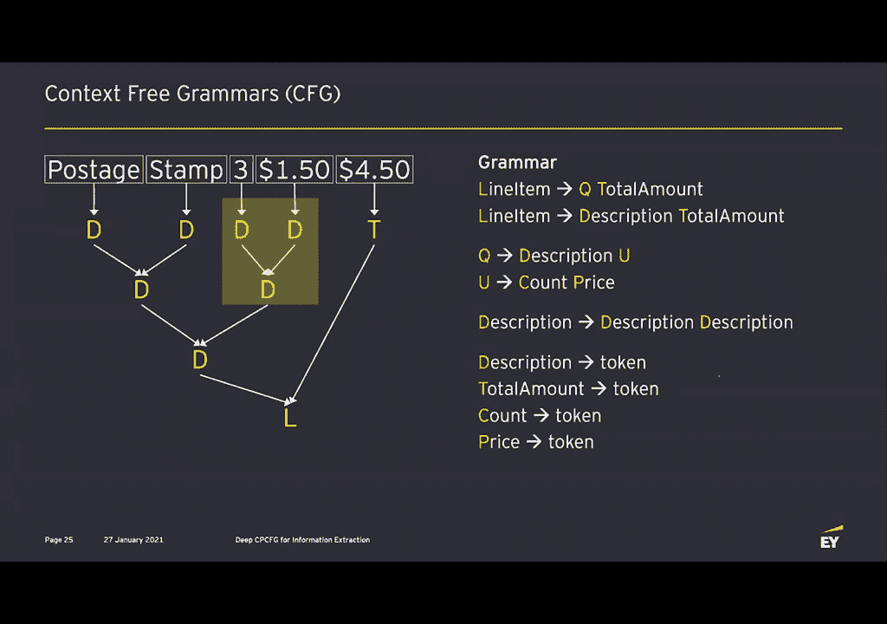

这就是我们想要学习的东西，所以我们做到这一点的方式是，将每条规则与分数相关联，所以每个规则都有一个分数，现在我们尝试使用具有，高分，以便我们最终产生，具有高总分的分析树，所以我们实际上要做的是。

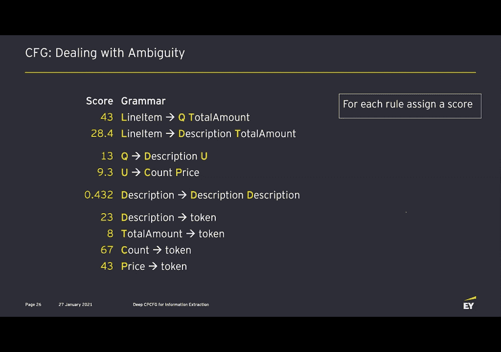

我们将使用深层网络对这些分数进行建模，因此对于每条规则，我们将拥有一个与该规则相对应的深层网络，给出该规则的分数。

现在让我说明一个简单的例子，一五十美元，这可能是一个描述，总金额或价格，我们可能会直观地认为这应该，偏向于总金额或价格，因为，这是一个货币价值，但是我们要解决的方法是，应用与每个规则相对应的深度网络。

右边有四个深度网络，我们将应用这些深度网络，他们每个人都将返回一个分数，我们，期望随着时间的流逝他们会学到，总金额的深层网络得分会更高，而，价格将有较高的分数，因此从根本上讲，对于这些最底层的规则。

这些基于令牌的。

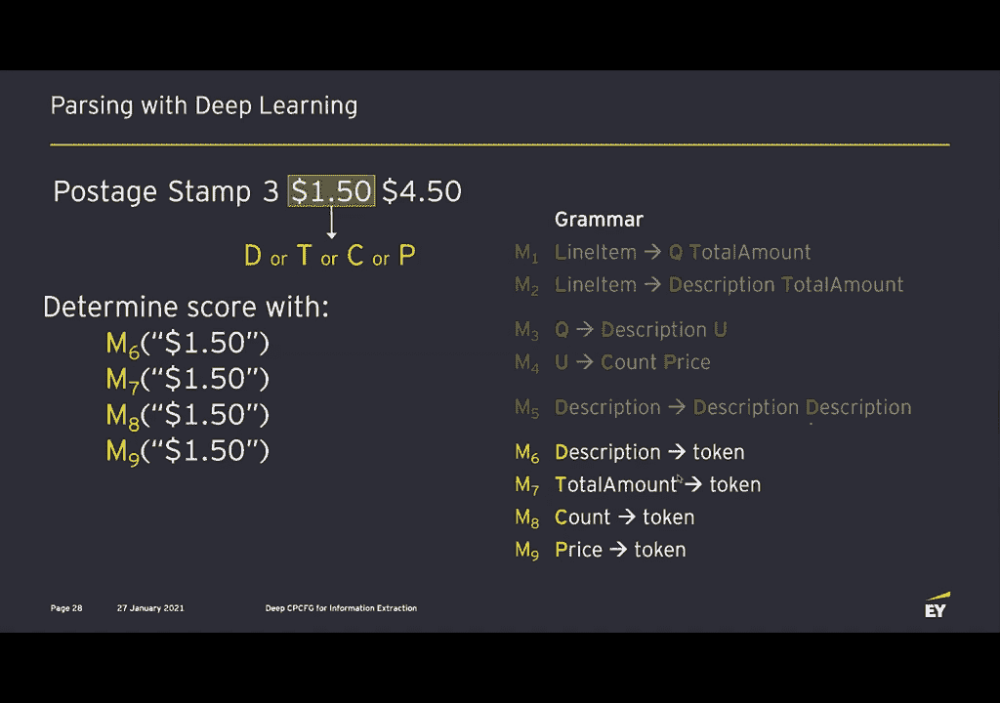

规则，更多涉及的规则，右边有两个词，我们也有类似的问题，解决歧义，所以我认为这里有两个重要的见解，首先是那个，你知道我们确实有这种歧义，我们如何标记这些第一个标记，我们可以执行cp或dp。

但是我们很快就发现没有dp规则，在右边，所以语法本身，有助于纠正此错误，因为没有规则可以，允许这种语法分析将纠正该错误，并且，因此，语法使我们可以对，这些文件包含的信息使我们可以对一些先验编码。

对问题的了解，这真的很重要，也很有价值，第二种模棱两可的是你知道的地方，这是允许的，但也许不是正确的答案，因此，在这种情况下，我们可以将cp替换为au，我们将为此规则评估模型。

基于这棵树的左手边和树的右手边，所以，这将有两个输入，左侧和右侧，同样，对于该规则，您尝试将其建模为描述，说明，因此这些模型中的每一个都将，得分会帮助我们消除歧义，在这两个选择之间，然后出现了问题。

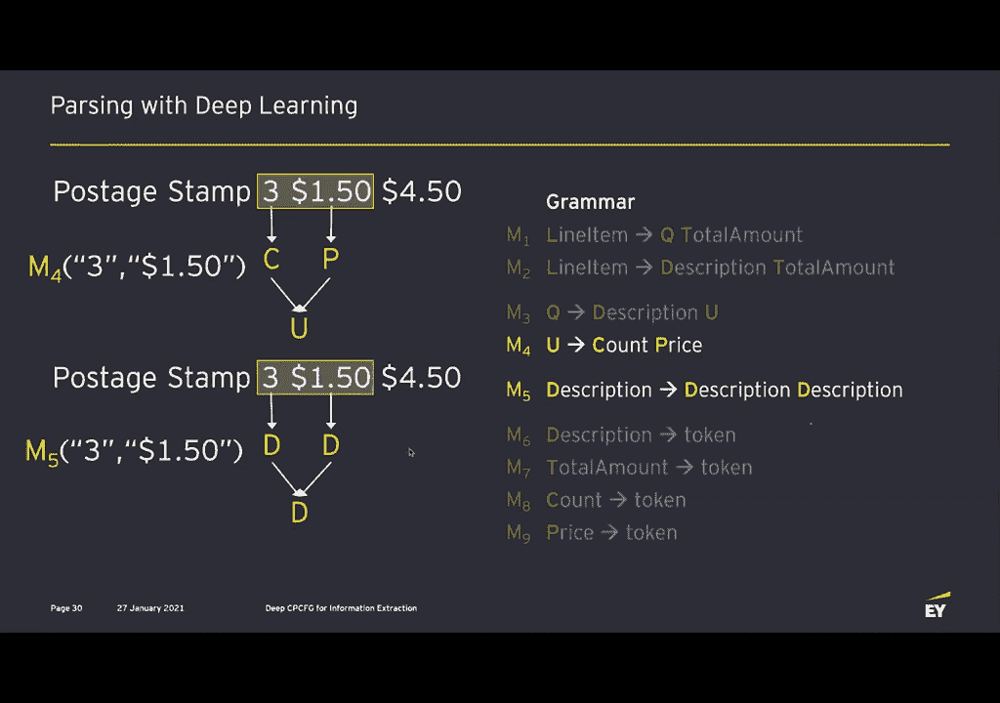

我们如何得分一棵完整的树，我将介绍一些。

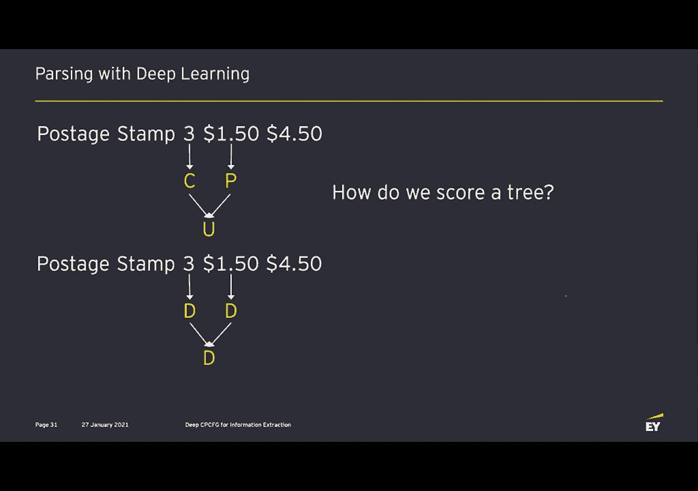

表示法，希望这不是太多表示法，但想法是我们要称呼完整的解析树，t，我们将通过以下方式表示该树的得分，ct，我将在此处滥用表示法，将c重新参数化为具有三个参数，第一个是符号，在树的根部，另外两个是跨度。

句子的覆盖范围，在这种情况下，那棵树就是整个，句子，所以我们现在使用索引0到n，同样的符号也适用于子树，我们的第一项是该子树根的符号，我们有跨度的索引，这不是整个句子，从我到j好吧，所以这是分数，嗯。

是一棵子树，让我们看看这里是否存在真正的问题，快啊，所以这是分数，为一个子树而准备的，我们将要。

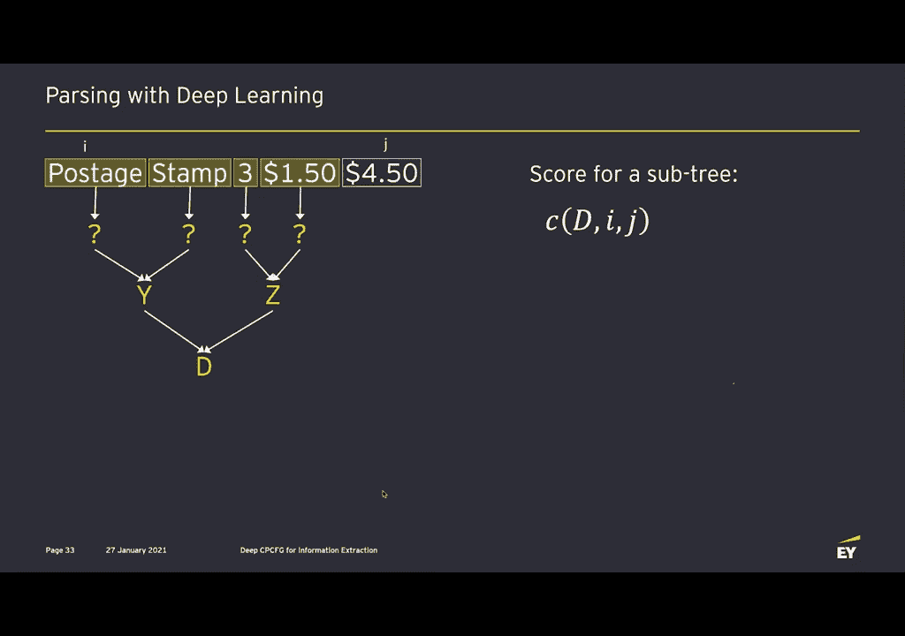

根据深度网络再次定义，对应于该子树的根处的规则。

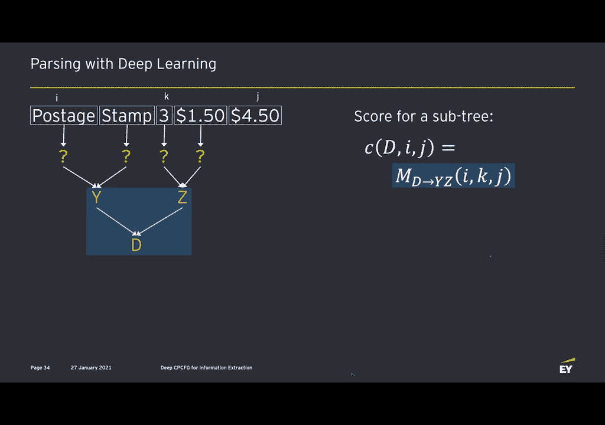

但它也由其他这些子树组成，所以我们要有对应于左侧和，这棵树的右侧，所以这些是我们已经定义的，现在根据组成它的树递归得分，我确实看到这里有一个问题，它说，考虑到。

语法约束是否有助于神经网络学习并获得更多样本，高效，是的，关键是我们知道，有关使网络变得更多的问题的事情，高效的，因为我们已经应用了这些先验知识，这对于解决像这样的复杂问题真的很有帮助，好吧。

就像我说的，我们现在定义了对整棵树评分，就这三个术语而言，在这里要注意的是，实际上，我们希望这是可能导致d的最佳分数，从根本上讲，所以实际上我们要将此分数建模为，以广告结尾的所有可能规则的最大值。

以及所有可能的方法来解析左树和右树，这似乎具有挑战性，但实际上我们可以动态地应用，编程相当简单，可以相当高效地找到它，很好，所以我们现在定义一个计分，这些订单项的树解析机制，然后发生的是。

我们将能够在所有，可能会使用该分数来解析树，并使用，最高分数是我们认为最有可能的分数，最有可能是包含我们关心的信息的一种，关于，然后我们就读了这些信息，在解析树之外，所以我们现在要训练深层。

网络以选择最有可能的我们最有可能的，解析树，只是提醒。

正如我所提到的，这第一个术语是一个深层网络，这些规则中的每一个，然后我们有这些递归项，再次根据这些深层网络进行定义，因此，如果我们展开此递归，如果我们展开此递归，我们将，建立一个庞大的网络。

其中每个网络都由网络组成，这些单独的规则，我们将为，我们试图解析的每个文档，因此，深层网络就是这个动态对象，由这些子问题的解决方案组成，以便识别，这是正确的解析树，所以我们该如何训练，这很简单。

我们使用结构预测中的想法。

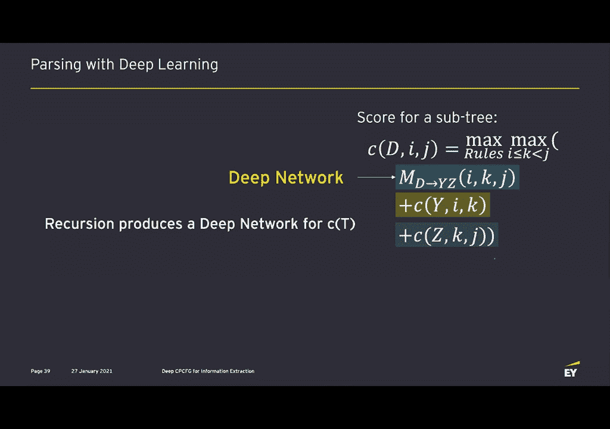

在这种情况下，结构预测的思想是我们有一些结构，拉帕斯树，我们想最大化，好的解析树，并最小化其他所有树的分数，正确解析树，所以这里的损失函数正在尝试，要做或这个目标正在尝试做的是。

最大化我们在我们看到的正确解析树的分数，训练数据并最小化其他所有分数，解析树我们在训练数据中看不到的树，可以使用反向传播和梯度下降或，我们从深度学习中获得的任何机制，所以这现在成为经典的机器学习。

我们很遗憾的深度学习优化问题，以及，其结果是用于解析这些文档的端到端系统，现在我没有谈论的是，这些文件实际上是二维的，到目前为止，我只是专注于，一维数据，所以现在我将移交给freddie。

他将谈论我们如何处理这些数据的二维性质，弗雷迪很好，谢谢你，奈杰尔，好吧，这就是。

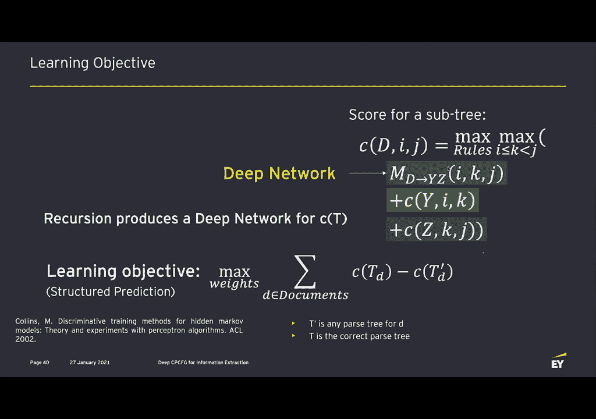

我们之前显示的收据的一部分，我们，将专注于这个蓝色边界内的线。

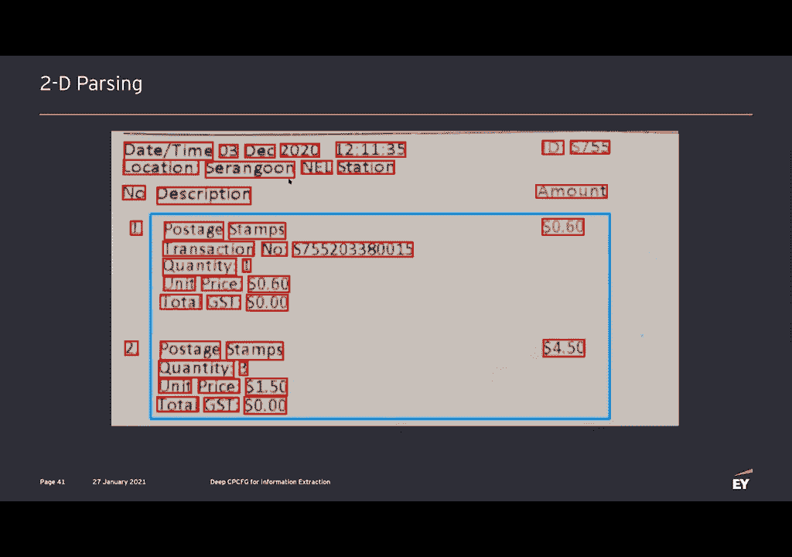

我们沿用的区域是我们应用ocr的区域，到收据，我们得到代表每个代币的边界框，收据中显示的左侧是订单项。

在右侧，这是我们尝试通过的注释，我们正在尝试，获取与这些注释匹配的路径，嗯，你会看到的是，这里有很多盒子。

我们认为是无关紧要的，因为它不会，显示在注释中，并且不会成为以下信息的一部分，我们想要提取，所以我们将这些额外的框称为，简化解析，我要删除它们，然后转到，2D解析，我们将回来看看如何。

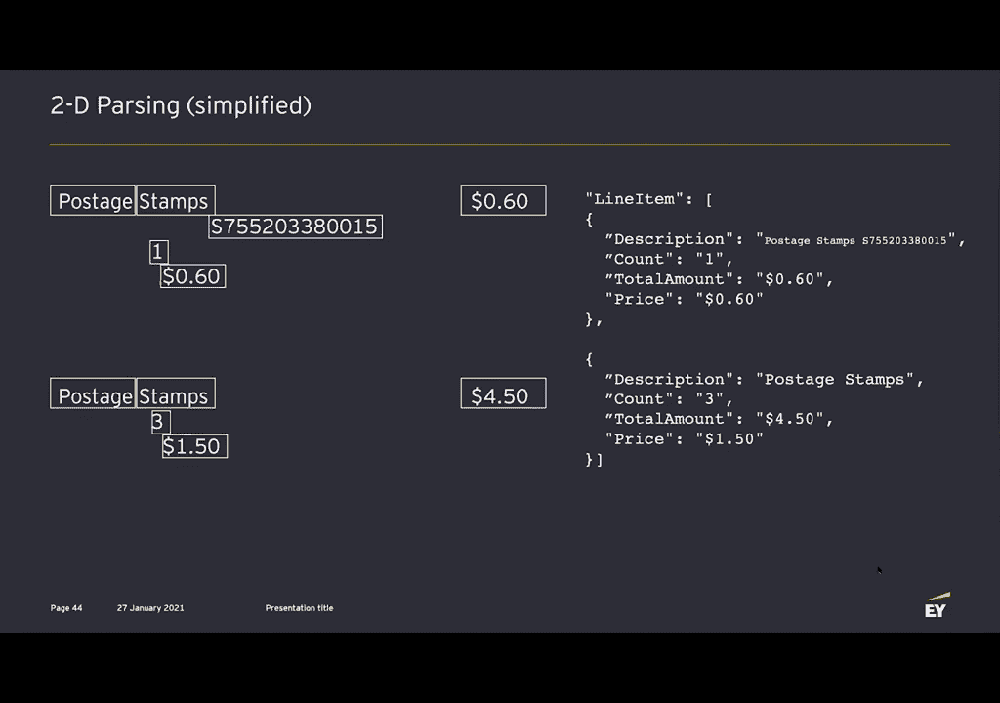

我们处理这些额外的盒子，所以在讨论2d解析之前，我只是想激励我们为什么需要进行2D传递，所以您，看到这里是第一层的二维层，订单项，如果我们要采用此订单项，然后将其简化为一维序列，结果是。

最初是连续的描述，2d版式中的版式在1d表示中不再连续，嗯，您会看到，蓝色，黄色区域在2d中是连续的，布局，并且在序列中不再是连续的，那是因为在这60感的蓝色区域，截断了说明。

因此我们可以在其中添加其他规则，处理这种情况，通常不会一概而论，所有情况下的所有情况um更好的解决方案实际上是，在2d中通过它并在2d中暂停它会更好，与我们人类对文档的解释方式一致。

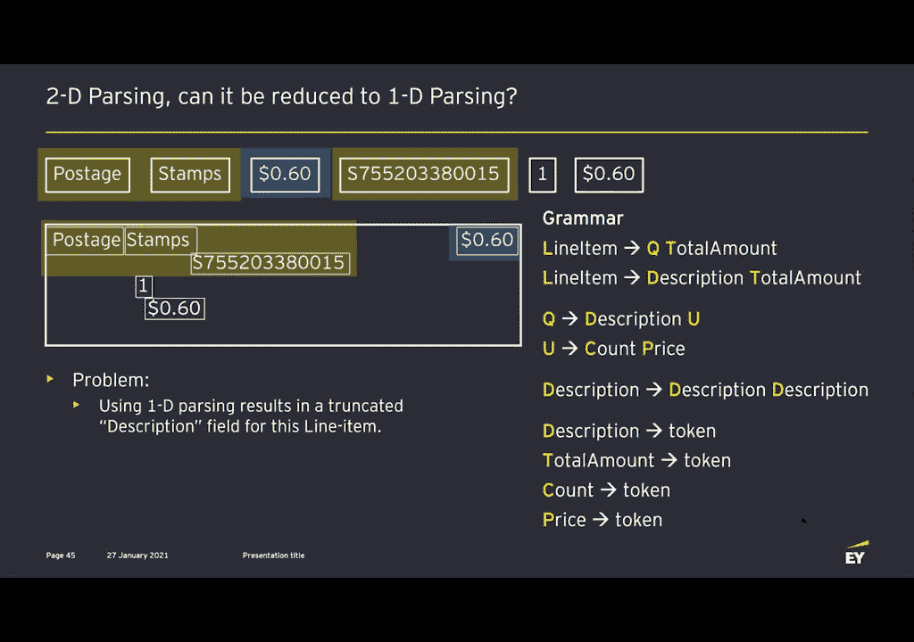

一般，所以我们从令牌开始，就像奈杰尔提到的那样，我们通过深层网络进行了介绍，深度网络将为我们提供它认为每个令牌所代表的含义，因此，在这种情况下，我们获得了令牌的类，现在我们可以。

开始以左上角的标记开始合并它们，呃是，邮费这个词，所以我们知道后期是，描述最合理的选择是，与离它最近的令牌结合，并，这就是立场，所以我们可以将其水平传递，方向，我们可以做到这一点。

因为语法中有一条规则说，两个描述框可以合并为一个描述，现在接下来要做的是我们可以通过它，我们可以在此处看到右边的内容，或者您​​知道我们可以将其传递给，垂直方向，所以如果选择的话我们应该选择哪一个。

像我们在这里展示的那样水平沉积，因为语法中有一条规则说，一条线可以只是总数，但是会发生什么，是所有其他盒子都悬在那儿，然后，不会属于任何订单项，实际上这不是理想的选择，路径。

因为那样就不会与我们拥有的注释匹配，另一种方法是沿垂直方向通过，如此处所示，需要注意的重要一点是，我们不硬编码通过的方向，相反，深层网络会告诉我们哪一条是更可能的路径，在这种情况下。

您可以将它们组合在一起，因为我们知道邮票就是描述，而d网络告诉我们，这里的这串数字，有一个描述，您可以将他们加入成为一个描述，接下来要做的是看um盒子，这里的令牌和60，我们知道，一分钱是六分钱。

一个价格，我们可以加入他们的行列，因为我们在语法疾病方面有规律，您可以加入专柜价以获得简单的价格。

现在，接下来的事情是我们可以加入描述和简单的u，最后我们得到一个简单的多维数据集，我们不要忘记我们仍然有一个，那里的令牌，我们知道令牌是总数，最终我们可以横向加入，我们和。

由于整条线都过来了。

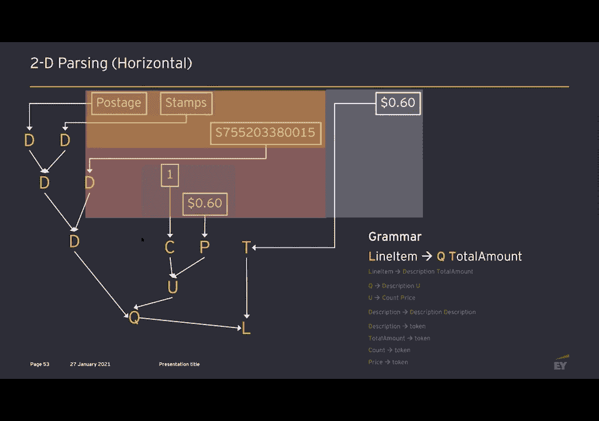

所以继续前进，早期我们通过以下方式简化了解析问题，删除所有这些不存在的多余盒子，但是，如果我们把它们放回去，该怎么办呢会使它复杂化。解析不在注解中，我们之前没有显示它，所以，我们会做吗。

好吧，就这么早，我们已经知道邮费，邮票是描述，我们可以加入其中，成为一个，再次描述，所以这里有多余的文字，交易号字词呃，我们对它们做些什么介绍，语法中的新规则，新规则是，说我们允许令牌成为噪声。

所以噪声变成了，深入的网络可能会回到我们的课程，如果我们知道交易号，可以将其归类为噪音，那么接下来要做的就是，抱歉，我们可以将两个噪音uh令牌连接在一起，我们得到了一个噪声标记。

因为我们在语法中引入了一条规则，这使我们能够做到这一点，接下来，我们要添加另一条规则，描述周围可能有一些杂音，在这种情况下，我在这里添加了一条规则，您可以看到，这里的感叹号表示对此的排列。

规则这意味着我们不会施加约束，这些右侧符号如何出现，在这种情况下，噪声可能先于描述或描述而来，在这种情况下出现噪音后，此处显示的示例，噪声来自b进行描述，我们可以将噪声和a结合起来。

说明一起获得另一个说明，在这里，我可以将两个结合起来，说明，我得到一个说明，以便您可以看到，这就是我如何处理不相关令牌的方式。

在文件中，因此继续逻辑，最终我们，最终将正确冻结其中的订单项，文件，这就是我们得到的匹配，当前信息，好吧，所以我最后想谈谈一些实验结果。

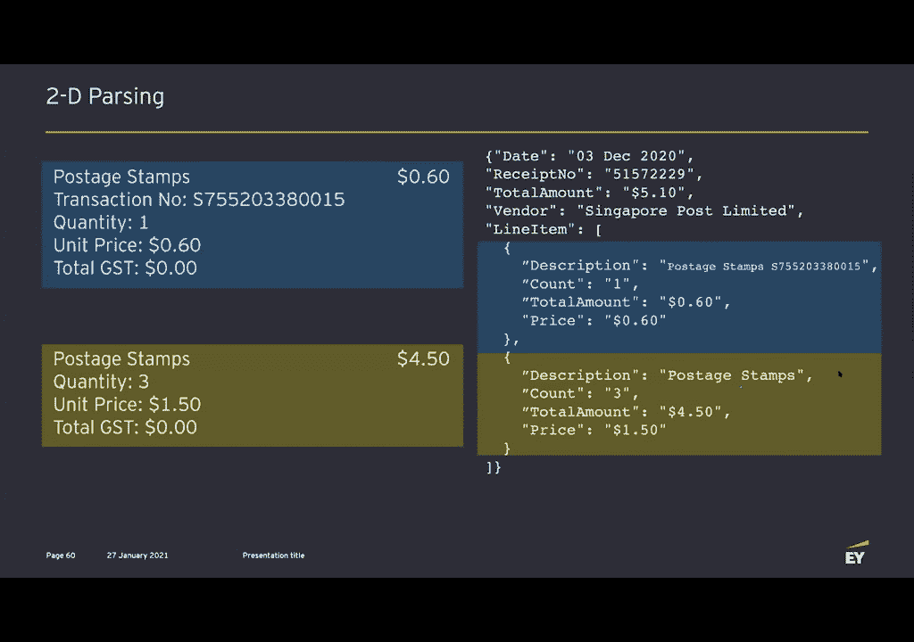

很好，我们公司主要专注于，发票，其中大多数发票都是机密文件，因此，尽管我们认为可能会有其他实验室也在与其他公司合作，在同一个问题上，很难找到一个公众，数据集来比较我们的结果与幸运的是，有一个有趣的。

三叶草ai的作品是一个实验室，我们正在这样做，在韩国的一家名为海军公司的公司，他们也在网上查看问题，项目和他们的信誉，他们已经发布了一个数据集发布一个，一组数据一组收据一组原因。

他们已经写过并且他们的论文已经作为预印本在出口，我们的方法与他们的方法之间的主要区别在于，他们需要的是对收据中的每个边界框进行注释，这意味着您要进入的每个边界框都将这样说，边界框属于此类。

每个边界框都需要，在我们的案例中，与之相关的坐标，我们要做的就是依靠记录系统，在没有边界框坐标的json格式前面。

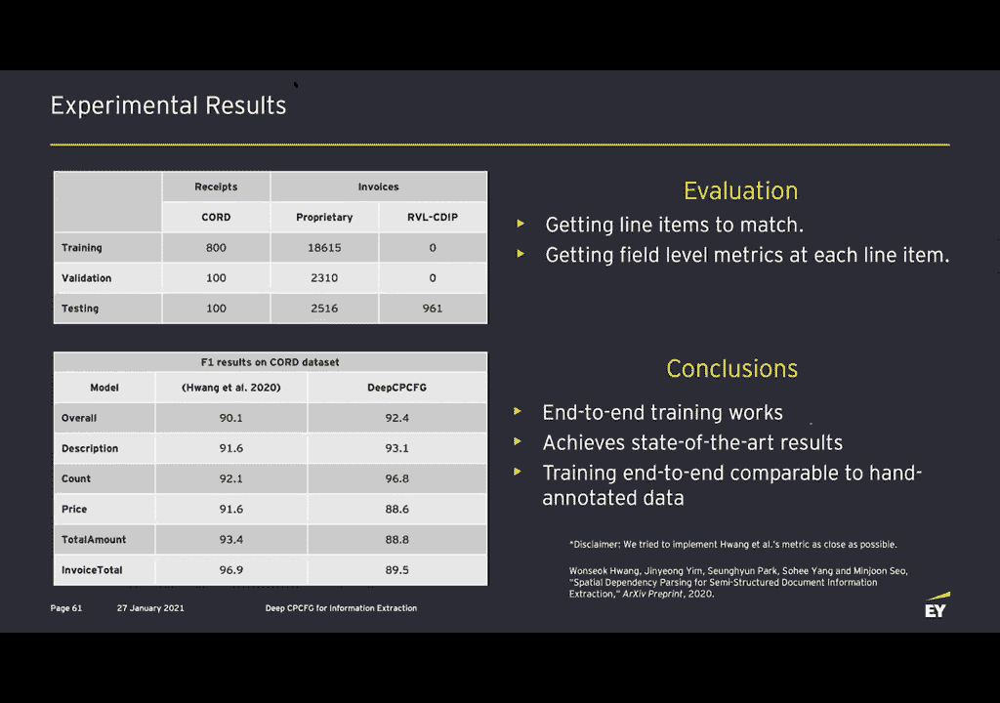

我们正在做的如此有效的是，培训中，我们所依赖的信息少于我们应有的信息。

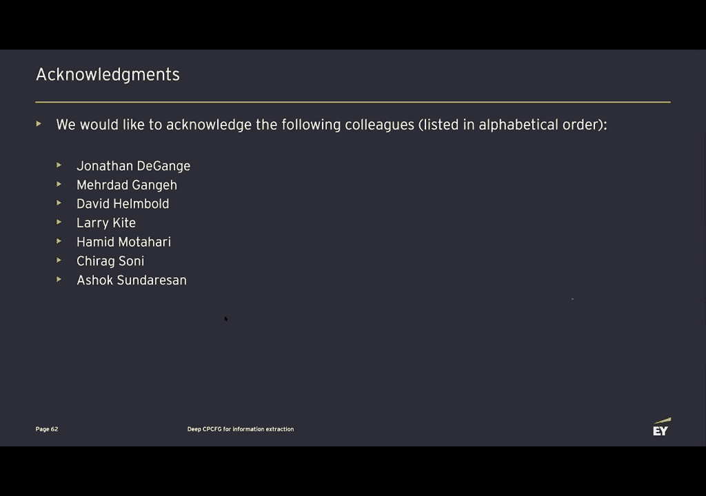

根据结果​​，我们获得了相当可比的结果，尽可能地，我们尝试将指标实施为尽可能接近，他们描述了，所以我想，那个我可以给任何人，奈杰尔，非常感谢弗雷迪，让我看看我是否能控制住自己。

好吧，让我好吧，我想我很好，所以嗯，你知道这是一个数字，的人帮助我们完成了这项工作，因此，我想感谢您的帮助和。

和，请保持联系，我们在用户界面上做了很多有趣的工作，全球各地，我们正在招聘，请通过以下方式与我们联系，aiadyy。com，我们引用了其他一些工作。

在谈话中，这里有很多非常有趣的优秀论文，绝对值得一看，聊天中有几个问题，思想真的很棒，所以也许让我尝试回答，他们在这里，因为我认为他们也有助于澄清这个问题，内容，所以有一个问题是。

我们可以让AI模型学习最佳语法来解析，而不是，定义语法约束，这是一个非常好的问题，但是，其实语法来自问题，正确的语法是问题本身的内在语法。

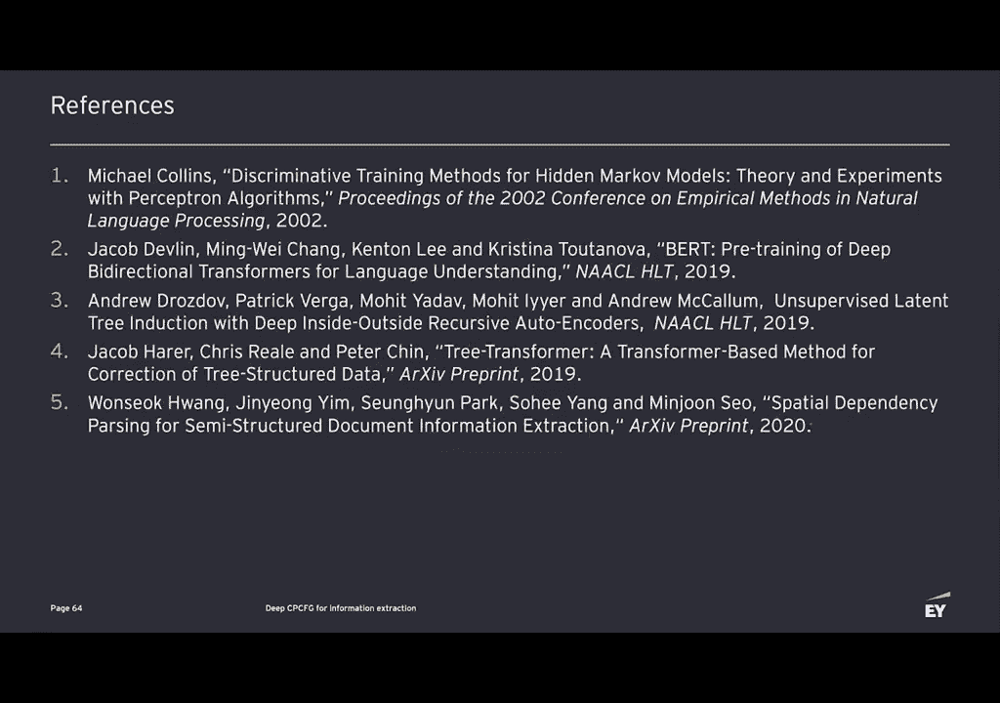

可以根据我们要提取的数据的模式自动生成，所以问题很自然，这不是我们必须发明的，它来自问题本身，还有一个问题是，可以跨规则共享网络，再一次是一个很好的问题，呃，我认为有几种方法可以考虑，第一。

这些规则都有自己的网络，并且我们在这些规则的每个应用程序中均分担权重，是否将其在单个解析树中多次应用，或跨多个文档的多个解析树，另一种是我们经常会利用语言编码器之类的东西，和bert例如要嵌入。

以为每个，令牌，所以那里有很多共享参数，所以有很多方法，这些参数在其中共享并且最终它们最终被，可能产生相对较小的网络，解决甚至非常复杂的问题，例如，关于2D解析是否贪婪地进行，存在一个问题。

所以这又是一个很好的问题，解析cfgs的算法利用了动态编程，因此它，不，这不是一个贪婪的算法吗，实际上产生了最高的核心解析树，它确实，以一种非常幼稚的高效方式，算法看起来像它，将是指数级的。

但随着动态的应用，编程，我相信它已经入伍了，然后是一个问题，规则是否会尝试评估，标记化的数据，例如实际等于的总数，价格时间在再次评估一棵树的可能性时计算，真的很好的问题，我们还没有这样做。

但这是我们确实要做的事情，因为那是一个非常，有用的约束对，这是我们对问题的了解，是订单项总计趋向于等于单位计数乘以单价，并且，这样约束应该真的很有价值，帮助解决这个问题，然后最终解决语法问题。

适用于不同文档类型的规则，因此这些语法规则对于问题来说是基本的或自然的，它们与我们要提取的信息的模式相对应，因此，文档类型之间的语法可概括性的概念是，不太重要，所以谢谢你，我很乐意回答。

