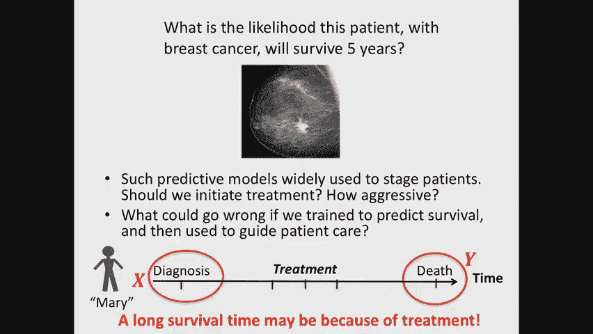
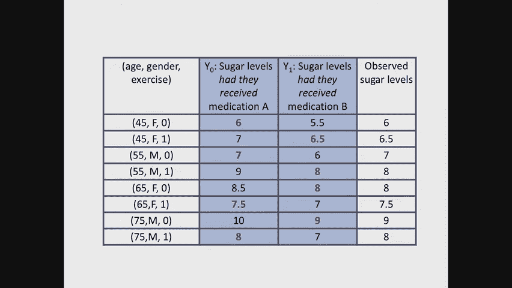
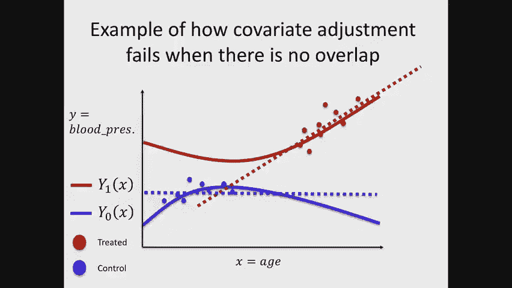

# MIT医疗机器学习中英文字幕 - P14：14.Causal Inference, Part 1 - 大佬的迷弟的粉丝 - BV1oa411c7eD

所以今天的课是关于因果关系的，谁在举手之前听说过因果关系，当你思考因果关系时，你听到的第一件事是什么，相关性并不意味着因果关系，相关性并不意味着因果关系，我想起了什么，这就是我想到的，我想起了什么。

所以到目前为止在这个学期里，我们一直在讨论纯粹的预测性问题，对于纯粹的预测性问题，有人可能会说相关性已经足够好了，对呀，如果我们的数据中有一些迹象可以预测一些有趣的结果，我们希望能够利用这一点。

不管是上游还是下游，因果方向性与此目的无关，虽然那也不完全是真的，对吧，因为我整个学期都在暗示，我整个学期都在暗示的人，有时你的数据会发生变化，例如，当你从一个到另一个，或者当你有非平稳性的时候。

在这些情况下，对数据有更深入的了解可能会让人建立额外的健壮性，到该类型的数据集移位，但也有其他原因，为什么了解底层数据生成过程非常重要，这是因为我们经常想回答的问题，当涉及到医疗保健时。

不是预测性的问题，它们是因果问题，所以我现在要做的是，我将举几个例子来说明我的意思，让我们从第四讲第二套习题集的内容开始，在那里我们研究了如何对第二型进行早期检测的问题，您下载的糖尿病。

你用杜鲁门市场扫描数据集，至，构建风险分层算法，用于检测谁将被新诊断为糖尿病，一至三年后，如果你想想如何部署这个算法，你可能，比如说，试着让病人去诊所得到诊断，但下一组问题通常是关于。

那么根据这个预测一旦确诊你会怎么做呢，你将如何干预，在一天结束的时候，有趣的目标不是你如何尽早找到它们，但是你如何防止他们患糖尿病，或者你如何防止病人出现糖尿病并发症，那些是关于因果关系的问题，现在。

当我们建立我们的预测模型时，我们反思了权重，我们可能注意到了一些有趣的事情，比如说，如果你看最高的负重，我不确定这是不是我们任务的一部分，但作为我研究的一部分，我做了一些事情。

你看胃旁路手术有最大的负面影响，这是否意味着你给一个肥胖的人做胃旁路手术，防止他们患二型糖尿病的手术，这是一个因果问题的例子，这是由这个预测模型提出的，但单看重量，正如我本周将向你展示的那样。

你不能正确地推断，有因果关系，所以我们要做的一部分是想出一种数学语言，为了思考，一个人怎么回答，这里有因果关系吗，这里有第二个例子，就在春假前，我们有一系列关于诊断的讲座，特别是从成像数据进行诊断。

种类繁多，不管是放射学还是病理学，通常问题是这样的，她得了乳癌，也许你也有相关的病理幻灯片，你想知道风险是什么，所以人们可以采用深度学习模型，一个人观察到的，所以在你的数据集中的病人中，你有输入，你有。

让我们说，生存时间，你可以用它来预测从确诊到死亡需要多长时间，基于这些预测，你可能会采取行动，比如说，如果你预测一个病人没有风险，那么你可能会得出结论，他们不需要接受治疗，但那可能真的，真的很危险，和。

我只举一个例子来说明为什么这会很危险，这些预测模型，如果你用这种方式学习它们，本案的结果，让我们说，死亡的时间会受到两者之间发生的事情的影响，例如，这个病人可能正在接受治疗，因为他们在两者之间接受治疗。

从确诊到死亡的时间，可能会延长他们的寿命，对于数据集中的这个病人，你可能已经观察到他们活了很长时间，但如果你忽略了两者之间发生的事情，你只需学会从x x作为输入来预测y，然后一个新病人出现了。

你预测那个新病人会活很长时间，说这是完全错误的结论，你不需要治疗那个病人，因为事实上，训练数据中喜欢他们的病人能活很长时间的唯一原因，是因为他们接受了治疗，所以当涉及到机器学习和医疗保健领域时。

我们需要仔细考虑这些类型的问题，因为我们将问题形式化的方式中的一个错误可能会杀死人们，因为这样的错误，现在其他的问题是关于我们如何预测结果，但是我们如何指导治疗决定，例如，随着病理学的数据越来越丰富。

我们可能会觉得，我们现在可以使用计算机来更好地预测谁可能受益于，一种比人类单独能做的治疗方法，但使用算法来做到这一点的挑战是人们对治疗的反应不同，用于指导治疗的数据是基于，对上一个问题。

我们可以问如果我们训练预测过去的治疗决定会发生什么，这将是试图使用数据来指导治疗决定的最幼稚的方法，所以也许你会看到大卫得到治疗，约翰接受B治疗，奎因接受治疗，你可能会问，然后呢，好的。

一个新病人进来了，这个新病人应该用什么治疗，如果你刚学会一个模型根据你对大卫的了解来预测，大卫可能得到的治疗，那么你能做的最好的事情就是做得和现有的临床实践一样好，所以如果我们想超越目前的临床实践。

比如说，认识到治疗反应存在异质性，然后我们必须以某种方式改变变化，我们要问的问题，我再给你们举最后一个例子，这可能是一个更传统的问题，x是否导致y，比如说，吸烟导致肺癌是一个主要原因吗。

你可能熟悉试图回答这种性质问题的传统方法，就是做一个随机对照试验，除了这不完全是你可以做随机对照试验的设置类型，对呀，但如果你是个吸烟者，有人走过来对你说你必须戒烟，因为我想看看发生了什么。

你会有什么感觉，如果你不吸烟，有人走过来对你说你得开始抽烟了，这既不可行，也完全不道德，所以如果我们想从数据中回答这样的问题，我们需要开始考虑，我们如何设计，回答这样的问题的方法，挑战是数据会有偏差。

因为谁决定吸烟谁决定不吸烟，所以说，比如说，最天真的方式，你可以试着回答这个问题，研究吸烟者患肺癌的条件可能性，在不吸烟者中得肺癌，但是那些数字，正如你将在接下来的几张幻灯片中看到的那样。

可能会很误导人，因为可能会有混杂的因素，因素，就会，比如说，两者都导致人们成为吸烟者并导致他们患肺癌，这将允许区分这两个数字，几分钟后，我们将有一个非常具体的例子，所以要正确地回答所有这些问题。

人们需要从因果图的角度来思考，因此，与机器学习中的传统设置不同，你只有，现在我们需要三胞胎，而不是有输入和输出，我们需要考虑输入，成果或产出，所以我们现在需要记住三个量，我们必须开始考虑。

这三者之间的因果关系是什么，所以对于那些上过更多研究生水平机器学习班的人来说，您可能熟悉贝叶斯网络等思想，当我上本科和研究生的时候，我学机器学习的时间最长，我以为因果推理必须与学习因果图有关。

这就是我认为关于你的因果推断，具有以下性质的数据，一零，零一圆点圆点，你知道吗，所以这里有四个随机变量，我在展示这四个二元变量的实现，每行一个，你有一个这样的数据集，好的。

我认为因果推理与像这样的数据有关，试图找出创建这些数据的潜在贝叶斯网络，是不是，x 1到x 2，到x3，二乘四，就在我说这是x 1的地方，x2，x3和x4，或者因果图是x 1，二x二，二三二四。

并试图区分这些不同的因果图和观察数据，是人们可以问的一种问题，你从传统机器学习中学到的一件事，就是有时候，你无法从你所掌握的数据中区分这些因果图，比如说，假设你有两个随机变量。

因为任何分布都可以用x的一次概率来表示，根据基数x 2给定x 1的概率，根据条件条件概率的公正规则，同样地，任何分布都可以表示为x的两次相反概率，概率x 1给定x 2，会是这样的，一个人会说。

如果你有涉及x 1和x 2的数据，你无法区分这两个因果图，x1导致sx2或x2，因果x一，通常另一种治疗会说好，但是如果你有第三个变量，你有一个v结构或者类似于x 1到x 2的东西，x 1到x 3。

你可以从这个，让我们说，链状结构，然后从这个哲学中得到因果推理的最终答案，会是这样的好，如果你在这样的环境中，一个x 1去导致x 2或x 2导致x 1，然后你做一些干预，比如你干预x 1。

这将帮助你解开这些因果关系的方向，这些都不是我们今天要讨论的，好的，今天我们要讨论最简单的，最简单的设置，你可以想象上面显示的图表，你有三组随机变量，这可能是一个向量，所以它是高维的。

单随机变量t和单随机变量y，我们知道这里的因果图，我们将假设我们知道方向性，我们知道，x和t可能导致y，我们唯一不知道的是边缘的强度，所有权利，所以现在让我们试着在前面的例子中思考这个问题，是啊，是啊。

确保T不会以任何方式影响正确的问题，这就是我们在这里要做的假设，所以让我们试着实例化这个。

所以让我们从这个例子开始，可能是你在诊断时对病人的了解，我不打算假设，就今天的课程而言，是在两种不同的治疗方案之间做出决定，我要简化世界的状态，我要说，这些治疗计划只取决于你在诊断时对病人的了解。

所以在诊断时你决定，我将在这三个月的间隔内给他们进行这一系列的治疗，或者其他一系列的治疗，也许四个月的间隔，你只是根据诊断做出决定，你不会根据你观察到的任何东西来改变它。

那么相关性的因果图是，根据你在诊断时对病人的了解，我要说x是一个向量，因为它可能是基于图像，你的整个电子健康记录，你有大量关于病人诊断的数据，在此基础上，你对治疗方案做出了一些决定。

我把它叫做T T可能是二进制的，两种治疗方法的选择，它可以是连续的，也许你在决定治疗的剂量，或者甚至可以作为今天讲座的载体，我假设t是二进制的，只涉及两个选择，但我将告诉你的大部分内容将概括为设置。

其中t也是非二进制的，但关键是，我要为今天的课做一个假设，你没有观察到两者之间的新事物，所以说，比如说，在这一整周的讲座中，不会发生以下情况，基于诊断，你让你决定治疗方案，治疗计划开始。

你会得到新的观察，根据这些新的观察，你意识到治疗计划不起作用了吗，它切换到另一个治疗方案等等，所以这个场景有一个不同的名字，这被称为动态处理制度或政策外强化学习，下周我们将了解，好的。

所以今天、今天和周四的讲座，我们会根据你对病人的了解，在这个时候你做一个决定，你真的得到了决定，你看到一些结果，好的，所以导致不是相反对吧，这很清楚，因为我们的方式，因为我们对这个问题的先验知识，对呀。

这并不是说治疗影响了他们的诊断，然后是结果Y，我们再一次假设病人的结果，也许生存时间，比如说，是他们接受什么治疗的函数，这就是我们所知道的因果图，但我们不知道，这种治疗对这个病人有什么影响吗。

这个病人是为了谁，这种治疗帮助最大吗，这些就是我们今天要回答的问题，背景清楚吗，好的，现在这些问题不是新问题，它们已经被研究了几十年，他们在其他领域学习的原因是因为，你没有能力干预。

人们必须试着从观测数据中回答这些问题，对呀，比如说，你可能会问U会怎么样，s，如果美联储提高U，s，利率1%，你上一次听说美联储做随机化是什么时候，控制试验，即使他们做了随机对照试验，比如说。

掷硬币来决定利率的走向，如果他们今天做了那个实验，那就无法比拟了，我也是，如果他们两年后做了那个实验，因为在那些年里，世界的状况发生了变化，让我们谈谈政治学，我在纽约大学有亲密的同事，看推特的人。

他们想问这样的问题，我们如何影响选举，或者选举是如何受到影响的，俄罗斯政府支持的人，在推特或其他社交媒体上发帖的人，你可能会问这个问题，这实际上影响了上次总统选举的结果吗，再次，在那种情况下。

这是我们所掌握的数据之一，世界上发生了一些事情，我们想知道这一行动的效果是什么，但我们不能回去重播做别的事情，对呀，所以这些都是出现在所有科学中的基本问题，当然，它们在医疗保健方面非常相关，但是是的。

我们在机器学习班的介绍中不教他们，我们在本科计算机科学教育中不教他们，我认为这是我们教育中的一个主要漏洞，这就是为什么我们花了两个星期的时间，在本课程中，还是不够。

但这些领域之间发生了什么变化对吗与医疗保健相关的是什么，嗯，在统计学中提出这些问题的传统方式，是你把大量的领域知识，首先，确保你正确地设置了问题，这将永远是重要的，然后思考所有可能影响治疗决定的因素。

称为混杂因素，传统的方法是写下10个20个不同的东西，并确保你做了一些分析，包括我将在今天和周四的课程中给你们展示的分析，用这十个或二十个变量，但这个领域的发展方向是现在拥有高维数据。

所以我谈到了如何为你提供成像数据，可能有整个病人的电子健康记录数据，以及统计界过去工作的传统方法，不再在这个高维度的环境中，所以事实上，这实际上是一个非常有趣的研究领域。

一个我的实验室开始在许多其他实验室工作，我们可以问，我们如何将机器学习算法用于处理高维数据，来回答这些类型的因果推理问题，在今天的讲座中，你会看到一个减少的例子，从因果推理到机器学习，在哪里。

我们将能够使用机器学习，来回答其中一个因果推理问题，所以我们首先需要一些语言，为了使这些概念正式化，所以我将在所谓的毁灭因果模型中工作，在那里我们谈论所谓的潜在结果，在这个世界或那个世界下会发生什么。

我们叫你零，它们通常被表示为y下划线零，有时它们会被表示为为什么括号为零，有时会表示为，y等于零，这三个符号都是等价的，所以Y零对应于这个人会发生什么，如果你给他们零治疗。

Y一个是这个人可能发生的事情的潜在结果，你给他们治疗了吗，因为你可以思考为什么一个人，你知道的，给蓝色药丸，Y零被给予红色药丸，一旦你能谈论世界的这些状态，然后人们就可以开始问什么更好的问题。

红色药丸还是蓝色药丸，人们可以用数学来形式化这个概念，在所谓的条件平均治疗效果方面，所以它将作为输入，我要表示的是，如你所知，你在个人基线时的数据，它是，是协变量，个人的特征，人们想知道。

对这个人来说是什么，以我们对他们的了解，给他们一次治疗和给他们零次治疗有什么区别，从数学上来说，这对应于期望的差异，这是对y 1和y 0的期望值的差异，现在，我之所以称之为期望，就是，因为我不会假设。

y 1和y 0是确定性的，也许有一些坏运气的成分，比如一种药物通常对这种人有效，但你知道，抛硬币，有时它不起作用，这就是我所说的随机性，当我谈论y的概率时，所以凯特看到了这两种期望的差异。

然后一个可以形成，人们现在可以谈论平均治疗效果是什么，这就是这两者的区别，所以平均治疗效果现在是预期的，我会说，凯特对人的分配的期望，x的p，在接下来的十分钟里，我们将通过四种不同的方式来讨论这个问题。

然后你们要在布置家庭作业的时候再复习5种方法，你们要在星期五的背诵课上再复习两遍，所以如果你还没有得到它，和我在一起，这周末你会收到的，现在，在你观察到的数据中，你所看到的都是一个人。

你所看到的只是在一次干预下发生的事情，例如，如果，如果数据集中的第i个人接受的治疗TI等于1，然后你观察到的，为什么我是潜在的结果，另一方面，如果数据集中的个人接受治疗TI等于零。

那么你对那个人观察到的是潜在的结果y零，对呀，所以这就是，这是观察到的事实结果，但人们也可以谈论，这个人会怎么样，对他们做了相反的处理吗，注意到我只是把每个ti换成了一个减去ti，以此类推。

现在这个领域的关键挑战是在你的数据集中，你只观察事实结果，当你想为反事实推理时，这就是你必须归咎的地方，这个未被观察到的反事实结果，这就是所谓的因果推断的基本问题。

我们只观察到数据集中任何个体的两种结果中的一种，让我们看一个非常简单的例子，个体只有一个特征，他们的年龄，这两条曲线，我给你看的，这个人的血压会发生什么的潜在结果，如果你给他们零治疗。

这是蓝色曲线与治疗曲线，也就是红色曲线，所有的权利，所以让我们把蓝色曲线挖得更深一点，我们看到接受控制的人，我所说的零治疗，他们的血压很低，如果对于低的个人，对于年龄较高的个人，但对于中年人来说。

他们接受治疗时的血压在更高的范围内，另一只手，如果接受治疗的个人，是红色的曲线，所以年轻人有更高的，让我们说，治疗一的血压，所以人们可能会问这两种潜在结果之间的区别是什么，也就是说，凯特。

条件平均处理效果，只是看蓝色曲线和红色曲线之间的距离，所以对于特定年龄的人来说，比如说一个年轻人或一个很老的人，零次治疗和一次治疗之间有很大的区别，而对于一个中年人来说，差别很小，例如。

如果治疗1比治疗0便宜得多，那么你可能会说“好吧，给治疗一个”，即使你知道它不如零治疗好，但它便宜得多，它们之间的区别也很小，我们就给另外一个，但为了做出这种政策决定。

一个人当然必须明白条件平均治疗对那个人的影响，这就是我们想要用数据来预测的事情，现在我们并不总是得到个性化治疗建议的奢侈，有时我们必须给出一个政策，比如，比如说，我从幻灯片上取了这个例子。

无论如何我都会给你的，联邦政府可能会出台一项指导方针，说所有五十岁以上的男人，我让它成为那个数字，需要每年进行前列腺筛查以进行前列腺癌筛查，这是一个非常广泛的政策决定的例子，你可能会问，什么是。

这项政策现在对整个人口的影响是什么，让我们说，减少前列腺癌死亡率，这将是一个询问平均治疗效果的例子，所以如果你平均红线或者平均蓝线，你得到这两条虚线，我在那里展示，如果你看看它们之间的区别。

这是给予和给予之间的平均治疗效果，红色干预或给予蓝色干预，如果平均治疗效果非常非常积极，你可能会说，平均来说，这种干预是一种很好的干预，如果很消极，你可能会说相反的话。

现在从观察数据中进行因果推断的挑战是，我们当然不会观察到那些红色和蓝色的曲线，相反，我们观察到的是数据点，这些数据点可能分布在各地，就像，比如说，在本例中，在数据中，蓝色的待遇碰巧更多地给予年轻人。

在数据中，红色的待遇碰巧更多地给予老年人，这可能有各种各样的原因，这可能是由于获得药物而发生的，这可能是出于社会经济原因，它可能会发生，因为现有的治疗指南说老年人应该接受治疗，年轻人应该接受零治疗。

这些都是为什么在您的数据中，谁接受了什么治疗可能会在某种程度上有偏见，这正是从x到t的边所建模的，但对那些人中的每一个人来说，你可能想知道如果他们接受了另一种治疗会发生什么，这是在问反事实。

所以这些虚线圈是这些观察的反事实，顺便说一句，你会注意到这些点不在曲线上，不在曲线上的原因是，因为，我想指出，结果可能有一些随机性，所以虚线是预期的潜在结果，圆圈是它们的实现，所有的权利。

大家拿出一个计算器，或者你的电脑，或者你的手机，我把我的拿出来，这不是上Facebook的机会，只是想说清楚，你想要的只是一个计算器，我的电话打不通，哦好的，它有一个计算器，好，所有的权利。

所以我们要做一点运动，左手边有一个数据集，每一行都是一个单独的，我们在观察他们的年龄，间隔，年龄，性别，他们是否经常锻炼，我说是1还是0，他们得到了什么治疗，在最右边的A或B，有没有观察到的糖，葡萄糖。

糖含量，让我们说，我们想吃什么，看起来是这样的对吧，所以我们想知道这个人的血糖水平会发生什么，他们是否接受了药物治疗，或者他们是否接受了药物治疗b，但是如果你看看以前的，上一张幻灯片。

我们观察到每个人都得到了A或B，所以我们只知道每个人的一列，所以第一排，比如说，这个人接受了治疗，所以你会看到，我测量了那个人的血糖水平，由于他们接受治疗，观察到的水平代表潜在的结果y a或y 0。

好的，这就是为什么我有一个6，它在y 0下面用粗体表示，我们不知道他们的，那个人会怎么样，他们是否接受了治疗，如此，在这种情况下，一些神奇的生物来找我，告诉我他们，他们的糖含量应该是5。5。

但我们实际上不知道这不在数据中，让我们看看下一行，只是为了确保我们明白我在说什么，所以说，第二个人实际接受了治疗他们的储备糖含量是6。5，让我们做一个小小的调查，6。5个数字，应该在这一栏里吗。

举起你的手，还是应该在这一栏里，举起你的手，所有的权利，你们中大约有一半人答对了，的确，它到第二列，一次又一次，我们想知道的，是反事实，会发生什么，他们的糖含量是多少，他们接受了药物治疗吗。

A我们在数据中实际上没有观察到，但我要假设，你知道，假设有人告诉我是七点，然后你会看到那个值，它填满了那里，那是未被观察到的反事实，所有的权利，首先是，这是设置清楚，好了现在，这是你用的。

你的计算器，所以我们现在要，演示平均治疗效果的朴素估计器之间的差异，和真实的平均治疗效果，所以我想让你现在做的是，接受药物治疗的人的平均糖水平b，所以我们只用红线，红色的，好的。

所以这是以接受药物B为条件的，所以我们只打算，这相当于回到一个，并说我们只会在个人接受药物治疗的地方，我们要平均他们观察到的糖水平，每个人都应该这么做，第一个号码是多少？六点五加，六英尺，我得了7。

8分，七五，因为这是平均的概率，糖，因为他们接受药物治疗，B是其他人做对的，第二个数字呢，我现在要，我要去，我要你计算一下，好的，我要请大家在一分钟内大声说出来，如果你弄错了，你当然会感到尴尬。

所以我要自己试试，好的，数到三，我想让每个人都读出，第三个数字是一二三七，一二五，所有的权利，好，我们都可以做算术，这又是，我们只是在看这里的红色数字，只有红色的数字，所以我们只是计算了这个差异。

也就是一点七十五，是啊，是啊，看起来差不多，所有权利，所以这是一个正数，现在，让我们做点不同的事吧，好的，现在让我们计算实际的平均治疗效果，我们现在要平均，这一列中的每一个数字。

我们将平均这一列中的每一个数字，对吗，所以这是个人接受治疗后潜在结果下的平均糖水平b，这是个人接受治疗的潜在结果下的平均糖水平，所有权利，谁在做这件事，点七五点七五是什么，是啊，是啊，你怎么知道喜欢。

你说好，你动作真快，好的，让我看看你说的对不对，我其实不知道，好的，第一个是七十五好，我们做对了，我故意不把今天讲座的幻灯片贴上，第二个是负七十五，所有的权利，所以现在，让我们设身处地为政策制定者着想。

所有的权利，嗯，这是个好主意吗，或者假设它是一家保险公司，健康保险公司，健康保险公司正试图决定，我应该报销治疗费用吗，或者不是，好的，或者我应该简单地说不，我永远不会报销治疗费用，因为它不好用，对呀。

所以如果他们做了天真的估计，那将是第一个例子，那么它看起来就像药物B，我们想要更低的数字，所以看起来B药物比A药物更糟糕，如果你正确地估计了实际的平均治疗效果，你会得到完全相反的结论。

你得出药物B比药物A好得多的结论，这只是一个简单的例子，来真正说明条件反射和实际计算之间的区别，反事实，作为一个好的，所以希望你现在开始明白了，你会有更多的机会来解决这些问题，在你的家庭作业中。

任务等等，所以到现在，你应该开始怀疑，在这个世界上，我怎么能做任何事情，对，因为你实际上并没有观察到那些黑色的数字，对呀，这些都是未被观察到的，很明显，在价值观应该是什么方面存在偏见。

因为我一直在说的话，那么我们能做好什么呢，我们必须认识到的第一件事是，通常这是一个不可能解决的问题，你的直觉没有错，我们将不得不做出大量的假设，为了在这里做任何事情，所以第一个假设叫做sutva。

我甚至不打算谈论，你可以在阅读中读到这一点，我来告诉你这两个假设，更容易描述，第一个关键的假设是不存在未被观察到的，数学上的混杂因素，这意味着你的潜在结果，Y不在Y上，Y有条件地独立于治疗决定。

给定你在单个X上观察到的，现在这可能有点难，这叫做忽略能力，这有点难以理解，所以让我画一幅画，所以x你的协变量，挑逗你的治疗决定，现在我在这里为你们画了一个稍微不同的图表，我说x去t x，t去y。

但现在我没有你了，我有Y零和Y一，我对他们没有任何优势，这是因为现在我实际上使用了潜在结果符号，为什么零是这个人可能发生的事情的潜在结果，不得不接受零治疗，为什么一个是如果这个人接受治疗会发生什么。

因为你已经知道个体接受的治疗，谈论从t到那些值的边是没有意义的，这就是为什么那里没有边缘，所以你可能会想，你怎么可能违反这个条件独立假设，在我给你答案之前，让我给这些东西起几个名字。

所以我们可以把x看作是年龄，性别，重量，个人的饮食等，可能是药物，比如抗高血压药物，试图降低病人的血压，这将是这两种药物后的潜在结果，所以违反忽略能力的一个例子是如果有其他东西，一些隐藏的变量，h。

没有被观察到的，这将影响数据集中的个人接受何种治疗的决定，和可能的结果，而现在，应该很清楚这将违反有条件独立的假设，在这个图中，y not和y one与给定x的t不是条件独立的，所有的权利。

那么这些隐藏的混乱是什么呢，嗯，它们可能是东西，比如说，真正影响，也许有治疗指南说糖尿病患者，他们应该接受零治疗，那是正确的做法，因此，违反这一点将是，如果事实，病人的糖尿病没有记录在电子健康记录中。

所以你不知道那不在上面，你不知道，事实上，病人接受治疗T的原因是因为这个H因素，还有另一个关键的假设，也就是说h实际上会影响结果，对呀，这就是为什么你有这些从h到y的边，如果H是可能影响治疗决定的东西。

但不是实际的潜在结果，这可能会发生，当然，像性别这样的事情经常会影响治疗决定，但也许对于某些疾病来说，可能不会影响结果，在那种情况下，这不会是一个混杂因素，因为它不是，这并不违背这个假设，事实上。

人们将能够得出平均治疗效果的一致估计，在这个假设下，当你拥有这两个边缘时，事情就会变得糟糕，所以不能有这些H，你必须观察所有影响治疗和结果的事情，第二大假设，哦耶，实践中的问题，这个模特有多好。

我在这里给你看的高血压，我当然不知道，但我认为你问这个问题的真正目的是什么，这个模特有多好，我的天啊，我怎么知道我是否观察到了一切，这就是你需要开始与领域专家交谈的地方，所以这是我开始的地方。

我说不的地方，我不打算试图拟合因果图，我假设我知道因果图，试着估计一下效果，这就是这开始变得真正相关的地方，因为你知道，如果你注意到这是另一个因果图，不是我在黑板上画的那个，等等。

这是我们真正和他们谈论的事情，和专家将是相关的，所以如果你说，好的，我将学习高血压，这是我在病人身上观察到的数据，然后你可以去看临床医生，也许是经常治疗高血压患者的初级保健医生，你说，好的。

通常影响你治疗决定的是什么，你得到一组变量，然后你检查以确保我有所有这些我观察到了吗，所有这些变量，至少也会影响结果的变量，在谈话中经常会有一个来回，以确保您正确地设置了问题，并再次。

这是你看到关键区别的一个领域，在我们进行因果推断的方式之间，从我们做机器学习的方式，机器学习，如果有一些未观察到的变量，所以我的意思是，也许你的预测准确性并不像它本可以的那样好，但不管怎样。

你的结论可能是完全错误的，如果你没有得到那些混杂的因素，我们会触及它，非常摊位和星期四，但是这门课的时间不多，我会谈谈方法，您将阅读有关评估健壮性的方法，违反这些假设，这些被称为敏感性分析，例如。

你可能会问的问题类型是，我的结论会如何改变，如果有一个混杂的因素，这是人们可以试着从数据中回答的问题，嗯，但这真的开始超出这门课的范围了，所以我会给你一些关于它的读数，但我不能在讲座上谈论它，现在。

一个人需要的第二个主要假设是所谓的共同支持，顺便说一句，请注意这里，因为，嗯，在今天的讲座结束时，如果我忘记了，一定要有人提醒我，我要问你，这两个假设是从哪里来的，在我即将给你的证据中。

第一个我要给你一个死，获得赠品，所以我要回答你忽略能力的问题，但这取决于你来决定从哪里来，支持出现，那么什么是共同支持，嗯，共同的支持说了什么，在治疗决定中总是有一些随机性，比如说，在您的数据中。

病人只接受治疗a，没有病人接受治疗b，然后呢，你永远无法弄清楚反事实，如果病人接受治疗会发生什么，但如果它不是那么普遍会发生什么，但也许有阶级的人，你知道吗，一些人，比如说蓝头发的人，蓝头发的人。

蓝发总是接受零治疗，他们从来没有看到这些人得到很好的治疗，如果出于某种原因，他们有蓝色头发也会影响他们对治疗的反应，然后呢，你不能回答任何问题，关于那些人的反事实，这就是所谓的倾向得分。

它是每个人接受某种治疗的概率，我们假设，这个倾向得分总是在零到一右之间，所以它在1减去ε和ε之间，对于一些小的，Epsilon，违反这一假设将完全无效，我们能从数据中得出的所有结论。

现在在实际临床实践中，你可能会想，这能坚持住吗，因为有临床指南，嗯，你会看到的几个地方如下所示，首先，经常，有些场景我们一点也不知道，如何治疗二线糖尿病患者，对呀，你知道我们首先用的是二甲双胍。

但是如果二甲双胍不能帮助控制病人的葡萄糖值，有几种二线治疗方法，现在我们真的不知道该尝试哪一个，所以临床医生可能会从一个类别开始治疗，如果这不起作用，你尝试不同的类等等，而且有点随机，对于任何一个病人。

您从哪个类开始，在其他设置中，可能会有很好的临床指南，但在其他方面也有随机性，比如说，在西海岸接受培训的临床医生可能会接受培训，这是正确的做事方式，在东海岸接受培训的临床医生可能会接受培训。

这是正确的做事方式，所以嗯，即使任何一个临床医生是这种治疗决定是确定性的，在某种程度上，你会看到临床医生的一些随机性，在你的分析中如何使用这一点有点微妙，但相信我，这是可以做到的，好的。

所以如果你想从观察数据中进行因果推断，你必须首先从数学上把事情形式化，就你的x而言，你的T是什么，你的Y是什么，你得想清楚，做这些选择，满足这些忽略能力的假设，并重叠其中的一些东西，您可以签入您的数据。

忽略能力，您不能显式签入数据，但是重叠这个东西，你可以在你的数据中测试，顺便说一句，一个想法，另一个今天没说话的人，所以你只要回想一下前面的例子，对呀，你有这个，你有一张轴的桌子，处理A或B与糖值。

你怎么会，你会如何测试，这可以使用预先的方法，就像数数有多少东西出现，如果没有，那么你可以说它被侵犯了，所以你有这张桌子，我回那张桌子去，我们有这张桌子，你知道，这些是你的斧头。

实际上我们会回到上一张幻灯片，在那里更容易看到，在这里我们将忽略结果，糖的含量是正确的，因为记住这只与治疗的概率有关，给定你的协变量，Y根本没有出现在这里，所以右手边的这个东西。

观察到的糖含量是无关紧要的，对于这个问题，我们关心的是这里发生了什么，所以我们看这个，这些是你的斧头，这就是你的治疗，你可以看看，好的，这里有一位75岁的男性他经常锻炼并接受治疗，数据集中还有其他人吗。

他是75岁的男性，经常锻炼，但接受治疗，是或否，否，好的，所以这里不满足重叠，至少不是经验上的，现在你可能会说我在这里有点太粗鲁了，对，我很好，如果这个人已经74岁了，接受了治疗，会发生什么，b。

可能已经够近了吧，所以在评估这些事情时开始变得微妙，当您有有限的数据时，但这是最基本的东西，你可以开始使用数据来评估，而不是忽视能力，你不能用数据来测试好吧，所以你要考虑，这些假设是否得到满足。

只有当你开始思考这些问题时，你能开始做你的分析吗，所以现在让我进入这节课的下一部分，这就是我们现在如何相信，戴维，相信这些假设成立，我们如何进行因果推断，我得到的问题，你知道能力。

如果你知道一些病人喜欢健康的病人不太可能得到任何治疗，我们应该把它们去掉吗，基本上，所以问题是会发生什么，如果您违反了重叠，例如，你有一些人，你知道健康的人从来没有接受过任何治疗。

是否应将它们从数据集中删除，嗯，首先它与，你如何正式提出这个问题，因为不接受治疗是一种治疗，所以那可能是你的控制臂，现在我想说清楚，如果你问两种治疗方法的区别，一种疾病的两种不同的治疗方法，嗯。

然后通常会定义相关的包含标准，以便，为了保持这些条件，比如说，我们可以试着重新定义我们所询问的个体，使重叠保持不变，但在这种情况下你必须确保你的政策也被修改了，你说，好的，我的结论是。

对这种类型的人来说，平均治疗效果是废话，那么我们如何从数据中计算平均治疗效果，从数学上记住平均治疗效果，是潜在结果y1减去y0之间的期望值，我们将使用的关键工具来估计，这就是所谓的调整公式。

这在统计界有很多名字，比如这里的g公式，我给你一个推导，我们首先要认识到这个期望实际上是两个期望，合二为一，这是对个人x的期望，这是对潜在结果的期望，y给定x，所以我首先要把这两个期望写出来。

我会写下期望，喜欢在外面演戏，这就是完全期望定律，不你知道这是这是微不足道的在这个阶段，好的，顺便说一下，我正在写x，对Y一的期望，几分钟后，我将向你们展示Y零的Xation，但现在会完全相似。

下一步是我们使用忽略能力的地方，所以我告诉过你我要把它送人，所以要记住，我们说过，我们假设你有条件地独立于治疗，在给定x的情况下，这意味着，等于y的概率1给定x，逗号t等于任何，在这种情况下。

我说t等于一，这意味着y 1有条件地依赖于给定x的t，所以我可以用逗号，t在这里等于1，这显然是因为忽略能力持有，但现在我们在一个非常好的地方，因为注意这里我刚刚做了一些简短的记号。

我只是要隐藏这种期望，顺便说一句，你可以对Y零做同样的事情，你一个，y零，现在请注意，我们可以用这个期望来代替这个平均治疗效果，对所有个人，y的期望值的x给定x，逗号t等于1以此类推。

这些都是我们现在可以从数据中观察到的数量，所以，比如说，我们可以观察接受治疗的人，对于那些我们知道的人，我们意识到了你，我们可以观察接受零治疗的个人，对于这些人，我们意识到y为零，我们可以平均这些实现。

得到相应预期的估计，好吧，所以我们可以很容易地从我们的数据中估计，所以我们取得了进展，我们现在可以从我们的数据中估计其中的一部分，但是请注意，有些事情我们还不能从我们的数据中直接估计，特别是。

我们不能估计y 0的期望值，给定x逗号t等于1，因为我们不知道这个得到治疗的人会发生什么，如果他们得到了零治疗，所以这些我们不知道，同样的，所以好吧，所以这些我们不知道，现在我对你玩的把戏是什么。

我们能做好这件事有什么帮助，关键是我们可以从数据中估计的这些数量显示，在那个术语中，特别是，如果你看看你所取样的个人行为，从全套个人中，对于单个x，x的p，实际上我们观察到T等于1。

那么我们可以估计y 1的期望值，给定x公共t等于1，对于y 0也是如此，但我们需要做的是推断，因为从经验上讲，我们只有从x的p给出等于1的样本，给定t，x的p等于零，对于这两个潜在的结果，相应地。

但我们也要得到表演的样本，这样，对于数据集中的那些人，你可能有，你可能只观察到t等于零，并计算这个公式，你必须回答那个X，如果他们得到等于1的治疗会是什么，所以我们有，会有一组个体，我们必须推断。

以便将此调整公式用于估计数，是的，我以为，因为共同的支持是真的，我们有一些病人接受了给定类型X的每种治疗，但现在如此如此是的，那倒是真的，嗯，但这是一个关于无限数据的陈述，在现实中，人们只有有限的数据。

所以，尽管在某种程度上必须保持共同的支持，你不能只是在此基础上发展，说你总是观察每个人的反事实，就像我之前给你看的照片，所以我要离开它，我要把这张幻灯片再放一秒钟，让它沉入其中，看看它在说什么。

我们从计算平均治疗效果的目标开始，y一减y零的期望值，使用调整公式，我们现在得到了一个等价的表示，这是现在的期望，对于从期望值为y 1的x的p中取样的所有个体，给定x逗号t等于1，y零期望值。

给定x逗号t等于零，对于一些个体，你可以观察到这一点，对于其中一些，你必须推断，所以现在有很多尝试，从这里开始，有很多方法可以让你的问题停留一会儿，你会听说过的因果推断方法的类型，包括协变量调整。

倾向评分魏，双鲁棒估计器，匹配，等等，这些都是因果推断贸易的工具，在本课程中，我们只讨论前两个，今天的课我们只讲第一个，协变量调整，星期四我们将讨论第二个，所以协变量调整是一种非常自然的方法来进行外推。

它也被称为响应面建模，我们要做的是学习函数f，它以x和t为输入，它的目标是预测Y，如此直观，你应该把f看作是条件概率分布，给定x和t，它预测y，所以T将是机器学习算法的输入，它将预测这个人的潜在结果。

所以这只是上一张幻灯片，我们现在要做的是，这就是现在我们对机器学习的简化，我们将使用经验风险最小化，或者是一些正则的经验风险最小化来拟合函数f，它近似y t的期望值，给定资本t等于小t，得到了我的X。

一旦你有了那个功能，我们将能够用它来估计平均治疗效果，通过比较，但只要在这里实现这个公式，所以我们首先要做一个期望，关于数据集中的个人，对呀，所以这是，我们将用一个经验预期来近似它。

我们对数据集中的小N个个体求和，那么我们要做的是计算，因为这接近于y 1的期望值，给定t逗号x t等于一个逗号x，我们将近似第二项，刚刚插上电源，T为零而不是一，我们要把它们之间的区别。

这将是我们对平均治疗效果的估计，这里是问问题的自然场所，你知道的，您可能想知道的一件事是在您的数据集中，你确实为那个人观察到了一些东西，好的，请注意，您的原始数据根本没有显示在这里，因为我做过机器学习。

然后我扔掉了观察到的y，我用了这个估计器，所以你可以做一个替代的公式，顺便说一句，这也是一个一致估计器，将是使用观察到的Y来表示任何事实，和使用f的反事实的估算y，这也是一个一致的估计，平均治疗效果。

你可以做任何一个，有时你对平均治疗效果不感兴趣，但你实际上对了解人口的异质性感兴趣，嗯，这也给了你一个机会来探索异质性，所以对于每个人来说，你可以看看f对治疗1的预测，如果治疗为零，F预测什么。

两者之间的区别是你对你的条件平均治疗效果的估计，例如，我们想为这个人弄清楚，我们的最佳策略是什么你可能会看到凯特是积极的还是消极的，还是大于某个阈值，比如说，所以让我们看一些图片，现在我们用的是。

我们用函数f，为了把那些反事实的东西，现在我们观察到了，我们实际上可以计算和平均你可以估计的，现在平均治疗效果，就是，好，那么这会出什么问题呢，那么你是什么意思，有偏见的第一，3。

我会要求你们找到报纸上看到的东西，我们玩了Bunya和哮喘患者，是啊，是啊，我想我会做一个新的信息，但更多的是因为他们已经，哦，非常感谢你带来后援，从几个星期前开始，我们谈到的地方。

使用纯机器学习算法试图预测医院环境中的结果，特别是对于急诊科的肺炎患者，如果你们都记得，有一个哮喘的例子，哮喘患者被预测有更好的结果，比没有哮喘的病人，你说这是偏见，但如果你还记得我说过这件事的时候。

我称之为偏见，由于一件特定的事情，我用的是什么语言，我说的是由于干预而产生的偏见，也许就是我所说的，我记不清我到底说了什么，所以说，弥补一下，现在教科书将通过干预带偏见地编写，好的。

所以问题是他们没有正式确定一个，他们没有正确地形式化预测问题，他们应该问的问题是，你真正想问的是X的问题，为哮喘患者做的，所以这篇论文的失败之处在于它忽略了因果推理问题，隐藏在数据中的。

它只是预测y给定x在t上的边际化，所以T从来没有在预测模型中，说了不同的话，他们从来没有问过反事实的问题会发生什么，你做了不同的T吗，然后他们仍然用它来指导一些治疗决定，就像，比如说。

你应该送这个人回家吗，或者你应该留着仔细监控之类的，所以他们用的是这个，这是完全相同的例子，正如我在讲座开始时所说的那样，在那里我说，如果你只是使用风险分层模型来做出一些决定，你冒着做错误决定的风险。

因为那些决定，因为这些预测是有偏见的，因为你的数据中的决定，所以这里不会发生这种事，因为我们在所有的分析中都明确地考虑了T，我们使用的数据集，就像耶，治疗信息有多少，它模仿了一吨多少治疗信息。

所以事实上，下周的阅读之一，将是试图理解如何管理败血症，这是一种由感染引起的疾病，由，比如说，给予广泛，广谱抗生素，给液体，给嗯，压力机和通风机，所有这些都是干预，所有这些干预都记录在数据中。

这样人们就可以从数据中提出反事实的问题，就像这个病人会发生什么，他们是否收到了一套不同的干预措施，我们会延长他们的寿命吗，比如说，在重症监护室里，我们想问的大部分问题，不是全部，而是许多。

或者关于动态处理，因为这不仅仅是一种单一的治疗，而是一系列针对当前患者状况的治疗，所以这就是我们下周真正开始研究这种材料的地方，不是在今天的讲座中，确保您的函数真的有效，关系是一个惊人的问题。

你整个课程都在哪里，谢谢你的邀请，所以我会重复一遍，你怎么知道你的函数f实际上了解了，输入x和治疗t与结果之间的关系，这就涉及到我的缩减是否有效的问题了，所以我采取了，我已经接受了这个问题。

我把它简化为机器学习问题，我获取数据的地方，和，从字面上看，我只是学习了一个函数f，试图很好地预测数据中的观察结果，我们怎么知道函数f实际上在估计某物方面做得很好，像一般的待遇，事实上，事实上。

它可能不会，这就是事情开始变得非常棘手的地方，特别是对于高维数据，因为这可能会发生，比如说，你的治疗犹豫不决只是影响结果的众多因素之一，y，可能有一个更重要的因素隐藏在X中，因为你没有太多的数据。

因为你必须规则化你的学习算法，假设用l1或l2正则化，或者可能因为使用深度神经网络而提前停止，您的算法可能永远不会了解对T的实际依赖，它可能会学会扔掉t，只用x来预测y，如果是这样的话。

你永远无法准确地推断出这些平均治疗效果，你会有很大的错误，这又回到了我跳过的一张幻灯片上，我从这张照片开始，这是机器学习图片，说着，好的，对机器学习的简化，是你吗，现在您添加了一个附加功能。

这是你的治疗决定，你知道黑匣子函数f，但这就是机器学习的地方，因果推断开始不同，因为我们实际上并不关心，预测Y正确的质量，我们可以测量你的根，预测Y的均方误差，考虑到你的X和T，这个误差可能很低。

但你可能会遇到这些故障模式，它完全忽略了T，比如说，所以T在这里很特别，对呀，所以真的，我们想要记住的图景是T是一些感兴趣的参数，对呀，我们想学一个F模型，这样，如果我们旋转T。

我们可以看到基于Twitter T对Y的差异效应，这才是我们真正关心的，所以这真的是差距，对吧，这就是我们今天理解的差距，这确实是一个活跃的研究领域，你如何改变整个机器学习范式来认识到。

你实际上对一些不同的东西感兴趣，顺便说一句，这是我实验室研究的一个主要领域，我们刚刚发表了一系列论文试图回答这个问题，超出本课程范围，但如果有人感兴趣，我很乐意把这些文件寄给你。

那种类型的问题是极其重要的，它没有那么多出现，当你的x不是很高维的时候，在像正规化这样的事情变得不重要的地方，但是一旦你的X变得高维，一旦你想在试穿过程中考虑越来越复杂的f，就像你想用深度神经网络。

比如说，这些目标上的差异变得极其重要，所以还有其他失败的方式，所以我想在这里给你们举一个例子，在哪里，拍摄，我在回答我的问题，哈哈哈哈哈，好的，没人看到那个幻灯片问题，重叠假设在哪里出现。

在我们用协变量调整估计平均治疗效果的方法中，我要回到公式，今天没说话的人，希望，你可能错了，没事的，是啊，是啊，在后面，同一个地方接受治疗的版本，所以也许有一个年龄较大的人。

我们希望能够看到F和F之间的区别，如果他们接受治疗A而不是治疗B，对该个体的预测，或一或对零，和，让我试着引导一下，嗯，它可能发生在您的数据集中，对于那个人来说，我们只为像他们这样的人，只有你。

你只观察过治疗一，甚至没有人像他们一样，你观察谁治疗零，这个函数要输出什么，然后当你为第二个参数输入零时，如果你在你的数据集中，那么这个函数对于那个人来说基本上是未定义的，我是说，是啊，是啊。

你的函数会输出一些东西，因为你适合它，但这不会是正确的答案，对，这就是这个假设开始出现的地方，当人们谈到学习这些函数的样本复杂性时，f做协变量调整，当人们谈到这些论点的一致性时，比如说，您希望能够声称。

随着数据量的增长，让我们假设无限，这是正确的答案，给你正确的估计，所以这就是证明的类型，这在因果推理文献中经常给出，如果你有重叠，然后随着数据量的无穷大，你会观察到像接受治疗的人这样的人。

你会保留一个也接受零治疗的人，你可能需要大量的数据才能到达那里，因为零号治疗可能比一号治疗更不可能，而是因为治疗的概率为零不是零，最终你会看到那样的人，所以最终你会得到足够的数据来推断。

所以这就是一致性的地方，这就是重叠的地方，给出这种一致性的论点，当然啦，在现实中，你永远不会有无限的数据，所以这些关于在你拥有的数据量和，事实上，你从来没有真正，与少量数据有经验重叠。

并回答什么时候你能正确地推断，尽管如此，这是一个需要回答的关键问题，但顺便说一句，在文献中没有得到很好的研究，因为在这个领域，人们通常不会考虑样本的复杂性。

这就是计算机科学家可以开始真正为文献做出贡献的地方，把我们在机器学习中经常思考的事情带到这个新的话题中，我还有几分钟，还有其他问题吗？还是我应该在一分钟内介绍一些新材料，所以你说。

这里的平均治疗效果估计器是一致的，但这有关系吗，如果我们选择了错误，必须选择一些功能形式的特征来达到效果，大问题坚持，即使我们选择了一种完全错误的，不不不，你在问所有的问题，今天干得好。

每个人都如此如此，如果你觉得，如果你回顾一下我的论点，我首先假设两件事，你观察到足够的数据，这样你就可以，嗯，有任何机会推断出正确的，但在这个陈述中隐含的是，你选择了一个函数族，它足够强大。

可以正确地推断，所以如果你的真正功能是没有的，如果真函数，如果你回想一下这个，我给你们看的这个图，你知道如果真正的潜在结果函数是这些二次函数，你用线性函数拟合它们，那么不管你有多少数据。

你总是会得到错误的估计，对呀，所以这个论点的类型确实需要你考虑越来越复杂的问题，非线性是随着数据量的增长，所以现在这里有一个可能出错的视觉描述，如果你没有重叠，所以现在我拿出了，你知道吗。

以前我在这里有一两个红点，这里有一两个蓝点，但我已经把那些拿出来了，所以在你的数据中，你只有这些蓝点和那些红点，这样人们就可以尝试，你知道的，所以你所拥有的只是分数。

现在人们可以学习你能想象到的尽可能好的功能，让我们说，最小化均方误差，预测这些蓝点，并将预测这些红点的均方误差降至最低，你可能会得到一些你知道的东西，也许你决定一个线性函数，因为这有点，你知道尽你所能。

如果你只有那些红点，所以你知道，即使你愿意在这里考虑越来越复杂的假设类，你知道的，如果你试着考虑一个比这一行更复杂的类怎么样，你可能只是过度适应你所拥有的数据，所以你决定在这条线上因为这里没有数据。

你甚至不知道这与数据不太吻合，对呀，然后你注意到你得到了完全错误的估计，比如说，如果你问一个年轻人，它在这里会有错误的标志，因为他们把两个翻转了。

这两条线，这是一个如何开始出错的例子，当我们开始周四的讲座时，我们将从今天中断的地方继续，我会谈谈，我会更详细地谈谈这个问题，我将讨论如果一个人学习一个线性函数，人们如何在真正的潜在结果是线性的假设下。

如何实际解释线性函数的系数，以因果的方式，在两个潜在结果是线性的非常强的假设下，这就是我们周四要讲的。

