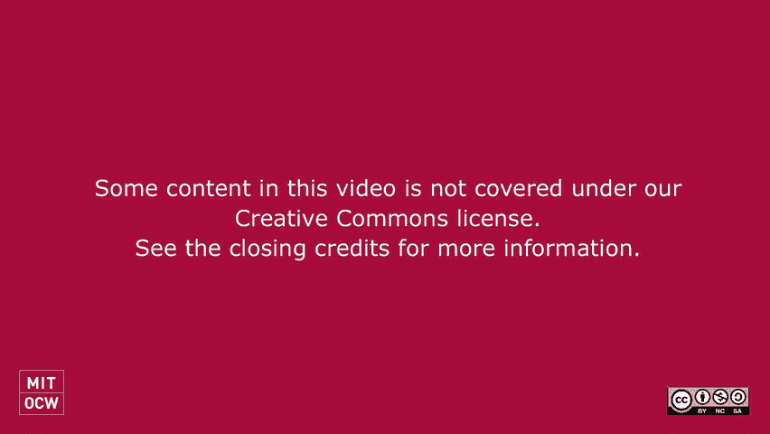
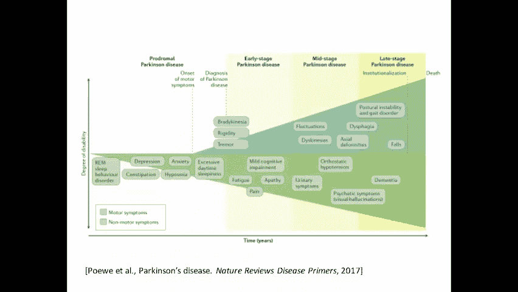
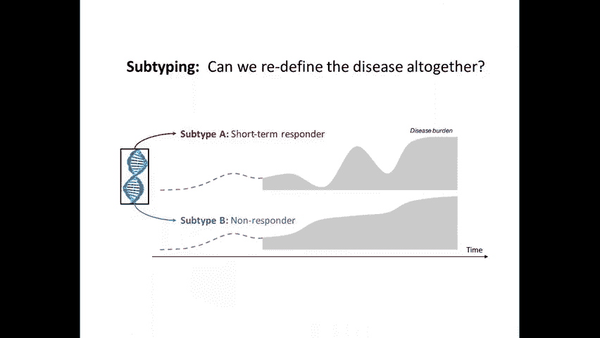
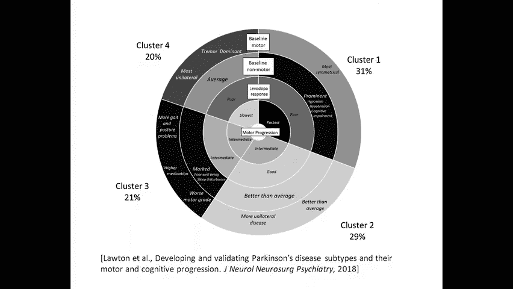
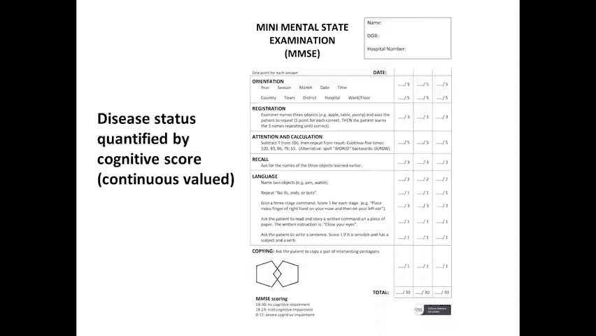
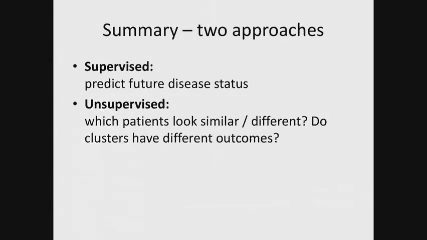
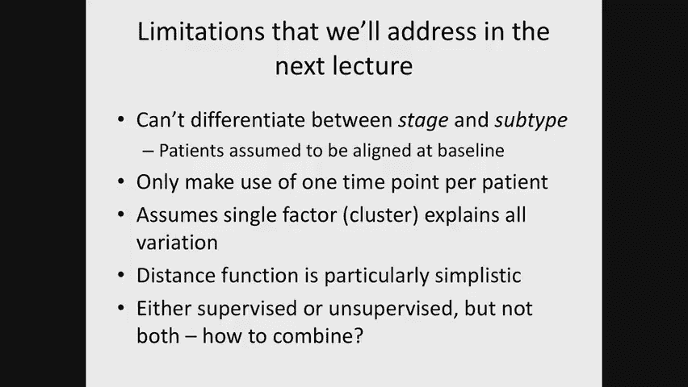

# MIT医疗机器学习中英文字幕 - P18：18.Disease Progression Modeling - 大佬的迷弟的粉丝 - BV1oa411c7eD

我们已经完成了关于因果推理和强化学习的部分，下周在周二的讲座中，我们将讨论疾病的进展，建模与疾病亚分型，在我看来，这是一个非常令人兴奋的领域，这是一个非常丰富的文学作品，回到一些简单的方法。

从几十年前到一些真正先进的方法，我可以花几个星期的时间谈论这个话题，但相反，因为我们在这门课上有很多东西要讲，我今天要做的是给你们一个高水平的概述，试图思考这些问题的方法之一，今天讲座的方法会有些简单。

它们旨在说明简单的方法是如何发挥很大作用的，它们也是为了说明，一个孩子如何学到关于临床结果的真正重要的东西，从这些简单的方法中预测疾病的进展，然后在周二的讲座中，我会把它调高一点。

我将讨论解决这个问题的几种更详细的方法，那个，解决一些，更多实质性的问题，在今天的讲座结束时会真正阐明，所以我们希望回答三种类型的问题，在高水平上研究疾病进展模型时，我想让你想想这种类型的照片。

在今天和周二的讲座中，把这个放在你的后脑勺里，你在这里看到的是一个病人的疾病轨迹，在x轴上跨越时间，是y轴上的时间，是疾病负担的某种衡量标准，例如，你可以把y轴看作是，病人记录的症状量。

或者你知道他们正在服用的止痛药的数量，或者他们发生了什么，最初，疾病负担可能会有点低，甚至可能病人处于未诊断的疾病状态，那个时候，随着症状越来越严重，在某个时候，病人可能会被诊断出来。

这就是我通过这条灰色曲线来说明的，这是病人被诊断出患有他们的疾病的时间点，在确诊时，可能会发生各种各样的事情，病人可能会开始治疗，这种治疗可能，比如说，开始影响疾病负担，你可能会看到疾病负担的下降。

最初，如果有癌症，不幸的是，我们经常会看到癌症复发，这可能会在上坡时再次表现出来，疾病负担增长的地方，一旦你开始二线治疗，可能会成功地再次降低它，等等，这可能是一个循环，一遍又一遍地重复，其他疾病。

是无法治愈的，比如说，但这些都是日常管理的，我们将讨论一些你可能会看到的，即使在每天的基础上波动，或者你可能会看到一段时间什么也没发生，然后，比如说，在自身免疫性疾病中，你会看到这些耀斑。

疾病负担增长很多的地方，然后又下来了，真是莫名其妙，为什么会发生这种情况，所以我们想在这里真正理解的问题类型是，第一个是病人，病人的疾病轨迹在哪里，今天来了个病人，嗯。

他们今天可能会因为症状而被诊断出来，不知何故穿越了一些，一些门槛，然后走进医生的办公室，但它们可能在疾病轨迹的任何地方，在确诊时，一个关键问题是我们能让病人明白，比如说，比如他们可能活多久。

根据他们目前的情况，第二个问题是疾病什么时候会发展，所以如果你有肾病患者，你可能想知道这个肾病患者什么时候需要，另一个问题是治疗如何影响疾病的进展，我在这里暗示的是，当我展示这些的时候。

我们推测这些山谷确实受到了治疗的影响，人们经常想问反事实的问题，比如这个病人的疾病进展会发生什么，如果你做了一种治疗疗法和另一种治疗疗法，所以我在这里提到的例子，在这张幻灯片中是一种罕见的血癌。

名为多发性骨髓瘤，很少见，所以你经常找不到有那么多病人的数据集，例如，我在最下面列出的这个数据集，对于多重研究基金会指南针研究大约有一千名患者，这是一个公开的数据集，你们中的任何一个人今天都可以下载。

你可以研究像这样关于疾病进展的问题，因为你可以跨时间查看实验室测试，你看起来，你可以看看症状何时开始出现，你有关于病人正在接受什么治疗的信息，你会有死亡这样的结果，所以对于多发性骨髓瘤。

今天的标准是如何试图将病人分期，看起来有点像这样，在这里，我向你们展示两种不同的分期系统，左边是杜丽鲑鱼分期系统，稍微老一点的，右边是所谓的修订后的国际分期系统，一个病人走进肿瘤科医生的办公室。

新诊断为多发性骨髓瘤，在做了一系列血液测试后，看他们的血红蛋白率等数量，血液中的钙量，我也在做，让我们说，病人骨髓的活检，测量不同种类免疫球蛋白的数量，变异各种不同的遗传异常。

然后这些数据将被输入像这样的分段系统，所以在杜丽鲑鱼分期系统中，一个处于第一阶段的病人被发现有非常低的M成分产生率，这就是我在这里展示的，这确实对应于疾病活动的数量，用他们的免疫球蛋白来衡量。

所以这是一种血癌，这是一个很好的标志，表明病人在阶段发生了什么，所以这个中间阶段，既不叫第一阶段也不叫第三阶段，它的特点是，在这种情况下，嗯，嗯，我不打算谈那个，如果你在这里进入第三阶段。

你看M分量水平要高得多，如果你看病人骨骼的X光研究，你会看到有溶解性骨损伤，这是由疾病引起的，并真正代表了这种疾病的晚期状态，如果你测量病人的尿液，轻链生产量，你会看到它也有更大的价值。

这是中间的一个较旧的分期系统，现在我向你展示一个新的分期系统，它既简单得多，又涉及一些较新的组件，例如，在第一阶段，它只看四个量，首先，它观察病人的相册中和贝塔两个微球蛋白水平。

这些生物标志物可以很容易地从血液中测量出来，它说没有高风险的细胞遗传学，所以现在我们开始引入基因数量，在量化风险水平方面，第三阶段的特征是β到微球蛋白水平显著升高，与特定高危细胞遗传学相对应的易位。

这不会是接下来两堂课的重点，但是皮特将更详细地研究精准医学的基因方面，一周半后，就这样，这些阶段中的每一个都代表了关于，相信病人有多远被强烈地用于指导治疗，例如，病人处于第一阶段。

肿瘤学家可能会决定我们今天不治疗这个病人，所以一个不同类型的问题，而你可以把这看作是对病人特定水平的描述，对呀，一个病人走进来，我们想把那个特定的病人，我们将着眼于一些长期的结果，利用这一点。

看看阶段和长期结果之间的相关性，一个非常不同的问题是描述性类型的问题，我们能说这种疾病的典型轨迹是什么吗，例如，接下来的几分钟我们将讨论帕金森病，帕金森病是一种进行性疾病，神经系统紊乱。

这是一种非常常见的骨髓瘤，而不是多发性骨髓瘤，每一百个八十岁的人中就有一个患有帕金森氏症，60岁及以上，就像多发性骨髓瘤，也有公开的疾病登记处，我们将用来研究帕金森病。

现在各种研究人员在过去使用过这些数据集，他们创造了一些看起来有点像这样的东西。

试图描述现在的人口水平，对病人来说，疾病的进展意味着什么，再在x轴上，我现在有时间，再在y轴上，它表示某种程度的疾病残疾，但我们在这里展示的，现在是在疾病阶段的不同部分可能出现的症状，帕金森病的早期。

你可能有一些睡眠行为障碍，有些抑郁，可能是便秘，焦虑，随着疾病的发展，再往前，你会看到一些症状，如轻度认知障碍，随着疾病的进一步发展，你会看到痴呆症和越来越多的精神病症状。

像这样的信息对一个刚被诊断出患有这种疾病的病人来说是非常有价值的，他们可能想做出人生决定，比如他们应该买下这个家，他们是否应该继续目前的工作，他们能生孩子吗，所有这些问题可能真的会受到影响。

这些问题的答案可能会受到什么的影响，这个病人可以期待他们未来几年的生活，接下来的二十年，所以如果一个人能很好地描述疾病轨迹可能是什么样子，对于指导那些人生决定来说，这将是非常有价值的，但挑战是。

虽然这是治疗帕金森病和帕金森病的，相当好地理解，有大量罕见得多的疾病，任何一个临床医生都可能看到一个非常，他们诊所里的少数病人，我们如何将以非常嘈杂的方式看到的症状结合起来，对于少数病人。

如何把这些结合在一起形成这样一个连贯的画面实际上是非常非常有挑战性的，这就是我们将要讨论的一些技术，在星期二的讲座中，它谈到了我们如何推断疾病阶段，我们如何自动跨时间对齐病人。

我们如何使用非常嘈杂的数据来做到这一点将是特别有价值的，关于这个描述性问题，我想强调最后一点，这不是预测的问题，这是关于理解，好吧，作为，而之前的幻灯片是关于预后的。

这在很大程度上是一个类似于预测的问题，现在，一个不同的，就像一个不同类型的理解问题，这里又是疾病亚分型，您可能有兴趣为单个患者识别，他们有可能在疾病中迅速进展吗，他们可能在疾病中进展缓慢吗。

他们可能对治疗有反应吗，他们对治疗不太可能有反应吗，但我们希望能够描述这种异质性，在整个种群中总结成少量的亚型，你可能会认为这是对疾病的重新定义，所以今天我们可以说有特殊血液异常的病人。

我们会说是多发性骨髓瘤患者，但是随着我们对癌症的了解越来越多，我们越来越明白，事实上每个病人的癌症都是非常独特的，所以随着时间的推移，我们将细分疾病，在其他情况下。

将我们认为是不同疾病的东西组合成新的疾病类别，在这样做的时候，它将使我们更好地照顾病人首先，提出针对这些疾病亚型的指南，它将使我们能够根据这些指导方针做出更好的预测，所以我们可以说。

像这样的患者和a亚型患者可能会有以下疾病进展，像这样的b亚型患者可能会有不同的疾病进展，或B应答者或非应答者，所以这里有一个这样的描述的例子。

这仍然是帕金森病的例子，这是一篇来自神经外科精神病学杂志的论文，它使用类似聚类的算法，我们会在今天的课上看到更多的例子，把病人分成四个不同的组，所以让我告诉你这个数字，所以你看看怎么解释。

帕金森病人可以用几个不同的轴来测量，你可以看看他们的运动进展，所以在最里面的圆圈中显示了这一点，你可以看到第二组的病人似乎有中等水平的运动进展，集群一的患者运动进展非常快。

意味着他们的运动症状会随着时间的推移而迅速恶化，人们还可以观察患者对其中一种药物的反应，例如用于治疗病人的左旋多巴，一组患者的特点是对该药物反应非常差，第三组患者的特征是中间患者。

第二组对该药物有良好的反应，同样，人们可以观察基线运动症状，所以在病人被诊断出来的时候，或者第一次来到诊所管理疾病，你可以看看他们有什么类型的运动症状。

您再次看到这些不同集群的不同异构方面，所以这是一种手段，这是一个非常具体的方式，我的意思是试图亚型病人，所以说，我们将通过疾病进展模型开始我们的旅程，从第一个预后问题开始，从我的角度来看。

预后实际上是一个有监督的机器学习问题，所以说，我们可以从以下角度思考预后，病人在零点走进来，你想知道一些关于，随着时间的推移，那个病人的病情会是什么样子，所以说，比如说，你可以问，他们的疾病状况如何。

对这个病人来说可能是，让我们说，十分之六，这些数字来自哪里将在几分钟内变得清晰，十二个月后，他们的疾病状况可能是十分之七，十八个月可能是十分之九，我们要努力实现的目标，我们如何获取数据。

我称之为病人基线时可用的X向量，并预测，这些值在不同的时间点会是什么，好的，所以你可以考虑一下，实际上画出这条曲线，我之前给你看的对吧，所以我们想做的是把我们所掌握的关于病人的初步信息，哦，病人的病情。

或者他们的疾病负担随着时间的推移会看起来有点像这样，对于不同的病人，基于它们的初始协变量，你可能会说他们的疾病负担可能是那样的，所以我们希望能够在这个演示中预测这些曲线，实际上会有一些离散的时间点。

我们想从我们现有的基线信息来预测曲线，这会让我们知道，这个病人将如何度过疾病，所以在这个案例研究中，我们要在这里看看阿尔茨海默病，我给你看两个大脑，健康的大脑和患病的大脑。

真正强调大脑在这种情况下是如何受苦的，阿尔茨海默病下的阿尔茨海默病，我们要用分数来描述病人的病情，还有一个例子，这里显示了这样的分数，它被称为迷你精神状态检查，缩写msc，它将看起来如下。

对于许多不同的认知问题中的每一个，将要进行一项测试，嗯哪个，比如说，呃，在中间，注册是什么意思，考官可能会命名三个对象，如Apple Table，便士，便士，然后让病人重复这三个物体。

我们所有人都应该能够记住三件事的序列，这样当我们完成序列的时候，你应该能记住序列中的第一件事是正确的，我们对此应该没有问题，但是随着阿尔茨海默病患者的病情越来越严重，那项任务变得很有挑战性。

所以你可以给，嗯，正确一分，每个正确的，所以如果病人得到了这三个，如果他们重复这三个，然后他们得到三分，如果他们不记得任何一个零分，然后你可能，然后你可以继续，所以你可能会问其他类似的问题，一百减去七。

然后从结果中重复，所以某种数学问题，然后你可能会回到你最初问的三个对象，现在已经是一个，让我们说一分钟后，你说我前面提到的那三个物体是什么，这是试图得到一点，长期记忆等等。

然后将与每个响应相关的点数相加，在这里得到一个总分，满分30分。

如果你除以3，你得到故事了，我在这里给你，好的，这些就是我所说的分数，阿尔茨海默病，他们通常通过问卷的分数来描述，但当然，如果你做了像大脑成像这样的事情，病情可能，比如说，从大脑成像中自动推断。

如果你有智能手机设备，病人随身携带的，它在观察移动活动，你可以从智能手机上自动推断出他们当前的疾病状态，你也许可以从他们的打字模式中推断出来。

你也许可以从他们的电子邮件或Facebook习惯中推断出这一点，所以我只是想指出，有很多不同的方法来获得这个数量的，病人在某一点上是如何做的，一个时间点，每一个都是一个有趣的问题，就目前而言。

我们只是假设，众所周知，好的，所以你从病人那里收集了这些数据，现在是纵向自然，你有一些基线信息，你知道病人在不同的六个月间隔内的情况，然后我们希望能够预测这些事情，我们现在可以回到第三讲。

我们如何预测这些不同的事情，那又怎样，你可以尝试哪些方法，你为什么不和你的邻居谈谈，然后我会随机拜访一个人，好的，这就够了，我的问题不够明确，如果你说得再久一点，谁知道你在说什么，然后这边，你们两个。

有电脑的人，是啊，是啊，你将如何解决这个问题，不，不，这里，是啊，是啊，你，嗯，我只是拿，我想就像这个数据，然后，是啊，是啊，就像以前的任何数据一样，喜欢的记录，像这样冲过来，像这样，然后就像对待。

但只是为了明白，你会学五种不同的型号吗，像这样，所以我们的目标是让这些，你知道这里，我给你看三个，但可能是五个不同的数字，不同时间点，你会学一个模型来预测六个月后的情况吗，另一个预测12个月时会是什么。

你会学习一个单一的模型吗，房间这一部分的其他想法，是啊，是啊，你，同时，也用上了要买的食物，所以使用多任务学习方法，你试着同时学习这五个词然后用另一个词，所以如果你在六个月内切换，你可以学会，你也用它。

所以建议是，所以有两种不同的建议，第一个建议是做一个多任务学习的方法，你试图学习，而不是五个不同的独立模型，试着一起学，稍后我们将讨论为什么这样做是有意义的，不同的想法很好，这真的是你想解决的问题吗。

比如说，你有病人不是在零点，但实际上在六个月的时候，你可能想知道他们将来会发生什么，所以你不应该只使用基线信息，你在某种程度上取决于你有时间可用的数据，和一种不同的思考方式，也就是。

你可以想象学习马尔可夫模型，在那里你可以了解疾病阶段随时间的联合分布，然后你可以，比如说，即使您只有可用的基线信息，您可以尝试将未观察到的中间值边缘化，来推断后面的值可能是什么，现在马尔可夫模型方法。

尽管我们将在下周左右广泛讨论它，这实际上不是解决这个问题的一个很好的方法，原因是因为它增加了复杂性，所以当你在学习的时候，本质上如果你，如果你想预测18个月时发生了什么。

如果作为一个中间步骤来预测18个月后会发生什么，你必须预测十二个月后会发生什么，然后从12个月过渡到8个月的可能性，您可能会在试图预测时出错，十二个月是怎么回事，当您试图查看。

想想从十二个月到十八个月的过渡，误差的传播，尤其是当你没有太多数据的时候，会真正损害机器学习算法的性能，所以我今天要讲的方法是，事实上会是我用的，是解决这个问题的最简单的方法，这将是一种直接的预测方法。

所以我们将直接独立地预测每个不同的时间点，但是我们会把模型的参数绑在一起，正如使用多任务学习方法所建议的那样，我们要使用多的原因，任务学习方法是由于数据稀疏性，所以想象一下下面的情况。

想象一下我们这里只有二元指示器，所以说，嗯，比如说病人，还可以吧，或者他们不好，所以数据可能看起来像这样，那么您可能有的数据集看起来有点像，可能有点像这样，所以现在我要给你看数据，我一排是一个病人。

一排就是一个病人，不同的列是不同的时间点，所以我之前给你们看的第一个病人是零，第二个病人可能是零，一个一个下一个病人可能是零，一个一个，所以如果你看这里的第一个时间点。

你会注意到你有一个非常不平衡的数据集，在第一个时间点只有一个，如果你看第二个时间点，有两种，这是一个更平衡的数据集，然后在第三个时间点，你又回到了那种不平衡的环境中，那意味着。

如果你试着从这些时间点中的一个本身学习，嗯，尤其是在你没有那么多数据点的情况下，数据稀疏性和结果标签会真的伤害你，很难学到任何有趣的信号，仅仅从那个时间点，第二个问题是标签也很吵。

所以你不仅可能有很多不平衡，但在实际描述中可能会有噪声，就像这个病人，也许你可能会计算出一个，一个，一个，用其他的概率，你会观察到零一一一，并可能对应于该分数中的某个阈值，我之前给你看过了。

只是偶然的一天，一个病人通过了门槛，第二天他们可能不会通过这个门槛，所以在任何一个时间点，特定的标签中都可能有很多噪音，你不希望噪音真的戏剧性地影响你的学习算法，基于一些，假设我们可能有先验的信念。

在这个过程中，随着时间的推移，可能会有一定程度的平滑，最后一个问题是可能会有定心，所以实际数据可能是这样的，对呀，所以我们可能不仅要等待更晚的时间点，我们可能会有更少的观察，所以。

如果你只是用后面的时间点来学习你的预测模型，你可能没有足够的数据好吧，所以这些都是我们将要试图解决的不同挑战，使用多任务学习方法，现在给这些东西一些数字，我们有这四个不同的时间点，在六个月的时间间隔内。

我们将有648名患者，在四年的时间间隔内，只有87个病人，因为病人退出了这项研究，所以这里的关键思想是，而不是学习这五个独立的模型，我们将尝试共同学习与这些模型相对应的参数。

以及我们将要尝试融入其中的直觉，在这五个不同的预测任务中，可能有一些有用的特性，所以我在这里用生物标志物的例子作为一个特征，把它想象成实验室测试结果，比如说，或者对可用基线的问题的回答。

所以学习的一种方法是说，好的，让我们规范这些不同模型的学习，鼓励他们选择一套共同的预测特征或生物标志物，但我们也想允许一定的灵活性，例如，我们可能想说，在任何一个时间点，可能有几个新的生物标志物。

与预测时间点有关的，随着时间的推移，可能会有一些微小的变化，所以我现在要做的是，我将向你介绍通过多任务学习来思考的最简单的方法，我将特别关注线性模型设置，然后我向你展示我们如何修改，稍微。

修改这个简单的方法来捕捉我在那里的那些标准，让我们来讨论一个线性模型，让我们来讨论回归，因为在这里你知道，在示例中，我之前给你看过了，我们试图预测苏格兰人，那是一个连续的值，我们想试着预测它。

我们可能关心最小化一些损失函数，所以如果你试图最小化平方损失，想象一个场景，你有两个不同的预测问题，所以这可能是时间点0，这可能是6个月和12个月的时间点12，你可以从总结病人开始，嗯。

看看你预测的平均平方误差，我想说的是，在六个月的结果标签上，通过一些线性函数，我要把它作为下标，六，表示，这是一个预测六个月时间点值点积的线性模型，与您的基线功能，同样地。

你预测这次的损失函数也是一样的，但现在你要预测Y12标签，我们将有一个不同的权重向量来预测，注意x是一样的，因为我们在所有的事情上，我在这里告诉你，我们将仅从基线数据中预测，好的。

在此环境中尝试正规化的典型方法可能是，让我们说做L两个正则化，所以你可能会说我要在这上面加上一些lambda，平方也许这里也一样，到目前为止，我为你安排的方式，现在是两个不同的独立预测问题。

下一步是讨论我们如何尝试将这些联系在一起，所以对于那些没有在课堂上专门学习过多任务学习的人来说，所以对于那些没有的人来说，不要为其他人负责，嗯，有什么方法可以把这两个预测问题联系起来。

也许你可以分享一定的体重，而是，所以也许对于普通的同事来说，所以也许你可以分享一些体重参数，嗯，我是说，把它们绑在一起的最简单的方法就是说，嗯，我们要，所以你可能会说。

让我们首先把这两个目标函数加在一起，现在我们要最小化，而不是最小化我们，现在我们将在两个权重向量上最小化，好的，所以现在我们有一个单一的优化问题，我所做的一切，我已经我现在我们正在优化。

我们在最小化这个共同目标，我把这个目标和这个目标相加，我们把它最小化，相对于现在两个不同的权重向量，你刚才描述的最简单的事情可能是说，让w 6等于w 12，所以您可以添加这个相等约束。

说这两个权重向量应该是相同的，那有什么不好，别人会有什么问题，我知道这不是你的确切建议，是啊，是啊，你有什么问题？那些也对不起吗，是啊，是啊，我少了一些下标，对所以嗯，我把这个放进，我把这个写在上标上。

我会把下标，我下标，i，为了这个目的，这并不重要，为了本演示文稿的目的，这些是相同的个体还是不同的个体，跨越这两个问题，你可以想象同一个人，所以你可以想象数据集中有N个人，我们在做同样的求和。

和这两笔钱的人，只是看看他们每个人的不同结果，这是六个月的结果，这是十二个月的结果，清楚了吗，所有的权利，所以最简单的事情就是关掉，现在我们有一个联合优化问题，我们可以约束两个权重向量相同。

但当然这有点矫枉过正，这就像说你要，嗯，你只需要学习一个预测问题，你忽略了六个月和十二个月之间的区别，试着预测，你知道的，你把它们放在下面，然后预测它们在一起，所以你有另一个建议，听起来好像没有。

你刚出来，为什么那是好的，我回答说，对不起，我们能做些什么不同的事情，是啊，是啊，你，你也许可以试着把两者之间的区别缩小到最低限度，所以喜欢不应该说他们需要一样，但就像他们会超级超级不同的机会。

不是真的，这是一个非常有趣的想法，所以我们不希望他们是一样的，我们可能希望它们大致相同，有什么方法可以衡量这两者有多大的不同，减去它们，然后做什么因为这是如此，这些是向量，所以你绝对。

它不是向量的绝对值，你能做什么把矢量变成一个数字六，取一个标准，是啊，是啊，我想这就是你的意思，所以我们可能会采取规范，我们应该采取什么标准，也许是L 2常量，好的，我们可能会说我们想要，好的。

所以如果我们说这等于零，那当然是说他们必须是一样的，但我们可以说这是，假设以某个epsilon和epsilon为界，现在是我们可以选择的参数，然后就会说，哦，好的，我们现在把这两个优化问题联系在一起。

我们想鼓励，两个权重向量相距不远，您表示每个权重向量，就像，让它像复制一样，强迫第一个地方是一样的，就像第二个不同的，您建议的参数化方法略有不同，通过说W12等于W6，加上一些增量函数。

一些三角洲的区别是，你的建议不是，但就像你有你的发言权一样，就像十维一样，是啊，是啊，每个字符都是一个维度，但现在它将是二维的，你强迫第一个维度是相同的，在回来的路上，啊，其他，这是一个非常有趣的想法。

我马上就回到那一点，在我回到那一点之前，谢谢，我只想指出，这不是最方便优化的事情，对呀，因为这现在是一个约束优化问题，我们最喜欢的凸优化和机器学习算法是什么，和非凸优化，大家大声说出来。

助教不应该回答喃喃自语，但我想我听够了你说的随机梯度下降，是呀，好，这正是我所期待的，但你可以做投影梯度下降，但是把它处理掉要容易得多，所以我们要做的，我们要把它放入目标函数中，一种方法是。

所以你知道一个动机，我们会说我们要用这个不等式的拉格朗日量，然后把这个带到目标中，但你知道去他的动机，让我们把这个擦掉，我只想说加上别的，所以我称之为，你知道，lambda one。

现在有一些其他的超参数时间，现在让我们看看会发生什么，如果我们把这个λ2推到无穷大，记住我们在最小化这个目标函数，所以如果λ2被推到无穷大，W12相对于W6的解是什么，大家大声说出来，我说的是零。

所以有一个负，另一个是零，是呀，好，所有的权利，所以这将迫使他们，他们是一样的，当然，如果λ2更小，那么它是说我们将允许一些灵活性，它们不一定是一样的，但我们将以他们规范的平方差异来惩罚差异。

所以这很好，所以你提出了一个非常有趣的问题，我要去，我现在就谈谈，这很好，也许你不想强制所有的维度都是相同的，也许这太过分了，所以人们可以想象做的一件事是说，我们只执行这个约束，这个换这个。

我们只会把这个点球放进去，因为我们说，试图为这个想出正确的符号，我想我会用这个符号，让我们看看，如果你们喜欢这个，好的，让我们看看这个符号对你是否有意义，我想说的是，我要取d是维数。

我要把维度的前半部分带到最后，我把这个矢量，我会惩罚你这是无视，它忽略了，所以说，它是，它忽略了维度的前半部分，所以这意味着，嗯，我们要，我们将共享一些权重向量的参数，但我们不会担心。

我们要让他们在剩下的时间里完全依赖对方，这是一个例子，你在暗示我什么，好的，所以对于只有两个时间点的情况来说，这一切都很好，但我们该怎么办，那么我们有五个时间点，所以与其说这些必须是共同的，你说。

在他们所有人之间，我想你有正确的直觉，但我真的不知道如何正式确定，或者只是从你的口头描述，你可能想到的最简单的事情是什么，我给你举了一个在某种意义上如何做的例子，成对相似性，你能轻松地扩展它吗。

如果你有两样以上的东西，你有个主意，不为什么1不是2 y 2和y 2 2不是3，像这样，所以你可能会说W一个是相似的，两个相似的两个相似的三个相似的四个，以此类推，是啊，是啊，我喜欢这个主意，嗯。

我要稍微概括一下，好的，所以我现在要开始考虑图表，然后呃，我们要，我们将定义一个非常简单的抽象来讨论多任务学习，我要做一个图表，其中每个任务都有一个节点，和节点之间任务之间的边缘。

如果这两个任务我们想鼓励他们的体重与另一个相似，我们在这里的任务是什么，所以在你的建议中，你会有下面的图W6，二十四转到三十六，现在，我们将图转化为优化问题的方法，会是这样的，我现在假设我要让。

我要在v逗号上定义一个图，e，v，在这种情况下将是布景，两个，四个，以此类推，我用s逗号t和e表示边，它将指一个特定的两个任务，例如，六个月时六个人预测的任务，和十二个月时预测的任务，好的。

那么我们要做的就是，我们会说新的优化问题将是，嗯，所有任务的总和，该任务的损失函数，所以我要忽略，那就是，我就在那边，我有两个不同的损失函数为两个不同的任务，我要把这些加在一起。

我只想把它留在这个抽象的形式中，然后我现在要对边缘求和，s逗号，在我刚刚定义的图中，在嗯，在我去那里的例子中，在最上面，只有两个任务，w 6和w 12等等，我们在他们之间有优势，我们正是这样惩罚它的。

在一般情况下，人们可以想象许多不同的解决方案，比如，比如说，你可以想象一个解决方案，你有一个完整的图表，所以你可能有四个时间点，你可能会惩罚每一对彼此相似的人，或者只是建议。

你可能会认为任务可能有一些顺序，你可能会说你想要它而不是一个完整的图表，你会有一个链图，关于该命令，你想让他们每一双都跟着，命令彼此靠近，嗯，事实上，我觉得，那可能是最合理的做法。

在疾病进展模型的设置中，因为事实上，我们脑子里有一些关于这些值的平滑类型，他们应该，当数值非常接近时，它们应该彼此相似，时间点，我只想提一件事，从优化的角度来看，如果这是你想做的。

有一种更干净的方法来做这件事，这是为了引入一个虚拟节点，我希望我有更多的颜色，所以说，一种新的权重向量，我就叫它W，我就叫它W，好的，所以没有下标，我要说的是所有其他任务都将与之相关，在星星里。

所有权利，所以这里我们介绍了一个虚拟任务，我们把其他任务都和它联系起来，然后现在你就有了这些正则化项的线性数量，在任务数量中，但你没有做任何假设，它们和任务之间存在某种顺序，而w w从不用于预测。

它只是在优化过程中使用，为什么你需要一个零而不只是做，嗯好吧，如果你根据W 1来做，那么它基本上是说W一个在某种程度上是特别的，所以一切都被拉向它，然而，目前还不清楚这样做是否正确，所以说。

你会得到不同的答案，我把它留给你作为练习，试图推导出，好的，所以这是如何，如何使用线性模型进行多任务学习，我也会把它留给你一个练习来思考，你怎么能把同样的想法，现在把它应用到，比如说，深度神经网络。

你可以相信我，这些想法确实概括了，以你期望他们做的方式，这是一个非常强大的概念，所以每当你有任务的时候，当你处理这样的问题时，你在那里的设置，线性模型可能在你之前做得很好，你知道。

在你相信某人使用非常复杂的方法得出的结果是有趣的之前，你应该问这个最简单的多任务学习方法是什么，我们已经讨论过一种方法，让正则化更有趣，比如说，我们可以尝试，我们可以尝试只规则化一些特性值。

使其与另一个特性值相似，在本文中，它正在解决阿尔茨海默氏症的疾病进展建模问题，他们开发了一种稍微复杂一点的方法，但不会太复杂，他们称之为凸融合稀疏群套索，它的想法和我这里的想法一样，你要去哪里。

现在学习矩阵W，矩阵W是完全相同的概念，每个任务都有不同的权重向量，你只要把它们堆叠成一个矩阵，W的um l，这正是我的意思，损失函数之和，那是一回事，最优化问题中的第一项，lambda，一次。

w的lone范数只是说，就像一个稀疏的东西，我们在做回归时通常看到的稀疏惩罚，所以它只是说我们要鼓励重量跨越，所有的任务都要尽可能小，因为这是一个1分的点球，这实际上是试图鼓励稀疏。

所以它会把事情推到零，尽可能，这个优化问题中的第二项，也是稀疏惩罚，但是它现在把w乘以这个r矩阵，这是我们的矩阵，这个例子是这样显示的，这只是精确实现这一想法的一种方法，我在黑板上的。

这就是这个r矩阵要说的，它会说，因为它会有一个，嗯，你可以有多少边就有多少行，你将有相应的任务，你有一个，以及相应的任务，就是你有一个负一，然后如果你把这个r矩阵乘以w转置。

你得到的正是这些类型的成对比较，唯一的区别是他们在这里惩罚而不是用一个l 2范数，他们用一比一的范数来惩罚，好的，这就是第二项对w的转置，只是这个想法的实现，最后一个学期只是一个小组。

巨大的惩罚并不有趣，发生在那里，我只想评论一下，我忘了提这件事，损失的期限将是一个精确的平方损失，这个f指的是一个弗罗贝尼乌斯范数，因为我们刚刚堆叠在一起，我们只是把所有不同的任务堆叠成一个。

这里发生的唯一有趣的事情是，这是我们正在做的，我们正在做一个元素，明智乘法，这是一个简单的掩蔽函数，它是说如果我们在某个时间点没有观察到一个值，就像如果，比如说，如果这是未知的或审查的。

然后我们就把它归零，所以我们并不是说那个项目不会有损失，所以S只是面具，它允许您解释您可能有一些丢失的数据，这是2012年KD论文中使用的方法，回到阿尔茨海默氏症的例子。

他们使用了一个非常简单的功能集有370个功能，第一组特征来自嗯，嗯，嗯，病人大脑的核磁共振扫描，在这种情况下，他们只是推导出一些预先建立的特征来表征白质的数量，等等，我包括一些遗传信息，一堆认知分数。

所以MSSE是这个模型的一个输入例子，在基线上是至关重要的，对呀，所以有许多不同类型的认知评分是在基线收集的，每一个都组成了一些特征，然后是一些实验室任务，我只是注意到这里是随机数，但它们有一定的意义。

关于结果最有趣的事情之一是，如果您比较多个的预测性能，独立回归法的任务法，所以这里我们展示了两种不同的性能度量，第一个是一些归一化的均方误差，我们希望它尽可能低，第二个是r作为r的平方。

你希望它尽可能高，所以在第一列上有一个完美的预测，这里显示了使用独立回归的结果，所以如果我们的矩阵不是把它们绑在一起，你有r等于零，比如说，然后在随后的每一列中，它现在显示了用这个目标函数学习。

我们的泵越来越高，这个λ2系数，所以它将要求任务之间越来越多的相似性，所以你可以看到，即使有2的中等值，你开始在这种多任务学习方法和独立回归之间得到改进，所以平均r的平方，比如说。

从六十九点上升到七十七点，你注意到我们有95%的置信区间也在这里，当你把lambda值放大时，这似乎很重要，虽然我不会评论这些专栏之间的统计意义，我们确实看到了一个趋势。

当你鼓励它们靠得越来越近时它们的表现就会越来越好，关于这个结果，我想我不想再提什么了，有问题吗，单击此集合，啊，谢谢。是呀，所以这是在一个顽固的布景上，谢谢。这也让我想起了另一件事，我想提一下。

这对这个故事至关重要，就是你看到这些结果，因为数据不多，如果你有一个非常大的训练集，您不会看到这些列之间的区别，或者事实上，如果你有一个非常大的数据集，当你把lambda泵得更高时，这些结果会更糟。

结果会变得更糟，因为允许不同任务之间的灵活性实际上是一件更好的事情，如果您有足够的数据用于每个任务，所以这在数据中特别有价值，政权差，人们也可以试着从观察特征的角度来分析结果，重要性随时间的变化。

所以这里的一行对应于时间点预测器的权重向量，所以这里我们只看四个时间点，五个时间点中的四个，这些列对应于预测中使用的不同特征，颜色对应于该特征对预测的重要性，你可以想象，就像，线性模型中相应权重的范数。

或者它的规范化版本，你看到的是一些有趣的东西，首先，有一些功能，比如，它们在所有不同的时间点都很重要，但也可能有一些，一些对预测即将发生的事情非常重要的特征，但对预测长期结果并不重要。

你开始看到这样的东西在这里你看到，比如说，嗯，这些特征对于预测第三、第六时间点一点也不重要，但在早期很有用，点数，所以从现在开始我们要稍微改变一下档位，我刚才给你的是一个监督方法的例子。

但是有问题吗是的，我今天就批准，谢谢。所以这真的是两个问题，但我更喜欢我们的一个朋友建议的线性模型，比完全耦合模型更好，因为它似乎更直观地可信，实际上，本文使用的是线性模型，好的，是呀。

因为你注意到R是对角线，好的，另一个，另一个观察是，特别是，鉴于我们目前的能力状况，在阿尔茨海默氏症中，到无法治疗，它永远不会变得更好，然而，这在模型中并不受限制，发展到知道这是一个非常有趣的观点。

所以说，皮特建议你考虑一下，因为您可以考虑在，也就是，嗯，能想象说我，通常小于y，i，十二，这通常比为什么，i，两个，四，等等，我们能够做出完美的预测，这意味着，如果你的。

你预测的y等于你的两个wise，那你也应该有那个，i应小于w，嗯，所以你可以想象现在在你的学习问题中引入这些作为新的限制，在某种意义上，它说的很好，如果我们在预测中得到一些错误，我们可能不会那么关心。

但我们想确保至少，我们能够正确地对病人进行分类，给病人正确的权利，所以我们想确保这些值至少有一些单调性，和，人们可以很容易地尝试，将这些类型的约束转换为对学习算法的修改，比如说，如果你拿了任何一双。

假设我把这两个一起带走，可能会出现铰链脱落的情况你说你想要这样，嗯，您将添加一个新的目标函数，意思是你要惩罚最大值，零和一减，我要把这个订单搞砸了，但它会像，所以我会正确地驾驶它。

这就是w 12减去w 2 4，我们希望小于零，所以你可以看看，你知道离零有多远吗，所以你可以看W12，你能想象损失函数吗，上面写着，好的，如果不是，如果是一个，如果大于零，那你就有问题了，我们可能会在。

假设一个线性惩罚，但是大于零，它是，如果它小于零，你一点也不惩罚，所以你说像这样的最大值w 12减去w 2 4点乘积，你可以在你的学习目标中添加一些类似的东西，这将试图鼓励，将惩罚违反这一限制的行为。

使用铰链损耗型损耗函数，所以这将是一种尝试把这些限制纳入你的学习目标的方法，一个非常不同的方法是把它看作是一个结构化预测问题，而不是试图说，你将自己预测一个给定的时间点，你想预测时间点的向量。

有一个完整的领域叫做结构化预测，这将允许人们正式确定目标功能，这可能鼓励，比如说，跨时间预测的平滑性，你想利用的，但由于时间的原因，我不打算对此进行更多的讨论，再向他们提出任何问题。

我想确保我读完最后一篇文章，到目前为止，我们所讨论的是一种监督学习方法，到试图预测病人会发生什么，鉴于你所知道的，基线，但我现在要谈谈一种非常不同的思想风格，它使用了一种无监督的学习方法。

进行无监督学习有两个目标，解决这个问题，第一个目标是发现，我在今天的讲座一开始就提到了，或者可能不仅仅对预测感兴趣，我们可能也有兴趣了解一些东西，对这种疾病有了一些新的认识。

比如发现这种疾病可能有一些亚型，这些子类型可能很有用，比如说，帮助设计新的临床试验，就像你想说的，好的，我们推测这种亚型的患者可能对治疗反应最好，所以我们只对这种亚型的病人进行临床试验，不是在另一个。

尝试更好地理解疾病机制也可能是有用的，所以如果你发现，有些人似乎在疾病中进展很快，和其他似乎进步很慢的人，然后你可能会回去对它们进行新的生物测试，试图理解这两个集群的区别。

所以这两个集群要根据它们的表型来区分，表型，表型，你想回去好好问问，它们的基因型有什么不同，对患者的区别有一个非常简洁的描述也可能是有用的，为了真正有你可以实施的政策，而不是有一个非常复杂的线性模型。

甚至没有，预测未来疾病进展的线性模型，如果你能直接说好就容易多了，对于有这种生物标志物异常的患者，他们可能有非常快的进展，可能有其他生物标志物异常的患者，他们可能有一个缓慢的疾病进展。

所以我们希望能够做到这一点，这就是我发现这些亚型的意思，但实际上还有第二个目标，回想一下我之前提到的最初动机，数据很少，如果你的数据很少，不幸的是，这是我们几乎总是处于的环境，在做机器学习和医疗保健时。

那么您可以很容易地对数据进行过度拟合，当只是在判别学习框架内严格使用它时，所以如果一个人现在完全改变你的优化问题，开始引入一个无监督的损失函数，那么人们就可以希望从有限的数据中获得更多，并保存标签。

在学习算法的最后一步中，你可能会很容易地过度适应，这正是我们在这节课中要做的，所以今天，我们将考虑最简单的无监督学习算法，因为这门课的正式要求是6 0 3 6，因为六零三六没有讨论聚类。

我将花两分钟讨论用最简单的算法进行聚类，叫K的意思是，我希望你们几乎都知道，但这只是一个简单的提醒，有多少个集群，在我展示的这个图中，让我们举起手来，好的，一个集群，两个集群，三个集群，四组，五组。

好的，这些红点是否或多或少地显示了这五个集群，所以宁愿，你知道，这里有一个集群，这里有一个集群，那里，那里，就在那里，所有的权利，所以你是，你能做得很好，当人类看二维数据时。

像k均值这样的算法的目标是展示如何自动做到这一点，对于高维数据，K均值算法非常简单，它的工作原理如下，你假设有许多集群，所以这里我们假设了五个集群，您将随机初始化这些群集中心，我用这里显示的红点来表示。

然后在K均值算法的第一阶段，您将把每个数据点分配到最近的群集中心，这将引出沃罗诺伊图，沃罗诺伊细胞内的每一个点都离这个红点更近，比任何其他红点。

所以这个boroi单元中的每个数据点都将被分配给这个数据点，每个数据点和这个硼单元都将被分配到那个数据点，以此类推，所以我们现在要把所有数据点分配到最近的群集中心。

然后我们将分配给某个集群中心的所有数据点平均，获取新的集群中心，你重复，你要停止这个程序，当积分分配没有变化时，让我们看一个简单的例子，这里我们用k等于2，我们刚刚决定只有两个集群。

我们已经初始化了这里显示的两个群集，作为两个集群中心，作为这个红色的星团中心，在这个蓝色的星团中心，注意到他们离数据很远，我们只是随机选择，他们离数据很远，这实际上是一个相当糟糕的初始化。

第一步是将数据点分配到它们最近的集群中心，所以我想让每个人都大声说出来，红色或绿色，到哪个集群中心，它将指向在这一步中将被分配到的内容，所有的权利，好，我们得到它所有权利，所以这是第一个作业。

现在我们将平均分配给红色集群中心的数据点，所以我们要平均所有的红点，然后新的红色集群中心会在这里，对呀，在那边在这边，好的，很好，蓝色集群中心将在这里的某个地方，对呀，所以这是下一步。

然后你又重复了一遍，您可以将每个数据点分配到其最近的群集中心，你在这里看到看起来像线性超平面的原因是，因为正好有两个集群中心，然后你重复，废话废话，你做得很好，如此如此事实上。

我想这是我刚刚向你们展示的汇合点，这就是K均值算法，这是一个非常简单的算法，在接下来的十分钟里，我要给你们看的是，如何使用这个非常简单的聚类算法来更好地理解哮喘，所以哮喘是一种真正影响许多人的疾病。

它的特点是呼吸困难，它通常由吸入器管理，尽管随着哮喘越来越严重，你需要越来越复杂的管理方案，人们发现，5%到10%的严重哮喘患者尽管使用了，吸入疗法，所以制药界非常感兴趣的一个大问题。

我们如何想出更好的哮喘疗法，在那个问题上有很多钱，我第一次了解到这个问题，当一家制药公司来找我，当我还是兄弟的时候，你问我，他们能和我一起解决这个问题吗？我当时说不，但我还是觉得很有趣。

当时公司给我指了这张纸，我一会儿就告诉你，嗯，但在我到达那里之前，我想指出，每个人都感兴趣的一些大局问题是什么，当谈到哮喘时，第一个是真正了解，是关于什么的，导致不同亚型哮喘的遗传或环境因素，对呀。

据观察，人们的反应不同，治疗被观察到，有些人甚至没有用治疗来控制，为什么呢，生物标志物，有什么方法可以预测，谁会对任何人的治疗有反应或没有反应，我们能更好地理解这些不同的亚型吗。

所以这是一个长期存在的问题，我和这篇来自美国呼吸重症监护医学杂志的论文，顺便说一句，它有大量的引用，现在，一个典型的子类型示例，这就是为什么我要经历它，他们开始回答这个问题，使用数据驱动的方法治疗哮喘。

我在这里给你看的是笑点，这就是主要结果，论文的主要人物，把我在这里展示的一种类型打出来，我们的炎症占主导地位，那边有一种叫做早期症状占优势，这里的另一种是一种一致的疾病，在接下来的几分钟里我会带你。

他们是如何想出这些不同的集群的，所以他们使用了三个不同的数据集，这些数据集包括患有哮喘的患者，最近已经接受了至少一种哮喘治疗，他们都不抽烟，但他们被管理在三个，他们他们来到那里。

来自三个不同人群的三组不相交的病人，第一组患者是从英国的初级保健实践中招募的，所以如果你是哮喘患者，你的哮喘是由你的初级保健医生管理的，那可能还不算太糟，但如果你的广告另一方面。

在难治性哮喘诊所接受治疗，这是专门为帮助患者管理哮喘而设计的，那么你的哮喘可能会更严重一点，和第二组患者，187名患者来自第二组患者，由哮喘诊所外管理，第三个数据集要小得多，只有六十八个病人。

但这是非常独特的，因为这是一个来自12个月的研究，在那里是一项临床试验，有两种不同的治疗方法适用于这些病人，这是一个随机对照试验，所以页面被随机分为研究的两个分支中的每一个。

我会在下一张幻灯片上向你描述这些功能，但首先我想告诉你它们是如何预处理的，在K均值算法中使用，对连续值特征进行Z评分，以使它们的范围规范化，和分类变量只用一个热编码来表示，一些连续变量被进一步。

我在聚类之前通过取特征的对数进行变换，当做像k这样的事情时，这是很有用的，因为它可以从本质上考虑欧几里得距离函数，用k表示，通过捕捉特性的更多动态范围来更有意义，所以这些是进入聚类算法的特征。

而且有很多，很少对，所以大约有二三十个特征，它们从病人的性别和年龄不等，他们的体重指数，他们肺功能的测量，到生物标志物，例如填充计数的儿子，可以从专利中衡量，从病人的痰和更多，我还将展示一些其他功能。

你以后也给你看，你可以看看，这些怎么，这些数量是如何，这些人群有何不同，所以在这个专栏上，你看到初级保健人口，你看看那个群体中的所有这些特征，你可以看到在初级保健人口中，个人平均来说，在二级保健人口中。

54%是女性，其中65%是女性，你注意到像这样的事情，如果你看一些肺功能的测量，在二级护理人群中情况明显更糟，正如人们所料，因为这些是更严重的哮喘患者，较严重哮喘患者，所以接下来做k意味着聚类。

这是导致，现在我向您展示全套功能，让我先告诉你怎么读这个，这是在初级保健人群中发现的集群，这里的专栏只是这些特征在整个人群中的平均值，然后对于这三个集群中的每一个，我在给你看，该集群中相应特征的平均值。

本质上是一样的，那和那些红点完全一样，我向你展示的时候，我向K描述了聚集的意思，它是集群中心，我们也可以看看方差的标准差，那个集群中的特性，这就是括号中的数字告诉你的，首先要注意的是，在第一组中。

这项研究的作者称之为早发性，哮喘主题，这些都是非常年轻的病人，平均十四岁十五岁，与第二组相反，平均年龄为三岁，五岁，如此巨大的差异，此外，我们看到这些病人最近实际上去过医院，所以呃。

所以这些病人中的大多数平均去过医院，这些病人最近至少去过一次医院。此外，他们的哮喘严重恶化，过去十二个月，平均每个病人至少两次，这些都是非常大的数字，相对于你在这些其他集群中看到的，所以这是真的。

描述了这些患有相当严重哮喘的非常年轻的患者的一些非常不寻常的事情，所以我只是把这个理论，是啊，是啊，我认为P值，我不知道这是不是两两比较，我不记得了，我以为我的头，但它真的在看，区别在于，嗯，呃。

你知道，让我们说，呃，我不知道这些中的哪一个，我不知道如果我不知道如果它是一个，我不知道这是不是在比较他们两个，这么说吧，比如说，可能在看这个和那个的区别，但我只是假设，我不记得了，i簇，到另一只手。

以女性为主，所以那里81%的病人是女性，他们大部分超重，所以他们的平均体重指数是6，而其他两个集群的平均体重指数是2，六，真正没有严重哮喘的病人，所以以前住院的平均人数，哮喘恶化的观察。

比其他两个星系团要小得多，所以这是，这是发现的结果，然后你可能会问，这如何推广到其他两个群体，所以他们去了二级护理人群，他们从头开始重新运行聚类算法，这是一组完全不相连的病人，他们的发现。

他们得到了什么，前两个星系团和星系团完全相似，上次关于初级保健人口的研究的第一和第二，但因为这是一个不同的人群，有更严重的病人，第三个集群，早期良性哮喘在这个新人群中没有出现。

在这个新的群体中出现了两个新的集群，所以事实上，前两个集群在两个非常不同的群体中是一致的，给了作者信心，这里可能有真实的东西，然后他们去了，他们探索了第三个群体，在那里他们有纵向数据。

他们用第三个种群来问，现在做吗，所以到目前为止，我们只使用基线信息，但现在我们要问下面的问题，如果我们从这68个病人身上提取基线数据，把它们分成三个不同的簇，根据在其他两个数据集中发现的特征。

然后如果我们要看每个集群的长期结果，它们在集群中会有所不同吗，尤其是在这里，我们实际上不仅仅是为了预测和进展，但我们也在研究预测，我们在观察治疗反应的差异，因为这是一个随机对照试验。

所以这里会有两只胳膊，所谓的临床手臂，这是标准的临床护理，所谓的痰臂，包括定期监测气道炎症，然后进行严格的类固醇治疗以维持正常的庇护数量，所以这是一个，这是比较两种不同的治疗策略。

问题是这两种治疗策略是否会导致不同的结果，所以当临床试验最初进行时，他们计算了平均治疗效果，顺便说一句，因为这是一个RCT，所以特别简单，你刚刚平均了，穿过两只手臂，他们发现两只手臂没有区别。

所以两种不同疗法的结果没有差异，现在这些作者要做的是他们要重新进行这项研究，他们现在要，而不仅仅是看整个人群的平均治疗效果，他们要用，他们将研究这两种药物的平均治疗效果，每一个集群本身。

希望人们现在能看到不同，可能有异质性的治疗反应，有时这种疗法对一些人有效，不是为了别人，这些就是结果，所以确实在这三个集群中，我们实际上看到了很大的不同，所以嗯，如果你看这里，比如说。

开始口服皮质类固醇的人数，哪个是哪个是衡量，一个结果的um，对呀，所以你可能想要这个相机，小的或大的，但是这两个星系团和这个星系团有很大的区别，在第一只手臂下开始的数字是两个，在另一个集群中。

获得第二个臂九的患者，第三个星系团正好相反，顺便说一句，第一个集群只有三个病人，所以我现在不打算对此发表任何评论，因为这些都是显而易见的，在方向上明显，整个人群的平均治疗效果为零并不奇怪。

但我们现在看到的是，事实上这是有区别的，所以有可能这种疗法实际上是有效的，但只是对少数人来说，现在这项研究永远不可能，如果我们事先没有做这个聚类，因为它的病人太少了，只有六十八个病人。

如果您试图同时搜索群集，正如他们所说，找到集群来区分结果，你就会，你会很快地对数据进行过度拟合，所以正是因为我们先做了这个无人监督的子打字，然后用标签，不是为了搜索子类型，但只用于评估亚型。

我们实际上能够在这里做一些有趣的事情，所以在今天的课程中，我谈到了两种不同的方法，预测未来疾病状况的监督方法。

而这种无监督的方法，我想强调几个主要的限制，我们将在下节课中继续讨论，并试图解决，的，第一个主要的限制是这些方法都没有区分疾病的阶段和亚型，我们的两种方法，我们假设在基线时有一定数量的患者对齐。

例如这里，我们假设零点的病人与另一个病人有些相似，比如说，他们可能在那个时候被新诊断出患有阿尔茨海默氏症，但通常我们有一个数据集，在疾病阶段，我们没有病人的自然对齐，如果我们试图进行某种类型的聚类。

就像我在上一个例子中所做的那样，你会天真地得到一个疾病阶段的集群，对呀，所以在疾病早期的病人可能看起来非常不同，疾病晚期的病人，它将完全把疾病阶段和疾病亚型混为一谈，这就是你可能真正想发现的。

这些方法的第二个限制是每个病人只使用一个时间点，而在现实中你知道，就像你在这里看到的，我们可能有多个时间点，我们可能想，比如说，使用多个时间点进行聚类，我们可能想使用多个时间点来了解疾病进展的一些情况。

第三个限制是，他们假设有一个单一的因素，让我们说，解释患者所有变异的疾病亚型，事实上可能还有其他因素，在噪声模型中使用的患者特定因素，当您使用像k均值这样的算法进行聚类时，它没有机会这样做。

因为它有一个很简单的距离函数，所以在下周的讲座中，我们将开始讨论概率建模方法，解决这些问题，这将给我们一个非常自然的方式，表征沿其他轴的变化，最后，你应该问的一个自然的问题是。

一定要无人监督还是有人监督，或者有没有办法把这两种方法结合起来，我会在星期二继续讨论这个问题。

