# MIT医疗机器学习中英文字幕 - P20：20.Precision Medicine - 大佬的迷弟的粉丝 - BV1oa411c7eD

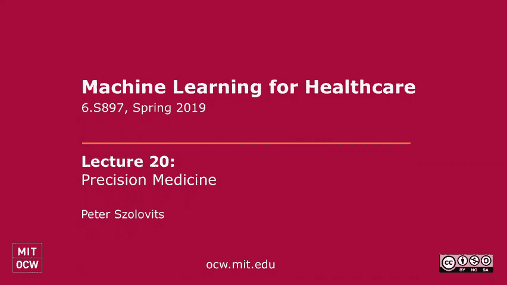

今天我要讲的是精准医学，我们对什么是精准医学并没有一个非常精确的概念，所以我要先谈谈这个问题，大卫，谈疾病亚分型，如果你想想你怎么知道，一种疾病的亚型是什么，你通过某种聚类来做到这一点。

在一堆不同种类的数据上，所以我们有像人口统计这样的数据，共病，生命体征，药物程序，疾病轨迹，不管这些图像相似性意味着什么，今天我主要集中在遗传学上，因为这是人类基因组计划的巨大希望。

随着我们对基因对疾病影响的了解越来越多，它将帮助我们创造出对付各种疾病的精确方法，为他们找到正确的治疗方法等等。

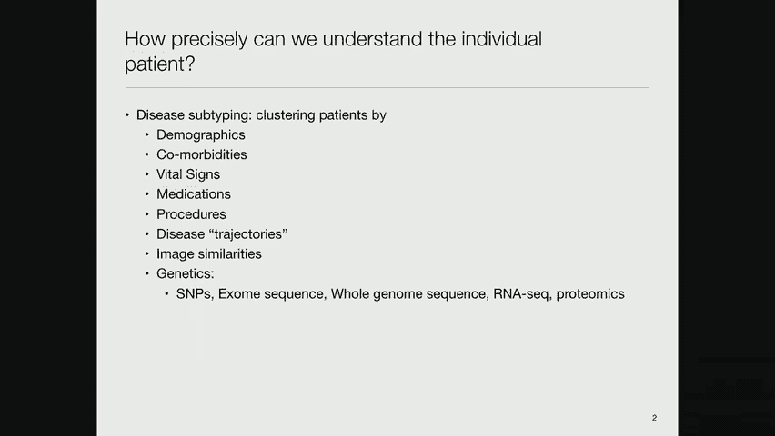

所以我想先回顾一下，一项由国家科学院国家研究委员会进行的研究，它被称为二字精准医学，这是一个相当近的二十七年，他们有一些有趣的观察。

所以他们一开始，他们说好，为什么以前可能不相关，现在却相关，当然还有，最大的是汇编患者分子数据的新能力，以20年前难以想象的规模，所以人们估计获得第一个人类基因组花费了大约30亿美元，今天。

获得人类基因组的成本不到1000美元，我在以后的谈话中有一些数字，展示人们正在运行的一些广告，在利用分子信息改进诊断和治疗方面越来越成功，我们将讨论它的一些进步，这样我们就有更大的能力处理所谓的大数据。

利益相关者之间的完美风暴，这使得他们更容易接受这种信息，所以事实上，美国医疗保健系统的费用，我们一直在上升，但质量并没有一直按比例上升，使每个人都不顾一切地想出新的方法来处理这个问题。

所以看起来你知道下一个伟大的希望是如何做到这一点，以及公众对分子数据态度的转变。

有多少人看过这部电影？加塔卡，有几个，所以你知道，这是对当人们被基因分型时会发生什么的反乌托邦观点，因此可以通过它们的遗传学来跟踪，确实会有恐怖故事发生，但尽管如此。

今天人们似乎对允许收集这种数据更加放松，并被使用是因为他们看到潜在的好处大于成本，不是每个人，但你知道这仍然是一个严重的问题，所以这份报告继续说你知道，让我们思考如何集成关于个人的各种不同数据。

他们开始，他们说你知道，谷歌地图就是一个很好的例子，所以谷歌地图有一个坐标系，基本上是地球上每一点的经度和纬度，它们可以利用这个坐标系互相叠加，有关邮政编码的资料，建筑物，人口普查区，土地利用，运输。

一切，他们说哇，这真的很酷，要是我们能在医疗保健中做到这一点就好了，所以他们的愿景是在医疗保健方面做到这一点，他们说，与经纬度相对应的是个别患者，这些病人有各种各样的数据，包括它们的微生物群。

他们的表观基因组，他们的基因组，临床体征和症状，曝光，他们接触到什么，所以有一个真正的尝试出去创建大量的数据集合，汇集了所有这些信息，其中一个值得注意的是井部，nih，基本上在一年半前开始了一个项目。

叫我们所有人听起来有点威胁性，但我们真的有一百万人，他们已经要求美国各地的机构招募志愿者，做志愿者，提供它们的遗传信息，他们的临床数据，他们生活的地方，他们在那里通勤。

这样他们就可以获得关于它们的环境数据，然后它意味着一个持续的数据收集，大约一百万人被认为是美国的代表性样本，所以你会在今天晚些时候我谈论的一些项目中看到，许多研究是在欧洲血统的人群中进行的。

因此它们可能不适用于其他种族的人，这是试图准确地取样，所以非洲的一部分，美国人、亚洲人和西班牙裔人等等与样本相对应，在美国人口中，有很长的历史，你们中有多少人听说过弗雷明汉心脏研究，很多人。

所以弗雷明汉，在20世纪40年代同意成为一项长期实验的主题，我想它现在是由波士顿大学经营的，每隔一两年他们就会出去，他们调查，我不记得有多少人开始的时候大概有五万人，关于他们的习惯，他们是否吸烟。

他们的体重和身高是多少，以及任何临床问题，他们做了外科手术，等等，他们现在一直在收集数据库，几代人的后代，他们也开始收集基因数据，所以我们所有人都在大规模地这样做，现在。

这项研究的愿景是说我们要建立这些信息，公地，它收集所有这类信息，然后我们将从这些信息或数据中发展知识，这些知识将成为生物医学研究的基础，所以说，如果我们发现显著的关联，那么这表明一个人应该做研究。

这不一定会得到他们收集的数据的回答，你可能要成长，击倒老鼠什么的，以测试一个想法是否真的有效，但这是一种集成所有此类信息的方法，当然它会影响诊断，治疗和健康结果，这是你想在医学上做什么的圣杯。

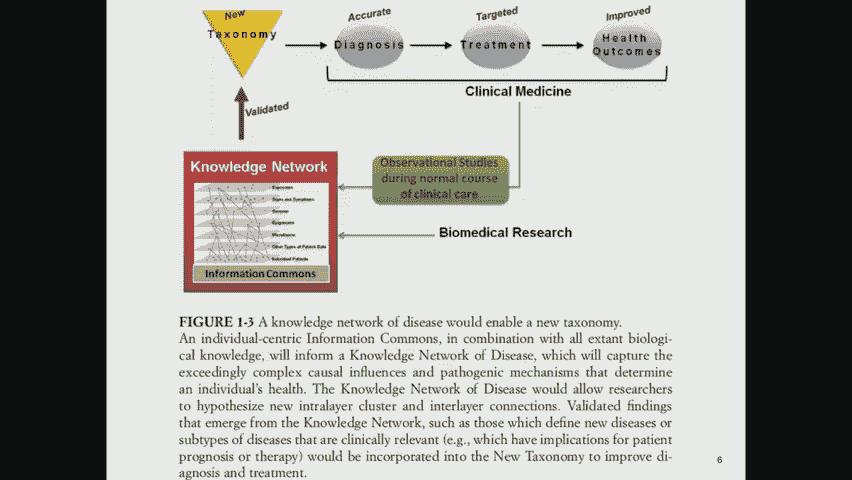

现在有一个有趣的问题，所以重点是分类学，萨姆·约翰逊是一位非常著名的17世纪英国作家，是诗人、评论家和评论员，做各种花里胡哨的事，他的一句名言是我的疾病是哮喘和水肿，什么是不太治愈的，七十五岁。

所以他现在也很有趣，如果你查字典，你们中有多少人听说过浮肿，一对夫妇，你是怎么听说的？是啊，是啊，我是说，我是通过和十八九世纪的人一起看杰作剧院了解到这一点的，在你知道的地方。

祖母会和浮肿的人一起躺在床上，结果不是很好，但那些人花了很长时间才死，所以水肿是水病，肿胀，水肿，等等，其实不是病，这是一大堆疾病的症状，所以可能是肺病，心力衰竭，肾病，等等，而且很有趣。

我回想起这件事，我找不到它来整理这个讲座，但在某一点上，我确实发现上一次，水肿被列为美国一患者死亡原因-中新网，是在一千九百四十九，所以从那以后，它作为一种疾病从分类学中消失了，如果你和肺部的人交谈。

他们怀疑哮喘，在我们现在的词典中仍然是一种疾病，可能很像浮肿。

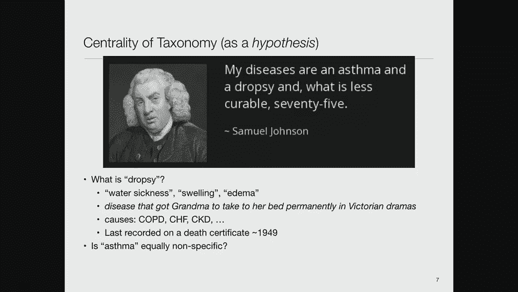

这不是病，这是一系列潜在原因的症状，这个想法是，我们需要做得足够好足够精确才能弄清楚这些是什么，几周前，我和我在哈佛的朋友扎克·科哈纳谈过，当我开始准备这个讲座的时候，他有以下想法。

我要给你们看的例子来自他，所以他说，好吧，看，我们应该有这个精准医学模态空间，包含所有这些信息，这是在NRC的报告中，然后我们要做的是，如果我们幸运的话，我们要找到一组数据，所以这种情况总是发生。

如果你拿一个非常高维的数据集，并把它放入它非常高的维表示空间，几乎从来都不是这样，数据均匀地分散在空间中，如果那是真的，这对我们没有多大帮助，但一般来说这不是真的，你会发现数据往往在低维流形上。

所以它在空间的子集中，所以分析这类数据的很多技巧是，弄清楚那些低维流形是什么样子的，通常你会发现在一个非常大的数据集中，有一群像这样的病人，然后扎克的方法是说好，如果你有耐心，很难把三个维度表示为两个。

但是如果你的病人掉在这样一个集群的中间，那么这可能意味着它们对那个星系团来说是正常的，而如果它们落在这样一个星系团的边缘，这可能意味着有一些奇怪的事情发生了，值得调查，因为它们不寻常。

所以他给我举了一个他的病人的例子，让我给你一分钟读这个，是啊，是啊，都在材料里，哪里写着武器库，哦耶，所以军械库在历史上是军队可以使用的一套武器，所以这是一套医生可以使用的治疗方法。

这是你唯一不知道的词吗，很好地理解，你可能知道抗生素是什么，和免疫抑制剂，你可能听说过，无论如何，这是一堆不同的疗法，这就是所谓的生病的小狗，是一个做得不好的孩子，三岁时因溃疡性结肠炎开始生活。

这是由他们通常给患有这种疾病的人服用的药物控制得很好的，然后突然之间，十年后，他突然腹痛腹泻，他的大便里有血，他们尝试了一堆他们认为应该有效的东西，它不起作用，面临一些相当激烈的选择。

比如切除他结肠发炎的部分，所以你的结肠是消化道的重要组成部分，所以失去它并不好玩会对他的余生产生不好的后果，嗯，但他们所做的是他们说，嗯，嗯，为什么他对这些治疗都没有反应，和。

你能想象的点云图中的困难是，你如何判断这个人是否是局外人，或者在这些集群之一的中间，在这个孩子的情况下，这取决于很多事情，它所依赖的，最重要的是，是他经历的最后六个月，在他接受标准治疗之前。

所以云可能代表了溃疡性结肠炎的人，在标准治疗下得到很好控制的人，现在他突然成了局外人，在这种情况下发生的事情是，他们说，嗯，可能溃疡性结肠炎患者有不同的群体，所以也许有些人在治疗后终身缓解。

用一种常用的单克隆抗体，这就是集群，星系团的中心，也许有些人有多年的缓解，但对这些药物产生耐药性，他们必须接受的其他治疗，这就是切除结肠，还有一些人最初得到了缓解，但没有标准的治疗方法有效。

这就是这个孩子在这个集群中的情况，把这当成机器学习问题，从拥有许多不同病人的大量数据的角度来看，和挑战，当然啦，包括你的距离函数是多少，在做人们通常做的那种集群时，你如何定义，什么是离群值。

因为总有一个连续体，它变得越来越分散，时变数据的最佳表示形式是什么，这是至关重要的，在这种情况下，尺寸的最佳加权或归一化是什么，那么在这个非常高的维空间中的每一个维度都是相同的吗。

还是某些维度上的差异比其他维度上的差异更重要，事实上，这是否因问题而异，答案很可能是肯定的，那么我们如何为病人找到邻居，嗯，我要给你一些线索，从遗传学的浅尝辄止开始，所以如果你上过分子细胞生物学课。

这对你来说应该不是新闻，我会很快地浏览一下，如果你没有，那我希望你至少能学会一些词汇，所以一位聪明的生物学家说生物学是例外的科学，关于两个几乎没有规则，五年前，这里的生物系为工程系教授了一个特殊的课程。

试图向我们解释他们在教什么，在他们的生物分子生物学入门课上，我记得我坐在杰瑞·苏斯曼旁边，我的一个同事，在我们听了一些关于一些理论不适用的四七方法的讲座后，在很多很多情况下，杰瑞转向我。

他说你知道这个领域的问题是，有太多该死的例外，没有理论，都是例外，自从人类在地球上行走以来，人们就观察到了，孩子们往往在许多方面与他们的父母相似，直到格雷戈·孟德尔，这是一个很大的谜。

为什么你像你父母一样，我是说，你一定从他们那里得到了一些东西，让你和他们相似，所以孟德尔有一个概念，即有离散的继承因素，他称之为基因，他不知道这些是什么，但在概念上，他知道它们一定存在。

然后他在豌豆植物上做了一堆实验，表明有皱纹的豌豆往往会有后代，同样起皱的豌豆，他研究出了我们现在所说的孟德尔遗传的遗传学，即显性与隐性遗传模式，几年后出现了，他在细胞中发现了一种叫做核子的奇怪东西。

现在被称为DNA，嗯，但直到1952年好时和蔡斯才，说嘿，正是dna代代相传地携带着这种遗传信息，然后呢，当然啦，沃森，克里克和富兰克林，第二年破译了DNA的结构，它是双螺旋，然后想出了机制一定是什么。

允许DNA传递这些信息，所以你有一个双螺旋，你匹配一个，四个字母a c，T G彼此相对，你可以复制这个DNA，把它分开，再长出另一条链，这是第一个的补充，现在你有两个。

你可以让孩子们把这些信息传递给他们，所以这是一件大事，所以基因是由国家生物技术信息中心定义的，作为遗传的基本物理和功能单位，那是DNA序列，位于特定地点，在染色体上，它编码一个特定的功能产品。

即RNA或蛋白质，我一会儿再来讨论这个问题，未解之谜，仍然很难弄清楚DNA编码基因的哪些部分，所以你会认为我们可能已经解决了这个问题，但我们还没有完全，其余的呢，这是绝大多数的DNA，如果不是。

然后折叠和几何学是如何，的拓扑，所以我回去了，我读了弗朗西斯·克里克在20世纪50年代的一些作品，非常有趣的是，这个假说在当时被认为是有争议的和试探性的，所以他说，一张核酸的特异性。

仅仅通过它的碱基序列，这个序列是特定蛋白质氨基酸序列的简单代码，有人争辩说他完全错了，这不是真的，当然事实证明他是对的，然后中心教条是，信息从核酸到核酸的传递，或者从核酸到蛋白质是可能的。

但是从蛋白质到蛋白质或从蛋白质到核酸的转移是不可能的，这并不完全正确，但这是一个很好的第一近似值，这就是六十年前的情况，后来又获得了几个诺贝尔奖，我们开始理解这是如何工作的一些机制。

当然还有它是如何工作的，你有DNA，就是这四个底座，双链RNA在转录过程中产生，所以这件事展开了，一条rna链，是沿着DNA建立的，并与DNA分离，创造一个单链RNA，然后它去连接核糖体。

核糖体接受RNA，并以三胞胎的形式接受代码，每个三重态代表一种特定的氨基酸，然后它按顺序组装并产生蛋白质这些蛋白质是氨基酸序列，因为它是三维的，而且涉及到时间，有速率常数，这是化学，毕竟，所以再一次。

后来又获得了几个诺贝尔奖，我们有转录，将dna转化为RNA的过程是由启动子调节的，阻遏子，基因组上的增强子区域，蛋白质通过与dna结合来介导这一过程，并导致转录的开始或使其运行得更快。

或者导致它跑得更慢，或者他们干扰它，等等，还有这些增强剂，其中一些非常遥远，这对RNA的多少有很大的影响，因此有多少蛋白质是由，目前对此的理解是，如果这里有基因，可能是DNA链环绕着，和增强器。

即使它在遗传单位上很遥远，实际上是非常接近的，因此可以鼓励更多的转录发生，顺便说一句，当然，如果你对这些东西感兴趣的话，麻省理工学院教了很多如何做到这一点的课程，戴夫·吉福德和马诺利斯·凯利斯。

两者都教授如何应用计算方法的计算课程，试图破译这种活动，所以阻遏剂阻止活化剂结合，或更改激活剂以更改速率常数，所以这是另一个，其中一个问题是，如果你看看你体内的DNA总量，在，你的基因，在你的牢房里。

只有大约1。5%是外显子，哪些是编码的部分，mrna和最终的蛋白质，所以问题是其他98。5％的人是怎么做的，在生物界有一种不幸的倾向，称之为垃圾，dna，这当然是一个可怕的想法，因为进化肯定会摆脱它。

如果它真的是垃圾，因为我们自己花了很多精力建造这些东西，每次细胞分裂，它重建了所有所谓的垃圾DNA，所以不可能是垃圾，但问题是它是做什么的，我们真的不知道很多，所以有内含子，我给你看一张照片。

编码区域的某些片段不会上发条，作为RNA的一部分，它们是拼接出来的，我们不知道为什么，有这些调节序列，只有百分之五左右，就是那些推动者和阻遏者，和，然后呢，有一大堆重复的DNA，包括转座元素，相关序列。

最重要的是，我们不明白这一切是做什么的，假设或类似的事情，也许这是一个潜在有用的DNA仓库，所以如果环境条件变化很大，那么细胞就不必从头开始重新发明东西，它把它从进化的前几个时代拯救了出来。

当这可能有用的时候，但在这一点上，这几乎纯粹是猜测。

就在最近，基利安的演讲是由杰拉尔德·芬克做的，谁是这里的遗传学家，他声称基因不是DNA的任何片段，产生RNA或蛋白质，但它是DNA的任何片段被转录成rna。

有一定作用的，随便啦，它不一定是构建蛋白质，但只是任何事情，我认为这种观点正在被接受，所以我答应你一点点，呃，更复杂，所以当你观察像我们这样的真核生物的DNA时，嗯，这是发起人，然后是基因组序列。

当这被转录时，它被转录成一种叫做前mrna信使rna的东西，然后是这个替代拼接的过程，它拼接出内含子，只留下外显子，但有时它并没有留下所有的外显子，只剩下一些。

所以同一基因在不同的情况下可以产生不同的mrna，然后产生不同的蛋白质，关于这一切到底是如何工作的，还有很多谜团，然而，这是基本机制，然后这里我刚刚列出了，一些复杂的问题。

所以像rna这样的东西可以转化为dna，这是病毒经常使用的伎俩，rna的dna补体，然后用它来生成更多的病毒，所以这是典型的病毒感染，我们也不太了解朊病毒，这就像疯牛病。

这些蛋白质能够在不通过rna的情况下引起其他蛋白质的变化，dna介导机制，有DNA修饰蛋白，其中最重要的是九号面包里的东西，这是一个相对较新的发现，关于细菌如何利用，他们从病毒中窃取的机制。

自身的遗传互补，更重要的是，攻击它们的其他病毒，所以它是一种抗病毒防御机制，我们现在正在研究如何用它来进行基因编辑，你可能读过这个中国人，他们实际上出去编辑了几个出生在中国的女孩的基因组。

在它们的基因组中，当然，在人类身上做实验可能还为时过早，因为他们还没有证明这是安全的，但也许这会被接受，哈佛大学的乔治·丘奇一直在四处走动，他喜欢把人们的锁链弄得嘎嘎作响，他到处说，那家伙。

你知道他不道德，是个邋遢鬼，但他所做的是一个非常好的主意，所以我们看看会发生什么，好的，然后是这些复古转座子，并将自己插入基因组的其他地方，在植物中，这种情况经常发生，例如，也许它只有一个。

但它是通过这种机制复制的，各种RNA，有很长，非编码rna，它似乎参与了基因调节，它实际上会抓住标准遗传机制产生的RNA，并防止它转化为蛋白质，这是几年前的另一个诺贝尔奖，几乎这个领域的一切。

如果你是第一个，你因此获得诺贝尔奖，它们的降解程度不同，所以细胞中有不同的机制破坏某些蛋白质的速度比其他蛋白质快得多，所以生产率并不能告诉你会有多少，在任何特定时间，然后是第三级，中学，和第三级结构。

那里实际上是什么样子的，你每个细胞里一英里的DNA，所以它不适合，所以它被包裹起来，一次又一次，我们不太明白这一切是如何运作的，因为你会认为如果你把东西包成这样，它将变得无法转录，因此。

不清楚它是如何表达的，但不知何故，细胞能够做到这一点，所以在这方面还有很多东西要学。

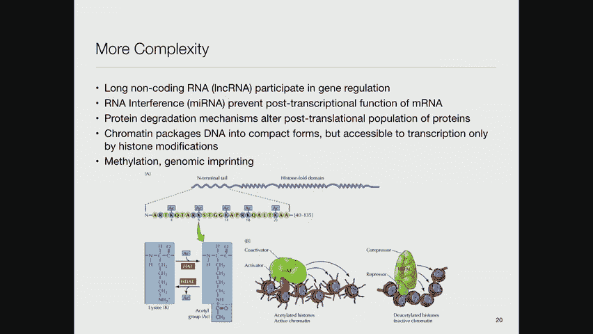

我们对这一切感兴趣的原因是因为，如果你根据摩尔定律计算出计算机每项性能变得便宜的速度有多快，你绘制基因测序的成本，它一直往下走，它下降的速度甚至比摩尔定律快得多，所以这是相当了不起的，这意味着你知道。

就像我说的，30亿美元的第一个基因组现在只需要几百美元。

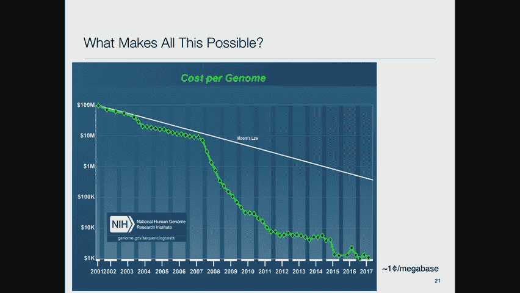

事实上，如果你只是对整个Exome感兴趣，所以只有大约2%的基因，产生遗传编码的DNA，你现在可以去这家公司，与我无关，我刚从网上找到这个，但你知道只要299美元，他们会给你50倍的覆盖大约6G。

如果你多付他们一百美元，他们会以100倍的覆盖范围来做这件事，所以这些技术很吵，所以得到大量的复制是很重要的，为了重新组合你认为正在发生的一个稍微近一点的现象。

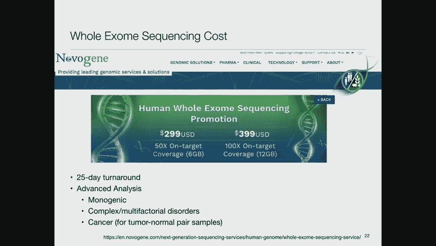

是人们说好，我们不仅可以测序你的DNA，但我们可以对从DNA转录的RNA进行测序，实际上你可以花360美元买到一套，它将从单个细胞中提取RNA，所以这些就像皮科升，东西的数量。

它会给你三百六十美元的rna序列，最多可容纳100个细胞，对呀，所以三块钱，每个牢房3。5美元，所以人们都很兴奋。

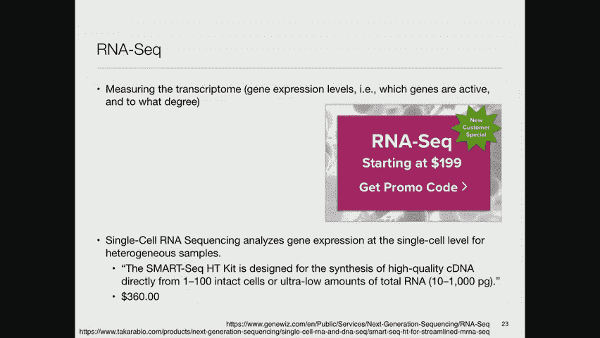

现在也有公司会卖给你高级分析，因此，它们将把您获得的数据与不同的数据库相关联，并弄清楚这是否代表，你知道的，显性、隐性或X连锁模型，如果你有家族数据和候选基因的功能注释等等，例如，从大约三年前开始。

如果你带着新诊断的癌症走进达纳·法伯，实体瘤癌，他们会提取癌症的样本，把它送到像这样的公司或他们自己的实验室，做测序和分析，并试图弄清楚到底是哪些受损的基因导致了癌症，也许更重要的是。

因为这仍然是一个相当经验主义的领域，你基因的哪些不寻常变异，表明某些药物可能比其他药物更有效地治疗癌症，所以这在癌症护理中已经成为完全常规的，在其他一些领域，好了，现在我要换一套更有技术含量的材料。

所以如果你想用基因表达阵列来表征疾病亚型，微阵列，这里有一个办法，这是阿里扎德的一篇著名论文，这基本上是这类论文的第一篇，回到2001年，我觉得，是啊，是啊，二千一，从那以后。

可能有数万或数十万篇其他论文发表，做类似的分析，关于其他数据集，所以他们所做的是，他们说，好的，我们要提取，我们将使用一种技术来放大它，因为我们从很小的数量开始，然后我们要拿一个微阵列。

它要么像一个有十个的玻璃滑梯，或者上面成千上万的斑点DNA，或者是一个有井的硅片，那DNA是从哪里来的，最初，它只是从基因组中随机收集的基因片段，从那以后，他们变得更加复杂，但我的想法是。

我要把扩增的CDNA，我要用这些水母蛋白做标记，在光下发光，然后我要把它流过这个滑梯或这个井，这套井，互补DNA的互补部分会粘在，在这口井里的DNA样本的部分，合乎情理。

另一种选择是你取正常组织和癌组织，你用绿色荧光水母的东西标记正常组织，你用红色标记癌症，然后你把它们等量地流动，在允许您测量比率的数组上，你没有那么多的校准问题，关于试图计算出确切的价值。

然后根据接近度和表达式空间对这些示例进行聚类，你通过样本之间的表达相似性对基因进行聚类，所以它以前是通过聚类来调用的。

我将在几分钟后讨论这样做的一种特殊技术，这是一个典型的微阵列实验，rna变成了它的互补，dna漂浮在微阵列芯片上，你会得到一堆不同程度的绿色和红色的斑点，然后你计算它们的比例，然后通过群集来实现这一点。

你得到的是基因的层次聚类，和乳腺癌的分层聚类，活检标本，所以这是相当革命性的，因为答案是有意义的。

所以当他们在19个细胞系和65个乳腺肿瘤样本上做这个实验时，和一大堆基因，他们得出了一个群集，说，嗯哼，看起来有些样本有内皮细胞簇，所以这是一个特殊的问题，你可以把它和病理联系起来。

从肿瘤幻灯片和不同的亚类，然后呢，这是你在这类研究中看到的一种非常典型的热图。

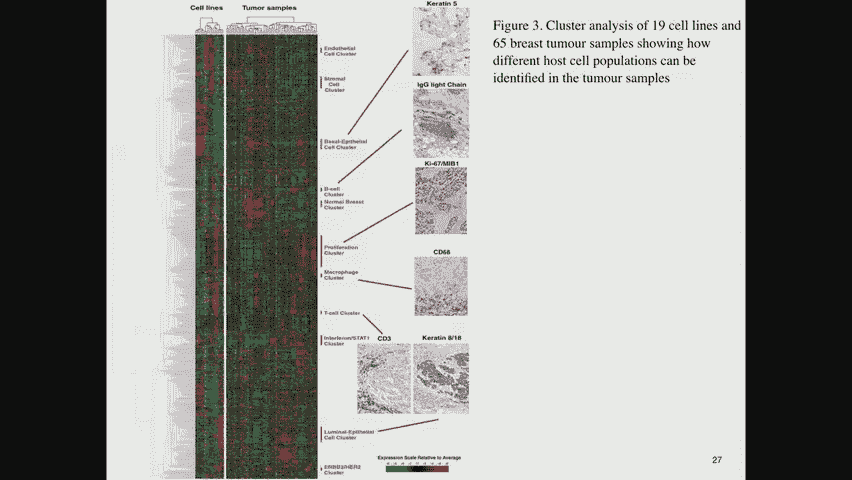

另一项来自65个乳腺癌样本的研究，使用他们以前策划的基因列表，看起来它把表达级别聚集成这五个集群，有点难看，我是说，当我盯着这些，对我来说并不明显，为什么数学会产生这些集群，而不是其他一些。

但你可以看到这是有意义的，所以在这里你可以看到它的尽头有很多绿色，在这一端不是很多，反之亦然，所以这些集群之间有一些区别，是啊，是啊，他们是怎么想出基因清单的。

有没有人做过这种聚类分析而没有先提出基因列表，是呀，我一会儿要讲的是现代基因广泛关联研究，基本上你说，我要看看人类已知的每一个基因，所以他们还有一个名单，但名单是，你知道的，两万或两万五千。

这是我们所知道的一切，这是另一种方法，那么这项工作引人注目的是什么，这个小组的工作，后来的分析表明，这五个亚型实际上有不同的存活率，在p等于零的地方，一级统计显著性，你见过这些生存曲线。

当然是在大卫的演讲之前，但这是相当令人印象深刻的，做一些与病人的临床状况无关的事情，这纯粹是基于他们的基因表达水平，你可以找到在临床上表现不同的集群，所以他们中的一些人比其他人做得更好，所以这张纸。

这种工作方法，引发了一系列巨大的额外工作，这又回到了阿洛萨达的报纸上，他们做了类似的关系，96个正常和恶性淋巴细胞样本之间，他们得到了相似的结果，在哪里，嗯，他们在这里识别的集群对应于某种很好理解的。

现有类型淋巴瘤，所以这又给了你一些信心，你从这些遗传相关性中提取的东西是有意义的，在处理淋巴瘤的人对这个话题的思考中，但它当然可以给你更多的细节，因为人们的直觉可能不如这些大规模数据分析有效。

所以要回答你关于概括这一点的问题，我是说，这是我看待这件事的一种方式，如果我列出所有的基因，我现在列出了所有的表型，我们更确定基因是什么，比表型是什么，所以这是一个有趣的问题，然后我可以做一堆分析。

所以你知道什么是表型，嗯，这可能是一种诊断疾病，比如乳腺癌，也可以是淋巴瘤的类型，从这两个例子中，我刚刚给你看了，它也可以是定性的或定量的特征，可能是你的体重，可能是你眼睛的颜色，可能是，你知道。

几乎所有临床上知道的关于你的事情，甚至可能是行为，可能是这样的，你知道，你每天的Twitter帖子输出是多少，那是一个完全合理的特征，我不知道这在基因上是否可以预测，但你会看到一些令人惊讶的事情。

那么你如何很好地分析这个，如果你从一个特定的表型开始，并说什么基因与此相关，那么你就在做所谓的GWAS或基因广泛关联研究，所以你寻找与特定表型差异相对应的遗传差异。

通常你会看到像单核苷酸多态性这样的东西，所以这是你的基因组与参考基因组不同的地方，人类中最常见的基因组，在一个特定的位点，所以你用C代替G什么的，你基因中的一个地方，拷贝数变化，有一段DNA有重复。

重复的次数是可变的，所以其中最著名的一个，是与亨廷顿病有关的，事实证明，如果你有20多个，DNA某一段的重复，你非常健康，但如果你三十岁以上，那你就会死于亨廷顿病，我们也不太了解这些机制。

但这些都是经验上已知的，所以拷贝数变异是重要的基因表达水平，我一分钟前已经谈过了，但GWAS的诀窍是观察一组非常广泛的基因，而不仅仅是你知道你感兴趣的有限的样品，现在另一种方法正好相反，也就是说。

让我们研究一个特定的基因，找出它与什么相关，所以这被称为Fias Phenome广泛关联研究，现在你要做的是列出所有不同的表型，你说，嗯，我们可以做同样的分析说。

其中哪些在有这种基因变异的人中不成比例地存在，这是典型的G黄蜂的样子，这被称为曼哈顿阴谋，我觉得这很有趣，但它看起来确实有点像曼哈顿的天际线，所以这是你所有的基因沿着你的染色体按顺序排列。

患有这种疾病的人之间表达水平的比例有什么差异，没有这种疾病和类似这种基因的人，不管它是什么，它的表达水平显然有很大的差异，所以你会很惊讶，如果这个基因与疾病无关，同样地，你可以计算出不同的显著性水平。

你必须做一些像Bonferoni纠正的事情，因为你同时测试了这么多假设，所以通常这些线的顶部是邦费罗尼校正阈值，然后你说，好吧这家伙，这家伙，这家伙，这家伙和这家伙超过了那个门槛。

所以这些是很好的候选基因可能与这种疾病有关，现在你能出去根据那口井开始治疗人们吗，这可能不是个好主意，因为这个分析可能失败的原因有很多，你所听到的关于混杂剂的所有教训在这里都非常强烈。

所以生物学家通常所做的，他们做这种分析，然后他们，有某种类似疾病的击倒小鼠菌株，是你在学习，他们看看，事实上，敲除某种基因，就像你知道的，这家伙治愈了，或者制造你在这个老鼠模型中感兴趣的疾病。

然后你有一个更机械的解释，好的，所以基本上你看的是患这种疾病的几率的比例，如果你有一个片段，或者如果你有这种疾病的基因变异，如果你没有基因变异，是啊，是啊，最后一面好奇，波诺尼的预测似乎会在这里承认。

潜在保守，我很好奇，如果有适合这种情况的特定计算技术，让你可以更多地了解我，是啊，是啊，所以如果你和统计学家谈谈，嗯，他们比计算机科学家更擅长这一点，如果你能在基因集上施加某种结构，你在测试。

那你就可以作弊了，你可以说好，你知道这75个基因，嗯，实际上都是同一个机制的一部分，我们真的在测试机制，而不是单个基因，因此，它没有与奥尼建立联系，我们只需要为一个人做。

所以你可以通过这种方式减少邦费罗尼校正，当你这么做的时候人们会紧张，因为，你知道吗，作为一名研究人员，你的动机是展示统计上显著的结果，但是整个P值的问题一直在讨论中。

所以大约十五年前美国统计协会的负责人，斯坦福大学教授，他出版了一本臭名昭著的书，文章说，你知道吗，我们全错了，在标准英语中这个词的意义，所以他呼吁各种其他的方法，更同情贝叶斯推理之类的东西。

所以可能会有一些渐进的运动，但这是一个巨大的蠕虫罐，对此，我们没有一个很好的机械答案，如果你做这些动作，这才是他们真正的问题，你看到的大部分都在下面，但它们的效果尺寸很小。

当你观察它们对特定疾病的影响时，所以我前面提到的扎克·科哈纳，一直在挑战做这种工作的人，说着，你看，比如说，我们做了一个赔率，我们和廖凯做了一个gewas，他是这里的嘉宾受访者。

当我在学期早些时候讲课的时候，她是风湿病专家，我们做了一项全基因关联研究，我们发现了一堆具有，就像一个点一对一，一点二比一，它们在统计学上是显著的，因为如果你收集了足够的数据，一切都有统计学意义，好的。

但它们在另一种意义上是否重要，嗯，所以扎克的论点是，如果你看看肺癌的几率比，对于吸烟和不吸烟的人来说，赔率比是八，好的，所以当你比较1点1到8，你应该感到羞耻，你在阐明真正的影响方面做得不太好。

所以扎克实际上非常强烈地认为，而不是把我们所有的注意力都集中在这些基因因素上，这些因素与，相反，我们应该更多地关注临床上的事情，这些事情通常有更强的预测关系，和一些组合，当然是最好的，现在。

我们确实知道，一大堆高度渗透的孟德尔突变，所以这些是你知道的，你基因组的一个变化，突然间你得了某种可怕的疾病，我认为当基因组计划在20世纪90年代开始时，有一种期望，我们会找到一大堆。

更多类似的事情而这种期望破灭了，因为，我们发现的是，我们的前辈实际上很擅长识别这些疾病，你知道的，从孟德尔到皱巴巴的豌豆，如果你看到一个有种族隔离模式的家庭，在那里你可以看到谁得了这种病，谁没有。

他们的关系是什么，你可以很好地了解什么基因，或者什么基因变异与这种疾病有关，事实证明，我们几乎找到了所有的人，所以没有更多的，这是高度渗透性的孟德尔突变，所以我们得到的主要是这些常见的变体，用小的。

真正有趣和值得研究的是这些罕见的小效果变体，所以你知道的事情，神秘的孩子就像那个孩子，我给你看的那个病例可能有一些有趣的遗传学，那是很不常见的，很明显很长一段时间都有很小的影响，但突然发生了一件事。

有一个叫做未知疾病诊断的领域，你知道的，当一个怪人从街上走进来，你不知道发生了什么，现在有公司，四五年前我是挑战赛的评委，我们带着八个这样的孩子，我们对它们进行了基因分型。

我们对他们的父母、祖父母和兄弟姐妹进行基因分型，我们取了他们所有的临床数据，这是在他们父母的同意下，当然，我们把它作为一个比赛，我们有来自世界各地的20多名参与者。

他们试图想出一些关于这些孩子的有用的话，你通过管道，我们分两轮做的，第一轮，管道看起来都很不一样，几年后的第二轮，管道几乎汇合了，我现在明白了有一家公司在这些挑战中做得很好，现在把这个作为一项服务出售。

就像我在不同的公司给你看的那样，所以你把，一些孩子的基因组成，患有奇怪的疾病和他们家族的基因组成，它试图猜测哪些基因可能与，导致这个孩子的问题，那不是答案，当然啦，因为这只是对问题的一种怀疑。

然后你必须出去做真正的生物学工作，试图重现这种情况，看看真正的影响是什么，但至少在这八个案例中的几个案例中，那些暗示，事实上，从而更好地理解了是什么导致了这些孩子的问题，顺便说一句，这很有趣。

我的名字是作家，在这些看起来像高能物理实验的东西上，是论文的前两页，只是作者列表，所以这有点有趣，最近的一项研究是II型糖尿病的基因广泛关联，这不是很广泛的基因，因为他们没有研究每一个基因座。

但他们研究了100个基因座这些基因座在之前的研究中与II型糖尿病有关，所以说，当然啦，如果你不是第一个做这种工作的人，你可以依靠文献其他人已经提出了一些有趣的想法。

所以他们最终选择了94种与二型糖尿病相关的变体，所以这些是血糖特征，你知道的，空腹胰岛素，空腹葡萄糖，等等，关于你身体的事情，你的体重指数，高度，重量，圆周，等各种脂质水平，与不同疾病的联系。

冠状动脉疾病，肾功能，等等，让我回到这个，所以他们所做的是，他们说，好的，我们是这样建模的，我们有一个关联矩阵，也就是由94个遗传因素组成的4个7个性状，所以我们用它做一个矩阵。

然后他们做了一些有趣的事情，所以他们把性状加倍了，矩阵分解技术称为非负矩阵分解，因为其中许多联系是负面的，他们所做的是针对每一个既有积极价值又有消极价值的特征，他们复制了那列。

他们创建了一个有积极联系的专栏，还有一个专栏，它否定了其他地方与零的负关联，他们就是这样处理那个问题的，然后他们说好，我们将把因子x的矩阵因式分解应用到两个矩阵中，我把它们画在黑板上，所以你有一个矩阵。

这是你最初的47x94矩阵，问题是，你能找到两个较小的矩阵吗，是47乘K和94乘K，当你把这些相乘在一起的时候，你现在得到了矩阵的近似值，如果你一直在看文献，有各种各样的想法，比如自动编码器，你知道。

所有这些基本上都是相同的潜在想法，这是一种无监督的方法，说，我们能通过做某种降维在数据中找到有趣的模式吗，这是降维的方法之一，所以这一个的好处是，当他们得到他们的W和H，然后他们知道，当然错误是什么。

他们说好，最大限度地减少误差是我们的目标，所以这也让他们得到了什么是正确的K的问题，这是一个重要的问题，因为通常像层次聚类这样的聚类方法，您必须指定，你要找的集群数量是多少，这很难先验地做到。

而这种技术至少可以建议哪一个最符合数据，所以损失函数是重建之间的正则距离，w乘以h和x，以及一些基于W和H大小的惩罚条款，再加上这些相关性权重，你可以看看论文，我想我在这里提到了，我让你读。

然后他们做吉布，采样和一大堆计算技巧来加快这个过程，所以他们从四个不同的研究中得到了大约17000人，他们都有欧洲血统，所以有一个通常的概括问题，你如何将这一点应用到来自世界其他地方的人身上。

在所有2型糖尿病患者中，结果是，他们出现在八十二点，3%的迭代，所以他们，顺便说一句，总随机撇开，加州理工学院有一段精彩的视频，他刚刚制作了黑洞阴影的照片，她的论点很像这样，你知道的。

我们尝试了很多不同的方法来制作这张照片，我们决定的是真的，几乎所有不同的重建方法中都出现了什么，所以这是一个类似的论点，或者其中一个与细胞的变异有关，这些是胰腺中制造胰岛素的细胞。

其中一个是胰岛素原的变异，它是胰岛素的前身，那是在不同的控制下，另外三个与肥胖有关，你的脂质代谢和肝功能的负面影响，如果你看看他们的结果，上面的蜘蛛图，所以解释这些的方法是中间的圆八角形。

中间的那个是负数据的那个，在那和外面之间的那个，相关性为零，与外部呈正相关，你可以看到不同的因素对这些不同的集群有不同的影响，所以这些是最有信息的因素，某人所属的集群，它们看起来确实有很大的不同。

我不想让你读这个，但它现在会在幻灯片上，有一件事很有趣，再说一次，这不会出现在期末考试中，但看看这些数字，它们都很小，你知道吗，我随便，那就是贡献点零，五个单位就有这种疾病的细胞型，以6点的p值。

六乘十的负三十七，所以它肯定在那里，这绝对是一种效果，但效果不是很大，每次都让我印象深刻的是，我看着这样的研究，这些影响是多么小，你是否在预测一些产出，比如病人体内的胰岛素水平。

或者你是否在预测类似类别成员的事情，如本表所示，好的，就像我说的，FIAS是一个反向gewas，第一篇介绍这个术语的论文是由乔希·丹尼和他的同事写的，2010年在范德比尔特。

所以他们没有一个非常广泛的联系，但是他们说我们要，来自范德比尔特生物库的25000个样本，我们将采集第一批6000名欧洲裔美国人的样本，没有其他选择标准，为什么欧洲裔美国人。

因为所有的GWAS数据都是关于欧洲裔美国人的，所以他们希望能够与之相比，然后他们说我们不要选一个SNP，但是我们感兴趣的五个不同的片段，所以他们挑了这些，已知与冠状动脉疾病相关，和颈动脉狭窄，心房颤动。

多发性硬化症和狼疮，类风湿性关节炎和克罗恩病，所以这是一个很好的抓斗包，他们所做的艰苦工作是，他们检查了成千上万种不同的账单代码，他们手工将他们分成744个病例组，然后说，好的，这些是我们感兴趣的表型。

好的，顺便说一句，该数据集仍然可用，它被很多其他人使用过，因为没有人想重复那个分析，所以现在你看到的和你在格黄蜂身上看到的非常相似，除了这里，我们有的是ICD九码组，我想当这篇文章发表的时候。

它高达一千，这些是相同的赔率比，那些标记的，你会发现这是p等于零5，那是邦费罗尼更正的版本，只有多发性硬化症出现在这个特殊的片段中，这是他们希望出现的问题之一，但他们感兴趣的是当你做这种分析时。

还有什么会发光，他们发现直肠恶性肿瘤，消化道良性肿瘤，所以癌症是怎么回事，这与单核苷酸多态性有关，没有达到统计上足够高的水平，但仍然有点耐人寻味的是，那里可能有一些关系，是啊，是啊。

所以这些数据是公开的吗，还是在某个特定的医院，或者谁有这些数据，比如当他们结合，是啊，是啊，我不相信你能得到他们的数据，除非你我想，如果我的意思是，他们很擅长与人合作，所以如果你愿意，你知道吗。

成为范德比尔特的志愿雇员，他们可能会带你去，但那是我编造的，但现在每个医院都有很强的控制，可用的是NCI有GEO，基因表达综合，它有巨大的数量，就像我认为数千亿的样本数据。

但你通常不知道样本到底来自什么，所以它有一个加入号，和它是什么样的数据的英文描述，实际上有很多文件，人们对这些英语描述进行自然语言处理，为了弄清楚这是什么样的数据，然后他们可以利用它，所以你可以聪明。

外面有大量的数据，但这不是精心策划的数据，现在有趣的是你并不总是得到你所期望的，所以说，比如说，选择了该片段，因为它被认为与多发性硬化症和狼疮有关，但实际上与狼疮的联系并不显著，它是点五的p值。

这不是很令人印象深刻，与多发性硬化症的联系是显著的，所以他们在这项特殊的研究中发现，有几件事是意料之中的，但没有成功，与冠状动脉疾病相关，被认为与颈动脉斑块有关，你颈动脉的淤积，p值不是82点吗？

一点都不令人印象深刻，好的继续，所以这是为snps做的，现在，今天一个非常流行的想法是观察表达水平，部分是因为我给你看的那些价格，在那里你可以非常便宜地从大量样本中获得表达水平，所以表达的整个概念。

数量性状，表示“嘿”的基因座或eqtls，而不是像范德比尔特的人那样努力工作，弄清楚这数百种疾病，让我们把你的基因表达水平，并用这些来定义我们感兴趣的特征。

所以现在我们正在研究你的基因组和表达水平之间的关系，所以你可能会说，嗯，那应该很容易，因为如果基因在那里，它会得到表达，当然这不是告诉你，基因是否被激活、抑制或增强，或者我前面提到的其他并发症是否存在。

所以这是一个有趣的经验问题，所以人们说，嗯，你知道吗，也许一个微小的遗传变异会导致一些不同的表达水平，我们可以测量这些，然后用这些来做这种分析，所以在不同群体中的差异表达，有证据表明，比如说。

如果你拿16个非洲人后裔来说，在一个16人的小样本中，这些基因在这些个体中的表达水平不同，和类似的两个，在这个亚洲人口中占6%，在hapmap样本中17%到29%，嗯，当然啦。

其中一些差异可能是由于环境等混杂因素造成的，这些表达水平与疾病表型的相关性有限，然而，这种类型的分析揭示了这些eQTL之间的关系，哮喘和克罗恩病，所以我让你们读一下其中一项研究的结论。

这就是我之前说过的我们可能知道所有的孟德尔疾病，所以我们感兴趣的疾病，今天理解得更好的是那些不是孟德尔式的，但它们是一些复杂的组合，不同的基因，这使得它，当然啦，一个更难的问题，不是最近的2005年。

贝叶斯网络技术试图得到这一点，所以他们说好，如果你有一些数量性状基因座，你把rna表达水平看作是表达数量性状的位点，然后你把C作为某种复杂的特征，这可能是一种疾病，也可能是对某事的倾向。

也可能是乔希·丹尼的类别或其他什么，然后有许多不同的贝叶斯网络风格的模型，你可以建立，所以你可以说，啊，遗传变异导致基因表达的差异，这反过来又导致了疾病，或者你可以说嗯，遗传性状导致疾病。

这反过来又导致了基因表达的明显差异，也可以说，导致表达水平和疾病，但他们不一定是耦合的，因此，它们可能是条件独立的，给定给定的遗传变异，或者你可以有更复杂的问题，就像你可以有基因。

导致一大堆不同rna的表达水平发生变化，它们结合在一起会导致一些疾病，或者你可以有不同的基因变化，影响导致疾病的某些RNA的表达，或者只是等待，你可以有这样的模型说，你知道我们有一些环保贡献。

和一堆不同的基因，影响一堆不同eQTL的表达，这导致了一系列临床特征，这导致了一系列反应性RNA的变化，所以他们采取的方法是说好，我们可以生成一大组这样的假设，然后计算数据的可能性。

给定这些假设中的每一个，而无论哪一个分配，数据的最大可能性，最有可能是接近正确的，所以让我把剩下的都说完，快速扩大基因组表型关联研究，英国生物银行有点像这样，我们所有人都投射。

但他们确实提供了他们的数据，我们所有人也会，但它还没有被收集，英国生物库有大约50万完全外显子组测序的de识别个体，尽管他们现在只有他们想要的10%左右，他们中的许多人会戴着两个四小时的活动监视器。

这样我们就有了行为数据，他们中的一些人进行了重复测量，他们做在线问卷，大约五分之一的人会有成像，它与他们的电子健康记录有关，所以我们知道如果他们死了，或者他们是否患有癌症或各种医院发作，等等。

有一个正在进行的，这里有一个网站发布最新的分析，所以你在四月看到，预防肥胖和II型糖尿病的18个基因变体，发现中度肉食者有患肠癌的风险，研究确定了睡眠不足的遗传原因，所以这到处都是。

但这些都是由这个做的研究，我就跳过这个，但是在MGH有一个小组，利用这些数据进行大规模研究的人，很多，许多基因广泛关联研究，嗯，我答应过你的一件事，有趣的是从这些研究中，他们说，嗯。

身高的遗传力还是比较好的，大约四六，p值是10的负109，所以你的身高很大程度上取决于你父母的身高，但有趣的是，不管你有没有大学学位，取决于你的父母是否有大学学位，这可能不是遗传的，或者只是部分遗传。

但它显然有金钱和社会地位的混淆，诸如此类的事情，然后我觉得有趣的是，即使是看电视，知道，幸运的是，我父母经常看电视，我最后想提的是，但我没有时间去讨论它，基因集富集分析的概念，这是我之前说过的。

基因通常不会自己起作用，所以如果你回想一下高中生物，你可能了解到克雷布斯循环为细胞机制提供动力，所以如果你打破了这个循环的任何一部分，你的细胞得不到足够的能量，所以按理说如果你想了解这种新陈代谢。

你不应该看一个单独的基因，但你应该关注参与这一过程的所有基因，所以有很多尝试试图做到这一点，布罗德研究所在这里有一套最初100个生物学定义的基因集，它们相互作用控制着身体中的一些重要机制。

现在有多达一万八千个，比如说，参与氧化磷酸化的基因，糖尿病患者肌肉组织表达减少，虽然每个基因的平均减少只有20%，所以他们有这些套件，从这些中，有一个非常好的技术，能够拉，嗯。

它本质上是一种加强基因广泛关联的方法，让你把它们和这些基因联系起来，他们采取的方法很聪明，他们说，如果我们把一个基因集中的所有基因，我们根据它们与我们感兴趣的任何特征的相关性对它们进行排序。

那么更接近开始的基因更有可能参与，因为它们是最密切相关的，所以他们有一个随机行走的过程，找到最大的地方，在那里你可以说任何事情之前，这可能与你感兴趣的疾病有关，他们取得了许多成功。

我想说的最后一件事有点令人失望，我真的在找杀手级的报纸来谈论它的用途，一些非常复杂的深度学习机器学习，据我所知，它还不存在，所以这些方法大多基于聚类技术，论聪明的想法，比如基因集富集分析。

但它们不是神经网络类型的技术，他们不是很老练，接下来你会看到贝叶斯网络和聚类，矩阵分解等等，听起来像是10个15-20年的技术，我还没有看到例子，联合国日刊，你知道的，从印刷机上热下来。

我们建立了一个83层的神经网络，它的性能优于这些其他方法。

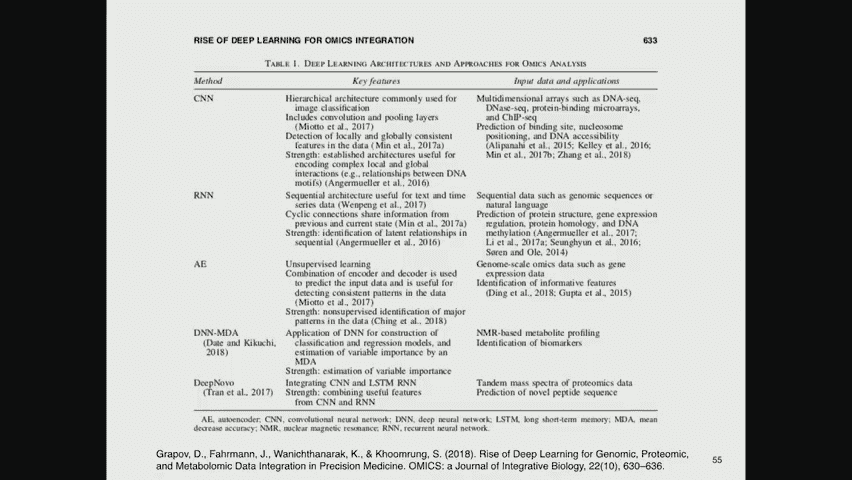

我怀疑那是来的，它只是还没有击中，据我所知，如果你知道有这样的文件，无论如何，告诉我好吗。

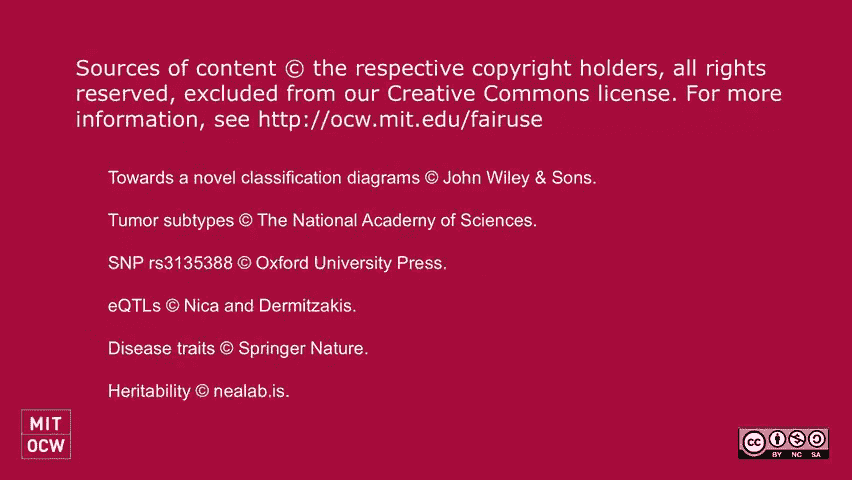

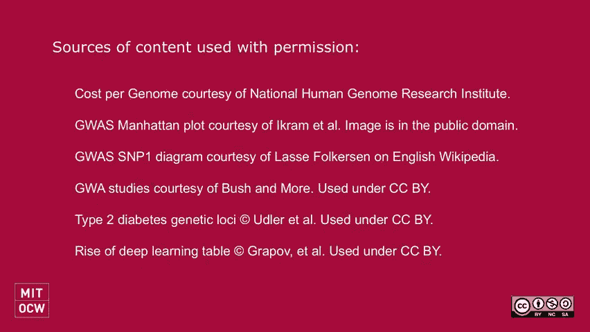

