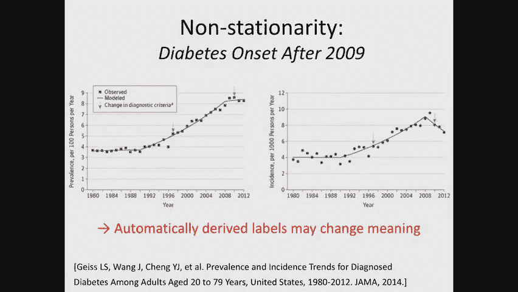
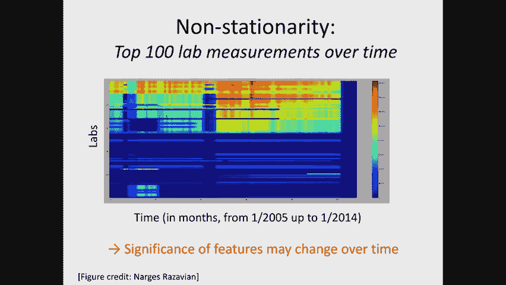
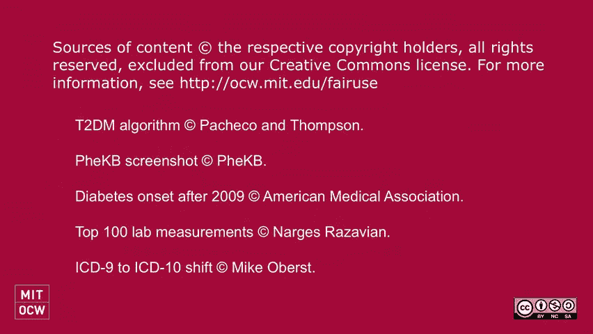

# MIT医疗机器学习中英文字幕 - P5：5. Risk Stratification, Part 2 - 大佬的迷弟的粉丝 - BV1oa411c7eD

今天我们将继续讨论风险分层的主题，我将用今天讲座的前半部分到三分之二的时间，继续我们上周讨论前停止的地方，我会谈谈怎么做，在有监督的机器学习方法中，如何驱动标签，我将继续讨论如何评估风险分层模型。

然后我将谈论一些出现的微妙之处，当你想把机器学习用于医疗保健时，专门用于风险分层，我想这将是，今天讲座中最有趣的部分之一，在今天讲座的最后三分之一，我将讨论如何重新思考有监督的机器学习问题。

不是分类问题，而是更接近回归问题，一个人现在想的不是，会不会有人，比如说，从现在起一到三年内患糖尿病，但他们到底什么时候会患糖尿病，所以活动的时间，然后呢，一个人必须开始，仔细想想我上周提到的审查问题。

所以我将用生存建模的语言将这些概念形式化，和，我将讨论如何在这种情况下进行最大似然估计，以及在这种情况下应该如何进行评估，好的，在我们上周的课上，我给你举了一个二型糖尿病风险分层的例子，只是为了提醒你。

目标如下，美国有百分之二十五的人患有未确诊的二型糖尿病，如果我们能接受健康保险索赔，每个有健康保险的人都可以获得的数据，并用它来预测短期内谁，未来一到三年很可能新诊断出二型糖尿病。

然后我们可以用它来冒险分层，分层病人群体，我们可以利用这一点来找出谁的风险最大，对这些病人进行干预，试图让他们得到诊断，并让他们开始治疗，如果相关，好的，但我没怎么说的是，那些标签是从哪里来的。

我们怎么知道有人在那个窗口得了糖尿病，我出现在上面，那么答案是什么，我是说，你们所有人都应该读过Roavian的报纸，所以你应该有一些想法，思想，补充材料中的暗示。

我们如何在那篇论文中定义一个积极的案例，他们服用的药物，开着的水壶，好的，是啊，是啊，例如，二甲双胍，葡萄糖，对不起胰岛素，我想这是一种格式的输入，二甲双胍是个棘手的案子。

因为二甲双胍经常用于替代适应症，但是有很多药物，比如胰岛素，专门用于治疗糖尿病，所以你可以看看，病人是否有服用这些糖尿病药物的记录，在我们用来定义结果的窗口中，如果你看到药物的记录，你可能会猜测。

这个病人可能有糖尿病，但是如果他们没有在那个时间窗口中列出的任何药物呢，你能得出什么结论，那么有什么想法，如果你看看呃，e，b和c w，你知道正常的，你经常看到它是关于，所以你给了我一个替代的方法。

不看药物，但是看实验室测试结果，看看他们的HBA One C结果，它测量了大约三个月的平均葡萄糖值，如果超出了范围，那他们是糖尿病患者，事实上，这通常被用作糖尿病的定义，但这并没有回答我最初的问题。

为什么只看糖尿病药物，不够，一些糖尿病药物可以用来治疗其他，有时糖尿病药物有歧义，但我们已经处理好了，已经通过试图选择一个明确的集合，还有什么其他原因，从糖尿病发病时的药物开始将在，哦。

这是一个非常有趣的观点，不是我在想的那个，但我喜欢，一个病人可能被诊断为2型糖尿病，但无论出于什么原因，他们在提供者和病人之间的沟通中，他们决定我们还不开始治疗，对呀，所以他们可能还没有接受糖尿病治疗。

然而，整个医疗保健系统可能非常清楚病人是糖尿病患者，在这种情况下，为病人做任何这些干预可能都是无关紧要的，是的，另一个原因，所以很多人只是糖尿病，所以他们有，所以一个标签意味着他们有糖尿病。

另一个标签是拥有新的，没有糖尿病，所以关键是你可能不会被诊断为糖尿病，不幸的是，这不是我们能够解决的问题，这里，这是个问题，但我们没有解决办法，不，更确切地说，我想说的是一个不同的观点。

就是这个数据有偏差，所以即使病人因为任何原因服用糖尿病药物，也许他们是用现金支付这些药物，如果他们付现金买那些药，那么病人就不会有任何记录了，在健康保险索赔中服用这些药物，对呀。

因为健康保险公司不必为此买单，但是你给出的理由也是一个非常有趣的理由，而且它们都是有效的，所以出于所有这些原因，仅仅看药物是不够的，正如刚才所建议的，查看其他指标，如，比如说，患者血糖值是否异常。

一个1C值也会提供信息，所以这不是微不足道的，对，也是你在下一个问题中要做的一部分，习题集第二集将仔细考虑，一个人实际上是如何进行队列构建的，不仅仅是你的包含排除标准是什么。

还有你现在如何从数据集中获得这些标签，传统上，对此的传统答案有两个步骤，第一步，实际手动标记一些病人，所以你拿了几百个病人，你检查他们的数据，你实际上看看他们的数据，并决定这个病人是糖尿病患者。

或者他们不是糖尿病，你必须这么做的原因是因为通常，你可能会想到的是显而易见的，哦，如果他们在服用糖尿病药物，他们有糖尿病，它有缺陷，直到你真正挖掘并查看数据，您可能没有意识到该标准有缺陷。

所以图表回顾真的是这个过程中必不可少的一部分，那么第二步呢，你如何概括为你的人口中的每个人获得这个标签，通常有两种不同类型的方法，第一种方法是想出一些简单的规则，试着推断每个人，例如。

如果他们有糖尿病药物或异常的实验室测试结果，这将是一个规则的例子，然后你可以把它应用到每个人身上，但即使是这些规则也很难推导出来，一会儿我会给你们看一些例子，正如我们所知。

机器学习有时很好地作为提出规则的替代方案，所以现在通常有第二种方法来解决这个问题，在文学中越来越常用，就是实际上使用机器学习本身来派生标签，这有点微妙，因为这是机器学习的机器学习，所以我想把它分解一下。

当你试图推动标签，你想知道的不是时候，时间t加w及以后会发生什么，这是我们最初要解决的机器学习任务，而是考虑到你对病人的了解，包括未来的数据，我用黑色显示的那个窗户里的这个病人是新诊断出糖尿病的吗。

在t加w和继续之间，好的，例如，这个机器学习问题，这个新的机器学习问题可以作为输入，实验室测试结果和药物，和一大堆其他数据，然后你用几个例子，你在第一步中标记了你，试图预测，这个病人目前是否有糖尿病？

然后你用这个模型外推到整个人口，现在你的结果标签可能有点不完美，但希望它比你用规则得到的要好得多，然后现在使用这些结果标签，你解决了你原来的机器学习问题，清楚了吗？还有问题吗？1。你如何评价自己？

如果你有这些用机器学习产生的标签，它们是概率的，所以这就是第一步真正重要的地方，对，你必须以某种方式获得地面真相，当然，一旦你得到了基本的事实，你创建了一列火车，并验证了一组地面真相。

你运行你的机器学习算法来训练一个，你看看它的性能指标，在此基础上验证了，对于标签预测问题，这就是你对它充满信心的方式，嗯，但让我们试着把这个分解一点，所以首先，这个图表回顾步骤是什么样子的。

如果是电子健康记录系统，你经常做的就是，你会拉出史诗或塞纳，什么的，商业ehr系统是，你实际上会开始查看病人的数据，你会读到以前的医生写的关于这个病人的笔记，你会看到他们的血液测试结果。

他们正在服用的药物，从中你通常可以说出一个相当连贯的故事，病人怎么了？当然更好，获取数据的最好方法是做前瞻性研究，所以你实际上有一个研究助理站在房间里，当病人走进提供者，他们和，他们和病人交谈。

他们记下了非常非常清楚的笔记，这个病人有他们没有的东西，但这通常太贵了，无法预期，所以通常我们现在要做的是回顾一下，如果你在处理健康保险索赔数据，你通常没有看笔记的奢侈，所以在我的小组中。

我们打字通常会做什么，我们实际上是在构建一个可视化工具，顺便说一句，我是一个机器学习的人，我现在对形象化一窍不通，我也不声称自己很擅长，对呀，但你不能做机器学习的工作，除非你真正了解你的数据。

所以我们必须建立这个工具，为了查看数据，为了试着做理解的第一步，我们对糖尿病的描述正确吗，所以我不打算深入讨论，顺便说一句，你可以下载这个，它是一个开源工具，但大致如此，我给你看的是什么。

这是一个病人的数据，我给你们看的是4月到12月的x轴时间，在y轴上，我显示了发生的事件，所以橙色是为病人记录的诊断代码，绿色是程序代码，在蓝色或实验室任务中。

如果你在给定的一条线上看到沿着同一条线的多个点，意味着实验室测试，同一个实验室测试进行了多次，你可以点击它看看结果是什么，这样你就可以开始讲一个连贯的故事，病人怎么样了，所有的权利。

所以像这样的工具是你需要建造的，从健康保险索赔开始做第一步，现在数据，传统上第一步，然后它会引导您标记一些数据，然后从那里你去想出这些规则，或者做机器学习算法来获取标签，通常那本身就是一篇论文，当然啦。

通勤科学界不感兴趣，但对卫生保健界非常感兴趣，所以通常有第一篇论文，评估导出标签的这一过程的学术论文，后来有很多论文谈到了你可以用这个标签做什么，比如我们最初要解决的机器学习问题。

让我们来看看其中一个规则的例子，下面是一个从健康保险索赔数据派生的规则，病人是否患有二型糖尿病，现在这并不完全是，这和我们在那篇论文中用的不太一样，但它首先让你明白了这个想法。

病人有一型糖尿病的诊断代码吗，如果答案是否定的，如果答案是肯定的，请继续，你已经排除了，因为你说好，这个病人的血液测试异常也是因为他们患有一型糖尿病，不是二型糖尿病，一型糖尿病。

通常是你可以认为的青少年糖尿病被诊断得更早，它背后有一个不同的机制，然后你看其他的东西，好的，二型糖尿病有诊断代码吗，在病人数据的某个地方，如果是这样，你往右边走，你看着，有没有药物。

数据中1型糖尿病的RX，如果答案是否定的，你继续往这边走，如果答案是肯定的，你走这条路是的一型糖尿病药物并不孤单，排除病人，因为也许同样的药物用于1型和2型，所以你还需要做一些其他的事情。

但你可以看到这很快就变得复杂了，这些基于手动的方法最终会有相当糟糕的积极因素，所以它们通常被设计成具有相当高的积极预测值，但他们最终会有很糟糕的回忆，他们最终不会找到所有的病人。

这就是为什么基于机器学习的方法最终变得非常重要，对于这类问题，现在，这只是我所说的表型的一个例子，我称之为表型，文学上就是这么叫的，这是二型糖尿病的表型，它是表型这个词，在这个上下文中与标签完全相同。

是的，什么是不正常的，比如说，如果A一C的结果是6。5或更高，你可能会说病人有糖尿病，这是实验室的结果，不是医学正确，是啊，是啊，谢谢其他问题，你不知道，到底哪一部分是时间，整件事情，整件事情，是啊。

是啊，所以建筑，你说，你知道，你按照这个决策树，你得到一个结论，就是这种情况，意思是可以，他们是二型糖尿病患者，如果你得到，如果你没有达到这一点，那么答案是否定的，他们不是二型糖尿病患者。

这就是我的意思，所以这种标记就是我们所说的二型糖尿病的表型，在这学期的晚些时候你会发现，彼得会用表型这个词来表示其他的东西，这是一个过载的术语，但在这种情况下，这也是它的名称，现在这里有一个网站的例子。

它是KB项目的，在那里你会找到，嗯，十到，近一百种这样的表型是艰难地创造出来的，对于一系列不同的条件，好的，所以如果你点击如果你去这个网站，单击这些条件中的任何一个，像阑尾炎，自闭症，白内障。

您将看到这种类型的不同图表，我刚给你看对了，所以这是真的，这是医学界真正需要做的事情，以便尝试导出标签，然后我们可以使用，在我们的机器学习任务中，欢呼是地面真理的论点，比如如果有人有糖尿病。

你必须有更多的，他们的感觉就像他们必须很好地拥有的那些，所以说，比如说，你可能有一个异常的葡萄糖值由于各种原因，一个原因是因为你可能患有所谓的妊娠期糖尿病，也就是由于怀孕而诱发的糖尿病。

但这些病人通常很好，虽然这是一个预测因素，他们并不总是有长期的二型糖尿病，所以即使是实验室测试也不是，就是，这并不能说明全部情况，你可以不用动就能诊断出来，这在这里不太常见，是啊，是啊，我是说。

故事在未来会改变，因为将会有一系列新的诊断技术，可能会使用新的模式，就像，你知道的，基因表达，比如说，但今天通常答案是肯定的，是啊，是啊，所以如果这些是医生做的，正如我的意思，对于每一种疾病。

有一个明确的，你知道，这些通常是由健康结果研究人员做出的，他们的团队中通常有临床医生，但是经常在这些上面工作的人，往往来自流行病学领域，比如说，你的问题是什么来着，每种疾病只有一种表型吗，在理想世界中。

每一种不同的疾病都有一种表型吗，每种疾病至少有一种表型，现在可能存在的，当然你可能对它的不同方面感兴趣，就像你可能有兴趣不知道，只是病人有自闭症，但是他们在自闭症谱系中的位置，你可能没兴趣知道。

只是他们现在有了吗，但你也可能想知道他们什么时候得到的，所以这里面有很多微妙之处，但是建立这些真的很慢，并验证它们，确保它们能跨多个数据集工作真的很有挑战性，通常是负面的结果。

所以手工做这件事是一个非常缓慢的过程，这让我和其他许多人开始思考机器学习方法，了解如何自动完成，只是作为后续，所有的权利，有没有像五个自闭症的病例，你知道短信，比如说，或者多个竞争的，是呀。

所以经常有许多不同的基于规则的系统给你冲突的结果，是的，这经常发生，这些基于规则的系统能否提供一个，条件是对的，这就是我刚才提到的一个微妙之处，这些能告诉你发病时间吗，它们通常不是为了这样做而设计的。

但一个人可以想出一个来设计和做，所以尝试做到这一点的一种方法，你改变这些规则，有一个与之相关的时间段，然后你可以想象在滑动窗口中应用这些规则，到病人数据，看看它第一次触发是什么时候。

这将是试图了解发病时间的一种方法，但这也有很多微妙之处，所以我现在要继续前进了，我只是想给你一些感觉，这是什么衍生的标签，最后看起来像，现在让我们转向评估，所以说，该领域非常常用的方法。

就是计算所谓的接收器算子曲线或ROC曲线，这个首先看的是下面，这对于二进制分类问题是很好定义的，对于一个二进制分类问题，当你使用一个输出概率或某个连续值的模型时，然后你可以使用连续值预测。

如果你想做一个预测，通常是正确的阈值，所以你说，如果大于五点五，这是一个预言，如果小于零点五，摩擦力或零，这里我们可能会感兴趣，不仅仅是你知道什么能最大限度地减少零损失，但你也可能有兴趣交换。

比如说假阳性或假阴性，所以你可以选择不同的阈值，你可能想量化，这些权衡如何寻找不同的选择，在这个连续值预测的那些阈值中，这就是ROC曲线将向你展示的，所以当你沿着门槛移动时，您可以计算每一个阈值。

真正的阳性率是多少，假阳性率是多少，这给了你一个数字，你尝试所有可能的阈值，给你一个曲线，然后你可以比较两者，你可以比较不同机器学习算法的曲线，比如说，在这里，我在绿线上给你看。

通过使用我们所说的传统风险因素获得的预测模型，所以大约有八到十个不同的二型糖尿病风险因素，在文献中非常常用，与蓝色相比，它向你展示了你得到的东西，如果你用一个Lone正则化的Logistic回归模型。

没有领域知识可以扔进特性袋，你想站在上面你想站在左上角，这就是我们的目标，所以你会喜欢曲线，上面的蓝色曲线，然后一直向右，现在一种尝试用单个数字量化的方法，任何一条ROC曲线有多有用。

通过观察所谓的ROC曲线下的区域，从数学上来说，这正是你所期望的，是ROC曲线下的区域吗，所以你可以把曲线积分，你现在把那个号码拿出来，记得我告诉过你你要在左上角左上角。

所以目标是在1的ROC曲线下得到一个区域，现在，一个随机的预测，给你任何想法，所以说，如果你只是抛硬币和汽油，你觉得怎么样，点五，嗯好吧，所以我有点误导，当我说你只要抛硬币，你得抛硬币，不同的噪声率。

每一个都会让你在这条曲线上有一个不同的位置，如果你看看从这些随机猜测中得到的曲线，它将是从零到一的直线，就像你说的那样它的满分是5分，对呀，所以点5是随机的，猜一个是完美的，你的算法会介于两者之间，嗯。

现在与今天讲座的其余部分有关，将是另一个定义，计算C曲线下面积的另一种方法，所以计算它的一种方法是字面上的，正如我所说，你计算你创建的曲线，你积分得到它下面的区域，人们可以用数学来证明。

我不打算在这里给你推导，但你可以在维基百科上查一下，从数学上可以证明，计算ROC曲线下面积的等效方法，就是计算概率，算法会将标记为阳性的病人与标记为阴性的病人进行排名，从数学上来说，我所说的是以下事情。

你要把两对病人加起来，我要打电话给他们，x 1是标签为y 1等于1的病人，X2是一个标签为Y的病人，其实，我就叫它，是啊，是啊，标签x 2等于1，所以这是两个不同的病人，我想我要重写它，所有的权利。

对于i和j的所有选择，这样y i和y j就有了不同的标签，所以应该说你杰克是零，然后你会看到你想要发生什么，就像，假设你在这里使用的是一个线性模型，所以你的预测是由，第j个数据点。

记得是那个得到零号标签的，第i个数据点是得到一个标签的数据点，所以我们想要标签的分数，应该是数据点的分数，这应该高于数据点的分数，应该标为零的，只要数一数，这是一个指示器功能。

你只要数一数有多少是正确订购的，然后你就，你只需要通过你所做的比较的总数来归一化，事实证明，这正好等于ROC曲线下的面积，这清楚地表明，这是一个真正关心排名的概念，你得到排名了吗，你排名对吗。

那些应该得到更高一个的人，比那些应该得到零标签的，重要的是，整个度量实际上对标签不平衡是不变的，因此，您可能有一个非常不平衡的数据集，但是如果你要重新取样，现在使其成为一个平衡的数据集。

你的预测模型的AUC不会改变，当涉及到评估设置时，这是一个很好的属性，在那里，您可能为计算问题人为地创建了一个平衡的数据集，即使那里的真实环境不平衡，至少你知道两个设置中的数字是相同的，另一方面。

它也有很多缺点，因为你通常不关心整个曲线的性能，通常你会关心曲线上的特定部分，例如，在上周的讲座中，我争辩说真的，我们通常关心的只是特定阈值的正预测值，我们希望它尽可能高，尽可能少的人。

比如预测找到一百个最危险的人，看看他们中有多少人患上了二型糖尿病，你真正看到的是曲线的这一部分，所以事实证明有一些概念，曲线下的面积是概括的，专注于曲线的部分，这就是部分AUC的名字，比如说。

如果你从零到，让我们说，曲线的一点，那么你仍然可以得到一个数字来比较两条不同的曲线，但它有点集中在曲线的面积上，这实际上与你的预测目的有关，为了你手头的任务，关于接收者，我想说的就这些，算子，特征曲线。

有什么问题吗？我们更多地讨论了使用这个的缺点，因为平衡类是模型类，总是正的，所以问题是当你想使用这种方法的时候，你取决于你如何使用打印，你可能无法忍受8个点的假阳性率，所以在某种意义上，发生什么事了？

在曲线的这一部分可能与您的任务完全无关，所以其中一个算法，这些曲线中的一个可能看起来在这里做得非常非常好，在这里很差，但如果你看的是ROC曲线下的整个区域，你不会注意到这一点，所以这是一个大问题，是啊。

是啊，这个怎么样，你什么时候会用这个或者像一个精确的回忆，是啊，是啊，所以很多社区也对精确的回忆曲线感兴趣，及其精度回忆曲线，与接收器算子曲线相反，具有它们对类不平衡不不变的性质，在许多环境中。

这是有趣的，因为它允许你捕捉这些类型的数量，我不打算深入讨论，其中一个或另一个的原因，但这是你可以阅读的东西，我鼓励你发帖到广场，我们讨论了广场，我想说的评估量被称为校准和校准。

这里与二进制分类问题有关，在你深入了解这个数字之前，我一会儿就解释，让我给你我所说的校准的要点，假设你的模型输出一个概率，好的，所以你做逻辑回归，你得到一个概率，你的模型说这十个病人。

他们在接下来的四到八小时内死亡的可能性是七分之一，我想这就是你的模型输出的，如果你是那个结果的接收者，你听到七号了吗，你对那十个人有什么期望，在接下来的四年里，他们中有多少人应该死去，八小时。

每个人都可以大声尖叫，所以他们有七七个人，你预计在接下来的48小时内死亡的十个人中的七个，如果所有输出的概率是7点，但这就是我所说的校准，对呀，所以如果你发现只有一只死了，那么这将是一个非常奇怪的数字。

你的输出是正确的，所以这种校准的概念，我将在一秒钟内正式定义，当你输出一个概率时，当你真的不知道这个概率将如何使用时，如果你知道你是否有任务失败的想法，你知道重要的是实际的预测对1或0，那就没问题了。

但机器学习中的预测通常以一种更微妙的方式使用，比如，比如说，通常你的医生可能比你的电脑有更多的信息，他们可能经常想接受结果，你的电脑预测并与其他证据进行权衡，或者在某些情况下，它不仅仅是等待其他证据。

也许这也是关于做出决定，这个决定可能需要努力，实用工具，比如说，病人对，而不是接受可能会产生严重不良后果的治疗，皮特以后会更多地讨论这个问题，在这个学期，我想如何将这个概念形式化，但在这一点上。

我只想出去，概率本身可能很重要，让概率变得有意义是人们现在可以量化的事情，那么我们如何量化它，尝试量化它的一种方法是创建以下图T，实际上称之为直方图，所以在x轴上是预测的概率。

这就是我所说的y轴上的p帽，是真正的概率，这就是我的意思，当我说有预测概率的人中真正得到积极结果的比例时，这将是y轴，所以我称之为真正的概率，我们想看到的是，这是一条线，直线，在我举的例子中。

记得我说过有一群人有七种可能性预测，但对他们来说，只有一个人真正得到了积极的事件，所以应该是在这里，而你会期望它在那边，所以你可能会问，如何从有限数据中创建这样的图，嗯，一种常见的方法是绑定数据。

所以你会说你会创造间隔，所以这个垃圾箱是从零到零点一的垃圾箱，这个垃圾箱是从一个点到第二个点的垃圾箱，以此类推，然后你看，好的，有多少预测概率在零到零点1之间的人真的死了，你会得到一个号码。

现在我可以去这里，但这正是我在这里给你看的，所以现在，忽略底部的条形图，只看这条线，所以让我们只关注这里的绿线，我给你看几种不同的型号，就目前而言，只要把注意力集中在绿线上，所以顺便说一句，绿线注意了。

看起来还不错，几乎是一条直线，那么我是怎么计算的呢，嗯，首先注意滴答的数量是一二，三四五六七八九十，好的，所以这条线上有十个点，每一个都对应于其中一个垃圾箱，所以第一点是零到零，一点垃圾箱。

第二个点是点一和点二，以此类推，所有的权利，我就是这么计算的，接下来你会注意到我有置信区间，我计算这些置信区间的原因，是因为有时候你可能没有那么多数据在这些垃圾箱里，对，例如。

假设你的算法几乎从来没有说过某人有九点九的预测概率，那么在你得到大量数据之前，你不会有，你不会知道的，这些人中有多少人真正发展了这一事件，所以你可以，你应该看看这条线的置信区间，应考虑到这一点。

用不同的方式来理解这个概念，现在看数字，这就是我在条形图上给你们看的，在条形图的底部，我给你看分数，实际得到预测概率的个人数量或个人比例，所以嗯，现在，让我们开始比较线条，所以这个，嗯，的。

这里显示的蓝线是一个机器学习算法，它预测急诊室的感染，与我们前面看到的糖尿病问题略有不同，它使用了临床文本中的一袋单词模型，主要投诉，所以它使用一个结构化数据，你在某个时间点得到的，急诊室。

所以它使用的信息很少，你可以看到两个模型都校准得很好，但是但是间隔，红线和紫线的置信区间在接近尾声时变得非常大，如果你看看这些条形图，它解释了原因，因为使用较少信息的模型，最终更加厌恶风险。

所以他们永远不会预测到很高的概率，他们总是呆在这个较低的政权里，这就是为什么我们有很大的置信区间，好的，关于评估，我想说的就这些，我现在不会回答任何关于这个的问题，因为我很想继续剩下的课，但又一次。

如果你有任何问题，请发邮件到Piazza，我很乐意与你讨论，离线，所以总而言之，我们已经讨论了如何将风险分层简化为二元分类，我已经告诉过你如何操纵标签，我给你们举了一个机器学习算法的例子。

我和你谈过如何评估它，可能会出什么问题，所以让我们看一些例子，这些只是一小部分可能出错的例子，还有很多，所以这里有一些数据，我给你看的是我们在糖尿病发作前看到的同样的问题。

我给你看的是2型糖尿病的患病率，假设跨时间的诊断代码，对呀，所以结束了，这里是1980年，这边是二千零一十二，看，现在不是一条平坦的线了，那是什么意思，这是否意味着人们的饮食越来越不健康。

从1980年到2012年，所以越来越多的人患糖尿病，这将是一个合理的答案，另一个似是而非的解释是事情发生了变化，事实上，我给你看的是这些蓝线，事实上，糖尿病的诊断标准发生了变化。

所以现在病人的数量实际上没有太大变化，假设这个时间点在那个时间点，但真正导致这一大幅上升的是，根据一种理论，是因为诊断标准改变了，所以我们所说的糖尿病患者变了，因为疾病归根结底，人为的概念。

你知道我们怎么称呼一些疾病吗，所以数据在变化，就像你在这里看到的，让我给你看另一个例子，哦顺便说一句，所以这样做的结果是自动派生的标签，比如说，如果你使用这些表型分型算法之一，我之前给你看过了。

标签派生的规则，这里可能与从这里派生的标签非常不同，尤其是如果它使用的是数据，例如多年来含义发生变化的诊断代码。

所以这是一个后果，会有其他后果，我以后再告诉你，这里有另一个例子，顺便说一句，这个概念叫做非平稳性，数据在随时间变化，它不是静止的，这里是x轴上的另一个例子，我在这里给你看时间，每列都是一个月。

从二千零五到二千零四，在y轴上，我向你展示了这张桌子的每一行，我给你看一个实验室测试，这里我们不是在看实验室测试的结果，我们只是在观察进行了多少次这种类型的实验室测试，在这个时间点，现在你可能会期望。

从广义上讲，葡萄糖测试的次数，白细胞计数测试的次数，的数量，中性粒细胞测试等可能在平均时间内相当恒定，因为你平均超过了很多人，但实际上你在这里看到的是，有大量的非平稳性，哪些测试是有序的。

随着时间的推移会发生戏剧性的变化，所以说，比如说，你看这里有一条线，全蓝的地方，意思是，在这之前没有人命令测试，当人们开始使用它的时候，“那是什么主意？”，在测试被投资之前。

然后你意识到这样测试就用得更少了，或者在这种情况下根本没有使用，然后突然被用了，为什么会发生在后面，这是一个新的测试，对呀，因为技术的变化，对呀，突然我们想出了一种新的诊断测试，一项新的实验室测试。

我们可以开始用它，以前不存在的地方，所以很明显以前没有关于它的数据，它可能突然出现的另一个原因是什么，可能是这样的，我结账，呃，强制性，或者这是医院入院测试的一部分，做一些额外的测试。

我坚持你的第一个例子，嗯，也许那个测试变成强制性的，好的，所以也许有一个临床指南，在这个时间点创建的，健康保险公司决定我们要报销这次测试的费用，在这个时间点，测试可能真的很贵，所以没有人会事先做这件事。

现在健康保险公司要为此买单，现在人们开始这么做，所以它可能事先就存在了，但如果没有人愿意付钱，没人会用它，你可能会看到这样的东西的另一个原因是什么，或者中间有这样的空隙。

中间有一个巨大的缺口，什么可以解释，坚持住，抓住这里的臀部，也许欧洲人口大多处于一定的年龄和保险范围，是啊，是啊，所以所以一个解释，我认为在这个数据集中是不可信的，但对于一些数据集来说，这是合理的。

那也许嗯，也许你在零点的病人都是完全相同的年龄，对呀，所以也许有一些对齐，突然在这个时候，你知道的，你知道的，假设人们只得到女人只得到，一旦他们到了一定的年龄，所以这可能是一个原因。

为什么你会在某个时间点之前什么也看不见，也许这也会随着时间的推移而改变，也许他们会在更年期后的某个时候停止得到它，这不是真的，但让我们说，嗯，这是一种解释，在这种情况下，这是没有意义的。

因为病人群体非常混杂，所以你可以认为它大致处于稳态，所以他们不是，你知道吗，你们这里会有各种年龄的病人，还有什么原因有人在这里举手，是啊，是啊，我只想说你可以，呃，也许EMR关闭了一段时间。

所以他们只在纸上做事情，他们只是叮叮，叮叮叮，是呀，这是正确的，所以也许EMR关闭了，或者在这种情况下，我们有数据问题，对吗，所以这些数据是获得的，不知何故，比如说。

也许是通过与Web Quest或实验室核心等公司的合同要求的，也许在那四个月的间隔里，有一个合同谈判，所以突然间我们无法获得那段时间的数据，或者我们的数据库崩溃了，我们突然丢失了那段时间的所有数据。

这种情况经常发生，不仅仅是医疗保健行业，但其他行业也是如此，由于这些系统性类型的变化，你的数据在时间上也是不稳定的对吧，所以现在我们已经看到了三四种不同的解释来解释为什么会发生这种情况。

现实是所有这些的混合体，就像上一个一样，呃，所以在前面的例子中，请注意这里真正改变的是派生标签现在可能会随着时间的推移改变含义。

机器学习模型中使用的特征的重要性会随着时间的推移而改变，这就是这样做的后果之一，特别是如果您从实验室测试值驱动功能。

这里是最后一个例子，再次在这里的访问，我在y轴上有时间，我显示的是你观察到某种诊断代码的次数，这条青色线是ICD九号码，这条红线是ICD十个代码，你可能还记得皮特在之前的一次演讲中提到。

有一个很大的转变，在某个时候从i d 9编码到i d 10编码，那是什么时候，正是这个时候，所以如果你考虑特征向量，您将为您的机器学习问题导出，你将有一个功能为所有的I D九个代码。

和所有I D十个代码的一个功能集，这九个基于特性将是，你知道在这个时期它们会被大量使用，然后突然间，在这段时间里，它们将完全稀疏，我有十个功能开始被使用，你可以想象如果你用机器学习，只是ICD九个数据。

然后你尝试在这一点上应用你的模型，及时，它会做得很糟糕，因为它期待功能，它不再能够访问，这种情况经常发生，事实上，我在这里描述的实际上是整个医疗保健行业的一个主要问题，在接下来的五年里。

每个人都要努力解决这个问题，因为他们想把他们的历史数据用于机器学习，但是他们的历史数据和他们最近的数据有很大的不同，所以现在，面对我刚才描述的所有这些非平稳性，我们在糖尿病风险分层问题上做错了什么吗。

我告诉过你以前的想法，我怎么让你知道那是我的报纸，顺便问一下，我犯了一个错误吗，别害怕，我经常错，我只是特别问一下我评估模型的方式，这不是错误，但有一件事，如果我是医生，我想去看。

是对喜欢包含标准的敏感性，如果我像阿爸一样移除，例如，像大多数人一样，他们把RAS或IS比作，我不认为我会如此理解鲁棒性，到更改数据，一点是会摄入很多的东西，我同意，但非平稳性结果并没有立即表明这一点。

或者非平稳结果所暗示的东西，我们前排的助教有个主意，是啊，是啊，让我们听听，列车和测试分布是从相同的，或者训练和测试集从相同的分布中提取，所以我们在那里做评估的方式，我们说过，好的，我们要。

我们要把它设置好，在2009年1月1日，我们在预测未来三年会发生什么，我们把我们的病人分成火车，验证和测试，但在任何时候都使用相同的设置，现在的预测时间是二万零九年一月一日，我们学习这个模型。

现在是二十八岁，我们今天想应用这个模型，我计算了ROC曲线下的一个面积，我用回顾性数据计算了阳性预测值，我把这些交给了我的搭档，他们可能希望这些数字反映了他们今天的模型会做什么，但因为这些问题。

我刚才告诉你的是对的，例如，键入它的定义的人数发生了变化。

因为这里的精心设计忽略了这一部分，那只是侥幸，但事实上由于训练期间的实验室测试，可能和现在有的不一样。

因为我们现在只有十个ICD数据，不是ICD九号，出于所有这些原因，我们的预测表现现在会非常糟糕，尤其是因为最后一个问题，我们的预测模型现在会很糟糕，如果它是根据2008年或2009年的数据训练的。

所以我们永远不会认识到，如果我们使用我们在那里做的验证设置，所以我写了那篇论文，当我年轻天真的时候，我现在头发花白了一点，所以在我们最近的工作中，比如说，这是我们现在正在写的一篇论文。

由硕士生Mind海伦·佐完成，并正在研究预测抗生素耐药性，现在我们对过度评估设置更聪明了一点，我们决定把它设置得有点不同，我现在向你们展示的是我们选择火车的方式，为我们的人群验证和测试。

所以我们分割了我们的数据，所以这里的x轴是时间，这里的y轴是人，所以你可以把每个人想象成不同的一排，你可以想象我们随机排序的行，我们所做的是把我们的数据分成这四个象限，我们用于训练和验证的前两个象限。

顺便注意一下，我们有，嗯，训练集里的不同人，就像我们在验证集中所做的那样，这对另一个数量很重要，我一会儿就会谈到，所以我们用这些数据来训练和验证，这与我们在糖尿病论文中的方法非常相似，但现在进行测试。

我们用这个未来的数据好吧，所以我们使用14世纪20年代的数据，十六和一，可以想象两个不同的象限，你可能有兴趣知道同样的病人，你在训练中为他做了预测，你的预测在测试时对这些人的影响如何，嗯。

在未来的数据中，这是假设，我们预测的是，那本质上更短视，在这种情况下，它预测，他们会对一些抗生素产生耐药性吗，但你也可以看看完全不同的病人，在训练中根本没有使用，假设这两个桶根本不用于那些病人。

我们如何再次使用未来的数据，以及这种设置的优点，它真的可以帮助你评估非平稳性，所以如果你的模型真的利用了2007年的功能，二千零八年，两千零九年，但在2014年没有。

你会看到你的表现有很大的下降看着下降的表现，从这个时间段的验证集到这个时间段的测试集，性能的下降将唯一归因于非平稳性，所以这是诊断它的好方法，只是对非平稳性的澄清，是某些数据完全丢失的事实吗。

还是它只是编码不同，所以很难得到正确的映射，这两种情况都是对的，所以我现在有一个很大的研究计划，这不仅仅是问如何，所以这就是你如何评估和识别问题，但当然有一个非常有趣的研究问题。

这就是你如何利用非平稳性权利，例如，你有九个i和十个数据，你不想就这样扔掉ICD九号数据，有办法使用它吗，所以天真的回答，这也是社区今天主要使用的是想出一个映射权，使用它来绘制从9到I的手动地图，十。

这样您就可以手动将数据转换为这种新格式，这样你从过去学到的模型在未来就有用了，这就是无聊而简单的答案，但我想我们可以做得更好，例如，我们可以学习数据的新表示，我们可以直接学习映射，为了优化您最近的性能。

我们以后还有很多可以谈的，是的，这确实是一个非平稳的变化，这会让你发现的，但这并不能保证像RO一样，你应该纠正，对呀，所以这可以让你检测到非静止发生了，它允许你说你的模型将推广到2014年，两万六。

但是，当然啦，这并不意味着你的模型会推广到2006年，二千一十八，那么你是怎么做到的，你如何对那口井有信心，这是一个非常有趣的研究问题，我们今天对此没有很好的答案，从实际的角度来看。

我能回答的最好的我能给你的最好的，今天一直在建立这些制衡，如此持续，评估你在最新数据上做得如何，如果你看到大的变化，扔红旗，在部署过程中构建更多的制衡机制，如果你看到一群病人被预测，1的概率，在过去。

你从来没有预料到，概率一，可能会告诉你一些事情，在本学期晚些时候，我们将讨论健壮的机器学习方法，比如说，旨在对抗对手的方法，这些类型的方法也会让你更健壮，到特定类型的数据集移位，其中非平稳是一个例子。

但它是一个，这是一个很大的开放研究领域，所以为了确保我有同样的，理论上，如果您能将旧数据集映射到新数据集，就像编码一样，那些还可以吗，就像你在未来数据集上得到的结果一样，嗯，如果你能做一个完美的映射。

而且是一对一的，这些东西的分布也没有改变，那么你真正需要评估的是，数据集有移位吗，你的培训分布是多少，在与您的测试分布不相同之后，冒险，是呀，你们都很好，如果你不是，你有麻烦了。

应该是什么样子的测试和训练它在这里，什么二一三的标签，所以我们只使用了2007年的数据，二千零一十三，第三只使用了21416年的数据，但在像这样的情况下，就像你关心的结果发生在2007年，观察到你可以。

是啊，是啊，所以对于糖尿病问题，这里也有包含排斥，你必须处理的，我在这里给你看的，我说的是一个场景，在哪里，嗯，你在哪里，你可能会跨时间对病人做出多种预测，所以这是一个更短视的预测任务。

但对于糖尿病的情况，人们可以想出一个类似的例子，就像，比如说，只要撑起一半的病人，对于您的训练集，使用数据高达2000和9，并仅根据20013的数据进行评估，对于您的测试集，假装是一月，一圣，二十。

13和看性能高达2千1百17，也就是说，你正在改变你的预测时间，以使用最近的数据，所以下一个微妙之处是，这是我用的名字，这不是一个标准的名字，这就是我所说的，干预，受污染的结果，好的。

这里的例子来自你今天的阅读，阅读是一篇关于可理解的医疗保健模型的论文，预测住院肺炎风险，从K到D的30天入学人数，所以在那篇论文中，他们举了一个例子，这是试图使用预测模型的一个非常古老的例子。

了解病人入院时的死亡风险，他们学到了什么，他们使用了一种基于规则的学习算法，他们发现了一条规则，如果病人有哮喘，那么他们死亡的风险就很低，所以这些都是肺炎患者，所以一个患肺炎的病人，哮喘的死亡风险较低。

比一个患肺炎的病人，并且没有哮喘史，好的，这条规则是这么说的，这篇论文认为这个习得的模型有问题，你们谁还记得，那是一个今天没说话的人，拜托了，是啊，是啊，在后面，那些患有哮喘的人有更积极的治疗。

所以这意味着他们有更高的机会患有哮喘，进行了更积极的治疗，特别是，他们可能会被送入重症监护室进行更仔细的警惕，结果他们有更好的结果，是呀，完全正确，所以这背后的真实故事是风险分层。

正如我们在过去几周所说的那样，它被用来推动干预，以及这些干预措施，如果它们发生在过去，数据会改变结果，在这种情况下，你可以想象用所学的预测模型说一个新病人进来了，这个新病人有哮喘。

所以我们要说它们是低风险的，如果我们根据这个预测采取天真的行动，我们可以说，好的，让我们送他们回家，他们死亡的风险很低，但如果我们那样做了，我们可能会杀人。

因为他们低风险的原因是因为他们过去有这些干预措施，所以这里，照片上是这样的，你有你的数据，你试图在某个时间点做出预测，比如说新兴科室分诊，你想预测一些结果，y。

让我们假设病人是否在未来的某个决定性时刻死亡，现在的挑战是，正如你在那里看到的机器学习任务中所说的那样，你能接触到的只有X和Y，协变量，特征和结果，所以你从x预测y，但你把中间发生的一切都边缘化了。

在这种情况下，治疗，所以人们幸存下来的好结果可能是由于两者之间发生的事情，但在这两者之间发生的事情甚至没有在数据中观察到，必然，我们如何解决这个问题，嗯，我想让你首先想到的是。

我们能认识到这是一个问题吗，这就是那篇文章真正建议使用一个可理解的模型，一个你可以内省并试着理解一点的模型，实际上对认识到奇怪的事情正在发生非常重要，这是一个我们将在课堂上讨论的话题，在学期结束的时候。

和更多的深度，我们将讨论解释机器学习模型的算法，所以你必须认识到发生了什么是很重要的，但我该怎么办，所以这里有一些黑客，黑客一号修改模型，这是你读到的论文中提出的解决方案，他们说，好的。

如果学习算法输出给你的是一个简单的基于规则的预测，你可以看到没有意义的规则，你可以用你的临床洞察力来识别它，没有意义，你甚至可以解释为什么会发生，然后你只要把这个规则去掉就行了。

所以你把你的你手动修改模型，使它朝着更明智的方向发展，对呀，所以这就是建议，我认为这是胡说八道，就像，我认为这在当今世界是行不通的，在当今高维模型的世界里，总会有代理人。

它们以某种方式被你的学习算法拾取，你甚至认不出，很难按照你想要的方式修改它，也许用简单的方法是不可能的，顺便说一句，另一个有趣的研究问题，你如何在高维度的环境中真正做到这一点，但就目前而言。

假设我们不知道如何在高维环境中做到这一点，你还有其他选择吗？第二个黑客是重新定义结果，来改变你的预测，例如，如果你回到这张照片，而不是试图预测死亡为什么，如果你能找个代孕者，你关心的是预处理。

你反而预测了那件事，那你就可以重操旧业了，例如，在一个可选读数中，或者实际上，我觉得，在今天这门课的第二篇必读文章中，这是一篇关于败血症风险分层的论文，这通常是由感染引起的。

他们在那篇文章中展示的是有实验室测试结果，比如乳酸盐，还有其他人，可以给大家一个提示，这个病人可能会走向临床恶化，这项测试可能会在干预措施之前试图解决这种情况，所以如果你试图，如果你改变你的结果。

预测代孕，那么你就绕过了这个问题，我刚才指出的，现在第三个黑客是，嗯，Suchi Sara和她的科学转化医学学生的这篇论文，两千零一万五，这是一篇写得很好的论文，我强烈推荐阅读它。

他们建议将这个问题正式化为审查问题，这就是我们将要讨论的，今天讲座的最后三分之一，特别是他们说的是假设，假设你看到一个病人因这种情况而接受治疗，假设他们接受了败血症治疗。

那么如果病人接受了这种情况的治疗，那我们就不知道他们会怎么样，如果他们没有接受治疗，所以我们不观察结果，未治疗死亡，所以我们将把它作为一个未知的结果，对于那些没有接受治疗但最终死于败血症的病人。

那他们就不被审查了，我要给你看的是，在课程的后半部分是如何从删失数据中学习，所以这是另一个形式化，它试图解决我们指出的这个问题，现在我称这些黑客为，因为我真的认为我们应该做的是把它正式化。

使用因果关系的语言，一旦你做了这个内省，你意识到有治疗方法，事实上，你应该重新考虑这个问题，这是一个现在有三个数量的兴趣，病人来了，你在分诊时所知道的关于他们的一切，那是x变量。

我在结果出来之前给你看了，让我们说Y，然后中间发生的一切，特别是在两者之间发生的干预，我们称之为治疗，人们想问的问题，为了找出如何最佳地照顾病人，是将进入重症监护室的人之一，这就是我们在这里考虑的干预。

这会降低病人死亡的可能性吗，现在当我说降低，我不是指相关性，我是说因果关系，它真的会降低病人死亡的风险吗，我想我们需要用，实际上在思考因果关系，试图将其适当地正式化，如果你这么做了，这将是一个解决方案。

这将推广到我们在机器学习中关心的高维设置，这将是一个主题，春假后我们将深入讨论，但我想给你这个作为一个动力，为什么它如此重要，还有很多其他原因从因果的角度来思考，好的，所以第三个微妙之处。

媒体上有大量关于深度学习和医疗保健的炒作，很多都是有充分理由的，比如说，我们在从放射学和病理学到，到ekgs的解释都被深度学习算法改变了，但我一直告诉你的问题，在过去的几周里。

我对电子健康记录数据进行了风险分层，比如笔记，例如化验结果和生命体征，诊断码，那是另一回事，事实上，如果你仔细观察所有的文件，最近几年发表的所有论文，他们一直试图将深度学习算法的挑战应用于这些问题。

事实上，收益是非常小的，所以我在这里给你们看的只是这样一篇论文的一个例子，这是一篇受到媒体广泛关注的论文。这是一篇名为《可扩展和准确》的谷歌论文，电子健康档案深度学习，如果你穿越美国，如果你去国际。

你和首席医疗信息官谈谈，他们都会告诉你这篇论文，他们都读过，他们都听说过这件事，他们都想用它，但这实际上是在做什么幕后发生了什么，嗯，这篇论文使用了我们一直在讨论的相同种类的数据，你知道需要生命体征。

溺爱，订单，药物治疗，把它当成一个时间线，总结一下，然后使用递归神经网络，它还使用注意力架构，报纸上有一些很聪明的人，你知道吗，格雷格，兰多，杰夫，院长都是这篇论文的合著者，他们知道自己做得对。

所以他们用这些算法来预测许多下游问题，再入院风险，比如说，三天的任务，就像你在本周的阅读中读到的那样，他们看到他们得到了很好的预测，但是如果你去补充材料，有点难找，但这是你们所有人的链接。

我会把它贴到我的幻灯片上，如果你看看补充材料中的最后一个数字，你会看到一些有趣的东西，这是我在病人死亡率预测中研究的三个不同的任务，三十天再入院，停留时间预测，第一行。

这些桶中的每一个都是你的深度学习算法在这里做的，他们有两家不同的医院，我想可能是芝加哥大学和斯坦福大学，他们显示了洛克曲线下的区域，我们已经谈过了，为他们的最佳模型提供这些任务中的每一个的性能。

在括号里他们给出了置信区间，让我们说，大约95%的置信区间，现在，你看到的第二行叫做填充脚全功能增强样条，它使用的是相同的数据，但它用的是非常接近，你在报纸上看到的Naravian的特征表示。

关于糖尿病的论文，我告诉过你的预测，我们一直在批评，好的，所以它使用了L一正则逻辑回归，具有一组智能功能，好的，你在这三个设置中看到了什么，结果在物理上没有显著的不同，所以让我们来看看第一家医院。

深度学习点，九十五，a c这个l，回归点，九点半，再入境点，七十七点，七十五点，八十六点，八十五，内容间隔都是重叠的，发生什么事了，所以我想你在这里看到的，首先是机器学习社区认识到，在这种情况下。

最近才认识到，更简单的方法往往能很好地处理这类数据，我不认为这是他们尝试的第一件事，他们试图，可能是深度学习算法，首先，第二，我们都抓住了这一点，就像我们都想出这些更好的算法。

但到目前为止我们做得不太好，我马上就会告诉你更多，但在我完成幻灯片之前，我想给你一个妙语，我认为这真的很重要，你可能会从这里回家，说你知道吗，也好不到哪里去，但它更好一点，九十五点至九十三点。

假设是紧置信区间，但你知道可能会有一些病人的生命你可以用它来挽救，但因为我告诉过你的所有问题，到目前为止的非静止的，比如说，这些收益在许多情况下消失了，当你实际部署这些模型时，它们甚至会逆转。

由于数据集的移位或非平稳性，它这个，因此，当您的数据发生变化时，更简单的模型往往会更好地泛化，本文对此进行了很好的探讨，来自肯尼斯·荣格和尼甘·沙阿，生物医学信息学杂志，两千零一万五。

所以这是我想让你现在考虑一下的事情，让我们试着回答为什么，我们一直看到递归神经网络做得很好的领域，在，例如语音识别，自然语言处理，是经常，比如说，如果你在预测一系列单词中的下一个单词是什么。

前面的几句话很有预见性，比如接下来我要说的是什么词对吗，你很清楚，因为很明显打破了它，所以善于预测这类数据的模型，这并不意味着它们应该很好地预测，对于不同类型的顺序数据，顺序数据，顺便说一句。

它存在于许多不同的时间尺度上，住院的病人，你当时为他们得到了大量的数据，然后你可能会几个月没有任何数据，有大量缺失数据的数据，您应该及时保存的多变量观测数据，不仅仅是那个时候的一个字。

所以这是一个不同的设置，我们不应该指望为之开发的相同架构，其他问题现在将立即概括为这些问题，我确实猜测有很多非线性吸引力，深度神经网络在预测，但我觉得他们很微妙，我不认为我们目前有足够的数据来处理。

数据凌乱的事实，非线性相互作用是微妙的，我们只是现在找不到他们，但这并不意味着我们找不到他们，几年后，我认为这是一个非常有趣的研究方向，最后一个要指出的原因，就是要进入的功能。

这些类型的模型实际上是非常巧妙地选择的，特征，实验室测试结果，就像看着你的一个C，什么是一个C对，所以它是经过几十年的研究发展起来的，你认识到观察特定的蛋白质实际上是有信息的，作为关于病人健康的事情。

对呀，所以我们在这些模型中使用的功能是设计的，首先，它们是为人类设计的，其次，它们的设计是为了帮助你做出决策，有很大程度上独立于你所掌握的关于病人的其他信息的特征，所有这些都是原因，真的。

我想我们为什么要观察这些微妙之处，好的，所以在课程的最后十分钟，我得先问几个问题，因为我想通过所有的材料，但请在最后十分钟把它们寄到广场，我想稍微改变一下，谈谈生存建模，所以说。

我们经常想谈论预测某个事件的时间，所以这里的这个红点，这个对不起，这里的黑线就是我所说的事件，那个事件可能是，比如说，垂死的病人，这可能意味着一对已婚夫妇离婚，它可能意味着你从麻省理工学院毕业的那一天。

这里的红点表示被审查的事件，所以不管出于什么原因，我们没有这个病人的数据，It’第四步，他们在中间，所以我们知道事件不是在第四步之前发生的，但我们不知道，第四步之后什么时候会发生，因为我们有缺失的数据。

所以这就是我所说的权利，删失数据，所以你可能会问，为什么不直接使用分类，类似于此设置中的二进制分类，对所以，这正是我们之前所做的，我们考虑将糖尿病风险分层问题正式化，就像看一样，一到三年会发生什么。

在预测时间之后，那是一年的间隔，有几个原因，为什么这也许不是你真正想做的，首先，在训练期间可使用的数据较少，因为你突然把病人排除在外，嗯，或者这是一个不同的，呃，如果你如果你如果你有，嗯。

如果你有病人在这段时间内被审查，你在把他们赶出去，所以你在那里有更少的数据点，这是我们纳入排除标准的一部分，当您部署这些模型时，你的模特可能会说是，这个病人会在一到三年后患上二型糖尿病。

但事实是他们在三年后患上了二型糖尿病，所以你的模型会把这算作负面，否则就是假阳性，预测将是假阳性，但实际上你的模型并没有那么糟糕，对呀，我们做得很好，但我们没有得到正确的范围。

但他们确实在那个时间窗口之外被诊断出糖尿病，所以你对表现的衡量将是悲观的，对呀，你可能，你可能做得比你想象的要好，现在你可以尝试用很多方法来解决这两个挑战，你可以想象一个多任务学习框架。

在那里你试图预测一到两年后会发生什么，两到三年后会发生什么，三到四个，以此类推，每一个都是不同的二进制分类模型，您可以尝试通过多任务学习公式将这些模型的参数联系在一起，那会让你更接近你所关心的。

但我在最后五分钟要告诉你的是，是一种更优雅的方法来挑战试图处理这个问题，这类似于回归，这就引出了我的第二点，为什么不把这当成一个回归问题呢，预测事件发生的时间，你有一些持续的有价值的结果，诊断前的时间。

糖尿病，试着做最小化均方，最小化平方误差，试图预测连续的值，嗯，首先要考虑的挑战是记住，均方误差损失函数从何而来，它来自于认为你的数据来自高斯分布，如果你对这个高斯分布做最大似然估计。

结果看起来像是最小化平方损失，所以它对一个人的结果做了很多假设，它在假设结果可能是消极的，也可能是积极的，就像高斯分布不一定是正的，但这里我们知道t总是非负的，此外。

可能会有很长的尾巴我们可能不知道病人什么时候会患上糖尿病，但我们知道这不会是，现在，会在遥远的未来的某个时候，这可能看起来也很非高斯，所以典型的回归方法并不完全是你想要的，但还有一个非常重要的问题。

就是如果你天真地去掉那些删减点，比如你对那些从不观察时间的人做了什么，他们永远不会得糖尿病吗，因为他们被审查得很好，如果你把这些从你的学习算法中删除，那你是在歪曲你的结果，例如，如果你。

如果你想想糖尿病发病的平均年龄，如果你只看那些被观察到得糖尿病的人，离现在更近了，因为很明显被审查的人，从中心时间晚得多的人，所以这是另一个严重的问题，所以我们试图从数学上形式化它的方法如下。

现在我们应该考虑拥有数据，它再次具有X结果，我们通常所说的Y代表回归的结果，但在这里，我称之为大写T，因为到通风口的时间，现在我们有了一个额外的变量，所以它不再是元组，现在是b的三倍，b是一个二元变量。

也就是说，这是这个人被审查了，是表示审查事件的时间吗，还是它表示实际发生的事件是对的，所以这是区分红色和黑色的，所以黑色是b等于零，红色是b等于一，好的，所以现在我们可以学习T的密度p。

我也称它为t的f，它是在时间t时死亡的概率，与任何密度相关联，当然是累积密度函数，也就是从零到密度的任意一点的积分，我们实际上会看到一个减去CDF，所谓的生存函数，所以它看概率t。

事件的实际时间大于某个量小T，这当然只是密度从小t到无穷大的积分，对呀，所以这是生存函数，这很有趣，对呀，你想知道，病人可以在两年或更长时间后被诊断为糖尿病，所以从图片上来说，你感兴趣的是这样的东西。

你想估计这些条件分布，所以我称之为有条件的，因为你想把协变量限制在单个x上，所以我给你看的是，这条黑线就是你的密度，T的小F，这个白色的区域，从小T到无穷大的积分，意思是所有这些白色区域都是T的大写S。

存活时间比时间长的概率小T，好的，所以你可以做的第一件事是说我们得到这些数据，这些元组，我们想试着估计函数小f，在某个时候死亡的概率，或者等效地，您可能需要估计T的生存时间资本s，这是疾控中心的版本。

这两个和另一个有关系，只是通过一些微积分，所谓卡普兰迈尔估计器的方法，是估计T的生存概率资本的一种非参数方法，好的，所以这就是个体存活超过一段时间的概率，所以首先我要给你看，我会向你解释这个情节。

那我就告诉你怎么算，所以这个图的x轴是时间，y轴是T的生存概率资本s，它是个体生命超过这个时间量的概率，我想这是在几天内，所以五十万五千五百两千，顺便说一句，这个数字是我的一个学生创造的。

谁在研究多发性骨髓瘤数据集，所以你可以问，在什么协变量下，你想计算存活率，所以这里我要告诉你的这个方法是非常好的，当你没有任何功能的时候，对呀，所以你所要做的就是估计密度本身，当然。

你可以将这样的方法应用于多个群体，我在这里向你们展示的是将它应用于两个不同的人群，对，假设只有一个二进制特征，我们要把它应用到x等于零，x等于1，这就得到了两条不同的曲线，但我们在这里。

估计量将对两个群体中的每一个独立工作，所以你在这条红线上看到的是x等于零的种群，我们看到在时间零，每个人都像你所期望的那样活着，有时一千，大致你知道，百分之六十的个体在1000年前还活着。

这种情况保持不变，现在您可以看到，对于另一个子组，x等于一个子群，嗯再次，在时间步骤零，正如你所料，每个人都活着，但它们有时存活得更久，他们中的百分之七十五还活着，当然也很有趣，这里也是置信度平衡。

我不打算告诉你如何通勤，但在一些可选读数中，顺便说一句，在这些幻灯片的底部给出了更多可选的读数，所以你可以看到在统计上有显著的差异，x等于1，x等于零，这些人似乎比这些人活得更久。

你可以从这条曲线中立即得到，那么我们如何计算，嗯，我们把这些观察到的时间，那些资本，它的，嗯，在这里我要叫他们Y，我要把它们分类，所以这些是排序时间，我在看，我不在乎，它们是否被审查，好的，为什么每次。

对于所有的病人，不管它们是否被审查，DK当我想到的是一个，它是在那个时候发生的事件的数量，对呀，所以如果每个人都有一个独特的审查或死亡的时间，那么dk总是一个k在索引这些东西中的一个。

k的n是活着的未经审查的个人的数量，到第k个时间点，那么这个估计量说的是T的s，所以在任何时间点的估计量都是由产品给你的，使得k的y小于或等于t，所以它超过了观察到的时间，直到1的小T，减去1除以。

所以我在想DK，比当时活着的不受审查的人数多一个，这有一个非常直观的定义，人们可以证明这个估计量给了你一个一致的估计，活着的人数，对不起，在任何一个时间点我想要的生存概率的数。

用于传感器数据，这很关键，这适用于传感器数据，所以我今天没时间了，所以星期二的课我要看完最后几张幻灯片。

