# MIT医疗机器学习中英文字幕 - P6：6. Physiological Time-Series - 大佬的迷弟的粉丝 - BV1oa411c7eD

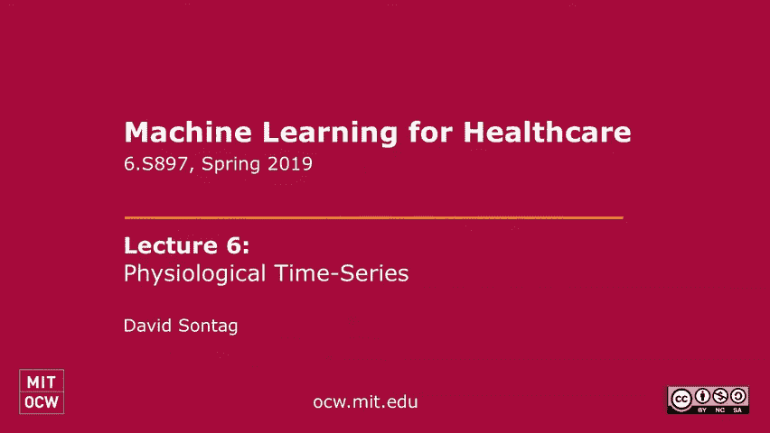

那么我将开始今天的讲座，通过简要回顾风险分层，星期四我们还没谈完生存模特的事，所以我会再深入一点，我将回答我们在讨论中和在广场上提出的一些问题，然后今天讲座的绝大多数内容，我们将讨论一个新的话题。

特别是生理时间序列建模，我将给出两个生理时间序列建模的例子，第一个来自监测重症监护室的病人，第二个问了一个非常不同类型的问题，的，今天我们将更深入地研究这些论文，我会在他们周围提供更多的颜色。

所以只是简单地提醒你我们周四在哪里，我们讨论了如何将风险分层形式化，而不是作为一个分类问题会发生什么，让我们说，在某个预定义的时间段内，而不是把风险分层看作一个回归问题或回归任务。

考虑到你对零点病人的了解，预测事件发生时间，所以说，比如说，在这里，事件可能是死亡，离婚，大学，毕业，和病人一，那个事件发生在第九步的时候，二号病人，那件事及时发生了第十二步，对于四号病人。

我们不知道那个事件是什么时候发生的，因为它被特别审查了，时间之后第七步，我们再也看不到病人的任何数据了，所以我们不知道那个红点什么时候会在未来的某个时候，或者永远不会，所以这就是我们所说的权利。

删失数据，这正是生存建模旨在解决的问题，首先有关于这个设置的问题吗，是啊，是啊，我意识到我在今天的演示文稿中把X和O翻了，但那不相关，所以T的f是死亡或事件发生在时间步T的概率，虽然在这张幻灯片中。

我把它作为一个无条件的模型来展示，一般来说，你应该把它看作是一个条件密度，所以你可能会受到一些协变量或特征的影响，那个，对于生存建模非常重要，接下来我要告诉你的是生存函数，将其注明为T的大写S。

这只是1减去累积密度函数，所以它是事件发生的概率，也就是时间，它在这里表示为大写T，大于某个小T，所以这个函数是由积分简单地给你的，从密度的零到无穷大，所以在图片中，这是x轴上的密度是时间。

y轴是密度函数，这条黑色曲线就是我所表示的f of t，这个白色区域是C的大写S，生存函数的生存概率，我只想说清楚，所以如果你把整个曲线积分，你知道无限，你会像我在这里向你描述的那样，是呀。

因为我们说的是活动的时间，但通常情况下，我们可能会在事件可能永远不会发生的情况下，所以你可以用几种不同的方式来形式化它，你可以把它放在无穷大s处的点质量，或者你可以简单地说，从零到无穷大的积分是一个量。

小于1，在我引用的阅读中，在那些幻灯片的最底部，它向您展示了如何轻松地修改所有框架，我在这里告诉你是为了处理这种情况，在这种情况下，事件可能永远不会发生，但为了我的陈述。

您可以假设事件总是在某个时候发生，这是一个非常，这是一个，这是一个非常小的修改，在那里你本质上把密度除以一个常数，这解释了它不会集成到一个，否则，现在，必须解决的关键问题。

当试图使用参数化方法进行幸存者建模时，那个F应该是什么样子，密度函数应该是什么样子，我在这里给你们看的是一些非常常用的密度函数的表格，您将显示您在这两列中看到的内容，右边的列是密度函数，T本身的f。

lambda表示模型的某些参数，现在是时候了，在中间的第二列上是生存函数，因此，对于这些特定的参数形式，这是通过解析解得到的，本质上，解那个从t到无穷大的积分，这是那个的解析解，所以这些都被称为指数。

韦伯，log，正常等等，而且批判性地，所有这些都只支持正实数，因为事件可能会在负时间发生，现在我们生活在一个时代，我们不再需要对密度做出标准的参数假设，我们可以，比如说。

试图将密度形式化为某种深度神经网络的输出，如果我们不使用参数化方法，所以有两种方法可以做到这一点，这样做的一个方法是说我们要为帖子建模，T的分布f作为其中一个，其中lambda或任何分布的参数是由。

让我们说，关于协变量的深度神经网络，所以这将是一种方法，一个非常不同的方法是非参数分布，你说，好的，我将非常灵活地定义t的f，不是作为这些形式之一，一个人遇到了一个稍微不同的挑战，因为。

我会给你看下一张幻灯片，做最大可能性，从删失数据估计这些分布，一个人需要得到，一个人需要利用T的生存函数，所以如果你的f是复的，对于t的s，你没有一个很好的解析解，那你就得。

在极限过程中以某种方式使用T的s的数值近似，所以绝对有可能，但这将需要更多的努力，所以现在，这就是我要讨论最大可能性的地方，这些分布的估计，并为您定义似然函数，我要把它分成两种不同的设置。

第一个设置是未经审查的观察，这意味着我们确实观察到死亡事件，比如说，发生，在这种情况下，事件的概率很简单，这只是事件发生在首都的概率，在大写t，随机变量t等于小t，只是T的f，然而，如果对于这个数据点。

你没有观察到事件发生的时间，因为审查得很好，当然，你可以扔掉那个数据点，不要在你的估计中使用它，但这正是我们提到的，在上周讲座的一开始，我们的目标是生存建模，不要那样做。

因为我们这样做是为了在我们的估计过程中引入偏见，所以我们希望能够利用这个数据点被审查的观察，但我们能从观察中得到的唯一信息是大写T，事件发生的时间一定比观察到的时间大一段时间，这里有点T的审查时间。

好的，所以我们不知道大写T的确切时间，但我们知道它比观察到的审查时间大一点，这正是生存功能所捕捉的，所以对于一个经过审查的观察，我们将在可能的范围内使用T的大写，所以现在我们可以把这两者结合起来。

以获得删失和未删失的数据，我们得到的是以下可能性目标，这是我在这里给你看的，上周的对数似然客观回忆，i中的小b只是表示这个观察是否被审查，所以如果我是一个就是一个，这意味着给你的时间是审查事件的时间。

如果i为零，意思是给你的时间就是事件发生的时间，所以这里，我们要做什么，现在是数据集中所有数据点的总和，从小i等于1到b的小n，删失模型下概率的i乘以对数，正一减i乘以未删失模型下的概率对数。

所以这个BI会打开，对于给定的数据点，你将使用这两个中的哪一个，所以这里最大似然估计的学习目标，与您在学习分布时所习惯的非常相似，对于删失数据有很大的区别，我们将用生存函数来估计它。

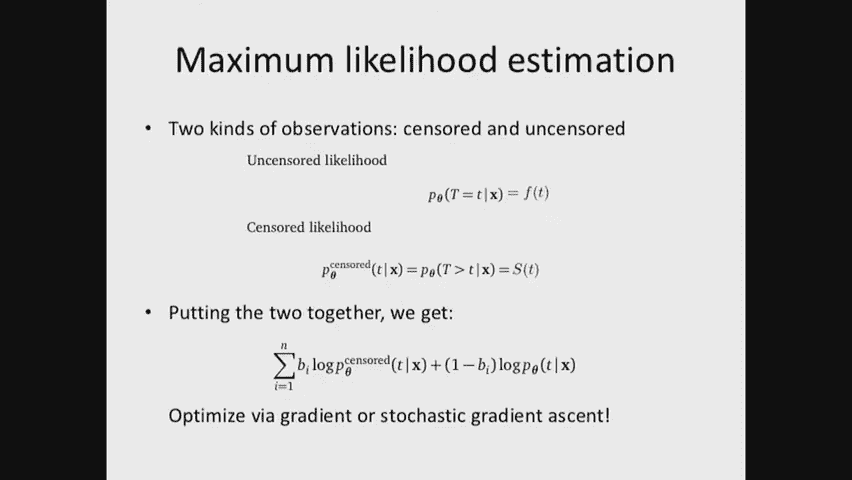

它的概率，有什么问题吗？还有这个，当然啦，然后可以通过您最喜欢的算法进行优化，不管是随机梯度，下降法或二阶法，等等，是的，关于这种东西的问题，你说过我们可以用网络，是呀，与公制相结合，是呀。

我们仍然有一个参数假设，我们把输入映射到参数，准确地说，完全正确，所以考虑下面的图片，嗯，在这里是时间，T，这是T的F，你可以想象任何一个病人，你可能有一个不同的功能，你可能。

但它们可能都是相同的参数形式，所以他们可能是那样的，也可能他们移动了一点，对呀，所以你想想这三件事中的每一件事，来自相同的分布参数族，但手段不同，在这种情况下，然后平均值作为深度神经网络的输出给你。

所以这将是使用的方式，然后一个可以以通常的方式返回繁殖来进行学习，会很抱歉，b子i只是一个指标。

第1个数据点被审查或未被审查，是呀，所以对于答案，或者喜欢，因为它更像是一个合适的，密度函数，但对于累积密度函数，是啊，是啊，但对于中心来说，像一个小社区，现在来看看答案，它的概率密度函数，是呀。

所以请原谅，把这两种类型结合起来会有什么问题吗，这是个很好的问题，所以观察到这里有两种不同类型的概率，在这种情况下，我们使用的是累积密度，而这里我们用的是概率密度函数，问题是这两个在不同的尺度上。

是它是它，你知道的，以这种线性方式将它们组合在一起是没有意义的，相同权重的，我认为这是有道理的，所以说，你想一个环境，你有一个非常，非常小的时间范围，对呀，你不确定这个事件是什么时候发生的。

是在这个时间范围内的东西，在传感器数据的设置中，时间范围可能非常大，你的对数概率不知何故会更平坦，因为你覆盖了更多的概率质量，所以观察，我凭直觉认为，可能对整个学习算法有一点较小的影响，或者这些。

你知道的，这些观察，你很清楚他们在哪里，所以当你偏离这一点时。

你有，a，你知道的，您招致相应的日志，但我确实认为把它们放在同样的规模是有意义的，如果有人，在座的每个人都做过模特并且都有不同的答案，我很想听，今天不行，但也许将来会有人以不同的方式回答这个问题。

我现在要继续前进了，所以我今天想说的剩下的问题，是如何评估生存模型的，所以说，我们谈了很多二进制分类，在一开始的风险分层背景下，我们讨论了ROC曲线下的面积是如何衡量分类性能的，但在这里我们做得更多。

更类似于回归的东西，不分类，用来衡量业绩的标准尺度，被称为C统计或一致性指数，它们是一样的，它的定义如下，它有一个非常直观的定义，它对可以相互比较的数据点进行求和，上面写着，好的，什么是。

事件发生的可能性有多大，对于事件之前发生的事件，另一个事件，你想要的是通风口的可能性，平均来说，本质上应该发生在以后，应该比应该更早发生的事件大，我将首先用这张图片来说明它，然后我再算算，这是照片。

然后我们谈谈数学，所以我在这里给你看的是，你的数据集中的每一个观察，它们按审查时间或事件时间排序，所以我用Black来说明未经审查的数据点，红色表示经过审查的数据点，所以在这里我们看到这个数据点。

事件发生在此数据点的审查事件之前，因为这个数据点被审查了，这意味着这是真正的事件时间，你可以在遥远的未来考虑它，所以我们想要的是模型给出，这个事件发生的概率，大于此时此事件发生的概率。

因为这实际上是先发生的，这两个放在一起是可以比较的，另一方面，把你们两个和你们四个比较是没有意义的，因为这两个都是经过审查的数据点，我们不知道它们发生的确切时间，所以说，比如说，很可能这件事也发生了。

所以我在这里给你看的是，与这些线中的每一条线进行的成对比较实际上是可能的，可以进行成对比较，当然，在实际发生的任何一对事件之间，你可以在审查事件和之前发生的事件之间进行成对比较，现在。

如果你现在看这个公式，这个指标中的这个公式是在看一个生存函数的指标，在数据点对之间，哪对数据点正是这些对数据点，我展示了，这里有这些蓝线，所以我们要对i求和，使b等于零，记住。

这意味着它是一个未经审查的数据点，然后我们看，我们把易和其他Y J相比，这很好，它的价值大于现在的审查和未经审查，如果您的数据中没有传感器数据点，然后你可以验证这实际上是对应的，哦，所以还有一个假设。

假设你的结果是二进制的，所以如果你想知道你是如何从这个中得到二元结果的。

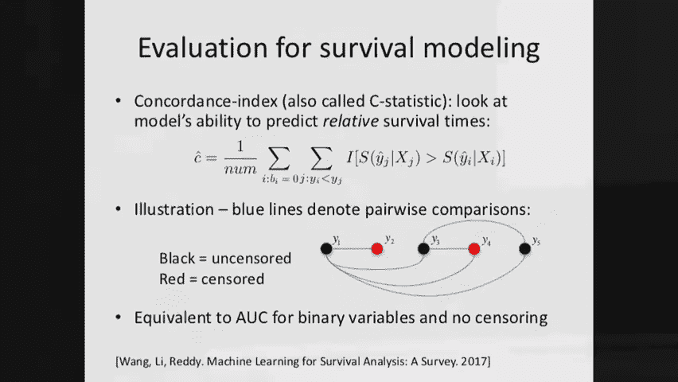

想象一下你的密度函数看起来有点像这样，它可能发生在，你知道吗，一次或两次，对呀，所以像这样的事情，对所以如果这个，如果事件只能发生两次，不是整个时间范围，那么这将是一个类似于二元结果的结果。

所以如果你有这样的二元结果，没有审查，那么事实上，C统计量正好等于ROC曲线下的面积，所以这和我们习惯的事情有一点联系，只是为了确保，其中一个会是，我们观察一个事件，它会是什么。

我们知道在那件事之前没有任何事件，每个点对应一个事件，审查或不审查，它们在这个图中排序，它们按审查或事件发生的时间排序，当我谈到C统计量的时候，这是衡量生存建模性能的一种方法。

但你可能还记得当我们谈到二进制分类时，我们说ROC曲线下的面积本身是非常有限的，因此，我们应该考虑其他相关的性能指标，所以这里有一些你可以做的其他事情，你可以做的一件事是你可以使用均方误差，所以再一次。

把这个看作是一个回归问题，但当然，这只对未经审查的数据点有意义，所以只关注未经审查的数据点，看看我们在预测事件发生的时间方面做得有多好，人们可以做的第二件事，因为你有能力定义观察的可能性，审查或不审查。

人们可以保存数据，查看保存的可能性或日志，数据的可能性，你可以做的第三件事是你可以，在学习使用这个生存建模框架后，然后，人们可以通过以下方法将其转化为二进制分类问题，比如说。

人为地选择超过三个月的时间范围是一个，不到三个月是零，这将是一个船员定义，然后一旦你做了一个二进制分类问题的约简，您可以使用所有现有的性能指标来考虑二进制分类，去评估那里的表现，像正预测值这样的东西。

比如说，当然，你可以选择不同的缩减，得到不同的性能统计数据，所以这只是试图评估，幸存者建模，但它是一部非常非常丰富的文学作品，在这些幻灯片的底部，我给了你几个参考资料，你可以去了解更多。

我想做的最后评论，我在今天的课上只告诉过你们一个估计量，这就是所谓的基于似然的估计器，但是生存建模有一个完全不同的估计方法，这是非常重要的了解，它们被称为偏似然估计，对于那些听说过考克斯的人来说。

比例危险，模型，我知道他们在星期五的朗诵中讨论过，这是一类模型的一个例子，这是在偏似然估计中常用的，现在，在一个非常直观的层面上，这个偏似然估计器在做什么，它是用类似C统计量的东西工作的吗。

所以请注意C统计量是如何只查看事件的相对顺序的，他们的事件发生，它并不关心事件发生的确切时间，在某种意义上，有一个，有一个，有一个常数，在这个生存功能中，可以从这个不平等的两边分开，这不会影响统计数据。

所以人们可以思考学习这些模型的其他方法，我们想学习一个生存函数，使数据点之间的顺序正确，现在，这样的生存功能不会起到很好的作用，那是不行的，没有理由，这将有助于获得肯特事件发生的准确时间。

但如果你的目标是弄清楚，按风险对患者进行排序的顺序是什么，所以你要对十个最危险的人进行干预，那么得到不正确的订单就足够了，这正是这些部分可能性背后使用的直觉，估计数，他们专注于比最初目标少一点的事情。

但这样做，他们可以有更好的统计复杂性，这意味着他们需要大量的数据来适应这个模型，一次又一次，这是一个非常丰富的话题，我想做的是给你一个指针，这样你就可以去阅读更多关于它的信息，如果你对此感兴趣，好的。

所以现在进入回顾，我们上周讨论的最重要的一点是关于非平稳性，有一个问题贴在广场上，这真的很有趣，这就是你实际上如何处理非平稳性，我说了很多关于它存在的事情，我谈到了如何测试它。

但我没说如果你有它该怎么办，所以说，所以我觉得这是一个很有趣的问题，我也会在课堂上讲一点，所以简短的答案是，如果您必须有一个明天部署的解决方案，那么这里有一个有时有效的黑客，你拿你最近的数据。

比如过去三个月的数据，你希望在过去的三个月里没有太多的非静止的，你扔掉所有的历史数据，你只需要使用最新的数据来训练，所以有点不满足，因为您现在可以学习的数据可能非常少，但你知道如果你有足够的音量。

它可能已经足够好了，但从研究的角度来看，真正有趣的问题是，如何最佳地使用历史数据，所以这里有三种不同的方法，所以一种方法与归责有关，想象一下，你的数据是非平稳的，因为有，假设某些功能不可用的时候。

我上周给你们举了一个实验室测试结果的例子，我向你展示了有时会有很大的时间块，没有实验室任务可用的地方，或者很少可用，嗯，幸运的是，我们生活在一个高维数据的世界，这意味着数据中通常有很多冗余。

所以你能想象的是，把你观察到的缺失的特征，使得缺少此属性，事实上，在归责后随时间变化不大，如果作为预处理步骤这样做，它可能允许您利用更多的历史数据，一种与，这与转换数据有关，而不是把它归咎于。

把它完全转换成另一种表示，使表示在时间上不变，这里我给你一个Ganneal的这篇论文的参考，来自机器学习研究杂志，讲述了如何进行神经网络的域学习和变体学习，这是这样做的一种方法，我认为这两者非常相似。

归算与变换，第二种方法是对数据重新加权，使其看起来像当前数据，所以想象一下你回到过去，你说你知道吗，我有十个代码，因为一些非常奇怪的原因，顺便说一句，这不是真的。

ICD代码在这个不真实的世界里的十个代码，碰巧在2003年3月至4月间使用，然后直到2015年才再次使用，所有的权利，所以与其扔掉以前的所有数据，我们将认识到十年前间隔三个月的那些。

实际上是从一个非常相似的分布中提取的，我们今天要测试的是，所以我们要把这些数据点加权，并对不太像今天的数据点进行加权，这就是这些加权方法背后的直觉，我们将更多地讨论这一点，在因果推断的背景下。

不是因为这两个要做对方，但他们有，他们最终使用了一种非常相似的技术来处理，数据集移位或协变量移位，我将提到的最后一种技术是基于在线学习算法，所以那里的想法是，可能会有切点，跨时间改变点。

所以也许数据看起来是向上的，直到这个变化点，然后突然间数据看起来真的不同，直到这个变化点，然后突然间，数据在未来看起来非常不同，就在这里，我向你展示，有两个数据集移位发生的变化点。

这些在线学习算法是做什么的，他们说，好的，假设我们被迫在这段时间内做出预测，只使用历史数据在每个时间点做出预测，我们可以以某种方式认识到可能会有这些转变，我们可以设计对这些变化鲁棒的算法。

然后人们可以试着用数学分析，根据他们必须后悔的程度来分析这些算法，比如说，一个确切知道这些变化是什么时候的算法，当然，我们不知道这些变化是什么时候发生的，所以有一个完整的算法领域试图做到这一点，在这里。

我只是给你一个最近的作品的引文，从而得出风险分层的结论，这是这里的最后一张幻灯片，我可能会问你的问题，下课后，我们已经讨论了将风险分层正式化的两种方法，首先作为二进制分类，第二次作为回归，在回归框架中。

一个人必须考虑审查，这就是为什么我们称之为生存建模，在我们的例子中排名第二，在下周的家庭作业中排名第二，我们会看到变量通常，最具预测性的特征很有意义，就在糖尿病病例中。

我们说我们看到了糖尿病合并症患者是如何，比如高血压或肥胖的病人很可能会得糖尿病，所以你可能会问自己，有什么因果关系吗，有一些特征是非常有预测性的，事实上，导致病人患上二型糖尿病的原因，比如说。

肥胖引起糖尿病，这是我想警告你的地方，你不应该用因果的方式来解释这些非常具有预测性的特征，尤其是当一个人开始处理高维数据时，就像我们在本课程中所做的那样，原因很微妙，我们会在因果推理课上讨论这个问题。

但我只是想给你一个指针，既然你不应该那样想，几周后你就会明白为什么，最后我们讨论了处理丢失数据的方法，我给了你一个糖尿病病例的特征代表，它是为了处理丢失的数据而设计的，上面说有什么诊断代码吗。

二百五十点零，一个月和最近三个月，如果有，你有一个，如果你不在零，所以它的设计是为了识别你没有信息，也许在那个窗口的很长一段时间里，丢失数据也可能是危险的，如果这种缺失本身导致了你的非平稳性。

这将导致您的测试分布看起来与您的列车分布不同，这就是基于估算的方法实际上非常有价值的地方，不是因为当一切顺利时，它们提高了你的预测准确性，而是因为当事情出错时，它们可能会提高你的预测准确性，所以。

在哪里，他们使用高斯过程模型，在病人的连续生命体征中估算出许多缺失的数据，然后他们使用递归神经网络来预测，根据估算数据，所以在这种情况下，真的有两件事在发生，首先是这种对数据集移位的鲁棒性。

但还有第二件事也在发生，这与您拥有的数据量和，通过估算预测问题的复杂性，有时你会让你的问题看起来更简单，更简单的算法可能会成功，否则他们会因为没有足够的数据而失败，这就是你在上周的阅读中看到的。

我已经完成了风险分层，我要为房间里的每个人休息一分钟，然后我们从这节课的主题开始，也就是生理时间序列建模，所以这里有一个婴儿做得不太好，这个婴儿在重症监护室，可能是个早产儿，也许是一个婴儿有一些。

慢性疾病，和，家长当然很担心，这个宝宝得到了非常密切的监控，它连接到许多不同的探针，这里有一个，它说明了一个三探针，三铅，ecg，那个，我们将讨论，更多，它在测量它的心脏，宝宝的心脏怎么样了，嗯。

在这里，在这里，这个数字三，我是附着在婴儿脚上的东西，它正在测量，它是，这是脉搏检测仪，它正在测量婴儿的氧饱和度，血液中的氧气量，第四个是一个探头，它正在测量婴儿的温度等等，所以你知道。

我们真的对这个婴儿进行了非常近距离的测量，因为我们想知道这个婴儿怎么样了，我们认识到婴儿的健康状况可能会突然发生变化，我们希望能够尽早认识到，在这个婴儿旁边的幕后，你当然会有大量的监视器。

每个监视器都显示这些不同信号的读数，这种类型的数据在重症监护室非常普遍，但你们也会在今天的课上看到，这些数据的某些方面现在也开始进入家庭，例如，ekgs现在可以在苹果和三星手表上使用，以帮助理解。

帮助诊断心律失常，即使是在家的人，因此从这种类型的数据，有许多非常重要的用例需要考虑，第一个是认识到我们经常得到非常嘈杂的数据，我们想试着推断出真正的信号，所以想象一下，比如说，像。

婴儿的真实体温可能是98。5，但无论出于什么原因，我们今天将在这里看到几个原因，嗯，也许你得到了93的观察，你不知道的是，实际上婴儿的真实温度，在这种情况下，我们会有很大的麻烦，或者这是一个异常的读数。

所以我们喜欢区分这两件事，我们感兴趣的，不一定完全理解婴儿在每一个轴上发生了什么，但我们只是想把这些数据用于预测目的，风险分层，比如说，所以，我们在这里要采用的机器学习方法的类型，将取决于以下三个因素。

首先，我们是否有标记数据可用，比如说，我们知道婴儿真实体温的真实情况吗？至少对训练中的一些婴儿来说，第二次，我们有一个好的，这些数据如何随时间演变的机制或统计模型，我们对心脏很了解，比如说。

心脏病学是医学中研究得很好的领域之一，有很好的心脏模拟器，以及它们如何穿越时间，以及这是如何影响全身的电刺激的，如果我们有这些好的机械或统计模型，没有太多的标记数据或只是没有太多的数据周期。

真的是这三点，我想在今天的讲座中说明两个极端，当你没有太多数据的时候你会做什么，你所做的，当你有大量的数据时，你能做什么，我想这对我们来说会很有帮助，当我们走向世界，我们必须解决这两个设置中的每一个。

所以这里有一个例子，两个不同的婴儿有着非常不同的轨迹，x轴上的一个是以秒为单位的时间，这里的y轴，我想秒，也许几分钟，这里的y轴是婴儿心率的每分钟跳动，你看，在某些情况下，它确实上下波动很大。

在某些情况下，它在一个方向上是类似的，在所有情况下，短期观测与长期轨迹有很大不同，所以我想让我们思考的第一个问题是试图理解，我们如何在第一个发生的事情的真相之间转移，比如说，病人的血压或氧气。

与发生在他们身上的干预措施，在底部，我展示了干预的例子，在这个氧气摄取中，我们注意到大约1000到2000秒，突然没有任何信号，这就是所谓的辍学的一个例子，在这里，我们看到了不同干预的不同类型的效果。

这是由于探针重新校准，那时有一个辍学，随之而来的是价值观的突然变化，这真的发生在重新校准的步骤上，这两起案件，随着时间的推移，个体所发生的事情可能是相对不变的，但是所观察到的东西受到这些干预的显著影响。

所以我们想问一个问题，我们能识别出这些人为过程吗，我们能确定这些干预发生在那些时间点吗，然后如果我们能识别他们，那么我们就有可能减去它们的影响，这样我们就可以，我们可以估算我们现在知道丢失的数据。

然后把这个更高质量的信号用于下游的预测目的，比如说，现在，这可能非常重要的第二个原因是解决这个问题，称为报警疲劳，警报疲劳是当今医学面临的最重要的挑战之一，随着我们在风险分层方面做得越来越好。

当我们想出越来越多，这意味着这些危险信号越来越频繁地被升起，每一个都有一些相关的假阳性率，所以你做的测试越多，假设假阳性率保持不变，你的测试越多，所有这些的结合就越有可能是一些，一些错误。

所以当你在重症监护室的时候，警报一直在响，发生的事情是护士们最终开始忽视这些警报，因为这些警报往往是假阳性，或由于，比如说，就像我在这里给你看的一样，所以如果我们有技术，比如我们现在要讨论的技术。

它可以识别什么时候，比如说，病人心率的突然下降是由于一种人工制品造成的，而不是因为病人的真实心率下降，如果我们有足够的信心区分这两件事，那么我们可能不会决定升起红旗，这可能会减少假警报的数量。

这可能会减少报警疲劳，这可能会对医疗保健产生非常大的影响，所以这个技术，我们今天要讨论的是切换线性动力系统，这里的人以前在底部的这张照片上见过这样的照片，大约一半的房间，所以对于房间的另一半。

我要给一点，概率模型的一点回顾，你们现在都熟悉了一般概率，所以你习惯了思考。

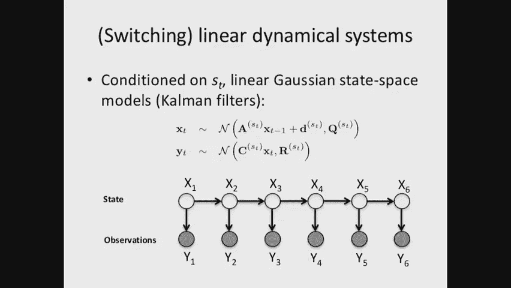

比如说，um单变量高斯分布，我们讨论了如何模拟生存，这是这种分配的一个例子，但是今天的讲座，我们现在要考虑的是多元概率分布，特别是，我们将考虑病人的状态，假设他们的真实血压随时间变化。

所以现在我们感兴趣的不仅仅是某个时间点的随机变量，但同样的随机变量在第二个时间点，第三个时间点，第四个时间点，第五个时间点以此类推，所以我在这里向你们展示的是一个图形模型，也称为贝叶斯网络。

这是说明多元概率分布的一种方法，具有特殊条件独立性的，属性，一个节点对应一个随机变量，所以这描述了x 1到x上的联合分布，所以这是十二个随机变量的多元分布，事实上，这是用阴影表示的，只是表示在测试时。

当我们使用这些模型时，通常这些y变量被观察到，而我们的目标通常是推断x变量，那些通常是不被观察到的，这意味着我们的典型任务是做后验推理，推断x是给y的，现在与这个图相关联。

我已经告诉过你节点对应于随机变量，这个图告诉我们这个联合分布是如何分解的，它将按以下方式分解，作为i随机变量概率在随机变量上的乘积，我要用z来知道一个随机变量，所以把z看作x和y的并集。

我把Z父母的价值观强加给父母，i，所以我假设这个因式分解，特别是对于这个图形模型，它被称为马尔可夫模型，它有一个非常具体的因式分解，我们将从这个定义中读出它，所以我们先按顺序来，x一，然后你一个。

然后x2，然后你们两个，以此类推，它是基于一个，到此图的子遍历的路由，所以第一个随机变量是x 1，第二个变量是y 2，Y的父母是什么，对不起，你的父母是谁？每个人都可以大声说x 1，好的。

所以在这个因式分解中，y 1只依赖于x 1，下一个，我们有x2，x 2的父母是什么，大家大声说x 1，好的，那我们就有你们两个了，你们两个的父母是谁？每个人都大声说x 2等等，好的。

所以这个联合分布将有一个特别简单的形式，这是通过这里所示的因式分解给你的，这个因式分解与特定的图一一对应，就像我刚才告诉你的那样。

就这样，我们可以定义一个非常复杂的概率分布，由许多简单得多的条件概率分布，比如说，如果每个随机变量都是二进制的，然后描述给定x 1的y 1的概率，x 1的每个值只需要两个数字，要么是零，要么是一。

我们给出y=1的概率，然后当然，等于零的概率是1减去那个右，所以我们可以用许多小得多的分布来描述非常复杂的联合分布，现在，我之所以这样画。

就是，因为我们对这个问题的时间动力学做了一些非常有力的假设，特别是，事实上，3只有一个来自x2的箭头，而不是来自x1的箭头，三条件独立于x一，如果你知道x2是值，在某种意义上，把这看作是向右切割。

如果你要从模型中取出x 2，并去除所有入射在其上的边缘，那么x1和x3现在彼此分离，现在独立的，对于那些了解图形模型的人来说，你会认识到我所做的那种独立的声明是唯一正确的，对于马尔可夫模型。

贝叶斯网络的语义有点不同，但实际上对于这个模型来说，他们是一体的，所以我们要对条件分布做以下假设，先在这里展示一下，我们将假设XT是给你的，高斯分布，记住X T，比如说，t表示时间步长。

假设在这张照片中只有三个取决于，条件分布仅依赖于前面的时间步长，值x 2或x t减一，所以你会注意到我在这里是怎么说的，xt将被分发为，但这里唯一的随机变量可以是xt-1，根据这个假设，特别是这些假设。

我们假设它是某种高斯分布，其平均值是x t减去1的某种线性变换，并且具有固定的协方差矩阵q，所以在这个过程的每一步，下一个随机变量是前一个随机变量的随机游动，你根据高斯分布移动的地方，以非常相似的方式。

我们假设y t也是高斯分布，但现在取决于，所以我想让你们把XT看作是病人的真实状态，一个汇总他们血压的矢量，他们的氧饱和度，一大堆其他参数，或者甚至只是其中之一，其中一个是你观察到的。

假设x 1是病人的真实血压，Y一是观察到的血压，你的显示器发出什么，所以一个合理的假设是，如果我们都是平等的对吧，如果这是一个真实的观察，那么y应该非常接近x，就像，所以说。

你可以假设这个协方差矩阵是协方差是，方差非常非常小，为什么一个要非常接近x一个，如果这是一个很好的观察，当然啦，如果这是一个嘈杂的观察，例如，如果探头与婴儿断开，那么Y一个应该和X一个没有关系。

对世界实际状况的依赖，我在这里用这些上标表示，T的S，我现在忽略了这一点，我会在下一张幻灯片中把它带进来，同样地，x 2和x 1之间的关系应该是1，它捕捉到了我在前面的幻灯片中展示的一些动态。

就在我展示的地方，现在这是病人跨越时间的真实心率，让我们说正确的注意如何，如果你看得很局部，看起来有一些非常，非常大的局部动力学，然而，如果你再看得更全球化，有一些平滑，但又有一些。

它看起来像是一些随时间的随机变化，所以，那些漂移必须以某种方式总结在这个模型中，随机变量，我一会儿就会更详细地讨论这一点，我刚才给你们展示的是一个线性动力系统的例子，但它假设这些事件都没有发生。

这些艺术品都没有发生，我们想要使用的实际模型，还将结合这样一个事实，即可能会有工件和建模，我们需要引入额外的随机变量来对应这些工件是否发生，这就是现在的模型，所以我要让这些，S的，这些是其他随机变量。

它们表示人为事件，它们也在随着时间的推移而进化，例如，如果在三秒钟处有一个人为事件，也许在四秒处也有一个人为事件，我们喜欢模拟这些之间的关系，这就是为什么你有这些箭。

然后我们解释我们得到的观察结果的方式取决于，病人的真正价值，以及是否有人为事件，你会注意到还有一个边缘，从人为事件到真正的价值，注意到这些干预实际上可能会影响病人，比如说。

如果你给他们一种药物来改变他们的血压，然后呢，那个程序会影响下一次，病人血压的阶跃值。

所以当一个人想学习这个模型的时候，你必须问自己你有什么类型的数据可用，很难在地面上获得数据，真理，病人怎么了？以及这些文物是否真的发生过，相反，我们实际上得到的只是这些观察结果，就像我们得到的。

我们得到这些非常嘈杂的血压随时间变化。

所以本文所做的是使用最大似然估计方法，它认识到我们将从丢失的数据中学习，我们将明确地考虑这些X和S，作为潜在变量，我们将最大限度地提高整个模型的可能性，在X和S上边缘化，所以只要最大化Y上的边际可能性。

现在对于那些以前研究过无监督学习的人来说，你可能会认识到这是一个非常困难的学习问题，事实上，可能性是非凸的，人们可以想象各种各样的学习启发式，比如渐变，血统，或者正如本文所使用的期望最大化。

因为这种不凸性，这些算法中的每一个通常只会达到可能性的局部极大值，所以这张纸用的是EM，它直观地在推断那些缺失的变量之间迭代，所以在给定当前模型的情况下，估算x和s，做后验推断来推断缺失的变量。

给定使用当前模型的观察变量，然后一旦你输入了这些变量，试图修改模型，这就是最大化的m步，它更新模型，只是在这两件事之间迭代，那是一种学习算法，也就是，保证达到局部极大值的可能性，在某些规律性假设下。

所以本文使用了这个算法，但你需要问问自己，你是否只保留了Y，这个算法能恢复任何接近真实模型的东西吗，比如说，这里可能有大量的不可识别性，你可以交换S的意思，你在Y上也会得到类似的可能性。

这就是引入领域知识变得至关重要的地方，所以这将是一个我们没有标签数据的例子，或者很少的标记数据，我们将对这个模型进行无监督学习，但我们将使用大量的领域知识，为了尽可能地约束模型。

那么这个领域的知识是什么呢？我们要利用我们知道的事实，真实的心率以一种非常好的方式进化，用自动回归过程建模，所以本文所用的自回归过程，用于模拟正常心率动力学，一会儿。

我会告诉你如何建立异常心率观察的模型，直觉上，3。我先把我的直觉告诉你，然后再给你算一算，直觉上，它所做的是，它认识到这个复杂的信号可以分解成两部分，这里显示的第一个部分称为基线信号，如果你眯着眼睛。

你忽略了非常局部的波动，这就是你得到的，然后你可以看看减去这个信号的残差，从这个信号中减去这个基线，你得到的是这样的，在零均值附近，所以有一些随机波动的零均值信号，这里的波动以更快的速度发生。

然后和原始基线，所以BT和这个残差的和是一个非常，它看起来和真实的心率完全相等，这两件事中的每一个我们都可以很好地建模，我们可以通过随机游走来建模，它走得很慢，我们可以通过随机游走来建模，它走得很快。

这正是我现在要在这里展示的，在左手边，我们将把这个基线信号建模为高斯分布，它被参数化为不仅仅是BT减一的函数，但也有英国电信减二和英国电信减三，所以我们要取一个加权平均数，前面的几个时间步骤。

我们在那里平滑，本质上观察，前面的几个观察，如果你，如果你是一个敏锐的观察者，你会注意到这不再是马尔可夫模型，比如说，如果这个，如果这个p1和p2等于2，这对应于二阶马尔可夫模型。

因为每个随机变量取决于前两个时间步长，马尔可夫链的，嗯等，呃，之后，您将通过这个过程对BT进行建模，得到这个光滑的属性，然后你用这个自动攻击的过程来建模x t减去bt，你可能会在哪里，比如说。

看看前面的几个时间步骤，你认识到你只是在做更多的随机波动，这就是人们现在如何模拟正常心率动力学，再说一遍，这是一个统计模型的例子，这里没有心脏被使用的机械知识，但我们可以很好地拟合正常心脏的数据。

但是下一个问题，最有趣的是，人们现在如何建模人工制品事件，因此，这就是一些机械知识的来源，所以一个模型是探测器退出，从婴儿身上取出探针，那就不应该再有，或者至少如果你在一小段时间后。

不应该再依赖婴儿的真正价值，比如说，血压，一旦血压探头被移除，不再与宝宝的真实血压有关，但缺乏依赖可能会推迟一些时间，所以这将被编码在一些领域知识中，例如，从婴儿身上取下温度探头时的温度探头。

它又开始升温了，或者它开始冷却，所以假设环境温度比婴儿的温度低，你把它从婴儿身上拿下来，它开始冷却，它冷却的速度有多快，你可以假设它冷却下来，婴儿的体温呈指数级下降，这是非常合理的，你可以想象。

也许如果你只标记了几个婴儿的数据，你可以试着很快地拟合指数的参数，这样我们就参数化了温度探头的条件分布，给定状态以及工件是否发生，用这个非常简单的指数衰减，在这篇论文中，他们给出了一种非常相似的类型。

他们做出相似类型的相似类型的假设，对于所有其他探针，你应该考虑一下，作为约束这些条件分布，我给你看了这里，它们不再允许是任意分布，所以当一个人现在期望最大化，试图最大化数据的边际可能性。

你现在已经约束了它，在这里学习的一切都不同了，所以所以在这篇论文中，他们的评价，我为每个婴儿做了一点微调，特别是，他们假设接近开始的前30分钟是正常的动态，所以没有人工制品，这当然是一个很大的假设。

但他们用它来微调，动态模型，为每个婴儿和他们自己微调，然后他们研究了试图识别人为过程的能力，我想慢慢地通过这个情节，因为它很有趣，所以我给你看的是，这里是一个ROC曲线。

预测四种不同类型工件中每一种的能力，例如在任何一个时间点是否有血液样本被采集，或者在任何一个时间点都没有核心温度脱节，核心温度探头的，并对其进行评估，他们假设他们有一些标记数据用于评估目的，只是。

当然你想在最远处的左上角，我们展示的是什么，这里有三条不同的曲线，非常微弱的虚线，我要用光标追踪，是基线，把它看作是一个更糟糕的算法，好的，对不起，就是那条线，大家都看到了，这个方法是另外两条线，现在。

有什么区别，另外两条线对应于特定类型的近似推理算法，用来做后验推断的，根据你嘈杂的观察来推断x的真实值，这里给出的模型实际上是一个非常难的推理问题，从数学上来说，我认为可以证明这是一个NP难计算问题。

所以他们必须以某种方式近似它，他们在这里使用了两种不同的近似值，第一次近似是基于，他们所说的高斯和近似，这是一个确定性的近似，第二种近似是基于蒙特卡罗方法，你在这里看到的是，高斯和近似实际上要好得多。

对吧，例如，在这个血样中，ROC曲线是这样的，对于高斯和近似，而对于蒙特卡罗近似，它实际上要低得多，这只是为了指出，即使在这种情况下，我们的数据很少，我们使用了大量的领域知识。

一个人如何做数学的实际细节，特别是，近似的推断可以对系统的性能产生很大的影响，所以这也是一个人应该深入思考的事情，我要去滑梯，然后简短地提到这个，这是对事件的推断，在这里。

我向你们展示了三种不同的观察结果，在底部，我展示了人工制品何时的预测，两个不同的人为事件发生了，这些预测实际上是相当好的使用这个模型，所以我做完了第一个例子，然后嗯，只是为了回顾那个例子的要点。

我们几乎没有标记的数据，我们正在使用一个巧妙选择的统计模型来解决这个问题，内置一些领域知识，这可以走得很远，所以现在，我们将换位讨论另一种类型的问题，涉及生理数据。

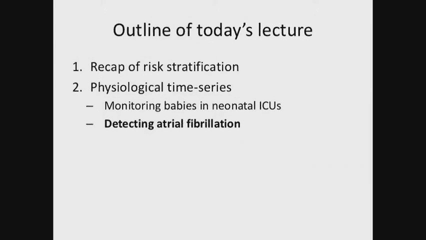

这是检测心房颤动，我给你看的是一个带电的核心设备，我有一个这样的，所以如果你想来我的二五五四五办公室，你可以，你可以随便玩，如果你把它贴在你的手机上，它就会，它会告诉你，它就会，它会告诉你，你的。

通过心脏的电导，通过你的两个手指触摸这个设备来测量，如图所示。

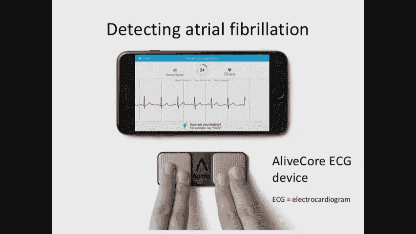

由此可以检测出病人是否患有心房颤动，那么什么是心房颤动，好问题萨纳鳄梨，这是美国心脏协会的，他们将心房颤动定义为颤抖或不规则的心跳，也称为心律失常，最大的挑战之一是它可能导致血凝块，中风，心力衰竭等。

下面是一个病人如何描述心房颤动，我的心怦怦直跳，它的节拍就像在敲打我的胸壁，尤其是当我提着东西上楼梯或弯腰的时候，让我们试着看看它的照片，好的，所以说，这是正常的心跳，和。

如果你看看正常心跳的心电图信号输出，它会是这样的，它大致对应于不同的，对应的信号，心跳的不同周期，现在对于一个患有房颤的病人来说，看起来更像这样，如此明显的不正常，至少在这个数字中。

如果你看汽车旋转的信号，看起来也很不一样，所以这只是给你一些直觉，我的意思是什么，因心房颤动，所以我们现在要做的是检测它，所以我们要把这样的数据，并试图将其分为许多不同的类别。

这是已经研究了几十年的东西，去年在二十七年，麻省理工学院的罗杰·马克教授举办了一场比赛，它试图看清楚，怎么可能，我们有多擅长找出哪些病人有不同类型的心律，基于如下所示的数据，所以这是一个正常的节律。

也叫窦性心律，这里是心房，这是一个例子，一名患有房颤的患者，这是另一种节律，不是心房颤动，但不正常，这是一个嘈杂的录音，比如说，如果一个病人，你知道，他们的两个手指不是很好，放在装置的两根引线上。

其中一个类别我们可以预测，你知道的，这些信号中的一个我们可以预测它来自哪一类，所以如果你看看这个，你可能会意识到，哦，它们看起来有点不一样，对呀，你们中的一些人能猜出什么可能是预测特征吗。

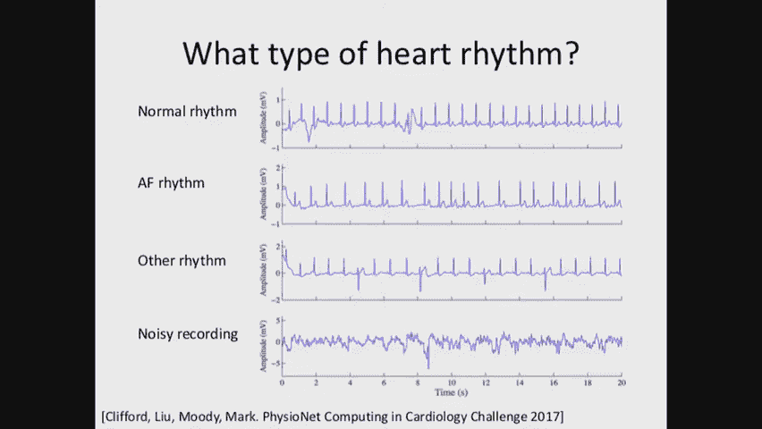

区分这些信号中的一个和后面的另一个。

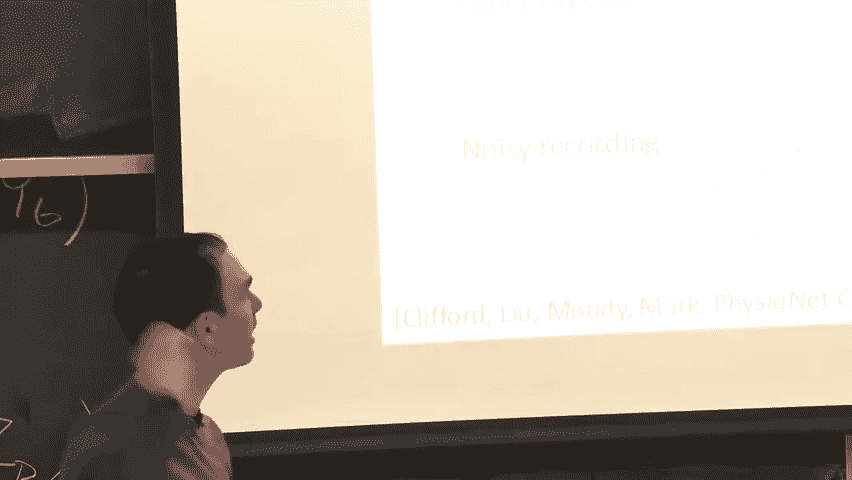

其中一个山峰的存在或不存在，QRS情结就像关键波，我想说英语，对于不知道这些术语是什么意思的人来说，有一大块，我们可能可以消耗一毫伏，还有一个高峰，这有点像他们在正常节律和良好节律之间有相反的极性。

好的，你是心脏病专家吗，不，好的，哈哈哈，所以呃，学生的建议是人们可以寻找这些倒置，试着用不同的方式来描述它，嗯，所以我在这里，你在暗示，这些倒置的缺乏预示着异常的节律，另一个可能是预测性的特征呢。

是的，山峰之间的间距更不规则，随着节拍之间的间距更加不规则，随着AF的节奏，所以你看着这个，你看这个间距和这个间距有很大的不同，而在正常的节奏中，间距看起来非常有规律，所有的权利，好，好的。

所以如果我给你们看40个这样的例子，然后让你把一个新的分类，我是说，如果你不能做得相当好，我会感到惊讶的，至少在正常节律和AF之间熄灭声，因为这里似乎有一些非常明确的信号，当然啦，当你进入替代方案时。

故事变得更加复杂，但让我更深入地挖掘一下我的意思，所以让我们定义其中的一些术语，嗯，心脏病专家对此研究了很长时间，他们有我给你看的东西，这是一个心脏周期，你可以给每一座山峰起名字。

你会在正常的心脏周期中看到，这样，例如，那个非常高的峰被称为R峰，你可以看看，比如说，间隔，所以这是这是一个节拍，你可以看看间隔，在一个拍的R峰和另一个峰的R峰之间，并将其定义为RR间隔，以类似的方式。

一个人可以拿，顺便说一句，人们可以找到信号的不同独特元素，每一次每一步都对应着心脏处于不同的位置，为了健康的心脏，这些都是相对确定性的，所以你可以观察其他距离，也可以从这些距离中获得特征。

就像我们在讨论一个节拍内和跨节拍。

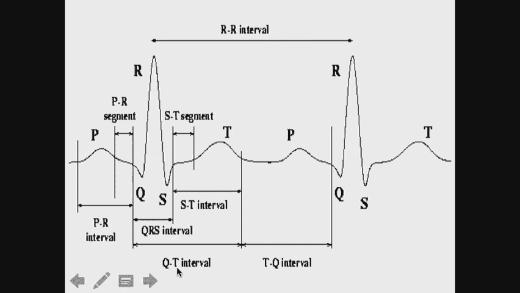

片段和，嗯，是啊，是啊，我不知道片段和间隔有什么区别，还有人知道吗，我是说，我想间隔可能是山峰的头部，而片段可能指区间内。

那是我的猜测，有没有人知道，更好，但为了今天上课的目的，这是足够好的理解，所有的权利，关键是这是很好理解的，对吧，我们可以从中得出一些特征，那么传统的方法，在这个问题上。

这是我从2002年的一篇论文中得出的数据，它能做的就是接收信号，它会对它进行一些过滤，然后它会运行一个峰值检测逻辑，会发现这些山峰，然后它将测量这些峰值之间的间隔以及在一个节拍内，它需要这些计算。

或者根据它做一些决定，所以这是一个传统的算法，它们工作得很合理，那么我所说的信号处理是什么意思，嗯，这就是一个例子，我鼓励你们中的任何一个人今天回家，尝试编码一个峰值查找算法，没那么难。

至少不是为了得到一个好的，你知道你可能会想象保持一个运行的标签，到目前为止你看到的最高信号是什么，然后你看看，什么是，第一次掉的时候，第二次，下一次它上升得比，假设上一个，你知道的。

假设你知道你想找的那个，当下降是最近到最大值的最大值除以2时，然后你说好，然后你重置，你可以想象用这种方式非常快速地编码一个寻峰算法，嗯，所以这只是再次给你一些背后的直觉，传统的方法是什么。

然后你可以很快看到，你知道一旦你开始观察高峰之间的一些间隔，仅这一点就足以预测，病人是否有房颤，这是2001年的一篇论文中的一个数字，我在显示一个病人的时间序列，所以x轴是针对单个病人的，他们的节拍。

心脏在时间中跳动，Y轴只是显示上一个节拍和当前节拍之间的RR间隔，在底部，病人是否被评估为必须在，有正常的节律或心房颤动，这里注意到的是这个较高的值，所以这些是AF节奏，这很正常，这又是AF。

你可以看到，RR间隔实际上让你走得很远，你注意到这里有多高吗，突然掉了下来，我们的间隔下降了一会儿，那是病人有房颤的时候，然后它又上升了，然后它又掉下来，以此类推，所以它不是确定性的，关系。

但肯定有很多信号，所以你可能会说好，嗯，下一步我们能做什么来清除信号，再多一点，所以说，向后闪，从2001年到1970年在麻省理工学院学习的，这不是麻省理工学院，这是另一个地方，对不起。

但仍然是1970年，他们使用了马尔可夫模型，与我们刚才讨论的马尔可夫模型非常相似，在上一个示例中，对正常RR间隔序列进行建模，与一系列异常的，比如说，或者我们的间隔看起来像，就这样，人们可以认识到。

对于任何一个RR间隔的观察本身可能不是，完全有预见性，但如果你看看它们的序列，对于一位房颤患者，它有一些共同的模式，你可以，人们可以通过观察该序列的可能性来检测它，在这两种不同的模型下，正常和不正常。

这做得很好，甚至比，比以前预测心房亲子关系的方法，好的，这是我想从麻省理工学院说的论文，现在是1991年，这也是罗杰·马克的小组，现在这是一种基于神经网络的方法，上面写着，好的，我们要拿一堆这些东西。

你知道我们将推导出一系列这些区间，然后我们要把它扔进一个黑匣子，有监督机器学习算法预测患者是否有房颤。

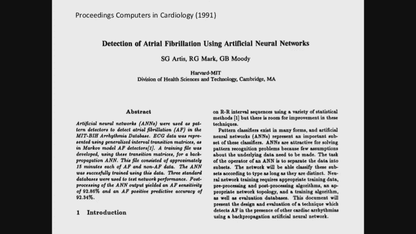

所以这些首先是，这里有一些简单的方法工作得相当好，在这个领域使用神经网络并不是什么新鲜事，但是我们作为一个领域在哪里，所以正如我提到的，去年有一场比赛，我在这里给你看的是，引文来自获奖方法之一。

这种获胜的方法真正将两种范式结合在一起，提取物，大量的专家派生特性，如图所示，这些正是你可能认为的类型，最大值是我们的不规则度量，你可以想象的一系列不同的事情，从数据手动派生。

你把所有这些特征都扔进机器学习算法，也许是一片随机的森林，也许神经网络无关紧要，你得到的是一个稍微好一点的算法，如果你自己想出了一个简单的规则，所有的权利，这就是获胜的算法，和在摘要文件中。

他们推测那口井，也许他们是一体的，他们期望卷积神经网络会赢，和，他们感到惊讶的是，没有一个获胜的解决方案涉及卷积神经网络，他们推测这可能是原因，为什么是，因为，也许有这八千个病人，他们有一个主意。

这不足以给更复杂的模型带来优势，所以现在翻转到今年，你在自然医学阅读中读到的文章，斯坦福大学小组现在展示了卷积神经网络方法，这在很多方面都是极其幼稚的，它所做的就是，它把序列数据。

没有试图理解潜在的生理学，从中预测可以做得非常非常好，所以我想强调几个不同之处，到之前的作品，首先，传感器不一样，而之前的工作使用了斯坦福大学的这篇论文中的活核心传感器。

他们使用了一种叫做ZIO贴片的不同传感器，它附着在人体上，可以想象噪音要小得多，对呀，所以这是一个很大的区别，第二个大区别是有更多的数据，而不是从现在开始训练8000个病人，他们有九万多张唱片。

从五万个不同的病人到训练第三个主要的区别是现在，而不仅仅是试图将其分为四类，正常，现在我们将试着把它们分为14个不同的类别，在哪里，本质上，分裂另一个阶级，不同类型异常节律的更精细的颗粒细节。

这里有一些其他的异常节奏，像完全的心脏传导阻滞，嗯，还有一堆我不会念的名字，他们从每一个中收集了大量的数据，然后我真的这么做了，报纸上没有描述，但我和作者谈过了，他们用一种非常有趣的方式收集了这些数据。

所以他们反复进行训练，他们看看他们的错误在哪里，然后他们去收集了更多来自该亚类患者的数据，所以这些其他类别中的许多都非常低于，在一般人口中可能代表性不足。

但他们实际上在他们的数据中收集了很多这种类型的病人，用于培训目的，所以我认为这三件事最终产生了很大的不同，那么它们的卷积网络是什么，嗯，首先，这是一个一维信号，所以它和conv网有点不同。

你通常在计算机视觉中看到，我会给你看一个例子，在下一张幻灯片中，这是一个非常深的模型，所以三四层，在这张照片中，它经过了许多层，每一层都由整流的线性单元组成，每一层都有子采样，所以你从一个非常宽的信号。

如此漫长，你知道的，我不记得一秒钟长的信号有多长，总结成许多更小的维度，然后在底部有一个完全连接的层，为你的预测做什么，然后他们还有这些快捷连接，它允许您将信息从早期的层传递到网络的最末端。

对于那些熟悉剩余网络的人来说，甚至可以进入中间层，这是同样的想法，那么什么是一维卷积，嗯，它看起来有点像这样，所以这是信号，我将只是近似它，一堆1和0，我会说这是一个，这是一个零，这是一个一，以此类推。

嗯，卷积神经网络有一个与之相关联的滤波器，然后将该筛选器应用于一维模型，它是以线性的方式应用的，它只是取过滤器的点积，值与信号在每个时间点的值，所以它看起来有点像这样，这就是你得到的。

所以这是单个滤波器与整个信号的卷积，我在那里做的计算，所以说，比如说，第一个数字来自前三个数字的点积，用过滤器一零一，所以它是，加3乘以零，加1乘1，也就是三个，好的。

接下来的每一个数字都将以相同的方式计算，我通常会让你弄清楚最后一个是什么，但我会让你在家做，这就是一次反褶积，所以他们对许多不同的过滤器都这样做，这些滤镜中的每一个都可能是一个不同的透镜。

每一个都会检测不同类型的信号模式，就这样，在有了许多层之后，人们可以自动地，提取许多早期工作中使用的相同类型的信号，但也更灵活地检测一些新的，保留你的问题，因为我需要结束，所以在你读到的报纸上。

他们谈到了他们是如何评估这一点的，所以我现在不打算深入讨论，我只想指出他们使用的两个不同的指标，所以他们使用的第一个度量是他们所说的顺序误差度量，你看到的是每个病人都有很长的序列，他们贴上了不同的标签。

该序列进入异常的一秒钟间隔，正常等等，所以你可以问，我们有多擅长沿着序列标记每个不同点，这是一个序列度量，不同的，第二个度量是集合度量，它观察病人是否有异常，1。你在哪儿发现的？所以从本质上说。

这是在每一秒钟的间隔中提取一个或一个，然后看着病人，从临床诊断的角度来看，集合度量可能是最有用的，但当你想反省并理解这发生在哪里时，那么顺序度量很重要，关键是从他们的报纸上带回家的信息。

如果你比较模型的预测，这是我认为使用F1度量，嗯，你会从心脏病专家小组那里得到什么，这些模型也做得很好，如果不是比这些心脏病专家小组更好的话，所以这是非常令人兴奋的，这是技术还是方差。

或者这是你现在将要看到部署的技术，所以对于那些购买了这些苹果手表的人来说，这些三星手表，我不知道他们到底在用什么，但如果他们使用类似的技术，我也不会感到惊讶，将来你会看到更多这样的事情。

所以这将是这门课的第一个例子，所以总而言之，我们经常处于数据不足的领域，在今天的这节课中，我们举了两个例子，你可以首先处理这个问题。

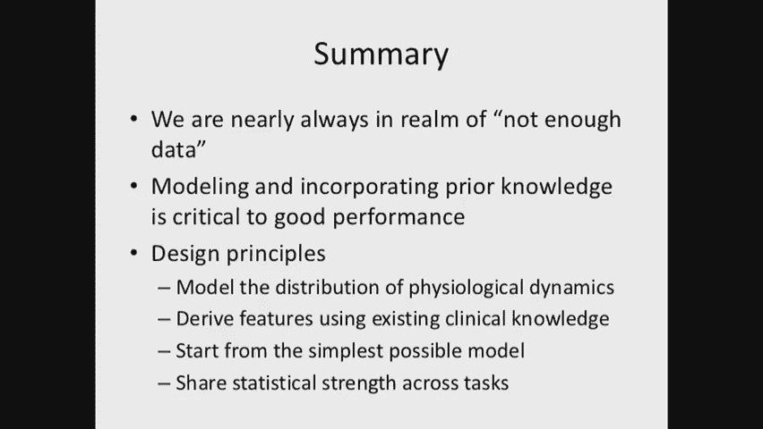

你在设置中工作，因为你没有太多的数据，和其他极端，你确实有很多数据，你可以试着忽略这一点。

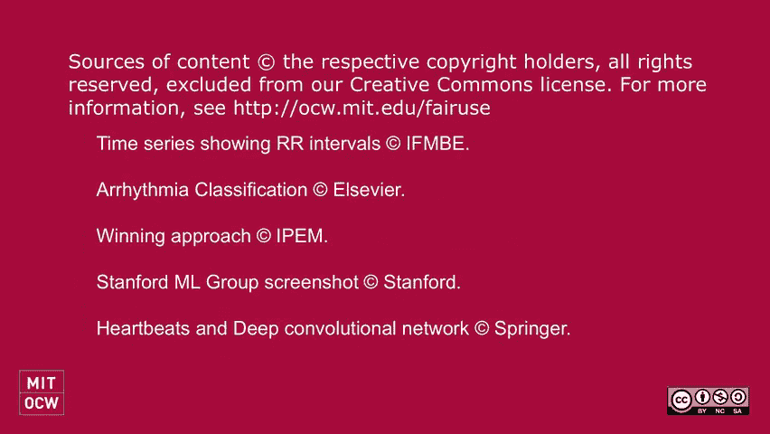

