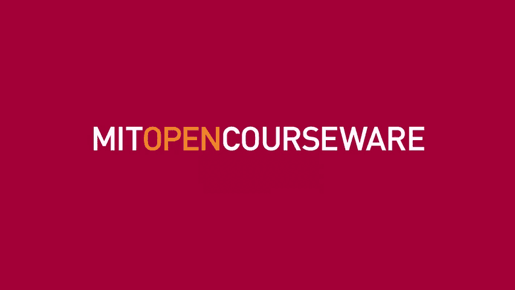
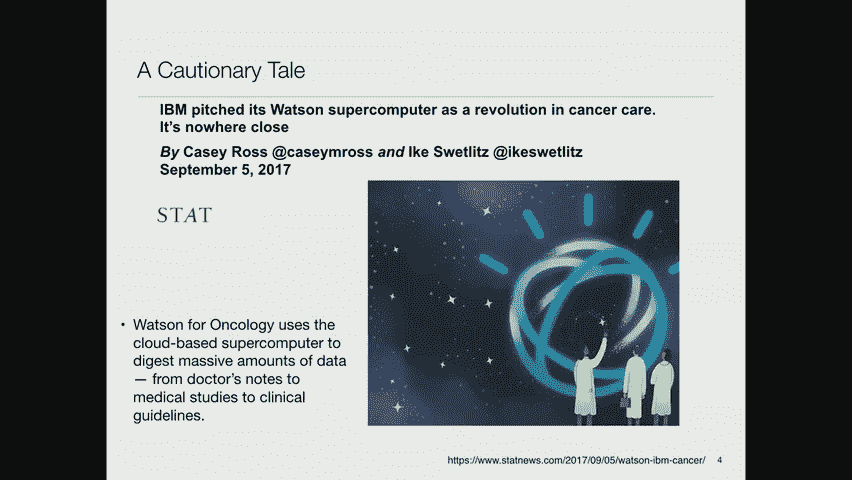
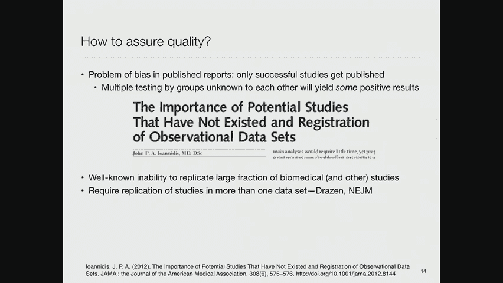
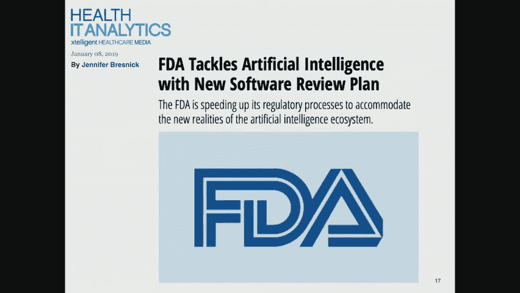
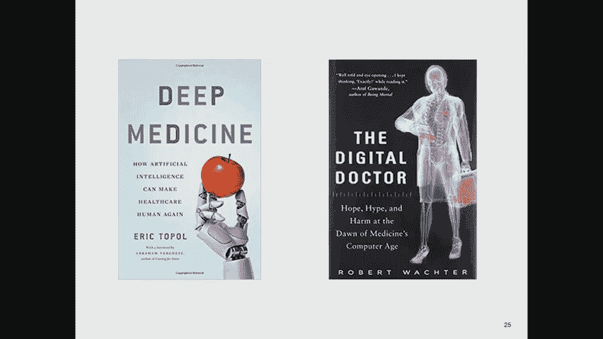
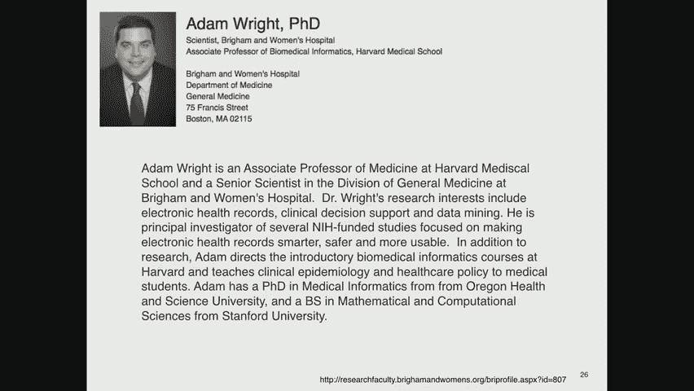
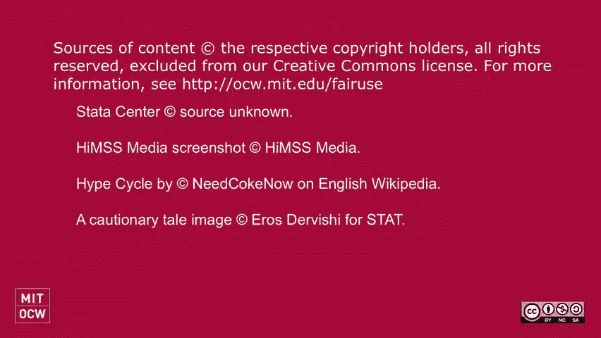
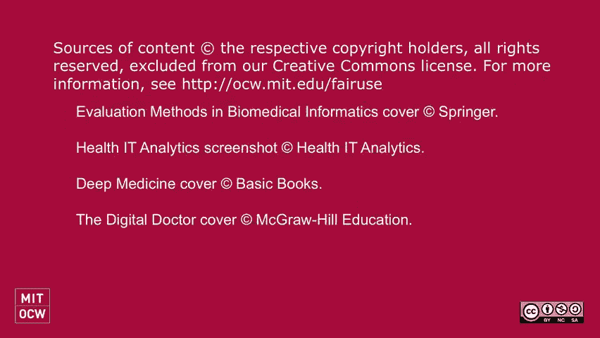

# P9：9.Translating Technology Into the Cli - 大佬的迷弟的粉丝 - BV1oa411c7eD

幸运的是我今天有客人，亚当·赖特博士，他们将做一个面试风格的会议，并将为你回答问题，这是亚当的面包和黄油，正是如何将这种技术转化为临床，他目前在布里格姆的合伙人制度中，我猜，但他即将成为叛徒。

把我们留在波士顿，在范德比尔特大学任职，所以我们祝他好运，但我很高兴我们在他离开夏天之前抓住了他，好的，坦白说，我希望我能给你讲一个更快乐的故事，比你要从我这里听到的那个，在我演讲的准备部分。

也许亚当会让我们振作起来，让我们更乐观，根据他的经验，所以你可能已经注意到AI很热，所以赞美诗，例如，健康信息管理系统协会，这是一个很大的，他们举行年度会议，由许多供应商和许多学者组成。

这是一个大型贸易展，各种各样的东西，气球挂在摊位上，还有很大的空地，所以，比如说，他们现在在谈论人工智能驱动的医疗保健，另一方面，记住这个图表很重要，所以这是一种技术采用图，这叫做炒作循环。

你在这里看到的是R和D，那就是我们产生了一些奇妙有趣的想法，然后突然间人们对此感到兴奋，那么谁对它最兴奋呢，是那些认为他们会从中发财的人，这些就是所谓的秃鹫，资本家，风险资本家，所以风险资本家进来了。

他们鼓励像我们这样的人出去创办公司，或者如果不是我们，然后我们的学生去找公司，想办法把这个新生的想法，现在，风险投资的秘诀在于，他们知道他们资助的公司中大约有90%会倒闭，他们会做得很糟糕，所以结果。

他们所希望的，以及他们所期望的，好的人实际上得到的是十分之一成功的人，赚这么多钱，它弥补了所有的投资，他们倒在十个做得不好的人中的九个身上，所以我真的记得，在二十世纪九十年代。

我在帮助一个小组向Kleiner Perkins推销一家公司，这是一个很大的冒险，硅谷最大的风险投资基金之一，我们走进他们的会议室，他们有一份圣何塞水星新闻，他们桌子上的硅谷当地报纸，他们只是喜气洋洋。

因为有一篇文章说在过去的一年里，硅谷最好的两项投资和最差的两项投资是，他们的公司，但这是相当好的权利，如果你是，如果你得到两个赢家和两个非常糟糕的输家，你赚了很多钱，所以他们心情很好，他们资助我们。

我们没给他们赚到钱，所以你在这条曲线上看到的是，有一种不断上升的期望，这来自这些技术的发展，你有一些早期采用者，然后报纸上写着这是一场革命，从现在开始一切都会不同，然后除了早期采用者之外。

您还有一些额外的活动，然后人们开始看着这个，进展顺利，它确实没有人们所说的那么好，然后你会急剧下降，有一些整合和一些失败，人们不得不回到风险投资，试图获得更多的钱来维持他们的公司，然后有一种低谷。

人们去那里，哦好吧，这是另一个失败的，然后渐渐地，你开始达到这位作者所说的，启蒙的斜坡，人们意识到好吧，1。事情没我们想的那么糟，当它没有达到我们崇高的期望时，然后逐渐地，如果它成功了。

然后你会得到多代产品，它确实实现了收养，领养几乎没有达到顶峰，在炒作周期的顶部，它预计会达到。

但它变得有用，它变得有利可图，它变得富有成效，现在我已经在这里呆了足够长的时间，看到了许多这样的循环，所以在二十世纪八十年代，比如说，当时被戏称为艾夏，人们在那里建立专家系统。

这些专家系统将彻底改变一切，我记得去参加一个会议，坎贝尔汤公司在那里建立了，一个基于一些即将退休的老前辈的专业知识的专家系统，这个专家系统做了什么，它告诉你怎么清洗汤缸了吗。

你知道这些巨大的百万加仑的东西，他们做汤的地方，当你从做一种汤到做另一种汤时，所以你知道，如果你在做牛肉清汤，你换成做大麦牛肉汤，你根本不需要清洗大缸，而如果你从，你知道蛤蜊浓汤配清汤。

然后你需要把它清理得很好，所以这正是他们正在做的事情，实际上有成千上万的这样的应用程序正在构建，在炒作周期的顶端，像坎贝尔汤和航空公司这样的公司，每个人都在这方面投入了大量的资金，然后是一种期望的失败。

这些并没有像人们想象的那样好，或者像人们想象的那样有价值，突然冬天来了，所以艾冬跟着艾夏，没有AI倒下，除了在秋天这个词的不同意义上，突然间资金枯竭了，整件事被宣布失败，但事实上今天，如果你出去看看。

你知道的，Microsoft Excel内部捆绑了一个基于专家系统的帮助系统，有大量这样的应用程序，只是现在它们不再被认为是人工智能的前沿应用，他们只是被认为，你知道的，日常练习，所以他们。

他们已经在没有炒作的情况下融入了现有的各种产品，他们发挥着非常有用的作用，但他们没有让那些风险投资公司，他们希望赚的大量钱，在2000年也有类似的繁荣和萧条周期，它围绕着万维网和电子商务的创建，所以E。

又是商业，有一套令人难以置信的膨胀的期望，然后在2000年左右发生了一场大崩盘，突然之间，你知道的，人，意识到这些应用程序的价值没有他们预期的那么高，然而，你知道的，亚马逊做得很好，网上有很多E。

今天运营秩序非常好的商业网站，但对这项技术的炒作已经不一样了，这已经成为你在几乎所有事情上做生意的方式中被接受的一部分，嗯，说专家系统，基于意志的系统，它们要么是基于规则的系统，要么是模式匹配系统。

有两种基本的，我想一个星期后，我要谈谈其中的一些，以及它与现代机器学习的关系，所以我们会看到一些例子，所以说，我想你们大多数人都记得，当沃森大放异彩的时候，这是在20世纪初什么的，我记不清是哪一年了。

他们有，事实上，建立了一套令人印象深刻的技术，可以阅读各种在线资源，并将它们提炼成一种表征，当他们遇到危险问题时，他们可以很快地查找东西，然后它有一套复杂的算法，他们会试图为一些问题找到最好的答案。

他们甚至有各种奇怪的特殊用途的东西，我记得有一个概率模型，每天的双方块最有可能出现在危险板上，然后他们做了一个效用理论计算，如果他们真的达到了每日双倍，根据机器的性能，下注的最佳金额是多少，为了优化。

他们认为人类通常赌注不够，当他们有机会在每日双倍，所以为此做了很多非常特殊的工作，所以这是一个巨大的宣传，bonanza和ibm决定下一步要解决医学问题，所以他们打算把这项技术应用到医学上。

他们会阅读所有的医学杂志和所有的医疗电子病历，他们可以得到他们的手，不知何故，这项技术会再次提取正确的信息，这样他们就可以回答像危险问题这样的问题，除了没有用它有趣的落后的方式来陈述，你可能会说。

对这个病人来说是可以的，最佳疗法是什么，它会出去，使用同样的技术来解决这个问题，现在这是一个完全合理的尝试，他们遇到的问题是这种炒作循环，公开这件事的人是他们的营销人员，而不是他们的技术人员。

营销人员疯狂地承诺，他们说这肯定会解决所有这些问题，我们不需要在这方面进行更多的研究，因为我们成功了，我夸大其词了，即使从营销的角度来看，所以沃森肿瘤学，使用这台基于云的超级计算机消化了大量的数据。

数据包括各种不同的东西，所以我要详细介绍一下，他们的一些问题是，这是来自《统计新闻》杂志的一篇文章，它做了一篇关于沃森发生的事情的调查文章。

所以你知道他们说我刚才说的话，气喘吁吁地宣传其招牌品牌，ibm试图抓住世界的想象力，并迅速锁定了一个高调的目标，那是癌症，所以这将解决一些病人被诊断患有癌症的问题，你想知道如何对待这个人。

所以这将使用所有的文献，以及它从以前对以前病人的治疗中收集到的所有东西，它会给你最优的解决方案，现在还没有成功，有几十家医院采用了该系统，在美国很少，他们中的更多人在国外。

外国人抱怨它的建议对美国病人有偏见，和美国人对我的态度，最大的问题是他们实际上没有出版任何东西，在科学意义上验证了，这是个好主意，它得到了正确的答案，我猜原因是，因为很多时候都没有得到正确的答案。

但这并不妨碍市场营销，另一个问题是他们和纪念斯隆·凯特林达成了协议，它是全国领先的肿瘤医院之一，我们将与你们和你们的肿瘤学家合作，为了找出真正正确的答案。

所以我认为他们试图做他们的营销所说的他们正在做的事情，就是真正推导出正确的答案，从阅读所有的文献和查看过去的案例，但我认为这不够好，所以他们最终做的是求助于真正的肿瘤学家，说着，在这种情况下你会怎么做。

所以他们最终建立了一个基于规则的系统，如果你看到以下症状，你有以下基因缺陷，那么这就是正确的治疗方法，好的，所以这将是一个机器学习系统的承诺，通过找到最佳治疗方法彻底改变了癌症护理真的不是他们提供的。

正如文章所说，这个系统并没有真正创造新的知识，所以它只是在提供一个搜索引擎的意义上，当它提出建议时，可以为您指出合理反映什么的文章，它在推荐，嗯，我就不说这些了，但你会在幻灯片上看到的，我们会把它贴在。

他们和M·D·安德森有一份大合同，这是美国另一个领先的癌症中心，安迪·安德森在这份合同上花费了大约6000万英镑来执行它，他们拔掉了插头，因为他们认为这不是，不是在做这份工作，现在，相比之下。

这不是由营销驱动的，而是由医疗需求驱动的，这里的想法是坡代表计算机化的医生订单输入，坡背后的想法是，如果你想影响临床医生的行为，在订购测试、药物或程序时，你要做的是确保它们与计算机交互。

这样当他们点菜的时候，比如说，一些非常昂贵的药物，系统可以回来说嘿，你知道有一种药的价格是，那个，根据我们记录在案的临床试验，和您点的那个一样有效，所以，比如说。

在贝斯以色列很多年前他们实施了这样的系统，第一年，他们展示了他们在药店节省了大约1600万美元，只是通过订购更便宜的药物变体，这些药物可能非常昂贵，他们还发现医生们，点菜的人对此非常满意。

因为他们不知道这些药有多贵，你知道这不是他们关注的事情之一，所以有很多这样的应用程序是由这个驱动的，一次又一次，以下是一些统计数据，可以将错误率降低一半，你可以通过以下方法减少严重的用药错误，呃，八十。

百分之八，呃，你可以减少70%的抗生素相关，药物不良事件，你可以缩短停留时间，这是人们追求的另一个大目标，至少如果你是个乐观主义者，你可以相信这些推断，嗯。

我们可以在美国的大城市医院预防300万起药物不良事件，如果每个人都使用这样的系统，所以好处是它提示了对可能的药物相互作用的警告，过敏，或过量，它可以通过某种机制保持最新，人们阅读文献并不断更新数据库。

你知道，它可以做一些机械的事情，比如消除听起来相似的药物名称的混乱，诸如此类的东西，所以跳蛙组，它做了很多元分析和研究什么是真正有效的背后，用力推，未来潜在效益，当然啦。

如果我们所说的机器学习技术被广泛使用，那么这些系统就可以自动更新，而不是手工审查，您可以获得当新信息可用时立即反馈的优势，由国家医学科学院推荐，他们希望到1999年每家医院都能使用这个，当然。

这并没有发生，所以我找不到当前的数据，但是，表明坡，比如说，药物订单，只在大约五家医院使用，当时人们在推断和说，直到20年，它的渗透率才会达到80%，二十九，所以这是一个非常缓慢的采用周期，对呀。

也许它变得更好了，另一个问题，抵抗的原因之一是它给人们带来了额外的压力，所以说，比如说，嗯，这是一项关于药剂师如何消磨时间的研究，临床时间有用，那是他们咨询医生的时候，帮助他们为病人确定合适的剂量。

或者他们在和病人说话，向他们解释如何服药，注意什么副作用等等，这些分配任务，这是一个有趣的术语，指他们所做的非临床部分，你看到的是采用C poe的医院，他们最终会花更多的时间在分配任务上。

少一点临床任务的时间，这可能不是正确的方向，就药剂师所希望的而言，在这样的系统之外，现在人们已经研究了新医疗技术的传播，我想我会给你看图表，这是在英国，但这是他汀类药物的采用，所以从他们被介绍的时候。

他汀类药物是一种保持低胆固醇的药物，从他们被介绍的时候，直到它们被使用，基本上在100%的地方大约是五年半六年，好的，如此之快，如果你看看磁共振成像技术的采用，它花了五年时间才被收养。

那是因为它贵得离谱，所以有各种各样的限制，你知道的，即使在马萨诸塞州，如果你镇上的另一家医院已经有了，然后他们会说好，你不应该买，因为你应该可以用另一家医院的核磁共振仪，CT也发生了同样的事情。

但一旦这些限制被取消，繁荣，你知道它上升了，然后继续上升，而支架，我真不明白他们为什么耽搁了那么久，但这是为冠状动脉或其他动脉堵塞的人准备的，你可以放一根网管保持动脉畅通，收养速度非常快。

所以不同的东西以不同的速度被采用，嗯，现在我想谈的最后一个话题是，我是的，那么在那些有尖峰的年份会发生什么，什么样子，怎么了？根据这些作者，在支架的情况下，有一些人支持支架的想法，他们四处走动。

说服他们的同事这是正确的技术，所以它有一个爆炸性的增长，在核磁共振的其他技术中，钱很重要，因为它们太贵了，支架相对便宜，在他汀类药物的情况下，也是比较便宜的，或者它们失去专利后变得便宜了，他们本来是。

它们要贵得多，嗯，但是仍然有收养问题，例如，有一个建议，我想大概十五个，甚至二十年前，也就是说，任何心脏病发作或冠状动脉疾病的人，应该服用受体阻滞剂，我不记得今天的采用率是多少，但只有一半的量。

为什么这是一种非常便宜的药物，出于不太明白的原因，它将第二次心脏病发作的概率降低了大约3。5%，所以这是一种非常便宜的保护人们健康的方法，然而，它并没有像人们想象的那样充满实践，它应该是，所有权利。

那么，在我们把这些技术强加给世界之前，我们如何确保它们的质量呢？这很棘手，嗯，指出大多数生物医学研究都是废话，有一些著名的出版物表明人们已经把一些生物医学领域，他们看了一群受人尊敬的人，他们去了实验室。

他们试图复制这些研究，一半或四分之三的时间他们没有做到这一点，你去，我的天啊，这太可怕了，对，太可怕了，是啊，是啊，当他们没有这样做时，它们不会复制完全相同的资源，比那更糟，所以不是说，有细微的差别。

就是那个，比如说，在一项研究中被证明具有统计学意义的结果，当他们重复的时候，这项研究不再具有统计学意义，好的，那很糟糕，如果你把政策建立在这种决定上，所以Yiddes有一个建议，这可能会有很大帮助。

这基本上是让每个人都知道的，所有失败的研究，所以问题是如果你给我一个大数据集，我开始挖掘这个数据集，我会在这些数据中找到大量有趣的相关性，好的，一旦我得到一个有很好的P值。

我的学生和我去美妙的时间发表权利，现在想想我不是唯一一个扮演这个角色的人，所以你知道，大卫的小组也在做同样的事情，约翰·古托和雷吉娜·巴齐斯，以及我们在美国其他主要大学和医院的所有同事。

所以可能有数百人在挖掘这些数据，我们每个人做这件事的方法略有不同，我们选择不同的案例，我们以不同的方式预处理数据，我们对它们应用不同的学习算法，但只是偶然，我们中的一些人会发现有趣的结果，有趣的图案。

当然，这些都是出版的，因为如果你没有找到一个有趣的结果，你不会把它提交给日记然后说，你知道，我寻找以下事实现象，我找不到它，因为杂志上说，这对任何人来说都不感兴趣，所以IDES建议，基本上。

任何人进行的每一项研究都应该注册，如果你没有得到一个应该知道的重要结果，这将使我们至少做出一些合理的估计，得到的显著结果是否只是统计上的异常值，碰巧达到p，等点，零，五个，或者不管你的门槛是什么。

还是真实的效果，因为没有多少人尝试过，是啊，是啊，你认为这是为什么，因为有些病人的体型，或者喜欢，可能是那些中的任何一个，可能是你知道你的医院有一些有偏见的数据收集，所以你发现，实际上我的医院没有。

所以我找不到它，可能我们只是随机地对人群中的不同样本进行了亚采样，所以去年很有趣，杰夫·德拉赞邀请我参加一个会议，他是新英格兰杂志的执行编辑，他在考虑还没有决定，但他在考虑新英格兰日报的政策。

这就像顶级医学杂志说他不会发表任何结果，除非它被复制在两个独立的数据集上，对呀，所以这很有趣，这是对这个问题的反击，这是一个不同的解决方案，而不是你需要的是推荐。

这是恩里科·科伊拉的一项研究，他在谈论复制意味着什么，再说一遍，我不会经历这一切，但有一个复制的概念，可能意味着精确的复制，我是，您对完全相同的数据做完全相同的事情，但在不同的数据集中，然后部分复制。

概念复制，上面说你遵循同样的程序，但在不同的环境中，然后准复制，部分的或概念性的，这些有各种各样的特征，你可以看到，这是一个有趣的框架，这不是一个新想法，这本书的第一版。

评价方法和生物医学信息学被称为医学信息学中的评价方法，作者相同，很久以前就出版了，我不记得这个是最近的，所以他们做了几百页，非常详细的评估一个人应该如何评估像这样的临床系统，它非常小心，非常谨慎。

但也很保守，例如，他们推荐的东西之一，做评估的人不应该是开发这项技术的人，因为天生就有偏见，你知道我希望我的技术成功，所以他们说，把它交给没有同样既得利益的人，然后你会得到一个更仔细的评估。

所以史蒂夫·帕克，我对他们早期的一篇论文写了回应，推荐这个说得好，太保守了，它把婴儿和洗澡水一起扔出去了，因为如果你让评估变得如此困难，你永远不会得到任何超过它的东西，所以我们提出了一种分阶段的评估。

首先说，你应该做回归测试，以便每次您使用这些敏捷开发方法时，您应该有您的程序处理过的一组案例，然后您应该自动重新运行它们，看看哪些是您做得更好的，哪些你做得更糟了，这会让你对，你所做的是否合理。

然后您还可以构建用于自动化的工具，在您正在构建的模型中寻找不一致的方法，然后你有临床医生的回顾性评估，所以你在一大堆现有数据上运行一个你喜欢的程序，就像你用Mimic或市场扫描做的那样。

然后你前瞻性地做，但实际上不会影响病人，所以当数据进来的时候，你就实时地做了，但你不告诉任何人这个项目的结果，你只要让他们回顾一下，看看这是否正确，你可能会说嗯，实时收集数据有什么区别。

并回顾性地收集数据，从历史上看，答案是有区别的，所以情况不同，收集数据的机制不同，所以这是一个重要的问题，然后你可以进行一个前瞻性对照试验，你有兴趣评估你从程序中得到的答案，以及最终对健康结果的影响。

所以如果我有一个决策支持系统，布丁的终极证明就是，如果我运行决策支持系统，我给临床医生建议，临床医生有时会改变他们的行为，病人得到了更好的结果，那么我相信这真的很有用，但你得慢慢地到达那里。

因为你不想给他们更糟糕的结果，那是，你想把这和没有帮助的医生的表现进行比较。

所以食品和药物管理局多年来一直在处理这个问题，我记得大约在1976年和他们谈过，当他们读到第一个用于诊断和治疗选择的专家系统程序时。

他们说好，我们应该如何监管这些，我当时的反应是上帝，帮我们把你的手拿开，因为如果你调节它，那你就会放慢进度，在任何情况下，这些程序都没有被使用，这些方案正在作为实验方案开发，在实验环境中。

它们根本不可能用在真正的病人身上，所以没有监管问题，大约每五年FDA就会重新审视这个问题，他们继续做出本质上相同的决定，基于，比如说，他们不规范书籍，如果我写一本解释医学的教科书。

食品和药物管理局不会看它是否正确，原因是因为预期是教科书提出了建议，所以对负责任的临床医生来说，专家自己，所以他们行为的最终责任，和他们在一起，而不是和教科书在一起，他们说我们要把这些计算机程序。

好像它们是动态的教科书，而不是现在独立行动和提供建议的同事，一旦你试图给出建议，不是对专业人士而是对病人，那么你就会立即受到食品和药物管理局的监管，因为现在没有专业的中间人可以评估建议的质量。

所以FDA在过去一年里所做的，就是，他们说我们要处理这些基于人工智能的报价，取消报价设备作为医疗设备，我们将应用与这些设备相同的监管要求，除了我们真的不知道怎么做，所以现在正在进行一种实验，他们在说。

好的，向我们提交审查这些设备的申请，我们会回顾他们，以及在组织中培养他们的所谓积极主动的文化，为了判断是否，让你继续营销这些东西之一，嗯，所以如果你看，实际上有大约十个设备，引用未引用。

这些都是到目前为止已经被FDA批准的软件，几乎都是成像设备，有些东西在这样或那样的事情上做卷积网络，这里有几个例子，伊莫金有骨检测，分析二维X线图像寻找桡骨远端骨折的迹象，所以如果你摔断了手腕。

然后这个系统会查看X光，并决定你是否做了那件事，呃，这是IDX的一个，它看着，呃，你视网膜的照片，并决定你是否患有糖尿病视网膜病变，实际上，他们发表了很多论文，表明他们也可以识别心脏病，和中风风险。

和这些照片中的各种其他东西，所以食品和药物管理局已经批准他们销售这种东西，呃，另一个是，即，那个，呃，自动分析急诊室病人的ct扫描，正在寻找主要脑血管的堵塞，所以这显然会导致中风，这是一种自动化技术。

这里还有另一个艰巨的措施，并在放射学图像中跟踪肿瘤或潜在癌症。

所以这些是已经批准的，然后我只想提醒你，实际上有很多关于这种东西的文献，所以左边的书实际上下周出版，我读了埃里克·托尔的预印本，他是写了很多关于医学未来的文章的医生之一，他实际上经历了大量的例子。

不仅是FDA批准的系统，还有正在进行的事情，他很乐观，这些将再次彻底改变医学实践，鲍勃·沃尔特，他几年前写了一本关于左边的书，稍微谨慎一点，因为他是加州大学的医学主任，旧金山，他写了这本书来回应他们。

给一个孩子服用过量的药物，差点杀死他。

他们没有很成功，杀死孩子，所以结果还可以，但他真的很担心，这项奇妙的技术导致了如此灾难性的结果，所以他花了一年时间研究这些系统是如何被使用的，并写了一个更警示性的故事，所以让我转向亚当，正如我所说的。

他是布里格姆和哈佛医学院的教授。

请过来加入我，我们可以交谈，所以我叫亚当，赖特，我是哈佛医学院的医学副教授，我领导一个研究项目，我在医学院教授生物医学信息学导论课程，如果你对皮特今天谈论的话题感兴趣，你绝对应该考虑在BMI中交叉注册。

七零一或七零二在医学院，我们当然总是需要一些更热情的人，在我们的课程中有技术头脑的机器学习专家，嗯，然后我在合伙人公司做运营工作，伙伴，是包括大众综合医院和布里格姆医院在内的卫生系统，然后一些社区医院。

我在合伙人那里工作，E护理，这是我们史诗的酷品牌名称，所以史诗是一个小时，我们使用合作伙伴，我帮助监督那里的临床决策支持，所以我们有一个决策支持团队，我是监测和评估的临床负责人。

所以我帮助确保我们的决策支持系统，皮特所说的类型工作正确，那是我在布里格姆的工作，我非常感激，谢谢，我很感激你的邀请，在这里很有趣，所以亚当，第一个明显的问题是，你们建立了什么样的决策支持系统，绝对。

所以我的意思是，你知道的，我们在布里格姆有很长的历史，合作伙伴使用决策支持，历史上，我们开发了自己的电子健康记录，这在三年前有点不寻常，我们从自己开发的系统切换到史诗。

这是一种应用非常广泛的商业电子健康记录，到了你给的地步，我们真的从很多与药物相关的决策支持开始，这就是药物相互作用，警报，所以你开了两种可能相互作用的药物，我们用一张桌子，你知道没有机器学习或复杂的。

这表明我们认为这种药物可能与这种药物相互作用，我们向医生发出警报，给药剂师，他们作为博学的中间人，利用他们的专业知识做出决定，但我们要继续开处方，让我们有一些剂量，支助，过敏，检查，诸如此类的事情。

所以我们的第一组决策支持实际上是关于药物的，然后我们转向更广泛的事情，比如预防护理提醒，或者巴氏涂片，或者他们可能从他汀类药物中受益，或者类似的东西，或者在急性心肌梗死的情况下使用受体阻滞剂。

我们向医生提出建议，或者护理小组的其他成员再次做这些事情，这些在历史上很大程度上是基于规则的，所以一些专家坐下来写布尔，如果使用患者图表中的变量进行规则，我们越来越，虽然。

开始尝试使用一些预测模型来预测像再入院这样的事情，或者病人在医院里是否有摔倒的风险，病人经常遇到的一个大问题是在医院里，你知道他们有点神志不清，医院是个奇怪的地方，天很黑，他们起身去洗手间。

他们被他们的，你知道吗，iv油管，然后他们摔倒受伤了，所以我们想防止这种情况发生，因为发生在你身上显然是件坏事，一旦你进了医院，所以我们有一些基于机器学习的工具来预测病人，有跌倒风险的人，然后有一套。

你知道的，像把床栏杆竖起来这样的干预措施，或者放一个警报器，当他们，如果他们起床，或在更极端的情况下，有保姆，就像一个真正和他们坐在房间里的人，试图阻止他们起床或帮助他们去洗手间。

或者打电话给能帮他们去洗手间的人，所以我们越来越多地开始使用这些机器学习工具，其中一些我们从第三方获得，就像我们的电子健康记录挡泥板，其中一些是我们根据自己的数据训练自己的。

但这对我们来说是一个新的追求，这种机器学习，所以当你有一个风险模型，如何决定在哪里设置阈值，你知道如果我有百分之五十三，坠落的危险，是啊，是啊，你应该找个保姆坐在我的旁边吗，这很复杂，对呀。

我的意思是我想说我们所做的是一种完整的，你知道效用分析，对呀，我们说我们每小时付给保姆这么多钱，跌倒的风险是这么大，和跌倒的代价，你知道大多数跌倒的病人都没有受伤，但有些是，所以你会计算出，你知道吗。

这些东西的成本效益，你知道，在岩石曲线的哪里，你想在实践中把自己放在适当的位置上，我想我们经常见机行事。部分原因是我们的很多东西都是为了建议，对呀，所以我们对医生说的门槛，嘿嘿，这个病人跌倒的风险很高。

认为做某事很低级，如果系统是自动的，叫保姆，我们可能会把它设置得更高，我想说这是一个研究领域，我还想说我们面临的一个挑战是，我们经常设置并忘记这类系统，对，所以有，你知道吗，特征漂移和病人随时间变化。

我们可能应该做得更好，回头看看他们实际上工作得有多好，并对阈值进行调整，这是个很好的问题，但这些当然是非常复杂的决定，我记得五十年前和空军的一些人交谈过，是啊，是啊，他们应该在安全措施上投资多少，对呀。

他们有一个效用理论模型说，好的，更换飞行员要多少钱，如果你杀了他，是啊，是啊，这并没有被宣传很多，否，我是说我们会计算质量调整寿命，和残疾调整生命年，所以在所有的医学中都有，正确的是当人们部署资源时。

这种微积分，我认为我们倾向于对病人的伤害给予很高的重视，因为病人的伤害是，如果你想想那种誓言，医生先发誓说对了，不会造成伤害，我们能做的最糟糕的事就是在医院伤害你，所以我认为我们非常厌恶这样做，但很难。

1。要估计这些东西的重量是很困难的，我认为我们经常遇到的一个挑战是不同的医生会做出不同的决定，对呀，所以如果你把同一个病人放在十个医生面前说，这个病人需要保姆吗？也许一半的人会说是，一半的人会说不是。

因此，知道如何使用决策支持系统尤其困难，如果人类不能就你在特定情况下应该做什么达成一致，我们昨天在电话里谈到的另一件事是我担心，几年前，我去了一家八月波士顿地区的医院，要求看一个。

某人与这个计算机化的医生订单输入系统交互的例子，带我四处走动的高级住院医生，走到电脑前说，嗯，我想我记得怎么用这个，我说，等一下，这是你应该每天使用的东西，但实际上，发生的事情不是高级医生。

甚至不是媒体，高级医生，实际使用系统的是实习生和初级住院医生，这是真的，我担心的是，一个很有勇气的初级住院医生才能去，你知道的，你的服务主管说，X医生，尽管你让我为这个病人订购这种药。

电脑在反驳你应该用另一个代替，是啊，是啊，它确实，事实上，在我们聊了聊之后，我更多地想到了这一点，我们从居民那里听到人们对他们说，如果你敢在半夜给我一个史诗般的建议，我再也不和你说话了。

所以你知道只要覆盖所有这些警报，所以我想你知道挑战之一是，还有一些，你知道这是我们的一栋楼，我们给出的很多警报，你知道有一个光伏喜欢，你知道百分之十或百分之二十是对的，你知道他们通常是错的。

我们认为这真的很重要，所以我们真的提出了很多这些词，但是人们会经历这种警觉疲劳，或者人们所说的警报疲劳，你在驾驶舱里也能看到这个，但是人们收到太多的警报，他们开始忽略警报，他们认为自己错了。

他们告诉居民不要呼他们，嗯，我知道，不管电脑说什么，所以我确实认为我们有责任提高这些警报的准确性，我确实认为机器学习可以帮助我们，我们实际上正在开一个关于肺炎球菌疫苗接种的会议。

意识是帮助人们记住开这种疫苗的东西，帮你不得肺炎，它考虑了四五个变量，我们开始研究人们会忽略警报的情况，它们大多是合适的，对吧，所以病人是，你知道吗，在一个非常极端的状态下，或者反过来。

病人接近生命的尽头，他们不会从疫苗接种中受益，或者病人有针头恐惧症，病人有保险问题，我们认为可能有三四十个变量，你需要考虑的因素来使其非常准确，所以问题是当你有这么多变量时，人类能发展和维护这种逻辑吗。

或者我们最好尝试使用机器学习系统来做到这一点，那真的行得通吗，那么我们离能够使用机器学习系统来做到这一点还有多远，是啊，是啊，老实说，我认为最大的挑战与现有的，我们系统中数据的准确性，如此史诗。

这是我们正在使用的人力资源和Cerner和所有脚本，大多数主要系统都有各种运行方式，甚至是复杂的机器学习模型，系统内部的任何一个都是固定在系统上的，然后将模型推断反馈给系统。

当我举肺炎球菌疫苗接种的例子时，一个主要的问题是并不总是有一个真正好的，系统中的结构化方式，我们表明一个病人在生命的尽头，只接受安慰措施，或者病人处于非常极端的状态，我们在蓝色代码的中间。

我们需要暂停一下，停止给予，你知道这些友好的预防护理建议，所以我想说真正好的基于机器学习的最大障碍，决策支持只是缺乏好的，我觉得第二个挑战，显然工作流是对的，你说过，有点，你知道的。

在医院里有时很难知道病人的医生是对的，病人入院，护理团队中有一名实习生，初级住院医生和奥赛罗，并参加了几位专家，几个护士，谁应该得到这个信息，或者谁应该得到那一页，我认为工作流程是第二位的。

这就是我想你可能会说我有些乐观的地方，我实际上认为我们EHR软件的技术能力，运行这些模型比三五年前更好，事实上，这通常不是我们所做的研究中的障碍，二十年前又有人试图，制定关于谁得到通知的正式规则。

在什么情况下，我记得，和我一起在塔夫茨医疗中心工作的一个医生快疯了，因为当他们实施一个新的实验室信息系统时，是啊，是啊，它会对每一个不正常的实验室发出警报，对呀，这太疯狂了，但有其他医院说好。

让我们更复杂一点，当需要提醒的时候，然后如果有人对警报没有反应，在很短的时间内，然后我们把它升级到更高的人或护理团队的其他人，在我看来，这是一个合理的想法，但现在有这样的东西吗。

它在住院病人和门诊环境中的作用非常不同，对呀，住院设置，我们正在向病人提供非常紧急的护理，所以我们有一些流程，人们在护理团队中签到和退出，事实上，这些自动消息的流行程度，是一种做好这件事的动机，对呀。

所以如果我回家，我最好签字离开那个病人，否则我整晚都会看到这些关于他们的页面，你知道这个系统，始终确保某人是响应提供者，在门诊环境中变得有点棘手，对呀，因为你们很多人都知道，布里格姆的学术医生只有诊所。

你知道一周半天，所以问题是，如果有异常结果回来，我应该把它送到那个医生那里吗？我应该把它发给诊所里随叫随到的人吗，我应该把它寄给诊所的负责人吗，也有一些边缘情况会搞砸很多。

对一个典型的例子是一个病人在医院里，我已经安排了一些化验，他们看起来很好，所以我让病人出院，测试当时仍悬而未决，病人出院了，现在谁会喜欢它呢，它应该去病人的初级保健医生那里吗，他们有初级保健医生吗。

它应该给下令测试的人吗，那个人现在可能在度假，如果这是一个需要几周才能回来的测试，所以我们还在纠结，我们称这些为T垫，出院前的测试，我们仍然在努力解决一些边缘情况，但我认为在核心方面我们很擅长。

所以我们谈论的一件事是我的一次经历，你可能有过，而且那个，比如说，几年前，我和麻省总医院临床实验室的负责人一起工作，他们运行着一些古老的实验室信息系统，就像你说的，可以加减，但不成倍增长。

或者你可以加乘，但不减去你的侧，是呀，它不支持负数，只有无符号整数，呃，嗯哼，呃，周围有这些奇妙的遗留系统，如果你试图建造任何东西，我是说，甚至是风险预测计算器，是啊，是啊，能够划分真的很有帮助，当然。

会成倍增长，所以我们在那个项目中苦苦挣扎，我相信你也有过类似的经历，我们如何将决策支持系统融入到这些摇摇欲坠的旧技术中，那就是不支持它，是啊，是啊，那么什么是正确的方法呢，有很多架构，他们都有利弊。

我不确定他们中是否有一个是正确的方法，我想我们经常喜欢用那种，你知道的，吱吱作响的旧技术还是新技术，对呀，所以Epic有一个内置的规则引擎，你说的那个实验室系统有一个基本的计算引擎，有一些重大的限制。

所以我们可以，我们经常会尝试使用这些系统在内部构建规则，这些往往有实时的数据可用性，向工作流程中的人推送警报的最佳能力，并在我们做不到的情况下使这些警报可采取行动，就像，比如说。

一个太复杂而无法在系统中执行的模型，我们经常做的一件事，在我们的数据仓库中运行这个模型，所以我们有一个数据仓库，每晚午夜从电子健康记录中提取数据，所以如果我们不需要实时数据，有可能运行提取，数据。

运行一个模型，然后把风险评分或标志写回病人的记录中，然后可以展示给临床医生，或者用来驾驶警报之类的东西效果很好，除了发生的很多事情，尤其是在病人环境中，比如依靠实时数据预测败血症，我们马上需要的数据。

所以我们遇到了挑战，这种特殊的方法只有效，你知道的，在24小时内，一种追溯的基础，我们还开发了依赖于信息的系统，所以有这个HL 7，是与电子健康记录交换数据的标准格式，HL 7有各种版本和简介。

但你可以在人力资源之外建立一个基础设施，从人力资源部实时获取信息并做出推断，并将信息发回EHR，越来越多的HS也支持，某种Web服务方法对吧，这样你就可以注册一个钩子，说叫我的钩子。

每当这件事发生的时候，或者你可以把HR拉出来获取数据，并使用另一个Web服务将数据写回，这对我们来说非常有效，你也可以让人力资源部把你开发的应用程序。

所以这里的人们可能听说过或者应该听说过Smart on Fire，这是一种开放的API，它允许您开发一个应用程序，并将该应用程序嵌入电子健康记录，我们越来越多地建造其中的一些，这些应用程序。

智能应用程序目前的缺点，它们真的很适合从记录中读取数据，并将其可视化或显示出来，但他们并不总是有很多能力来写入数据，返回记录或采取行动，大多数人力资源供应商也有专有的方法，就像应用商店，所以伦理要求。

那里是应用程序果园，大多数HS都有类似的东西，在那里你可以加入一个开发人员程序，并构建一个应用程序，这些通常功能更全面，它们往往是专有的，所以如果你构建一个史诗应用程序。

然后你必须构建一个cerner应用程序和一个所有脚本应用程序，你需要临床工作应用程序，参加这些项目的高额费用，尽管人力资源供应商Epic特别降低了他们的价格，和联邦政府，国家卫生协调员办公室。

就在一周半前，它发布了一些新的规定，这确实限制了供应商向应用程序开发人员收取API访问费用的速度，基本上什么都没有，除增量计算成本或特殊支持外，所以我想这可能会改变一切，既然那条例颁布了。

所以我们会看到与我悲观的开始如此相反，这实际上是让我最乐观的事情，即使在五年前，如果你看看这些系统中的许多，他们基本上把你锁在外面，绝对，我记得在2000年初，我在匹兹堡大学，他们在那里。

他们有最早的心肺移植中心之一，所以人们开发了一个特殊的应用程序来支持心肺移植患者，在他们自制的电子病历系统中，然后UPMC当时去了塞纳，我记得我在一个会议上，在那里。

负责心肺移植的医生正在和Cerner的人交谈，说你知道我们怎样才能得到一些东西来支持我们对病人的特殊需求，塞纳的回答很好，你知道商业上，我们这样做没有意义，因为当时全国有四家医院这样做。

所以它不是一个大的赚钱者，所以他们的提议很好，你多付我们三百万，在三年内，我们将为您开发合适的软件，所以这太疯狂了，对呀，我的意思是这样做是完全站不住脚的，现在有了系统的方法。

要么将自己的代码嵌入到这些系统中，或者至少有一个有据可查的，合理的数据输出方式，然后将结果反馈到系统中，使，或实验应用，或者各种新奇的东西，那太好了，这就是我们乐观的地方，我是说我认为值得补充。

你必须克服两个障碍，对呀，一个是史诗般的，不得不让你进入他们的应用程序果园，这是一种越来越低的障碍，然后你需要找医院或医疗保健提供者，想使用你的应用程序，对呀，你知道的，所以你必须清除这两个。

但我认为这越来越有可能，麻省理工学院或波士顿的医院都有聪明的人，我总是想构建这些应用程序，我想说五年前我们会告诉人们对不起，这是不可能的，今天，我们通常可以告诉人们，如果有临床兴趣，技术部分就到位了。

所以这对我们来说很令人兴奋，是啊，是啊，是啊，是啊，关于那个的问题，所以你们知道的一些应用程序，也把那些放在史诗般的果园里，或者你就一次，是啊，是啊，我们有很多不同的方式来共享这些应用程序。

所以我们很多人都是研究人员，所以我们会，你知道发布了一个开源版本的应用程序，或者你知道写一篇论文，说这是可用的，我们会和你分享的，App果园特别关注你想销售的应用程序。

所以我们医院还没有决定要出售任何应用程序，我们已经发出了很多申请，Epic也有一个叫做社区图书馆的东西，就像果园一样，但它是免费的，而不是花钱，所以我们通过社区图书馆发布了大量的东西。

到了我之前戳的地步，其中一个挑战是，如果我们构建一个智能着火应用程序，我们可以公开分享，我们可以把它发布在网上或放在GitHub上，任何人都可以用它，他们的API是专有的。

它们代表着Epic有价值的知识产权或商业秘密，所以我们只能通过，史诗般的生态系统，所以我们现在经常当我们得到资助时，我的大部分工作都是通过助学金，我们将有一个史诗般的网站，我们将通过社区图书馆分享。

我们会有一个Cerner网站，我们将通过Cerners等价物分享它，但我觉得，直到开放API的能力，就像Smart on Fire达到了与专有API相同的水平，我们仍然在某种程度上不得不建立不同版本的。

在不同的渠道分配三个小时，这是一个非常非常好的问题，所以像聪明着火这样的东西缺少什么，从本机接口获得的，所以我是说这是很有情境性的，对就这样就这样，比如说，在你知道的，在一些人力资源实现中。

火上的智能会给你病人目前的药物清单，但可能不会给你历史药物，或者它会告诉你药是订的，但它不会告诉你是否服用过，所以战斗的一半是不太完整的数据，另一个是我们大多数小时在这一点上没有实现，右后卫的能力。

或者Smart on Fire正在开发的可操作功能，这对我们来说真的是一些标准，所以如果我们想构建一个应用程序来显示病人是如何适应的，生长曲线，那很好，如果我们想构建一个建议订购药物的应用程序。

这可能真的很有挑战性，而供应商提供的内部API通常具有读和写功能，这是另一个挑战，供应商担心吗，我想有两件相关的事情，一种是认知超载，因为如果你在Fire上构建了一千个智能应用程序。

他们都开始为这些住院病人开火，你会回到同样的过度警报的情况，另一个问题是他们是否担心责任，因为如果你用他们的系统显示推荐，这些建议被证明是错误的，伤害了一些病人，然后有人会合法地联系他们。

因为他们有很多钱，他们当然担心这两个相关的，尤其是对第二个，他们也担心，你知道数据的损坏或完整性，好吧如果我可以直接把药物订单写到数据库里，它可能会绕过正常情况下进行的某些检查。

我可能会输入错误或危险的订单，我们越来越多地听到的另一件事是对，数据保护的种类，剑桥分析风格，担心对吧，所以如果我作为一个史诗般的病人，授权你知道你知道的话与朋友应用程序查看我的医疗记录。

然后他们把它发布在网上，或者以某种棘手的方式将其货币化，什么责任，如果有，我的医疗保健提供者组织或我的人力资源供应商对此有什么，新规定非常严格，对呀，他们说，如果病人要求你这样做。

并授权一个应用程序访问他们的记录，您不能阻止该访问，即使你认为我必须是一个糟糕的演员，所以我想，一个刚刚开始清理的责任领域，我认为这是一个令人担忧的原因，但同时你可以想象一个宇宙。

我认为有保守的医疗保健组织，他们会选择永远不授权任何申请，为了避免风险，所以你如何平衡这个问题还没有很好地解决，并避免泄漏，所以我记得几年前有很多不情愿，甚至在波士顿地区的医院之间共享数据。

因为他们担心另一家医院会，通过了解他们的一些情况来挑选他们最有利可图的病人，所以我相信这并没有成为一个问题，是啊，是啊，好的，我们会试着记住重复你问的问题，因为录音，很高兴，是啊，是啊。

那么第三方供应商如何，像机器学习模型一样在你的系统上部署，通过史诗来完成，就像很明显没有工作或你的那种事情，但有没有办法绕过这个直接去找合伙人，什么的，怎么样？是啊，是啊，所以问题是。

第三方供应商如何部署应用程序或机器学习模型，或者类似的东西，史诗也是如此，应用程序的供应商之间总是有关系的，和保健提供者组织，所以我们可以直接一起工作，所以如果你有一个土匪想用的应用程序，呃。

你可以通过多种方式与我们分享这个应用程序，所以Epic支持这种叫做预测建模的东西，标记语言或PML，所以如果你训练一个模特，您可以导出PML模型，我可以把它导入到Epic中，并在本地运行它。

或者您可以生成一个Web服务，我调用它，给了我一个答案，我们可以直接合作，然而，我可以告诉你的东西有一些限制，或者与您分享Epic的数据模型，史诗认为在那里，他们的知识产权，所以你加入这个项目很容易。

因为如果你加入这个项目，您可以访问否则无法访问的文档，您可以访问测试线束，或者一个测试系统，让你验证你的工作，然而，参加该计划的人，我经常认为这意味着我可以在每个客户身上运行我的应用程序，对呀。

但尤其是史诗，你得和我做个交易，在布里格姆使用它并与，你知道我在斯坦福的同事用它，其他ehr供应商开发了一种更集中的模式，在那里你可以发布它并出售它，我可以直接通过应用商店支付并集成它。

我认为最后一英里还没有真正标准化，是啊，是啊，我想我的一个问题是这个案子会发生什么，我根本不想和史诗说话，是的就像我看了你的数据就像操纵女人的东西一样，是的，我建立了一个非常好的模型。

你看它是怎么工作的，是啊，是啊，我们只想把它部署好，史诗不会阻止我们这样做，唯一真正的限制是史诗会限制我告诉你的能力，关于史诗的内脏的东西，所以你需要一个相对复杂的医疗保健提供者组织。

他可以在某种柏拉图式的数据之间映射，临床数据模型与史诗内部数据模型，但如果你有，你可以，我是说布里格姆，我们有一个iHub创新计划，我们可能会和50到100家这样的初创公司合作。

其中一些是Epic应用程序的成员，或者他们中的一些人选择不成为史诗光圈的成员，值得说的是，加入这些项目的应用程序或宪章需要与Epic分享收入，和一些复杂性可能会随着这些新规定而下降。

但现在一些组织选择不与供应商合作，直接与医疗保健提供者组织合作，所以在这个问题的质量方面，如果您确实开发了一个应用程序并在，布里格姆斯坦福大学会有兴趣接受它吗，还是他们会担心，不知何故。

你把它适合波士顿的病人群体，这将不适合他们的数据，是啊，是啊，我认为这是一个基本问题，正确的是这些模型在多大程度上推广了，对呀，你能在一个地方训练一个模型，然后把它转移到另一个地方吗。

我们通常认为他们中的许多人转移得很好，所以如果它们真的与人类的核心生理有更多的关系，这在组织之间可能非常相似，如果它们真的绑定在特定的工作流中，对他们，你知道的，他们假设你在做这项任务，这个任务。

按这个顺序完成这项任务，他们往往转移得非常非常差，所以我想说我们一般的做法是采用一个模型，有人在我们的数据仓库上追溯运行了它，看看是否准确，如果是，我们可能会继续下去，如果不是。

我们会试着根据我们的数据重新训练它，然后看看我们通过重新训练它得到了多大的改进，所以你实际上进口了这样的模型，我们有，是啊，是啊，是啊，是啊，Epic提供了五六个模型。

我们刚开始在布里格姆使用其中的一些，或者只是签署了开始使用它们的许可证，我认为史诗般的指导和我们的经历，他们，他们可以很好地开箱工作，你能更多地说说这些风险评分正在部署，你知道吗，也许他们知道。

你怎么能真正判断它们是否有效，甚至只是随着时间的推移耐心的答案，人们对分数的反应，我知道公平工作中的很多偏见就像人，如果一个分数与他们的直觉一致，如果没有，他们就忽略分数，是啊，是啊。

那么这个过程对你来说是什么样子的，部署乐谱，是的事情，然后看看它是否漂亮，是啊，是啊，绝对如此，所以问题是，我们得到一个风险评分，我们部署一个新的风险评分，它说病人跌倒或病人的风险，患败血症的风险。

或者类似的东西，嗯，你知道吗，我们倾向于做几个层次的评估，对呀，所以第一关是当我们显示分数的时候，人们做什么是对的，如果我们通常不只显示分数，我们提出一个建议，我们说，根据分数。

我们认为你应该点一份乳酸盐来看看，如果病人有败血症的风险，首先我们看看人们是否按我们说的做，所以我们认为这是个好兆头，如果人们听从建议，但最终你知道，我们认为自己是临床试验专家，对呀。

所以我们部署这个模型的意图是移动一些东西，降低败血症的发生率，或降低败血症死亡率，所以我们会试着衡量一下，如果没有别的，做一个前后研究，对呀，测量之前的费率，实施这一干预措施，并测量之后的比率。

在我们不太确定或我们真正关心结果的情况下，我们甚至会做一个随机试验，所以我们会给一半的单位会得到警报，一半的单位不会收到警报，一旦你比较了对临床结果的影响，看看我们的观点有什么不同。

除非我们能显示出对这些临床措施的影响，我们不应该打扰别人对吧，你知道竞争表明了这一点，你知道拥有的目的是什么，你知道的，如果我们有一千个警报，每个人都会不知所措，所以我们应该只开警报。

如果我们能证明他们在临床上有真正的不同，这些只是内部检查吗，还是有这些部署的文件，它是我们的，我们的意图是出版一切正确的东西，我想我们落后了，但我得说，你知道我们出版一切，我们完成了一些事情。

我们还没有出版，他们是下一个出来的东西，我猜，所以我们在讨论如何，所以模型只是用来给出建议，是啊，是啊，医生，你有什么衡量标准吗，模型推荐与医生决定匹配的频率，是啊，是啊，绝对，哦，是啊，是啊，谢谢。

所以问题是，我们有没有检查过模型推荐匹配的频率，医生做什么，所以我们有两种方法，这通常会回顾性地测试模型，所以我想，皮特分享了塞纳的一篇论文，在那里他们看到了这些建议，他们提出了订购乳酸盐。

或者做其他类型的败血症检查，他们看看他们提出的建议是否符合，医生们实际上做了什么，他们表明，在许多情况下，他们是这样做的，我们要做的第一件事就是在打开模型之前，我们将以静音模式运行它。

看看医生是否按照我们的建议去做，现在，医生不是一个完美的监督，对呀，因为医生可能会忽视做一些有益的事情，然后我们把它打开的时候，我们实际上是在看医生是否采取了我们建议的行动，如果我们在这种随机模式下做。

然后我们会看看医生是否采取了我们建议的行动，更多的是在我们显示警报的情况下，而不是在我们生成警报的情况下，但只是记录它，不要显示它，所以你提到了，有点像，有点和你有关，喜欢疲劳，就像如果你变得忧郁。

就像这些线条，对你说驾驶舱有，就像，是啊，是啊，我还有一些，我对航空非常有限的了解，如果你在飞行，就像说在一万英尺以下，然后几乎所有的警报器都被关闭了，是的，我不知道有没有气闸，是啊，是啊，是啊，是啊。

仅仅因为技术工作流程不好，果不其然，只有十岁，或者这就像皮特的问题，关于两者之间的激励，你知道的，如果你构建了一个工具，它没有标记这个东西，它就死了，然后他们可能会被起诉，所以他们只是，是啊，是啊，否。

我们尝试正确，所以我们往往不能以结构化的方式了解情况，在EHR右边，所以我们的大部分警报都被抑制在手术室里，所以在病人麻醉的时候，它们的生理机能是由医生手动控制的，所以我们经常在这些情况下抑制警报。

我想我没说那个问题，但问题是，我们试图考虑到情况，或者我们能给多少，我们以前不知道蓝色代码正在发生，因为我们过去大部分的蓝色代码文档都是在纸上完成的，我们现在使用这个代码叙述者，对呀。

这样我们就可以知道蓝色代码何时开始，当蓝色代码结束时，蓝色代码就像通过复苏病人的心脏骤停，所以我们实际上越来越多地关闭警报，在蓝色代码中，我收到一封电子邮件或一页，每当医生覆盖警报并写出暴躁的信息时。

他们经常会说，你知道的，这个病人快要死了，你现在知道心肌梗塞，你还在为接种流感疫苗的事烦扰我，然后我要做的是，我要回去，你知道吗，说真的，我昨天还以为，所以我要做的是，我回去看看记录然后说。

我有什么迹象表明这个病人处于极端状态，在那个特殊的案例中，是一个病人来到急诊室，很少有文件开始，所以几乎没有迹象表明病人处于急性状态，我想你知道，有一天我们可以通过整合监测数据和设备数据来分类。

为了弄清楚这一点，但在这一点上，我们在图表中没有一个好的结构化数据元素，据说这个病人病得很重，现在建议接种流感疫苗是令人不快的，所以有些医院已经开始尝试，比如从救护车上获取数据，当病人进来的时候。

这样ED就已经有了初步的数据，在这种情况下，你可以看出，这就是互操作性挑战，对呀，所以我们实际上得到了运行表，所有给我们的救护车数据，它是PDF格式的，从救护车应急管理系统传输到我们的EHR。

所以它不会以某种方式进来，我们可以很好地阅读它，但正是你的观点，如果我们在互操作性方面做得更好，我也和医院谈过了，你知道他们用像这样的东西，你知道吗，摄像机和人们的徽章，有五十个人在一个病人周围徘徊。

那是坏事发生的征兆，所以我们也许可以用这样的东西，是啊，是啊，我们希望在这方面做得更好，那么为什么HL 7版本3没有解决所有这些问题，这是一个很好的哲学问题，来到bmi七零一和七零二，我们将讨论标准。

HL七问题版本二是一个非常实用的标准，版本三是一个非常深刻的哲学标准，从未完全流行起来的抱负，它变成了碎片，我的意思是智能火是一个简化，所以我认为通常机器学习模型是这样的，顺便说一句，统计模型，是呀。

所以当涉及到一个特定的病人时，你应该知道可靠的模型，是啊，是啊，我是说有校准，对呀，所以我们可以说这个模型在这些病人身上特别有效，或者在这些病人中没有那么好，有一些，你知道。

我们使用的非常简单的方程或模型，比如说，我们在非裔美国人身上使用了不同的模型，相对于你知道的，非非裔美国人患者，因为有数据表明，这个模型在这个亚组的患者中比在另一个亚组的患者中校准得更好，我确实认为。

尽管对你的观点有建议，你知道一个模型的推论，这个病人有跌倒的危险，然后有一整套，你知道的，价值种类，对病人的判断、信念、知识和理解，非常人性化的环境，我想这就是为什么我们把这些建议交给医生，或者对护士。

然后人类利用这些信息，加上他们的专业知识、他们的关系和他们的经验来提出建议，而不是你知道，只要让电脑自己调整呼吸机上的旋钮，人们总是问我的一个问题，如果你问我，是威尔，我们最终不需要那个人。

我想我比一些人更乐观，在某些情况下，计算机足够好，还是人类穷到，有一个接近闭环的循环是安全的，然而，我认为这些情况不是常态，我认为会有更多的情况下，人类医生仍然非常，非常需要，所以我只是补充说。

有些任务病人是可以替代的，用我几节课前用过的话来说，例如，很多医院，病人是否会出现在他们的可选手术中，因为这样他们就可以更好地安排手术室的时间，就像航空公司过度出售座位一样。

因为从统计学上来说你可能会赢这些都是非常安全的预测，因为最糟糕的事情是你被耽搁了，但这不会对单个病人产生有害的结果，反过来，有些人正在研究给胰岛素剂量的机器学习系统，或者调整人们的呼吸机设置。

那些是一个很高的，高风险，高风险工作，所有的权利，最后一个问题，因为我们要结束，嗯，你暗示了第二个，两个，一旦你知道，实际上一个显著的变化，你做出的一些关于权衡的决定，是啊，是啊，绝对如此。

所以问题是什么样的设置和忘记权利，我们建立模型，模型可能会变得陈腐，1。我们该不该更新一下模型？我们如何决定这样做，我是说我们在用，你知道，这取决于您将什么定义为模型，我们使用表格和规则。

我们自二十世纪七十年代以来发展起来的，我想呃，我们有很高的愿望来经验性地重温这些，实践领域的这个问题，它被称为知识管理或知识工程，对呀，我们如何记住，我们的哪些知识库需要再次检查或更新，经常你知道。

就像一个标准，每六个月或每年重新训练一个模型或重新评估一个知识库，因为它对病人都有害，如果这东西过时了，也让我们看起来很蠢，对所以如果你知道，有一篇新的论文说受体阻滞剂是可怕的毒药。

然后我们一直建议他们，那么人们就不再相信这些建议了，我们做一个，也就是说，我们仍然会犯错误，对呀，我是说事情总是在发生，我的很多工作都集中在这些系统的故障上，所以作为一个例子，你知道的，如果根据经验。

药房可能会改变药物的代码或身份证号码，或者一种新药可能会上市，我们必须确保不断更新知识库，所以我们不是在建议一种老药，或者忽略病人已经被开了一种新药，所以我们试图前瞻性地或实际地这样做。

然后我们也会试着听取用户的反馈并在我们前进的过程中解决问题，对此还有一个评论，所以有些事情是实时完成的，很多年前在盐湖城的山间健康中心有一个系统，他们在实验室里观察微生物样本中长出了什么虫子。

当然这可能会在一小时一小时或每天的基础上发生变化，所以他们更新了这些系统，实时警告你这种感染的可能性，直接从实验室获取饲料，所有的权利，非常感谢。

