# (超爽中英!) 2024公认最全的【吴恩达大模型LLM】系列教程！附代码_LangChain_微调ChatGPT提示词_RAG模型应用_agent_生成式AI - P20：2. 第一篇 - 先进的RAG管道(Advanced RAG Pipeline) 中英文字幕 - 吴恩达大模型 - BV1gLeueWE5N

在本课程中，你将获得如何设置基本和高级Rag管道的完整概述，包括使用llama索引的Rag管道，我们将加载评估基准，并使用真镜头定义一组指标，以便我们可以将高级Rag技术与基准或基本管道进行基准测试。

在接下来的几节课中，我们将更深入地探索每个课程，让我们首先走一遍如何设置一个基本的检索，增强生成或Rag管道的工作方式。

它由三个不同的部分组成，摄入，检索和合成，在摄入阶段，我们首先为每个文档加载一套文档，我们将其分割为一系列文本干，然后对于每个片段，我们生成一个嵌入，对于该片段使用嵌入模型，然后对于每个带有嵌入的片段。

我们将其卸载到索引中，这是一个存储系统的视图，例如，向量数据库，一旦数据存储在索引中，然后我们将对该索引进行检索，首先，我们向索引发起用户查询，然后，我们检索与用户查询最相似的前k个片段，之后。

我们将这些相关片段，与用户查询结合，并将其放入llm的prop窗口中，以便在合成阶段生成最终响应，这允许我们生成最终响应。

这个笔记本将引导你，如何设置使用llama索引的基本和高级Rag管道。

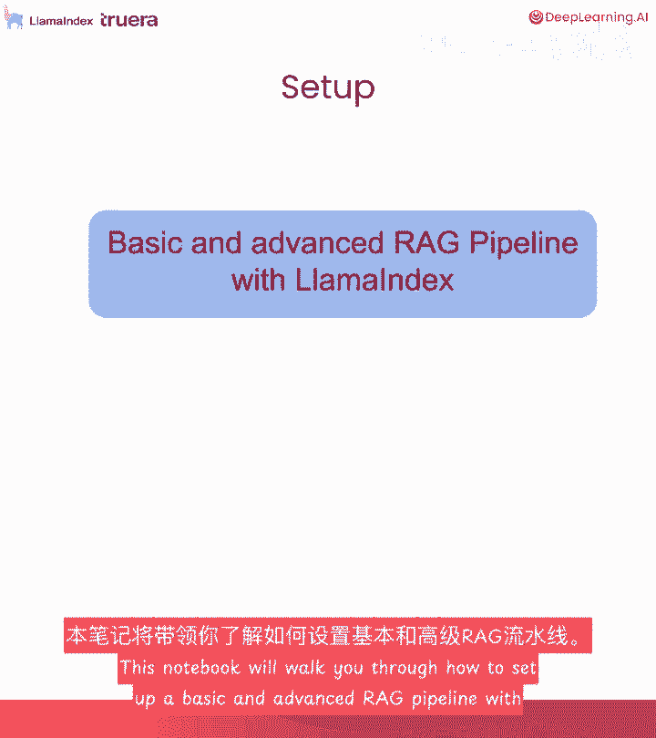

我们还将使用true ara来帮助设置评估基准，以便我们可以与基准进行改进测量。

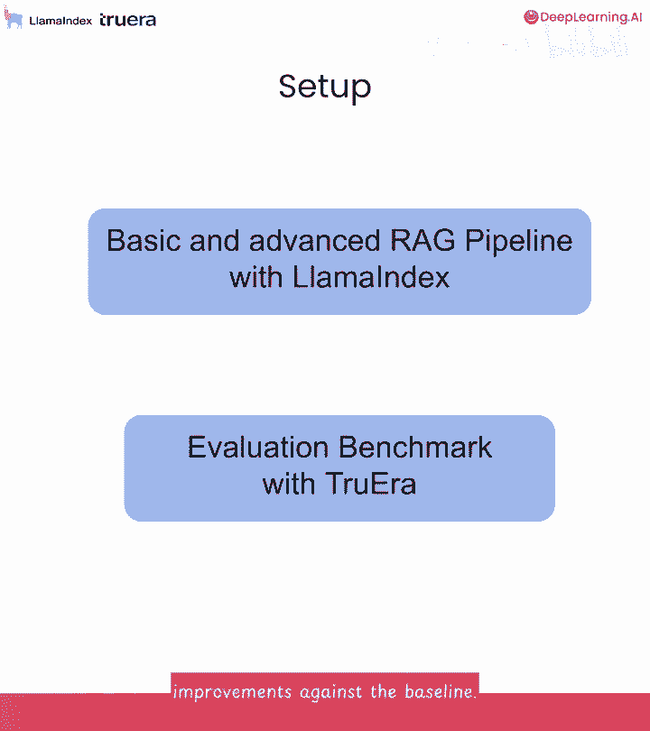

对于这个快速启动，您需要Open AI API，请注意，对于这个课程，我们将使用一组辅助函数来帮助您快速启动，我们将深入研究这些部分和未来的课程，接下来。

我们将创建一个简单的llm应用使用llama索引，它内部使用Open AI的llm，在数据源方面，我们将使用由Andrew编写的如何构建AI职业生涯的PDF，请注意。

您可以上传自己的PDF文件如果您愿意，嗯，对于这门课程，我们鼓励您这样做，让我们做一些基本的合理性跟踪，以了解文档的内容和长度，以及文档的长度，我们看到我们有一个文档列表，嗯，那里有41个元素，嗯。

那列表中的每个项都是一个文档对象，我们还将显示给定文档的一段文本片段。

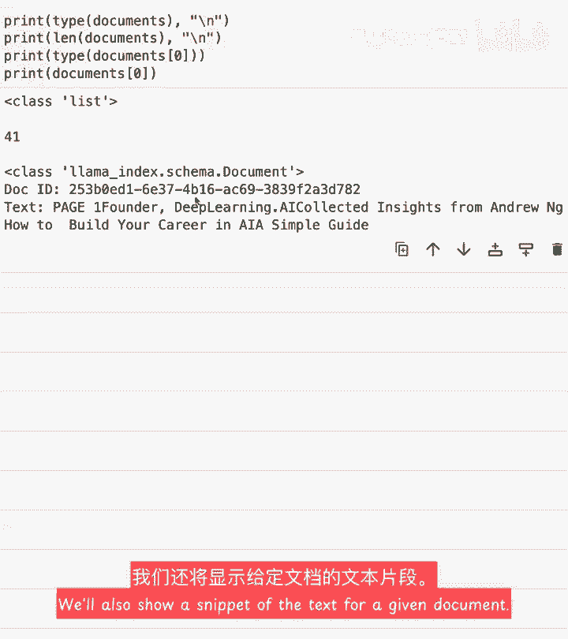

我们将将这些合并为一个单个文档，因为使用更先进的检索方法时，这可以帮助提高整体文本规划的准确性，例如，句子窗口检索以及自动合并检索，下一步是索引这些文档。

我们可以使用llama索引中的向量排序索引来完成此操作，接下来，我们定义一个服务上下文对象，它包含我们将要使用的和，以及我们将要使用的嵌入模型，The owl。

我们将使用的模型是来自Open AI的GBT 3。5 Turbo，然后，我们将使用的嵌入模型是Hugging Face的，Bg小模型。

这些步骤展示了数据摄取过程，我们已经在这里加载了文档，然后，从文档中提取向量，只需一行代码，我们做了分块，在底层使用您指定的嵌入模型进行嵌入和索引。

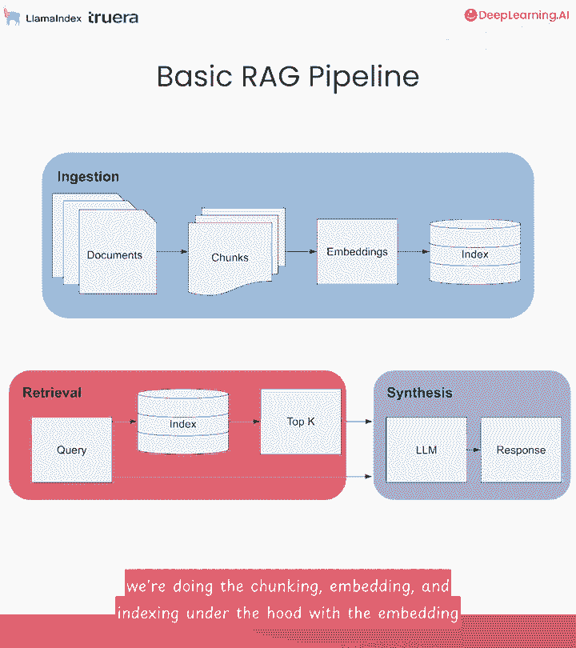

接下来，我们从这个索引中获得查询引擎，这允许我们发送用户查询，可以对这些数据进行检索和合成，让我们试试或者首先请求。

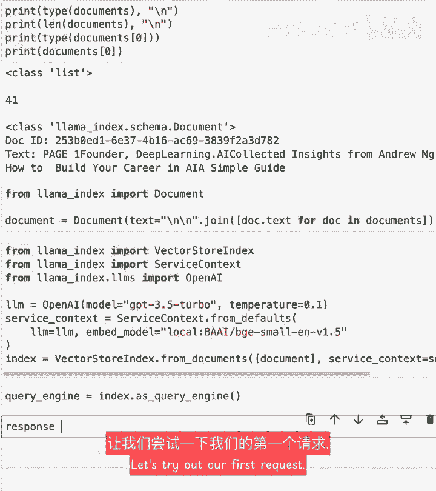

并且查询是找到项目以构建你的经验应该怎么做，让我们找它。

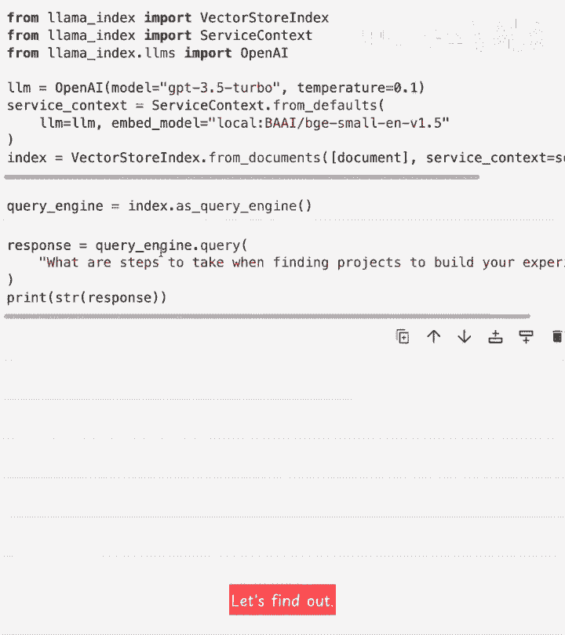

从小事做起，逐渐增加你项目的范围和复杂性，太好了，所以它正在工作，所以现在你已经设置了基本的拉格管道，下一步是设置一些对这个管道的评估，以了解它表现如何，这也将为定义我们的高级检索方法提供基础。

句子窗口检索器以及自动合并检索器，在这一部分，我们使用真镜头初始化反馈函数，我们初始化了一个辅助函数，获取反馈以返回一个评估我们应用的反馈函数列表，在这里我们创建了一个 rag 评估三角。

它由查询响应和上下文中的成对比较组成，因此，这实际上创建了三种不同的评估模型和相关性上下文、相关性和锚定性，答案相关性是响应是否与查询上下文相关，对于相关性，检索上下文是否与查询相关且锚定性，是。

响应是否由上下文支持，我们将在接下来的几篇笔记本中教你如何自己设置这个，我们首先需要创建的是测试我们应用程序的问题集，这里我们已经预先写了前十个，我们鼓励你添加到这个列表中。

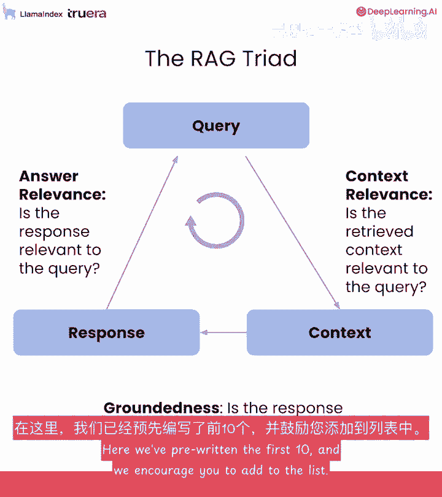

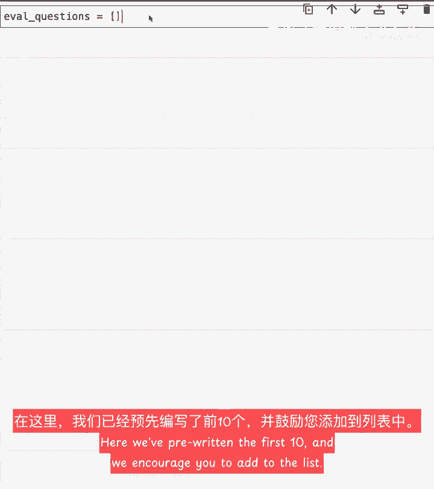

现在我们有一些评估函数，构建人工智能职业生涯的关键是什么，团队合作如何贡献于人工智能的成功等，我们首先需要创建的是测试我们应用程序的问题集，这里我们已经预先写了前十个，但我们也鼓励你添加到这个列表中。

这里我们指定一个有趣的新问题，什么样的人工智能工作适合我，但我们将其添加到评估问题列表中，现在，我们可以初始化真线模块来开始我们的评估过程。

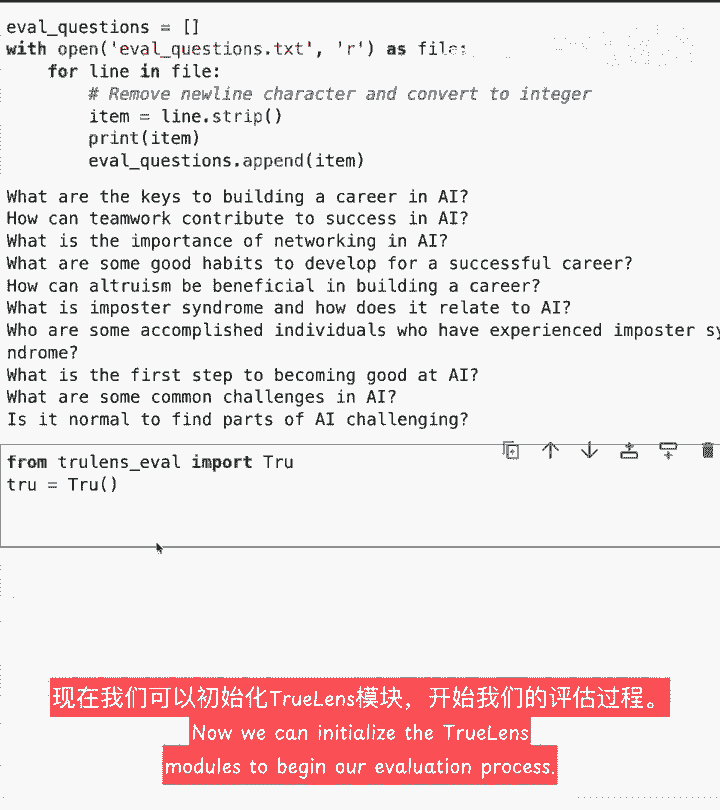

我们已经初始化了龟模块，现在，你已经重置了p，数据库，我们现在可以初始化我们的评估模块正在增长，作为一种标准机制，用于大规模评估生成式人工智能应用，而不是依赖昂贵的人类评估或预设基准。

允许我们以特定于我们操作的领域和动态适应我们应用需求变化的方式评估我们的应用，我们在其中操作，并且动态适应我们应用需求的变化，我们已经预先构建了一个真线记录器以供使用，对于这个例子，在记录器中。

我们包括了验证rag的标准三元组，基础性，上下文相关性，以及不相关性，我们还将指定一个ID，以便我们可以跟踪这个应用的版本，随着我们实验，我们可以通过简单地更改应用ID来跟踪新版本。

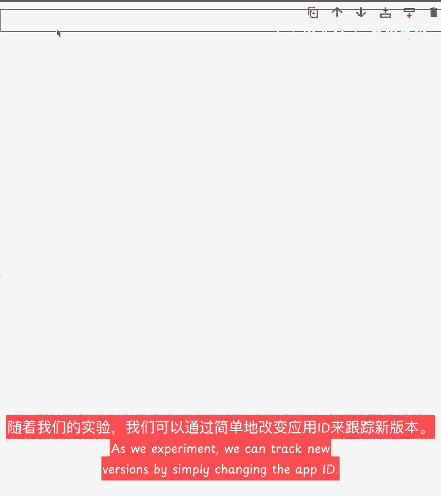

现在，我们可以再次运行查询引擎，使用真线上下文，所以，在这里，我们将每个查询发送到我们的查询引擎，在背景中，嗯，真线记录器正在评估我们的每个查询对这些三个指标，如果你看到一些警告消息。

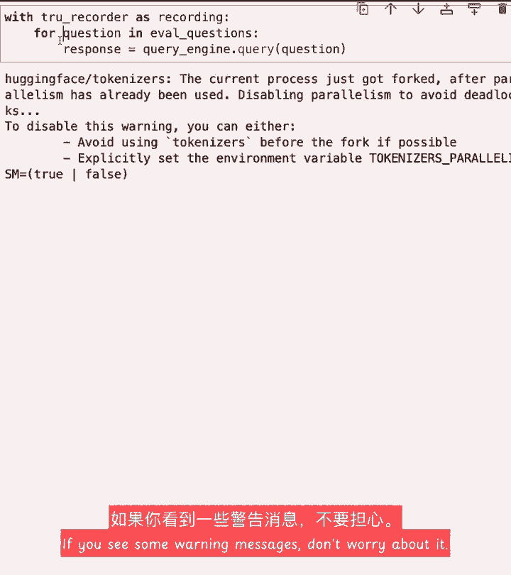

嗯，不要害怕它，嗯，一些只是依赖于的。

在这里，我们可以看到一组查询以及与他们相关的响应。

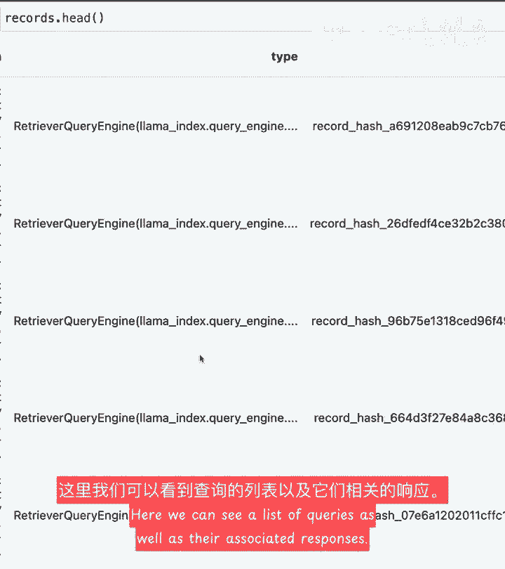

你可以看到输入输出，记录ID标签。

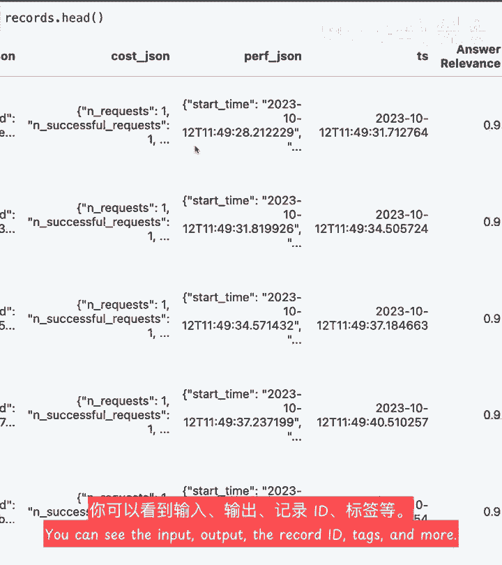

以及更多，你还可以看到随着相关性的联系，相关性和基础性对于每个rub在这个仪表板上。

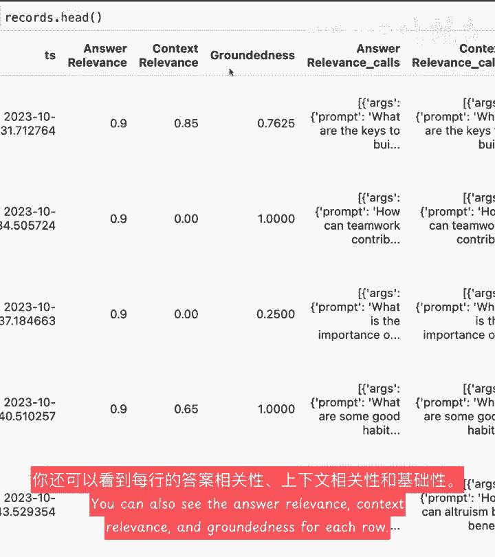

你可以看到你的评估指标，如上下文，相关性和不相关性以及基础性，以及平均延迟，总成本，以及更多，在这里，我们看到答案，相关性和基础性都相当高，但相关性的联系很低，现在。

让我们看看是否可以通过更先进的检索技术来改善这些指标，如句子窗口检索以及新兴检索。

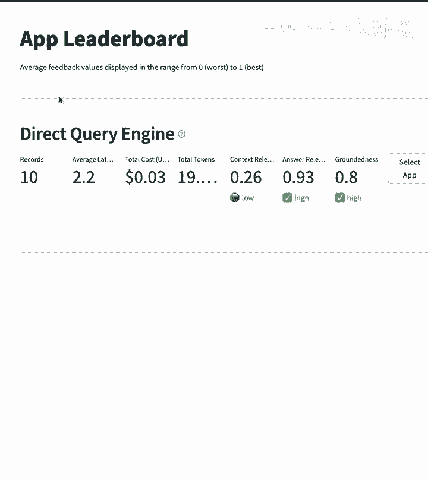

我们将首先讨论一种高级技术，即句子窗口检索，这通过嵌入和检索单个句子来实现，因此，更细粒度的树干，但在检索后，句子被替换为一个更大的句子窗口，围绕原始检索句子，直觉是。

这允许实验室对检索到的信息有更多的上下文，为了更好地回答查询，即使在检索更细粒度的信息时。

所以理想上是同时提高检索和合成性能，现在让我们看看如何设置它，首先我们将使用open ai gt three point five turbo，接下来，当我们索引过给定的文档时，我们将构建我们的句子。

这只是一个提醒，我们有一个帮助函数用于构建句子窗口索引，我们将深入探讨这如何在底层工作，接下来的几节课，与以前相似，我们将从句子窗口索引中获得查询引擎，现在，我们已经设置好了。

我们可以在这里尝试运行一个示例查询。

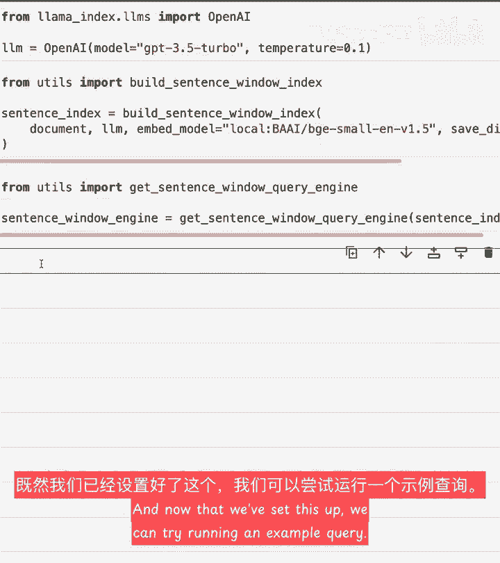

问题是如何开始在人工智能的个人项目中。

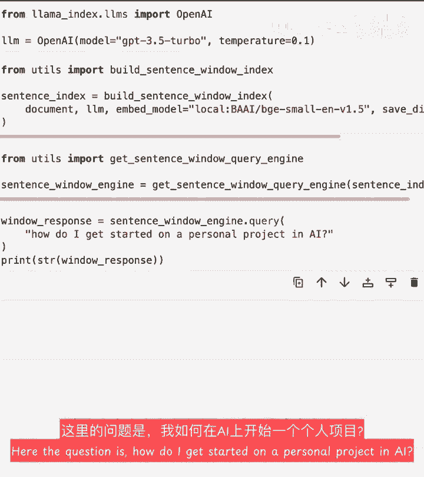

我们得到了开始个人项目的响应，在人工智能中，首先重要的是确定项目的伟大，与以前相似，让我们尝试获取真实的镜头评估上下文并尝试基准结果，所以这里我们导入真正的记录句子窗口。

这是一个为句子最终索引预建的真实线条记录器。

现在，我们将在评估问题之上运行句子窗口检索器，然后，将在评估模块的三角形中比较性能。

在这里，我们可以看到响应在运行时进来，一些问题和响应的例子，嗯，团队合作如何贡献到ai的成功，团队合作可以贡献到ai的成功，通过允许个体利用他们的同事的专业知识和见解，什么，网络在ai中的重要性。

网络在ai中很重要，因为它允许个人与该领域的经验丰富的人建立联系，现在我们已经对两种技术进行了评估，感觉很好，基本的rag管道以及句子窗口检索管道，让我们查看结果排名，看看发生了什么。

在这里，我们看到中国只有接地性，嗯，比基准高出几点百分比，按点和相关性排序的rag与上下文大致相同，相关性对于句子也更好，当搜索引擎延迟大致相同时，并且总成本更低，因为接地性和上下文元素更高。

但是总成本更低，我们可以直觉地认为句子窗口检索器实际上正在给我们提供更多的相关上下文。

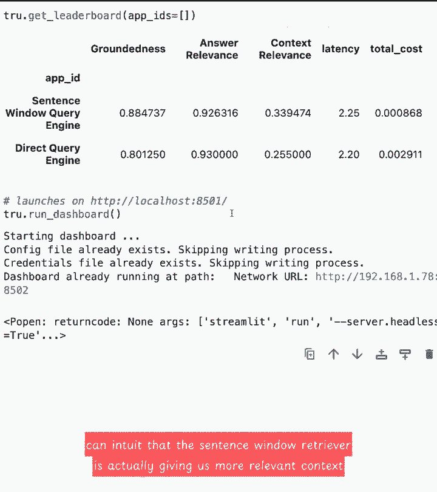

而且更有效地，当我们回到ui时，我们可以看到现在我们有一个直接查询和基线的比较，以及由上句生成的句子，并且我们可以看到我们在笔记本中看到的指标。

也在ui中显示，接下来我们要讨论的先进检索技术之一是自动合并检索器，在这里，我们构建了一个层次结构，其中较大的父节点包含较小的子节点，这些子节点引用父节点，所以，例如。

我们可能会有一个大小为512个标记的父节点，在它的下面有四个大小为1的子节点，两个包含8个标记的子节点，这些子节点链接到这个父节点，自动，合并检索器通过将检索节点合并为大的父节点来工作。

这意味着在检索过程中，如果父母实际上已经检索到了大多数其子节点，那么我们将替换子节点为父节点，因此，这可以使我们树节点的层次化合并。

所有子节点的组合与父节点的文本相同，类似于句子窗口检索器，以及接下来的几节课，我们将在这里更深入地探讨它如何工作，我们将向您展示如何使用我们的辅助函数来设置它，在这里我们再次构建了自动合并索引。

使用GBT3。5Turbo为LLM，除了BGU模型用于嵌入模型外，我们从自动合并检索器中获取了查询引擎。

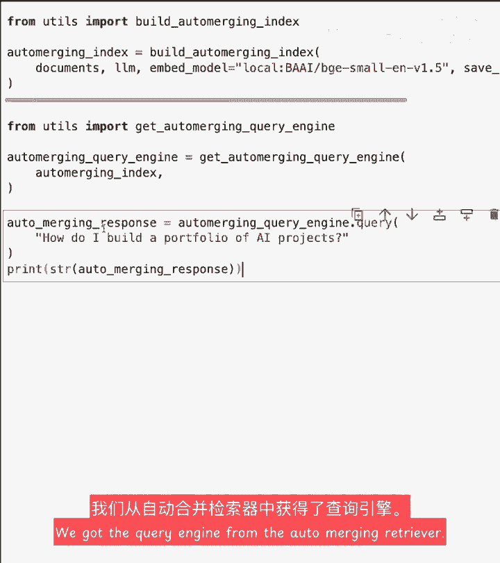

让我们尝试运行一个示例查询，如何在这里构建一个AI项目组合。

实际上，你看到合并过程正在进行中，或将节点合并为一个父节点，嗯，基本上要撤回父节点，与子节点相反。

以构建AI项目组合，开始以简单的任务，逐渐进展到更复杂的任务非常重要，所以我们看到它现在正在运行，让我们用真实的结果来 benchmark，我们在我们的自动重试上构建了一个预制的真实线条记录器。

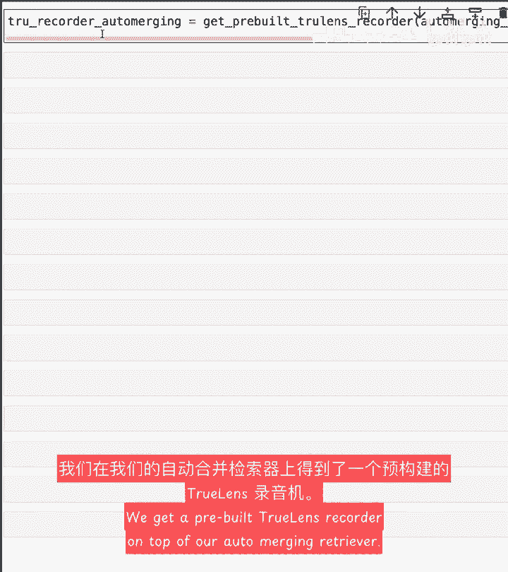

然后我们在我们的评估问题上运行自动合并重试器，上面有两个镜头。

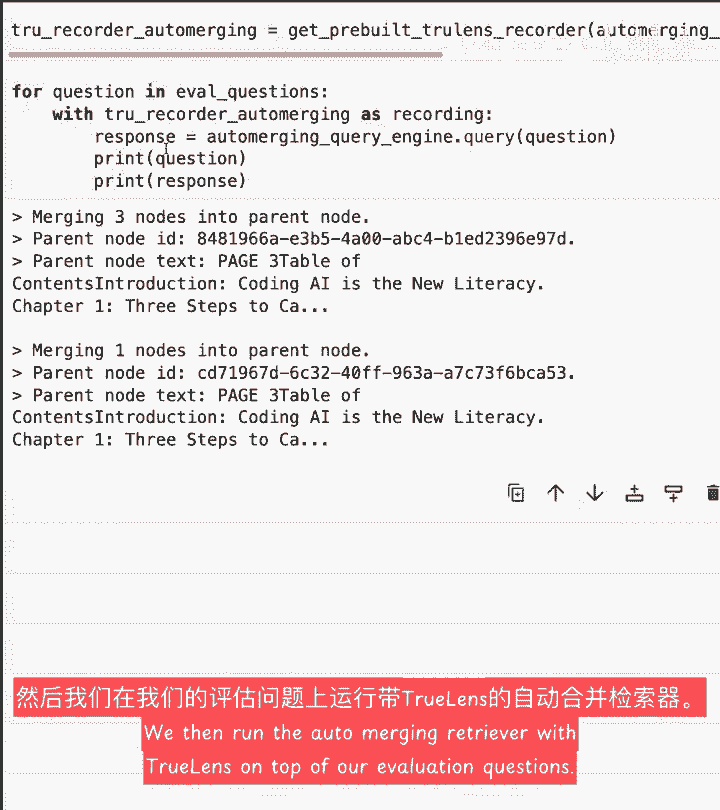

对于每个问题，您实际上可以看到合并过程正在进行中，例如，将三个节点合并为父节点，对于第一个问题，如果我们向下滚动一点点，我们可以看到对于这些其他问题中的一些，我们还在进行合并过程。

将三个节点合并到父节点中，将一个节点合并到paradoan中，示例问题响应对是什么是人工智能中的网络的重要性，在人工智能中，网络很重要，因为它帮助建立强大的专业网络社区。

现在我们已经运行了所有三种检索技术，基本的拉格管道，以及两种先进的检索方法。

我们可以查看一个全面的领导者板，以查看所有三种技术如何堆叠，对于自动查询引擎，我们得到了非常不错的结果，超过了评估问题，我们在地面性方面达到了百分之百，在相关性方面达到了九十四 percent。

大约四十，在相关性联系方面达到了百分之三，这高于句子窗口和基础架子管道，我们大约得到了与句子相同的总成本，我的引擎，这意味着在这里的检索效率更高，延迟相同。

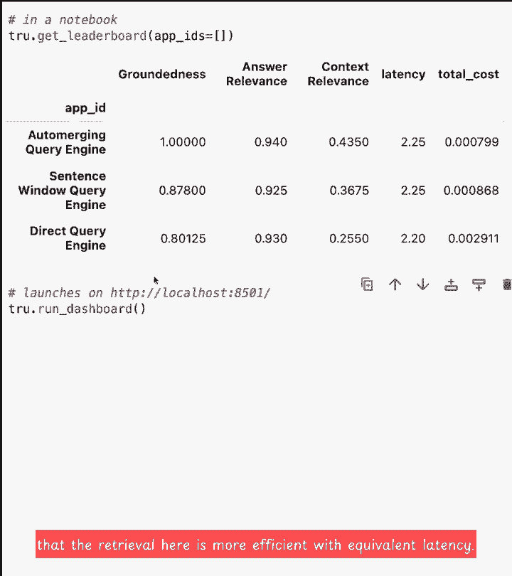

最后，你也可以在仪表板上查看此，这堂课，给您提供了如何设置基本和先进碎裂管道的综合概述，以及如何设置性能测量的评估模块，在下一节关于棕榈的课中，我们将深入研究这些评估模块，特别是碎裂，重力三角。

这个答案，无关性，和上下文相关性。

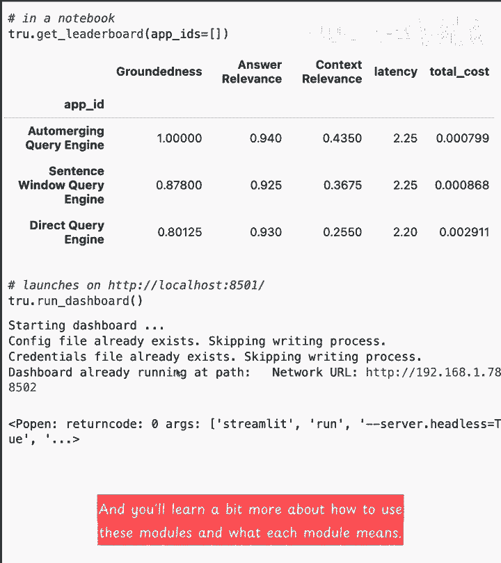