# (超爽中英!) 2024公认最全的【吴恩达大模型LLM】系列教程！附代码_LangChain_微调ChatGPT提示词_RAG模型应用_agent_生成式AI - P23：5. 第四篇 - 自动合并检索(Auto-merging Retrieval) 中英文字幕 - 吴恩达大模型 - BV1gLeueWE5N

在这节课中，我们将深入研究另一个高级拉格技术，自动重排。

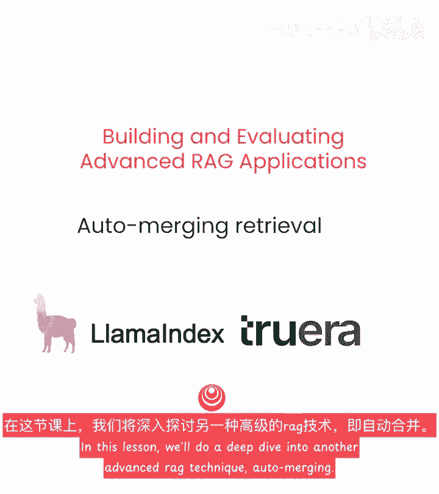

原始方法的问题，是你正在检索一堆碎片化的上下文块，以便将其放入lm上下文菜单中，碎片化更严重，在这里，如果你的块大小越小，我们使用自动合并启发式将较小的块合并为大的父块，以帮助确保上下文的连贯性。

让我们看看如何设置它，在这个部分，我们将讨论自动合并和检索，标准拉格管道的问题，是你正在检索一堆碎片化的上下文块，以便将其放入lm上下文窗口中，并且碎片化更严重，你的父块大小越小，例如。

你可能会返回两个或更多的检索父块，大致相同的部分，但实际上对这些块的顺序没有保证，这可能会阻碍专辑对这一检索上下文的合成能力，在它的上下文窗口中。

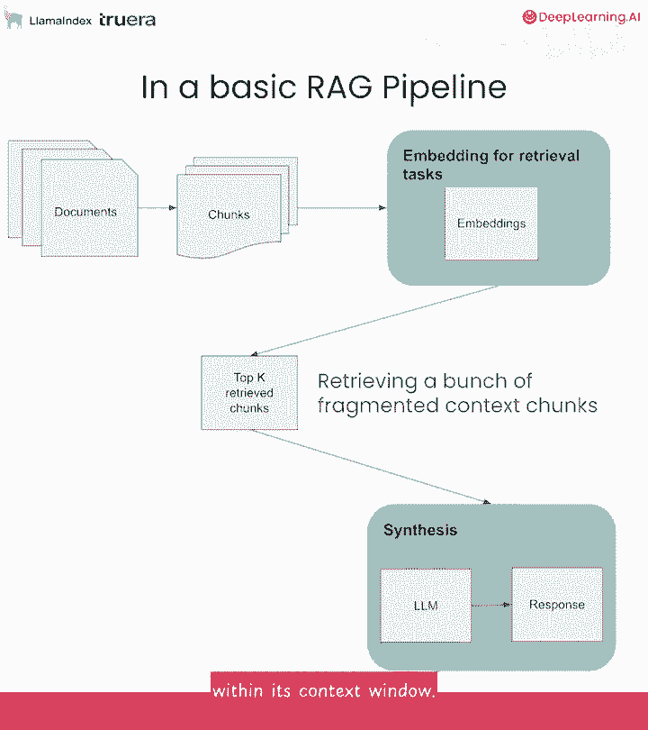

所以，自动合并检索做的事情是首先，找到连接更大父块的较小块层次，在检索时，每个父块可以有一些子块，如果连接到一个父块的较小块集超过了某个百分比阈值，那么我们将较小的块合并为大的父块，因此。

我们检索更大的父块来帮助确保更连贯的上下文，现在让我们看看如何设置它。

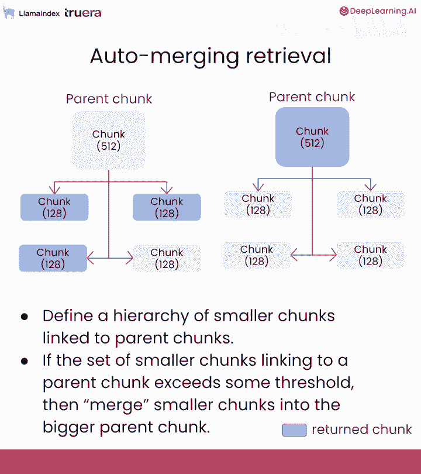

这个笔记本将介绍构建自动检索所需的各种组件，与llama索引一起，各个组件将详细覆盖，类似于之前的部分，最后，Monohan将展示如何实验参数和评估与真实错误相关的性能，类似于之前。

我们将加载openai api密钥，我们将使用我们utifile中的便利辅助函数来加载它。

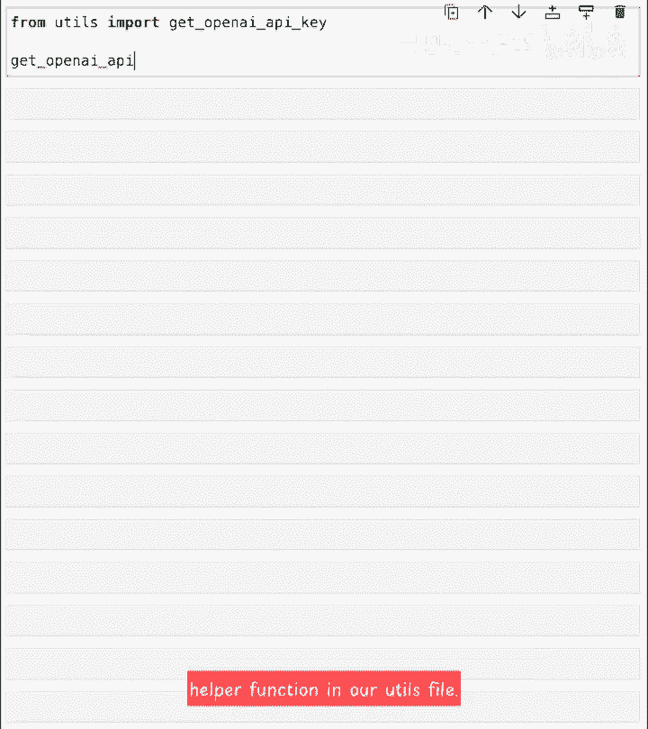

与之前的课程类似，我们还将使用如何构建人工智能职业生涯的pdf，与之前类似，我们鼓励您尝试自己的文件。

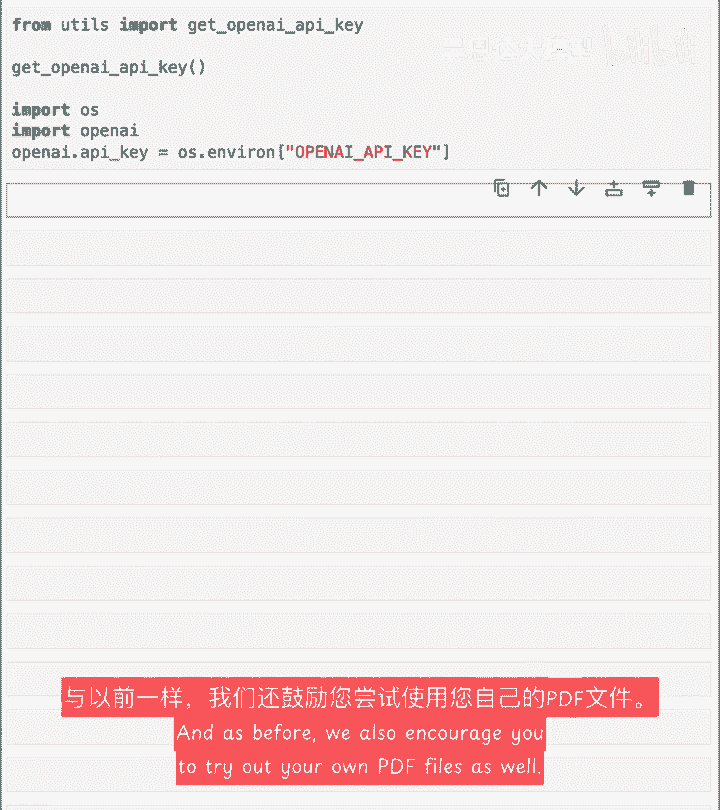

我们加载四个文档对象，并将它们合并为一个大型文档，这使得我们更适应于文本，与我们的高级检索方法混合。

我们现在准备好设置我们的自动合并重排器，这将包括几个不同的部分，第一步是定义我们称为层次节点解析器的东西，为了使用自动合并检索器，我们需要按照层次化的方式解析我们的节点。

这意味着节点被解析并按减小的尺寸排序，并包含对其父节点关系的引用，在这里，我们将演示节点解析器如何与一个小例子一起工作。

我们创建了一个玩具解析器，使用小块大小来演示，请注意，我们使用的块大小是二，四，八，五，十二，和一二八，你可以更改树干大小为任何你喜欢的递减顺序，我们以四倍因子来做这件事，现在让我们从文档中获取音符集。

这实际上返回所有有关节点，这返回所有叶节点，中间节点，以及父节点，有，所以，叶节点、中间节点和父节点之间将有相当程度的信息内容和重叠，中间和父节点，如果我们只想检索叶子节点。

我们可以在lama索引中调用一个函数，称为间隙叶子节点，我们可以看看那看起来什么样子。

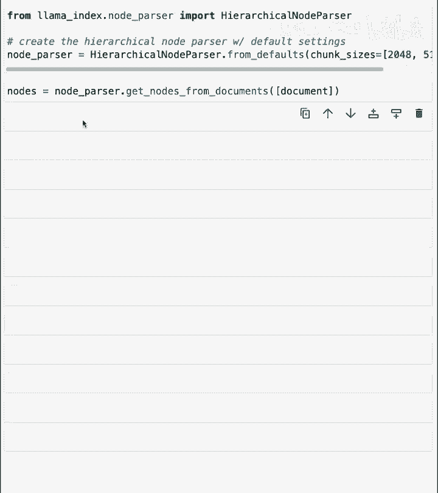

在这个例子中，我们在原始节点的集合中调用叶子节点，我们查看第三十一个节点以查看文本，我们看到文本主干实际上相当小，这是一个叶子节点的例子，因为叶子节点是最小的一块大小为一百二十八个标记。

这就是你如何增强数学背景的方法，为了找出你需要知道的重要内容，现在我们已经展示了叶节点的样子，我们也可以探索世界之间的关系，我们可以打印出上述节点的父节点，并观察到它是包含叶节点文本的更大部分。

但也更更具体地，父节点包含512个标记，而具有包含128个标记的4个叶节点。

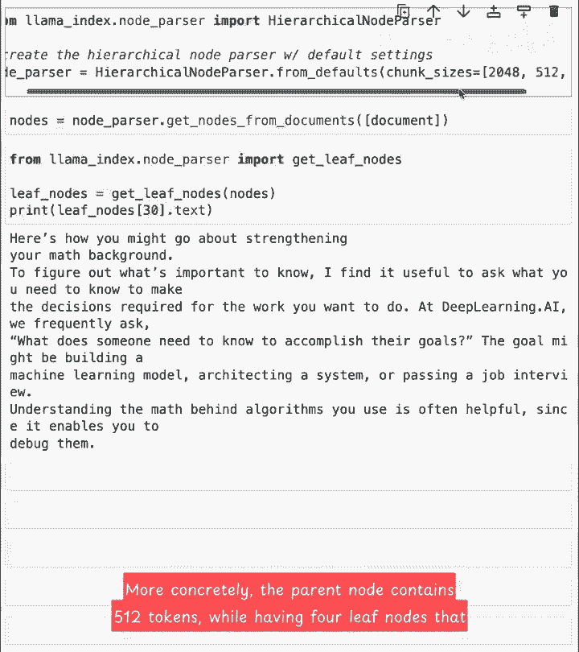

有4个叶节点，因为每次树干大小都被一个因子四分开，这是第三十一叶节点的父节点看起来的样子，现在我们已经展示了节点的层次结构，我们现在可以构建我们的索引，我们将使用openai lone。

特别是gpt t three point five turbo，我们还将定义一个包含l one嵌入模型的服务上下文对象，以及层次化节点解析器，与前面的笔记本一样，我们将使用bg small和嵌入模型。

下一步是构建我们的索引，"索引的工作方式是，我们实际上在叶子节点上构建一个向量索引"。"所有其他中间节点和父节点都被存储在启动坞中"，"并在检索时动态地检索"，"但实际上。

我们在最初的顶部抓取的是什么"，"K嵌入查找特指叶节点"，"这就是我们在这个代码中定义的存储联系人对象的嵌入方式。"。

"默认情况下，它被初始化为内存文档存储"，"我们称存储联系人为码头存储点"。"向内存文档存储中添加文档，以添加所有这个存储的所有节点"，然而，当我们在这里创建我们的向量存储索引，叫做自动合并索引时。

我们只传递向量索引的叶节点，这意味着特别是叶节点使用嵌入模型嵌入，并且也进行了索引，但我们也传递了存储上下文以及服务上下文，因此，向量索引知道包含所有节点的底层存储。

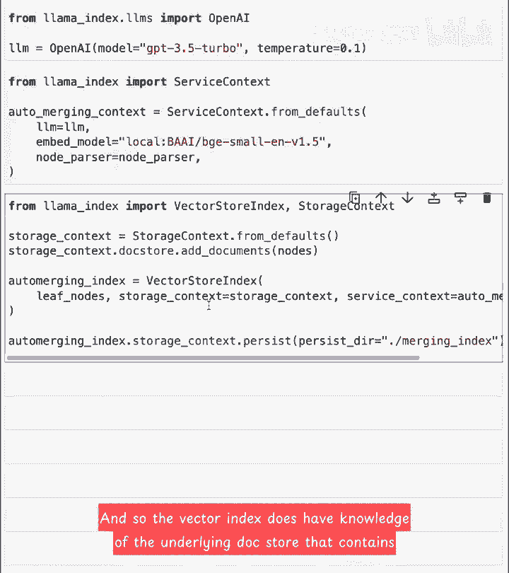

最后，我们持久化这个索引，如果你已经构建了这个索引，并且想要从存储中加载它，你可以只是复制和粘贴这段代码，这将重建索引。

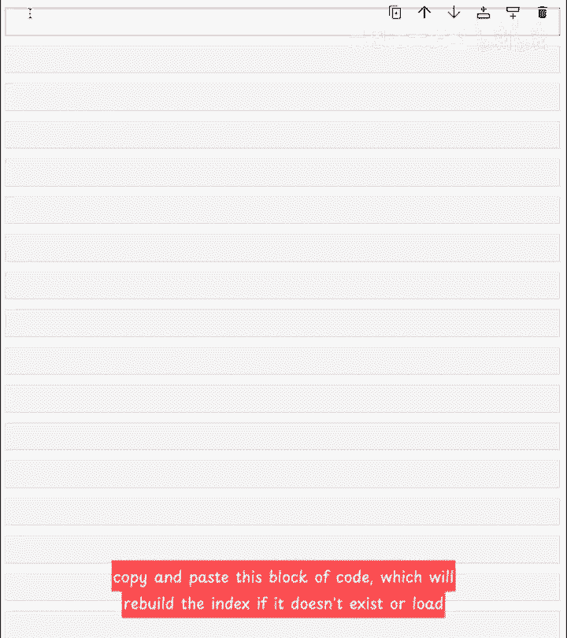

如果它不存在，就从存储中加载它，最后一步，现在我们已经定义了自动合并索引，是设置检索器和运行查询引擎，自动合并检索器控制着涌现的逻辑，如果给定父母的子节点被大多数检索出来，它们将被替换为父母，相反。

为了使这种合并工作良好，我们为叶节点设置了一个大的top k，并记住叶节点也有一个较小的块大小为一二八，为了减少标记使用，在合并完成后，我们应用一个重新排序器，例如，我们可能会检索前十二个合并。

并将结果限制为前十个，然后重新排序为前六个，重新排序器的顶部可能看起来更大，但请记住，基础的块大小只有一百二十八个标记。

然后，位于那个之上的下一个父级是五百十二个标记，我们导入了一个名为自动版本检索的类，然后，我们定义了一个句子变换重新排序模块，我们将自动合并检索器和重写模块结合在一起，集成到我们的检索查询引擎中。

它处理检索和合成。

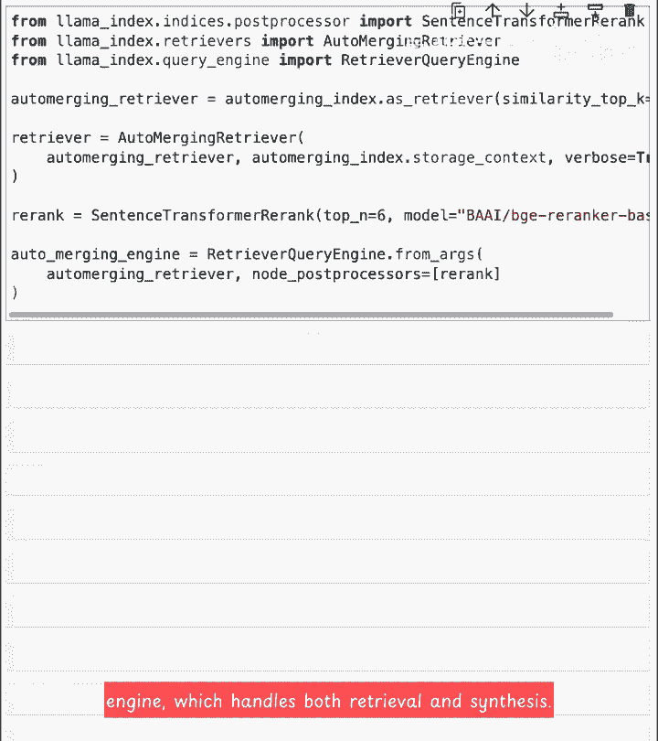

现在，我们已经设置好了所有这些，并且要添加，让我们实际测试网络和AI的重要性，例如问题，我们得到了一个响应。

我们看到它说网络在AI中很重要，因为它允许个人有一个强大的专业网络，下一步是把所有的都放在一起。

"我们将创建两个高级函数，用于自动合并索引。"，"除了那个自动合并查询引擎之外"，"这基本上捕获了我们刚刚向你展示的所有步骤"，"并首先构建自动合并索引的功能"。

"我们将使用层次节点解析器来解析出子节点的层次结构。"，"向父节点"，"将挑战服务环境"，"我们将从叶节点创建向量存储的索引"，"但也链接到所有节点的文档存储"。

"第二个功能自动合并查询引擎利用我们的自动合并检索器"，能够动态地将叶子节点合并到父节点中，并且使用我们的排名模块，然后将其与整体重试查询引擎结合，因此，我们使用构建自动合并索引函数来构建索引。

使用原始来源股票比特，lm设置为大于等于3。5涡轮。

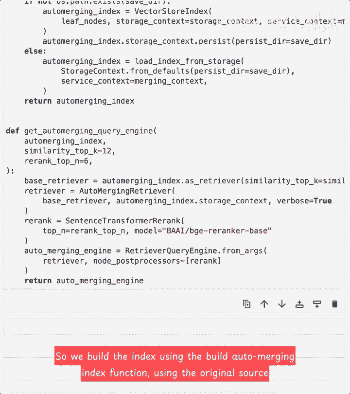

以及合并索引作为保存目录，然后对于查询引擎，我们调用基于索引的获取自动查询引擎，以及我们设置相似度top k等于6，下一步，pop将展示如何评估自动合并检索器，并且迭代参数使用tri。

我们鼓励你也尝试自己提出问题，并且迭代自动合并或检索的参数，例如，当你改变主干大小时发生什么，或者top k或top end对于重新排序，玩一玩，看看结果是什么，杰里，真的很棒。

现在，你已经设置了自动合并检索器，让我们看看如何用拉格三角来评估它，并与基本拉格进行实验跟踪的比较，让我们设置这个自动合并的新索引，你会注意到它有两层，最底层的块，叶节点将具有512块的大小。

在层次结构中的上一层是2488块的大小，这意味着每个父节点将有四个512标记的叶节点，设置这个的其他部分与杰里 earlier 向你展示的完全相同，你可能想要尝试两层或新兴结构的一个原因，是它更简单。

创建索引所需的工作更少，以及在检索步骤中，工作量需要的更少，因为如果第三层检查性能相似，它就可以消失，然后理想情况下，我们希望与一个更简单的结构工作，现在，我们已经使用两层或合并结构创建了索引。

让我们为这个设置设置自动合并引擎，我保持顶部k的值与以前相同，这是十二，并且重新排序步骤也将有相同的，一个相等的六，这将让我们能够更直接地比较这个应用设置，并且杰瑞之前设置的三层合并层次应用。

现在让我们使用自动合并引擎设置真正的记录器，我们将给这个应用一个想法，即应用零。

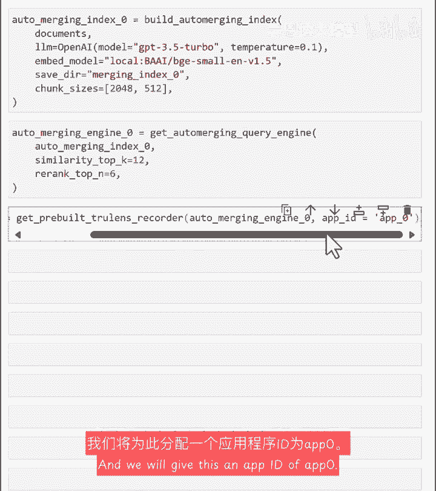

现在让我们加载一些评估问题，我们从之前设置的生成问题点文本文件中加载，现在我们可以为每个问题定义这些评估问题的运行，在大约问题中，我们将设置一些事情，以便真正的记录器对象。

当使用rannie alls调用时，我们将记录提示，响应和评估结果，利用查询引擎。

现在，我们的评估已经完成，让我们看一下排行榜。

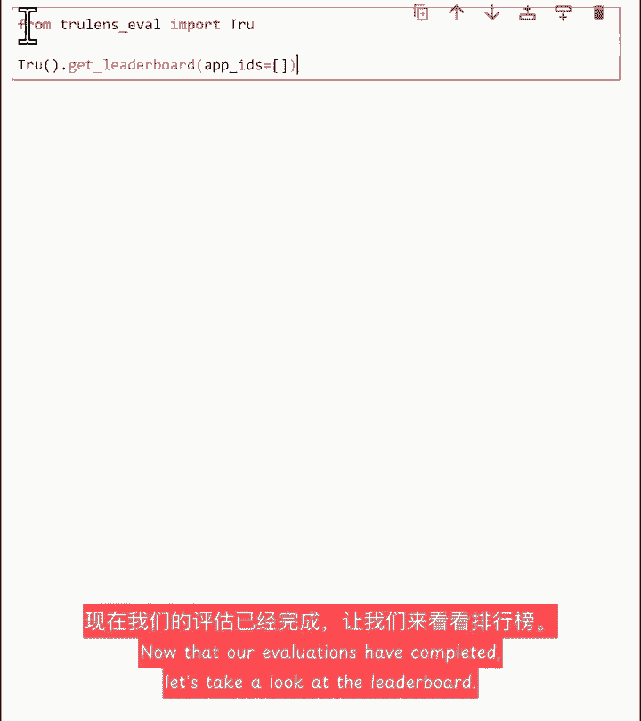

我们可以在这里看到应用零的指标，上下文相关性似乎较慢，其他两个指标更好，这是用我们的两级层次，以512作为叶节点块大小，并且父节点为2048个标记，所以对于叶节点无错误标记。

现在我们可以运行真正的仪表板，并查看，记录级别的评估结果在细节层次下一层。

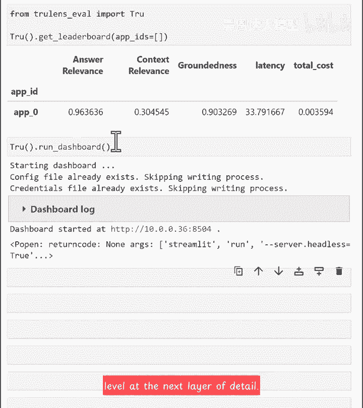

让我们查看应用排行榜。

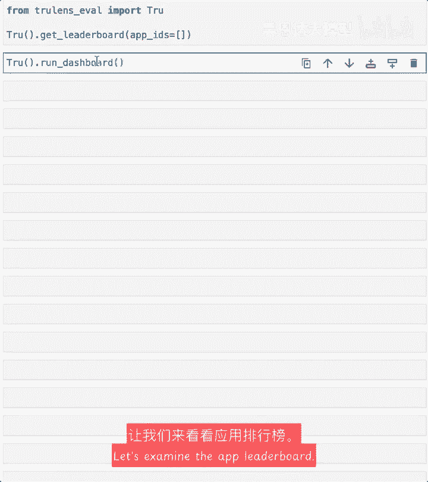

在这里，处理24个记录后，聚合级别的上下文相关性非常低，尽管应用在无关性和锚定性方面做得更好，我可以选择应用。

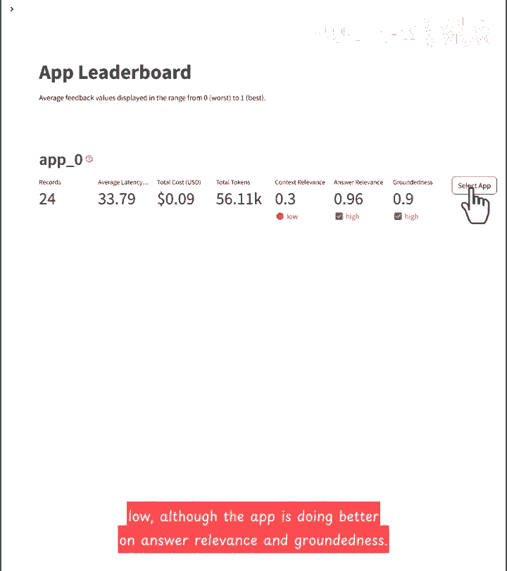

现在让我们看应用零的个别记录，并查看各种记录的评估得分，你可以在这里滚动到右侧并查看答案相关性、上下文相关性和锚定性的得分，让我们选择上下文相关性低的记录，所以这里有一个，如果你点击它。

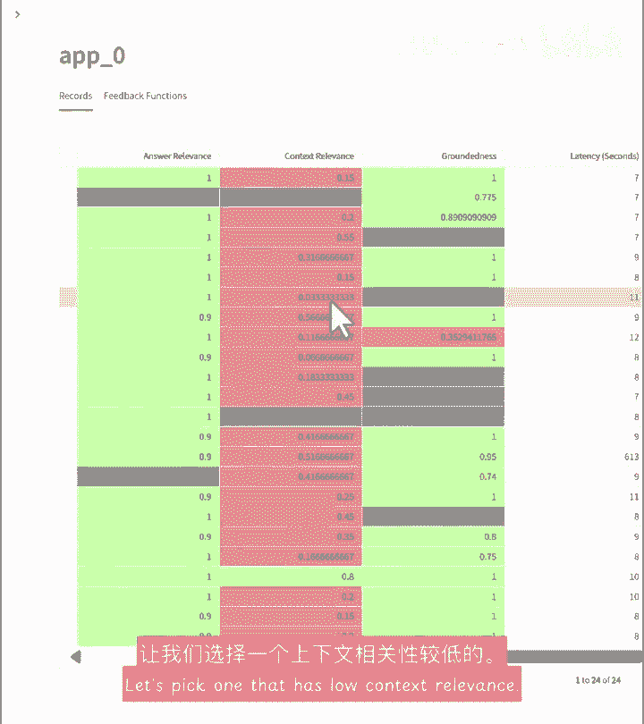

你会看到更详细的视图，问题下方讨论的详细信息是。

预算对资源管理的重要性，在这里是成功执行ai项目的响应。

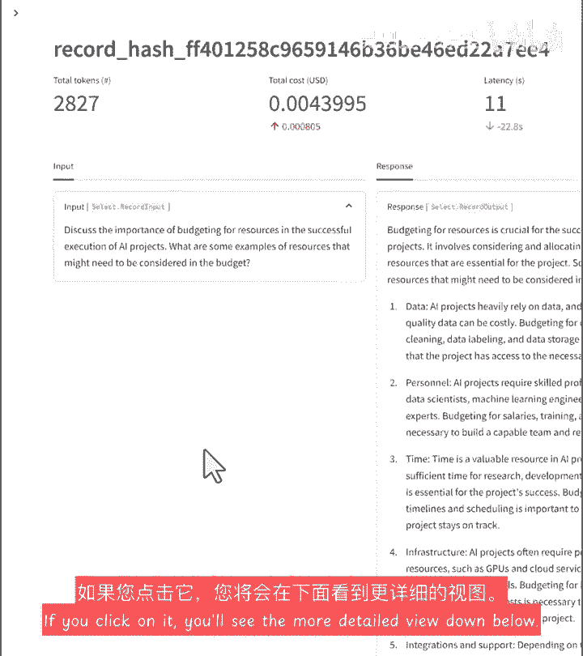

如果你往下滚动，你可以看到上下文相关性的更详细视图。

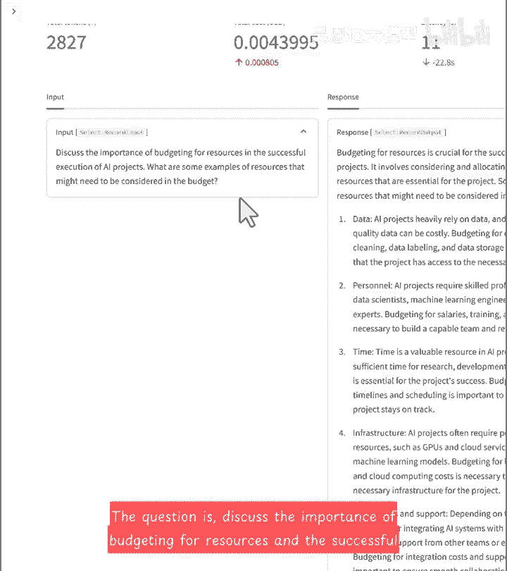

有六篇检索上下文。

每个都被评分为在评估得分中特别低，介于零和0。2之间，如果你选择任何一项并点击它，你会看到对提出的问题不特别相关的响应，你也可以向上滚动并探索一些其他记录，你可以选择，例如，得分好的分数。

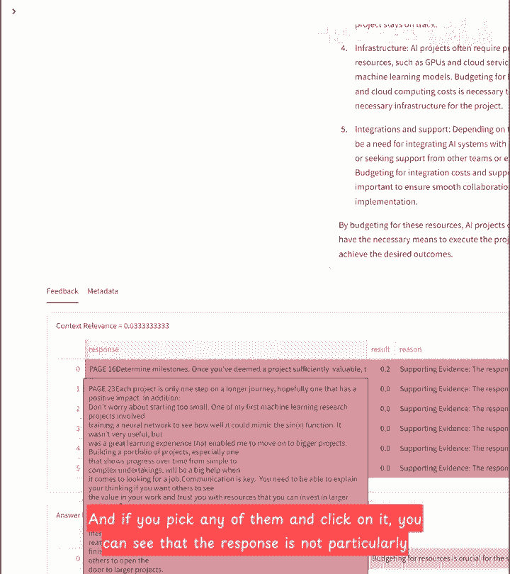

你可以向上滚动并探索一些其他记录，你可以选择，例如，得分高的分数，像这样一个，探索一下'如何'这个应用。

在各个问题上的表现如何。

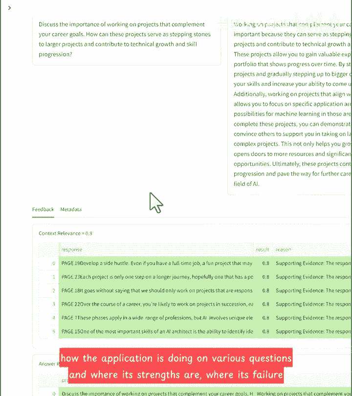

以及它的优势在哪里，它的失败模式在哪里，以便建立一些关于什么在起作用的直觉。

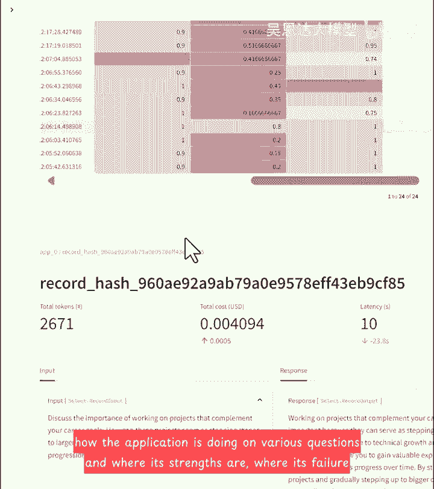

以及什么不在起作用，现在让我们比较之前的应用与杰里 earlier 引入的秋季合并设置。

我们现在将在层次结构中添有三层，从叶节点的级别开始，以一到八个标记符，所以，在每个层次中，每个父母有四个孩子，现在让我们为这个应用设置查询引擎，设置，真正的记录者，与前一个应用相同的所有步骤。

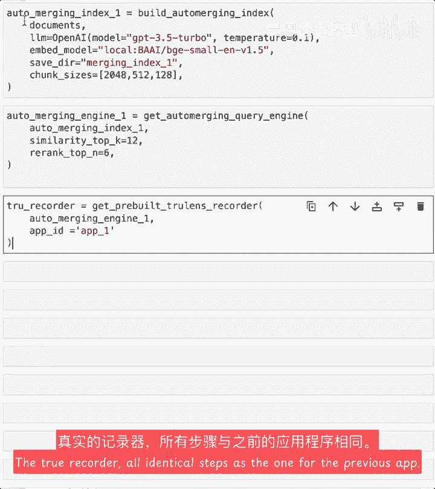

最后，我们处于运行评估的位置。

现在我们有一个设置好了。

我们可以在这里快速查看排行榜，你可以看到相对于f零，应用一在记录数相同的情况下处理的标记数大约是一半，而且总成本也大约是一半，这是因为记住这有三层在层次结构中。

而且块大小是一百二十八个标记而不是五百十二，这是ab零的最小叶节点标记大小，所以这导致了成本降低通知，而且上下文相关性增加了大约百分之二十，部分原因是这是因为，这个。

很可能在这个新的app设置中做得更好，我们还可以深入挖掘并详细查看app一。

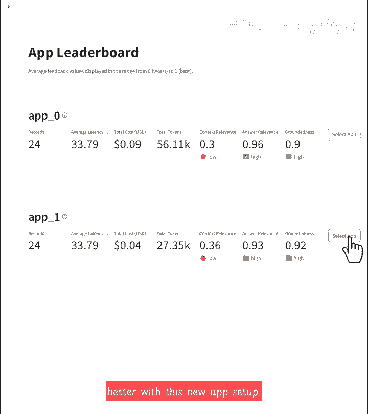

像以前，我们可以查看单个记录，让我们选择之前看过的同一个，零号标签是关于预算重要性的问题。

现在，你可以看到上下文相关性做得更好，扎根性也显著提高，如果你在这里选择一个样本示例响应，你会发现实际上它正在非常具体地谈论为资源预算，所以，这种情况有所改善，而且在总体水平上也有改善，现在。

我将总结一些关键要点，来自第四课，我们带领你通过了一种评估和迭代与自动检索的方法，高级拉格技术，特别是我们展示了如何与不同层次的结构迭代，层次的数量，子节点的数量和块大小，对于这些不同版本，你可以。

你可以用拉格来评估它们，通过三角和跟踪实验来选择最适合您用例的结构，需要注意的是，你不仅会得到与三段式相关的指标作为评估的一部分，而且对记录级别的深入分析。

可以帮助你获得关于与某些文档类型最兼容的超参数有什么样的直觉，例如，根据文档的性质，如雇佣合同与发票，你可能发现不同的分块大小和层次结构，最适合，最后，还要注意的是自动合并与句子窗口检索是互补的。

一种思考方式是，假设你有一个具有自动合并的父节点的四个子节点，你可能发现，孩子编号一和孩子编号四对于查询非常相关，被问到的那个，然后这些就会被合并在自动合并范式下，相比之下。

句子窗口化可能不会导致这种合并，因为它们不在文本的连续部分中，这就结束了第四课，我们观察到，使用高级架子技术如句子窗口化和自动合并等，检索，增强评价和实验跟踪迭代的力量，你可以显著提高你的拉格应用。

此外。

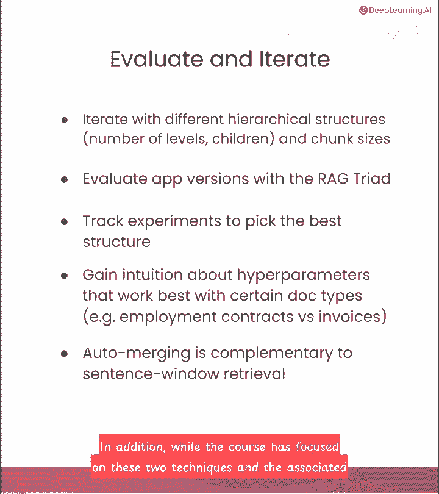

尽管课程主要专注于这些两种技术和与之相关的拖拽三角进行评估，你还可以玩一些其他的评估，为了确保你的llm应用诚实，无害且健康，这一页列出了一些在真镜头中可用的一些，我们鼓励你去玩真镜头，探索笔记本。

