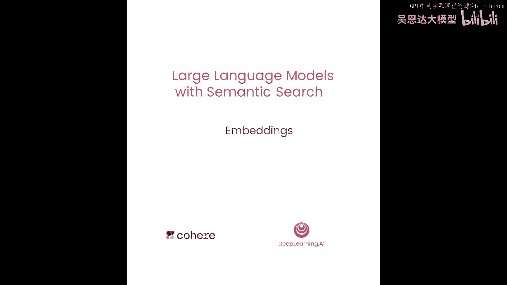
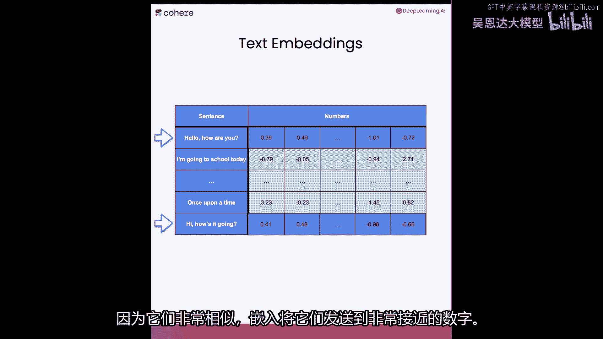
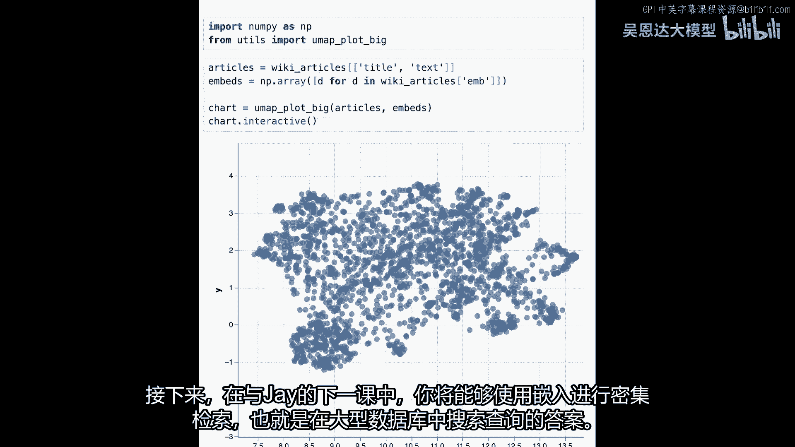

# (超爽中英!) 2024公认最全的【吴恩达大模型LLM】系列教程！附代码_LangChain_微调ChatGPT提示词_RAG模型应用_agent_生成式AI - P94：3.L2-embedding.zh - 吴恩达大模型 - BV1gLeueWE5N

欢迎来到第2课，本课将学习嵌入，嵌入是文本的数值表示，计算机更容易处理，它们是大型语言模型最重要的组件之一。

让我们从嵌入层开始，这段代码将帮助我们加载现在需要的所有API密钥，在课堂上，这些都为你做好了，但如果你想自己做，你需要pip，安装一些包，例如，连贯的，一个，其他你需要安装的包用于可视化，是你地图。

学习，Altire和维基百科数据集，数据集，我将注释这行，因为我不需要在课堂上运行它，接下来导入连贯性库，连贯性库是一个使用大型语言模型的函数的广泛库，它们可以通过API调用，在本课中。

我们将使用嵌入函数，但还有其他函数，如生成函数，你将在课程后期使用，下一步是使用API密钥创建连贯性客户端，首先让我告诉你这里的嵌入是什么，我们有一个带有水平和垂直轴的网格和坐标。

我们有一堆单词位于这个网格中，如你所见，根据这些单词的位置，你会把苹果放在哪里，如你所见在这个嵌入中，相似单词被分组在一起，左上角是运动，左下角是房屋、建筑和城堡，右下角是车辆，如自行车和汽车。

右上角是水果，所以苹果将放在水果中，苹果这里的坐标是5，5，因为我们正在将表格中的每个单词，关联到两个数字，水平和垂直坐标，这是一个嵌入，现在这种嵌入将每个单词发送到两个数字。

通常嵌入会将单词发送到更多数字，我们会有所有可能单词，实践中使用的嵌入可发送单词至数百个不同数字，甚至数千，现在导入名为pandas的包，我们称其为pd，Pandas擅长处理表格数据。

我们将使用的第一个表格数据非常小，它有三个单词，单词joy，单词happiness和单词potato，您可在此处看到，下一步是创建嵌入，对于这三个单词，我们将它们称为三个单词m，并创建嵌入。

我们将调用cohere函数，Embed，Embed函数接受一些输入，我们想嵌入的数据集，称为three words for此表格，我们还需要指定列，称为text。

接下来我们指定要使用的coherent模型，最后我们从那里提取嵌入，所以现在我们有三个单词，嵌入，现在让我们看看与每个单词相关联的向量，与单词joy相关联的，我们将称之为word one。

我们获取它的方式是查看three words m并获取第一行，现在我们将对work two和word three做同样的事情，它们是与单词happiness和potato对应的向量，出于好奇。

让我们看看与单词joy相关联的向量的前十个条目，那将是word one，一直到十，现在嵌入不仅适用于单词，它们还可以适用于更长的文本片段，实际上它可以是非常长的文本片段，在这个例子中。

这里我们有句子的嵌入，句子被发送到一个向量或数字列表，请注意，第一个句子是hello，How are you，最后一个词是hi，How's it going，它们没有相同的单词，但它们非常相似。

因为它们非常相似，嵌入将它们发送至非常接近的两个数字，现在让我向您展示一个嵌入示例。

首先我们将不得不导入pandas作为pd，Pandas是一个用于处理表格数据的库，它处理表格数据，接下来看小数据集，共8个句子，如你所见，它们不完整，每个都是前一个的答案，例如，天空什么颜色。

天空是蓝色，白色是苹果，苹果是一种水果，现在绘制嵌入，看哪些句子相近或相远，为将这些句子转为嵌入，将使用coher的嵌入函数，将此表称为m，将端点代码称为embed，该函数将给出所有嵌入。

它接受一些输入，第一个输入是要嵌入的句子表，表称为sentences，必须指定列，这称为文本，下一个输入是模型名称，最后从函数输出提取嵌入，该函数将给出每个句子的数字列表，查看嵌入的前10项。

每个前3个句子，它们现在在这里，每个句子有多少数字，在这种情况下，是4996，但不同嵌入长度不同，现在可视化此嵌入，将调用util中的umap plot函数。

Yuma plot使用umap和altair包，生成此处的图表，注意，此图表给出8个成对的点，让我们看看这些对是什么，这只熊住在森林里，最近的句子是，熊住在哪里，这很合理，因为它们是非常相似的句子。

看这两个，这里我们有，苹果是什么？苹果是一种水果，这里我们有，世界杯在哪里？世界杯在卡塔尔，这里天空是什么颜色？天空是蓝色，所以，如你所见，嵌入，将相似句子放在附近点，将不同句子放在远离的点。

注意非常特别的东西，最接近问题的句子是其特定答案，因此理论上可用此找问题答案，通过搜索最接近的句子，这实际上是密集检索的基础，Jay将在下一视频中教你，现在可以添加更多句子或完全更改这些句子。

然后绘制嵌入并查看其外观，现在知道如何嵌入8个句子的小数据集，让我们对大型数据集这样做，我们将与维基百科文章的大型数据集合作，让我们加载以下数据集，它包含许多带有标题的文章，第一段文本及其嵌入。

它有两千篇文章，我们将导入numpy和一个将帮助我们可视化此图的功能，非常类似于上一个，我们将它降维到二维，以便我们可以看到它，嵌入在这里，注意相似的文章在相似的地方，例如。

在这里你可以找到许多语言和国家，在这里你将找到许多国王和王后，在这里你将找到许多足球运动员，在这里你将找到艺术家，随意探索此嵌入并尝试找到主题的位置，关于嵌入就这些了，在下一节与J的课程中。

你将能够使用嵌入进行密集检索。

