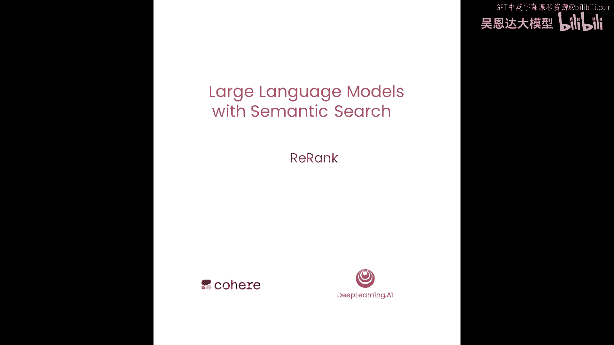
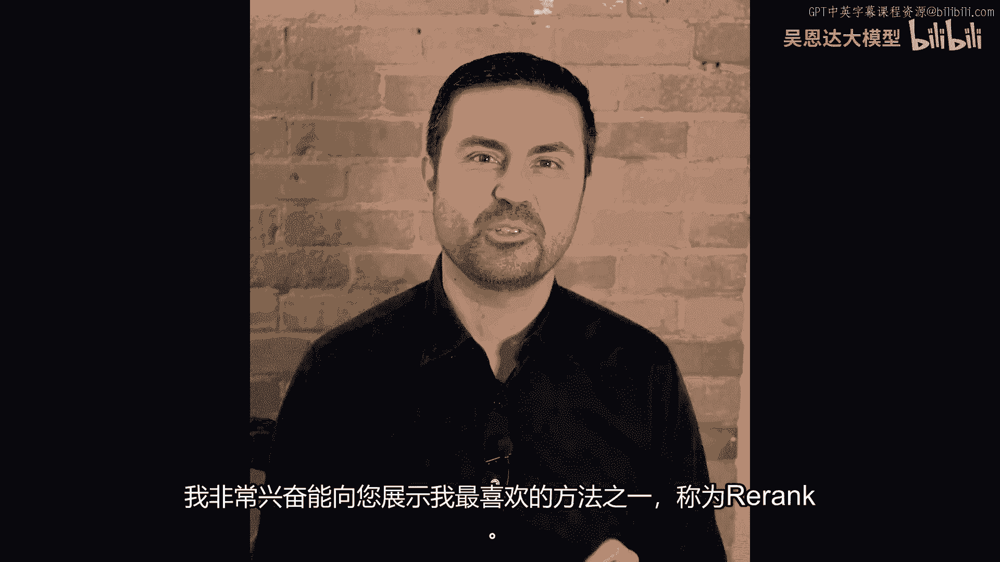
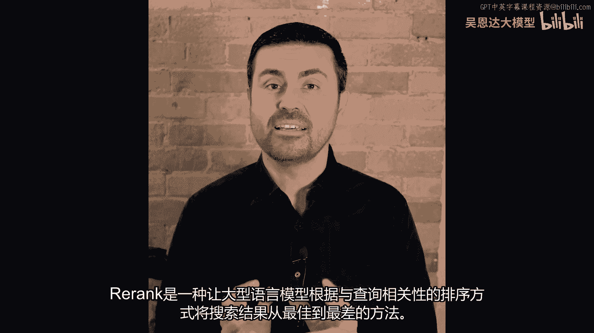
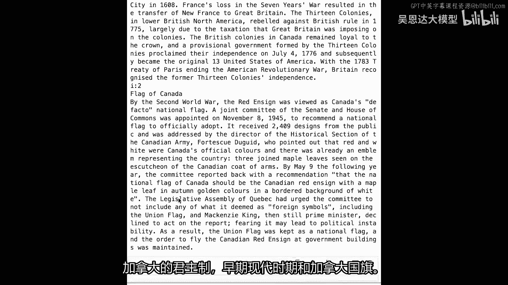
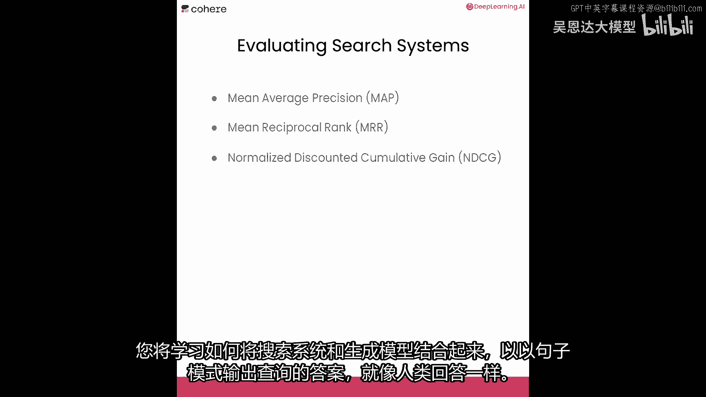

# (超爽中英!) 2024公认最全的【吴恩达大模型LLM】系列教程！附代码_LangChain_微调ChatGPT提示词_RAG模型应用_agent_生成式AI - P96：5.L4-rerank.zh - 吴恩达大模型 - BV1gLeueWE5N

欢迎来到第四课，我非常兴奋要向您展示一种我特别喜欢的方法，叫做重新排名。

现在您已经学习了关键词搜索和密集检索，重新排名是一种改进两者方法的方式，而且，它是语义搜索的第二个组成部分。

除了密集检索之外，重新排名是大型语言模型排序搜索结果的一种方式，从最佳的两个词开始，基于它们与查询的相关性。

现在，让我们在实验室中看到重新排名的实际操作，那么让我们从Coherent和Viviate中获取API密钥，然后，我们将导入Cohere，并导入V8，下一步，我们将创建我们的客户端。

这将存储所有维基百科条目，现在，让我们使用密集检索进行搜索，这是我们在上一节课中学到的，我们将导入密集检索函数，现在，让我们搜索以下查询，加拿大的首都是什么，我们将调用答案为密集检索结果。

并且要得到这些结果，我们将使用密集检索函数，使用查询和客户端作为输入，现在如果你记得我们之前有一个可以帮助我们打印结果的函数，很巧它被叫做print result，所以当我们打印结果时，我们得到以下。

所以让我们来看看这些结果，第一个是正确的，它是渥太华，然后我们有一些嘈杂的，多伦多不是加拿大的首都，然后我们还有魁北克市，这是错误的答案，那么为什么这会发生呢，让我来在这里给你展示一个小的示意图。

答案不同，但它是为了理解，所以查询说加拿大的首都是什么，让我们假设可能的响应是这些五个，加拿大的首都是渥太华，哪个是正确的，多伦多在加拿大，虽然正确，但与问题无关，法国的首都是巴黎，这也是正确的。

但不是问题的答案，然后一句错误的句子，加拿大的首都是悉尼，这不是正确的，然后一句话说安大略省的首都是多伦多，这是真的，但也没有回答问题，当我们在这里做好密集检索时，会发生什么，假设这些句子在这里。

加拿大的首都是渥太华，多伦多在加拿大，法国的首都是巴黎，加拿大的首都是悉尼和安大略省的首都是多伦多，所以在嵌入中，让我们想象它们位于这里，现在，记住密集检索的工作方式是，它将查询放入嵌入中。

然后返回最接近的响应，在这种情况下是安大略省的首都是多伦多，密集检索看相似性，所以它返回与问题最相似的响应，这可能不是正确答案，这可能甚至不是真实的陈述，这只是一个恰巧接近问题的句子，因此。

密集检索有潜力返回并非必然是答案的东西，我们如何修复这个问题，这就是排名的作用，现在，让我为您展示一个小型的重新排名的例子，假设查询是加拿大的首都是什么，我们有十个可能的答案，如您所见，一些与问题相关。

一些则不相关，当我们使用密集检索，它给我们返回前五，假设是五个最相似的查询响应，并假设它们是这些，但我们不知道哪个是响应，我们只有有五个句子非常接近查询，这就是重新排名的作用。

重新排名将为每个查询响应对分配一个相关性得分，它告诉您答案的相关性与查询的多少，它也可以是文档，所以文档与查询的相关性是多少，如您所见，最高相关性在这里是0。9，对应于加拿大的首都是渥太华。

这是正确答案，这就是重新排名的作用，您可能想知道排名是如何训练的，嗯，重新排名的训练方法是给它很多良好的对，这就是一个对，其中查询和响应非常相关，或者当查询和文档非常相关时。

并且训练它给出那些高相关性的分数，然后也给它一个大量的错误查询响应，所以查询响应，其中响应不匹配查询的，可能很接近，但可能不匹配，或者也是一个文档，一个可能不匹配查询的文档。

如果你训练一个模型来给好查询响应对的高分数，和坏查询响应对的低分数，那么你就有重新排名的模型，它分配一个相关性，当您有一个查询和一个响应时，相关性很高，因为它们非常相关。

现在，让我们看更多的重新排名示例，让我们用它来改进关键词搜索，所以我们将导入我们在第一课中使用的关键词搜索函数，再次让我们问它加拿大的首都是什么，所以现在让我们使用关键词搜索来找到这个查询的答案。

我们将开始由输出三个答案，它们并不好，早期现代时期和加拿大国旗。

为什么它不工作那么好，因为关键词搜索正在找到大量与查询共有很多词的文档，但关键词搜索无法真正告诉您是否回答了问题，所有这些文章都与查询有很多词共有，但它们不是答案，所以让我们让它大一点。

让我们说实际上问它要五百个结果，我不会打印文本，只打印标题，所以这里我们有五百个顶级结果，那太多了，我们如何找到，如果其中一个有答案，嗯，这就是重新排名的作用，这个函数在这里重新排名列表，并输出前十个。

现在让我们叫答案，文本，让我们应用它重新排名列表，其中我们输入查询，和结果，最后让我们打印前十个，重新排名列表结果，注意，这实际上捕捉到了答案，它捕捉到了渥太华作为加拿大的首都，相关性得分非常高。

因为它非常接近一，它是0。988，注意，第二好的文章也非常好，因为它讨论了加拿大历史上有过的不同首都，这个的有一个相关性得分为0。97，正如你可以看到，第三个也相当好并重新排名。

实际上从关键词搜索表面挑选了前十个答案，那是相关性最高的，现在让我们做最后一个例子，使用密集检索，所以再次我将使用此密集检索函数，让我们给它一个稍微困难的问题，让我们给它的问题历史上最高的人是谁。

这将是关键词搜索的困难问题，因为它可能会表面包含历史或人的词汇的文章，它可能不会实际上抓住问题的含义，但我们希望紧张检索能做得更好，所以我们将调用函数来获取一些结果，现在让我们打印出这些结果，注意。

这实际上得到了正确的答案，罗伯特·瓦德洛是斑点，这也选择了其他文档，但我们仍然可以使用rerank来帮助我们出什么事情，当我们重写这些结果时，所以让我们叫结果文本，现在让我们叫排名为函数。

再次是检查文本与给我们提供的查询的相关性，以我们给它的查询为参考，当我们打印答案时，那么我们确实得到那个相关性最高的，0。97属于罗伯特·瓦德洛，对于其他文章，它们给它了一些相关性，但不是很高。

rerank实际上帮助我们识别问题的正确答案，在密集检索表面出现的文章之中，现在我建议你暂停这里并实际上尝试你自己的例子，所以制作你自己的查询，找到搜索结果，然后使用rerank来找到正确的答案。

现在我们有了所有这些搜索系统，你可能在 wonder 如何评估它们，有许多方法可以评估它们，其中一些是平均准确率或map，平均反向排名或mrr和归一化，折扣累积收益或ndcg。

那么如何制作一个测试集来评估这些模型，嗯，一个好的测试集应该是包含查询和正确响应的，然后您可以比较这些正确响应与模型给您的响应，以您将找到分类模型的准确性或精确度或召回率相同的方式。

如果您想要了解更多关于评估搜索系统的信息，我们将在资源中放置一些关于文章的链接，以便您更仔细地查看，现在，你已经学会了如何使用搜索和重新排序，以检索包含特定问题的文档，在下一节课。

你将学习一些真的很酷的东西，你将学习如何将搜索系统和生成模型结合在一起，以在句子模式中输出查询的答案。

