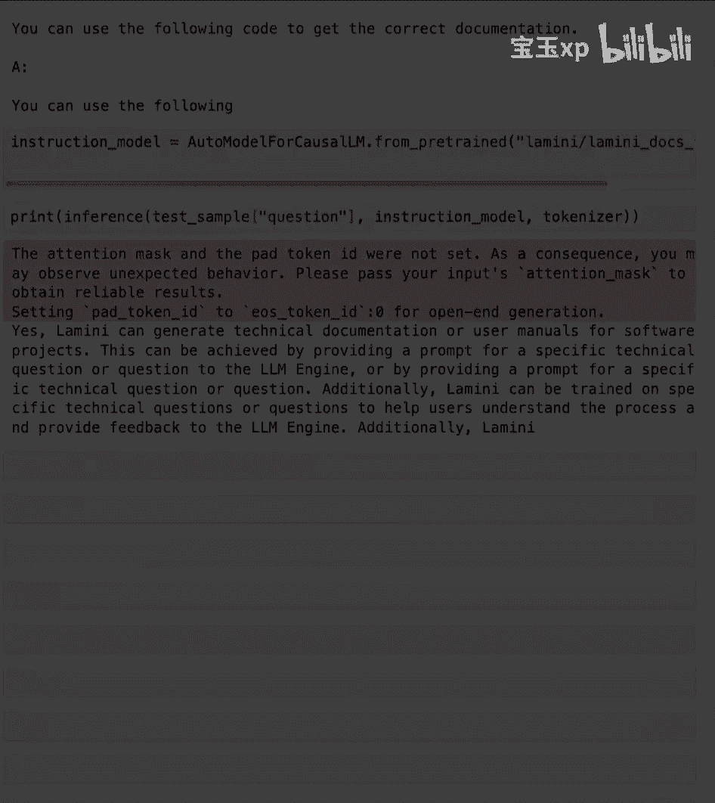

# 【大模型微调】 DeepLearning.AI - P4：4-指令微调 - 吴恩达大模型 - BV1mT421a78i

在这节课中，你将学习指令微调，使gpt 3变成聊天的微调变体，GPT并赋予它聊天的能力，好啦，让我们开始给我们所有的模特聊天的能力，好啦，所以让我们深入研究什么是指令微调，指令微调是微调的一种。

你可以做的所有其他任务，就像推理，路由，副驾驶，就是写代码，聊天，不同的代理，但特别是微调指令，你也可能听到过指令曲调或以下指令，LLMS教模型遵循指令，表现得更像聊天机器人。

这是一个更好的用户界面来与模型交互，就像我们在查奇BT看到的那样，这就是把gpt 3变成聊天gbt的方法，这极大地增加了像我这样的少数研究人员对人工智能的采用，对千千万万的人，所以对于下面指令的数据集。

您可以使用许多已经存在的现成的，在线或特定于您的公司，这可能是常见问题解答，客户支持对话或松弛消息，所以它真的是这个对话数据集，或者只是指令响应数据集，当然啦，如果你没有数据，没问题。

您还可以将数据转换为更多的问答格式，或遵循格式的指令，通过使用提示模板，所以在这里你可以看到，你知道吗，读我可能会变成一对问答，你也可以用另一个LLM为你做这件事，有一种技术叫羊驼。

斯坦福大学使用聊天gbt来做到这一点，当然，您可以使用不同开源模型的管道来做到这一点，也是，酷，所以微调最酷的事情之一，我认为它教会了模型这种新的行为，虽然你知道你可能有微调数据，法国的首都是什么？

因为这些是简单的问答对你可以得到，您还可以推广这种对数据进行问题回答的思想，您可能没有给出微调数据集的模型，但模型已经在它先前存在的，训练前的步骤，所以这可能是代码，这实际上是聊天GBT论文的发现。

模型现在可以回答关于代码的问题，尽管他们没有关于这个的问答对，为了他们的指导微调，这是因为让程序员去真的很贵，你知道的，有标签的数据集，他们在其中询问关于代码的问题并为其编写代码。

所以微调的不同步骤概述，我们的数据准备，培训和评价，当然啦，在你评估模型之后，你需要再次准备数据来改进它，改进模型是一个非常迭代的过程，专门用于指导，微调和其他不同类型的微调。

数据准备是你真正有差异的地方，这真的是你，你知道的，更改数据，您可以根据特定类型的微调调整数据，你正在做的微调的具体任务，培训和评估非常相似，所以现在让我们潜入实验室。

在那里你可以看到用于指令调优的羊驼数据集，您还可以再次比较经过指令调优的模型和，还没有被指令调谐，你可以在这里看到不同尺寸的模型，所以首先导入几个库，第一个重要的是，从数据集库加载数据集函数。

让我们加载这个指令调谐数据集，这是指定羊驼数据集，我们再次流媒体，因为这实际上是一个庞大的微调数据集，没有那堆那么大，当然我们要把它装起来就像以前一样，你们要看几个例子，好啦，所以不像那堆。

不仅仅是短信，就是这里，它更有条理一点，但这不是你所知道的，明切，就像问答对一样，最酷的是，你知道吗，羊驼论文的作者，他们实际上有两个提示模板，因为他们希望模型能够使用两种不同类型的提示。

两种不同类型的任务，一个是你知道的一个指令，在那里有一组额外的输入，例如它，指令可能是加两个数字，输入可能是第一个数字是3，第二个数字是四，然后是没有输入的提示模板，你可以在这些例子中看到。

有时有一个输入是不相关的，所以它没有那个，所以这些是正在使用的提示模板，又是这样，和以前很像，您只需补充这些提示，并在整个数据集中运行它们，让我们打印出一对，看看它看起来很酷，这里是输入输出。

你知道它是如何水合到提示符中的，所以它以回应结束，然后它在这里输出这个响应，很酷，就像在将其写入JSON行文件之前一样，你可以上传到拥抱脸中心，如果你想，我们实际上已经把它装在拉米尼羊驼那里了。

这样它就稳定了，你可以去那里看看，你可以去用它，好的很好，现在您已经看到了数据集后面的指令是什么样子的，我想接下来要做的就是再次提醒你，告诉我如何训练我的狗在不同的模型上迅速坐下。

第一个是美洲驼二号模型，这又不是指令调谐，告诉我怎么训练我的狗，好啦，又从那个时期开始，就这么说，所以请记住之前和现在我们将再次比较，指令调谐模型就在这里，好啦，好多了，它实际上产生了不同的步骤。

最后我只想再次分享聊天GBT，所以你可以在这里做一个比较，好啦，所以这是一个更大的，你知道的，CBD的一套型号相当大，与美洲驼相比，两种模型，这些实际上是70亿个参数模型，据传Chgbt约为700亿。

所以非常大的模型，你们还将探索一些较小的模型，一个是7000万参数模型，我正在加载这些模型，这还不是超级重要，你以后会更多地探讨这个问题，但是我要加载两个不同的东西来处理数据，然后运行模型。

你可以看到这里，我们这里的标签是路德·艾·皮提亚七千万，这是一个七千万参数的模型，尚未调整指令，我要在这里粘贴一些代码，它是一个运行推理的函数，或者基本上在文本上运行模型，我们会通过。

你知道这些不同的部分，在这个函数中到底发生了什么，在接下来的几个实验室里，酷，所以这个模型还没有微调，它不知道一家公司的任何具体情况，但我们可以重新加载以前的公司数据集。

所以我们要从这个数据集中给这个模型一个问题，可能只是你知道测试集的第一个样本，例如，所以我们可以在这里运行这个，问题是lamini能否为软件项目生成技术文档或用户手册，实际的答案是肯定的。

Lame和我可以为软件项目生成技术文档和用户手册，它一直在继续，但是模型的答案是，我有一个关于以下内容的问题，如何获得正确的文档来工作，我认为您需要使用以下代码等，所以很离谱，当然是学英语。

里面有文字文档，所以它有点理解，也许我们是在一个问题的答案设置，因为它有一个答案，但这显然很离谱，因此，它并不完全理解这个数据集，就知识而言，也不明白我们期待的行为，所以它不明白它应该回答这个问题。

好啦，现在将它与我们为您微调的模型进行比较，但你实际上是在为接下来的教学微调，这就是加载这个模型，然后我们可以在这个模型中运行同样的问题，看看它是如何，它说是的。

Lame和我可以为软件项目生成技术文档或用户手册，等，所以这比以前的要准确得多，它遵循我们所期望的正确行为，好的很好，现在您已经看到了指令遵循模型的作用，下一步就是仔细检查你所看到的。

它的一个顶峰是标记器，如何准备我们的数据。

