# (超爽中英!) 2024吴恩达最好的【构建高级RAG应用】可商用落地教程！附全套代码_LLM_Langchain_Llama - P2：2. 第一篇 - 先进的RAG管道(Advanced RAG Pipeline) 中英文字幕 - 吴恩达大模型 - BV1hMameREN3

在本课程中，您将全面，在本课程中，您将全面，了解如何使用 llama 索引设置基本，了解如何使用 llama 索引设置基本，和高级 rag 管道，和高级 rag 管道，我们将加载评估，我们将加载评估。

基准并使用真实镜头定义一，基准并使用真实镜头定义一，组指标，以便我们可以对高级 rag 进行基准测试，在接下来的几节课中，我们将针对 Bas 线或基本管道进行技术研究，在接下来的几节课中。

我们将针对 Bas 线或基本管道进行技术研究，我们将更深入地探讨每节课，让我们首先了解一下，让我们首先了解一下，基本检索增强生成，基本检索增强生成。

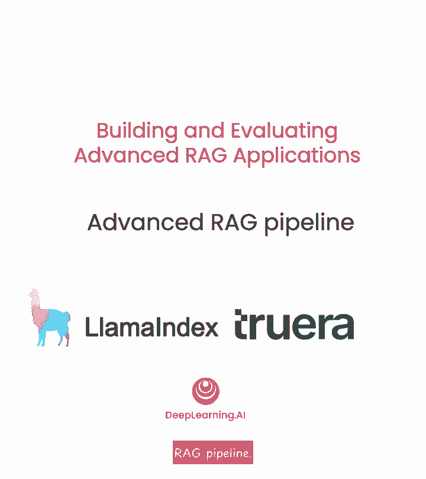

管道或 rag 管道的工作原理，它，管道或 rag 管道的工作原理，它，由三个不同的组件组成：由三个不同的组件组成：摄取检索和合成，摄取检索和合成，通过注入阶段，我们，通过注入阶段，我们。

首先为每个文档加载一组文档，首先为每个文档加载一组文档，我们使用文本 sper 将其拆分为一组，我们使用文本 sper 将其拆分为一组，文本主干，然后对于，文本主干，然后对于，每个块，我们，每个块。

我们，使用嵌入模型为该块生成嵌入，使用嵌入模型为该块生成嵌入，然后为每个块生成嵌入 嵌入后，我们将，然后为每个块生成嵌入 嵌入后，我们将，其卸载到索引，该索引是，其卸载到索引，该索引是。

存储系统（例如矢量，存储系统（例如矢量，数据库）的视图，一旦数据存储在，数据库）的视图，一旦数据存储在，索引中，我们就会，索引中，我们就会，针对该索引执行检索，首先，针对该索引执行检索，首先。

针对该索引启动用户查询，针对该索引启动用户查询，然后获取 将前 K 个类似的，然后获取 将前 K 个类似的，块移动到用户，块移动到用户，查询中，然后我们将这些相关，查询中，然后我们将这些相关。

块与用户查询结合起来，块与用户查询结合起来，并在合成阶段将其放入 LM 的提示窗口中，并在合成阶段将其放入 LM 的提示窗口中，这，这。

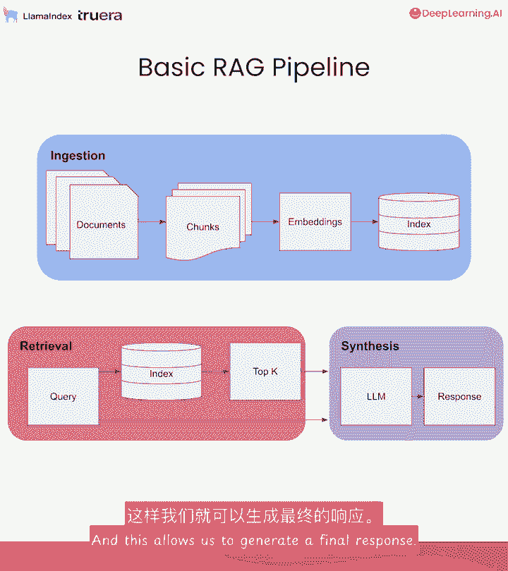

使我们能够生成最终，使我们能够生成最终，响应，本笔记本将引导您，响应，本笔记本将引导您。

完成 如何使用 llama 索引设置基本和，完成 如何使用 llama 索引设置基本和，高级的 rag Pipeline，高级的 rag Pipeline，我们还将使用 triara 来帮助设置。

我们还将使用 triara 来帮助设置，评估基准，以便我们可以根据。

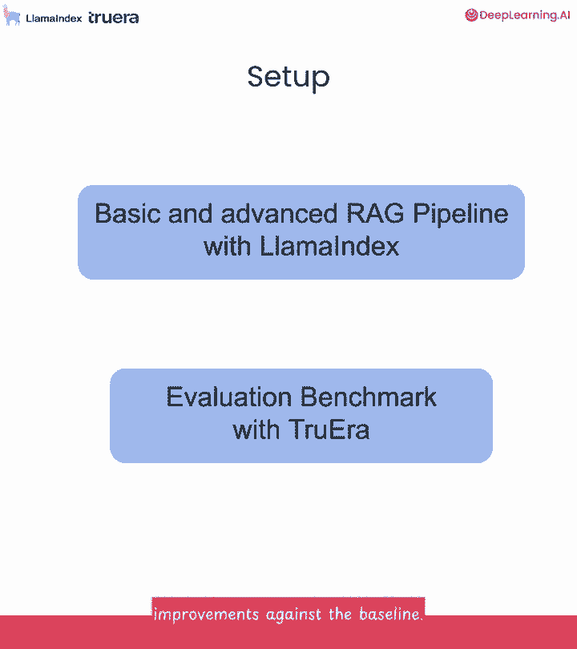

基准衡量改进，基准衡量改进，对于此快速入门，您将需要一个，对于此快速入门，您将需要一个，开放的 API 密钥，请注意，对于本课程，开放的 API 密钥，请注意，对于本课程，我们将使用一组辅助函数来。

我们将使用一组辅助函数来，帮助您快速运行，我们将，接下来我们将使用 llama 索引创建一个简单的 llm，接下来我们将使用 llama 索引创建一个简单的 llm，应用程序，该应用程序，应用程序。

该应用程序，内部使用开放的 AI llm，内部使用开放的 AI llm，就数据源而言，我们将使用 Andro，就数据源而言，我们将使用 Andro，编写的如何在 AI 中建立职业 PDF 请。

编写的如何在 AI 中建立职业 PDF 请，注意，如果您愿意，您也可以上传，注意，如果您愿意，您也可以上传，自己的 PDF 文件，在，自己的 PDF 文件，在，本课中，我们鼓励您这样做，让我们这样。

本课中，我们鼓励您这样做，让我们这样，做 对文档的组成以及文档的长度进行一些基本的完整性检查，我们看到我们有一个，我们看到我们有一个，文档列表，其中有 41 个元素，文档列表，其中有 41 个元素。

该列表中的每个项目都是一个，该列表中的每个项目都是一个。

文档对象，我们还将显示，接下来，我们将给定文档的文本片段合并到单个，接下来，我们将给定文档的文本片段合并到单个，文档中，因为，文档中，因为，在使用更，在使用更，高级的检索方法（例如。

高级的检索方法（例如，句子窗口检索以及，句子窗口检索以及，自动合并检索）时，它有助于提高整体文本混合的准确性下一步，自动合并检索）时，它有助于提高整体文本混合的准确性下一步，是 索引这些文档，我们。

是 索引这些文档，我们，可以使用 llama 索引中的向量存储索引来完成此操作，接下来我们定义一个服务上下文，接下来我们定义一个服务上下文，对象，其中包含，对象，其中包含。

我们将要使用的 alab 以及，我们将要使用的 alab 以及，我们将要使用的 alab 的嵌入模型，我们将要使用的 alab 的嵌入模型，我们将使用，我们将使用，来自 open Ai 的 gbt 3。

5 Turbo，然后，来自 open Ai 的 gbt 3。5 Turbo，然后，我们将使用的嵌入模型是，我们将使用的嵌入模型是。

模型，这些 Cas 步骤显示了这个注入，模型，这些 Cas 步骤显示了这个注入，过程，我们已加载到，过程，我们已加载到，文档中，然后加载到一个中 行向量，文档中，然后加载到一个中 行向量。

存储索引从文档中我们正在，存储索引从文档中我们正在，使用您接下来指定的嵌入模式在引擎盖下进行分块嵌入和，使用您接下来指定的嵌入模式在引擎盖下进行分块嵌入和。

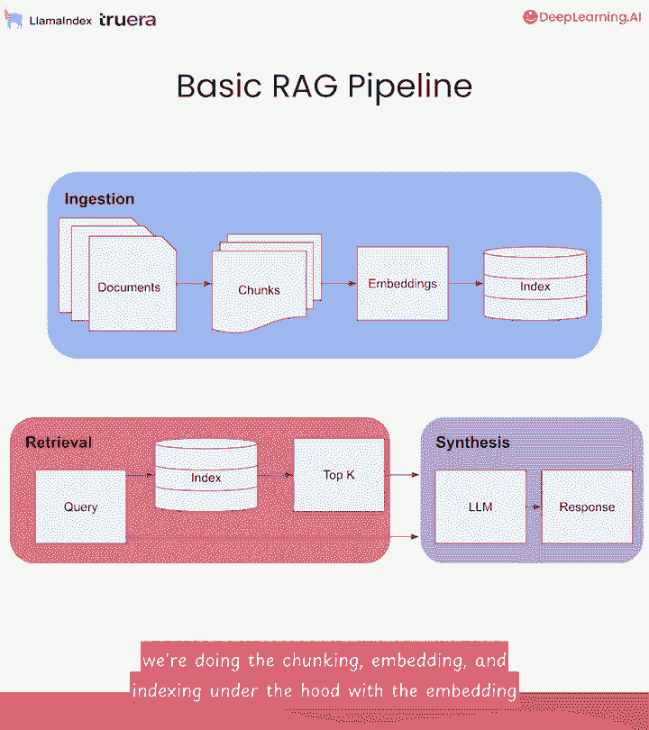

索引，我们从该索引获得一个查询引擎，该引擎，我们从该索引获得一个查询引擎，该引擎，允许我们发送，允许我们发送，用户查询来对该数据进行检索和，用户查询来对该数据进行检索和。

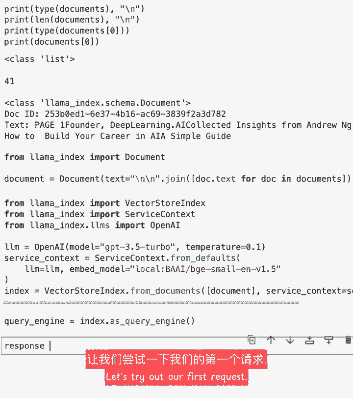

请求，问题是，请求，问题是，在寻找项目来构建，在寻找项目来构建。

从小开始，逐渐增加，从小开始，逐渐增加，项目的范围和复杂性，项目的范围和复杂性，所以它正在发挥作用，所以现在您已经，所以它正在发挥作用，所以现在您已经，设置了基本的抹布 管道呃，下一步。

设置了基本的抹布 管道呃，下一步，是，是，针对该管道设置一些评估，以了解，针对该管道设置一些评估，以了解，它的执行情况，这也将为，它的执行情况，这也将为，定义我们的，定义我们的，高级检索方法（句子。

高级检索方法（句子，窗口检索器以及自动，窗口检索器以及自动，合并检索器，在本节中我们使用，合并检索器，在本节中我们使用，true）提供基础 镜头来初始化反馈，true）提供基础 镜头来初始化反馈。

函数我们初始化一个辅助，函数我们初始化一个辅助，函数获取反馈以返回，函数获取反馈以返回，反馈函数列表来评估我们的应用程序，反馈函数列表来评估我们的应用程序，在这里我们创建了一个抹布评估。

在这里我们创建了一个抹布评估，三元组，它由，三元组，它由，查询响应，查询响应，和上下文之间的成对比较组成，因此这实际上创建了，和上下文之间的成对比较组成，因此这实际上创建了，三个不同的 评估模块。

三个不同的 评估模块，答案相关性 上下文相关性和，答案相关性 上下文相关性和，接地性 答案相关性是与，接地性 答案相关性是与，查询相关的响应 上下文，查询相关的响应 上下文，相关性是与。

查询相关的检索上下文，接地性是上下文，查询相关的检索上下文，接地性是上下文，支持的响应，支持的响应，我们将逐步介绍如何，我们将逐步介绍如何，自行设置 在接下来的几个，自行设置 在接下来的几个，笔记本中。

我们需要做的第一件事，笔记本中，我们需要做的第一件事，是创建一组问题来，是创建一组问题来，测试我们的应用程序，在这里我们已经，测试我们的应用程序，在这里我们已经。

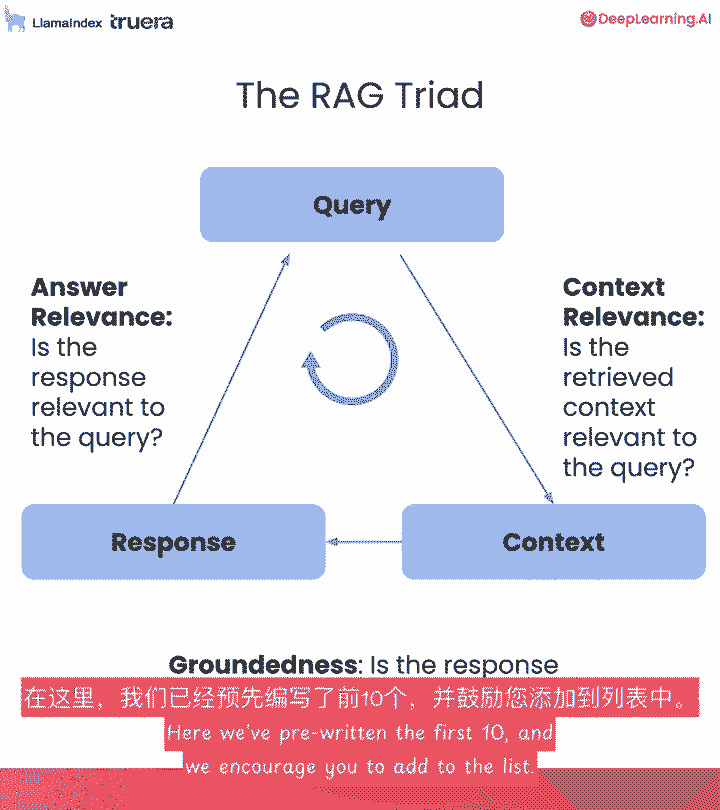

预先编写了前 10 个问题，我们，预先编写了前 10 个问题，我们。

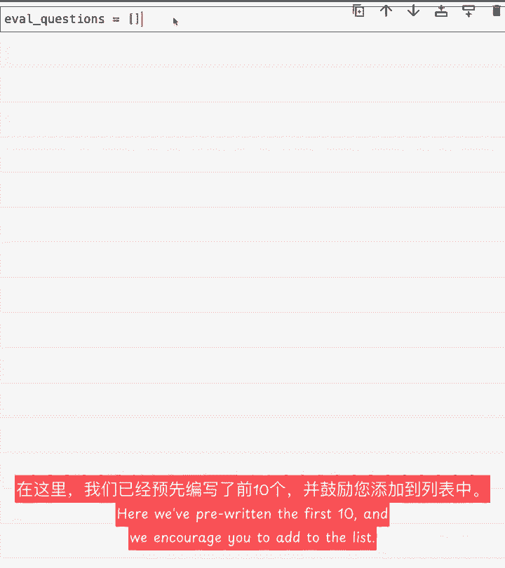

theist，现在我们有一些评估，theist，现在我们有一些评估，问题 建立，问题 建立，人工智能职业生涯的关键是什么？团队合作如何为，人工智能职业生涯的关键是什么？团队合作如何为。

人工智能的成功做出贡献等等。人工智能的成功做出贡献等等。我们需要做的第一件事是创建一，我们需要做的第一件事是创建一，组问题来测试我们的，组问题来测试我们的，应用程序，我们已经预先编写了，应用程序。

我们已经预先编写了，前 10 个问题，但是 我们鼓励您也，前 10 个问题，但是 我们鼓励您也，添加到此列表中，在这里我们指定基金，添加到此列表中，在这里我们指定基金，新问题什么是适合我的人工智能工作。

新问题什么是适合我的人工智能工作，我们将其添加到评估，我们将其添加到评估，问题列表中现在我们可以初始化，问题列表中现在我们可以初始化，真正的镜头模块以开始我们的，真正的镜头模块以开始我们的。

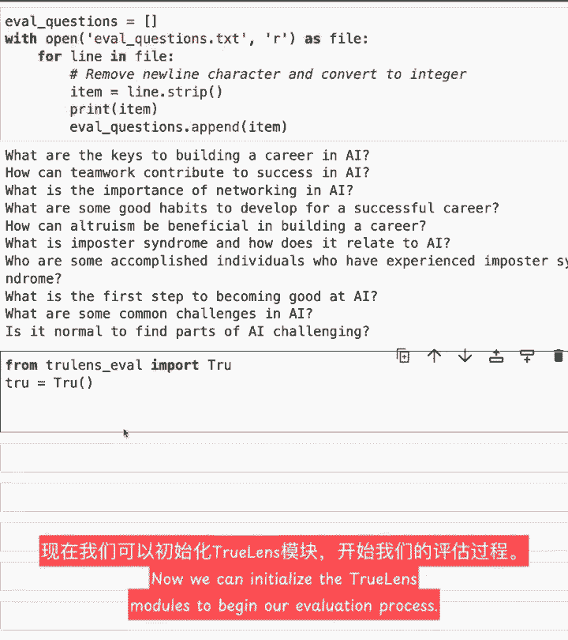

过程我们已经初始化了 真正的 L，过程我们已经初始化了 真正的 L，数据库，我们现在可以初始化我们的，数据库，我们现在可以初始化我们的，评估模块，Alms 正在成为。

大规模评估生成式 AI 应用程序的标准机制，大规模评估生成式 AI 应用程序的标准机制，而不是依赖于昂贵的人工，而不是依赖于昂贵的人工，评估或设定基准 Alms 使，评估或设定基准 Alms 使。

我们能够在 这，我们能够在 这，是一种根据我们的操作领域定制的方式，是一种根据我们的操作领域定制的方式，并且能够根据应用程序不断变化的需求进行动态调整。在这里，我们预先构建了一个 shin，在这里。

我们预先构建了一个 shin，记录器，用于此示例，在，记录器，用于此示例，在，记录器中，我们包含了用于，记录器中，我们包含了用于，评估的标准评估三元组，评估的标准评估三元组，在这种上下文相关性和。

在这种上下文相关性和，答案相关性中，我们还将指定，答案相关性中，我们还将指定，一个 ID，以便我们可以在，一个 ID，以便我们可以在，实验时跟踪应用程序的此版本，我们可以，实验时跟踪应用程序的此版本。

我们可以。

通过简单地更改应用程序 ID 来跟踪新版本，通过简单地更改应用程序 ID 来跟踪新版本，现在我们可以使用以下命令再次运行查询引擎，现在我们可以使用以下命令再次运行查询引擎，上下文所以这里发生的事情是。

上下文所以这里发生的事情是，我们将每个查询发送到我们的查询，我们将每个查询发送到我们的查询，引擎，并且在后台呃真实，引擎，并且在后台呃真实，镜头记录器正在，镜头记录器正在。

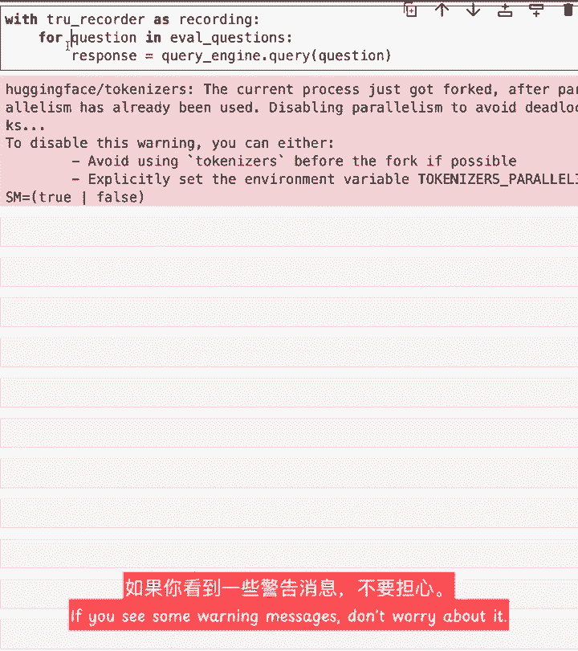

指标评估每四个查询如果您看到一些警告消息，指标评估每四个查询如果您看到一些警告消息，呃不用担心它 呃，其中一些是，呃不用担心它 呃，其中一些是。

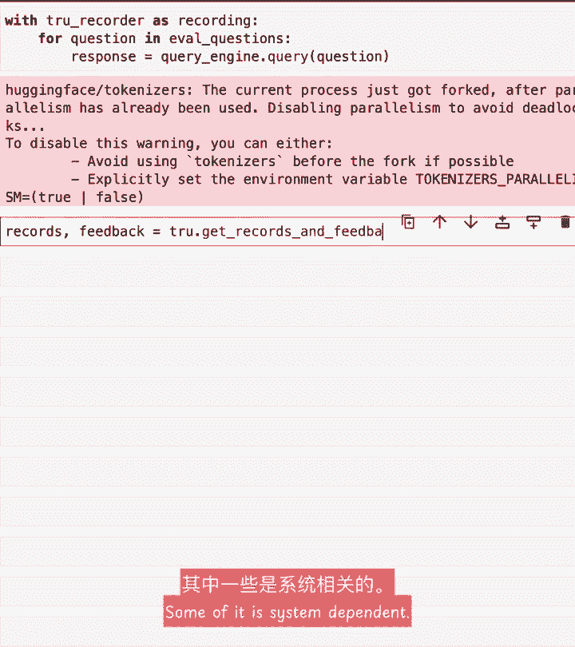

它的系统，在这里我们可以看到查询列表，它的系统，在这里我们可以看到查询列表。

响应，您可以看到输入输出，响应，您可以看到输入输出。

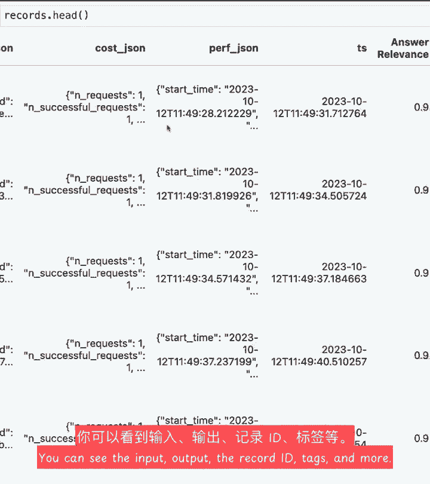

记录 ID 标签，记录 ID 标签，等等，您还可以看到答案，等等，您还可以看到答案。

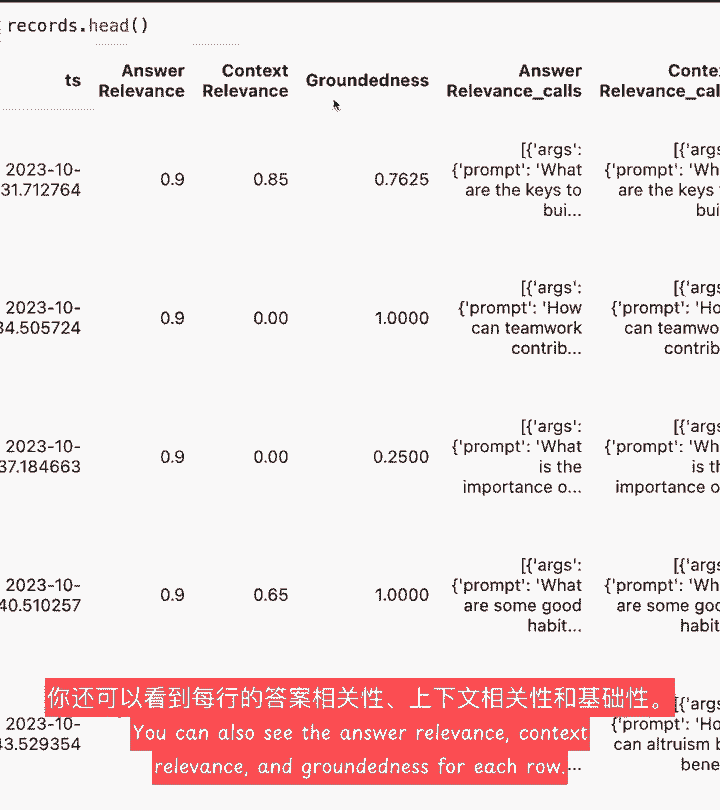

相关性上下文相关性和，相关性上下文相关性和，每行的基础性 在，每行的基础性 在，仪表板中，您可以看到您的评估，仪表板中，您可以看到您的评估，指标，例如上下文相关性、答案，指标，例如上下文相关性、答案。

相关性和接地性以及，相关性和接地性以及，平均 leny 总成本等，在，平均 leny 总成本等，在，此处的 UI 中，我们看到答案相关性，此处的 UI 中，我们看到答案相关性，和接地性相当高，但。

和接地性相当高，但，云 taex 相关性相当低，现在，云 taex 相关性相当低，现在，让我们看看是否 我们可以使用，让我们看看是否 我们可以使用，更高级的检索，更高级的检索。

技术来改进这些指标，例如句子窗口，技术来改进这些指标，例如句子窗口，检索以及onut合并，检索以及onut合并，检索，第一个高级技术，检索，第一个高级技术，将讨论的是句子窗口，将讨论的是句子窗口，检索。

它通过嵌入和，检索，它通过嵌入和，检索单个句子来实现更，检索单个句子来实现更，细粒度的主干，但检索后，细粒度的主干，但检索后，句子被替换 在，句子被替换 在，原始检索句子周围有更大的句子窗口。

原始检索句子周围有更大的句子窗口，直觉是这，直觉是这，允许 Alm 为，允许 Alm 为，检索到的信息提供更多上下文，以便，检索到的信息提供更多上下文，以便，更好地回答查询，同时仍然，更好地回答查询。

同时仍然，检索更细粒度的，检索更细粒度的。

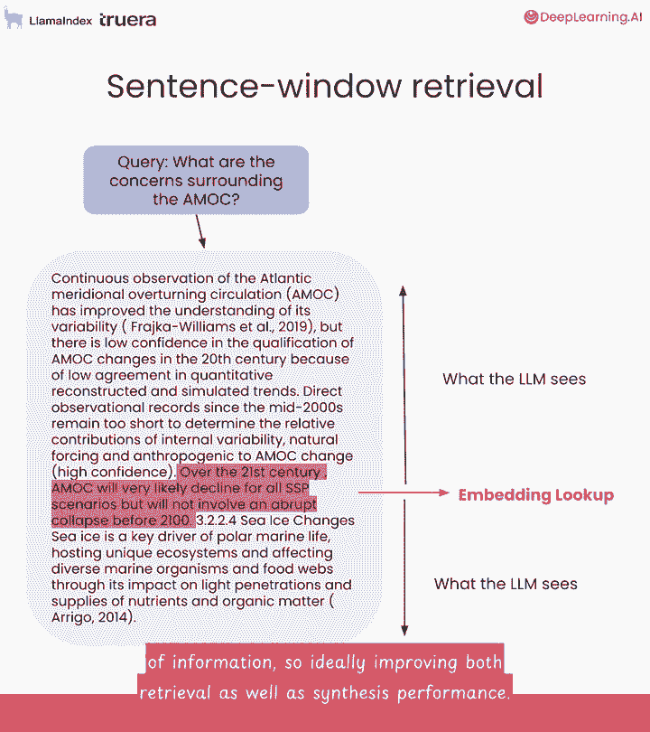

信息，因此理想情况下，信息，因此理想情况下，也可以改善检索 作为综合，也可以改善检索 作为综合，性能，现在让我们看看如何，性能，现在让我们看看如何，我们将使用打开的 IBT 3。5 Turbo。

我们将使用打开的 IBT 3。5 Turbo，接下来，我们将，接下来，我们将，在给定文档上构建句子窗口索引，在给定文档上构建句子窗口索引，只是提醒一下，我们有一个，只是提醒一下，我们有一个，用于构建。

用于构建，句子窗口的辅助函数 索引，我们将，类似于之前我们将从句子窗口索引中获取，类似于之前我们将从句子窗口索引中获取，查询引擎，查询引擎，现在我们已经设置了它，我们，现在我们已经设置了它，我们。

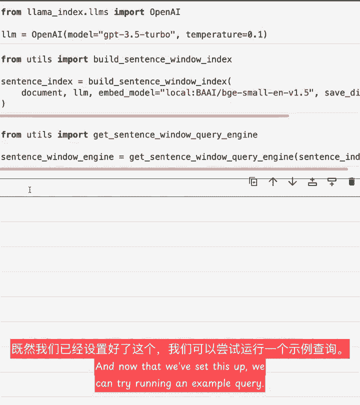

可以尝试运行 这里有一个示例，可以尝试运行 这里有一个示例，查询，问题是我如何，查询，问题是我如何。

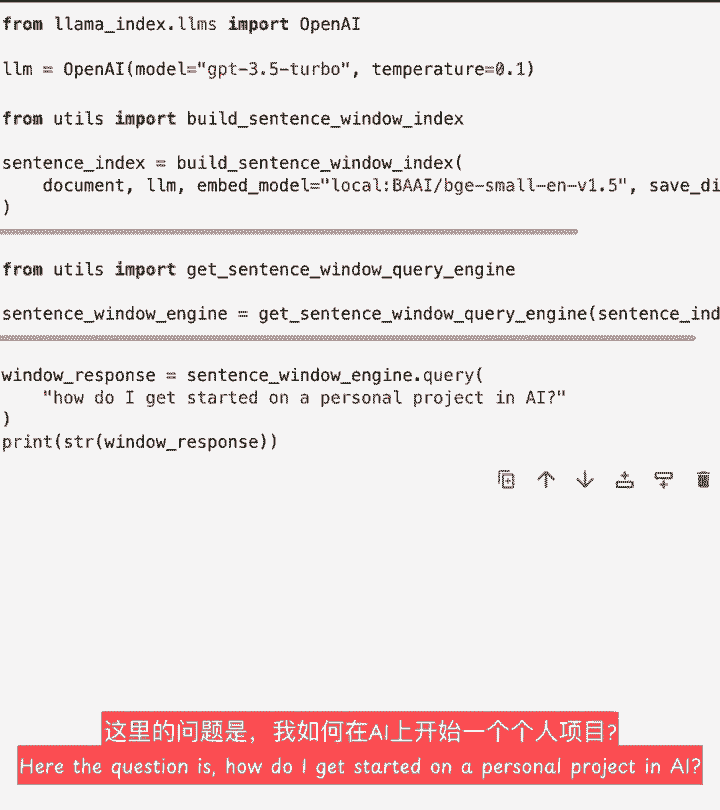

，我们得到回复开始，我们得到回复开始，人工智能中的个人项目首先，人工智能中的个人项目首先，重要的是确定项目的范围，重要的是确定项目的范围，就像之前让我们尝试，就像之前让我们尝试，获得真实的线路评估一样。

获得真实的线路评估一样，上下文并尝试对结果进行基准测试，上下文并尝试对结果进行基准测试，因此在这里我们导入真实记录器，因此在这里我们导入真实记录器，句子窗口，它是句子窗口索引的预构建，句子窗口。

它是句子窗口索引的预构建，真实行记录器，真实行记录器。

现在我们将，现在我们将，在这些评估问题之上运行句子窗口检索器，在这些评估问题之上运行句子窗口检索器，然后比较，然后比较，性能，性能。

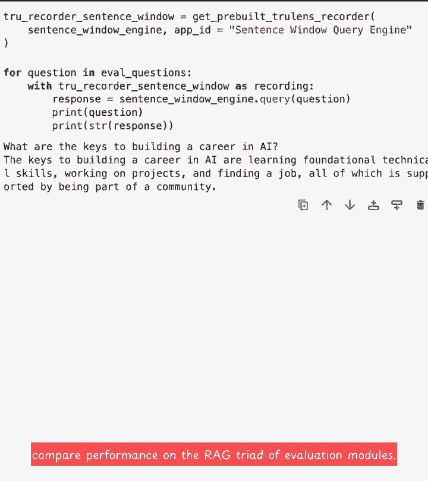

在这里，我们可以在评估模块的三合一中看到响应，在这里，我们可以在评估模块的三合一中看到响应，运行一些问题或响应的示例，运行一些问题或响应的示例，团队合作如何为，团队合作如何为。

人工智能的成功做出贡献团队合作可以，人工智能的成功做出贡献团队合作可以，通过允许个人，通过允许个人，利用专业知识和能力来为人工智能的成功做出贡献，利用专业知识和能力来为人工智能的成功做出贡献。

他们同事的见解，他们同事的见解，网络在人工智能中的重要性，网络在人工智能中的重要性，是什么 网络在人工智能中很重要，因为它，是什么 网络在人工智能中很重要，因为它，允许个人与在该领域。

允许个人与在该领域，拥有经验和知识的其他人建立联系，现在我们已经，现在我们已经，对 Bic，对 Bic，rag 管道这两种技术进行了评估 作为句子，rag 管道这两种技术进行了评估 作为句子。

窗口检索管道，让我们获取，窗口检索管道，让我们获取，结果的领导者 W，看看，结果的领导者 W，看看。

这里发生了什么，我们看到一般接地性，比基线拖动点好八个百分点 点答案，比基线拖动点好八个百分点 点答案，相关性或多或少相同，相关性或多或少相同，上下文相关性也更好 对于，上下文相关性也更好 对于。

句子窗口prary引擎延迟，句子窗口prary引擎延迟，或多或少是相同的，并且总，或多或少是相同的，并且总，较低，较低，因为基础性和上下文，因为基础性和上下文，viment较高，但总成本。

viment较高，但总成本，较低，我们可以直觉句子，较低，我们可以直觉句子，窗口检索器实际上为我们提供了，窗口检索器实际上为我们提供了。

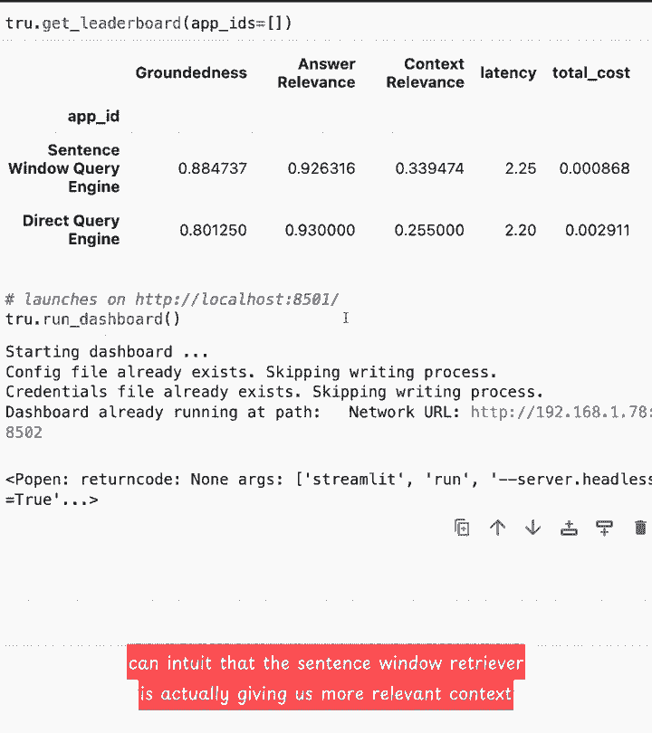

更相关的上下文，并且，当我们返回 UI 时，我们可以更高效地，当我们返回 UI 时，我们可以更高效地，看到，我们现在对，看到，我们现在对，直接查询引擎、，直接查询引擎、，基线以及句子窗口进行了比较。

基线以及句子窗口进行了比较。

并且我们还可以看到我们刚刚，并且我们还可以看到我们刚刚，在笔记本显示 DOI 中看到的矩阵，我们将讨论的下一个高级检索技术是自动合并，我们将讨论的下一个高级检索技术是自动合并，检索器。

这里我们构建一个由，检索器，这里我们构建一个由，较大父节点和，较大父节点和，引用父节点的较小子节点组成的层次结构，引用父节点的较小子节点组成的层次结构，因此例如我们可能有一个，因此例如我们可能有一个。

块大小为 512 个令牌的父节点，块大小为 512 个令牌的父节点，并且在下面 是，并且在下面 是，链接到此父节点的块大小为 128 标记的四个子节点，自动合并检索器，自动合并检索器。

通过将检索节点合并到更大的，通过将检索节点合并到更大的，父节点中来工作，这意味着在，父节点中来工作，这意味着在，检索期间，如果父节点实际上检索了，检索期间，如果父节点实际上检索了，其大部分子节点。

其大部分子节点，那么我们将替换 子节点，那么我们将替换 子节点，与父，与父，节点，因此这允许我们分层合并，节点，因此这允许我们分层合并。

检索 noes，检索 noes，所有子节点的组合与，所有子节点的组合与，父 Noe 的文本相同，类似于句子，父 Noe 的文本相同，类似于句子，窗口检索器，在接下来的几课中，窗口检索器。

在接下来的几课中，我们将做更多 在这里深入了解它是，我们将做更多 在这里深入了解它是，如何工作的，我们将向您展示如何使用，如何工作的，我们将向您展示如何使用，在这里我们，在这里我们。

再次使用 GBT 3。5 Turbo 为 LM，再次使用 GBT 3。5 Turbo 为 LM，模型，我们从，模型，我们从，自动合并，自动合并。

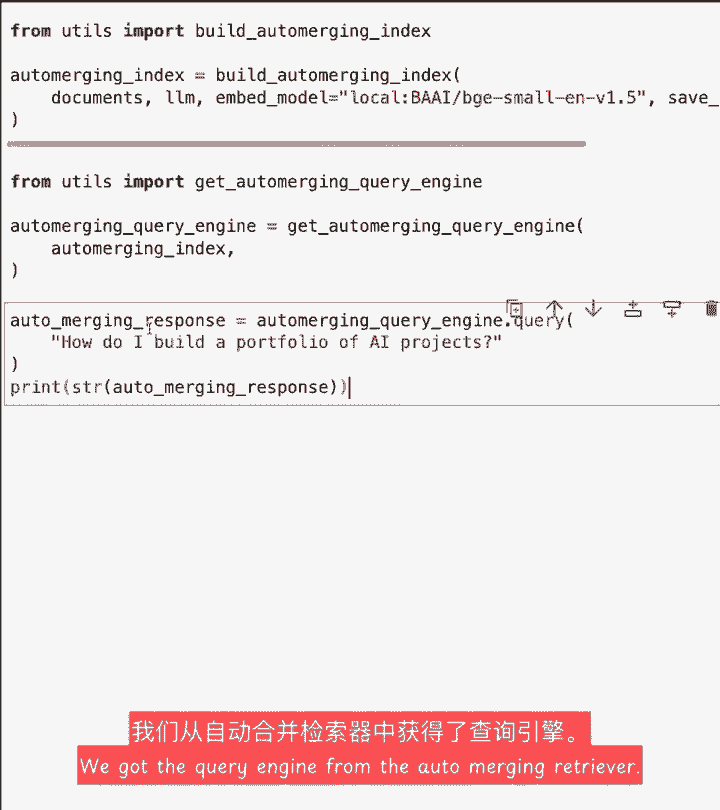

检索器获得查询引擎，让我们尝试运行一个，检索器获得查询引擎，让我们尝试运行一个，示例，示例。

查询，我如何，查询，我如何，在日志中构建人工智能项目组合，您实际上，在日志中构建人工智能项目组合，您实际上，看到了合并项目过程，看到了合并项目过程，我们正在将节点合并到父节点中。

我们正在将节点合并到父节点中，基本上撤退父节点，基本上撤退父节点。

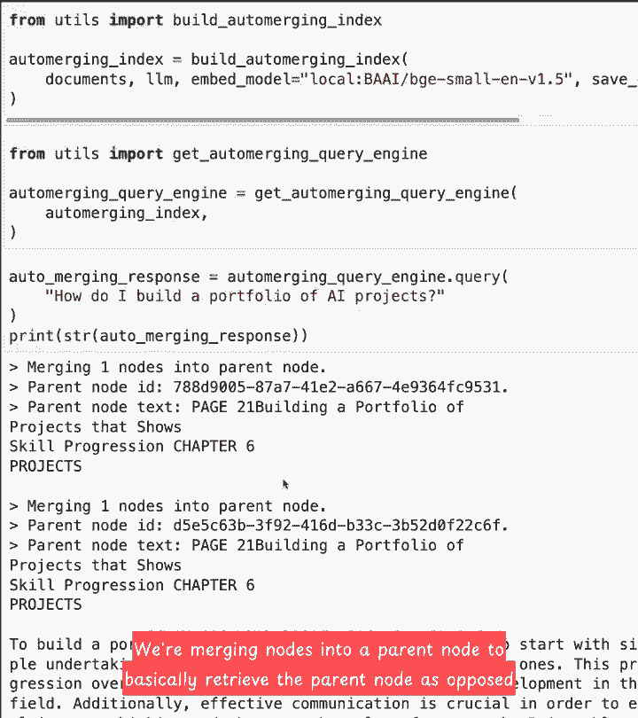

而不是子，而不是子，节点来构建人工智能项目组合，节点来构建人工智能项目组合，重要的是从简单的，重要的是从简单的，任务开始，并逐渐进展一些，任务开始，并逐渐进展一些，更复杂的，更复杂的，任务。

所以我们看到它，任务，所以我们看到它。

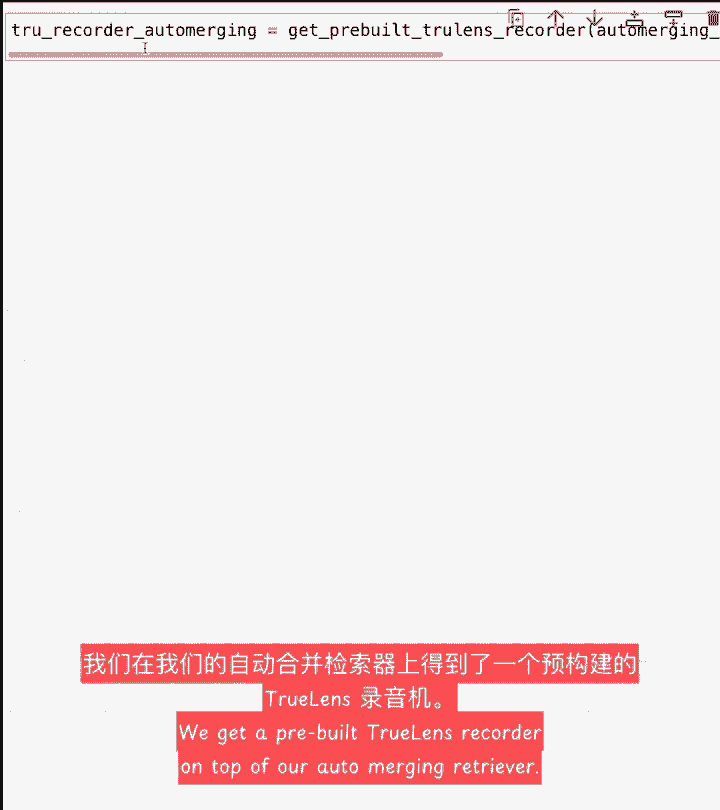

然后我们在，然后我们在。

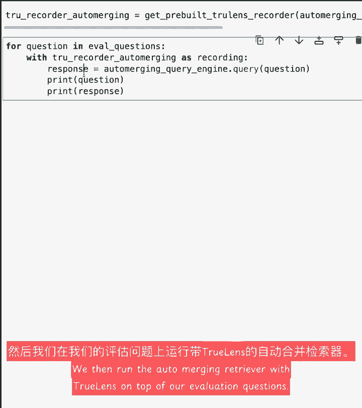

我们的评估问题之上运行具有真实借出的自动原始检索器，我们的评估问题之上运行具有真实借出的自动原始检索器。

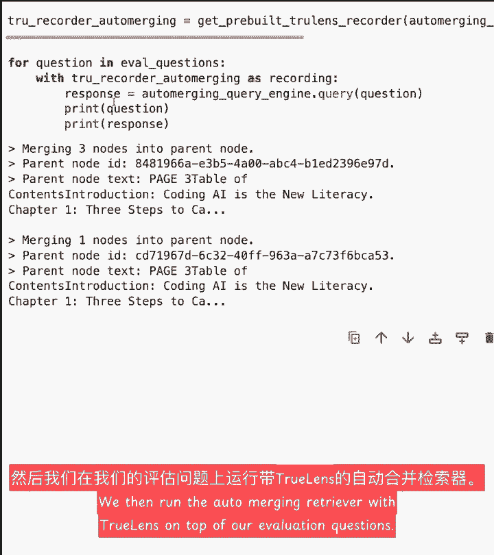

对于每个问题，您，对于每个问题，您，实际上看到正在进行的合并过程，实际上看到正在进行的合并过程，例如将三个节点合并到，例如将三个节点合并到，父节点中 第一个问题的节点如果我们。

父节点中 第一个问题的节点如果我们，向下滚动一点，我们会看到，向下滚动一点，我们会看到，对于其中一些其他问题，对于其中一些其他问题，我们也在执行合并，我们也在执行合并，过程，将三个节点合并到，过程。

将三个节点合并到，父节点中，将一个节点合并到 par 中，父节点中，将一个节点合并到 par 中，示例问题响应对是什么，示例问题响应对是什么，网络在人工智能中的重要性网络，网络在人工智能中的重要性网络。

在人工智能中很重要，因为它，在人工智能中很重要，因为它，有助于建立一个强大的专业，有助于建立一个强大的专业，网络社区，现在我们已经运行了，网络社区，现在我们已经运行了，所有三种检索技术，基本的。

所有三种检索技术，基本的，抹布管道以及两种高级，抹布管道以及两种高级。

检索方法，我们可以查看，检索方法，我们可以查看，全面的排行榜 看看这，全面的排行榜 看看这，三种技术是如何，三种技术是如何，叠加的，除了评估问题之外。

我们还得到了 autover virgent 查询引擎的相当不错的结果，我们在基础性方面得到了 100%，我们在基础性方面得到了 100%，在，在，答案相关性方面得到了 94% 在。

答案相关性方面得到了 94% 在，上下文相关性方面得到了 43% 哪一个更高 与，上下文相关性方面得到了 43% 哪一个更高 与，句子窗口和，句子窗口和，基线机架，基线机架，管道相比，我们得到。

管道相比，我们得到，与句子窗口 opary 引擎大致相同的总成本，这，与句子窗口 opary 引擎大致相同的总成本，这，意味着这里的检索，意味着这里的检索。

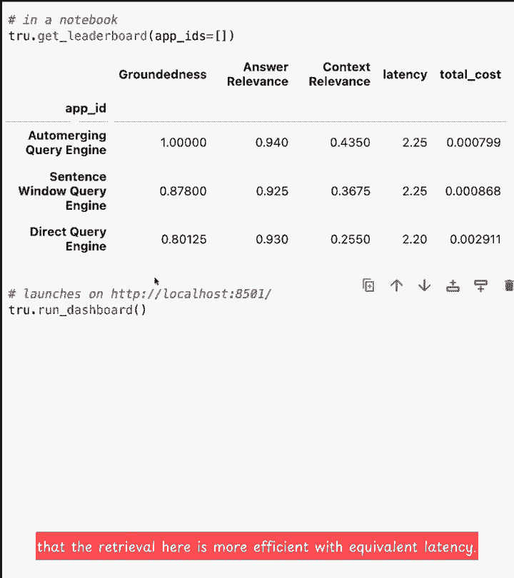

，最后您也可以，最后您也可以，在仪表板中查看这一点，本课，在仪表板中查看这一点，本课，给出 您将全面了解，给出 您将全面了解，如何设置基本和高级碎片，如何设置基本和高级碎片，管道，管道。

以及如何设置评估，以及如何设置评估，模块来衡量，模块来衡量，下一课的性能，aicon 将深入研究，下一课的性能，aicon 将深入研究，这些评估模块，这些评估模块，特别是坟墓，特别是坟墓。

答案相关性和上下文的碎片三元组 相关性，答案相关性和上下文的碎片三元组 相关性。

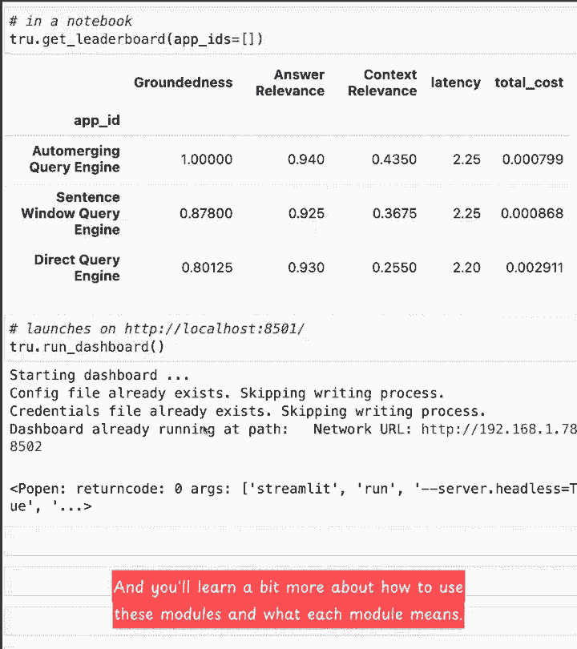

您将更多地了解如何，您将更多地了解如何，使用这些模块以及每个模块的。