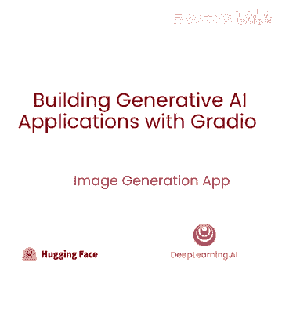
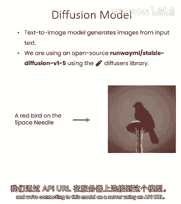
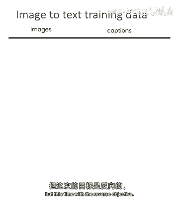
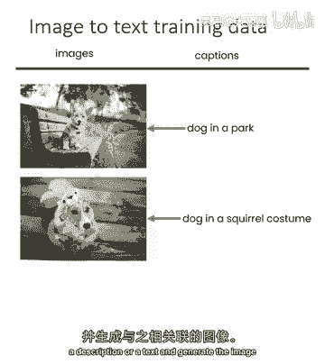
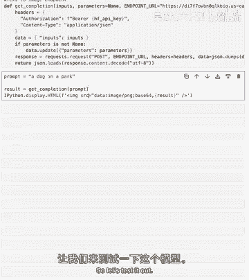
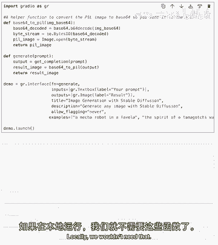
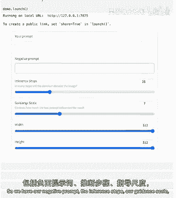
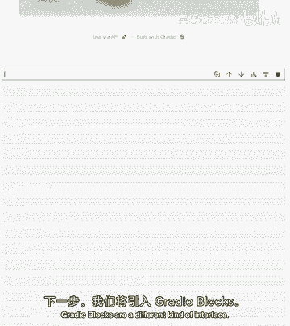

# LangChain_微调ChatGPT提示词_RAG模型应用_agent_生成式AI - P55：4：图像生成应用 - 吴恩达大模型 - BV1gLeueWE5N

本课将构建图像生成应用，使用开源文本到图像模型，图像生成模型为扩散模型，通过API URL连接服务器。

设置API密钥，获取完成函数，为文本到图像端点，之前有图像到文本端点，模型接收图像并输出描述，此模型训练做相反的事，使用相同数据集训练，训练时使用图像和描述，但目标是相反的。

训练时接收描述或文本。

生成相关图像，测试一下。

成功了，从文本看，生成了漂亮图像，构建一个无线电应用，这是我们的Grapp应用，有辅助函数，如之前帮助本地API。

不需要那个，有生成函数，这次做相反的事，接收提示，生成图像，这是图像生成应用，如你所见，与之前应用类似，但相反，输出有图像组件，输入有文本组件，如你所见，图像在输出组件时显示，图像在输入组件时提示上传。

这里可以输入任何句子，例如，我们有这个例子，例如，例如，塔马哥奇精神漫游，维也纳城市，相当复杂的提示，实际上我住在维也纳，世界最宜居城市排名第一，非常适宜步行，公共交通很棒。

如果你记得90年代的小虚拟宠物，就是那些，可以看到类似这个小宠物蛋，背景是维也纳城市，每次运行生成图像的函数，会生成新图像，用同样的提示，你已经有了无限乐趣，如果你想继续生成图像。

当然你也可以在这里变化，有一个非常奇怪的它走，但我们仍然要求精神，所以随意尝试你的想象力出现的东西，如果你想不到任何东西，你可以看看你所在房间的周围，也许试着描述一些物体，试着描述一些在这里的有趣回忆。

例如我在一个房间里，我刚刚吃了，所以我会放一些像在一个空盒子，旁边有一些筷子的笔记本电脑，我甚至不知道那会不会工作。

但让我们看看，让我们一起试试，是的，有点有了那个空盒子与，与这个筷子，笔记本电脑，它完全忘记了，但是的，这些模型仍然不完美，它们不完全遵循提示，所以需要一些实验来提示，但我鼓励你尝试和玩一点这个应用。

一旦你完成，我们将进入下一步，那就是，让我们让这个应用更有趣，稳定扩散是一个强大的模型，它有几个更多的参数，所以我们有我们的负面提示，推理步骤是指导比例在这个图像的宽度和高度。

所以让我们回到我们的ui来理解发生了什么，所以这里我们有两个渐变文本框元素，这是我们之前已经看到过的元素，我们有一个很好的滑块，这是一个我们还没有看到过的元素，好的，所以让我们尝试这个更完整的，Ui。

所以这里让我们做一个狗飞机在公园，动漫风格，并且让我说我不想在我的图像中有低质量，令人惊讶的是，如果你把低质量作为负面提示输入，它实际上会增加质量，因为它将试图远离图像，这些图像在标题中有低质量。

我将增加推理步数，这将提高质量，但需要更多时间，让我们这样做。

这里有一只动漫风格的狗，脸看起来有点怪，但看起来很可爱，好的，我们有一个工作且有复杂功能的应用，但用户界面有点拥挤，我们可以解决这个问题，为此我们将引入渐变块，渐变块是另一种界面。

直到现在我们使用这种结构，称为径向界面，本质上是一种非常流畅的方式，我们可以做函数，输入输出标题描述，并为我们生成应用，而渐变块使我们能够构建更复杂的用户界面，通过本质上让你自己，构建你的行和列。

以及在你的应用中放置元素的位置，渐变界面使构建变得非常容易，所以这里我们用渐变块做演示，就像我们之前可以有渐变标题一样，之前这里我们有可做任何事情的渐变Markdown，所以这里我们做一个标题。

我们也有我们的提示，但在径向块中，如果你想将元素用作输入或输出，你必须将它们分配给变量，所以这里我们将渐变文本框分配给提示变量，这里我们将有UI构建元素，所以我们有渐变行，这里我们将有两个列。

所以两个渐变列，之前我们有负面提示操作，指导，宽度和高度，以及新的渐变按钮元素，那是我们的提交按钮，在另一列中我们将有输出，使用渐变块，我们必须明确点击按钮会做什么，而在渐变界面中。

你只需有一个按钮将执行的函数，无论如何渐变块。

我们可以定义点击这个按钮会做什么，所以这里我们有按钮点击，然后函数生成，与之前使用的生成函数相同，实际上我们没有改变生成函数，我们只是在改变用户界面，输入与之前的相同，不再直接在，输入中定义元素。

调用每个输入的变量，变量也属于输出，与界面相同运行演示，休息，可以看到我做了什么，我把提示放在行外，这里我们有独立的提示框，我在两列中设置了，在一列中，我有所有高级选项元素，在另一列我有输出和按钮。

这真的很酷，因为基本上你可以控制你的应用，所以用这些基本元素，行列按钮，我们可以按我们喜欢的方式构建块，你可以在这里暂停并尝试这段代码，尝试以你喜欢的方式改变这些块，玩得开心，在下一个例子中。

我会展示如何构建一个更复杂的UI，你可以看到它有点复杂，它包含很多元素，但使用起来非常简单，所以你有提示，按钮高级选项，然后是输出，这是与单选块相关的权衡，如果你想构建一个更简单的UI。

你可能需要构建更复杂的代码，反之亦然，所以使用单选界面，是最简单的可能代码，但可能会变得复杂和杂乱，所以让我们看看这里发生了什么，这里我们设置了标题的渐变标记，这是我们有一个渐变行和两列。

一个是提示另一个是按钮，在它旁边我们有一个刻度元素，所以在刻度元素中我们将元素分成总块数，所以这里，例如，因为我们有一列刻度为4和一列刻度为1，我们有五个块，第一个元素占4份，第二个元素占1份。

但可定义一个元素不遵守这些块，若需设置最小宽度，所以在这种情况下，例如，我说按钮最小不能小于50像素，这里还有另一个简化UI的元素，那就是渐变手风琴，所以若有高级选项不欲向所有用户展示。

我们可以有一个手风琴，展开时可提示信息，默认情况下，手风琴已打开，需定义开始为关闭，手风琴内有结构，可按喜好定制元素，这是否定提示，因为想多留些空间，房地产，所以我们添加了负面提示，承担整个角色。

然后在下面有一个规则，两列是推理步骤，一侧是指导尺度，另一侧是宽度和高度，之后是结果，所以我们关闭了折叠面板，我们使用简单的UI，使用单选块，这可以使您的图像生成应用程序非常容易使用。

我建议您在这里暂停并尝试使用单选块构建您的UI，改变这些块的位置，按你喜欢的方式，下节课我们做个游戏。

