# LangChain_微调ChatGPT提示词_RAG模型应用_agent_生成式AI - P60：3.SC-Laurence_L2_v03.zh - 吴恩达大模型 - BV1gLeueWE5N

一种我找到的与llm交互非常有用的方法。

是预先为特定的行为类型进行训练，使用你现在的提示。

这意味着，而不是提示，只是简单地说像生成做任何事情的代码，你也可以让提示，看起来更像你在Python中清晰、精心设计的代码的专家。

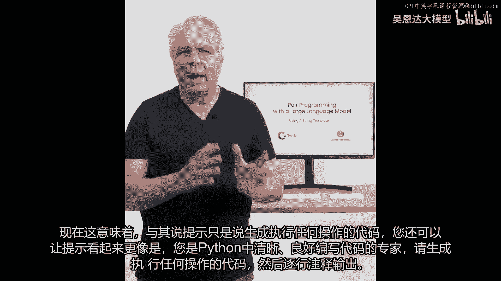

请生成做任何事情的代码，然后以行注释的形式输出它。

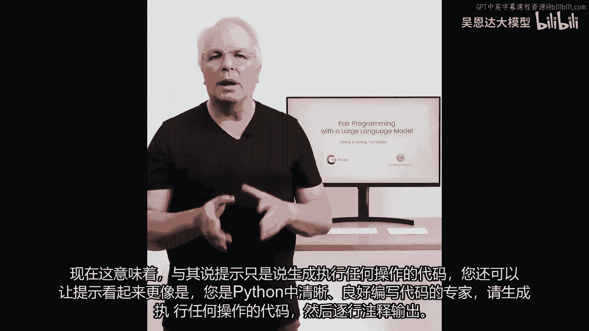

那么当你有执行你想要代码的提示时。

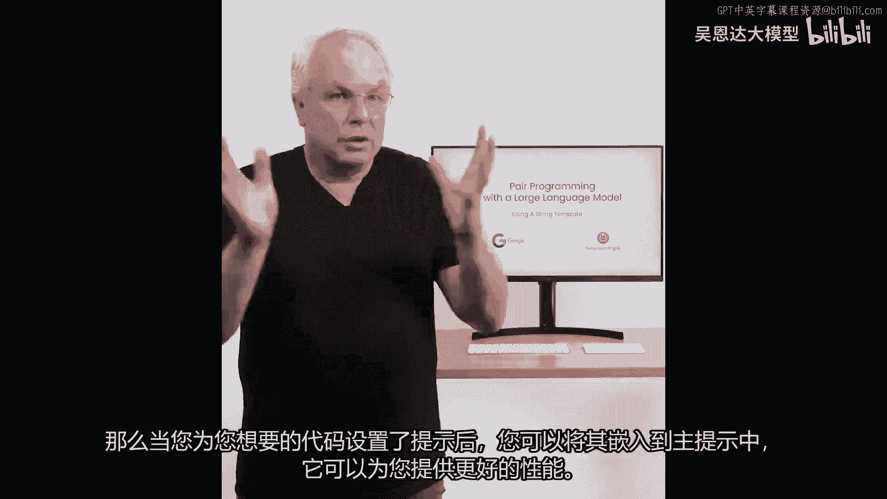

你可以将这个嵌入到主提示中，它可以给你更好的性能。

我们来看看一个例子，所以在这节课中，我们将看看如何，你可以使用字符串模板来增强你的提示，但在我们到达那里之前，我们必须重新安装我们所有的，所以我首先要做的是，我将复制进来，当然。

我们在哪里导入了API密钥，并且使用那个API密钥设置了Palm，所以让我们运行它，让它做它的事情，我们要做的第二件事是，当我们遍历Palm支持的模型时，我们想要选择生成文本的模型。

那个模型将是 Bison，我们只是想确保我们得到了它，我们做了 Bison 零零一 的文本，最后，生成函数是我们在上一节课中拥有的辅助函数，我们将那个粘贴在这里，这就使我们能够更容易地将东西发送到后端。

发送到手掌后端并传递我们的参数，并且，例如，可以做像从默认的零点七更改到零点零这样的事情。

好的，所以现在，让我们看看我们将如何，格式化我之前提到的字符串，所以这里的目标是，我总是喜欢思考我的提示，看作是由三个不同的东西组成的，提示中的第一件事，是我所称的提示预热，它有点像当你在准备墙壁时。

当你正确地涂刷它时，你是在准备你的提示，你在设计它以做什么，提示的第二部分是问题，它通常是我们称为的提示就是我们以前在做的事情，就像是在Python中给我一个链表，或者告诉我如何做某事。

然后最后的一部分就是我想要叫的装饰器，不要与Python装饰器混淆，这就是像你将要给模型的最后指示，以及如何处理像样的输出，例如，给我每行东西，或者每行都给我注释或者像这样，所以让我们看一个例子。

像这样的预热文本，我只是想说你是写清楚代码的专家，简洁的Python代码，所以我正在预热模型以便理解，它将会做类似的事情，现在我会提出问题，所以可能我的问题会是我们可以做一些非常简单的事情。

比如创建一个双向链表，非常简单，我希望它能顺利进行，最后，是关于装饰器的，就像装饰者可能会做的那样，我想要，而不是只是输出代码，我想要能够做一些有用的事情，帮助我解释它稍微好一点。

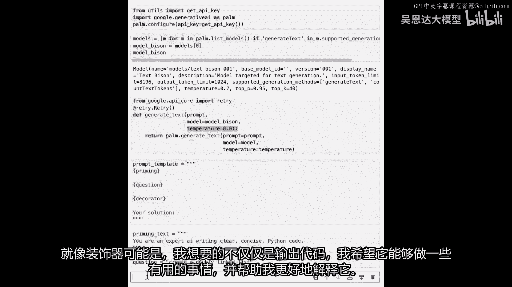

所以例如一步一步地工作，展示你的工作，并且每行一个步骤，所以也让我运行那个，所以现在我有我的初始文本，我有我的问题，并且我有我的装饰器，所以现在当我想要获取我的提示时，我只想要执行字符串格式化。

所以Python中的字符串格式化将像这样工作，所以我要说，我的提示是我在这里创建的提示模板 format，我的预热将是我设置的预热文本，所以这将被预热文本替换，我的问题将是我设置的问题。

所以这将被这个替换，最后，我装饰器将是这个，所以，我的命令最终变成了所有这些事情，如果我现在运行它，我的命令已经设置好了，如果我想要打印那个命令，只是为了我可以看到它看起来什么样子。

我可以这样做并运行它，我们现在可以看到。

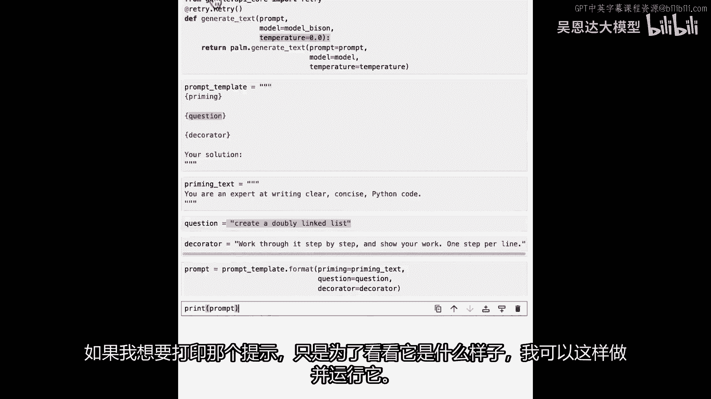

你知道我在说什么，你是一个在清晰、简洁的Python代码中专家级别的数组，创建一个双向链表，一步一步地工作，一步一步，一行一行写你的解决方案，那个额外的空格使得这里看起来有点凌乱。

所以你也可以做这样的事，你知道，在这里清理一下，或者你知道我可能因为那里有一个额外的空格而打错了，它正在执行，但那没关系，当你把它传递给模型时，模型对它是完全没有问题的，让我们试试看。

我只是打算做我平时的事情，我将指定我的完成将是生成文本，传递那个提示，然后我们可以打印出那个结果的结果，我们将运行那个，它将需要几秒钟，这就是我们现在得到的输出，这非常有趣。

所以我让它创建了一个双向链表，我让它，而且它给了我看起来像是一个双链表，我们可以通过这种方式检查它，如果有需要，我们可以编写一些测试用例来探索它，嗯，但我已经让它一步一步地工作并展示每一步的工作。

这可能不是对这种问题的最佳提示，这几乎看起来像一个装饰器，是你会做的，如果你在问它解决某种谜题或类似的事情，但让我们考虑一些更适合编程的事情，所以，而不是说，一步一步地完成它。

并将你的工作一行一行地展示出来，我们如何做像这样插入注释，嗯，对于每个，行代码。

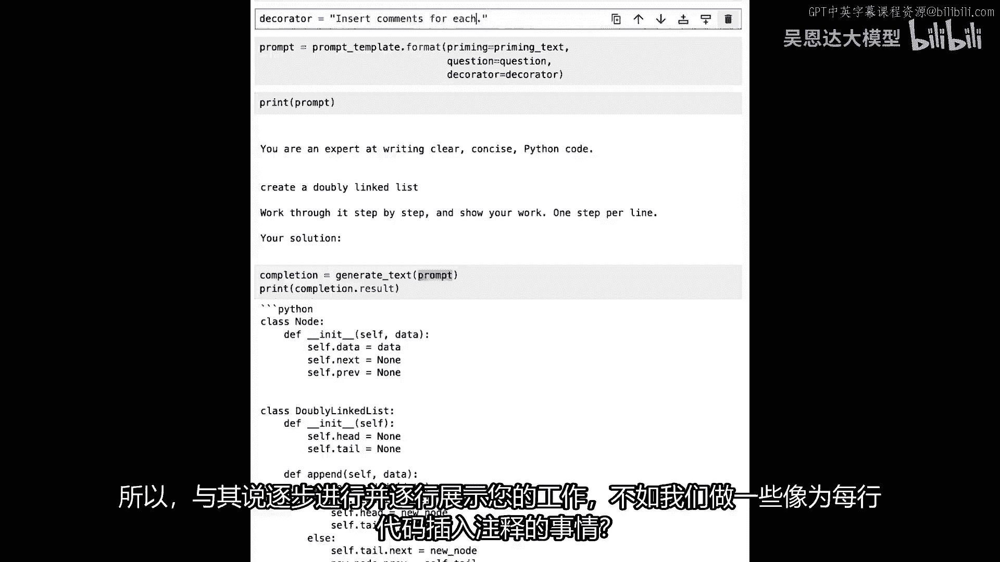

所以如果我把我的装饰器更改为现在这个样子，这是对编程来说稍微更合适的一种方式，我重新创建我的提示。

我打印我的提示，你现在可以看到我的装饰器是插入注释对于每行代码，现在我得到了完成，让我们看看它能给我什么，现在我们正在获取一些评论，我们有一个节点和一个双链表，我们在这里用给定的数据初始化了节点。

类双链表，有注释w链表，等等等等，所以这看起来稍微好一点，因为我更加明确，我对提示更加具体，当我们使用装饰器时，我们实际上并没有真正以程序员的身份思考，或者像那样，当我们说'一步一步地解决它'时。

似乎听起来很合理，一步一步地展示你的工作，但是，这并不是当一些东西正在创建代码时真正会发生的事情，我说那将是一些事情，如果是解决一个谜题的话，它可以证明它如何解决那个谜题，所以，总是有一些东西要注意。

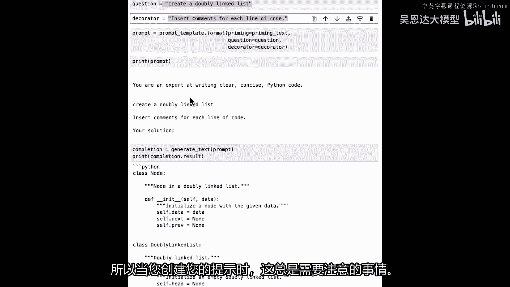

当你创建你的提示时，模板化的一个优点是，像这样，你就可以保持提示的主要部分而不改变它们全部，总的来说，我做的事情就是，在这个情况下，我需要改变装饰器和它可能会很有趣，想出你想要做的不同装饰器。

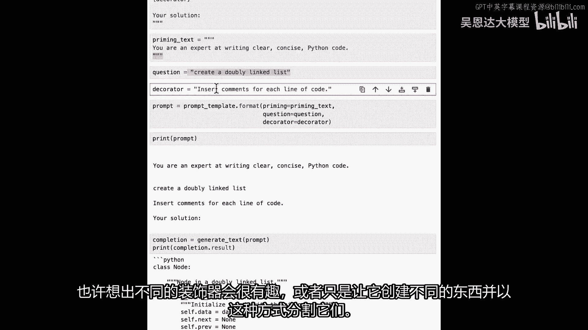

或者只是让它创建不同的东西并像这样分开，但我们可以看到那个代码的输出正在发生，我们应该尝试一个更复杂的场景，你说呢，所以我要创建一个新问题，所以创建一个非常庞大的Python随机数列表。

然后编写代码来排序那列表，经典的计算机科学问题，这个完全未经排练，所以希望它能工作，所以这是我的新问题，所以我将保持相同的提示文本和装饰器，所以现在我只需要创建一个新的提示。

所以让我用命令c创建那个新的提示，我会回来，我会运行那个，"嗯，我会打印我的提示"，我以韵律说话，"好的"，"所以现在我们可以看到你是写清楚文字的专家"，"简洁的Python代码"。

在Python中创建一个非常大的无序数列，"并编写代码来排序那列表"，"为每一行代码插入注释"，"你的建议是什么？"，"现在 all 我需要做的就是"，生成完成并打印出来，再次，这与之前的代码相同。

完成等于，为那个提示生成文本，现在的提示读作这样，然后打印结果，所以，当我运行它时，鼓点响起，让我们看看能得到什么，好的，嗯，那真的很快，给了我们很多东西，所以首先。

随机数等于随机的0到100之间的数字，对于空白和范围到10万的数字，对，所以现在我已经有了一个随机数列表，让我试试看，如果我复制那个代码，将我在笔记本中的Python代码复制并运行，什么是随机数。

看起来像这样，你知道，打印，希望它不会把笔记本打破，运行它，哦豁，嗯，随机未定义因为我还没有导入random，让我们看看随机是否支持，好的，现在我可以让它打印随机数。

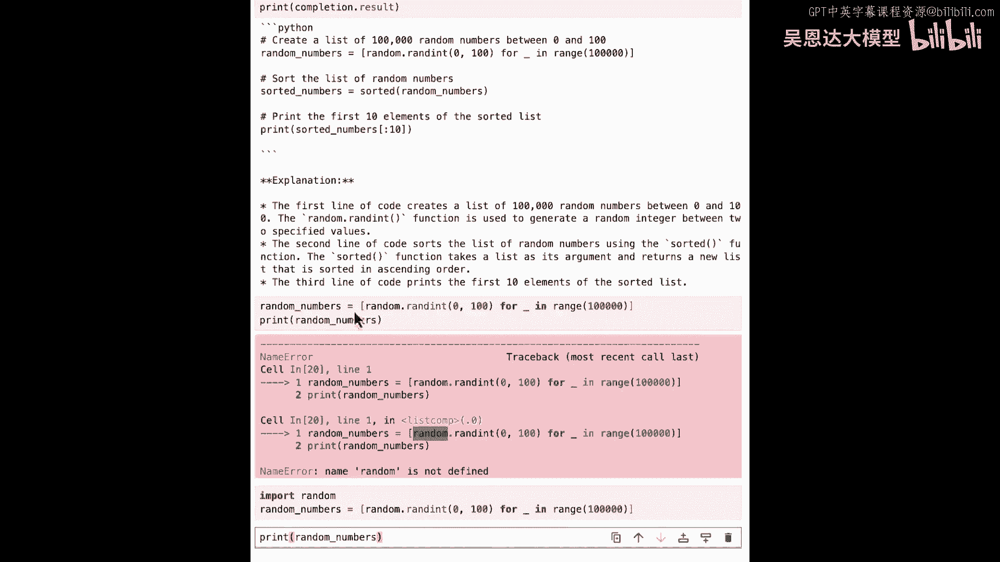

我们得到了这一大列表随机数，它们，嗯，可能会耗尽内存，而且深度学习的所有人都会对我很不满意，所以让我回到那里。

这里有10万个数字在打印，但我们可以看到生成的代码已经工作，但我要删除这个单元格，在它耗尽虚拟机内存之前，所以让我删除它。

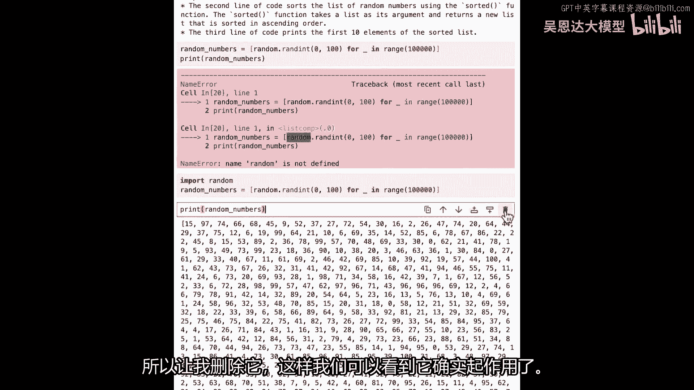

所以我们可以看到那实际上工作，所以那是创建随机数和排序的数字等于排序的随机数，嗯，我不知道这个排序是什么，好的，我知道一些Python，那里可能存在一些东西，有一个导入的函数，能够接受。

这给了我能力去外面尝试并找到它，并查找它，如果现在我尝试运行它，什么也不会发生，我需要导入一个库。

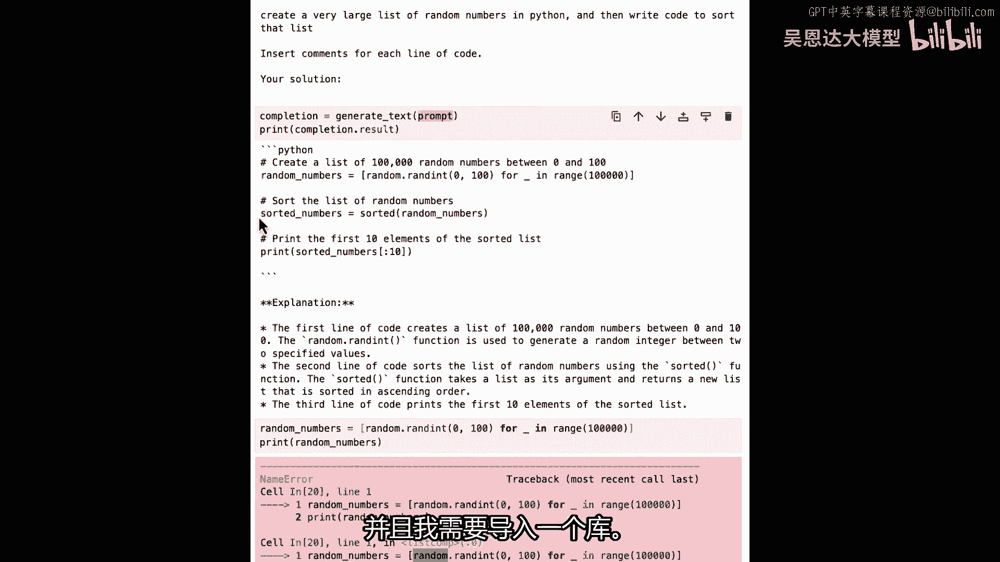

但让我们看看，所以如果我运行那个，做这种事情的乐趣在于你可以自己尝试这些，如果我说打印打印排序的数字，是否工作，这是许多数字。

如果我说打印排序的数字，它实际上工作了，所以排序作为一个依赖项已经包含在这个笔记本中。

我们可以看到我的10万个数字已经被排序。

这不看起来很棒吗，实际上，代码是运行的。

信不信由你，所以这只是一个很好的例子，就像这样，生成的输出代码更加聪明，而不是打印它们全部，它只是打印了前十个，但是，解释又给我解释了。

因为这就是我预热的方式，你知道，我告诉它它是写清晰简洁Python代码的专家，我给它了这个复杂的任务，我让它为每行代码插入注释。

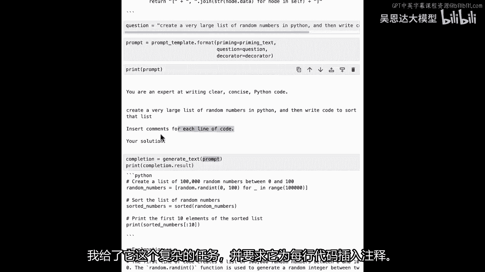

我认为这很酷，所以再次，当你在做这些事情时。

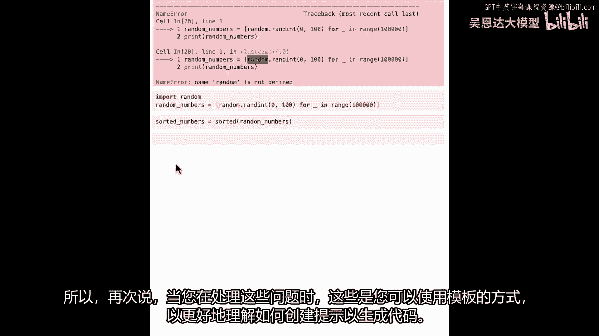

这些是你可以使用模板来提高自己理解方式的方法，如何创建一个提示，以便能够生成代码，但是在下一堂课中，我们将要做的是，我们将处理一些非常有趣的编码场景，在这些编码场景中。

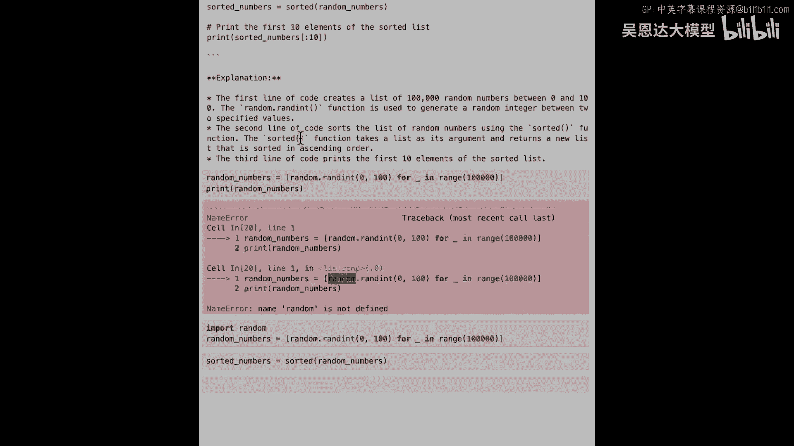