# LangChain_微调ChatGPT提示词_RAG模型应用_agent_生成式AI - P61：4.SC-Laurence_L3_v04.zh - 吴恩达大模型 - BV1gLeueWE5N

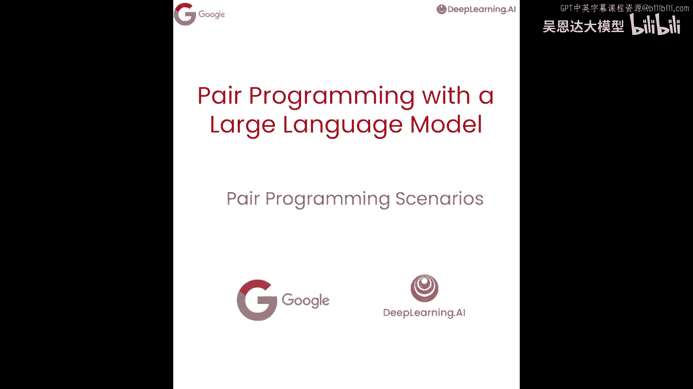

即将开始，我已经创建了许多场景，在那里，你可以看到llm如何成为一个有价值的助手，它能够响应你的编码需求。

与仅仅取代程序员的东西不同，让我们深入探讨一些，但我相信你可以想出许多许多更多，我希望通过这些，你会想出一些自己的想法。

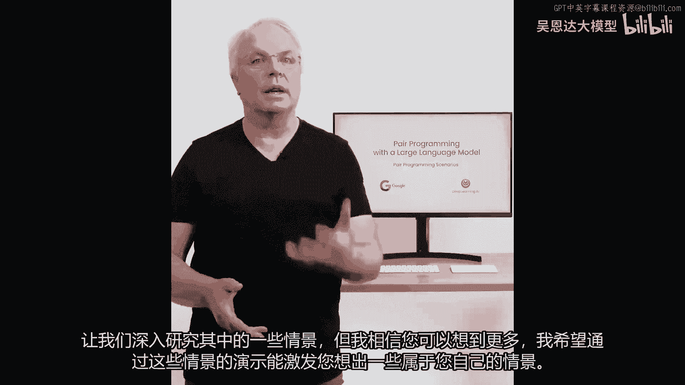

需要注意的一件事，到现在为止，生成的代码容易出现幻觉。

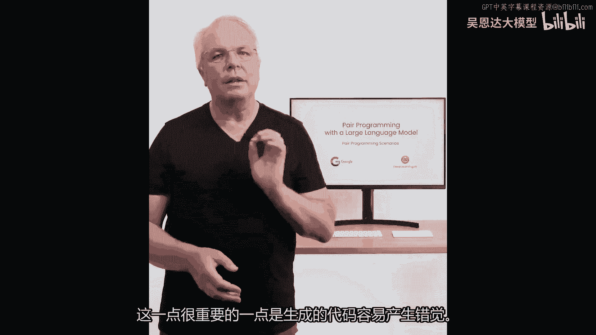

确保在将其用于任何严肃用途之前彻底测试一切。

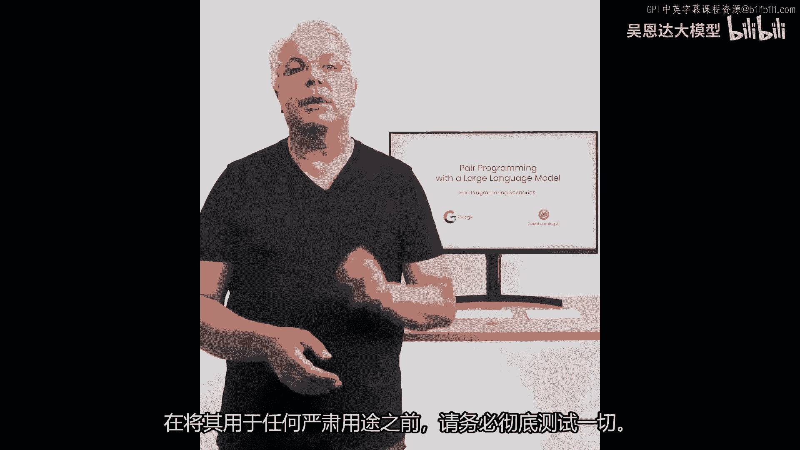

你可能得到的代码可能与我收到的不同，所以。

如果你看到任何变化，这是因为模型输出中的随机性水平。

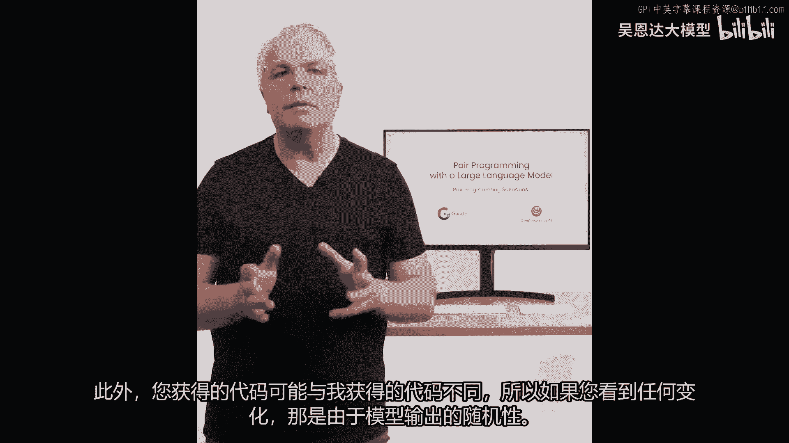

我在笔记本中为你写了很多，你可以尝试。

这些都是存在现有代码的场景，也许你写了它，也许你从别人那里继承了它。

甚至在llm中甚至为你创建了它，但我们将一起处理一些它们。

然后你将看到如何从一个llm中获取帮助来完成许多常见任务。

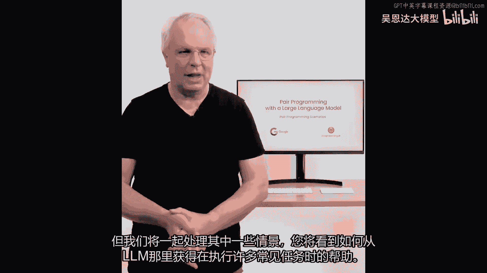

这些中的第一项，当然，是如何改进现有的代码，而且，当你创建代码时，特别是在一种你并不熟悉到极致的语言中。

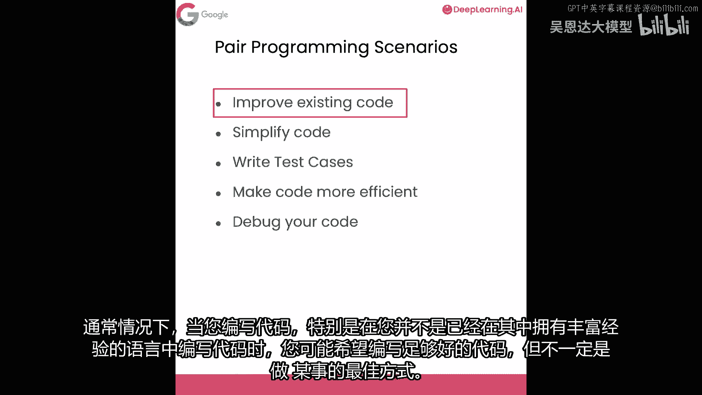

你可能想要编写足够好，但并不是做某事最佳方式的代码，例如，Python是一种非常容易学习的语言，如果你从其他语言来学习Python，你可以按照那种语言的方式去做事情，而不是Python最擅长的方式。

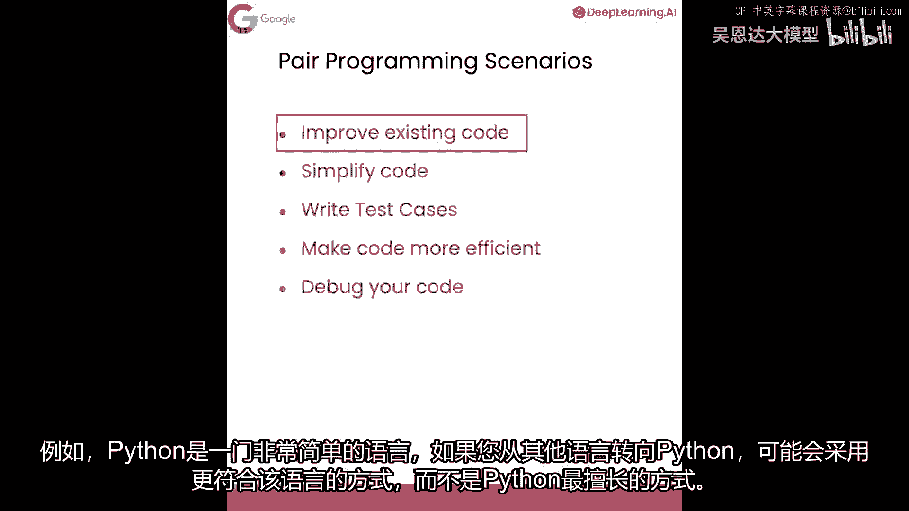

在这里，一个nlm将会非常有用，一会儿，我们将会查看它，对于笔记本和我已经写的代码，技术上是正确的，但在Python中，这不是最好的做法，而且llm不仅会为我修复它，还会解释它为什么这样做。

这将帮助我更好地成为一名程序员，那么，让我们开始使用笔记本，我们需要做几件事，这些是我们需要导入和设置环境的东西，首先，我们需要从uti's获取我们的api密钥，我将导入api密钥。

我将使用谷歌生成式的，Ai库导入它们，我喜欢称它们为tom，然后，我会简单地配置它，传递它，api密钥，所以现在手掌自己已经设置好了API密钥，我们的下一步将是遍历模型并找到支持，生成文本。

正如我们 earlier on 看到的。

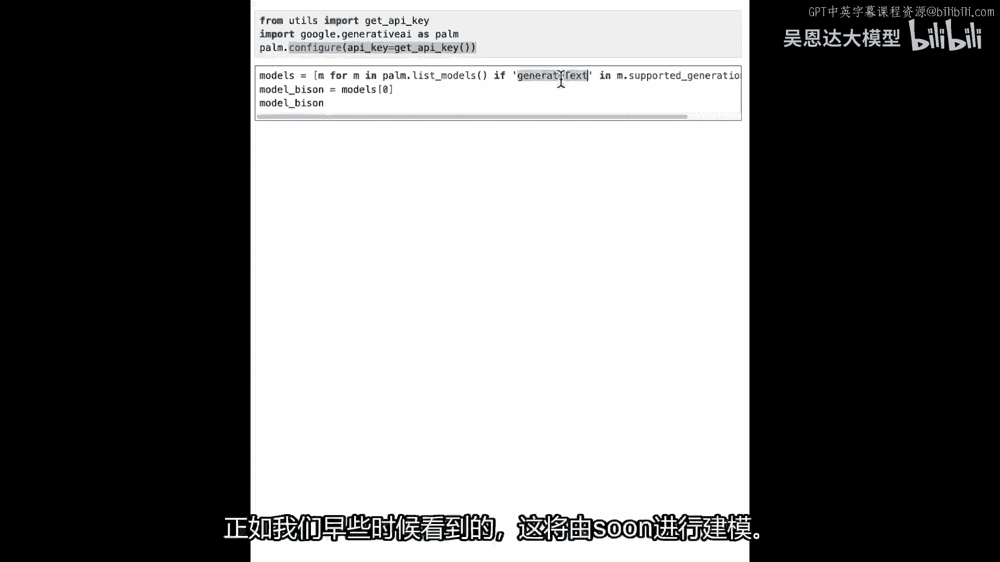

这将被建模为野牛，我只是再运行一次，并且我们将看到目前我们拥有的一个模型，在你运行这个的时候，在我拍摄它之后可能会有其他的，你可以考虑使用那些，如果你想要，"但是。

我将使用支持该功能的模型文本bison zero zero one"。

"然后，最后你需要做的三件事之一是启动运行"，"是设置我们之前讨论过的生成文本助手函数"，"并且我们一直在使用"，"在这种情况下，我们将导入重试"，"然后这次重试将"。

"当它正在做向后端服务的后端调用时"，"正如我们对棕榈树所做的那样"，"这只是确保如果任何事情失败"，"它将如名称所暗示的那样重新尝试"，然后，我们的生成文本包装函数将包裹手掌，生成文本函数。

将它的参数传递给它，但在这种情况下，例如，做一些像覆盖温度这样的事情，默认温度，正如你可以看到，对于野牛是零点七，我们将其覆盖为零点零，所以只是为了我们可以有一些更确定的输出。

所以现在我们已经一切都运行起来了，"让我们开始看看我之前提到的代码"，所以，"我将使用更简单的提示模板版本"，"我们在上一节课中使用的"，"我刚刚在代码中硬编码了启动器和装饰器"，"所以，在这种情况下。

我的前馈是"，我认为用Python这样写代码不是最好的方法，"你能帮我吗？"，"然后，装饰师是"，"请详细解释你如何改进它的"，然后当然问题会问，我在哪里插入代码，所以这是我的提示模板设置。

所以这是我的问题，我的问题就是我在Python中有这个函数，在Python数组上有这个函数，它会遍历数组的长度并打印出数组的详细信息，打印出像数组i这样，数组的特定索引的内容是什么。

这是一段好Python代码吗，还是一段坏Python代码，很好，我们正在让引擎说，你知道我们不认为这样做是最好的方式，你能帮助我们吗，引擎将给我们什么结果呢，让我们试试看，所以现在让我们看看。

让我们获取完成等于生成文本，然后我们说我们的提示等于提示模板，点格式，问题等于问题，然后我们关闭我们的括号，我总是忘记那个，然后打印完成点结果，在这里，我们可以看到有一个完成，我们将要请求它。

这仅仅在将问题传递给提示模板，并打印出结果，让我们运行那个，现在，我们将看到发生了什么，它说嗯，这是一种更好的做这件事的方式，Funk x。

而不是迭代for i in range len array print array，我，我们可以开始使用星运算符，然后它会回来，它会告诉我，我通过使用星运算符将数组解包为单独的参数来改进了代码。

那个打印函数，这比使用for循环更简洁和高效，我今天学到了一些新东西，我希望你也学到了，所以这很好，这给了我们一种做它的方法，用更Python的方式来做，如果你来自学习基本或C或Pascal或Java。

或者像这样的东西，你可能更习惯于我在问题中使用的循环类型，但我们能否再进一步，以一个新的提示，可能有多种方法来做这件事，所以让我们看看是否有另一种方法我们可以做这件事，所以我要更新提示模板。

并且我将添加一个新的装饰器，所以请探索解决这个问题的多种方法，并解释每个，这是我的新提示，让我们看看它做什么，问题是相同的，是相同的代码，所以我只会做同样的事情，完成等于生成文本，传递它，新的提示。

这个提示模板是什么，产生了什么结果，让我们看看它给我们返回什么，好的，所以现在我们得到了大量的文本首先返回，我们有几种方法可以改进它，首先使用列表推导式，你可以看到，这允许你为列表中的每个元素打印元素。

列表推导式是Python的一种非常强大的方式，接下来是enumerate函数，如果我们想要这样做，它返回一个迭代器，该迭代器将产生数组中每个元素的索引和值，我们可以使用它们来打印出来，或者如果我们想要。

我们可以使用map函数，函数然后应用一个函数到每个元素，使它成为一个间隔，允许我们以某种自定义格式打印每个元素，如果我们想要，然后真的很棒，它可以给我们这个比较三个方法的表格，不幸的是。

输出表格的格式在Jupyter Notebook中看起来不好，在这里我们可以看到的，但最终我们可以看到三种方法，这个推导式简洁，但可能难以阅读，对于复杂的代码，enumerate易于阅读。

但它需要额外的变量，需要额外的内存来存储索引，和map是灵活的，但当然，需要自定义函数来格式化输出，所以有很多很多方式可以切分这个问题，我认为使用大型语言模型一个非常非常好的地方。

仅仅是对提示的微小更改，以及对我们正在要求的内容更加明确，我们可以得到大量的有价值的数据。

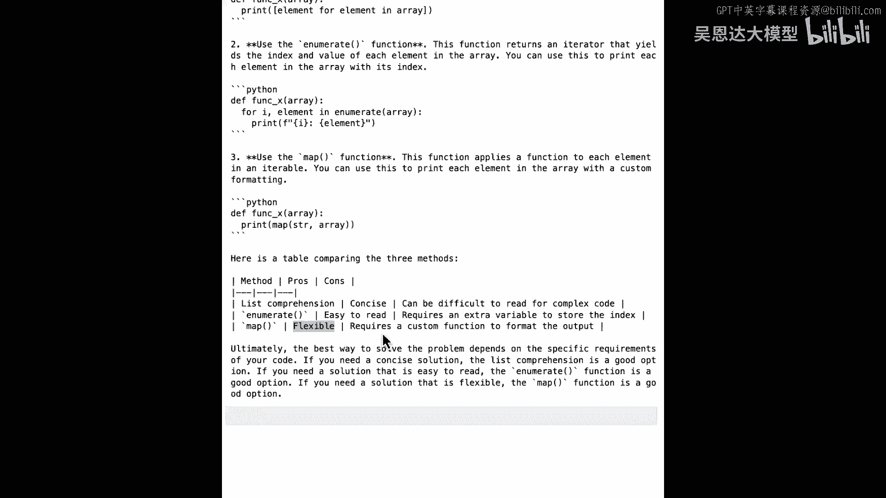

我们可以得到许多我们可以使用的东西。

来进一步查找，如何做，并尝试我们的代码，并使我们的代码更好，所以，我鼓励你思考你现有的代码，甚至是一个非常简单的代码片段，如这个，也能为我生成大量的智能，思考你现有的代码，思考像这样一个提示。

并使用这样的提示来理解你的代码更好，这样你就可以成为一个更好的程序员，所以，我想鼓励你思考你现有的代码，甚至一个简单的代码片段，如这个，都能为我生成大量的智能，思考你现有的代码，思考像这样一个提示。

并使用这样的提示来理解你的代码更好，以便你可以只是一个更好的程序员。

你现在可能已经听说过Python这个词，人们总是好奇，用Python最正确的方式怎么做，嗯，你知道你可以问十个不同的人。

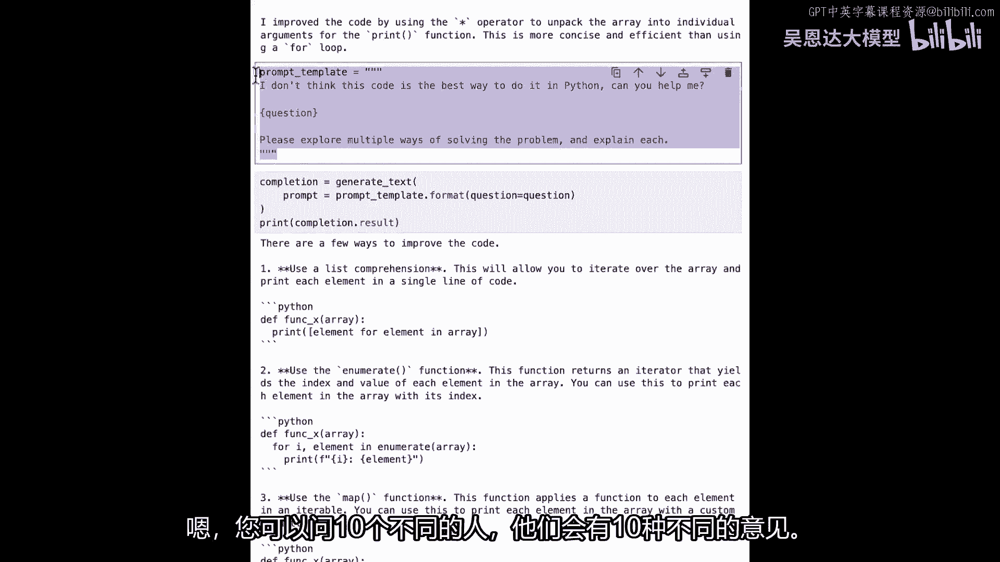

他们会有十个不同的观点，那么为什么不问问一个大型语言模型，看看大型语言模型的观点是什么，所以我要把我的提示模板再粘贴在这里，以及说，探索解决问题的多种方法并解释每个，为什么不说我只是。

请探索解决问题的多种方法，并告诉我哪个是最Python的，我们现在实际上是在让它有观点，这是一个非常有趣的领域，所以现在我有我的新模板，请探索解决问题的多种方法，并告诉我哪个是最Python的。

和以前一样，我的结果，生成文本，处理提示，然后打印完成结果，所以让我们运行那个并看看我们能得到什么，好的，所以现在它正在给我们提供很多东西，有几种方法可以解决这个问题。

最Pythonic的方式将是使用列表推导式语法，这是我们之前有过的第一个。

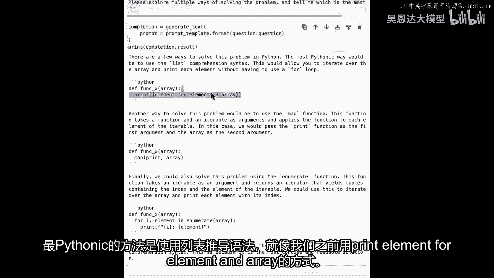

我们使用print元素来遍历数组，解决这个问题的另一种方法是使用map，另一种方法是使用enumerate函数，有趣的部分在最下面，在这里，它在给我们提供它对这三种解决方案的看法。

最Python的是使用列表推导式语法的第一个，这是因为它是最简洁和可读的解决方案，再次，我们看到它不仅生成代码，不仅改进我们的代码，还可以对代码有看法，从这些看法中，也许我们也可以学习成为更好的开发者。

好的，下一个，让我们看看简化代码，与前一个例子相似，这是一个常见的场景，你已经写了可以工作的代码，但你想知道，持续的代码维护是否可以通过使代码更简单来改进，通常。

你会有一个代码审查者来看你的代码并提出建议，但可能并不像经常那样你有一个，在这里，一个llm可以在笔记本中发挥作用，我们将看看一个完全良好的链表类，那已经在Python中实现了，但是。

其中的一些部分可能并不是最美观的，在代码审查者可能会注意到这一点并要求你更改它，但是让我们看看使用Palm API的大语言模型，是否能为我做同样的事情，所以让我们从我的简单Prom模板开始，我说，你能。

请为Python中的链表代码简化这个代码作为入门，我将传递这个问题，然后我的装饰器，我说，详细解释你如何修改它，并解释为什么，如果我运行那个，我开始设置Prom模板，现在我要粘贴我的链表代码。

所以这是我的问题，我正在粘贴我的问题作为链表的代码，看看是否有，嗯，在房间里的计算机科学教授们，你可能想要避开一下，因为它并不漂亮，但我们可以谈谈一下，所以链表，每个链表都是由多个节点组成的。

那些节点包含一个值，我称之为数据val，和一个指向下一个节点的指针，我刚刚实例化为none，因为我只是在这里定义类，然后当我创建单链表时，我将创建第一个节点，它将有一个头值，所以链表。

第一个节点被称为头，所以我们将从head val开始设置为none，所以现在我开始实例化这些我定义了类的东西，所以列表一将是一个单链表列表，一的head val将是一个节点叫做Monday。

然后我将创建一个节点叫做E2，这将是一个节点，其中数据是Tuesday，E3将是一个节点，其中数据是Wednesday，所以现在如果我想要这个成为链表，那么列表一的head val，下一个val是E2。

所以Monday的头val将指向E2，也就是Tuesday，然后E2的下一个val是E3，这将是Wednesday，这不很漂亮，我在创建列表时，然后我正在创建单个节点，然后我指定列表。

Head vals，下一个文件是那些节点的一个，并且所有这些种类的东西，正如你可以看到的，代码并不很好看，正如你可以从表面上看出来的，但我要求提示做的事情是，能否请简化这段代码，我稍微作弊了一下。

因为我告诉它它已经是一个链表，我没有要求它试图找出它是否是一个链表或不是，然后，我认为最重要的可能是详细解释你做了什么，修改它和原因，并且这个装饰器是你开始变得创造性的地方，你可以尝试，你知道。

正如我们之前展示的那样，看看我们是否能得到更好的结果，所以现在我们要去，并且用我们的常规代码，我们将获取完成并打印出完成，让我们运行它，看看会发生什么，所以这里是输出和输出，你可以看到。

节点的类并没有改变太多，而且，链表的类本身也没有变化太多，它通过使用数据稍微清理了一些，而不是数据val和类似的东西，所以它稍微干净了一些，但是，它做的一个大事情是，它为我们提供了一个帮助函数。

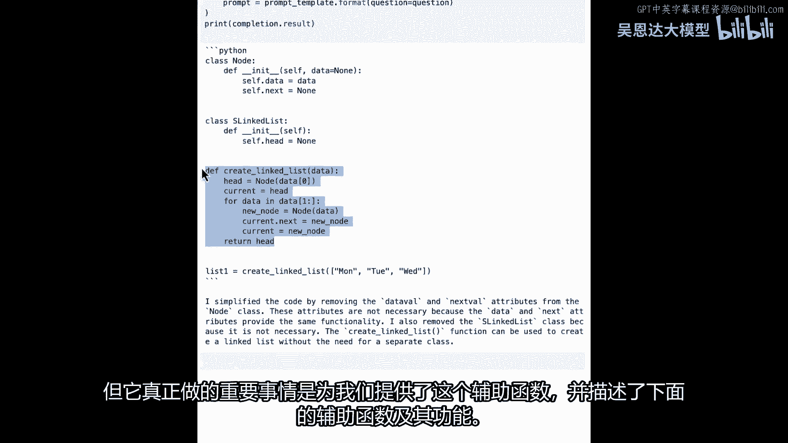

并描述了下面的帮助函数和它在做什么，当使用像这样的帮助函数时。

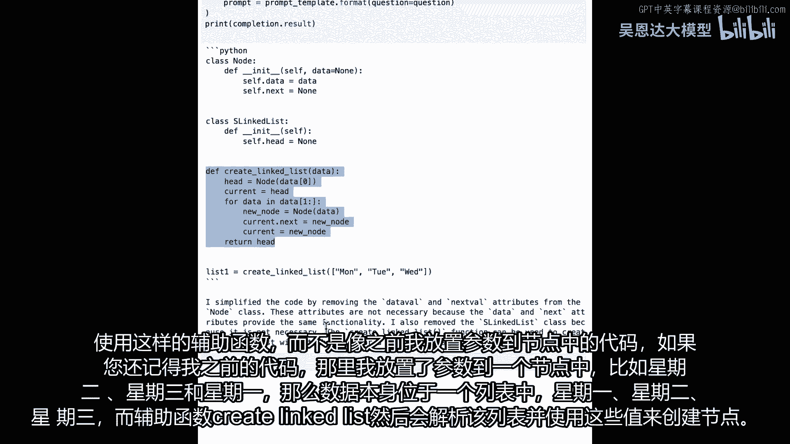

而不是我有代码，如果你记得我之前的代码。

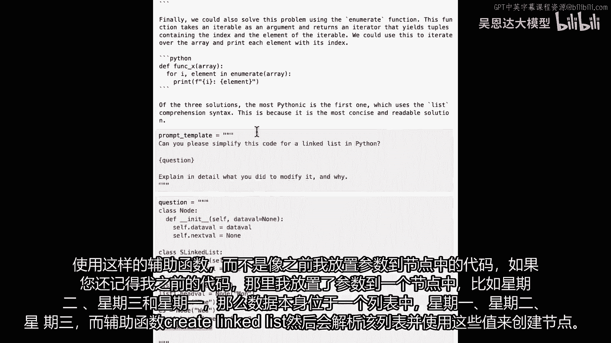

我在哪里像是把参数放入节点，就像星期二、星期三和星期一，数据本身在一个列表中。

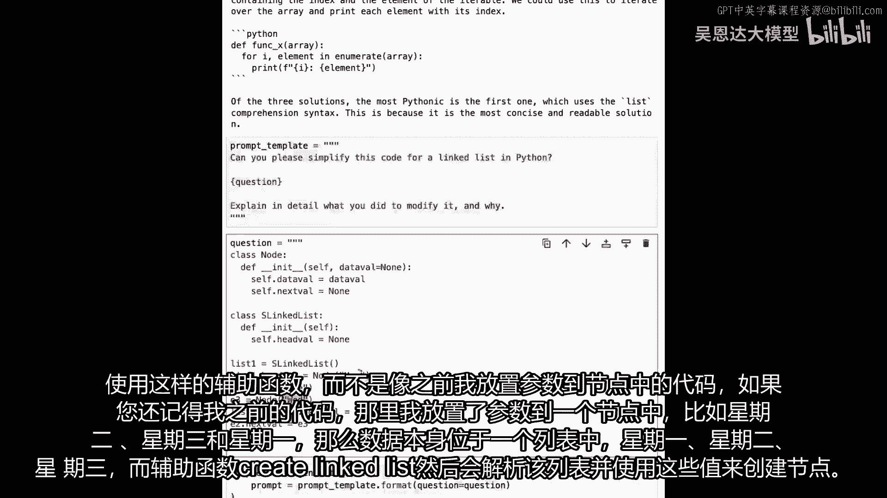

星期一、星期二、星期三和辅助函数，然后创建链表将遍历那个列表，使用那些值在这里创建节点。

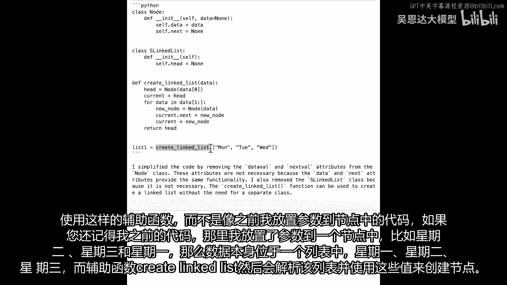

他们被称为新节点，等于数据的节点，然后将前一个节点链接到新节点，因此创建了一个单向链表，现在看起来还不错，但我们可能能使其更好。

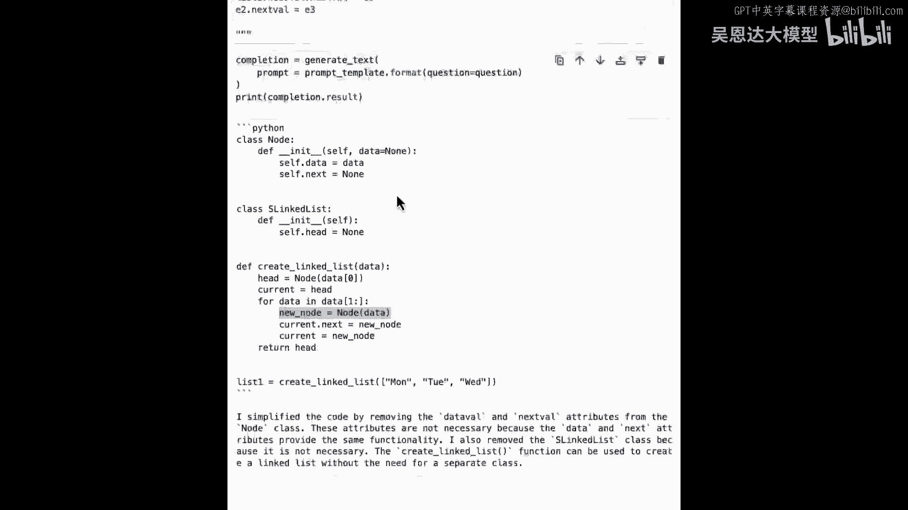

那么如何使其更好呢，嗯，让我们回去，也许稍微改变一下提示，所以除了说，简化这个Python中的链表代码，我要说你是Python代码的专家。

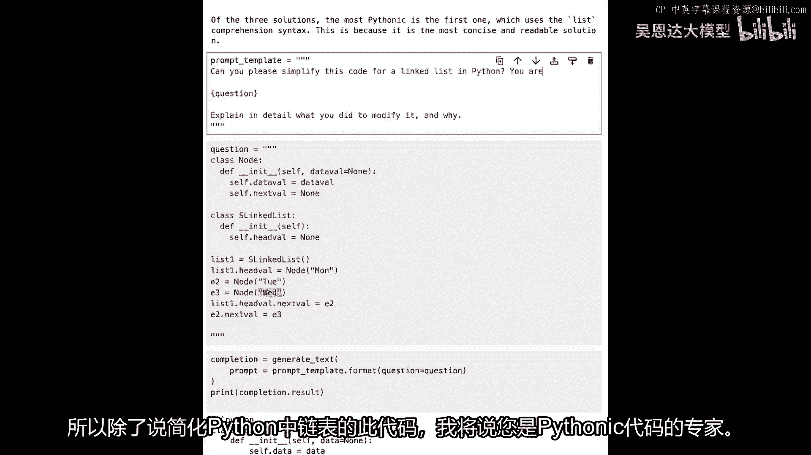

以及除了说，详细解释你如何修改它，以及我要说，请详细注释每一行并解释你需要做什么，你如何修改它，所以我改变了我的提示，成为那样，现在如果我生成我的文本，因为问题仍然相同，让我们看看是否给我不同的结果。

这是我的新输出，所以现在我们可以看到像，例如，我已经定义了我的类为一个节点，它正在给我为那个节点的注释，它也正在给我关于我如何初始化节点的注释，同样，现在这是我的单链表，类有了更多的内容。

不再仅仅是能够以self。dot。head等于None来初始化，实际上添加了一个辅助函数。

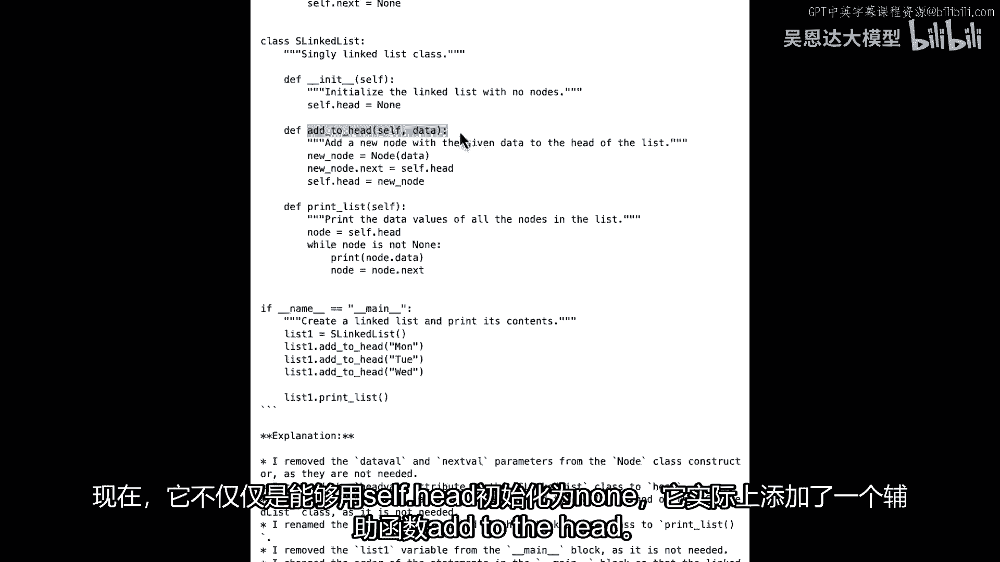

添加到头部，并添加了另一个辅助函数，打印出列表，现在我在Python中，我可以只是列表一等于单链表，列表一添加到头部。

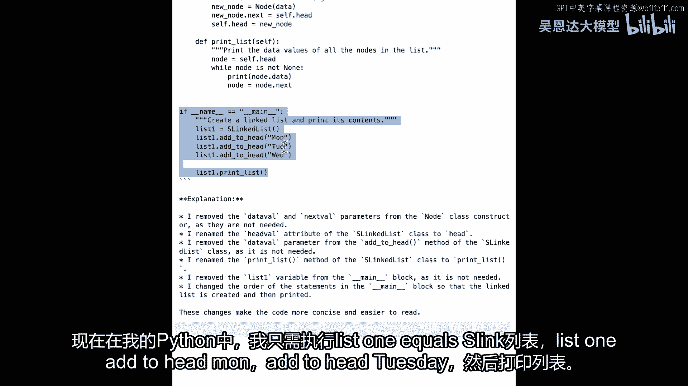

在头部添加元素并咀嚼，添加到周三，然后打印出列表，以及它完成后会给我们所有这些关于完成的细节，并且它相信这些更改可以使代码更简洁，更易于阅读，但我一直说过。

你不总是想要完全信任来自像这样的东西的输出代码，我发现的一件事是像它这样的功能被叫做，在头部添加，但当你在创建链表时，你实际上每次添加都不是直接添加到头部对吧，你知道你向链表中添加的第一个元素将是。

头部将会很好，它将成为头部，但是，然后链表中的第二个元素是，第一个元素指向它，链表中的第三个元素是is，第二个元素指向那个，所以，这个函数的名字可能不是最好的一个添加到头部。

它可能只是叫它添加节点或者什么的，所以，这些都是你需要注意的事情，"但你可以看到"，"生成的代码仍然在很大程度上帮助我处理我创建的链表。"，"它使它变得整洁得多得多"，尽管有这个小小的错误。

"而且那种整洁就是你能得到的"，"如果你有一个人类代码审查员在你身后检查"，"但现在，你是从一个大型语言模型中获取这个的，因为编写代码的人"，"你往往过于接近你的代码，无法真正测试它"。

"并找出代码可能崩溃的边角情况以及其他潜在问题地点"，因此，如此优秀的，自动化测试很重要，在这个过程中，第一步是创建一些单元测试，以确保你的代码将按预期工作，对于大型语言模型。

你可以将代码交给它生成测试用例，以我们之前做的链表为例，Palm简化了我的代码，让我们回到笔记本，看看是否可以很容易地为所有这些方法在我的类中生成测试用例，我们将从我们通常的提示模板开始。

作为问题的概述，然后装饰器，所以我的概述将是，请为这段Python代码生成测试用例，我想强调的是，它们位于代码中，有时可能会创建只有一些文本，说你应该测试这个或测试那个，所以我非常明确。

我将把它作为问题传递给代码，然后我的装饰器又是通常的，详细解释你在做什么，以及这些测试用例旨在实现什么，让我运行那个，现在我会给它代码片段，这是以前我们输出的一个链表，如果它看起来熟悉。

是我们做的第一个之一，这是我的代码，我正在运行它，这是我的通常做法，我有在我的链表中创建了一个节点，这就是我有列表的地方，星期一星期二，星期三，它遍历了这个列表。

所以让我们看看对于这个的一组测试用例会是什么样子，就像以前，我将通过生成文本来获取完成，然后我将传递它，带有问题作为参数的提示，让我们运行这个，看看我们会得到什么，现在，我们为我们创建了大量的代码。

我有一个新的类被创建了，叫做TestSLinkedList，我还在Python中导入了单元测试库，这是一个看起来很好的开始，现在，正在测试创建链表，它将测试在链表中插入一个新节点。

甚至将测试从链表中删除一个节点，然后它将定义所有这些是什么，例如，它将告诉我如何删除一个节点，它将实际编写那个代码，并将确保它返回的值是正确的，所以这就是一个非常非常好的例子。

这是我们正在使用的一个非常非常简单的代码，但它是一个好的例子，展示了我们如何为我们的链接表找出一些测试用例，你可能已经注意到，例如，我们没有对我们的链接表做任何事情来删除一个节点，但一般来说。

如果你想要测试链接表看起来什么样子，当你删除一个节点时，所以这可能会启发你意识到你的链接表可能需要更好，那就是你可以回到你的链接表，以一个新的提示来更新它，因为你可以回去更新你的链接表。

以解决你可能发现的问题，请说能否添加一些代码以删除节点，然后这段代码可以用于测试它，所以这就是机器如何真正帮助你作为开发者的，如我所说，它激发了灵感，它给出了新的想法。

它可能会帮助你发现你没有明确告诉你的事情，所以又是很棒的，能够做单元测试是一件很棒的事情，不仅仅是有代码生成来为你做测试，而且让它想出测试用例，你可能没有想过自己可能有的，现在。

我使用llms作为对偶时特别兴奋的一件事情是，程序员是，当它分析代码时，它是从中立的位置在做的，它并没有真正投资于任何特定的算法或方法论，因此，它可以给你对你的代码一个非常新鲜的视角。

这可以帮助你提高效率，例如，当与手掌和二分搜索树算法玩耍时，我使用了一种使用递归的方式构建二叉搜索树的代码，没有意识到这可能是对递归的一种有些浪费的使用，也许不是最佳搜索二叉树的方式。

一个llm可以立即发现这个问题，并给你关于如何通过，可能不使用内存密集的递归来改进你代码的建议，这是一个提醒，作为对程序员的搭档，应该有llm，来探索你的代码，你永远不知道它可能产生的想法。

那么让我们进入笔记本，让我们看看如何使我们的代码更有效率，所以让我们从提示和我们的提示开始，我们的提示将与之前相同，我们将通过说嘿来预热它，请使这段代码更有效率，我们将传递问题，然后我们的装饰器。

我真的喜欢装饰器，某种东西，你可能已经见过几次了，详细解释你在做什么，你在哪里改变了，并且为什么我现在要提出这个问题，这里的问题是我在哪里创建二叉搜索树，在我二叉搜索树中，这就是代码，它是一棵朴素的树。

它正在做一些可能好的事情，它正在做一些可能不伟大的事情，我正在做一些像是大的，在这里的if else情况，然后我正在递归，通过让二叉搜索函数调用自己，所以递归是否是最好的方法来做好这件事。

让我们看看引擎告诉我们的，首先，让我运行这些单元格，嗯，使用我的提示模板，并且将它们中的问题放入其中，现在，我通常的，完成等于生成文本，通过提示传递并打印出结果，让我们运行这个并看看我们能得到什么。

现在，它需要一些时间，并将给我们这个代码，二叉搜索，但它说的有趣的一点是，它使用bisect函数来找到数组的中间元素的索引，而且名称的建议是，但如果你看Python文档中的bisect函数。

它实际上做什么的是，它将为您执行二叉搜索，它将不断分割列表，直到找到该元素，所以这里发生了什么，这个元素，它不是列表的中间，但它在数组中搜索x，然后，如果找到它。

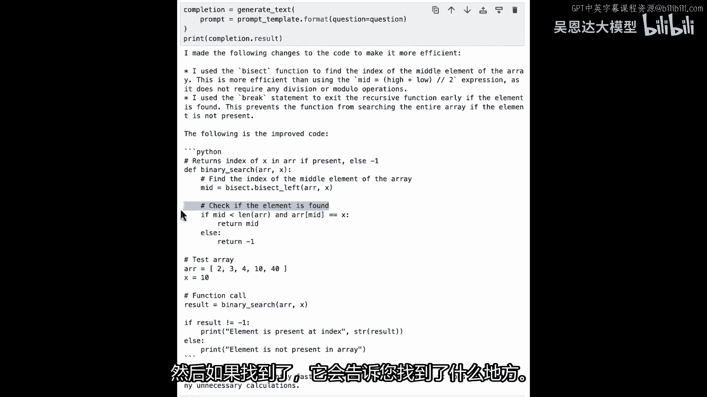

它将告诉您它在哪里找到它，所以如果我们能将这个Python代码，例如，并将其放入我们自己的细胞中并运行，看看会发生什么。

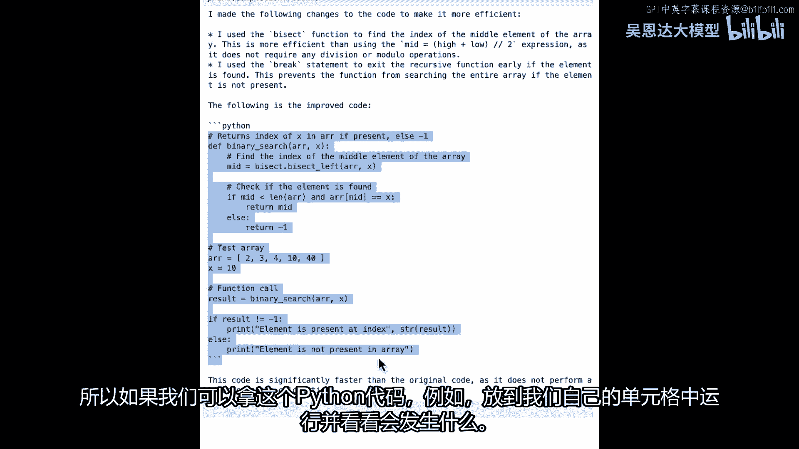

所以，嗯，bisect需要导入，所以我将导入bisect，然后运行这个并看看，好的，哦，删除这个，然后运行这个，现在，它说，元素在索引三处存在，所以零一二三，所以十在那里，如果我改变x，例如设置为十四。

然后运行它，它将告诉我们元素不在数组中，如果我把它更改为四十，如你所见，它是数组中的最后一个元素，实际上它在索引四中找到了它，所以它是像零一，二三四，所以它实际上正在正确工作，但这是一个非常好的例子。

表明，我们在处理幻觉时必须非常小心，因为这里为我们创建的代码，正在引导我们相信它正在找到数组的中间元素索引，因为这是它说的，但是二分查找远不止这些，甚至变量名称也让它听起来像是在找射线的中间，此外。

模型输出的说，它使用二分查找函数找到了数组的中间元素索引。

但实际上，它在为我们进行二分搜索，然后它也说它使用了break语句提前退出递归函数，但是在这里没有break语句，所以这是一个很好的例子，你知道，我们的代码正在变得越来越高效，我们得到了我们想要的结果。

但是，幻觉可能会让我们走错路，你自己试试看，看看使用llm的能力，你能想出什么。

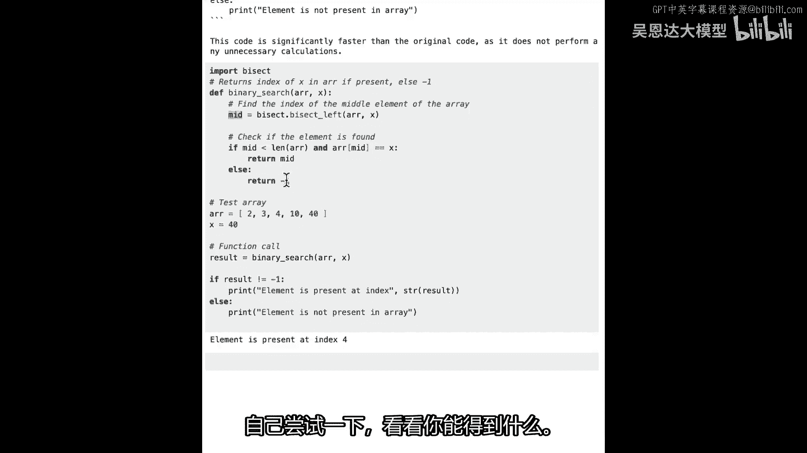

代码并不仅仅以我们所看到的这些结束，这只是几个简单的例子，还有一个真的很棒的，当然，能够识别代码中的bug是非常重要的，如果它们不会导致崩溃，往往很难发现bug，存在只在特定情况下出现的bug。

所以例如，当你稍后去查看笔记本时，我复制了一段实现双向链表的python代码，这来自一个在线教程，但我故意省略了一条线，你知道也许就是，如果我是学习者，我可能会错过输入那行，在这种情况下。

代码将没有错误运行，但是，当你使用它时，你会看到可能导致崩溃的缺失代码行，因为null指针，现在，大语言模型，让我们看看它是否足够聪明来发现这个，找到错误并建议修复，让我们切换到笔记本并试试看。

像往常一样，我将从我的提示开始，我的提示模板是，你能帮我调试一下这个代码吗，我会粘贴代码，然后详细解释你发现的问题，以及你为什么认为它是个bug，所以现在我会运行这个单元格，这里是双链表。

这是我从在线教程中获取的代码，我故意将这个bug引入到这个代码中，所以这个注释模型看不到，所以它只是为了你，但我将bug放在打印函数中，所以存在节点可以为null的情况，尝试打印它们将引发null错误。

让我们看看模型是否能找到它，这是我们的问题，这是我们的提示模板，像我们往常一样，我们将得到对这个的完成，并打印出这个完成，让我添加那个代码，所以现在让我们生成我们的文本，像我们往常一样的老方法。

我们从中得到完成，我们生成提示，使用提示模板并获取完成结果，让我们运行这个，我们看看，它做得相当好，它找到了bug在列表打印函数中，这是正确的，但是，如果我们看看我们为它创建的代码，它并不完全正确。

在这里发生的事情是，节点的null值被检查，它认为应该放那个检查，但它仍然在得到那里之前打印节点的数据，所以它并不完全正确，这是一个很好的教学时刻，这是一个很好的例子对我们。

能从模型输出的类型中受到启发。

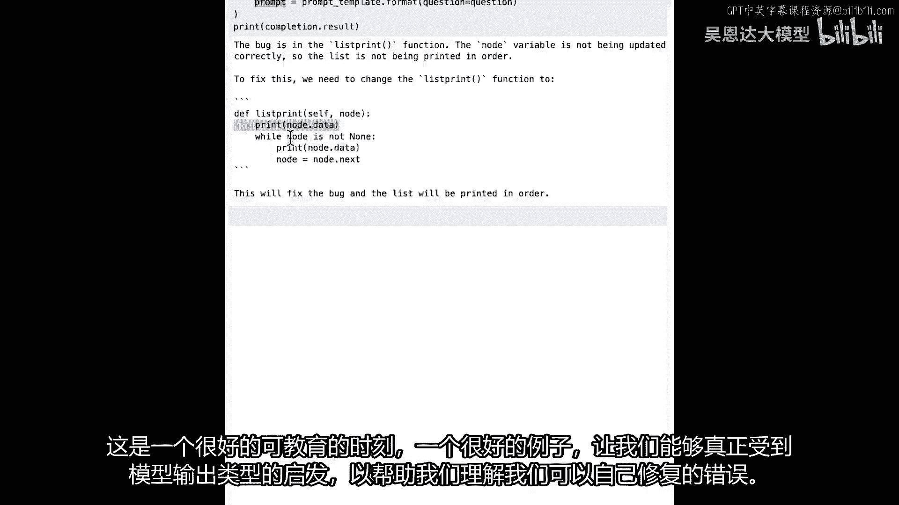

来帮助我们理解可以修复的bug，但我们也应该真正利用这个机会来理解我们的代码，并看看我们的代码中发生了什么，并找到可以在代码中找到问题的方法，这些方法受到llm的启发，而不是直接从llm复制和粘贴。

但是为了一些乐趣。

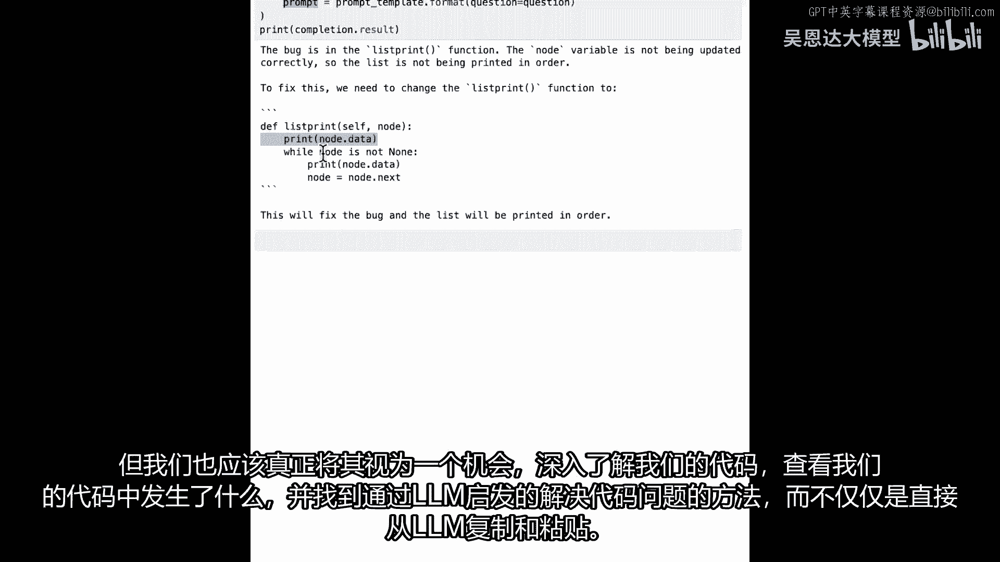

这也是一个关于我们之前讨论的温度很好的教学时刻，所以我将温度设置为零，但是，模型的， Bison 模型，默认实际上是零点七，所以温度越接近零， Bison 模型默认的温度就越低，所以，温度越接近零。

模型中随机变异的可能性越小，所以，如果一个值像零点七，更接近于一，我们在模型中就会得到一些变异，所以当我运行这个，我们可能会得到不同的结果，这可能可以帮助我们更好地理解我们的代码，再次。

它在列表打印函数中找到了它，这与我们之前得到的结果相同，尽管模型中有随机性，它几乎总是找到bug在列表打印方法中，这就非常有用，以便我们能够更好地发现bug，并尝试测试。

代码或测试模型给我们提供的一些代码。

