# P22：22.Week 12 – Lecture_ Deep Learning for Natural Language Processing (NLP) - 大佬的迷弟的粉丝 - BV1o5411p7AB

今天我们有迈克·刘易斯，他是Facebook AI Research的研究科学家，今天我们有迈克·刘易斯，他是Facebook AI Research的研究科学家，从事自然语言处理工作。

因此他之前是该大学的博士后，从事自然语言处理工作，因此他之前是该大学的博士后，华盛顿大学，与卢克·泽特洛梅尔一起工作，华盛顿大学，与卢克·泽特洛梅尔一起工作，以及基于搜索的结构预测。

以及基于搜索的结构预测，他在爱丁堡大学获得博士学位，他在爱丁堡大学获得博士学位，并且基于分布式和逻辑方法的结合，并且基于分布式和逻辑方法的结合，从语义上讲，他拥有牛津大学的硕士学位，并获得了。

从语义上讲，他拥有牛津大学的硕士学位，并获得了，2016年eml em nlp最佳论文奖。2016年eml em nlp最佳论文奖。因此，不用费劲，让我们开始今天的演讲，因此，不用费劲。

让我们开始今天的演讲，好的，非常感谢您介绍收音机并取代了我，好的，非常感谢您介绍收音机并取代了我。

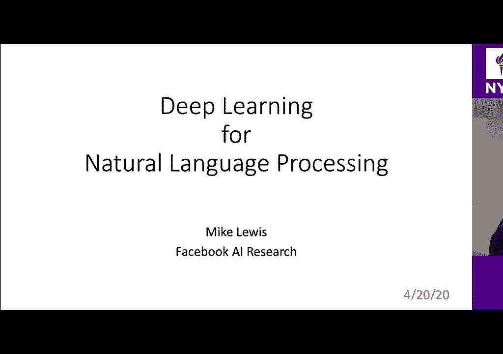

向土耳其人致敬，是的，这堂课只是想，向土耳其人致敬，是的，这堂课只是想，尝试并提供有关深度学习的高级概述，尝试并提供有关深度学习的高级概述，这些天用于自然语言处理，这些天用于自然语言处理。

所以我认为在过去的几年中，nlp确实取得了巨大的进步，所以我认为在过去的几年中，nlp确实取得了巨大的进步，玩深度学习多年，所以，玩深度学习多年，所以，这些天，我的意思是你可以得到机器翻译系统。

它将产生，这些天，我的意思是你可以得到机器翻译系统，它将产生，盲人叙述者更喜欢的翻译，盲人叙述者更喜欢的翻译，由专业翻译人员制作，您可以提出一些问题的答案，由专业翻译人员制作，您可以提出一些问题的答案。

你问他们一个问题的系统给我维基百科，你问他们一个问题的系统给我维基百科，他们会为您提供比种族更准确的答案，他们会为您提供比种族更准确的答案，人们会给你我想要的语言模型，人们会给你我想要的语言模型。

可以像这样产生几段流利的文字，可以像这样产生几段流利的文字，对于所有这些事情，如果您像五年前那样问我，我会，对于所有这些事情，如果您像五年前那样问我，我会，告诉过你，这绝对不可能，告诉过你。

这绝对不可能，可能在2020年，但嗯，似乎有一些，可能在2020年，但嗯，似乎有一些，已经介绍的技术确实具有，已经介绍的技术确实具有，产生了巨大的变化，实际上是一个非常好的属性，产生了巨大的变化。

实际上是一个非常好的属性，您可以使用相当通用的模型来实现所有这些功能，因此，您可以使用相当通用的模型来实现所有这些功能，因此，所有这些任务的所有模型实际上看起来都非常相似。

所有这些任务的所有模型实际上看起来都非常相似，嗯，只有一些非常有用的高级原则，嗯，只有一些非常有用的高级原则，嗯，所以我很快就会对此做很多介绍，嗯，所以我很快就会对此做很多介绍，所以请经常打扰我。

所以请经常打扰我，嗯对吧，是的，我应该说的一件事是，随着我们取得的所有进步，是的，我应该说的一件事是，随着我们取得的所有进步，在nlp中看到呃，我可能有很多东西，在nlp中看到呃，我可能有很多东西。

现在要告诉你，将在一两年内过时，现在要告诉你，将在一两年内过时，希望我们继续取得进步，希望我们继续取得进步，今天继续外出，今天继续外出，解释我们正在使用的一些模型，我想尝试一下并给您。

解释我们正在使用的一些模型，我想尝试一下并给您，关于什么样的原则行之有效的一些直觉，关于什么样的原则行之有效的一些直觉，希望它将有更多的保质期，希望它将有更多的保质期，好的，嗯，我想讲的第一主题是。

好的，嗯，我想讲的第一主题是，语言建模语言建模不一定是，语言建模语言建模不一定是，本身是有用的任务，但这似乎是非常好的，本身是有用的任务，但这似乎是非常好的，用于介绍稍后我们将需要的所有技术的构件。

用于介绍稍后我们将需要的所有技术的构件。

嗯，所以在这个例子之前，我不知道你们中有人，嗯，所以在这个例子之前，我不知道你们中有人，来自于2019年发布的名为gpt2的语言模型。来自于2019年发布的名为gpt2的语言模型。嗯，这是怎么回事，嗯。

这是怎么回事，有些人在这里介绍了一些关于嗯的介绍，有些人在这里介绍了一些关于嗯的介绍，科学家们终于听说了安第斯山脉的独角兽，它们显然会说英语。科学家们终于听说了安第斯山脉的独角兽，它们显然会说英语。

然后给定文本，他们要求该语言模型，然后给定文本，他们要求该语言模型，再写一些文本和统计信息，再写一些文本和统计信息，我们收到的文字确实令人印象深刻，就像每个人都，我们收到的文字确实令人印象深刻。

就像每个人都，震惊的是语言角色可以很好地工作，震惊的是语言角色可以很好地工作，去年，所以您可以看到嗯，方便的文字似乎实际上，去年，所以您可以看到嗯，方便的文字似乎实际上，可能有关这件事的新闻报道很合理。

可能有关这件事的新闻报道很合理，跟我说说独角兽嗯，文字语法很流利，跟我说说独角兽嗯，文字语法很流利，那里真的没有任何缺陷，而且似乎喜欢发明很多，那里真的没有任何缺陷，而且似乎喜欢发明很多，细节。

例如发现它们的科学家的名字，细节，例如发现它们的科学家的名字，嗯，显然所有这些都是胡说八道。嗯，显然所有这些都是胡说八道。但嗯，这一切看起来都不像，但嗯，这一切看起来都不像，我曾经确定模型曾接受过训练。

我曾经确定模型曾接受过训练，这段关于他的独角兽的故事没有，这段关于他的独角兽的故事没有，互联网上任何地方的邻居，这都是全新的语言，但是，互联网上任何地方的邻居，这都是全新的语言，但是。

所有实际上质量很高的文字，所有实际上质量很高的文字，嗯，我不会阅读所有这些内容，但是就像您阅读其余的内容一样，嗯，我不会阅读所有这些内容，但是就像您阅读其余的内容一样，然后写的文章，嗯，有一些缺陷。

但它们是，然后写的文章，嗯，有一些缺陷，但它们是，很难发现，总体来说，这似乎很好，很难发现，总体来说，这似乎很好，语言模型，所以我要尝试让您喜欢，语言模型，所以我要尝试让您喜欢。

您实际需要构建行模型的技巧，您实际需要构建行模型的技巧，好吧，嗯[音乐]，好吧，嗯[音乐]，简而言之，什么是语言模型，所以线模型只是一个基本的密度，简而言之，什么是语言模型。

所以线模型只是一个基本的密度，文字估算，因此我们将分配一个概率，文字估算，因此我们将分配一个概率，希望所有可能的字符串，希望所有可能的字符串，当很好地使英语流利的弦比，当很好地使英语流利的弦比。

其他字符串，所以我们如何很好地模拟这种密度，其他字符串，所以我们如何很好地模拟这种密度，嗯，显然有很多可能，嗯，显然有很多可能，句子成倍增加，所以我们不能只是，句子成倍增加，所以我们不能只是。

直接预测分类的西服，您有不同的技巧，直接预测分类的西服，您有不同的技巧，可以做到这一点，但我要谈论的是最，可以做到这一点，但我要谈论的是最，广泛使用，基本上是将这种分布分解，广泛使用。

基本上是将这种分布分解，使用链式规则，所以我们要做的就是，使用链式规则，所以我们要做的就是，嗯，只是说说要预测第一个单词，然后单击，嗯，只是说说要预测第一个单词，然后单击，第二个单词给出第一个。

然后第三个单词给出前两个，第二个单词给出第一个，然后第三个单词给出前两个，嗯，这是一个准确的描述，它不需要我们做任何事情，嗯，这是一个准确的描述，它不需要我们做任何事情，像这个嗯。

所以实际上我们把密度估计问题变成了，像这个嗯，所以实际上我们把密度估计问题变成了，系列分类问题这些分类问题是，系列分类问题这些分类问题是，给定一堆文本的形式可以预测下一个单词。

给定一堆文本的形式可以预测下一个单词，通过本次演讲中的许多技术，这将成为主题，通过本次演讲中的许多技术，这将成为主题，所以更具体地说，我们从这个，所以更具体地说，我们从这个，例如。

我在向我们展示这个um字符串之前向您展示了模型输出，就像，例如，我在向我们展示这个um字符串之前向您展示了模型输出，就像，科学家以独特的名字命名人口，科学家以独特的名字命名人口，关于轨道的细节。

您必须预测下一个词，关于轨道的细节，您必须预测下一个词，嗯，在这种情况下，正确的词是独角兽，嗯，在这种情况下，正确的词是独角兽，好吧，从总体上来说，所有这些语言模型，好吧，从总体上来说。

所有这些语言模型，看起来像这样，基本上我们将文本输入到神经网络，看起来像这样，基本上我们将文本输入到神经网络，神经网络将以某种方式映射所有这些，神经网络将以某种方式映射所有这些，在向量上的上下文。

该向量表示下一个单词，并且，在向量上的上下文，该向量表示下一个单词，并且，那么我们将对矩阵有一些大的了解，那么我们将对矩阵有一些大的了解，因此我们的um规避单词矩阵将基本上包含每个向量。

因此我们的um规避单词矩阵将基本上包含每个向量，可能的单词模型知道如何输出，然后我们要做的就是计算，可能的单词模型知道如何输出，然后我们要做的就是计算，只是通过做一个点积之间的相似性。

只是通过做一个点积之间的相似性，上下文向量和每个这些词向量，上下文向量和每个这些词向量，嗯，我们就有可能预测下一个单词，嗯，我们就有可能预测下一个单词，那么我们将以明显的方式以最大可能性训练该模型。

那么我们将以明显的方式以最大可能性训练该模型，好的，所以我是说这里的细节通常是我们不知道的，好的，所以我是说这里的细节通常是我们不知道的，直接处理文字，我们处理称为，直接处理文字，我们处理称为。

子词甚至字符，但所有建模技术都保持不变，子词甚至字符，但所有建模技术都保持不变，好吧，嗯，这里的所有技能如何，好吧，嗯，这里的所有技能如何，上下文编码器我们如何构建这个um。

上下文编码器我们如何构建这个um，人们基本上是为此而采用的第一种方法，人们基本上是为此而采用的第一种方法，卷积模型，所以这些卷积世界，卷积模型，所以这些卷积世界，编码这种语言的归纳偏见。

编码这种语言的归纳偏见，具有方差属性的此翻译，具有方差属性的此翻译，无论短语出现在什么位置，我们都应以相同的方式解释短语，无论短语出现在什么位置，我们都应以相同的方式解释短语，嗯。

所以典型的模型首先看起来可能是这样，嗯，所以典型的模型首先看起来可能是这样，对于每个单词，我们将其映射到某个矢量um，对于每个单词，我们将其映射到某个矢量um，这只是一个嵌入矩阵的查找表。

这只是一个嵌入矩阵的查找表，因此，无论出现在什么上下文中，该单词都将获得相同的向量，因此，无论出现在什么上下文中，该单词都将获得相同的向量，然后我们将应用一维卷积的许多层，然后是。

然后我们将应用一维卷积的许多层，然后是，非线性，直到最终我们得到一些，非线性，直到最终我们得到一些，代表那个背景的向量，代表那个背景的向量，真正击中向量意味着下一个单词应该是什么。

真正击中向量意味着下一个单词应该是什么，嗯，这些模型是第一个我认为这实际上可能是第一个，嗯，这些模型是第一个我认为这实际上可能是第一个，bengio在2003年获得的两种语言模型均是最佳神经语言模型。

bengio在2003年获得的两种语言模型均是最佳神经语言模型，嗯，嗯，这些卷积方法实际上是共享的，嗯，嗯，这些卷积方法实际上是共享的，如果您在2016年使用年轻手机工作得很好。

如果您在2016年使用年轻手机工作得很好，回复一种现代深度学习技术，回复一种现代深度学习技术，嗯，这些模型非常快，很棒，嗯，这些模型非常快，很棒，嗯，实际上速度是非常不可能的语言建模，因为，嗯。

实际上速度是非常不可能的语言建模，因为，通常我们会使用大量的培训数据，通常我们会使用大量的培训数据，嗯，有一个缺点是，他们只能真正，嗯，有一个缺点是，他们只能真正，某个接收场上的条件um。

所以在这种玩具示例中，某个接收场上的条件um，所以在这种玩具示例中，这个词独角兽只能限制前面五个词，这个词独角兽只能限制前面五个词，嗯，由于内核宽度的不同，我们在这里使用的层数，嗯，由于内核宽度的不同。

我们在这里使用的层数，嗯，显然像现实的卷积世界，我有很多，嗯，显然像现实的卷积世界，我有很多，像这样更大的接收器场，但是自然语言往往，像这样更大的接收器场，但是自然语言往往，我的意思是极长范围的依赖。

嗯，举一个极端的例子，您可以想像一下，如果您想尝试构建一个，嗯，举一个极端的例子，您可以想像一下，如果您想尝试构建一个，整本书的总行数，它实际上可能会帮助您，整本书的总行数，它实际上可能会帮助您。

在任何时候都必须以书名为条件，在任何时候都必须以书名为条件，显然标题将是数十万个单词，显然标题将是数十万个单词，以前很难将其构建到，以前很难将其构建到，建立一个卷积，只是觉得它足够大，建立一个卷积。

只是觉得它足够大，好了，那么我们如何调节模型上下文，好了，那么我们如何调节模型上下文，我猜是直到几年前最流行的方法，我猜是直到几年前最流行的方法，呃，所谓的当前神经网络，呃，所谓的当前神经网络，嗯。

这是一个概念上非常简单的想法，基本上，嗯，这是一个概念上非常简单的想法，基本上，每次设定时间，我们都会保持一些状态，所以会有一些状态进入，每次设定时间，我们都会保持一些状态，所以会有一些状态进入。

从上一个时间步开始，代表，从上一个时间步开始，代表，到目前为止，我们将结合状态与呃，到目前为止，我们将结合状态与呃，我们已经阅读的当前单词，我们将使用它来更新状态，我们已经阅读的当前单词。

我们将使用它来更新状态，然后我们将迭代多次，然后我们将迭代多次，因为我们需要嗯，所以我认为这看起来像一个，因为我们需要嗯，所以我认为这看起来像一个，自然的阅读模式，我的意思是我认为大多数人都喜欢。

自然的阅读模式，我的意思是我认为大多数人都喜欢，左右读取并保持某种状态，左右读取并保持某种状态，因为它们至少在原理上也是如此，所以您可以对无限制的上下文进行建模，例如，因为它们至少在原理上也是如此。

所以您可以对无限制的上下文进行建模，例如，这样至少在原则上如此，这样至少在原则上如此，说一本书的标题会影响隐藏状态，说一本书的标题会影响隐藏状态，这本书的最后一句话，在实践中。

因此此模型存在一些相当重要的问题，在实践中，因此此模型存在一些相当重要的问题，首先，嗯，有一种，这里没有免费的午餐，所以到了尝试维持的时间，这里没有免费的午餐，所以到了尝试维持的时间。

错误是我们要压缩整个，错误是我们要压缩整个，在每个时间步骤中将文档的历史读取到单个向量中，在每个时间步骤中将文档的历史读取到单个向量中，然后一旦读完一个单词就不能再看了。

然后一旦读完一个单词就不能再看了，必须记住这一点，这意味着你必须，必须记住这一点，这意味着你必须，实际上必须将大量信息塞入，实际上必须将大量信息塞入，单个向量，这首先是一种，单个向量，这首先是一种。

还涉及瓶颈，我的意思是有一个关于多少的问题，还涉及瓶颈，我的意思是有一个关于多少的问题，您可以真正存储在一个向量中的信息，但是，您可以真正存储在一个向量中的信息，但是，对你来说这也是一个实际的学习问题。

对你来说这也是一个实际的学习问题，那就是你遇到的一个叫做消失梯度问题的问题，那就是你遇到的一个叫做消失梯度问题的问题，哪里，这意味着您每次执行以下步骤之一时都知道。

这意味着您每次执行以下步骤之一时都知道，你会有某种非线性，这意味着，你会有某种非线性，这意味着，过去的有效词会以指数形式变小，过去的有效词会以指数形式变小，每个时间步都意味着一旦你。

每个时间步都意味着一旦你，过去某个单词没有梯度，很难突然出现，过去某个单词没有梯度，很难突然出现，以后再学那个词是不可能的，以后再学那个词是不可能的，嗯，我想提一个最后的问题，嗯，我想提一个最后的问题。

铁的端头是它们实际上很慢，嗯，原因特别是，铁的端头是它们实际上很慢，嗯，原因特别是，训练，嗯，原因是为了喜欢，嗯，原因是为了喜欢，为特定工作建立自己的状态，为特定工作建立自己的状态。

首先为每个先前的单词建立状态，首先为每个先前的单词建立状态，让我本质上有一个遍历整个文档的for循环，让我本质上有一个遍历整个文档的for循环，并且文档越长，整个循环就越大，并且文档越长。

整个循环就越大，这意味着您实际上无法混淆其中的大多数操作，这意味着您实际上无法混淆其中的大多数操作，并行，您实际上必须按顺序执行，并且需要一个GPU，并行，您实际上必须按顺序执行，并且需要一个GPU。

硬件实际上是基于能够做到的，硬件实际上是基于能够做到的，并行操作可以吗，并行操作可以吗，所以卷积网络没有这个问题，这就是一切，所以卷积网络没有这个问题，这就是一切，平行但是另一方面，平行但是另一方面。

受体场和您拥有的复发模型，受体场和您拥有的复发模型，原则上无限量的受体场。

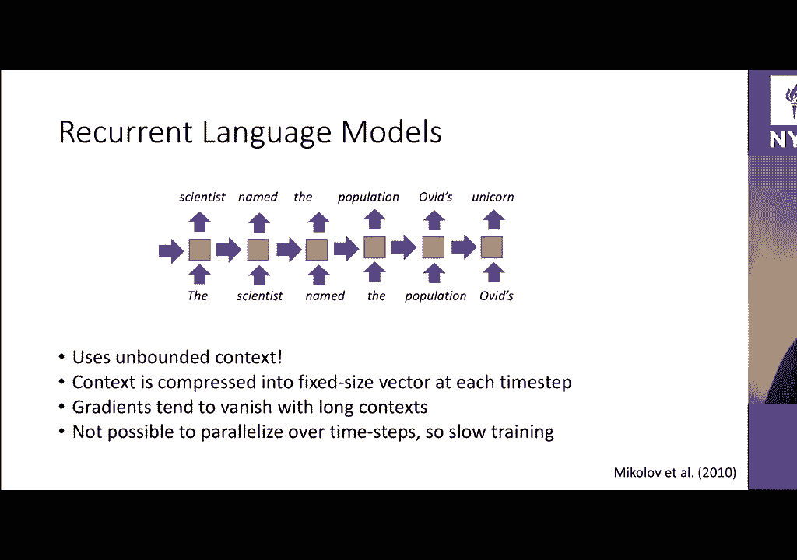

原则上无限量的受体场，但是训练很慢。

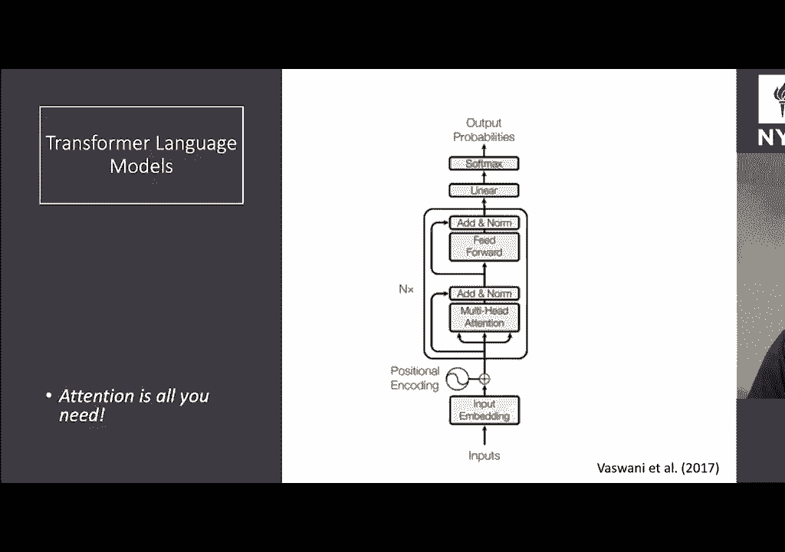

所以现在的解决方案就是所谓的变压器，所以现在的解决方案就是所谓的变压器，um，这是最近在旧状态nlp系统中使用的模型，um，这是最近在旧状态nlp系统中使用的模型，嗯，所以我将详细介绍变压器。

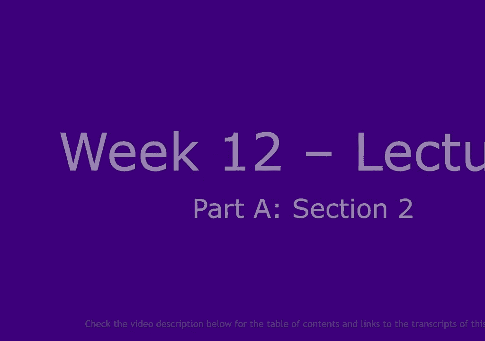

嗯，所以我将详细介绍变压器，当我做rnns或cnns时，当我做rnns或cnns时，um变压器于2017年由宣誓问题引入，um变压器于2017年由宣誓问题引入，著名的论文叫“注意”就可以了。

著名的论文叫“注意”就可以了，他们真的革新了很多能量，他们真的革新了很多能量，所以我在原始变压器纸中加了一个图，所以我在原始变压器纸中加了一个图，我知道当我第一次看到这个数字的时候我一定会把这个弄糊涂。

我知道当我第一次看到这个数字的时候我一定会把这个弄糊涂，在2017年，我花了相当长的时间才明白，在2017年，我花了相当长的时间才明白，周围有很多细节，周围有很多细节，盒子，所以我要尝试慢慢钻入它们。

盒子，所以我要尝试慢慢钻入它们，好吧，那是怎么回事，基本上你看到我们这个输入状态，基本上你看到我们这个输入状态，该变压器模块的n倍，然后是一个输出相位，该变压器模块的n倍，然后是一个输出相位。

所以这个结束时间块的事情只是意味着我们要展开，所以这个结束时间块的事情只是意味着我们要展开，相同的块具有不同的参数，相同的块具有不同的参数，那里有一定次数，所以这个例子，那里有一定次数，所以这个例子。

我认为有六层原始的转换纸，我认为有六层原始的转换纸，这些天很可爱嗯，这些天人们正在训练模特，这些天很可爱嗯，这些天人们正在训练模特，具有数十亿个参数，并且有很多层，具有数十亿个参数，并且有很多层，好吧。

所以我要钻到这个盒子里，好吧，所以我要钻到这个盒子里，更详细的信息，使它成为变压器的核心变压器块，更详细的信息，使它成为变压器的核心变压器块，您会看到它实际上包含了两个不同的子层。

您会看到它实际上包含了两个不同的子层，[音乐]都是非常重要的，[音乐]都是非常重要的，子层2可能更明显，这只是很大，子层2可能更明显，这只是很大，前馈网络um可以是任何mlp，但是。

前馈网络um可以是任何mlp，但是，重要的是它实际上很有表现力，重要的是它实际上很有表现力，在下面，我们有这个多头注意力模块，在下面，我们有这个多头注意力模块，多头注意力是变压器背后的关键组成部分。

多头注意力是变压器背后的关键组成部分，以及他们为什么如此工作，以及他们为什么如此工作，这条地铁也通过标有adam norm的这些um盒连接，这条地铁也通过标有adam norm的这些um盒连接。

所以加购意味着这是剩余的联系，所以加购意味着这是剩余的联系，嗯，这有助于停止渐变基础大型模型，嗯，这有助于停止渐变基础大型模型，呃，这里的规范意味着呃规范化，呃，这里的规范意味着呃规范化。

我不打算在这里详细介绍它，但是，我不打算在这里详细介绍它，但是，使这些模型正常工作非常重要，而且实际上，使这些模型正常工作非常重要，而且实际上，关于您到底如何延迟标准化的一些专业知识。

关于您到底如何延迟标准化的一些专业知识，在实践中有很大的不同嘿，对不起，我有一个疑问，在实践中有很大的不同嘿，对不起，我有一个疑问，嗯，这还不是很清楚，但是，嗯，这还不是很清楚，但是。

您能谈谈使用背后的直觉吗？您能谈谈使用背后的直觉吗？多头关注而不是单头关注，多头关注而不是单头关注，我的意思是每个脑袋都学到一些不同的东西，我的意思是每个脑袋都学到一些不同的东西。

并以不同的方式参与其输入，但，并以不同的方式参与其输入，但，这背后的直觉是什么，这背后的直觉是什么，嗯，我会问这个问题，我将要经历，嗯，我会问这个问题，我将要经历，嗯，首先是什么军事拘留。

然后我会设法得到一些，嗯，首先是什么军事拘留，然后我会设法得到一些，为什么这是一件好事的迭代，为什么这是一件好事的迭代，呃，如果我们不回答您的问题，请，呃，如果我们不回答您的问题，请，跟我来几张幻灯片。

谢谢，跟我来几张幻灯片，谢谢，顺便说一下，现阶段还有其他问题，顺便说一下，现阶段还有其他问题，嗯，我有一个问题，嗯，变压器模块使用了层，嗯，我有一个问题，嗯，变压器模块使用了层，归一化。

为什么您可以提供一些直觉来了解它为什么起作用，归一化，为什么您可以提供一些直觉来了解它为什么起作用，优于小组归一化或呃归一化，优于小组归一化或呃归一化，嗯。

我认为我实际上不能对此给出非常令人满意的技术答案，并且，我认为我实际上不能对此给出非常令人满意的技术答案，并且，我认为其中很多是出于经验的，我认为其中很多是出于经验的，在nlp中，我们学习出色的作品。

计算机视觉学士的作品也很棒，在nlp中，我们学习出色的作品，计算机视觉学士的作品也很棒，嗯，一个繁荣的土地并不取决于批次，嗯，一个繁荣的土地并不取决于批次，维度，哪个派系这样做，维度，哪个派系这样做。

在实践中，这是一个很大的优势，因为，在实践中，这是一个很大的优势，因为，用大模型训练大批产品非常困难，用大模型训练大批产品非常困难，是的，你可以看到人们写了很多论文，实际上为什么会这样，是的。

你可以看到人们写了很多论文，实际上为什么会这样，我认为甚至可以使用计算机版本，至少少了我的阅读方式，实际上还有一些争论，至少少了我的阅读方式，实际上还有一些争论，嗯，也许直觉是原始的，嗯。

也许直觉是原始的，文书工作，甚至批量正常的作品也不是很好，文书工作，甚至批量正常的作品也不是很好，嗯，所以我个人认为这是有些不满意的地方之一，嗯，所以我个人认为这是有些不满意的地方之一。

深度学习中的哪些事情可行，但还不清楚，深度学习中的哪些事情可行，但还不清楚，为什么，好的，谢谢，是的，也许我在等待比这更令人满意的答案，好的，谢谢，是的，也许我在等待比这更令人满意的答案。

[音乐]这里要问的另一个问题是，[音乐]这里要问的另一个问题是，变压器在rnn lstms等时间步长之间共享权重，变压器在rnn lstms等时间步长之间共享权重，嗯，是个好问题，我应该已经说清楚了。

嗯，所以，嗯，是个好问题，我应该已经说清楚了，嗯，所以，所有这些方式都可以跨时间戳共享，所有这些方式都可以跨时间戳共享，所以在某种意义上说是卷积，所以在某种意义上说是卷积，所以你有一个方块。

你会在每一步播放，所以你有一个方块，你会在每一步播放，嗯，实际上您也可以使用相同的权重对它们进行应用，每一层，嗯，实际上您也可以使用相同的权重对它们进行应用，每一层，效果也很好，但这不是人们通常所做的。

效果也很好，但这不是人们通常所做的，谢谢，到目前为止还有其他问题，我认为这些是我到目前为止在聊天中阅读的问题，我认为这些是我到目前为止在聊天中阅读的问题，好吧，那这个神秘的多头注意力是什么，好吧。

那这个神秘的多头注意力是什么，嗯，这是另一个数字，我不知道这是否对你有帮助，嗯，这是另一个数字，我不知道这是否对你有帮助，嗯，所以基本上您可以计算这三个量um，嗯，所以基本上您可以计算这三个量um。

bk和q在这里它们代表值中的查询键，bk和q在这里它们代表值中的查询键，分别做尺度点积滞留，分别做尺度点积滞留，操作，然后连接输出，操作，然后连接输出，好吧，所以钻入这个刻度点积张力um，好吧。

所以钻入这个刻度点积张力um，最终我们将运行我们的盒子来扩展，最终我们将运行我们的盒子来扩展，嗯，看起来像这样，所以我们要计算此查询和键，所以我们要计算此查询和键，做一个点产品和最大的东西，并使用它。

做一个点产品和最大的东西，并使用它，作为实现某些价值观的一种方式，我不必担心这会有意义，作为实现某些价值观的一种方式，我不必担心这会有意义，做更多细节，让我们看这个例子，做更多细节，让我们看这个例子。

这里的背景是这些角银白色，这里的背景是这些角银白色，我们正在尝试创建下一个单词，在之前的示例中是，我们正在尝试创建下一个单词，在之前的示例中是，独角兽，独角兽，对于我们要预测的单词，我们将喜欢计算该值。

对于我们要预测的单词，我们将喜欢计算该值，称为查询，对于所有先前的单词，我们，称为查询，对于所有先前的单词，我们，要计算称为密钥的数量，要计算称为密钥的数量，这些是基于该层当前状态的线性层。

这些是基于该层当前状态的线性层，明天我们将在实践中对此进行编码，因此我们将，明天我们将在实践中对此进行编码，因此我们将，只看到其中的一些小细节，只看到其中的一些小细节，代码也一样，好的。

所以您可以将此查询视为，好的，所以您可以将此查询视为，模型到目前为止在这里一直是上下文的问题，但这将有所帮助，模型到目前为止在这里一直是上下文的问题，但这将有所帮助，你预测下一个单词应该是什么。

因此查询可能是诸如um告诉我以前的形容词是什么或，因此查询可能是诸如um告诉我以前的形容词是什么或，告诉我以前的确定者是什么，告诉我以前的确定者是什么，嗯，像这样的残障人士的话，嗯。

像这样的残障人士的话，然后对于键，它们将成为某种，然后对于键，它们将成为某种，标记当前单词并告诉您一些有关它的信息，以便他们可以，标记当前单词并告诉您一些有关它的信息，以便他们可以。

说这个词是一个形容词这个词是一个，说这个词是一个形容词这个词是一个，确定词这个词是动词之类的，确定词这个词是动词之类的，或者可以更复杂一些，例如，或者可以更复杂一些，例如，任何真正的关系。

例如共同推荐等，任何真正的关系，例如共同推荐等，完全可以作为问题查询，然后，完全可以作为问题查询，然后，计算只是将所有，计算只是将所有，键并使用它来计算，然后您也执行softmax，键并使用它来计算。

然后您也执行softmax，将导致所有，将导致所有，以前的话，所以在这里您可以想象一个查询，例如告诉我什么，所以在这里您可以想象一个查询，例如告诉我什么，以前的形容词是，注意力会产生这种。

以前的形容词是，注意力会产生这种，分布在前三个词上，分布在前三个词上，将最可能的质量放在喇叭或银白色上，将最可能的质量放在喇叭或银白色上，嗯，我们还要计算另一个值，这就是称为，我们还要计算另一个值。

这就是称为，价值，我们将为之前所有，价值，我们将为之前所有，话也一样，也许价值会告诉你，话也一样，也许价值会告诉你，关于单词内容的更多信息，关于单词内容的更多信息。

然后我将通过基本边缘化来计算此隐藏状态，然后我将通过基本边缘化来计算此隐藏状态，分散注意力分布，所以这里，分散注意力分布，所以这里，隐藏状态将是这些值的浪费之和，隐藏状态将是这些值的浪费之和。

在所有先前的单词中，在所有先前的单词中，被那个词的可能性浪费了，嗯所以，这基本上就是该图左侧的内容，这基本上就是该图左侧的内容，我省去了关于缩放逃生的细节，我省去了关于缩放逃生的细节。

hack使渐变更稳定好吧，但这里还有另一个细节，hack使渐变更稳定好吧，但这里还有另一个细节，那是单头的，那是单头的，到目前为止，我已经描述了注意力，但实际上我们要做的是，到目前为止。

我已经描述了注意力，但实际上我们要做的是，称为多头意图，这基本上意味着我们要，称为多头意图，这基本上意味着我们要，用不同的查询键和值计算相同的事物，用不同的查询键和值计算相同的事物，并行多次。

所以前面的这个问题大概是什么背后的直觉，所以前面的这个问题大概是什么背后的直觉，嗯，真的就像你真正想要的，嗯，真的就像你真正想要的，让我们创建下一个单词，您需要了解很多不同的东西，所以。

让我们创建下一个单词，您需要了解很多不同的东西，所以，嗯之前的这个例子，嗯之前的这个例子，嗯，让我们来看看，让我们说下一个词应该是独角兽复数，嗯，让我们来看看，让我们说下一个词应该是独角兽复数。

今天应该是独角兽，我的意思是你可能想知道这是，今天应该是独角兽，我的意思是你可能想知道这是，角状和银白色，因为它们的结合使它成为可能，角状和银白色，因为它们的结合使它成为可能，更有可能是独角兽。

但你也想知道，更有可能是独角兽，但你也想知道，如果不是像喇叭音节，这里的决定因素就不是这些，如果不是像喇叭音节，这里的决定因素就不是这些，白色，这将是独角兽奇异的事实是这些手段，白色。

这将是独角兽奇异的事实是这些手段，它应该是独角兽复数形式，以便您可以使用复数形式，它应该是独角兽复数形式，以便您可以使用复数形式，所以您实际上需要喜欢同时看这三个词才能拥有一个好的。

所以您实际上需要喜欢同时看这三个词才能拥有一个好的，知道下一个单词应该是什么，知道下一个单词应该是什么，多意图是一种让每个单词查看多个先前单词的方式，多意图是一种让每个单词查看多个先前单词的方式。

单词同时，这里的问题是，为什么我们实际上需要使用softmax？这里的问题是，为什么我们实际上需要使用softmax？为什么我们用这个呀，这是一个很好的问题，我认为首先我的意思是住房标准化。

我认为首先我的意思是住房标准化，效果可能很好，我的意思是当你走的时间更长的时候，效果可能很好，我的意思是当你走的时间更长的时候，序列，这个求和将变得更大，序列，这个求和将变得更大，越远，您进行的归一化。

越远，您进行的归一化，可能是很好的归一化也让模型um，可能是很好的归一化也让模型um，丢弃信息给您，以便它可以说出这个词，丢弃信息给您，以便它可以说出这个词，只是没有关系，嗯，这很好。

我想我已经看过人了，只是没有关系，嗯，这很好，我想我已经看过人了，尝试使用类似真正使用的东西，尝试使用类似真正使用的东西，那么哪种不同的信息丢弃方式却，那么哪种不同的信息丢弃方式却。

我认为证据表明软比赛非常有效，我认为证据表明软比赛非常有效，呃，另一个问题，对不起，我可能错过了这个嗯，呃，另一个问题，对不起，我可能错过了这个嗯，那个粉红色的面具不知道那是什么短暂的面具实际上是。

那个粉红色的面具不知道那是什么短暂的面具实际上是，重要的，所以，重要的，所以，我首先要说一点，所以这是一个真正的重大胜利，我首先要说一点，所以这是一个真正的重大胜利，整个会议多头关注是。

整个会议多头关注是，那是非常瘫痪的嗯，所以现在这个，那是非常瘫痪的嗯，所以现在这个，给定时间步长取决于查询键和值的计算，给定时间步长取决于查询键和值的计算，您在其他任何时间都在做什么。

您在其他任何时间都在做什么，与您当前的网络不同，您实际上可以计算所有这些，与您当前的网络不同，您实际上可以计算所有这些，同时，嗯，这与我们最近拥有的那种硬件配合得很好，嗯。

这与我们最近拥有的那种硬件配合得很好，所以我们不仅要一次把所有不同的头，所以我们不仅要一次把所有不同的头，一次计算所有时间步长，一次计算所有时间步长，向前传递um，所以很棒，除了，向前传递um。

所以很棒，除了，如果您一次都在竞争所有步骤，那么没有什么可以停止的，如果您一次都在竞争所有步骤，那么没有什么可以停止的，你这个词看起来，你这个词看起来，在未来，因为像超回归分解一样，我们正在处理。

在未来，因为像超回归分解一样，我们正在处理，在这里，我们只希望单词以，在这里，我们只希望单词以，以前的话嗯，但到目前为止我已经把它们都传播了，以前的话嗯，但到目前为止我已经把它们都传播了。

这些话也可以看未来的话，这些话也可以看未来的话，问题，因为这样他们就可以作弊并在未来的环境中使用自己，问题，因为这样他们就可以作弊并在未来的环境中使用自己，预测自己，所以这里的解决方案是，预测自己。

所以这里的解决方案是，嗯，这就是我们所说的细胞电势屏蔽，所以屏蔽只是一个，嗯，这就是我们所说的细胞电势屏蔽，所以屏蔽只是一个，这类uh具有零和下三角等的上三角矩阵，这类uh具有零和下三角等的上三角矩阵。

上三角形的负无穷大，我们将其添加到，上三角形的负无穷大，我们将其添加到，注意分数，其效果将是，注意分数，其效果将是，那个左边的每个单词的潜在得分都比，那个左边的每个单词的潜在得分都比，右边的所有位置。

因此该模型最终只会使用单词进行练习，右边的所有位置，因此该模型最终只会使用单词进行练习，向左，但这是确定性面罩，没有可训练的重量，向左，但这是确定性面罩，没有可训练的重量，um值等于零或负无穷大。

um值等于零或负无穷大，嗯，所以您只在特定于应用程序的情况下才屏蔽，嗯，所以您只在特定于应用程序的情况下才屏蔽，例如，如果您只需要构建表示形式，则训练任务正确无误，例如，如果您只需要构建表示形式。

则训练任务正确无误，不需要问，因为没关系，不需要问，因为没关系，嗯，这是一个很好的问题，所以我们将介绍更一般的表示形式，嗯，这是一个很好的问题，所以我们将介绍更一般的表示形式，以后再学习，所以。

大多数情况下，您只想输入文字，以后再学习，所以，大多数情况下，您只想输入文字，不需要屏蔽它们的编码器双向上下文绝对是，不需要屏蔽它们的编码器双向上下文绝对是，在这种情况下对语言建模很有帮助。

在这种情况下对语言建模很有帮助，到目前为止，我们一直在努力工作，因此遮罩对于使其变得至关重要，到目前为止，我们一直在努力工作，因此遮罩对于使其变得至关重要，在数学上全部正确并计算。

在数学上全部正确并计算，正确的因式分解，但是很好，谢谢，正确的因式分解，但是很好，谢谢，好的，嗯。

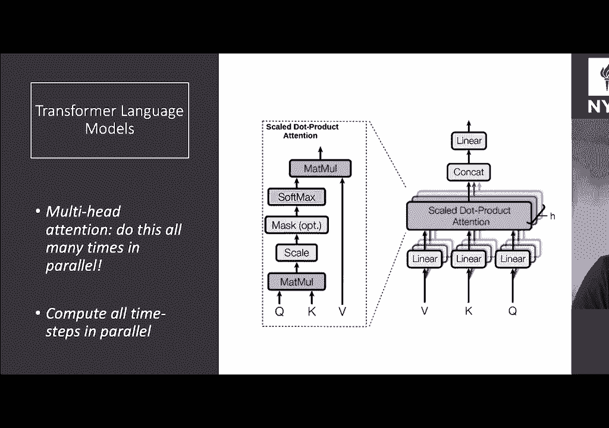

好吧，呃，我们需要做另一个细节才能完成所有这些工作，好吧，呃，我们需要做另一个细节才能完成所有这些工作，是添加一些应该在位置写作上输入的东西，是添加一些应该在位置写作上输入的东西，所以。

正如我所描述的那么小，实际上，嗯，它正在做一个低偏差模型，对输入的语言知之甚少，嗯，它正在做一个低偏差模型，对输入的语言知之甚少，可以是任何东西，它会起作用，嗯，可以是任何东西，它会起作用，嗯。

特别是就像我的意思是，您可以建模集合或图形或类似的东西，特别是就像我的意思是，您可以建模集合或图形或类似的东西，这个应该很好，但是我们知道，这个应该很好，但是我们知道，我的意思是在语言中。

有一些属性对于，我的意思是在语言中，有一些属性对于，例如，对单词的排序是，例如，对单词的排序是，对于您如何解释它们非常重要，对于您如何解释它们非常重要，而这个人实际上对此一无所知。

而这个人实际上对此一无所知，与卷积世界和我之前向您展示的参数形成对比，与卷积世界和我之前向您展示的参数形成对比，两者都有不同的编码方式，两者都有不同的编码方式，文本的顺序，所以其中一种技术是。

文本的顺序，所以其中一种技术是，本文介绍的称为位置写作，本文介绍的称为位置写作，您执行此操作的不同方法会在论文中进行描述，您执行此操作的不同方法会在论文中进行描述，这有点奇怪，实际上我不会描述。

这有点奇怪，实际上我不会描述，但从本质上讲也一样，为每个时间步骤学习单独的嵌入，以便为每个定位文档学习，为每个时间步骤学习单独的嵌入，以便为每个定位文档学习，零一二三四有五，您只需学习单独的嵌入和。

零一二三四有五，您只需学习单独的嵌入和，然后将其添加到您的输入中，这样您的输入现在就是，然后将其添加到您的输入中，这样您的输入现在就是，词向量和某种位置向量，词向量和某种位置向量，它非常简单。

但是它提供了世界范围的订单信息，它非常简单，但是它提供了世界范围的订单信息，需要，效果很好，需要，效果很好，好的，为什么这些模型这么好，为什么每个人都用它们呢？好的，为什么这些模型这么好。

为什么每个人都用它们呢？我认为该模型的真正强大之处在于，我认为该模型的真正强大之处在于，可以给您每对单词之间的直接联系，可以给您每对单词之间的直接联系，这样每个单词都可以直接访问每个先前单词的隐藏状态。

这样每个单词都可以直接访问每个先前单词的隐藏状态，嗯和，这是一个对比卷积模型，可能会针对所有，这是一个对比卷积模型，可能会针对所有，在这个接收器领域的话，但没有比这更早的回溯了，在这个接收器领域的话。

但没有比这更早的回溯了，和我们目前的模式，国家必须经历他的，和我们目前的模式，国家必须经历他的，每个时间步长的每次瓶颈，每个时间步长的每次瓶颈，嗯，您实际上可以直接访问前面的单词，嗯。

您实际上可以直接访问前面的单词，除了字面上的前一个单词，比过去更远，除了字面上的前一个单词，比过去更远，事情必须以某种方式压缩，您已经失去了有关此信息，事情必须以某种方式压缩，您已经失去了有关此信息。

为了自我关注，原则上您可以将100的注意力放在，为了自我关注，原则上您可以将100的注意力放在，遥远的过去中的任何单词，看看那里到底是什么，遥远的过去中的任何单词，看看那里到底是什么。

这就使它成为一个非常强大的模型，就像避免了诸如此类的事情，这就使它成为一个非常强大的模型，就像避免了诸如此类的事情，梯度消失等问题，梯度消失等问题，嗯，音乐可以很容易地学习非常昂贵的功能，嗯。

音乐可以很容易地学习非常昂贵的功能，另一个伟大的事情是我的意思是麻痹，另一个伟大的事情是我的意思是麻痹，因此，一方面，该模型进行了大量的计算，因此，一方面，该模型进行了大量的计算，这个嗯。

所以自张紧操作是二次的，这个嗯，所以自张紧操作是二次的，基本上是因为每个字都能看到其他字，基本上是因为每个字都能看到其他字，听起来很慢，但真正的好处是您可以在，听起来很慢，但真正的好处是您可以在，并行。

因为所有这些操作都是，并行，因为所有这些操作都是，彼此独立，您只需将其作为一个大矩阵相乘即可，彼此独立，您只需将其作为一个大矩阵相乘即可，即使有时您可能会做更多的事情，即使有时您可能会做更多的事情。

添加乘法运算，您将使用等效的rnn，添加乘法运算，您将使用等效的rnn，您可以更快地完成所有这些操作，因为您可以一次完成所有这些操作，您可以更快地完成所有这些操作，因为您可以一次完成所有这些操作。

相当顺序，所以这是一个非常好的折衷，相当顺序，所以这是一个非常好的折衷。

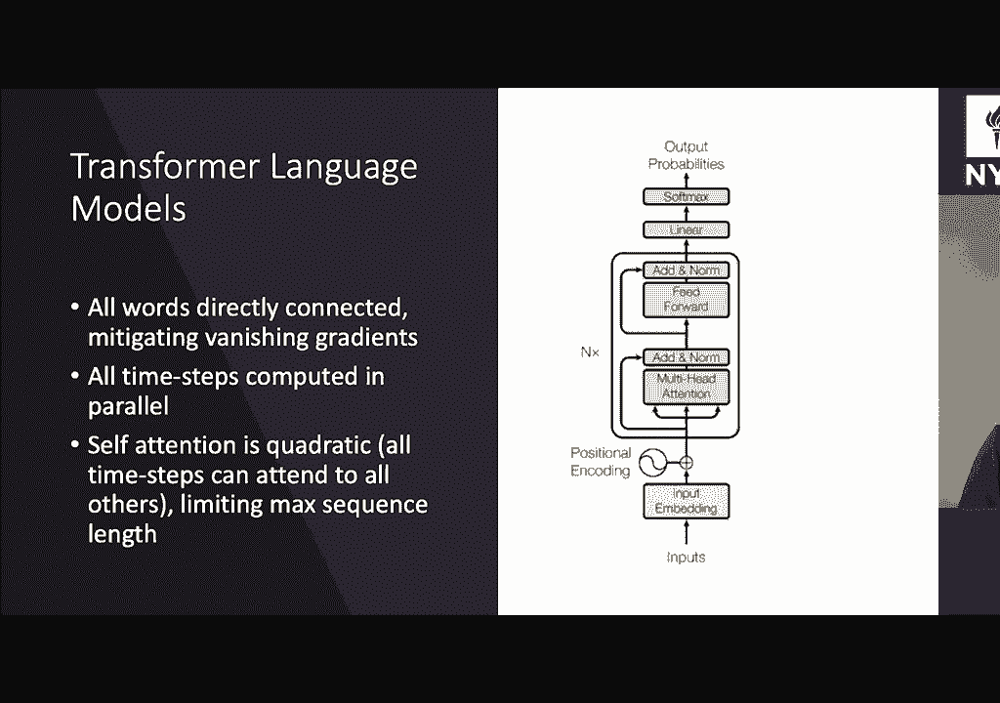

嗯，我也想快速谈谈其他很棒的事情，嗯，我也想快速谈谈其他很棒的事情，诸如um多头注意力之类的东西，以及其他嵌入和诸如此类的东西。

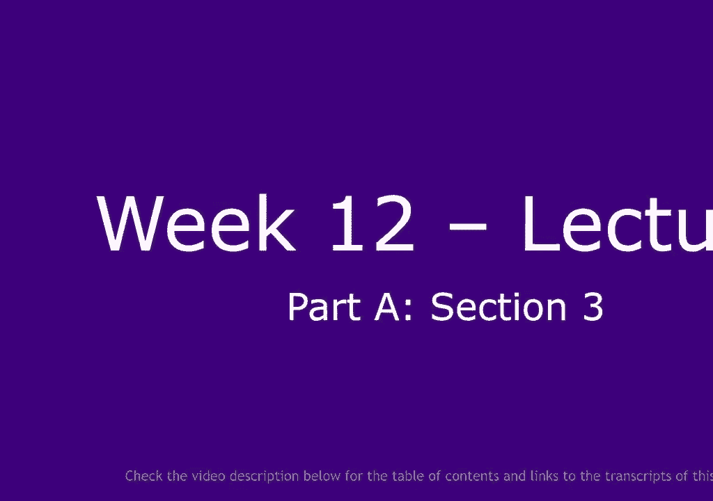

诸如um多头注意力之类的东西，以及其他嵌入和诸如此类的东西，变压器首次发行时我引起了所有人的注意，变压器首次发行时我引起了所有人的注意，但是变形金刚也带着一整袋，但是变形金刚也带着一整袋，其他的技巧。

这些技巧都是，其他的技巧，这些技巧都是，使这个东西真正起作用真的很重要，使这个东西真正起作用真的很重要，嗯，有时候我认为这篇论文真的是一种现代化和健康的，嗯。

有时候我认为这篇论文真的是一种现代化和健康的，嗯，例如，我之前提到过有关此有用的层规范化的信息，嗯，例如，我之前提到过有关此有用的层规范化的信息，点亮它真的很有帮助，嗯，他们也做了这些事情。

点亮它真的很有帮助，嗯，他们也做了这些事情，像是这些学习进度表，所以，像是这些学习进度表，所以，出于什么原因使变压器正常工作，出于什么原因使变压器正常工作，嗯，您必须线性地提高您的学习速度，嗯。

您必须线性地提高您的学习速度，从零到您的目标学习率超过，从零到您的目标学习率超过，几千步，人们的学习率确实很高，几千步，人们的学习率确实很高，在其他情况下的热身学习率，但变压器确实需要。

在其他情况下的热身学习率，但变压器确实需要，还要工作，还要工作，初始化实际上确实与这些有关，初始化实际上确实与这些有关，某些初始化无法正常进行，而它们会抛出其他初始化，某些初始化无法正常进行。

而它们会抛出其他初始化，像标签平滑输出这样的技巧，像标签平滑输出这样的技巧，嗯，不是在本文中发明的，但事实证明，嗯，不是在本文中发明的，但事实证明，对于像机器翻译这样的转换非常有帮助。

对于像机器翻译这样的转换非常有帮助，好吧，所以让您知道这些东西的状况，好吧，所以让您知道这些东西的状况，目前为止正在描述这些模型吗，目前为止正在描述这些模型吗，石灰住宅甲板基准的一些结果。

石灰住宅甲板基准的一些结果，所以右边的数字是所谓的复杂性，所以右边的数字是所谓的复杂性，测量保留数据的可能性，这里越低越好，测量保留数据的可能性，这里越低越好，嗯，让我们来看一下2016年的1厘米，嗯。

让我们来看一下2016年的1厘米，嗯48微米，您会看到yandere粉丝的卷积模型来自，您会看到yandere粉丝的卷积模型来自，2016年的成绩好得多，大约在20到37岁之间。2016年的成绩好得多。

大约在20到37岁之间。呃人们也玩了一堆，呃人们也玩了一堆，rm符文就像你讲几十篇关于你如何做的论文，rm符文就像你讲几十篇关于你如何做的论文，lstms的变化，其中一些也变低了30s。

lstms的变化，其中一些也变低了30s，但是当您介绍变压器时，您会发现，但是当您介绍变压器时，您会发现，转到18和20，就语言建模而言，转到18和20，就语言建模而言，极好的几何性能，嗯。

我应该说我们看到的这些游戏特别，嗯，我应该说我们看到的这些游戏特别，很大，因为它是一种长上下文语言建模，所以是盲模，很大，因为它是一种长上下文语言建模，所以是盲模，在哪里有一些基准测试。

在哪里有一些基准测试，仅仅用一个句子来预测这个任务，你实际上就会得到一个整体，仅仅用一个句子来预测这个任务，你实际上就会得到一个整体，维基百科的文章，所以可能有成千上万的单词和，维基百科的文章。

所以可能有成千上万的单词和，变形金刚真的闪耀着什么，变形金刚真的闪耀着什么，你有成千上万个单词的上下文模型，你需要，你有成千上万个单词的上下文模型，你需要，保留所有信息，好的，嗯，嗯，是认真的快速比较。

只是为了了解变压器和lstms的方式，嗯，是认真的快速比较，只是为了了解变压器和lstms的方式，看起来这将指示一些要点，看起来这将指示一些要点，之前的耻辱，因此在lstm中，您之间的联系少得多。

之前的耻辱，因此在lstm中，您之间的联系少得多，诸如此类的单词从左到右都是非常连续的，诸如此类的单词从左到右都是非常连续的，并进行转换，但是您没有任何这个，并进行转换，但是您没有任何这个。

所以每个单词都直接与其他单词相关，所以每个单词都直接与其他单词相关，嗯，我猜你也应该从某种意义上说，也许有点不自然，嗯，我猜你也应该从某种意义上说，也许有点不自然，很适合阅读。

因此它建议您同时阅读文字和，很适合阅读，因此它建议您同时阅读文字和，每次读一个单词，它就会真正读，每次读一个单词，它就会真正读，隔一个字很快，但是非常有效，隔一个字很快，但是非常有效，好吧。

关于变压器的另一个好处是它们确实可以按比例扩大，好吧，关于变压器的另一个好处是它们确实可以按比例扩大，非常好，例如语言建模，非常好，例如语言建模，您获得的数据量实际上是无限的，因为。

您获得的数据量实际上是无限的，因为，那里只有数千亿个字，比您以往任何时候都多，那里只有数千亿个字，比您以往任何时候都多，需要呃，这意味着实际上适合这种情况，需要呃，这意味着实际上适合这种情况。

您需要非常大的模型，然后继续，您需要非常大的模型，然后继续，添加他们继续使用的变换参数转换器，添加他们继续使用的变换参数转换器，只是工作越来越好，呃，我向您展示的例子，只是工作越来越好，呃。

我向您展示的例子，从具有20亿个参数的gpt2模型，从具有20亿个参数的gpt2模型，嗯对于2019年来说是相当大的，但显然是2020年或以后，嗯对于2019年来说是相当大的，但显然是2020年或以后。

170亿，有传言称将有1000亿个参数模型，170亿，有传言称将有1000亿个参数模型，很快，对不起，我有一个问题，很快，对不起，我有一个问题，嗯，你说转换对扩大规模确实非常有用，嗯。

你说转换对扩大规模确实非常有用，我只是想知道在语言建模任务中我们是否喜欢，我只是想知道在语言建模任务中我们是否喜欢，说一万两千字的文档，说一万两千字的文档，我们可以，一步一步地插入一个词，我们不需要。

一步一步地插入一个词，我们不需要，本身就需要很多存储空间，例如，对于变压器，我们需要一个，本身就需要很多存储空间，例如，对于变压器，我们需要一个，浴室大小为10000，我们不喜欢吗。

浴室大小为10000，我们不喜欢吗，序列的长度，但是如果我们有很长的序列，序列的长度，但是如果我们有很长的序列，我们可以为这些长期依赖性建模吗。

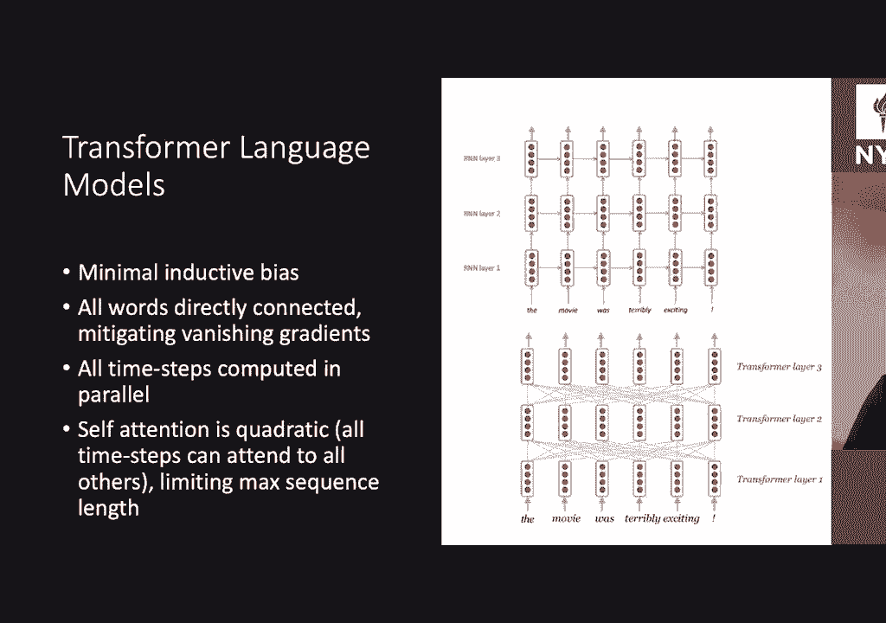

我们可以为这些长期依赖性建模吗。

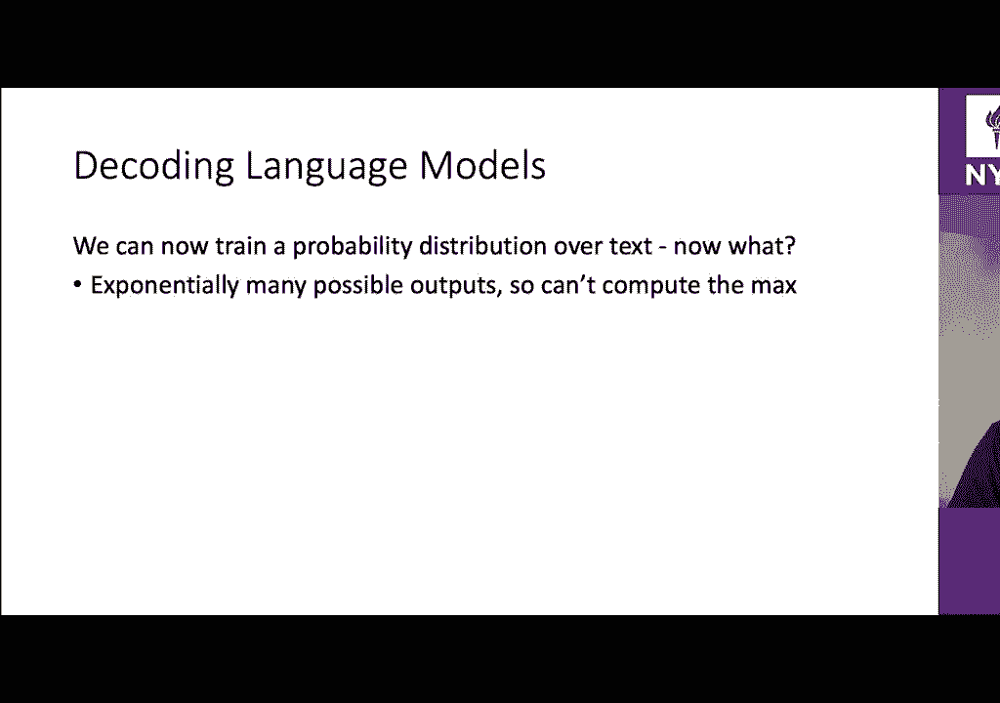

是的，这是一个非常大的问题，我实际上是想提到这一点，是的，这是一个非常大的问题，我实际上是想提到这一点，所以他们首先要说两件事，所以他们首先要说两件事，你说的对，自我张力是因为二次方，你说的对。

自我张力是因为二次方，费用显然超线性增长，并且，费用显然超线性增长，并且，在实践中是一个问题，这意味着嗯，在实践中是一个问题，这意味着嗯，变压器执行512个令牌接触窗口，对于。

变压器执行512个令牌接触窗口，对于，gpus，我喜欢这些语言模型，不仅可以做得更多，还可以让我装几千个，我喜欢这些语言模型，不仅可以做得更多，还可以让我装几千个，令牌um这是一种限制，我们可以。

令牌um这是一种限制，我们可以，做，但绝对是这样的，做，但绝对是这样的，香草变压器根本无法建模说出5万字的书，香草变压器根本无法建模说出5万字的书，嗯，这就像整个墨盒行业最近建立的一样，嗯。

这就像整个墨盒行业最近建立的一样，各种可以长时间排序的变压器，非常热，各种可以长时间排序的变压器，非常热，现在，您可以做的大多数事情是，现在，您可以做的大多数事情是，您要做的一件事就是更换。

您要做的一件事就是更换，自我张力，例如最近邻居搜索，自我张力，例如最近邻居搜索，嗯，你可以做些自我照顾。嗯，你可以做些自我照顾。更快的，更快的，也有一些版本尝试像您一样稀疏​​地关注您。

也有一些版本尝试像您一样稀疏​​地关注您，不能直接听每个先前的单词，但是，不能直接听每个先前的单词，但是，您有点膨胀了一些以前的单词，您可以查看，您有点膨胀了一些以前的单词，您可以查看。

而且您与每个单词的联系并不直接，但是您可以，而且您与每个单词的联系并不直接，但是您可以，保证您在每个单词上都有一条短路，保证您在每个单词上都有一条短路，嗯还有像压缩变压器这样的东西。

嗯还有像压缩变压器这样的东西，多个夜晚和总和，以某种方式压缩前一段遥远的过去，多个夜晚和总和，以某种方式压缩前一段遥远的过去，简化为um，简化为um，好的，所以您提出了rnn问题。

因此在印象深刻的时候绝对在我们的，好的，所以您提出了rnn问题，因此在印象深刻的时候绝对在我们的，nanky模型无限上下文中绝对存在，nanky模型无限上下文中绝对存在，没有额外的成本，这是巨大的。

我的意思是他们不能把，没有额外的成本，这是巨大的，我的意思是他们不能把，像一百万个单词，输出真的首先就好了，像一百万个单词，输出真的首先就好了，嗯，问题是实际上没有使用此上下文，而嗯，嗯。

问题是实际上没有使用此上下文，而嗯，在训练时可能不是这样，在训练时可能不是这样，嗯，你不能做到这一点，你实际上必须向后传播的训练时间，嗯，你不能做到这一点，你实际上必须向后传播的训练时间。

通过所谓的后向关系，通过所谓的后向关系，通过时间，而Lcm，通过时间，而Lcm，必须提供现代的线接触，例如分级，必须传播所有，必须提供现代的线接触，例如分级，必须传播所有，通过所有重复步骤的方式。

通过所有重复步骤的方式，与遥远的过去有所不同，嗯，首先，评分会像，嗯，首先，评分会像，在你走一千步之前，在你走一千步之前，这非常昂贵，所以这是一个免费的培训时间系统，这非常昂贵。

所以这是一个免费的培训时间系统，而且这种反向传播操作的时间越长，其成本就会越来越高，而且这种反向传播操作的时间越长，其成本就会越来越高，您正在建模的序列，这意味着您不能，您正在建模的序列。

这意味着您不能，实际上真的学会了嗯，这就是过去，实际上真的学会了嗯，这就是过去，有趣的是，它并不昂贵，只是您不会，有趣的是，它并不昂贵，只是您不会，知道如何处理任何练习，您可能还是会忘记。

知道如何处理任何练习，您可能还是会忘记，因为呃，你记不起那么多数据，因为呃，你记不起那么多数据，一次，好一点，一次，好一点，嗯，这很有趣，呃，我猜是一种情况，嗯，这很有趣，呃，我猜是一种情况。

他们会在rnas真正有优势的地方，他们会在rnas真正有优势的地方，在某些算法测试中，如果您不是链接语言，在某些算法测试中，如果您不是链接语言，假设您在做类似的事情，假设您在做类似的事情。

编辑或试图模仿一个模型来模拟字符串um，编辑或试图模仿一个模型来模拟字符串um，[音乐]因此，如果您使用类似零的字符串并且，[音乐]因此，如果您使用类似零的字符串并且，并问你一个偶数，并问你一个偶数。

嗯，在那种情况下，嗯，您基本上确实想，嗯，在那种情况下，嗯，您基本上确实想，每个步骤实际上应用相同的操作，每个步骤实际上应用相同的操作，而且您可以不必真正拥有太多的记忆，因为我的意思是。

而且您可以不必真正拥有太多的记忆，因为我的意思是，您的状态实际上只需要为零或一，您的状态实际上只需要为零或一，在这种情况下，rnas实际上可以很好地工作，因为您可以训练，在这种情况下。

rnas实际上可以很好地工作，因为您可以训练，他们短时间的顺序，然后他们会射击，他们短时间的顺序，然后他们会射击，像是伟大的概括或冗长的序列，所有这些玩具，像是伟大的概括或冗长的序列，所有这些玩具。

问题，实际上在托盘上，但我想像中，问题，实际上在托盘上，但我想像中，变压器实际上会发现很难获得这种，变压器实际上会发现很难获得这种，概括性的，仅适用于这些，概括性的，仅适用于这些。

关于自然语言建模的一种算法问题，然后，关于自然语言建模的一种算法问题，然后，是的，看来各种变压器都将比，是的，看来各种变压器都将比，循环网，谢谢你，真的很有帮助，嗯，我一直在解决其他问题，嗯。

我一直在解决其他问题，可以通过文字吗，所以我认为这是我们都很好的权利，可以通过文字吗，所以我认为这是我们都很好的权利，现在好吧，所以，现在好吧，所以。

嗯，下一次我们要讲的是解码或干扰，嗯，下一次我们要讲的是解码或干扰，飞向模型，所以在这条线之间，飞向模型，所以在这条线之间，最小的模型对事物有希望的概率数学，最小的模型对事物有希望的概率数学。

哪个英语不错，嗯，他们在语法和，哪个英语不错，嗯，他们在语法和，没意思的事情，但是如果您想创建这些，没意思的事情，但是如果您想创建这些，像我之前向您展示的样本以及我们实际上如何。

像我之前向您展示的样本以及我们实际上如何，生成堆栈，嗯，我们经常考虑用图形模型进行推理，嗯，我们经常考虑用图形模型进行推理，我们要做的是通过创建传感器来找到最大服务器。

我们要做的是通过创建传感器来找到最大服务器，最大化大世界的概率um，最大化大世界的概率um，不幸的是，在英语很多之前，我提到过，不幸的是，在英语很多之前，我提到过，我们可能不喜欢的句子。

我们可能不喜欢的句子，给他们评分以达到最大数量，这些模型并不是真的，给他们评分以达到最大数量，这些模型并不是真的，嗯，这里的动态编程关系不大，嗯，这里的动态编程关系不大，有时。

当您找到超指数结构的最大值时，有时，当您找到超指数结构的最大值时，有一个模型可以分解某个地方，让您构建一个动态程序，有一个模型可以分解某个地方，让您构建一个动态程序，这使您可以跨不同假设共享状态。

这使您可以跨不同假设共享状态，但是这些模具不是以友好的方式组成的，但是这些模具不是以友好的方式组成的，任何选择都会使第一个单词会影响所有其他单词，任何选择都会使第一个单词会影响所有其他单词，其他决定。

好的，所以必须考虑到，一件事要做就是贪婪解码，好的，所以必须考虑到，一件事要做就是贪婪解码，嗯，这就是我们最有可能采取的措施，嗯，这就是我们最有可能采取的措施，单词，然后赋予该单词非常类似于第二个单词。

单词，然后赋予该单词非常类似于第二个单词，呃，好像是第三个字，嗯，呃，好像是第三个字，嗯，但这并不能保证实际上最有可能，但这并不能保证实际上最有可能，您要输出的序列，因为如果必须，您要输出的序列。

因为如果必须，在某个时候迈出了糟糕的一步，那么您就无法回溯搜索结果，在某个时候迈出了糟糕的一步，那么您就无法回溯搜索结果，撤消以前的任何决定，嗯，此分类帐表示详尽无遗，撤消以前的任何决定，嗯。

此分类帐表示详尽无遗，搜寻是不可能的，而且会打中。

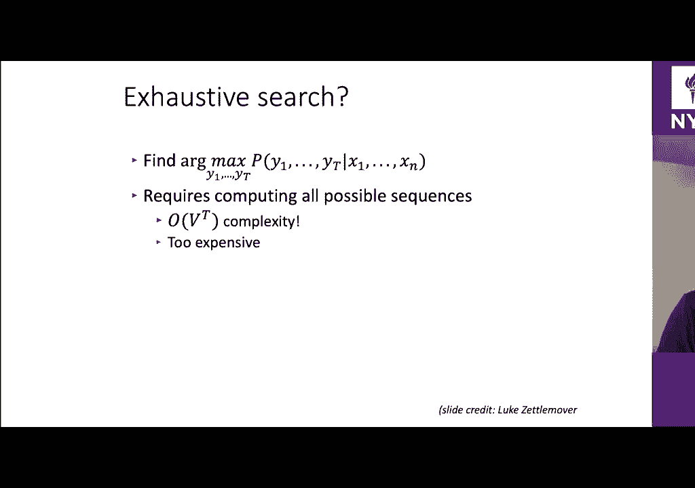

搜寻是不可能的，而且会打中，所谓的光束搜索嗯，所以被搜索是一种尝试。

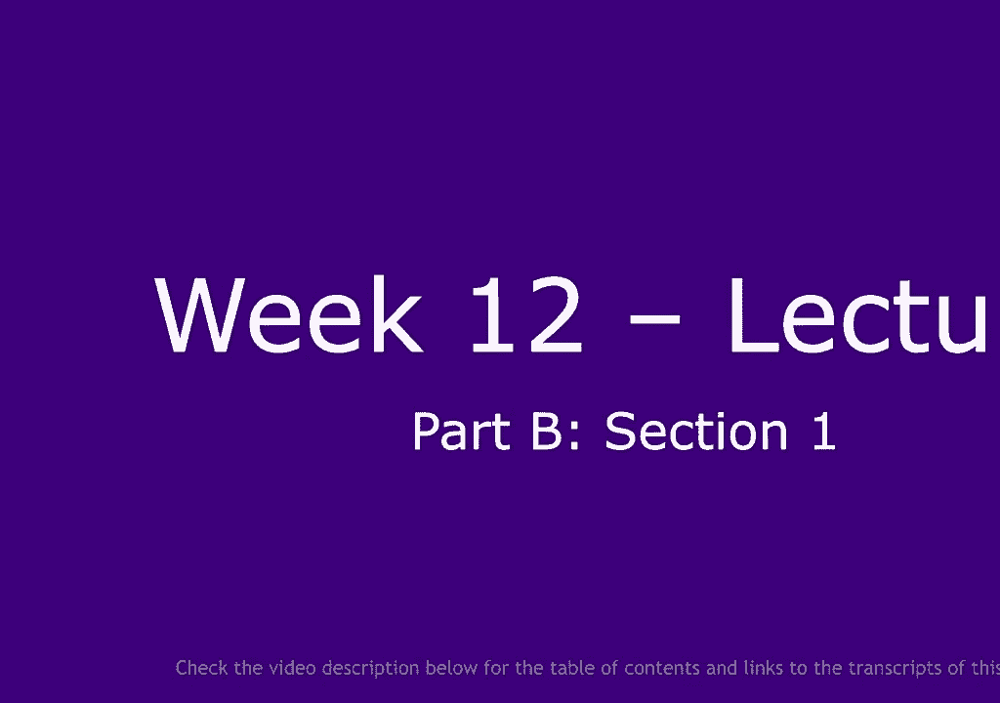

所谓的光束搜索嗯，所以被搜索是一种尝试，跟踪假设的n个最佳列表，跟踪假设的n个最佳列表，然后我们要每次尝试保持，然后我们要每次尝试保持，我们添加了曲目，与您一起更新此列表，我们添加了曲目。

与您一起更新此列表，嗯，这可能很容易向您展示一个示例um从abigail c幻灯片，嗯，这可能很容易向您展示一个示例um从abigail c幻灯片，在斯坦福大学，在斯坦福大学，嗯，我们开始，我们输出。

假设我们有两个大小，我放，嗯，我们开始，我们输出，假设我们有两个大小，我放，这两个可能的单词这是这两个最可能的单词，这两个可能的单词这是这两个最可能的单词，现在，对于这些单词，我们将生成um，现在。

对于这些单词，我们将生成um，算出我们的肿瘤像接下来的那句话，算出我们的肿瘤像接下来的那句话，所以很明显，使用io确实会影响下一个单词应该是什么，所以很明显，使用io确实会影响下一个单词应该是什么。

我们将针对每个假设提出不同的假设，我们将针对每个假设提出不同的假设，嗯，然后每次我们都会将其压缩到，然后每次我们都会将其压缩到，嗯，我们要继续按的清单，嗯，我们要继续按的清单。

所以我们正在寻找最低的总和是否正确，所以我们正在寻找最低的总和是否正确，嗯，所以这些是，记录可能性，嗯，如果可以的话，我们实际上想要最高的总和，嗯，如果可以的话，我们实际上想要最高的总和，零是一个概率。

哦耶，因此每个分数都将小于零，但我们将找到，因此每个分数都将小于零，但我们将找到，是否有一些分数的秘密，是否有一些分数的秘密，最高的，这有意义吗，对不起，是的，我知道了，这有意义吗，对不起，是的。

我知道了，符号翻转了，我非常喜欢我们试图将最小的幅度，符号翻转了，我非常喜欢我们试图将最小的幅度，数量级，嗯，数量级，是的，对不起，数量级，嗯，数量级，是的，对不起，抱歉，这不是做到这一点的最好方法。

抱歉，这不是做到这一点的最好方法，um如何像树一样进入波束搜索，um如何像树一样进入波束搜索，你什么时候停止寻找像候选序列一样的数字，你什么时候停止寻找像候选序列一样的数字，嗯，好的。

所以我们基本上将详细介绍我们拥有的肝病专家，嗯，好的，所以我们基本上将详细介绍我们拥有的肝病专家，这就像句子结尾标记，从某种意义上说，标记意味着一旦您，这就像句子结尾标记，从某种意义上说。

标记意味着一旦您，一旦输出，就完成了这个假设，一旦输出，就完成了这个假设，目的是找到完整的假设，从头到尾，目的是找到完整的假设，从头到尾，得分最高的结束令牌，得分最高的结束令牌，嗯所以，嗯。

我们将继续为您生成假设，嗯，我们将继续为您生成假设，嗯，嗯，那没有可能的新词，嗯，那没有可能的新词，关于k个完整的假设，我们仍然很酷，这里还有另一个问题，关于k个完整的假设，我们仍然很酷。

这里还有另一个问题，为什么在nmt中认为光束尺寸非常大，为什么在nmt中认为光束尺寸非常大，通常会导致空的翻译，通常会导致空的翻译，哦，很好的问题，对此我有意见，哦，很好的问题，对此我有意见，嗯所以。

嗯，研究是好的，因为可以保证给您，研究是好的，因为可以保证给您，比我在书中提到的呃贪婪搜索更高的得分假设，比我在书中提到的呃贪婪搜索更高的得分假设，上一张幻灯片，但这是一个陷阱，那就是我们实际上并没有。

但这是一个陷阱，那就是我们实际上并没有，嗯，在训练时我们通常不使用光束，嗯，在训练时我们通常不使用光束，所以，嗯，在训练时我们通常只使用超回归，嗯，在训练时我们通常只使用超回归。

我之前曾向您展示过因式分解，就像之前给定的n，我之前曾向您展示过因式分解，就像之前给定的n，正确的输出预测n加第一个单词um，正确的输出预测n加第一个单词um，我们不做的就是使模型暴露于自己的错误中。

我们不做的就是使模型暴露于自己的错误中，在其中进行波束搜索时，您会得到各种废话，在其中进行波束搜索时，您会得到各种废话，出于任何原因出现在你的光束中，出于任何原因出现在你的光束中，因为如果光束很大。

那么其中的一些可能会是垃圾，因为如果光束很大，那么其中的一些可能会是垃圾，在这些垃圾状态下，模型不知道该怎么做，因为从来没有，在这些垃圾状态下，模型不知道该怎么做，因为从来没有，训练情况。

所以期望是合理的，训练情况，所以期望是合理的，您的模型来概括财富，例如做出出色的预测，您的模型来概括财富，例如做出出色的预测，对于一些完全荒谬的单词系列，例如，对于一些完全荒谬的单词系列，例如。

非常完美的训练分布，在这种情况下，模型可以，非常完美的训练分布，在这种情况下，模型可以，做各种奇怪而无脑的事情，比如说他们把，做各种奇怪而无脑的事情，比如说他们把，别的概率，别的概率。

这是一个经典的例子，我不知道他是否在这里，这是一个经典的例子，我不知道他是否在这里，但是你可能已经看到他的线条墙变了，但是你可能已经看到他的线条墙变了，卡在这些反馈循环中，最终就像重复重复一样。

卡在这些反馈循环中，最终就像重复重复一样，单词或词组无数次，我认为这是一个例子，单词或词组无数次，我认为这是一个例子，一旦mods开始进入这种循环，一旦mods开始进入这种循环。

它真的不知道该怎么办以及最容易进行的事情，它真的不知道该怎么办以及最容易进行的事情，只是不断循环播放，只是不断循环播放，所以是的，我认为至少您提到过被搜索为，所以是的，我认为至少您提到过被搜索为，呃。

其中一项不让模型暴露于自身，呃，其中一项不让模型暴露于自身，在训练时犯了错误，所以它实际上放了一大堆，在训练时犯了错误，所以它实际上放了一大堆，概率量和它不应该做的各种事情。

概率量和它不应该做的各种事情，嗯，这是显而易见的解决方案，例如，为什么不，嗯，这是显而易见的解决方案，例如，为什么不，在训练时间有束光[音乐]，在训练时间有束光[音乐]，嗯，简短的回答是因为它很贵，嗯。

简短的回答是因为它很贵，呃，如果你们绕过整个推理过程，呃，如果你们绕过整个推理过程，一个训练时间，首先要摆脱所有不错的并行性，但是我们，一个训练时间，首先要摆脱所有不错的并行性，但是我们，有变压器。

并介绍所有搜索，有变压器，并介绍所有搜索，并为您提供更多得分的机会，并为您提供更多得分的机会，每个交易例子，所以在实践中人们倾向于忽略这个问题并进行训练，所以在实践中人们倾向于忽略这个问题并进行训练。

只要他们喜欢喜欢快速曝光就可以创建一个大型模型，只要他们喜欢喜欢快速曝光就可以创建一个大型模型，平行，你从中得到，自回归版本，然后一个测试站点的人经常会，自回归版本，然后一个测试站点的人经常会。

选择光束的大小以获得最佳性能，以便，选择光束的大小以获得最佳性能，以便，嗯，我认为翻译就像增加光束，嗯，我认为翻译就像增加光束，通常会有所帮助，然后又变得更糟，我们开始，通常会有所帮助，然后又变得更糟。

我们开始，涵盖了这些奇怪的退化，涵盖了这些奇怪的退化，输出嗯，是的，这只是不满意，输出嗯，是的，这只是不满意，人们不得不做的事情很长一段时间，人们不得不做的事情很长一段时间，回答，回答你的问题，我想。

呃，我想这个学生，我会，回答，回答你的问题，我想，呃，我想这个学生，我会，现在看看学生怎么说，就像呃，这是来自一个问题，现在看看学生怎么说，就像呃，这是来自一个问题，学生，在当前幻灯片上还有一个小问题。

在当前幻灯片上还有一个小问题，为什么是绿色的a和one，在右边，嗯，我可以承认我不知道我从艾比·姆那里偷走了这么大的东西，嗯，我可以承认我不知道我从艾比·姆那里偷走了这么大的东西。

我不太确定她想使那一点好吗，我不太确定她想使那一点好吗，没关系，哦，好的，实际上是有人回答的，因为它们是可互换的，哦，好的，实际上是有人回答的，因为它们是可互换的，不论您选择的是哪一种。

不论您选择的是哪一种，同时输出馅饼和蛋t，就像要么要么你去要么要么你去一个或两个他们都会，就像要么要么你去要么要么你去一个或两个他们都会，告诉你馅饼馅饼或馅饼镖呃，我不确定，我的意思是。

告诉你馅饼馅饼或馅饼镖呃，我不确定，我的意思是，即使您这样做，也无法压缩这些，这不是因为您，即使您这样做，也无法压缩这些，这不是因为您，可以获得一个动态程序，您可以在其中折叠这些假设。

可以获得一个动态程序，您可以在其中折叠这些假设，因为这两个假设的隐藏状态仍然是，因为这两个假设的隐藏状态仍然是，取决于您选择的路径，取决于您选择的路径，在一起，所以我不知道，但希望这，在一起。

所以我不知道，但希望这，说明可能正在搜索中，说明可能正在搜索中，好吧，关于这个问题，好吧，关于这个问题，[音乐]，好的，这是对算法外观的更多描述嗯，好的，这是对算法外观的更多描述嗯，基本上。

您要做的就是每次生成步骤，基本上，您要做的就是每次生成步骤，下一个单词的分布三个假设，下一个单词的分布三个假设，然后将所有假设中的前k个假设接下来的单词，然后将所有假设中的前k个假设接下来的单词。

并在拖到下一个单词之前将其拉出，并在拖到下一个单词之前将其拉出，好吧，嗯，没错，所以有时候会说正确的事，嗯，没错，所以有时候会说正确的事，但是通常不是，所以这是飞束的结果，但是通常不是。

所以这是飞束的结果，搜索我之前向您展示的示例，搜索我之前向您展示的示例，这个来自gpd2的例子，关于科学家发现，这个来自gpd2的例子，关于科学家发现，在安第斯山脉的独角兽，你可以在这里看到瓶子。

在安第斯山脉的独角兽，你可以在这里看到瓶子，实际上开始是放一些好东西，实际上开始是放一些好东西，并陷入这个怪异的反馈循环中，并陷入这个怪异的反馈循环中，嗯，所以我想是的，我们只是要重复相同的短语。

所以我想是的，我们只是要重复相同的短语，一遍又一遍，我可能只会继续重复这句话，一遍又一遍，我可能只会继续重复这句话，永远，我的意思是，我猜我想这是怎么回事，永远，我的意思是，我猜我想这是怎么回事。

重复两次，也许只是说第三遍，重复两次，也许只是说第三遍，时间实际上是最有可能做的事情，时间实际上是最有可能做的事情，然后所有其他假设都变得很高，然后所有其他假设都变得很高，过渡正确。

即使它们不好也有可能，过渡正确，即使它们不好也有可能，但是还有一个稍微不同的问题，但是还有一个稍微不同的问题，在某些情况下，我们实际上并不需要最可能的顺序，在某些情况下，我们实际上并不需要最可能的顺序。

也许我们想要的是一些有趣的东西，所以，也许我们想要的是一些有趣的东西，所以，您在对话响应生成之类的事情中也看到了这个问题，您在对话响应生成之类的事情中也看到了这个问题，所以你想建立一个世界堡垒。

所以你想建立一个世界堡垒，与某人交谈，如果您进行这种光束搜索，通常会，与某人交谈，如果您进行这种光束搜索，通常会，您会得到的是，它只会为您提供最通用的响应，您会得到的是，它只会为您提供最通用的响应。

随便你说什么就好，随便你说什么就好，有趣的是，也许真的，有趣的是，也许真的，是最有可能做的事情，因为这些回应很好，是最有可能做的事情，因为这些回应很好，在，多数情况下，这实际上不是，多数情况下。

这实际上不是，一个很好的经验或一个很好的系统，一个很好的经验或一个很好的系统，那么，如果不取最大数而不是um的话，我们将从模型中取样，那么，如果不取最大数而不是um的话，我们将从模型中取样，分配代替。

嗯，这在概念上是很吸引人的，但是，嗯，这在概念上是很吸引人的，但是，实际上并不能给您很好的输出，因此，实际上并不能给您很好的输出，因此，嗯，这又是在相同输入上的结果采样，嗯。

这又是在相同输入上的结果采样，嗯，我的意思是，这有点不错，但随后，我的意思是，这有点不错，但随后，嗯，随着它的发展，它变得越来越怪异和退化了，嗯，随着它的发展，它变得越来越怪异和退化了，嗯，再一次。

您现在遇到问题，就像一旦您采样了错误的选择，再一次，您现在遇到问题，就像一旦您采样了错误的选择，那时的黑痣永远不会训练，那时的黑痣永远不会训练，嗯，然后一旦它不在训练阶段，就更有可能，嗯。

然后一旦它不在训练阶段，就更有可能，您支持不良的输出，并且会陷入困境，您支持不良的输出，并且会陷入困境，可怕的反馈循环，好的，嗯，好的，这是实际可行的东西，因为它已经被使用了，好的，这是实际可行的东西。

因为它已经被使用了，为您提供我们以前拥有的美丽输出，为您提供我们以前拥有的美丽输出，不幸的是，这不是很令人满意的技术，但是，不幸的是，这不是很令人满意的技术，但是，这是一种披露方式。

所以被称为最高薪水抽样，这是一种披露方式，所以被称为最高薪水抽样，几年前由uh angela fan推出，几年前由uh angela fan推出，嗯，基本上是大写样本，我们要做什么，嗯。

基本上是大写样本，我们要做什么，将我们的分布截断为仅取k个最佳，将我们的分布截断为仅取k个最佳，然后从中取样，嗯，这样给我们带来多样性的优势，例如随机选择，嗯，这样给我们带来多样性的优势，例如随机选择。

像是不错的选择，但是试图阻止我们，像是不错的选择，但是试图阻止我们，摆脱了这种多种多样且实际上很好的语言，但是，摆脱了这种多种多样且实际上很好的语言，但是，当我们采样一些不好的东西。

所以唯一的基础就是砍掉长尾巴，当我们采样一些不好的东西，所以唯一的基础就是砍掉长尾巴，只是从分布的顶部抽样，这就是抽样，只是从分布的顶部抽样，这就是抽样，进行光束搜索吗，对不起，这是光束开关。

进行光束搜索吗，对不起，这是光束开关，这只是我们的世代，所以我们会，这只是我们的世代，所以我们会，这里不会有光束，这可能是一个假设，这里不会有光束，这可能是一个假设，我想你也可以创建波束搜索，但是。

我想你也可以创建波束搜索，但是，嗯，这实际上是纯采样，所以我可以用这种方法生成一个单词，嗯，这实际上是纯采样，所以我可以用这种方法生成一个单词。

然后用它来生成下一个单词好吧，所以当你，然后用它来生成下一个单词好吧，所以当你，呃做所有的事情，那么这最终就是在这个美好的过程中使用的技术，呃做所有的事情，那么这最终就是在这个美好的过程中使用的技术。

样品显然是我正在玩的这种顶级情况，样品显然是我正在玩的这种顶级情况，有点骇人，不是很令人满意，我是我的论文作者，所以我，有点骇人，不是很令人满意，我是我的论文作者，所以我，可能意味着该方法，但是嗯。

它的确工作得很好，可能意味着该方法，但是嗯，它的确工作得很好，嗯，我猜想一件事，就像当您看到这些出色的样本时，嗯，我猜想一件事，就像当您看到这些出色的样本时，像这样的事情，我很乐意投入，像这样的事情。

我很乐意投入，他们的宣传，嗯，知道它是怎么回事，他们的宣传，嗯，知道它是怎么回事，实际制造的，这就像这不是真正的，实际制造的，这就像这不是真正的，来自所有分布的样本，模型就像不放，来自所有分布的样本。

模型就像不放，嗯，它必须对此使用概率质量，嗯，它必须对此使用概率质量，呃做这个有点奇怪的推论而产生的，呃做这个有点奇怪的推论而产生的。

模型的程序，嗯，我只想像这样好快地掩盖一下，所以给我们这样的文字，嗯，我只想像这样好快地掩盖一下，所以给我们这样的文字，我们如何知道这是好事还是不好事，例如您如何评价这一点。

我们如何知道这是好事还是不好事，例如您如何评价这一点，嗯，这不像评估启动模型，而是，嗯，这不像评估启动模型，而是，容易，我是说这是语言建模，是任务密度估算，所以您只是，容易，我是说这是语言建模。

是任务密度估算，所以您只是，看起来像这里保存该数据，看起来像这里保存该数据，嗯，如果您想做些类似的事情，那么请带些惊奇的文字说，嗯，如果您想做些类似的事情，那么请带些惊奇的文字说，那好不好，嗯。

这不是真实的，而是一种人们倾向于使用，嗯，这不是真实的，而是一种人们倾向于使用，这些自动化指标（例如蓝色和胭脂），这些自动化指标（例如蓝色和胭脂），和语法与参考重叠，但，和语法与参考重叠，但，嗯。

他们不是很满意，这是最近的研究和尝试，嗯，他们不是很满意，这是最近的研究和尝试，做很棒的不对称，好吧，我应该把我放下来给这个嗯，所以这就是那个，好吧，我应该把我放下来给这个嗯，所以这就是那个。

um的无条件语言模型，因此他们正在生成文本样本，um的无条件语言模型，因此他们正在生成文本样本，嗯，这实际上不是一件非常有用的事情，更有用的是，嗯，这实际上不是一件非常有用的事情，更有用的是。

条件语言模型，所以可以给我们文本的模型，条件语言模型，所以可以给我们文本的模型，给定一些输入生成使用一些输出，所以，给定一些输入生成使用一些输出，所以，例如，您可以考虑诸如um之类的事情，例如。

您可以考虑诸如um之类的事情，给了法语句子，例如将其翻译成英语，我给了一个文件，给了法语句子，例如将其翻译成英语，我给了一个文件，给定对话产生摘要，给定对话产生摘要，下一个答复，或者您可以给它一个问题。

我会回答，下一个答复，或者您可以给它一个问题，我会回答，所以这叫做序列序列模型，所以这叫做序列序列模型，嗯，因为您得到了一些输入序列，然后您必须，嗯，因为您得到了一些输入序列，然后您必须。

生成一些输出序列um，因为第一个模型是，生成一些输出序列um，因为第一个模型是，由elias Giver引入um看起来有点像这样，由elias Giver引入um看起来有点像这样，神经网络。

基本上您会拥有一些编码网络，神经网络，基本上您会拥有一些编码网络，会读取您的输入产生一些向量，会读取您的输入产生一些向量，奇妙地称为思想载体，然后您将使用它，奇妙地称为思想载体，然后您将使用它。

初始化将生成令牌的解码器，初始化将生成令牌的解码器，希望再一次通过文字说出你的主题，希望再一次通过文字说出你的主题，像这样的瓶颈和复发并不是一件好事，像这样的瓶颈和复发并不是一件好事，呃。

你想拥有可以看到所有东西的表情模型，呃，你想拥有可以看到所有东西的表情模型，嗯，所以有一个用于序列序列模型的变体转换器，嗯，所以有一个用于序列序列模型的变体转换器，嗯，在这里，我们将有两个堆栈。

一个编码器堆栈和一个解码堆栈，嗯，在这里，我们将有两个堆栈，一个编码器堆栈和一个解码堆栈，嗯，基本上，编码后的堆栈与我之前向您展示的相同，嗯，基本上，编码后的堆栈与我之前向您展示的相同。

除了自我张力之外，所有输入标记都可以查看，除了自我张力之外，所有输入标记都可以查看，输入中的所有其他标记，解码堆栈将类似，除了执行自张力，解码堆栈将类似，除了执行自张力，本身也会引起注意。

本身也会引起注意，嗯，完成输入，这意味着每个令牌输出，完成输入，这意味着每个令牌输出，与输出中的每个先前令牌直接连接，与输出中的每个先前令牌直接连接，um以及输入中的每个单词。

这使得这些模型非常具有表现力和功能，这使得这些模型非常具有表现力和功能，先前循环卷积的翻译分数，先前循环卷积的翻译分数，模型，所以我们正在尝试这些模型。

模型，所以我们正在尝试这些模型，通常我们要做的就是依靠标签文本，所以我们，通常我们要做的就是依靠标签文本，所以我们。

呃，例如，这是一个字符串翻译系统，呃，例如，这是一个字符串翻译系统，尝试获取大量手动翻译的文本，这是最好的方法之一，尝试获取大量手动翻译的文本，这是最好的方法之一，要实现这一点就像议会程序一样。

因为它们总是，要实现这一点就像议会程序一样，因为它们总是，翻译欧洲议会或写，翻译欧洲议会或写，程序很多不同的语言，嗯，然后你就，程序很多不同的语言，嗯，然后你就，使用这些作为输入。

但是现在并不是所有的语言都喜欢，使用这些作为输入，但是现在并不是所有的语言都喜欢，在欧洲议会中有代表，在欧洲议会中有代表，因此，这些转换器非常耗费数据，就像更多文本可能会抛出，因此。

这些转换器非常耗费数据，就像更多文本可能会抛出，他们会尽力而为，所以这个问题就像我们，他们会尽力而为，所以这个问题就像我们，使用单语文字来改善这些，所以这实际上是在说我们可以学习。

使用单语文字来改善这些，所以这实际上是在说我们可以学习，不仅仅是输入输出对，不仅仅是输入输出对，嗯，我们可以做到这一点的方法是一种叫做反向翻译的技术，嗯。

我们可以做到这一点的方法是一种叫做反向翻译的技术，从概念上讲很简单，这就是我们的，从概念上讲很简单，这就是我们的，目标是训练翻译系统，目标是训练翻译系统，输入德语，我们将输出英语，首先。

我们要做的实际上是相反的，我们将训练，首先，我们要做的实际上是相反的，我们将训练，反向翻译模型将提供英语输出德语，反向翻译模型将提供英语输出德语，然后我们可以在所有可以找到的英文文本上运行此模型。

然后我们可以在所有可以找到的英文文本上运行此模型，可以在上找到很多英文文本吗，可以在上找到很多英文文本吗，互联网，我们将全部翻译成，德国嗯，这给了我们更多，德国嗯，这给了我们更多，对英语和德语文本。

然后我们，对英语和德语文本，然后我们，要训​​练一个向前的模型或尝试将此德语翻译成英语，要训​​练一个向前的模型或尝试将此德语翻译成英语，嗯，接下来要看的是，实际上有多好并不重要，嗯，接下来要看的是。

实际上有多好并不重要，最初的模型是正确的，没关系，最初的模型是正确的，没关系，如果您的反向模型犯了错误，如果您的反向模型犯了错误，嗯，所以如果您的反向模型出错，那么最终的火车数据将，嗯。

所以如果您的反向模型出错，那么最终的火车数据将，包含一种嘈杂的德语翻译成干净的英语，包含一种嘈杂的德语翻译成干净的英语，嗯，甚至可以帮助您规范化，嗯，甚至可以帮助您规范化，模型，但是当您，模型。

但是当您，显示干净的德语数据是什么字节文本，显示干净的德语数据是什么字节文本，哦，对不起，一个bitex只是意味着一个并行，哦，对不起，一个bitex只是意味着一个并行，文字。

所以两种不同语言的相同句子还可以，文字，所以两种不同语言的相同句子还可以，谢谢，好的，翻译的好处是，好的，翻译的好处是，你得到的输出实际上总是你知道的，你得到的输出实际上总是你知道的，高质量。

因为这些是系统的输出，高质量，因为这些是系统的输出，我想你，你在网上野外找到的句子，你在网上野外找到的句子，您将要创建一些可用于这些的嘈杂输入，您将要创建一些可用于这些的嘈杂输入，这些服装，嗯。

你能不能再回到幻灯片的第三点翻译数十亿，嗯，你能不能再回到幻灯片的第三点翻译数十亿，英语到德语的单词是通过反向翻译模型，英语到德语的单词是通过反向翻译模型，好的，很好，很酷，你是说回翻译，好的，很好。

很酷，你是说回翻译，帮助您生成更高质量的翻译，帮助您生成更高质量的翻译，嗯，因为正则化是啊，不只是，嗯，因为正则化是啊，不只是，认可这也是真正有用的事情，它为您提供了很多，认可这也是真正有用的事情。

它为您提供了很多，干净的输出数据，所以假设您应该是一个好人，干净的输出数据，所以假设您应该是一个好人，您需要同时理解的翻译模型之间的德语，您需要同时理解的翻译模型之间的德语，德语，我们也可以写很多。

德语，我们也可以写很多，也会说流利的英语，然后是英语语法小组，也会说流利的英语，然后是英语语法小组，翻译为您提供了整合大量，翻译为您提供了整合大量，除了您要翻译的内容以外的其他语言数据。

除了您要翻译的内容以外的其他语言数据，嗯，好吧，这样结合了翻译易变的语言，嗯，好吧，这样结合了翻译易变的语言，模型，你也可以，um也要重复执行此过程，以便您可以使用它的全部含义，um也要重复执行此过程。

以便您可以使用它的全部含义，描述之前要训练更好的模型，然后，描述之前要训练更好的模型，然后，嗯，这样做是为了帮助您产生更好的翻译，更好的反向翻译，这样做是为了帮助您产生更好的翻译，更好的反向翻译。

您可以用来再次训练，这对我很有帮助，您可以用来再次训练，这对我很有帮助，甚至对英语德语也有帮助，但在某些情况下特别有用，甚至对英语德语也有帮助，但在某些情况下特别有用，那里没有太多数据。

所以这是小熊的英语翻译，那里没有太多数据，所以这是小熊的英语翻译，在没有很多并行数据的地方，但是您可以，在没有很多并行数据的地方，但是您可以，只需迭代翻译即可获得很大的改进。

只需迭代翻译即可获得很大的改进，是展览会的最新作品，我忘了参考，是展览会的最新作品，我忘了参考，嗯，这是关于呃的一些结果，嗯，我认为这是英语德语，显示出一些很好的改进，嗯，我认为这是英语德语。

显示出一些很好的改进，嗯，人们正在探索的机器翻译的方向之一是，嗯，人们正在探索的机器翻译的方向之一是，大量使用多种语言的MT，大量使用多种语言的MT，试图不只是在两种语言之间翻译。

试图不只是在两种语言之间翻译，但尝试使用数十种100种语言并尝试，但尝试使用数十种100种语言并尝试，训练可以在所有这些之间转换的单个神经网络，训练可以在所有这些之间转换的单个神经网络，嗯。

如果你这样做，你开始看到嗯，有了很大的改进，特别是在您没有太多标签的语言中，有了很大的改进，特别是在您没有太多标签的语言中，大概该模型正在学习某种，大概该模型正在学习某种，更一般的语言独立信息。

更一般的语言独立信息，好的，所以我要讲的最后一个主题非常重要，好的，所以我要讲的最后一个主题非常重要，是自我监督的学习，嗯，所以嗯，年轻的只是看到。

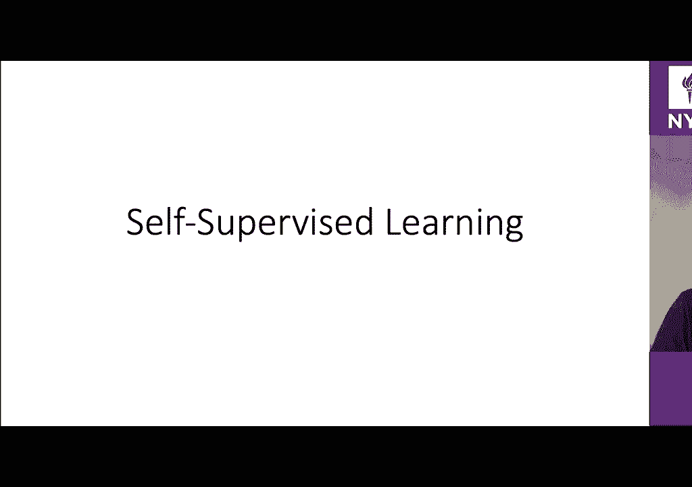

是自我监督的学习，嗯，所以嗯，年轻的只是看到，现在这个蛋糕，但我认为这实际上是一个很好的形象，所以这个想法是，现在这个蛋糕，但我认为这实际上是一个很好的形象，所以这个想法是，[音乐]真的，[音乐]真的。

学习像我们需要的大多数信息这样的东西将是我们最需要学习的东西，学习像我们需要的大多数信息这样的东西将是我们最需要学习的东西，确实必须不受监督，所以我们有大量的文本，没有任何文本，确实必须不受监督。

所以我们有大量的文本，没有任何文本，标签上，我们只有一点点，标签上，我们只有一点点，蛋糕所代表的那种超级令人沮丧的数据是，蛋糕所代表的那种超级令人沮丧的数据是，无监督学习和监督学习只是一点点。

无监督学习和监督学习只是一点点，我认为实际上是最近这个人的蛋糕上锦上添花，我认为实际上是最近这个人的蛋糕上锦上添花，从nlp进行自我监督学习确实证明了这个比喻可以奏效。

从nlp进行自我监督学习确实证明了这个比喻可以奏效，可以，然后呢，嗯，我将描述很多如何进行自我监督的方法，嗯，我将描述很多如何进行自我监督的方法，学习自然语言，以便您可以尝试并获得一些想法。

学习自然语言，以便您可以尝试并获得一些想法，至于实际上在做什么，至于实际上在做什么，嗯，第一个描述的词是背对背嗯，嗯，第一个描述的词是背对背嗯，所以回头的领域是我想这真的是第一篇。

所以回头的领域是我想这真的是第一篇，表明呃让人们对销售感到兴奋，表明呃让人们对销售感到兴奋，突然降落在lp uh vern上，他之前的工作来自uh，突然降落在lp uh vern上。

他之前的工作来自uh，卡尔弗和西方也表现出了一些不错的收益，卡尔弗和西方也表现出了一些不错的收益，所以这里的目标将是尝试学习所谓的词嵌入，所以这里的目标将是尝试学习所谓的词嵌入，脱欧空间朗诵单词。

希望是，脱欧空间朗诵单词，希望是，通过查看未标记的英文文本，我们可以了解有关，通过查看未标记的英文文本，我们可以了解有关，这些话意味着这就是所有背后的直觉，这些话意味着这就是所有背后的直觉。

这就是如果两个词在文本中可以并排在一起的话，这就是如果两个词在文本中可以并排在一起的话，他们之间可能有某种关系，他们之间可能有某种关系，嗯，所以我们要做的预训练任务将是，嗯。

所以我们要做的预训练任务将是，空白任务，所以这句话我要去，空白任务，所以这句话我要去，掩盖这个词在中间是独角兽，并尝试预测什么，掩盖这个词在中间是独角兽，并尝试预测什么，该词应基于周围的上下文，并且。

该词应基于周围的上下文，并且，希望是像未知的银色头发和手这样的词，希望是像未知的银色头发和手这样的词，将更可能在上下文中发生，将更可能在上下文中发生，比他们独角兽我知道一个词，比他们独角兽我知道一个词。

其他一些动物，嗯，基本上，这将是一个非常简单的模型，基本上，我们将，嗯，基本上，这将是一个非常简单的模型，基本上，我们将，拿所有这些上下文词，我们将应用一些线性投影，拿所有这些上下文词。

我们将应用一些线性投影，这些并映射固定大小上下文的余量，这些并映射固定大小上下文的余量，然后对词汇量进行softmax，然后对词汇量进行softmax，嗯，所以看起来有点像卷积语言模型，嗯。

所以看起来有点像卷积语言模型，区别在于我们预测的是谜语这个词，而不是末尾的单词。区别在于我们预测的是谜语这个词，而不是末尾的单词。任何实践中，该模型只是一个浅的线性投影，并没有，任何实践中。

该模型只是一个浅的线性投影，并没有，不是很深的模型，好吧，所以我们发现有趣的事情之一，好吧，所以我们发现有趣的事情之一，关于这个是这些嗯罗word的婚礼，以显示一些，关于这个是这些嗯罗word的婚礼。

以显示一些，令他们惊讶的是，呃，我会告诉你这是多么有趣，令他们惊讶的是，呃，我会告诉你这是多么有趣，就像人们争论有多有意义，就像人们争论有多有意义，这个嗯，但基本上说是，如果你，这个嗯，但基本上说是。

如果你，带你入侵了像这样训练的国王一词，而你，带你入侵了像这样训练的国王一词，而你，减去您已准备好男人一词，然后添加女人一词的嵌入，减去您已准备好男人一词，然后添加女人一词的嵌入。

您会得到与皇后一词的嵌入非常接近的东西，您会得到与皇后一词的嵌入非常接近的东西，嗯，就是这种无监督的空白学习任务，就是这种无监督的空白学习任务，没有使用具有某种意义的线性结构。

没有使用具有某种意义的线性结构，向量之间的差异，好吧，我的意思是，这很棒，而且真的很好，好吧，我的意思是，这很棒，而且真的很好，关于这是一件非常非常快的事情，所以您可以训练它。

关于这是一件非常非常快的事情，所以您可以训练它，在数十亿字的文字中您返回，在数十亿字的文字中您返回，2013。嗯，但有一个很大的限制是，2013。嗯，但有一个很大的限制是，这些文字作品与上下文无关。

这些文字作品与上下文无关，所以嗯，你得到每个单词一个向量，所以嗯，你得到每个单词一个向量，你的词汇量，但是对它一无所知，你的词汇量，但是对它一无所知，这个词的关系如何运作，我们知道。

这个词的关系如何运作，我们知道，句子只取决于单词，句子只取决于单词，每个单词都以某种方式与其他单词交互，每个单词都以某种方式与其他单词交互，这些交互在某种程度上是一件非常强大的事情。

这些交互在某种程度上是一件非常强大的事情，所以在一个例子中，明显的例子就像歧义词，所以在一个例子中，明显的例子就像歧义词，所以很多单词可以有很多不同的含义，所以很多单词可以有很多不同的含义。

这些单词向量不会捕捉到，这些单词向量不会捕捉到，或者最好让我们迷惑所有的意思，或者最好让我们迷惑所有的意思，那么我们如何为这些嗯添加上下文，那么我们如何为这些嗯添加上下文，看到最明显的方法是做一条线。

我想我想念一个，看到最明显的方法是做一条线，我想我想念一个，基本上在这里滑动，我们要做的是训练条件语言模型对不起无条件，我们要做的是训练条件语言模型对不起无条件，语言模型这将恰好是我描述的那种模型。

语言模型这将恰好是我描述的那种模型，在谈话的早期，然后嗯，在谈话的早期，然后嗯，给定这种语言模型，眼罩将每个输出隐藏状态，给定这种语言模型，眼罩将每个输出隐藏状态，预测下一个单词的时间步长。

而不是我们要出售监督价的时间步长，预测下一个单词的时间步长，而不是我们要出售监督价的时间步长，了解我们要做的是将这些输出替换为um，了解我们要做的是将这些输出替换为um，其他一些取决于我们任务的输出。

因此预训练阶段只是，其他一些取决于我们任务的输出，因此预训练阶段只是，可以预测下一个单词，但可以锦上添花，可以预测下一个单词，但可以锦上添花，或有监督的学习将成为其他一些属性的预言，所以我会。

或有监督的学习将成为其他一些属性的预言，所以我会，在这里为您展示一个名为“任务”的示例，在这里为您展示一个名为“任务”的示例，语音标签试图说要在这里的每个单词中加上一些标签。

语音标签试图说要在这里的每个单词中加上一些标签，因此，将光标签科学家和名词以及与众不同的词，因此，将光标签科学家和名词以及与众不同的词，一个形容词um但实际上您可以适合所有。

一个形容词um但实际上您可以适合所有，任务，例如，也许您可​​以适应，任务，例如，也许您可​​以适应，这样的事情是情感分析任务，这样的事情是情感分析任务，您会得到一些文本来进行预测。

例如通过亚马逊评论进行预测，您会得到一些文本来进行预测，例如通过亚马逊评论进行预测，嗯，所以评价，嗯，所以评价，嗯，这是一篇评论，说我能说什么呢？嗯，这是一篇评论，说我能说什么呢？

已经说过有关真正的青霉素或iphone的评论，已经说过有关真正的青霉素或iphone的评论，得到了五颗星，所以这是您要预测这种语言模型的输出，所以这是您要预测这种语言模型的输出，最后将成为呃一个令牌。

最后将成为呃一个令牌，您可以使用某种测试专用标签，您可以使用某种测试专用标签，因此，关于此方法的一件非常好的事情叫做gpt，因此，关于此方法的一件非常好的事情叫做gpt，是消除了特定于任务的建模。

所以现在突然我们，是消除了特定于任务的建模，所以现在突然我们，有，您可以预训练的一种模型，我们也可以进行微调，您可以预训练的一种模型，我们也可以进行微调，基本上我们想做的任何事情。

基本上我们想做的任何事情，分类um所以在此之前，分类um所以在此之前，嗯，实际上几年来，人们把所有这些疯狂的东西，嗯，实际上几年来，人们把所有这些疯狂的东西，您构建不同架构来构建一个。

您构建不同架构来构建一个，任务回答模型让我们做一个情感分析专业模型，或者，任务回答模型让我们做一个情感分析专业模型，或者，嗯，现在您训练创建一个大模型，然后，嗯，现在您训练创建一个大模型，然后。

单位很容易找到，随心所欲，单位很容易找到，随心所欲，所以这是向前迈出的一大步，不幸的是，这种模式，所以这是向前迈出的一大步，不幸的是，这种模式，我说过明显的局限性，重要的是要做一种情境化。

我说过明显的局限性，重要的是要做一种情境化，像让单词知道那样建立单词背诵取决于，像让单词知道那样建立单词背诵取决于，上下文，但是如果您欣赏这种语言模型，上下文，但是如果您欣赏这种语言模型。

你只能在上下文中真正适应你的条件，你只能在上下文中真正适应你的条件，因此您对每个字词的期望不一定取决于，因此您对每个字词的期望不一定取决于，将来任何单词的表示形式，将来任何单词的表示形式，嗯。

这种限制可以使模型完成很多工作，这种限制可以使模型完成很多工作，嗯，有一种明显的解决办法，嗯，有一种明显的解决办法，elmo um采取的方法，因此elmo进行了一项训练，elmo um采取的方法。

因此elmo进行了一项训练，正确的语言模型嗯，也训练第二语言模型，正确的语言模型嗯，也训练第二语言模型，它以相反的方向运行，所以就像，它以相反的方向运行，所以就像，嗯，这是文档中的最后一个字，嗯。

这是文档中的最后一个字，不断尝试创建先前的单词，然后通过，不断尝试创建先前的单词，然后通过，连接左右模型的输出层和左右模型的输出层，连接左右模型的输出层和左右模型的输出层，模型，嗯。

这种模式在某些方面比现在更好，嗯，这种模式在某些方面比现在更好，表示不能以本地上下文为条件，而是，表示不能以本地上下文为条件，而是，结合上下文，这对于许多，结合上下文，这对于许多，任务。

但这还是有一定局限性的，而且您并不是很喜欢互动，但这还是有一定局限性的，而且您并不是很喜欢互动，在这些情况下，这些嗯，你会得到这种浅薄的，在这些情况下，这些嗯，你会得到这种浅薄的，左表示的串联右表示。

左表示的串联右表示，而你真正要做的就是在左手之间进行丰富的互动，而你真正要做的就是在左手之间进行丰富的互动，语境和正确的语境，对，嗯，这一切使我出生，对，嗯，这一切使我出生，嗯。

也许您听说过LP产生了很大的变化，嗯，也许您听说过LP产生了很大的变化，嗯所以，实际上看起来有点像单词效果，基本上是可填充的空白，实际上看起来有点像单词效果，基本上是可填充的空白，任务。

所以您需要一些文本，可以通过掩盖标记来隐藏一些标记，任务，所以您需要一些文本，可以通过掩盖标记来隐藏一些标记，然后您尝试将其填充在面膜中，这样，然后您尝试将其填充在面膜中，这样。

这像文本是金色的东西木偶，这像文本是金色的东西木偶，然后你填在那里，我想让您注意的是，首先它实际上看起来很多，我想让您注意的是，首先它实际上看起来很多，像单词背对着um华兹华斯也得到了一些文字。

像单词背对着um华兹华斯也得到了一些文字，填空，原因更好的原因是，填空，原因更好的原因是，在话语事件中，您只会像这样线性投影，在话语事件中，您只会像这样线性投影，包括上下文词，而您拥有它们。

包括上下文词，而您拥有它们，一个非常大的变压器呃，它在更多的上下文中看起来，一个非常大的变压器呃，它在更多的上下文中看起来，在这种情况下互动性较低，因此这里存在一个问题，在这种情况下互动性较低。

因此这里存在一个问题，在微调特定任务时保持上下文表示，在微调特定任务时保持上下文表示，嗯，他们如何维持呢？我猜嗯，目前尚不清楚他们是否得到维护，我猜嗯，目前尚不清楚他们是否得到维护。

所以当你找到自己的任务，您有点迷上了它们，以学习足够的通用语言知识，您有点迷上了它们，以学习足够的通用语言知识，预先训练的任务，然后进行微调，我想可能是，预先训练的任务，然后进行微调，我想可能是。

忘记很多东西，但并不需要解决这个问题，忘记很多东西，但并不需要解决这个问题，特定的任务，因此，如果您要进行情感分析，特定的任务，因此，如果您要进行情感分析，或可能会丢失很多这样的东西。

或可能会丢失很多这样的东西，微调期间的信息似乎很好，谢谢，微调期间的信息似乎很好，谢谢，好的，嗯，所以它很好用，嗯，他们在一堆上做了很大的改进，所以它很好用，嗯，他们在一堆上做了很大的改进，的任务数量。

实际上是实现了，的任务数量，实际上是实现了，人类的性能或至少人类的机械性能，人类的性能或至少人类的机械性能，一堆重要的呃问卷上的技术，一堆重要的呃问卷上的技术，基准，但绝对不是终点，基准。

但绝对不是终点，嗯，但我很多人都很兴奋，嗯，但我很多人都很兴奋，关于自我监督的培训um，以便快速总结细节，关于自我监督的培训um，以便快速总结细节，在那里，这是一个非常简单的模型，它将掩盖15个令牌。

这是一个非常简单的模型，它将掩盖15个令牌，并尝试填充口罩，嗯，建立在这个基础上的嗯在facebook上是行不通的，嗯，建立在这个基础上的嗯在facebook上是行不通的，看着扩大鸟类数量。

所以你能告诉组合实际上有第二次预训练吗，所以你能告诉组合实际上有第二次预训练吗，我们展示的目标实际上并没有帮助，我们展示的目标实际上并没有帮助，所以我可以阅读幻灯片的问题吗？

所以我可以阅读幻灯片的问题吗？所以有三个酒吧我想我错过了一点，所以有三个酒吧我想我错过了一点，深蓝色是什么深蓝色，所以我们在那里有亚马逊twerk，深蓝色是什么深蓝色，所以我们在那里有亚马逊twerk。

谢谢，对不起，我说以前是深蓝色的头发，所以，谢谢，对不起，我说以前是深蓝色的头发，所以，好的，这是这些模型，可能是elmo，这是，好的，这是这些模型，可能是elmo，这是，哦，是的。

所以以前我肯定是在用，哦，是的，所以以前我肯定是在用，细胞突击训练，但是通过，细胞突击训练，但是通过，就像我看到并成长的那样，这实际上是一个基准，就像我看到并成长的那样，这实际上是一个基准。

我们一直在nyu在这里创建，确实有一些学生参与其中，我们一直在nyu在这里创建，确实有一些学生参与其中，是的，所以胶水是一个很大的基准，它非常，是的，所以胶水是一个很大的基准，它非常。

重要的好吧，所以要击败，但事实证明一切，重要的好吧，所以要击败，但事实证明一切，您要做的是首先简化培训目标，然后，您要做的是首先简化培训目标，然后，扩大规模，因此扩大规模意味着更大的批量。

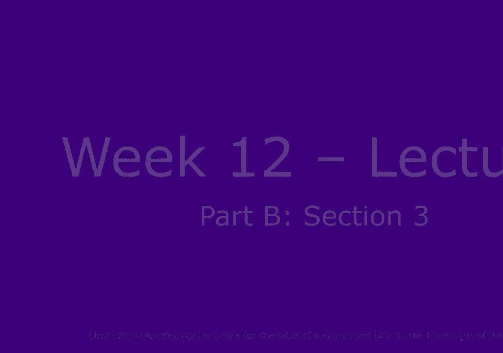

扩大规模，因此扩大规模意味着更大的批量，大量的GPU，更多免费的培训文字，然后您会在顶部获得很大的收获，更多免费的培训文字，然后您会在顶部获得很大的收获，的，工作如此黄，然后就是这个新的逆转模型。

工作如此黄，然后就是这个新的逆转模型，嗯，罗伯塔（Roberta），问题的答案就像，嗯，罗伯塔（Roberta），问题的答案就像，在很多方面，超人也是nyu的蓝色基准，在很多方面。

超人也是nyu的蓝色基准，也是人流，也是人流，这并不是真正要做任何聪明的事，这并不是真正要做任何聪明的事，接受自我监督的培训并做得更多，接受自我监督的培训并做得更多，好吧。

为什么你为什么要说像在这张幻灯片上这样，好吧，为什么你为什么要说像在这张幻灯片上这样，呃伯特和罗伯塔之间在阴霾中有了很大的进步，呃伯特和罗伯塔之间在阴霾中有了很大的进步，但可能不是班上这么大的变化。

但可能不是班上这么大的变化，这只是一个变焦系数，我就像，这只是一个变焦系数，我就像，也许这只是右边的缩放因子左边的那些条更高，也许这只是右边的缩放因子左边的那些条更高，是的，我认为。

也许秤扭曲了我认为重点是，也许秤扭曲了我认为重点是，如果与人类表现相比，我知道嗯，但是0。6分的人最好，我知道嗯，但是0。6分的人最好，罗伯塔比你好三分半，罗伯塔比你好三分半，因此，按照该指标。

实际上是一个很大的飞跃，因此，按照该指标，实际上是一个很大的飞跃，好的，让我们快速讨论其他一些，好的，让我们快速讨论其他一些，人们一直在做的事情仍然使培训感到惊讶，人们一直在做的事情仍然使培训感到惊讶。

所以现在有一个叫做excel的基本上就是这样，当您预测所有，所以现在有一个叫做excel的基本上就是这样，当您预测所有，您有条件地预测所有蒙版的大量代币，您有条件地预测所有蒙版的大量代币。

独立的um excel net有一个技巧可以让您，独立的um excel net有一个技巧可以让您，自动递归但随机地与这些质量代币联系，自动递归但随机地与这些质量代币联系，他们声称这样做会有所改善。

他们声称这样做会有所改善，也是垃圾邮件污垢，而不是掩盖您要掩盖的单词，也是垃圾邮件污垢，而不是掩盖您要掩盖的单词，那里有一系列连续的单词，那里有一系列连续的单词，是电子，而不是，是电子，而不是。

掩盖单词，我们将用替换单词，掩盖单词，我们将用替换单词，相似的东西，然后有一个二进制分类问题告诉，相似的东西，然后有一个二进制分类问题告诉，你哪个词变了还是没有，你哪个词变了还是没有，是阿尔伯特。

它是um burt，但您也可以跨um命名权重，是阿尔伯特，它是um burt，但您也可以跨um命名权重，um xlr和xlr希望通过多种语言做到这一点，um xlr和xlr希望通过多种语言做到这一点。

基本上，您运行了培训前的目标，但是，基本上，您运行了培训前的目标，但是，用英语输入您可以输入的每种语言的文本，用英语输入您可以输入的每种语言的文本，发现它在学习交叉链接结构方面做得很好。

发现它在学习交叉链接结构方面做得很好，嗯，关键点是，嗯，关键点是，真的就像这些都是变化，真的就像这些都是变化，嗯，但是最后就像很多不同，嗯，但是最后就像很多不同，一切正常，重要的是你有，一切正常。

重要的是你有，在大型模型中，单词之间存在双向交互作用，在大型模型中，单词之间存在双向交互作用，而你，如果有的话，你这样做，而你，如果有的话，你这样做，是最重要的，嗯，我描述的这些模型有一个局限性，嗯。

我描述的这些模型有一个局限性，他们只是在做某种文本分类问题，他们只是在做某种文本分类问题，但是我们经常想做，输出不是分类的问题实际上是分类问题，输出不是分类的问题实际上是分类问题。

对序列序列进行一些预训练，再输出一些文本，对序列序列进行一些预训练，再输出一些文本，建模，两篇论文大致相同，建模，两篇论文大致相同，我参与这个的时间，我参与这个的时间，称为出生和t5 um。

因此这些模型基本上将通过以下步骤对序列序列模型进行预训练，因此这些模型基本上将通过以下步骤对序列序列模型进行预训练，去噪文本um树训练目标看起来，去噪文本um树训练目标看起来，基本上就是您要做的一切。

基本上就是您要做的一切，是通过应用某些文本使其损坏，是通过应用某些文本使其损坏，某种掩蔽方案，然后而不是，某种掩蔽方案，然后而不是，预测您要填充损坏的文本的空格，预测您要填充损坏的文本的空格。

进入CC模型并尝试预测完整的输出，进入CC模型并尝试预测完整的输出，和嗯，这很好，因为然后，和嗯，这很好，因为然后，实际上，您不仅可以屏蔽文本，还可以像其他任何文本一样应用，实际上，您不仅可以屏蔽文本。

还可以像其他任何文本一样应用，您想要的随机呃腐败事物，例如，您可以，您想要的随机呃腐败事物，例如，您可以，洗句或删除整个短语或，洗句或删除整个短语或，这是一个新短语，cc框架非常灵活，这是一个新短语。

cc框架非常灵活，嗯，但实际上只是做简单的遮罩，嗯，但实际上只是做简单的遮罩，以及其他任何东西，嗯，然后，如果您这样做并且喜欢它，嗯，然后，如果您这样做并且喜欢它，表现出色的基准（例如小队和蓝）。

表现出色的基准（例如小队和蓝），您也可以在um上获得Stage api结果，您也可以在um上获得Stage api结果，像汇总这样的任务，那么输出连接到哪里，像汇总这样的任务，那么输出连接到哪里。

在左侧，我们有一些文件要打，我们要全部询问，在左侧，我们有一些文件要打，我们要全部询问，对此进行一些总结，嗯，就像实际上，对此进行一些总结，嗯，就像实际上，使用整个文档中的上下文并解决诸如。

使用整个文档中的上下文并解决诸如，共同参考，并且据您所知，共同参考，并且据您所知，表现出对输入的一些理解，嗯，好的，我们时间已经用完了。嗯，好的，我们时间已经用完了。嗯，我不认为这是结束故事。

就像现在解决了nlp，嗯，我不认为这是结束故事，就像现在解决了nlp，嗯，我认为很有趣的几个开放性问题，嗯，我认为很有趣的几个开放性问题，包括我们如何将类似背景知识整合到其中。

包括我们如何将类似背景知识整合到其中，只希望这些模型尝试记住，只希望这些模型尝试记住，整个互联网还是我们应该以某种方式建立记忆机制，整个互联网还是我们应该以某种方式建立记忆机制，呃，有人早些教过。

我们如何建模长文档，呃，有人早些教过，我们如何建模长文档，我们通常在这里做512个令牌，我们通常在这里做512个令牌，一次要说一整本书，对此不满意的是，一次要说一整本书，对此不满意的是。

就像我们拥有相同的模型架构一样，可以解决各种问题，就像我们拥有相同的模型架构一样，可以解决各种问题，问题，但往往无法解决，问题，但往往无法解决，一次性解决所有这些问题。

通常您会针对每个问题微调一个单独的模型，一次性解决所有这些问题，通常您会针对每个问题微调一个单独的模型，任务，如果您确实有，任务，如果您确实有，就像一个模型可以解决所有问题，嗯，嗯，这有点像我们一样。

嗯，嗯，这有点像我们一样，基本上得到人机电话的主要任务是说一百，基本上得到人机电话的主要任务是说一百，您正在从中学习的数千个带标签的示例，您正在从中学习的数千个带标签的示例。

但是我们能建立里程会很好地与，但是我们能建立里程会很好地与，例如1000或10或1个标记的示例，例如1000或10或1个标记的示例，最后，人们提出了这些问题，这就是这些模型所在的地方，最后。

人们提出了这些问题，这就是这些模型所在的地方，只是真正理解我的语言，只是真正理解我的语言，真的很擅长打破基准，所以总结一下，真的很擅长打破基准，所以总结一下，嗯，我想这是主要的收获，嗯。

我想这是主要的收获，[音乐]这样的低偏差模型，[音乐]这样的低偏差模型，变形金刚很棒，我们不应该尝试，变形金刚很棒，我们不应该尝试，明确地建模我们应该有的语言方向，明确地建模我们应该有的语言方向。

非常明确的模型，并向他们显示大量文本，然后让他们，非常明确的模型，并向他们显示大量文本，然后让他们，学习他们需要的任何结构，嗯，预测单词和文本，这是一个很好的呃，学习他们需要的任何结构，嗯。

预测单词和文本，这是一个很好的呃，无监督的学习目标，但如果您想了解什么，无监督的学习目标，但如果您想了解什么，关键是喜欢在上下文中包含单词，关键是喜欢在上下文中包含单词，特别是双向上下文好。

这就是我要感谢的全部。

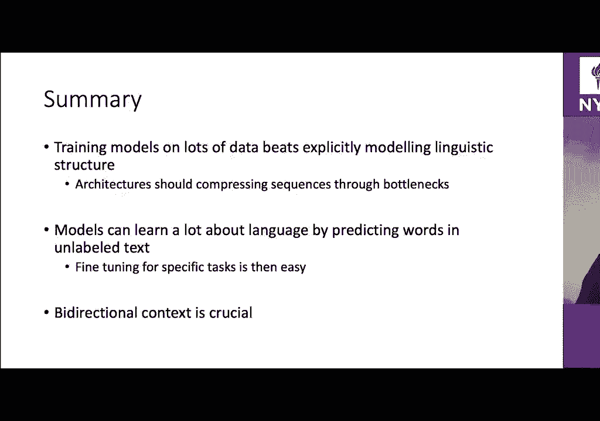

特别是双向上下文好，这就是我要感谢的全部，非常适合听，让我们看看现在是否有一些问题，我认为将会有，让我们看看现在是否有一些问题，我认为将会有，几个谢谢迈克，是的，当我们在您身边时，有很多讨论，是的。

当我们在您身边时，有很多讨论，可以畅谈指向各种论文的链接以及对各种概念的解释，可以畅谈指向各种论文的链接以及对各种概念的解释，背景还可以，还有其他问题吗？背景还可以，还有其他问题吗？

在一个未解决的问题上有一个um，在一个未解决的问题上有一个um，喜欢了解这些模型是否，喜欢了解这些模型是否，其实，了解语言现在有哪些方法，其实，了解语言现在有哪些方法，量化和测量那个um以及感觉如何。

量化和测量那个um以及感觉如何，我们将如何做到这一点，好吧，所以，通常发生的事是有人说我知道，通常发生的事是有人说我知道，这些模型不是签名语言，如果他们能够解决这个问题，这些模型不是签名语言。

如果他们能够解决这个问题，他们介绍的新任务然后，他们介绍的新任务然后，介绍一些他们不能做的新任务，然后，介绍一些他们不能做的新任务，然后，说下个星期伯特不这样做，说下个星期伯特不这样做。

有人训练了一个更大的模型，然后实际上获得了人类的表现，有人训练了一个更大的模型，然后实际上获得了人类的表现，在这个任务上，我认为真的，在这个任务上，我认为真的，发生的事情就像有些人的直觉。

发生的事情就像有些人的直觉，这类神经网络不能理解语言，这类神经网络不能理解语言，他们一定只是某种程度上的游戏数据集，他们一定只是某种程度上的游戏数据集。

而且这些模型的效果在一定程度上必须存在某种怪异的偏见，而且这些模型的效果在一定程度上必须存在某种怪异的偏见，我们的数据集，使痣可以真正利用，我们的数据集，使痣可以真正利用，理解任何东西，像一个。

理解任何东西，像一个，我的许多数据集确实都有偏差，就像，我的许多数据集确实都有偏差，就像，一种很难做到的事情，要感谢很多技巧，但是，一种很难做到的事情，要感谢很多技巧，但是，另一方面。

这就像人们没有产生好的癌症例子，另一方面，这就像人们没有产生好的癌症例子，所以这些模型基本上无法做到，所以这些模型基本上无法做到，抱歉，这是最近的一个很好的例子是，抱歉，这是最近的一个很好的例子是。

获胜者高兴的模式结果，您知道winograd模式是那些，获胜者高兴的模式结果，您知道winograd模式是那些，有歧义的句子，有一个参考，有一个，有歧义的句子，有一个参考，有一个，代词指的是其中一个词。

你可以分辨，代词指的是其中一个词，你可以分辨，代词指的是哪个单词，除非您对该单词的用法有所了解，代词指的是哪个单词，除非您对该单词的用法有所了解，正确运作，因此标准示例是奖杯，正确运作。

因此标准示例是奖杯，太大了，不适合放在手提箱里，太大了，不适合放在手提箱里，或奖杯太小而无法放入行李箱，或奖杯太小而无法放入行李箱，而且你知道一件奖杯，而且你知道一件奖杯，指代词，指代人的奖杯，指代词。

指代人的奖杯，到手提箱里，有一个清单，到手提箱里，有一个清单，这些人创建了这些东西的数据集，这些人创建了这些东西的数据集，直到大约两年前，最佳结果大约是60，直到大约两年前，最佳结果大约是60。

对于计算机，人类可以执行95或其他操作，但是最好，对于计算机，人类可以执行95或其他操作，但是最好，你所知道的最好的人造系统大约有60个，你所知道的最好的人造系统大约有60个，现在我认为大约是90％。

现在我认为大约是90％，是的，像这样的事情，您甚至没有得到任何培训日期，是的，像这样的事情，您甚至没有得到任何培训日期，这些完全是无监督的，这些完全是无监督的，问题对，所以问题是您知道这很清楚，问题对。

所以问题是您知道这很清楚，那些系统已经学到了一些关于，那些系统已经学到了一些关于，物体的作用，你对世界如何运转有些了解，物体的作用，你对世界如何运转有些了解，只是观察有关文本的统计信息。

但这是相对肤浅的，不是，只是观察有关文本的统计信息，但这是相对肤浅的，不是，嗯，我是说你知道，因为这很明显，嗯，我是说你知道，因为这很明显，当您看到生成的文字时，您知道我们在谈论独角兽。

当您看到生成的文字时，您知道我们在谈论独角兽，然后第一句话是呃，独角兽有四个角，然后第一句话是呃，独角兽有四个角，当然没有道理，因为独角兽只有一个，当然没有道理，因为独角兽只有一个。

所以成为独角兽的意义就在于此，所以成为独角兽的意义就在于此，所以我的整个意思是学习常识的整个问题，所以我的整个意思是学习常识的整个问题，呃还没有解决很远，但是那些系统可以工作，呃还没有解决很远。

但是那些系统可以工作，令人惊讶的是，我的意思是令人惊讶的是，您走了多远，令人惊讶的是，我的意思是令人惊讶的是，您走了多远，可以和你一起去看文字，可以和你一起去看文字，[音乐]是的。

我的意思是学习普通音超级，[音乐]是的，我的意思是学习普通音超级，努力，因为从某种意义上讲，您想学习的东西，努力，因为从某种意义上讲，您想学习的东西，是没有人写下来的东西，是没有人写下来的东西。

是常识常识，可能没有人像独角兽那样写下，是常识常识，可能没有人像独角兽那样写下，一对一，不是因为我每个人都知道，一对一，不是因为我每个人都知道，因此，您可以从中学到的东西可能会有限制，因此。

您可以从中学到的东西可能会有限制，看文字，但是你能告诉我们一些有关，看文字，但是你能告诉我们一些有关，我指的是您在某些基础上正在做的一些工作，我指的是您在某些基础上正在做的一些工作，语言，是的。

所以我是说，语言，是的，所以我是说，在这个嗯，我没有退缩，但是有一个整体，在这个嗯，我没有退缩，但是有一个整体，有趣的话题，所以我认为这真的很有趣，有趣的话题，所以我认为这真的很有趣，不，不。

我就像制作文本一样，他们创建的人不使用文本，因为，不，不，我就像制作文本一样，他们创建的人不使用文本，因为，就像是对世界的朗诵，就像是对世界的朗诵，所以一种类型的人真的很想去尝试喜欢。

所以一种类型的人真的很想去尝试喜欢，地面对话的用法和目标，以便让um像聊天系统一样运行一些人，地面对话的用法和目标，以便让um像聊天系统一样运行一些人，彼此交谈或与人交谈，彼此交谈或与人交谈。

像是您可以建立一些系统来尝试实现某些目标的方法吗？像是您可以建立一些系统来尝试实现某些目标的方法吗？几年前做过一些工作，几年前做过一些工作，在谈判的背景下，所以试图，在谈判的背景下，所以试图，嗯。

你们两个正在尝试进行友好的交谈，嗯，你们两个正在尝试进行友好的交谈，互相达成协议，互相达成协议，嗯，达成共识的唯一方法是，嗯，达成共识的唯一方法是，用自然语言进行对话，有些结果是，用自然语言进行对话。

有些结果是，使用方便，对他们有好处，您必须找到一些折衷方案，使用方便，对他们有好处，您必须找到一些折衷方案，嗯，然后是的，我对这种设置很感兴趣，嗯，然后是的，我对这种设置很感兴趣，因为，嗯。

看来您实际上是出于长度目的，嗯，看来您实际上是出于长度目的，对真正的理解至关重要，对真正的理解至关重要，像我这样的事情会像，像我这样的事情会像，限制我们从纯粹观察性使用语言中学到的知识。

限制我们从纯粹观察性使用语言中学到的知识，所以纯粹是在世界上看到文字，所以纯粹是在世界上看到文字，别人写的就像是真正了解你想要成为的东西，别人写的就像是真正了解你想要成为的东西，使用语言尝试选择的特工。

使用语言尝试选择的特工，制定目标并与人们互动，看看有什么作用和，制定目标并与人们互动，看看有什么作用和，还要从这种信号中学习，还要从这种信号中学习，也许那只是锦上添花的樱桃之类的东西，但是我。

也许那只是锦上添花的樱桃之类的东西，但是我，以为就是需要樱桃，以为就是需要樱桃，来自观众的更多问题来了，伙计们不要太害羞，来自观众的更多问题来了，伙计们不要太害羞，嗯，我有一个问题。嗯，我有一个问题。

我们应该如何整合世界知识，所以，我们应该如何整合世界知识，所以，ii在考虑的是这些十亿参数变压器，ii在考虑的是这些十亿参数变压器，有太多关于世界的信息，有太多关于世界的信息，他们，然后。

如果我们尝试微调或训练此模型，他们，然后，如果我们尝试微调或训练此模型，在某些新数据上，我们是否希望忘记一些较早的概念，在某些新数据上，我们是否希望忘记一些较早的概念，这个模型已经学会了，我们如何量化。

这个模型已经学会了，我们如何量化，什么样的概念使模型被遗忘了，什么样的概念使模型被遗忘了，验证集确实有意义吗，验证集确实有意义吗，是的，所以您可能会忘记我的意思，如果您将此模型微调到，是的。

所以您可能会忘记我的意思，如果您将此模型微调到，做一些不需要的事情，做一些不需要的事情，博学的快乐地忘记了你告诉它的所有知识，博学的快乐地忘记了你告诉它的所有知识，我的意思是。

有一些证据表明这些痣就像背诵了很多事实，我的意思是，有一些证据表明这些痣就像背诵了很多事实，所以最近这篇论文的结果很出色，所以最近这篇论文的结果很出色，谷歌系统称为t5，我认为这是120亿个参数。

谷歌系统称为t5，我认为这是120亿个参数，而且只是以自我监督的方式进行培训，如果您有，而且只是以自我监督的方式进行培训，如果您有，人，然后你会很好地回答，人，然后你会很好地回答，问题除了什么好问题。

问题除了什么好问题，您不显示它，您不显示维基百科或其他内容，您不显示它，您不显示维基百科或其他内容，让你知道你就像在记住什么，让你知道你就像在记住什么，您可以从中测试模型中有多少知识。

您可以从中测试模型中有多少知识，嗯，那之后不安全，但是就像，嗯，那之后不安全，但是就像，有点可怕，就像事实证明，如果您有120亿，有点可怕，就像事实证明，如果您有120亿，您训练了很长时间的参数。

您训练了很长时间的参数，使大量事实符合这些水平，使大量事实符合这些水平，我不确定这是否是记忆的最理想方式，我不确定这是否是记忆的最理想方式，知识，但嗯似乎，知识，但嗯似乎，有点有效，好的，是的。

谢谢大家的参与，好的，是的，谢谢大家的参与，非常感谢麦克给您做客座演讲，非常感谢麦克给您做客座演讲，嗯，很高兴听到马嘴里的东西，嗯，很高兴听到马嘴里的东西，我们下周再见，我们下周再见。

我们要在明天真正地明天就在明天，我们要在明天真正地明天就在明天，从头开始执行所有操作，不要忘记，因此明天您将，从头开始执行所有操作，不要忘记，因此明天您将，所有这些的代码方面的血腥细节。

所有这些的代码方面的血腥细节，然后呃星期一你会听到你的消息，然后呃星期一你会听到你的消息，图神经网络实际上是由图神经网络的振动引起的，图神经网络实际上是由图神经网络的振动引起的。

图知识是用于语言的图知识，图知识是用于语言的图知识，好吧，因为对，我不知道我不是真的，好吧，因为对，我不知道我不是真的，非常了解这部分，非常了解这部分，田野很好，所以您可以在一定程度上查看，田野很好。

所以您可以在一定程度上查看，所有受过监督的文字培训，所有受过监督的文字培训，就像要抽空一样吗bert等，他们使用图，就像要抽空一样吗bert等，他们使用图，您如何知道两个单词相邻出现的频率。

您如何知道两个单词相邻出现的频率，或文本中彼此相距一段距离，或文本中彼此相距一段距离，就是说，您知道单词之间的相似度图基本上由，就是说，您知道单词之间的相似度图基本上由，您知道他们多久出现一次。

您知道他们多久出现一次，是的，那就是当您决定将它们放入神经网络的输入中时，是的，那就是当您决定将它们放入神经网络的输入中时，因为它们出现在序列中，您知道，所以您可以想到，因为它们出现在序列中，您知道。

所以您可以想到，那些是监督学习系统的，那些是监督学习系统的，基本上是图神经网络的一种非常简单的形式，基本上是图神经网络的一种非常简单的形式，好，图总是具有相同的结构，总是线性的，但是，好。

图总是具有相同的结构，总是线性的，但是，总是在您的邻居中指示您的邻居，总是在您的邻居中指示您的邻居，文本，很好，谢谢大家，大家晚上好，很好，谢谢大家，大家晚上好。

