# P27：27.Week 14 – Practicum- Overfitting - 大佬的迷弟的粉丝 - BV1o5411p7AB

so today last lesson um，so today last lesson um，so today last lesson um。

yeah i'm smiling but i'm sad uh，yeah i'm smiling but i'm sad uh，i wanted to talk about energy-based。

i wanted to talk about energy-based，models and how to train them，models and how to train them。

but i think i need to prepare like for a，but i think i need to prepare like for a，month before that。

month before that，so actually uh if you are still，so actually uh if you are still。

interested in this summer you will be，interested in this summer you will be，able to，able to。

get a tutorial on energy-based models uh，get a tutorial on energy-based models uh。

we are writing a paper，we are writing a paper，with jan together and so we actually i'm。

with jan together and so we actually i'm，planning to get this paper written as。

planning to get this paper written as，like part it's going to be math and then。

like part it's going to be math and then，part is going to be actually the。

part is going to be actually the，implementation，implementation，such that you can actually execute uh。

such that you can actually execute uh，the paper basically and you can get you。

the paper basically and you can get you，know，know，a better understanding of what's going。

a better understanding of what's going，on um，on um，yeah so yeah that's gonna come out maybe。

yeah so yeah that's gonna come out maybe，in a month uh，in a month uh。

we we i have to do pretty a pretty good，we we i have to do pretty a pretty good，job there，job there。

um so and maybe uh if the，um so and maybe uh if the，maybe we can even have a additional。

maybe we can even have a additional，class later on，class later on。

if you're interested and you know i'm，if you're interested and you know i'm，always here uh。

always here uh，up for uh teaching you so again if，up for uh teaching you so again if。

you're interested in this energy-based，you're interested in this energy-based，model later on。

model later on，like outside the course and whatever we，like outside the course and whatever we。

can again meet，can again meet，and uh record and and pretend it's，and uh record and and pretend it's。

actually，actually，one more class okay so yeah i i didn't，one more class okay so yeah i i didn't。

manage to do it for today，manage to do it for today，so today we're going to be covering um。

so today we're going to be covering um，if i get to finish two，if i get to finish two。

topics um we never，topics um we never，talked about them uh too much before uh。

talked about them uh too much before uh，because they are more machine learning。

because they are more machine learning，related but nevertheless，related but nevertheless。

we care also in deep learning and the，we care also in deep learning and the，topic of today。

topic of today。

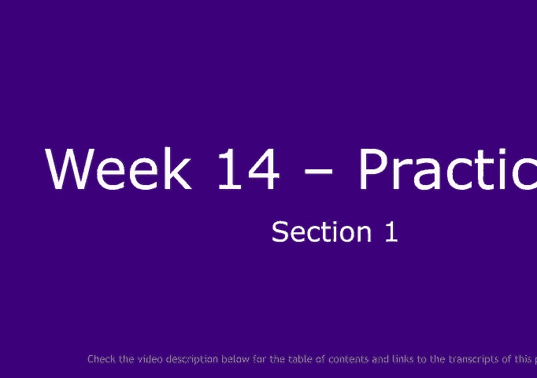

is regularization overfitting and，is regularization overfitting and，regularization let me start。

regularization let me start，sharing the screen so again this is my。

sharing the screen so again this is my，as usual perspective of，as usual perspective of。

the topic uh it's not usually the，the topic uh it's not usually the，mainstream but you know。

mainstream but you know，it's what you get since it's my，it's what you get since it's my。

view and i'm your educator your，view and i'm your educator your，instructor today，instructor today。

so overfitting and regularization，so overfitting and regularization，connection between them right so。

connection between them right so，those are two different topics those are。

those are two different topics those are，two different things but they are of。

two different things but they are of，course，course，connected so i start with this drawing。

connected so i start with this drawing，here，here，uh someone told me it's not intuitive。

uh someone told me it's not intuitive，but again，but again，for me so there you get it。

for me so there you get it，uh here i'm showing you in the，uh here i'm showing you in the。

uh with the pink box the data complexity，uh with the pink box the data complexity，okay so，okay so。

those dots are sampled from my，those dots are sampled from my，samples from from my training data set。

samples from from my training data set，and，and，then i tried to fit their three。

then i tried to fit their three，different models okay，different models okay。

so in the first case that is，so in the first case that is，basically the model complexity is below。

basically the model complexity is below，is under is，is under is，you know it's smaller than the data。

you know it's smaller than the data，complexity，complexity，and therefore you have some phenomenon。

and therefore you have some phenomenon，called under fitting right because you。

called under fitting right because you，try to fit，try to fit，uh what looks like a parabola with a。

uh what looks like a parabola with a，straight line and therefore you're。

straight line and therefore you're，not you're not going you're not doing a。

not you're not going you're not doing a，good job right，good job right。

then what happened next here we actually，then what happened next here we actually。

have the right fitting，have the right fitting，in this case the model complexity。

in this case the model complexity，matches，matches，the data complexity right um and so。

the data complexity right um and so，in this case what's the difference with。

in this case what's the difference with，the previous case uh，the previous case uh。

in this case you have zero error right，in this case you have zero error right，so your，so your。

your model exactly matches the training，your model exactly matches the training，points those。

points those，points finally we have overfitting where，points finally we have overfitting where，the。

the，model complexity is actually，model complexity is actually。

greater than the data complexity in this，greater than the data complexity in this，case，case。

the model doesn't choose a parabola，the model doesn't choose a parabola。

because why question for your，because why question for your，audience live my own live audience why。

audience live my own live audience why，is this model like，is this model like。

wiggly in this case why is not a，wiggly in this case why is not a，parabola，parabola。

and you're supposed to type in the chat，and you're supposed to type in the chat，because otherwise。

because otherwise，i don't know if you're following so my，i don't know if you're following so my。

question is in，question is in，the last case my data my model，the last case my data my model。

complexity is superior than the，complexity is superior than the。

it's larger than the data complexity and，it's larger than the data complexity and。

although those points look like they，although those points look like they，belong to a parabola。

belong to a parabola，my model decides to get that spiky guy，my model decides to get that spiky guy。

like spiky peak on the left and you know，like spiky peak on the left and you know，some weird stuff。

some weird stuff，model doesn't learn but memorizes um，model doesn't learn but memorizes um。

overfitting but sure sure it's written，overfitting but sure sure it's written。

they're overfitting but why，they're overfitting but why，if those points are coming from a。

if those points are coming from a，parabola i would expect even a very。

parabola i would expect even a very，larger model，larger model，would make like a very nice parabola。

would make like a very nice parabola，right，right，you're privately writing to me don't。

you're privately writing to me don't，private，private，private right um，private right um，so if，so if。

and this is a big if right if my points，and this is a big if right if my points。

my training points come from，my training points come from，an actual parabola even the overfitting。

an actual parabola even the overfitting，model would be making a perfect parabola。

model would be making a perfect parabola，the point here is that there is some。

the point here is that there is some，noise，noise，right there is always some noise and。

right there is always some noise and，therefore the model that perfectly。

therefore the model that perfectly，goes through every training point。

goes through every training point，will be like that it's going to be like。

will be like that it's going to be like，crazy because，crazy because。

all those points don't exactly live on，all those points don't exactly live on。

the parabola but they are，the parabola but they are，slightly offset and in order to be。

slightly offset and in order to be，perfectly，perfectly，uh going through them you're gonna have。

uh going through them you're gonna have，you know the mother is gonna have to try。

you know the mother is gonna have to try，to，to，come up with some funky function okay。

come up with some funky function okay，does it make sense，does it make sense。

so the point is that without noise，so the point is that without noise。

this would be just a perfect parabola，this would be just a perfect parabola。

so someone would say okay maybe we，so someone would say okay maybe we。

in machine learning maybe we are doing，in machine learning maybe we are doing。

in machine learning maybe we are doing，deep learning，deep learning，and it's not quite the case right。

and it's not quite the case right，fitting，fitting，it's it's definitely not the case。

it's it's definitely not the case，actually our models，actually our models。

are so so so so powerful that they，are so so so so powerful that they。

even managed to learn noise like there，even managed to learn noise like there，was a paper there。

was a paper there，where they were showing that you can，where they were showing that you can。

label imagenet，label imagenet，with random labels you can get a network。

with random labels you can get a network，to，to，you know perfectly memorize every label。

you know perfectly memorize every label，uh，uh，for each of these samples so you can。

for each of these samples so you can，clearly，clearly，tell that these the models we are using。

tell that these the models we are using，are absolutely over parameterized and。

are absolutely over parameterized and，therefore means that，therefore means that。

you have way more power than，you have way more power than，the uh you know then then it's necessary。

the uh you know then then it's necessary，in order to learn，in order to learn。

the structure of the data nevertheless，the structure of the data nevertheless。

we actually need that hmm，we actually need that hmm，so let's figure out what's going on okay。

so let's figure out what's going on okay，oh actually maybe you know the answer。

oh actually maybe you know the answer，oh actually maybe you know the answer。

right so what is the point，right so what is the point，why do we want to go in very very high。

why do we want to go in very very high，dimensional space，dimensional space。

i told you a few times right because，i told you a few times right because。

come on it's the last class answer me，come on it's the last class answer me。

come on it's the last class answer me，why do we want to go in very to expand。

why do we want to go in very to expand，the，the，the data distribution yeah optimization。

the data distribution yeah optimization，is easier yeah fantastic，is easier yeah fantastic。

that's the point right whenever we go in，that's the point right whenever we go in。

a hype over parameterized space，a hype over parameterized space。

everything is very easy to move around，everything is very easy to move around。

right and therefore we always，right and therefore we always，would like to put ourselves in the。

would like to put ourselves in the，overfitting，overfitting，scenarios with our networks because it's。

scenarios with our networks because it's，the training is going to be easier。

the training is going to be easier，nevertheless what's the problem now well。

nevertheless what's the problem now well，the problem is they，the problem is they。

they're going to be like they wiggle，they're going to be like they wiggle，like crazy，like crazy。

um another another thing um，um another another thing um，so this is point number one point number。

so this is point number one point number，two，two，why would you think you actually。

why would you think you actually，have to overfit，have to overfit，second question i know interactive。

second question i know interactive，second question i know interactive，question today，question today。

actually sure there is some trend，actually sure there is some trend，you can model okay maybe。

you can model okay maybe，maybe it's in the right direction but，maybe it's in the right direction but。

it's too complicated as an answer，it's too complicated as an answer，um so are you experts。

um so are you experts，you're a network trainer you should be，you're a network trainer you should be。

right because you've been，right because you've been，following these lessons for a bit but um。

following these lessons for a bit but um，at the beginning okay try to answer this。

at the beginning okay try to answer this，question，question，i even tell you one one bit more i would。

i even tell you one one bit more i would，i even tell you one one bit more i would。

always i do always start training my，always i do always start training my，network on，network on。

if the model has capabilities so this is，if the model has capabilities so this is。

if the model has capabilities so this is，the number one rule，the number one rule。

to debug machine learning code okay，to debug machine learning code okay。

you would like to see whether you，you would like to see whether you，up in your，up in your。

model creation okay so first thing，model creation okay so first thing。

you can just get a batch of the correct，you can just get a batch of the correct，size，size。

uh even with random noise right even you，uh even with random noise right even you，know，know。

torch dot trend something with random，torch dot trend something with random，labels，labels。

and then you would like to go over a few，and then you would like to go over a few。

epochs with one batch，epochs with one batch，with random crap which could be the。

with random crap which could be the，first batch of your data set or whatever。

first batch of your data set or whatever，just to prove that your model can learn。

just to prove that your model can learn，okay，okay，you can easily make some tiny mistakes。

you can easily make some tiny mistakes，uh，uh，like i made a few times like doing the。

like i made a few times like doing the，zero，zero，yeah i know it happens and nothing。

yeah i know it happens and nothing，yeah i know it happens and nothing。

happens nothing learns okay so you，happens nothing learns okay so you，always want to see。

always want to see，that your model model can learn right，that your model model can learn right。

then if，then if，you can memorize yeah fantastic we are，you can memorize yeah fantastic we are。

going to be now learning how to，going to be now learning how to。

uh improve performance of a model that，uh improve performance of a model that，memorizes，memorizes。

uh its own data okay so two reasons，uh its own data okay so two reasons，right first one we said over。

right first one we said over，parameterize，parameterize，uh models are easy to train because the。

uh models are easy to train because the，landscape is much smoother，landscape is much smoother。

us and you know if you have a，us and you know if you have a，over parameterized model you're gonna。

over parameterized model you're gonna，have you can，have you can，uh ideally start with different。

uh ideally start with different，initializations so you get initial。

initializations so you get initial，points in the parameter space and then。

points in the parameter space and then，whenever you train，whenever you train。

these different models all of them will，these different models all of them will。

converge to a different，converge to a different，position because you can，position because you can。

think about like a same model you can，think about like a same model you can。

permute all the weights you're gonna get，permute all the weights you're gonna get。

i mean you permeate the weights per，i mean you permeate the weights per，layer，layer。

you can still get the same uh model，you can still get the same uh model。

at the end so they are comparable in，at the end so they are comparable in。

terms of the function approximator，terms of the function approximator。

you are building nevertheless in the，you are building nevertheless in the。

parameter space they are not the same，parameter space they are not the same，right so in the function。

right so in the function，space they are exactly equivalent models。

space they are exactly equivalent models，in the parameter space they are。

in the parameter space they are，absolutely different models，absolutely different models。

nevertheless they will converge to，nevertheless they will converge to，equivalently，equivalently。

equivalent models as in they will，equivalent models as in they will。

perform equivalently equivalently，perform equivalently equivalently。

good right are you following right am i，good right are you following right am i。

talking about weird stuff today but uh，talking about weird stuff today but uh。

i guess this counts a bit also from，i guess this counts a bit also from，joanne's class。

joanne's class，where we talk about parameter space and，where we talk about parameter space and。

functional，functional，uh functional space it's so so cool in，uh functional space it's so so cool in。

that class i think next year，that class i think next year，i will try to put it online as well okay。

i will try to put it online as well okay，okay so，okay so，first point over pardon me over。

first point over pardon me over，parameterization helps with training。

parameterization helps with training，second point or over parameterization。

second point or over parameterization，helps you with，helps you with。

math debugging can you repeat the point，math debugging can you repeat the point。

about function and parameter space yeah，about function and parameter space yeah。

so if you have a neural net and you，so if you have a neural net and you，permute the rows。

permute the rows，in your matrices right and then you，in your matrices right and then you，permute。

permute，the uh the column of the，the uh the column of the，uh the next layer you can basically。

uh the next layer you can basically，you know you can reorganize the weight。

you know you can reorganize the weight，so you can get always the same，so you can get always the same。

performance right，performance right，so if you have the first matrix you have。

so if you have the first matrix you have，first element of the hidden layer equal。

first element of the hidden layer equal，some number，some number。

let's say the hidden layer has size of，let's say the hidden layer has size of。

two right so you have a matrix with two，two right so you have a matrix with two，rows，rows。

and so you can swap the the rows you're，and so you can swap the the rows you're。

gonna get a hidden layer that is flipped，gonna get a hidden layer that is flipped。

and then the last the next next weight，and then the last the next next weight，matrix，matrix。

you can flip the um，you can flip the um，columns i guess uh and you would get。

columns i guess uh and you would get，exactly the same network the same。

exactly the same network the same，you would sorry you would get exactly。

you would sorry you would get exactly，the same function，the same function。

it's gonna give you exactly the same，it's gonna give you exactly the same，number as an output。

number as an output，although the parameters the the，although the parameters the the。

parameters are actually，parameters are actually，different right because you swap them so。

different right because you swap them so，the same parameter，the same parameter。

w11 is going to be w21 right so they are，w11 is going to be w21 right so they are。

different so in the parameter space，different so in the parameter space。

these are different models so there are，these are different models so there are。

one point is here in the parameter space，one point is here in the parameter space。

another point is here，another point is here，nevertheless the mapping from the。

nevertheless the mapping from the，parameter space to the functional space。

parameter space to the functional space，both of them both these two initial。

both of them both these two initial，those two configuration，those two configuration。

will map to the same function right，will map to the same function right，because the，because the。

function connects the input to the，function connects the input to the。

output and they're going to be the same，output and they're going to be the same。

even if you do this permutation of the，even if you do this permutation of the，rows and then and。

rows and then and，of the columns right makes sense，of the columns right makes sense，so if if we。

so if if we，if the space for parameter space is very，if the space for parameter space is very。

if the space for parameter space is very，big for a given data set can we say。

big for a given data set can we say，that the model is very uncertain about。

that the model is very uncertain about，its prediction okay we are going to be。

its prediction okay we are going to be，talking about uncertainty in a bit so。

talking about uncertainty in a bit so，i'll address that in a bit，i'll address that in a bit。

all right so we always start with the，all right so we always start with the，third，third。

uh column here with overfitting uh i，uh column here with overfitting uh i。

always want to have a model that is over，always want to have a model that is over。

parameterized because it's easy to learn，parameterized because it's easy to learn。

and also it's going to be powerful in，and also it's going to be powerful in，terms，terms。

in the sense that it's going to be，in the sense that it's going to be，learning more than what we。

learning more than what we，expect um and so，expect um and so，how do we deal with these overfitting。

how do we deal with these overfitting，how do we，how do we，improve now the validation or tasting。

improve now the validation or tasting，performances right so，performances right so。

we we said that overfitting means uh we，we we said that overfitting means uh we。

didn't say we're gonna see that next，didn't say we're gonna see that next，slide but，slide but。

here we see how to fight this kind of，here we see how to fight this kind of，you know overfitting。

you know overfitting，so we start from the right hand side，so we start from the right hand side。

where we introduce，where we introduce，this weak regularizer so there is no。

this weak regularizer so there is no，regularization，regularization。

therefore the last plot the sixth plot，therefore the last plot the sixth plot，here，here。

is the same as my third plot okay，is the same as my third plot okay，then i keep uh adding some。

then i keep uh adding some，medium regularizer and so i，medium regularizer and so i。

i like to think about this as you know，i like to think about this as you know。

smoothing edges right so my，smoothing edges right so my，square gets around edges。

square gets around edges，and you can tell now that this second，and you can tell now that this second。

plot here is different from my second，plot here is different from my second。

window here right so the the，window here right so the the，medium regularization is different from。

medium regularization is different from，this just right fitting，this just right fitting。

as you can see there are some you know，as you can see there are some you know，corners here。

corners here，finally if you crank up this medicine，finally if you crank up this medicine。

this kind of，this kind of，you know it's like a drug you you're，you know it's like a drug you you're。

drugging you're hitting you're，drugging you're hitting you're。

poisoning your model for to restrict the，poisoning your model for to restrict the。

it's it's power then you get like a very，it's it's power then you get like a very，strong regularizer。

strong regularizer，which gives you the the circular one，which gives you the the circular one。

that's this this is my，that's this this is my，mental image anyhow we we gave you i。

mental image anyhow we we gave you i，think i give you my，think i give you my。

uh the big picture first and then let's，uh the big picture first and then let's。

go on with the actual，go on with the actual，definitions right um so there are a few。

definitions right um so there are a few，definitions here，definitions here。

they are not quite equivalent but in，they are not quite equivalent but in。

deep learning that's what we use，deep learning that's what we use。

so here we go so the regularization，so here we go so the regularization。

adds prior knowledge to a model a prior，adds prior knowledge to a model a prior。

distribution is specified for the，distribution is specified for the，parameters，parameters。

so we expect these parameters to be，so we expect these parameters to be。

coming from a specific distribution from，coming from a specific distribution from，a specific。

a specific，generation generating process okay，generation generating process okay。

and then whenever we actually think，and then whenever we actually think。

about regularization we can think about，about regularization we can think about。

you know uh strongly assuming that these，you know uh strongly assuming that these。

parameters should be，parameters should be，um coming from this specific，um coming from this specific。

process that generates them okay so this，process that generates them okay so this。

is talking about parameter space，is talking about parameter space，then we can also talk about the。

then we can also talk about the，functional space，functional space。

in this case we can be it can be seen a，in this case we can be it can be seen a。

regularization is a restriction，regularization is a restriction，of the set of possible learnable。

of the set of possible learnable，functions okay so these are again two。

functions okay so these are again two，perspective one is on the weights。

perspective one is on the weights，where how are supposed to be what kind。

where how are supposed to be what kind，of，of，weights what kind of animals what kind。

weights what kind of animals what kind，of objects，of objects，these weights are like they should be。

these weights are like they should be，somehow over some specific shape。

somehow over some specific shape，uh length or whatever structure there is。

uh length or whatever structure there is，there is some structure that，there is some structure that。

i assume uh in advance，i assume uh in advance，that's the prior this means before in。

that's the prior this means before in，latin and in，latin and in。

others in another case instead if you，others in another case instead if you。

have all possible function，have all possible function，you'd like to find a restriction of。

you'd like to find a restriction of，those possible functions，those possible functions。

such that they are not too，such that they are not too，uh crazy okay they are not too extreme。

uh crazy okay they are not too extreme，as in，as in，the way they behave ah，the way they behave ah。

there's a question but in that image the，there's a question but in that image the，square is。

square is，still in the circle uh，still in the circle uh，yeah i'm getting back，yeah i'm getting back。

oh oh i see so maybe the circle should，oh oh i see so maybe the circle should，have been，have been。

smaller than the square okay，smaller than the square okay，right good point um okay cool cool。

right good point um okay cool cool，finally that's the last definition of。

finally that's the last definition of，regularization which is the real。

regularization which is the real，real deep learning part which is the。

real deep learning part which is the，following which is，following which is。

yeah kind of not it's like you know，yeah kind of not it's like you know，as a stretch，as a stretch。

okay my google thinks i'm talking，okay my google thinks i'm talking。

okay regularization is any modification，okay regularization is any modification。

okay regularization is any modification，we make to a learning algorithm that is。

we make to a learning algorithm that is，intended to reduce its generalization。

intended to reduce its generalization，error but not its training error okay so。

error but not its training error okay so。

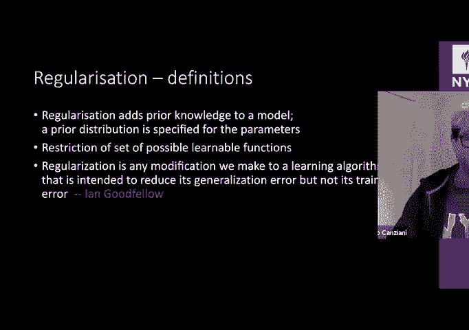

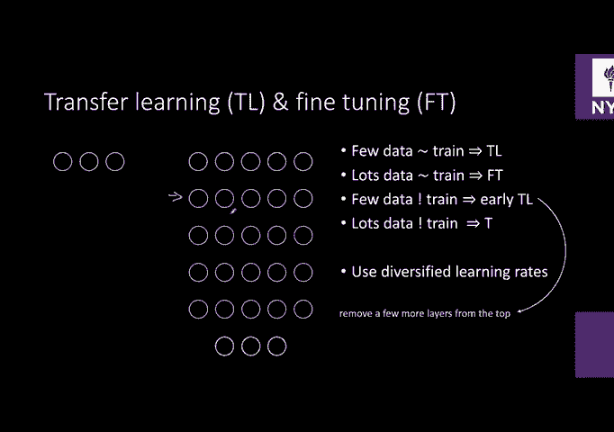

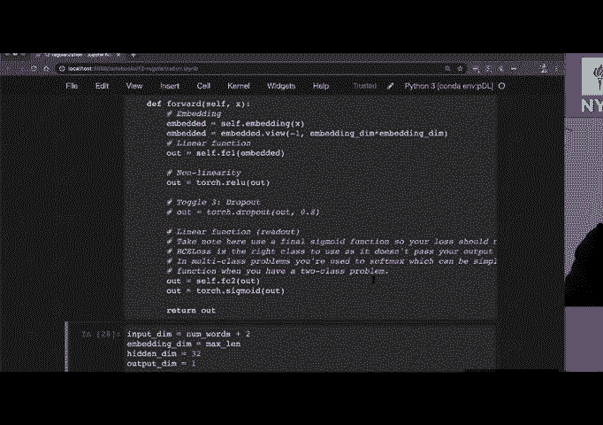

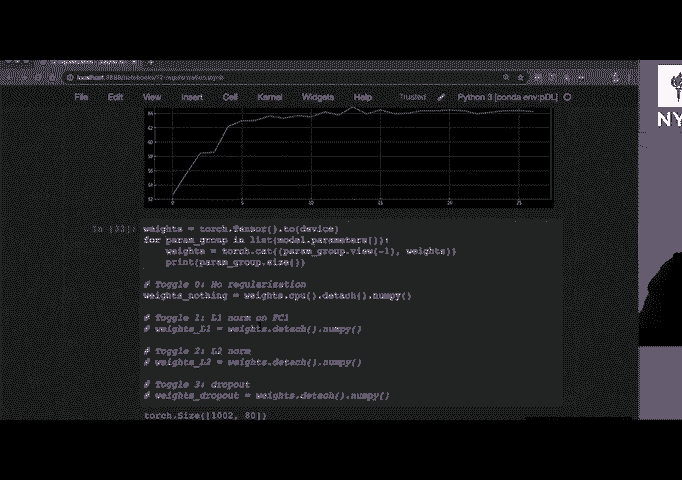

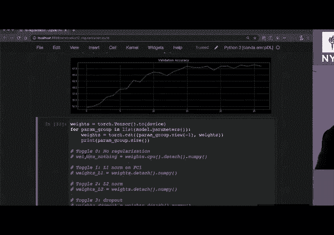

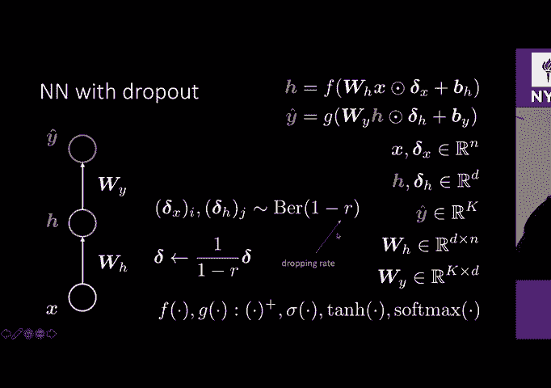

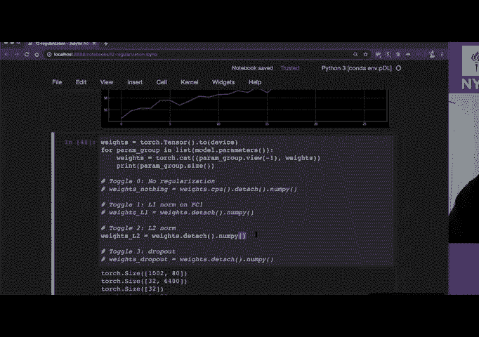

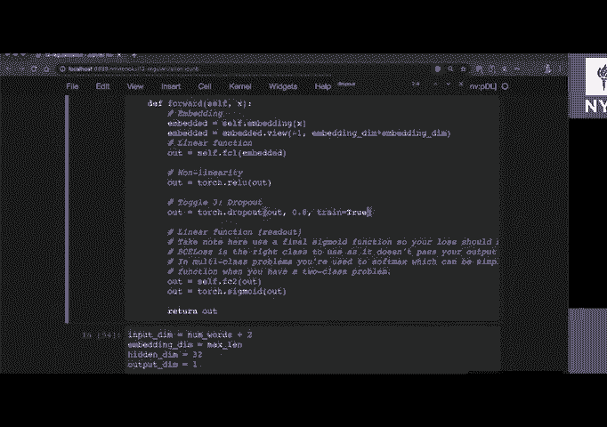

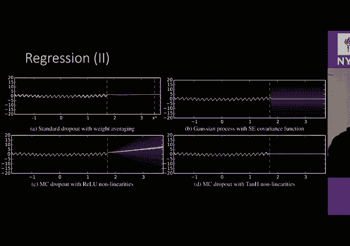

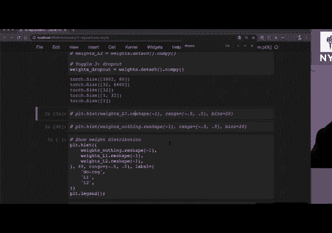

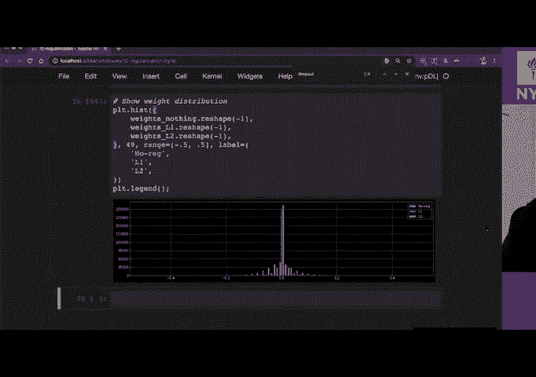

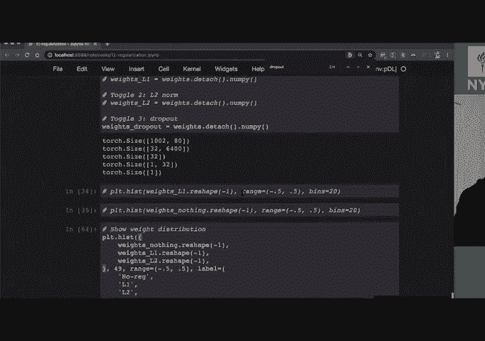

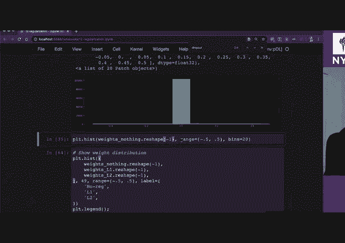

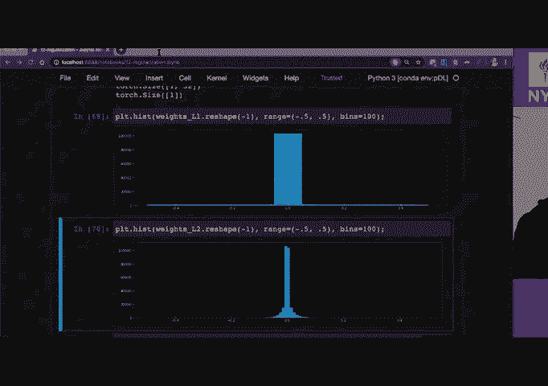

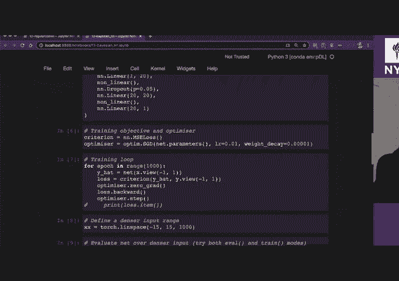

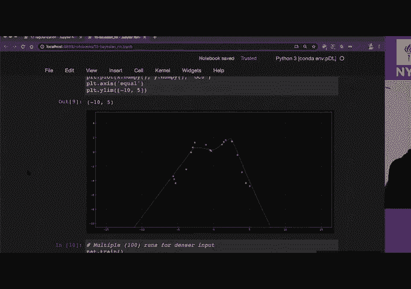

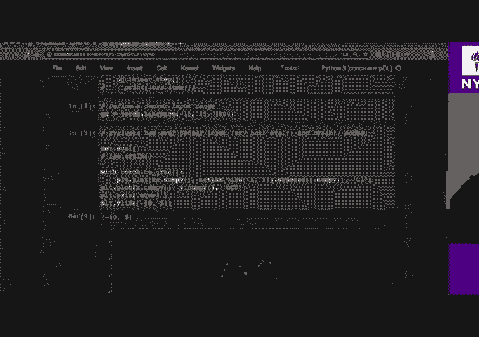

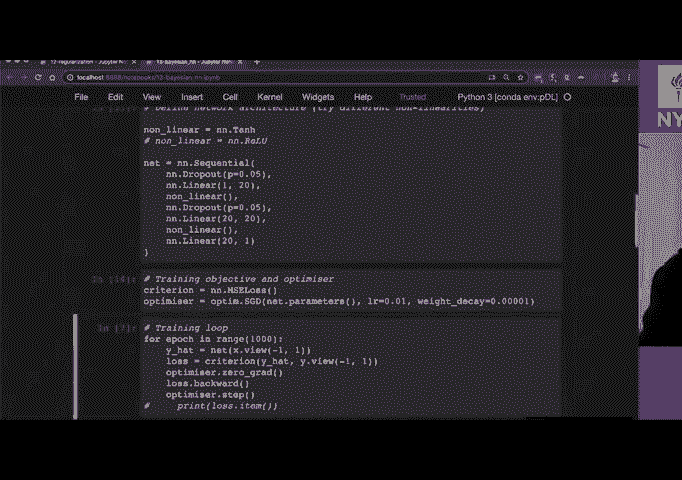

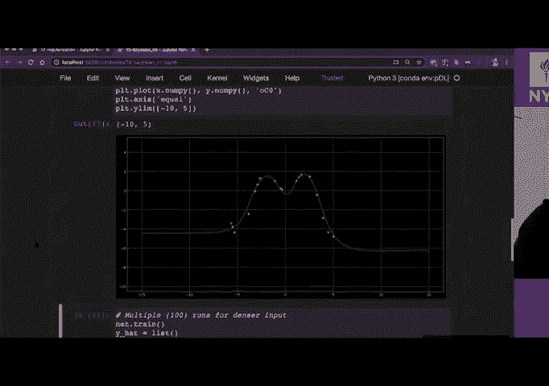

