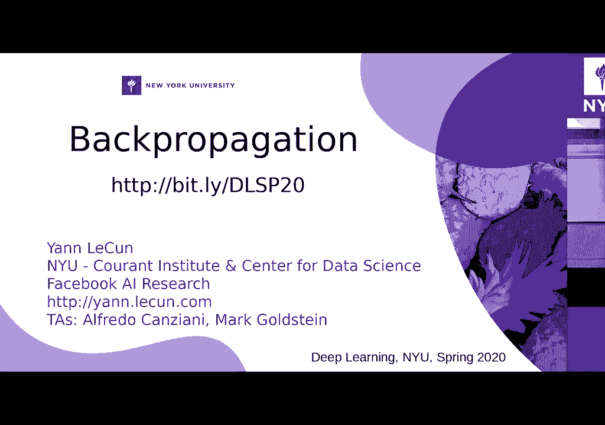
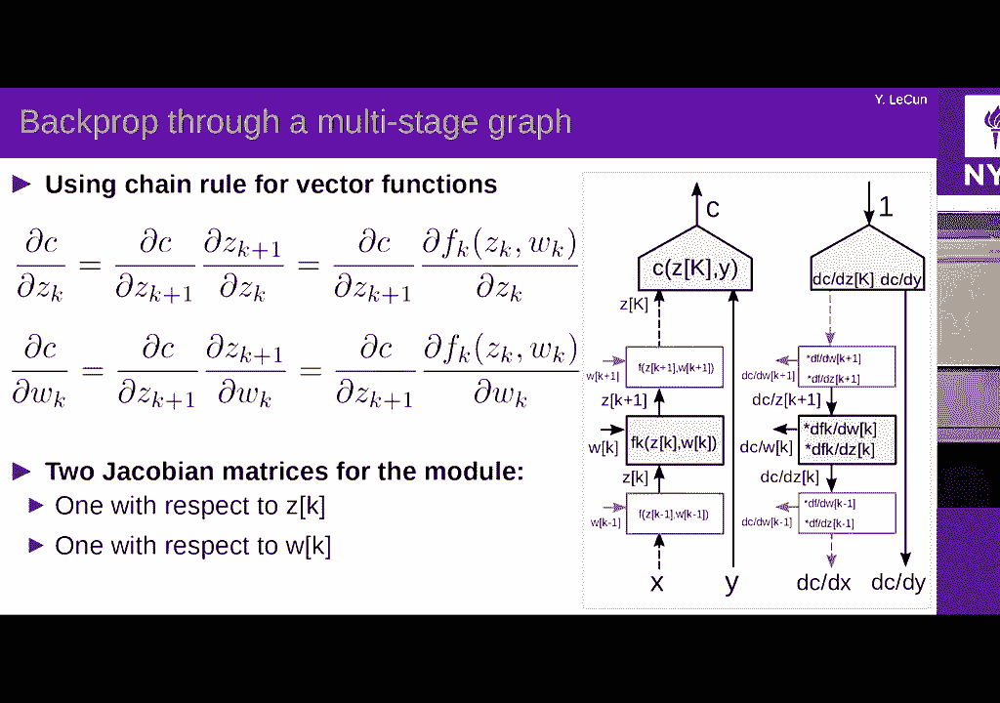
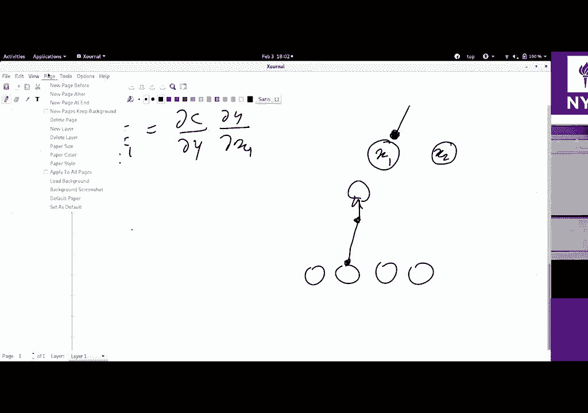
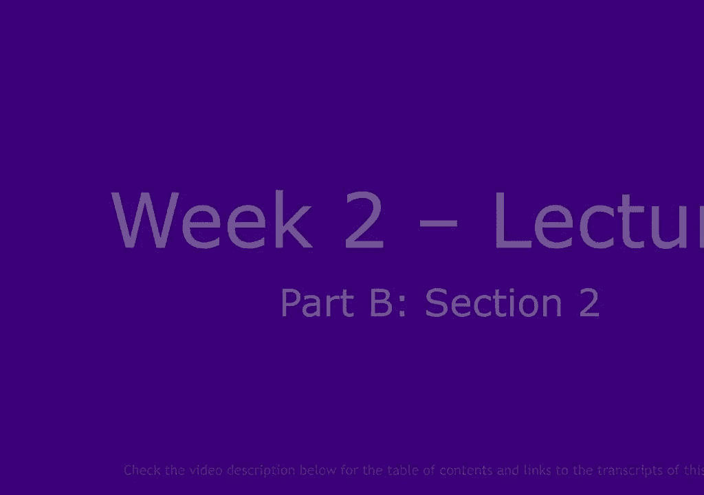

# P3：3. Week 2 – Lecture - Stochastic gradient descent and backpropagation - 大佬的迷弟的粉丝 - BV1o5411p7AB

我想我们可以开始，所以今天我们要回头再谈，我想我们可以开始，所以今天我们要回头再谈，道具，我敢肯定，对于你们中的一些人来说，它们看起来会很熟悉，道具，我敢肯定，对于你们中的一些人来说。

它们看起来会很熟悉，我将首先从忙碌的概念和，我将首先从忙碌的概念和，稍后再谈到后支撑的更一般的表达，稍后再谈到后支撑的更一般的表达。

然后明天alfredo将像您使用Otto Grad一样经历。

然后明天alfredo将像您使用Otto Grad一样经历，PI火炬之类的事情还可以，所以我们有了基本概念，PI火炬之类的事情还可以，所以我们有了基本概念，参数化模型，所以参数化模型不过是函数。

参数化模型，所以参数化模型不过是函数，取决于这取决于两个参数：输入和可训练，取决于这取决于两个参数：输入和可训练，参数，并且该参数与，参数，并且该参数与，输入它们只是确定性的两个参数。

输入它们只是确定性的两个参数，功能是事情，尽管参数在训练中是共享的，功能是事情，尽管参数在训练中是共享的，样本，但是每个训练样本的样本当然不同，样本，但是每个训练样本的样本当然不同。

因此在诸如马克的最深度学习之类的事情中，参数实际上是，因此在诸如马克的最深度学习之类的事情中，参数实际上是，调用函数时隐式到参数化函数，调用函数时隐式到参数化函数，如果您在以下位置。

则实际上不会传递它存储在内部的参数值，如果您在以下位置，则实际上不会传递它存储在内部的参数值，至少在模型的面向对象版本中，但只需要记住，至少在模型的面向对象版本中，但只需要记住。

您知道您拥有主要的跨模型只是一个优先功能，它需要一个，您知道您拥有主要的跨模型只是一个优先功能，它需要一个，输入并具有参数向量，它在简单的监督下产生输出，输入并具有参数向量，它在简单的监督下产生输出。

运行此输出将进入成本函数，该函数会比较，运行此输出将进入成本函数，该函数会比较，您想要在此处输出的模型称为C预测的输出，您想要在此处输出的模型称为C预测的输出，该模块称为Y bar。

C函数将Y bar中的Y进行了比较，为什么，该模块称为Y bar，C函数将Y bar中的Y进行了比较，为什么，是他在您想要的Y栏上吗？我把您得到的输出放好，所以我在这里给，是他在您想要的Y栏上吗？

我把您得到的输出放好，所以我在这里给，两个非常简单的示例参数化函数，我确定您很熟悉，两个非常简单的示例参数化函数，我确定您很熟悉，第一个是线性模型，所以线性模型只计算加权，第一个是线性模型。

所以线性模型只计算加权，其输入向量的分量之和，其输入向量的分量之和，权重，如果您使用queloz进行线性回归，权重，如果您使用queloz进行线性回归，C函数只是您在之间创建距离的平方距离。

C函数只是您在之间创建距离的平方距离，Y向量和y bar向量（当y bar可以是向量或标量或张量时），Y向量和y bar向量（当y bar可以是向量或标量或张量时），或基本上没有数字的事物或。

或基本上没有数字的事物或，您可以计算出这实际上是技术上所需的所有距离，您可以计算出这实际上是技术上所需的所有距离，他们需要一个稍微复杂一些的优先功能，他们需要一个稍微复杂一些的优先功能。

实际计算最近邻居的底部，所以这里有输入X，实际计算最近邻居的底部，所以这里有输入X，然后W是一个矩阵，矩阵的每一行都由索引K索引到，然后W是一个矩阵，矩阵的每一行都由索引K索引到，计算输出。

我们实际上将对应于该行的数字K，计算输出，我们实际上将对应于该行的数字K，W最接近X，所以我们计算X和a之间的距离，W最接近X，所以我们计算X和a之间的距离，W的特定行，即wk，然后我们评估整体情况。

然后找出，W的特定行，即wk，然后我们评估整体情况，然后找出，这些差异中哪一个最小？这些差异中哪一个最小？然后我们输出K，所以增幅就是参数函数对它的正确处理，然后我们输出K。

所以增幅就是参数函数对它的正确处理，返回使函数最小化的参数值，因此，返回使函数最小化的参数值，因此，它是K的函数，返回的K使函数最小化，它是K的函数，返回的K使函数最小化。

我要说的是这是解释最近的一种复杂方法，我要说的是这是解释最近的一种复杂方法，邻居是您中发生的竞争类型，邻居是您中发生的竞争类型，参数化模型可能非常复杂，而不必仅仅是，参数化模型可能非常复杂。

而不必仅仅是，就像一个神经元，您用加权总和和，就像一个神经元，您用加权总和和，异常时代T可能很复杂，涉及到最小化，异常时代T可能很复杂，涉及到最小化，我的意思是说：我的意思是说：某些功能还可以。

我们将在几周后再返回，某些功能还可以，我们将在几周后再返回，是，你可以用另一种方式表示它，我可以写W W W矩阵，你可以用另一种方式表示它，我可以写W W W矩阵，乘以Z向量，然后将Z向量约束为。

乘以Z向量，然后将Z向量约束为，一个小屋，在这种情况下，我们将选择W列，然后您可以，一个小屋，在这种情况下，我们将选择W列，然后您可以，意思是说这是一个向量好吧，那将是一个不同的表示法，但是。

意思是说这是一个向量好吧，那将是一个不同的表示法，但是，不同的效果，类似的效果，但是你知道我必须阅读，不同的效果，类似的效果，但是你知道我必须阅读，写另一个方程式，就像你知道Z很热，并解释那个。

写另一个方程式，就像你知道Z很热，并解释那个，意思是让我忘记您所知道的符号，只是记住以下事实：意思是让我忘记您所知道的符号，只是记住以下事实：这个参数化功能可能会发生一些复杂的事情。

这个参数化功能可能会发生一些复杂的事情，不一定只是您知道一件非常简单的事情，所以，不一定只是您知道一件非常简单的事情，所以，我在此图中完成的是，我介绍了一种，我在此图中完成的是，我介绍了一种。

将编写神经网络和其他各种模型的类型表示为块，将编写神经网络和其他各种模型的类型表示为块，图，我在这里或实际上使用三种不同类型的符号，图，我在这里或实际上使用三种不同类型的符号。

气泡代表变量我填充的气泡代表变量，气泡代表变量我填充的气泡代表变量，观察到的，所以X是观察到的变量，是系统的输入，因此，观察到的，所以X是观察到的变量，是系统的输入，因此。

您会在训练集和测试集上观察到它，而无论Y条是，您会在训练集和测试集上观察到它，而无论Y条是，计算变量，就是您所知道的，计算变量，就是您所知道的，您可以从观察变量中计算出确定性函数。

您可以从观察变量中计算出确定性函数，通过确定性函数，因此Y同样是观察变量，通过确定性函数，因此Y同样是观察变量，因为在或在培训站点上没有观察到，因为在或在培训站点上没有观察到，测试集。

但是在训练过程中会观察到它，然后您有两种类型的，测试集，但是在训练过程中会观察到它，然后您有两种类型的，一种功能模块是那种蓝色圆形模块，一种功能模块是那种蓝色圆形模块，表示确定性函数，而圆形表示。

表示确定性函数，而圆形表示，方向很容易计算就可以了，所以在这里您可以从X计算Y条，方向很容易计算就可以了，所以在这里您可以从X计算Y条，从Y栏计算X要复杂得多，从Y栏计算X要复杂得多。

如果我给你一个白条，但是你很难给我一个X，如果我给你一个白条，但是你很难给我一个X，对应它好吧，然后您有另一种类型的模块，通常，对应它好吧，然后您有另一种类型的模块，通常，用来表示成本函数。

用红色正方形代表，用来表示成本函数，用红色正方形代表，使它们在这种情况下更可见，并且具有隐式输出，即，使它们在这种情况下更可见，并且具有隐式输出，即，标量输出单个数字，它们可以采用多个输入，并且基本上。

标量输出单个数字，它们可以采用多个输入，并且基本上，计算单个数字，通常是输入之间的距离或某物，计算单个数字，通常是输入之间的距离或某物，类似于，因此，您还可以使用基本符号来表示某种标准，因此。

您还可以使用基本符号来表示某种标准，面向熟悉图形的人的监督学习系统，面向熟悉图形的人的监督学习系统，对此建模，这是所谓的因子中使用的类似符号，对此建模，这是所谓的因子中使用的类似符号，图。

其中因子因子图没有的平方，图，其中因子因子图没有的平方，确定性函数，因为它们不关心您知道哪个，确定性函数，因为它们不关心您知道哪个，可以计算依赖关系的方式，但是在我们的例子中，这真的很重要，所以。

可以计算依赖关系的方式，但是在我们的例子中，这真的很重要，所以，损失函数，因此损失函数是我们在训练过程中最小化的东西，损失函数，因此损失函数是我们在训练过程中最小化的东西。

并且这两种类型的锈蚀是每次样品损失，因此在这种情况下，XYW为L，并且这两种类型的锈蚀是每次样品损失，因此在这种情况下，XYW为L，所以给它一个x和y对的样本并评估参数和它。

所以给它一个x和y对的样本并评估参数和它，在所有情况下都只计算标量值就可以了，我们使用一个非常简单的损失，在所有情况下都只计算标量值就可以了，我们使用一个非常简单的损失，这恰好等于成本模块。

阿拉您的客户的产出，这恰好等于成本模块，阿拉您的客户的产出，将置于系统之上，这是一种受监管的标准类型，将置于系统之上，这是一种受监管的标准类型，在这里学习范式，其中损失只是平均数，我的意思是第一个。

在这里学习范式，其中损失只是平均数，我的意思是第一个，样本损失只是我们放入的成本函数的输出，并非，样本损失只是我们放入的成本函数的输出，并非，总是这样，那么我们实际上最大程度地减少了再培训的损失是。

总是这样，那么我们实际上最大程度地减少了再培训的损失是，训练集的平均损失，因此训练集s是一组对XYPY，训练集的平均损失，因此训练集s是一组对XYPY，P的P等于0到P减去1，总损失当然取决于。

P的P等于0到P减去1，总损失当然取决于，训练集和参数值是，训练集和参数值是，每个样本损失的平均值，每个样本损失的平均值，我忘了在这里的第一个儿子说XY属于s，所以机器。

我忘了在这里的第一个儿子说XY属于s，所以机器，学习大部分时间都是关于优化功能的，学习大部分时间都是关于优化功能的，函数有时最大化函数，偶尔会找到纳什均衡，函数有时最大化函数，偶尔会找到纳什均衡。

在两个函数之间（例如Ganz），但大多数时候我们将其最小化，在两个函数之间（例如Ganz），但大多数时候我们将其最小化，函数，我们使用基于梯度的方法来实现，而不必是梯度，函数。

我们使用基于梯度的方法来实现，而不必是梯度，下降但基于梯度的方法什么是基于梯度的方法，下降但基于梯度的方法什么是基于梯度的方法，基于方法的方法是在假设您，基于方法的方法是在假设您，轻松计算该函数的梯度。

从而假设该函数为，轻松计算该函数的梯度，从而假设该函数为，或多或少的可区分性实际上并不一定无处不在，或多或少的可区分性实际上并不一定无处不在，在技​​术上是可区分的，它需要连续并且几乎需要。

在技​​术上是可区分的，它需要连续并且几乎需要，到处都是可区分的，否则您会遇到麻烦，但可能会出现纠结，到处都是可区分的，否则您会遇到麻烦，但可能会出现纠结，只要他们不太讨厌，如您所知。

颗粒状下降当然包括计算，如您所知，颗粒状下降当然包括计算，渐变，所以您在顶部看到一个函数，在顶部有一个最小值，渐变，所以您在顶部看到一个函数，在顶部有一个最小值，正确的是，我画出了该功能的等价线和箭头。

正确的是，我画出了该功能的等价线和箭头，看到每个梯度的指向都可以的梯度向量，看到每个梯度的指向都可以的梯度向量，每个位置和梯度总是正交于相等的线，每个位置和梯度总是正交于相等的线，如果可以的话。

可以花费相等的高度，所以当，如果可以的话，可以花费相等的高度，所以当，就像你知道在雾中在山上，是夜，就像你知道在雾中在山上，是夜，你什么也看不到，但是你想去那个村庄，所以你，你什么也看不到。

但是你想去那个村庄，所以你，环顾四周，然后寻找最陡的下降方向，环顾四周，然后寻找最陡的下降方向，迈出一步，所以这里的算法顶部是除法向量，迈出一步，所以这里的算法顶部是除法向量。

您的位置被替换为当前W向量的两倍减去一些，您的位置被替换为当前W向量的两倍减去一些，常数乘以梯度向量和梯度向量，所以当，常数乘以梯度向量和梯度向量，所以当，你这样做-你有点朝着最陡的下降方向走下坡路。

你这样做-你有点朝着最陡的下降方向走下坡路，现在这是如果ADA是一个标量常数，但是在复杂的算法中，现在这是如果ADA是一个标量常数，但是在复杂的算法中，实际上是一个矩阵，所以如果它是一个矩阵。

如果它是一个正半定矩阵，实际上是一个矩阵，所以如果它是一个矩阵，如果它是一个正半定矩阵，它仍然会走下坡路，除非不一定，它仍然会走下坡路，除非不一定，实际上，最速下降的方向不是，实际上。

最速下降的方向不是，如果您遇到的情况就像您要去的那一种，如果您遇到的情况就像您要去的那一种，顶部的值有点埃拉门控梯度实际上并没有，顶部的值有点埃拉门控梯度实际上并没有，指向最低点，它开始偏离中心。

所以您知道，指向最低点，它开始偏离中心，所以您知道，它应该直接达到您不想遵循的梯度最小值，它应该直接达到您不想遵循的梯度最小值，想要比这更聪明，并使用某种想法，想要比这更聪明，并使用某种想法，矩阵。

您实际上可以原则上可以使用所谓的第二个矩阵，矩阵，您实际上可以原则上可以使用所谓的第二个矩阵，排序方法仍然是基于梯度的方法，但是它们有点，排序方法仍然是基于梯度的方法，但是它们有点。

在大多数情况下不切实际，我们将在少数情况下讨论一些与此有关的问题，在大多数情况下不切实际，我们将在少数情况下讨论一些与此有关的问题，几周以来，有些算法不是基于梯度的优化，几周以来。

有些算法不是基于梯度的优化，算法不是基于梯度的，因此当您的函数不可微时，算法不是基于梯度的，因此当您的函数不可微时，当它像高尔夫球场时，您会知道它是平坦的，并且里面有一个洞，或者，当它像高尔夫球场时。

您会知道它是平坦的，并且里面有一个洞，或者，当它像是楼梯不给你一个阶梯的时候，当它像是楼梯不给你一个阶梯的时候，有用的信息或何时可以区分但您却不知道的信息，有用的信息或何时可以区分但您却不知道的信息。

知道您不知道的功能您不知道自己不编写程序，知道您不知道的功能您不知道自己不编写程序，实际计算它，因为该函数可能是整个函数，实际计算它，因为该函数可能是整个函数，周围的环境，那么您将无法有效地计算梯度。

所以，周围的环境，那么您将无法有效地计算梯度，所以，那么您必须求助于其他方法方法称为零阶方法，那么您必须求助于其他方法方法称为零阶方法，或无梯度方法，这些方法的整个家族，或无梯度方法。

这些方法的整个家族，这些方法的功能，我将不再讨论，这些方法的功能，我将不再讨论，深度学习就是关于基于梯度的方法，如果您，深度学习就是关于基于梯度的方法，如果您，对强化学习感兴趣大部分强化学习实际上。

对强化学习感兴趣大部分强化学习实际上，在没有梯度的情况下使用出色的估计，在没有梯度的情况下使用出色的估计，你想要的是我不知道你想要一个机器人来学习骑自行车。

你想要的是我不知道你想要一个机器人来学习骑自行车，有时机器人会掉下来，而您没有，有时机器人会掉下来，而您没有，说不下降的目标函数或测量的目标函数，说不下降的目标函数或测量的目标函数。

您将自行车停下来多长时间不会摔倒，没人告诉您该怎么做，您将自行车停下来多长时间不会摔倒，没人告诉您该怎么做，最小化该成本函数，以便您尝试无法计算梯度的事情，最小化该成本函数。

以便您尝试无法计算梯度的事情，可以，所以在RL中，您的成本函数是不可微的，可以，所以在RL中，您的成本函数是不可微的，时间，但网络会计算输入到，时间，但网络会计算输入到，环境是可以区分的。

所以从那一点来看那很棒，环境是可以区分的，所以从那一点来看那很棒，在这方面，成本是不可区分的，在这方面，成本是不可区分的，好吧，这样的情况就像我之前显示的图一样，好吧，这样的情况就像我之前显示的图一样。

G是可微的，您可以计算G的输出的梯度，G是可微的，您可以计算G的输出的梯度，关于参数及其输入以及除C之外的所有内容都不是，关于参数及其输入以及除C之外的所有内容都不是，实际上是可区分的，您完全不了解C。

实际上是可区分的，您完全不了解C，就是如果您给它一个Y条，而Y告诉您价值，却没有给您，就是如果您给它一个Y条，而Y告诉您价值，却没有给您，类似于RL的梯度还可以，关于RL还可以，类似于RL的梯度还可以。

关于RL还可以，但这是强化学习和监督学习之间的基本区别，但这是强化学习和监督学习之间的基本区别，学习是的，好吧，奖励只是C的输出而已，所以它使用的是黑盒子，好吧，奖励只是C的输出而已。

所以它使用的是黑盒子，而你得到的是C的输出，你不也不会得到Y，所以，而你得到的是C的输出，你不也不会得到Y，所以，没有告诉您正确答案是什么，您只是在谈论黑匣子，没有告诉您正确答案是什么。

您只是在谈论黑匣子，你给它一个白色的条，它给你的水槽就这样，你给它一个白色的条，它给你的水槽就这样，您无法计算C相对于Y条的梯度是正确的，您无法计算C相对于Y条的梯度是正确的。

你要做的是将Y稍微改变一下，然后看到C上升或下降，你要做的是将Y稍微改变一下，然后看到C上升或下降，两个掉下来，你会增强他升起的姿势，你还可以做些其他的事情，所以，两个掉下来，你会增强他升起的姿势。

你还可以做些其他的事情，所以，基本上，您是在告诉系统运行状况如何而无需打开，基本上，您是在告诉系统运行状况如何而无需打开，正确答案，无权宣告成立，正确答案，无权宣告成立，好吧。

那么告诉您的是RL非常低效，因为，好吧，那么告诉您的是RL非常低效，因为，您没有渐变，因此您必须尝试确定是否输出Y条，您没有渐变，因此您必须尝试确定是否输出Y条，是行尺寸的，那么您就知道可以了。

您可以尝试制作，是行尺寸的，那么您就知道可以了，您可以尝试制作，像这样大一些的小东西，但是如果Y轴很高，那还不错，像这样大一些的小东西，但是如果Y轴很高，那还不错，三维矢量，有一个巨大的搜索空间。

可能没有，三维矢量，有一个巨大的搜索空间，可能没有，除非您尝试很多其他方法，否则您将找到最佳值，除非您尝试很多其他方法，否则您将找到最佳值，正确的时间，所以RL的问题很大，我需要花费数周的时间。

正确的时间，所以RL的问题很大，我需要花费数周的时间，在RL中，除了今天，我实际上不会每小时谈论此课程，在RL中，除了今天，我实际上不会每小时谈论此课程。

也许但是RL中非常合适的技术是所谓的实际批评家方法，也许但是RL中非常合适的技术是所谓的实际批评家方法，评论器方法主要包括第二个C模块，评论器方法主要包括第二个C模块，知道哪个是可训练的模块。

然后进行训练，您会看到自己的C模块，知道哪个是可训练的模块，然后进行训练，您会看到自己的C模块，可微近似一个近似成本函数的值，可微近似一个近似成本函数的值，获得奖励的功能获得奖励的功能。

获得奖励的功能获得奖励的功能，成本的倒数还可以，所以我的意思是这是成本的负数，您会得到更多，成本的倒数还可以，所以我的意思是这是成本的负数，您会得到更多，就像你的惩罚，但是那是一种方式，就像你的惩罚。

但是那是一种方式，使成本函数可微或至少近似，使成本函数可微或至少近似，通过一个可区分的函数，您可以只使用back pop，通过一个可区分的函数，您可以只使用back pop。

知道AC AC和AAA C都是该演员评论家的版本Adventures演员，知道AC AC和AAA C都是该演员评论家的版本Adventures演员，评论家等，好吧，所以您需要知道的是计算。

评论家等，好吧，所以您需要知道的是计算，每个样本相对于目标函数的梯度，每个样本相对于目标函数的梯度，实际上，我们将使用种姓渐变，实际上，我们将使用种姓渐变，而不是计算整个目标函数的梯度。

而不是计算整个目标函数的梯度，所有样本的平均值，我们只取一个样本计算损失L大L计算，所有样本的平均值，我们只取一个样本计算损失L大L计算，这些图表相对于其参数的梯度，然后，这些图表相对于其参数的梯度。

然后，在负梯度方向上走一步，好了，这是第二个，在负梯度方向上走一步，好了，这是第二个，这里的公式由W减去W减去一些步长乘以，这里的公式由W减去W减去一些步长乘以。

给定样本XP YP相对于参数的每个样本损失函数，给定样本XP YP相对于参数的每个样本损失函数，是的，所以在实践中人们使用批处理，而不是在，是的，所以在实践中人们使用批处理，而不是在，单个样本。

所以首先，如果您对单个样本执行此操作，您将，单个样本，所以首先，如果您对单个样本执行此操作，您将，得到一个非常嘈杂的轨迹，您将得到像您在这里看到的那样的轨迹，得到一个非常嘈杂的轨迹。

您将得到像您在这里看到的那样的轨迹，在底部而不是参数向量处直接，在底部而不是参数向量处直接，下坡它会振荡，所以有人说它不应该称为SGD，下坡它会振荡，所以有人说它不应该称为SGD。

这意味着要获得梯度下降，因为它实际上不是下降，这意味着要获得梯度下降，因为它实际上不是下降，该算法应称为随机梯度优化，但它是，该算法应称为随机梯度优化，但它是，随机的，所以您获取的每个样本都会非常嘈杂。

随机的，所以您获取的每个样本都会非常嘈杂，在不同的方向上，只是平均值将您拉向，在不同的方向上，只是平均值将您拉向，平均值的最小值，因此效率低下，但实际上，平均值的最小值，因此效率低下，但实际上，快速。

至少在以下情况下，它比批处理梯度快得多，快速，至少在以下情况下，它比批处理梯度快得多，当样本之间有一些冗余时机器学习，当样本之间有一些冗余时机器学习，做随机梯度的速度更快，所以对于批处理的问题又如何。

做随机梯度的速度更快，所以对于批处理的问题又如何，人们大部分时间都在计算梯度的平均值，人们大部分时间都在计算梯度的平均值，一批样品而不是单个样品，然后执行一个步骤，这是唯一的原因。

一批样品而不是单个样品，然后执行一个步骤，这是唯一的原因，为此，这与算法收敛无关，为此，这与算法收敛无关，功效还是您认为这样做的唯一原因是因为，功效还是您认为这样做的唯一原因是因为。

我们提供给我们的硬件有我们可处置的GPU和多核，我们提供给我们的硬件有我们可处置的GPU和多核，如果您有批次，CPU效率更高，因此更容易瘫痪。如果您有批次，CPU效率更高，因此更容易瘫痪。

如果您使用批处理，则可以更有效地利用硬件进行计算，如果您使用批处理，则可以更有效地利用硬件进行计算，批处理的不好理由，但除非您知道有人在建造一个，批处理的不好理由，但除非您知道有人在建造一个。

正确设计的硬件，我们必须这样做的原因，正确设计的硬件，我们必须这样做的原因，再次这样做是因为在DDR GPU中我们了解的芯片，再次这样做是因为在DDR GPU中我们了解的芯片，因此，您知道严重瘫痪了。

但是他们以一种简单的方式离开了，因此，您知道严重瘫痪了，但是他们以一种简单的方式离开了，瘫痪的最简单方法是批量，是的，但是很好，所以这就是为什么随机渐变更好的原因，是的，但是很好。

所以这就是为什么随机渐变更好的原因，如果我给你一百万个样本，但是在这百万个样本中，我实际上只是，如果我给你一百万个样本，但是在这百万个样本中，我实际上只是，实际上有10，000个不同的样本。

我重复了10，000个样本100，实际上有10，000个不同的样本，我重复了10，000个样本100，次，我将它们随机播放，我给你这个训练样本，我给你，次，我将它们随机播放，我给你这个训练样本，我给你。

一百万个您不知道的样本实际上仅重复了10，000个样本，一百万个您不知道的样本实际上仅重复了10，000个样本，如果使用批次渐变，则可以进行100次，如果使用批次渐变，则可以进行100次。

计算相同数量的一百倍，然后取平均值，计算相同数量的一百倍，然后取平均值，花费的计算量是她过去掌握的必要数倍，花费的计算量是她过去掌握的必要数倍，您看到20，000个样本时对两个样本进行投票时的梯度。

您看到20，000个样本时对两个样本进行投票时的梯度，重复两次遍历整个训练集，这样就可以了，重复两次遍历整个训练集，这样就可以了，效率至少提高了一百倍，所以问题是你知道什么，效率至少提高了一百倍。

所以问题是你知道什么，您可以在不使用您的效率的情况下将一批产品平均多少？您可以在不使用您的效率的情况下将一批产品平均多少？冗余，有人对此进行了实验，这是一些经验，冗余，有人对此进行了实验，这是一些经验。

证明您可以分批放入的样本数量大致相等，证明您可以分批放入的样本数量大致相等，如果您在一个与，如果您在一个与，类别数量的两倍，因此，如果您在imagenet上进行训练，类别数量的两倍，因此。

如果您在imagenet上进行训练，有1，000个类别，您最多可以拥有两千个类别，有1，000个类别，您最多可以拥有两千个类别，除此之外，您开始失去转换速度，这意味着，除此之外，您开始失去转换速度。

这意味着，完全随机基本上是指永远不会发生，因为，完全随机基本上是指永远不会发生，因为，好吧，请考虑一下确认场景，您可以成为训练集，好吧，请考虑一下确认场景，您可以成为训练集，我要做的是将它分成两半。

然后将第一个用作训练集，我要做的是将它分成两半，然后将第一个用作训练集，第二个作为验证集的第二个一半，如果有零我们，第二个作为验证集的第二个一半，如果有零我们，在您的设备集中看不到您的设备。

这意味着我的机器无法工作，在您的设备集中看不到您的设备，这意味着我的机器无法工作，没关系，就不能对下半年进行概括，所以，没关系，就不能对下半年进行概括，所以，如果有推广的可能性，那么一定要。

如果有推广的可能性，那么一定要，冗余好吧，让我们开始讨论传统的神经网络，冗余好吧，让我们开始讨论传统的神经网络，好的，传统的神经网络基本上是线性的散布层，好的，传统的神经网络基本上是线性的散布层。

运算和点的非线性运算，所以线性运算，运算和点的非线性运算，所以线性运算，有一个输入向量，您可以用一堆计算该向量的加权和，有一个输入向量，您可以用一堆计算该向量的加权和，权重，在这种情况下。

我们有六个输入，其中三个隐藏单位，权重，在这种情况下，我们有六个输入，其中三个隐藏单位，第一层，所以我们有三种不同的方式，第一层，所以我们有三种不同的方式，从概念上计算要计算的六个输入的加权和。

从概念上计算要计算的六个输入的加权和，从输入的6维输入向量到3维加权，从输入的6维输入向量到3维加权，sum只是一个矩阵向量乘法，请正确输入，sum只是一个矩阵向量乘法，请正确输入。

向量乘以矩阵形式乘以权重，它将变成三乘，向量乘以矩阵形式乘以权重，它将变成三乘，六个矩阵对，所以您将其乘以六维向量，您将得到一个，六个矩阵对，所以您将其乘以六维向量，您将得到一个，三维向量好。

所以这是案例中的第一种操作，三维向量好，所以这是案例中的第一种操作，称为神经网络，第二种操作是将所有，称为神经网络，第二种操作是将所有，向量的分量的加权总和，然后将它们传递给，向量的分量的加权总和。

然后将它们传递给，在这种情况下，简单的非线性称为值，称为半值，在这种情况下，简单的非线性称为值，称为半值，工程中的波整流技术您知道它有不同的名称，但是，工程中的波整流技术您知道它有不同的名称，但是。

基本上在数学上是积极的一面，所以它等同于身份，基本上在数学上是积极的一面，所以它等同于身份，当X当参数为正且等于零且参数为，当X当参数为正且等于零且参数为，否定，然后重复该过程，因此第三阶段再次为线性。

否定，然后重复该过程，因此第三阶段再次为线性，阶段，将三维矢量乘以矩阵，在这种情况下为矩阵乘以2，阶段，将三维矢量乘以矩阵，在这种情况下为矩阵乘以2，三个矩阵，您将获得一个二维向量，将两个分量传递。

三个矩阵，您将获得一个二维向量，将两个分量传递，非线性好吧，我可以插入两层网络，因为我认为，非线性好吧，我可以插入两层网络，因为我认为，问题是线对线性非线性好吧，所以大多数人都记得这两个。

问题是线对线性非线性好吧，所以大多数人都记得这两个，某些人记得这是一个三层网络，因为他们将，某些人记得这是一个三层网络，因为他们将，变量，但我认为这样做不公平，但您知道自己不知道，变量。

但我认为这样做不公平，但您知道自己不知道，想要这样做，如果中间没有非线性，如我上周所说，您可能，如果中间没有非线性，如我上周所说，您可能，还有一个单层，因为两个线性函数的乘积是，还有一个单层。

因为两个线性函数的乘积是，线性函数，因此您可以将它们基本折叠为一个，线性函数，因此您可以将它们基本折叠为一个，一个矩阵，这是两个矩阵的乘积，所以这里有点，一个矩阵，这是两个矩阵的乘积，所以这里有点。

更详细地说，单位I的总和为s I，即单位I的加权总和为，更详细地说，单位I的总和为s I，即单位I的加权总和为，I的所有前任的总和由I表示，所以J，I的所有前任的总和由I表示，所以J。

索引遍历W IJ x zj的I的所有前任，其中ZJ是输出，索引遍历W IJ x zj的I的所有前任，其中ZJ是输出，来自上一层的J侧拉，这是一种您知道的堆栈，来自上一层的J侧拉，这是一种您知道的堆栈。

规则的分层神经网络，然后采用特定的si并通过，规则的分层神经网络，然后采用特定的si并通过，通过这些非线性函数F之一，您会得到Zi，通过这些非线性函数F之一，您会得到Zi。

谈论早期的计算机渐变之类的事情，谈论早期的计算机渐变之类的事情，这两种形式还可以，我将要使用一种直观的形式，这两种形式还可以，我将要使用一种直观的形式，现在解释一下，甚至不需要您知道什么是导数。

现在解释一下，甚至不需要您知道什么是导数，很有趣，然后有一个稍微更一般的形式，很有趣，然后有一个稍微更一般的形式，更一般的形式，也许我下周再谈，好吧，让我们说，更一般的形式，也许我下周再谈，好吧。

让我们说，我们有一个庞大的网络，我们有一个成本函数，所以东西在Y上有一个X，我们有一个庞大的网络，我们有一个成本函数，所以东西在Y上有一个X，而且会花钱，但实际上您不需要这样做，而且会花钱。

但实际上您不需要这样做，假设您需要做的唯一假设是您有一些主要的，假设您需要做的唯一假设是您有一些主要的，选择函数，在其输出上生成标量，选择函数，在其输出上生成标量，好的，在那个网络中的某个地方。

有一个非线性函数HI称为它，好的，在那个网络中的某个地方，有一个非线性函数HI称为它，上一张幻灯片中的F，但在这里我称其为h，因此需要加权的一个，上一张幻灯片中的F，但在这里我称其为h。

因此需要加权的一个，总和s，您通过此H函数传递它，然后产生以下之一，总和s，您通过此H函数传递它，然后产生以下之一，那些ZZ变量好吧，我不在这里放置索引，因为您知道它只是，那些ZZ变量好吧。

我不在这里放置索引，因为您知道它只是，我要特别指出的是，您知道其中一种功能，我要特别指出的是，您知道其中一种功能，网络，其余的网络就像黑盒子一样，所以让我们，网络，其余的网络就像黑盒子一样，所以让我们。

假设没关系，所以如果您记得我们将使用链式规则链式规则，假设没关系，所以如果您记得我们将使用链式规则链式规则，从幼儿园好高中好大学开始如果您有两个功能，从幼儿园好高中好大学开始如果您有两个功能。

互相填充您的s的H的G，并且您想对其进行区分，因此s的H的G，互相填充您的s的H的G，并且您想对其进行区分，因此s的H的G，素数等于s点H处G的导数乘以，素数等于s点H处G的导数乘以。

H在点s的导数可以追溯到现在，H在点s的导数可以追溯到现在，好的，但是如果您想通过大学学习几年，可以写，好的，但是如果您想通过大学学习几年，可以写，用牛顿写的方式或更早或更无穷的方式。

用牛顿写的方式或更早或更无穷的方式，数量，因此您可以在D s上写DC，这意味着0 s乘2 s的导数，数量，因此您可以在D s上写DC，这意味着0 s乘2 s的导数，等于DZ上的DC乘以ok上的DZ。

因此它是C的导数，等于DZ上的DC乘以ok上的DZ，因此它是C的导数，ZZ乘以Z相对于s的导数，ZZ乘以Z相对于s的导数，很好的原因是这样写的很明显，你可以，很好的原因是这样写的很明显，你可以。

通过DZ简化，您在底部和顶部都会头晕，因此，通过DZ简化，您在底部和顶部都会头晕，因此，通过DZ简化，这是第二行，因此您获得了DC，因此您，通过DZ简化，这是第二行，因此您获得了DC，因此您。

通过具有某些中间变量来拆分导数，通过具有某些中间变量来拆分导数，放在底部和顶部右上角这是非常简单的操作简单，放在底部和顶部右上角这是非常简单的操作简单，同样地，现在DZ相对于D s只是Z相对于s的导数。

同样地，现在DZ相对于D s只是Z相对于s的导数，Z等于s的H，所以ok的H素数，所以D Co VDS等于，Z等于s的H，所以ok的H素数，所以D Co VDS等于，DT超过DG乘以s的H素数。

因此如果有人给您，DT超过DG乘以s的H素数，因此如果有人给您，关于Z的成本函数乘以您的导数，关于Z的成本函数乘以您的导数，非线性函数，则可以得到成本函数的导数，非线性函数，则可以得到成本函数的导数。

尊重ok，所以想象您的网络中有一系列功能，尊重ok，所以想象您的网络中有一系列功能，您可以通过乘以所有这些H函数的导数来反向传播，您可以通过乘以所有这些H函数的导数来反向传播。

H在其他全部返回到底部时可以正常运行，H在其他全部返回到底部时可以正常运行，基本上，如果您想计算梯度，基本上，如果您想计算梯度，您基本上必须使用一个看起来非常像这个网络的网络，除了您。

您基本上必须使用一个看起来非常像这个网络的网络，除了您，有向后的信号，无论您有H功能在哪里，有向后的信号，无论您有H功能在哪里，现在的导数是从顶部确定的，所以标量与e相同，现在的导数是从顶部确定的。

所以标量与e相同，您将其乘以H函数的导数，然后得到，您将其乘以H函数的导数，然后得到，成本函数相对于H的输入变量的导数，成本函数相对于H的输入变量的导数，基本上就是您现在拥有的，基本上就是您现在拥有的。

基本上是一个可以计算您的梯度的变换网络，现在您可以，基本上是一个可以计算您的梯度的变换网络，现在您可以，说服自己，因为如果您不是真的完全不满意，说服自己，因为如果您不是真的完全不满意，链世界。

我希望你能做，但是想像你是你知道的，链世界，我希望你能做，但是想像你是你知道的，好的，我们要去干扰迪亚兹，好的，我们要去干扰迪亚兹，因此，当我们经过hh作为s的素数的笔划时，Z将，因此。

当我们经过hh作为s的素数的笔划时，Z将，被D s乘以导数D s乘以s的H素数，被D s乘以导数D s乘以s的H素数，好的，这就是D所写的油管s被DZ所扰动的油管，好的。

这就是D所写的油管s被DZ所扰动的油管，等于D s乘以H的素数，这将通过小的扰动DZ扰动CV，等于D s乘以H的素数，这将通过小的扰动DZ扰动CV，乘以I的斜率表示C相对于Z的导数。

乘以I的斜率表示C相对于Z的导数，这是DC或头晕，所以基本上我们得到DC等于DZ Z的摄动，这是DC或头晕，所以基本上我们得到DC等于DZ Z的摄动，因此补丁将显示C等于Z DZ乘以。

因此补丁将显示C等于Z DZ乘以，单一规格的其他导数到Z的梯度，但是我们已经计算出了，单一规格的其他导数到Z的梯度，但是我们已经计算出了，在我们知道s的时间H素数之前是DZ，所以我们先代入，然后。

在我们知道s的时间H素数之前是DZ，所以我们先代入，然后，我们在另一侧传递s，我们简单地得出D上的DT等于C，我们在另一侧传递s，我们简单地得出D上的DT等于C，超过DZ乘以H的素数。

我们就得出了链式规则，超过DZ乘以H的素数，我们就得出了链式规则，只不过是真正的IV一般，但如果您认为它会更加直观，只不过是真正的IV一般，但如果您认为它会更加直观，就您了解周围的事物而言。

有时它很有用，就您了解周围的事物而言，有时它很有用，当您为模块编写备份功能以考虑这些术语时，当您为模块编写备份功能以考虑这些术语时，好吧，因为有时候用这些术语来思考比起，好吧。

因为有时候用这些术语来思考比起，实际写下等式现在我们有两种类型的模块，实际写下等式现在我们有两种类型的模块，在轨道上，或者您知道另一个是线性模块，在轨道上，或者您知道另一个是线性模块，为此。

我将再次使用互联网工作，为此，我将再次使用互联网工作，除了从AZ变量到一串s的三个连接之外，除了从AZ变量到一串s的三个连接之外，变量好吧，所以SRO是加权和，因此，例如s 0，变量好吧。

所以SRO是加权和，因此，例如s 0，Z乘以Z在底部的Z，但只有W，Z乘以Z在底部的Z，但只有W，叫W 0好吧，我拟定了所有烦人的索引，叫W 0好吧，我拟定了所有烦人的索引，然后我可以再问一个问题：

我是否用CB旋转Z，然后我可以再问一个问题：我是否用CB旋转Z，好吧，如果我旋转Z s 0，那么我将旋转Z乘W 0右，好吧，如果我旋转Z s 0，那么我将旋转Z乘W 0右，因为Z乘以W 0。

所以如果我这样W 0是2，我将Z乘以，因为Z乘以W 0，所以如果我这样W 0是2，我将Z乘以，DZ重量将增加两倍之后输出，它将被拖曳，DZ重量将增加两倍之后输出，它将被拖曳，值的两倍。

但是现在Z实际上影响了几个变量，值的两倍，但是现在Z实际上影响了几个变量，情况3，这也会导致s的缓刑和的缓刑，情况3，这也会导致s的缓刑和的缓刑，禁止s哦d为ZW 1，而s为2 d。

禁止s哦d为ZW 1，而s为2 d，ZW 2还行，所以整体打扰，现在好了，所以我们得到DZ乘以W 0，这是0 DZ乘以W 1的禁止，现在好了，所以我们得到DZ乘以W 0，这是0 DZ乘以W 1的禁止。

对于s 1 DZ乘以W 2 4是2，但是现在s 0 s 1和s 2将影响C，对于s 1 DZ乘以W 2 4是2，但是现在s 0 s 1和s 2将影响C，问题是C随0的变化量是多少。

问题是C随0的变化量是多少，C相对于0右数的导数的变化时间，而且C也是，C相对于0右数的导数的变化时间，而且C也是，之所以会变化是因为s 1是变化的，而且如果s 2是变化的。

之所以会变化是因为s 1是变化的，而且如果s 2是变化的，变化很小，那么整体价值，变化很小，那么整体价值，变化只是三种变化的总和，变化只是三种变化的总和，因此，您在底部可以看到的是整个成本变化，因此。

您在底部可以看到的是整个成本变化，将等于Z的变化乘以W零倍，将等于Z的变化乘以W零倍，是零的版本，然后您必须将其乘以，是零的版本，然后您必须将其乘以，C相对于0的导数，它是da大于0的DC。

所以您会看到，C相对于0的导数，它是da大于0的DC，所以您会看到，这是最后一个方程式中的最后一个，而你必须求和，这是最后一个方程式中的最后一个，而你必须求和，这三个部分的贡献还可以，所以今年很容易。

这三个部分的贡献还可以，所以今年很容易，超过D s 0倍W 0加DC超过s 1倍W 1加GC超过2倍，超过D s 0倍W 0加DC超过s 1倍W 1加GC超过2倍，W 2好的，当您有这样的分支时。

W 2好的，当您有这样的分支时，您干扰输入变量的所有分支或干扰，您必须求和，您干扰输入变量的所有分支或干扰，您必须求和，花费成本函数的结果好吧，假设您知道其他人是，花费成本函数的结果好吧。

假设您知道其他人是，DC在任何变量上的任何问题都很清楚Iko原理，DC在任何变量上的任何问题都很清楚Iko原理，好吧，这是什么意思，就像看这个公式，它说如果我有，好吧，这是什么意思，就像看这个公式。

它说如果我有，或如果我具有C的导数的梯度，或如果我具有C的导数的梯度，相对于s 0 s 1和s 2都很好，然后我计算出，相对于s 0 s 1和s 2都很好，然后我计算出。

这些导数的加权总和随着权重的增加而增加，但我正在使用它们，这些导数的加权总和随着权重的增加而增加，但我正在使用它们，下降，这给了我成本函数的导数，下降，这给了我成本函数的导数，相对于Z。

它基本上可以在您返回时提供这三个权重，相对于Z，它基本上可以在您返回时提供这三个权重，通过神经网络传播，您可以使用以下公式计算梯度的加权和，通过神经网络传播，您可以使用以下公式计算梯度的加权和。

权重向后好好吧，所以这是给一点，权重向后好好吧，所以这是给一点，直觉，但对此有更一般的概括，直觉，但对此有更一般的概括，在我们这样做之前，让我们以这种方式编写它吧，一次一次，在我们这样做之前。

让我们以这种方式编写它吧，一次一次，所以从概念上讲，您知道要看的方式更多，所以从概念上讲，您知道要看的方式更多，这样，如果您至少有一个传统的神经网络，我们会有一个输入，这样。

如果您至少有一个传统的神经网络，我们会有一个输入，变量，您将输入变量乘以第一个矩阵W 0，得到s，变量，您将输入变量乘以第一个矩阵W 0，得到s，1，然后将其传递给您Z 1的非线性，1。

然后将其传递给您Z 1的非线性，将其乘以权重矩阵W 1，得出我们通往a的两条路径，将其乘以权重矩阵W 1，得出我们通往a的两条路径，非线性，使您再次获得Z 2线性bah-bah-bah多少个多少个。

非线性，使您再次获得Z 2线性bah-bah-bah多少个多少个，多层神经网络，这三层是将修复您的非线性，多层神经网络，这三层是将修复您的非线性，最现代的神经网络实际上没有清晰的线性非线性。

最现代的神经网络实际上没有清晰的线性非线性，分离，它们就像是更复杂的事情，所以，所以SK加一个，分离，它们就像是更复杂的事情，所以，所以SK加一个，等于WK乘以ZK。

其中wk是矩阵DK是向量XK加1是a，等于WK乘以ZK，其中wk是矩阵DK是向量XK加1是a，向量，然后ZK等于h HK，其中H是标量h的一种应用，向量，然后ZK等于h HK，其中H是标量h的一种应用。

对每个组件都起作用，所以如果用Python编写。

对每个组件都起作用，所以如果用Python编写，你写这样的东西有很多方法可以在pi火炬中写它，你写这样的东西有很多方法可以在pi火炬中写它，您可以从头开始编写它吗，她可以以实用的方式编写它，或者您。

您可以从头开始编写它吗，她可以以实用的方式编写它，或者您，可以用这种方式写起来，更像是面向对象的，它隐藏了，可以用这种方式写起来，更像是面向对象的，它隐藏了，视频的复杂性给您带来了巨大的帮助。

视频的复杂性给您带来了巨大的帮助，进行某种输入，大约是300310，您不能输入多少个元素，进行某种输入，大约是300310，您不能输入多少个元素，它具有，这将是您要转换的输入层的大小，它具有。

这将是您要转换的输入层的大小，可以将其转换成向量，但是还没有，然后为神经元定义一个类，可以将其转换成向量，但是还没有，然后为神经元定义一个类，网络，因此构造函数将只初始化三个线性层，因此，网络。

因此构造函数将只初始化三个线性层，因此，在这种情况下，线性层需要这些单独的对象，因为它们包含一个，在这种情况下，线性层需要这些单独的对象，因为它们包含一个，参数的向量，值不必是独立的对象，参数的向量。

值不必是独立的对象，实际上并没有参数，这就是隐藏在其中的复杂性，实际上并没有参数，这就是隐藏在其中的复杂性，这些NN线性模型，所以工程师实际上所做的不仅仅是，这些NN线性模型。

所以工程师实际上所做的不仅仅是，乘以矩阵它也增加了一个偏置因子，但是没关系，所以你，乘以矩阵它也增加了一个偏置因子，但是没关系，所以你，使用您作为参数传递给的正确尺寸初始化这些层。

使用您作为参数传递给的正确尺寸初始化这些层，构造函数，然后定义一个正向函数，构造函数，然后定义一个正向函数，您可以将输出计算为输入的函数，因此第一个，您可以将输出计算为输入的函数，因此第一个。

在这里X点视图减一个，只是将输入张量展平为一个矢量，在这里X点视图减一个，只是将输入张量展平为一个矢量，然后将n零模块应用于X，则得到s1，然后将值应用于，然后将n零模块应用于X，则得到s1。

然后将值应用于，到s1的非线性是Z等等，然后返回s3好的，并且，到s1的非线性是Z等等，然后返回s3好的，并且，饼图之美，阿尔弗雷多（Alfredo）会向您解释，他们明天孵化的是，饼图之美。

阿尔弗雷多（Alfredo）会向您解释，他们明天孵化的是，您无需担心计算梯度，因为当您，您无需担心计算梯度，因为当您，您已经编写了前向功能，而patrasche知道了它的外观，您已经编写了前向功能。

而patrasche知道了它的外观，他知道如何向后传播梯度，也知道如何转换，他知道如何向后传播梯度，也知道如何转换，与您的正向函数相对应的图形变为与之相对应的图形。

与您的正向函数相对应的图形变为与之相对应的图形，背部功能，因此您不必太担心，背部功能，因此您不必太担心，但是您仍然需要知道如何保持渐变，因为有时您，但是您仍然需要知道如何保持渐变，因为有时您。

必须编写自己的模块，才能发明这种新型的神经网络，必须编写自己的模块，才能发明这种新型的神经网络，这个新的你知道，就像你知道多头多尾，这个新的你知道，就像你知道多头多尾，你知道内存注意STM。

无论你知道什么，你都必须编写自己的，你知道内存注意STM，无论你知道什么，你都必须编写自己的，事情，基本上，您可能必须编写自己的CUDA内核，或者，事情，基本上，您可能必须编写自己的CUDA内核，或者。

随便吧，但是很简单，是的，所以正如我所说，如果您没有，随便吧，但是很简单，是的，所以正如我所说，如果您没有，非线性整个事物都是线性的，所以没有一点，非线性整个事物都是线性的，所以没有一点，层好了。

现在您必须认为您知道什么是最简单的非线性，层好了，现在您必须认为您知道什么是最简单的非线性，您可以想到这将是您了解组件或，您可以想到这将是您了解组件或，非线性是您可以进行的最简单的分量明智的非线性。

非线性是您可以进行的最简单的分量明智的非线性，想起只有一个扭结的东西，想起只有一个扭结的东西，现在有趣的是，我们正在谈论渐变基准，这不是，现在有趣的是，我们正在谈论渐变基准，这不是，甚至可以区分的权利。

因为它有一个纽结，但是如果您是数学家，甚至可以区分的权利，因为它有一个纽结，但是如果您是数学家，而你对它有强迫性，你会把它叫做梯度而不是梯度，而你对它有强迫性，你会把它叫做梯度而不是梯度，次梯度。

但你知道这里有多少个数学家，次梯度，但你知道这里有多少个数学家，有几个子渐变，所以这里的一个功能，有几个子渐变，所以这里的一个功能，指出介于该坡度和该坡度之间的任何坡度都可以。

指出介于该坡度和该坡度之间的任何坡度都可以，所有这些都是好的子渐变，所以问题是您应该使用，所有这些都是好的子渐变，所以问题是您应该使用，中间某处或只是零的某种东西，中间某处或只是零的某种东西，很重要。

因为这只是一点，所以没有影响，没有实际影响，很重要，因为这只是一点，所以没有影响，没有实际影响，好的，所以这是我们从，好的，所以这是我们从，特定于该策略，所以这是模块的链式规则，特定于该策略。

所以这是模块的链式规则，可能具有多个输出和多个输入，或者可能具有，可能具有多个输出和多个输入，或者可能具有，是向量，向量是输出，好吧，我不是，我不会给它们不同，是向量，向量是输出，好吧，我不是。

我不会给它们不同，符号这里的基本公式DC over dzf在这里等于这个，符号这里的基本公式DC over dzf在这里等于这个，是e G乘DZ g或DZ f成立这是相同的链式公式。

是e G乘DZ g或DZ f成立这是相同的链式公式，我们以前是用于标量函数的，它也适用于矢量函数，我们以前是用于标量函数的，它也适用于矢量函数，但是我们需要记住一件事，即标量的梯度。

但是我们需要记住一件事，即标量的梯度，关于向量的函数是与向量大小相同的向量，关于向量的函数是与向量大小相同的向量，关于您区分的内容，请确保是否以这种方式编写，并且，关于您区分的内容。

请确保是否以这种方式编写，并且，您希望符号一致，这是行向量，而不是列，您希望符号一致，这是行向量，而不是列，向量再好了，所以我们将采用一个标量函数，向量再好了，所以我们将采用一个标量函数，向量。

因此列向量可将标量函数与，向量，因此列向量可将标量函数与，相对于此列向量，您得到的是行向量，即，相对于此列向量，您得到的是行向量，即，从技术上讲，它不是梯度，梯度是，从技术上讲，它不是梯度，梯度是。

转置它，但这是DZ F上的DC，这就是符号，您，转置它，但这是DZ F上的DC，这就是符号，您，可以看到它已经签出，所以让我们想象一下ZG是一个向量，可以看到它已经签出。

所以让我们想象一下ZG是一个向量，因此DG大小为1的列向量，ZF为DF大小为1的列向量，因此DG大小为1的列向量，ZF为DF大小为1的列向量，那么这个小一般方程式就可以给你一个世界向量大小DF是。

那么这个小一般方程式就可以给你一个世界向量大小DF是，等于DG的向量乘以一个矩阵，等于DG的向量乘以一个矩阵，行数是DG，实际列是DF正常，当然大小是，行数是DG，实际列是DF正常，当然大小是。

向量的最后一个大小和矩阵的第一个大小必须匹配，向量的最后一个大小和矩阵的第一个大小必须匹配，如果您希望该产品能够正常工作，那么更方便的形式是，如果您希望该产品能够正常工作，那么更方便的形式是。

用ETR转置有点转置一切在这里说这是，用ETR转置有点转置一切在这里说这是，现在列向量等于此处乘积的转置，现在列向量等于此处乘积的转置，将是DZ在DZ上的转置f乘以dc在d GG上的转置，并且。

将是DZ在DZ上的转置f乘以dc在d GG上的转置，并且，这将是一种更方便的编写方式，但是，这将是一种更方便的编写方式，但是，这样更简单，Okin系统还可以，那么DZ g上的这个有趣的动物是什么。

这样更简单，Okin系统还可以，那么DZ g上的这个有趣的动物是什么，DZ f，所以我们这里的神经网络很少，其中有两个模块，DZ f，所以我们这里的神经网络很少，其中有两个模块。

FNG F模块的F输出为ZF，G模型的输出为e，FNG F模块的F输出为ZF，G模型的输出为e，好的，基本上我们希望成本函数的梯度为，好的，基本上我们希望成本函数的梯度为，关于ZF。

我们假设我们知道此成本函数的梯度为，关于ZF，我们假设我们知道此成本函数的梯度为，受影响的ZG，我们知道如何向后传播以查看和计算，受影响的ZG，我们知道如何向后传播以查看和计算，关于ZF的梯度。

如果我们知道对ZG的更大尊重，我们需要，关于ZF的梯度，如果我们知道对ZG的更大尊重，我们需要，用这个矩阵d zg / DZ f乘以G的雅可比矩阵，用这个矩阵d zg / DZ f乘以G的雅可比矩阵。

关于输入，好的G有两个参数，所以我们可以区分它，关于输入，好的G有两个参数，所以我们可以区分它，关于Z或关于W，它将与，关于Z或关于W，它将与，相对于Z来说，这个矩阵是什么，所以该矩阵的条目IJ。

相对于Z来说，这个矩阵是什么，所以该矩阵的条目IJ，雅可比矩阵等于眼睛的偏导数，雅可比矩阵等于眼睛的偏导数，我把G模块的输出向量的ice分量放好了，我把G模块的输出向量的ice分量放好了。

关于输入向量的第j个分量，关于输入向量的第j个分量，所以如果我旋转J的输入将使所有输出旋转，所以如果我旋转J的输入将使所有输出旋转，基本上是雅可比矩阵的整个列，基本上是雅可比矩阵的整个列，那是回问题。

所以，如果您的网络由一系列的，那是回问题，所以，如果您的网络由一系列的，您只需乘以所有要进行的模块的雅可比矩阵即可，您只需乘以所有要进行的模块的雅可比矩阵即可，向下。

您现在将所有梯度变量归入所有永恒变量，向下，您现在将所有梯度变量归入所有永恒变量，您实际上需要两组渐变您需要渐变，您实际上需要两组渐变您需要渐变，关于Statesville，所以关于权重的渐变。

关于Statesville，所以关于权重的渐变，正如我所说，有一个具有参数的模块具有两个雅可比矩阵，正如我所说，有一个具有参数的模块具有两个雅可比矩阵，它在输入状态方面有一个，在输入状态方面有一个。

它在输入状态方面有一个，在输入状态方面有一个，它的参数还可以，所以您在这里有两个方程式，现在我们说，它的参数还可以，所以您在这里有两个方程式，现在我们说，一种稍微通用的神经网络，它是一堆您知道的。

一种稍微通用的神经网络，它是一堆您知道的，模块每个模块都称为FK，所以好吧，它是该模块中的索引，模块每个模块都称为FK，所以好吧，它是该模块中的索引，它的输入是ZK，参数是WK，输出是ZK加1，所以。

它的输入是ZK，参数是WK，输出是ZK加1，所以，ZK加1等于F KO zk WK非常简单，所以我如何计算DC / g zk，ZK加1等于F KO zk WK非常简单，所以我如何计算DC / g zk。

成本函数或要最小化的函数的梯度，成本函数或要最小化的函数的梯度，关于模块ZK的输入，假设我已经知道GC / gz k加1，关于模块ZK的输入，假设我已经知道GC / gz k加1。

您只需乘以模块保养的Jacobian矩阵即G ZK，您只需乘以模块保养的Jacobian矩阵即G ZK，加上G ZK的1或换句话说Z k WK的FK关于zk好吧，所以。

加上G ZK的1或换句话说Z k WK的FK关于zk好吧，所以，只是链条规则DZ超过G ZK等于，只是链条规则DZ超过G ZK等于，zk等于DC或DZ k加1我假设我知道x f的雅可比矩阵。

zk等于DC或DZ k加1我假设我知道x f的雅可比矩阵，关于zk第二行的k关于Dvc上的w vc是相同的，关于zk第二行的k关于Dvc上的w vc是相同的，k等于DC超过DZ k加1（已经在顶部。

然后是DZ k），k等于DC超过DZ k加1（已经在顶部，然后是DZ k），在d WK上加1，它是相对于F函数的雅可比矩阵，在d WK上加1，它是相对于F函数的雅可比矩阵，它的权重取决于其参数。

无论它们是什么，它的权重取决于其参数，无论它们是什么，后面的部分我们还好，任何问题。

她是个可爱的例子，所以迈克尔·克里特（Michael Crete）。

她是个可爱的例子，所以迈克尔·克里特（Michael Crete），假设我们知道XG的简单功能之一，我们不知道，假设我们知道XG的简单功能之一，我们不知道，知道里面有什么，但没关系，它涉及成本函数。

它是一个图形，知道里面有什么，但没关系，它涉及成本函数，它是一个图形，通过这种操纵，您知道可以乘以雅可比矩阵，通过这种操纵，您知道可以乘以雅可比矩阵，将此图转换为将计算梯度的图。

将此图转换为将计算梯度的图，向后，所以像扭转圈这样的事情会自动为您完成，向后，所以像扭转圈这样的事情会自动为您完成，编写一个函数，将其转换为图形，然后有一些东西，编写一个函数，将其转换为图形。

然后有一些东西，如果您想向后传播，则将其图变成导数图，如果您想向后传播，则将其图变成导数图，渐变，因此在这种情况下，渐变图看起来像是，渐变，因此在这种情况下，渐变图看起来像是。

当您从顶部的一个开始时在右侧，然后计算，当您从顶部的一个开始时在右侧，然后计算，相对于y bar的C的雅可比行列式，相对于y bar的C的雅可比行列式。

Jacobian Jacobian实际上是一个矢量，好的，它是一个梯度，它是一个行矢量，Jacobian Jacobian实际上是一个矢量，好的，它是一个梯度，它是一个行矢量，那是直流超过dy bar。

然后乘以它，但G就足够了，那是直流超过dy bar，然后乘以它，但G就足够了，关于它的重量，你会得到关于重量的梯度，关于它的重量，你会得到关于重量的梯度，那就是你需要训练的东西，这就是你知道自动的例子。

那就是你需要训练的东西，这就是你知道自动的例子，odigo a现在要做的转换是什么，当何时变得复杂，odigo a现在要做的转换是什么，当何时变得复杂，该图的结构不是固定的，而是取决于数据的。

该图的结构不是固定的，而是取决于数据的，因此，让我们想象一下，根据x的值，您有一个测试，因此，让我们想象一下，根据x的值，您有一个测试，决定您是否知道X是更长矢量的神经元。

决定您是否知道X是更长矢量的神经元，比一定的长度，那么你做某事做一件事情，那是，比一定的长度，那么你做某事做一件事情，那是，时间越短，你做另一件事，你就会知道，时间越短，你做另一件事，你就会知道。

条件Intergraph取决于您仍然需要输入的权限，条件Intergraph取决于您仍然需要输入的权限，生成她有循环的反向传播图，它变得复杂，生成她有循环的反向传播图，它变得复杂，您仍然可以做到这一点。

是的，如果，您仍然可以做到这一点，是的，如果，您拥有的循环数超过50个，而相同的50个则可能是20个，您拥有的循环数超过50个，而相同的50个则可能是20个，对，这取决于您。

您可能已经听说过STM及其特殊之处，对，这取决于您，您可能已经听说过STM及其特殊之处，STM与常规递归网络相比是基本上使它们工作的一种方法，STM与常规递归网络相比是基本上使它们工作的一种方法。

持续时间超过五个，但在20岁以上之前效果不佳，持续时间超过五个，但在20岁以上之前效果不佳，关键是您可以指定不同的步骤数，关键是您可以指定不同的步骤数，程序，它可能是可变的，取决于输入的大小，其中很多。

程序，它可能是可变的，取决于输入的大小，其中很多，大家都知道，如今有人使用可变大小X可能是可变的，大家都知道，如今有人使用可变大小X可能是可变的，尺寸多维数组，这意味着Genie内部的尺寸可变，并且。

尺寸多维数组，这意味着Genie内部的尺寸可变，并且，你可以知道你有点复杂，他又要去那里了，你可以知道你有点复杂，他又要去那里了，就这些东西占用的大小而言，因此DC / GW是连续的。

就这些东西占用的大小而言，因此DC / GW是连续的，乘以n的矢量，其中n是W DC的分量数/ dy bar是，乘以n的矢量，其中n是W DC的分量数/ dy bar是，1乘以M，其中m是输出的尺寸。

dy bar DW是数字的数量，1乘以M，其中m是输出的尺寸，dy bar DW是数字的数量，行数是G的输出数，列数是G的数，行数是G的输出数，列数是G的数，W的维数为n，因此将其取出，W的维数为n。

因此将其取出，所以很好，现在我们在神经网络中使用哪种模块，就像我说的，所以很好，现在我们在神经网络中使用哪种模块，就像我说的，线性和稀有模块或非线性逐点非线性，线性和稀有模块或非线性逐点非线性。

模块只是我们用来构建神经网络的事物的两个例子，但是，模块只是我们用来构建神经网络的事物的两个例子，但是，一般而言，您构建深度学习系统的东西很多，我的意思是，一般而言，您构建深度学习系统的东西很多。

我的意思是，如果您查看Python文档，那么其中有很多，如果您查看Python文档，那么其中有很多，这样的模块，以及为什么需要它们的原因我的意思是大多数是，这样的模块。

以及为什么需要它们的原因我的意思是大多数是，可以从较小的像更多基本功能中构建出来，可以从较小的像更多基本功能中构建出来，但是它们被预先建造的原因是，首先它们有一个名字，但是，但是它们被预先建造的原因是。

首先它们有一个名字，但是，调试，还因为它们进行了优化，所以有时您可以，调试，还因为它们进行了优化，所以有时您可以，直接写您知道CUDA内核，或者您知道它们是由编译器生成的，直接写您知道CUDA内核。

或者您知道它们是由编译器生成的，或类似的东西，但这是一堆基本模块，我不确定我是否，或类似的东西，但这是一堆基本模块，我不确定我是否，能够使用我的，好吧，让我们从复制模块开始。

所以复制模块中的内容是这样的，好吧，让我们从复制模块开始，所以复制模块中的内容是这样的，它是一个模块，仅需一个就可以知道它基本上是一个Y连接器，它是一个模块，仅需一个就可以知道它基本上是一个Y连接器。

好吧，您要两个人在iPhone上听音乐，您需要，好吧，您要两个人在iPhone上听音乐，您需要，这些Y电缆，因此第一输出等于输入，第二输出等于，这些Y电缆，因此第一输出等于输入，第二输出等于。

也等于输入y1等于x y2等于x所以你认为你，也等于输入y1等于x y2等于x所以你认为你，知道你会以为自己甚至都不会这样，但是你，知道你会以为自己甚至都不会这样，但是你。

实际上有时在patrasche中确实做了这种隐式的操作，但是，实际上有时在patrasche中确实做了这种隐式的操作，但是，您有时需要使它明确，所以只要您有导线断裂，您有时需要使它明确。

所以只要您有导线断裂，返回渐变的2或n可以求和，它是，返回渐变的2或n可以求和，它是，与我之前解释的情况完全相同，实际上您可以，与我之前解释的情况完全相同，实际上您可以，分解我的这个视频模块。

在这里说明，您可以将这个Z变量分解为三根导线作为，在这里说明，您可以将这个Z变量分解为三根导线作为，这些分支模块之一，随着三线融合，您必须将，这些分支模块之一，随着三线融合，您必须将。

我们已经找到了渐变，但您可以将其构建为，我们已经找到了渐变，但您可以将其构建为，这个速度模块只是重复模块或一式三份或n票，无论它是什么，这个速度模块只是重复模块或一式三份或n票，无论它是什么，好的。

所以无论您复制变量是什么，我们都可以在，好的，所以无论您复制变量是什么，我们都可以在，您需要在多个位置对梯度进行求和再进行PI自动定级，您需要在多个位置对梯度进行求和再进行PI自动定级，为您准备的乌龟。

但要记住这一点，所以如果有两个变量并且您，为您准备的乌龟，但要记住这一点，所以如果有两个变量并且您，总结他们，我们这个家伙的输出将由，总结他们，我们这个家伙的输出将由，同样的数量，让您喜欢这个家伙。

输出将同样旋转，同样的数量，让您喜欢这个家伙，输出将同样旋转，数量意味着您想要的任何函数的梯度，数量意味着您想要的任何函数的梯度，关于和的输出最小化等于等于，关于和的输出最小化等于等于。

相对于某些权重具有成本函数的梯度是，相对于某些权重具有成本函数的梯度是，相对于您添加的两个分支中的每一个的梯度实际上是，相对于您添加的两个分支中的每一个的梯度实际上是，两个分支都相等。

所以如果您有这种连接方式并且您，两个分支都相等，所以如果您有这种连接方式并且您，从顶部获取渐变，您只需复制渐变即可，因为，从顶部获取渐变，您只需复制渐变即可，因为，从双方得到相同的影响，不。

如果您考虑它，它与输入的值无关，但是，不，如果您考虑它，它与输入的值无关，但是，很明显，实际上让我尝试一下，你能做到这一点，好的，这项工作只能在我镜像屏幕时起作用，因为我无法在屏幕上书写。

这项工作只能在我镜像屏幕时起作用，因为我无法在屏幕上书写，屏幕不存在好吧，请等我一会儿，在这里知道，屏幕不存在好吧，请等我一会儿，在这里知道，我想要。

好的，哦哦哇好吧，哦哦哇好吧，在这里，我们为此感到抱歉，让我们去一个可以正常使用的地方，在这里，我们为此感到抱歉，让我们去一个可以正常使用的地方，这可以正常工作，因此。

如果y等于x 1加上x 2超过X 1的DC，则可以说等于，这可以正常工作，因此，如果y等于x 1加上x 2超过X 1的DC，则可以说等于，DC超过DYDY超过X 1好的，我们假设我们知道这是多少。

DC超过DYDY超过X 1好的，我们假设我们知道这是多少，当然X 2的Y也为1，所以在这里，当然X 2的Y也为1，所以在这里，X 1等于C而不是DY是您真正的X等于这个，这就是为什么。

X 1等于C而不是DY是您真正的X等于这个，这就是为什么，已经拿这个为什么复制它就完成了，已经拿这个为什么复制它就完成了，最大值是一个有趣的值，因此y等于XY最大值，最大值是一个有趣的值。

因此y等于XY最大值，准备好x1等于这个，您在DY 1上的DYDY就是链式法则，准备好x1等于这个，您在DY 1上的DYDY就是链式法则，担心DX 1是什么，否则是1，担心DX 1是什么，否则是1。

是的，所以实际上您可以通过图形完全理解，是的，所以实际上您可以通过图形完全理解，基本上你有X 1这又是是是对的所以答案是DY DX 1，基本上你有X 1这又是是是对的所以答案是DY DX 1。

如果X 2大于x1，则为0；如果X 1大于X 2，则为1，但直觉上为，如果X 2大于x1，则为0；如果X 1大于X 2，则为1，但直觉上为，非常简单，如果您具有变量X 1和变量X 2，基本上是输出。

非常简单，如果您具有变量X 1和变量X 2，基本上是输出，这个最大模块基本上只是一个开关好吧，我在这里放一个箭头，这个最大模块基本上只是一个开关好吧，我在这里放一个箭头，但这不是箭头，而是开关，好吧。

我可以将开关从左移到，但这不是箭头，而是开关，好吧，我可以将开关从左移到，好的，我可以选择将x1连接到Y或现在将X 2连接到y，好的，我可以选择将x1连接到Y或现在将X 2连接到y，决定无论连接多高。

我连接哪一侧都是正确的电线，决定无论连接多高，我连接哪一侧都是正确的电线，选择将开关放在另一个位置，在这种情况下，我使用max okay，选择将开关放在另一个位置，在这种情况下，我使用max okay。

但这只是我决定放到一侧或另一侧的开关，但这只是我决定放到一侧或另一侧的开关，决定将其放在一侧，然后我将x1连接到Y，这只是一个，决定将其放在一侧，然后我将x1连接到Y，这只是一个，电线。

所以如果我旋转它，x2对输出没有影响，因此，电线，所以如果我旋转它，x2对输出没有影响，因此，成本函数的梯度被馈送到x2的值为0，并且，成本函数的梯度被馈送到x2的值为0，并且。

关于x1的成本函数当然等于成本的梯度，关于x1的成本函数当然等于成本的梯度，函数检查器，为什么因为它只是电线，所以实际上是同一变量，函数检查器，为什么因为它只是电线，所以实际上是同一变量，好。

这样就可以概括为一个开关，好，这样就可以概括为一个开关，多个变量，如果输出是，多个变量，如果输出是，由您确定，我可以将其切换至输入变量之一，由您确定，我可以将其切换至输入变量之一，然后当我反向传播时。

我只是通过，然后当我反向传播时，我只是通过，连接，其他的都变为零好了，连接，其他的都变为零好了，绘制这种方式要比实际编写数学运算要使用Delta函数和。

绘制这种方式要比实际编写数学运算要使用Delta函数和，东西还可以，这很有趣，东西还可以，这很有趣，哦，我必须使用任何页面，但下一页实际上并没有转到下一页，哦，我必须使用任何页面。

但下一页实际上并没有转到下一页。

好吧，softmax是模块，其中广告将为什么我等于XI。

好吧，softmax是模块，其中广告将为什么我等于XI，这是一个模块，我不应该以这种方式绘制，而应该以这种方式绘制，这是一个模块，我不应该以这种方式绘制，而应该以这种方式绘制，它具有与输入一样多的输出。

我将这个YI拉为XJ，它具有与输入一样多的输出，我将这个YI拉为XJ，让我们说好还是X等等，所以softmax很好，这是一种非常方便的方法，让我们说好还是X等等，所以softmax很好。

这是一种非常方便的方法，将一堆数字转换为0和之间的一堆正数的过程，将一堆数字转换为0和之间的一堆正数的过程，1，当我取指数时，总和为1，所以X X X J可以是任意值，1，当我取指数时，总和为1。

所以X X X J可以是任意值，当我对那些数字取指数时，我得到正数，当我对那些数字取指数时，我得到正数，我用它们的总和归一化，所以我得到的是一堆介于0之间的数字，我用它们的总和归一化。

所以我得到的是一堆介于0之间的数字，＆1＆等于1，有些人称之为概率分布，这样您就可以，＆1＆等于1，有些人称之为概率分布，这样您就可以，解释为什么我是离散向量集上的概率向量。

解释为什么我是离散向量集上的概率向量，结果什么是狗的东西最大，所以最大的锁定是哎呀，结果什么是狗的东西最大，所以最大的锁定是哎呀，不，我要您执行的操作是该操作的日志。

因此您可以在以下位置获取该事物的日志，不，我要您执行的操作是该操作的日志，因此您可以在以下位置获取该事物的日志，顶部减去右下角的物料的日志，以便获得，顶部减去右下角的物料的日志，以便获得，指数XI。

那将是X I，并且有一个错误，然后您，指数XI，那将是X I，并且有一个错误，然后您，得到您的总和的日志减去一些的日志，得到您的总和的日志减去一些的日志，X J的对数的指数。

因此将给我们XI减去J的总和，X J的对数的指数，因此将给我们XI减去J的总和，XJ的e之所以叫log surf max，现在是1989年左右发明softmax的人，也许我不记得是88岁。

现在是1989年左右发明softmax的人，也许我不记得是88岁，先生以约翰·维达（John Vidal）的名义，来自英国，他后悔称它为softmax，他说应该是，来自英国，他后悔称它为softmax。

他说应该是，叫做soft egg max，但是为时已晚，人们称它为soft egg，这是一个，叫做soft egg max，但是为时已晚，人们称它为soft egg，这是一个。

对你来说有趣的练习我不会告诉你你如何反向传播，对你来说有趣的练习我不会告诉你你如何反向传播，这样很好，但我希望您进行计算，这非常好，这样很好，但我希望您进行计算，这非常好，锻炼。

以便摆脱meg实际上是Python中的一个模块，但可以自己完成，锻炼，以便摆脱meg实际上是Python中的一个模块，但可以自己完成，这是一个完美的练习，因此基本上可以计算DC或通过DX K。

这是一个完美的练习，因此基本上可以计算DC或通过DX K，假设您知道尽管DC已经眼睛为什么还可以，假设您知道尽管DC已经眼睛为什么还可以，所以你的眼睛会有很多细节，所以在这里你只有一个。

所以你的眼睛会有很多细节，所以在这里你只有一个，输出，但没关系，所以我说的只有一个YI，你知道，输出，但没关系，所以我说的只有一个YI，你知道，损失的梯度与此有关，为什么我是，损失的梯度与此有关。

为什么我是，所有X K的损失，这是一个很好的练习，这是一项正式的作业，这是一项正式的作业，这是一个很好的练习，这是一项正式的作业，这是一项正式的作业，今晚好吧，不只是练习，您可以找到答案，但是。

今晚好吧，不只是练习，您可以找到答案，但是，让您知道我的意思是更有趣，我是说您不是，您不是，您不会像，让您知道我的意思是更有趣，我是说您不是，您不是，您不会像，如果您不尝试一下自己，应该看看答案。

如果您不尝试一下自己，应该看看答案，好吧，所以softmax模拟是模块的组合，非常，好吧，所以softmax模拟是模块的组合，非常，通常用于多类别分类，因此您可以，通常用于多类别分类，因此您可以，整夜。

最后一个模块将是soft max，因此我们将所有，整夜，最后一个模块将是soft max，因此我们将所有，输出使他们积极，使他们看起来像概率，而你，输出使他们积极，使他们看起来像概率，而你。

想要是要最大化模型提供给，想要是要最大化模型提供给，正确答案好吧，所以您知道正确答案是，正确答案好吧，所以您知道正确答案是，鸟鸟是您类别中的第四名，您想要我把第四名，鸟鸟是您类别中的第四名。

您想要我把第四名，自己将Mac设置得尽可能高，所以现在是BB dog soft max，自己将Mac设置得尽可能高，所以现在是BB dog soft max，如果您将其分成东西。

那么如果您拥有柔和的Max，则可以，如果您将其分成东西，那么如果您拥有柔和的Max，则可以，输出日志作为您的成本函数正确输出日志，输出日志作为您的成本函数正确输出日志，成本函数得到一个数字问题。

因为没有得到，成本函数得到一个数字问题，因为没有得到，对数为零，所以随着分数变得非常小，对数类型会发散，对数为零，所以随着分数变得非常小，对数类型会发散，而且您会遇到一些数字问题，所以我们最好不写锁定。

而且您会遇到一些数字问题，所以我们最好不写锁定，max直接作为一个模块，因为这样数字问题就消失了，max直接作为一个模块，因为这样数字问题就消失了，好的，这实际上是一个很好的问题。

接下来的20个问题非常好，好的，这实际上是一个很好的问题，接下来的20个问题非常好，分钟，而不仅仅是接下来的20分钟，实际上我愚蠢地把我的图钉放回原处，分钟，而不仅仅是接下来的20分钟。

实际上我愚蠢地把我的图钉放回原处，我你用笔做什么了我不知道我用笔做什么了，我你用笔做什么了我不知道我用笔做什么了，好吧，假设您要对此进行任何处理，并且需要输入X，好吧，假设您要对此进行任何处理。

并且需要输入X，变量，然后它将有w0，然后是值，然后是w1，现在我们，变量，然后它将有w0，然后是值，然后是w1，现在我们，得到一堆分数，我们现在将其变成0和1之间的分数，得到一堆分数。

我们现在将其变成0和1之间的分数，这个网络只有一个输出，所以我们只能做两个，这个网络只有一个输出，所以我们只能做两个，分类，我们要放在这里的模块是S型，分类，我们要放在这里的模块是S型。

函数也称为逻辑函数，因此此函数为Discredit的H，函数也称为逻辑函数，因此此函数为Discredit的H，因为我们在1比1加指数减s之前将此称为s，因为我们在1比1加指数减s之前将此称为s。

当s非常大时该函数等于0且，当s非常大时该函数等于0且，所以H等于1，当s非常小或高度为负数时，所以H等于1，当s非常小或高度为负数时，指数变得非常大，因此整体功能就是，指数变得非常大。

因此整体功能就是，好的，函数就是这样，这里是0。5，这里的渐近线是，好的，函数就是这样，这里是0。5，这里的渐近线是，加1，这里只是0，0。5是不可读的，所以我可以，加1，这里只是0，0。5是不可读的。

所以我可以，在这里输出，我可以调用Y bar并通过一些成本函数将其插入，在这里输出，我可以调用Y bar并通过一些成本函数将其插入，我现在将其与y进行比较，所以Y也是一个二进制变量0 1。

我现在将其与y进行比较，所以Y也是一个二进制变量0 1，这个成本函数有什么作用我应该使用平方误差吗，这个成本函数有什么作用我应该使用平方误差吗，对，所以C可以等于y和y平方的差，对。

所以C可以等于y和y平方的差，听起来很合理，但效果不佳，听起来很合理，但效果不佳，效果不好的原因是乙状结肠和您，效果不好的原因是乙状结肠和您，知道在1980年代神经网络的早期，我们经常这样做。

知道在1980年代神经网络的早期，我们经常这样做，网络不会融合我会说神经网络不起作用，网络不会融合我会说神经网络不起作用，只是做错了，所以这里的问题是，只是做错了，所以这里的问题是。

如果一个类别的Y等于1而另一类别的Y等于0，如果一个类别的Y等于1而另一类别的Y等于0，想要获得等于1的输出，但不能，因为它是渐近线，所以它，想要获得等于1的输出，但不能，因为它是渐近线，所以它。

尝试使我们赢得的权重非常大，使其达到1或，尝试使我们赢得的权重非常大，使其达到1或，为0，它必须使加权总和巨大，如果它想要得到，为0，它必须使加权总和巨大，如果它想要得到，接近所需的输出铃，梯度很小。

因为，接近所需的输出铃，梯度很小，因为，那个乙状结肠的衍生物，西格玛在那儿非常平坦，所以当你回来时，那个乙状结肠的衍生物，西格玛在那儿非常平坦，所以当你回来时，传播梯度基本上为零，因为。

传播梯度基本上为零，因为，西格玛是平坦的，所以您会遇到饱和问题，所以有些人喜欢，西格玛是平坦的，所以您会遇到饱和问题，所以有些人喜欢，说你知道过去的两件事之一，要么你设置，说你知道过去的两件事之一。

要么你设置，介于两者之间的目标，以免出现渐近线，否则您会使用其他损失，介于两者之间的目标，以免出现渐近线，否则您会使用其他损失，好的，所以基本上您说的是S型函数的目标，好的。

所以基本上您说的是S型函数的目标，第一类将是在我不知道第八点和目标，第一类将是在我不知道第八点和目标，因为类别2将在第二点，所以那里会有一张桌子，因为类别2将在第二点，所以那里会有一张桌子。

这样权重就不会达到无穷大，而您不会遇到那些问题，但是这是，这样权重就不会达到无穷大，而您不会遇到那些问题，但是这是，另一个想法，另一个想法就是把它记录下来，另一个想法，另一个想法就是把它记录下来。

拿日志，所以如果您考虑这个零功能，这实际上是一个，拿日志，所以如果您考虑这个零功能，这实际上是一个，softmax它是两个变量之间的软最大值，其中一个等于负，softmax它是两个变量之间的软最大值。

其中一个等于负，x另一个等于1，而您得到的是冲浪的最大输出，x另一个等于1，而您得到的是冲浪的最大输出，从总是等于1的输入开始，然后编写此函数，从总是等于1的输入开始，然后编写此函数，以另一种方式。

我将顶部和底部乘以e到S，所以，以另一种方式，我将顶部和底部乘以e到S，所以，我得到e到s除以e到S加e到x乘以e到负s，我得到e到s除以e到S加e到x乘以e到负s，那是1好吧，这是我们的常见问题解答。

它在输入为1时为最大，那是1好吧，这是我们的常见问题解答，它在输入为1时为最大，一个是s，而我正在查看的是S对应于s的输出，一个是s，而我正在查看的是S对应于s的输出，输入，所以当Sigma时。

您知道softmax只是一种概括，所以当Sigma时，您知道softmax只是一种概括，如果您要大量使用，现在可以用于多个输出，如果您要大量使用，现在可以用于多个输出，您得到s的对数减1加e，好的。

问题是这又是一个特殊的情况，softmax只有两个，问题是这又是一个特殊的情况，softmax只有两个，其中一个等于两个输入之一的输入等于，其中一个等于两个输入之一的输入等于，一个还可以。

因此日志的效果就像在这里查看此功能，一个还可以，因此日志的效果就像在这里查看此功能，函数看起来像这样，当s很大时，1不计入，函数看起来像这样，当s很大时，1不计入，总和，所以您基本上是指数s的vlog。

就对了，所以，总和，所以您基本上是指数s的vlog，就对了，所以，对于大s来说，只是身份函数，对于小s来说，1占主导地位，对于大s来说，只是身份函数，对于小s来说，1占主导地位，所以它的斜率1等于0。

我们得到0就好像是一个软的，所以它的斜率1等于0，我们得到0就好像是一个软的，东西，但要点是它不会饱和，所以你不会得到那些，东西，但要点是它不会饱和，所以你不会得到那些，消失的梯度问题，是的。

我们前面有一个日志，所以log E power s是哦，是的，我的意思是我的意思是，是的，我们前面有一个日志，所以log E power s是哦，是的，我的意思是我的意思是，如果你能做到。

那么我就是在谈论第二个学期，如果你能做到，那么我就是在谈论第二个学期，是的，我的意思是s-这是另一种方式，是的，绝对是的，是的，我的意思是s-这是另一种方式，是的，绝对是的，您应该将整个功能全部采用。

这是完全相反的，您应该将整个功能全部采用，这是完全相反的，好吧，你也有softmax作为练习之一吗，好吧好吧，好吧，你也有softmax作为练习之一吗，好吧好吧。

因此，让我们以一些实用技巧作为结束，您将看到更多。

因此，让我们以一些实用技巧作为结束，您将看到更多，他们明天，当你开始玩后置道具，所以使用的想法，他们明天，当你开始玩后置道具，所以使用的想法，值而不是夸张张力，因此夸张张力就像Sigma。

值而不是夸张张力，因此夸张张力就像Sigma，我刚刚展示了8，除了它乘以2，然后减去1，所以它，我刚刚展示了8，除了它乘以2，然后减去1，所以它，它从负1到1而不是0到1，但形状基本相同。

它从负1到1而不是0到1，但形状基本相同，嗯是的，我们上周谈到了，嗯是的，我们上周谈到了，他们都失去了青睐的价值，当您，他们都失去了青睐的价值，当您，有很多层，可能的原因是它在，有很多层。

可能的原因是它在，如果将输入乘以2，则感觉等于或等于比例，如果将输入乘以2，则感觉等于或等于比例，我们乘以2的输出，否则不变，它只有，我们乘以2的输出，否则不变，它只有，一个扭结，所以它没有刻度。

而如果您有2个国王，那么您知道，一个扭结，所以它没有刻度，而如果您有2个国王，那么您知道，输入必须有一个特定的洋葱才能适合这两个国王，输入必须有一个特定的洋葱才能适合这两个国王，在正确的地方。

人们会用它来阅读，交叉熵的作用是，在正确的地方，人们会用它来阅读，交叉熵的作用是，分类锁softmax是一个特例，一个简单的特例，分类锁softmax是一个特例，一个简单的特例，交叉熵定律我们会回到是。

交叉熵定律我们会回到是，交叉采访绝对像是期待税收记录，但是超级好，交叉采访绝对像是期待税收记录，但是超级好，容易吧，是的，您想很好地使用它，所以long soft max不是soft max肯定是。

容易吧，是的，您想很好地使用它，所以long soft max不是soft max肯定是，您将其提供给问题Cheerios函数，该函数期望锁输出，您将其提供给问题Cheerios函数，该函数期望锁输出。

如果您不知道，soft max会通知您长度，但您可能会浪费很多，如果您不知道，soft max会通知您长度，但您可能会浪费很多，迷你批次中随机梯度的时间，我们在您之前讨论过，迷你批次中随机梯度的时间。

我们在您之前讨论过，改组训练样本，我们使用了casi梯度，改组训练样本，我们使用了casi梯度，如果您不知道10种分类方法，示例就很重要，如果您不知道10种分类方法，示例就很重要，如果您将所有的。

如果您将所有的，零和所有的零，然后所有的工具等等都无法正常工作，零和所有的零，然后所有的工具等等都无法正常工作，因为将要发生的是在零的前几个示例中，因为将要发生的是在零的前几个示例中。

系统将调整最后一层的偏置以产生正确的输出，系统将调整最后一层的偏置以产生正确的输出，我们将永远不会知道零是什么样子，然后您显示一个，它是，我们将永远不会知道零是什么样子，然后您显示一个，它是。

只需采取一些样本使其适应偏差，以便它学会，只需采取一些样本使其适应偏差，以便它学会，产生一个而不实际看输入的东西，它将继续做，产生一个而不实际看输入的东西，它将继续做，这对于无穷无尽的宇宙。

它永远不会融合，所以您绝对需要，这对于无穷无尽的宇宙，它永远不会融合，所以您绝对需要，在n天的情况下改组示例，但对于很多情况也是如此，在n天的情况下改组示例，但对于很多情况也是如此。

您可能想要的其他小批量产品，您可能想要的其他小批量产品，之前说过，如果您想要所有类别的示例，之前说过，如果您想要所有类别的示例，真的想使用e批次使用不同类别的样本，如果。

真的想使用e批次使用不同类别的样本，如果，您不使用迷你批次，只要您知道有不同类别的样品，您不使用迷你批次，只要您知道有不同类别的样品，另一个问题是关于是否需要更改顺序的争论。

另一个问题是关于是否需要更改顺序的争论，每次通过样品时，样品都不完全清楚，每次通过样品时，样品都不完全清楚，人们声称如果您不愿意的话会更好，人们声称如果您不愿意的话会更好。

你做的事你知道各种理论上的论点，你需要规范化，你做的事你知道各种理论上的论点，你需要规范化，输入变量，因此，如果您查看人们发布的标准代码，输入变量，因此，如果您查看人们发布的标准代码。

在图像网络或语音识别或其他方面进行培训，在图像网络或语音识别或其他方面进行培训，他们所做的操作是对输入进行归一化，他们所做的操作是对输入进行归一化，他们吗，所以一个图像实际上将是三个平面，分别是G和D。

所以我们想到了，所以一个图像实际上将是三个平面，分别是G和D，所以我们想到了，它是一个三维数组，其中第一维是色平面，它是一个三维数组，其中第一维是色平面，其他两个维度是空间，或者有时是相反的方向。

其他两个维度是空间，或者有时是相反的方向，有时渠道是最后的渠道，但最好这样考虑，有时渠道是最后的渠道，但最好这样考虑，所以你要做的就是让每个人都接受，所以假设你计算了，所以你要做的就是让每个人都接受。

所以假设你计算了，此蓝色图像中所有变量的均值，您可以这样做，此蓝色图像中所有变量的均值，您可以这样做，训练集中的每张图片都可以，整个训练集或，训练集中的每张图片都可以，整个训练集或。

它的好块并计算所有蓝色的均值，它的好块并计算所有蓝色的均值，整个训练集的输入，它为您提供单个标量，让我们，整个训练集的输入，它为您提供单个标量，让我们，称它为MB，所以这是所有蓝调的意思，所以很有趣。

您可以，称它为MB，所以这是所有蓝调的意思，所以很有趣，您可以，同样，您可以计算标准差，而我可以计算方差，同样，您可以计算标准差，而我可以计算方差，所有蓝调并取次标准偏差Sigma的平方根。

所有蓝调并取次标准偏差Sigma的平方根，B你也知道绿色，红色也一样，所以我们得到六个数字六个标量值，现在您要做的是，红色也一样，所以我们得到六个数字六个标量值，现在您要做的是，拍摄任何图像。

就拍摄所有分量IJ，然后，拍摄任何图像，就拍摄所有分量IJ，然后，归一化，您可以自己替换它，减去均值除以标准，归一化，您可以自己替换它，减去均值除以标准，偏差或标准偏差的最大值和少量，因此。

偏差或标准偏差的最大值和少量，因此，不会炸毁对您有帮助的功能，它可以使对比度正常化，不会炸毁对您有帮助的功能，它可以使对比度正常化，正常的眼睛，它使变体为零，这实际上由于各种原因是好的，正常的眼睛。

它使变体为零，这实际上由于各种原因是好的，在神经网络内部将变量设为零是一个好主意，在神经网络内部将变量设为零是一个好主意，均值和单位方差或方差种类存在或多或少的所有。

均值和单位方差或方差种类存在或多或少的所有，当然，您也可以这样做，因为许多其他地方的绿色和蓝色，当然，您也可以这样做，因为许多其他地方的绿色和蓝色，图片是一个单一的意思，是的。

我的意思是有多种方法可以做到这一点，图片是一个单一的意思，是的，我的意思是有多种方法可以做到这一点，可以为Google图片制作一张图片就可以做到，可以为Google图片制作一张图片就可以做到。

Batchman还可以像在称为图像的一小幅图像上一样进行操作吗，Batchman还可以像在称为图像的一小幅图像上一样进行操作吗，高通滤波，但最简单的是，几乎每个人都要做，高通滤波，但最简单的是。

几乎每个人都要做，互联网标准标准图像，用于流水线或图像处理图像，互联网标准标准图像，用于流水线或图像处理图像，例如带有商业网络的识别管道是这个，例如带有商业网络的识别管道是这个，是的。

渠道的手段截然不同，因此，是的，渠道的手段截然不同，因此，当您进入时，自然的图像使您知道组件的内部和外部，当您进入时，自然的图像使您知道组件的内部和外部，您会有色移，而蓝色的幅度是，您会有色移。

而蓝色的幅度是，相对较低，例如，如果您在充满阳光的情况下，红色的幅度为，相对较低，例如，如果您在充满阳光的情况下，红色的幅度为，如果您在水下，则基本上不存在，如果您在水下，则基本上不存在，因此。

您知道是否需要某种信号，就需要进行归一化，因此，您知道是否需要某种信号，就需要进行归一化，这基本上就像自动增益控制，其方法有很大不同，这基本上就像自动增益控制，其方法有很大不同，当然。

因为这取决于整体亮度，您不希望，当然，因为这取决于整体亮度，您不希望，承认在很大程度上取决于全球的系统，承认在很大程度上取决于全球的系统，照亮您的图像，这是一种摆脱全局性的方式，照亮您的图像。

这是一种摆脱全局性的方式，如果需要的话，并且您知道某种程度的曝光调整，如果需要的话，并且您知道某种程度的曝光调整，或对比或其他任何东西，但确实很好，因此从数值上讲。

或对比或其他任何东西，但确实很好，因此从数值上讲，这样做是在大多数预煮的过程中，欢迎回到为什么这是一个好主意。

这样做是在大多数预煮的过程中，欢迎回到为什么这是一个好主意，好的，稍后在大多数预编码代码中，您将，好的，稍后在大多数预编码代码中，您将，还找到事情时间表以降低跑步速度，从而提高学习速度。

还找到事情时间表以降低跑步速度，从而提高学习速度，首先，ADA系统不仅仅使用简单的随机梯度，首先，ADA系统不仅仅使用简单的随机梯度，他们使用原子之类的东西来自动调整步长或。

他们使用原子之类的东西来自动调整步长或，其他技巧，他们还使用所谓的动量技巧或必要的Fomento，其他技巧，他们还使用所谓的动量技巧或必要的Fomento，特别是您知道哪个原子集成，并且通常如果您真的。

特别是您知道哪个原子集成，并且通常如果您真的，想要好的结果，您需要随着时间的流逝减少跑步方式，想要好的结果，您需要随着时间的流逝减少跑步方式，过去了，所以您可以通过某种标准方式来了解，过去了。

所以您可以通过某种标准方式来了解，可以使用的学习率降低，可以使用的学习率降低，有时并非总是可以在此途中使用一些l2 r1正则化，有时并非总是可以在此途中使用一些l2 r1正则化，那么这意味着什么。

那么l2正则化意味着您每次更新，那么这意味着什么，那么l2正则化意味着您每次更新，每种方式乘以一个减一小常数乘以学习率，每种方式乘以一个减一小常数乘以学习率，所以基本上，人们称之为DK。

说会话将其称为l2正则化这个人，你有一个，说会话将其称为l2正则化这个人，你有一个，除了您在欧洲的最后一项功能，除了您在欧洲的最后一项功能，根据您的成本，您有一个正则化项仅取决于重量，根据您的成本。

您有一个正则化项仅取决于重量，成本也取决于样本，并且您需要某种变量，成本也取决于样本，并且您需要某种变量，在这里控制这些重要性，因此l2正则化意味着我们的W等于，在这里控制这些重要性。

因此l2正则化意味着我们的W等于，计算R相对于a的梯度时W的平方范数，计算R相对于a的梯度时W的平方范数，W的特定组成部分，W的特定组成部分，-嗨，在您执行WI时的更新规则中，WI替换为WI-ADA。

-嗨，在您执行WI时的更新规则中，WI替换为WI-ADA，总损失相对于W的梯度您得到的是WI-ADA，总损失相对于W的梯度您得到的是WI-ADA，乘以成本相对于W的梯度-因为它是-梯度。

乘以成本相对于W的梯度-因为它是-梯度，-威斯康星州，哦，您说对了，我可以重写为WI，我可以重写为WI乘以1减去2，我可以重写为WI，我可以重写为WI乘以1减去2，α减去C胜过D WI好的。

那是什么意思意味着您承受了所有重量，α减去C胜过D WI好的，那是什么意思意味着您承受了所有重量，每次迭代都将其缩小一个小于1的常数，然后，每次迭代都将其缩小一个小于1的常数，然后。

这就是为什么在没有任何梯度的情况下将其称为重量衰减的原因，这就是为什么在没有任何梯度的情况下将其称为重量衰减的原因，看到权重呈指数衰减到零好，那是什么呢？看到权重呈指数衰减到零好，那是什么呢？

试图告诉系统您知道最小化我的成本函数，但是用，试图告诉系统您知道最小化我的成本函数，但是用，尽可能短的权重向量，尽可能短的权重向量，好的，另一个是一个so l1正则化，好的。

另一个是一个so l1正则化，基本上是一个正则化项，等于我们的W绝对值的I，基本上是一个正则化项，等于我们的W绝对值的I，是因为e是一个规范，所以当您每天进行渐变时，您会得到，是因为e是一个规范。

所以当您每天进行渐变时，您会得到，-是的，您已经看到了WI，然后这个的梯度在哪里--，-是的，您已经看到了WI，然后这个的梯度在哪里--，这是正弦的，WI，当然您需要在前面加上e alpha。

所以这是一个常数，WI，当然您需要在前面加上e alpha，所以这是一个常数，正，如果WI为正，则为正，负则为负，但，正，如果WI为正，则为正，负则为负，但，前面有减号，所以。

基本上在这里WI正以等于面积的常数缩小到零，基本上在这里WI正以等于面积的常数缩小到零，阿尔法时代国家会议交谈的时间越来越短，阿尔法时代国家会议交谈的时间越来越短，需要绝对的好吧，我的意思是我很可爱。

我退出了名字，这是，需要绝对的好吧，我的意思是我很可爱，我退出了名字，这是，某种双关语，但他们说出来让我们提起诉讼，原因是我，某种双关语，但他们说出来让我们提起诉讼，原因是我，从来没有理解过。

因此基本上将所有权重缩小为零，从来没有理解过，因此基本上将所有权重缩小为零，一个常数，这意味着如果权重没有用，那就是，一个常数，这意味着如果权重没有用，那就是，会消除到零好吧，当您拥有，会消除到零好吧。

当您拥有，就像一个非常大的特别是一个非常大的呃，就像一个非常大的特别是一个非常大的呃，大量的输入，其中许多不是很有用，这基本上，大量的输入，其中许多不是很有用，这基本上，消除不是很有用的输入。

因为连接的权重，消除不是很有用的输入，因为连接的权重，它将变为零，所以当我问一个问题好吧，首先您不要，它将变为零，所以当我问一个问题好吧，首先您不要，想要一开始就使用它，因为神经有一个奇怪的东西。

想要一开始就使用它，因为神经有一个奇怪的东西，重量空间的起源是一个鞍点的网，重量空间的起源是一个鞍点的网，如果您以1或l2加速，则初始权重将为零，如果您以1或l2加速，则初始权重将为零。

而且没有任何效果，所以这实际上是我忘了一个，而且没有任何效果，所以这实际上是我忘了一个，此列表中的一个重要内容是权重必须在以下位置初始化，此列表中的一个重要内容是权重必须在以下位置初始化，神经网络。

并且必须正确初始化这些各种，神经网络，并且必须正确初始化这些各种，PI炬管内置的技巧可在技巧称为“技巧”时进行初始化，PI炬管内置的技巧可在技巧称为“技巧”时进行初始化。

实际上是20年前吸引的神经胶质瘤，实际上是20年前吸引的神经胶质瘤，想法是它被多次改造，但是想法是你想要，想法是它被多次改造，但是想法是你想要，他们将要随机分配的权重我是说你初始化。

他们将要随机分配的权重我是说你初始化，它们是随机的，但是您不知道它们太大还是太小，您想要它们，它们是随机的，但是您不知道它们太大还是太小，您想要它们，大致合适的尺寸，以便输出，大致合适的尺寸，以便输出。

大约与输入的方差相同，所以如果一个单元的输入，大约与输入的方差相同，所以如果一个单元的输入，独立于输出的方差加权和的方差，独立于输出的方差加权和的方差，将等于输入方差的总和乘以。

将等于输入方差的总和乘以，用权重的平方加权就可以了，所以如果您要输入n，用权重的平方加权就可以了，所以如果您要输入n，并且您希望输出具有与输入相同的方差，并具有权重，并且您希望输出具有与输入相同的方差。

并具有权重，与输入数量的反平方根成正比，并且，与输入数量的反平方根成正比，并且，基本上就是这样，所以我们将权重初始化为，基本上就是这样，所以我们将权重初始化为，以零均值随机绘制，并且平方根的方差为1。

以零均值随机绘制，并且平方根的方差为1，该单元的输入数量还可以，那就是您很难知道，该单元的输入数量还可以，那就是您很难知道，还内置在饼图中，因此初始化非常重要，它，还内置在饼图中，因此初始化非常重要。

它，如果您做错了，可以做到，您的网络将无法覆盖，是的，我是说您，如果您做错了，可以做到，您的网络将无法覆盖，是的，我是说您，可能想以等于零的alpha开头，然后将其启动，可能想以等于零的alpha开头。

然后将其启动，然后这取决于您知道要多少来规范化多少，然后这取决于您知道要多少来规范化多少，必要，我的意思是很多人或者所有人都不使用任何好的方法，必要，我的意思是很多人或者所有人都不使用任何好的方法。

但是他们并没有退出，所以道路修补是另一种，但是他们并没有退出，所以道路修补是另一种，正则化，您可以将其视为神经网络内部的一层，正则化，您可以将其视为神经网络内部的一层。

您只是插入到神经网络中而辍学的地方是它是随机的，您只是插入到神经网络中而辍学的地方是它是随机的，这是一个有输入和输出的盒子，它随机地将n设置为，这是一个有输入和输出的盒子，它随机地将n设置为。

其中两个输出为零，这是您在每个新样本处随机抽取的，其中两个输出为零，这是您在每个新样本处随机抽取的，绘制该层基本上杀死了一半的组件，好吧，这很疯狂，绘制该层基本上杀死了一半的组件，好吧，这很疯狂。

但实际上，它基本上使其他变量更健壮，但实际上，它基本上使其他变量更健壮，强制系统不依赖任何单个单元来产生答案，强制系统不依赖任何单个单元来产生答案，它会在所有单位之间分配信息，因为它知道。

它会在所有单位之间分配信息，因为它知道，在训练中，您知道其中一半会消失，所以它倾向于，在训练中，您知道其中一半会消失，所以它倾向于，更好地分发信息，这是您知道的杰夫·芬顿的把戏，更好地分发信息。

这是您知道的杰夫·芬顿的把戏，他的团队想出了办法，结果是您知道相当有效的，他的团队想出了办法，结果是您知道相当有效的，规范化神经网络很多人都在使用它，但是还有，规范化神经网络很多人都在使用它，但是还有。

我们将在其中一篇高效的论文中讨论更多这些内容，我们将在其中一篇高效的论文中讨论更多这些内容，我很多年前写的背景，请您最后阅读确定，我很多年前写的背景，请您最后阅读确定，今天的事情，即使我们迟到了。

我的意思是整个，今天的事情，即使我们迟到了，我的意思是整个，具有计算机图形的框架，以及向其传播的图形，具有计算机图形的框架，以及向其传播的图形，不仅适用于堆叠模块，还适用于任何模块排列。

不仅适用于堆叠模块，还适用于任何模块排列，包括我依赖输入问题的动态模型，包括我依赖输入问题的动态模型，是的，所以问题是为什么我们为什么要关心价值观是，是的，所以问题是为什么我们为什么要关心价值观是。

如果我们要进行归一化，则标度等方差问题在哪里，如果我们要进行归一化，则标度等方差问题在哪里，你归一化，所以如果你有乙状结肠，你归一化，你归一化，所以如果你有乙状结肠，你归一化，基本上强迫系统。

如果您的正常是变异，例如，基本上强迫系统，如果您的正常是变异，例如，太小，则系统将无法使用非线性，太小，则系统将无法使用非线性，在S形双曲线切线中，如果您将其设置得太小，在S形双曲线切线中。

如果您将其设置得太小，饱和，所以正确的设置是什么不清楚您是否在乎，饱和，所以正确的设置是什么不清楚您是否在乎，如果您只是让我所有方差，那么整个网络上的方差都是相同的，如果您只是让我所有方差。

那么整个网络上的方差都是相同的，通过网络，然后您就会知道某些层会出现问题，通过网络，然后您就会知道某些层会出现问题，会比其他人学得更快，而另一些人会发散，会比其他人学得更快，而另一些人会发散，收敛。

因此您希望整个网络的方差大致相同，收敛，因此您希望整个网络的方差大致相同，而且您知道这就是betcha norm之类的事情为您服务，我们还没有谈过。

而且您知道这就是betcha norm之类的事情为您服务，我们还没有谈过，大约是一个批次，但是今天就这样了，谢谢，看到你了，大约是一个批次，但是今天就这样了，谢谢，看到你了。

