# 【NYU】纽约大学深度学习入门课程（with pytorch）中英文字幕 - P13：13. Week 7 – Practicum - Under- and over-complete autoencoders - 大佬的迷弟的粉丝 - BV1o5411p7AB

好的，所以再次深入学习我的基础，好的，所以再次深入学习我的基础，是的，所以再次打扰我将是我们面对面的最后一堂课，是的，所以再次打扰我将是我们面对面的最后一堂课，我们的处境非常糟糕，尤其是在意大利。

我们的处境非常糟糕，尤其是在意大利，人们快死了，我们没有医院的病床了，人们快死了，我们没有医院的病床了，医生医生们像24/7一样工作，他们要回家了，他们，医生医生们像24/7一样工作，他们要回家了。

他们，正在影响自己的家人，所以现在情况真的很糟，正在影响自己的家人，所以现在情况真的很糟，回到家，看来我们距离这种情况还差两个星期，回到家，看来我们距离这种情况还差两个星期，在这里，只要洗手。

不要在人多的地方保持健康，在这里，只要洗手，不要在人多的地方保持健康，好，请上三等，好的自我或无监督学习生成模型的能力，所以这里，好的自我或无监督学习生成模型的能力，所以这里，我要给你一些糖果。

这样你就可以饿了。我要给你一些糖果，这样你就可以饿了。然后我可以为您提供本课的第一部分，本课将，然后我可以为您提供本课的第一部分，本课将。

分为两部分，今天会很热，分为两部分，今天会很热。

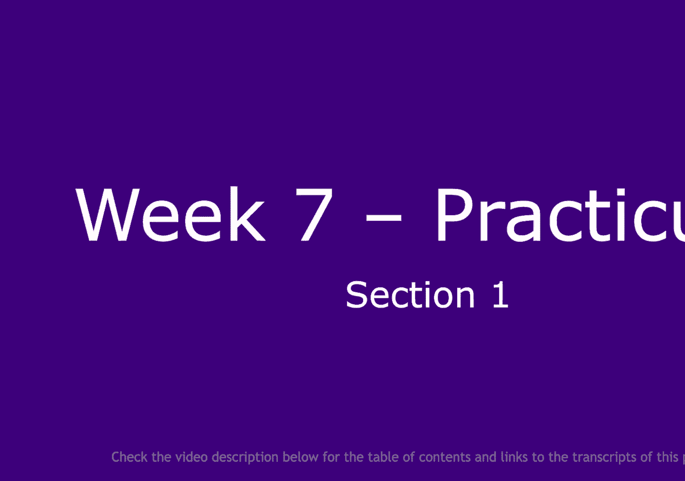

zoom我认为系统是谁挂断的，谁认为左边的图片是真实的，zoom我认为系统是谁挂断的，谁认为左边的图片是真实的，好吧，现在举起手来，谁认为右边的图片是真实的好吧，谁，好吧，现在举起手来。

谁认为右边的图片是真实的好吧，谁，认为他们都是真实的，认为这是假的，认为，认为他们都是真实的，认为这是假的，认为，那个是假的，以为都是假的，好吧，所以，那个是假的，以为都是假的，好吧，所以。

这两个图像是通过建模生成的，我们对此进行了实际训练，这两个图像是通过建模生成的，我们对此进行了实际训练，Guy Cara的火车，所以如果您在网站上此人不存在，Guy Cara的火车。

所以如果您在网站上此人不存在，可以找到一些非常好看的不存在的人的例子，如果您，可以找到一些非常好看的不存在的人的例子，如果您，不断点击，有时您会发现某些人的洞，不断点击，有时您会发现某些人的洞。

那种很容易识别的面孔不太可能是，那种很容易识别的面孔不太可能是，真实的人，但看起来很合法，您可以注意到，真实的人，但看起来很合法，您可以注意到，他们的牙齿很好，非常好，你知道脸颊，你知道鸡脚。

他们的牙齿很好，非常好，你知道脸颊，你知道鸡脚，喜欢的东西，或者你称呼它们，你可以在这里清楚地知道，如果你，喜欢的东西，或者你称呼它们，你可以在这里清楚地知道，如果你，检查网络背后的背景不是很准确。

检查网络背后的背景不是很准确，虽然地面看起来很好，但为什么，虽然地面看起来很好，但为什么，因为已经为网络提供了许多样本，而这些样本是，因为已经为网络提供了许多样本，而这些样本是，改面不是不变的东西是。

改面不是不变的东西是，正确的背景，这样背景就是这里的变量，正确的背景，这样背景就是这里的变量，因此，您无法学习任何可能的背景，因此成为基础，因此，您无法学习任何可能的背景，因此成为基础。

看起来有些怪异的东西，因为可变性比，看起来有些怪异的东西，因为可变性比，一张脸的可能外观多少个给定的脸，一张脸的可能外观多少个给定的脸，这样你就可以使她的脸像人脸一样扭曲。

这样你就可以使她的脸像人脸一样扭曲，他有自由吗？你知道这个答案吧，我们已经在，他有自由吗？你知道这个答案吧，我们已经在，八班，她说八千，八班，她说八千，五十是的，正确的是五十，所以你大约有五十质量。

五十是的，正确的是五十，所以你大约有五十质量，更少的东西加上你知道旋转倾斜，什么不是，所以不是，你，更少的东西加上你知道旋转倾斜，什么不是，所以不是，你，知道所有可能的只是50个维度中的一个流形。

所以一切都很好，知道所有可能的只是50个维度中的一个流形，所以一切都很好，虽然您知道这幅画RF并不完全在那个歧管之外，虽然您知道这幅画RF并不完全在那个歧管之外，几百万像素的图片。

所以这里的每个点都生活在这个巨大的空间中，几百万像素的图片，所以这里的每个点都生活在这个巨大的空间中，尽管所有可能的变化都限制在子空间中，尽管所有可能的变化都限制在子空间中，好的。

这就是数据集的训练流形。好的，这就是数据集的训练流形。网站还可以，所以我们这里有一只非常可爱的狗哦，但另一方面却不那么可爱，网站还可以，所以我们这里有一只非常可爱的狗哦，但另一方面却不那么可爱。

小鸟抱歉，是的，如果您在狗和，小鸟抱歉，是的，如果您在狗和，鸟，你期望在中间看到什么，为此我要成为，鸟，你期望在中间看到什么，为此我要成为，实际上关掉灯后不久不关灯，实际上关掉灯后不久不关灯。

所以又是一个模糊的图像，你是什么意思，那么你希望克服什么，所以又是一个模糊的图像，你是什么意思，那么你希望克服什么，这里，大概是的，你可以说回来，所以我要做100％DS 1 + 0 90％D是。

大概是的，你可以说回来，所以我要做100％DS 1 + 0 90％D是，加10％80％D在+ 20％这一个上，加10％80％D在+ 20％这一个上，在这里看到你应该猜你比平常少，所以你实际上必须说话。

在这里看到你应该猜你比平常少，所以你实际上必须说话，返回比平常更多，飞行广场不行，所以如果我喜欢线性的话，你有一只狗，你有一只鸟，飞行广场不行，所以如果我喜欢线性的话，你有一只狗，你有一只鸟。

在像素空间中对这两个图像进行插值会产生第二次抱歉，在像素空间中对这两个图像进行插值会产生第二次抱歉，是的，超级超级位置不错，所以您会得到看起来像的东西，是的，超级超级位置不错。

所以您会得到看起来像的东西，这样，您基本上可以将第一张图片与第二张图片叠加，这样，您基本上可以将第一张图片与第二张图片叠加，好吧，让我们回到这里，让我们在，好吧，让我们回到这里，让我们在。

网络的潜在空间，所以我同时输入了这两个家伙，得到了2，网络的潜在空间，所以我同时输入了这两个家伙，得到了2，表示那些隐藏的图层，然后在，表示那些隐藏的图层，然后在，隐藏层，然后执行解码部分。

您希望在此处看到什么，隐藏层，然后执行解码部分，您希望在此处看到什么，你还是要跟我说回话，你必须大声喊叫，背景变得一团糟，你还是要跟我说回话，你必须大声喊叫，背景变得一团糟，但是这个主题会是正确的。

所以你会成为，但是这个主题会是正确的，所以你会成为，起始场景是狗，然后是小狗鸟，这就是它的样子。

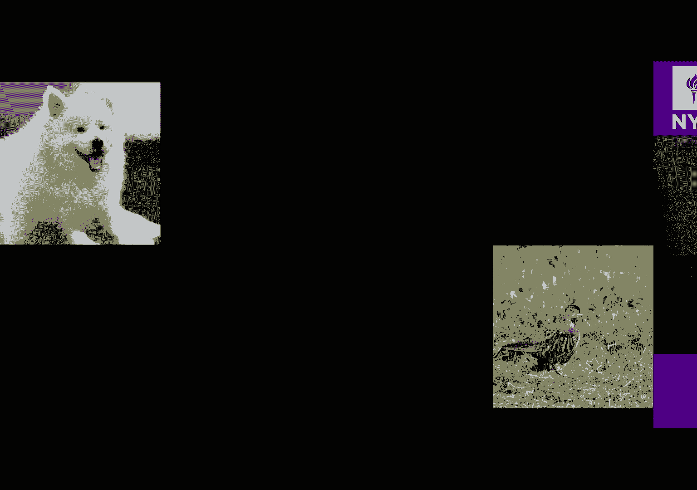

起始场景是狗，然后是小狗鸟，这就是它的样子，小鸟的小鸟狗小鸟的小鸟狗，小鸟的小鸟狗小鸟的小鸟狗，好吧，这是网络对弗兰基（Frankie）的亵渎，好吧，这是网络对弗兰基（Frankie）的亵渎。

你应该看完整的完整的炼金术士情节，父亲带走，你应该看完整的完整的炼金术士情节，父亲带走，女儿和狗，并做了类似的事情，这很有趣，女儿和狗，并做了类似的事情，这很有趣，好的。

如果您在第二个第二季观看动画片《兄弟会》，好的，如果您在第二个第二季观看动画片《兄弟会》，啊哈，我不知道，因为它很多绿色，啊哈，我不知道，因为它很多绿色，所以我想它摆脱了我不知道，我想是的，我不知道。

所以我想它摆脱了我不知道，我想是的，我不知道，很好的问题，是的，很好，所以让我向您展示更多一些东西，很好的问题，是的，很好，所以让我向您展示更多一些东西，来自Brock的文章，您可以。

来自Brock的文章，您可以，有一个较小的像，所以第一个有一个较小的图像，我们，有一个较小的像，所以第一个有一个较小的图像，我们，从看起来像鲨鱼或蒙太奇的东西开始，然后我以为是名字。

从看起来像鲨鱼或蒙太奇的东西开始，然后我以为是名字，那东西看起来像是多头猫，或者你怎么称呼它们为章鱼呢？那东西看起来像是多头猫，或者你怎么称呼它们为章鱼呢？是的，就像章鱼，然后章鱼变得像猴子，是的。

就像章鱼，然后章鱼变得像猴子，然后看起来像只狗，所以您可以看到鲨鱼变成了章鱼，然后看起来像只狗，所以您可以看到鲨鱼变成了章鱼，变成一只猴子，变成一条狗，如此有趣，就像你如何改变，变成一只猴子。

变成一条狗，如此有趣，就像你如何改变，只需确定最后两个点即可繁殖，只需确定最后两个点即可繁殖。

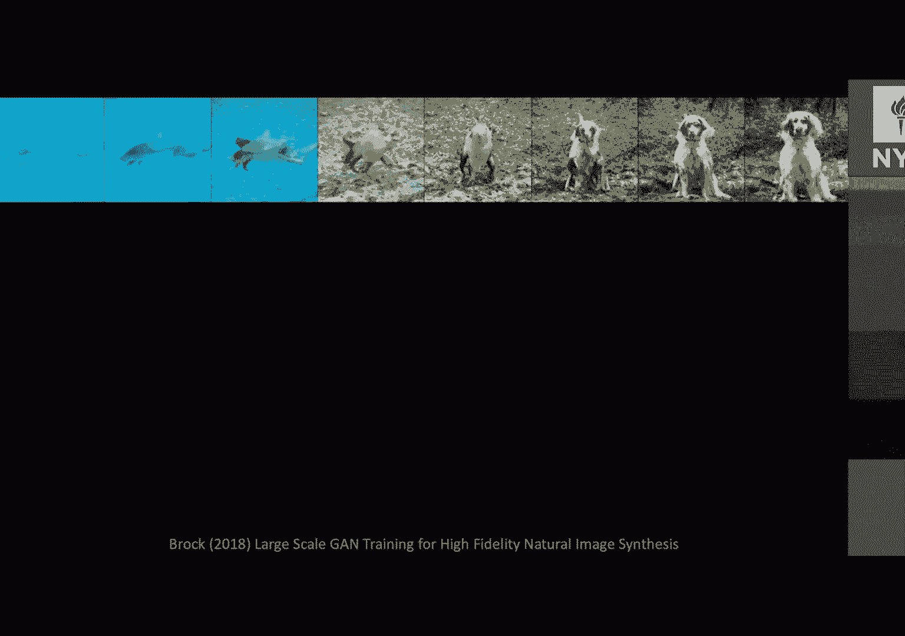

潜在的空间，所以您在这里还有另一个，您可以从这里的这些小狗转到我们的，潜在的空间，所以您在这里还有另一个，您可以从这里的这些小狗转到我们的，鸟，所以无论如何，你都有一只小鸟松鼠，然后你有一只鸟，鸟。

所以无论如何，你都有一只小鸟松鼠，然后你有一只鸟。

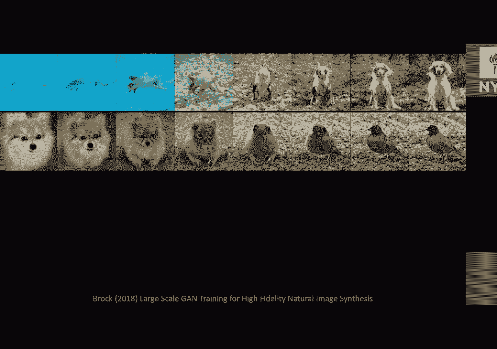

那么另一边，你有一条狗狗，或者这边，你就像一个悲惨的家伙，那么另一边，你有一条狗狗，或者这边，你就像一个悲惨的家伙，什么叫大块臭鼬谢谢你，哦，这就是为什么你闻起来像臭鼬，什么叫大块臭鼬谢谢你，哦。

这就是为什么你闻起来像臭鼬，是一样的吧，好吧，我明白了，所以如果你在这里有臭鼬，那么你，是一样的吧，好吧，我明白了，所以如果你在这里有臭鼬，那么你，去找狗兔子，在这件事之后，它实际上看起来像只狗。

去找狗兔子，在这件事之后，它实际上看起来像只狗，最终你会把鸟变成苍蝇，我认为这些都是很棒的例子，最终你会把鸟变成苍蝇，我认为这些都是很棒的例子，所以这会让你饿，以便我可以喂你第二部分，所以这会让你饿。

以便我可以喂你第二部分，该类是正确的，因此您在一侧具有此图像，而在，该类是正确的，因此您在一侧具有此图像，而在，另一边，您得到了嵌入，然后对，另一边，您得到了嵌入，然后对，嵌入。

您可以查看本文以获取更多详细信息，这里的重点是，嵌入，您可以查看本文以获取更多详细信息，这里的重点是，只是向您展示像素空间中插值之间的差异，只是向您展示像素空间中插值之间的差异，是的。

像素空间中的插值之间有什么区别，是的，像素空间中的插值之间有什么区别，潜伏空间，所以潜伏空间捕获了基本的，潜伏空间，所以潜伏空间捕获了基本的，图像的语义，因此您从哪种像素空间出发，图像的语义。

因此您从哪种像素空间出发，不能真正与我们的工具配合使用，以改善行为空间，不能真正与我们的工具配合使用，以改善行为空间，这是我们对末尾数据的内部隐藏表示，这是我们对末尾数据的内部隐藏表示，再次在网络上。

这只是为了给您一些食欲，不是，我不是，再次在网络上，这只是为了给您一些食欲，不是，我不是，我不会形成一点下一步好吧，您可以放大可以移动的狗，我不会形成一点下一步好吧，您可以放大可以移动的狗。

您可以在Y的X上移动您可以改变亮度，您可以在Y的X上移动您可以改变亮度，这里的部分是，当您更改亮度时，实际上您将日期更改为，这里的部分是，当您更改亮度时，实际上您将日期更改为，今天白天或晚上。

因为那是最正常的亮度，今天白天或晚上，因为那是最正常的亮度，改变图片看起来还可以，所以每当您更改亮度时，改变图片看起来还可以，所以每当您更改亮度时，实际更改一天中的时间，或者您进行2d旋转，甚至3d。

实际更改一天中的时间，或者您进行2d旋转，甚至3d，旋转是如此有趣，意味着网络和某种程度上都有内部，旋转是如此有趣，意味着网络和某种程度上都有内部，yan提到的3d世界表示形式。

yan提到的3d世界表示形式，昨天如果你转移了一点，你就会知道这种视差，然后，昨天如果你转移了一点，你就会知道这种视差，然后，基本解决这个您知道的现象的最简单表达方式是。

基本解决这个您知道的现象的最简单表达方式是，实际上意味着存在3D战争，所以在这种情况下，他们训练了，实际上意味着存在3D战争，所以在这种情况下，他们训练了，网络，以便您实际上能够处理特定的转换，网络。

以便您实际上能够处理特定的转换，实际上，我必须再次将参考文献放在本文上，我只是给你，实际上，我必须再次将参考文献放在本文上，我只是给你，怎么说我可以，我不会再给你任何正式的东西，怎么说我可以。

我不会再给你任何正式的东西，现在在这种情况下，实际上我非常喜欢这样，您可以得到动物，现在在这种情况下，实际上我非常喜欢这样，您可以得到动物，图片的版本正确，因此您可以尝试停下来，不要尝试。

图片的版本正确，因此您可以尝试停下来，不要尝试，无尽吧，我们不想做那些事情好吧，所以你们中的一些人，无尽吧，我们不想做那些事情好吧，所以你们中的一些人，其实知道这个东西很有趣，谢谢。

其实知道这个东西很有趣，谢谢，对不对的一个，就忘了对吧，对，对，对，对不对的一个，就忘了对吧，对，对，对，很酷的东西，例如您可以从低分辨率转到高分辨率，很酷的东西，例如您可以从低分辨率转到高分辨率。

从左侧的分辨率隐藏右侧，在这里您有，从左侧的分辨率隐藏右侧，在这里您有。

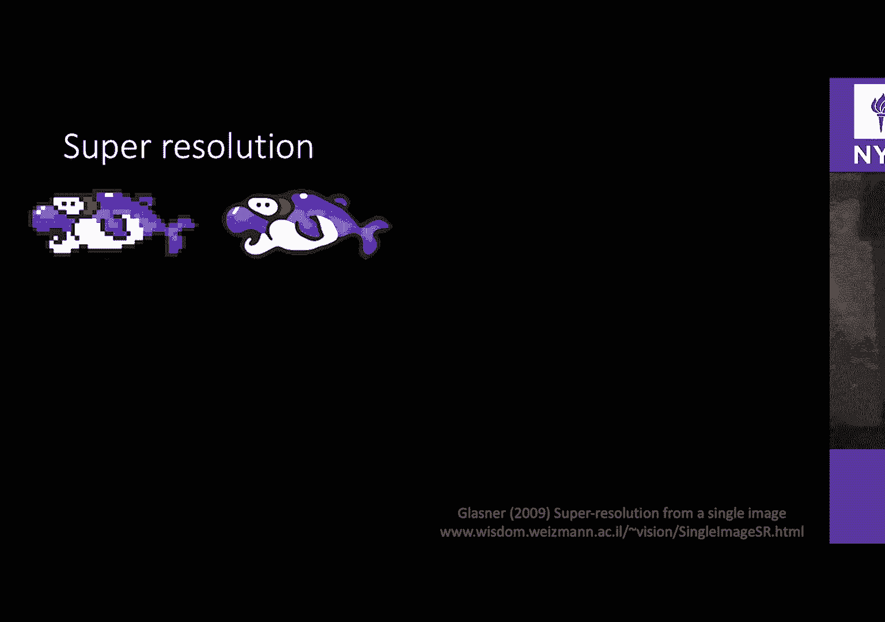

几个例子，但这当然是白色的，这很容易做到，几个例子，但这当然是白色的，这很容易做到，这些东西和斑马一样，这是深度学习的前期，这些东西和斑马一样，这是深度学习的前期，技术。

所以他们只是使用某种层次模型而已，技术，所以他们只是使用某种层次模型而已，很好，然后几年后，您实际上已经给加西亚送上了您，很好，然后几年后，您实际上已经给加西亚送上了您，你知道真的很高吗。

就像通过线性采样一样进行集线器采样，你知道真的很高吗，就像通过线性采样一样进行集线器采样，通过线性插值进行插值，取而代之的是，通过线性插值进行插值，取而代之的是，用神经网络采样下来。

最后一个实际上是真实图像，用神经网络采样下来，最后一个实际上是真实图像，您可以在第三行清楚地看到这些亚裔家伙如何成为欧洲白人，您可以在第三行清楚地看到这些亚裔家伙如何成为欧洲白人，这种偏见是正确的。

所以网络上看到了很多白人，这种偏见是正确的，所以网络上看到了很多白人，因此，最简单的方法来重建一种未知的面孔，因此，最简单的方法来重建一种未知的面孔，可以插入一张白色花花公子的脸。

或者这位女士看起来像她，可以插入一张白色花花公子的脸，或者这位女士看起来像她，她正在中风，因为她我们对这些没有很多侧视图，她正在中风，因为她我们对这些没有很多侧视图。

正确的图像这些这位女士在下侧变成了变性人，然后，正确的图像这些这位女士在下侧变成了变性人，然后，这个家伙看起来他出了意外，因为我们再一次没有，这个家伙看起来他出了意外，因为我们再一次没有。

数据集中有很多眼镜，因此您知道的网络非常暗，数据集中有很多眼镜，因此您知道的网络非常暗，事，然后您就知道暗示有人只是很难打他，但是，事，然后您就知道暗示有人只是很难打他，但是，再次，这是非常古老的东西。

我的意思是我们现在已经是四年了，再次，这是非常古老的东西，我的意思是我们现在已经是四年了，这些是第一个结果，这使您可以利用自己知道的实际，这些是第一个结果，这使您可以利用自己知道的实际，数据以填补空白。

而这些空白实际上是什么，数据以填补空白，而这些空白实际上是什么，实际细节我们最近有很多新结果，但是这些器官是，实际细节我们最近有很多新结果，但是这些器官是，一种开拓性的结果和开拓性的例子。

一种开拓性的结果和开拓性的例子，用灰色方块遮住脸部，然后让网络重构，用灰色方块遮住脸部，然后让网络重构，这样的脸，它给你最漂亮的闭合点，所以，这样的脸，它给你最漂亮的闭合点，所以。

您拍摄保留在训练流形上的图像，并在上面贴上补丁，您拍摄保留在训练流形上的图像，并在上面贴上补丁，这个补丁的脸现在会使图像远离训练歧管，这个补丁的脸现在会使图像远离训练歧管，例如。

您可以在此能量空间中进行梯度下降，这样您就可以，例如，您可以在此能量空间中进行梯度下降，这样您就可以，找到最接近的点，例如能量最低的点，找到最接近的点，例如能量最低的点，与该特定的初始图像相关联，好了。

这样您就可以获得一个图像，与该特定的初始图像相关联，好了，这样您就可以获得一个图像，干扰您的图像，使其脱离训练歧管，然后，干扰您的图像，使其脱离训练歧管，然后，您可以在能源环境中的圣徒方面做得很好。

以便您可以选择，您可以在能源环境中的圣徒方面做得很好，以便您可以选择，您所知道的任何样本看起来都是最多的，它只是最接近的样本，您所知道的任何样本看起来都是最多的，它只是最接近的样本。

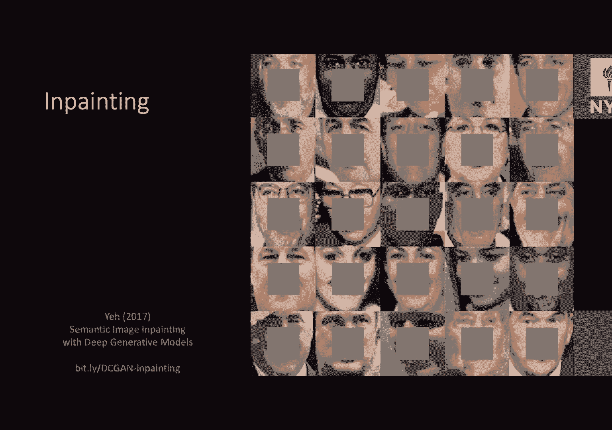

训练流形，这是严昨天昨天讲到的一些内容，训练流形，这是严昨天昨天讲到的一些内容，基于能量的模型每当您学习能量时，您就可以实际使用，基于能量的模型每当您学习能量时，您就可以实际使用。

进行推理的能量进行推理实际上必须使能量最小化，进行推理的能量进行推理实际上必须使能量最小化，是的，所以能量最小化意味着推理而不是训练，是的，所以能量最小化意味着推理而不是训练，再次有其他事情。

我们将涵盖更多，再次有其他事情，我们将涵盖更多，在以下课程中详细介绍基于能量的模型，在这里您还有另一个，在以下课程中详细介绍基于能量的模型，在这里您还有另一个，几个示例，其中一个使用了变分编码器。

另一个使用了生成式，几个示例，其中一个使用了变分编码器，另一个使用了生成式，其他氰酸盐这也是里德的另一个例子，其他氰酸盐这也是里德的另一个例子。

从英文描述转到实际英文描述的图纸。

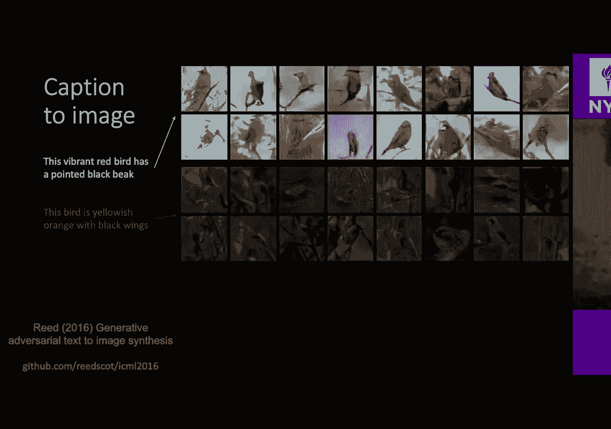

从英文描述转到实际英文描述的图纸，意思是正确的，所以您从我猜的序列转到像，意思是正确的，所以您从我猜的序列转到像，概念，然后从概念开始，您使用解码器，因此它是生成网络，概念，然后从概念开始。

您使用解码器，因此它是生成网络，这将解码您的特定输出，这几乎是，这将解码您的特定输出，这几乎是，用它来吸引眼球，所以这会让你非常饿，用它来吸引眼球，所以这会让你非常饿，上课你饿了吗，我也没吃饭。

上课你饿了吗，我也没吃饭，好的，好了，编码器，我受这些监督是什么？

好的，好了，编码器，我受这些监督是什么？学习，这是我们要深入研究的第一个模型，学习，这是我们要深入研究的第一个模型，看看我们如何训练没有目标或标签的网络，看看我们如何训练没有目标或标签的网络。

目标与目标和标签之间的区别是什么，目标与目标和标签之间的区别是什么，您已经知道其他人预测的一切都意味着，您已经知道其他人预测的一切都意味着，实际上给他们两个都是注释，谢谢，所以标签是。

实际上给他们两个都是注释，谢谢，所以标签是，将是绝对的，您可以标记东西，这是椅子，是桌子，将是绝对的，您可以标记东西，这是椅子，是桌子，门的目标将会是你知道目标好吧，所以我们。

门的目标将会是你知道目标好吧，所以我们，将观察我们如何能够在没有实际，将观察我们如何能够在没有实际，目标或标签，所以这是第一个网络，这是我们的架构，目标或标签，所以这是第一个网络，这是我们的架构。

它将与我们到目前为止观察到的非常相似，但是，它将与我们到目前为止观察到的非常相似，但是，最大的不同是我们从底部开始，我们已经知道为什么它是粉红色的，最大的不同是我们从底部开始。

我们已经知道为什么它是粉红色的，您进入了绿色的中间隐藏层，然后获得了前两个输入，因此，您进入了绿色的中间隐藏层，然后获得了前两个输入，因此，网络的输出将是输入的预测，所以您，网络的输出将是输入的预测。

所以您，也可以使用另一种表示形式，也可以使用另一种表示形式，这些是DEA问题，隐藏层将成为旋转壁球，这些是DEA问题，隐藏层将成为旋转壁球，旋转我的输入，然后最终输出将是我猜壁球，旋转我的输入。

然后最终输出将是我猜壁球，隐藏好转的旋转版本，其中旋转表示仿射，隐藏好转的旋转版本，其中旋转表示仿射，变换我们具有一定的维数，所以我们向D射击，变换我们具有一定的维数，所以我们向D射击。

那么X和X hat都在RN中，因此第二部分将是，那么X和X hat都在RN中，因此第二部分将是，我们的生成网络来自h2x热点的那将是我的，我们的生成网络来自h2x热点的那将是我的，生成网。

这里有一个不同的图，基本上，生成网，这里有一个不同的图，基本上，在做同样的事情，但这是你知道有些人喜欢这些图表，在做同样的事情，但这是你知道有些人喜欢这些图表，实际的转换是在盒子中进行的，所以您会有人。

实际的转换是在盒子中进行的，所以您会有人，说这是一个两层神经网络，尽管我们知道这是一个，说这是一个两层神经网络，尽管我们知道这是一个，一层神经网络，您看到多少球，三层神经网络很棒，一层神经网络。

您看到多少球，三层神经网络很棒，如果我们使用打哈欠符号，那我的约定还可以，那么我们也可以，如果我们使用打哈欠符号，那我的约定还可以，那么我们也可以，坚持，所以您实际上可以有一些紧身衣的重量，以便尝试。

坚持，所以您实际上可以有一些紧身衣的重量，以便尝试，尽管您无法保证以某种方式重现片段，尽管您无法保证以某种方式重现片段，所有不同基础的权重顺序不同，但是如果我们使用，所有不同基础的权重顺序不同。

但是如果我们使用，洋葱符号，我们还将添加这种小项目是，洋葱符号，我们还将添加这种小项目是，那里代表了转换，所以为什么我们要使用，那里代表了转换，所以为什么我们要使用，编码器预测我的输入的意义是什么？

编码器预测我的输入的意义是什么？单位矩阵好吧，我提供的输入是向量，单位矩阵好吧，我提供的输入是向量，我把这个向量应用于我确实希望我的单位矩阵乘以我得到的向量。

我把这个向量应用于我确实希望我的单位矩阵乘以我得到的向量，编码器使用相同的向量，因此您得到的内容与为什么，编码器使用相同的向量，因此您得到的内容与为什么，地狱，我们是在这样做吗，所以您在预测时没有输入。

但是我，地狱，我们是在这样做吗，所以您在预测时没有输入，但是我，我可以学习恒等矩阵我有恒等矩阵，我可以学习恒等矩阵我有恒等矩阵，稀疏我得到了一些东西我投入了一些东西我投入了一些东西。

稀疏我得到了一些东西我投入了一些东西我投入了一些东西，把相同的东西放进去，让大多数东西变得最琐碎，把相同的东西放进去，让大多数东西变得最琐碎，我要为网络学习的东西是身份矩阵。

我要为网络学习的东西是身份矩阵，里面出来了，这就是我们训练这种东西的方式，第二次抱歉，如果d是，里面出来了，这就是我们训练这种东西的方式，第二次抱歉，如果d是，不太对，好吧，有一点要说。

所以如果我们有武器，如果你有，不太对，好吧，有一点要说，所以如果我们有武器，如果你有，中间维数D小于n，因此我们可以开始看到，中间维数D小于n，因此我们可以开始看到，这个家伙，这个东西可以例如用于压缩。

这个家伙，这个东西可以例如用于压缩，如果我有一个中间表示，它比我的输入占用更少的空间，如果我有一个中间表示，它比我的输入占用更少的空间，表示我可以使用此编码器是压缩机，然后我会感到心烦。

表示我可以使用此编码器是压缩机，然后我会感到心烦，表示我的代码，即您知道要解决的特定输入，表示我的代码，即您知道要解决的特定输入，占用这个空间，所以我可以使用一个您知道的图像压缩器，例如，占用这个空间。

所以我可以使用一个您知道的图像压缩器，例如，这里的示例，这是我最初对编码器的想法，但这仅仅是一个，这里的示例，这是我最初对编码器的想法，但这仅仅是一个，的类型，这是您知道的不正确，的类型。

这是您知道的不正确，考虑这些家伙的方式，所以另一个编码器任务是能够，考虑这些家伙的方式，所以另一个编码器任务是能够，重建存在于流形上的数据好的，所以我们有一个数据流形，重建存在于流形上的数据好的。

所以我们有一个数据流形，我们得到一些点我们有数据点我用这些点来训练我的系统，我们得到一些点我们有数据点我用这些点来训练我的系统，而且我希望我的输出编码器能够仅重建存在的东西。

而且我希望我的输出编码器能够仅重建存在的东西，数据流形上的训练流形好吧，这就是我们的，数据流形上的训练流形好吧，这就是我们的，实际上这些编码器的任务是什么，实际上这些编码器的任务是什么，重建一个小子集。

我一秒钟被麦克风绊倒，重建一个小子集，我一秒钟被麦克风绊倒，只有我们应该可以，这太短了，可以，我们应该只能，只有我们应该可以，这太短了，可以，我们应该只能，重建我们只需要执行才能重建一小部分。

重建我们只需要执行才能重建一小部分，可能的输入好了，现在变得有趣了，因为如果您只能，可能的输入好了，现在变得有趣了，因为如果您只能，重构一小部分输入，那么您将无法重构，重构一小部分输入。

那么您将无法重构，马上就走，例如，像在我给你看之前，我放了一张照片，马上就走，例如，像在我给你看之前，我放了一张照片，有一张照片，我的脸前有一个灰色框，所以我明白了，有一张照片，我的脸前有一个灰色框。

所以我明白了，如果我尝试重建它并与人建立网络，我会将其从训练中移除，如果我尝试重建它并与人建立网络，我会将其从训练中移除，并且只重建流形上的东西，并且只重建流形上的东西，在这里，脸上没有那个补丁，好吧。

您看到了，在这里，脸上没有那个补丁，好吧，您看到了，否，如果您只想重建已经，否，如果您只想重建已经，在训练过程中观察到您应用于新知的任何变化，在训练过程中观察到您应用于新知的任何变化。

稍后将在您可以使用此网络的过程中阅读输入内容，稍后将在您可以使用此网络的过程中阅读输入内容，删除，因为网络将对这种类型不敏感，删除，因为网络将对这种类型不敏感，扰动。

让我们看一下有关此内容的更多详细信息，扰动，让我们看一下有关此内容的更多详细信息，到目前为止是否好的，现在让我们来看看，到目前为止是否好的，现在让我们来看看，算出我们可以使用的D重建损失是多少。

算出我们可以使用的D重建损失是多少，您知道的经典数据对于整个数据集的损失将是，您知道的经典数据对于整个数据集的损失将是，我的每个样本损失之间的平均值还可以，所以有两个人。

我的每个样本损失之间的平均值还可以，所以有两个人，Nasus损失的第一人称将是二进制二进制交叉熵，Nasus损失的第一人称将是二进制二进制交叉熵，如果您犯了一个错误，将会受到很多惩罚。

如果您犯了一个错误，将会受到很多惩罚，所以目标的输出将是0或1，所以我有一个分类，所以目标的输出将是0或1，所以我有一个分类，分布，然后您的输入就不会让您感到遗憾。分布，然后您的输入就不会让您感到遗憾。

是也留在0到1之间的东西，所以你有一个S型网络，是也留在0到1之间的东西，所以你有一个S型网络，sigmoid最后是非线性函数，然后您尝试将其最小化，sigmoid最后是非线性函数。

然后您尝试将其最小化，这个人在这里，否则，如果您有用于，这个人在这里，否则，如果您有用于，示例图像彩色图像，您可能希望使用MSC可以，这样，示例图像彩色图像，您可能希望使用MSC可以，这样，是的。

有人是我们提到你之前提到的你的朋友，是的，有人是我们提到你之前提到的你的朋友，知道很明显，想像在完全之下，知道很明显，想像在完全之下，隐藏层一百个完整的隐藏层的维数为，隐藏层一百个完整的隐藏层的维数为。

小于输入的大小，因此在这种情况下，网络可能不会复制，小于输入的大小，因此在这种情况下，网络可能不会复制，或使用身份矩阵，因为您具有中间表示形式，或使用身份矩阵，因为您具有中间表示形式，较小。

然后您必须将其扩展回原始，较小，然后您必须将其扩展回原始，维度再次可以使用一个完整的隐藏层下如何编码，维度再次可以使用一个完整的隐藏层下如何编码，例如进行压缩，所以这是很标准的，我会说，例如进行压缩。

所以这是很标准的，我会说，到目前为止很有意义，所以我们将在一秒钟内在笔记本上玩，到目前为止很有意义，所以我们将在一秒钟内在笔记本上玩，尽管如此，我会说我实际上更喜欢这一点，而您会，尽管如此。

我会说我实际上更喜欢这一点，而您会，告诉我为什么你应该能够做到我的意思是你应该拥有所有的成分，告诉我为什么你应该能够做到我的意思是你应该拥有所有的成分，这将是什么？这是我认为第六个六周，这将是什么？

这是我认为第六个六周，第六周，第七周，我想我不确定为什么要更大的中间体，第六周，第七周，我想我不确定为什么要更大的中间体，表示，[音乐]，[音乐]，是的，所以我们总是说，较大的我们进入中间展示，是的。

所以我们总是说，较大的我们进入中间展示，最简单的将是优化权，因此尽管信息，最简单的将是优化权，因此尽管信息，在第一层和隐藏层中包含的内容将是相同的，在第一层和隐藏层中包含的内容将是相同的。

我无法添加信息，但现在网络玩起来要容易得多，我无法添加信息，但现在网络玩起来要容易得多，一个具有更多维度的表示，关键是，一个具有更多维度的表示，关键是，我们现在可以简单地学习单位矩阵，我们将只是。

我们现在可以简单地学习单位矩阵，我们将只是，复制您知道的所有内容，然后复制第一个帖子位置中的第一个人，复制您知道的所有内容，然后复制第一个帖子位置中的第一个人，您复制到这里的第二个人。

您复制到这里的第三个人，现在您复制，您复制到这里的第二个人，您复制到这里的第三个人，现在您复制，通过你的一切，一无所知，通过你的一切，一无所知，因此，我们必须学习我们必须对，因此。

我们必须学习我们必须对，信息，所以我们必须学习如何介绍，现在我们必须，信息，所以我们必须学习如何介绍，现在我们必须，现在介绍一个信息瓶颈，虽然我们扩大了，现在介绍一个信息瓶颈，虽然我们扩大了，中间表示。

我们必须限制我们必须的表示，中间表示，我们必须限制我们必须的表示，限制隐藏层可以接受输入的可能配置，限制隐藏层可以接受输入的可能配置，层可以采用任意数量的配置，而隐藏层应仅，层可以采用任意数量的配置。

而隐藏层应仅，包含我们代表训练数据的可能配置，包含我们代表训练数据的可能配置，该流形上的数据可以正常运行，因此输入可以是您想要的所有内容，该流形上的数据可以正常运行，因此输入可以是您想要的所有内容。

但是您只能使用流形上的数据进行训练，因此，但是您只能使用流形上的数据进行训练，因此，隐藏层只是为了能够建模以捕获什么，隐藏层只是为了能够建模以捕获什么，在训练数据中具有发展能力，对任何。

在训练数据中具有发展能力，对任何，不在外面，这样我们可以有选择地，不在外面，这样我们可以有选择地，在很大的输入空间中重构此子集的过程与您同在，在很大的输入空间中重构此子集的过程与您同在，否。

除非我们完成了，现在看我们如何避免过度拟合训练数据，否，除非我们完成了，现在看我们如何避免过度拟合训练数据，所以有几种方法可以做到这一点，所以有几种方法可以做到这一点，工作。

而且您可能希望拥有同样的理由，工作，而且您可能希望拥有同样的理由，这个比旁边的家伙少，所以让我说我有一个超级棒的解码器，这个比旁边的家伙少，所以让我说我有一个超级棒的解码器。

我的编码器应该可以简单地将我所有的训练数据，我的编码器应该可以简单地将我所有的训练数据，训练数据是第一点第二训练数据将是第二，训练数据是第一点第二训练数据将是第二，第三个训练数据相同的极点将成为第三。

因此我可以将每个，第三个训练数据相同的极点将成为第三，因此我可以将每个，我的训练数据是一二三四五六七，我的训练数据是一二三四五六七，现在您已将解码器存储了所有训练数据点，然后。

现在您已将解码器存储了所有训练数据点，然后，您只需从这种选择器中输出所需的训练点，您只需从这种选择器中输出所需的训练点，对，所以您可能只需要一个球，这里只有一个神经元，对，所以您可能只需要一个球。

这里只有一个神经元，在隐藏层中，以使网络只要，在隐藏层中，以使网络只要，编码器中的解码器非常强大，编码器中的解码器非常强大，好吧，关键是您的同事提到了，我们该如何避免，好吧，关键是您的同事提到了。

我们该如何避免，除非我们正在，除非我们正在，你知道我很了解我们如何设计这些东西，你知道我很了解我们如何设计这些东西，有几种不同的方法，还有对比方法，有几种不同的方法，还有对比方法，有常规的冰金属。

还有我们见过的建筑方法，有常规的冰金属，还有我们见过的建筑方法，昨天还有一些我们可以采石的东西现在有一些我们有20个，昨天还有一些我们可以采石的东西现在有一些我们有20个，剩下的分钟还可以。

下一张幻灯片，是的，您知道吗？下一张幻灯片，是的，您知道吗？它是如何工作的我将输入内容从原来的粉红色中取出来，它是如何工作的我将输入内容从原来的粉红色中取出来，这是我的训练，这是我的数据多方面。

这是我的训练，这是我的数据多方面，你会知道样品会为我提供训练吗，你会知道样品会为我提供训练吗，点，然后将其替换好，如何添加随机废话好酷，点，然后将其替换好，如何添加随机废话好酷。

现在我并没有强迫网络重新构造初始点，现在我并没有强迫网络重新构造初始点，所以这是您从训练中得到的一点点，即降噪自动编码器，所以这是您从训练中得到的一点点，即降噪自动编码器，多管齐下，将其移开。

然后强制网络执行，多管齐下，将其移开，然后强制网络执行，回到这里，我走了同一点，从另一个方向走了，回到这里，我走了同一点，从另一个方向走了，然后我把它放回这里我的观点与我说的一样。

然后我把它放回这里我的观点与我说的一样，放到这里好吧，所以我们现在要学习什么，我们将学习，放到这里好吧，所以我们现在要学习什么，我们将学习，向量场，一切都回到了这一点，然后我开始移动，向量场。

一切都回到了这一点，然后我开始移动，围绕我的训练流形，我拥有所有这样的向量场，围绕我的训练流形，我拥有所有这样的向量场，向量场将全部指向训练样本，但是如果，向量场将全部指向训练样本，但是如果。

您这里有一个训练样本，这里有一个训练样本，这个家伙会尝试，您这里有一个训练样本，这里有一个训练样本，这个家伙会尝试，在这里将它们吸引到轮胎的轨道上，在这里将它们吸引到轮胎的轨道上，呆在那里。

那些东西不在外面，你会崩溃吗？呆在那里，那些东西不在外面，你会崩溃吗？多个问题，好的问题，所以实际上有一个警告或警告，多个问题，好的问题，所以实际上有一个警告或警告，警告，让我说Kavya，谢谢，好吧。

我们假设我们，警告，让我说Kavya，谢谢，好吧，我们假设我们，正在注入我们将要观察到的相同噪声分布，正在注入我们将要观察到的相同噪声分布，通过这种方式，我们可以了解如何从现实中真正恢复过来，因此。

如果我们，通过这种方式，我们可以了解如何从现实中真正恢复过来，因此，如果我们，假设我们可以使用我们将要从事的种植类型，假设我们可以使用我们将要从事的种植类型，观察罗尼特推论然后我们可以训练。

观察罗尼特推论然后我们可以训练，这种不敏感的模型被这些扰动所迷惑，这是一个非常，这种不敏感的模型被这些扰动所迷惑，这是一个非常，大，如果还可以，所以哦，好图片，都可以。

大，如果还可以，所以哦，好图片，都可以，对，所以这是我的训练数据，这是我的数据粉红点，我将，对，所以这是我的训练数据，这是我的数据粉红点，我将，关掉灯，让我在这里留出粉红色的点，关掉灯。

让我在这里留出粉红色的点，我与我们的橙色点是反对的流离失所者，所以他们，我与我们的橙色点是反对的流离失所者，所以他们，源自这些观点，然后我将它们以任何，源自这些观点，然后我将它们以任何，黑暗的迷你路线。

然后我训练我的网络以获取所有这些橙色点，黑暗的迷你路线，然后我训练我的网络以获取所有这些橙色点，回到原始起点，所以这是网络的输出，回到原始起点，所以这是网络的输出，我在训练网络的网络中输入了橙色的点云。

我在训练网络的网络中输入了橙色的点云，输出实际螺旋上的点，因此这些是蓝点。

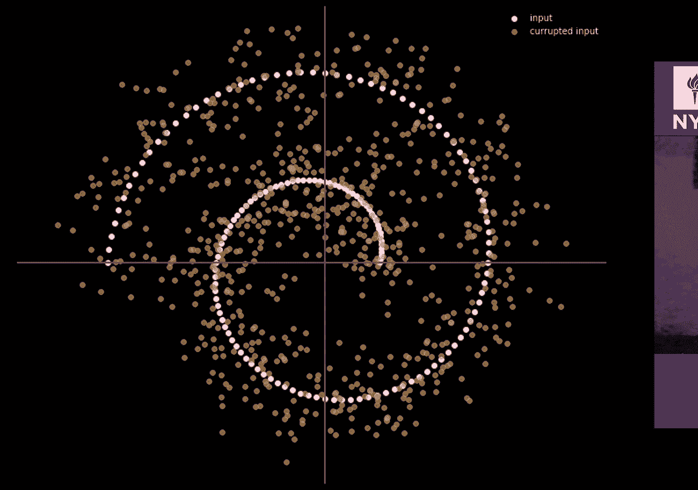

输出实际螺旋上的点，因此这些是蓝点，将会是我对网络的重建，所以如果点是，将会是我对网络的重建，所以如果点是，已经在歧管上，它们没有移动的点距离歧管很远，已经在歧管上，它们没有移动的点距离歧管很远。

他们感动了很多，我能衡量他们感动了多少，这就是，他们感动了很多，我能衡量他们感动了多少，这就是，会成为你的能量，这有多酷啊，好吧，也许你还不了解，会成为你的能量，这有多酷啊，好吧，也许你还不了解。

但是在这种情况下，为了更全面一点，我只发送所有可能的，但是在这种情况下，为了更全面一点，我只发送所有可能的，XY组合在我的网络内部的这架飞机上，所以这里有这条线，XY组合在我的网络内部的这架飞机上。

所以这里有这条线，因为所有这些左下角现在都被压扁了，因为所有这些左下角现在都被压扁了，您可以看到这里的点很稀疏，然后有很多，您可以看到这里的点很稀疏，然后有很多，他们仍然密集地占据着歧管。

他们仍然密集地占据着歧管，对，所以这用颜色向您显示这些点的距离是多少，对，所以这用颜色向您显示这些点的距离是多少，已经旅行了，所以在左下角的这里的点已经旅行了一个，已经旅行了。

所以在左下角的这里的点已经旅行了一个，部队，他们到了这里，我认为这里要点，旅行也喜欢，部队，他们到了这里，我认为这里要点，旅行也喜欢，0。9的东西，他们走到了这里，因为你可以说出这两个点，0。9的东西。

他们走到了这里，因为你可以说出这两个点，分支没有到任何地方，是的，那是为什么，分支没有到任何地方，是的，那是为什么，由这边的两个点以及这边的两个点平均跟踪，由这边的两个点以及这边的两个点平均跟踪。

但是在训练过程中，如果您忘记了自己，就会知道，但是在训练过程中，如果您忘记了自己，就会知道，自己curl缩着，你拥有的一切都会下降到这里猜，自己curl缩着，你拥有的一切都会下降到这里猜。

我可以把刚刚再移动一点的点放进去，我可以把刚刚再移动一点的点放进去，编码器，我可以继续执行几次，直到这些点崩溃为止，编码器，我可以继续执行几次，直到这些点崩溃为止，到多方面好吧，或者我可以做点好事。

我很酷，到多方面好吧，或者我可以做点好事，我很酷，是个技巧，所以我在这里做的是我的去噪自动编码器，是个技巧，所以我在这里做的是我的去噪自动编码器，我到达最初的位置，从哪里开始，我到达最初的位置。

从哪里开始，是的，所以我得到了我的最初观点，然后我流离失所，然后他们强迫，是的，所以我得到了我的最初观点，然后我流离失所，然后他们强迫，网络回到初始点这里发生了什么我该如何解决。

网络回到初始点这里发生了什么我该如何解决，您怎么能在这里修复此山脊，并在这个黑色的黑暗区域中进行任何猜测，您怎么能在这里修复此山脊，并在这个黑色的黑暗区域中进行任何猜测。

随机发送给他们或抓住某人的右上角将其向上推，我该如何推，随机发送给他们或抓住某人的右上角将其向上推，我该如何推，出来哦，好吧，推高也很好，出来哦，好吧，推高也很好，所以我也尝试推高歧管上没有的所有东西。

所以我也尝试推高歧管上没有的所有东西，我在这里做了什么，非常好，不好，无法完成，我在这里做了什么，非常好，不好，无法完成，在高维空间中，所以我在这里要做的就是表达您的观点，在高维空间中。

所以我在这里要做的就是表达您的观点，落在流形上最接近的点上，所以我详尽地搜索了，落在流形上最接近的点上，所以我详尽地搜索了，流形上最接近的点，然后我强制执行网络以始终使我的，流形上最接近的点。

然后我强制执行网络以始终使我的，点落在最近的点上，尽管它们可能是从，点落在最近的点上，尽管它们可能是从，另一个初始点正确，所以如果这里的这个点最初起源，另一个初始点正确，所以如果这里的这个点最初起源。

从这里开始，但它总是会沿着这个方向跌倒，从这里开始，但它总是会沿着这个方向跌倒，很少有点是不是您知道它们只是在中间而已，很少有点是不是您知道它们只是在中间而已，不要掉在任何地方好吧，现在在更多维度上。

一切都是法拉（Farah）正确的，因此我们无法正常工作，现在在更多维度上，一切都是法拉（Farah）正确的，因此我们无法正常工作，还没解决还没用，我下次再告诉你，还没解决还没用，我下次再告诉你。

下次下次下次是的，所以在这种情况下，我已经在，下次下次下次是的，所以在这种情况下，我已经在，在这种情况下，我得到的位移点落在一个最接近的点上，在这种情况下，我得到的位移点落在一个最接近的点上，多方面的。

所以我进行了详尽的搜索，这很简单，因为我有一百，多方面的，所以我进行了详尽的搜索，这很简单，因为我有一百，和五十点，但这是一个骇客，无论如何，和五十点，但这是一个骇客，无论如何。

关键是我们有点发展了某种理解，关键是我们有点发展了某种理解，取而代之的是不守规矩的人喜欢的东西，但我还无法使它起作用，取而代之的是不守规矩的人喜欢的东西，但我还无法使它起作用，所以我想我不是那么聪明。

但在这种情况下，它已经规范化了编码器，所以我想我不是那么聪明，但在这种情况下，它已经规范化了编码器，在我的隐藏表示上有一个l1正则项成本，所以我强迫，在我的隐藏表示上有一个l1正则项成本，所以我强迫。

网络提出了简短的隐藏表示，它们，网络提出了简短的隐藏表示，它们，就像缺少几个尺寸，所以如果我对我的一个正则化，就像缺少几个尺寸，所以如果我对我的一个正则化，隐藏的表示形式在给定的时间。

我只会有几个项目处于活动状态，隐藏的表示形式在给定的时间，我只会有几个项目处于活动状态，问题是，如果将所有其他元素设置为零，则，问题是，如果将所有其他元素设置为零，则，零梯度发送回好。

然后您可能要使用目标道具和，零梯度发送回好，然后您可能要使用目标道具和，其他可爱的花哨的东西，我仍然在努力，所以我不知道如何，其他可爱的花哨的东西，我仍然在努力，所以我不知道如何，使它起作用的关键是。

这是正则化项，所以这是，使它起作用的关键是，这是正则化项，所以这是，对隐藏表示法处以l1罚分，并且该区域为黑色暗处，对隐藏表示法处以l1罚分，并且该区域为黑色暗处，实际上应该再次扩展到现在，这非常困难。

实际上应该再次扩展到现在，这非常困难，我要让它工作，不是说那是不可能的，而是说我在，我要让它工作，不是说那是不可能的，而是说我在，不够聪明，可以将输出编码器缩小，然后我们将被看到，不够聪明。

可以将输出编码器缩小，然后我们将被看到，不工作让我开灯，也许我不知道，不工作让我开灯，也许我不知道，我会这么喜欢吗？我会这么喜欢吗？好的，再次回到相机上，数据流形点训练点是什么，好的，再次回到相机上。

数据流形点训练点是什么，VI签约成人编码器，所以这个家伙在这里，VI签约成人编码器，所以这个家伙在这里，重建用语加上这东西在这里是什么，重建用语加上这东西在这里是什么，我的隐藏表示相对于输入范数的梯度。

我的隐藏表示相对于输入范数的梯度，整体损失权，所以我的整体损失将尽量减少，整体损失权，所以我的整体损失将尽量减少，我的隐藏层的变化给出了输入的变化，所以在这里你，我的隐藏层的变化给出了输入的变化。

所以在这里你，想要对输入没有太大变化的表示是，想要对输入没有太大变化的表示是，我扭动了我的输入，所以这基本上使您对，我扭动了我的输入，所以这基本上使您对，是什么让您后悔对分析灵敏度的重建不敏感。

是什么让您后悔对分析灵敏度的重建不敏感，到重建方向，因此您实际上将能够重建，到重建方向，因此您实际上将能够重建，流形上的东西，但它会使您对任何东西都不敏感，流形上的东西，但它会使您对任何东西都不敏感。

其他可能的方向，因此我们对此没有任何假设，其他可能的方向，因此我们对此没有任何假设，我正在对所有事物不敏感地应用调整，我正在对所有事物不敏感地应用调整，这里仍然有很多要点，所以您将不得不最小化重建。

因为我，这里仍然有很多要点，所以您将不得不最小化重建，因为我，提供不同的样本好吧，您也对激励进行了惩罚，那就是，提供不同的样本好吧，您也对激励进行了惩罚，那就是，终于受罚了，还剩下十分钟，终于受罚了。

还剩下十分钟，最后，这在色调上有什么作用，如您所见，我可以非常使用matplotlib，最后，这在色调上有什么作用，如您所见，我可以非常使用matplotlib，好吧，我们这里有这个训练流形。

这是我的单维度，好吧，我们这里有这个训练流形，这是我的单维度，事情在三个维度上进行，这里我拥有所有这些数据点，很酷，事情在三个维度上进行，这里我拥有所有这些数据点，很酷，因此X依赖于这组数据。

而RN则依赖于out编码器，因此X依赖于这组数据，而RN则依赖于out编码器，要做的就是基本上将卷曲的线条拉长，要做的就是基本上将卷曲的线条拉长，在一个方向上正确，因此在这种情况下您的Z被称为。

在一个方向上正确，因此在这种情况下您的Z被称为，潜在的空间，所以你得到第一个，然后第二个，潜在的空间，所以你得到第一个，然后第二个，关键是我如何知道如何从这些地方回到这里。

关键是我如何知道如何从这些地方回到这里，知道我是否在第一个位置，我可以回到这个位置，知道我是否在，知道我是否在第一个位置，我可以回到这个位置，知道我是否在，在这个地方。

我可以回去那里我不太确定这里发生了什么，在这个地方，我可以回去那里我不太确定这里发生了什么，没有，我只有训练样本，所以我只有对应，没有，我只有训练样本，所以我只有对应。

在输入空间中的点与潜在空间中的点之间，在输入空间中的点与潜在空间中的点之间，输入空间的区域与输入空间的区域之间的任何对应关系，输入空间的区域与输入空间的区域之间的任何对应关系，潜在的空间还可以。

因此截至目前，您只知道如何将输入连接到，潜在的空间还可以，因此截至目前，您只知道如何将输入连接到，潜在空间中的区域以及如何返回，然后我们了解到，潜在空间中的区域以及如何返回，然后我们了解到。

去噪自动编码器将输入摇晃，但您强制执行，去噪自动编码器将输入摇晃，但您强制执行，回到这里同一点，然后你回到，回到这里同一点，然后你回到，定义一个正确的位置的其他位置，所以您选择此位置即可摇动它。

定义一个正确的位置的其他位置，所以您选择此位置即可摇动它，它会一直在这里，然后您会回到正确的位置，它会一直在这里，然后您会回到正确的位置，或Dino处于收缩状态，您将成为输入，每次尝试。

或Dino处于收缩状态，您将成为输入，每次尝试，当您扭动这个可以的时候，惩罚这个可能的扭动，当您扭动这个可以的时候，惩罚这个可能的扭动，尽管如此，编码器还是收缩的，我如何从这里开始移动，尽管如此。

编码器还是收缩的，我如何从这里开始移动，并得到实际上看起来像是不错的输出的东西，如果我，并得到实际上看起来像是不错的输出的东西，如果我，如果我在这里有一只狗，在这里有一只鸟，请快速翻译，以便翻译。

如果我在这里有一只狗，在这里有一只鸟，请快速翻译，以便翻译，如果我在这条线上移动，那么潜在的空间该如何保证，如果我在这条线上移动，那么潜在的空间该如何保证，这里的行实际上看起来像是有意义的转换。

这里的行实际上看起来像是有意义的转换，现在不知道，我们只知道该图像已与此，现在不知道，我们只知道该图像已与此，与此图像相关的这一点我们还不了解，与此图像相关的这一点我们还不了解，每当我移动时。

我们的空间状况如何？每当我移动时，我们的空间状况如何？在这个空间中转换为向下，所以我们不知道该解码器如何，在这个空间中转换为向下，所以我们不知道该解码器如何，当我们不在时，从潜在空间到输入空间的行为。

当我们不在时，从潜在空间到输入空间的行为，恰好在点上，所以现在我们第二天整天都有点图，恰好在点上，所以现在我们第二天整天都有点图，我们将要观看，我们将学习如何绘制输入区域，我们将要观看。

我们将学习如何绘制输入区域，具有隐藏空间区域的空间，现在我们有了一个点，具有隐藏空间区域的空间，现在我们有了一个点，没错，所以最近七分钟内没有书籍谢谢您的支持，没错。

所以最近七分钟内没有书籍谢谢您的支持，是的，我移动得太多了，我在画他们的作品，PDL Jupiter Conda。

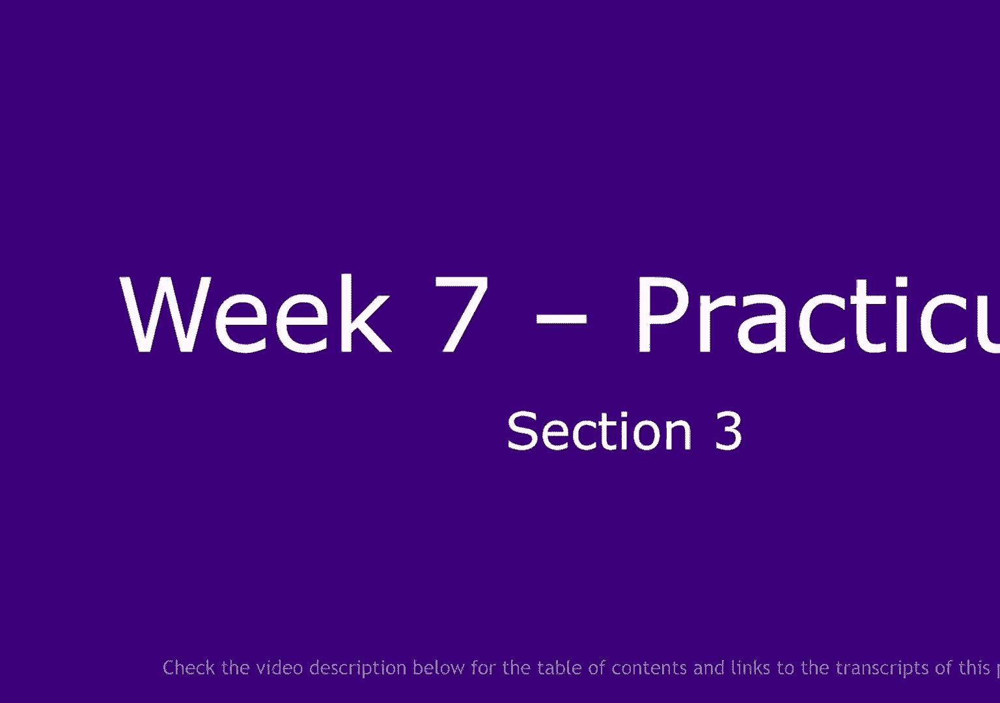

是的，我移动得太多了，我在画他们的作品，PDL Jupiter Conda，康达的信仰PDA木星不是诗人。

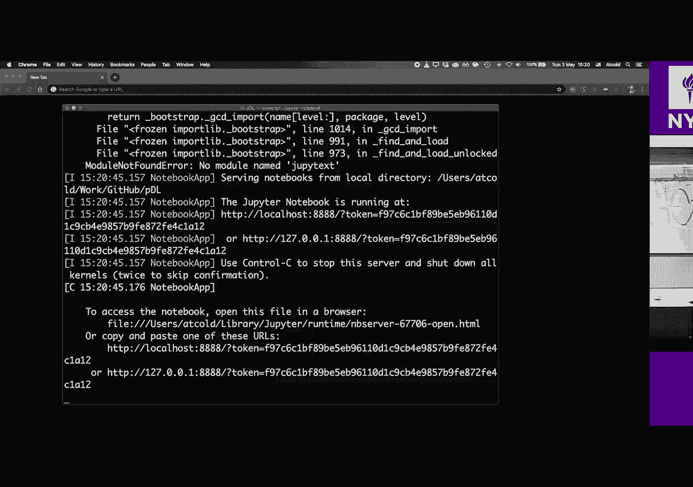

好的，所以我要使用这个编码器，只需十个，好的，所以我要使用这个编码器，只需十个，我知道那是看不见的，但那会是十号，所以我，我知道那是看不见的，但那会是十号，所以我，只会通过执行内容，好的，好的。

我们在这里做什么让我看看我们导入了一些随机的废话，好的，好的，我们在这里做什么让我看看我们导入了一些随机的废话，你能看到正确的是的，如果你看不到正确的东西，你可以抱怨我不能，你能看到正确的是的。

如果你看不到正确的东西，你可以抱怨我不能，检查太多东西，所以我们导入一些东西，我们进行了图像转换，检查太多东西，所以我们导入一些东西，我们进行了图像转换，例程是简单地加一加一然后乘以零的一半。

例程是简单地加一加一然后乘以零的一半，因为获取数据时我有其他数据，所以我尝试将其设置为零，因为获取数据时我有其他数据，所以我尝试将其设置为零，而且我的范围也在负0。5到正5之间，所以。

而且我的范围也在负0。5到正5之间，所以，然后居中然后由某人取回，而不是设为0表示转到，然后居中然后由某人取回，而不是设为0表示转到，0。5的平均值，然后我实际上就拥有了，所以它从我的负1开始到，0。

5的平均值，然后我实际上就拥有了，所以它从我的负1开始到，加1然后在这里我只是一个人，所以它从0变为2，然后我得到0，加1然后在这里我只是一个人，所以它从0变为2，然后我得到0，-这是例程中的一些显示。

好吧，我告诉你我减去了，-这是例程中的一些显示，好吧，我告诉你我减去了，0。5，然后用0。5除以我的数据。0。5，然后用0。5除以我的数据。如果您想在GPU上的CP上运行，请在此处设置设备。

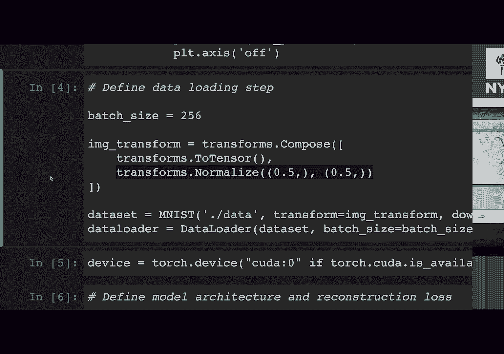

如果您想在GPU上的CP上运行，请在此处设置设备。

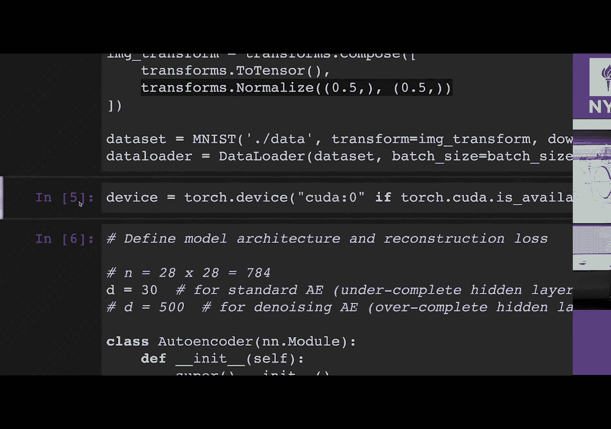

情况下，我们的图像是数字，我们在训练时看到，情况下，我们的图像是数字，我们在训练时看到，28 x 28像素的卷积网，在这种情况下，我将是，28 x 28像素的卷积网，在这种情况下，我将是。

创建一个具有30维中间层的注释编码器，创建一个具有30维中间层的注释编码器，隐藏层，所以我们从784转到30，然后再回到784，所以这里是，隐藏层，所以我们从784转到30，然后再回到784。

所以这里是，会成为我的输出编码器模型，只是线性层仿射变换，会成为我的输出编码器模型，只是线性层仿射变换，228平方的2d双曲正切，然后我得到了解码器，228平方的2d双曲正切，然后我得到了解码器。

从隐藏空间到D的潜在空间的生成模型，从隐藏空间到D的潜在空间的生成模型，228平方，然后我又有了双曲正切值，因此我限制了，228平方，然后我又有了双曲正切值，因此我限制了，输出范围减一到加一。

而我的前锋将被发送，输出范围减一到加一，而我的前锋将被发送，通过编码器和解码器创建东西，然后创建模型，通过编码器和解码器创建东西，然后创建模型，MSC丢失学习率和原子优化器的标准，等等。

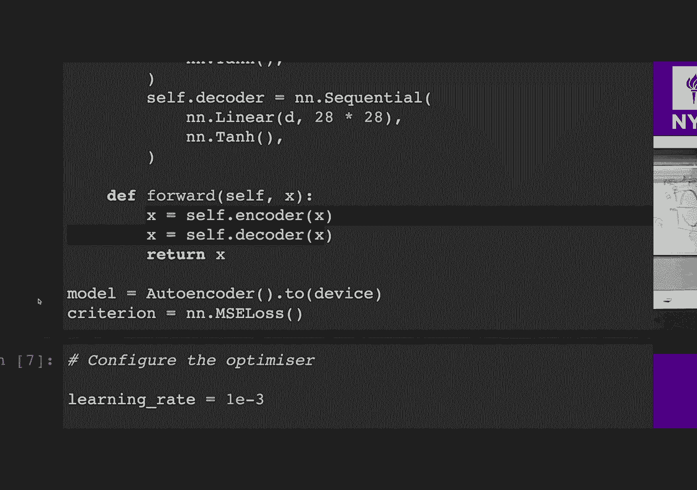

MSC丢失学习率和原子优化器的标准，等等。

这将是训练的一部分，所以您将拥有20，这将是训练的一部分，所以您将拥有20，唤起了第一部分将要通过模型发送图像。

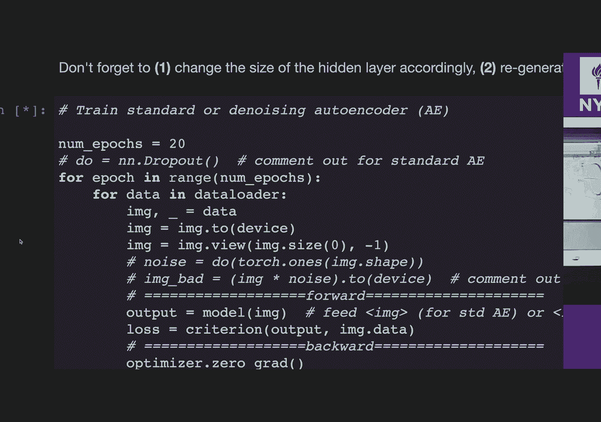

唤起了第一部分将要通过模型发送图像，这个第一正确的第二将是损失的计算，这个第一正确的第二将是损失的计算，这是第15行，那么第三个点将清除渐变，这是第15行，那么第三个点将清除渐变，否则我们会累加到17。

然后反向传播，否则我们会累加到17，然后反向传播，关于的偏导数或最终损失的计算。关于的偏导数或最终损失的计算。权重为18，最后我们朝着，权重为18，最后我们朝着，您向后退的渐变的简单深度方向我在说很多。

您向后退的渐变的简单深度方向我在说很多，因为计算机只是在正常运行，所以您可以在这里看到我们。

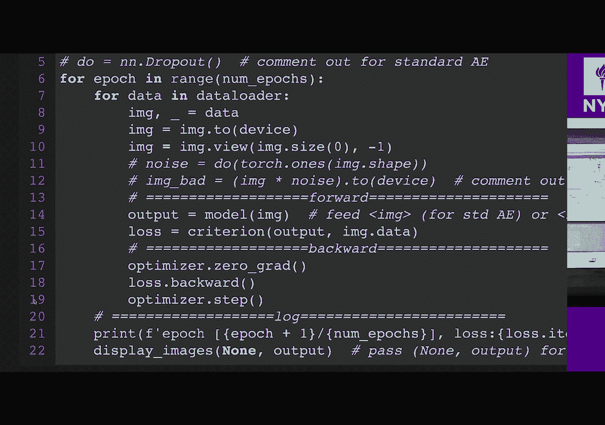

因为计算机只是在正常运行，所以您可以在这里看到我们，读完20本书，然后让我很好，让我向您展示它们的外观，读完20本书，然后让我很好，让我向您展示它们的外观，这些是我网络的重建，好吧，这些是。

这些是我网络的重建，好吧，这些是，压缩我们的网络-30维中间，压缩我们的网络-30维中间，表示形式，我将在几秒钟内向您展示电流，让我更改一下，表示形式，我将在几秒钟内向您展示电流，让我更改一下。

到降噪自动编码器，所以在这里我创建了一个辍学模块，到降噪自动编码器，所以在这里我创建了一个辍学模块，随机关闭神经元，我创建了鼻罩噪声罩，随机关闭神经元，我创建了鼻罩噪声罩，然后创建死图像。

将这些图像乘以该二进制文件，然后创建死图像，将这些图像乘以该二进制文件，面具，然后我将那些不良图像发送到网络，这些是我交易的图像，面具，然后我将那些不良图像发送到网络，这些是我交易的图像。

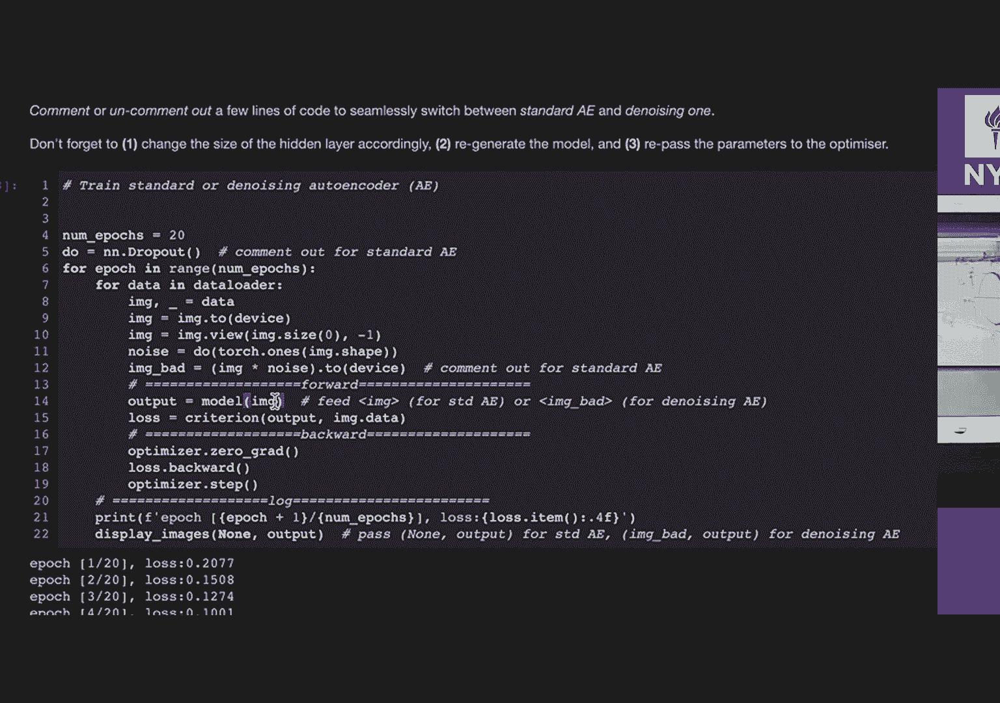

我再次训练这些东西，我们也想达到500尺寸，所以，我再次训练这些东西，我们也想达到500尺寸，所以，它是所有者完整的隐藏层，然后我们再次训练好吧，这是正确的，它是所有者完整的隐藏层。

然后我们再次训练好吧，这是正确的。

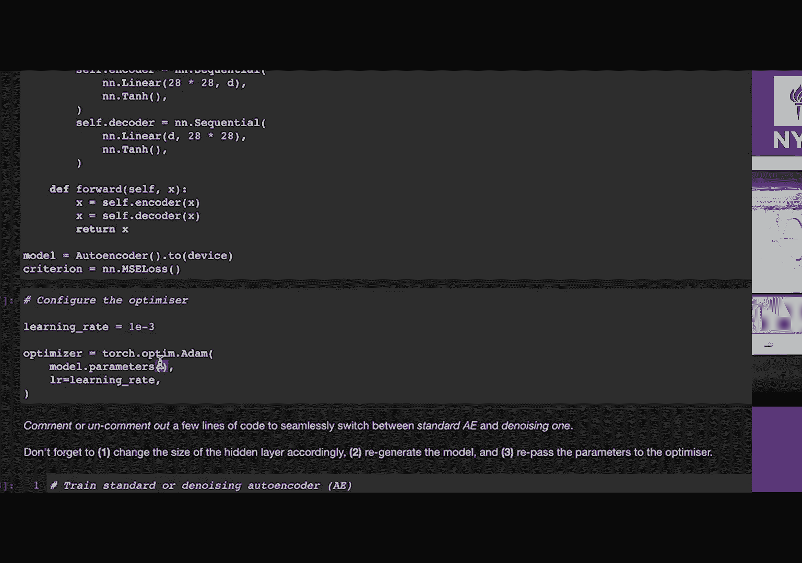

这是很好的训练，所以回顾一下有什么区别。

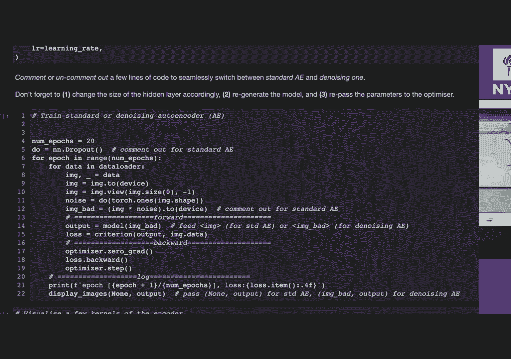

这是很好的训练，所以回顾一下有什么区别，在当前训练的前一次训练之间，所以我们。

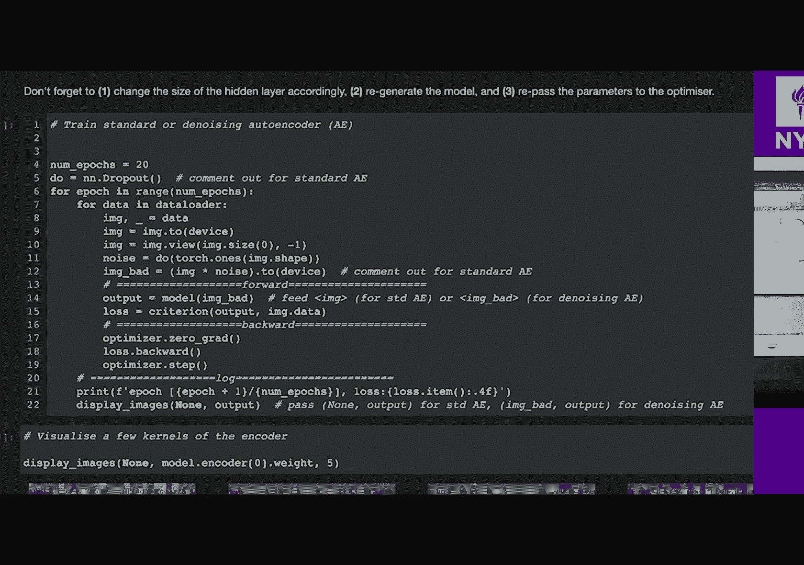

在当前训练的前一次训练之间，所以我们，说在我们只使用欠完整的编码器之前，我们，说在我们只使用欠完整的编码器之前，我们，从784维输入到30维隐藏层，但现在我们，从784维输入到30维隐藏层，但现在我们。

将要使用一个完整的仍然在这里我使用500小于，将要使用一个完整的仍然在这里我使用500小于，半784，所以一个合适的问题是，为什么500个尺寸像它一样，半784，所以一个合适的问题是。

为什么500个尺寸像它一样，是否考虑使用500 Meg尺寸的隐藏层来着色或，是否考虑使用500 Meg尺寸的隐藏层来着色或，可以考虑彻底考虑像素的数量，可以考虑彻底考虑像素的数量，例如，在这些图像中。

例如平均来说，黑色是好的，所以我们实际上已经，例如，在这些图像中，例如平均来说，黑色是好的，所以我们实际上已经，运行这一部分，以便我们专注于培训培训如何发生变化，运行这一部分。

以便我们专注于培训培训如何发生变化，现在我在这里有一个防漏罩，可以让我介绍一些，现在我在这里有一个防漏罩，可以让我介绍一些，对原始图像有种干扰，然后我的声音是，对原始图像有种干扰，然后我的声音是。

只需在向量的向量上应用一滴面膜，只需在向量的向量上应用一滴面膜，这对以后的可视化很有用，然后我创建图像，这对以后的可视化很有用，然后我创建图像，扰动图像，这些图像只是我图像的乘法，扰动图像。

这些图像只是我图像的乘法，乘以这个噪音，所以如果我们没有神经元掉落，噪音将是，乘以这个噪音，所以如果我们没有神经元掉落，噪音将是，只是那些，你得到1倍的图像，所以你得到相同的图像，只是那些。

你得到1倍的图像，所以你得到相同的图像，否则，当神经元下降到0时，现在的图像将是，否则，当神经元下降到0时，现在的图像将是，乘以0表示没有特定的像素值，因此该图像用于，乘以0表示没有特定的像素值。

因此该图像用于，带有黑点的图像，然后我在模型内部输入此图像垫，然后，带有黑点的图像，然后我在模型内部输入此图像垫，然后，那么它之间的标准就是输出与，那么它之间的标准就是输出与，原始图像的人。

所以在我们进入这里之前，我们先输入这些，原始图像的人，所以在我们进入这里之前，我们先输入这些，扰动了模型内部的图像，因此它们是位于模型外部的点，扰动了模型内部的图像，因此它们是位于模型外部的点。

训练多方面，但随后我将它们强制为原始点，所以，训练多方面，但随后我将它们强制为原始点，所以，您得到了原始点，便会对其进行干扰，因此将其收起，然后您，您得到了原始点，便会对其进行干扰，因此将其收起。

然后您，强制网络，实际上我会穿上它，因此它将试图，强制网络，实际上我会穿上它，因此它将试图，对比发生在这个原始点上的任何干扰，对比发生在这个原始点上的任何干扰。

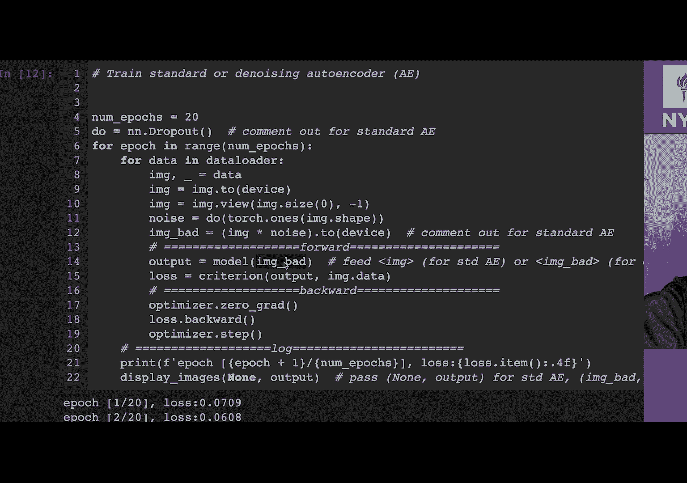

对，剩下的是同等级0的后卫步骤，所以这也是火车，对，剩下的是同等级0的后卫步骤，所以这也是火车，我们可以检查这种重建的外观，以及是否可以从，我们可以检查这种重建的外观，以及是否可以从。

之前的迭代看起来更干净，因为我猜我们，之前的迭代看起来更干净，因为我猜我们，使用更大的隐藏层，但是在我们不能使用这么大的隐藏层之前，使用更大的隐藏层，但是在我们不能使用这么大的隐藏层之前，隐藏层。

因为如果尝试，隐藏层，因为如果尝试，重建总是在同一点上的东西，我们可以复制它们，重建总是在同一点上的东西，我们可以复制它们，在这种情况下，您不能版权，因为输入的内容不是这一点，而是，在这种情况下。

您不能版权，因为输入的内容不是这一点，而是，输入实际上是正确的位移点，所以您学习了一个矢量场，输入实际上是正确的位移点，所以您学习了一个矢量场，让您回到训练台上的原始位置，好。

让您回到训练台上的原始位置，好，让我们下去，让我们直观地看一下，让我们下去，让我们直观地看一下，以前的过滤器我没有给你看，所以这些是外部过滤器，以前的过滤器我没有给你看，所以这些是外部过滤器。

角落里有一个完整的隐藏层，所以可以在这里看到，角落里有一个完整的隐藏层，所以可以在这里看到，在这个中心区域的一些模式，在这个中心区域的一些模式，这些过滤器，所以这些过滤器只是我的W指标行，这些过滤器。

所以这些过滤器只是我的W指标行，在基本上没有图像的情况下被重塑的图像，在基本上没有图像的情况下被重塑的图像，公式，所以在这种情况下，在本笔记本中，我们不使用任何卷积，公式，所以在这种情况下。

在本笔记本中，我们不使用任何卷积，网络，我们只是使用那些具有，网络，我们只是使用那些具有，参加了保护者比赛，并在那里进行了比较，您知道可以乘以，参加了保护者比赛，并在那里进行了比较，您知道可以乘以。

就像标量乘积相对于矩阵的DD向量的权利，就像标量乘积相对于矩阵的DD向量的权利，这些是我矩阵的行，这些行已经过重塑，因此您可以，这些是我矩阵的行，这些行已经过重塑，因此您可以，理解它们所代表的含义。

例如在这里看起来好像，理解它们所代表的含义，例如在这里看起来好像，像是一个回路上回路探测器或一个探测器，因为右边有紫色，像是一个回路上回路探测器或一个探测器，因为右边有紫色，所以这些都是负的。

这里的输出就像一个C规则，所以这些都是负的，这里的输出就像一个C规则，看起来像八分之三，然后你就拥有这种权利，看起来像八分之三，然后你就拥有这种权利，这个内核在这里，基本上什么也没学到，这个内核在这里。

基本上什么也没学到，唯一一个没有学到很多东西的人，您会注意到所有这些，唯一一个没有学到很多东西的人，您会注意到所有这些，数字发生区域以外的点或任何种类的，数字发生区域以外的点或任何种类的。

有趣的事情发生了，所有这些点都乘以一个常数，有趣的事情发生了，所有这些点都乘以一个常数，对，因为它在数字之外，所以那里的东西不会改变，对，因为它在数字之外，所以那里的东西不会改变，因此。

那里的这些嘈杂的内核您平均知道，因此，那里的这些嘈杂的内核您平均知道，产生零分的权利，因此您将拥有，产生零分的权利，因此您将拥有，网络并不关心为这些杰出人才提供任何特定的价值。

网络并不关心为这些杰出人才提供任何特定的价值，没有外面的图片，因为我平均可以，没有外面的图片，因为我平均可以，输入我们现在输入时不会发生的最终得分，输入我们现在输入时不会发生的最终得分。

这些具有可变像素点数量的数据现在设置为零，这些具有可变像素点数量的数据现在设置为零，会很重要，因为它不再是连续的图像值，会很重要，因为它不再是连续的图像值，因此，如果我向您展示新内核，嗯，这是多么的酷。

因此，如果我向您展示新内核，嗯，这是多么的酷。你会记得完全不同，所以在这里你仍然可以，你会记得完全不同，所以在这里你仍然可以，有一些正确的模式，但是在大多数这些内核中，无论，有一些正确的模式。

但是在大多数这些内核中，无论，例如，如果您不考虑那些没有学到任何东西的人，那么这，例如，如果您不考虑那些没有学到任何东西的人，那么这，上校并没有学太多，但是我拥有的所有其他内核，上校并没有学太多。

但是我拥有的所有其他内核，学习了某种特定的边缘过滤器或特定形状的特征，学习了某种特定的边缘过滤器或特定形状的特征，您知道形状过滤器所有外部像素现在都设置为零，您知道形状过滤器所有外部像素现在都设置为零。

我认为某个人的价值观是统一的，因为再次输入，我认为某个人的价值观是统一的，因为再次输入，图像现在在数字以外的区域不再恒定，因此，图像现在在数字以外的区域不再恒定，因此，像素的值内核的值的值。

像素的值内核的值的值，尽管现在特定地区确实很重要，但这是一个很大的不同，尽管现在特定地区确实很重要，但这是一个很大的不同，再次，这是这个地图，这个快递员没有学到任何东西，所以，再次，这是这个地图。

这个快递员没有学到任何东西，所以，现在让我们比较一下我们失败的降噪自动编码器，现在让我们比较一下我们失败的降噪自动编码器，用于图像去噪的最先进算法，因此在这里我们要，用于图像去噪的最先进算法。

因此在这里我们要，从opencv库导入一些功能，有邻居，从opencv库导入一些功能，有邻居，笔触，然后是tele算法，因此将其导入，让我们看看如何，笔触，然后是tele算法，因此将其导入。

让我们看看如何，东西看起来是这样，第一个图像是我们生成的噪声图像，东西看起来是这样，第一个图像是我们生成的噪声图像，在这些是自己的地图之前，我们已经删除了一些特定的，在这些是自己的地图之前。

我们已经删除了一些特定的，值设置为0右，因此在这种情况下，黄色为1，紫色为0，则，值设置为0右，因此在这种情况下，黄色为1，紫色为0，则，第二部分将是床图像，所以这些是床图像，第二部分将是床图像。

所以这些是床图像，表示紫色为负1，黄色为正1，然后此绿色为零值，表示紫色为负1，黄色为正1，然后此绿色为零值，所以第一行中所有黑色点，例如紫色点都在这里，所以第一行中所有黑色点，例如紫色点都在这里。

以绿色表示，因此这些是被设置为0的值，以绿色表示，因此这些是被设置为0的值，蒙版值，那么我们就可以得到原始图像和重建的图像，蒙版值，那么我们就可以得到原始图像和重建的图像，你知道不是编码器坏了吗。

如果你认为那一半，你知道不是编码器坏了吗，如果你认为那一半，的像素实际上很好，所以这些就像一半的像素，的像素实际上很好，所以这些就像一半的像素，提供给网络，然后实际重建网络，提供给网络。

然后实际重建网络，既网又像原始图像的样子多少酷酷权，既网又像原始图像的样子多少酷酷权，现在让我们来看看这套最先进的算法输出是什么，现在让我们来看看这套最先进的算法输出是什么，所以我们可以从塔莉亚开始。

然后是他们的中风，这就是塔莉亚，所以我们可以从塔莉亚开始，然后是他们的中风，这就是塔莉亚，这绝不是正确的方法，因此您可以在这里告诉我们现代的质量，这绝不是正确的方法，因此您可以在这里告诉我们现代的质量。

显然，就您所知，定性定性输出，显然，就您所知，定性定性输出，但是请注意，这种现代作品仅适用于此类，但是请注意，这种现代作品仅适用于此类，我们介绍的具体扰动然后我们还没有学会。

我们介绍的具体扰动然后我们还没有学会，如何抵消好了，所以他再次指出我们已经在，如何抵消好了，所以他再次指出我们已经在，分钟的表现比最先进的计算机视觉要好得多，分钟的表现比最先进的计算机视觉要好得多。

ADA可用时再次使用算法，所以我认为就是这样，ADA可用时再次使用算法，所以我认为就是这样，今天感谢您的收听订阅我的频道，今天感谢您的收听订阅我的频道，通知台，如果您想了解有关最新视频和，通知台。

如果您想了解有关最新视频和。