# 【NYU】纽约大学深度学习入门课程（with pytorch）中英文字幕 - P16：16.Week 9 – Lecture_ Group sparsity, world model, and generative adversarial net - 大佬的迷弟的粉丝 - BV1o5411p7AB

好的，我想我们可以开始了，这是第三部分，好的，我想我们可以开始了，这是第三部分，恩关于基于能量的模型的讲座恩，我们将继续，恩关于基于能量的模型的讲座恩，我们将继续，上次我们谈论的内容。

上次我们谈论的内容，关于稀疏编码，并简短地谈论gans，您会听到，关于稀疏编码，并简短地谈论gans，您会听到，明天从阿尔弗雷多（Alfredo）了解更多信息，然后再讨论。

明天从阿尔弗雷多（Alfredo）了解更多信息，然后再讨论，学习世界模型和类似的东西也可以，学习世界模型和类似的东西也可以，关于异国自我监督和无监督的一点，关于异国自我监督和无监督的一点。

那种您知道活跃的学习算法，那种您知道活跃的学习算法，目前正在研究主题，所以我上次谈论的一件事。

目前正在研究主题，所以我上次谈论的一件事，是稀疏的编码，我将仅提及，是稀疏的编码，我将仅提及。

非常简单的想法，其中包括，非常简单的想法，其中包括，结合稀疏编码或音频稀疏编码器，结合稀疏编码或音频稀疏编码器，经过歧视性训练，所以想像一下，经过歧视性训练，所以想像一下，我在这里向您展示的架构。

我在这里向您展示的架构，编码器，如果您将左边的第一个uh部分是uh，编码器，如果您将左边的第一个uh部分是uh，大部分类似于我在lista方法中讨论的编码器。

大部分类似于我在lista方法中讨论的编码器，因此，您从x变量开始，通过矩阵对其进行运行，因此，您从x变量开始，通过矩阵对其进行运行，然后通过非线性来运行，这可能是，然后通过非线性来运行，这可能是。

例子是这里，然后乘以结果，例子是这里，然后乘以结果，通过一些我们要学习的矩阵，通过一些我们要学习的矩阵，在此与编码输入的乘积，在此与编码输入的乘积，矩阵我们，然后将其传递给非线性，矩阵我们。

然后将其传递给非线性，您可以在这里多次重复这个小方块这个绿色方块，您可以在这里多次重复这个小方块这个绿色方块，这些基本上都是一个包含以下内容的层，这些基本上都是一个包含以下内容的层，矩阵或一堆卷积除了。

矩阵或一堆卷积除了，你知道一些预先存在的变量和非线性，你知道一些预先存在的变量和非线性，所以这是您知道的一种有趣的神经网络，所以这是您知道的一种有趣的神经网络，跳过连接，然后我们将对此进行培训。

跳过连接，然后我们将对此进行培训，神经网络来做三件事或三件事，神经网络来做三件事或三件事，不同的标准一个标准将是，不同的标准一个标准将是，嗯，只要重建x好，那么就会有一个解码矩阵，嗯，只要重建x好。

那么就会有一个解码矩阵，是要在输出上重现输入，而我们要这样做，是要在输出上重现输入，而我们要这样做，通过最小化平方误差，这就是，通过最小化平方误差，这就是，一次又一次地解码过滤器，这可能是卷积或。

一次又一次地解码过滤器，这可能是卷积或，取决于您喜欢的版本，而不是L1，取决于您喜欢的版本，而不是L1，特征向量上的准则，特征向量上的准则，使其稀疏，因此非常类似于稀疏的自动编码器，使其稀疏。

因此非常类似于稀疏的自动编码器，是我们上周讨论的那种类型，但后来，是我们上周讨论的那种类型，但后来，也将增加第三项，这第三项将是，也将增加第三项，这第三项将是，基本上是一个简单的线性分类器。

基本上是一个简单的线性分类器，尝试预测类别还可以，我们将，尝试预测类别还可以，我们将，训练系统以同时最小化所有三个条件，训练系统以同时最小化所有三个条件，所以这是一个稀疏的自动编码器。

它也试图找到能做得很好的代码，所以这是一个稀疏的自动编码器，它也试图找到能做得很好的代码，做预测工作，这是您可以的一种好方法，做预测工作，这是您可以的一种好方法。

您可以通过两种不同的方式查看此内容您可以将其查看为，您可以通过两种不同的方式查看此内容您可以将其查看为，倾向于产生良好标签的自动编码器，或者您可以看到，倾向于产生良好标签的自动编码器，或者您可以看到。

这是一个分类器多层分类器，这是一个分类器多层分类器，由自动编码器规范化的，由自动编码器规范化的，优点是通过强制系统查找，优点是通过强制系统查找，最后第二层的图示，最后第二层的图示，呃可以重建输入。

那么你基本上，呃可以重建输入，那么你基本上，使系统偏向于提取包含尽可能多的特征，使系统偏向于提取包含尽可能多的特征，有关输入的尽可能多的信息，这样的，如果需要，可以使功能更丰富，如果需要。

可以使功能更丰富，不会生成退化特征，而是生成包含尽可能多特征的特征，不会生成退化特征，而是生成包含尽可能多特征的特征，有关输入的尽可能多的信息，有关输入的尽可能多的信息，效果很好。

我认为这是一种未开发的方法，效果很好，我认为这是一种未开发的方法，训练神经网络，因为我们经常没有，训练神经网络，因为我们经常没有，足够的标签训练数据或何时，足够的标签训练数据或何时。

训练数据这样您就没有很多类别，训练数据这样您就没有很多类别，嗯，也许是两个或三个或十个经典问题，嗯，也许是两个或三个或十个经典问题，我们知道这往往会产生非常普通的退化特征。

我们知道这往往会产生非常普通的退化特征，在我们上次讨论的神经网络中，在我们上次讨论的神经网络中，然后迫使系统进行基本重建，然后迫使系统进行基本重建，告诉您您知道无法生成过于复杂的功能。

告诉您您知道无法生成过于复杂的功能，简并会产生某种形式的信息，您无法从中重构输入，简并会产生某种形式的信息，您无法从中重构输入，所以有点不错，您可以将其视为良好的正则化器，所以有点不错。

您可以将其视为良好的正则化器。

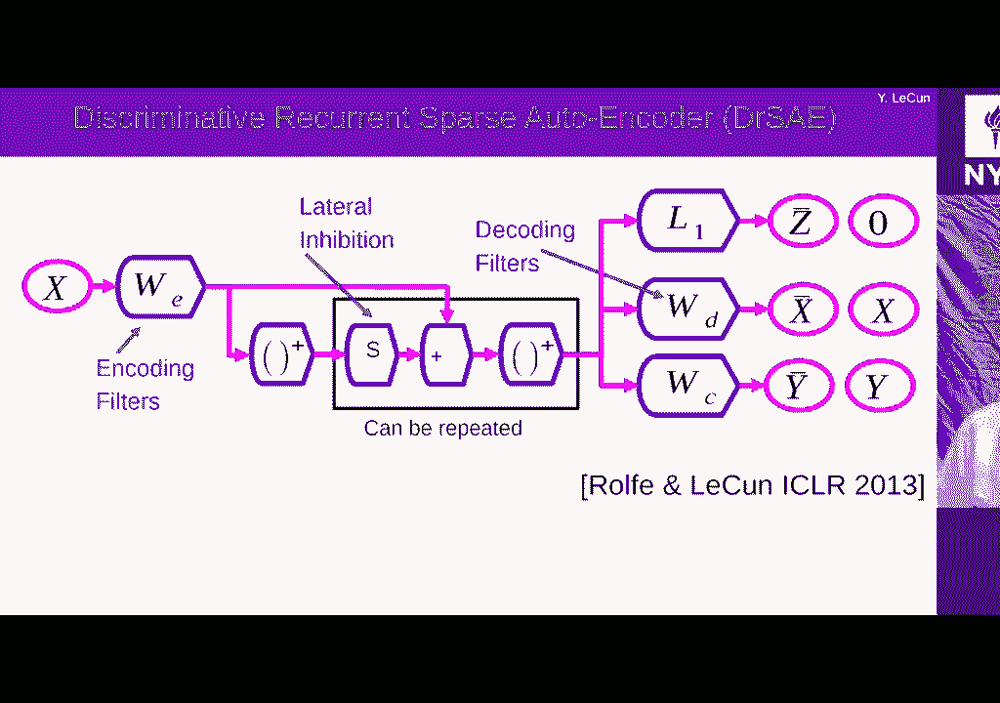

好的团队稀疏性和结构性稀疏性，所以有一些工作要做，好的团队稀疏性和结构性稀疏性，所以有一些工作要做，回溯到大约10年之前，实际上，这方面的第一项工作，回溯到大约10年之前，实际上，这方面的第一项工作。

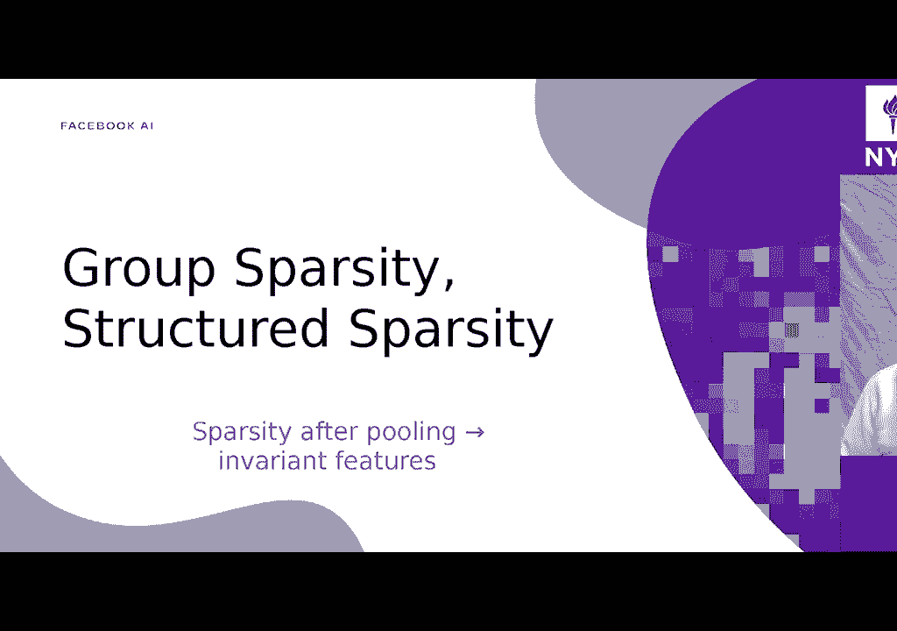

约有20岁的鹅欧芹的想法是什么，约有20岁的鹅欧芹的想法是什么，意思是，这里是这个主意，意思是，这里是这个主意，训练系统以生成香料功能，而不仅仅是，训练系统以生成香料功能，而不仅仅是。

通过一堆卷积和值提取的正常特征，通过一堆卷积和值提取的正常特征，但基本上会产生稀疏的局部特征，但基本上会产生稀疏的局部特征，池化之后好了，所以您基本上有一个系统，池化之后好了，所以您基本上有一个系统。

由卷积非线性和池化组成，由卷积非线性和池化组成，您尝试使这些功能稀疏，这个想法可以追溯到许多不同的工作，这个想法可以追溯到许多不同的工作，ivarian和hoyer在2001年ica独立组件的背景下。

ivarian和hoyer在2001年ica独立组件的背景下，分析，然后您知道其他一些，分析，然后您知道其他一些，osindero在杰夫·伊顿的小组中发表论文。

osindero在杰夫·伊顿的小组中发表论文，嗯，然后karai呃，当时我真的是我的学生，嗯，然后karai呃，当时我真的是我的学生，2000年代末与我合影的卡尔·格雷格。

2000年代末与我合影的卡尔·格雷格，法国的朱利亚纳·梅雷尔（giuliana merrell）和其他一群人，法国的朱利亚纳·梅雷尔（giuliana merrell）和其他一群人。

关于结构空间编码的想法，关于结构空间编码的想法，这个想法基本上是你需要的，所以其中一些型号只有，这个想法基本上是你需要的，所以其中一些型号只有，编码器，其中一些只有解码器，有些是自动的，编码器。

其中一些只有解码器，有些是自动的，编码器正确，所以左侧的编码器在气道中，编码器正确，所以左侧的编码器在气道中，模型是仅编码器模型julia alex模型是仅解码器模型。

模型是仅编码器模型julia alex模型是仅解码器模型，编舞者模型基本上是一个自动编码器，编舞者模型基本上是一个自动编码器，我们上次讨论的类型的自动编码器，我们上次讨论的类型的自动编码器，嗯。

这是怎么工作的，让我们说一个仅编码器的模型，嗯，这是怎么工作的，让我们说一个仅编码器的模型，您有一个包含卷积的特征提取器，或者，您有一个包含卷积的特征提取器，或者。

也许只是在图像补丁的补丁上完全连接了矩阵，也许只是在图像补丁的补丁上完全连接了矩阵，示例，然后强制输出，示例，然后强制输出，在非线性之后而不是强迫，在非线性之后而不是强迫，要稀疏的是。

您放置了一个牵引层，而您，要稀疏的是，您放置了一个牵引层，而您，强制拉稀，这适用于所有三个，强制拉稀，这适用于所有三个，那些，所以这是一个更具体的例子，那些，所以这是一个更具体的例子，这是正确的版本。

这是正确的版本，为他的博士学位，这是他有一个稀疏的自动编码器的地方，为他的博士学位，这是他有一个稀疏的自动编码器的地方，w eyi的编码函数ge可以在，w eyi的编码函数ge可以在。

这种情况基本上只有两层，这种情况基本上只有两层，呃，有一个非线性，你有一个解码器，在这种情况下是线性wd，呃，有一个非线性，你有一个解码器，在这种情况下是线性wd，乘以e来评估变量z和该代理。

乘以e来评估变量z和该代理，变量而不是去l1它基本上通过了l2，变量而不是去l1它基本上通过了l2，但是在组上是l2，所以您采用z的一组分量，但是在组上是l2，所以您采用z的一组分量，您计算的是2范数。

而不是2范数的平方，您计算的是2范数，而不是2范数的平方，表示值之和的平方根，表示值之和的平方根，那些分量的正方形，那些分量的正方形，所以取每个分量计算平方，然后求和，所以取每个分量计算平方，然后求和。

这些平方的一组，然后计算该平方根，这些平方的一组，然后计算该平方根，这就是该组中的第二标准，这就是该组中的第二标准，然后针对多个组执行此操作，这些组可以重叠或，然后针对多个组执行此操作。

这些组可以重叠或，不重叠，您计算总和，这就是您的，不重叠，您计算总和，这就是您的，正则化器是您的稀疏性正则化器，那是什么，正则化器是您的稀疏性正则化器，那是什么，倾向于这样做基本上倾向于关闭最大组数。

倾向于这样做基本上倾向于关闭最大组数，好吧，系统基本上是稀疏的，所以它想要，好吧，系统基本上是稀疏的，所以它想要，一次但在一个组内的最小组数，一次但在一个组内的最小组数，因为这是一个组中的l2范数。

所以它不在乎有多少个单元，因为这是一个组中的l2范数，所以它不在乎有多少个单元，组内有这么多单位可以在组内，组内有这么多单位可以在组内，那么这是怎么做的，它基本上迫使系统，那么这是怎么做的。

它基本上迫使系统，分组以打开一个池功能，分组以打开一个池功能，同时正确，所以如果您有非常相似的功能，同时正确，所以如果您有非常相似的功能，具有额外的提取器，它们非常相似，过滤器与，具有额外的提取器。

它们非常相似，过滤器与，商业网，那么这些功能将倾向于，商业网，那么这些功能将倾向于，嗯，当您进行培训时，他们会尝试将自己分组，嗯，当您进行培训时，他们会尝试将自己分组，因为它们往往会一起被激活。

这是最小化的最佳方法，因为它们往往会一起被激活，这是最小化的最佳方法，一次激活的组数，一次激活的组数，为了得到那些有趣的，为了得到那些有趣的，图片在这里获得的方式是，图片在这里获得的方式是，这里的小组。

所以你在这里看，这里的小组，所以你在这里看，是不是我认为这是解码矩阵，所以这些是，是不是我认为这是解码矩阵，所以这些是，wd矩阵um的列，我们可以重建图像补丁，wd矩阵um的列，我们可以重建图像补丁。

从稀疏代码乘以那个矩阵，从稀疏代码乘以那个矩阵，但是我们要做的是将这些功能分组，但是我们要做的是将这些功能分组，分成36个块，因此我们将所有要素都安排在2d地图中，分成36个块。

因此我们将所有要素都安排在2d地图中，对图像的拓扑进行处理，我们可以选择所需的任何拓扑，对图像的拓扑进行处理，我们可以选择所需的任何拓扑，实际上，这实际上不是2D拓扑，而是toridol拓扑，实际上。

这实际上不是2D拓扑，而是toridol拓扑，因此左侧触摸顶部的右侧触摸底部，因此左侧触摸顶部的右侧触摸底部，因此它在拓扑上与金牛座相同，因此它在拓扑上与金牛座相同。

我们要做的是将一组36个要素重新组合到一个组中，我们要做的是将一组36个要素重新组合到一个组中，那些由36个特征组成的小组重叠了，那些由36个特征组成的小组重叠了，三列三行，所以我们有多组36个特征。

三列三行，所以我们有多组36个特征，六乘六移三，六乘六移三，作为一种推翻功能，但不提供空间，作为一种推翻功能，但不提供空间，因为这里没有空间这是一个免费的连接网络。

因为这里没有空间这是一个免费的连接网络，但它的味道有点像合并的味道，但它的味道有点像合并的味道，除了这里，您拉过36个功能，而您不拉开空间，除了这里，您拉过36个功能，而您不拉开空间，好吧，因此。

您可以计算出l2的总和，因此，您可以计算出l2的总和，每个组内功能的规范，每个组内功能的规范，这就是训练稀疏自动编码器时使用的正则化器，这就是训练稀疏自动编码器时使用的正则化器。

所以系统要做的是最小化任何，所以系统要做的是最小化任何，就像我之前所说的那样，就像我之前所说的那样，它重新组合了所有可能触发的相似功能，它重新组合了所有可能触发的相似功能，同时成组，因为组重叠。

同时成组，因为组重叠，创造出那些似乎在慢慢发展的功能集，创造出那些似乎在慢慢发展的功能集，绕点旋转，绕点旋转，因此，您由此获得的功能具有某种不变性，因此，您由此获得的功能具有某种不变性。

他们有一定的不变性，而不是转移，而是转向诸如，他们有一定的不变性，而不是转移，而是转向诸如，规模和类似的事情，无论系统决定如何，在这里，规模和类似的事情，无论系统决定如何，在这里。

选择2D拓扑的原因基本上只是您知道的，选择2D拓扑的原因基本上只是您知道的，它看起来很漂亮，但是你可以，它看起来很漂亮，但是你可以，选择您想要的x轴和，选择您想要的x轴和，在此图中的y轴是任意轴。

在此图中的y轴是任意轴，我有我什至不记得这里有多少功能，我有我什至不记得这里有多少功能，这可能是256个功能，我认为是16乘16。这可能是256个功能，我认为是16乘16。所以这里有256个隐藏的单位。

所以想像一个网络，所以这里有256个隐藏的单位，所以想像一个网络，12 x 12输入色块好输入图像是来自图像的色块，12 x 12输入色块好输入图像是来自图像的色块，和256 uh隐藏单元。

具有完全连接的完全连接，和256 uh隐藏单元，具有完全连接的完全连接，非线性，顶部还有另一层，非线性，顶部还有另一层，嗯，那就是编码器，然后你会，嗯，那就是编码器，然后你会，这组稀疏性。

然后解码器是线性的，这组稀疏性，然后解码器是线性的，好的，您在这里看到的是解码器的列，好的，您在这里看到的是解码器的列，并且它们以2D拓扑组织起来，但是它是任意的，并且它们以2D拓扑组织起来。

但是它是任意的，这些正方形中的每一个都是解码器的一列，这些正方形中的每一个都是解码器的一列，也对应于z分量的解码器的，也对应于z分量的解码器的，好吧，该要素是未来向量的组成部分，好吧。

该要素是未来向量的组成部分，因此，它们以16 x 16的矩阵进行组织，但这有点武断，因此，它们以16 x 16的矩阵进行组织，但这有点武断，只要您知道将它们放在矩阵中，然后我们。

只要您知道将它们放在矩阵中，然后我们，训练，因为他们参加了，训练，因为他们参加了，这种拓扑结构中的六乘六邻域，这种拓扑结构中的六乘六邻域，系统自然会学习类似的功能，系统自然会学习类似的功能。

在这个拓扑内附近可以，但是我可以选择，在这个拓扑内附近可以，但是我可以选择，任何类型的拓扑1d2d 3d甚至某些图形，任何类型的拓扑1d2d 3d甚至某些图形，只要是，只要是。

你知道图上的邻居之间会起作用，你知道图上的邻居之间会起作用，所以我在这里要做的就是重复这一点，所以我在这里要做的就是重复这一点，模式um可以显示某种形式，因为这是您知道的历史，模式um可以显示某种形式。

因为这是您知道的历史，嗯，告诉你你知道那些那些，嗯，告诉你你知道那些那些，这些模式是重复的，是周期性的，这些模式是重复的，是周期性的，以这种方式可视化的原因是，以这种方式可视化的原因是。

这是神经科学家戳戳时会观察到的东西，这是神经科学家戳戳时会观察到的东西，常见的初级视觉皮层中的电极，常见的初级视觉皮层中的电极，哺乳动物，但大多数具有良好视力的动物，哺乳动物。

但大多数具有良好视力的动物，他们看到附近有那种漩涡状的图案，他们看到附近有那种漩涡状的图案，神经元检测到相似的特征，这意味着它们是相似的定向边缘，神经元检测到相似的特征，这意味着它们是相似的定向边缘。

对定向的边缘和邻近区域敏感，对定向的边缘和邻近区域敏感，相似的神经元对相似的角度敏感，相似的神经元对相似的角度敏感，或类似比例的相同角度或，或类似比例的相同角度或，这样的事情，也许这就是你如何了解大脑。

这样的事情，也许这就是你如何了解大脑，组织它的神经元，组织它的神经元，基本上在，基本上在，复杂的单元格，相当于我们看到的牵引单元，复杂的单元格，相当于我们看到的牵引单元，这里，嗯，这是这里的另一个例子。

所以这个是，嗯，这是这里的另一个例子，所以这个是，呃不是在补丁程序级别，而是使用本地连接，呃不是在补丁程序级别，而是使用本地连接，但从某种意义上说它不是卷积的，因为它不使用呃共享的权重。

但从某种意义上说它不是卷积的，因为它不使用呃共享的权重，这样做的原因是让您知道一些半现实的，这样做的原因是让您知道一些半现实的，某种与生物学习的对应关系，某种与生物学习的对应关系。

您在哪里知道脑癌中的神经元，您在哪里知道脑癌中的神经元，不能正确分配权重，因为它们最终变得相似，因为，不能正确分配权重，因为它们最终变得相似，因为，您知道他们使用某种无监督的学习方法进行训练，但是。

您知道他们使用某种无监督的学习方法进行训练，但是，据我们所知，在大脑中没有共享的东西。

据我们所知，在大脑中没有共享的东西，所以有人问，如果你是一个类似的类似策略。

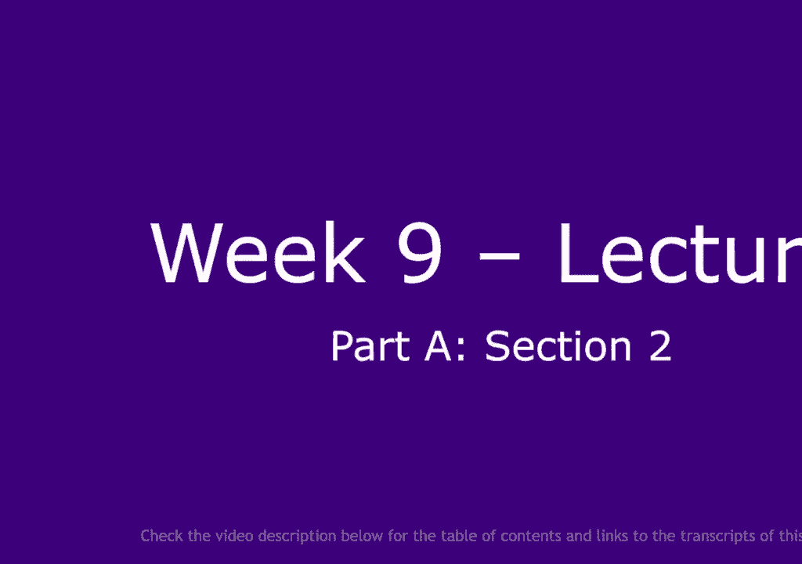

所以有人问，如果你是一个类似的类似策略，使用分类器和常规训练自动编码器，使用分类器和常规训练自动编码器，正则化可以应用于编码器的变体，正则化可以应用于编码器的变体，是否已经研究过是否可行。

是否已经研究过是否可行，对于第一张幻灯片，您可以看到，嗯，基本上，对于第一张幻灯片，您可以看到，嗯，基本上，在变体式自动编码器中添加噪声，并且，在变体式自动编码器中添加噪声，并且。

强迫稀疏基本上是两种方法，强迫稀疏基本上是两种方法，达到相同的目的，即降低容量，达到相同的目的，即降低容量，图例变量的减少代码的容量，图例变量的减少代码的容量，由自动编码器提取的，这是阻止系统。

由自动编码器提取的，这是阻止系统，运行琐碎的身份功能，这将无用，运行琐碎的身份功能，这将无用，正确的，以及我们最近几次谈论的内容，正确的，以及我们最近几次谈论的内容，是事实，如果您减少信息容量，是事实。

如果您减少信息容量，你的代码的潜在变量，你的代码的潜在变量，因此，您还可以最大程度地减少，因此，您还可以最大程度地减少，可以消耗低能量的空间还可以，因为您限制了，可以消耗低能量的空间还可以。

因为您限制了，代码的配置，因此您，代码的配置，因此您，可以限制可以消耗低能量的空间，可以限制可以消耗低能量的空间，所以本质上讲，用l1或稀疏性进行正则化的想法，所以本质上讲。

用l1或稀疏性进行正则化的想法，这样的事情或在代码中增加噪音，这样的事情或在代码中增加噪音，限制代码规范可以达到以下目的：限制代码规范可以达到以下目的：为了限制音量而限制代码的容量。

为了限制音量而限制代码的容量，可能消耗低能量的空间，因此如果您训练零件，可能消耗低能量的空间，因此如果您训练零件，通过最小化重构误差来降低空间能量，通过最小化重构误差来降低空间能量，在您的训练样本上。

剩下的空间会自动变大，在您的训练样本上，剩下的空间会自动变大，能量，因为容量，能量，因为容量，肯塔基州的能量有限，所以这只是回顾一下，肯塔基州的能量有限，所以这只是回顾一下，嗯。

我们在上个星期和几个星期前谈到，嗯，我们在上个星期和几个星期前谈到，这就是这种选择，这就是这种选择，因此，这些架构方法是，因此，这些架构方法是，对比方法，您可以显式提高，对比方法，您可以显式提高。

不良样本的能量，这意味着您必须提出一个，不良样本的能量，这意味着您必须提出一个，好主意，您知道生成不良样本的好方法，好主意，您知道生成不良样本的好方法，那样的话好吧，再记得那两个，那样的话好吧。

再记得那两个，方法类型收缩方法会降低训练的能量，方法类型收缩方法会降低训练的能量，样本可以通过破坏，样本可以通过破坏，原始样本或通过做梯度干扰，原始样本或通过做梯度干扰，梯度下降。

你知道对比度发散这样的事情，梯度下降，你知道对比度发散这样的事情，或通过某种方式生成对比点um，或通过某种方式生成对比点um，我们已经看到了许多不同的对比方法，然后，我们已经看到了许多不同的对比方法。

然后，另一种方法是限制代码的容量，另一种方法是限制代码的容量，或限制某种物质的体积，这些物质可以消耗较低的能量，或限制某种物质的体积，这些物质可以消耗较低的能量，自动编码器或预测变量的上下文，这意味着。

自动编码器或预测变量的上下文，这意味着，限制代码的容量，并且有很多方法可以做到这一点，限制代码的容量，并且有很多方法可以做到这一点，一种方法是通过稀疏性一种方法是通过添加噪声。

一种方法是通过稀疏性一种方法是通过添加噪声，限制东方的规范，我们还有其他方法，限制东方的规范，我们还有其他方法，每当您在谈论小组之前，我们都会在稍后讨论，每当您在谈论小组之前，我们都会在稍后讨论。

稀疏性，您只汇总了一些样本，稀疏性，您只汇总了一些样本，像一些小范围的索引是什么，像一些小范围的索引是什么，那个pj也许我不是ej是一个团体它是一个游泳池。

那个pj也许我不是ej是一个团体它是一个游泳池，所以想像这是一个游泳池，所以想像这是一个游泳池，卷积网，但池而不是，卷积网，但池而不是，放置在空间上方也会覆盖功能，放置在空间上方也会覆盖功能。

完全连接的网络就可以了，完全连接的网络就可以了，只是功能的组件好，所以ppj就像一组索引pj是一个，只是功能的组件好，所以ppj就像一组索引pj是一个，z的分量的z的uh索引的子集。

z的分量的z的uh索引的子集，是的，谢谢，所以这里是六人一组，是的，谢谢，所以这里是六人一组，恰好是该拓扑中邻居的z的分量，恰好是该拓扑中邻居的z的分量，那就是一个p，下一个p是，那就是一个p。

下一个p是，相似的六乘六平方乘以三个像素，相似的六乘六平方乘以三个像素，到顶部或左侧或底部的左侧，好吧，好吧，底部好吧，谢谢，到顶部或左侧或底部的左侧，好吧，好吧，底部好吧，谢谢。

两组之间的重叠是什么样的，两组之间的重叠是什么样的，如果可以的话，表示此拓扑，如果可以的话，表示此拓扑，好的，因此，在此实验中，您知道与我们刚才的实验非常相似，因此，在此实验中。

您知道与我们刚才的实验非常相似，谈到，除了这里，我们有本地联系，谈到，除了这里，我们有本地联系，所以我们有一个输入这是一个二维输入，所以我们有一个输入这是一个二维输入，仅代表它的一维版本。

而且我们在一个位置上有多个单位，而且我们在一个位置上有多个单位，呃，看着输入的一部分，就是输入上的本地补丁，呃，看着输入的一部分，就是输入上的本地补丁，然后这些单元组中的那些是。

然后这些单元组中的那些是，那种你知道很多次复制过，但是，那种你知道很多次复制过，但是，没有共享的权重，所以单位，没有共享的权重，所以单位，这些单位在输入上无处不在，但它们的权重却不。

这些单位在输入上无处不在，但它们的权重却不，共享好，他们只是本地连接，共享好，他们只是本地连接，所以我想我不太了解，所以我想我不太了解，um的特征池的总体概念，我的意思是如果我考虑一下。

um的特征池的总体概念，我的意思是如果我考虑一下，我们在卷积中使用的像池这样的术语，我们在卷积中使用的像池这样的术语，网络比它直接但，网络比它直接但，我不太了解我们如何使用功能池。

我不太了解我们如何使用功能池，让我让我画一幅画，也许会很清楚，所以，让我让我画一幅画，也许会很清楚，所以，您可以从输入向量开始乘以，您可以从输入向量开始乘以，矩阵或通过某种形式传递通过。

矩阵或通过某种形式传递通过，可能具有值以及内部任何或多个矩阵的编码器权限，可能具有值以及内部任何或多个矩阵的编码器权限，好吧，也许是多层，你得到了未来的载体，好吧，也许是多层，你得到了未来的载体，好吧。

让我们称它为z，而现在，您要做的是，好吧，让我们称它为z，而现在，您要做的是，本质上是这样，在这种情况下，您将其分为几组，本质上是这样，在这种情况下，您将其分为几组，不重叠，您可以计算，不重叠。

您可以计算，在这些组之一中，计算平方根，在这些组之一中，计算平方根，我属于这些池的那些zi的平方和的总和，我属于这些池的那些zi的平方和的总和，好吧，它被称为p，因为它是一个游泳池，好了。

您可以对所有组执行此操作，好吧，它被称为p，因为它是一个游泳池，好了，您可以对所有组执行此操作，对，所以您在这里得到的输出在这里，对，所以您在这里得到的输出在这里，看起来非常像推子层的输出。

看起来非常像推子层的输出，在转换中，这不是常规的网络，好吧，在转换中，这不是常规的网络，好吧，此处已连接网络，但结果相同，此处已连接网络，但结果相同，在我刚刚展示的示例中，这就是您的正则化器。

在我刚刚展示的示例中，这就是您的正则化器，你拿z，这就是你发送到的，你拿z，这就是你发送到的，我的解码器矩阵可以重建输入，所以这是y这是y，我的解码器矩阵可以重建输入，所以这是y这是y，条是对，条是对。

重建，这把这个合并的层放在这里是，重建，这把这个合并的层放在这里是，仅用于计算正则化器，不是，仅用于计算正则化器，不是，实际上是用来重建的，实际上是用来重建的，直接从稀疏代码，但它看起来非常像。

直接从稀疏代码，但它看起来非常像，现在拉层，如果这是呃，如果这是一个卷积网，现在拉层，如果这是呃，如果这是一个卷积网，然后是那个尺寸或功能，然后是那个尺寸或功能，将是功能，但您将有多个，将是功能。

但您将有多个，要素地图好，所以我代表该要素，要素地图好，所以我代表该要素，垂直尺寸，则编码器将做多个，垂直尺寸，则编码器将做多个，卷积，并且还会生成多个特征图，也许更大，卷积，并且还会生成多个特征图。

也许更大，数，然后我们将在这里进行拉动，然后我们将在这里进行拉动，是布丁，所以每个，拉动后，我们将在空间以及，拉动后，我们将在空间以及，覆盖特征并计算总和的平方根，覆盖特征并计算总和的平方根。

那里的正方形，这在拉动输出中给了我们一个输出，那里的正方形，这在拉动输出中给了我们一个输出，然后我们有多组这样的功能，然后我们有多组这样的功能，不同的拉力，所以无论是否，不同的拉力，所以无论是否。

这是卷积的还是不是卷积的，你会停下来，这是卷积的还是不是卷积的，你会停下来，空间和要素类型，但嗯，空间和要素类型，但嗯，如果您不进行卷积，则只需覆盖特征，就可以知道，如果您不进行卷积，则只需覆盖特征。

就可以知道，建立不变量，无论它是什么，建立不变量，无论它是什么，公民认为嗯，认为有道理，公民认为嗯，认为有道理，清楚地回答了你的问题吗，清楚地回答了你的问题吗，是的，我想这很清楚，谢谢，是的。

我想这很清楚，谢谢，嗯，当您拆分z时，我有一个问题要问，嗯，当您拆分z时，我有一个问题要问，分成几组，然后冷却，这些组会重叠吗，分成几组，然后冷却，这些组会重叠吗，对，所以在我在这里展示的示例中。

它们并不重叠，但是您可以，对，所以在我在这里展示的示例中，它们并不重叠，但是您可以，他们重叠好，所以我们说，他们重叠好，所以我们说，特征向量z，我可以在这里带一个游泳池，在这里带一个游泳池。

这里和这里带一个游泳池，这些团体，我可以在这里带一个游泳池，在这里带一个游泳池，这里和这里带一个游泳池，这些团体，重叠，如果我这样做，我做小组稀疏，这些，重叠，如果我这样做，我做小组稀疏，这些。

其他群体将要发生的是我要，其他群体将要发生的是我要，在这里具有一系列不断变化的功能，在这里具有一系列不断变化的功能，从一端到另一端，因为系统将要，从一端到另一端，因为系统将要，在相似的池特征中分组。

因此，在相似的池特征中分组，因此，重叠部分会不断变化，重叠部分会不断变化，它们，以便它们现在在矢量上缓慢变化，它们，以便它们现在在矢量上缓慢变化，在我在幻灯片中展示的图片中，而不是组织。

在我在幻灯片中展示的图片中，而不是组织，在1d拓扑中的z功能在2d拓扑中进行了组织，在1d拓扑中的z功能在2d拓扑中进行了组织，然后我将群组设为2维，所以我选择了，然后我将群组设为2维，所以我选择了。

六乘六方块呃，这是一组，然后下一组将是另一组，六乘六方块呃，这是一组，然后下一组将是另一组，六乘六挡，有一些重叠，然后是下一组，六乘六挡，有一些重叠，然后是下一组，还会再乘以六乘六挡。

还会再乘以六乘六挡，也许我有另一个，因为我有一个torito，也许我有另一个，因为我有一个torito，使这些人和这些人正常的拓扑，使这些人和这些人正常的拓扑，然后你知道类似的事情。

然后你知道类似的事情，你知道滑倒等等，所以基本上，你知道滑倒等等，所以基本上，是那些六乘六的窗口，它们被三移并重叠，是那些六乘六的窗口，它们被三移并重叠，所以这就是你得到那种不断变化的呃。

所以这就是你得到那种不断变化的呃，沿尺寸特征，沿尺寸特征，我可以同时拥有两个维度，我可以同时拥有两个维度，您选择将其组织成3d拓扑，您选择将其组织成3d拓扑，或进入某种树，所以ii取z的所有分量。

或进入某种树，所以ii取z的所有分量，我用某种图表来组织它们，我用某种图表来组织它们，也许是一棵树，所以这叫做结构性结构稀疏性，所以这叫做结构性结构稀疏性，取决于你怎么做，我猜，然后小组将是这样的事情。

取决于你怎么做，我猜，然后小组将是这样的事情，嗯，这将是一个小组，嗯，这将是一个小组，那么也许这也是一个团体，那么也许这也是一个团体，嗯，我可以组织一个小组，嗯，我可以组织一个小组，像这样的俄罗斯娃娃。

呃，将会发生什么，像这样的俄罗斯娃娃，呃，将会发生什么，那些在许多组中的单位组成的组往往会非常稀疏，那些在许多组中的单位组成的组往往会非常稀疏，而分组中的几组中的单元将趋向于。

而分组中的几组中的单元将趋向于，少一些，所以如果你做某事的话，少一些，所以如果你做某事的话，像这样一棵树，这里发生的是，像这样一棵树，这里发生的是，中心的特征往往并不稀疏，中心的特征往往并不稀疏。

真正可以检测到的东西，真正可以检测到的东西，非常通用的功能，然后在树的第一层，非常通用的功能，然后在树的第一层，他们会有点稀疏，所以他们会有点，他们会有点稀疏，所以他们会有点。

光滑的边缘提取器或类似的东西，光滑的边缘提取器或类似的东西，然后你越进入树内越多，然后你越进入树内越多，每个功能都进入大量池，每个功能都进入大量池，因此他们会变得越来越稀疏，所以最终他们被。

因此他们会变得越来越稀疏，所以最终他们被，稀疏，这意味着他们最终变得更具选择性，稀疏，这意味着他们最终变得更具选择性，对于特定功能，会发生什么，对于特定功能，会发生什么，当您显示图像时。

它倾向于偏向激活沿呃的功能，当您显示图像时，它倾向于偏向激活沿呃的功能，那棵树上一个特定的分支，因为那是最好的方法，那棵树上一个特定的分支，因为那是最好的方法，尽量减少一次使用的池的数量，以便。

尽量减少一次使用的池的数量，以便，称为结构稀疏，嗯，关于这个，有很多论文，嗯，关于这个，有很多论文，茱莉亚·梅瑞尔，所以这回去，茱莉亚·梅瑞尔，所以这回去，大约十年前。

我的意思是他们与人合着了该资深作者是弗朗西斯，我的意思是他们与人合着了该资深作者是弗朗西斯，我真的把参考放在一张幻灯片中，我真的把参考放在一张幻灯片中，我的小组也有一篇论文。

作者是亚瑟·施拉姆（arthur schlamm），我的小组也有一篇论文，作者是亚瑟·施拉姆（arthur schlamm），一分钟后我会去哪儿你能解释为什么分组，一分钟后我会去哪儿你能解释为什么分组。

正则化实际上有助于很好地将相似的特征分组，正则化实际上有助于很好地将相似的特征分组，这是一个很好的问题，呃首先对您有帮助，这是一个很好的问题，呃首先对您有帮助，嗯，答案还不清楚，所以这些实验已经完成了。

嗯，答案还不清楚，所以这些实验已经完成了，前一阵子才真正开始计算，前一阵子才真正开始计算，可用，并且数据是可用的，这确实可以完成工作，可用，并且数据是可用的，这确实可以完成工作，在很大程度上。

这通常被视为，在很大程度上，这通常被视为，对此感兴趣的人对两件事感兴趣，对此感兴趣的人对两件事感兴趣，对无监督跑步感兴趣，例如，对无监督跑步感兴趣，例如，图像恢复之类的事情耶利米正在做的事情。

图像恢复之类的事情耶利米正在做的事情，嗯，他们对无监督的明星都感兴趣，嗯，他们对无监督的明星都感兴趣，进行预训练，因为当时数据集非常小，进行预训练，因为当时数据集非常小，因为训练卷积网太小。

所以他们不得不，因为训练卷积网太小，所以他们不得不，是某种我感兴趣的预训练程序，所以，是某种我感兴趣的预训练程序，所以，这就是我们现在再次自我监督的动机，这就是我们现在再次自我监督的动机，garnie。

但其中许多方法尚未实现，garnie，但其中许多方法尚未实现，当数据集被删除时，他们倾向于很好地工作，当数据集被删除时，他们倾向于很好地工作，很小，所以他们倾向于改善，很小，所以他们倾向于改善。

呃的性能，如果您说一个合成网，呃的性能，如果您说一个合成网，使用一种方法对它进行了预训练，因此使用的方法与，使用一种方法对它进行了预训练，因此使用的方法与，呃，我早先展示过，所以有点像，呃。

我早先展示过，所以有点像，这但是卷积，所以使编码器和解码器，这但是卷积，所以使编码器和解码器，卷积和呃，并且在复杂细胞上以良好的稀疏性进行训练，然后，卷积和呃，并且在复杂细胞上以良好的稀疏性进行训练。

然后，在您完成对系统的预培训之后，您就摆脱了，在您完成对系统的预培训之后，您就摆脱了，解码器，您仅将编码器用作特征提取器，解码器，您仅将编码器用作特征提取器，嗯，说常规网络的第一层，嗯。

说常规网络的第一层。

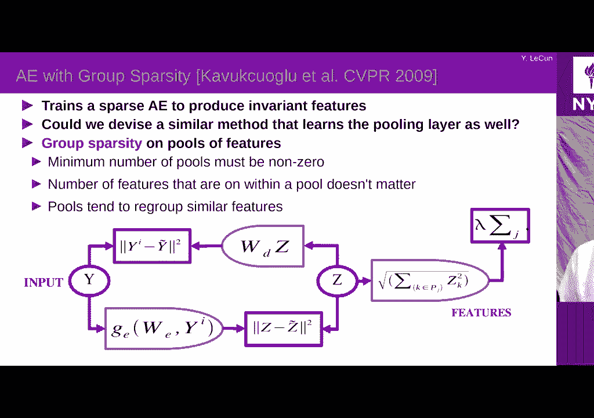

然后在它上面再贴上第二层，好吧，让我审阅一下，然后在它上面再贴上第二层，好吧，让我审阅一下，一点点，所以你开始从一个，一点点，所以你开始从一个，用你的形象。

你有一个编码器，基本上是卷积，你有一个编码器，基本上是卷积，值，仅此组合值就可以了，仅此组合值就可以了，此后需要某种缩放层，此后需要某种缩放层，案例，你和团队一起训练，案例，你和团队一起训练，分组为正。

所以您有一个线性解码器，分组为正，所以您有一个线性解码器，并且您有点重构输入，并且您拥有，并且您有点重构输入，并且您拥有，一个，你这里有一个标准，这是第1组，你这里有一个标准，这是第1组，好吧。

所以这是一个小组的总和，抱歉，我称这是一个很好的小组，好吧，所以这是一个小组的总和，抱歉，我称这是一个很好的小组，组中i的总和的平方根，组中i的总和的平方根，zi平方好了，这是很好的稀疏性。

所以您可以训练这个有点稀疏的呃，zi平方好了，这是很好的稀疏性，所以您可以训练这个有点稀疏的呃，具有良好稀疏性的自动编码器，然后您所要做的就是，具有良好稀疏性的自动编码器，然后您所要做的就是。

您刚刚的稀疏层，您刚刚的稀疏层，用作正则化器，用作正则化器，因此您基本上消除了um，将这部分从网络中删除了，因此您基本上消除了um，将这部分从网络中删除了，拿起鸡皮d确实是，拿起鸡皮d确实是。

拉层l2拉层，然后将其粘贴在此处，拉层l2拉层，然后将其粘贴在此处，好吧，这基本上是l2拉，但它的架构与您使用的架构相同，但它的架构与您使用的架构相同，嗯，您知道鹅群城市，嗯，您知道鹅群城市。

然后将其用作特征提取器，然后将其用作特征提取器，好吧，就像组合网的第一对层一样，好吧，就像组合网的第一对层一样，合成值拉好，用此l2拉而不是最大拉，然后您，合成值拉好，用此l2拉而不是最大拉，然后您。

可以重复此过程，您可以训练该网络的另一个实例，可以重复此过程，您可以训练该网络的另一个实例，我要在这里有几层，我要在这里有几层，解码器具有此l2 uh拉和稀疏性标准。

解码器具有此l2 uh拉和稀疏性标准，训练它以重建其输入，然后将拉力放在顶部，训练它以重建其输入，然后将拉力放在顶部，消除这种情况，现在我们已经为您提供了预先培训，消除这种情况。

现在我们已经为您提供了预先培训，两层完成好了，这是一些，两层完成好了，这是一些，人们称堆叠式音频编码器还可以，所以您可以训练，人们称堆叠式音频编码器还可以，所以您可以训练，自动编码器提取特征。

然后您再生成，自动编码器提取特征，然后您再生成，具有自动编码器那部分的编码器的功能，而您，具有自动编码器那部分的编码器的功能，而您，在顶层火车上粘贴另一层作为另一个编码器，然后继续前进。

在顶层火车上粘贴另一层作为另一个编码器，然后继续前进，而且这里唯一的特点是对这种自动编码器进行了训练，而且这里唯一的特点是对这种自动编码器进行了训练，与你知道通过产生环境特征，与你知道通过产生环境特征。

群组稀疏性基本上是将所有可能的子树作为群组中的，群组稀疏性基本上是将所有可能的子树作为群组中的，以前的示例，嗯，这取决于您，以前的示例，嗯，这取决于您，您在这里使用什么结构可以使用多个树。

您在这里使用什么结构可以使用多个树，如果您想用多种功能来表示，如果您想用多种功能来表示，即使是低频输入，也完全取决于您，即使是低频输入，也完全取决于您，嗯，你知道那就像你买得起，嗯。

你知道那就像你买得起，呃，你还能做的就是用你知道的一棵大树来训练系统，呃，你还能做的就是用你知道的一棵大树来训练系统，必要，然后修剪树，必要，然后修剪树，每当有不使用或很少使用的分支。

每当有不使用或很少使用的分支，好的，这是我在这里展示的实验，好的，这是我在这里展示的实验，类似，但是只有本地连接，没有，类似，但是只有本地连接，没有，没有重量分享，而您在这里看到的又是功能的这种组织。

而您在这里看到的又是功能的这种组织，就神经科学家所说的风车模式而言，就神经科学家所说的风车模式而言，所以风车模式是那些模式，所以风车模式是那些模式，方向选择性随您而不断变化，方向选择性随您而不断变化。

绕开那些红点之一，以便您采取那些红点之一，如果，绕开那些红点之一，以便您采取那些红点之一，如果，你有点绕着红点圈了一下，你有点绕着红点圈了一下，您注意到的是特征的方向，您注意到的是特征的方向。

边缘提取器的种类随着您的移动而不断变化，边缘提取器的种类随着您的移动而不断变化，这些被称为风车模式，它们在，这些被称为风车模式，它们在，实际上在大脑中的那些图片，实际上在大脑中的那些图片。

来自描述这一点的神经科学论文，来自描述这一点的神经科学论文，颜色在这里编码方向设置活动，颜色在这里编码方向设置活动，小星星表示那些，[音乐]这里的奇点，[音乐]这里的奇点，风车的中心是训练过的。

风车的中心是训练过的，有一个很小的价值，这是一个正则化对吧，让我，有一个很小的价值，这是一个正则化对吧，让我，回到，嗯，这是训练或推论过程中的成本函数，嗯，这是训练或推论过程中的成本函数。

取决于您是否使用，取决于您是否使用，是否具有潜在变量的一种预测版本，是否具有潜在变量的一种预测版本，但嗯，但基本上只是一个，但嗯，但基本上只是一个，这基本上只是能源权的一个术语。

这基本上只是能源权的一个术语，所以这个词本身是未经训练的，它是固定的，所以这个词本身是未经训练的，它是固定的，对，这只是组上的l2范数，并且组是预先确定的，对，这只是组上的l2范数，并且组是预先确定的。

嗯，但是因为这是一个标准，所以它可以确定，嗯，但是因为这是一个标准，所以它可以确定，编码器和解码器将执行什么功能，编码器和解码器将执行什么功能，将在这里提取，是另一个示例，将在这里提取，是另一个示例。

您知道一种通过横向抑制进行稀疏编码的奇异方法，您知道一种通过横向抑制进行稀疏编码的奇异方法，人们提出了很多不同的方法来做到这一点，人们提出了很多不同的方法来做到这一点。

这个来自卡罗尔·格里高（Carol gregor）和施莱姆（schlem），这个来自卡罗尔·格里高（Carol gregor）和施莱姆（schlem），大约十年前在我的实验室里，所以这里有。

大约十年前在我的实验室里，所以这里有，再次是具有平方重构误差的线性解码器，这是wz减去，再次是具有平方重构误差的线性解码器，这是wz减去，x，在这种情况下，这里是x的输入，然后在，x，在这种情况下。

这里是x的输入，然后在，能量，它是由，能量，它是由，z转置的绝对值乘以某些矩阵乘以，z转置的绝对值乘以某些矩阵乘以，向量本身，所以它是一种二次形式，向量本身，所以它是一种二次形式。

涉及z和这个矩阵s和矩阵s的uh是，涉及z和这个矩阵s和矩阵s的uh是，手动确定或，学到的东西可以使这个术语最大化，学到的东西可以使这个术语最大化，好的，如果s中的术语，好的，如果s中的术语，是肯定的。

并且很大，如果一个特定术语，是肯定的，并且很大，如果一个特定术语，sij大意味着系统不希望zi和zj为，sij大意味着系统不希望zi和zj为，在同一时间好吧，它希望如果zi处于打开状态，在同一时间好吧。

它希望如果zi处于打开状态，且sij大，则它希望zj关闭，且sij大，则它希望zj关闭，反之亦然，所以这是一种相互抑制，反之亦然，所以这是一种相互抑制，人们用这种叫做横向抑制的东西。

人们用这种叫做横向抑制的东西，在神经科学中，基本上，您基本上知道所有特征向量，在神经科学中，基本上，您基本上知道所有特征向量，通过该矩阵s抑制其他特征向量，通过该矩阵s抑制其他特征向量。

您可以确定矩阵sa先验的结构，您可以确定矩阵sa先验的结构，因此您可以决定只有某些项为非零，您可以决定，因此您可以决定只有某些项为非零，您可以决定，一些术语，这些术语是固定的或可以训练的，一些术语。

这些术语是固定的或可以训练的，而您训练他们的方式实际上是最大限度地提高了嗯，这有点，而您训练他们的方式实际上是最大限度地提高了嗯，这有点，进行一点对抗训练后，您会尝试找到s的值，进行一点对抗训练后。

您会尝试找到s的值，你们知道，呃，如果，你们知道，呃，如果，你要在限制范围内，高于sij的某个值z，高于sij的某个值z，zi或zj之一将变为零，该术语将消失，zi或zj之一将变为零，该术语将消失。

所以系统将让您知道最大sijs直到呃，所以系统将让您知道最大sijs直到呃，它足够大，可以做z和zj之间的相互抑制，它足够大，可以做z和zj之间的相互抑制，而且它不会继续下去，因为它不需要。

而且它不会继续下去，因为它不需要，再一次，如果您以树的形式组织，那么这里，再一次，如果您以树的形式组织，那么这里，这些线代表s矩阵中的零项uh，这些线代表s矩阵中的零项uh，每当两个要素之间没有界线时。

每当两个要素之间没有界线时，s矩阵中有一个非零项，所以每个特征都抑制了所有，s矩阵中有一个非零项，所以每个特征都抑制了所有，除了树上或树下的那些功能以外的其他功能。

除了树上或树下的那些功能以外的其他功能，嗯，这有点像拉宝集团的稀疏性，有点像，嗯，这有点像拉宝集团的稀疏性，有点像，如果您想要虚假的奇偶校验而不是，如果您想要虚假的奇偶校验而不是，说出树枝中的特征。

说出树枝中的特征，需要通过最小化一起激活，需要通过最小化一起激活，你知道l2最小化这样的组的数量，你知道l2最小化这样的组的数量，在这里，你显然有一种抑制，在这里，你显然有一种抑制。

表示每个功能都会抑制所有其他功能，表示每个功能都会抑制所有其他功能，树的所有其他分支中的特征，树的所有其他分支中的特征，再次看到的是，您看到了，再次看到的是，您看到了。

系统正在以或多或少如此连续的方式组织功能，系统正在以或多或少如此连续的方式组织功能，嗯，以这种方式沿着树的树枝出现，嗯，以这种方式沿着树的树枝出现，对应于基本相同的功能，但，对应于基本相同的功能，但。

具有不同程度的选择性，具有不同程度的选择性，然后沿外围的特征或多或少连续地变化，然后沿外围的特征或多或少连续地变化，因为你不仅知道，因为你不仅知道，在底层但也在中间层，在底层但也在中间层，好吧，嗯。

回到训练系统的方式，好吧，嗯，回到训练系统的方式，在每次迭代中都给定一个x，您会找到使该值最小的z，在每次迭代中都给定一个x，您会找到使该值最小的z，能量函数，所以您找到可以重建但，能量函数。

所以您找到可以重建但，也最小化第二项，这意味着如果您有一个sij项，也最小化第二项，这意味着如果您有一个sij项，非零，它希望zi或zj为零或，非零，它希望zi或zj为零或，至少很小。

你现在在后裔上迈出一大步，至少很小，你现在在后裔上迈出一大步，至，h求助于uw的更新，以最大程度地减少构造错误，h求助于uw的更新，以最大程度地减少构造错误，如果您愿意，也可以进行一步的梯度上升以使。

如果您愿意，也可以进行一步的梯度上升以使，通过计算的梯度可以大一些，通过计算的梯度可以大一些，相对于s的能量，但随后上升的能量却不下降，相对于s的能量，但随后上升的能量却不下降。

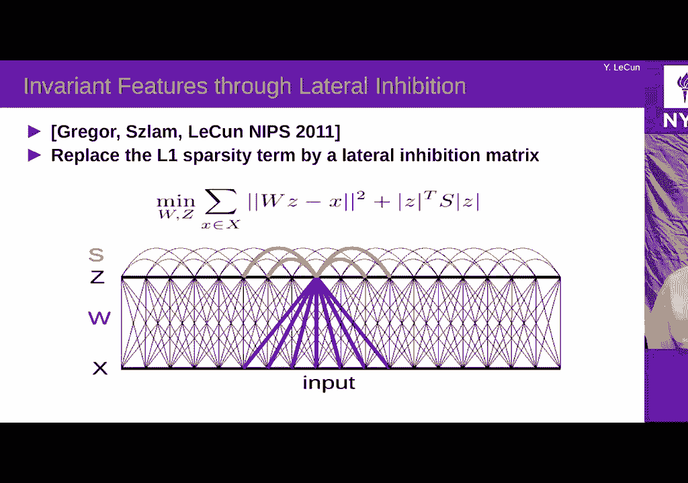

再次，如果您使用的不是树，而是某种2D拓扑，再次，如果您使用的不是树，而是某种2D拓扑，也会得到那种模式，也会得到那种模式，如果要素具有多种比例，则更为复杂，如果要素具有多种比例，则更为复杂。

稀疏编码和结构空间编码就好了，稀疏编码和结构空间编码就好了，我告诉你的原因是，我告诉你的原因是，嗯，尽管这些没有大量的实际应用，嗯，尽管这些没有大量的实际应用，稀疏指令密码，在我看来，它们将成为。

在我看来，它们将成为，正如我告诉你的，未来几年的自我监督运行方法，正如我告诉你的，未来几年的自我监督运行方法，认为南方突然出现的惊喜是，认为南方突然出现的惊喜是，nlp中最热门的话题，它正在变得。

nlp中最热门的话题，它正在变得，也是计算机视觉中的一个热门话题，也是计算机视觉中的一个热门话题，现在主要由对比方法主导，但我认为呃，现在主要由对比方法主导，但我认为呃，建筑方法将接管，因为对比方法。

建筑方法将接管，因为对比方法，伸缩性不好，所以这有点像给你，伸缩性不好，所以这有点像给你，如果您想了解这是未来的武器，如果您想了解这是未来的武器，嗯，现在就完全可以了。

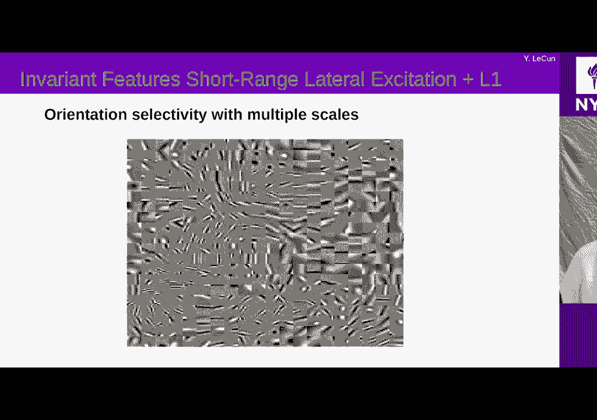

嗯，现在就完全可以了，不同，这是阿尔弗雷多想要的，因为他致力于。

不同，这是阿尔弗雷多想要的，因为他致力于，项目，它是用户之一，项目，它是用户之一，明星主管学习最重要的用户之一可能是，明星主管学习最重要的用户之一可能是，学习用于控制系统或其他目的的世界模型的想法。

学习用于控制系统或其他目的的世界模型的想法，所以当我们当人类或动物学习，所以当我们当人类或动物学习，任务，我们显然很擅长，任务，我们显然很擅长，世界如何运作的内部模型，世界如何运作的内部模型。

当物体不是物体时的物理现象，当物体不是物体时的物理现象，支持跌落，当我们，支持跌落，当我们，大概九个月大的婴儿大概八九个月，大概九个月大的婴儿大概八九个月，那是当它出现在婴儿um中时，我们主要了解到。

那是当它出现在婴儿um中时，我们主要了解到，观察，那么我们如何学习，观察，那么我们如何学习，世界如何运作以及有关世界的所有概念，世界如何运作以及有关世界的所有概念，通过观察，有两个，通过观察，有两个。

这项权利的原因，所以我已经解释过的是监督的想法，这项权利的原因，所以我已经解释过的是监督的想法，学习是否可以训练自己来预测也许，学习是否可以训练自己来预测也许，自发地学习关于世界的抽象概念。

自发地学习关于世界的抽象概念，在准备运行特定设备时可能会有用，在准备运行特定设备时可能会有用，一个或一组任务，但是还有另一个原因是，一个或一组任务，但是还有另一个原因是，您实际上想建立世界模型。

如果您希望能够采取行动，您实际上想建立世界模型，如果您希望能够采取行动，世界是正确的，所以我握着这支笔，世界是正确的，所以我握着这支笔，而且我知道如果我将手向上移动，笔将随之移动，因为。

而且我知道如果我将手向上移动，笔将随之移动，因为，你知道那是在我的手指间我知道，如果我，你知道那是在我的手指间我知道，如果我，张开手指，笔会掉下来，我会因重力而知道，张开手指，笔会掉下来。

我会因重力而知道，通过掌握，我知道了我学到的所有东西，并且我已经，通过掌握，我知道了我学到的所有东西，并且我已经，我主要是通过实验学到的关于观察的知识，我主要是通过实验学到的关于观察的知识。

但是我学到的很多东西都是通过观察学到的，所以这个大问题，但是我学到的很多东西都是通过观察学到的，所以这个大问题，是我们可以学习到吗？是我们可以学习到吗？自我监督学习训练系统学习世界模型。

自我监督学习训练系统学习世界模型。

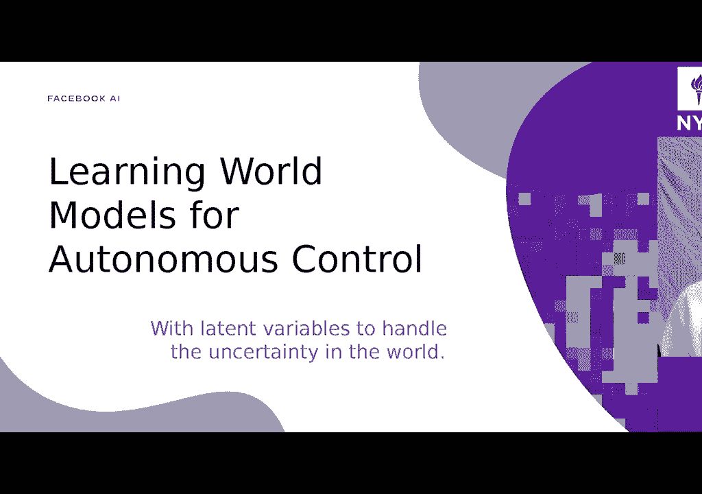

嗯，好的模型是什么，所以如果您想，嗯，好的模型是什么，所以如果您想，给一个自治的体系结构的想法，给一个自治的体系结构的想法，情报系统，这将是一个基本上由四个部分组成的系统。

这将是一个基本上由四个部分组成的系统，这里的主要区块在左侧代表，这里的主要区块在左侧代表，这是一个聪明的代理人，也许不是那么聪明，我们将看到，这是一个聪明的代理人，也许不是那么聪明，我们将看到。

它有一个感知模块，感知模块基本上会观察，它有一个感知模块，感知模块基本上会观察，然后计算状态的表示形式，然后计算状态的表示形式，可以在时间t叫st的世界，可以在时间t叫st的世界，t的s是系统具有。

t的s是系统具有，这个世界一定是不完整的，这个世界一定是不完整的，表示世界，因为我们无法观察到整个宇宙，表示世界，因为我们无法观察到整个宇宙，一旦我们只观察立即，一旦我们只观察立即，在我们周围。

甚至我们无法通过遮挡看到，并且有一个，在我们周围，甚至我们无法通过遮挡看到，并且有一个，你们很多人都知道世界的内部状态，你们很多人都知道世界的内部状态，即使您可以观察到您的准确性，我们也无法充分观察到。

即使您可以观察到您的准确性，我们也无法充分观察到，观察可能还不够好，所以如果我把这支笔放在我的，观察可能还不够好，所以如果我把这支笔放在我的，在我手中，它似乎是垂直的，放开它，在我手中，它似乎是垂直的。

放开它，它会下降，但您无法真正预测我使用该方向的方向，它会下降，但您无法真正预测我使用该方向的方向，之前的例子来描述问题，之前的例子来描述问题，世界的不确定性是不确定的，你不能。

世界的不确定性是不确定的，你不能，准确预测将要发生的事情，因为您没有一个完美的阅读方法，准确预测将要发生的事情，因为您没有一个完美的阅读方法，世界的状态，也许世界本质上是，世界的状态，也许世界本质上是。

随机的，我们不知道实际上还可以，所以，随机的，我们不知道实际上还可以，所以，正向模型是给定当前状态的模型，正向模型是给定当前状态的模型，世界或您对当前状态的看法，世界或您对当前状态的看法。

世界以及您正在采取的行动或，世界以及您正在采取的行动或，别人正在服用您可以选择的产品或在，别人正在服用您可以选择的产品或在，最少观察，也许是辅助潜变量，最少观察，也许是辅助潜变量。

t的z代表您对这个世界所不了解的，t的z代表您对这个世界所不了解的，所以世界的一部分，所以世界的一部分，您不知道发生的事情或无法预测的事情，您不知道发生的事情或无法预测的事情，并在世界上继续前进。

并在世界上继续前进，预测世界的下一个状态st加一个离散化的好吧，预测世界的下一个状态st加一个离散化的好吧，以某种方式计时，因此，如果您具有该类型世界的模型，以某种方式计时，因此。

如果您具有该类型世界的模型，您可以在脑海中模拟由于您的情况会发生什么，您可以在脑海中模拟由于您的情况会发生什么，动作还可以，所以您有这个模型，动作还可以，所以您有这个模型，你的头，你知道现在的状态。

你的头，你知道现在的状态，世界是关于当前状态的一些想法，世界是关于当前状态的一些想法，你运行世界的内部模型的世界，你运行世界的内部模型的世界，带有a的t序列，这是您想象的动作序列，带有a的t序列。

这是您想象的动作序列，和你的世界模型一样，和你的世界模型一样，想象它会预测世界将会发生什么，想象它会预测世界将会发生什么，如果您可以这样做，那么您可以计划将要采取的一系列行动，如果您可以这样做。

那么您可以计划将要采取的一系列行动，在一个特定的目标还可以，例如，在一个特定的目标还可以，例如，我应该怎么做才能抓住这支笔，我应该怎么做才能抓住这支笔，嗯，你知道我该不该遵循特定的轨迹，嗯。

你知道我该不该遵循特定的轨迹，你知道以一种特殊的方式致动我的肌肉，所以我抓住了这支笔，你知道以一种特殊的方式致动我的肌肉，所以我抓住了这支笔，我可以衡量的成本函数的标准是，我可以衡量的成本函数的标准是。

是我是否已经握住笔好了吗？是我是否已经握住笔好了吗？我可以用一些功能来测量，我可以用一些功能来测量，问题是我可以计划给定我的模型的一系列操作，问题是我可以计划给定我的模型的一系列操作。

在这种情况下是我的模型的世界，在这种情况下是我的模型的世界，手和笔所在的位置的模型可以让我抓住它，手和笔所在的位置的模型可以让我抓住它，如果我丢了笔并且必须抓住它，那会有点复杂。

如果我丢了笔并且必须抓住它，那会有点复杂，空气还可以，因为我必须预测，空气还可以，因为我必须预测，笔的轨迹，所以我必须有一个直观的物理模型，笔的轨迹，所以我必须有一个直观的物理模型，能够抓住那支笔。

我当然是从经验中学到的，能够抓住那支笔，我当然是从经验中学到的，人们也很惊讶您如此喜欢，人们也很惊讶您如此喜欢，强化学习这不是强化，强化学习这不是强化，这与强化学习完全无关，这与强化学习完全无关。

非常清楚，这与强化学习无关，非常清楚，这与强化学习无关，嗯，将来可能需要这样做，但是现在不需要，嗯，将来可能需要这样做，但是现在不需要，um基于模型的强化学习否与它无关。

um基于模型的强化学习否与它无关，茶点跑步让我好吧让我经历，茶点跑步让我好吧让我经历，这可以解释一下区别吗，这可以解释一下区别吗，有人问嗯，好吧，所以现在，有人问嗯，好吧，所以现在，所以在左边。

你有这个小特工，它有这个世界的模型，所以在左边，你有这个小特工，它有这个世界的模型，你可以向前跑好吧，它可以有一个演员还是你，你可以向前跑好吧，它可以有一个演员还是你，可以将其视为产生一系列行动的政策。

可以将其视为产生一系列行动的政策，将提供给模型，然后添加评论者，将提供给模型，然后添加评论者，预测成本，预测成本，最终状态或轨迹将根据准则，最终状态或轨迹将根据准则，评论家在这里计算出基本上不履行。

评论家在这里计算出基本上不履行，我设定好的目标，如果我的任务是达成目标，我设定好的目标，如果我的任务是达成目标，跨度和我有点想念笔几厘米，跨度和我有点想念笔几厘米，我的成本是几厘米，如果我抓住它。

成本是零，我的成本是几厘米，如果我抓住它，成本是零，如果我很想念它，那么成本会更高，这就是成本的一​​个例子，如果我很想念它，那么成本会更高，这就是成本的一​​个例子，现在好了。

所以您可以做很多不同的事情，现在好了，所以您可以做很多不同的事情，与呃这种智能代理的基本模型，与呃这种智能代理的基本模型，第一个是你从一个初始状态开始，第一个是你从一个初始状态开始。

您在世界上观察到您运行的是前向模型，您在世界上观察到您运行的是前向模型，有关衡量成本的一系列操作的建议，有关衡量成本的一系列操作的建议，以及您在这里可以做什么而忽略了代表策略的p。

以及您在这里可以做什么而忽略了代表策略的p，嗯，让我们想象一下它不是通过梯度下降或某种形式存在的，嗯，让我们想象一下它不是通过梯度下降或某种形式存在的，优化算法，您可以尝试查找序列，优化算法。

您可以尝试查找序列，减少总成本的措施，减少总成本的措施，在轨迹上，我从状态开始，在轨迹上，我从状态开始，我运行我的前向模型，这需要采取措施，我运行我的前向模型，这需要采取措施，好吧，我就称这个为a1。

这是s1或s1，好吧，我就称这个为a1，这是s1或s1，这将给我s2，而我将衡量s2的成本，这将给我s2，而我将衡量s2的成本，通过一些成本函数，看到，好的，下一个步骤再次运行我的正向模型，好的。

下一个步骤再次运行我的正向模型，提出一个行动建议a2这都是模拟的，这全在我脑海中，提出一个行动建议a2这都是模拟的，这全在我脑海中，对，因为这个模型是正向模型，对，因为这个模型是正向模型。

在我的头上看到我的额叶皮层，所以我实际上并没有在，在我的头上看到我的额叶皮层，所以我实际上并没有在，世界，等等正确，所以我可以展开一些时间步骤，这些时间步骤可以是，等等正确，所以我可以展开一些时间步骤。

这些时间步骤可以是，毫秒（如果我控制肌肉），毫秒（如果我控制肌肉），如果我控制高级别的动作几秒钟，它们可能会好几个小时，所以如果我想，如果我控制高级别的动作几秒钟，它们可能会好几个小时，所以如果我想。

计划如何我不知道去旧金山你，计划如何我不知道去旧金山你，知道我需要去机场然后乘飞机，知道我需要去机场然后乘飞机，然后，当我到达那里时，乘坐出租车或，然后，当我到达那里时，乘坐出租车或，等等。

所以这是独立的，等等，所以这是独立的，事物的描述级别，事物的描述级别，好吧，我可以做的就是我可以做一个非常经典的，好吧，我可以做的就是我可以做一个非常经典的，称为模型预测控制的方法，因此它是经典的。

称为模型预测控制的方法，因此它是经典的，最佳控制是一门完整的学科，最佳控制是一门完整的学科，从50年代开始就存在，如果不是更早的话，从50年代开始就存在，如果不是更早的话。

而且其中一些方法是方法预测控制，可以追溯到，而且其中一些方法是方法预测控制，可以追溯到，1960年代，有一种叫做kelly bison算法的东西，1960年代。

有一种叫做kelly bison算法的东西，我觉得这很凯利，我不是，当然，所以这是，当然，所以这是，与我目前所描述的方法非常相似的方法，与我目前所描述的方法非常相似的方法。

美国国家航空航天局主要使用它来计算轨迹，美国国家航空航天局主要使用它来计算轨迹，对于火箭来说还可以，所以当他们在60年代开始拥有计算机时，对于火箭来说还可以，所以当他们在60年代开始拥有计算机时。

在美国国家航空航天局，他们开始使用计算机计算轨迹，在美国国家航空航天局，他们开始使用计算机计算轨迹，基本上是在使用这样的东西之前，他们不得不手工做，基本上是在使用这样的东西之前，他们不得不手工做，好吧。

如果你还没看过电影，好吧，如果你还没看过电影，隐藏的数字，我描述了人们如何，隐藏的数字，我描述了人们如何，手工竞争这主要是由于黑人妇女所做的，手工竞争这主要是由于黑人妇女所做的，美国黑人数学家。

美国黑人数学家，那些计算机观看那部电影的编程方式真的很棒，那些计算机观看那部电影的编程方式真的很棒，好吧，这是一个基本概念，嗯，看起来非常，好吧，这是一个基本概念，嗯，看起来非常，就像是经常性的网好吧。

因为您的福特车型是，就像是经常性的网好吧，因为您的福特车型是，基本上复制了相同的网络，基本上复制了相同的网络，随着时间的流逝，这就像是一个虚幻的循环网络，随着时间的流逝，这就像是一个虚幻的循环网络。

很好，您在这里所做的就是您向后传播，很好，您在这里所做的就是您向后传播，整个网络一直到的成本价值，整个网络一直到的成本价值，动作，并且您不会将其用于训练，而是将其用于推理，动作，并且您不会将其用于训练。

而是将其用于推理，可以将动作视为潜在变量，基本上，可以将动作视为潜在变量，基本上，梯度下降或其他优化方法，梯度下降或其他优化方法，您会发现一系列的操作，这些操作可以最大程度地减少，您会发现一系列的操作。

这些操作可以最大程度地减少，轨迹好了，轨迹好了，所以基本上您的总成本是，所以基本上您的总成本是，我将其称为大c，这将是总和或时间步长，我将其称为大c，这将是总和或时间步长，好的一点C的时间步长。

好的一点C的时间步长，呃，你要做的是一个大的a的序列，呃，你要做的是一个大的a的序列，将被其自身价值减去一些，将被其自身价值减去一些，步长乘以大c相对于的梯度，步长乘以大c相对于的梯度，好的。

只要您可以计算出这些费用总和的梯度，好的，只要您可以计算出这些费用总和的梯度，关于a的所有分量的轨迹，关于a的所有分量的轨迹，这意味着a的轨迹可以执行此优化操作，这意味着a的轨迹可以执行此优化操作。

必须为梯度下降而必须这样做，必须为梯度下降而必须这样做，在某些情况下，有更有效的方法可以进行优化，在某些情况下，有更有效的方法可以进行优化，um使用动态编程，例如，如果a是离散的，um使用动态编程。

例如，如果a是离散的，可能会更有效，但是如果a是连续的高维，可能会更有效，但是如果a是连续的高维，基本上别无选择，只能使用基于梯度的方法，基本上别无选择，只能使用基于梯度的方法，好吧，这就是推断。

这不是没有学习，什么是，好吧，这就是推断，这不是没有学习，什么是，大a是序列a1 a2 a3等，大a是序列a1 a2 a3等，好吧，所以你有一个不同的目标函数，好吧，所以你有一个不同的目标函数。

您可以根据自己感兴趣的变量将其最小化，您可以根据自己感兴趣的变量将其最小化，你从中得到什么，aa中没有权重，你从中得到什么，aa中没有权重，对，所以a是一个向量，是的，那是，对，所以a是一个向量，是的。

那是，实际上是因为我们从不使用呃，到目前为止我们从未最小化向量，实际上是因为我们从不使用呃，到目前为止我们从未最小化向量，一直在最小化，我们一直在优化权重，一直在最小化，我们一直在优化权重，人们是哦。

我们有像z这样的潜在变量，人们是哦，我们有像z这样的潜在变量，变量基于能量的模型的潜在变量，变量基于能量的模型的潜在变量，我们确实将关于z的能量最小化，所以这是相同的，我们确实将关于z的能量最小化。

所以这是相同的，这里的问题我们正在解决，我想是的，我想不是每个人，这里的问题我们正在解决，我想是的，我想不是每个人，了解潜在变量实际上是输入，了解潜在变量实际上是输入，所以我认为这也与。

所以我认为这也与，我们在广场上有关于训练这些的问题，我们在广场上有关于训练这些的问题，潜在变量模型是的，您不想使用该词，潜在变量模型是的，您不想使用该词，训练文字变量或类似的东西。

训练文字变量或类似的东西，因为呃，你想使用推断，好吧，你想使用这个词，因为呃，你想使用推断，好吧，你想使用这个词，推断或不训练我想使用，推断或不训练我想使用，推理一词不训练推理和推理之间有什么区别。

推理一词不训练推理和推理之间有什么区别，训练与训练你一起训练，训练与训练你一起训练，学习大量的参数呃，学习大量的参数呃，的样本可以推断出您的价值，的样本可以推断出您的价值。

一些变量是一个潜在变量a在这种情况下是z在一个潜在变量的情况下，一些变量是一个潜在变量a在这种情况下是z在一个潜在变量的情况下，特定于一个样本的基于可变能量的模型uh。

特定于一个样本的基于可变能量的模型uh，好吧，您更改样本的书面变量的变化，好吧，您更改样本的书面变量的变化，因此您不会学习它，因为您一次都不记得它了，因此您不会学习它，因为您一次都不记得它了。

一次到下一次，你知道没有记忆，一次到下一次，你知道没有记忆，为此，嗯，所以这就是您从概念上知道您在做相同种类的区别，所以这就是您从概念上知道您在做相同种类的区别，您进行学习和推理的过程。

您进行学习和推理的过程，所以在某种程度上，它们是相同的，所以在某种程度上，它们是相同的，但是推论您是按照每个样本来学习的，而是通过一堆，但是推论您是按照每个样本来学习的，而是通过一堆，样本。

并且您共享该参数，样本，并且您共享该参数，当我们有一个基于能量的模型时，这些样本，当我们有一个基于能量的模型时，这些样本，我们想做推断，我们仍然需要做一个最小化，我们想做推断，我们仍然需要做一个最小化。

每次执行此操作时，我们都会正确使用它，因此，每次执行此操作时，我们都会正确使用它，因此，训练模型后，您之后的差异，训练模型后，您之后的差异，使用它，您仍然需要对潜伏进行最小化，使用它。

您仍然需要对潜伏进行最小化，变量好吧，那是最大的不同，变量好吧，那是最大的不同，在这里，这里可能有也可能没有，在这里，这里可能有也可能没有，训练您的前向模型可能是手工建立的，也可能是经过训练的，但是。

训练您的前向模型可能是手工建立的，也可能是经过训练的，但是，到我们在这里的时候，它已经训练了，我们在这里没有训练任何东西，到我们在这里的时候，它已经训练了，我们在这里没有训练任何东西。

我们只是在进行推断我们正在找出最佳值，我们只是在进行推断我们正在找出最佳值，的顺序是我们将最小化，的顺序是我们将最小化，成本总成本，这是一个推断问题，成本总成本，这是一个推断问题，就像基于能量的模型。

例如fm，就像基于能量的模型，例如fm，四个模型可以只是物理方程的一条线，可以，四个模型可以只是物理方程的一条线，可以，一个确定性方程，所以可以想象正向模型是少数，一个确定性方程。

所以可以想象正向模型是少数，描述火箭物理的方程，描述火箭物理的方程，从根本上说，a是转向的作用，您知道如何定向，从根本上说，a是转向的作用，您知道如何定向，喷嘴，然后推力。

所以这将是一个的集合将是那些的集合，所以这将是一个的集合将是那些的集合，变量，然后有一个非常简单的物理牛顿物理，变量，然后有一个非常简单的物理牛顿物理，基本上，你可以写方程式，基本上，你可以写方程式。

在下一个uh时间步给您球拍的状态，作为，在下一个uh时间步给您球拍的状态，作为，上一个时间步的电弧状态功能和您要执行的操作，上一个时间步的电弧状态功能和您要执行的操作，这就是您进行仿真的方式。

这就是每个模拟器的工作方式，这就是您进行仿真的方式，这就是每个模拟器的工作方式，然后如果要发射火箭，您的成本函数将是，然后如果要发射火箭，您的成本函数将是，也许是两件事的结合，呃会是。

也许是两件事的结合，呃会是，在该时间步中花费的能量，在该时间步中花费的能量，好吧，你花了这样的燃料量，好吧，你花了这样的燃料量，第二项可能是您想要达到的目标的距离，第二项可能是您想要达到的目标的距离。

也许你想和一个空间站会合，也许你想和一个空间站会合，费用中的第二项是到空间站的距离，费用中的第二项是到空间站的距离，到太空站的距离还可以吗，到太空站的距离还可以吗。

如果您测量um到距离的整个轨迹上的总和，如果您测量um到距离的整个轨迹上的总和，空间站，系统将尽量减少时间，空间站，系统将尽量减少时间，到达空间站是需要的，因为他们要尽量减少，到达空间站是需要的。

因为他们要尽量减少，轨迹上到空间站的距离的平方和，轨迹上到空间站的距离的平方和，但同时它希望最大限度地减少燃料，因此您必须平衡，但同时它希望最大限度地减少燃料，因此您必须平衡，这两个词对。

所以这是一种经典的方式，这两个词对，所以这是一种经典的方式，进行最优控制的方法，即模型预测控制，进行最优控制的方法，即模型预测控制，模型是卡尔曼滤波模型预测控制的一种。

模型是卡尔曼滤波模型预测控制的一种，如果您希望采用某种方式，则没有相机过滤是特定的超前转发模型，如果您希望采用某种方式，则没有相机过滤是特定的超前转发模型，估计世界状况还可以，但是嗯。

估计世界状况还可以，但是嗯，基本上是因为您对世界状况有了观察，基本上是因为您对世界状况有了观察，通过感知系统，关于，通过感知系统，关于，世界状况和命令过滤器基本上假定，世界状况和命令过滤器基本上假定。

关于这种不确定性的高斯分布，关于这种不确定性的高斯分布，现在，当您遍历前向模型时，现在，当您遍历前向模型时，您将会对世界状况产生不确定性，您将会对世界状况产生不确定性，在下一个时间步，因为不确定是否以。

在下一个时间步，因为不确定是否以，好吧，鉴于您从何处开始时的不确定性，好吧，鉴于您从何处开始时的不确定性，如果需要，经过物理步骤后不确定性是多少，如果需要，经过物理步骤后不确定性是多少。

如果您假设所有这些步骤都是线性的，如果您假设所有这些步骤都是线性的，和不确定性的高斯性，和不确定性的高斯性，常用的滤波器是um，大多数不确定性来自，常用的滤波器是um，大多数不确定性来自，现在。

您的前向模型会产生一个预测，然后下一步，现在，您的前向模型会产生一个预测，然后下一步，您可能会再次了解世界状况，您可能会再次了解世界状况，因为您的传感器仍在工作，所以现在您有两个高斯，一个是。

因为您的传感器仍在工作，所以现在您有两个高斯，一个是，你对世界的新认识告诉你这是我的想法，你对世界的新认识告诉你这是我的想法，世界的状况是，您的福特模型也在这里预测，这就是为什么我认为，世界的状况是。

您的福特模型也在这里预测，这就是为什么我认为，我认为它在哪里，而您必须将这两个结合起来，我认为它在哪里，而您必须将这两个结合起来，普通过滤复杂的地方，普通过滤复杂的地方，嗯，我有两个高斯预测，嗯。

我有两个高斯预测，因此，如果您将结果概率分布也设为高斯，因此，如果您将结果概率分布也设为高斯，计算协方差矩阵和等等，这就是，计算协方差矩阵和等等，这就是，um常用过滤器的公式来自。

um常用过滤器的公式来自，好的，所以游戏过滤器是应对不确定性的一种方法，好的，所以游戏过滤器是应对不确定性的一种方法，在阅读中您对世界的看法，在阅读中您对世界的看法，而在呃。

当您在正向模型中传播这种不确定性时，当您在正向模型中传播这种不确定性时，嗯，我认为仍然有一个主要区别，我想你想解决，嗯，我认为仍然有一个主要区别，我想你想解决，这与已经可以的不同，这与已经可以的不同。

所以在这种情况下rl是什么，所以好吧，我需要我需要我需要一个，所以在这种情况下rl是什么，所以好吧，我需要我需要我需要一个，在我谈论rl之前还有更多步骤，这是该步骤，在我谈论rl之前还有更多步骤。

这是该步骤，好吧，一分钟前我们所拥有的是一个前向模型，好吧，一分钟前我们所拥有的是一个前向模型，及时报名，并且系统有，采取一系列动作a1 a2 a3，采取一系列动作a1 a2 a3。

s1 s2然后这里有成本函数，s1 s2然后这里有成本函数，接下来，好的，这现在可以继续进行，我们希望能够做到，好的，这现在可以继续进行，我们希望能够做到，不必针对a1 a2 a3 a4进行此优化。

不必针对a1 a2 a3 a4进行此优化，呃每次我们都需要做计划时，我们都不需要，呃每次我们都需要做计划时，我们都不需要，要做这个反向传播的复杂过程，要做这个反向传播的复杂过程。

通过整个系统的梯度来进行模型预测，通过整个系统的梯度来进行模型预测，呃控制，以及摆脱的简单方法，呃控制，以及摆脱的简单方法，该步骤与我们在汽车中使用的技巧相同，该步骤与我们在汽车中使用的技巧相同。

编码器与密码转换，所以请记住它是密码转换，编码器与密码转换，所以请记住它是密码转换，我们想重建，但随后我们不得不对，我们想重建，但随后我们不得不对，通过优化的潜在变量，事实证明是，通过优化的潜在变量。

事实证明是，昂贵，所以我们上周讨论的是使用编码器的想法，昂贵，所以我们上周讨论的是使用编码器的想法，我们训练直接预测最佳值，我们训练直接预测最佳值，好的，我们将在此处进行相同的操作，使该想法成为，好的。

我们将在此处进行相同的操作，使该想法成为，编码器，我们将在这里做同样的事情，我将训练网络来，编码器，我们将在这里做同样的事情，我将训练网络来，陈述并直接预测最佳，陈述并直接预测最佳，行动的价值是。

我们当然要走这个网络，行动的价值是，我们当然要走这个网络，应用于每个步骤，这将被称为政策，应用于每个步骤，这将被称为政策，网络，好的，因此政策网络将状态，好的，因此政策网络将状态，并猜测最佳动作。

并猜测最佳动作，此时应采取的措施，以将总成本降至最低，此时应采取的措施，以将总成本降至最低，好的，这将是一个可训练的神经网络，好的，这将是一个可训练的神经网络，或我们想要的任何模型参数化模型。

或我们想要的任何模型参数化模型，训练该模型基本上只是反向传播，训练该模型基本上只是反向传播，好的，所以我们要使用感知模块，这就是，好的，所以我们要使用感知模块，这就是，这是这里的世界。

我们正在用相机看世界，这是这里的世界，我们正在用相机看世界，还有一个感知模块，可以让我们猜测，还有一个感知模块，可以让我们猜测，世界还好，这是感知，世界还好，这是感知。

这是一个应用了多个时间步长的正向模型，这是一个应用了多个时间步长的正向模型，这都是成本，好的，所以我们可以做的就是运行系统，好的，所以我们可以做的就是运行系统，首先运行系统，通过感知。

我们计算出一个动作，然后通过，通过感知，我们计算出一个动作，然后通过，正向模型这个正向模型给我们，正向模型这个正向模型给我们，这是我们要计算成本的下一个状态，这是我们要计算成本的下一个状态。

然后继续前进，继续前进，直到整个弹出，然后继续前进，继续前进，直到整个弹出，系统真的是一种展开，系统真的是一种展开，经常性净额（如果需要），一旦完成，经常性净额（如果需要），一旦完成。

您返回了成本中所有项的梯度梯度，您返回了成本中所有项的梯度梯度，通过网络一直运行，通过网络一直运行，通过该策略网络的参数的方式，通过该策略网络的参数的方式，好吧，基本上您可以计算出大c的d。

所以大c记住是，好吧，基本上您可以计算出大c的d，所以大c记住是，关于dw的所有c的很长时间，关于dw的所有c的很长时间，好，那只是一个时间的总和，好，那只是一个时间的总和，dw上的大c的。

dw上的大c的，抱歉，对了，大c在d atdat，抱歉，对了，大c在d atdat，还是dw好吧，我刚刚应用了链式规则，但是，还是dw好吧，我刚刚应用了链式规则，但是，我不需要正确。

如果我只是您知道在python中定义此函数而只是，我不需要正确，如果我只是您知道在python中定义此函数而只是，向后做它只会做正确的事情，所以，向后做它只会做正确的事情，所以。

我可以计算总体成本相对于，我可以计算总体成本相对于，该政策网络的参数，因此，如果我在足够多的条件下进行培训，该政策网络的参数，因此，如果我在足够多的条件下进行培训，呃。

如果我的成本函数执行了我的正向模型，则样本是否正确，呃，如果我的成本函数执行了我的正向模型，则样本是否正确，想要然后我的政策网络将学习，想要然后我的政策网络将学习，一个很好的政策，只看国家就可以减少。

一个很好的政策，只看国家就可以减少，轨迹上的预期成本好的轨迹上的平均成本，轨迹上的预期成本好的轨迹上的平均成本，这里没有援军，这都是背景，这里没有援军，这都是背景。

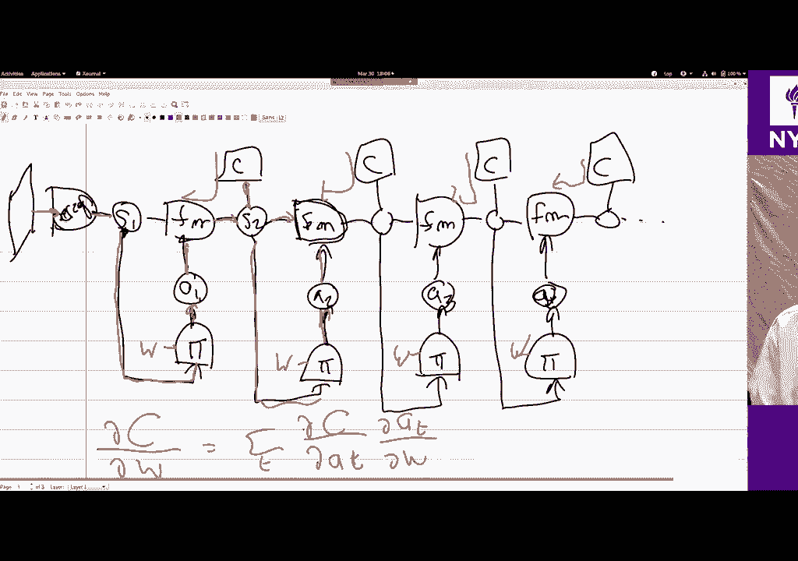

好吧，现在我们可以讨论一下茶点跑步的不同之处，好吧，现在我们可以讨论一下茶点跑步的不同之处，与此处运行的钢筋的主要区别，与此处运行的钢筋的主要区别，是呃是双重的第一个是在强化学习中。

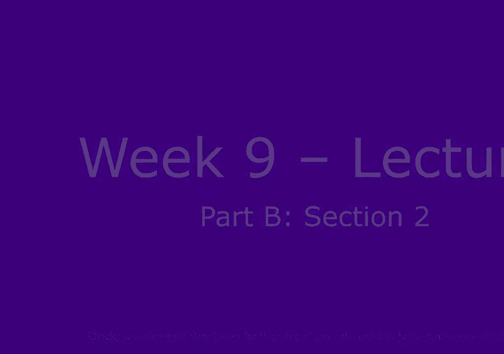

是呃是双重的第一个是在强化学习中，至少在大多数强化训练场景中，至少在大多数强化训练场景中，c函数是一个黑匣子，它是一个，c函数是一个黑匣子，它是一个，黑匣子不是红匣子，好的，这是第一个区别。

第二个区别是，这不是，好的，这是第一个区别，第二个区别是，这不是，世界的前向模型，这是现实世界，世界的前向模型，这是现实世界，并且您对世界状况的度量是不完善的，因此，并且您对世界状况的度量是不完善的。

因此，在此政策网络内部，您可能在此处拥有感知网络，在此政策网络内部，您可能在此处拥有感知网络，可以估算世界状况，因此您无法控制，可以估算世界状况，因此您无法控制，现实世界和您的成本函数未知，您可以得到。

现实世界和您的成本函数未知，您可以得到，尝试一下就可以得出成本函数的输出，尝试一下就可以得出成本函数的输出，正确地采取行动，就会看到对世界的影响，正确地采取行动，就会看到对世界的影响，这给了你呃。

奔跑的人称之为奖励，但这是，这给了你呃，奔跑的人称之为奖励，但这是，只是负成本就可以了，只是负成本就可以了，您的成本，但成本无与伦比，您的成本，但成本无与伦比，不知道你要花费的费用的功能。

不知道你要花费的费用的功能，找出成本的价值还可以，嗯，那就是强化运行的主要问题，嗯，那就是强化运行的主要问题，成本函数是不可微的，成本函数是不可微的，嗯，唯一未知的估计方法是，嗯，唯一未知的估计方法是。

尝试一些东西，然后观察价值，这就是回报，尝试一些东西，然后观察价值，这就是回报，真的是负面的奖励的负面本质上是您的费用，真的是负面的奖励的负面本质上是您的费用，好的，在这种情况下，因为您无法评估渐变。

好的，在这种情况下，因为您无法评估渐变，为了最大程度地降低成本，您必须尝试多种操作，为了最大程度地降低成本，您必须尝试多种操作，尝试执行操作以查看结果，然后尝试执行另一操作以查看结果是否为。

尝试执行操作以查看结果，然后尝试执行另一操作以查看结果是否为，更好，然后尝试其他操作，看看是否，更好，然后尝试其他操作，看看是否，结果更好，如果您的成本函数非常平稳，结果更好，如果您的成本函数非常平稳。

在获得非零奖励之前，必须尝试许多事情，在获得非零奖励之前，必须尝试许多事情，或者您知道成本不高，那就是，或者您知道成本不高，那就是，复杂性还有另外一个问题，复杂性还有另外一个问题，探索，所以你认识你。

因为你不知道，探索，所以你认识你，因为你不知道，成本的形式，因为它是不可微的，成本的形式，因为它是不可微的，呃，您可能需要以一种明智的方式尝试多种操作，呃，您可能需要以一种明智的方式尝试多种操作。

找出要去的空间的哪一部分，找出要去的空间的哪一部分，我怎样才能改善我的表现，所以这是主要的问题，我怎样才能改善我的表现，所以这是主要的问题，呃，探索，然后是一个问题，呃，探索，然后是一个问题。

勘探与剥削，所以事实，勘探与剥削，所以事实，嗯，当你处在某种情况下，你不想完全随机，嗯，当你处在某种情况下，你不想完全随机，动作，因为它们可能不会导致任何有趣的事情，因此您，动作。

因为它们可能不会导致任何有趣的事情，因此您，想要采取接近，想要采取接近，您认为可能有效的方法，您认为可能有效的方法，在学习时偶尔尝试其他，在学习时偶尔尝试其他，并随着我的描述学习您的政策。

并随着我的描述学习您的政策，我刚才描述的是一种情况，我刚才描述的是一种情况，您可以在脑海中做所有这一切，因为您拥有世界的典范，您可以在脑海中做所有这一切，因为您拥有世界的典范。

您可以非常有效地优化操作顺序，您可以非常有效地优化操作顺序，因为您具有可微分的成本函数，所以将计算成本函数，因为您具有可微分的成本函数，所以将计算成本函数，如果您想进入自己的大脑。

如果您想进入自己的大脑，您的经纪人可以告诉您是否抓住了，您的经纪人可以告诉您是否抓住了，用笔你可以分辨出你之间的距离，用笔你可以分辨出你之间的距离，手和笔，以便您可以计算自己的成本函数，这有点，手和笔。

以便您可以计算自己的成本函数，这有点，在您的内部世界模型中，在现实世界中与众不同，在您的内部世界模型中，在现实世界中与众不同，不是在现实世界中，你不知道，不是在现实世界中，你不知道，除非您有以下模型。

否则您的手到笔的距离的导数，除非您有以下模型，否则您的手到笔的距离的导数，在您的脑海中，但默认情况下您不会，因为，在您的脑海中，但默认情况下您不会，因为，一切都在您的脑海一切都与众不同。

一切都在您的脑海一切都与众不同，由神经网络实现，您可以将所有内容正确地渐变为，由神经网络实现，您可以将所有内容正确地渐变为，一切，这就是这种最大的优势，一切，这就是这种最大的优势，方法与加固计划。

方法与加固计划，好吧，一切都变得与众不同，所以这个世界有两个问题，好吧，一切都变得与众不同，所以这个世界有两个问题，所以在这种情况下有一个很大的优势，所以在这种情况下有一个很大的优势，嗯。

这是因为您的前向模型可以比实时运行更快，嗯，这是因为您的前向模型可以比实时运行更快，您的代理内部可以按照您希望的速度运行，而无需，您的代理内部可以按照您希望的速度运行，而无需，跑遍世界好吧。

这是一个优势，第二个优势是，跑遍世界好吧，这是一个优势，第二个优势是，您所采取的行动不会杀死您，您所采取的行动不会杀死您，因为您可以使用正向模型预测呃，因为您可以使用正向模型预测呃。

你知道也许你会预言该行动会杀死你，但你不会，你知道也许你会预言该行动会杀死你，但你不会，将其带入现实世界，这样一来，如果您拥有，将其带入现实世界，这样一来，如果您拥有，准确的前向模型，第三个优势。

因为一切都发生在您的脑海中，第三个优势，因为一切都发生在您的脑海中，一切都是互联网，一切都是与众不同的，您可以使用各种，一切都是互联网，一切都是与众不同的，您可以使用各种，高效的学习或，高效的学习或。

推理算法来找出良好的行动方案，推理算法来找出良好的行动方案，好吧，这与加强训练中的茶点有所不同，好吧，这与加强训练中的茶点有所不同，运行你告诉自己我必须走，运行你告诉自己我必须走，在现实世界中。

我没有真实的模型，在现实世界中，我没有真实的模型，世界，我不知道如何计算成本，世界，我不知道如何计算成本，功能以一种不同的方式表示了很多强化，功能以一种不同的方式表示了很多强化。

学习方法通​​过训练模型来实际起作用，学习方法通​​过训练模型来实际起作用，成本函数好，所以演员评论家方法基本上，成本函数好，所以演员评论家方法基本上，评论家的角色是学会评估以预测价值。

评论家的角色是学会评估以预测价值，总体目标函数的预期，总体目标函数的预期，函数的值，因为它是一个神经网络，函数的值，因为它是一个神经网络，你将要训练的你可以向后传播梯度到它，所以你。

你将要训练的你可以向后传播梯度到它，所以你，基本上学习成本的近似值，基本上学习成本的近似值，使用神经系统的真实世界的真实世界的功能，使用神经系统的真实世界的真实世界的功能，网络就是批评家的角色，好吧。

为什么拥有模型这么好，网络就是批评家的角色，好吧，为什么拥有模型这么好，当你学习一个，例如学习驾驶等技能，基本上就是您可以学习的东西，例如学习驾驶等技能，基本上就是您可以学习的东西，快速学习。

而不会自杀，快速学习，而不会自杀，因此，如果您没有一个好的世界模型，就不会了解重力，因此，如果您没有一个好的世界模型，就不会了解重力，不知道物体的动力学，你什么都不知道，然后放，不知道物体的动力学。

你什么都不知道，然后放，汽车车轮处的代理商，汽车车轮处的代理商，不知道汽车的物理特性还可以，然后将汽车放在旁边，不知道汽车的物理特性还可以，然后将汽车放在旁边，悬崖，汽车在30英里处行驶，悬崖。

汽车在30英里处行驶，悬崖旁的一个小时探员，悬崖旁的一个小时探员，没有这个世界的模型，根本不知道将车轮转向，没有这个世界的模型，根本不知道将车轮转向，正确，汽车将从悬崖上驶出，正确，汽车将从悬崖上驶出。

掉进山沟里，它必须实际尝试以解决它，掉进山沟里，它必须实际尝试以解决它，它必须落入山沟中才能弄清楚这是一个坏主意，它必须落入山沟中才能弄清楚这是一个坏主意，好吧，也许只是从一个样本中就无法学习它，所以。

好吧，也许只是从一个样本中就无法学习它，所以，必须要像山沟一样跑进山沟数千次，必须要像山沟一样跑进山沟数千次，弄清楚首先的世界模型，弄清楚首先的世界模型，向右转动方向盘可使汽车向右行驶。

向右转动方向盘可使汽车向右行驶，其次，当汽车经过乌鸦上方时，它会落入峡谷中，其次，当汽车经过乌鸦上方时，它会落入峡谷中，如果您拥有世界模型，则可以自我毁灭，如果您拥有世界模型，则可以自我毁灭。

了解重力和类似的东西，了解重力和类似的东西，那么您知道向右转动方向盘将使，那么您知道向右转动方向盘将使，山沟，你不这样做，因为你知道，山沟，你不这样做，因为你知道，它会杀死你的，所以它允许人类和动物。

它会杀死你的，所以它允许人类和动物，快速学习比任何人都快得多，快速学习比任何人都快得多，曾经设计的无模型的钢筋运行方法，曾经设计的无模型的钢筋运行方法，事实是我们有非常好的单词模型。

事实是我们有非常好的单词模型，在我们的脑袋里，现在，这告诉我们什么了，所以这是问题所在，现在，这告诉我们什么了，所以这是问题所在，与世界世界是不确定的或，与世界世界是不确定的或，如果是确定性的。

那么复杂，如果是确定性的，那么复杂，同样好，这可能是不确定的，不会产生任何影响，同样好，这可能是不确定的，不会产生任何影响，对我们来说，这有两个问题，对我们来说，这有两个问题。

预测世界的下一个状态第一个问题是，预测世界的下一个状态第一个问题是，这个世界不是完全可预测的，也可能不是完全可预测的，这个世界不是完全可预测的，也可能不是完全可预测的，可预测的有两个原因。

可预测的有两个原因，选举不确定性和认知不确定性听觉不确定性，选举不确定性和认知不确定性听觉不确定性，是由于世界本质上是不可预测的，是由于世界本质上是不可预测的，或者我们没有关于世界状况的完整信息。

或者我们没有关于世界状况的完整信息，所以我们无法准确预测接下来会发生什么，所以我们无法准确预测接下来会发生什么，所以你现在在看着我，你是一个很好的即时模型，所以你现在在看着我，你是一个很好的即时模型。

我的环境还可以，但是你不能完全，我的环境还可以，但是你不能完全，预测接下来我将以哪种方式移动我的头，预测接下来我将以哪种方式移动我的头，因为你没有我头骨内部的准确模型，因为你没有我头骨内部的准确模型。

好吧，您的感知系统无法为您提供完整的模型，好吧，您的感知系统无法为您提供完整的模型，不幸的是我的大脑如何运作，因此，您无法准确预测我在做什么，您知道我下一步将要做什么，因此，您无法准确预测我在做什么。

您知道我下一步将要做什么，我要说的是我要动头，我要说的是我要动头，等等等，这也是不确定的，等等等，这也是不确定的，认知不确定性是，认知不确定性是，您无法完全预测下一个事实，您无法完全预测下一个事实，嗯。

因为您拥有的训练数据量很大，嗯，因为您拥有的训练数据量很大，还不够，您的模型还没有经过足够的训练，可以进行真正的，还不够，您的模型还没有经过足够的训练，可以进行真正的，弄清楚，好吧。

这是一种不同的呃类型，弄清楚，好吧，这是一种不同的呃类型，不确定性，所以现在最大的问题是，不确定性，所以现在最大的问题是，尽管我们如何确定性地训练世界模型，尽管我们如何确定性地训练世界模型。

一个st可以预测st加一，这是我们遇到的相同问题，一个st可以预测st加一，这是我们遇到的相同问题，在我们开始监督之前，我给您x可以预测原因，在我们开始监督之前，我给您x可以预测原因。

但问题是现在有多个与x兼容的y，但问题是现在有多个与x兼容的y，即使给定，多个st加号也与s兼容，即使给定，多个st加号也与s兼容，行动，所以这意味着我们这里的模型或，所以这意味着我们这里的模型或。

前向模型，可能将国家带到世界，并采取行动，可能将国家带到世界，并采取行动，但它也必须，一个我们不知道预测下一个状态的值的小变量，一个我们不知道预测下一个状态的值的小变量，好吧。

这看起来很像我们之前所说的，好吧，这看起来很像我们之前所说的，我们要在不同的拓扑中绘制此图形，但它是相同的，我们要在不同的拓扑中绘制此图形，但它是相同的，想法，所以我们有x，它正在经历，想法。

所以我们有x，它正在经历，计算h的预测变量，然后，计算h的预测变量，然后，通过，一个将潜在变量考虑在内的解码器，一个将潜在变量考虑在内的解码器，预测，y-bar然后我们观察y，好的，这是对s的预测。

也许，好的，这是对s的预测，也许，在某些时候，我们也许可以实际采取行动并观察，在某些时候，我们也许可以实际采取行动并观察，训练模型时的下一个世界状态，训练模型时的下一个世界状态。

我们实际上将观察世界的下一个状态，我们实际上将观察世界的下一个状态，t加一，好吧，我们在这里训练一个向前的模型，好吧，我们在这里训练一个向前的模型，我们采取行动的状态，我们采取行动的状态，嗯。

我们有一个潜在变量，我们的预测进入了成本函数，嗯，我们有一个潜在变量，我们的预测进入了成本函数，该图与右侧的图完全相同，该图与右侧的图完全相同，对，是一样的，是完全一样的图，对，是一样的。

是完全一样的图，除了我将FM分为两个模块，好了，我得到了，除了我将FM分为两个模块，好了，我得到了，给它一个特定的架构，实际上我可以做到这一点，给它一个特定的架构，实际上我可以做到这一点，更加明确。

我认为您选择了超厚标记笔，我认为您选择了超厚标记笔，是的，你不喜欢那个，所以这将是我的前向模型，所以这就是这个盒子里面的东西，所以这将是我的前向模型，所以这就是这个盒子里面的东西，呃。

在福特模型箱里面是这个，呃，在福特模型箱里面是这个，而且你知道我改名了，st现在称为x和sc加一个不称为y bar，st现在称为x和sc加一个不称为y bar，但我的意思是这不是为了y。

但是这是同一件事，否则是正确的，因此，但我的意思是这不是为了y，但是这是同一件事，否则是正确的，因此，我们之前讨论过的相同场景，我们之前讨论过的相同场景，在后期和基于可变能量的模型中。

在后期和基于可变能量的模型中，但是现在我们将使用它来训练一个正向模型来预测，但是现在我们将使用它来训练一个正向模型来预测，世界将会发生什么，所以，嗯，我们可能不得不玩与我们玩过的相同的把戏，嗯。

我们可能不得不玩与我们玩过的相同的把戏，嗯，我们上周谈论的是那个，嗯，我们上周谈论的是那个，上周我们解释的是，我们可以拿，好吧，上周我画的方式略有不同，好吧，上周我画的方式略有不同，嗯，上周的解释是。

我们可以，嗯，上周的解释是，我们可以，如果我们在训练正向模型时有x和y对，如果我们在训练正向模型时有x和y对，我们找到z值的方法是通过最小化z的能量，我们找到z值的方法是通过最小化z的能量，对。

所以我们基本上找到z，对，所以我们基本上找到z，星形，它是y和c的自变量，星形，它是y和c的自变量，y-bar y-bar是我们的预测变量的输出，y-bar y-bar是我们的预测变量的输出。

我们系统的，好吧，然后我们进行梯度下降的一步，所以我们，好吧，然后我们进行梯度下降的一步，所以我们，改变我们整个系统的参数，改变我们整个系统的参数，根据费用的梯度，但要使其正常工作，我们必须。

根据费用的梯度，但要使其正常工作，我们必须，规范限制其信息内容，规范限制其信息内容，我们必须在这里做同样的事情，为什么在这里这么好，我们正在尝试解决一个预测，为什么在这里这么好。

我们正在尝试解决一个预测，问题，但想像一下，我们谈到了一个，问题，但想像一下，我们谈到了一个，几个星期前，我给你x和ay，你会发现，几个星期前，我给你x和ay，你会发现，使总能量最小的z并且z不规则。

使总能量最小的z并且z不规则，如果z与y的维数相同，则可能是，如果z与y的维数相同，则可能是，使得成本函数为零的任何y的az，使得成本函数为零的任何y的az，对，如果z中有足够的容量，那么总会有，对。

如果z中有足够的容量，那么总会有，z的值使成本函数为零，z的值使成本函数为零，这很糟糕，因为这意味着我的能量函数将是，这很糟糕，因为这意味着我的能量函数将是，完全平坦，到处都是零，完全平坦，到处都是零。

需要它在训练样本上要小，需要它在训练样本上要小，在高数据密度区域之外，在高数据密度区域之外，我们在过去几周内看到的是通过对z进行正则化，我们在过去几周内看到的是通过对z进行正则化，通过闹剧或。

通过闹剧或，它是离散的还是，使其嘈杂，然后我们可以限制此容量，使其嘈杂，然后我们可以限制此容量，如果您已经有80口井，为什么我们需要zt，所以80是您采取的正确操作，如果您已经有80口井。

为什么我们需要zt，所以80是您采取的正确操作，嗯，好的，我要告诉你我要去，嗯，好的，我要告诉你我要去，让这支笔行得通，但是你不知道哪个方向，让这支笔行得通，但是你不知道哪个方向，它要正确。

所以我们可以说，它要正确，所以我们可以说，这样走，但我必须提前预测，这样走，但我必须提前预测，这样会好起来的，这是一个更好的情况，这样会好起来的，这是一个更好的情况，嗯，呃，你是踢足球的守门员。

那是点球，所以你，呃，你是踢足球的守门员，那是点球，所以你，在你面前，你知道在你面前的踢脚，在你面前，你知道在你面前的踢脚，这个家伙要踢球，你将不得不跳一种方式，这个家伙要踢球，你将不得不跳一种方式。

还是其他，您必须做出选择，我是向左还是向右跳跃，还是其他，您必须做出选择，我是向左还是向右跳跃，并且您必须根据您从该人那里观察到的内容做出决定，但是，并且您必须根据您从该人那里观察到的内容做出决定。

但是，你不知道球到底要做什么，你不知道球到底要做什么，你跳进去的方向，我的意思是，这基本上就是你跳进去的方式，你跳进去的方向，我的意思是，这基本上就是你跳进去的方式，就是你不知道玩家在做什么。

就是你不知道玩家在做什么，好吧，你不知道世界的状态，你不知道世界的状态，好吧，你不知道世界的状态，你不知道世界的状态，这个人的大脑，所以你不知道他是否会，这个人的大脑，所以你不知道他是否会。

向左或向右或向上或向下射击好吧，这是正确的区别，向左或向右或向上或向下射击好吧，这是正确的区别，z是您不了解的世界，z是您不了解的世界，使预测成为下一个状态所必需的是您采取的行动。

使预测成为下一个状态所必需的是您采取的行动，在这种情况下，对状态的即时状态影响很小，在这种情况下，对状态的即时状态影响很小，是的，现在看来似乎很清楚，是的，现在看来似乎很清楚，对。

所以您需要先对z进行正则化，对，所以您需要先对z进行正则化，我们描述的一些技巧，我们描述的一些技巧，所以我们描述要正则化的一件事是被动性，所以我们描述要正则化的一件事是被动性，另一个正在增加噪音，嗯。

但我们描述的另一个技巧是，嗯，但我们描述的另一个技巧是，正确使用编码器的想法，因此您拥有x或st，正确使用编码器的想法，因此您拥有x或st，通过预测变量运行预测变量，通过预测变量运行预测变量。

做出预测的解码器，做出预测的解码器，y我们称之为y bar，您比较糟糕，y我们称之为y bar，您比较糟糕，您将y栏与y进行比较，这里有z和我们所说的，这里有z和我们所说的，是在这里使用编码器的想法。

来预测z的最优值，然后基本上产生成本，来预测z的最优值，然后基本上产生成本，确定能量的功能，确定能量的功能，您实际使用的z值与，您实际使用的z值与，编码器预测的z值，也许在某些情况下将其正规化。

编码器预测的z值，也许在某些情况下将其正规化，方式，而且预测变量也必须影响编码器，而且预测变量也必须影响编码器，所以很明显你需要一个信息，所以很明显你需要一个信息，编码器和解码器之间的瓶颈。

否则系统会作弊，编码器和解码器之间的瓶颈，否则系统会作弊，它会完全忽略x，您将能够预测为什么，它会完全忽略x，您将能够预测为什么，只看y的值作弊，只看y的值作弊，通过编码器运行它，然后通过解码器运行它。

然后，通过编码器运行它，然后通过解码器运行它，然后，预测为什么正确，那只是一个非常简单的编码器，所以除非您，预测为什么正确，那只是一个非常简单的编码器，所以除非您，限制z的容量系统只会作弊而不是作弊。

限制z的容量系统只会作弊而不是作弊，实际训练自己以预测您必须降低信息量，实际训练自己以预测您必须降低信息量，z的内容，以强制系统使用，z的内容，以强制系统使用，嗯来自x的信息可以做出最佳预测。

嗯来自x的信息可以做出最佳预测，好吧，现在我们可以使用该技巧来训练或转发模型，好吧，现在我们可以使用该技巧来训练或转发模型，因为福特模型基本上只是这个的一个实例，因为福特模型基本上只是这个的一个实例。

这是呃这个自治的项目，这是呃这个自治的项目，驾驶那个表演学生迈克尔足够，驾驶那个表演学生迈克尔足够，一直在努力，而阿尔弗雷多（Ulfredo）一直在努力，并且，一直在努力。

而阿尔弗雷多（Ulfredo）一直在努力，并且。

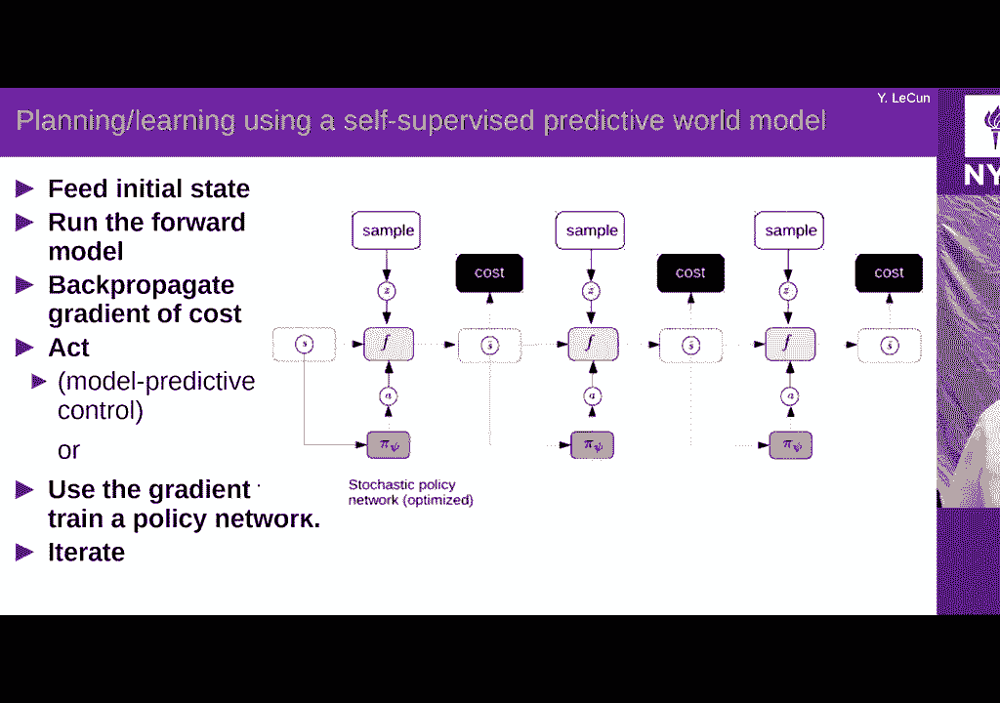

仍在从事这个项目，所以在这里您要训练汽车，仍在从事这个项目，所以在这里您要训练汽车，自己开车，很难预测您周围的汽车将要行驶什么，很难预测您周围的汽车将要行驶什么，这样做是为了将相机放在高速公路上方。

然后观看，这样做是为了将相机放在高速公路上方，然后观看，汽车经过，您可以跟踪每辆汽车，然后，汽车经过，您可以跟踪每辆汽车，然后，提取汽车的附近，提取汽车的附近，基本上每辆车周围都有一个矩形。

基本上每辆车周围都有一个矩形，表示其他汽车相对于，表示其他汽车相对于，到您的车上，这就是底部代表的内容，到您的车上，这就是底部代表的内容，嗯，所以在底部，您有一个以矩形为中心的小矩形，嗯，所以在底部。

您有一个以矩形为中心的小矩形，给定的车，然后周围的所有车都是，给定的车，然后周围的所有车都是，你知道那辆车以那个车为中心的一个矩形，你知道那辆车以那个车为中心的一个矩形，在中间的标准化位置。

在中间的标准化位置，矩形，您为每辆车执行此操作它为您提供的是每辆车一个序列，矩形，您为每辆车执行此操作它为您提供的是每辆车一个序列，周围的汽车将要做什么，周围的汽车将要做什么。

我们可以用它来训练一个向前的模型，我们可以用它来训练一个向前的模型，可以预测我们将要运行的汽车，可以预测我们将要运行的汽车，问题是这个前向模型是否正在预测所有可能的期货。

问题是这个前向模型是否正在预测所有可能的期货，不管我们采取了什么行动，不管我们采取了什么行动，一组期货，因此采取了一项行动，甚至，一组期货，因此采取了一项行动，甚至，因此，给定一个初始状态。

一个动作和百分之一的特定值，因此，给定一个初始状态，一个动作和百分之一的特定值，潜在变量将做出单个预测，然后，潜在变量将做出单个预测，然后，您可以更改潜在变量，然后进行多项预测，您可以更改潜在变量。

然后进行多项预测，你当然可以改变动作，你当然可以改变动作，所以我重新画了我以前在这里画的小图，所以我重新画了我以前在这里画的小图，状态基本上是此视频中的三帧序列，状态基本上是此视频中的三帧序列，嗯。

这里没有抽象状态，只是，嗯，这里没有抽象状态，只是，图片本身蓝色的车是我们的车，绿色的车是我们的车，图片本身蓝色的车是我们的车，绿色的车是我们的车，卡片，因此您可以从，卡片，因此您可以从。

过去是通过这个试图预测的神经网络运行的，过去是通过这个试图预测的神经网络运行的，下一个呃下一个帧好用，下一个呃下一个帧好用，基本上是一个大的卷积网络，作为一个预测变量和一个大的商业。

基本上是一个大的卷积网络，作为一个预测变量和一个大的商业，网络作为解码器，但这里有一个潜在变量，还有一个动作，网络作为解码器，但这里有一个潜在变量，还有一个动作，在这里没有画入这个，在这里没有画入这个。

而且系统还具有编码器，因此看起来更像这样。

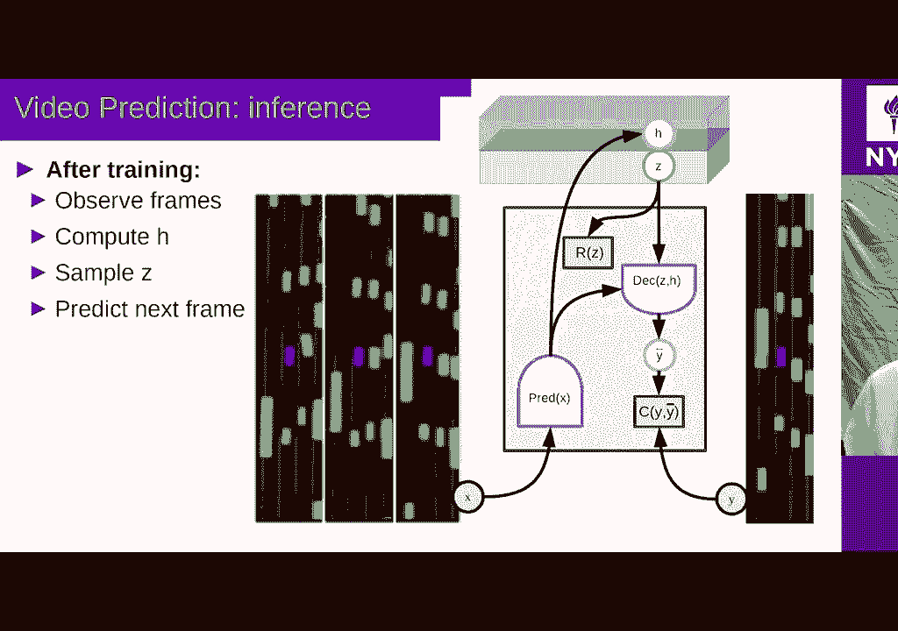

而且系统还具有编码器，因此看起来更像这样，还有一个，这里的动作不代表但，还有一个，这里的动作不代表但，想象有一个，所以x是过去的帧，想象有一个，所以x是过去的帧，预测输入表示形式的预测变量。

预测输入表示形式的预测变量，然后，该表示进入解码器的卷积网络，然后，该表示进入解码器的卷积网络，预测它基本上是相加组合，预测它基本上是相加组合，具有潜在变量，因此将其添加到潜在变量，具有潜在变量。

因此将其添加到潜在变量，在进入预测下一个状态的解码器之前，在进入预测下一个状态的解码器之前，而潜在变量本身就是隔离变量，但是，而潜在变量本身就是隔离变量，但是，由编码器预测，编码器本身也是卷积网络。

由编码器预测，编码器本身也是卷积网络，它需要过去，将来和未来，并试图预测，它需要过去，将来和未来，并试图预测，现在，您必须限制潜变量的理想值，现在，您必须限制潜变量的理想值，信息内容。

在此特定项目中使用，信息内容，在此特定项目中使用，有点像vae般的方法，有点像vae般的方法，我的意思是，这基本上是一场具有一些技巧的竞赛，我的意思是，这基本上是一场具有一些技巧的竞赛。

所以这是从获得的分布中采样的，所以这是从获得的分布中采样的，从编码器的输出到编码器的输出a，从编码器的输出到编码器的输出a，z bar的预测以及方差和，z bar的预测以及方差和。

z是从该分布中的采样的，因此它不是，z是从该分布中的采样的，因此它不是，优化采样，但也有一个术语试图最小化平方和，但也有一个术语试图最小化平方和，随时间变化的疾病数量，这是vae的标准uh技术。

随时间变化的疾病数量，这是vae的标准uh技术，然后进入解码器，因此这是有条件的趋势，然后进入解码器，因此这是有条件的趋势，自动编码器基本上还有另一个技巧，自动编码器基本上还有另一个技巧。

这就是将时间z的一半简单地设置为零，因此，这就是将时间z的一半简单地设置为零，因此，一半时间，系统被告知您不允许使用z，一半时间，系统被告知您不允许使用z，只是让您的背靠背猜测为没有z的预测。

只是让您的背靠背猜测为没有z的预测，并促使系统在某种程度上真正地利用了过去，并促使系统在某种程度上真正地利用了过去，比仅使用一个嘈杂的z更大的方法，比仅使用一个嘈杂的z更大的方法。

标准的系统基本忽略的ie类型训练，标准的系统基本忽略的ie类型训练，过去只是作弊，它看起来，过去只是作弊，它看起来，为什么将来我会在实验室中更详细地介绍其余内容的答案。

为什么将来我会在实验室中更详细地介绍其余内容的答案，实验室吧，也许你想说点关于枪支的事，实验室吧，也许你想说点关于枪支的事。

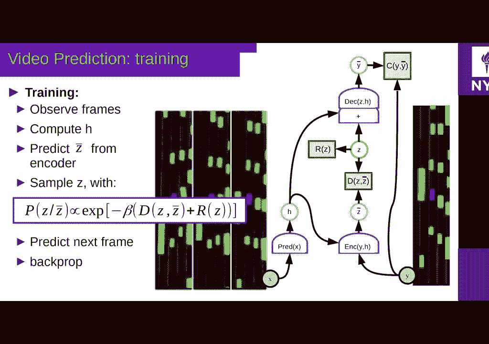

因为我实际上也会在整个演示过程中，因为我实际上也会在整个演示过程中。

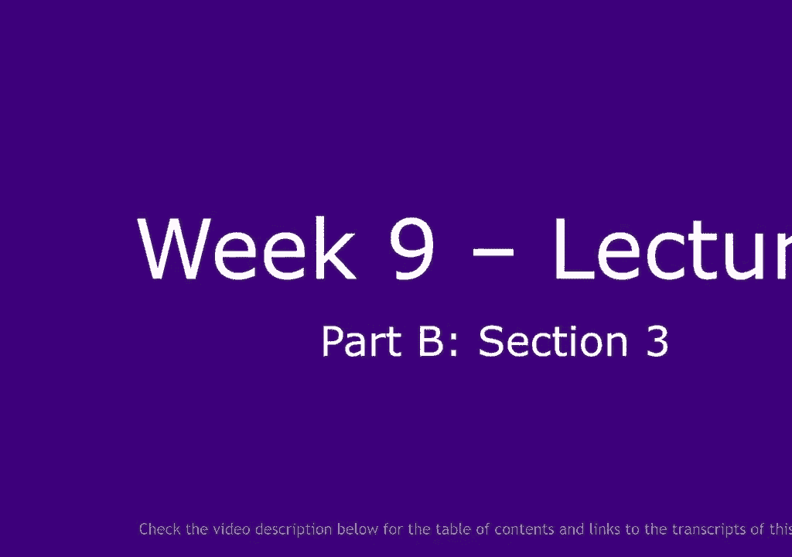

你是甘斯，是对比学习的一种特殊形式。

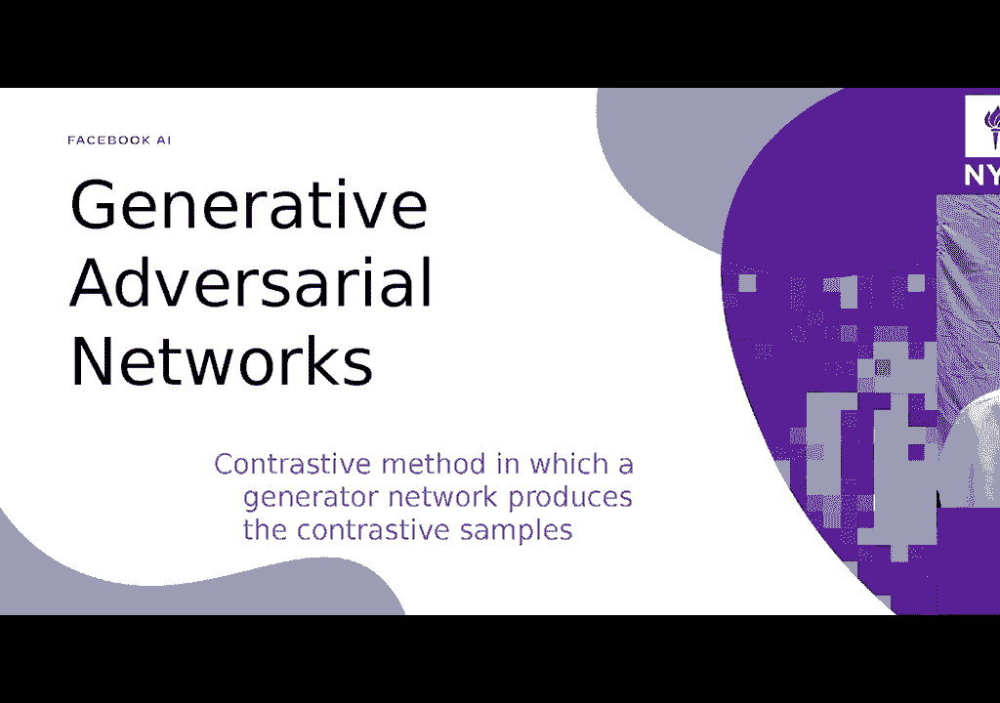

你是甘斯，是对比学习的一种特殊形式，好吧，请记住，当我们谈论基于能量的学习时，好吧，请记住，当我们谈论基于能量的学习时，有数据点，和我们的模型，我要去的，这样画，具有成本函数，它可以具有任何一种。

具有成本函数，它可以具有任何一种，结构，但我只是要像这样绘制，结构，但我只是要像这样绘制，所以这将是一种重建类型，所以这将是一种重建类型，正确的模型，因此可以想象这里的模型是自动编码器，正确的模型。

因此可以想象这里的模型是自动编码器，这样，但您可以想象，这样，但您可以想象，关于任何简化版本，我的意思是更多，关于任何简化版本，我的意思是更多，通用版本只是y进入成本函数而我不是。

通用版本只是y进入成本函数而我不是，指定成本函数看起来像什么，指定成本函数看起来像什么，所以成本函数计算的是y的空间，所以说y是，所以成本函数计算的是y的空间，所以说y是，二维的。

是一种我们希望在数据上偏低而外部数据偏高的能量，是一种我们希望在数据上偏低而外部数据偏高的能量，我故意在这里画了一个不好的能量函数，所以这个能量，我故意在这里画了一个不好的能量函数，所以这个能量。

功能不好是因为，功能不好是因为，在我们拥有数据的该区域附近应该偏低，在我们拥有数据的该区域附近应该偏低，而且外面应该更高，现在很低，而且外面应该更高，现在很低，在这个地区在这里，所以我们讨论了对比方法。

对比方法包括，所以我们讨论了对比方法，对比方法包括，取样并降低其能量，取样并降低其能量，然后取一个对比样本，我要用紫色画出来，所以对比样品应该是，我要用紫色画出来，所以对比样品应该是。

我们的模型已经给低能量但不应该给低能量的样本，我们的模型已经给低能量但不应该给低能量的样本，我们要加倍努力，所以，我们要加倍努力，所以，压低这个家伙的能量压低那个家伙的能量。

压低这个家伙的能量压低那个家伙的能量，如果您继续挑选那些样品和那些，如果您继续挑选那些样品和那些，对比样品好，通过最小化一些目标函数来使能量，通过最小化一些目标函数来使能量，蓝点小而粉红色点的能量高。

则系统将，蓝点小而粉红色点的能量高，则系统将，将会正确学习，因此我们已经看到了几种生成方法，将会正确学习，因此我们已经看到了几种生成方法，对比样本去噪自动编码器的想法，对比样本去噪自动编码器的想法。

就是要取样并以某种方式将其破坏，就是要取样并以某种方式将其破坏，我们已经看到了，差异比较大，需要采样，然后能量下降，差异比较大，需要采样，然后能量下降，带有一些噪音，这给您带来收缩的样品以推高。

带有一些噪音，这给您带来收缩的样品以推高，嗯，您知道我们已经看到了许多其他基于，嗯，您知道我们已经看到了许多其他基于，关于之间的相似性的先验知识，关于之间的相似性的先验知识，样本之间，但这是另一个想法。

样本之间，但这是另一个想法，另一个想法是使用训练神经网络来产生，另一个想法是使用训练神经网络来产生，那些聪明地签约的样品，这就是甘斯的基本想法，那些聪明地签约的样品，这就是甘斯的基本想法。

至少以一种叫做能量型甘子的甘特形式，至少以一种叫做能量型甘子的甘特形式，您可以针对几种配方进行配制，实际上有一个完整的洗衣清单，您可以针对几种配方进行配制，实际上有一个完整的洗衣清单。

各种类型的gans的基本概念，各种类型的gans的基本概念，甘斯的意思是你训练你的能量模型，所以，甘斯的意思是你训练你的能量模型，所以，甘恩背景下的能量模型称为，甘恩背景下的能量模型称为。

歧视者或批评家，但基本上与，歧视者或批评家，但基本上与，能量模型，而您尝试需要消耗低能量，能量模型，而您尝试需要消耗低能量，数据点，然后训练另一个网络，数据点，然后训练另一个网络。

神经网络生成对比数据点，然后将其能量上移，神经网络生成对比数据点，然后将其能量上移，好吧，整个图是这样的，好吧，整个图是这样的，你有一个歧视者，歧视者真的应该是，你有一个歧视者，歧视者真的应该是。

没有这样绘制，可能是一个大型神经网络，没有这样绘制，可能是一个大型神经网络，但最后哎呀抱歉，最后只是成本函数，好，所以它需要一个变量y，它会告诉您，如果低能量是好能量，那么低能量是好还是坏，它会告诉您。

如果低能量是好能量，那么低能量是好还是坏，坏，因此，在一个阶段中，您将从中收集数据，因此，在一个阶段中，您将从中收集数据，设置好并将其交给您的鉴别器，好吧，这是一个，设置好并将其交给您的鉴别器，好吧。

这是一个，真正来自数据，真正来自数据，这是一个训练样本，您说的是，这是一个训练样本，您说的是，其中应该下降好吧，我应该真正写成f，其中应该下降好吧，我应该真正写成f，因为毕竟这只是一个能量函数。

因为毕竟这只是一个能量函数，好的，因此，通过更改，好的，因此，通过更改，参数正确，所以您可以用w减去eta进行替换，参数正确，所以您可以用w减去eta进行替换，df所以f是一个神经网络f是一个神经网络。

df所以f是一个神经网络f是一个神经网络，选择函数，但可能是神经网络，可能是相当复杂的神经，选择函数，但可能是神经网络，可能是相当复杂的神经，净，好吧，这是第一件事，这将使数据充满活力，好吧。

这是第一件事，这将使数据充满活力，点小好吧，现在有一种形式是，点小好吧，现在有一种形式是，有条件的，所以你有条件的形式，有条件的，所以你有条件的形式，这里是一个额外的输入，这是一个观察。

这里是一个额外的输入，这是一个观察，好的，但您可以将此条件再次设置为“有条件”，好的，但您可以将此条件再次设置为“有条件”，没关系，第二阶段还是对比样本，没关系，第二阶段还是对比样本。

您有一个样本的潜在变量z，您有一个样本的潜在变量z，从某些分布中可以很容易地从一个样本中取样的分布，从某些分布中可以很容易地从一个样本中取样的分布，高斯多元多元高斯，高斯多元多元高斯，或制服。

或者您通过所谓的生成器运行的东西，或制服，或者您通过所谓的生成器运行的东西，所以这是一个神经网络，而神经网络会产生，所以这是一个神经网络，而神经网络会产生，类似白色的东西好吧，它只是产生一个图像。

让我们说，类似白色的东西好吧，它只是产生一个图像，让我们说，图片，再一次通过鉴别器运行，再一次通过鉴别器运行，但是现在你想做的很好，但是现在你想做的很好，所以实际上我之前告诉你的是谎言。

所以实际上我之前告诉你的是谎言，呃你不这样做更新，好的，但是在这里您想要做的是，好的，但是在这里您想要做的是，此y栏高的fw，好的，而您现在要做的是训练，而您现在要做的是训练，鉴别器和发生器同时。

鉴别器和发生器同时，因此，您首先必须提出一个成本函数，一个损失函数，因此，您首先必须提出一个成本函数，一个损失函数，而这个损失函数将是你知道一些，而这个损失函数将是你知道一些，嗯。

您知道每个样本损失函数的夏季样本，嗯，您知道每个样本损失函数的夏季样本，基本上是y的f和y的f的函数，基本上是y的f和y的f的函数，当然，y bar是从随机采样的潜在变量z生成的，当然。

y bar是从随机采样的潜在变量z生成的，现在这个成本函数需要是y的f的递减函数，现在这个成本函数需要是y的f的递减函数，y的f的增加函数还可以，y的f的增加函数还可以。

您可以使用几乎任何所需的成本函数，您可以使用几乎任何所需的成本函数，它使y减小，并且使y bar的f增加，它使y减小，并且使y bar的f增加，或只要能使差值减小y的f减去y bar的f。

或只要能使差值减小y的f减去y bar的f，这样的例子可能是，这样的例子可能是，例子好吧，这样说我的损失函数，例子好吧，这样说我的损失函数，将是，y的f加上一些余量减去y的f。

y的f加上一些余量减去y的f，正面部分好，所以这是一个铰链，正面部分好，所以这是一个铰链，它说我想使y bar的f小于，它说我想使y bar的f小于，除了那个，我不在乎，除了那个，我不在乎。

比我对不起我把这个倒退了，比我对不起我把这个倒退了，所以总体上来说，它是y bar f的函数，所以总体上来说，它是y bar f的函数，好吧，所以它想使y bar的f大于m好吧，这就是一个例子，好吧。

所以它想使y bar的f大于m好吧，这就是一个例子，实际使用的成本函数，最常用的gans配方，实际使用的成本函数，最常用的gans配方，基本上将每个这些术语插入到S型中。

基本上将每个这些术语插入到S型中，并尝试使您知道应用于y的f的S形近似，并尝试使您知道应用于y的f的S形近似，尽可能将1和sigma应用于f bar尽可能接近零。

尽可能将1和sigma应用于f bar尽可能接近零，你知道它基本上就是这样，所以它是乙状结肠，你知道它基本上就是这样，所以它是乙状结肠，y之f，再加上y bar的负八分之一sigma和。

再加上y bar的负八分之一sigma和，你，你把日志，因为嗯，我的意思是这不是最后一个功能，你，你把日志，因为嗯，我的意思是这不是最后一个功能，这是因为在最后一个功能之前，所以这是。

这是因为在最后一个功能之前，所以这是，有点像交叉熵，但是交叉熵是正的，有点像交叉熵，但是交叉熵是正的，对于积极的阶段和，对于积极的阶段和，负相位um的目标值为负，负相位um的目标值为负，是的。

我不应该这样写，这是错误的，实际上对此感到抱歉，是的，我不应该这样写，这是错误的，实际上对此感到抱歉，但您将其归为每个类别中最大的类别，但您将其归为每个类别中最大的类别，所以从技术上讲。

您知道1的对数加上y的指数f，您知道1的对数加上y的指数f，对于该日志f1加上正确的负号，对于该日志f1加上正确的负号，e至y的f加对数，e至y的f加对数，一加e等于y的负f。

但是您可以想象这种类型的大量目标函数，但是您可以想象这种类型的大量目标函数，好的，这是您要使用的最后一个功能，好的，这是您要使用的最后一个功能，训练鉴别器，但是生成器是用于，训练鉴别器。

但是生成器是用于，鉴别器，但这将是损失函数，鉴别器，但这将是损失函数，发电机，这是一个不同的损失函数，发电机，这是一个不同的损失函数，您将以相同的方式优化这两个损失函数。

您将以相同的方式优化这两个损失函数，发电机的一种是基本上要制造发电机的一种，发电机的一种是基本上要制造发电机的一种，产生鉴别者认为的输出，产生鉴别者认为的输出，很好，但他们不好，所以基本上发电机，很好。

但他们不好，所以基本上发电机，嗯，你想，嗯，你想，调整其权重，使其产生y的输出，调整其权重，使其产生y的输出，酒吧产生低能量供您好，酒吧产生低能量供您好，因此，您对随机变量z进行采样。

然后通过它生成的生成器运行它，因此，您对随机变量z进行采样，然后通过它生成的生成器运行它，ay栏，您遍历y的f，ay栏，您遍历y的f，你得到一些价值，然后回传价值，你得到一些价值，然后回传价值。

通过发电机并使重量适应发电机，以便，通过发电机并使重量适应发电机，以便，这种能量会下降，所以基本上发电机正在尝试寻找白色，这种能量会下降，所以基本上发电机正在尝试寻找白色，能量尽可能低的酒吧。

能量尽可能低的酒吧，好吧，它会训练自己明智地生产，好吧，它会训练自己明智地生产，如果我们正在谈论的话，再次有低能量，如果我们正在谈论的话，再次有低能量，有条件的收益，将有一个x变量要输入，有条件的收益。

将有一个x变量要输入，这两个模块，但最终没有区别，这两个模块，但最终没有区别，所以lg可能只是一个增加的功能，所以lg可能只是一个增加的功能，的酒吧，我认为我们快没时间了，我认为我们快没时间了。

我们时间用完了，所以这是一些目标函数，所以这是一些目标函数，如果g是z的生成器，则g的f的其中z是，如果g是z的生成器，则g的f的其中z是，随机取样，好的，所以您只需备份一下，然后更改参数，好的。

所以您只需备份一下，然后更改参数，g的称呼它们为u，所以现在下降了，这是黄金，g的称呼它们为u，所以现在下降了，这是黄金，从某种意义上说，这被称为游戏，您有两个目标，从某种意义上说，这被称为游戏。

您有两个目标，您需要同时最小化的功能，并且它们不兼容，您需要同时最小化的功能，并且它们不兼容，彼此之间，所以它不是梯度下降，彼此之间，所以它不是梯度下降，问题，你必须找到什么之间的纳什均衡，问题。

你必须找到什么之间的纳什均衡，那两个函数和梯度下降将不起作用，那两个函数和梯度下降将不起作用，默认情况下会导致不稳定，并且存在，默认情况下会导致不稳定，并且存在，关于如何使枪支实际工作的大量论文。

关于如何使枪支实际工作的大量论文，那是一个复杂的部分，但阿尔弗雷多会告诉你有关这一切的一切，那是一个复杂的部分，但阿尔弗雷多会告诉你有关这一切的一切，嗯，明天也许你也想提一提，嗯，明天也许你也想提一提。

带有乙状结肠的，会引起一些问题，带有乙状结肠的，会引起一些问题，如果我们有接近真实流形的样本，如果我们有接近真实流形的样本，是的，然后我想我们可以结束结论了，所以我要提到，是的。

然后我想我们可以结束结论了，所以我要提到，因此，让我们想象一下您的数据，因此，让我们想象一下您的数据，再次基于能源的框架，您的数据围绕着一些流形，但是它是一个细流形，所以它是一个。

您的数据围绕着一些流形，但是它是一个细流形，所以它是一个，无限稀薄的分布，无限稀薄的分布，好的，在gan的原始公式中，区分器将需要gan，好的，在gan的原始公式中，区分器将需要gan，产生零概率。

产生零概率，好吧，所以这里需要产生零概率，好吧，所以这里需要产生零概率，它需要在伊斯特伍德的流形上进行生产，它需要在伊斯特伍德的流形上进行生产，无限概率，这样，如果积分真的是密度估计，这样。

如果积分真的是密度估计，以这种密度在整个空间上的积分，以这种密度在整个空间上的积分，是一个，这当然很难，所以甘斯基本上放弃了，是一个，这当然很难，所以甘斯基本上放弃了，实际学习分布他们想要做的是产生零。

实际学习分布他们想要做的是产生零，原始公式在数据流形之外产生零，原始公式在数据流形之外产生零，并在这里产生一个是乙状结肠的输出，并在这里产生一个是乙状结肠的输出，必须是一个，这意味着加权总和必须等于。

必须是一个，这意味着加权总和必须等于，本质上是无限的，所以没有什么不同，本质上是无限的，所以没有什么不同，嗯，这样做的问题是，如果您成功地训练了系统，嗯，这样做的问题是，如果您成功地训练了系统。

然后您得到的能量函数在数据流形之外为零，并且，然后您得到的能量函数在数据流形之外为零，并且，数据流形上的一个能量功能完全，数据流形上的一个能量功能完全，没用的，因为没用，因为它是高尔夫球场，没用的。

因为没用，因为它是高尔夫球场，对，它是扁平的，所以能量函数，对，它是扁平的，所以能量函数，基本上，与此相对应的是，基本上，与此相对应的是，该权利的否定日志，它将是，该权利的否定日志，它将是。

这将是无穷大，并且成本函数的最小值，这将是无穷大，并且成本函数的最小值，在流形上，例如，如果为零，在流形上，例如，如果为零，如果是自动编码器，能量将小于零，如果是自动编码器，能量将小于零，对，嗯。

这是一个高尔夫球场，对，嗯，这是一个高尔夫球场，无限的海拔高度，实际上对您没有什么用，无限的海拔高度，实际上对您没有什么用，如我之前所说，希望每一种基于能量的，如我之前所说，希望每一种基于能量的，模型。

如果您希望基于能量的模型有用，模型，如果您希望基于能量的模型有用，您想要能量函数平滑，您想要能量函数平滑，你不希望它达到无限，你不希望它达到无限，一个很小的步骤，您希望它平滑，以便可以进行推断。

一个很小的步骤，您希望它平滑，以便可以进行推断，如果您从这里开始，很容易，如果您从这里开始，很容易，在附近的歧管上找到一个点，在附近的歧管上找到一个点，使用和下降例如正确，所以甘的原始配方。

使用和下降例如正确，所以甘的原始配方，导致首先在，导致首先在，鉴别器不稳定性，称为模式崩溃，鉴别器不稳定性，称为模式崩溃，阿尔弗雷多（Alfredo）会告诉您有关情况，最后提供对比功能。

阿尔弗雷多（Alfredo）会告诉您有关情况，最后提供对比功能，基本上没有用的能量函数，基本上没有用的能量函数，所以它不是理想的配方，所以人们有，所以它不是理想的配方，所以人们有，建议的方法。

通过规范化，建议的方法，通过规范化，能量函数基本上迫使它平滑，所以一个很好的例子，能量函数基本上迫使它平滑，所以一个很好的例子，是所谓的船只steingans。

由nyu毕业的martin arjoski提出，由nyu毕业的martin arjoski提出，还有莱昂纳多2和其他一些人，并且的想法是基本上限制重量的大小，并且的想法是基本上限制重量的大小。

鉴别器的功能，鉴别器的功能，很顺利，你知道各种各样的数学论证，很顺利，你知道各种各样的数学论证，在概率框架中，但这是基本思想，并且有很多，在概率框架中，但这是基本思想，并且有很多。

这种变化也对今天的课产生疑问，这种变化也对今天的课产生疑问，它很密集，但至少我们知道您回答了每个问题，它很密集，但至少我们知道您回答了每个问题，它正在通过，所以我认为我们，它正在通过，所以我认为我们。

我们今天一起走，我不确定是否你，我们今天一起走，我不确定是否你，像用另一种形式解释了它，但我没有意识到这是同一回事，像用另一种形式解释了它，但我没有意识到这是同一回事，但是我对政策网络是什么感到迷茫。

但是我对政策网络是什么感到迷茫，好的，这样做是为了使策略网络采用，好的，这样做是为了使策略网络采用，估计世界状况并产生作用，估计世界状况并产生作用，经过培训可以使预期成本降至最低。

经过培训可以使预期成本降至最低，状态越过轨迹，但只需要执行一项操作，状态越过轨迹，但只需要执行一项操作，好的，很好，最后有一部分，很好，最后有一部分，我想你从。开始画了​​一个新的连接，我想你从。

开始画了​​一个新的连接，到呃，它下降到，到呃，它下降到，就像通过某个模块连接到一个，所以那里发生了什么，所以，就像通过某个模块连接到一个，所以那里发生了什么，所以，策略网络由pi在此处指示。

策略网络由pi在此处指示，屏幕，因此需要状态，屏幕，因此需要状态，它产生一个动作，好的，好的，好的，这就是正确的政策，您可以观察世界的状况，好的，好的，好的，这就是正确的政策，您可以观察世界的状况。

然后您采取行动，我认为还可以，事实上您是一个概率策略，然后您采取行动，我认为还可以，事实上您是一个概率策略，不要采取行动，而是将行动分配给，不要采取行动，而是将行动分配给。

然后您以某种方式选择动作并执行该分配，然后您以某种方式选择动作并执行该分配，但是在这里你知道你只需要采取行动，但是在这里你知道你只需要采取行动，如果动作数是离散的，那么这个pi网络，如果动作数是离散的。

那么这个pi网络，这个政策网络基本上是一个分类器，它产生了一堆，这个政策网络基本上是一个分类器，它产生了一堆，为每个可能的动作评分，然后您采取其中一项动作，为每个可能的动作评分，然后您采取其中一项动作。

概率地或确定性地确定你，概率地或确定性地确定你，得分最高的动作，得分最高的动作，嗯，您可以根据，嗯，您可以根据，得分，然后遍历手机型号，然后继续前进，得分，然后遍历手机型号，然后继续前进，好吧。

所以没有策略连接，好吧，所以没有策略连接，那么动作只是一种相关变量，因此您必须进行优化，那么动作只是一种相关变量，因此您必须进行优化，关于潜在变量以找到其最佳值，因此，关于潜在变量以找到其最佳值，因此。

你现在有这种呃图表，你现在有这种呃图表，动作不是由神经网络产生的，动作不是由神经网络产生的，他们有潜在的变量，你必须弄清楚，他们有潜在的变量，你必须弄清楚，每当您运行模型时，就为每个新产品。

每当您运行模型时，就为每个新产品，您必须找出最佳的行动顺序，以最大程度地减少我的费用，您必须找出最佳的行动顺序，以最大程度地减少我的费用，所以你必须基本上做到这一点，所以你必须基本上做到这一点，例如。

通过对血统进行分级以找出将最小化的序列，例如，通过对血统进行分级以找出将最小化的序列，c在轨迹上的总和称为，c在轨迹上的总和称为，对预测控制进行建模，然后将其与政策相结合，对预测控制进行建模。

然后将其与政策相结合，网络um被称为uh，网络um被称为uh，你知道直接控制本质上是教授，你知道直接控制本质上是教授，你说在保险期间我们需要尽量减少，你说在保险期间我们需要尽量减少，获得最终价值的能量。

但嗯，有两个问题，获得最终价值的能量，但嗯，有两个问题，推理过程不会花费太多时间，推理过程不会花费太多时间，对于实时系统将很有用，第二个是因为，对于实时系统将很有用，第二个是因为，展开。

您必须从头开始一直向后传播，展开，您必须从头开始一直向后传播，有我们在循环神经中面临的所有问题，有我们在循环神经中面临的所有问题，网络，大概是您不会，网络，大概是您不会，得到与当前网络相同的问题。

因为您的前锋，得到与当前网络相同的问题，因为您的前锋，您知道的模型可能实现了，您知道的模型可能实现了，某些实际系统的动态性，因此可能没有问题，某些实际系统的动态性，因此可能没有问题，如果它是物理系统。

则具有某种不可逆性，如果它是物理系统，则具有某种不可逆性，可能是可逆的，所以您可能没有相同的，可能是可逆的，所以您可能没有相同的，与定期循环网一样的问题，但是嗯，是的，您在，与定期循环网一样的问题。

但是嗯，是的，您在，现在在实时情况下同样的问题，现在在实时情况下同样的问题，您使用一种称为“重新播种地平线计划”的形式，您使用一种称为“重新播种地平线计划”的形式，规划，好吧，让地平线规划退缩是吧。

当你在一个，好吧，让地平线规划退缩是吧，当你在一个，这是实时情况，您的系统将，这是实时情况，您的系统将，在未来的几个步骤中运行其正向模型，在未来的几个步骤中运行其正向模型，我不知道可以说几秒钟。

足够多的步骤可以预测，我不知道可以说几秒钟，足够多的步骤可以预测，几秒钟就是你的地平线，那么你就可以做这个模型预测，几秒钟就是你的地平线，那么你就可以做这个模型预测，通过寻找最佳空气来控制您所知道的。

通过寻找最佳空气来控制您所知道的，根据您的，根据您的，模特，好吧，你知道你还没有采取行动，模特，好吧，你知道你还没有采取行动，好吧，您只需运行内部模型即可做出该预测，好吧。

您只需运行内部模型即可做出该预测，嗯，因此，通过针对a进行优化，您可以找到a的序列，嗯，因此，通过针对a进行优化，您可以找到a的序列，优化成本，然后采取第一个行动，优化成本，然后采取第一个行动。

在那个然后你再做一次就好了，所以跟一个你说话观察状态，在那个然后你再做一次就好了，所以跟一个你说话观察状态，现在您可以从世界上观察到一个新的状态，现在您可以从世界上观察到一个新的状态，您的传感器。

然后重复此过程运行您的正向模型，您的传感器，然后重复此过程运行您的正向模型，未来的许多步骤将优化操作顺序，以最大程度地减少您的操作，未来的许多步骤将优化操作顺序，以最大程度地减少您的操作。

成本采取第一个行动然后再做一次，成本采取第一个行动然后再做一次，因此，如果您的前向模型是，因此，如果您的前向模型是，复杂的嗯，所以那时候你需要一个前锋，复杂的嗯，所以那时候你需要一个前锋。

为政策网络建模，为政策网络建模，政策网络基本上将整个过程编译成一个，政策网络基本上将整个过程编译成一个，直接从状态产生最佳动作的神经网络，直接从状态产生最佳动作的神经网络，这可能会或可能不会。

但是现在给您一个很好的猜测，这可能会或可能不会，但是现在给您一个很好的猜测，给你一个具体的例子，这是由，给你一个具体的例子，这是由，居住在纽约的诺贝尔经济学奖得主，居住在纽约的诺贝尔经济学奖得主。

丹尼·卡尼曼（Danny Kahneman）和他谈到了，丹尼·卡尼曼（Danny Kahneman）和他谈到了，人类的心灵被称为系统一和系统二，人类的心灵被称为系统一和系统二，因此。

系统第一是您无需思考就采取行动的过程，因此，系统第一是您无需思考就采取行动的过程，好吧，你是一个非常有经验的司机，你甚至可以开车，好吧，你是一个非常有经验的司机，你甚至可以开车。

注意力集中在你身边的人说话，注意力集中在你身边的人说话，你实际上不需要考虑好吗，你实际上不需要考虑好吗，系统二是更多的故意计划，系统二是更多的故意计划，所以系统二是当您使用世界的内部模型时。

所以系统二是当您使用世界的内部模型时，提前预测未来会发生什么，提前预测未来会发生什么，某种预见会发生什么，然后故意，某种预见会发生什么，然后故意，根据您的模型，您认为应该采取的正确措施是，根据您的模型。

您认为应该采取的正确措施是，这更像是推理，您可以想到这个，这更像是推理，您可以想到这个，关于行动的优化，以最大程度地减少目标，关于行动的优化，以最大程度地减少目标，推理，我们之前谈论过这个，推理。

我们之前谈论过这个，所以基本上，模型预测控制是当您没有政策时，所以基本上，模型预测控制是当您没有政策时，还没学到技巧，就知道您的成本函数是什么，还没学到技巧，就知道您的成本函数是什么。

有一个很好的世界模型，但是你不知道如何反应好，所以，有一个很好的世界模型，但是你不知道如何反应好，所以，初学者棋手会像你，初学者棋手会像你，你看着追逐游戏，你必须考虑所有可能性，你看着追逐游戏。

你必须考虑所有可能性，在玩之前，因为您知道自己不知道去哪里，在玩之前，因为您知道自己不知道去哪里，玩，所以你必须想象所有的可能性，玩，所以你必须想象所有的可能性，如果您是专家玩家，并且与。

如果您是专家玩家，并且与，一个初学者，您立即知道该玩什么，而不必考虑它，一个初学者，您立即知道该玩什么，而不必考虑它，我不知道你是否同时玩过，我不知道你是否同时玩过，国际象棋大师或大师可以玩。

国际象棋大师或大师可以玩，对抗50个人，并在几分钟内击败了他们，对抗50个人，并在几分钟内击败了他们，因为玩家可以从你知道的一个，因为玩家可以从你知道的一个，对手，然后立即玩就完全反应了，对手。

然后立即玩就完全反应了，嗯，您实际上不需要思考，因为，嗯，您实际上不需要思考，因为，你知道他们已经编译过了，如果你愿意的话，你知道他们已经编译过了，如果你愿意的话，以他们对国际象棋的了解。

当您看到这个时，他们不需要思考，以他们对国际象棋的了解，当您看到这个时，他们不需要思考，一种简单的情况，所以从第二系统到第一系统，一种简单的情况，所以从第二系统到第一系统，嗯，一开始学习技能时。

你会犹豫，必须思考，嗯，一开始学习技能时，你会犹豫，必须思考，关于它，您知道开车时会抬头的，关于它，您知道开车时会抬头的，你开车慢，你看着一切，注意，你开车慢，你看着一切，注意，然后当您进行实验时。

您可以很快做出反应，然后当您进行实验时，您可以很快做出反应，基本上，您已经从模型预测控制转变为，基本上，您已经从模型预测控制转变为，如果愿意，可以训练自己的政策网络，如果愿意，可以训练自己的政策网络。

好的，在此过程中，您，好的，在此过程中，您，呃，你的技巧出自某种故意，呃，你的技巧出自某种故意，有计划的有意识的决策机制，有计划的有意识的决策机制，下意识的自动呃决策机制，下意识的自动呃决策机制。

怎样获得专业知识，这就是您从该图转到该图所在的位置的方式，这就是您从该图转到该图所在的位置的方式，直接预测行动而无需计划的政策，直接预测行动而无需计划的政策。

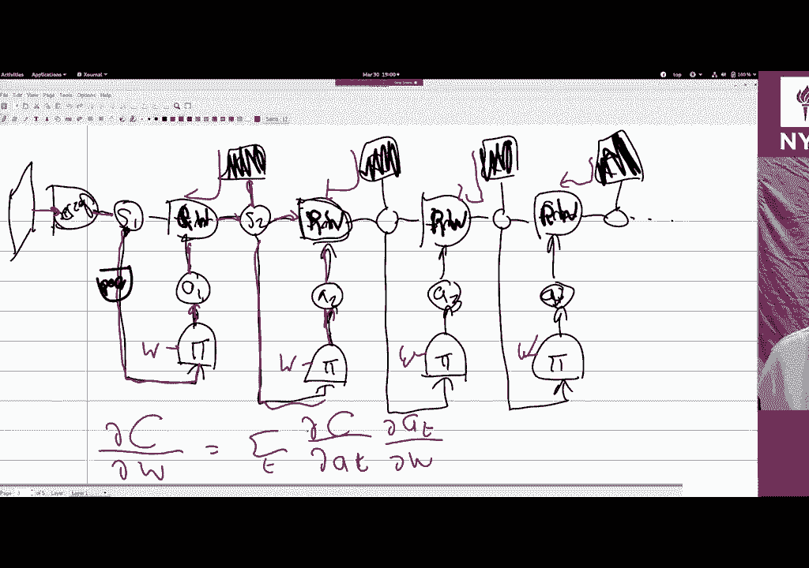