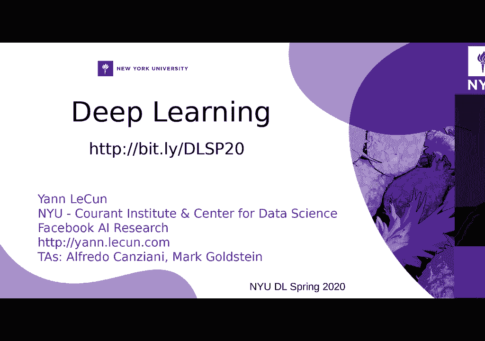
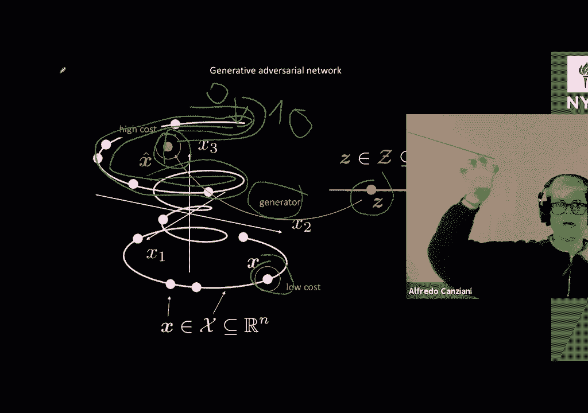
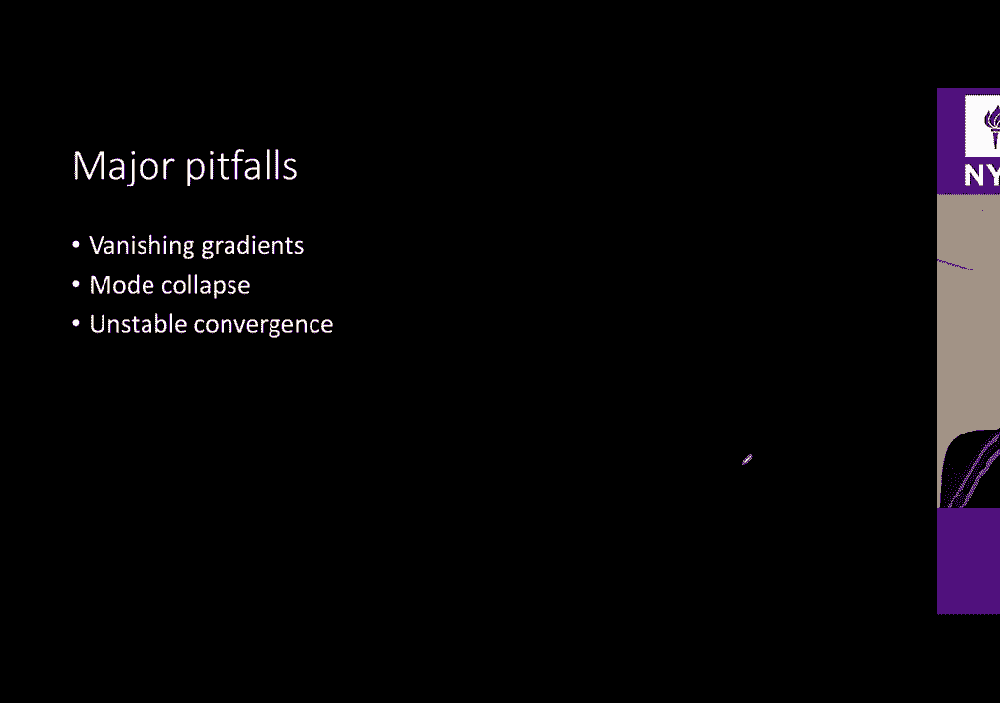
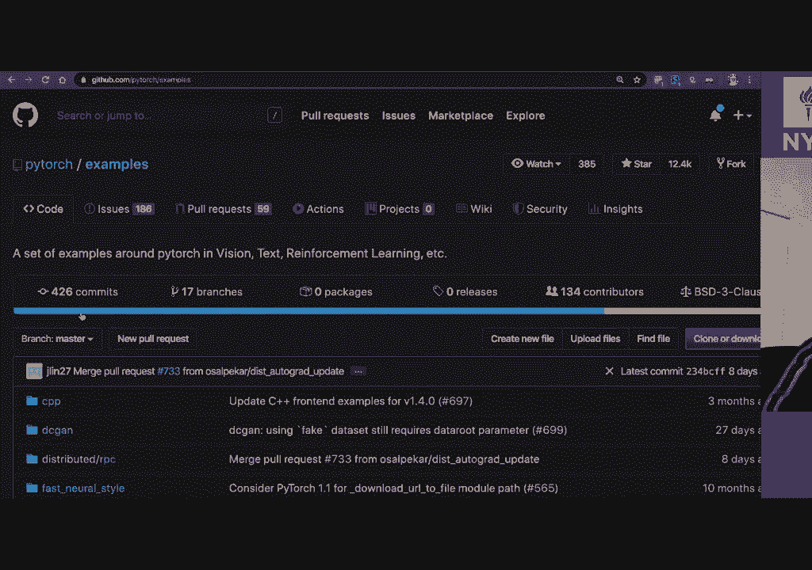
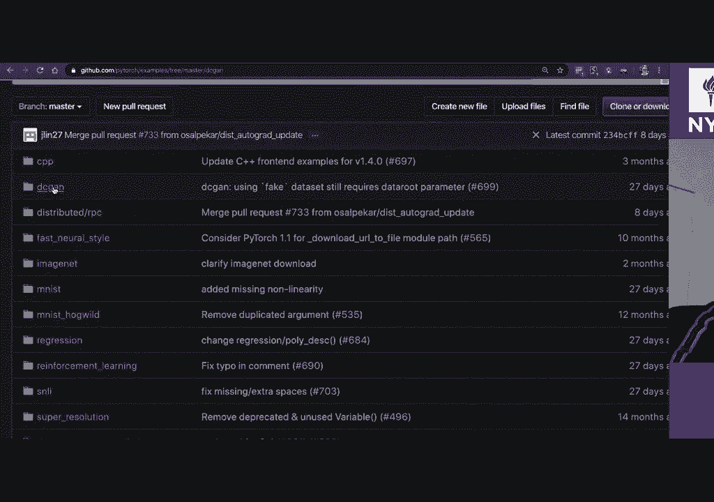
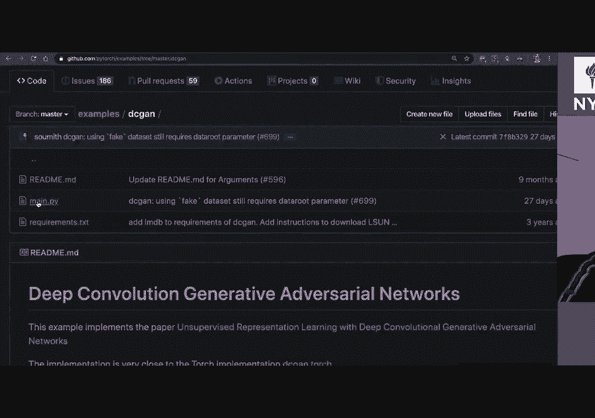
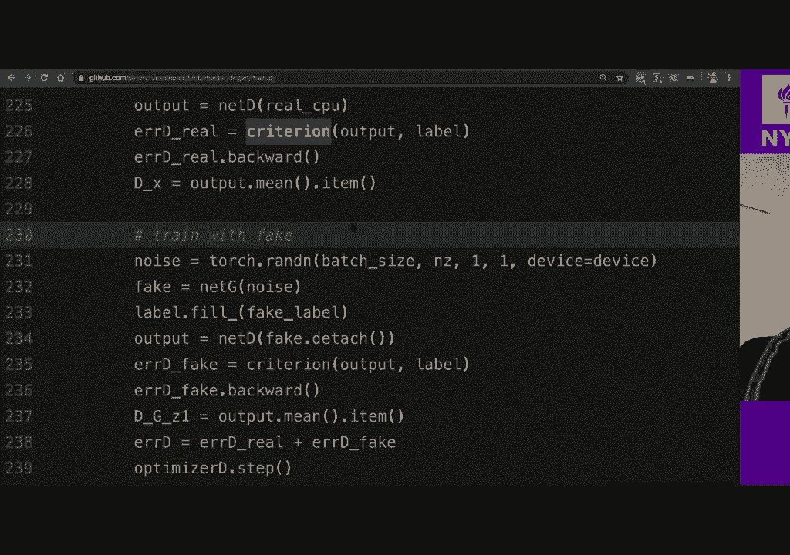
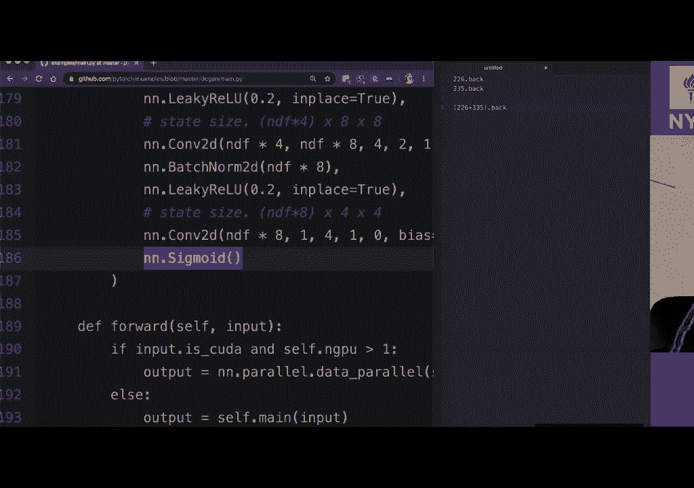
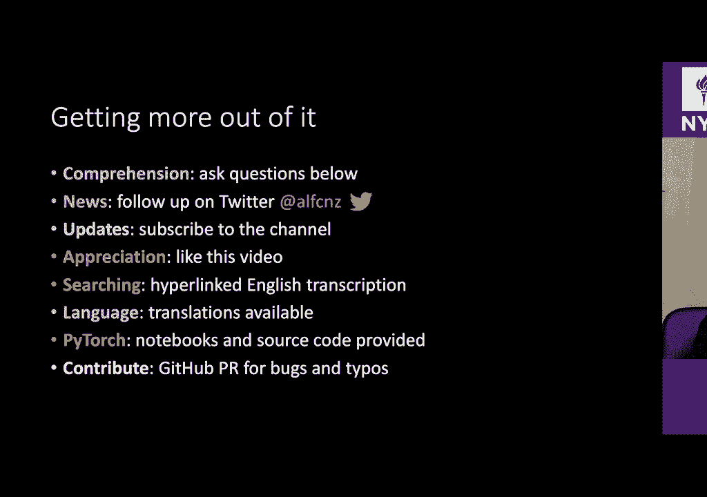

# 【NYU】纽约大学深度学习入门课程（with pytorch）中英文字幕 - P17：17.Week 9 – Practicum_ (Energy-based) Generative adversarial networks - 大佬的迷弟的粉丝 - BV1o5411p7AB

今天，我们将要讨论的是我们网络的遗传地址或如何，今天，我们将要讨论的是我们网络的遗传地址或如何，实际上使它们正确制造好，从而产生了其他氰酸盐作品。

实际上使它们正确制造好，从而产生了其他氰酸盐作品，无监督学习生成模型，因此再次生成模型，无监督学习生成模型，因此再次生成模型，大部分时间让您获得输入空间中的内容，大部分时间让您获得输入空间中的内容。

那就是你知道这个领域正在发生的事情，我们假设，那就是你知道这个领域正在发生的事情，我们假设，就像这些样本的概率分布一样，就像这些样本的概率分布一样，例如，可以将经典编码器中的解码器视为生成模型，例如。

可以将经典编码器中的解码器视为生成模型，我的看法，也对很多人表示不同意见，他们说生成模型，我的看法，也对很多人表示不同意见，他们说生成模型，必须像您知道的输入那样，遵循我们所处的特定分布。

必须像您知道的输入那样，遵循我们所处的特定分布，没有标签的无监督学习领域，让我们开始吧。

没有标签的无监督学习领域，让我们开始吧，以生成他人开始是网络。

以生成他人开始是网络，所以这是什么东西啊哈，你应该知道没事，这是，所以这是什么东西啊哈，你应该知道没事，这是，编码器的变化编码器的变化基本上就像，编码器的变化编码器的变化基本上就像，普通物品编码器。

在这种情况下，编码器为我们提供了用于，普通物品编码器，在这种情况下，编码器为我们提供了用于，我们从潜在输入采样到Zed的分布，所以唯一，我们从潜在输入采样到Zed的分布，所以唯一。

正常人之间的区别是采样器将再次踢，正常人之间的区别是采样器将再次踢，随机样本，因此无需像一个简单的代码那样编写简单的代码，随机样本，因此无需像一个简单的代码那样编写简单的代码，在这里只有一个输入。

而在这里只有一个代码，现在您将拥有，在这里只有一个输入，而在这里只有一个代码，现在您将拥有，有一些体积，因此该体积内的每个相似点都将被映射，有一些体积，因此该体积内的每个相似点都将被映射，回到原始点。

是的，您知道关于，回到原始点，是的，您知道关于，编码器的变体，让我们看看这些一般生成地址，编码器的变体，让我们看看这些一般生成地址，Arnette看起来像这样，所以我们有了这个东西，实际上是一样的。

Arnette看起来像这样，所以我们有了这个东西，实际上是一样的，对，所以这是怎么回事，我们在同一采样器中有相同的发生器，对，所以这是怎么回事，我们在同一采样器中有相同的发生器，好的。

然后我们要做什么好的，我们在那里有另一个输入，好的，然后我们要做什么好的，我们在那里有另一个输入，在它位于底部的左侧之前，现在输入已完成一半，在它位于底部的左侧之前，现在输入已完成一半，通过。

输出实际上也在一半，最后我们得到了那种，通过，输出实际上也在一半，最后我们得到了那种，交换机，然后在该交换机之上，我们通常会有一个成本网络，交换机，然后在该交换机之上，我们通常会有一个成本网络。

在经典的定义中，在经典的枪支中，我们，在经典的定义中，在经典的枪支中，我们，像歧视者一样，这个评论员需要歧视者，像歧视者一样，这个评论员需要歧视者，错误的选择至少要遵循我同意的年轻建议，因为。

错误的选择至少要遵循我同意的年轻建议，因为，我们很快就会看到为什么现在有点看到了，让我们关注一下，我们很快就会看到为什么现在有点看到了，让我们关注一下，我们有这个成本的网络还可以。

所以让我们拥有基本相似的模型吧，我们有这个成本的网络还可以，所以让我们拥有基本相似的模型吧，右侧的采样器左侧的采样器，右侧的采样器左侧的采样器，左侧有一个解码器，基本上可以生成一些东西。

左侧有一个解码器，基本上可以生成一些东西，但是由于Zed是一种代码，因此我们有一个解码步骤，而在，但是由于Zed是一种代码，因此我们有一个解码步骤，而在，右手边，因为Zed不是代码，而仅仅是输入。

所以我们有一个，右手边，因为Zed不是代码，而仅仅是输入，所以我们有一个，发生器，而这仅仅是例如高斯的样本，发生器，而这仅仅是例如高斯的样本，分布等待您知道正态分布，分布等待您知道正态分布。

那么X hat将由这个最初未经训练的网络生成，那么X hat将由这个最初未经训练的网络生成，相反，成本网络必须弄清楚如果我们喂那个，相反，成本网络必须弄清楚如果我们喂那个，X帽子是蓝色的。

因为我们想给我们就像我们想说的那样是不好的，X帽子是蓝色的，因为我们想给我们就像我们想说的那样是不好的，样本，或者如果我们对粉红色样本进行采样，则将其切换到，样本，或者如果我们对粉红色样本进行采样。

则将其切换到，选择粉红色的我们应该有一个低成本，因为那将使我们能够，选择粉红色的我们应该有一个低成本，因为那将使我们能够，弄清楚我们实际上在做你知道我们确实有一个真实的。

弄清楚我们实际上在做你知道我们确实有一个真实的，对一个好的样本进行抽样，以便总结我们在，对一个好的样本进行抽样，以便总结我们在，生成器将我的leighton输入集映射到此RN，即RN的空间。

生成器将我的leighton输入集映射到此RN，即RN的空间。输入空间，因此我们已经延迟并输入了映射到，输入空间，因此我们已经延迟并输入了映射到，原始输入。

因此我们将橙色的z映射或蓝色的x帽子映射为蓝色的顶部，原始输入，因此我们将橙色的z映射或蓝色的x帽子映射为蓝色的顶部，而是在这种情况下是成本网络，它映射了可以是，而是在这种情况下是成本网络。

它映射了可以是，粉色X或蓝色帽子蓝色的X帽子映射到我的费用，因此在此，粉色X或蓝色帽子蓝色的X帽子映射到我的费用，因此在此，如果这个成本是一个成本模块，实际上是一个成本，例如。

如果这个成本是一个成本模块，实际上是一个成本，例如，杨氏图将是一个正方形，可以输出这个标量，杨氏图将是一个正方形，可以输出这个标量，如果输入是a，则将是一个高的高值，一个大数正大数。如果输入是a。

则将是一个高的高值，一个大数正大数。假输入，如果我们实际上有，假输入，如果我们实际上有，输入来自粉红色的一面，真实的一面好，然后我们如何训练，输入来自粉红色的一面，真实的一面好，然后我们如何训练，系统。

因此系统将以不同的梯度进行训练，系统，因此系统将以不同的梯度进行训练，因此将对成本网络进行培训，以便拥有，因此将对成本网络进行培训，以便拥有，粉红色的输入成本低，深蓝色的输入成本高，粉红色的输入成本低。

深蓝色的输入成本高，好的，例如，您可以考虑一下，好的，例如，您可以考虑一下，如果您希望在这种情况下认识一个歧视者，如果您希望在这种情况下认识一个歧视者，您可能会认为这是两个类别的分类。

您可能会认为这是两个类别的分类，问题，您尝试获得0表示X粉色的粉红色鸡蛋，而1表示蓝色X的鸡蛋，我们将讨论，问题，您尝试获得0表示X粉色的粉红色鸡蛋，而1表示蓝色X的鸡蛋，我们将讨论。

关于为什么为什么在一秒钟内使用此0 1输出很不好，但是，关于为什么为什么在一秒钟内使用此0 1输出很不好，但是，否则，我们只希望该网络学习此费用，所以让我们找出，否则，我们只希望该网络学习此费用。

所以让我们找出，这在图表中的工作方式还记得吗？这在图表中的工作方式还记得吗？变分编码器和变分编码器我们从左边开始，变分编码器和变分编码器我们从左边开始，右手边，我们在选择输入，然后我们在进行输入。

右手边，我们在选择输入，然后我们在进行输入，输入我们正在移动到潜在空间我们正在移动这一点，因为我们，输入我们正在移动到潜在空间我们正在移动这一点，因为我们，添加一些噪音，然后我们回到原始点。

添加一些噪音，然后我们回到原始点，我们试图通过重建将这些积分联系在一起，我们试图通过重建将这些积分联系在一起，定律，然后我们试图通过使用，定律，然后我们试图通过使用，那个相对熵项还可以。

而枪支则是生成对抗性的，那个相对熵项还可以，而枪支则是生成对抗性的，网络我们将从右侧开始，网络我们将从右侧开始，因此我们选择一个随机数作为样本，例如42我们通过一个，因此我们选择一个随机数作为样本。

例如42我们通过一个，发电机，那边有蓝色的X帽子，那么我们将成为，发电机，那边有蓝色的X帽子，那么我们将成为，在另一个网络中进行培训，以期获得更高的价值，在另一个网络中进行培训，以期获得更高的价值。

该蓝色样本，然后我们将选择另一个X，在这种情况下，例如说粉红色X，该蓝色样本，然后我们将选择另一个X，在这种情况下，例如说粉红色X，在螺旋线的右下角，现在将其强制执行为低，在螺旋线的右下角。

现在将其强制执行为低，成本，所以这很像是关于这些成本的第一张初始大图，成本，所以这很像是关于这些成本的第一张初始大图，系统有效，所以让我尝试为您提供两种解释，就像，系统有效。

所以让我尝试为您提供两种解释，就像，定义的种类，这将像数学定义一样进行解释，定义的种类，这将像数学定义一样进行解释，然后视觉定义现在将尝试给您一些，然后视觉定义现在将尝试给您一些，我很喜欢的诠释。

但我不能让我听起来像个傻瓜，但我，我很喜欢的诠释，但我不能让我听起来像个傻瓜，但我，是四点，所以你知道我就去做，这样你就可以考虑发电机了，是四点，所以你知道我就去做，这样你就可以考虑发电机了。

曾经是意大利人，因此我会使用一些适当的意大利口音，所以，曾经是意大利人，因此我会使用一些适当的意大利口音，所以，我现在是一个适当的意大利人，我在意大利南部，我会尝试，我现在是一个适当的意大利人。

我在意大利南部，我会尝试，让一些假人还可以，因为我们非常擅长使用，所以我们，让一些假人还可以，因为我们非常擅长使用，所以我们，第二笔钱，然后我们去德国买一些游戏，第二笔钱，然后我们去德国买一些游戏。

我们带着这笔假钱去了德国，然后有这个不同的人，我们带着这笔假钱去了德国，然后有这个不同的人，看美国就像他妈的意大利人，这是假钱，所以我们，看美国就像他妈的意大利人，这是假钱，所以我们。

不能真正设法购买任何东西，但是由于我们，不能真正设法购买任何东西，但是由于我们，意大利人，我们有香料，我们有间谍，好的，意大利人，我们有香料，我们有间谍，好的，问题持续存在，也许我现在冒犯了人们。

绘制了发生了什么事哦，好吧，问题持续存在，也许我现在冒犯了人们，绘制了发生了什么事哦，好吧，你在享受酷的东西，所以我没有冒犯任何人，你在享受酷的东西，所以我没有冒犯任何人，所以我们有一个间谍回到德国。

当时间谍就像回国一样，所以我们有一个间谍回到德国，当时间谍就像回国一样，妈妈在这里，你给了我们错误的好钱，就像这是一个他妈的，它是，妈妈在这里，你给了我们错误的好钱，就像这是一个他妈的，它是。

只是一个你知道不支持更好的好吧好吧好吧，冷静下来吧，我们，只是一个你知道不支持更好的好吧好吧好吧，冷静下来吧，我们，我们又像回到家吗这是我自己的电影吗？我们又像回到家吗这是我自己的电影吗？

我们回到意大利，你知道我们正在使你能够做到，我们回到意大利，你知道我们正在使你能够做到，精美的艺术和一切，所以我们必须能够赚到更好的钱，所以我们，精美的艺术和一切，所以我们必须能够赚到更好的钱。

所以我们，现在尝试修复间谍告诉我们的问题，以便我们赚更多的钱，现在尝试修复间谍告诉我们的问题，以便我们赚更多的钱，回到德国，尝试购买其他东西，回到德国，尝试购买其他东西，而且德国人就像呃，那更好。

那是假的，而且德国人就像呃，那更好，那是假的，好吧，那么你又有一个间谍叫他回到意大利，说哦，好吧，那么你又有一个间谍叫他回到意大利，说哦，您正在做的事情，他们会了解您知道的capisce。

我们正在解决它，您正在做的事情，他们会了解您知道的capisce，我们正在解决它，钱不，我们正在做几次迭代，谢谢，所以我们尝试，钱不，我们正在做几次迭代，谢谢，所以我们尝试。

赚了越来越多的钱最后我们回到德国，赚了越来越多的钱最后我们回到德国，这种情况下，德国因为他们有钱，所以我们拥有他们的东西，这种情况下，德国因为他们有钱，所以我们拥有他们的东西，我们可以买。

所以我们回到那里，他们就像呵呵，我们可以买，所以我们回到那里，他们就像呵呵，现在看起来很好，我不知道该如何用德国口音制作，现在看起来很好，我不知道该如何用德国口音制作，所以他们接受了钱好了，这就是这些。

所以他们接受了钱好了，这就是这些，我们像发电机一样产生的其他氰化物产生的作品，我们像发电机一样产生的其他氰化物产生的作品，南部的意大利小伙子们正在赚假钱，我们正在努力，南部的意大利小伙子们正在赚假钱。

我们正在努力，在德国购买东西，而德国是歧视者，他们，在德国购买东西，而德国是歧视者，他们，非常严格，而且您知道德国人在政治上还可以，但我不是，非常严格，而且您知道德国人在政治上还可以，但我不是。

随便什么，但是我们确实有间谍权，这是什么间谍，随便什么，但是我们确实有间谍权，这是什么间谍，任何人都可以找出这里的间谍类比，我们没有提到，任何人都可以找出这里的间谍类比，我们没有提到，到目前为止。

损失函数返回prop鉴别器还可以，一些反馈还可以，到目前为止，损失函数返回prop鉴别器还可以，一些反馈还可以，它是反馈，反馈是如何产生的，所以每当我们训练，它是反馈，反馈是如何产生的。

所以每当我们训练，每当我们训练鉴别器或咖啡网络时，我们都会有一些，每当我们训练鉴别器或咖啡网络时，我们都会有一些，渐变允许我在低D中做两件事，渐变允许我在低D中做两件事，我可以降低最终价值。

因此可以调整成本参数，我可以降低最终价值，因此可以调整成本参数，函数让我回到成本函数，所以我们有一些梯度，函数让我回到成本函数，所以我们有一些梯度，最终成本权，所以我们最终获得了最终成本的一些梯度。

最终成本权，所以我们最终获得了最终成本的一些梯度，关于网络的参数，通常是在什么时候，关于网络的参数，通常是在什么时候，训练网络成本网络我将尝试调整参数，例如，训练网络成本网络我将尝试调整参数，例如。

我将有一个最终的较低损失权，这是一个成本网络，我将有一个最终的较低损失权，这是一个成本网络，是网络成本的损失，这有点令人困惑，所以我们，是网络成本的损失，这有点令人困惑，所以我们。

将试图按顺序优化成本网络的参数，将试图按顺序优化成本网络的参数，表现出色，因此损耗与我们可以使用的相同，表现出色，因此损耗与我们可以使用的相同，关于该网络计算的那些成分，您会看到我的。

关于该网络计算的那些成分，您会看到我的，鼠标，所以我知道我在此之上的最终损失将随着，鼠标，所以我知道我在此之上的最终损失将随着，渐变，然后在所有这些渐变中都有一些渐变，渐变。

然后在所有这些渐变中都有一些渐变，知道如果您改变这顶X帽子，您将知道这些最终损失将如何，知道如果您改变这顶X帽子，您将知道这些最终损失将如何，更改权利，因此您现在可以使用此渐变来训练此生成器，更改权利。

因此您现在可以使用此渐变来训练此生成器，为了增加最终损失，所以当我们训练这个成本网络时，为了增加最终损失，所以当我们训练这个成本网络时，鉴于我们输入了这两种不同的输入，因此希望将最终损失降至最低。

鉴于我们输入了这两种不同的输入，因此希望将最终损失降至最低，是的，但是我们也想增加最后的损失，所以我们希望，是的，但是我们也想增加最后的损失，所以我们希望，最终网络的性能较差，因为您知道可以改善生成器。

因此，最终网络的性能较差，因为您知道可以改善生成器，因此，这些信息在这里和这里下来，这是向后的，这些信息在这里和这里下来，这是向后的，正确通过输入梯度将用于调整参数，正确通过输入梯度将用于调整参数。

发电机，以至于它愚弄了成本网络，所以这就是，发电机，以至于它愚弄了成本网络，所以这就是，Z在德国与间谍的类比是固定Z的分布，Z在德国与间谍的类比是固定Z的分布，所以是的，所以Z实际来自一个正态分布。

所以是的，所以Z实际来自一个正态分布，其实真的没有什么可说的，其实真的没有什么可说的，只要选择您的分布，只要选择您的分布，您知道生成器会将该分布映射到一些X帽子中。

您知道生成器会将该分布映射到一些X帽子中，分布有望与X的粉红色分布相匹配，分布有望与X的粉红色分布相匹配，好吧，即使Z的分布是固定的，我们也可以达到，好吧，即使Z的分布是固定的，我们也可以达到。

确保我们可以以最小化，确保我们可以以最小化，成本函数正确，因此尽管分配固定，但生成器将，成本函数正确，因此尽管分配固定，但生成器将，How do you say申请PL，我认为你会采用这种分布。

How do you say申请PL，我认为你会采用这种分布，这样你将成为音乐，可能会流向看起来，这样你将成为音乐，可能会流向看起来，就像粉红色X中的X一样，希望我还没有告诉过您有关。

就像粉红色X中的X一样，希望我还没有告诉过您有关，这个系统的陷阱可以，但是希望我们希望能够，这个系统的陷阱可以，但是希望我们希望能够，从那些蓝色X的X帽子中散发出来，使其类似于原始的。

从那些蓝色X的X帽子中散发出来，使其类似于原始的，粉红色的左手侧分布好吗我回答了你，粉红色的左手侧分布好吗我回答了你，是的，让发生器产生的X可以是，是的，让发生器产生的X可以是，新改进的钱蓝色的好的。

是的，谢谢，我实际上还没有完成，新改进的钱蓝色的好的，是的，谢谢，我实际上还没有完成，那一个粉红色的就是我们在欧洲和欧洲使用的真实欧元，那一个粉红色的就是我们在欧洲和欧洲使用的真实欧元。

蓝色的帽子x蓝色的帽子是我们在意大利赚的钱，蓝色的帽子x蓝色的帽子是我们在意大利赚的钱，雨宫还可以，我有发电机的其他问题本来应该否定的，雨宫还可以，我有发电机的其他问题本来应该否定的，样品。

所以阴性样品还可以，所以这里有两个步骤，样品，所以阴性样品还可以，所以这里有两个步骤，我们向成本网络提供了这些X小屋的负样本，因此，我们向成本网络提供了这些X小屋的负样本，因此，对成本网络进行了培训。

以使其在粉红色投入上的价值较低而，对成本网络进行了培训，以使其在粉红色投入上的价值较低而，蓝色输入上的值可以，因此如果网络成本网络执行，蓝色输入上的值可以，因此如果网络成本网络执行，好吧。

那么最后的损失会很容易很低，所以如果，好吧，那么最后的损失会很容易很低，所以如果，成本网络的效果非常好，那么您将获得最终，成本网络的效果非常好，那么您将获得最终，此处的低损耗仍然会训练发电机以增加。

此处的低损耗仍然会训练发电机以增加，损失，因为我们想欺骗这些德国人十二，损失，因为我们想欺骗这些德国人十二，有道理，您能否澄清这个类比中的间谍，有道理，您能否澄清这个类比中的间谍，是的，间谍是输入梯度。

所以只要有我的成本网络，是的，间谍是输入梯度，所以只要有我的成本网络，训练此费用网络我将在右上角有最后一层，训练此费用网络我将在右上角有最后一层，假设这是一个MSC，例如，每当我，假设这是一个MSC。

例如，每当我，输入的鸡蛋为粉红色或一些您知道的值，或者说，在这种情况下，+ 10是，输入的鸡蛋为粉红色或一些您知道的值，或者说，在这种情况下，+ 10是，我们尝试用当前值的数字加上蓝色家伙的10来计算。

所以我的成本，我们尝试用当前值的数字加上蓝色家伙的10来计算，所以我的成本，网络是一个回归回归网络，您可以将其视为，网络是一个回归回归网络，您可以将其视为，一个线性层，因此就像输入和输入的仿射变换。

一个线性层，因此就像输入和输入的仿射变换，然后这些基本上是最终音量，对于粉红色输入I，我将其设置为零，然后这些基本上是最终音量，对于粉红色输入I，我将其设置为零，在网络输出和零之间有一个MSc。

在网络输出和零之间有一个MSc，因为每当我输入粉红色输入，而是说我选择一个任意，因为每当我输入粉红色输入，而是说我选择一个任意，值10反映了输入是正确的蓝色，所以我们有，值10反映了输入是正确的蓝色。

所以我们有，成本网络，它是输出单个skat标量值的网络，成本网络，它是输出单个skat标量值的网络，这个标量值将放在MSC模块内部，在顶部让我写，这个标量值将放在MSC模块内部，在顶部让我写。

也许所以我们都可以看到发生了什么，所以我在这里有我的M和C，这是我的，也许所以我们都可以看到发生了什么，所以我在这里有我的M和C，这是我的，损失函数正确，因此不要在损失和成本之间混淆，损失函数正确。

因此不要在损失和成本之间混淆，是两件事，所以我在这里有我的MSC，如果我在这里有这个家伙，我的，是两件事，所以我在这里有我的MSC，如果我在这里有这个家伙，我的，目标将为零，对此，我的YY可以，但是。

目标将为零，对此，我的YY可以，但是，如果我在这里将这个人输入到费用网络中，我希望可以说，如果我在这里将这个人输入到费用网络中，我希望可以说，这种情况下任意加十，所以我的MSC在这种情况下会是。

这种情况下任意加十，所以我的MSC在这种情况下会是，成本网络的输出与另一个的零之间的均方误差，成本网络的输出与另一个的零之间的均方误差，情况下，我要在网络工作与十个工作之间拥有MSE，因此网络，情况下。

我要在网络工作与十个工作之间拥有MSE，因此网络，我只是训练，假设我们忘了所有这些东西，只有几个，我只是训练，假设我们忘了所有这些东西，只有几个，与杂草一起的样品我们暂时认为发生器不是。

与杂草一起的样品我们暂时认为发生器不是，改善，所以我们有几个粉红色样品和几个蓝色样品，现在，改善，所以我们有几个粉红色样品和几个蓝色样品，现在，您训练了一个网络，这样，如果我将输入内容设置为粉红色。

您将得到，您训练了一个网络，这样，如果我将输入内容设置为粉红色，您将得到，在输出中为零，然后如果您将蓝色的作为替代，您将，在输出中为零，然后如果您将蓝色的作为替代，您将，强迫网络学习十号好。

所以您要逐步进行一些步骤，强迫网络学习十号好，所以您要逐步进行一些步骤，在参数空间中下降，因此在一种情况下您得到零，在另一种情况下，在参数空间中下降，因此在一种情况下您得到零，在另一种情况下。

每当您提供几个示例时，您就会得到，每当您提供几个示例时，您就会得到，我们有这个网络这个成本网络，您可以考虑拥有成本，我们有这个网络这个成本网络，您可以考虑拥有成本，网络实际上是发电机的损失。

所以如果我有我的话，网络实际上是发电机的损失，所以如果我有我的话，发电机的投入-产出之类的东西，这个成本网络会说，哦，这是，发电机的投入-产出之类的东西，这个成本网络会说，哦，这是，很高的成本。

然后通过尽量减少此成本，您将尝试，很高的成本，然后通过尽量减少此成本，您将尝试，基本上会产生一些最初使该成本增加的网络，基本上会产生一些最初使该成本增加的网络，为您提供一个低价值的商品。

这样您就可以快速澄清了吗？为您提供一个低价值的商品，这样您就可以快速澄清了吗？成本与损失之间的区别哈哈，成本与损失之间的区别哈哈，损失是我们用来训练好东西的东西，所以我在这方面的损失。

损失是我们用来训练好东西的东西，所以我在这方面的损失，案例是MSE损失，这是我的损失，因此，为了训练我的成本网络，我将，案例是MSE损失，这是我的损失，因此，为了训练我的成本网络，我将。

通过最小化MSE损失来具有MSE损失函数，通过最小化MSE损失来具有MSE损失函数，功能我将培训成本网络，功能我将培训成本网络，现在该死的部分来了，我要说，对于我的发电机来说，损失是。

现在该死的部分来了，我要说，对于我的发电机来说，损失是，我要最小化的功能是成本网络，因此对于此生成器，我要最小化的功能是成本网络，因此对于此生成器，损失就是成本，我会尽量减少这个家伙的输出，所以这也是。

损失就是成本，我会尽量减少这个家伙的输出，所以这也是，相对于Yun所教授的基于能量的模型，您拥有的能量，相对于Yun所教授的基于能量的模型，您拥有的能量，我们试图通过最小化损失函数来降低能量，因此。

我们试图通过最小化损失函数来降低能量，因此，损失函数是您用来训练网络参数的功能，损失函数是您用来训练网络参数的功能，好的，那是区别，所以是网络，所以另外一个，好的，那是区别，所以是网络，所以另外一个。

关键是成本就像对某些网络性能的评估，关键是成本就像对某些网络性能的评估，因此，如果我的生成器输出了一个不好看的X，看起来不太好，那么，因此，如果我的生成器输出了一个不好看的X，看起来不太好，那么。

您将拥有高能量等高成本，但为了最大程度地减少，您将拥有高能量等高成本，但为了最大程度地减少，这种能量通常必须使损失最小化，所以但是再次，这种能量通常必须使损失最小化，所以但是再次。

定义我们想要使用的是损失是您按顺序最小化的损失，定义我们想要使用的是损失是您按顺序最小化的损失，训练网络的参数，因此可以将成本视为，训练网络的参数，因此可以将成本视为，你知道我要采取行动。

然后我要采取行动，你知道我要采取行动，然后我要采取行动，那个特定的动作还可以，所以您采取的动作就像写一封电子邮件，那个特定的动作还可以，所以您采取的动作就像写一封电子邮件，关于改变事物。

然后成本将是每一件都在，关于改变事物，然后成本将是每一件都在，你知道有道理吧，你总是学到新的东西，你知道有道理吧，你总是学到新的东西，到目前为止还有其他问题，对不起Alvin，但我仍然。

到目前为止还有其他问题，对不起Alvin，但我仍然，困惑于一个常量生成器，所以对于生成蓝色X的生成器，困惑于一个常量生成器，所以对于生成蓝色X的生成器，我们想增加成本，但您刚才提到我们想将成本降到最低。

我们想增加成本，但您刚才提到我们想将成本降到最低，成本就像发电机的损失函数，我们希望将其最小化，成本就像发电机的损失函数，我们希望将其最小化，损失，所以我们要增加成本，或者我们要降低成本，损失。

所以我们要增加成本，或者我们要降低成本，发电机，您希望将成本降至最低，因此我们训练，发电机，您希望将成本降至最低，因此我们训练，通过将成本降至最低来生成网络价值，所以有两个。

通过将成本降至最低来生成网络价值，所以有两个，这个东西的一部分让我改变颜色，所以第一部分将是，这个东西的一部分让我改变颜色，所以第一部分将是，在这里培训这个人，并进行了成本网络培训，在这里培训这个人。

并进行了成本网络培训，通过最小化此处的MSE，这就是，通过最小化此处的MSE，这就是，成本网络，因此每当我输入一个，成本网络，因此每当我输入一个，粉红色的输入，然后让我们说这个例子，粉红色的输入。

然后让我们说这个例子，我想在每次输入蓝色样本时都获得10的MSc，所以现在我们，我想在每次输入蓝色样本时都获得10的MSc，所以现在我们，在参数空间执行梯度下降的几个步骤。

在参数空间执行梯度下降的几个步骤，成本网络，这样我们就可以最大程度地减少这些损失，所以现在我们在这里有了一个网络，成本网络，这样我们就可以最大程度地减少这些损失，所以现在我们在这里有了一个网络。

如果我输入一个粉红色的输入并输入并输出一个10，它将输出0，如果我输入一个粉红色的输入并输入并输出一个10，它将输出0，如果我到目前为止输入的是蓝色，那么您和我在一起吗？如果我到目前为止输入的是蓝色。

那么您和我在一起吗？网络成本将为蓝色X带来很高的价值，是的，这就是我们，网络成本将为蓝色X带来很高的价值，是的，这就是我们，训练此成本以使其正常运行，以便此成本网络必须产生一些。

训练此成本以使其正常运行，以便此成本网络必须产生一些，在这种情况下，如果我输入一个蓝家伙，则值为10，我们必须生成一个小0，在这种情况下，如果我输入一个蓝家伙，则值为10，我们必须生成一个小0。

如果我输入0，则输出，如果我输入粉红色，则执行此操作，如果我输入0，则输出，如果我输入粉红色，则执行此操作，通过最小化MSE损失好吧，这是第一部分，通过最小化MSE损失好吧，这是第一部分，你和我在一起。

是的，好的，现在我们有了第二个，你和我在一起，是的，好的，现在我们有了第二个，可爱的版本部分Yun喜欢的版本不同，可爱的版本部分Yun喜欢的版本不同，您在网上找不到的版本如下，因此该费用联盟。

您在网上找不到的版本如下，因此该费用联盟，现在，只要您输入内容，就会为您提供接近零的值，现在，只要您输入内容，就会为您提供接近零的值，看起来不错，否则会带来高输出，例如数字，看起来不错。

否则会带来高输出，例如数字，如果您将糟糕的输入内容放到10左右，那么现在终于可以，如果您将糟糕的输入内容放到10左右，那么现在终于可以，训练好发电机，现在发电机将被训练，训练好发电机。

现在发电机将被训练，通过最小化成本网络权利，因此成本网络将，通过最小化成本网络权利，因此成本网络将，在这里说10，所以这个输出蓝色家伙在这里是坏家伙，所以如果生成器，在这里说10。

所以这个输出蓝色家伙在这里是坏家伙，所以如果生成器，现在稍微切换这些动作即可制作出看起来像这个家伙的东西，现在稍微切换这些动作即可制作出看起来像这个家伙的东西，在这里，您从10得到的结果我们右移到0。

因此您可以，在这里，您从10得到的结果我们右移到0，因此您可以，最小化此成本网络的产值，因此我们将成本网络用作，最小化此成本网络的产值，因此我们将成本网络用作，训练发电机的损失好吧，像变蓝是什么意思。

训练发电机的损失好吧，像变蓝是什么意思，斧头更接近粉红色X，所以现在我的发电机输出这些蓝色蓝色X，斧头更接近粉红色X，所以现在我的发电机输出这些蓝色蓝色X，好的，这就像一些看起来不好的图像。

或者是您知道的钱，好的，这就像一些看起来不好的图像，或者是您知道的钱，现在看起来真的很假，如何才能更好地赚钱？现在看起来真的很假，如何才能更好地赚钱？因此，将为您的发生器产生的每个输出提供一个标量值。

因此，将为您的发生器产生的每个输出提供一个标量值，您可以计算偏导数，也可以查看已知的梯度，您可以计算偏导数，也可以查看已知的梯度，那个成本值我想计算这些确定的偏导数，那个成本值我想计算这些确定的偏导数。

案例C，所以DC / d鸡蛋很热，所以这里有包裹，案例C，所以DC / d鸡蛋很热，所以这里有包裹，这是我们的电话，很抱歉，我不能开车，好的，不，这是我们的电话，很抱歉，我不能开车，好的，不，哦，天哪。

这是一个小写字母C哦，就像那挺酷的，所以我来，哦，天哪，这是一个小写字母C哦，就像那挺酷的，所以我来，我的小写字母C相对于X帽子的偏导数，所以现在我，我的小写字母C相对于X帽子的偏导数，所以现在我。

有一个渐变，这个渐变使我可以四处移动，然后找出，有一个渐变，这个渐变使我可以四处移动，然后找出，成本是增加还是减少，所以这是某种，成本是增加还是减少，所以这是某种，也许你知道有点不合标准。

昨天燕也在讲话，也许你知道有点不合标准，昨天燕也在讲话，关于这个，你知道你有一些输入到你的网络中，你可以决定做，关于这个，你知道你有一些输入到你的网络中，你可以决定做。

输入空间中的send中的网格我可以确定例如，输入空间中的send中的网格我可以确定例如，根本没有生成器的体系结构，您从一个样本开始，根本没有生成器的体系结构，您从一个样本开始，现在。

您在此样本空间中执行梯度下降，然后，现在，您在此样本空间中执行梯度下降，然后，您移动这些样本以使成本网络的较低较低价值，您移动这些样本以使成本网络的较低较低价值，这样。

您就可以知道收到的输入看起来像是一个很好的输入。这样，您就可以知道收到的输入看起来像是一个很好的输入。输入正确的粉红色，它使我有点解释自己还是，输入正确的粉红色，它使我有点解释自己还是，它仍然很奇怪。

还有更清晰的谢谢你确定，它仍然很奇怪，还有更清晰的谢谢你确定，是的，这就像在界面中采用渐变并将其向，是的，这就像在界面中采用渐变并将其向，喜欢，然后降低成本，这意味着输入实际上会更好，喜欢。

然后降低成本，这意味着输入实际上会更好，像是对了更好的钱，然后你也可以，像是对了更好的钱，然后你也可以，用这个是你的梯度就在这里，所以现在你，用这个是你的梯度就在这里，所以现在你。

也可以使用链式规则对此小写的偏导数进行计算，也可以使用链式规则对此小写的偏导数进行计算，C关于参数W或生成器，C关于参数W或生成器，好的，在这种情况下，我可以训练发电机，好的，在这种情况下。

我可以训练发电机，超过参数的费用，因此我现在可以更改，超过参数的费用，因此我现在可以更改，发电机上的参数，以便您知道改善网络哦，发电机上的参数，以便您知道改善网络哦，当然很有意义，是的，其他火车。

当然很有意义，是的，其他火车，同时或先培训成本网络订单生成器网络权限，同时或先培训成本网络订单生成器网络权限，人们尝试两者都说，有时在您保持固定状态时最好，人们尝试两者都说，有时在您保持固定状态时最好。

换另一个，因为否则你总是有一个移动的目标，换另一个，因为否则你总是有一个移动的目标，有矛盾的证据，实际上我们现在真的会成为某些来源，有矛盾的证据，实际上我们现在真的会成为某些来源。

代码涵盖了我们的主要陷阱之后，我将回到您的问题上，代码涵盖了我们的主要陷阱之后，我将回到您的问题上，在几分钟内，我们不需要像kld这样的正则化来节省枪支，在几分钟内。

我们不需要像kld这样的正则化来节省枪支，因为我们简单地从正常的环境中正确的目录直接直接，因为我们简单地从正常的环境中正确的目录直接直接，从正态分布中简化这里的橙色家伙，这样就对了。

从正态分布中简化这里的橙色家伙，这样就对了，像随机数这样的简单数字，然后您通过，像随机数这样的简单数字，然后您通过，就是这样的发电机，而我的Google家刚刚复活，就是这样的发电机。

而我的Google家刚刚复活，好的，再次请您回答我的问题，我想还有更多问题，我们有陷阱。好的，再次请您回答我的问题，我想还有更多问题，我们有陷阱。那么我们实际上将要看的是源代码，所以看起来。

那么我们实际上将要看的是源代码，所以看起来，用微分网络代替重建损失哦，用微分网络代替重建损失哦，确实有帮助吗，为什么不喜欢只使用，确实有帮助吗，为什么不喜欢只使用。

重建损失哦这是什么这是一个非常非常好的问题，重建损失哦这是什么这是一个非常非常好的问题。

意思是我完全忘记了，意思是我完全忘记了。

所以在原始编码器上，我们总是从某个点开始，然后我们，所以在原始编码器上，我们总是从某个点开始，然后我们，回到这个空间，我们在移动一点，这样，回到这个空间，我们在移动一点，这样，我们可以覆盖一些区域。

然后回到另一边，现在您尝试，我们可以覆盖一些区域，然后回到另一边，现在您尝试，使这两个接近正确，但在本例中，就我们而言，现在，使这两个接近正确，但在本例中，就我们而言，现在，困扰我们的网。

我们实际上是从右侧开始的，因此在，困扰我们的网，我们实际上是从右侧开始的，因此在，一般的茶黄油氰化物，您从右边开始就没有任何，一般的茶黄油氰化物，您从右边开始就没有任何，这家伙和这家伙之间的联系。

这家伙和这家伙之间的联系，网络告诉您您是否在这种事情上，对吧，我，网络告诉您您是否在这种事情上，对吧，我，不能，在这种情况下，要告诉您一个网络费用，不能，在这种情况下，要告诉您一个网络费用。

然后它会告诉你让我们在这里说零，然后它会告诉你让我们在这里说零，这里有一个生成网络，正在将这些输入映射到此处，这里有一个生成网络，正在将这些输入映射到此处，正确，因此要对其进行训练。

以使歧管周围的值低于，正确，因此要对其进行训练，以使歧管周围的值低于，然后在外面使用更大的值，然后使用一些您想要的东西，然后在外面使用更大的值，然后使用一些您想要的东西，就像你知道的那样。

你可能想要一些曲线水平，就是这样，就像你知道的那样，你可能想要一些曲线水平，就是这样，如果您有鉴别力，那么东西会越来越远，如果您有鉴别力，那么东西会越来越远，他们将迫使这里零，外面一，他们将迫使这里零。

外面一，正是这个流形就像非常非常靠近右边，所以创造了许多，正是这个流形就像非常非常靠近右边，所以创造了许多，问题好吗，让我尝试另一个类比，所以还有另一个类比，问题好吗，让我尝试另一个类比。

所以还有另一个类比，等一下还有更多问题让我继续类比，等一下还有更多问题让我继续类比，让我们看看这是否更有意义让我实际看到自己，让我们看看这是否更有意义让我实际看到自己，可以，我现在可以看到自己没事。

所以您需要一些真实的数据点，可以，我现在可以看到自己没事，所以您需要一些真实的数据点，好的，现在您在这里有一些生成的数据点，好的，现在您在这里有一些生成的数据点，是由发电机产生的，所以这里的点指向那里。

是由发电机产生的，所以这里的点指向那里，假设现在我们正在谈论这个鉴别器，这样我就可以，假设现在我们正在谈论这个鉴别器，这样我就可以，说明那里存在什么问题，因此您可以区分，说明那里存在什么问题。

因此您可以区分，拥有这两种数据，您这里有真实数据，而这里有假数据，拥有这两种数据，您这里有真实数据，而这里有假数据，那么鉴别者将如何做鉴别者决策边界，那么鉴别者将如何做鉴别者决策边界。

只是一条线就可以将这些东西切成两半了，只是一条线就可以将这些东西切成两半了。

对，是的，好的，现在您打开第二步，第二步，对，是的，好的，现在您打开第二步，第二步，是您在此决策边界上打开重力，所以这点在这里，是您在此决策边界上打开重力，所以这点在这里，两者都会掉下来的。

这里的点被决定吸引了，两者都会掉下来的，这里的点被决定吸引了，边界，所以我们首先训练鉴别器，边界，所以我们首先训练鉴别器，决策边界，然后我们训练要点，您拥有这些人的发电机，决策边界，然后我们训练要点。

您拥有这些人的发电机，在这里倒塌，这样您就会遇到新的情况，在这里倒塌，这样您就会遇到新的情况，这里的数据是假数据，在这种情况下，您将再次训练鉴别器，这里的数据是假数据，在这种情况下，您将再次训练鉴别器。

会有一个决策边界，那就是这里的一半，会有一个决策边界，那就是这里的一半，希望您打开重力，以便此处的这一点我们已经在此处折叠了，希望您打开重力，以便此处的这一点我们已经在此处折叠了，现在您不断地重复油炸。

这些东西将会越来越近，现在您不断地重复油炸，这些东西将会越来越近，越来越接近真实数据，所以您拥有了这些要点，越来越接近真实数据，所以您拥有了这些要点，例如接近并到达实际数据位置，所以现在说。

例如接近并到达实际数据位置，所以现在说，您正在使用鉴别器，您具有那些二进制交叉熵，您正在使用鉴别器，您具有那些二进制交叉熵，训练鉴别器的法律现在主要的问题是什么，训练鉴别器的法律现在主要的问题是什么。

我将真实数据带到这里，这样我们就可以看到数据会认为，我将真实数据带到这里，这样我们就可以看到数据会认为，发生，所以你这里有真实的数据，是的，这里是生成的数据，发生，所以你这里有真实的数据，是的。

这里是生成的数据，重叠，现在在这里有一个判别器，所以，重叠，现在在这里有一个判别器，所以，这些样本会重叠，这会区分或不知道该如何处理，这些样本会重叠，这会区分或不知道该如何处理，做对，所以首先。

您将要知道误分类，做对，所以首先，您将要知道误分类，因为你以为自己会像我们实际上会聚，因为你以为自己会像我们实际上会聚，如果您认为我的真实数据在这里，则生成的数据在这里，如果您认为我的真实数据在这里。

则生成的数据在这里，他们在逛街，他们在逛街，所以我实际上设法达成了共识，现在我的歧视者有了，所以我实际上设法达成了共识，现在我的歧视者有了，没有任何线索如何将这些东西分开。

没有任何线索如何将这些东西分开，所以我们不收敛，或者当我们收敛时我们不收敛，我们就可以正确解决问题了，所以我们不收敛，或者当我们收敛时我们不收敛，我们就可以正确解决问题了，歧视者。

我认为这个问题只区分了两个阶级，歧视者，我认为这个问题只区分了两个阶级，这个社区无法区分这两个类，因为此输入是，这个社区无法区分这两个类，因为此输入是，你知道没有更多的分离权了。

他们会像你真正管理的那样，你知道没有更多的分离权了，他们会像你真正管理的那样，让发生器执行非常非常好的样本，然后这些，让发生器执行非常非常好的样本，然后这些，样本是您无法将它们与实际真实样本区分开来吗？

样本是您无法将它们与实际真实样本区分开来吗？知道歧视者对于如何基本分辨没有任何线索，知道歧视者对于如何基本分辨没有任何线索，他们分开，所以每当发电机工作，他们分开，所以每当发电机工作，歧视性行不通，嗯。

那很好，歧视性行不通，嗯，那很好，另一个问题，让我们再说一遍，您通过数据获得了伪数据，另一个问题，让我们再说一遍，您通过数据获得了伪数据，在这里，现在您有了一个完美的惊人真棒鉴别器，在这里。

现在您有了一个完美的惊人真棒鉴别器，这里绝对是零，然后这里绝对是一个好，所以你就像一个，这里绝对是零，然后这里绝对是一个好，所以你就像一个，基本上就像一个阶跃函数，您没有S型信号，那将不是。

基本上就像一个阶跃函数，您没有S型信号，那将不是，渐变，它是向右饱和或为零或为一，不再有，渐变，它是向右饱和或为零或为一，不再有，这些点将永远不会向右移动，所以我当时的重力，这些点将永远不会向右移动。

所以我当时的重力，在此之前向您展示的是将这些生成的数据吸引到，在此之前向您展示的是将这些生成的数据吸引到，决策边界基本上是我看到的梯度，决策边界基本上是我看到的梯度，鉴别器或成本网络关于。

鉴别器或成本网络关于，您知道发生器生成的样本，但是现在如果这些鉴别器，您知道发生器生成的样本，但是现在如果这些鉴别器，有一个完美的是一个完美的鉴别器零这里一个很好。

有一个完美的是一个完美的鉴别器零这里一个很好，就像没有任何东西一样完全平坦，就像没有任何东西一样完全平坦，正确的渐变，因此，如果您在这里，可以说我们有，正确的渐变，因此，如果您在这里，可以说我们有。

数据以1 1 X右以1一维表示，您有0 0 0，那么您就有1 1 1 1 1，数据以1 1 X右以1一维表示，您有0 0 0，那么您就有1 1 1 1 1，但是，如果只有你知道没有梯度。

那么这一点将永远不会，但是，如果只有你知道没有梯度，那么这一点将永远不会，知道他们必须朝那个方向前进，我们知道吗，哦，我们是坏人，我们有坏人，知道他们必须朝那个方向前进，我们知道吗，哦，我们是坏人。

我们有坏人，值，但我们不知道朝哪个方向移动，因为没有，值，但我们不知道朝哪个方向移动，因为没有，梯度的任何方向为0都是一个平坦的区域，所以这是，梯度的任何方向为0都是一个平坦的区域，所以这是，对的。

这是一个非常大的问题，所以每当我们使用蜂窝网络训练此生成器时，对的，这是一个非常大的问题，所以每当我们使用蜂窝网络训练此生成器时，网络，您要确保此成本随着您的移动而逐渐增加，网络。

您要确保此成本随着您的移动而逐渐增加，远离您的真实数据区域，这样就可以使，远离您的真实数据区域，这样就可以使，就像一个，你知道一个凸的东西是正确的，所以如果你继续向上上升，就像一个。

你知道一个凸的东西是正确的，所以如果你继续向上上升，您总是知道要跌倒哪个方向才能到达该位置，您总是知道要跌倒哪个方向才能到达该位置，您的真实数据没问题，我的Google主页不断重启，这就像很小。

您的真实数据没问题，我的Google主页不断重启，这就像很小，运到那里的东西很少，到目前为止你还清楚吗，运到那里的东西很少，到目前为止你还清楚吗，是的，是的，最后一个问题是，如果我们得到一个发电机。

是的，是的，最后一个问题是，如果我们得到一个发电机，这里的点映射到这里的点，您知道所有权重均为0，这里的点映射到这里的点，您知道所有权重均为0，让最终的偏差恰好是这个值，然后就完成了。

让最终的偏差恰好是这个值，然后就完成了，因为成本函数的判别器会说如果做得很好，因为成本函数的判别器会说如果做得很好，工作，发电机说是，然后发电机只输出一个，工作，发电机说是，然后发电机只输出一个。

右边的图像称为模式塌陷，意味着所有点都映射到，右边的图像称为模式塌陷，意味着所有点都映射到，一分而已，您无能为力，所以实际的完整故事是，一分而已，您无能为力，所以实际的完整故事是。

如果这里的每个点都映射到这里的这个点，如果这里的每个点都映射到这里的这个点，然后歧视者会告诉我，这是假点，所以，然后歧视者会告诉我，这是假点，所以，发电机将切换，并说这是正确的声音，现在，发电机将切换。

并说这是正确的声音，现在，你训练鉴别器鉴别器说哦，这是假的好吗，你训练鉴别器鉴别器说哦，这是假的好吗，所以发电机我们说这是真正的一个好吧，所以你基本上有一个，所以发电机我们说这是真正的一个好吧。

所以你基本上有一个，只是在样本中跳跃的网络，除非您无法解决，只是在样本中跳跃的网络，除非您无法解决，您介绍一些您知道的惩罚，因为他们在，您介绍一些您知道的惩罚，因为他们在，发电机的输出消失梯度。

只要你喜欢，发电机的输出消失梯度，只要你喜欢，饱和的歧视者，我们不喜欢我们喜欢学习的歧视者，饱和的歧视者，我们不喜欢我们喜欢学习的歧视者，这种平滑的法则成本权利成本网络模块崩溃就是这样。

这种平滑的法则成本权利成本网络模块崩溃就是这样，就像现在描述的那样，我们只折叠一个不稳定的特定点，就像现在描述的那样，我们只折叠一个不稳定的特定点，是的，重点是每当您获得非常可爱的生成器时，是的。

重点是每当您获得非常可爱的生成器时，您知道歧视者将不知道发生了什么事，您知道歧视者将不知道发生了什么事，就像很大的很大的损失，因为您可能会知道这些要点，就像很大的很大的损失，因为您可能会知道这些要点。

归为这一类完全归为别的，归为这一类完全归为别的，你会得到一些非常大的梯度，磁盘发射器会跳开，然后，你会得到一些非常大的梯度，磁盘发射器会跳开，然后，他们产生的这个委员会将使你知道并且决定边界。

他们产生的这个委员会将使你知道并且决定边界，将进入所有掩体掩体，然后您将让发电机尝试，将进入所有掩体掩体，然后您将让发电机尝试，在这些之后运行，您知道会逃避决策边界，所以在那里，在这些之后运行。

您知道会逃避决策边界，所以在那里，没有收敛，有一个平衡，所以它是一个不稳定的平衡点，没有收敛，有一个平衡，所以它是一个不稳定的平衡点，这是非常棘手的，所以我知道我们有一些，这是非常棘手的。

所以我知道我们有一些，minimax问题，这里有一个再生器和一个成本，但通常在您使用，minimax问题，这里有一个再生器和一个成本，但通常在您使用，优化这一点。

我不知道是否真的有任何直接的方法来确保您，优化这一点，我不知道是否真的有任何直接的方法来确保您，将您转换为正确的点，我不确定您如何确定是否，将您转换为正确的点，我不确定您如何确定是否。

您会收敛到一个好点，但是通过目测检查您的输出，您会收敛到一个好点，但是通过目测检查您的输出，发电机，或者你可以训练几把，你可以训练几把枪，然后你，发电机，或者你可以训练几把，你可以训练几把枪，然后你。

在一些图像数据集上训练鉴别器，现在您进行分类，在一些图像数据集上训练鉴别器，现在您进行分类，您可以评估图像的质量，所以这就像某种，您可以评估图像的质量，所以这就像某种，我们不喜欢的指标不好。

但这就是所谓的开始，我们不喜欢的指标不好，但这就是所谓的开始，得分，这样您就可以训练网络，比方说初始网络就是为什么，得分，这样您就可以训练网络，比方说初始网络就是为什么。

在您知道图像数据集的基础上调用初始分数，然后可以将，在您知道图像数据集的基础上调用初始分数，然后可以将，尝试看看这些生成器是否在为您提供看起来像，尝试看看这些生成器是否在为您提供看起来像。

您从这个训练数据集中再次了解到的不是，您从这个训练数据集中再次了解到的不是，很好的指标，但有人试图用它来评估生成，很好的指标，但有人试图用它来评估生成，在开始笔记本之前，先进行评估和生成模型。

在开始笔记本之前，先进行评估和生成模型，让我们来看一个实际的训练律例，让我们来看一个实际的训练律例，我们刚刚看到的这两个网络还可以，所以损失函数由我承担，我们刚刚看到的这两个网络还可以。

所以损失函数由我承担，给定输入X的网络和以橙色显示的潜在输入Zed可以是以下内容，给定输入X的网络和以橙色显示的潜在输入Zed可以是以下内容，所以给定我的粉红色输入X，它可以等于我的成本C。

然后加上这部分，所以给定我的粉红色输入X，它可以等于我的成本C，然后加上这部分，现在，这是扩大M的积极部分减去我要去的成本，现在，这是扩大M的积极部分减去我要去的成本，给出一个生成的输入。

该输入由我的发电机输出，给出一个生成的输入，该输入由我的发电机输出，输入潜在的输入一个随机数可以，输入潜在的输入一个随机数可以，所以Z的G给了我一个虚假的输入，然后C不得不给我一个成本。

所以Z的G给了我一个虚假的输入，然后C不得不给我一个成本，因为这个成本会比M低，所以这部分将是正数，因为这个成本会比M低，所以这部分将是正数，作为C，成本网络为此给了我一个成本，作为C。

成本网络为此给了我一个成本，生成的输入大于M，然后在这里和我的这部分，生成的输入大于M，然后在这里和我的这部分，一些大于M的数字将是负数，然后因为我采用了，一些大于M的数字将是负数，然后因为我采用了。

正部分为0，因此只要，正部分为0，因此只要，Cost Network给我的输出大于M的输入，Cost Network给我的输出大于M的输入，我的发电机在另一侧提供的费用，我的发电机在另一侧提供的费用。

与正确的墨水输入权相关联，以便压缩，与正确的墨水输入权相关联，以便压缩，降至零，您只需要让成本网络在任何时候输出零即可，降至零，您只需要让成本网络在任何时候输出零即可，输入是好的输入。

所以在示例中的示例中，输入是好的输入，所以在示例中的示例中，我是说M为10，因此鼓励网络输出一个，我是说M为10，因此鼓励网络输出一个，标量至少为10，至少为10，并且正确的输入来自，标量至少为10。

至少为10，并且正确的输入来自，生成器，该项在此处提升等于0的原因，生成器，该项在此处提升等于0的原因，因此，这是我们可以用来训练成本网络的可能损失的一个示例，因此。

这是我们可以用来训练成本网络的可能损失的一个示例，知道这是在本文中由Jake icon和yon从2016年完成的，然后，知道这是在本文中由Jake icon和yon从2016年完成的，然后。

我们会很好地训练白色3/4的发电机，因为您只是，我们会很好地训练白色3/4的发电机，因为您只是，培训发电机的损失等于网络的成本，培训发电机的损失等于网络的成本，成本网络为我提供了给定的生成样本权。

成本网络为我提供了给定的生成样本权，所以我的发电机将只是试图获得低成本，这很漂亮，所以我的发电机将只是试图获得低成本，这很漂亮，好的，再次可以，我们俩都可以更具体地知道这是什么费用吗，好的，再次可以。

我们俩都可以更具体地知道这是什么费用吗，网络我有，但我还没有告诉您您可以做出的特定选择，网络我有，但我还没有告诉您您可以做出的特定选择，创建一个基于输入为您提供此标量的网络，但我。

创建一个基于输入为您提供此标量的网络，但我，认为您可能已经对如何建立此网络有了一些想法，因此，认为您可能已经对如何建立此网络有了一些想法，因此，该网络的可能选择将在以下内容中进行。

该网络的可能选择将在以下内容中进行，成为MSE之间的二次方差，成为MSE之间的二次方差，解码特定输入的编码，因此这是对，解码特定输入的编码，因此这是对，输出编码器-输入本身与标准平方成正比。

所以这怎么做，输出编码器-输入本身与标准平方成正比，所以这怎么做，效果很好，就像仅对粉红色样本训练输出编码器一样，效果很好，就像仅对粉红色样本训练输出编码器一样，只能正确重建粉红色样本，因此距离。

只能正确重建粉红色样本，因此距离，在我的粉红色输入与当我重新编码输出时之间，在我的粉红色输入与当我重新编码输出时之间，如果我们训练这个，粉红色的输入将非常小，如果我们训练这个，粉红色的输入将非常小。

恰好相反，如果我在此处输入的内容与实际情况相去甚远，该怎么办，恰好相反，如果我在此处输入的内容与实际情况相去甚远，该怎么办，在数据集管井上，我的输出编码器已经过训练以输出，在数据集管井上。

我的输出编码器已经过训练以输出，保留在数据流形上的东西，因此，保留在数据流形上的东西，因此，我的实际输入和我的输出编码器之间会有很大的不同，我的实际输入和我的输出编码器之间会有很大的不同。

可以给您正确的课程网络特定选择的好处是，可以给您正确的课程网络特定选择的好处是，你可以在没有发电机的情况下训练这些编码器，你可以在没有发电机的情况下训练这些编码器，只需训练一个自动编码器就可以了。

就像一个完全隐藏的东西一样，只需训练一个自动编码器就可以了，就像一个完全隐藏的东西一样，层完整，您使用某种形式化和信息，层完整，您使用某种形式化和信息，限制瓶颈，但尽管如此，您实际上可以在没有。

限制瓶颈，但尽管如此，您实际上可以在没有，拥有发电机权利，您将只需了解什么是火车，拥有发电机权利，您将只需了解什么是火车，数据流形，现在您可以将其用作代理来建立，数据流形，现在您可以将其用作代理来建立。

当前输入和网络之间的距离差，当前输入和网络之间的距离差，认为训练歧管上最接近的输入可以，好的，让我们，认为训练歧管上最接近的输入可以，好的，让我们，如果没有问题，请在最后五分钟继续前进。

如果没有问题，请在最后五分钟继续前进，一起从Piper的示例中阅读源代码，我认为这是，一起从Piper的示例中阅读源代码，我认为这是。

这将是我们正在阅读的第一种情况，这将是我们正在阅读的第一种情况，程序员开发人员代码我不是程序员，所以无论您身在何处，程序员开发人员代码我不是程序员，所以无论您身在何处，到目前为止。

我一直在消费一些您知道的笔记本电脑，到目前为止，我一直在消费一些您知道的笔记本电脑，具有教育意义的教学内容，看起来很漂亮，具有教育意义的教学内容，看起来很漂亮，漂亮，并且输出漂亮，现在您将要阅读，漂亮。

并且输出漂亮，现在您将要阅读，这样的人写的实际上不错的代码就是他们的工作，所以，这样的人写的实际上不错的代码就是他们的工作，所以，我们起床了，我们不去PI进行深度学习，而是要申请，我们起床了。

我们不去PI进行深度学习，而是要申请，用火炬举例来说明我的火炬，有些姿势可以，所以让我们放大一点就可以了，用火炬举例来说明我的火炬，有些姿势可以，所以让我们放大一点就可以了。

这里有直流电枪，这里很顺利，所以我们可以通过。

这里有直流电枪，这里很顺利，所以我们可以通过。

编写正确的主要代码，所以我们从您开始就知道要导入一堆cr脚的东西，编写正确的主要代码，所以我们从您开始就知道要导入一堆cr脚的东西，像往常一样，您有一个参数解析器，以便您可以发送一些，像往常一样。

您有一个参数解析器，以便您可以发送一些，特定命令命令行中的特定参数将打印出所有，特定命令命令行中的特定参数将打印出所有，当前设置的选项，这个试图建立一个目录，否则，当前设置的选项，这个试图建立一个目录。

否则，知道这是什么，如果您选择手动种子，那么您将成为，知道这是什么，如果您选择手动种子，那么您将成为，实际设置手动种子的方式可以复制，实际设置手动种子的方式可以复制，结果可能会等于基准。

但我认为这可以加快速度，结果可能会等于基准，但我认为这可以加快速度，如果没有CUDA，您将拥有更快的GPU例程Karnas，如果没有CUDA，您将拥有更快的GPU例程Karnas，无论数据集是什么。

都将永远花费时间来训练这个东西数据路径，无论数据集是什么，都将永远花费时间来训练这个东西数据路径，您将要在此处加载imagenet文件夹或自己的数据集，以便。

您将要在此处加载imagenet文件夹或自己的数据集，以便，这是我们已经知道的所有事情，所以n GPU将是，这是我们已经知道的所有事情，所以n GPU将是，GPU，潜在变量ngf和NDF的大小，GPU。

潜在变量ngf和NDF的大小，它会是T，GF和DF，我认为是生成期货的数量，它会是T，GF和DF，我认为是生成期货的数量，以及区别特征的数量，好吧，我们有一些具体的，以及区别特征的数量，好吧。

我们有一些具体的，体重初始化，这确实有助于开始适当的训练，体重初始化，这确实有助于开始适当的训练，然后让我们看一下这个发生器，好吧，这是，然后让我们看一下这个发生器，好吧，这是，经典的。

然后是子类的生成器，如果不需要，则不需要这些东西，经典的，然后是子类的生成器，如果不需要，则不需要这些东西，您使用的是Python 3，让我们来看一下，我们拥有顺序权利，您使用的是Python 3。

让我们来看一下，我们拥有顺序权利，发生器将提高采样率，以便如您从上次所见，发生器将提高采样率，以便如您从上次所见，您想要从小尺寸到大尺寸的作业，您想要从小尺寸到大尺寸的作业，将使用此模型。

他们拥有基准范数reloj等，然后转置，将使用此模型，他们拥有基准范数reloj等，然后转置，卷积批处理规范真正低，继续前进，最后我们有一个吨位，卷积批处理规范真正低，继续前进，最后我们有一个吨位。

有一个吨位，因为在这种情况下，输出将位于，有一个吨位，因为在这种情况下，输出将位于，负1到+1转发只是通过D向前发送，您发送，负1到+1转发只是通过D向前发送，您发送，通过主体输入，主体是这个主模型。

对，这是，通过主体输入，主体是这个主模型，对，这是，如果要使用多个GPU，则可以并行使用数据，如果要使用多个GPU，则可以并行使用数据，如何使用上面定义的特定初始化进行初始化，以便。

如何使用上面定义的特定初始化进行初始化，以便，简而言之，就是您输入什么东西？简而言之，就是您输入什么东西？这里的NZ大小正确，而NZ是潜伏的大小，即n Z＆Z，这里的NZ大小正确，而NZ是潜伏的大小。

即n Z＆Z，100，因此您输入了一个大小为100的向量，因此它是一个张量，100，因此您输入了一个大小为100的向量，因此它是一个张量，100尺寸的尺寸张量，尺寸为100，因此无论何时输入。

100尺寸的尺寸张量，尺寸为100，因此无论何时输入，这100个向量的输出将是64乘以64倍，这100个向量的输出将是64乘以64倍，通道数量（如果您有彩色图像），通道数量（如果您有彩色图像）。

nc和Symbian输出的输入图像的通道数还可以吗，nc和Symbian输出的输入图像的通道数还可以吗，到目前为止应该很清楚，我不知道发生什么疯狂的事情，让我们看看最后一部分，到目前为止应该很清楚。

我不知道发生什么疯狂的事情，让我们看看最后一部分，然后想看看火车如何使鉴别器与您一样，然后想看看火车如何使鉴别器与您一样，在这种情况下有一个顺序，在这种情况下有一个顺序，64乘以64，然后您会漏读，哦。

哦，这很重要，所以，64乘以64，然后您会漏读，哦，哦，这很重要，所以，鉴别器中泄漏的riilu确保您不会杀死，鉴别器中泄漏的riilu确保您不会杀死，如果您位于负区域中，那么这非常。

如果您位于负区域中，那么这非常，如果您这里没有渐变，那真的很重要，那么您知道您不会，如果您这里没有渐变，那真的很重要，那么您知道您不会，训练生成器的方向，这样您就可以保持下降，然后，训练生成器的方向。

这样您就可以保持下降，然后，最终他们使用了S型曲面，因为他们训练这些东西就像一个鉴别器，最终他们使用了S型曲面，因为他们训练这些东西就像一个鉴别器，就像两个类别之间的分类器，而转发只是您发送的东西。

就像两个类别之间的分类器，而转发只是您发送的东西，通过主分支，他们初始化这些网络，所以我们有一个，通过主分支，他们初始化这些网络，所以我们有一个，net D和Natalie，因此此实现方式与。

net D和Natalie，因此此实现方式与，从您之前要经过的事情开始，因为歧视者只是，从您之前要经过的事情开始，因为歧视者只是，它输出的像S形一样，唯一的区别是这条线在这里，所以，它输出的像S形一样。

唯一的区别是这条线在这里，所以，到目前为止，在我们没有演讲之前，我们在演讲中谈论的事情，到目前为止，在我们没有演讲之前，我们在演讲中谈论的事情，乙状结肠，我们稍后进行最后的卷积，乙状结肠。

我们稍后进行最后的卷积，当然，第二个区别是我们不会使用二进制叉号，当然，第二个区别是我们不会使用二进制叉号，熵损失这是公元前万恶之源，再加上这些乙状结肠，熵损失这是公元前万恶之源，再加上这些乙状结肠。

训练生成地址的错误方法我们的网络我们的发电机好了，训练生成地址的错误方法我们的网络我们的发电机好了，因此，尽管如此，我们在这里使用主要配方，让我们看看它是如何，因此，尽管如此，我们在这里使用主要配方。

让我们看看它是如何，工程固定的噪音，你只是创建一个你知道的，工程固定的噪音，你只是创建一个你知道的，一些随机的东西，批次大小不好，正确的大小在这里，我们有两个，一些随机的东西，批次大小不好。

正确的大小在这里，我们有两个，优化程序区分程序的一个优化程序，优化程序区分程序的一个优化程序，生成器，让我们看看您应该知道的五个步骤是什么，生成器，让我们看看您应该知道的五个步骤是什么，对的。

所以让我们首先找出零的梯度，对的，所以让我们首先找出零的梯度，鉴别器好吧，所以现在我们的实际数据将是数据零，鉴别器好吧，所以现在我们的实际数据将是数据零，来自数据加载器的数据，所以我们在这里有真实数据。

然后，来自数据加载器的数据，所以我们在这里有真实数据，然后，将要拥有的标签将是真实的，将要拥有的标签将是真实的，标签好了，然后我们就拥有了鉴别器的网络，标签好了，然后我们就拥有了鉴别器的网络。

带有真实的输入，然后我们有一些真实的输出，然后您，带有真实的输入，然后我们有一些真实的输出，然后您，将要计算的第一部分将是，将要计算的第一部分将是，是我们每次输入时输出之间的二进制交叉熵。

是我们每次输入时输出之间的二进制交叉熵，真实的输入和真实的标签是的，然后我们执行第一步，真实的输入和真实的标签是的，然后我们执行第一步，在这里，我们按照此准则向后执行，该准则正在计算部分，在这里。

我们按照此准则向后执行，该准则正在计算部分，该二元互熵相对于权重的导数，该二元互熵相对于权重的导数，当我们将真实数据馈送到鉴别器并输出时，当我们将真实数据馈送到鉴别器并输出时，尝试匹配真正的标签，好吧。

这是第一个点号，尝试匹配真正的标签，好吧，这是第一个点号，好的，请记住第二部分，第二部分是您会听到噪音，好的，请记住第二部分，第二部分是您会听到噪音，因此，您将网络连接到发电机上，并在，因此。

您将网络连接到发电机上，并在，发电机，因此您会在此处得到一些假输出，我将拥有我的，发电机，因此您会在此处得到一些假输出，我将拥有我的，标签现在已经充满了假标签，所以您可以喂这些东西。

标签现在已经充满了假标签，所以您可以喂这些东西，在鉴别器内部，我们提供了伪数据，但分离的是，在鉴别器内部，我们提供了伪数据，但分离的是，重要的部分，所以现在我们淡入淡出，我们已经填充了假数据。

但我们将其分离，重要的部分，所以现在我们淡入淡出，我们已经填充了假数据，但我们将其分离，从发电机，然后我们再次训练，所以我们有标准，从发电机，然后我们再次训练，所以我们有标准。

计算带有标签的鉴别器输出之间的损失，计算带有标签的鉴别器输出之间的损失，假类好吧，然后我们执行向后的另一步，所以现在我们有了，假类好吧，然后我们执行向后的另一步，所以现在我们有了，两个向后右。

所以我们在这里向后退，在这里向后退，两个向后右，所以我们在这里向后退，在这里向后退，计算我们在以下情况下这些准则的偏导数，计算我们在以下情况下这些准则的偏导数，输入真实数据。

并且在我们输入假数据的情况下，输入真实数据，并且在我们输入假数据的情况下，向后计算这里向后计算这里没有明确的梯度，这是，向后计算这里向后计算这里没有明确的梯度，这是，重要的部分。

因此我们只在开始时调用了“清除梯度”，重要的部分，因此我们只在开始时调用了“清除梯度”，我们首先用真实数据计算梯度，然后，我们首先用真实数据计算梯度，然后，现在，您可以计算出正确的缺陷，因此我们可以。

现在，您可以计算出正确的缺陷，因此我们可以，在优化器中，所以我们计算了后部，他们做了偏导数，在优化器中，所以我们计算了后部，他们做了偏导数，计算了衍生产品的其他部分，现在我们进行搅拌，最后训练。

计算了衍生产品的其他部分，现在我们进行搅拌，最后训练，发电机，然后我们完成了，所以我们如何训练发电机，现在您填充，发电机，然后我们完成了，所以我们如何训练发电机，现在您填充，带有真实标签的标签还可以。

但您仍要输入鉴别器和，带有真实标签的标签还可以，但您仍要输入鉴别器和，伪造数据，该鉴别器应由我的生成器生成，伪造数据，该鉴别器应由我的生成器生成，说哦，这是假数据，但我们说不，不是，这是真实数据。

因此您，说哦，这是假数据，但我们说不，不是，这是真实数据，因此您，基本上交换东西正确，所以当我们计算这些东西时，现在有了，基本上交换东西正确，所以当我们计算这些东西时，现在有了，反向传播。

我们有相反的梯度，反向传播，我们有相反的梯度，方向这些试图使您的网络性能变差，但是我们，方向这些试图使您的网络性能变差，但是我们，将只是随着发电机的权利，所以这一计算，将只是随着发电机的权利。

所以这一计算，每个人的偏导数对，每个人的偏导数对，关于鉴别器的权重和权重的标准，关于鉴别器的权重和权重的标准，发电机，但是我们将只使用发电机，因此，发电机，但是我们将只使用发电机，因此。

生成器将尝试制定较低的标准，并且该标准具有，生成器将尝试制定较低的标准，并且该标准具有，正确交换标签，这是我们每次喂入鉴别器时的真实标签，正确交换标签，这是我们每次喂入鉴别器时的真实标签，伪造数据。

因此这实际上是对歧视者的反对，伪造数据，因此这实际上是对歧视者的反对，就是这样，所以您在这里有一个后退，在这里又有一个后退，您，就是这样，所以您在这里有一个后退，在这里又有一个后退，您。

还有另一个落后的问题，现在还有其他问题，等等我，还有另一个落后的问题，现在还有其他问题，等等我，希望向后进行前两个，因为它们都在同一个哦，是的，希望向后进行前两个，因为它们都在同一个哦，是的，对对好吧。

所以这里的第一个向后是在网络，对对好吧，所以这里的第一个向后是在网络，区分成本网络的实际数据和标签，区分成本网络的实际数据和标签，在这里，我们将以真实的标签感觉我们的领域，所以这是第一个，在这里。

我们将以真实的标签感觉我们的领域，所以这是第一个，落后的一部分，所以您有上课，然后是上课，落后的一部分，所以您有上课，然后是上课，在这种情况下，我每周都会通过，在这种情况下，我每周都会通过。

产生噪音的发生器，然后我向鉴别器提供虚假数据，产生噪音的发生器，然后我向鉴别器提供虚假数据，但是我停止了渐变以在生成器中向后移动，但是我停止了渐变以在生成器中向后移动，准则仍然试图使鉴别器的输出接近于。

准则仍然试图使鉴别器的输出接近于，标签和在这种情况下的标签是假标签，标签和在这种情况下的标签是假标签，与噪声相关，所以不知道它可能会发出，也许我们可以称之为，与噪声相关，所以不知道它可能会发出。

也许我们可以称之为，噪音水平，或者好吧，这是假标签，发现数据是假的，然后，噪音水平，或者好吧，这是假标签，发现数据是假的，然后，由我的生成器网络生成的蓝色X小屋，然后当我放。

由我的生成器网络生成的蓝色X小屋，然后当我放，这些X Hut在这里里面，对不起鉴别器，这些X Hut在这里里面，对不起鉴别器，我会告诉歧视者，嘿，这个应该贴上假标签，我会告诉歧视者，嘿。

这个应该贴上假标签，对，所以你有这个标准，对，所以你有这个标准，因此，在这种向后的情况下，您将获得，因此，在这种向后的情况下，您将获得，在这种情况下关于参数的损失函数，在这种情况下关于参数的损失函数。

当我们提供了虚假数据并试图将其标记为虚假的您时，当我们提供了虚假数据并试图将其标记为虚假的您时，知道假标签对，我们在另一部分中假了目标假标签，知道假标签对，我们在另一部分中假了目标假标签，在这里。

我们实际上是在输入鉴别器的真实数据，然后，在这里，我们实际上是在输入鉴别器的真实数据，然后，告诉您您知道网络有亏损，请在，告诉您您知道网络有亏损，请在，标签应该是真实标签，所以您尝试获得的第一部分。

标签应该是真实标签，所以您尝试获得的第一部分，您得到对应于损失的偏导数，您得到对应于损失的偏导数，在第二部分中将真实数据馈入鉴别器时所计算的是，在第二部分中将真实数据馈入鉴别器时所计算的是。

你有尊敬的损失，你知道你的输出的损失，你有尊敬的损失，你知道你的输出的损失，网络，当我们正确地提供伪造数据时，因此在这里我们只需再做一次，网络，当我们正确地提供伪造数据时，因此在这里我们只需再做一次。

向后，所以在这种情况下，这条线在这条线的后退，向后，所以在这种情况下，这条线在这条线的后退，给你他们他们将积累正确，因为默认情况下python将，给你他们他们将积累正确，因为默认情况下python将。

每次向后演奏时都会累积，所以第一部分会累积，每次向后演奏时都会累积，所以第一部分会累积，在批次的前半段，然后第二次累积，在批次的前半段，然后第二次累积，基本上，您具有第二部分的偏导数，基本上。

您具有第二部分的偏导数，床的第一部分是实际数据，批次的第二部分是，床的第一部分是实际数据，批次的第二部分是，总体而言，假数据会让您知道，总体而言，假数据会让您知道，伪造真实数据和伪造数据，然后在。

伪造真实数据和伪造数据，然后在，为了进行调整以更改网络参数，为了进行调整以更改网络参数，判别射线到目前为止是否有意义，是的，但其中之一，判别射线到目前为止是否有意义，是的，但其中之一。

他们正在增加另一种，所以到目前为止，这两者都试图，他们正在增加另一种，所以到目前为止，这两者都试图，降低标准好的，所以这是您可以在这里看到的，降低标准好的，所以这是您可以在这里看到的。

这里的判据是鉴别器输入时输出的信号，这里的判据是鉴别器输入时输出的信号，使用真实的CPU数据，这样您就可以获得真实的数据和真实的标签，使用真实的CPU数据，这样您就可以获得真实的数据和真实的标签。

所以这里的标准是尝试匹配以支付真实数据和真实标签，所以这里的标准是尝试匹配以支付真实数据和真实标签，好的，到目前为止，是的，第二部分，您尝试使网络在此处尝试匹配，好的，到目前为止，是的，第二部分。

您尝试使网络在此处尝试匹配，伪造数据和伪造劳动还可以，因为输出来自此鉴别器，伪造数据和伪造劳动还可以，因为输出来自此鉴别器，输入的是假数据，然后您知道应该强制，输入的是假数据，然后您知道应该强制。

网络说哦，这些是假标签，所以第一个您有X，网络说哦，这些是假标签，所以第一个您有X，此处的标准对带有航行标签的true数据进行处理，此处的标准对带有航行标签的true数据进行处理。

告诉你这些都是真实的数据，然后训练你就损失了，告诉你这些都是真实的数据，然后训练你就损失了，将要使用此帮助的网络，应将其标记为，将要使用此帮助的网络，应将其标记为，正确的伪造数据。

因此仍在尝试最小化这些标准，正确的伪造数据，因此仍在尝试最小化这些标准，每当您执行优化程序步骤时，优化程序步骤都会尝试降低，每当您执行优化程序步骤时，优化程序步骤都会尝试降低，这一个和这一个都可以。

另一种方法是让，这一个和这一个都可以，另一种方法是让，这一项与这一项之间的总和，您只能在同一步骤中执行一次，这一项与这一项之间的总和，您只能在同一步骤中执行一次，好吧，如果您理解我的意思。

可以选择让我尝试打开，好吧，如果您理解我的意思，可以选择让我尝试打开。

项目8这行在这里，所以在2：26，项目8这行在这里，所以在2：26，然后另一个下降到235，下降到35，所以我们执行了一个，然后另一个下降到235，下降到35，所以我们执行了一个，向后。

我们在右靠码头上进行了此操作，否则我们可以完成，向后，我们在右靠码头上进行了此操作，否则我们可以完成，226再加上另一个235，然后我们就在这里向后执行，226再加上另一个235。

然后我们就在这里向后执行，这是一个替代方案，实际上与现在完全相同，这是一个替代方案，实际上与现在完全相同，如果您在两个不同的条件上向后执行两次，如果您在两个不同的条件上向后执行两次，在两个条件中。

然后仅向后执行一次，在两个条件中，然后仅向后执行一次，好的，然后在下面每当我们在此处训练发电机时，我们交换，好的，然后在下面每当我们在此处训练发电机时，我们交换，标签在这种情况下。

我们尝试训练我们将要训练的，标签在这种情况下，我们尝试训练我们将要训练的，因此，我们使用了生成器优化程序，以便我们尝试诱导，因此，我们使用了生成器优化程序，以便我们尝试诱导，网络以输出为真实标签的标签。

网络以输出为真实标签的标签，当我们提供的数据是假数据时，当我们提供的数据是假数据时，因此，此步骤将不会尝试去训练鉴别器，但我们会，因此，此步骤将不会尝试去训练鉴别器，但我们会，将训练生成器。

使其尝试组成鉴别器，将训练生成器，使其尝试组成鉴别器，表现不佳，所以我们的生成器生成了我们想要的假数据，表现不佳，所以我们的生成器生成了我们想要的假数据，用了很多零件，我们不想朝另一个方向迈出一步。

用了很多零件，我们不想朝另一个方向迈出一步，是的，所以您想向发电机的另一个方向迈出一步，是的，所以您想向发电机的另一个方向迈出一步，是的，您对虚假数据说不，我们希望能够告诉您是虚假的。是的。

您对虚假数据说不，我们希望能够告诉您是虚假的。如果您有虚假数据，那就是您要在此处进行的操作，如果您有虚假数据，那就是您要在此处进行的操作，当您将伪造数据放入鉴别器中时，您也在这些。

当您将伪造数据放入鉴别器中时，您也在这些，给我们的假标签贴上标签，好吧，假标签并不意味着它们是假的，给我们的假标签贴上标签，好吧，假标签并不意味着它们是假的，这些是假数据的标签，也许这很奇怪。

所以这些是，这些是假数据的标签，也许这很奇怪，所以这些是，他们不是假的真实标签为假数据标记自己的真实标签，他们不是假的真实标签为假数据标记自己的真实标签，我想这是种子，这是我不喜欢其他人编写代码的原因。

我想这是种子，这是我不喜欢其他人编写代码的原因，在这种情况下，在生成这些，在这种情况下，在生成这些，判别器，我们试图降低这个标准，我们把这个标准，判别器，我们试图降低这个标准，我们把这个标准。

这两行试图将真实数据与具有真实标签I的真实数据相匹配，这两行试图将真实数据与具有真实标签I的真实数据相匹配，在这种情况下，您尝试将您知道的生成数据与，在这种情况下，您尝试将您知道的生成数据与。

生成的标签还可以，所以这两个部分都在尝试训练，生成的标签还可以，所以这两个部分都在尝试训练，这样就可以区分两件事，这样就可以区分两件事，例如，例如，如果退货产生猫图像，则像生成器那样，例如，例如。

如果退货产生猫图像，则像生成器那样，产生像哦，我试图在这里做一个猫的形象，这是标签说，产生像哦，我试图在这里做一个猫的形象，这是标签说，那应该是猫，因为这个图片我没有试着做猫，所以，那应该是猫。

因为这个图片我没有试着做猫，所以，标签是0，因为我没有尝试制作它，是的，所以我想让我和猫一起去，标签是0，因为我没有尝试制作它，是的，所以我想让我和猫一起去，会变得更容易还是如此。

所以在这里我们将获得真实数据，会变得更容易还是如此，所以在这里我们将获得真实数据，这些是对猫的非常漂亮的可爱照片，所以我们要说，这些是对猫的非常漂亮的可爱照片，所以我们要说，哦。

这个输出应该是正确的名称，因为它非常好看，哦，这个输出应该是正确的名称，因为它非常好看，可爱，然后我要给发电机喂一些垃圾一些噪音，可爱，然后我要给发电机喂一些垃圾一些噪音，看起来像一个怪物，好丑陋的。

所以我们提供这些怪物，看起来像一个怪物，好丑陋的，所以我们提供这些怪物，像图像到鉴别器，然后我们将喂这些，像图像到鉴别器，然后我们将喂这些，与您知道的法律判决，然后无论歧视者说什么，与您知道的法律判决。

然后无论歧视者说什么，可以说这些是怪物，所以在这里您再次向后表演，可以说这些是怪物，所以在这里您再次向后表演，然后迈出一步，以便您将要训练鉴别器，从而，然后迈出一步，以便您将要训练鉴别器，从而。

他们可以分辨出怪物第一部分和第二部分的割伤，然后我们喂，他们可以分辨出怪物第一部分和第二部分的割伤，然后我们喂，在这种情况下，我们仍然有怪物，在这种情况下，我们拥有渐变，在这种情况下，我们仍然有怪物。

在这种情况下，我们拥有渐变，剪掉渐变注意这一部分，我们剪掉渐变，剪掉渐变注意这一部分，我们剪掉渐变，因此，在这种情况下，梯度不会沿发生器下降，实际上我们输入了假，因此，在这种情况下。

梯度不会沿发生器下降，实际上我们输入了假，数据里面的怪物看图像，数据里面的怪物看图像，鉴别者鉴别者说所有的怪物，但在这种情况下，我们，鉴别者鉴别者说所有的怪物，但在这种情况下，我们，说不。

这些都是可爱的剪裁图片，所以现在我们训练，说不，这些都是可爱的剪裁图片，所以现在我们训练，向后执行计算相对于，向后执行计算相对于，一切，然后我们踩发电机，使那些怪物，一切，然后我们踩发电机，使那些怪物。

发电机正在使它们看起来更可爱，发电机正在使它们看起来更可爱，我可以比这更可爱，抱歉为什么我们不发送假货的渐变，我可以比这更可爱，抱歉为什么我们不发送假货的渐变，数据传递给鉴别器。

我们在第二种情况下是正确的，所以让我回答，数据传递给鉴别器，我们在第二种情况下是正确的，所以让我回答，所以在这种情况下，我们在发送梯度时发送梯度，所以在这种情况下，我们在发送梯度时发送梯度。

向后但回到您知道的发电机上，我们实际上交换了，向后但回到您知道的发电机上，我们实际上交换了，正确的标签与您知道不正确的标签，在这种情况下，我们输入，正确的标签与您知道不正确的标签，在这种情况下。

我们输入，抽取器中的怪物说这些是怪物，我们说哦，这些是，抽取器中的怪物说这些是怪物，我们说哦，这些是，好看的削减，然后我们训练发电机，使这些怪物会，好看的削减，然后我们训练发电机，使这些怪物会。

看起来更漂亮，但您不想发送，看起来更漂亮，但您不想发送，通过渐变，因为在这种情况下，您尝试最小化正确的，通过渐变，因为在这种情况下，您尝试最小化正确的，分类部分正确，所以如果您向后发送渐变，您会。

分类部分正确，所以如果您向后发送渐变，您会，基本上会获得性能较差的生成器，因为您不想，基本上会获得性能较差的生成器，因为您不想，要最小化此标准，您要正确地最大化此标准，这是，要最小化此标准。

您要正确地最大化此标准，这是，为什么在第一种情况下我们没有渐变，但是在，为什么在第一种情况下我们没有渐变，但是在，这种情况是因为我们绝对想计算相对于，这种情况是因为我们绝对想计算相对于。

这个准则的产生者是VC损失和S形的组合，因为，这个准则的产生者是VC损失和S形的组合，因为，我的意思是这是一个问题，因为下溢使dbca出现问题，我的意思是这是一个问题，因为下溢使dbca出现问题。

这里的事情是概率概率方法，所以这，这里的事情是概率概率方法，所以这，如果您对这个网络进行了很好的训练，则该乙状结肠会给您，如果您对这个网络进行了很好的训练，则该乙状结肠会给您，零梯度，因为如果饱和。

您就会知道，零梯度，因为如果饱和，您就会知道，如果您不在，如果您不在中间，则您处于两个位置，如果您不在，如果您不在中间，则您处于两个位置，从决策边界开始，您将基本上拥有一个或一个，所以它仍然。

从决策边界开始，您将基本上拥有一个或一个，所以它仍然，将会有0个渐变，总是会变成另一边，这里全都是0，但是，将会有0个渐变，总是会变成另一边，这里全都是0，但是，没有坡度，所以如果您在这里。

您将不知道如何去哪里，没有坡度，所以如果您在这里，您将不知道如何去哪里，下山吧，因为这里没有像，下山吧，因为这里没有像，拍手哦，这是第一个问题，第二个问题是，如果您想，拍手哦，这是第一个问题。

第二个问题是，如果您想，真的有非常垂直的边缘，例如非常垂直的边缘，真的有非常垂直的边缘，例如非常垂直的边缘，非常非常非常大的重量好吧，如果你知道他们有，非常非常非常大的重量好吧，如果你知道他们有。

重量越大，乙状结肠内部的最终值越大，重量越大，乙状结肠内部的最终值越大，如果你想变得像饱和的西格玛，你会喜欢，如果你想变得像饱和的西格玛，你会喜欢，很大的重量导致该模块，而这个模块创建了um。

您知道它将，很大的重量导致该模块，而这个模块创建了um，您知道它将，使您的体重和所有种类的爆炸，这就是为什么人们想要，使您的体重和所有种类的爆炸，这就是为什么人们想要，做几件事。

比如他们想限制重量的范数，那么您，做几件事，比如他们想限制重量的范数，那么您，想限制梯度的范数，有很多修补方法，想限制梯度的范数，有很多修补方法，这种架构，但这是正确的调度，我们不想修补我们想要的。

这种架构，但这是正确的调度，我们不想修补我们想要的，要知道什么是合适的，什么是合适的，基本上是，要知道什么是合适的，什么是合适的，基本上是，例如用于最终成本网络的编码器，因此，如果您考虑。

例如用于最终成本网络的编码器，因此，如果您考虑，音符编码器的重构误差汽车的重构时代，音符编码器的重构误差汽车的重构时代，如果您提供的数据来自于，如果您提供的数据来自于，培训分布（如果提供符号）。

它与培训无关，培训分布（如果提供符号），它与培训无关，分配以记住最后一次的歧管，然后是自动编码器，分配以记住最后一次的歧管，然后是自动编码器，重建工作会很差，因此重建错误，重建工作会很差，因此重建错误。

会比较大，所以您可以使用out来代替辨别器，会比较大，所以您可以使用out来代替辨别器，编码器重建错误如何从本课程中获得更多收益。

编码器重建错误如何从本课程中获得更多收益，总的来说，让我给您一些建议，首先理解，总的来说，让我给您一些建议，首先理解，就像将问题移到下面的部分一样，仍然不清楚，就像将问题移到下面的部分一样，仍然不清楚。

视频我会回答每个问题，以便您最终得到答案，视频我会回答每个问题，以便您最终得到答案，如果您愿意，我会从以下方面获得更多有关该领域的新闻：如果您愿意，我会从以下方面获得更多有关该领域的新闻：

教育内容和我觉得有趣的事情，您可以在Twitter上关注，教育内容和我觉得有趣的事情，您可以在Twitter上关注，在那里，您有我的手柄，我已经看到您想进行更新，在那里，您有我的手柄。

我已经看到您想进行更新，关于新视频，别忘了订阅频道并激活，关于新视频，别忘了订阅频道并激活，如果您确实喜欢这部影片，请注意通知铃，如果您确实喜欢这部影片，请注意通知铃，竖起大拇指也有助于推荐这部影片。

竖起大拇指也有助于推荐这部影片，如果您想搜索本课的内容，请与我们联系，如果您想搜索本课的内容，请与我们联系，与该视频直接相关的英语转录，因此每个标题，与该视频直接相关的英语转录，因此每个标题。

如果您单击标题，则转录是可单击的，如果您单击标题，则转录是可单击的，导演以相同方式将视频中的正确位置，导演以相同方式将视频中的正确位置，该视频的标题与转录的标题相同，因此您可以返回。

该视频的标题与转录的标题相同，因此您可以返回，第四，也许英语不是您的第一语言，但Italiano habla espanol nous，第四，也许英语不是您的第一语言。

但Italiano habla espanol nous，oppidum逗号说韩语，不知道怎么说韩语，我们有几个，oppidum逗号说韩语，不知道怎么说韩语，我们有几个。

该材料的翻译版本在网站上存在奇数，因此我们也是，该材料的翻译版本在网站上存在奇数，因此我们也是，寻找更多翻译，如果您也能帮助的话，寻找更多翻译，如果您也能帮助的话，您实际上尝试做一些练习，然后玩。

您实际上尝试做一些练习，然后玩，笔记本和我们提供的用于内部化和，笔记本和我们提供的用于内部化和，更好地理解我们在课程中解释的概念，更好地理解我们在课程中解释的概念，这确实给了您展示自己贡献的机会。

这确实给了您展示自己贡献的机会，例如，您在文章中发现了一些错别字，因此在，例如，您在文章中发现了一些错别字，因此在，笔记本，您可以修复这些笔记本，并且知道如何通过发送，笔记本，您可以修复这些笔记本。

并且知道如何通过发送，给我一个关于github的请求，或者让我知道否则，就是这样，给我一个关于github的请求，或者让我知道否则，就是这样。

