# 【NYU】纽约大学深度学习入门课程（with pytorch）中英文字幕 - P18：18.Week 10 – Lecture_ Self-supervised learning (SSL) in computer vision (CV) - 大佬的迷弟的粉丝 - BV1o5411p7AB

录音正在运行，因此您今天可以看到，我们有一位客座讲师，录音正在运行，因此您今天可以看到，我们有一位客座讲师，我们有一个沉迷的亚洲错是Facebook AI的研究科学家。

我们有一个沉迷的亚洲错是Facebook AI的研究科学家，他从事计算机视觉和机器学习研究的研究会，他从事计算机视觉和机器学习研究的研究会，兴趣在于减少视觉学习中的监督需求。

兴趣在于减少视觉学习中的监督需求，我在卡内基·梅隆大学的机器人学院完成了博士学位，我在卡内基·梅隆大学的机器人学院完成了博士学位，他与马丁一起工作的大学。

霍巴特（Hobart）和博士Abhinav Gupta，他与马丁一起工作的大学，霍巴特（Hobart）和博士Abhinav Gupta，论文是关于我的标题为“视觉学习且无需人工监督”。

论文是关于我的标题为“视觉学习且无需人工监督”，为此，他获得了SCS杰出论文奖，为此，他获得了SCS杰出论文奖，2018年，不用多说了，我不用说话，2018年，不用多说了，我不用说话，用英语说吧。

我们连掌声都不知道，用英语说吧，我们连掌声都不知道，就像在我们的演讲者的掌声般的聊天中，所以每个人我的名字是。

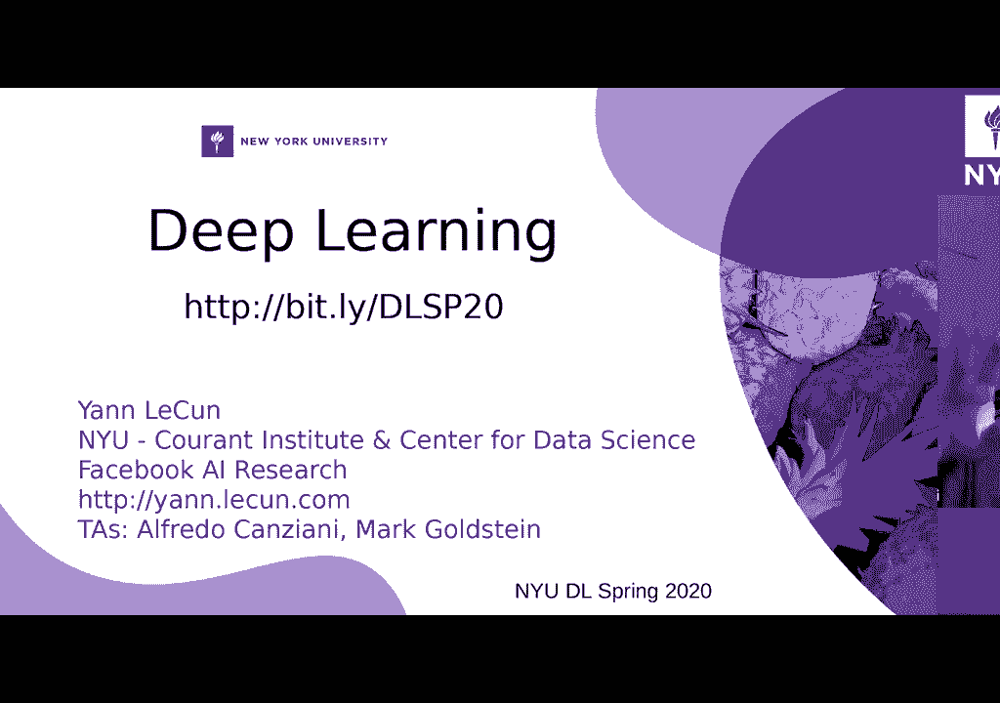

就像在我们的演讲者的掌声般的聊天中，所以每个人我的名字是，Isha我将谈论计算机视觉中的自我监督学习，Isha我将谈论计算机视觉中的自我监督学习，今天，很多重点实际上将更多地放在，今天。

很多重点实际上将更多地放在，判别式的方法，而且这种方法真的不会出现，判别式的方法，而且这种方法真的不会出现，一套生成方法，随着我的发展，我会越来越多地去做，一套生成方法，随着我的发展。

我会越来越多地去做。

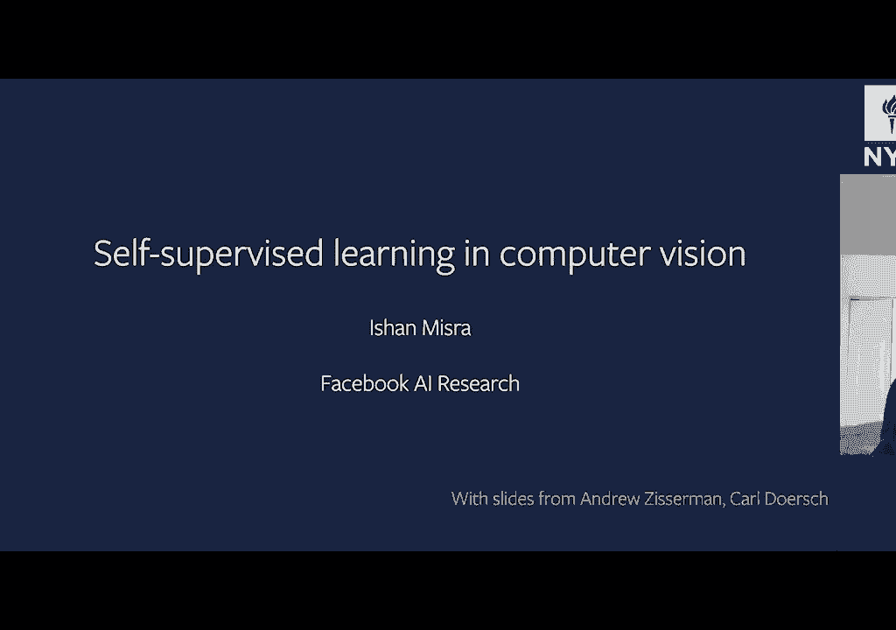

在我的演讲中，这样的成功故事可用于表示学习或，在我的演讲中，这样的成功故事可用于表示学习或。

到目前为止，像计算机视觉一样显然已经是这种预训练步骤，到目前为止，像计算机视觉一样显然已经是这种预训练步骤，或像计算机视觉这样的imagenet时刻，那么效果很好的是。

或像计算机视觉这样的imagenet时刻，那么效果很好的是，当我们拥有像图像网这样的大标签数据集时，我们可以学习，当我们拥有像图像网这样的大标签数据集时，我们可以学习。

通过在此大数据上执行图像分类任务来表示，通过在此大数据上执行图像分类任务来表示，设置，非常有用的不仅仅是执行手头的特定任务，设置，非常有用的不仅仅是执行手头的特定任务，但要采用您所学到的这些表示形式。

并将它们用于，但要采用您所学到的这些表示形式，并将它们用于，下游任务，您可能没有足够的标签数据，并且已经奏效，下游任务，您可能没有足够的标签数据，并且已经奏效，真的非常好，并且它们也是成功的标准秘诀。

真的非常好，并且它们也是成功的标准秘诀，现在，这真的涉及到收集大量主管，现在，这真的涉及到收集大量主管，图片，您需要获取一堆这样的大型图片和标签，图片，您需要获取一堆这样的大型图片和标签。

他们有很多不同的概念，让我们先来看看，他们有很多不同的概念，让我们先来看看，我们是否可以收集这些标签以及什么是，我们是否可以收集这些标签以及什么是，这样做很困难，因此图像网络数据集非常小，这样做很困难。

因此图像网络数据集非常小，在更大的方案中设置的数据，例如图像网只有14个，在更大的方案中设置的数据，例如图像网只有14个，百万张图片，它大约包含22，000个概念，仅将整个标签，百万张图片。

它大约包含22，000个概念，仅将整个标签，如果您看一下花了多少功夫，大约是22，如果您看一下花了多少功夫，大约是22，人类的岁月来标记整个数据集以进行对比很多人开始。

人类的岁月来标记整个数据集以进行对比很多人开始，查看您预测的这些替代监管方法，查看您预测的这些替代监管方法，像不是真正原始的漂亮标签，而是，像不是真正原始的漂亮标签，而是，更容易获得。

例如预测主题标签或获取GPS位置，更容易获得，例如预测主题标签或获取GPS位置，图像，或者我们将在本讲座中真正关注的是，图像，或者我们将在本讲座中真正关注的是，有关Excel监督学习的知识。

这将使用数据本身，因此，有关Excel监督学习的知识，这将使用数据本身，因此，我总是喜欢从头开始的第一个问题是为什么不这样做，我总是喜欢从头开始的第一个问题是为什么不这样做。

您就像为所有数据获取标签一样，为什么还要发明这个，您就像为所有数据获取标签一样，为什么还要发明这个，整个研究领域为何不仅仅获得所有标签，所以我做了这么小的事情，整个研究领域为何不仅仅获得所有标签。

所以我做了这么小的事情，我在练习中绘制了视觉数据的监督量，我在练习中绘制了视觉数据的监督量，设置，所以我所做的基本上就是看所有具有，设置，所以我所做的基本上就是看所有具有，边界框，所以这些都是图像。

您可以知道这些概念是什么，边界框，所以这些都是图像，您可以知道这些概念是什么，在图像中，您还可以在它们周围绘制一个框，这有点，在图像中，您还可以在它们周围绘制一个框，这有点。

对诸如对象检测模型之类的东西要做的标准操作，对诸如对象检测模型之类的东西要做的标准操作，查看视觉中具有边界框的所有数据集，您将大致得到，查看视觉中具有边界框的所有数据集，您将大致得到，如果您放宽此限制。

现在大约有一百万张图像，然后您说，如果您放宽此限制，现在大约有一百万张图像，然后您说，好吧，我真的不在乎对象的位置，我只关心，好吧，我真的不在乎对象的位置，我只关心，哪些对象位于图像中存在哪些对象。

所以如果您，哪些对象位于图像中存在哪些对象，所以如果您，放宽约束，您将立即获得更多数量级的数据，因此，放宽约束，您将立即获得更多数量级的数据，因此，您基本上可以得到大约4，000万张左右的图像。

您基本上可以得到大约4，000万张左右的图像，现在，如果您进一步放松此约束，并且您说我不，现在，如果您进一步放松此约束，并且您说我不，我真的很在乎这个图像级别的监督，我所关心的就是。

我真的很在乎这个图像级别的监督，我所关心的就是，互联网互联网上出现的图片，您基本上可以得到五个，互联网互联网上出现的图片，您基本上可以得到五个，数量级更高的数据量，因此如果现在查看此图，您将。

数量级更高的数据量，因此如果现在查看此图，您将，可以立即看到，我们拥有的数据量甚至被标记为，可以立即看到，我们拥有的数据量甚至被标记为，在边界框或图像级别，与，在边界框或图像级别，与。

图片存在于互联网规模，我并没有真正忘记这些，图片存在于互联网规模，我并没有真正忘记这些，像被遗忘的图像在左侧的条只是它们，像被遗忘的图像在左侧的条只是它们，完全消失了，您真的需要使该绘图类似于日志。

完全消失了，您真的需要使该绘图类似于日志，企图实际上甚至使这些酒吧出现，所以现在当然是互联网照片，企图实际上甚至使这些酒吧出现，所以现在当然是互联网照片，不能代表世界的一切，有些东西确实。

不能代表世界的一切，有些东西确实，需要运动或确实需要其他身体感觉来学习的事物，需要运动或确实需要其他身体感觉来学习的事物，因此，在现实世界中，您实际上将拥有更多东西，因此，在现实世界中。

您实际上将拥有更多东西，体验到更多的感官输入，而这真的很难，体验到更多的感官输入，而这真的很难，获取所有这些数据的标签，然后再次将其视为透视图，获取所有这些数据的标签，然后再次将其视为透视图。

imagenet仅适用于图像中的青少年，并且数量很少，imagenet仅适用于图像中的青少年，并且数量很少，您需要花费大量时间的概念，因此标签清晰可见，您需要花费大量时间的概念，因此标签清晰可见。

并不会真正扩展到所有互联网照片甚至实际，并不会真正扩展到所有互联网照片甚至实际，因此，标签的另一类问题是复杂概念，因此，标签的另一类问题是复杂概念，像视频一样，很难对比例标签进行标注第二个问题是。

像视频一样，很难对比例标签进行标注第二个问题是，那种罕见的概念真的很难贴上标签，例如，这是一个，那种罕见的概念真的很难贴上标签，例如，这是一个，称为标签我的流行图像数据集，在这里我们可以看到。

称为标签我的流行图像数据集，在这里我们可以看到，如果您观察各种概念，就会发现很多概念，如果您观察各种概念，就会发现很多概念，如此罕见，您将需要为标签添加大量数据，甚至获得，如此罕见。

您将需要为标签添加大量数据，甚至获得，这些概念的实例很少，因此在此数据集中，类帐户占10％，这些概念的实例很少，因此在此数据集中，类帐户占10％，超过93％的数据已经告诉您，以便进行排序。

超过93％的数据已经告诉您，以便进行排序，规模标签以适应越来越多的概念，您将需要更多，规模标签以适应越来越多的概念，您将需要更多，数据的收益非常减少，所以这有点像标准的长尾，数据的收益非常减少。

所以这有点像标准的长尾，问题，当然预训练是不正确的，问题，当然预训练是不正确的，总是正确的做法，例如，如果您完全改变了自己，总是正确的做法，例如，如果您完全改变了自己，现在将其移至医学影像领域尚不清楚。

现在将其移至医学影像领域尚不清楚，传教训练是完成此任务的正确之选，如果您不这样做，传教训练是完成此任务的正确之选，如果您不这样做，了解下游任务的优先级如何收集大数据，了解下游任务的优先级如何收集大数据。

设置以及如何在整个晚上免费培训下游任务，设置以及如何在整个晚上免费培训下游任务，食谱，所以自我监督的加载方式介于两者之间，它试图给，食谱，所以自我监督的加载方式介于两者之间，它试图给。

您可以通过另一种方式来预训练模型或从数据中学习或学习，您可以通过另一种方式来预训练模型或从数据中学习或学习，不需要原始监督的经验，所以在这种情况下，不需要原始监督的经验，所以在这种情况下。

您可以自己提出两种简单的定义，您可以自己提出两种简单的定义，在有监督的学习中，第一个学习更多是来自于区别对待或类似，在有监督的学习中，第一个学习更多是来自于区别对待或类似，有监督的培训角度。

例如在imagenet中，您有一个图像，有监督的培训角度，例如在imagenet中，您有一个图像，您可以将其分类为千个级别之一，以便自我，您可以将其分类为千个级别之一，以便自我。

提供一切都可以被视为从数据中获取标签的方法，提供一切都可以被视为从数据中获取标签的方法，使用自动过程，以便自动过程不会真正，使用自动过程，以便自动过程不会真正，需要大量的人工干预。

所以一旦您获得这些自动，需要大量的人工干预，所以一旦您获得这些自动，标签，现在您可以继续进行，并使用这些标签来训练模型，标签，现在您可以继续进行，并使用这些标签来训练模型。

自我监督学习的另一种思考方式是，自我监督学习的另一种思考方式是，您试图预测一部分数据的预测问题，您试图预测一部分数据的预测问题，来自数据的其他部分，因此您拥有一些观察到的数据，来自数据的其他部分。

因此您拥有一些观察到的数据，一些隐藏的数据，您现在可以在给定，一些隐藏的数据，您现在可以在给定，观察到的数据，您尝试预测其隐藏数据或某些属性，观察到的数据，您尝试预测其隐藏数据或某些属性，隐藏的数据。

以及许多种类的单元监控技术，隐藏的数据，以及许多种类的单元监控技术，可以在此特定框架中查看，可以在此特定框架中查看，所以我很喜欢用这个词来形容自我监督，所以我很喜欢用这个词来形容自我监督。

来自弗吉尼亚·泰莎（Virginia Tessa），所以她尝试，来自弗吉尼亚·泰莎（Virginia Tessa），所以她尝试，区分受监督无监督和自我监督这三个术语。

区分受监督无监督和自我监督这三个术语，监督和监督学习，你说输入牛，你，监督和监督学习，你说输入牛，你，给定了确切的目标，这就是说将被称为母牛，给定了确切的目标，这就是说将被称为母牛，在没有监督的情况下。

您得到了输入，目前尚不清楚，在没有监督的情况下，您得到了输入，目前尚不清楚，整个目标到底是什么？整个目标到底是什么？监督学习是一个术语，现在越来越受欢迎。监督学习是一个术语，现在越来越受欢迎。

这个想法是，标签确实来自共同发生的死亡率或，这个想法是，标签确实来自共同发生的死亡率或，数据本身的共现部分，因此实际上所有功能都在数据中，数据本身的共现部分，因此实际上所有功能都在数据中。

而您实际上是在尝试预测某种程度的预测，而您实际上是在尝试预测某种程度的预测，数据的属性，因此是一些非常标准和成功的例子，数据的属性，因此是一些非常标准和成功的例子，这是安全的，要么是那个模型的单词。

要么是他们说的那句话，这是安全的，要么是那个模型的单词，要么是他们说的那句话，例如，猫坐在垫子上，您会得到以下句子的一部分：例如，猫坐在垫子上，您会得到以下句子的一部分：

您观察到的情况因此被标记为上下文或历史，您观察到的情况因此被标记为上下文或历史，然后在这种情况下，您有一部分单词的句子不是，然后在这种情况下，您有一部分单词的句子不是。

观察到您在整个模型中隐藏了哪些东西并给出了上下文，观察到您在整个模型中隐藏了哪些东西并给出了上下文，您要求模型预测此目标，因此您需要自己的主管，您要求模型预测此目标，因此您需要自己的主管，目标。

您可以按特定方式将其最小化，现在您将，目标，您可以按特定方式将其最小化，现在您将，学习输入数据的表示形式，然后背单词一直是我的意思，学习输入数据的表示形式，然后背单词一直是我的意思。

实际上在riot II应用程序中显示了很多希望，实际上在riot II应用程序中显示了很多希望，各种预测模型激发了计算机方面的许多工作，各种预测模型激发了计算机方面的许多工作。

愿景以及单元管理器的成功还值得商bat，愿景以及单元管理器的成功还值得商bat，在自然语言处理中，所以在2018年，这真的很成功，在自然语言处理中，所以在2018年，这真的很成功，称为pert的模型。

基本上是桅杆或两个编码器的形式，称为pert的模型，基本上是桅杆或两个编码器的形式，模块化的方式彻底改变了您在NLP中可以做的事情，模块化的方式彻底改变了您在NLP中可以做的事情，数据量有限。

很多人称其为，数据量有限，很多人称其为，能量，所以在本次演讲中，我们将再次，能量，所以在本次演讲中，我们将再次，激励我们为什么要使用自我监督的学习，激励我们为什么要使用自我监督的学习。

专注于如何查看数据以及可以使用观察和，专注于如何查看数据以及可以使用观察和，数据交互以制定自我监督任务的方式，数据交互以制定自我监督任务的方式，利用多种方式，我会再多谈一点，利用多种方式。

我会再多谈一点，术语模态是指数据中要学习的某种结构，术语模态是指数据中要学习的某种结构，表示形式，让我们进入计算机视觉的背景，我将进行排序，表示形式，让我们进入计算机视觉的背景，我将进行排序。

现在尝试定义一些我一直在谈论的东西，现在尝试定义一些我一直在谈论的东西，以更具体的方式学习第一个问题，因此细胞监督学习是，以更具体的方式学习第一个问题，因此细胞监督学习是，基本上就是无监督的学习，是的。

我的意思是，是的，我的意思是，基本上就是无监督的学习，是的，我的意思是，是的，我的意思是，基本上，诸如无监督之类的主要差异是非常差的，基本上，诸如无监督之类的主要差异是非常差的，定义的术语。

因此有监督但无监督的内容，例如，定义的术语，因此有监督但无监督的内容，例如，Jeetendra malloc给出的类比是有只猫但没有类别，Jeetendra malloc给出的类比是有只猫但没有类别。

拜访猫，所以这就是为什么要来的原因，拜访猫，所以这就是为什么要来的原因，越来越多地引用这个术语，这实际上是关于使用数据或，越来越多地引用这个术语，这实际上是关于使用数据或，数据本身的属性以进行监督。

这就是为什么自我，数据本身的属性以进行监督，这就是为什么自我，超级，所以对我来说，Jason是一个子集，是的，我想是的，我的意思是我想你知道我的，超级，所以对我来说，Jason是一个子集，是的。

我想是的，我的意思是我想你知道我的，Konya的原因是算法，Konya的原因是算法，与监督学习算法基本相同，但有一些，与监督学习算法基本相同，但有一些，修改为，因为您正在训练系统以学习其一部分，修改为。

因为您正在训练系统以学习其一部分，来自输入的另一部分的输入，因此它与受监督的许多对象非常相似，来自输入的另一部分的输入，因此它与受监督的许多对象非常相似，除了需要更好地处理不确定性和负面影响之外。

还有很多其他方法，除了需要更好地处理不确定性和负面影响之外，还有很多其他方法，如果您想要的类别可能更大，这是一个问题，但是，如果您想要的类别可能更大，这是一个问题，但是，无监督跑步的定义不是很好。

所以惊喜跑步是一种，无监督跑步的定义不是很好，所以惊喜跑步是一种，完全不同的概念，这还不是很清楚，完全不同的概念，这还不是很清楚，无监督。

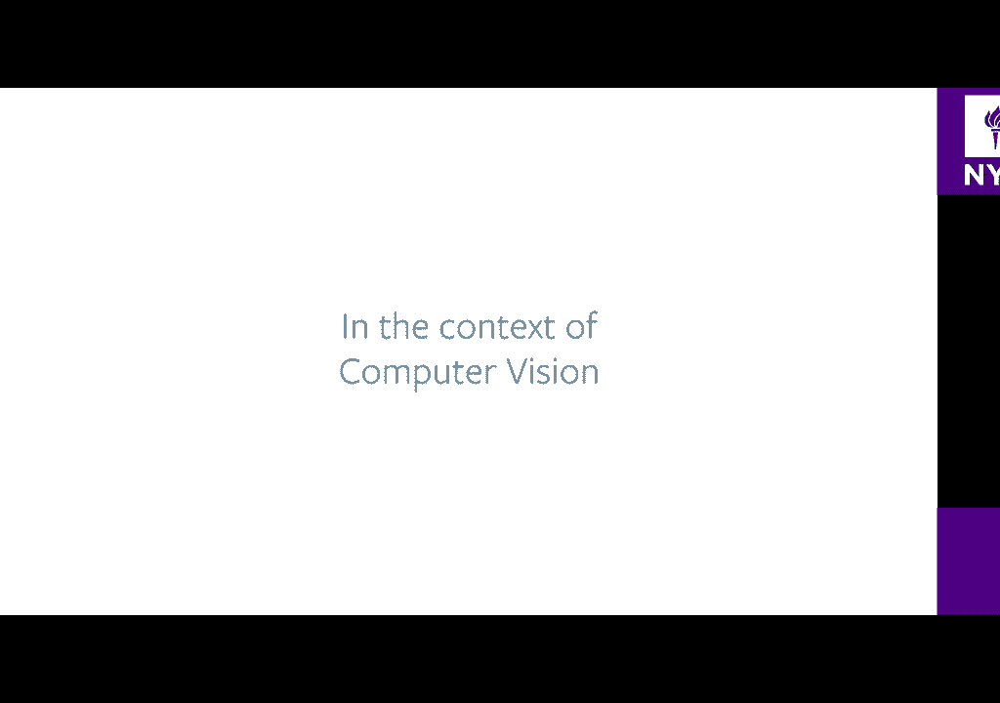

所以继续前进，现在试着谈论自我监督学习更多，所以继续前进，现在试着谈论自我监督学习更多，在视觉环境中，因此可以预见很多这类预测问题。

在视觉环境中，因此可以预见很多这类预测问题，已经被构筑为借口任务，所以很多视觉算法都，已经被构筑为借口任务，所以很多视觉算法都，这个词来自2015年，来自Carl Tosh的这篇特别论文。

这个词来自2015年，来自Carl Tosh的这篇特别论文，而这里的想法是您有一个文本任务或您要执行的任务，而这里的想法是您有一个文本任务或您要执行的任务，最后真的很在乎像图像分类，但您当然不。

最后真的很在乎像图像分类，但您当然不，为此或您有很多数据，因此您想先解决一个任务，为此或您有很多数据，因此您想先解决一个任务，真正的任务是借口任务，所以此借口任务是预测任务，真正的任务是借口任务。

所以此借口任务是预测任务，您正在解决，但这并不是您真正关心的真正任务。您正在解决，但这并不是您真正关心的真正任务。您解决此特定任务以学习表示形式，然后最终，您解决此特定任务以学习表示形式，然后最终。

将您的下游任务放在要使用此表示形式执行的位置，将您的下游任务放在要使用此表示形式执行的位置，一些有意义的事情，所以这些借口任务有点有趣，一些有意义的事情，所以这些借口任务有点有趣。

他们通常很像人们很有创意，他们通常很像人们很有创意，这些借口要求，让我们看看如何定义一堆三个文本，这些借口要求，让我们看看如何定义一堆三个文本，任务以及这些借口任务中的每一个试图做什么，因此您可以使用。

任务以及这些借口任务中的每一个试图做什么，因此您可以使用，当您尝试执行这些操作时，可以将视频图像和声音图像，当您尝试执行这些操作时，可以将视频图像和声音图像，每种情况下，您都有大量观察数据。

您将尝试预测，每种情况下，您都有大量观察数据，您将尝试预测，隐藏的数据，或者您尝试预测beta等类型的属性，隐藏的数据，或者您尝试预测beta等类型的属性，区分了很多方法，所以让我们看一下如何使用图像。

区分了很多方法，所以让我们看一下如何使用图像，定义诸如借口任务之类的内容，因此介绍该术语的论文，定义诸如借口任务之类的内容，因此介绍该术语的论文，借口任务提出了这种相当有趣的方法，但您要做的是。

借口任务提出了这种相当有趣的方法，但您要做的是，您说两个图像补丁基本上占据了网络，您问了一个网络，您说两个图像补丁基本上占据了网络，您问了一个网络，预测每个贴片相对于另一个贴片的相对位置是多少。

预测每个贴片相对于另一个贴片的相对位置是多少，所以在这种情况下，我先采样一个蓝色补丁，然后再采样另一个，所以在这种情况下，我先采样一个蓝色补丁，然后再采样另一个，荷兰语，所以我要做的是基本上通过。

荷兰语，所以我要做的是基本上通过，短号和我有一个分类器将解决A2分类，短号和我有一个分类器将解决A2分类，问题以及如何获得该分类问题的标签，我只是，问题以及如何获得该分类问题的标签，我只是。

看看红色补丁相对于蓝色补丁位于何处，看看红色补丁相对于蓝色补丁位于何处，就这样，最后，您只是在预测自己正在解决，就这样，最后，您只是在预测自己正在解决，八步分类任务。

您基本上可以通过执行以下操作获得标签，八步分类任务，您基本上可以通过执行以下操作获得标签，这种利用输入数据的属性的方法就是这样，现在您，这种利用输入数据的属性的方法就是这样，现在您。

可以用它来基本上训练，整个骗局，可以用它来基本上训练，整个骗局，以一种不同的方式来看它，这只是解决了一个非常，以一种不同的方式来看它，这只是解决了一个非常，小分类问题，基本上只能解决八个问题。

小分类问题，基本上只能解决八个问题，可能的位置有点问题，令人惊讶地这样做，可能的位置有点问题，令人惊讶地这样做，借口任务实际上学习了相当合理的东西，因此一种看待方式，借口任务实际上学习了相当合理的东西。

因此一种看待方式，这个网络学到的是看它认为我们最近的，这个网络学到的是看它认为我们最近的，邻居在面对与代表，所以来解释这个情节，邻居在面对与代表，所以来解释这个情节，在左侧，您有输入色块，所以可以喂。

在左侧，您有输入色块，所以可以喂，通过该CNN转发此输入补丁，您基本上会提取一堆，通过该CNN转发此输入补丁，您基本上会提取一堆，对数据集上的数据进行修补，在这种情况下，您可以想象一下，然后进行计算。

对数据集上的数据进行修补，在这种情况下，您可以想象一下，然后进行计算，现在针对特定的每个补丁的功能表示，现在针对特定的每个补丁的功能表示，通过计算内容最接近的内容发送的输入补丁。

通过计算内容最接近的内容发送的输入补丁，数据集中所有补丁的邻居，您可以使用三种不同的，数据集中所有补丁的邻居，您可以使用三种不同的，网络以计算特征表示，因此第一列是，网络以计算特征表示，因此第一列是。

相对定位自由文本任务，第二列基本上是，相对定位自由文本任务，第二列基本上是，随机初始化亚历克斯网，然后第三种情况是第三列是，随机初始化亚历克斯网，然后第三种情况是第三列是。

基本上是预先训练过的图像网Alex网络，所以如果您看一下，基本上是预先训练过的图像网Alex网络，所以如果您看一下，相对定位任务正在捕获，它真的能够找到很好的，相对定位任务正在捕获。

它真的能够找到很好的，修补程序与输入修补程序相同或非常接近的修补程序，您，修补程序与输入修补程序相同或非常接近的修补程序，您，还看到它就像在猫的行中，所以这是第四，还看到它就像在猫的行中，所以这是第四。

行，您可以看到它实际上能够确定它与，行，您可以看到它实际上能够确定它与，说出颜色，所以输入的胡萝卜是黑白的，但实际上，说出颜色，所以输入的胡萝卜是黑白的，但实际上，挑选不只是黑白的猫，这确实是在做。

挑选不只是黑白的猫，这确实是在做，它正在尝试的事情至少能够推理出整个补丁，因此，它正在尝试的事情至少能够推理出整个补丁，因此，为什么这种表示要做任何语义上的事情，所以。

为什么这种表示要做任何语义上的事情，所以，最近邻居可视化技术擅长告诉您这是什么，最近邻居可视化技术擅长告诉您这是什么，表示空间已被捕获，因此在这种情况下，我们可以自信地说，表示空间已被捕获。

因此在这种情况下，我们可以自信地说，这个相对的补丁表示已经学会了将一堆关联起来，这个相对的补丁表示已经学会了将一堆关联起来，这些本地补丁中的大致相同的本地补丁，这些本地补丁中的大致相同的本地补丁。

外观等等，因为它能够推理，外观等等，因为它能够推理，关于这些本地补丁，也许它实际上能够推理出一张图像，关于这些本地补丁，也许它实际上能够推理出一张图像，因为图像可以被视为一堆本地补丁，所以它是。

因为图像可以被视为一堆本地补丁，所以它是，能够将这些补丁放置在表示空间的一部分中，能够将这些补丁放置在表示空间的一部分中，现在人们就像我说的那样，人们已经对，现在人们就像我说的那样，人们已经对。

他们这样做的种种借口任务另一种流行的借口任务是，他们这样做的种种借口任务另一种流行的借口任务是，预测图像的旋转，所以这个任务非常，预测图像的旋转，所以这个任务非常，很简单，您可以将图像旋转0度，很简单。

您可以将图像旋转0度，与它成90度180度或270度，与它成90度180度或270度，应用旋转后的特定图像，您要求网络，应用旋转后的特定图像，您要求网络，预测什么是应用于图像的精确旋转，它可以解决。

预测什么是应用于图像的精确旋转，它可以解决，四向分类问题，因此它基本上可以预测，四向分类问题，因此它基本上可以预测，旋转是0 90 180或270，而这3个文本任务实际上是最多的任务之一。

旋转是0 90 180或270，而这3个文本任务实际上是最多的任务之一，现在流行的前置任务，因为基本上可以轻松实现您，现在流行的前置任务，因为基本上可以轻松实现您，拍摄图像非常简单。

您实际上不需要采样太多，拍摄图像非常简单，您实际上不需要采样太多，修补或解决任何复杂的问题，这是一个非常标准的体系结构，修补或解决任何复杂的问题，这是一个非常标准的体系结构，您可以解决这个问题。

让它现在变得相当流行，因此网络，您可以解决这个问题，让它现在变得相当流行，因此网络，将要进行基本训练，因此对特征进行训练以解决，将要进行基本训练，因此对特征进行训练以解决，这个问题对。

所以输出将以某种方式取决于特定任务，这个问题对，所以输出将以某种方式取决于特定任务，有人将以某种方式达到峰值，是的，所以这又是一个，有人将以某种方式达到峰值，是的，所以这又是一个，借口任务。

因此我们对预测轮换并不十分感兴趣，借口任务，因此我们对预测轮换并不十分感兴趣，图片，我们只是使用此任务作为代理来学习一些功能，因此，图片，我们只是使用此任务作为代理来学习一些功能，因此。

在下游任务上说当有人给我们一千个标签时，在下游任务上说当有人给我们一千个标签时，猫的图像，然后我们可以使用此训练有素的特征表示来做，猫的图像，然后我们可以使用此训练有素的特征表示来做，该特定任务。

因此这些借口测试通常是，该特定任务，因此这些借口测试通常是，不会有很多语义上的意义，那样的问题，不会有很多语义上的意义，那样的问题，之所以称它们为借口，是因为您有下游任务，其中，之所以称它们为借口。

是因为您有下游任务，其中，您实际上有一些您实际上知道是好的语义或标签，您实际上有一些您实际上知道是好的语义或标签，谢谢，为什么预测轮换会给我们带来任何有用的帮助，谢谢。

为什么预测轮换会给我们带来任何有用的帮助，表示是的，所以事实上，当本文发表时，这是，表示是的，所以事实上，当本文发表时，这是，很多人，这也是我的问题，很多人，这也是我的问题，从经验上讲，这确实有效。

并且我的直觉对此，从经验上讲，这确实有效，并且我的直觉对此，基本上是为了预测物体的旋转方式，基本上是为了预测物体的旋转方式，是否需要大致了解边界或某种边界，是否需要大致了解边界或某种边界，例如。

此图像中的概念是为了预测该特定图像是，例如，此图像中的概念是为了预测该特定图像是，旋转180度，它至少需要识别一种隔离，旋转180度，它至少需要识别一种隔离，像沙子一样的天空，或者像水一样的天空。

或者至少了解，像沙子一样的天空，或者像水一样的天空，或者至少了解，对于一棵树，叶子通常不低于酒吧的树。对于一棵树，叶子通常不低于酒吧的树。像向下一样增长，而向上增长，所以这需要推理一些，像向下一样增长。

而向上增长，所以这需要推理一些，隐含的事情并不清楚它真正需要做什么，但是这个任务，隐含的事情并不清楚它真正需要做什么，但是这个任务，从经验上讲效果很好，然后才尝试或作为一项任务，从经验上讲效果很好。

然后才尝试或作为一项任务，像离散的分类，还是像连续的那样尝试过，像离散的分类，还是像连续的那样尝试过，图像旋转角度的比例，图像旋转角度的比例，是的，所以您可以同时使用两个版本，所以我可以说可以增加。

是的，所以您可以同时使用两个版本，所以我可以说可以增加，您想要的Bin数量，并且基本上使它非常大，您想要的Bin数量，并且基本上使它非常大，处理更多的回归问题，其中您有一个连续变量，处理更多的回归问题。

其中您有一个连续变量，练习这四种角度都很好地增加，并且有一个，练习这四种角度都很好地增加，并且有一个，有关上一张幻灯片的问题，最近的邻居如何工作，有关上一张幻灯片的问题，最近的邻居如何工作。

在这种情况下，您是否通过CNN运行每个补丁程序，是的，这是，在这种情况下，您是否通过CNN运行每个补丁程序，是的，这是，只是为了可视化，这只是为了某种理解，尽管，只是为了可视化，这只是为了某种理解。

尽管，就像计算起来有点昂贵，它为您提供了一个很好的主意，就像计算起来有点昂贵，它为您提供了一个很好的主意，代表学到了什么，所以作者所做的基本上是，代表学到了什么，所以作者所做的基本上是。

从每个图像中提取一堆补丁，大约需要十到九个补丁，从每个图像中提取一堆补丁，大约需要十到九个补丁，等一小部分图像，所以我认为在这种情况下，等一小部分图像，所以我认为在这种情况下，52万个图像。

然后您基本上只计算最近的，52万个图像，然后您基本上只计算最近的，这些图像的那些补丁上的邻居，这些图像的那些补丁上的邻居，您，很好，所以另一个非常流行的任务是着色，很好，所以另一个非常流行的任务是着色。

因此，在这种情况下，给定灰度图像，您基本上会尝试预测颜色，因此，在这种情况下，给定灰度图像，您基本上会尝试预测颜色，该图像的位置，这样您就可以真正针对任何图像制定此任务，该图像的位置。

这样您就可以真正针对任何图像制定此任务，可以拍摄图像，可以去除颜色，也可以要求网络，可以拍摄图像，可以去除颜色，也可以要求网络，从这种黑白或某种灰度基本预测颜色，从这种黑白或某种灰度基本预测颜色。

图像和此任务本身并没有用，因为它在某些方面实际上是有用的，因此，图像和此任务本身并没有用，因为它在某些方面实际上是有用的，因此，当您看到许多类似旧电影的彩色电影时，当您看到许多类似旧电影的彩色电影时。

简短地说一下40或30年代，当时没有太多的色彩技术，简短地说一下40或30年代，当时没有太多的色彩技术，实际上可以真正执行此任务，因此以某种方式，实际上可以真正执行此任务，因此以某种方式。

实际上比其他借口任务更有用，为什么执行此任务，实际上比其他借口任务更有用，为什么执行此任务，学到一些有意义的东西，需要认识到树木是，学到一些有意义的东西，需要认识到树木是，绿色。

它需要了解它是哪种对象类别，绿色，它需要了解它是哪种对象类别，令人遗憾的是，它的颜色很好，因此在实践中，现在已经扩展到，令人遗憾的是，它的颜色很好，因此在实践中，现在已经扩展到，视频领域。

并且有很多关于极化的后续工作，视频领域，并且有很多关于极化的后续工作，本身是否有趣，因为我认为颜色映射不是它不是，本身是否有趣，因为我认为颜色映射不是它不是，确定性权利我的意思是不是一个错误，是的。

所以几个，几个，几个，确定性权利我的意思是不是一个错误，是的，所以几个，几个，几个，是的，可能是正确的解决方案，所以，最初的论文基本上是，是的，可能是正确的解决方案，所以，最初的论文基本上是。

提出确定性映射，以便您解决分类或，提出确定性映射，以便您解决分类或，回归问题，所以您只能说蓝色的雨伞而您，回归问题，所以您只能说蓝色的雨伞而您，无法预测灰色，所以最终发生的是，无法预测灰色。

所以最终发生的是，有许多不同颜色的类别，例如，让我们，有许多不同颜色的类别，例如，让我们，假设您有一个球，并且该球可能以红色蓝色或，假设您有一个球，并且该球可能以红色蓝色或，上网本会预示绿色。

因为我的意思是，上网本会预示绿色，因为我的意思是，所有这些东西的意思，这是它可以做到的最好，所有这些东西的意思，这是它可以做到的最好，UIUC的David Foresight小组进行了后续工作。

UIUC的David Foresight小组进行了后续工作，提出了变体自动编码器，所以您实际上有一个，提出了变体自动编码器，所以您实际上有一个，潜在变量将具有多种颜色，因此，潜在变量将具有多种颜色。

因此，练习，您基本上可以执行类似的方法，因此实际上您现在可以，练习，您基本上可以执行类似的方法，因此实际上您现在可以，绿色的球，因为您在整个场景中都这样做，所以您可以，绿色的球。

因为您在整个场景中都这样做，所以您可以，实际上整个场景的色彩都是一致的，是的，这就是我，实际上整个场景的色彩都是一致的，是的，这就是我，认为我们会一直在和纱线聊天，或者只要我们喜欢。

认为我们会一直在和纱线聊天，或者只要我们喜欢，映射从一个到多个，然后我们应该选择一点，映射从一个到多个，然后我们应该选择一点，变量模型，只要我们有，变量模型，只要我们有，相同的输入，因此。

如果我认为喜欢人的原因并没有真正专注于，相同的输入，因此，如果我认为喜欢人的原因并没有真正专注于，在这种情况下，很多方面至少在第一天就可以追溯到，在这种情况下，很多方面至少在第一天就可以追溯到。

不在这里，什么在工作，什么不在，第二，这仍然是，不在这里，什么在工作，什么不在，第二，这仍然是，借口任务，人们并不真正关心着色质量，借口任务，人们并不真正关心着色质量，人们更加关注代表质量。

但我现在认为，人们更加关注代表质量，但我现在认为，我们中的很多人都知道，两者彼此之间是相当紧密的联系，我们中的很多人都知道，两者彼此之间是相当紧密的联系，您确实需要使用这种非确定性映射才能获得。

您确实需要使用这种非确定性映射才能获得，最后，这是一个，最后，这是一个，对这张图片表示歉意，这是我认为是分辨率的论文，但，对这张图片表示歉意，这是我认为是分辨率的论文，但，所以这是另一个任务。

就像上下文自动编码器一样，所以这是另一个任务，就像上下文自动编码器一样，基本上是从板到板借来的很多，所以您隐藏了一个特定的，基本上是从板到板借来的很多，所以您隐藏了一个特定的，图片的一部分。

现在给出了图片的周围部分，图片的一部分，现在给出了图片的周围部分，预测隐藏的内容，因此实际上可以填补空白，预测隐藏的内容，因此实际上可以填补空白，任务，为什么它应该很好地工作，任务。

为什么它应该很好地工作，最少尝试推断存在哪些物体，以便汽车可以行驶，最少尝试推断存在哪些物体，以便汽车可以行驶，道路或类似建筑物基本上由类似窗户和，道路或类似建筑物基本上由类似窗户和，他们应该靠近地面。

所以应该有门等等，因此需要，他们应该靠近地面，所以应该有门等等，因此需要，通过以下方式了解更多信息，例如数据的隐式结构，通过以下方式了解更多信息，例如数据的隐式结构，执行此任务，所以这只是关于图像。

现在我来谈谈，执行此任务，所以这只是关于图像，现在我来谈谈，关于您还可以在视频中执行哪些其他任务，因此在视频中，关于您还可以在视频中执行哪些其他任务，因此在视频中。

监督的主要来源是帧“ ti”的顺序概念，因此，监督的主要来源是帧“ ti”的顺序概念，因此，框架基本上具有固有的顺序，您想使用一下，框架基本上具有固有的顺序，您想使用一下，为了得到一些东西。

例如说预测帧的顺序或填写，为了得到一些东西，例如说预测帧的顺序或填写，空白和一堆其他依赖于其他任务的借口任务，空白和一堆其他依赖于其他任务的借口任务，顺序性质，所以在这里我将讨论其中之一，顺序性质。

所以在这里我将讨论其中之一，我在2016年所做的有关预测时间正确性的作品，我在2016年所做的有关预测时间正确性的作品，或帧顺序不正确，这在很大程度上是因为，或帧顺序不正确，这在很大程度上是因为。

打哈欠和基本上其他人一直在通过帧的顺序排序，打哈欠和基本上其他人一直在通过帧的顺序排序，事物的对比，我将在最后谈到那些，事物的对比，我将在最后谈到那些，实际谈论对比观察，所以在这项特殊工作中，我们非常。

实际谈论对比观察，所以在这项特殊工作中，我们非常，像借口一样再次受到启发，我们看到了二进制，像借口一样再次受到启发，我们看到了二进制，分类问题，因此给定一堆帧，我们提取三个帧，如果，分类问题。

因此给定一堆帧，我们提取三个帧，如果，我们以正确的顺序提取它们，将它们标记为加一，如果随机播放，我们以正确的顺序提取它们，将它们标记为加一，如果随机播放，他们基本上将它们标记为零。

所以现在我们需要求解一个二进制，他们基本上将它们标记为零，所以现在我们需要求解一个二进制，分类问题，以预测是否洗牌，分类问题，以预测是否洗牌，而这种工作的原因是因为给定了三帧或。

而这种工作的原因是因为给定了三帧或，认为它们基本上是从中间开始到结束，这个网络确实试图，认为它们基本上是从中间开始到结束，这个网络确实试图，学习给定的起点和终点是这一点的有效依据。

学习给定的起点和终点是这一点的有效依据，起点和终点的插值，因此它实际上试图，起点和终点的插值，因此它实际上试图，给定这些视觉输入，可以平滑地插值这些特征，因此，给定这些视觉输入，可以平滑地插值这些特征。

因此，网络相当简单，就像一个三胞胎Iommi的网络，网络相当简单，就像一个三胞胎Iommi的网络，你有三帧，每一个都独立地前馈，你有三帧，每一个都独立地前馈，连接您从这三个框架和新框架中获得的功能。

连接您从这三个框架和新框架中获得的功能，执行二进制分类问题，以便您预测这是否是，执行二进制分类问题，以便您预测这是否是，正确或不正确，基本上是随机播放，正确或不正确，基本上是随机播放，不打乱你起床。

基本上可以用，不打乱你起床，基本上可以用，交叉熵损失，您可以端到端训练整个网络，交叉熵损失，您可以端到端训练整个网络。

所以再次像我之前提到的，最近的邻居是一个好方法，所以再次像我之前提到的，最近的邻居是一个好方法，可视化这些网络正在学习的内容，以便我们进一步开展玩家工作，可视化这些网络正在学习的内容。

以便我们进一步开展玩家工作，基本上是看帧的最近邻居，所以在左手，基本上是看帧的最近邻居，所以在左手，方面，您有一个查询框架，并且您对该框架进行前馈，然后获得一个功能，方面，您有一个查询框架。

并且您对该框架进行前馈，然后获得一个功能，然后您基本上会查看该要素表示中的最近邻居，然后您基本上会查看该要素表示中的最近邻居，因此我们将对图像进行随机洗净和学习，然后进行随机特征处理。

因此我们将对图像进行随机洗净和学习，然后进行随机特征处理，您观察到的是，两者之间存在某种非常明显的差异，您观察到的是，两者之间存在某种非常明显的差异，图像净随机播放和随机播放为您提供了第一行。

如果您看一下，图像净随机播放和随机播放为您提供了第一行，如果您看一下，健身房场景的发射真的很擅长弄清楚它是健身房场景，健身房场景的发射真的很擅长弄清楚它是健身房场景。

它检索到的最近邻居看起来与初始场景有很大不同，它检索到的最近邻居看起来与初始场景有很大不同，我们喜欢我们给的初始图像，所以地板很像，我们喜欢我们给的初始图像，所以地板很像，最好在查询后期。

地板实际上是黑色的，并且是精确的运动，最好在查询后期，地板实际上是黑色的，并且是精确的运动，表现并不完全相同，但是imagenet确实很擅长，表现并不完全相同，但是imagenet确实很擅长。

折叠整个语义类别，实际上带来了各种，折叠整个语义类别，实际上带来了各种，不同的宝石场景在表示空间中都相同，不同的宝石场景在表示空间中都相同，事情在下面的行中进行，所以您可以有一个室外场景吗？

事情在下面的行中进行，所以您可以有一个室外场景吗？发射后，它立即可以在室外的那部分捡起，发射后，它立即可以在室外的那部分捡起，它能够找出其中的草等等，并带来了这些，它能够找出其中的草等等，并带来了这些。

如果您说说最右边的那一点，那么特征空间中的两个点在一起，如果您说说最右边的那一点，那么特征空间中的两个点在一起，最近的邻居通过随机网络检索，您会发现它确实，最近的邻居通过随机网络检索，您会发现它确实。

专注于颜色，所以在第一行中，它专注于黑色，专注于颜色，所以在第一行中，它专注于黑色，地板真的在看，也许是这张图片中的黑色，地板真的在看，也许是这张图片中的黑色，这就是现在写给最近的邻居的方式。

这就是现在写给最近的邻居的方式，洗牌并了解最近的邻居，他们很奇怪，这不是立即，洗牌并了解最近的邻居，他们很奇怪，这不是立即，清楚是关注颜色还是关注整个颜色，清楚是关注颜色还是关注整个颜色。

语义概念等方面的进一步检查和考察之后，语义概念等方面的进一步检查和考察之后，这些例子很多，我们发现它真的在看姿势，这些例子很多，我们发现它真的在看姿势，的人，因此，如果您在第一行中查看，该人正在做的是。

的人，因此，如果您在第一行中查看，该人正在做的是，沮丧是颠倒的，这也是最近找来的邻居，沮丧是颠倒的，这也是最近找来的邻居，在第二排，这个人也有自己的脚，就像有一个，在第二排，这个人也有自己的脚。

就像有一个，脚以特定的方式，它确实试图与，脚以特定的方式，它确实试图与，它最近的邻居，有点忽略了整个流，不是，它最近的邻居，有点忽略了整个流，不是，真正专注于背景，当我们考虑这一点时，为什么。

真正专注于背景，当我们考虑这一点时，为什么，上网本甚至会尝试做这样的事情吗？上网本甚至会尝试做这样的事情吗？回到我们询问的借口，所以询问的借口是在预测订单或，回到我们询问的借口。

所以询问的借口是在预测订单或，基本上可以预测事物是否处于正确的顺序并做到这一点，基本上可以预测事物是否处于正确的顺序并做到这一点，您真的需要专注于相同或类似的变化，您真的需要专注于相同或类似的变化。

这种情况下的人，所以如果您专注于背景，您将永远无法，这种情况下的人，所以如果您专注于背景，您将永远无法，很好地回答这个问题，因为，很好地回答这个问题，因为，背景在三帧之间变化不大。

背景在三帧之间变化不大，在视频中，唯一发生变化的是人或，在视频中，唯一发生变化的是人或，该视频中正在移动的东西，所以我们偶然地，该视频中正在移动的东西，所以我们偶然地。

从根本上训练了一个实际上试图看待事物的网络，从根本上训练了一个实际上试图看待事物的网络，移动，然后最终集中在这个姿势的姿势上，移动，然后最终集中在这个姿势的姿势上，人们现在当然是我的解释。

我们想验证一下，人们现在当然是我的解释，我们想验证一下，从数量上讲，所以我们要做的是获取代表并对其进行微调。

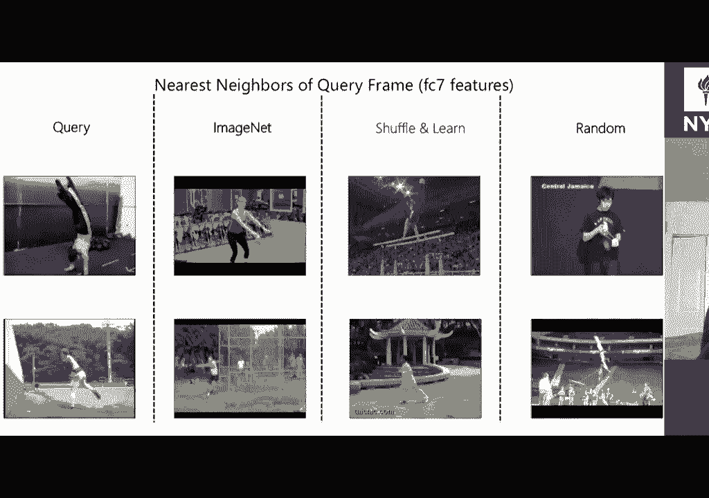

从数量上讲，所以我们要做的是获取代表并对其进行微调，关于人类关键点估计的任务，所以这个任务基本上是，关于人类关键点估计的任务，所以这个任务基本上是，放弃人类，您需要预测某些关键点在哪里，放弃人类。

您需要预测某些关键点在哪里，关键点将保持它们的定义，基本上就是说鼻子，关键点将保持它们的定义，基本上就是说鼻子，脖子左肩右肩右肘左肘手腕等，脖子左肩右肩右肘左肘手腕等，因此。

您基本上拥有了这些预定义的关键点，并训练了，因此，您基本上拥有了这些预定义的关键点，并训练了，网络来预测这一点，因此对于诸如，网络来预测这一点，因此对于诸如，跟踪或姿势估计，以便我们洗牌并学习自我。

跟踪或姿势估计，以便我们洗牌并学习自我，监督方法，我们在这两个称为flick和，监督方法，我们在这两个称为flick和，n PII，我们对任务和受监督的网络做了同样的事情，n PII。

我们对任务和受监督的网络做了同样的事情，回到Alex Nets的时代，所以Alex net是我们使用的架构，回到Alex Nets的时代，所以Alex net是我们使用的架构，令人惊讶的是。

我们发现自我监督，令人惊讶的是，我们发现自我监督，表现非常有竞争力，甚至比想象的要好，表现非常有竞争力，甚至比想象的要好，在关键点估计任务上的监督表示，因此在这种情况下，在关键点估计任务上的监督表示。

因此在这种情况下，我正在测量的是您看到的是曲线下的面积，所以越高越好，我正在测量的是您看到的是曲线下的面积，所以越高越好，您会看到它的表现相当不错，您会看到它的表现相当不错。

这对我们来说是非常令人惊讶的，因为我们对此任务没有任何思考，这对我们来说是非常令人惊讶的，因为我们对此任务没有任何思考，当我们设计一个借口RSP真的以为我认为这个借口。

当我们设计一个借口RSP真的以为我认为这个借口，这项任务将帮助我们更好地了解行动，但事实证明，如果您喜欢，这项任务将帮助我们更好地了解行动，但事实证明，如果您喜欢，根据最终结果或结果。

您可能会得到令人惊讶的结果，根据最终结果或结果，您可能会得到令人惊讶的结果，您最终将创建任务作为借口任务，因此在这种情况下，这都是估算，您最终将创建任务作为借口任务，因此在这种情况下，这都是估算。

在本例中，您说您已对它进行了微调，在本例中，您说您已对它进行了微调，点估计，就像是有监督的步骤一样，点估计，就像是有监督的步骤一样，您是的借口表示形式是的，因此管道通常会运行，您是的借口表示形式是的。

因此管道通常会运行，就像您进行了预培训一样，基本上可以说是监督，就像您进行了预培训一样，基本上可以说是监督，这将预测一千个课程，然后您有一个下游，这将预测一千个课程，然后您有一个下游，任务中有一些标签。

所以基本上，任务中有一些标签，所以基本上，预测人类关键点的案例，所以这种评估方式，预测人类关键点的案例，所以这种评估方式，它所做的基本上是需要三个受过训练的网络，它所做的基本上是需要三个受过训练的网络。

然后可以让他们在最后使用相同的监督数据，然后可以让他们在最后使用相同的监督数据，您正在评估的是，如果我从执行任务开始，您正在评估的是，如果我从执行任务开始，监督网络或洗牌学习网络来执行以下任务。

监督网络或洗牌学习网络来执行以下任务，关键点估计好吧，谢谢，因为改组和，关键点估计好吧，谢谢，因为改组和，都集中在背景上，所以实际上集中在四个方面。

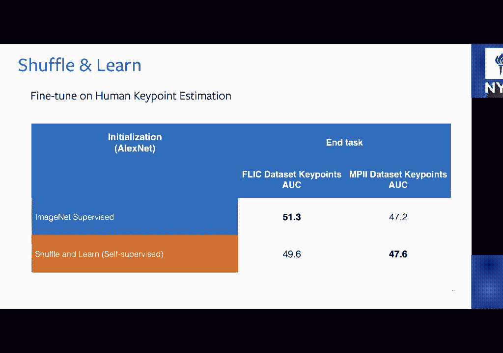

都集中在背景上，所以实际上集中在四个方面，所以这就是我想要提出的关于这个话题的内容，所以这就是我想要提出的关于这个话题的内容，例如，如果您看起来像是真正的最近邻居，例如，如果您看起来像是真正的最近邻居。

在提出这项权利的人面前，是在颠倒的人，在提出这项权利的人面前，是在颠倒的人，弄出最近的邻居，原因是如果您，弄出最近的邻居，原因是如果您，想谈谈框架的排序实际上需要专注于那些。

想谈谈框架的排序实际上需要专注于那些，移动，在这些视频中，人们就是移动的事物，因此，如果它专注于，移动，在这些视频中，人们就是移动的事物，因此，如果它专注于，它实际上将无法解决混洗和学习任务。

它实际上将无法解决混洗和学习任务。

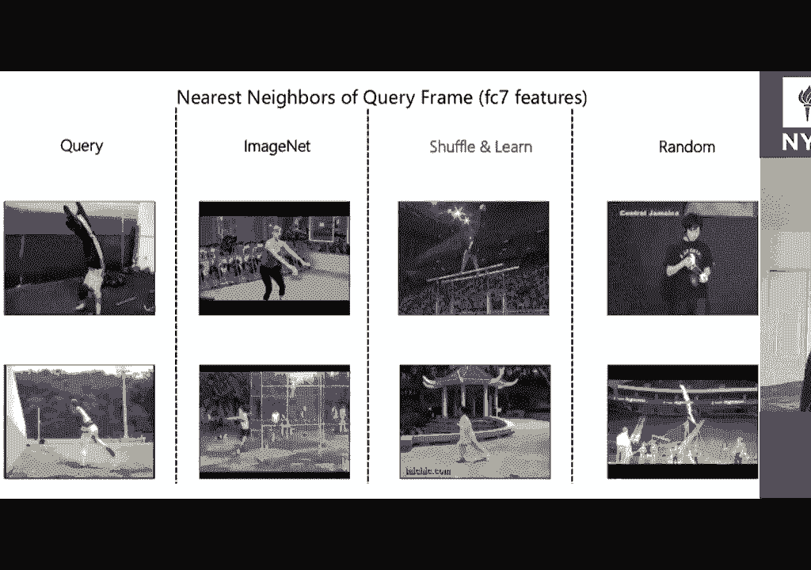

没事，这有点令人惊讶，没事，这有点令人惊讶，它表明，如果您设计借口，请问好，它表明，如果您设计借口，请问好，对于某些类型的下游任务可以很好地工作，并且，对于某些类型的下游任务可以很好地工作，并且。

从那以后，一种相当不错的方法，从那以后，一种相当不错的方法，预测这种使用顺序和预测，预测这种使用顺序和预测，事物是否以正确的顺序排列，所以没有网络就很奇怪，事物是否以正确的顺序排列。

所以没有网络就很奇怪，基本上不是解决二进制分类问题，基本上不是解决二进制分类问题，实际上试图预测哪一帧与那一帧不同，实际上试图预测哪一帧与那一帧不同，这是一种奇怪的洗牌，这是因为你是。

这是一种奇怪的洗牌，这是因为你是，某种程度上增加了您预测的信息量，某种程度上增加了您预测的信息量，这种网络的输出最终做得越来越好，而且，这种网络的输出最终做得越来越好，而且，一次更多帧的原因。

所以现在您已经看到了很多图像和视频，其中有很多创意，所以现在您已经看到了很多图像和视频，其中有很多创意，在那种多模式下工作，所以您必须在这里喝视频和，在那种多模式下工作，所以您必须在这里喝视频和。

声音或感官输入，这两种方法非常受欢迎且非常，声音或感官输入，这两种方法非常受欢迎且非常，在这种体制下进行的很好的工作，因此，在这种体制下进行的很好的工作，因此。

这些作品正在预测图像或说视频剪辑是否对应于，这些作品正在预测图像或说视频剪辑是否对应于，音频剪辑，以便您整理这些任务的方式是拍摄视频，音频剪辑，以便您整理这些任务的方式是拍摄视频。

而且您基本上可以从中采样任何帧，这同样需要，而且您基本上可以从中采样任何帧，这同样需要，音轨并对其进行采样，现在的问题基本上是，音轨并对其进行采样，现在的问题基本上是，预测这些事物在本质上是否相对应。

预测这些事物在本质上是否相对应，在整个视频冲浪鼓中，您可以采样帧和，在整个视频冲浪鼓中，您可以采样帧和，相应的音频并称其为正，在这种情况下，您基本上，相应的音频并称其为正，在这种情况下，您基本上。

拍摄不同的视频，然后从鼓视频中获取音频，拍摄不同的视频，然后从鼓视频中获取音频，变成负数，因此再次可以解决二进制分类，变成负数，因此再次可以解决二进制分类，这些正反两方面的问题，这些正反两方面的问题。

因此，此架构非常简单，因此，此架构非常简单，您拍摄的图像通过视觉子网络传递，现在您有了，您拍摄的图像通过视觉子网络传递，现在您有了，音频通过音频子网络传递并获得128维特征。

音频通过音频子网络传递并获得128维特征，对于它们来说，也可以嵌入，然后将它们融合在一起，并具有，对于它们来说，也可以嵌入，然后将它们融合在一起，并具有，二进制分类问题，说明这些事物是否对应。

二进制分类问题，说明这些事物是否对应，所以最后只是解决一个二进制问题，所以最后只是解决一个二进制问题，表明，它实际上可以在您做很多事情时，表明，它实际上可以在您做很多事情时，这样运作的火车。

所以您可以回答这个问题，这样运作的火车，所以您可以回答这个问题，声音是因为网络确实需要专注于说以预测是否，声音是因为网络确实需要专注于说以预测是否，声音来自此视频，它还需要识别视频中的内容。

声音来自此视频，它还需要识别视频中的内容，可能会发出声音，因此，如果是吉他声，则需要，可能会发出声音，因此，如果是吉他声，则需要，了解我们的吉他大概是什么样子，或者说是鼓，了解我们的吉他大概是什么样子。

或者说是鼓，要大致确定的是两个鼓手，因此在这种情况下，要大致确定的是两个鼓手，因此在这种情况下。

作者有点看了这种情况下的两种工具的可视化，所以您，作者有点看了这种情况下的两种工具的可视化，所以您，有一架钢琴和一架长笛，而您只看广播信息而没有，有一架钢琴和一架长笛，而您只看广播信息而没有。

否则网络秋天已经给视觉带来了很大的变化，否则网络秋天已经给视觉带来了很大的变化，在钢琴和长笛上的重​​要性，这是因为当您，在钢琴和长笛上的重​​要性，这是因为当您，前馈这种图像，它知道会有这两个。

前馈这种图像，它知道会有这两个，可以产生声音的东西，所以它真的可以学习识别，可以产生声音的东西，所以它真的可以学习识别，这些对象会自动。

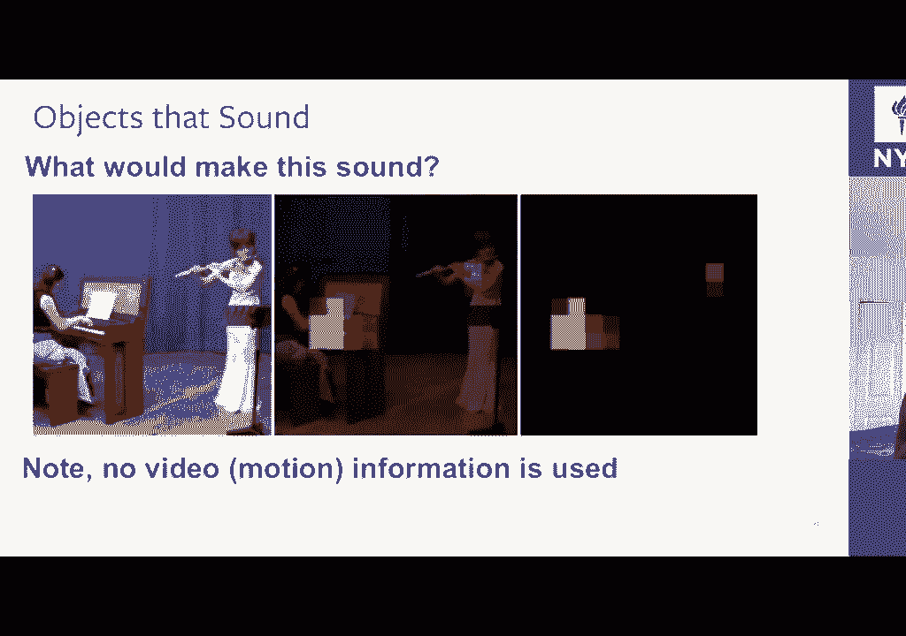

每当有卷积网之前，您就知道幻灯片，每当有卷积网之前，您就知道幻灯片，在太空程序中，您知道该音频的内核大小是多少，在太空程序中，您知道该音频的内核大小是多少，只是我有兴趣知道的内容。

只是我有兴趣知道的内容，我的意思是矩形或正方形内核大小，现在有某种调制解调器证明，我的意思是矩形或正方形内核大小，现在有某种调制解调器证明，模型，因此这基本上是在log spec程序上运行的，是的。

它仍然，模型，因此这基本上是在log spec程序上运行的，是的，它仍然，您需要决定如何手工制作光谱图，您需要决定如何手工制作光谱图，人们现在发现，您实际上可以使用原始音频，并且您可以，人们现在发现。

您实际上可以使用原始音频，并且您可以，实际上直接在音频信号上使用了缺点，是的，可以肯定并且，实际上直接在音频信号上使用了缺点，是的，可以肯定并且，它通常是一个小窗口，实际上取决于相应的。

它通常是一个小窗口，实际上取决于相应的，您正在使用的视频大约在一秒钟内价值约一秒钟的音频，您正在使用的视频大约在一秒钟内价值约一秒钟的音频，值得的视频，现在我已经向您展示了多个视频，值得的视频。

现在我已经向您展示了多个视频，定义借口要求的不同创造性方法让我们尝试看看。

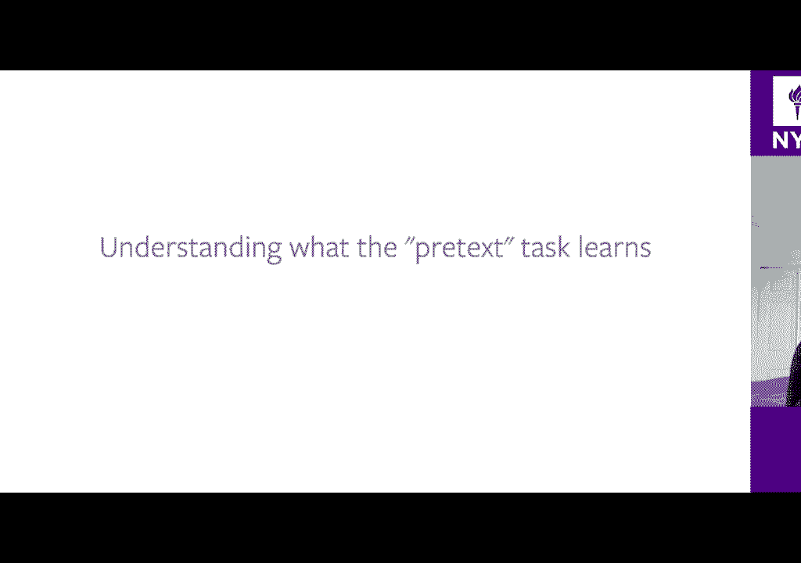

定义借口要求的不同创造性方法让我们尝试看看。

借口问学习，如果我给你25种不同的话，你该如何排序，借口问学习，如果我给你25种不同的话，你该如何排序，借口问你如何先验地决定哪一个是你想要的，借口问你如何先验地决定哪一个是你想要的。

使用以及他们将要学习什么，所以第一件事就是借口问，使用以及他们将要学习什么，所以第一件事就是借口问，实际上是互补的，所以2017年有一篇非常好的论文，实际上是互补的，所以2017年有一篇非常好的论文。

考察了其中的两项任务，因此相对位置是第一个借口，考察了其中的两项任务，因此相对位置是第一个借口，问我说过你在哪里拿两个补丁，你试图预测什么，问我说过你在哪里拿两个补丁，你试图预测什么。

它们相对于彼此的相对位置是，它们相对于彼此的相对位置是，基本上是拍摄灰度图像并尝试预测其颜色等等，基本上是拍摄灰度图像并尝试预测其颜色等等，这些作者展示的基本上是，如果您训练一个网络来同时进行。

这些作者展示的基本上是，如果您训练一个网络来同时进行，这些任务中，既可以预测colorize的颜色，也可以预测colorize的输出，这些任务中，既可以预测colorize的颜色。

也可以预测colorize的输出，相对位置，您实际上可以获得性能提升，所以这又是，相对位置，您实际上可以获得性能提升，所以这又是，以与我之前谈论的方式相同的方式进行评估。

以与我之前谈论的方式相同的方式进行评估，网络，那么您基本上是在评估它，网络，那么您基本上是在评估它，在这种情况下的最终任务imagenet分类和检测基准。

在这种情况下的最终任务imagenet分类和检测基准，在这两种情况下，您都可以通过执行这两项任务来获得收益，在这两种情况下，您都可以通过执行这两项任务来获得收益，这样您就可以充分利用这两个词。

因此从某种程度上讲，这还表明，这样您就可以充分利用这两个词，因此从某种程度上讲，这还表明，单个借口任务可能不是正确的答案，因此预测只是有色或，单个借口任务可能不是正确的答案，因此预测只是有色或。

仅仅预测相对位置可能不是学习细胞的正确答案，仅仅预测相对位置可能不是学习细胞的正确答案，实际上是受监督的陈述，如果您对，实际上是受监督的陈述，如果您对，预计信息会因任务而异，因此开始。

预计信息会因任务而异，因此开始，与相对位置任务，您预测一个相当低的水平，与相对位置任务，您预测一个相当低的水平，您所预测的信息只是八个可能的位置，因此，您所预测的信息只是八个可能的位置，因此。

分类问题或洗牌未知问题，分类问题或洗牌未知问题，预测事物是否被改组，所以这只是一个简单的二进制，预测事物是否被改组，所以这只是一个简单的二进制，问题，因此所预测的信息量很少，问题。

因此所预测的信息量很少，而如果您尝试预测最右边的内容，则是从最右边看，而如果您尝试预测最右边的内容，则是从最右边看，图像中缺少像素，并且您正在尝试重建像素，图像中缺少像素，并且您正在尝试重建像素。

预测各种信息，因为整个盒子包含我的意思，预测各种信息，因为整个盒子包含我的意思，它可以有一个非常大的外观空间，所以如果，它可以有一个非常大的外观空间，所以如果，你有像素，那么你基本上可以有很多不同的值。

你有像素，那么你基本上可以有很多不同的值，整个预测区域，因此您在预测很多信息，整个预测区域，因此您在预测很多信息，所以本质上，这是思考借口的简单方法，所以本质上，这是思考借口的简单方法。

您正在预测很多信息，这可以使您早已了解，您正在预测很多信息，这可以使您早已了解，你知道你是否真的在预测很多信息，所以，你知道你是否真的在预测很多信息，所以，可能实际上代表会更好，所以总的来说。

可能实际上代表会更好，所以总的来说，可以指导我的下一部分演讲，您可以想到，可以指导我的下一部分演讲，您可以想到，预测更多信息，例如轴，我将讨论三个，预测更多信息，例如轴，我将讨论三个，不同种类的类别。

实际上这是两个不同的类别，不同种类的类别，实际上这是两个不同的类别，借口问是我到目前为止一直在谈论什么，这只是预言，借口问是我到目前为止一直在谈论什么，这只是预言，简单的分类问题，例如不同程度的旋转等。

简单的分类问题，例如不同程度的旋转等，转向对比方法，这些方法实际上可以预测说，转向对比方法，这些方法实际上可以预测说，比这些借口任务更多的信息，在这个特别的演讲中，我是，比这些借口任务更多的信息。

在这个特别的演讲中，我是，实际上不会谈论生成模型，而是交互模型，实际上不会谈论生成模型，而是交互模型，可以预测比典型的对比方法更多的信息，所以这，可以预测比典型的对比方法更多的信息，所以这。

基本上是思考这些方法类别的一种方法，基本上是思考这些方法类别的一种方法，我们训练了多个训练前训练任务，我们是否将这两个任务的数据混洗，我们训练了多个训练前训练任务，我们是否将这两个任务的数据混洗。

它是训练师，您希望它导致灾难性的忘记，所以，它是训练师，您希望它导致灾难性的忘记，所以，简单的方法基本上就是您拥有的，因此您基本上可以，简单的方法基本上就是您拥有的，因此您基本上可以，备用批次。

因此您可以拥有相同的网络，并且在一个批次中，备用批次，因此您可以拥有相同的网络，并且在一个批次中，基本上给它提供黑白图像，然后您要求它预测彩色图像，基本上给它提供黑白图像，然后您要求它预测彩色图像。

它的一部分，现在在第二批中，基本上将其喂入，它的一部分，现在在第二批中，基本上将其喂入，修补程序，然后您要求它基本上执行相对位置任务，修补程序，然后您要求它基本上执行相对位置任务。

在顶部有两个像头一样的全连接层，因此您可以，在顶部有两个像头一样的全连接层，因此您可以，这些任务之间基本上是交替的，论文的作者所做的是，这些任务之间基本上是交替的，论文的作者所做的是。

实际上他们稍微有点复杂一些，实际上他们稍微有点复杂一些，多任务网络是三到四个，取决于借口的数量，多任务网络是三到四个，取决于借口的数量，您拥有的任务，实际上可以一次解决所有问题，但它们确实。

您拥有的任务，实际上可以一次解决所有问题，但它们确实，在这四个三个四个不同的方面，更多地涉及重量分配，在这四个三个四个不同的方面，更多地涉及重量分配，任务网络嗨，关于预测试，询问应该针对什么性能。

任务网络嗨，关于预测试，询问应该针对什么性能，借口问我们什么时候知道这足够了或者什么时候可以停止，借口问我们什么时候知道这足够了或者什么时候可以停止，因为最终我们关心下游的性能。

因为最终我们关心下游的性能，问题一和问题二是您在谈论信息不足和，问题一和问题二是您在谈论信息不足和，更多信息，例如在您提到自己在哪里的情况下，更多信息，例如在您提到自己在哪里的情况下。

预测它的顺序是否正确，预测它的顺序是否正确，正确预测了图像的实际排列，那么您如何确定，正确预测了图像的实际排列，那么您如何确定，在要执行的任务和基于工作的任务之间，因此，第二部分和第二部分。

在要执行的任务和基于工作的任务之间，因此，第二部分和第二部分，这个问题实际上将放在几张幻灯片中，我会推迟，这个问题实际上将放在几张幻灯片中，我会推迟，这个问题或以后的那个问题，但是第一部分。

你要训练多少，这个问题或以后的那个问题，但是第一部分，你要训练多少，这个模型在课本上问，这样的一个好兆头，这个模型在课本上问，这样的一个好兆头，被问到的借口是随着您对被问到的借口的准确性的提高。

被问到的借口是随着您对被问到的借口的准确性的提高，更好地预测事物是否被洗牌或变得更好，更好地预测事物是否被洗牌或变得更好，在预测旋转时，对下游语义的准确性，在预测旋转时，对下游语义的准确性。

任务也会有所改善，因此基本上可以使用这些规则，任务也会有所改善，因此基本上可以使用这些规则，借口任务是我们很难或难以做到的借口，借口任务是我们很难或难以做到的借口，尽可能地困难。

然后进行优化或类似的方法来减少，尽可能地困难，然后进行优化或类似的方法来减少，这样的借口任务，以便您最终的下游准确性得到提高，因此，这样的借口任务，以便您最终的下游准确性得到提高，因此，高度相关，正确。

因此在实践中，您实际上会耗尽每条管线的整个管线，正确，因此在实践中，您实际上会耗尽每条管线的整个管线，时间像借口和下游，并衡量业绩和上升，时间像借口和下游，并衡量业绩和上升，这不像是在某个时候停止借口。

然后切换到，这不像是在某个时候停止借口，然后切换到，只喜欢下游或类似的东西，所以通常这些方法，只喜欢下游或类似的东西，所以通常这些方法，被评估，但是我猜想在开发时，您可能会执行此管道，被评估。

但是我猜想在开发时，您可能会执行此管道，多次，所以这些方法都是经过训练的，多次，所以这些方法都是经过训练的，像你一样，你借口问，然后停下来，然后执行，像你一样，你借口问，然后停下来，然后执行。

下游进化任务，这为您提供了如何进行最终评估的方法，下游进化任务，这为您提供了如何进行最终评估的方法，你的借口问的很好是，那就是你要做这整个事情一次，你的借口问的很好是，那就是你要做这整个事情一次，对。

谢谢，问题的第二部分，我将介绍的模式信息部分，问题的第二部分，我将介绍的模式信息部分，到后来的排列等等，很好，所以这是三个主要存储桶中的一个，前两个是，很好，所以这是三个主要存储桶中的一个，前两个是。

现在基本上将被覆盖，所以这是窥视的另一个词，现在基本上将被覆盖，所以这是窥视的另一个词，基本上是关于扩展自我监督学习的，所以在这项特殊工作中，我们，基本上是关于扩展自我监督学习的，所以在这项特殊工作中。

我们，着重于两个问题，一个是我刚才谈到的着色问题，着重于两个问题，一个是我刚才谈到的着色问题，关于更早的时间，第二个是更多的电影或信息，关于更早的时间，第二个是更多的电影或信息，相对位置任务的变体。

因此该任务称为拼图游戏，相对位置任务的变体，因此该任务称为拼图游戏，想法是您拍摄一张图像，然后将其分成多个不同的色块，想法是您拍摄一张图像，然后将其分成多个不同的色块，并且您尝试准确预测。

即使将这些补丁基本上按，并且您尝试准确预测，即使将这些补丁基本上按，排列，然后您预测将哪个排列应用于输入，排列，然后您预测将哪个排列应用于输入，这与克里斯在这里的建议非常相似。

这与克里斯在这里的建议非常相似，好了，所以解决这个问题的方法就是在这种情况下说，好了，所以解决这个问题的方法就是在这种情况下说，您将三个补丁分别转发给每个补丁您，您将三个补丁分别转发给每个补丁您。

连接它们的特征，然后对基本上是哪个排列进行分类，连接它们的特征，然后对基本上是哪个排列进行分类，用来置换这些输入补丁，现在作者使用了九个补丁来解决，用来置换这些输入补丁，现在作者使用了九个补丁来解决。

这个问题，基本上就是9阶乘，就像360，这个问题，基本上就是9阶乘，就像360，当您尝试执行时，当然会有数千种排列，当您尝试执行时，当然会有数千种排列，最后，这表示您已完全连接，最后。

这表示您已完全连接，应该有36万个输出神经元，这是一个非常大的数目，应该有36万个输出神经元，这是一个非常大的数目，实践作者所做的基本上是，实践作者所做的基本上是，他们使用的排列表示他们从。

他们使用的排列表示他们从，九个阶乘排列，然后执行此一百，九个阶乘排列，然后执行此一百，权重分类正确，因此您可以通过某种方式查看，权重分类正确，因此您可以通过某种方式查看。

该子集是问题的复杂性或您所获得的信息量，该子集是问题的复杂性或您所获得的信息量，预测您是否在预测要解决的全部九阶因子，预测您是否在预测要解决的全部九阶因子，如果您只想在输出端预测很多信息。

如果您只想在输出端预测很多信息，子样本说两个或三个排列，您基本上没有预测，子样本说两个或三个排列，您基本上没有预测，大量的信息，因此随着，大量的信息，因此随着，子集的大小增加了。

所以在本文中我们基本上想研究一下，子集的大小增加了，所以在本文中我们基本上想研究一下，您预测多少信息的全部作用以及，您预测多少信息的全部作用以及，您学习的最终表示形式，因此在评估方面有两个。

您学习的最终表示形式，因此在评估方面有两个，拥有自我监督的假装网络后进行评估的方法，拥有自我监督的假装网络后进行评估的方法，关于哪种方法是正确的评估方法有很多争论。

关于哪种方法是正确的评估方法有很多争论，网络，因此第一种方法是基本上微调网络的所有层，网络，因此第一种方法是基本上微调网络的所有层，网络，以便您有下游任务进行姿势估计或说出图像，网络。

以便您有下游任务进行姿势估计或说出图像，您训练该网络的分类可以更新所有参数，您训练该网络的分类可以更新所有参数，该网络用于下游任务第二种方法是，该网络用于下游任务第二种方法是，网络作为特征提取器。

因此您基本上可以通过它运行图像，网络作为特征提取器，因此您基本上可以通过它运行图像，得到你的特征表示，现在你只训练线性分类器，得到你的特征表示，现在你只训练线性分类器，固定特征表示的顶部，因此在此。

固定特征表示的顶部，因此在此，我们说好的表象应该转移很少的，我们说好的表象应该转移很少的，培训，所以我们基本上选择了第二部分，那就是培训，培训，所以我们基本上选择了第二部分，那就是培训。

网络顶部的线性分类器被视为特征提取器，因此，网络顶部的线性分类器被视为特征提取器，因此，使用这两种方法当然有不同的优缺点，所以第一种方法，使用这两种方法当然有不同的优缺点，所以第一种方法。

可以很好地调整所有层，将小区监控网络视为，可以很好地调整所有层，将小区监控网络视为，初始化，因为您基本上是在更新整个网络，所以，初始化，因为您基本上是在更新整个网络，所以。

如果您的下游任务基本上有100万张图片，则说明您的基本更新，如果您的下游任务基本上有100万张图片，则说明您的基本更新，您整个网络中的那100万张图片，而在第二种情况下，您整个网络中的那100万张图片。

而在第二种情况下，只需在Feed固定功能上训练数量非常有限的参数，只需在Feed固定功能上训练数量非常有限的参数，提取器，所以基本上，第二个是测量一个，提取器，所以基本上，第二个是测量一个。

特点是您已经做好了，所以另一件事是，特点是您已经做好了，所以另一件事是，评估自我监督方法的关键是评估它们，评估自我监督方法的关键是评估它们，在很多不同的任务上，所以早在我谈论洗牌和，在很多不同的任务上。

所以早在我谈论洗牌和，学习我刚刚向您展示的工作会导致姿势估计，因此进行姿势估计，学习我刚刚向您展示的工作会导致姿势估计，因此进行姿势估计，当时确实在做，但是我在其他任务上做得并不好，当时确实在做。

但是我在其他任务上做得并不好，例如说动作识别，因此在此特定评估中，我们想要，例如说动作识别，因此在此特定评估中，我们想要，要纠正该错误，我们希望专注于多个不同的任务，因此，要纠正该错误。

我们希望专注于多个不同的任务，因此，各种不同的任务，例如说图像分类，您可以短期学习，各种不同的任务，例如说图像分类，您可以短期学习，目标检测3d了解导航等，因此我们定义了，目标检测3d了解导航等。

因此我们定义了，基本上就像一组九个不同的任务，因此评估，基本上就像一组九个不同的任务，因此评估，制图表达基本上是提取固定特征，您可以提取这些特征，制图表达基本上是提取固定特征，您可以提取这些特征。

固定来自网络不同部分的功能，以便基本上可以使用，固定来自网络不同部分的功能，以便基本上可以使用，来自非常接近输入的层或来自非常高层的层，来自非常接近输入的层或来自非常高层的层，这非常接近输出。

因此您可以通过这种方式来测量，这非常接近输出，因此您可以通过这种方式来测量，这些不同层的每一个的语义Ness，这些不同层的每一个的语义Ness，而我们在许多此类实验中所做的标准工作是。

而我们在许多此类实验中所做的标准工作是，使用图像分类任务来了解正在发生的事情，因此，使用图像分类任务来了解正在发生的事情，因此，图像分类任务是在称为EOC的数据集上进行的。

图像分类任务是在称为EOC的数据集上进行的，检测和分类的标准，其目的是，检测和分类的标准，其目的是，预测图像是否具有二十个类别之一，并且图像可以，预测图像是否具有二十个类别之一，并且图像可以。

实际上有一个以上的类，例如一个人的照片，实际上有一个以上的类，例如一个人的照片，与同时拥有人和狗的狗一起，因此该网络现在需要识别，与同时拥有人和狗的狗一起，因此该网络现在需要识别，它里面的两个对象。

所以它并不比您在其中的图像网稍微难一点，它里面的两个对象，所以它并不比您在其中的图像网稍微难一点，基本上只需要认证n25图像中的关键对象之一，基本上只需要认证n25图像中的关键对象之一。

所以我们要做的第一件事基本上是验证假设，所以我们要做的第一件事基本上是验证假设，是否实际增加预测的信息量，是否实际增加预测的信息量，在x轴上有更好的表示形式，我们正在增加数量，在x轴上有更好的表示形式。

我们正在增加数量，我们用来基本训练我们的网络的排列方式，我们用来基本训练我们的网络的排列方式，从100到10，000，在y轴上，我们基本上在测量，从100到10，000，在y轴上，我们基本上在测量。

这些预先训练的表示的下游传输性能，以及，这些预先训练的表示的下游传输性能，以及，它是使用称为map（平均平均精度）的指标进行测量的，因此，它是使用称为map（平均平均精度）的指标进行测量的，因此。

本质上是因为这是一个相当多的标签，本质上是因为这是一个相当多的标签，分类问题，您将要测量每个分类的平均精度，分类问题，您将要测量每个分类的平均精度，不同的20个类别，然后您将计算，不同的20个类别。

然后您将计算，在这种情况下，如此高的精度会更好，所以我们针对两个，在这种情况下，如此高的精度会更好，所以我们针对两个，不同的架构Aleks收集了拼图纸最初使用的内容。

不同的架构Aleks收集了拼图纸最初使用的内容，然后产生共鸣50，您观察到的是Alex net增加，然后产生共鸣50，您观察到的是Alex net增加，排列的数量在一定程度上是有用的。

但是总的来说收益是，排列的数量在一定程度上是有用的，但是总的来说收益是，是有限的，而对于ResNet，如果您增加排列的数量，则，是有限的，而对于ResNet，如果您增加排列的数量，则，表示质量越来越好。

我们的假设基本上是，表示质量越来越好，我们的假设基本上是，谐振模型具有足够的容量，可以实际解决，谐振模型具有足够的容量，可以实际解决，非常困难的置换问题，当它解决了困难的置换时，非常困难的置换问题。

当它解决了困难的置换时，问题，它能够学习更好的概括，问题，它能够学习更好的概括，处理不同的下游任务，所以我们接下来要做的是评估我们的，处理不同的下游任务，所以我们接下来要做的是评估我们的。

对象检测任务的方法，因此对象检测基本上就是您，对象检测任务的方法，因此对象检测基本上就是您，尝试识别图像中存在哪些对象，我们尝试在其周围绘制一个框，尝试识别图像中存在哪些对象。

我们尝试在其周围绘制一个框，他们和你的测量基本上是基于周围的盒子有多好，他们和你的测量基本上是基于周围的盒子有多好，对象以及您是否能够识别图像中的所有对象，以及，对象以及您是否能够识别图像中的所有对象。

以及，再次为此，我们使用相同的vo C beta集，再次为此，我们使用相同的vo C beta集，因此，在此设置中，我们基本上微调了，因此，在此设置中，我们基本上微调了，网络，因为这是检测的标准。

我们观察到的是，网络，因为这是检测的标准，我们观察到的是，基本上在此视频的两个不同部分上，看到了设置拼图的数据，基本上在此视频的两个不同部分上，看到了设置拼图的数据，该方法实际上在误差范围内基本可比。

该方法实际上在误差范围内基本可比，培训排放监督方法，以便您拥有排放监督网络，培训排放监督方法，以便您拥有排放监督网络，您在检测任务中找到了自己，并且获得了平均数，您在检测任务中找到了自己。

并且获得了平均数，精度为70点5或76点2，而拼图方法是，精度为70点5或76点2，而拼图方法是，基本上在这些方法的误差范围内，这些方法本身就是，基本上在这些方法的误差范围内，这些方法本身就是。

表明它实际上具有某种不错的语义属性，并且能够，表明它实际上具有某种不错的语义属性，并且能够，将对象定位到一个级别并将这种上下文置于上下文中以进行语义化。

将对象定位到一个级别并将这种上下文置于上下文中以进行语义化，特征学习就像在计算机视觉中一样，特别是对象检测，特征学习就像在计算机视觉中一样，特别是对象检测，被认为是基准数据集，以达到真正。

被认为是基准数据集，以达到真正，属于，这个结果基本上在我们已经发表时是，属于，这个结果基本上在我们已经发表时是，就以下方面而言，最接近任何人来监督免费培训的人员：就以下方面而言。

最接近任何人来监督免费培训的人员：检测，对，这是一个问题，嗯，TechStars也是如此，对，这是一个问题，嗯，TechStars也是如此，类似于我们可以尝试通过迁移学习实现的功能，就像。

类似于我们可以尝试通过迁移学习实现的功能，就像，还是可以的，所以我的意思是您评估这些借口任务的方式是，还是可以的，所以我的意思是您评估这些借口任务的方式是，转移学习，以便您执行原始的借口任务。

然后您发现，转移学习，以便您执行原始的借口任务，然后您发现，可以根据特定任务（例如检测）的数据集来确定单位，因此评估是，可以根据特定任务（例如检测）的数据集来确定单位，因此评估是，总是转移学习。

所以我们要看的下一个任务是表面法线评估，这是，所以我们要看的下一个任务是表面法线评估，这是，基本上在给定输入的情况下，您尝试估算什么是3D属性，基本上在给定输入的情况下，您尝试估算什么是3D属性。

基本上是在您尝试预测的输入中每个像素位置处，基本上是在您尝试预测的输入中每个像素位置处，什么是表面方向，所以在3d中基本上每个方向的XY＆z矢量，什么是表面方向。

所以在3d中基本上每个方向的XY＆z矢量，特定的表面，这是您需要的一种密集预测问题，特定的表面，这是您需要的一种密集预测问题，将该XYZ向量分配给输入中的每个位置，并为此。

将该XYZ向量分配给输入中的每个位置，并为此，使用N由U创建的很好的数据集，我们基本上测量了预测，使用N由U创建的很好的数据集，我们基本上测量了预测，方法具有风险的性质，并将其与受监督的图像网进行比较。

方法具有风险的性质，并将其与受监督的图像网进行比较，方法，因此在这种情况下，我们测量了中位数误差和百分比，方法，因此在这种情况下，我们测量了中位数误差和百分比，正确的预测。

因此中位数误差基本上意味着越低越好，正确的预测，因此中位数误差基本上意味着越低越好，正确的百分比意味着越高越好，所以原来是拼图，正确的百分比意味着越高越好，所以原来是拼图，在这种情况下。

预训练任务实际上非常好，它提供了，在这种情况下，预训练任务实际上非常好，它提供了，与传教士训练相比有重大改进，因此基本上，与传教士训练相比有重大改进，因此基本上，跨多个不同的集合有多个不同的分割。

跨多个不同的集合有多个不同的分割，真的很容易胜过图像网监督的Praetorian方法，因此再次，真的很容易胜过图像网监督的Praetorian方法，因此再次，进一步表明，评估多个不同的前置任务。

进一步表明，评估多个不同的前置任务，任务和多个不同的数据集对于了解什么非常重要，任务和多个不同的数据集对于了解什么非常重要，确实是在借口任务中进行的，所以拼图实际上以某种方式并入了。

确实是在借口任务中进行的，所以拼图实际上以某种方式并入了，关于几何图形和像素水平的东西，关于几何图形和像素水平的东西，信息远胜于图像网监督方法，信息远胜于图像网监督方法。

所以最终我们找到了这种方法的致命弱点，例如，所以最终我们找到了这种方法的致命弱点，例如，返回任务，因此我们进行了评估，就像设置为little的设置一样，返回任务，因此我们进行了评估。

就像设置为little的设置一样，短负载，所以在少数短负载中，您的数量非常有限，短负载，所以在少数短负载中，您的数量非常有限，训练示例，而您只是在这些方面训练分类器，训练示例。

而您只是在这些方面训练分类器，训练示例数量有限，所以在x轴上我有，训练示例数量有限，所以在x轴上我有，用来训练方法的训练示例，从1开始，用来训练方法的训练示例，从1开始，到96，我正在为您展示曲线。

就像我们自己喜欢的2种不同，到96，我正在为您展示曲线，就像我们自己喜欢的2种不同，细胞监督的方法，所以拼图方法在两个不同的数据上训练，细胞监督的方法，所以拼图方法在两个不同的数据上训练。

设置图像网在最上面，随机有50个，所以你可以，设置图像网在最上面，随机有50个，所以你可以，观察到，单元之间的性能存在显着差距，观察到，单元之间的性能存在显着差距，有监督的方法和有监督的方法。

有监督的方法和有监督的方法，随着标记示例的数量增加，似乎并没有减少，随着标记示例的数量增加，似乎并没有减少，哪种显示单元监督的表示，尽管它们可能是，哪种显示单元监督的表示，尽管它们可能是。

擅长诸如姿势估计之类的任务或诸如曲面法线之类的特定任务，擅长诸如姿势估计之类的任务或诸如曲面法线之类的特定任务，估计哪种语义之间仍有很多差异，估计哪种语义之间仍有很多差异，他们捕获的数据的方面。

因为这是一些短期学习，他们捕获的数据的方面，因为这是一些短期学习，任务，如果我给您一张图片，并且您能够说些什么，任务，如果我给您一张图片，并且您能够说些什么，您的要素表示必须非常出色才能解决该任务。

您的要素表示必须非常出色才能解决该任务，另一位女士评价这种方法是从根本上看它学到了什么，另一位女士评价这种方法是从根本上看它学到了什么，每个不同的层，所以我们基本上在不同的层上训练线性分类器。

每个不同的层，所以我们基本上在不同的层上训练线性分类器，就像ResNet 50中的不同清晰表示形式一样，就像ResNet 50中的不同清晰表示形式一样，将会是最接近输入到输出的层，比如说有两个。

将会是最接近输入到输出的层，比如说有两个，块有三个块，有五个块，所以这五个基本上是，块有三个块，有五个块，所以这五个基本上是，您从共鸣50和，您从共鸣50和，在该表示之后，您将执行整个拼图。

在该表示之后，您将执行整个拼图，预测置换任务，因此在这种情况下，您会看到x轴，预测置换任务，因此在这种情况下，您会看到x轴，表示特征来自con 1或s 5以及在，表示特征来自con 1或s 5以及在。

y轴，我们正在查看图像分类位置之后的平均值，y轴，我们正在查看图像分类位置之后的平均值，有趣的是，您所看到的基本上是，有趣的是，您所看到的基本上是，当您从玉米1移至s 4时，质量会提高，因此稳定地。

当您从玉米1移至s 4时，质量会提高，因此稳定地，平均平均精度提高了，但是到了最后急剧下降，平均平均精度提高了，但是到了最后急剧下降，因此，对res 5感到不安会导致性能急剧下降，这是由于，因此。

对res 5感到不安会导致性能急剧下降，这是由于，最终专注于特定任务是的，所以这非常令人担忧，最终专注于特定任务是的，所以这非常令人担忧，因为如果您要为一个受监管的网络计划该事情。

因为如果您要为一个受监管的网络计划该事情，观察到从女修道院到rs5，表示质量始终在提高，观察到从女修道院到rs5，表示质量始终在提高，这几乎适用于任何良好的受监管网络，而对于。

这几乎适用于任何良好的受监管网络，而对于，许多自我监督的网络，我们对，许多自我监督的网络，我们对，旋转网络，但相对位置的着色他将始终，旋转网络，但相对位置的着色他将始终。

观察到与布雷斯特要塞5的巨大差距，所以这说，观察到与布雷斯特要塞5的巨大差距，所以这说，我们要解决的借口的最终任务可能不是很好，我们要解决的借口的最终任务可能不是很好。

因为它与我们下游的语义任务不太吻合，因为它与我们下游的语义任务不太吻合，真的想解决，这基本上将我带到了下一个。

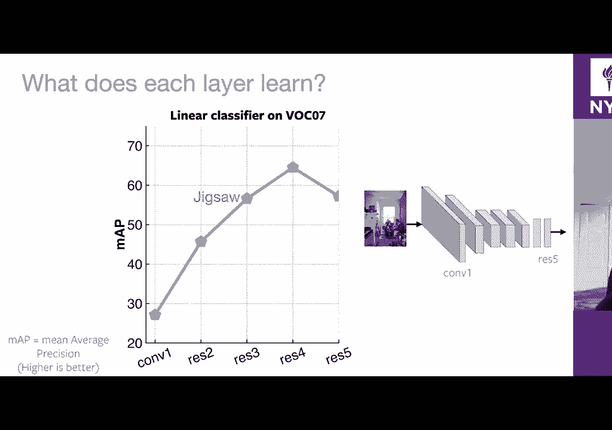

真的想解决，这基本上将我带到了下一个，理解这些借口所缺少的部分是这些。

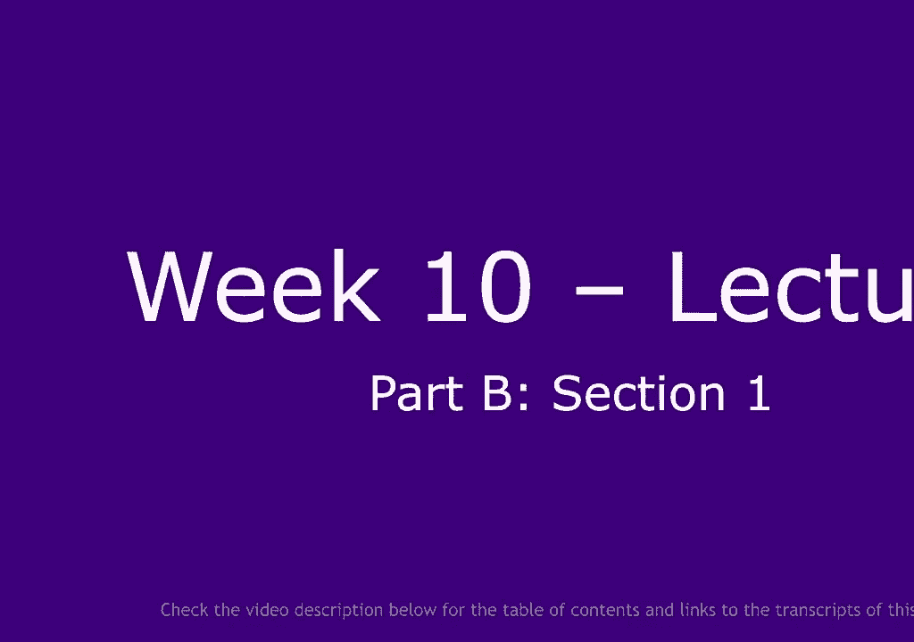

理解这些借口所缺少的部分是这些，代理任务，因此，重述借口任务基本上就像预测轮换或，因此，重述借口任务基本上就像预测轮换或，预测拼图游戏，如果您从较大的角度看，预测拼图游戏，如果您从较大的角度看。

他们非常惊讶的事物的图片，甚至，他们非常惊讶的事物的图片，甚至，工作是非常令人惊讶的，因此对于借口任务，我们拥有，工作是非常令人惊讶的，因此对于借口任务，我们拥有，训练前的步骤，在此步骤下进行监督。

然后我们进行转学，训练前的步骤，在此步骤下进行监督，然后我们进行转学，图像分类或检测的任务，实际上很多，图像分类或检测的任务，实际上很多，一厢情愿和很多希望，预训练任务和转移，一厢情愿和很多希望。

预训练任务和转移，任务是超级对齐的，没有证据表明它真的很像，任务是超级对齐的，没有证据表明它真的很像，真的很辛苦地希望无论借口要求我们提出这个建议，真的很辛苦地希望无论借口要求我们提出这个建议。

确实更好地与我们的转移任务保持一致，并解决p-tex任务会做的事情，确实更好地与我们的转移任务保持一致，并解决p-tex任务会做的事情，在转移任务中非常好，所以研究的内容基本上是设计。

在转移任务中非常好，所以研究的内容基本上是设计，这些借口任务并很好地执行它们，但不清楚为什么，这些借口任务并很好地执行它们，但不清楚为什么，解决诸如拼图之类的问题，应该教给我们有关语义的任何知识。

解决诸如拼图之类的问题，应该教给我们有关语义的任何知识，甚至在您试图击败主管的情况下，甚至在您试图击败主管的情况下，通过预测图像的标签来预测不清楚的图像的标签。

通过预测图像的标签来预测不清楚的图像的标签，实际上会很好地学习一些好的分类器，实际上会很好地学习一些好的分类器，关于转移任务，所以这个问题仍然存在，您如何设计良好的预，关于转移任务。

所以这个问题仍然存在，您如何设计良好的预，训练任务与您的转移任务非常吻合，因此希望，训练任务与您的转移任务非常吻合，因此希望，泛化基本上是您可以做到的，而我们对此进行评估的方式是。

泛化基本上是您可以做到的，而我们对此进行评估的方式是，基本上是通过查看每个图层的表示，基本上是通过查看每个图层的表示，最后一个清晰的地方，我们看不到对齐的表示形式，最后一个清晰的地方。

我们看不到对齐的表示形式，然后执行转移任务，那是一个危险信号，告诉我们，然后执行转移任务，那是一个危险信号，告诉我们，也许这个保留任务不是真正要解决的正确任务，也许这个保留任务不是真正要解决的正确任务。

所以就像我前面提到的，这基本上是一种模式，所以就像我前面提到的，这基本上是一种模式，去拼图，这表明我们最后一层可能非常多，去拼图，这表明我们最后一层可能非常多，专攻那个Excel问题，正确。

所以总的来说，我们真正想要的是预训练的功能，正确，所以总的来说，我们真正想要的是预训练的功能，应该代表图像之间的相互关系，因此代表特征，应该代表图像之间的相互关系，因此代表特征，站起来。

这基本上可以说是最近的邻居可视化，站起来，这基本上可以说是最近的邻居可视化，我真的应该能够将图像组合在一起，我真的应该能够将图像组合在一起，在某种程度上与语义相关，第二个属性基本上是一个属性。

在某种程度上与语义相关，第二个属性基本上是一个属性，这一直是设计视觉功能的支柱，因此即使在售前，这一直是设计视觉功能的支柱，因此即使在售前，深度学习功能很受欢迎手工功能始终都是。

深度学习功能很受欢迎手工功能始终都是，关于某种不变性，例如照明或，关于某种不变性，例如照明或，例如确切的颜色或确切的位置，所以这是两个属性，例如确切的颜色或确切的位置，所以这是两个属性。

我们真正想要保留功能的方法有两种，我们真正想要保留功能的方法有两种，实现这些目标，一方面是集群，另一方面是对比，实现这些目标，一方面是集群，另一方面是对比，观察，这两种方法都应允了，因为它们确实在解决。

观察，这两种方法都应允了，因为它们确实在解决，基本上是在尝试时获取这些属性，基本上是在尝试时获取这些属性，学习表示法，我相信这就是为什么它们实际上已经开始，学习表示法。

我相信这就是为什么它们实际上已经开始，表现比手工设计的借口要好得多，表现比手工设计的借口要好得多，到目前为止，到目前为止，我将重点放在我们最近的两部作品上：到目前为止，到目前为止。

我将重点放在我们最近的两部作品上：属于聚类和不变性的这个口袋，所以一个是，属于聚类和不变性的这个口袋，所以一个是，称为加多余的，另一种称为pur，两者都会出现，称为加多余的，另一种称为pur。

两者都会出现，是CVG艺术家的作品，是的，所以我们认为第一部作品是分类的，是CVG艺术家的作品，是的，所以我们认为第一部作品是分类的，对改善视觉表示的泛化非常好，因此，对改善视觉表示的泛化非常好，因此。

基本上，聚类是了解对图像进行分组的好方法，基本上，聚类是了解对图像进行分组的好方法，哪些图像在一起，而什么图像却不在一起，哪些图像在一起，而什么图像却不在一起，基本上是通过对该功能执行聚类来吸引您。

基本上是通过对该功能执行聚类来吸引您，空间中，您可以获得这些相关的图像以及，空间中，您可以获得这些相关的图像以及，无关，所以本文的主要思想非常简单，无关，所以本文的主要思想非常简单，两个步骤。

一个是步骤的成本，另一个是预测步骤，所以我们要做的是，两个步骤，一个是步骤的成本，另一个是预测步骤，所以我们要做的是，是我们占据了任何网络，这可以是任何传教士，是我们占据了任何网络，这可以是任何传教士。

净值本身并不一定要仅仅是一个自我监督的网络，净值本身并不一定要仅仅是一个自我监督的网络，可以是虚构的火车网络，也可以是使用主题标签预先训练的网络，可以是虚构的火车网络。

也可以是使用主题标签预先训练的网络，或像一列火车这样的单元监控网络来预测夹具或排列，或像一列火车这样的单元监控网络来预测夹具或排列，当您提取一系列功能时，您将使用这个自由贸易网络，当您提取一系列功能时。

您将使用这个自由贸易网络，从一组图像中提取图像，当然这些图像没有您提取的标签，从一组图像中提取图像，当然这些图像没有您提取的标签，这些功能在执行k均值聚类时得到的是，这些功能在执行k均值聚类时得到的是。

基本上对于每个标签的每个图像，您都知道它属于哪个群集，基本上对于每个标签的每个图像，您都知道它属于哪个群集，成为其标签，因此在第二适合步骤中，您要做的是训练，成为其标签，因此在第二适合步骤中。

您要做的是训练，从头开始创建网络，就像从随机位开始一样，您将此网络训练为，从头开始创建网络，就像从随机位开始一样，您将此网络训练为，只预测这些伪标签，所以如果是伪的，因为它们基本上是，只预测这些伪标签。

所以如果是伪的，因为它们基本上是，是通过聚类获得的，因此它们并不是由，是通过聚类获得的，因此它们并不是由，说一个人类注释者，所以现在第二个网络仅仅是，说一个人类注释者，所以现在第二个网络仅仅是。

尝试预测这些聚类分配，以便获取我们的图像和，尝试预测这些聚类分配，以便获取我们的图像和，尝试预测您从k均值中获得的K个聚类之一，尝试预测您从k均值中获得的K个聚类之一，该图像是否属于某个图像。

所以标准的预训练和转移任务是，该图像是否属于某个图像，所以标准的预训练和转移任务是，基本上执行您的预训练，所以最上面的一行是执行您的，基本上执行您的预训练，所以最上面的一行是执行您的，对目标进行预训练。

例如预测标签或预测GPS，对目标进行预训练，例如预测标签或预测GPS，位置，然后通过学习线性探针来评估此功能，位置，然后通过学习线性探针来评估此功能，在集群适应世界中，我们基本上不会进行预培训，因此您。

在集群适应世界中，我们基本上不会进行预培训，因此您，像您一样进行免费培训，您只需在两者之间插入一个步骤，像您一样进行免费培训，您只需在两者之间插入一个步骤，是聚类拟合步骤，您获取数据集D。

然后获取Praetor，是聚类拟合步骤，您获取数据集D，然后获取Praetor，网络，您将从头开始学习此数据的新网络，最后您，网络，您将从头开始学习此数据的新网络，最后您。

基本上将绿色网络用作您的所有下游任务，因此，基本上将绿色网络用作您的所有下游任务，因此，我们认为此方法有效的原因是因为聚类步骤然后，我们认为此方法有效的原因是因为聚类步骤然后。

您只是对这些图像进行了聚类，您仅捕获了，您只是对这些图像进行了聚类，您仅捕获了，基本信息，基本上是什么图像组合在一起，什么图像，基本信息，基本上是什么图像组合在一起，什么图像，不要在一起。

所以您通读了所有其他信息，不要在一起，所以您通读了所有其他信息，出现在原始网络中只是捕获所输入图像的种类，出现在原始网络中只是捕获所输入图像的种类，最初的网络已捕获并让其建模的关系。

最初的网络已捕获并让其建模的关系，为了了解这一点，我们进行了一个相当简单的实验，为了了解这一点，我们进行了一个相当简单的实验，添加了标签噪声，因此合成标签噪声进入了imagenet，我们训练了。

添加了标签噪声，因此合成标签噪声进入了imagenet，我们训练了，网络基本上在这个嘈杂的图像网上，所以只需翻转一堆图像标签，网络基本上在这个嘈杂的图像网上，所以只需翻转一堆图像标签，并训练网络。

现在您可以据此评估特征表示，并训练网络，现在您可以据此评估特征表示，下游任务上的网络，这又是一个网状网络，但它要大得多，下游任务上的网络，这又是一个网状网络，但它要大得多，图像网的版本，所以它是9。

000重量分类，所以我们基本上，图像网的版本，所以它是9，000重量分类，所以我们基本上，x轴具有添加到图像的标签噪声量，因此，x轴具有添加到图像的标签噪声量，因此，从0％到75％，在y轴上。

我们正在研究转移，从0％到75％，在y轴上，我们正在研究转移，较大的图像上的性能在9，000个数据集上的发射净值，较大的图像上的性能在9，000个数据集上的发射净值，线向您展示了经过预训练的网络。

基本上，线向您展示了经过预训练的网络，基本上，标签噪声的数量增加了预训练网络的性能，标签噪声的数量增加了预训练网络的性能，下游任务减少，这并不奇怪，因为作为标签，下游任务减少，这并不奇怪，因为作为标签。

变得越来越不可靠当然，您的表示质量将达到，变得越来越不可靠当然，您的表示质量将达到，遭受这样的痛苦，以至于在，遭受这样的痛苦，以至于在，用这种称为模块荒凉的技术进行试验。

用这种称为模块荒凉的技术进行试验，初始网络，然后使用它来生成标签，以便您查看，初始网络，然后使用它来生成标签，以便您查看，该网络的输出，您会看到对输出的信心，该网络的输出，您会看到对输出的信心。

为第二个网络生成标签，这称为建模隔离，因此，为第二个网络生成标签，这称为建模隔离，因此，模型解析通常比预训练网络表现更好，并且，模型解析通常比预训练网络表现更好，并且，您会看到所有情况。

因此标签噪音会增加，您会看到所有情况，因此标签噪音会增加，蒸馏模型实际上比原始模型好得多，最后，蒸馏模型实际上比原始模型好得多，最后，到最后我们已经分类，所以这是绿线，您可以看到，到最后我们已经分类。

所以这是绿线，您可以看到，分类模型始终优于基本模型，分类模型始终优于基本模型，这些方法中的任何一种，无论是蒸馏还是预训练，都能始终如一地，这些方法中的任何一种，无论是蒸馏还是预训练，都能始终如一地。

更好的结果，包括噪声为零时，更好的结果，包括噪声为零时，这基本上是当您拥有预先训练的imagenet网络时，因此我们，这基本上是当您拥有预先训练的imagenet网络时，因此我们。

阐述了精馏和聚类拟合之间的区别，阐述了精馏和聚类拟合之间的区别，再次是，是的，所以在蒸馏中，你会做的是你，再次是，是的，所以在蒸馏中，你会做的是你，基本上，因此在第一步中，您将使用预先训练的网络。

基本上，因此在第一步中，您将使用预先训练的网络，并且您将使用该网络正在预测的标签，因此说，并且您将使用该网络正在预测的标签，因此说，网络基本上可以预测1，000个课程，因此您基本上可以在。

网络基本上可以预测1，000个课程，因此您基本上可以在，以软件方式生成图像的生成标签，所以说，以软件方式生成图像的生成标签，所以说，网络经过训练可以预测100种不同类型的狗，因此您可以。

网络经过训练可以预测100种不同类型的狗，因此您可以，图片，您会获得超过100种不同类型的狗的分布，并使用它，图片，您会获得超过100种不同类型的狗的分布，并使用它，分布来训练您的第二个网络。

而在集群适合中，您不需要，分布来训练您的第二个网络，而在集群适合中，您不需要，真正在乎标签空间或前置输出输出空间的种类，真正在乎标签空间或前置输出输出空间的种类，训练有素的网络，您只看功能。

甚至不看最后一个，训练有素的网络，您只看功能，甚至不看最后一个，完全连接，您只需看一下以前的功能就可以了，为什么，完全连接，您只需看一下以前的功能就可以了，为什么，软件分发会为培训提供帮助吗。

例如我们为什么要进行培训，软件分发会为培训提供帮助吗，例如我们为什么要进行培训，这将得到帮助，这种解决方案关系背后的直觉意味着，这将得到帮助，这种解决方案关系背后的直觉意味着，直觉基本上是。

如果您的网络训练得很好，那么，直觉基本上是，如果您的网络训练得很好，那么，假设您没有标签杂音，因为很多事情并不是真的，假设您没有标签杂音，因为很多事情并不是真的，实际上，很多图像不属于此类，实际上。

很多图像不属于此类，您的数据集实际上有一百二十种不同类型的狗，但是您，您的数据集实际上有一百二十种不同类型的狗，但是您，仅有数百张标签，所以对于很多这些图片来说，您，仅有数百张标签。

所以对于很多这些图片来说，您，实际上必须分配，您必须基本上选择哪只狗是，实际上必须分配，您必须基本上选择哪只狗是，软件分发基本上可以帮助您发现隐藏的类别，软件分发基本上可以帮助您发现隐藏的类别。

所以基本上在第5点中这种类型的导盲犬是0。5种，所以基本上在第5点中这种类型的导盲犬是0。5种，所以基本上拥有这些软件标签可以帮助您增强分类，所以基本上拥有这些软件标签可以帮助您增强分类。

您拥有的初始班级分布，您拥有的初始班级分布，好的，谢谢，所以我们将这种方法应用于细胞监督学习中，好的，谢谢，所以我们将这种方法应用于细胞监督学习中，我刚才谈到的拼图任务，我们能够看到。

我刚才谈到的拼图任务，我们能够看到，在一系列数据集上获得惊人的收益，因此采用了拼图方法，在一系列数据集上获得惊人的收益，因此采用了拼图方法，在第一行中，我在您要查找的每种列中，在第一行中。

我在您要查找的每种列中，基本上是这种拼图方法在很多情况下的传输性能，基本上是这种拼图方法在很多情况下的传输性能，如果您将聚类拟合应用于区域锯方法，则实际上是不同的数据集。

如果您将聚类拟合应用于区域锯方法，则实际上是不同的数据集，可以看到所有这些数据集的收益，而且它们是相当一致的，可以看到所有这些数据集的收益，而且它们是相当一致的，我们对三种不同的训练方法进行测试。

我们对三种不同的训练方法进行测试，进行协调，从而预测旋转，我们可以再次看到相当不错的收益，进行协调，从而预测旋转，我们可以再次看到相当不错的收益，跨这四个不同的数据集，并且令人惊讶的是，足够的聚类拟合。

跨这四个不同的数据集，并且令人惊讶的是，足够的聚类拟合，确实可以在任何经过​​预训练的网络上使用，因此可以是完全受监督的网络，确实可以在任何经过​​预训练的网络上使用，因此可以是完全受监督的网络。

网络或每周受监督的网络，因此可以说是经过培训的网络，网络或每周受监督的网络，因此可以说是经过培训的网络，预测主题标签或每周监督的视频网络或基本上任何单元。

预测主题标签或每周监督的视频网络或基本上任何单元，监督网络，在每种情况下，我们都可以观察到相当一致，监督网络，在每种情况下，我们都可以观察到相当一致，当您具有特定的目标时，就会获得很大的收益。

因此它实际上能够，当您具有特定的目标时，就会获得很大的收益，因此它实际上能够，改善大多数这些方法的通用性，我认为您正在拖延，改善大多数这些方法的通用性，我认为您正在拖延，周围的麦克风很吵。

所以第二件事基本上是，周围的麦克风很吵，所以第二件事基本上是，这些收益无需额外的数据标签或更改，这些收益无需额外的数据标签或更改，架构，因此在某些方面您可以将其视为自我监督，架构。

因此在某些方面您可以将其视为自我监督，找到下一步，这样您就可以拥有预先训练的网络，然后基本上，找到下一步，这样您就可以拥有预先训练的网络，然后基本上，执行此群集步骤，这是完全分类的步骤，执行此群集步骤。

这是完全分类的步骤，监督或无监督，然后您可以观察到，监督或无监督，然后您可以观察到，质量提高了我在幻灯片中向您展示了一个问题，质量提高了我在幻灯片中向您展示了一个问题，拼图和通过使用分类的改进。

拼图和通过使用分类的改进，群集是因为它完全没使用拼图，所以它是，群集是因为它完全没使用拼图，所以它是，在拼图方法的顶部应用，所以有一个假装的网络，在拼图方法的顶部应用，所以有一个假装的网络。

从中您可以正确地实现功能，因此在这种情况下，假装网络是，从中您可以正确地实现功能，因此在这种情况下，假装网络是，技巧或假装网络哦，好吧，参加网络，然后你，技巧或假装网络哦，好吧，参加网络，然后你。

基本上在它上面表现自己，好吧，我认为主要是，基本上在它上面表现自己，好吧，我认为主要是，直觉是当您说执行拼图任务时，最后一层变成，直觉是当您说执行拼图任务时，最后一层变成，非常适合特定的拼图任务。

所以我们看到了，非常适合特定的拼图任务，所以我们看到了，当您采用这些功能并在，当您采用这些功能并在，您可以认为这基本上是在减少，您可以认为这基本上是在减少，如果我耗尽第二个网络以直接回归。

如果我耗尽第二个网络以直接回归，第一个网络的功能我基本上会得到完全相同的网络，但是，第一个网络的功能我基本上会得到完全相同的网络，但是，如果我耗尽第二个网络只是为了预测将哪些图像分组在一起。

如果我耗尽第二个网络只是为了预测将哪些图像分组在一起，在第一个中，我实际上是在预测较少的信息，而我认为，在第一个中，我实际上是在预测较少的信息，而我认为，基本上，聚类是某种噪声消除技术，所以它是。

基本上，聚类是某种噪声消除技术，所以它是，真正地从所有像这样的拼图中删除了所有的拼图，真正地从所有像这样的拼图中删除了所有的拼图，功能空间，因此第二个网络实际上在学习一些东西，功能空间。

因此第二个网络实际上在学习一些东西，更通用，这就是像该实验这样的原因，更通用，这就是像该实验这样的原因，好吧，在这种情况下，我们通过经验来验证该假设，好吧，在这种情况下，我们通过经验来验证该假设。

实际上会吸收大量标签噪音，因此最后一层基本上是，实际上会吸收大量标签噪音，因此最后一层基本上是，得到的比oisi还要多，而当您在此基础上进行聚类拟合时，得到的比oisi还要多。

而当您在此基础上进行聚类拟合时，实际上又看到了改进，这就是我们对此的验证，实际上又看到了改进，这就是我们对此的验证，假设我还有一个问题，所以您衡量了，假设我还有一个问题，所以您衡量了。

对象检测中的类缺陷，例如它是否执行得很好或仅仅是，对象检测中的类缺陷，例如它是否执行得很好或仅仅是，分类很好，因此在检测方面也表现出色，因此实际上，分类很好，因此在检测方面也表现出色，因此实际上。

确实表现良好，是的，因此在最初的实验检测中，确实表现良好，是的，因此在最初的实验检测中，确实执行了，我们并没有真正推动很多，确实执行了，我们并没有真正推动很多，在特定论文中它的检测方面人们更多。

在特定论文中它的检测方面人们更多，对检索感兴趣或喜欢线性分类的，对检索感兴趣或喜欢线性分类的，实验还可以，因为任何一种想法都像在制作这些伪标签，实验还可以，因为任何一种想法都像在制作这些伪标签。

我们基本上做到了，我能够对任务进行分类，而不是，我们基本上做到了，我能够对任务进行分类，而不是，检测任务，也许我们可能会失去拼图中的某些功能之一，检测任务，也许我们可能会失去拼图中的某些功能之一。

正确的说，至少我进行的最初实验是可行的，正确的说，至少我进行的最初实验是可行的，似乎并不表明这在检测上有所改善，这是次要的，似乎并不表明这在检测上有所改善，这是次要的，但总体而言。

诸如性能差距之类的检测改进已经如此，但总体而言，诸如性能差距之类的检测改进已经如此，实际上，这些改进通常很小，实际上，这些改进通常很小，在相同的聚类拟合算法中还可以，所以我们将进行聚类拟合的最后一层。

在相同的聚类拟合算法中还可以，所以我们将进行聚类拟合的最后一层，算法不会再次与用于的标签协变，算法不会再次与用于的标签协变，在该任务上对其进行训练，它的协变变小，所以我们发现，如果您。

在该任务上对其进行训练，它的协变变小，所以我们发现，如果您，要在纸上有这个图，我在幻灯片上没有，要在纸上有这个图，我在幻灯片上没有，不幸的是，这篇论文的情节可以，不幸的是，这篇论文的情节可以。

当时正在考虑用con one来解析5加号，如果它好得多，那么有文件，当时正在考虑用con one来解析5加号，如果它好得多，那么有文件，通过群集适合的差距比说小鸡要小得多。

通过群集适合的差距比说小鸡要小得多，还是烂鸡蛋，但比rs4好，但略差一些，所以它继续，还是烂鸡蛋，但比rs4好，但略差一些，所以它继续，GOC在分类上比较好，但是对于其他任务，例如想象中的。

GOC在分类上比较好，但是对于其他任务，例如想象中的，稍微差一点，所以它不能完全解决问题，好吧，稍微差一点，所以它不能完全解决问题，好吧。

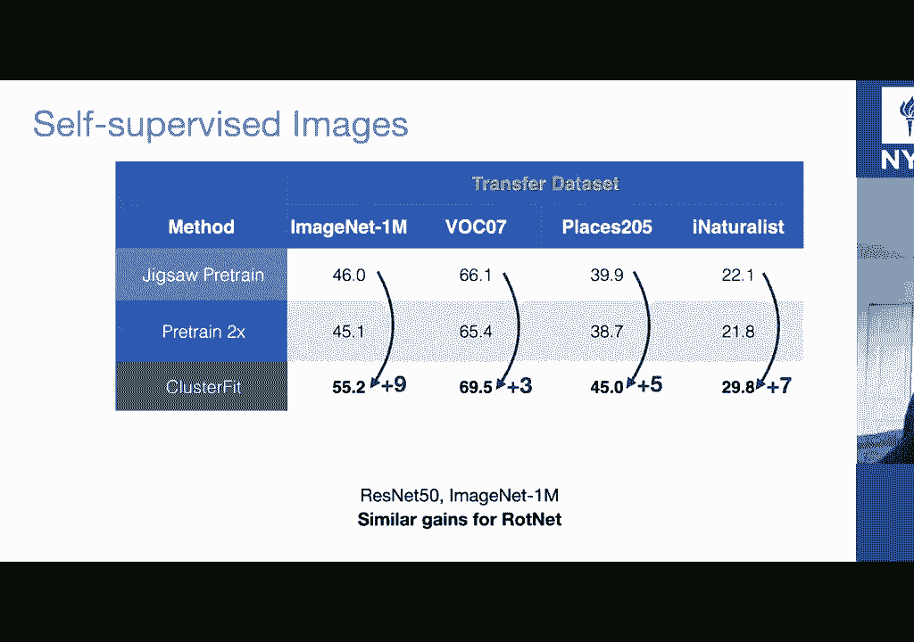

投票的动机，所以基本上我不会谈论得那么好，所以灵魂是，投票的动机，所以基本上我不会谈论得那么好，所以灵魂是，再次从假设中诞生，您需要保持不变。

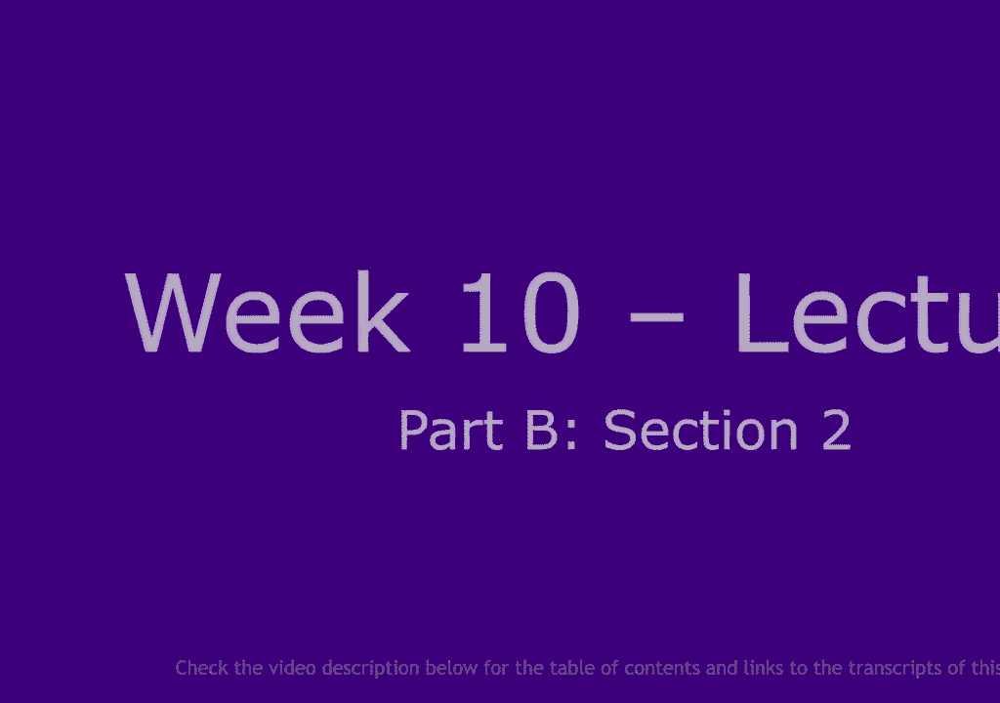

再次从假设中诞生，您需要保持不变，自由文本任务，因此在深入探讨民意调查之前，我会说，自由文本任务，因此在深入探讨民意调查之前，我会说，关于当归的一点对比，了解我有多少分钟，关于当归的一点对比。

了解我有多少分钟，大概15分钟就可以了，所以对比学习基本上是一种，大概15分钟就可以了，所以对比学习基本上是一种，试图学习可以组合的特征空间的通用框架，试图学习可以组合的特征空间的通用框架。

在一起或将相关的点放在一起并推开点，在一起或将相关的点放在一起并推开点，不相关，因此在这种情况下，可以想象像蓝色框，不相关，因此在这种情况下，可以想象像蓝色框，相关点绿色是相关的，紫色是相关的。

相关点绿色是相关的，紫色是相关的，点，您将为每个这些特征或与每个这些数据类似的特征提取特征，点，您将为每个这些特征或与每个这些数据类似的特征提取特征，通过共享网络指向，因此称为签署者网络。

通过共享网络指向，因此称为签署者网络，这些数据点中的每一个的一堆图像特征，然后应用，这些数据点中的每一个的一堆图像特征，然后应用，损失函数，它是一个对比损失函数，将尝试，损失函数，它是一个对比损失函数。

将尝试，就像最小化蓝点之间的距离，就像最小化蓝点之间的距离，说露点和绿点之间的距离，但距离，说露点和绿点之间的距离，但距离，基本上，蓝点之间的距离应小于，基本上，蓝点之间的距离应小于。

蓝点和绿点或视点和虚拟点，蓝点和绿点或视点和虚拟点，从相关样本中嵌入我应该比嵌入更接近，从相关样本中嵌入我应该比嵌入更接近，从起伏的样本中得出，这大概是，从起伏的样本中得出，这大概是，学习。

当然yon是最早提出建议的老师之一，学习，当然yon是最早提出建议的老师之一，这种方法以及我也教过的他的早期人们称为博士。林先生，这种方法以及我也教过的他的早期人们称为博士。林先生。

我认为对比学习现在已经使自我监督重新流行，我认为对比学习现在已经使自我监督重新流行，自我监督的最先进方法中的大部分是，自我监督的最先进方法中的大部分是，真正基于对比学习，主要问题是如何定义。

真正基于对比学习，主要问题是如何定义，什么是相关的和无关的，所以在监督学习的情况下，什么是相关的和无关的，所以在监督学习的情况下，相当清楚，所有的狗图像都是相关图像，所有的图像都是，相当清楚。

所有的狗图像都是相关图像，所有的图像都是，不是狗的图像本质上是无关的图像，但不是很清楚，不是狗的图像本质上是无关的图像，但不是很清楚，如何定义这种愉悦和无限，如何定义这种愉悦和无限，在这种情况下。

自我监督学习与，在这种情况下，自我监督学习与，诸如自由文本之类的问题是，对比出生的真正原因是，诸如自由文本之类的问题是，对比出生的真正原因是，一次或全部或大量数据，所以回到我上一张幻灯片。

一次或全部或大量数据，所以回到我上一张幻灯片，如果您看损失函数，它总是涉及多个图像，如果您看损失函数，它总是涉及多个图像，因此涉及前两个，因此涉及前两个，基本上第二行中的蓝色图像和绿色图像涉及。

基本上第二行中的蓝色图像和绿色图像涉及，蓝色图片和政治图片，而如果您看某项任务，例如说，蓝色图片和政治图片，而如果您看某项任务，例如说，拼图或诸如旋转之类的任务，您总是在思考单个。

拼图或诸如旋转之类的任务，您总是在思考单个，图像是独立的，因此与，图像是独立的，因此与，学习对比学习总是要支持多个数据点，学习对比学习总是要支持多个数据点，马上就来问您如何定义相关或不相关的问题。

马上就来问您如何定义相关或不相关的问题，图像，您实际上可以使用与我所说的类似的技术，图像，您实际上可以使用与我所说的类似的技术，较早之前，您可以使用视频的帧，以便可以使用顺序，较早之前。

您可以使用视频的帧，以便可以使用顺序，数据的本质，以便某种程度上了解视频中附近的帧，数据的本质，以便某种程度上了解视频中附近的帧，是相关的，范围是来自其他视频还是更远的视频，是相关的。

范围是来自其他视频还是更远的视频，与时间无关或无关紧要，并且已经形成了许多，与时间无关或无关紧要，并且已经形成了许多，有监督的学习方法，如果您知道这种流行的方法，有监督的学习方法。

如果您知道这种流行的方法，称为CPC，它是真正依赖于对比的预测编码，称为CPC，它是真正依赖于对比的预测编码，信号的顺序性质，它基本上说，信号的顺序性质，它基本上说，像时间空间一样被关闭。

并且样本进一步，像时间空间一样被关闭，并且样本进一步，在时间空间上彼此无关，这是相当大量的工作，在时间空间上彼此无关，这是相当大量的工作，基本上是利用它，它可以在语音领域，基本上是利用它。

它可以在语音领域，可以是视频形式，也可以是文本形式，也可以是特殊图像形式，可以是视频形式，也可以是文本形式，也可以是特殊图像形式，最近我们也一直在研究视频和音频，所以基本上可以这样说。

最近我们也一直在研究视频和音频，所以基本上可以这样说，是视频及其对应的音频是相关示例，例如视频和，是视频及其对应的音频是相关示例，例如视频和，来自其他图像视频的音频基本上都是被低估的样本，其中一些。

来自其他图像视频的音频基本上都是被低估的样本，其中一些，早期的工作，例如在受监督的所有事物中，也使用了，早期的工作，例如在受监督的所有事物中，也使用了，二次学习方法，并真正定义到后面的例子是相当。

二次学习方法，并真正定义到后面的例子是相当，有趣，因此您在视频上运行了一个跟踪器和一个对象跟踪器，有趣，因此您在视频上运行了一个跟踪器和一个对象跟踪器，有点像移动补丁一样，您说的是，有点像移动补丁一样。

您说的是，饼干跟踪的任何补丁都与我的原始补丁有关，饼干跟踪的任何补丁都与我的原始补丁有关，而来自其他视频的任何补丁都不基于相关补丁，因此，而来自其他视频的任何补丁都不基于相关补丁，因此。

这基本上为您提供了这些相关的和未选择的样本，因此，如果您，这基本上为您提供了这些相关的和未选择的样本，因此，如果您，看这种情况下的图，看看你在哪里有这样的距离符号，看这种情况下的图。

看看你在哪里有这样的距离符号，该网络试图学习的基本上是即将发布的补丁，该网络试图学习的基本上是即将发布的补丁，同一视频中的相关内容和来自以下语言的补丁，同一视频中的相关内容和来自以下语言的补丁。

不同的视频不相关，因此在某些诱饵中会自动了解，不同的视频不相关，因此在某些诱饵中会自动了解，物体的不同姿势，因此从不同的视角观察一个周期，物体的不同姿势，因此从不同的视角观察一个周期。

在狗的不同姿势上或喜欢它们的角度，它试图对它们进行分组，在狗的不同姿势上或喜欢它们的角度，它试图对它们进行分组，总之，如果您只谈论图像，那么很多工作要做，总之，如果您只谈论图像，那么很多工作要做。

观察附近的图像补丁与远距离的补丁，所以大多数，观察附近的图像补丁与远距离的补丁，所以大多数，CPC版本1和CPC版本2方法确实是一种利用，CPC版本1和CPC版本2方法确实是一种利用，图像的此属性。

所以您要做的是关闭图像补丁，图像的此属性，所以您要做的是关闭图像补丁，通过将它们称为正片和图像片，它们相距较远，通过将它们称为正片和图像片，它们相距较远，图像中较远的位置被视为底片，然后您基本上只是。

图像中较远的位置被视为底片，然后您基本上只是，如果使用这种正向定义和，如果使用这种正向定义和，消极的一种更流行或喜欢表演的方式是，消极的一种更流行或喜欢表演的方式是。

查看来自图像的补丁并将它们与来自图像的补丁进行对比，查看来自图像的补丁并将它们与来自图像的补丁进行对比，不同的图像，所以这种形式是许多流行方法的基础，不同的图像，所以这种形式是许多流行方法的基础。

就像实例歧视Moco Pearl Sims在这里，这个想法基本上是，就像实例歧视Moco Pearl Sims在这里，这个想法基本上是，如图所示，您可以更详细地了解这些方法的作用是，如图所示。

您可以更详细地了解这些方法的作用是，从图像中提取两个完全随机的补丁，以便可以将这些补丁，从图像中提取两个完全随机的补丁，以便可以将这些补丁，重叠，它们实际上可以变成彼此包含的两个，也可以，重叠。

它们实际上可以变成彼此包含的两个，也可以，完全分开，然后应用某种数据扩充，完全分开，然后应用某种数据扩充，因此，在这种情况下，请说是颜色颤动或去除了颜色等等，然后，因此，在这种情况下。

请说是颜色颤动或去除了颜色等等，然后，您将这两个补丁定义为肯定的，您将这两个补丁定义为肯定的，您从其他图像提取另一个补丁的示例，这又是一个，您从其他图像提取另一个补丁的示例，这又是一个，随机补丁。

基本上变成了负数，这些方法很多，随机补丁，基本上变成了负数，这些方法很多，会提取很多负面补丁，然后它们基本上会执行，会提取很多负面补丁，然后它们基本上会执行，对比学习，所以您与阳性样本有关。

但是您有一种，对比学习，所以您与阳性样本有关，但是您有一种，与此相反的阴性样本，与此相反的阴性样本，所以现在移到Pearl有点让我们尝试了解什么，所以现在移到Pearl有点让我们尝试了解什么。

这三个文本任务的主要区别在于，所有内容的对比是排序，这三个文本任务的主要区别在于，所有内容的对比是排序，与ptex任务非常不同，所以我已经提到的一件事是，与ptex任务非常不同。

所以我已经提到的一件事是，前置任务总是会一次推理一个限制，所以这个想法是，前置任务总是会一次推理一个限制，所以这个想法是，给定一个图像，您可以对该图像应用变换，因此在这种情况下，给定一个图像。

您可以对该图像应用变换，因此在这种情况下，进行拼图变换，然后基本上输入该变换后的图像，进行拼图变换，然后基本上输入该变换后的图像，进入联系人，然后您尝试预测所变换的属性，进入联系人。

然后您尝试预测所变换的属性，应用，因此您应用的排列或应用的旋转，应用，因此您应用的排列或应用的旋转，或您删除的颜色种类等等，因此借口总是问，或您删除的颜色种类等等，因此借口总是问，关于单个图像的原因。

第二件事是，该任务，关于单个图像的原因，第二件事是，该任务，您在这种情况下执行的操作实际上必须捕获，您在这种情况下执行的操作实际上必须捕获，转换，因此它确实需要捕获您应用的确切排列，转换。

因此它确实需要捕获您应用的确切排列，或您套用的旋转方式，表示最后一层，或您套用的旋转方式，表示最后一层，实际上，Co的表示形式会有所不同，或者，实际上，Co的表示形式会有所不同，或者，转换C的更改。

这是设计使然，因为您确实在尝试，转换C的更改，这是设计使然，因为您确实在尝试，解决该借口任务，但不幸的是，这意味着，解决该借口任务，但不幸的是，这意味着，最后一层表示捕获了信号的非常低级的属性，因此。

最后一层表示捕获了信号的非常低级的属性，因此，它们捕获像旋转之类的东西，而什么是，它们捕获像旋转之类的东西，而什么是，设计或期望这些表示形式是，设计或期望这些表示形式是，在Burien中。

您应该能够识别出猫的这些东西，在Burien中，您应该能够识别出猫的这些东西，猫是直立还是猫说你知道的倾向，猫是直立还是猫说你知道的倾向，倾向于90度，而当您解决特定问题时，倾向于90度。

而当您解决特定问题时，借口问你是在强加相反的意思，借口问你是在强加相反的意思，应该能够识别这张图片是直立的还是，应该能够识别这张图片是直立的还是，图片基本上是向侧面倾斜的，所以在很多情况下。

图片基本上是向侧面倾斜的，所以在很多情况下，我真的希望这些低层表示是协变的，我，我真的希望这些低层表示是协变的，我，想想它是否真的与您正在执行的任务有关，并且，想想它是否真的与您正在执行的任务有关。

并且，3d中很少有任务真的希望具有预测性，因此您需要，3d中很少有任务真的希望具有预测性，因此您需要，预测您要看到的相机会发生什么变化，同时查看同一视图的两个视图，预测您要看到的相机会发生什么变化。

同时查看同一视图的两个视图，对象等，但是除非您有很多这样的特定应用程序，对象等，但是除非您有很多这样的特定应用程序，您确实希望对转换不变的语义任务，您确实希望对转换不变的语义任务。

作为使用该输入的一种方法，因此不变性一直是功能的主力军，作为使用该输入的一种方法，因此不变性一直是功能的主力军，学习，使它成为一种颇受欢迎的手工功能，学习，使它成为一种颇受欢迎的手工功能，例如。

SIPP中的“ eye”实际上代表不变的和受监督的网络，例如，SIPP中的“ eye”实际上代表不变的和受监督的网络，监督方言网或监督员，然后对其进行训练，使其保持不变，监督方言网或监督员。

然后对其进行训练，使其保持不变，您想要它的马铃薯增幅这个网络可以对不同的农作物进行分类，您想要它的马铃薯增幅这个网络可以对不同的农作物进行分类，该图像的三个不同的旋转，而不是要求它预测什么。

该图像的三个不同的旋转，而不是要求它预测什么，正是转换适用于输入，所以这启发了，正是转换适用于输入，所以这启发了，因此箔代表了借口不变表示学习的思想，因此箔代表了借口不变表示学习的思想。

是您希望表示形式是不变的还是捕获得尽可能少，是您希望表示形式是不变的还是捕获得尽可能少，输入转换的尽可能多的信息，以便您拥有图像，输入转换的尽可能多的信息，以便您拥有图像。

前馈这两个图像的图像的转换版本，前馈这两个图像的图像的转换版本，通过短号，您可以获得代表，然后您基本上，通过短号，您可以获得代表，然后您基本上，鼓励这些表示相似，因此在符号I方面，鼓励这些表示相似。

因此在符号I方面，之前在谈论您基本上是在说我和任何借口，之前在谈论您基本上是在说我和任何借口，此图像的转换版本我是相关样本，其他任何图像都是，此图像的转换版本我是相关样本，其他任何图像都是。

未分级的样本，因此当您训练网络时，未分级的样本，因此当您训练网络时，希望它包含关于此的很少信息，希望它包含关于此的很少信息，如果学习，那么变换T和SU训练是相反的，如果学习。

那么变换T和SU训练是相反的，学习的部分是基本上您具有来自，学习的部分是基本上您具有来自，原始图像I和您具有来自转换的特征V IT，原始图像I和您具有来自转换的特征V IT，版本。

并且您希望这两种表示形式都相同，并且，版本，并且您希望这两种表示形式都相同，并且，我们研究了两种不同的最新技术，我们研究了两种不同的最新技术，完成x变换，所以这是我的拼图和旋转方法，完成x变换。

所以这是我的拼图和旋转方法，在这里谈论，我们也探索了这些的组合，在这里谈论，我们也探索了这些的组合，变换，因此同时应用太平洋旋转，以某种方式，变换，因此同时应用太平洋旋转，以某种方式，这就像多任务学习。

但他们并没有真正尝试预测，这就像多任务学习，但他们并没有真正尝试预测，两者都是不相交的旋转，因此您想使两者保持不变，两者都是不相交的旋转，因此您想使两者保持不变，使对比学习有效的关键因素是。

使对比学习有效的关键因素是，过去进行的成功尝试实际上是使用了很多负面因素，过去进行的成功尝试实际上是使用了很多负面因素，而介绍这种情况的一种很好的论文就是这种情况。

而介绍这种情况的一种很好的论文就是这种情况，2018年的歧视论文引入了这种存储库的概念，2018年的歧视论文引入了这种存储库的概念，这是有力量的，我会说大多数的最新方法是，这是有力量的。

我会说大多数的最新方法是，最先进的技术，包括更多的铜，它们都是我喜欢的那种页面，最先进的技术，包括更多的铜，它们都是我喜欢的那种页面，取决于这种空的部分的想法，我请您从，取决于这种空的部分的想法。

我请您从，计算机，因为它很吵，因为它是麦克风，计算机，因为它很吵，因为它是麦克风，从耳机开始，让我们变得非常，也许我不知道接下来还好吗，所以存储库有点不错，也许我不知道接下来还好吗，所以存储库有点不错。

在没有真正增加种类的负面影响的情况下，在没有真正增加种类的负面影响的情况下，计算需求，所以您要做的是将每个图像的特征向量存储在，计算需求，所以您要做的是将每个图像的特征向量存储在，内存。

然后在对比中使用该特征向量，内存，然后在对比中使用该特征向量，好吧，让我们先讨论一下如何完成整个珍珠设置，好吧，让我们先讨论一下如何完成整个珍珠设置，不使用存储库，所以您有图像我有图像，不使用存储库。

所以您有图像我有图像，前馈这两个图像，您可以从中获得VI的特征向量F，前馈这两个图像，您可以从中获得VI的特征向量F，原始图像，您从转换后的版本中获得VI T的特征G，原始图像。

您从转换后的版本中获得VI T的特征G，在这种情况下打补丁，您想要的是功能F和G相似，在这种情况下打补丁，您想要的是功能F和G相似，并且您希望从任何其他图像中获得特征，从而使无关图像基本上。

并且您希望从任何其他图像中获得特征，从而使无关图像基本上，变得更简单，在这种情况下，我们现在可以做的就是如果我们想要一个，变得更简单，在这种情况下，我们现在可以做的就是如果我们想要一个。

很多底片我们真的希望这些底片很多，很多底片我们真的希望这些底片很多，同时进行前馈，这实际上意味着您需要，同时进行前馈，这实际上意味着您需要，大型蝙蝠能够做到这一点，当然大型蝙蝠不是。

大型蝙蝠能够做到这一点，当然大型蝙蝠不是，说无限数量的GPU内存是不可能做到的，说无限数量的GPU内存是不可能做到的，做到这一点的方法是使用称为存储库的东西，做到这一点的方法是使用称为存储库的东西。

因此，该存储库的作用是为每个，因此，该存储库的作用是为每个，数据集中的图像以及在进行学习对比而不是进行对比时，数据集中的图像以及在进行学习对比而不是进行对比时，使用特征向量从不同的负像说出一种。

使用特征向量从不同的负像说出一种，您批次中的其他图片，您只需从，您批次中的其他图片，您只需从，内存，这样您就可以从，内存，这样您就可以从，内存，您可以用它替代它们以进行对比，因此在Perl中，内存。

您可以用它替代它们以进行对比，因此在Perl中，我们将物镜分为两个部分，就像对比船术语，我们将物镜分为两个部分，就像对比船术语，从变换后的图像中提取特征向量，因此VI的G与。

从变换后的图像中提取特征向量，因此VI的G与，我们在内存中的表示形式，所以我的M，同样，我们有一个，我们在内存中的表示形式，所以我的M，同样，我们有一个，试图使VI处的功能接近第二对比隔膜。

试图使VI处的功能接近第二对比隔膜，我们在内存中具有的特征表示，因此本质上是将G拉出，我们在内存中具有的特征表示，因此本质上是将G拉出，接近MI且F被拉至接近MI从而通过传递性。

接近MI且F被拉至接近MI从而通过传递性，F和G彼此靠近并分离的原因，F和G彼此靠近并分离的原因，这是稳定的训练，我们能够训练，这是稳定的训练，我们能够训练，如果不这样做，培训将不会真正收敛。

如果不这样做，培训将不会真正收敛，因此，将其分为两种形式，而不是像直接对比一样，因此，将其分为两种形式，而不是像直接对比一样，如果F和G之间什么都没有，我们就能稳定训练并得到，如果F和G之间什么都没有。

我们就能稳定训练并得到，它可以正常工作，因此评估此方法的方式基本上类似于标准，它可以正常工作，因此评估此方法的方式基本上类似于标准，培训前评估设置，以便将学习转移到可以进行培训的地方，培训前评估设置。

以便将学习转移到可以进行培训的地方，在没有标签的图像上，因此标准方法是采用网状网，在没有标签的图像上，因此标准方法是采用网状网，扔掉标签并假装不受监督，然后使用，扔掉标签并假装不受监督，然后使用。

合理的微调或用于训练线性分类器的第二件事，合理的微调或用于训练线性分类器的第二件事，也是一个测试pur，它对图像图像分布的鲁棒性，也是一个测试pur，它对图像图像分布的鲁棒性，通过在野外图像上训练它。

所以我们只拍摄了一张，通过在野外图像上训练它，所以我们只拍摄了一张，来自Flickr的随机数据，所以这就是为什么FCC数据集的原因，然后我们基本上，来自Flickr的随机数据。

所以这就是为什么FCC数据集的原因，然后我们基本上，对这些图像执行免费的转移学习插曲训练，然后，对这些图像执行免费的转移学习插曲训练，然后，在不同的数据集上进行转移学习，所以我对。

在不同的数据集上进行转移学习，所以我对，关于存储库的极点方法，其中m不会像特征那样，关于存储库的极点方法，其中m不会像特征那样，存储在存储库中的表示形式已经过时了，所以它们确实会。

存储在存储库中的表示形式已经过时了，所以它们确实会，有点过时了，但实际上它并不能使，有点过时了，但实际上它并不能使，差异，这样使用，差异，这样使用，I的M是表示F的移动平均值。

I的M是表示F的移动平均值，平均，尽管实际上它实际上并不重要，平均，尽管实际上它实际上并不重要，仍然可以继续使用它们，因此假设像II一样最近阅读了，仍然可以继续使用它们，因此假设像II一样最近阅读了。

更简单的纸张，您的纸张尺寸很大，例如8，000或类似的东西，更简单的纸张，您的纸张尺寸很大，例如8，000或类似的东西，存储库方法，并获得这8，000个示例和一个损失，存储库方法，并获得这8。

000个示例和一个损失，功能是可能的，就像确实需要辛西娅·B这样做，功能是可能的，就像确实需要辛西娅·B这样做，较大的胶垫尺寸，因为您会从，较大的胶垫尺寸，因为您会从，同一批次。

而如果您使用类似存储库之类的东西，您实际上不会，同一批次，而如果您使用类似存储库之类的东西，您实际上不会，需要大批量，所以您可以批量处理32张图像，需要大批量，所以您可以批量处理32张图像。

因为所有负面因素实际上都来自存储库，因为所有负面因素实际上都来自存储库，并不真正要求您执行多个关键转发，并不真正要求您执行多个关键转发，好的，非常感谢您使用记忆库，直到您无法向后传播到，好的。

非常感谢您使用记忆库，直到您无法向后传播到，否定的例子是不是不是所有的问题都不会产生，否定的例子是不是不是所有的问题都不会产生，真的有很多问题，所以那是我的一件事，真的有很多问题，所以那是我的一件事。

也担心，所以在最初的版本中，我们确实捆绑了一些，也担心，所以在最初的版本中，我们确实捆绑了一些，像使用较大的坏尺寸，但是当我们切换到类似，像使用较大的坏尺寸，但是当我们切换到类似，它并没有真正降低性能。

它并没有真正降低性能，在性能降低方面，是的，直觉为什么会这样，所以我认为，在性能降低方面，是的，直觉为什么会这样，所以我认为，总体上，对比学习的融合相当缓慢，因此，与所有市场一样，总体上。

对比学习的融合相当缓慢，因此，与所有市场一样，NCR索引moko的最新版本，等等，它们全部用于训练，NCR索引moko的最新版本，等等，它们全部用于训练，时期数甚至是坏道具的数目。

时期数甚至是坏道具的数目，您正在获取或您正在获取的参数对象的内存数量，您正在获取或您正在获取的参数对象的内存数量，一般而言，您做的很大，所以您错过了其中一个，一般而言，您做的很大，所以您错过了其中一个。

这种特殊的情况可能没有太大的影响，谢谢，这种特殊的情况可能没有太大的影响，谢谢，那几乎是五分钟，所以是的，我们基本上我会在。

那几乎是五分钟，所以是的，我们基本上我会在，一堆不同的任务，所以第一件事是再次进行对象检测，一堆不同的任务，所以第一件事是再次进行对象检测，视觉方面的标准任务，在这种情况下谁能胜过图像。

视觉方面的标准任务，在这种情况下谁能胜过图像，在VLC或7和7 plus上进行有关检测的净监督培训，在VLC或7和7 plus上进行有关检测的净监督培训，十二个数据集，并且在这种最严格的评估中表现优于。

十二个数据集，并且在这种最严格的评估中表现优于，这是80的标准，现在已经由可可引进了，这是80的标准，现在已经由可可引进了，有点积极的迹象，然后我们就可以做到这一点，有点积极的迹象。

然后我们就可以做到这一点，看着基本上是在半监督学习中评估珍珠，看着基本上是在半监督学习中评估珍珠，珍珠再次表现不错，实际上比说要好，珍珠再次表现不错，实际上比说要好，拼图的前置任务，因此最上面一行和。

拼图的前置任务，因此最上面一行和，最下面的事实是珍珠是一个不变的版本，而拼图是一个不变的版本。最下面的事实是珍珠是一个不变的版本，而拼图是一个不变的版本。协变形式和线性分类，协变形式和线性分类。

Pearl推出时，它基本上是CPC的最新版本，并且，Pearl推出时，它基本上是CPC的最新版本，并且，在一系列不同的参数（例如参数设置）和，在一系列不同的参数（例如参数设置）和，一堆不同的架构当然。

您现在可以拥有相当不错的，一堆不同的架构当然，您现在可以拥有相当不错的，此处通过synth之类的方法进行演奏，以便简单地响应，此处通过synth之类的方法进行演奏，以便简单地响应。

与Perl 63年的数字相比，基本上是69或70，与Perl 63年的数字相比，基本上是69或70，我们看的另一件事基本上是如何概括，我们看的另一件事基本上是如何概括，数据分布，为此。

我们仅查看了活检的Flickr图像，数据分布，为此，我们仅查看了活检的Flickr图像，查看数据集，以及谁能够对经过训练的性能好的方法进行排序，查看数据集，以及谁能够对经过训练的性能好的方法进行排序。

使用一百倍的数据，所以第二组中的拼图行就像，使用一百倍的数据，所以第二组中的拼图行就像，拼图哦，第二排被链接到1亿张图像上，拼图哦，第二排被链接到1亿张图像上，而Pearl则受到限制。

并拥有100万张图片，尽管，而Pearl则受到限制，并拥有100万张图片，尽管，实际上能够再次轻而易举地胜过拼图方法，实际上能够再次轻而易举地胜过拼图方法，向您展示的能力，就像将不变性分解为您的。

向您展示的能力，就像将不变性分解为您的，表示，而不是某种预言的借口，表示，而不是某种预言的借口，最后我开始的事情是，最后我开始的事情是，事情实际上是语义上的，所以如果您查看，事情实际上是语义上的。

所以如果您查看，如此方便的表示形式-rs。5拼图基本上显示出性能下降，如此方便的表示形式-rs。5拼图基本上显示出性能下降，从宁静到rs5，但对于珍珠，大家都看到了一种不错的增长，从宁静到rs5。

但对于珍珠，大家都看到了一种不错的增长，图，而for和rs5在，图，而for和rs5在，问题复杂性方面Pearl擅长处理这一问题，因为，问题复杂性方面Pearl擅长处理这一问题，因为。

您永远不会预测仅在以下位置使用排列的排列数量，您永远不会预测仅在以下位置使用排列的排列数量，输入就像某种数据增强一样，因此Pearl可以很好地扩展规模，输入就像某种数据增强一样。

因此Pearl可以很好地扩展规模，九个补丁中所有360，000个可能的排列，但对于拼图，九个补丁中所有360，000个可能的排列，但对于拼图，因为您预测自己会受到输出大小的限制。

因为您预测自己会受到输出大小的限制，空间，论文还表明，我们不仅可以将珍珠延伸到，空间，论文还表明，我们不仅可以将珍珠延伸到，不限拼图，如果您可以在内部旋转，就可以旋转，不限拼图，如果您可以在内部旋转。

就可以旋转，拼图和旋转的组合，您可以获得越来越多的收益，但是您，拼图和旋转的组合，您可以获得越来越多的收益，但是您，如果您看看这些方法，基本上就可以开始这样做，如果您看看这些方法。

基本上就可以开始这样做，从借口开始，当您从左边移到，从借口开始，当您从左边移到，对，你基本上会得到越来越多的不变式，对，你基本上会得到越来越多的不变式，性能的提高表明，在，性能的提高表明，在。

从长远来看，您的各种方法实际上会更有帮助，从长远来看，您的各种方法实际上会更有帮助，有一些缺点，基本上是我们真的没有，有一些缺点，基本上是我们真的没有，了解什么是重要的数据转换集，以便拼图工作。

了解什么是重要的数据转换集，以便拼图工作，真的很好，但不清楚为什么会这样，所以某种未来，真的很好，但不清楚为什么会这样，所以某种未来，工作，或者如果您想花费闲暇时间思考某件事是，工作。

或者如果您想花费闲暇时间思考某件事是，真正了解什么失衡在您试图，真正了解什么失衡在您试图，解决有监督的任务对于像图像这样的东西真正重要的是什么，解决有监督的任务对于像图像这样的东西真正重要的是什么。

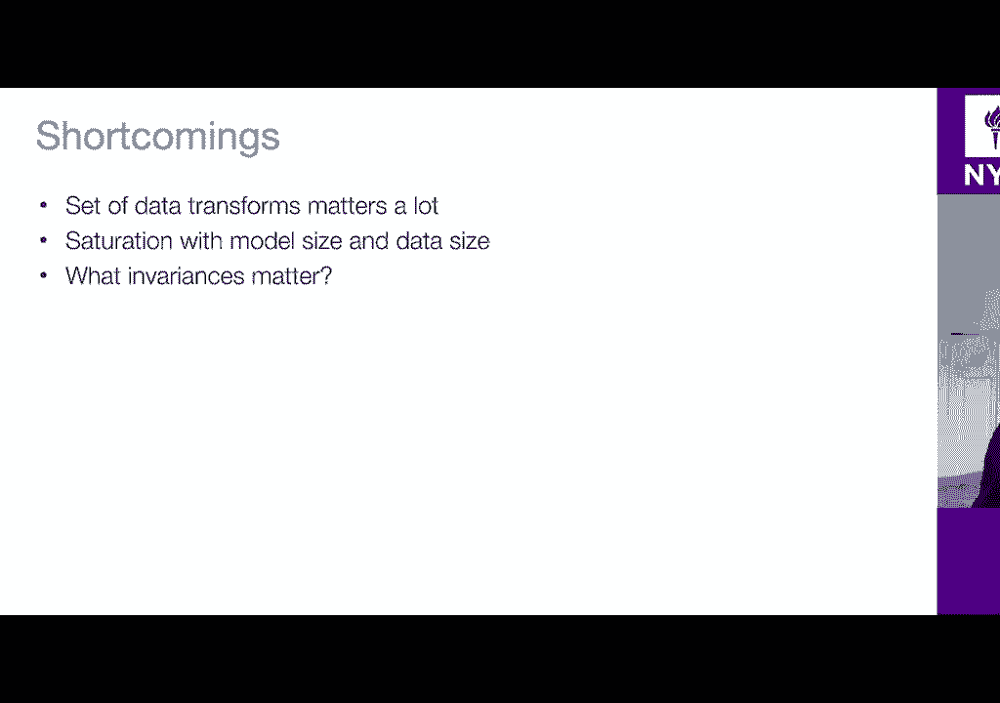

网络，就这样，基本上可以预测到更多，网络，就这样，基本上可以预测到更多，信息，并尽量保持不变，谢谢，所以我有一个，信息，并尽量保持不变，谢谢，所以我有一个，问题是，这些对比网络不能使用批处理规范层。

问题是，这些对比网络不能使用批处理规范层，对，因为这样信息就会从一个样本传递到另一个样本，对，因为这样信息就会从一个样本传递到另一个样本，那么网络可能会学到非常简单的方法。

那么网络可能会学到非常简单的方法，将负数与正数分离的方法，例如Pearl那样，将负数与正数分离的方法，例如Pearl那样，例如，我们实际上根本没有观察到这种现象，因此我们并没有真正，例如。

我们实际上根本没有观察到这种现象，因此我们并没有真正，必须与巴赫纳（Bachner）做一些特殊的技巧，我们可以使用批号，必须与巴赫纳（Bachner）做一些特殊的技巧，我们可以使用批号，质量很好。

如果网络不存在，没有必要进行所有对比，质量很好，如果网络不存在，没有必要进行所有对比，使用批处理规范就可以了，这里是十个，使用批处理规范就可以了，这里是十个，例如对于辛西娅（Cynthia）的意思是。

等等，他们试图推动水槽批次规范，例如对于辛西娅（Cynthia）的意思是，等等，他们试图推动水槽批次规范，因为如果要模拟大批量，则可能需要进行一些调整，因为如果要模拟大批量，则可能需要进行一些调整。

批处理规范，但基本上，如果您无法明确避免，则是因为，批处理规范，但基本上，如果您无法明确避免，则是因为，完全删除批处理规范，然后像深度网络一样训练它们，完全删除批处理规范，然后像深度网络一样训练它们。

无论如何，通常来说都很困难，好吧，您认为Paul paper与，无论如何，通常来说都很困难，好吧，您认为Paul paper与，巴山是无所畏惧的，因为它使用了一个存储库，并且所有的表示都没有。

巴山是无所畏惧的，因为它使用了一个存储库，并且所有的表示都没有，同时服用，而我认为他们特别提到过，同时服用，而我认为他们特别提到过，使用批处理规范层或将其分布在多个GPU上，以便。

使用批处理规范层或将其分布在多个GPU上，以便，我认为肯定是一个区别，因为基本上是消极的一面，我认为肯定是一个区别，因为基本上是消极的一面，您在不同的时间步骤中与之形成对比。

您在不同的时间步骤中与之形成对比，使批量作弊变得更加困难，但是对于其他方法，使批量作弊变得更加困难，但是对于其他方法，像莫科（Moco）和同样的恐惧，他们与特定批次的产品非常相关。

像莫科（Moco）和同样的恐惧，他们与特定批次的产品非常相关，您现在正在评估，好的，如果我们使用的是，您现在正在评估，好的，如果我们使用的是，对丢失，而不是存储对，有什么建议吗，对丢失，而不是存储对。

有什么建议吗，这个我们是否应该坚持不使用Alex Ned和我Gigi的方式，这个我们是否应该坚持不使用Alex Ned和我Gigi的方式，批处理规范层或是否有任何方法可以将其关闭，等等，您该怎么办？

批处理规范层或是否有任何方法可以将其关闭，等等，您该怎么办？稍微描述一下设置，基本上我想做的是，稍微描述一下设置，基本上我想做的是，在视频帧上训练，我在尝试使用配对设置，在视频帧上训练。

我在尝试使用配对设置，对比n个样本而不是两个或三个样本好吗？对比n个样本而不是两个或三个样本好吗？我担心的是我是否应该使用批处理规范？我担心的是我是否应该使用批处理规范？预先使用批处理规范。

预先使用批处理规范，抱歉，我可以使用预先架构的模型，让我们Ricky，所以视频帧的一个问题基本上就是，让我们Ricky，所以视频帧的一个问题基本上就是，相关，所以一般情况下。

bache规范对B的表现不佳，相关，所以一般情况下，bache规范对B的表现不佳，成绩，并且您具有相当相关的样本，因此视频变得越来越多，成绩，并且您具有相当相关的样本，因此视频变得越来越多。

更多的问题是不幸的，就像悲伤的，更多的问题是不幸的，就像悲伤的，基本上，即使您查看Alex的典型实现，基本上，即使您查看Alex的典型实现，九十年代它现在将包括批处理，只是因为它更加稳定。

九十年代它现在将包括批处理，只是因为它更加稳定，进行培训，您可以以更高的学习率进行培训，并且可以做很多事情，进行培训，您可以以更高的学习率进行培训，并且可以做很多事情。

基本上将其用于一系列不同的下游任务，所以我认为，基本上将其用于一系列不同的下游任务，所以我认为，您可能仍需要使用批处理，不是，您可以提供其他变体，例如，您可能仍需要使用批处理，不是，您可以提供其他变体。

例如，基本上不真正取决于批处理大小的组规范尝试，基本上不真正取决于批处理大小的组规范尝试，感激，谢谢，好，非常感谢。感激，谢谢，好，非常感谢。有很多有趣的细节，我想我们还有八分钟，有很多有趣的细节。

我想我们还有八分钟，如果人们是我，我想他们就像仍然有很多人在课堂上，还有任何问题，是的，我，如果人们是我，我想他们就像仍然有很多人在课堂上，还有任何问题，是的，我，这是我在演讲时也曾在演讲中提出的问题。

这是我在演讲时也曾在演讲中提出的问题，讨论Perl，所以这个问题是关于我可以回答的最低功能的问题，讨论Perl，所以这个问题是关于我可以回答的最低功能的问题，现在好了，所以当我阅读论文时，有一个概率项。

现在好了，所以当我阅读论文时，有一个概率项，在计算VI和图像的vit表示后进行计算，在计算VI和图像的vit表示后进行计算，转换后的版本，获得这些概率后，我们，转换后的版本，获得这些概率后，我们。

使用噪声对比估计损失，所以我有点困惑，想要，使用噪声对比估计损失，所以我有点困惑，想要，最好是该概率的负对数是，最好是该概率的负对数是，最小化，因此您可以同时使用两者，因此使用和C的原因基本上是。

最小化，因此您可以同时使用两者，因此使用和C的原因基本上是，还有更多与如何设置存储库纸有关的，如果，还有更多与如何设置存储库纸有关的，如果，你有K个负数，你基本上是在解决k加1的问题，所以一个。

你有K个负数，你基本上是在解决k加1的问题，所以一个，问题基于，您基本上有K加1个不同的二元问题，问题基于，您基本上有K加1个不同的二元问题，你，那是另一种方式，你，那是另一种方式，基本上。

这就是现在所说的信息NC，实际上是，基本上，这就是现在所说的信息NC，实际上是，softmax，所以您只是供应商softmax，并且可以使负斜率最小化，softmax，所以您只是供应商softmax。

并且可以使负斜率最小化，这是因为概率函数看起来，这是因为概率函数看起来，像软银，是的，当时我把它绑起来，实际上给了，像软银，是的，当时我把它绑起来，实际上给了，我的成绩略差。

所以这基本上就是您可以看到的原因，这是，我的成绩略差，所以这基本上就是您可以看到的原因，这是，现在只是初步实验，当我尝试时，实际上可以节省，现在只是初步实验，当我尝试时，实际上可以节省，结果。

所以我想最后并没有太大的不同，结果，所以我想最后并没有太大的不同，是的，这与课程更相关，但是我们要出售一个项目，是的，这与课程更相关，但是我们要出售一个项目。

汤是隆尼·斯特恩（Lonnie stern）警告，您能告诉我们如何获得它的信息吗？汤是隆尼·斯特恩（Lonnie stern）警告，您能告诉我们如何获得它的信息吗？我们出售汤明智的Lonnie模型行走。

如实施细节所示，我们出售汤明智的Lonnie模型行走，如实施细节所示，约翰越简单，总体上的高级想法就多，因此请设法理解它，约翰越简单，总体上的高级想法就多，因此请设法理解它，工作很快。

所以我想我的意思是说有些特定的技术，工作很快，所以我想我的意思是说有些特定的技术，从一开始就可以轻松进行工作，例如，从一开始就可以轻松进行工作，例如，您只看了三个文本任务，然后基本上。

您只看了三个文本任务，然后基本上，像轮换之类的东西，因为好吧，实现您的任务非常简单，像轮换之类的东西，因为好吧，实现您的任务非常简单，确实不能出错，但是我的意思是我只有很少的东西，确实不能出错。

但是我的意思是我只有很少的东西，意思是说，仅移动件的数量就可以很好地指示另一件事，意思是说，仅移动件的数量就可以很好地指示另一件事，请记住，基本上是您是否正在实现现有方法，请记住。

基本上是您是否正在实现现有方法，然后作者将谈论很多细微的细节，然后作者将谈论很多细微的细节，例如他们使用的确切学习率或使用bash规范的方式，例如他们使用的确切学习率或使用bash规范的方式，等等。

如果这些东西很多，等等，如果这些东西很多，基本上，您将越来越难以重现更多，基本上，您将越来越难以重现更多，还有更多让您出错的事情要记住的第二件事是数据，还有更多让您出错的事情要记住的第二件事是数据。

增强率真的很关键，因此，如果您得到任何帮助，增强率真的很关键，因此，如果您得到任何帮助，工作，您将尝试在其上添加成型的增强件，工作，您将尝试在其上添加成型的增强件，我认为，您是否建议我们尝试哦主啊。

您不会太难。

我认为，您是否建议我们尝试哦主啊，您不会太难，在一个月内完成我不确定该设置的确是一个缺口，谢谢，在一个月内完成我不确定该设置的确是一个缺口，谢谢。

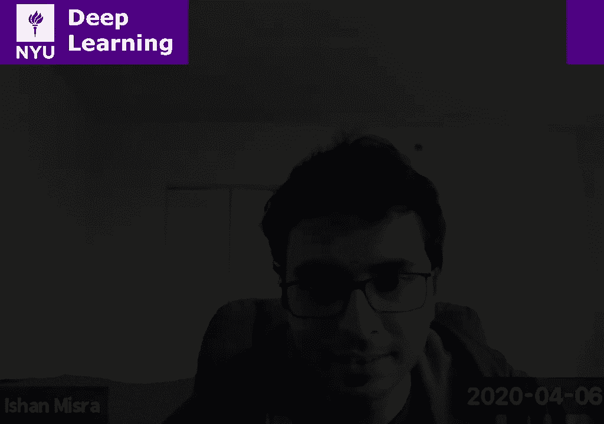

当又是一丁点时，您是否尝试在煤上使用动量对比，当又是一丁点时，您是否尝试在煤上使用动量对比，发生在我的MD Bank上，所以我们基本上从端到端，发生在我的MD Bank上，所以我们基本上从端到端。

版本类似于辛西娅，所以我的意思是你，版本类似于辛西娅，所以我的意思是你，可以看到我在不同的GPO上收集了很多错误的答案，所以在，可以看到我在不同的GPO上收集了很多错误的答案，所以在。

如果您的护垫尺寸实际上通常会有所帮助，我会怀疑，如果您的护垫尺寸实际上通常会有所帮助，我会怀疑，我认为没有秘密，但在，我认为没有秘密，但在，通过用Moco代替端到端培训来实现Sinclair。

但我认为这一数字。

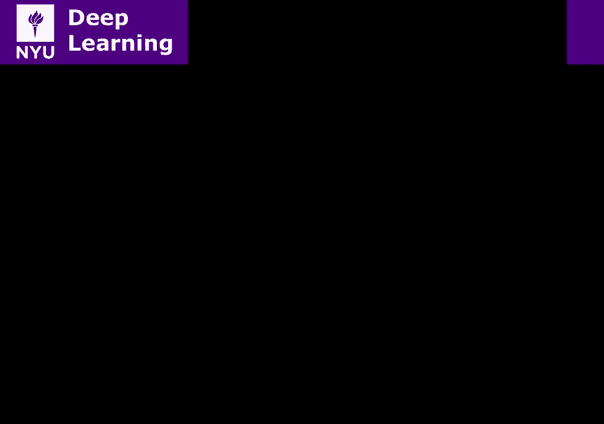

通过用Moco代替端到端培训来实现Sinclair，但我认为这一数字。

仍然相当相似，评估协议之间也存在细微差异，仍然相当相似，评估协议之间也存在细微差异，您会在这些论文中看到类似的内容，是的，我想我们正在学习，您会在这些论文中看到类似的内容，是的，我想我们正在学习。

为了发布更标准化的评估基准，我们最后做了，为了发布更标准化的评估基准，我们最后做了，不幸的是，那一年是在咖啡厅里-所以我们正在尝试疯狂的东西，不幸的是，那一年是在咖啡厅里-所以我们正在尝试疯狂的东西。

在五个点中，我们现在提供了许多标准化的实现，例如，在五个点中，我们现在提供了许多标准化的实现，例如，此外，我发现了很多这些和标准化的评估协议，此外，我发现了很多这些和标准化的评估协议。

我有一个关于上述单元监督学习的问题，那么您如何看待，我有一个关于上述单元监督学习的问题，那么您如何看待，是类似生成方法的状态，您是否考虑过将类似，是类似生成方法的状态，您是否考虑过将类似。

与生成方法（例如更简单）的对比方法实际上具有，与生成方法（例如更简单）的对比方法实际上具有，不同的空间，因此它们在要素顶部像线性层一样，不同的空间，因此它们在要素顶部像线性层一样。

他们计算实际到达率的表示形式，他们计算实际到达率的表示形式，他们做对比度损失了NCE的东西，所以你觉得就像有另一个，他们做对比度损失了NCE的东西，所以你觉得就像有另一个，像这样的头。

基本上像是裁剪的图像，只是尝试向外扩展，像这样的头，基本上像是裁剪的图像，只是尝试向外扩展，该图像的裁剪，您拥有该信息，因为您裁剪该图像，该图像的裁剪，您拥有该信息，因为您裁剪该图像。

正确并再次使用它们或类似的东西，所以我的意思是我绝对是一个好主意，正确并再次使用它们或类似的东西，所以我的意思是我绝对是一个好主意，认为这是棘手的部分正在得到这些东西。

认为这是棘手的部分正在得到这些东西，只是不平凡的，所以最初像我一样，我还没有真正尝试过任何亲戚，只是不平凡的，所以最初像我一样，我还没有真正尝试过任何亲戚，根据我的经验，当您更难，根据我的经验。

当您更难，开始工作，但我同意我认为，开始工作，但我同意我认为，从长远来看，他们就像是需要关注的事情，从长远来看，他们就像是需要关注的事情，谢谢你喘着粗气的问题，不是，我想哦，我可以问这个问题。

谢谢你喘着粗气的问题，不是，我想哦，我可以问这个问题，是的，所以这实际上是关于蒸馏的，所以你，是的，所以这实际上是关于蒸馏的，所以你，告诉我如何预测软件分布可以提供更丰富的信息。

告诉我如何预测软件分布可以提供更丰富的信息，定位正确，因此您可以详细说明一下，因为它会增加，定位正确，因此您可以详细说明一下，因为它会增加，我们根据一种热分布预测的模型权的不确定性。

我们根据一种热分布预测的模型权的不确定性，然后将其制作成软件，然后我们就可以预测更多的不确定性，然后将其制作成软件，然后我们就可以预测更多的不确定性，更像是为什么他们称其为蒸馏，因为我看到了。

更像是为什么他们称其为蒸馏，因为我看到了，您需要更多参数来说明这个更丰富的目标，因此。

您需要更多参数来说明这个更丰富的目标，因此。

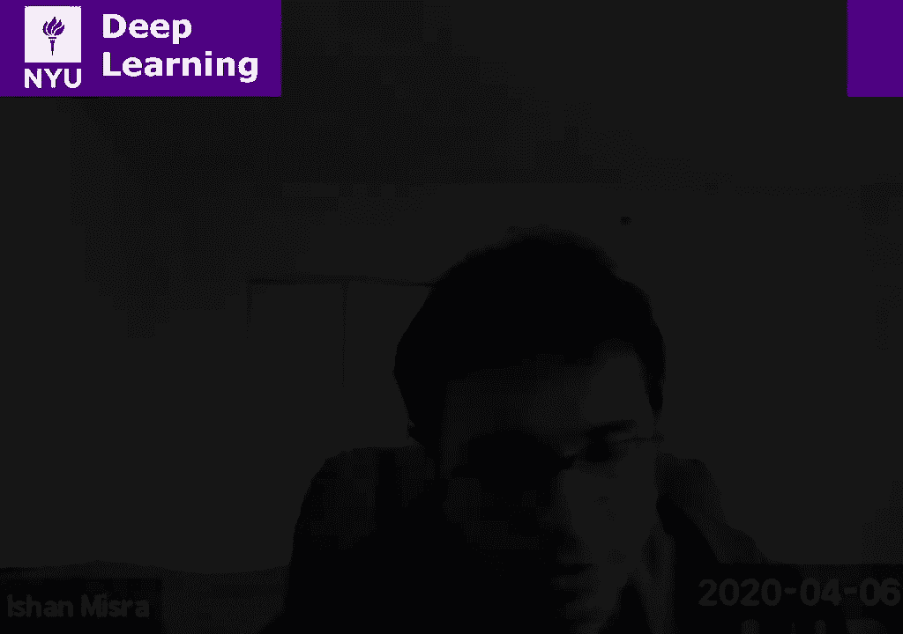

一件事基本上是，如果您在一个热门标签上进行训练，那么您的模型往往是，一件事基本上是，如果您在一个热门标签上进行训练，那么您的模型往往是，通常非常自信，所以如果您听说过这些技巧，例如，通常非常自信。

所以如果您听说过这些技巧，例如，标签平滑现在被一堆方法标签所使用，标签平滑现在被一堆方法标签所使用，平滑处理就像您可以将其视为最简单的版本，平滑处理就像您可以将其视为最简单的版本，蒸馏。

所以你有一个热载体，蒸馏，所以你有一个热载体，在试图预测，而不是在试图预测，而台湾没有，在试图预测，而不是在试图预测，而台湾没有，向量你要做的是从那拿走一些概率质量，所以你。

向量你要做的是从那拿走一些概率质量，所以你，会预测一个和一堆0，而不是像您预言的那样，会预测一个和一堆0，而不是像您预言的那样，0。97，然后您将一点一点一二一加，0。97，然后您将一点一点一二一加。

她只是三个蒸气开始向其余部分均匀分布，她只是三个蒸气开始向其余部分均匀分布，蒸馏是这样做的一种更明智的方式，而不是像，蒸馏是这样做的一种更明智的方式，而不是像，随机增加随机波动类的概率。

随机增加随机波动类的概率，实际拥有一个经过预先培训的网络，这对，实际拥有一个经过预先培训的网络，这对，通用软件发行版对于免费培训方法非常有用，因为，通用软件发行版对于免费培训方法非常有用，因为。

模型在类似软件上往往过于自信，模型在类似软件上往往过于自信，分布实际上比您收敛的优化问题要容易一些，分布实际上比您收敛的优化问题要容易一些，速度也要快一些，因此解决方案中同时具有这两个优点。

速度也要快一些，因此解决方案中同时具有这两个优点，也因为像光滑的标签，让您拥有像狗一样的猫，也因为像光滑的标签，让您拥有像狗一样的猫，还是猫狗的权利，所以如果您有一个很大的网络，还是猫狗的权利。

所以如果您有一个很大的网络，经过训练的样本很多，实际上，经过训练的样本很多，实际上，你不知道你所知道的是什么吗？你不知道你所知道的是什么吗？是的，因此，如果您实际上可以学习到这个简单的主意，您将成为。

是的，因此，如果您实际上可以学习到这个简单的主意，您将成为，了解更多，而不仅仅是给自己一个热点标签，我认为我们，了解更多，而不仅仅是给自己一个热点标签，我认为我们，时间我想我们大约半个小时前就到了。

但这是，时间我想我们大约半个小时前就到了，但这是，问答环节，问答环节，如果没有，您知道真的很紧急的问题仍在等待中，如果没有，您知道真的很紧急的问题仍在等待中，称它为今天课程的结束，所以谢谢您的调整。

称它为今天课程的结束，所以谢谢您的调整，您明天在实际的会议上别忘了来，您明天在实际的会议上别忘了来，就是这样，非常感谢亚洲人，我在执行过程中见到你，就是这样，非常感谢亚洲人，我在执行过程中见到你。

谢谢大家照顾大家再见，谢谢大家照顾大家再见，您。

