# 【NYU】纽约大学深度学习入门课程（with pytorch）中英文字幕 - P28：Week 15 – Practicum part A - Inference for latent variable energy based model - 大佬的迷弟的粉丝 - BV1o5411p7AB

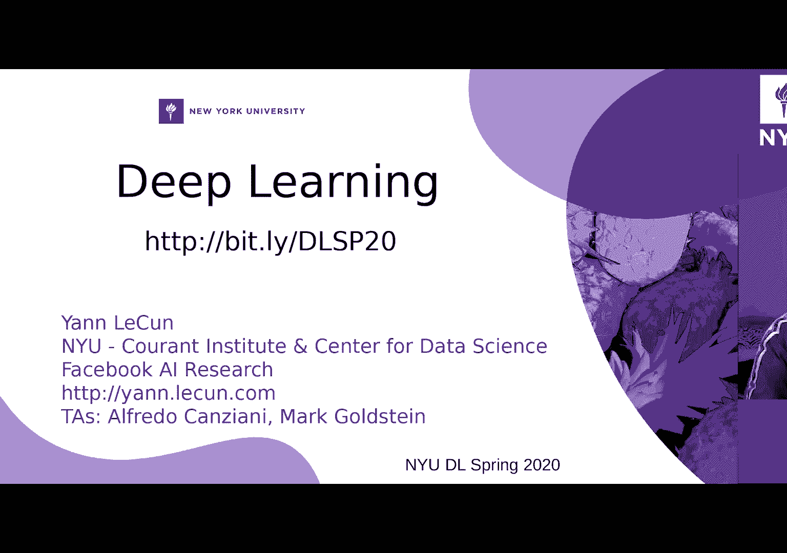

all right all right all right，all right all right all right，all right all right all right。

so today we're gonna be talking again，so today we're gonna be talking again。

about foundations of deep learning，about foundations of deep learning。

that's me alfredo and you can find me on，that's me alfredo and you can find me on，twitter，twitter。

on the handle alfcnz actually if you，on the handle alfcnz actually if you。

check twitter you can find some，check twitter you can find some。

you could find some news about today's，you could find some news about today's，lesson，lesson。

since i posted online like yesterday，since i posted online like yesterday，night，night。

so the deal is always the same as soon，so the deal is always the same as soon。

as you don't understand as，as you don't understand as，soon as i don't make sense since i。

soon as i don't make sense since i，didn't sleep and i've been working on。

didn't sleep and i've been working on，this stuff for the last 30 hours。

this stuff for the last 30 hours，it's very likely i'm not gonna be making。

it's very likely i'm not gonna be making，much sense at some times，much sense at some times。

so every time something is not clear，so every time something is not clear，just stop me，just stop me。

ask me anything because again if we keep，ask me anything because again if we keep，going，going。

and you're not following then we are not，and you're not following then we are not。

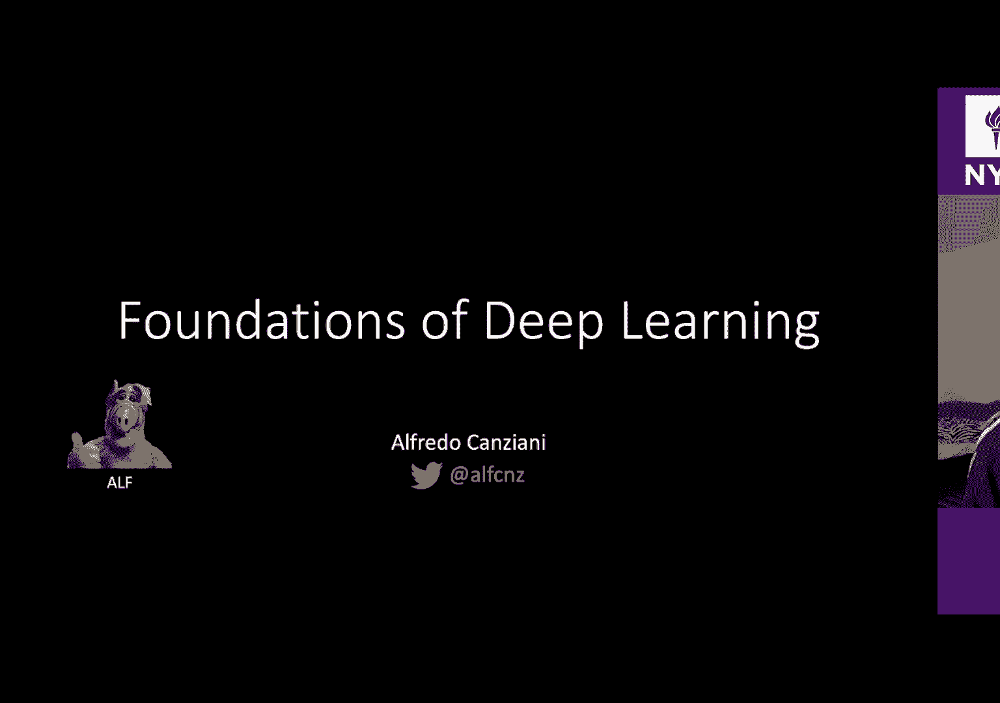

all right so today we're going to be，all right so today we're going to be。

all right so today we're going to be，talking about inference，talking about inference。

for latent variable energy-based models，for latent variable energy-based models，ebns，ebns。

for example the ellipse likewise，for example the ellipse likewise，we have cover only inference only。

we have cover only inference only，inference in our first lab，inference in our first lab。

today we're gonna be only covering，today we're gonna be only covering。

inference for energy based models，inference for energy based models。

i will not say the word training ever，i will not say the word training ever，again，again。

okay i'll try at least so today we're，okay i'll try at least so today we're，gonna be talking about。

gonna be talking about，inference what is this stuff and where，inference what is this stuff and where。

do we start，do we start，we're going to be starting from our，we're going to be starting from our。

training examples，training examples，training training samples i said i。

training training samples i said i，wasn't going to say this word，wasn't going to say this word。

all right so let's see what kind of data，all right so let's see what kind of data。

we're going to be working on and why we，we're going to be working on and why we。

need these energy based models，need these energy based models，so we can think about our data why。

so we can think about our data why，bold y is uh it's been living，bold y is uh it's been living。

having two components y one y two，having two components y one y two。

y one is gonna be this row one function，y one is gonna be this row one function，of x，of x。

which is going to be my input multiplied，which is going to be my input multiplied。

by the cosine of theta，by the cosine of theta，which is some you know angle we don't。

which is some you know angle we don't，know，know，plus some epsilon noise and then row 2。

plus some epsilon noise and then row 2，is going to be again a function of my。

is going to be again a function of my，input x and then it's multiplied by a。

input x and then it's multiplied by a，sine，sine，of this theta we have no axis plus some。

of this theta we have no axis plus some，uh noise epsilon，uh noise epsilon。

rho is a function that maps the input，rho is a function that maps the input。

one dimensional r into a r2 and so it's，one dimensional r into a r2 and so it's，mapping my。

mapping my，x into something that is this alpha x，x into something that is this alpha x，plus beta。

plus beta，1 minus x for the first component and，1 minus x for the first component and。

the other is beta，the other is beta，times x plus alpha multiply 1 minus x。

times x plus alpha multiply 1 minus x，and and then everything is multiplied by。

and and then everything is multiplied by，this exponential，this exponential，of x so alpha and beta。

of x so alpha and beta，are simply 1，5 and 2 so this is simply，are simply 1，5 and 2 so this is simply。

the，the，equation for a ellipse but then if x，equation for a ellipse but then if x。

goes from zero to one as i show you here，goes from zero to one as i show you here。

you're gonna have that this is gonna be，you're gonna have that this is gonna be，drawing，drawing。

some sort of horn that is exponentially，some sort of horn that is exponentially，no in the profile。

no in the profile，and then it starts as like something，and then it starts as like something。

like this and then eventually，like this and then eventually，like horizontal ellipse and eventually。

like horizontal ellipse and eventually，end up as a vertical ellipse，end up as a vertical ellipse。

okay x here is going to be sample from，okay x here is going to be sample from。

the uniform distribution，the uniform distribution，similarly theta is also sampled from the。

similarly theta is also sampled from the，uniform distribution from 0 to 2 pi。

uniform distribution from 0 to 2 pi，epsilon instead is sampled from a normal。

epsilon instead is sampled from a normal，distribution，distribution，with mean 0 and then a standard。

with mean 0 and then a standard，deviation of 1 over 20。deviation of 1 over 20。

so again as you might have seen from，so again as you might have seen from，twitter，twitter。

this stuff looks pretty cool and it，this stuff looks pretty cool and it，looks like，looks like。

that but then since we have magic on，that but then since we have magic on，this side we can do this。

this side we can do this，and so you can see here how we're gonna。

and so you can see here how we're gonna，be having this exponential，be having this exponential。

uh side right this exponential envelope，uh side right this exponential envelope。

we start with the uh ellipse that is，we start with the uh ellipse that is。

like vertical and then we end up with，like vertical and then we end up with，this horizontal one。

this horizontal one，okay um，okay um，what we want to pay attention here。

what we want to pay attention here，is that at a given specific location。

is that at a given specific location，x there is no，x there is no。

one y only right so we cannot really，one y only right so we cannot really。

train a neural net that is like a，train a neural net that is like a。

vector to vector mapping because there，vector to vector mapping because there，is no vector to map。

is no vector to map，well there is a bunch of vectors right，well there is a bunch of vectors right。

so given one，so given one，single input x there are many many many。

single input x there are many many many，possible，possible，y's there is like a whole uh ellipse。

y's there is like a whole uh ellipse，right，right，uh per given x so we can't really use。

uh per given x so we can't really use，normal uh feed forward neural net to do。

normal uh feed forward neural net to do，this，this，uh similarly if we are just talking。

uh similarly if we are just talking，about y's，about y's，given one value of y one i cannot even。

given one value of y one i cannot even，tell，tell，what is the other corresponding y two。

what is the other corresponding y two，because there are，because there are。

always two almost always two values for，always two almost always two values for。

y two given one y one right，y two given one y one right，and so using vectors to vectors mapping。

and so using vectors to vectors mapping，as we've been learning so far is not。

as we've been learning so far is not，quite，quite，uh sufficient so today we're going to be。

uh sufficient so today we're going to be，figuring out how to use these latent。

figuring out how to use these latent，variable energy-based models to deal。

variable energy-based models to deal，with this kind of，with this kind of。

so to make things simple and make my，so to make things simple and make my。

so to make things simple and make my，life easier，life easier，we're gonna do a few simplifications uh。

we're gonna do a few simplifications uh，the first one i'm gonna be removing the。

the first one i'm gonna be removing the，input so there will be no input data。

input so there will be no input data，my model will not have input data。

my model will not have input data，and this is like what anyhow i i fix my。

and this is like what anyhow i i fix my，x to zero so by fixing the x to zero i'm。

x to zero so by fixing the x to zero i'm，gonna have that my exponential becomes。

gonna have that my exponential becomes，simply 1。simply 1。and then basically we turn out having。

and then basically we turn out having，row 1，row 1，that becomes 2 right so alpha。

that becomes 2 right so alpha，gets deleted by 0 and then you just have。

gets deleted by 0 and then you just have，the beta multiplied by，the beta multiplied by。

a 1 and then row two automatically is，a 1 and then row two automatically is，gonna get，gonna get。

the amplitude of 1，5 right and so，the amplitude of 1，5 right and so。

my data points y are going to be simply，my data points y are going to be simply。

points coming from this twice the cosine，points coming from this twice the cosine，of this uniform。

of this uniform，simply uniformly sample theta and then，simply uniformly sample theta and then，1，5，1。

5，sine this uniform theta，sine this uniform theta，the collection of all my y's。

the collection of all my y's，will give me capital y so capital y is。

will give me capital y so capital y is，going to be the collection of all my。

going to be the collection of all my，sample and here i decided to just use。

sample and here i decided to just use，24 samples so i have 24，24 samples so i have 24。

different samples from the uniform，different samples from the uniform，distribution，distribution。

okay and per each of these samples there，okay and per each of these samples there，will be，will be。

one epsilon for the first component and，one epsilon for the first component and。

one epsilon for the second component，one epsilon for the second component。

all right so what we try to do today，all right so what we try to do today。

is going to be to learn well to learn，is going to be to learn well to learn，wrong，wrong。

we are not learning anything we um we，we are not learning anything we um we。

imagine that someone gave us，imagine that someone gave us，a already trained already learned。

a already trained already learned，network，network，we're going to be learning how to。

we're going to be learning how to，perform inference how we can use a model。

perform inference how we can use a model，to figure out if one point it belongs or。

to figure out if one point it belongs or，doesn't belong to what was the training。

doesn't belong to what was the training，manifold，manifold，okay so this is my，okay so this is my。

training data these are my ys which are，training data these are my ys which are，again an ellipse。

again an ellipse，you can see here the major radii radius，you can see here the major radii radius，is。

is，two you can see right there are one two，two you can see right there are one two。

three four boxes each box is 0，5，three four boxes each box is 0，5。

so this radius here is two and then the，so this radius here is two and then the。

minor radius is gonna have one two，minor radius is gonna have one two，three boxes uh each box is 0，5。

three boxes uh each box is 0，5，and so this is the minor radius of 1，5。

and so this is the minor radius of 1，5，when you said there's no input just。

when you said there's no input just，what is theta do you consider that an。

what is theta do you consider that an，input or so theta we don't have access。

input or so theta we don't have access，to right，to right，so theta is something we don't see x。

so theta is something we don't see x，could be the input we provide the model。

could be the input we provide the model，to figure out，to figure out。

at what location we are at that kind of，at what location we are at that kind of，uh，uh。

horn allows us to figure out the，horn allows us to figure out the，dimension of those。

dimension of those，ellipse ellipses but then we theta，ellipse ellipses but then we theta。

here is something we don't have access，here is something we don't have access，to so theta was。

to so theta was，is simply a variable which is，is simply a variable which is。

uh missing which was used for generating，uh missing which was used for generating，our data，our data。

but we don't have access to so it's a，but we don't have access to so it's a。

missing variable it's a missing，missing variable it's a missing。

input okay so we don't have access okay，input okay so we don't have access okay。

all right so let's look at what the，all right so let's look at what the。

model manifold is so in this case，model manifold is so in this case，i'm gonna have a latent input。

i'm gonna have a latent input，which is something uh latent mean means。

which is something uh latent mean means，it's missing i don't have access to this。

it's missing i don't have access to this，input，input，still there is some you know potential。

still there is some you know potential，input，input，you notice here is the same color as。

you notice here is the same color as，that theta right，that theta right。

anyhow so i have my z z which is uh，anyhow so i have my z z which is uh。

i can decide to like take it from zero，i can decide to like take it from zero，to two pi，to two pi。

uh without the so that square bracket，uh without the so that square bracket。

flipped square bracket means，flipped square bracket means，i'm considering a vector that goes from。

i'm considering a vector that goes from，0 to 2 pi，0 to 2 pi，with 2 pi excluded with a step。

with 2 pi excluded with a step，you know pi over 24。 and so，you know pi over 24。 and so。

this one basically is like a line where，this one basically is like a line where。

there are many points there are uh 40 48，there are many points there are uh 40 48，points right。

points right，from zero to two pi excluded so this，from zero to two pi excluded so this。

latent input goes inside a decoder，latent input goes inside a decoder。

and then the decoder is going to give me，and then the decoder is going to give me，this y，this y。

tilde and y is bold because again it，tilde and y is bold because again it，lives in two dimensions。

lives in two dimensions，uh more precisely we're gonna have that。

uh more precisely we're gonna have that，by varying，by varying，z over one line y tilde is gonna be。

z over one line y tilde is gonna be，varying，varying，around a uh ellipse okay。

around a uh ellipse okay，on the other side instead we're going to。

on the other side instead we're going to，have these bold y which are my。

have these bold y which are my，observations so how do i know these are。

observations so how do i know these are，observations，observations。

because it's uh this circle it's shaded，because it's uh this circle it's shaded，whereas，whereas。

those other circles are simply，those other circles are simply，transparent，transparent。

the bottom one is a little bit gray，the bottom one is a little bit gray。

which means i have access to this data，which means i have access to this data，okay，okay。

cool so this is how these points look，cool so this is how these points look，right the，right the。

blue points are the one sample from my，blue points are the one sample from my，data generation。

data generation，generated distribution we already，generated distribution we already。

sampled them we have 24，sampled them we have 24，and then here i just decided to plot uh。

and then here i just decided to plot uh，48，48，of these values from like，of these values from like。

reconstruction of those latent variables，reconstruction of those latent variables。

right such that i can clearly see，right such that i can clearly see。

what the network thinks uh the the true，what the network thinks uh the the true，manifold，manifold。

is okay in the second episode，is okay in the second episode，when we are gonna be learning we're。

when we are gonna be learning we're，gonna be figuring out how to match。

gonna be figuring out how to match，my internal belief the the violet one。

my internal belief the the violet one，with actual the the data we have but。

with actual the the data we have but，we're not going to be seeing that this。

we're not going to be seeing that this，time this time，time this time。

we already have this model which is，we already have this model which is，pretty bad since it's not。

pretty bad since it's not，already matching the data and still，already matching the data and still。

going to be seeing how to use this model，going to be seeing how to use this model。

so what what determines the shape of the，so what what determines the shape of the，red or，red or。

orange points is it the alpha and the，orange points is it the alpha and the，beta，beta。

uh alpha and beta are determining the，uh alpha and beta are determining the，side the，side the。

the shape of that blue thing right so，the shape of that blue thing right so。

the overall thing it was that horn，the overall thing it was that horn。

uh i showed you before the one that was，uh i showed you before the one that was。

spinning and then we decided to slice it，spinning and then we decided to slice it。

at a specific value of，at a specific value of，x right so this is like a cross section。

x right so this is like a cross section，which，which，gives us this potato the blue potato on。

gives us this potato the blue potato on，the other side i'm going to be telling。

the other side i'm going to be telling，you what is inside the decoder，you what is inside the decoder。

we have a internal belief for what the，we have a internal belief for what the。

true data manifold is right that's the，true data manifold is right that's the，net network。

net network，that the model believe about the uh，that the model believe about the uh。

you know the the how the data is，you know the the how the data is，supposed to look，supposed to look。

okay let me let me show you in the next，okay let me let me show you in the next，slide a little bit。

slide a little bit，more information so maybe we can get uh，more information so maybe we can get uh。

you know sync so here，you know sync so here，we're going to be looking at this energy。

we're going to be looking at this energy，function，function，so what is this energy function so this。

so what is this energy function so this，energy function，energy function。

it's um something that tells me，it's um something that tells me。

what is the compatibility between this y，what is the compatibility between this y。

tilde and y the blue y right，tilde and y the blue y right，and so basically in this case here。

and so basically in this case here，measures the distance between，measures the distance between。

my given training sample and my，my given training sample and my。

reconstruction my given my best guess，reconstruction my given my best guess。

about what i think it should be the real，about what i think it should be the real，data point。

data point，so let's give more context here right so，so let's give more context here right so，my，my。

energy e function of my，energy e function of my，y data point and my latent variable z。

y data point and my latent variable z，it's gonna be the sum of the square。

it's gonna be the sum of the square，euclidean distances of the two，euclidean distances of the two。

components，components，so we have component one of the y minus。

so we have component one of the y minus，component one of this g which is our。

component one of this g which is our，decoder，decoder，function of z squared and then we have。

function of z squared and then we have，the other one is going to be y2 minus。

the other one is going to be y2 minus，g2 which is the second component of this。

g2 which is the second component of this，output of the decoder，output of the decoder。

squared and this importantly，squared and this importantly，uh happens for every y we pick。

uh happens for every y we pick，from capital y so in this case，from capital y so in this case。

we have 24 different，we have 24 different，e's right so we can index 24 different。

e's right so we can index 24 different，e's，e's，based on the specific why you pick。

based on the specific why you pick，more about this in the next slide so。

more about this in the next slide so，what is this decoder so this decoder is。

what is this decoder so this decoder is，a little bit，a little bit。

cooked as in you know i know what is the，cooked as in you know i know what is the，data generating。

data generating，uh process so i can put inside the g，uh process so i can put inside the g。

what is quite，what is quite，uh you know，uh you know，know，know，it's a very good guess about how。

it's a very good guess about how，the output should look uh so my g，the output should look uh so my g。

which is a two component function g one，which is a two component function g one，g two，g two。

maps uh the real line to this r2，maps uh the real line to this r2。

and therefore it maps my z into these，and therefore it maps my z into these。

two components which are going to be w1，two components which are going to be w1。

cosine cosine of z and then the second，cosine cosine of z and then the second。

component is going to be w2 because，component is going to be w2 because，the sine of z to notice here。

the sine of z to notice here，the only parameters we have available。

the only parameters we have available，in this network in this decoder are w1。

in this network in this decoder are w1，and w2，and w2，okay cosine x and sine z。

okay cosine x and sine z，sorry cosine z and sine z are you know。

sorry cosine z and sine z are you know，knowledge a priori you know i know。

knowledge a priori you know i know，already and i，already and i，put there my best guess for that。

put there my best guess for that，and so again this network has two，and so again this network has two。

parameters nevertheless，parameters nevertheless，with two parameters we can still do many。

with two parameters we can still do many，things，things，so again stress once again uh this e。

so again stress once again uh this e，happens to exist for any peak，happens to exist for any peak。

of y in this set of all y's，of y in this set of all y's，so let's put uh this e on on the top。

so let's put uh this e on on the top，here just so i can，here just so i can。

i can clear the screen below and so，i can clear the screen below and so，now i show you all 24。

now i show you all 24，energies we have how do we，energies we have how do we。

how do i get this stuff right so these，how do i get this stuff right so these。

energies are coming from the fact that i，energies are coming from the fact that i，pick，pick。

a specific y so the first one i pick，a specific y so the first one i pick。

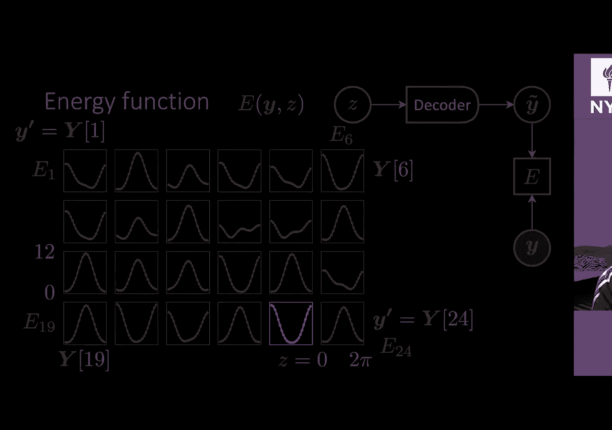

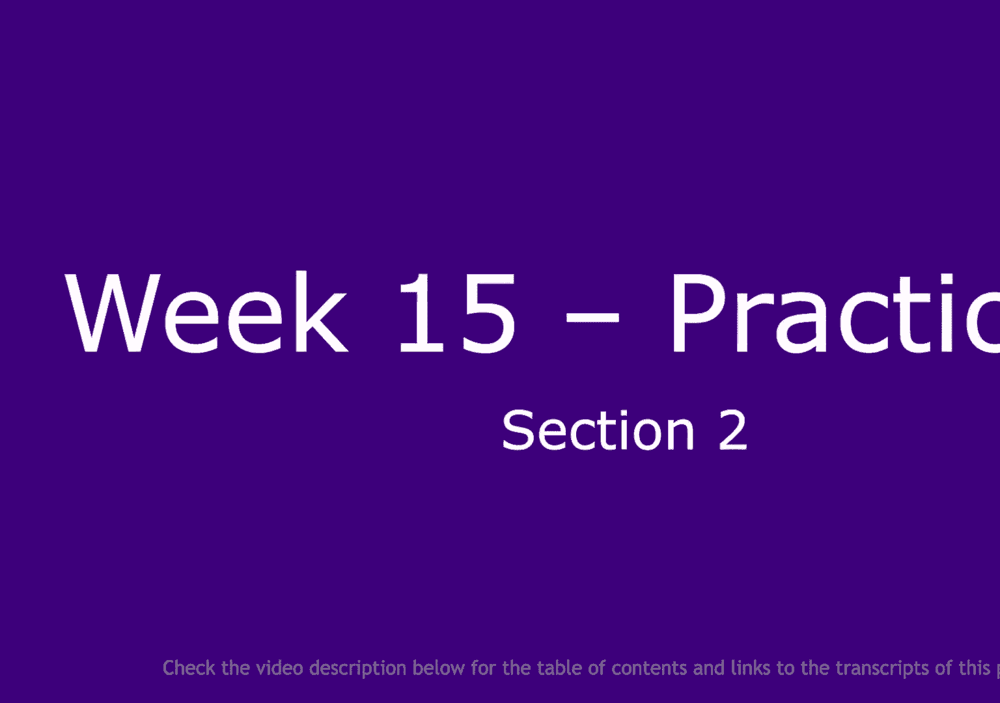

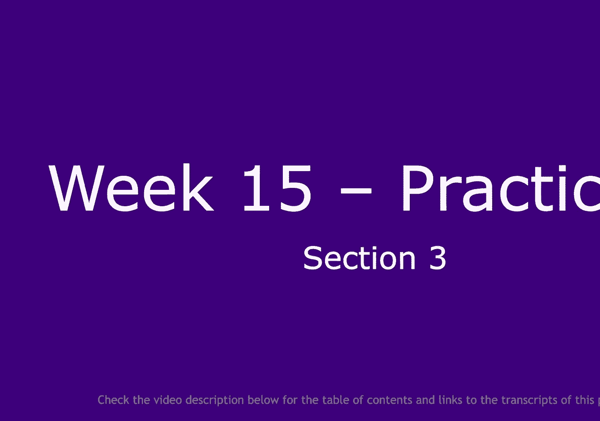

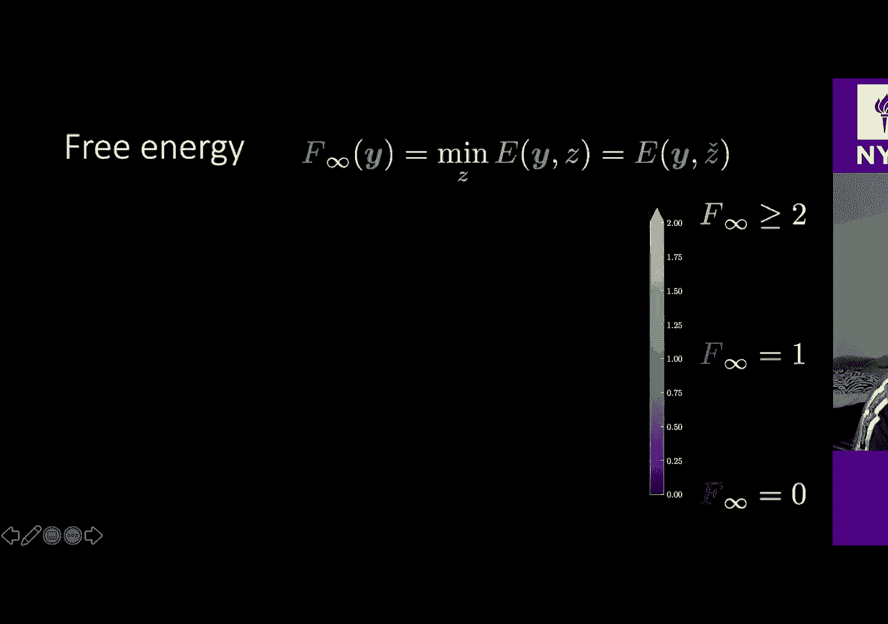

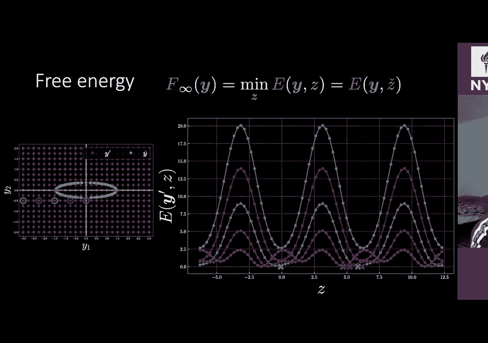

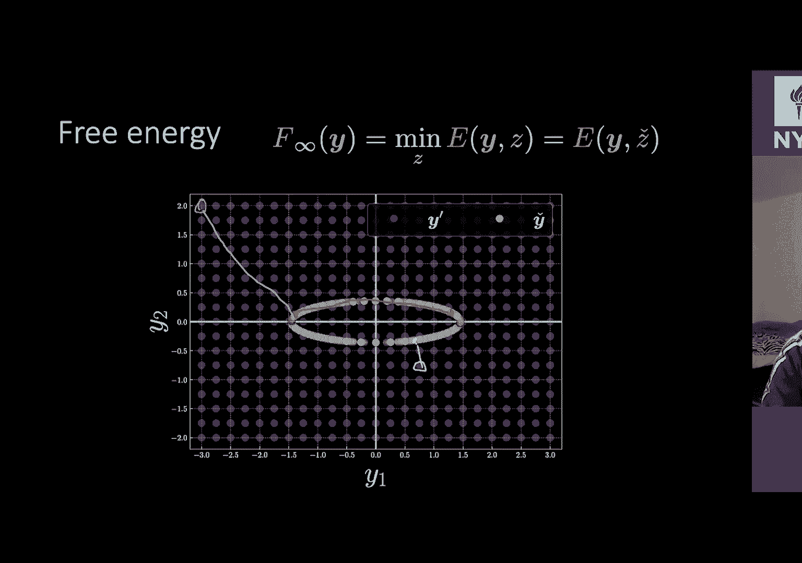

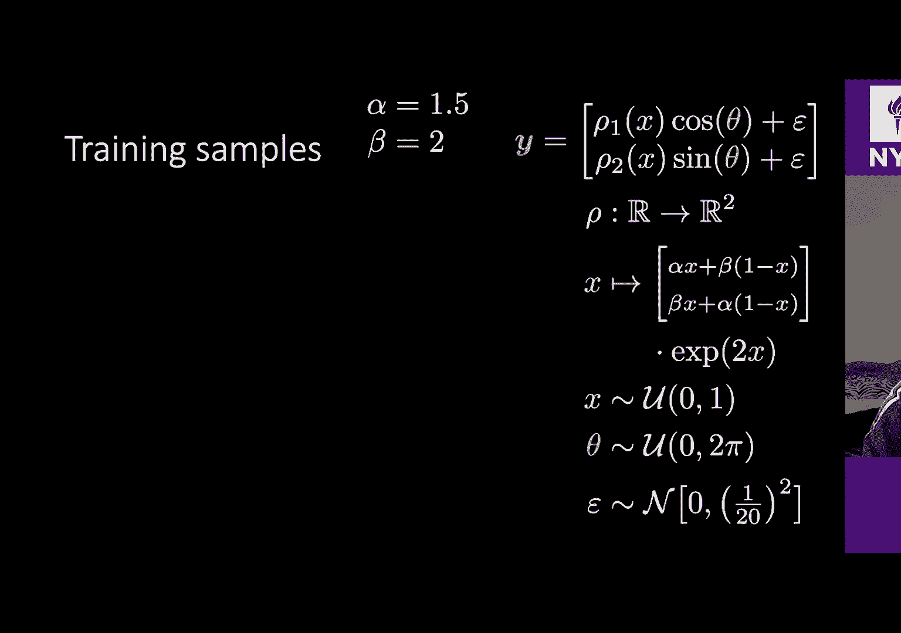

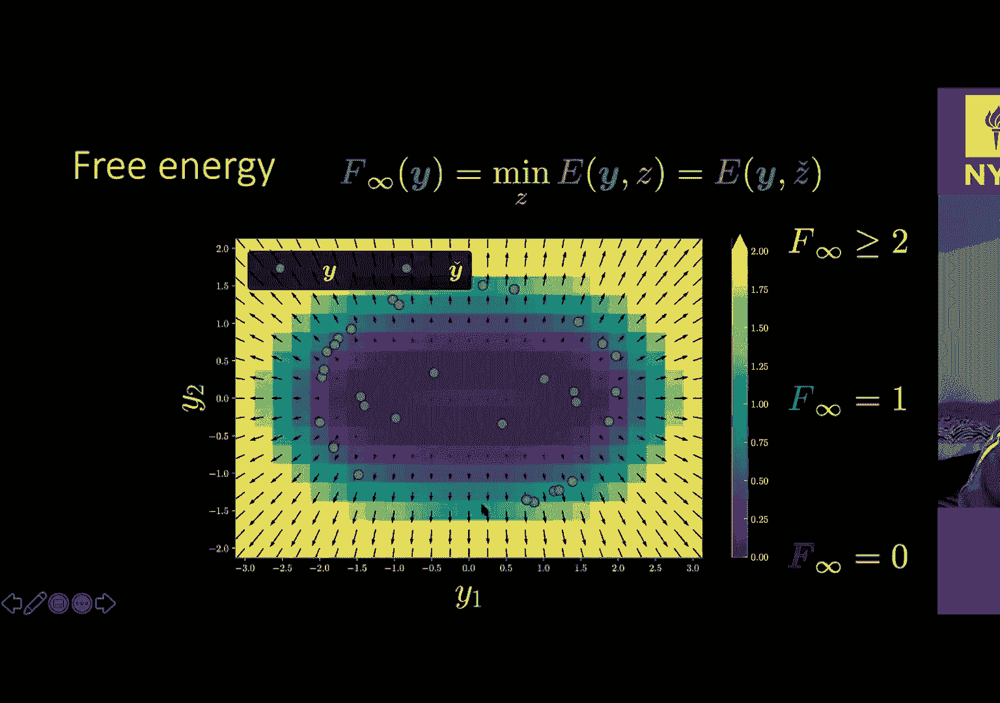

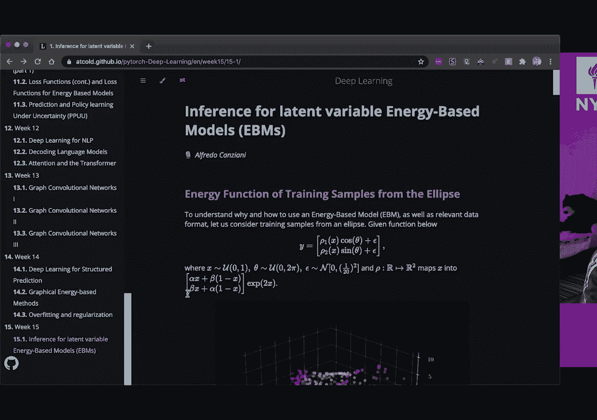

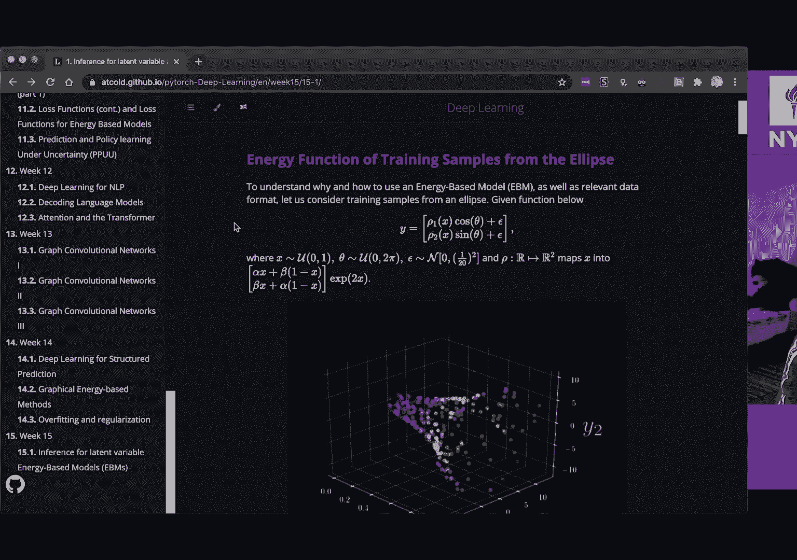

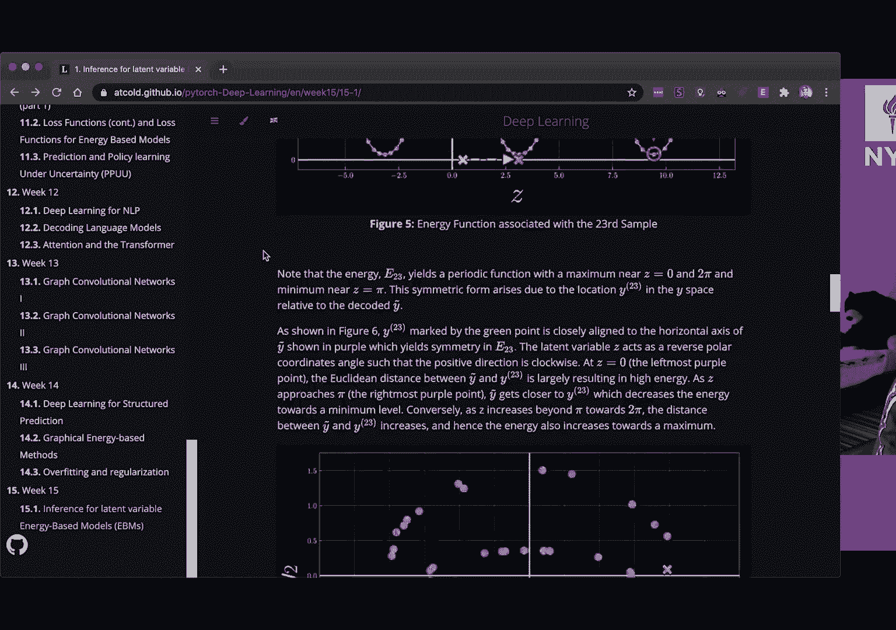

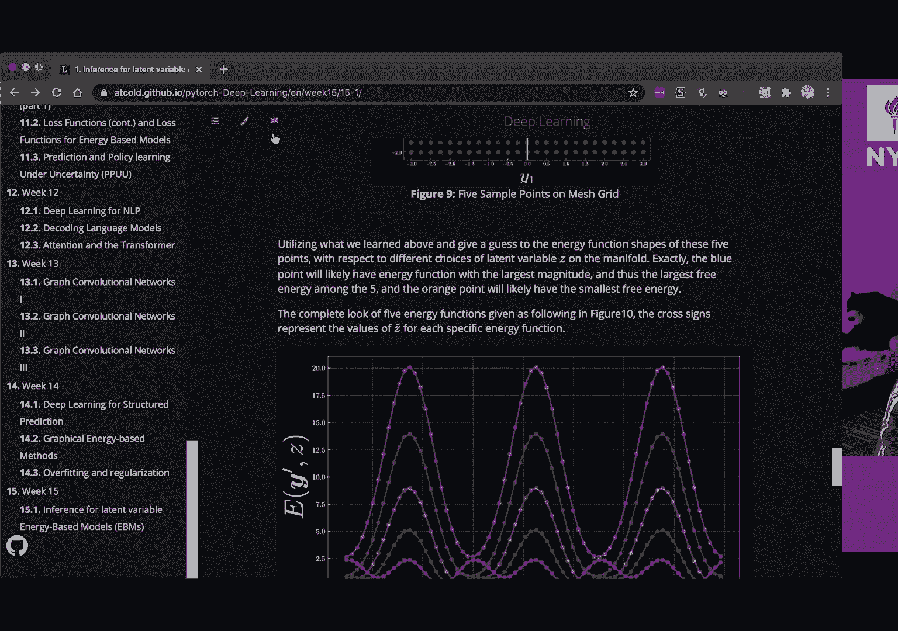

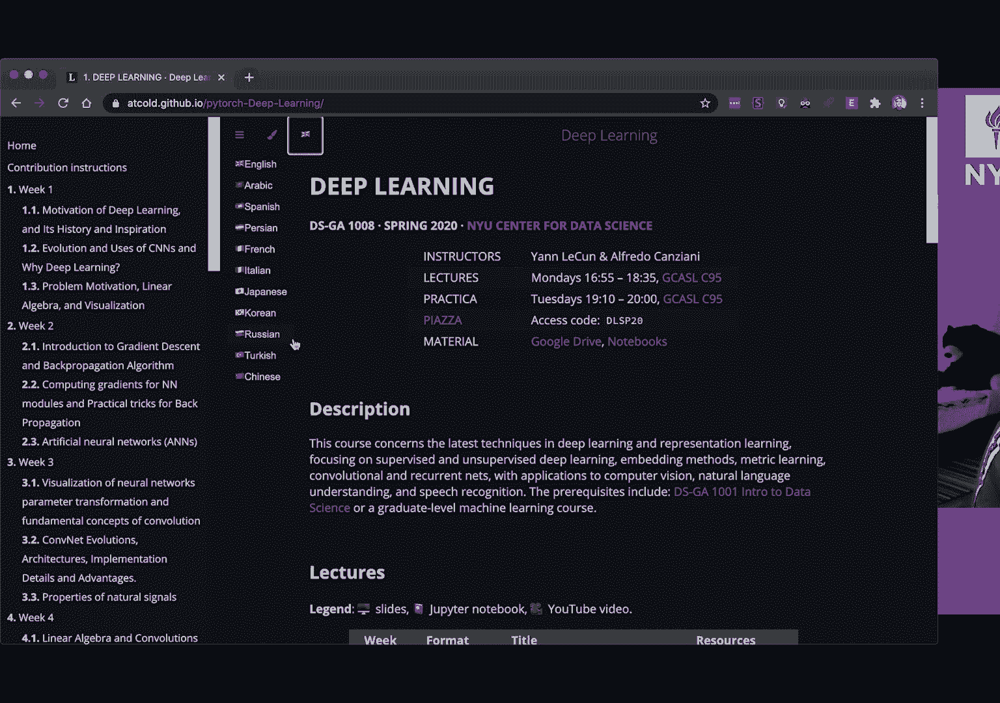

