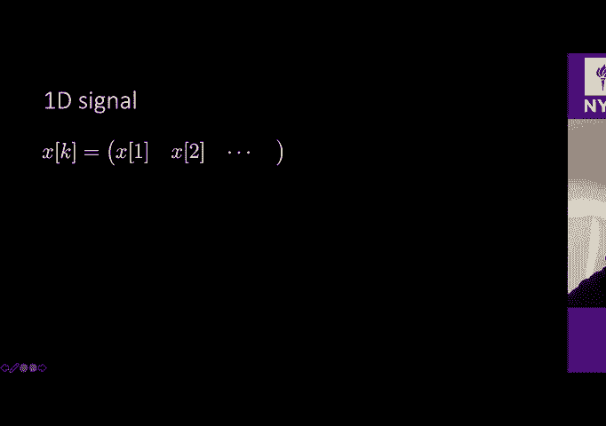
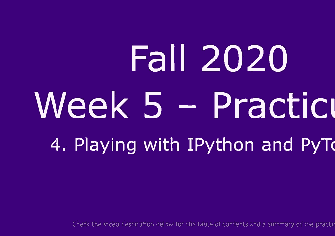

# 【NYU】纽约大学深度学习入门课程（with pytorch）中英文字幕 - P30：Matrix multiplication, signals, - 大佬的迷弟的粉丝 - BV1o5411p7AB

you can start today lesson，you can start today lesson，you can start today lesson。

and i'm gonna be the one teaching today，and i'm gonna be the one teaching today。

so yay your white wild alfredo's and now，so yay your white wild alfredo's and now。

you're gonna figure out very soon why to，you're gonna figure out very soon why to，alfredo's。

alfredo's。

with the other alfredo，so today uh summer is gonna be the，so today uh summer is gonna be the。

so today uh summer is gonna be the，following right this is the table of。

following right this is the table of，content we start with a little，content we start with a little。

little bit of review about uh matrix，little bit of review about uh matrix，multiplication。

multiplication，um just my interpretation like my point，um just my interpretation like my point。

of view，of view，then i'm gonna be telling you about，then i'm gonna be telling you about。

input data which are going to be，input data which are going to be。

in this case talking about input signals，in this case talking about input signals。

so we're going to be extending the，so we're going to be extending the，matrix multiplication for。

matrix multiplication for，signals and we're going to be we're，signals and we're going to be we're。

going to be ending up with convolutions，going to be ending up with convolutions。

which exploit some property of，which exploit some property of，my natural signals，my natural signals。

finally we're going to be seeing some，finally we're going to be seeing some，interactive python。

interactive python，interpreter with by torch，interpreter with by torch。

so let's get started so we're gonna have，so let's get started so we're gonna have，here，here，leaner。

leaner，[Music]，[Music]，algebra recap，algebra recap，all right so whenever we have a neural。

all right so whenever we have a neural，all right so whenever we have a neural，net usually。

net usually，we can write that our hidden layer，we can write that our hidden layer。

and here i'm going to be using，and here i'm going to be using，a bar underneath a letter to represent。

a bar underneath a letter to represent，that is a vector，that is a vector。

okay so this is my h vector is going to，okay so this is my h vector is going to，be，be。

a nonlinear function f applied to my，a nonlinear function f applied to my。

z and what is that that is my，z and what is that that is my，uh linear rotation of my input okay。

uh linear rotation of my input okay，so i can write here z equal some matrix。

so i can write here z equal some matrix，a，a，times my x so let's say x，times my x so let's say x。

is dimension n z is going to be，is dimension n z is going to be，dimension，dimension。

m therefore what is the dimension of a，m therefore what is the dimension of a。

how many rows how many columns and by，how many rows how many columns and by。

how many rows how many columns and by，end that's because we are going to be。

end that's because we are going to be，having as many rows，having as many rows。

as the dimension we are shooting towards，as the dimension we are shooting towards。

and as many columns，and as many columns，as the size of the dimension we are。

as the size of the dimension we are，shooting from，shooting from。

okay so let me just expand this one as，okay so let me just expand this one as。

the classical you know just，the classical you know just，expanding those symbols so i'm going to。

expanding those symbols so i'm going to，have a 1 1，have a 1 1，a 1 2 until da da da attack a。

a 1 2 until da da da attack a，1 n then i'm going to have a 2，1 n then i'm going to have a 2。

1 a 2 2 until the last one，1 a 2 2 until the last one，a to n and then i go down until the last。

a to n and then i go down until the last，row which are going to have，row which are going to have。

am1 a and 2，am1 a and 2，until am n，until am n，okay and then i'm gonna be multiplying。

okay and then i'm gonna be multiplying，this one，this one，by my vector x so i have x one。

by my vector x so i have x one，x two x，x two x，all right so whenever we multiply。

all right so whenever we multiply，all right so whenever we multiply。

a matrix times a column vector usually，a matrix times a column vector usually。

i would suggest everyone thinks about，i would suggest everyone thinks about，doing this operation。

doing this operation，you take this first row and then you，you take this first row and then you。

multiply，multiply，by this column right this is going to be，by this column right this is going to be。

like a inner product，like a inner product，which is this one times these one plus。

which is this one times these one plus，this one times these one plus this one。

this one times these one plus this one，times this one，times this one。

and so we have usually in mind this kind，and so we have usually in mind this kind。

of representation row times column，of representation row times column。

so now just write it down to be you know，so now just write it down to be you know。

just writing down the objects so we have，just writing down the objects so we have，now that my matrix。

now that my matrix，can be written as being my first，can be written as being my first。

row a1 then i have my second row，row a1 then i have my second row，a2 until i get the last。

a2 until i get the last，okay so these a's are already rows，okay so these a's are already rows。

okay so these a's are already rows，and then i multiply this one by my。

and then i multiply this one by my，vector x，so if i multiply this one i'm going to。

so if i multiply this one i'm going to，so if i multiply this one i'm going to。

get something which is going to be like，get something which is going to be like，here，here。

which is going to be a 1，which is going to be a 1，x a2，x a2，x until i get the last one am。

x until i get the last one am，[Music]，[Music]，x right so first another question。

x right so first another question，what is the size of this element over。

what is the size of this element over，one right so this is a scalar and so i。

one right so this is a scalar and so i，one right so this is a scalar and so i，have one，have one。

two until the last one which is m so i，two until the last one which is m so i，have m，have m。

scalars sweet and so this one is going，scalars sweet and so this one is going，to be，to be。

that one z two until i get down to the z，that one z two until i get down to the z。

that one z two until i get down to the z，m okay all right so let's now，m okay all right so let's now。

uh think a little bit what each of these，uh think a little bit what each of these，elements，elements。

are okay so let's have here the generic，are okay so let's have here the generic，term，term。

a row vector times my x，a row vector times my x，and let's assume now that my n is equal。

and let's assume now that my n is equal，to okay，to okay，so what is the uh what is the output of。

so what is the uh what is the output of，this，this，uh operation here how can i compute the。

uh operation here how can i compute the，uh value here i just said before right。

uh value here i just said before right，this is going to be，this is going to be。

this item times this one plus，this item times this one plus，this item times this one right so just。

this item times this one right so just，write it down，write it down，we're gonna have a1 times x1。

we're gonna have a1 times x1，plus a2 times x2，plus a2 times x2。

right now since we are in two dimensions，right now since we are in two dimensions。

i can also draw this，i can also draw this，so i have here a couple of axes。

and i'm gonna have my let's say my，and i'm gonna have my let's say my。

and i'm gonna have my let's say my，x so this is going to be my x，x so this is going to be my x。

and this angle here it's going to be psi，and this angle here it's going to be psi。

this point here is going to be x1，this point here is going to be x1。

and this point over here is going to be，and this point over here is going to be，x2，x2。

a here and i'm going to have my，a here and i'm going to have my，a here and i'm going to have my。

a1 here this is going to be alpha，a1 here this is going to be alpha。

and then it's going to be my a2 over，and then it's going to be my a2 over，here，here。

so i can just write，so i can just write，this with some trigonometry how much is。

this with some trigonometry how much is，a1，a1，it's straight forward right to tell me。

it's straight forward right to tell me，how much is a1 right，how much is a1 right。

can someone tell me how much is a1 yes，can someone tell me how much is a1 yes。

so no it's actually wrong，so no it's actually wrong，uh what is a okay，uh what is a okay。

cosine cosine alpha i guess but you also，cosine cosine alpha i guess but you also。

have you have also to multiply by the，have you have also to multiply by the。

by the length of the vector right so a1，by the length of the vector right so a1。

is going to be uh the length of the，is going to be uh the length of the，vector，vector。

times the cosine of alpha and then i，times the cosine of alpha and then i。

have the other one is going to be，have the other one is going to be。

the length of the other vector times the，the length of the other vector times the，cosine，cosine。

of psi plus，of psi plus，i'm going to have the magnitude of a，i'm going to have the magnitude of a。

times the sine alpha times，times the sine alpha times，the magnitude of x times the sine of psi。

the magnitude of x times the sine of psi，right so i can take those factors out so。

right so i can take those factors out so，i'm going to have，i'm going to have。

the magnitude of a the magnitude of x，the magnitude of a the magnitude of x。

times cosine alpha cosine，times cosine alpha cosine，x i plus sine alpha，x i plus sine alpha。

sine x i right，sine x i right，from high school you were just a few。

from high school you were just a few，from high school you were just a few，years ago in high school。

years ago in high school，can you tell me how much is this，can you tell me how much is this。

you're very quiet，you're very quiet，you're very quiet，it was more than ten years ago okay。

it was more than ten years ago okay，no it's not equal to one yeah that's。

no it's not equal to one yeah that's，correct uh，correct uh，cos alpha minus x i right。

cos alpha minus x i right，so this one it's simply equal to，so this one it's simply equal to。

so this is going to be the cosine of，so this is going to be the cosine of。

so this is going to be the cosine of，alpha minus，alpha minus。

psi right or which is the same as saying，psi right or which is the same as saying，cosine，cosine。

of psi minus alpha i because，of psi minus alpha i because，the cosine is a even function so。

the cosine is a even function so，first take away okay whenever you，first take away okay whenever you。

multiply，multiply，a vector with a matrix on the left right，a vector with a matrix on the left right。

you basically have this multiplication，you basically have this multiplication，this，this。

scalar product between this row and this，scalar product between this row and this，one each row。

one each row，and times this one here each item over，and times this one here each item over，here，here。

will represent up to some，will represent up to some，constant which is expressing the length。

constant which is expressing the length，of these vectors，of these vectors，the degree of。

the degree of，two vectors，two vectors，so if these two vectors are both。

so if these two vectors are both，pointing the same direction，pointing the same direction。

the cosine of zero will be one，the cosine of zero will be one，and so you're gonna have the highest。

and so you're gonna have the highest，value if these two vectors are at ninety。

value if these two vectors are at ninety，degree，degree，you're gonna get the cosine f of pi half。

you're gonna get the cosine f of pi half，is going to be zero right and so this。

is going to be zero right and so this，term will be turning to zero，term will be turning to zero。

otherwise if you have one vector in this，otherwise if you have one vector in this。

direction the other vector in the other，direction the other vector in the other，direction，direction。

you're gonna have the cosine of pi which，you're gonna have the cosine of pi which，becomes，becomes。

one minus one and therefore you're going，one minus one and therefore you're going，to have the。

to have the，sorry the minus one over here right，sorry the minus one over here right。

multiplying of course the，multiplying of course the，uh these two factors so whenever you。

uh these two factors so whenever you，think about a matrix and vector you can。

think about a matrix and vector you can，think about matching，think about matching。

this value here which now we're gonna be，this value here which now we're gonna be，calling kernel。

calling kernel，so my a which was in pink so this guy，so my a which was in pink so this guy，over here。

over here，is called kernel，is called kernel，and therefore this multiplication will。

and therefore this multiplication will，be called，be called，so the kernel is like a template right。

so the kernel is like a template right，so this is called template，so this is called template。

temp plate matching，temp plate matching，so you simply check how much is the。

so you simply check how much is the，scalar projection，scalar projection。

the scalar scalar product the geometric，the scalar scalar product the geometric，projection。

projection，of the given signal or given symbol like，of the given signal or given symbol like，given。

given，vector towards each of these kernels，vector towards each of these kernels，right，right。

all right one more interpretation which，all right one more interpretation which，i really like。

i really like，is the following and usually people，is the following and usually people，don't see this。

don't see this，when i talk when i explain this during，when i talk when i explain this during。

the office hours people were like oh，the office hours people were like oh。

and so i had to show it to you as well，and so i had to show it to you as well。

otherwise you don't know，otherwise you don't know，oh okay all right so we said that this。

oh okay all right so we said that this，to get these items，to get these items。

i do this item well we do this one times，i do this item well we do this one times。

this one this one times this one this，this one this one times this one this，one times this all right。

one times this all right，so this first item gets multiplied by，so this first item gets multiplied by。

this item here，this item here，this item over here also gets multiplied。

this item over here also gets multiplied，by this one，by this one。

this item the same and this one as well，this item the same and this one as well，right，right。

so the entire first column gets，so the entire first column gets。

multiplied by the first item over here，multiplied by the first item over here。

then we sum it to the product of this，then we sum it to the product of this。

item times the second one maybe i had to，item times the second one maybe i had to，make a square。

make a square，so we can do this one here then i do the，so we can do this one here then i do the。

second item times the same square，second item times the same square。

then i have this one times the same item，then i have this one times the same item。

and the final this one here，and the final this one here，until and then i had a plus here and。

until and then i had a plus here and，then i get this item here over the last。

then i get this item here over the last，one，one，this item over the last one here and。

this item over the last one here and，then so on right，then so on right。

and so you can express this metrics，and so you can express this metrics。

uh call next respect to multiplication，uh call next respect to multiplication，and this is a。

and this is a，different way right so i can write this，different way right so i can write this。

one as being，one as being，my a1 vector column，my a1 vector column，i have a two vector column。

i have a two vector column，until i get the last one which is going。

until i get the last one which is going，to be the end because we have，to be the end because we have。

