# 【NYU】纽约大学深度学习入门课程（with pytorch）中英文字幕 - P5：5. Week 3 – Lecture - Convolutional neural networks - 大佬的迷弟的粉丝 - BV1o5411p7AB

在这种情况下，我们的网络通常在左侧有一个输入。

在这种情况下，我们的网络通常在左侧有一个输入，您在底部或左侧输入的内容在我的幻灯片中为粉红色。

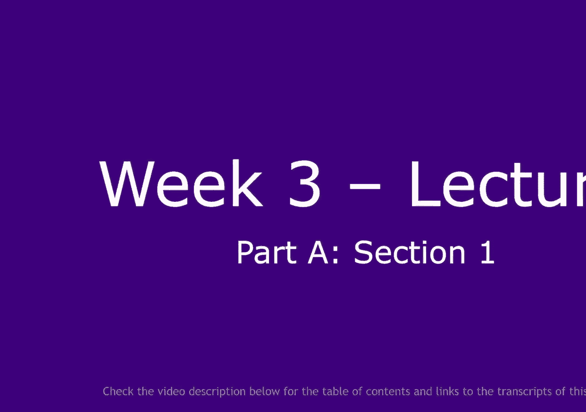

您在底部或左侧输入的内容在我的幻灯片中为粉红色，因此，如果您记笔记，使它们变粉红色，不仅是在开玩笑，因此，如果您记笔记，使它们变粉红色，不仅是在开玩笑，然后我们有多少个激活多少个隐藏层。

然后我们有多少个激活多少个隐藏层，您算出那里有四个隐藏层，因此整个网络有多少层，您算出那里有四个隐藏层，因此整个网络有多少层，在这里有六个权利，因为我们有四个隐藏，在这里有六个权利，因为我们有四个隐藏。

再加上一个输入加上一个输出层，所以在这种情况下，我每个人有两个神经元，再加上一个输入加上一个输出层，所以在这种情况下，我每个人有两个神经元，正确的层，这意味着什么？矩阵的维数是多少，正确的层。

这意味着什么？矩阵的维数是多少，我们在这里使用2 x 2，那么2 x 2矩阵的作用是什么，我们在这里使用2 x 2，那么2 x 2矩阵的作用是什么，你知道这个问题的答案吗？你知道这个问题的答案吗？

分享和反思梦幻般的权利，因此我们限制了网络的执行，分享和反思梦幻般的权利，因此我们限制了网络的执行，如果允许FIR，我们在飞机上第一次看到的所有操作，如果允许FIR，我们在飞机上第一次看到的所有操作。

我们可以将隐藏层设为一百个神经元，哇，好吧，我们可以轻松地，我们可以将隐藏层设为一百个神经元，哇，好吧，我们可以轻松地，会影响我们的幻想，现在我们正在看电影是什么，我看到，会影响我们的幻想。

现在我们正在看电影是什么，我看到，太棒了，曼达洛人现在太酷了，好吧，好这堂课有多好，太棒了，曼达洛人现在太酷了，好吧，好这堂课有多好，甚至被记录好了，我们不知道好了，请给我几秒钟，所以我们去这里了。

甚至被记录好了，我们不知道好了，请给我几秒钟，所以我们去这里了，听好吧，所以我们从这个网络开始，我们有了这个，听好吧，所以我们从这个网络开始，我们有了这个，中间层，我们强迫它们是二维的，这样所有。

中间层，我们强迫它们是二维的，这样所有。

转换被强制在飞机上，所以这就是网络，转换被强制在飞机上，所以这就是网络，对我们的飞机进行操作，将其折叠在这些文件夹中的特定区域上，对我们的飞机进行操作，将其折叠在这些文件夹中的特定区域上。

折叠非常非常突然，折叠非常非常突然，因为所有转换都正确执行2d层，所以这。

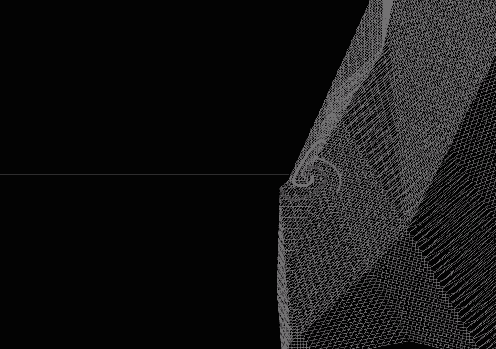

因为所有转换都正确执行2d层，所以这，培训真的让我付出了很多努力，因为优化是。

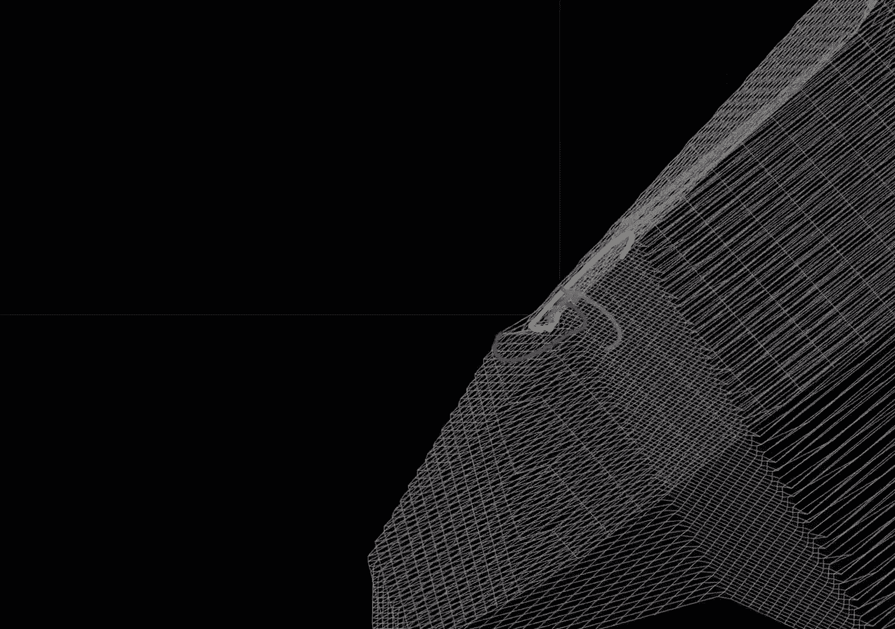

培训真的让我付出了很多努力，因为优化是，每当我将一百个神经元放入隐藏层中时。

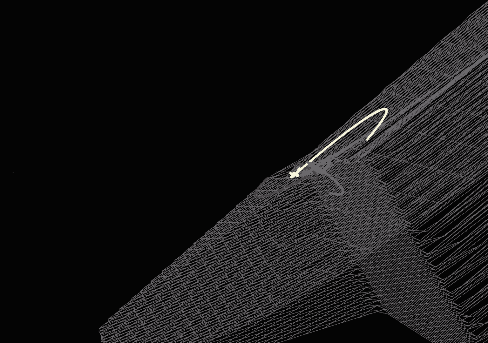

每当我将一百个神经元放入隐藏层中时，培训非常容易，这真的很费力。

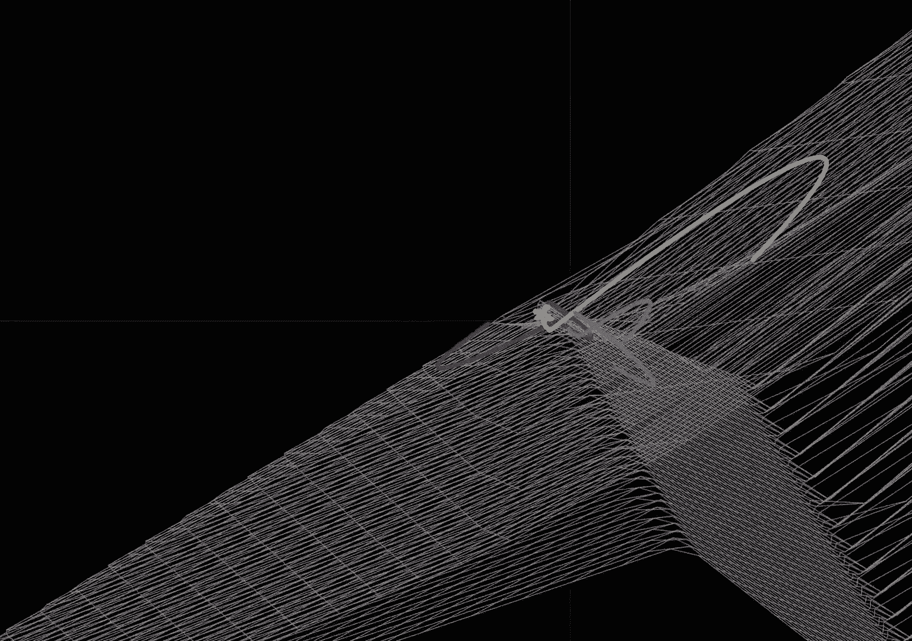

培训非常容易，这真的很费力，你必须告诉我为什么现在还不知道答案会更好吗。

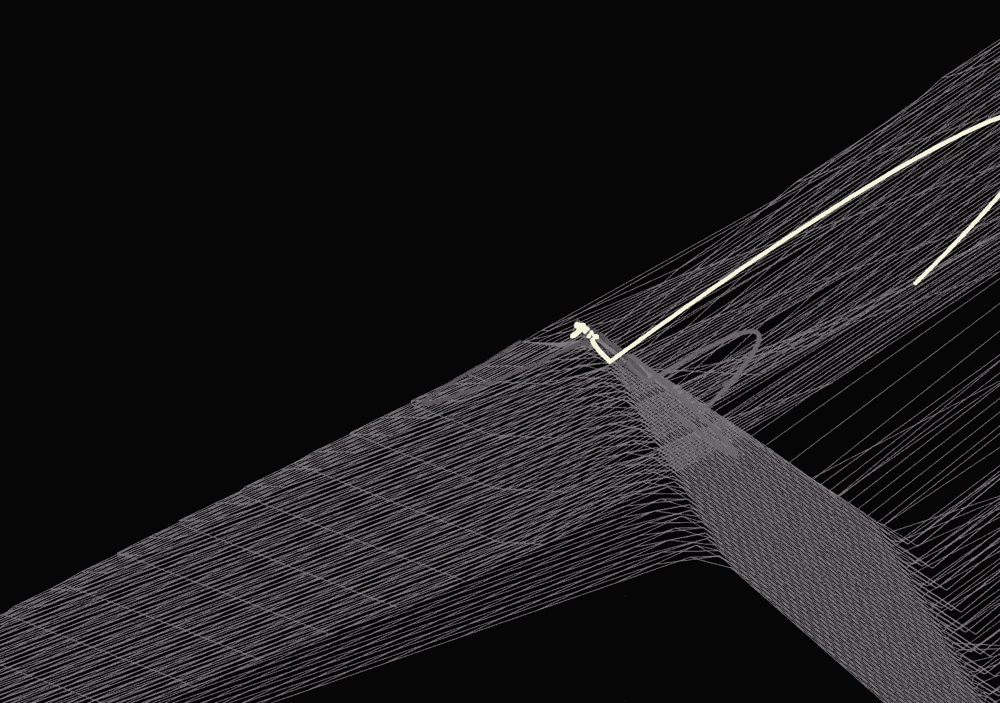

你必须告诉我为什么现在还不知道答案会更好吗，知道期中答案，这样您就可以注意哪些问题了。

知道期中答案，这样您就可以注意哪些问题了，到电表右边，这是网络的最终输出，也是。

到电表右边，这是网络的最终输出，也是，这些层是2D层，因此我的最后一层没有非线性。

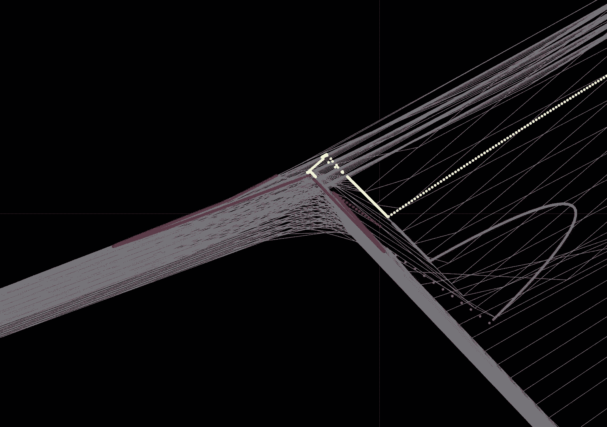

这些层是2D层，因此我的最后一层没有非线性，是最终的分类区域，所以让我们看一下这是哪一层。

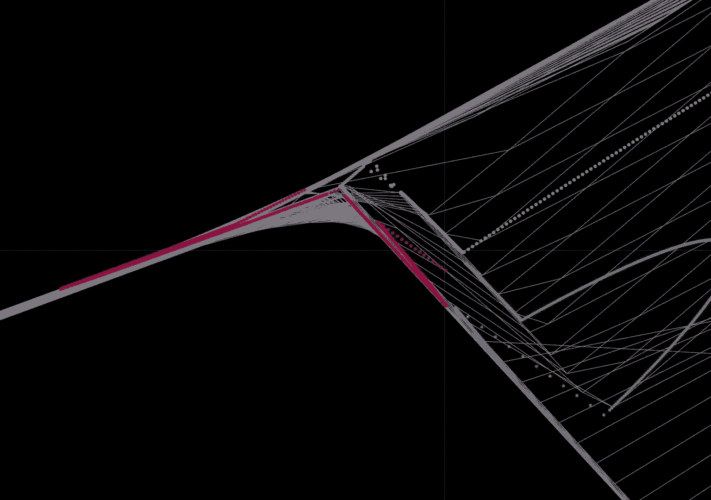

是最终的分类区域，所以让我们看一下这是哪一层。

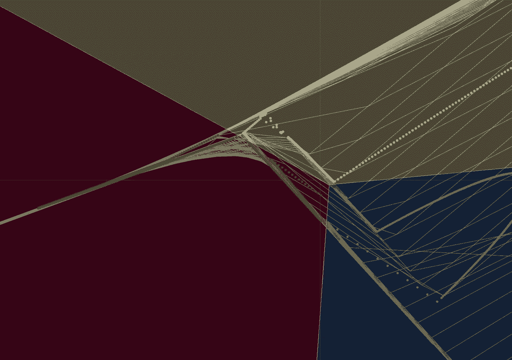

第一层仿射变换，因此看起来像是3D旋转，但，第一层仿射变换，因此看起来像是3D旋转，但，这是不对的，只是旋转反射缩放和剪切，这是不对的，只是旋转反射缩放和剪切，然后这是什么部分啊，现在正在发生什么。

您会看到我们所拥有的，然后这是什么部分啊，现在正在发生什么，您会看到我们所拥有的，就像视频部分正在扼杀网络的所有负面影响一样，就像视频部分正在扼杀网络的所有负面影响一样，对不起。

这个空间的所有负面影响是第二个仿射，对不起，这个空间的所有负面影响是第二个仿射，转换，然后在这里再次应用areevo，转换，然后在这里再次应用areevo，您会看到所有负子空间已被删除，它们已设置为。

您会看到所有负子空间已被删除，它们已设置为，零，那么我们继续进行第三个仿射变换。零，那么我们继续进行第三个仿射变换。很多次之后，您将拥有现在的重做层，很多次之后，您将拥有现在的重做层。

杀死所有三个象限之一，而只有一个象限，杀死所有三个象限之一，而只有一个象限，每次都生存下来，然后我们进行第四次仿射变换，每次都生存下来，然后我们进行第四次仿射变换，顺其自然。

因为再次考虑到我们限制了所有变换，顺其自然，因为再次考虑到我们限制了所有变换，要生活在这个空间中，它确实需要伸展，你知道要使用所有，要生活在这个空间中，它确实需要伸展，你知道要使用所有。

它可以再次写入的力量，这是倒数第二，然后是最后一个，它可以再次写入的力量，这是倒数第二，然后是最后一个，转换是最后一个，然后我们最终线性地到达，转换是最后一个，然后我们最终线性地到达。

终于在这里我们可以看到每个可分离区域。

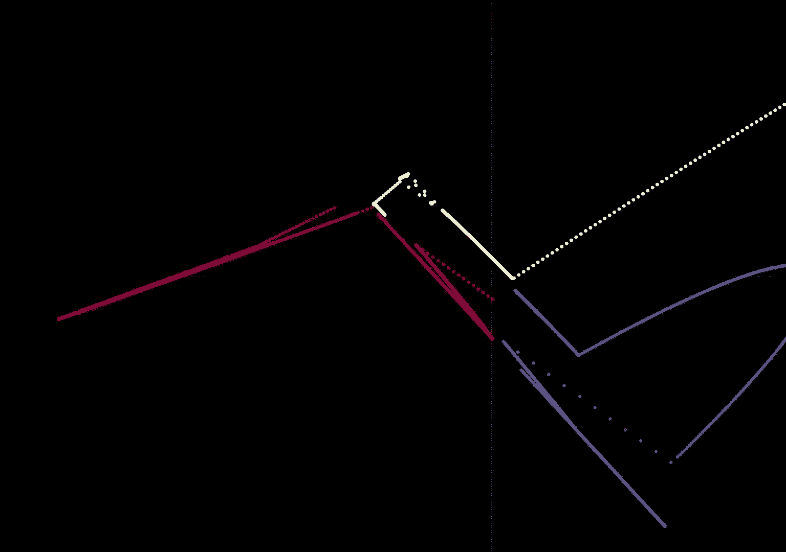

终于在这里我们可以看到每个可分离区域。

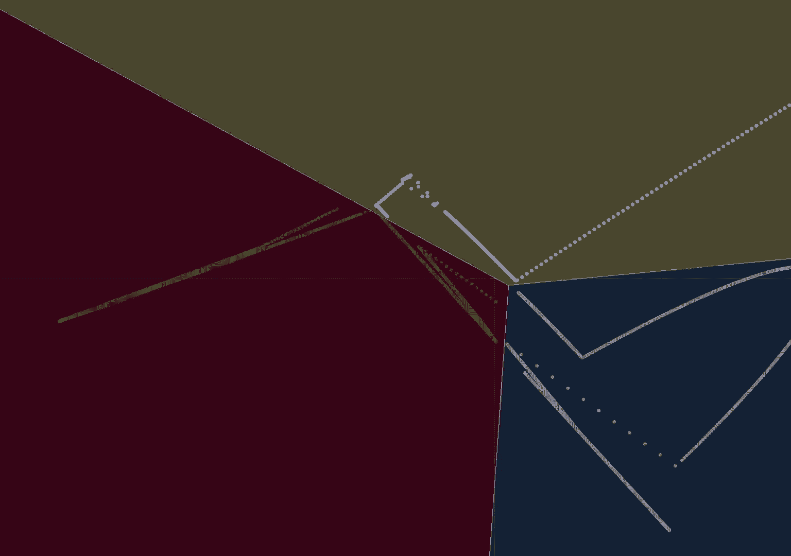

在每个组件中分开，所以我们有，在每个组件中分开，所以我们有，旋转我们现在像风一样挤压，然后我们有了旋转反射，旋转我们现在像风一样挤压，然后我们有了旋转反射，因为行列式为负1，然后我们又有了最终的偏差。

因为行列式为负1，然后我们又有了最终的偏差，再次使Areeda整流线性单元的正部分旋转，再次使Areeda整流线性单元的正部分旋转，翻转，因为我们旋转时负数又是负1行列式缩放，翻转。

因为我们旋转时负数又是负1行列式缩放，再思考一遍，然后最后的偏见，这是第二次罚款，再思考一遍，然后最后的偏见，这是第二次罚款，转变，那么我们在这里又是积极的一部分，我们是第三层，转变。

那么我们在这里又是积极的一部分，我们是第三层，或旋转反射缩放，然后我们就可以进行SVD​​分解了，或旋转反射缩放，然后我们就可以进行SVD​​分解了，应该知道您应该知道的权利，然后最后是翻译。

应该知道您应该知道的权利，然后最后是翻译，再来一次第三次谜语，然后我们进行第四层或旋转反射，再来一次第三次谜语，然后我们进行第四层或旋转反射，因为行列式为负，再次假设另一个旋转图标a，因为行列式为负。

再次假设另一个旋转图标a，经过反射和偏置后的小旋转终于读了哦，然后我们有了最后一个，经过反射和偏置后的小旋转终于读了哦，然后我们有了最后一个，第五层，所以旋转缩放我们没有反射，因为，第五层。

所以旋转缩放我们没有反射，因为，行列式在这种情况下再加上一次反射，因为，行列式在这种情况下再加上一次反射，因为，终端是负的，最后是最终的偏见，所以这是。

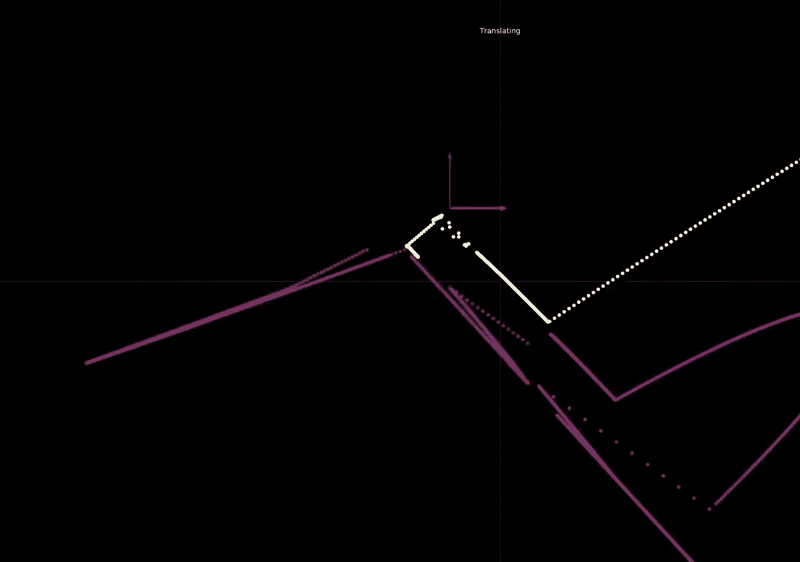

终端是负的，最后是最终的偏见，所以这是，该网络是由几层的厚度构成的。

该网络是由几层的厚度构成的，每层只有两个神经元的神经元正在执行，每层只有两个神经元的神经元正在执行，分类任务，所有这些转换都被限制在，分类任务，所有这些转换都被限制在，可以住在飞机上。

所以这真的很难训练，可以住在飞机上，所以这真的很难训练，你能弄清楚为什么真的很难训练发生了什么，你能弄清楚为什么真的很难训练发生了什么，如果我对五层之一的偏见使我的观点偏离了。

如果我对五层之一的偏见使我的观点偏离了，恰好在右上象限中，如果您将拥有四个偏差之一，恰好在右上象限中，如果您将拥有四个偏差之一，我最初的位置离右上象限不远，那么视频将是，我最初的位置离右上象限不远。

那么视频将是，完全杀死一切，一切都崩溃为零好，完全杀死一切，一切都崩溃为零好，所以你不能做更多或任何事情，所以你不能做更多或任何事情，因此，如果您只是将其设置为，因此，如果您只是将其设置为。

比不局限于每个神经元要胖一点，比不局限于每个神经元要胖一点，的隐藏层，那么它更容易训练，或者您可以将，的隐藏层，那么它更容易训练，或者您可以将，两者很好，所以您可以拥有一个，两者很好。

所以您可以拥有一个，脂肪较少的网络，但是您会有一些隐藏层，脂肪较少的网络，但是您会有一些隐藏层，所以这几乎是一个问题，所以肥胖是你有多少神经元。

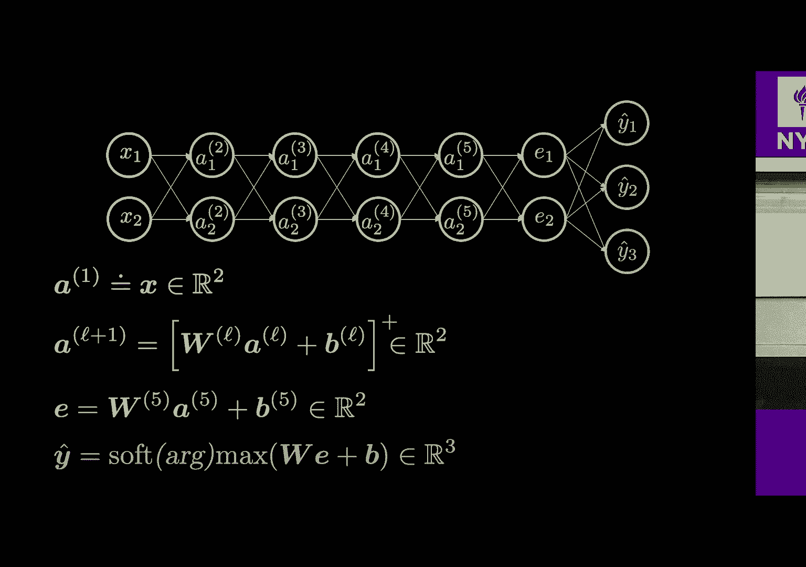

所以这几乎是一个问题，所以肥胖是你有多少神经元，助手隐藏层没问题，所以问题是我们如何确定，助手隐藏层没问题，所以问题是我们如何确定，网络的结构或配置正确如何设计网络，网络的结构或配置正确如何设计网络。

答案将是N将要传授的内容，答案将是N将要传授的内容，这个学期是正确的，所以保持保持保持它就像保持你的注意力高，这个学期是正确的，所以保持保持保持它就像保持你的注意力高。

因为你知道那就是我们要在这里教的东西，这是一个好问题，因为你知道那就是我们要在这里教的东西，这是一个好问题，对，没有像许多实验这样的数学规则，对，没有像许多实验这样的数学规则，经验证据。

您知道很多人尝试不同的配置，经验证据，您知道很多人尝试不同的配置，我们发现了一些实际上可以正常工作的东西，我们将再次成为，我们发现了一些实际上可以正常工作的东西，我们将再次成为。

在以下课程中涵盖这些体系结构的其他问题，在以下课程中涵盖这些体系结构的其他问题，害羞不行，所以我想我们可以切换第二部分的类型，害羞不行，所以我想我们可以切换第二部分的类型。

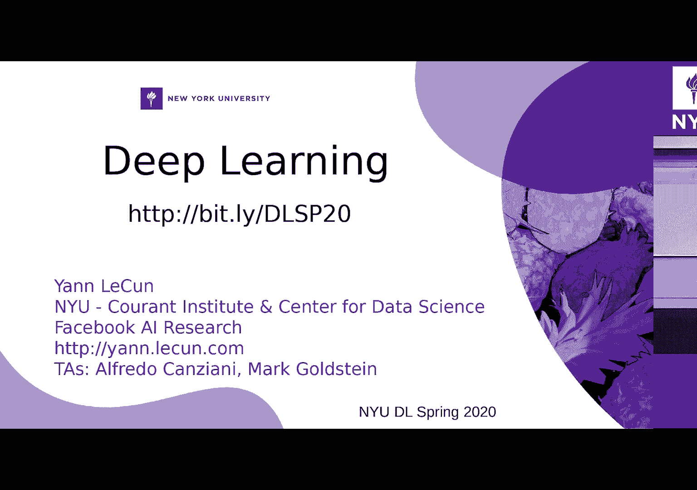

上课好，所以今天我们要谈论商业网，上课好，所以今天我们要谈论商业网。

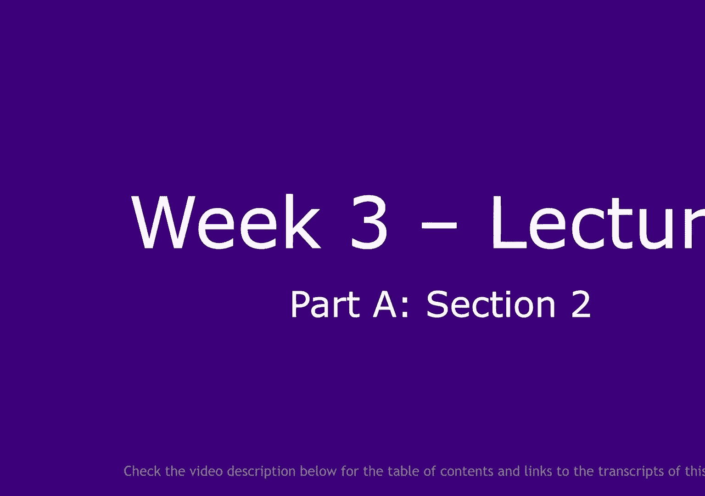

因此，我将从与商业网有关的内容入手，而不仅仅是，因此，我将从与商业网有关的内容入手，而不仅仅是，这是转换神经网络参数的想法，所以在这里我们，这是转换神经网络参数的想法，所以在这里我们。

有一个我们以前看过的图，除了稍微扭一下，有一个我们以前看过的图，除了稍微扭一下，我们在这里看到的是，我们知道X和WW的G是参数，我们在这里看到的是，我们知道X和WW的G是参数，X是您知道的输入。

可以对输出进行预测，然后，X是您知道的输入，可以对输出进行预测，然后，到成本函数中，我们之前已经看到过，但是这里的转折是，到成本函数中，我们之前已经看到过，但是这里的转折是，权向量而不是要优化的参数是。

权向量而不是要优化的参数是，实际上它本身可能是其他一些函数的输出参数，实际上它本身可能是其他一些函数的输出参数，如果此函数不是参数化函数，或者是分支明智函数，如果此函数不是参数化函数。

或者是分支明智函数，但唯一的输入是您可以确定的另一个参数，但唯一的输入是您可以确定的另一个参数，我们在这里所做的是使该神经网络的权重成为，我们在这里所做的是使该神经网络的权重成为。

有人通过函数列出了一些基本参数，有人通过函数列出了一些基本参数，您很快就意识到，如果您回来，核心小组就可以在那里工作，您很快就意识到，如果您回来，核心小组就可以在那里工作，通过G函数传播渐变。

以获取渐变，通过G函数传播渐变，以获取渐变，关于白色参数实现的任何目标函数，关于白色参数实现的任何目标函数，可以在此处通过H函数继续传播以获取具有，可以在此处通过H函数继续传播以获取具有，尊重你。

所以最终你会知道传播这样的事情，尊重你，所以最终你会知道传播这样的事情，在审核时，您要乘以，在审核时，您要乘以，关于参数的目标函数，然后由，关于参数的目标函数，然后由，相对于其自身参数的H函数。

这样您就可以得到产品，相对于其自身参数的H函数，这样您就可以得到产品，的两个雅各布人中的一个，这就是你从后面传播你得到的，的两个雅各布人中的一个，这就是你从后面传播你得到的。

不必为此而在pi火炬中做任何事情，不必为此而在pi火炬中做任何事情，您定义网络，这是发生的旧日期，您定义网络，这是发生的旧日期，现在当然W是函数U的函数U，现在当然W是函数U的函数U。

W将是U的变化乘以H的雅可比矩阵，W将是U的变化乘以H的雅可比矩阵，转置，所以这是您在此处进行有效更改的一种方式，转置，所以这是您在此处进行有效更改的一种方式，在W中，您无需更新W而实际上在约会。

您就是OData，在W中，您无需更新W而实际上在约会，您就是OData，乘以H的雅可比行列式，你知道我们在这里有移调，不是，乘以H的雅可比行列式，你知道我们在这里有移调，不是，与之相反。

存在一个平方矩阵，该矩阵为nw x n W，即，与之相反，存在一个平方矩阵，该矩阵为nw x n W，即，W的维数平方好，所以这里的矩阵，W的维数平方好，所以这里的矩阵，行，因为W具有分量，则列数是。

行，因为W具有分量，则列数是，U的组成部分，然后这个家伙当然反过来了，U的组成部分，然后这个家伙当然反过来了，所以它是n乘以nW，所以当你可能使产品做那些，所以它是n乘以nW，所以当你可能使产品做那些。

两个矩阵，您将获得NW采访矩阵，然后相乘，两个矩阵，您将获得NW采访矩阵，然后相乘，通过这个NW向量得到一个NW向量，这是您需要的，通过这个NW向量得到一个NW向量，这是您需要的，可以确定权重。

所以这是转换，可以确定权重，所以这是转换，参数空间，您知道可以使用此方法的多种方式，参数空间，您知道可以使用此方法的多种方式，使用它的特定方式是当H称为a时，您知道我们在说什么。

使用它的特定方式是当H称为a时，您知道我们在说什么，关于上周，这是一个白色的连接器，所以想象一下，关于上周，这是一个白色的连接器，所以想象一下，H所做的是，它占用U的一个分量并将其复制多次，H所做的是。

它占用U的一个分量并将其复制多次，这样您就可以在G函数上复制相同的值和相同的权重，这样您就可以在G函数上复制相同的值和相同的权重，G函数我们多次使用相同的值，所以说这将，G函数我们多次使用相同的值。

所以说这将，看起来像这样，让我们​​假设您是二维u1 u2，然后W是四个，看起来像这样，让我们​​假设您是二维u1 u2，然后W是四个，维度，但w1和w2等于u1且W 3 w 4等于u2，所以，维度。

但w1和w2等于u1且W 3 w 4等于u2，所以，基本上，您只有两个自由参数，并且在更改一个时，基本上，您只有两个自由参数，并且在更改一个时，您的组件可以非常简单地同时更改W的两个组件。

您的组件可以非常简单地同时更改W的两个组件，方式，这被称为权重共享，当两个权重被强制为，方式，这被称为权重共享，当两个权重被强制为，等于他们实际上负担得起，它们实际上等于瞬时参数。

等于他们实际上负担得起，它们实际上等于瞬时参数，它既控制着共享的地方，又是很多东西的基础，它既控制着共享的地方，又是很多东西的基础，您知道商业网等等的想法，但是但是，您可以，您知道商业网等等的想法。

但是但是，您可以，认为这是U的H的非常非常简单的形式，因此您无需再做，认为这是U的H的非常非常简单的形式，因此您无需再做，从某种意义上说，什么都可以，只要您拥有共享，从某种意义上说，什么都可以。

只要您拥有共享，明确地带有一个在回程中进行白色连接的模块，明确地带有一个在回程中进行白色连接的模块，当成分向后传播时，将梯度相加，因此，当成分向后传播时，将梯度相加，因此，例如。

某些成本函数相对于u 1的梯度将为，例如，某些成本函数相对于u 1的梯度将为，梯度的总和，以使关于W 1和W 2的消耗和，梯度的总和，以使关于W 1和W 2的消耗和，类似地，关于u 2的梯度将是。

类似地，关于u 2的梯度将是，关于W 3和W 4好的，这只是通过传播的效果，关于W 3和W 4好的，这只是通过传播的效果，两个白色连接器，好的，这是此参数转换的更一般的视图，好的。

这是此参数转换的更一般的视图，这里有些人称超级网络，所以超级网络是一个网络，这里有些人称超级网络，所以超级网络是一个网络，其中一个网络的权重被计算为另一个网络的输出。

其中一个网络的权重被计算为另一个网络的输出，网络好，所以您有一个网络H来查看它自己的输入，网络好，所以您有一个网络H来查看它自己的输入，参数U并计算第二个网络的权重，所以，参数U并计算第二个网络的权重。

所以，这样做的好处是这些值为其命名，这个想法很古老，这样做的好处是这些值为其命名，这个想法很古老，回到80年代，人们使用所谓的乘法互动或，回到80年代，人们使用所谓的乘法互动或。

具有信号PI单元的三向网络，它们基本上就是这个主意，具有信号PI单元的三向网络，它们基本上就是这个主意，可能是它稍微有点笼统的概括，可能是它稍微有点笼统的概括，动态地在X的G中动态定义的函数。

动态地在X的G中动态定义的函数，W，因为W实际上是输入和其他一些参数的复杂函数，W，因为W实际上是输入和其他一些参数的复杂函数，当您在做什么时，这是特别有趣的架构，当您在做什么时，这是特别有趣的架构。

您对X所做的事情正在以某种方式对其进行转换，因此您可以想到，您对X所做的事情正在以某种方式对其进行转换，因此您可以想到，W是该转换的参数，因此Y将是，W是该转换的参数，因此Y将是。

X和XI的变换版本基本上意味着函数H，X和XI的变换版本基本上意味着函数H，计算该转换还可以，但欢迎在几周后回到该转换，计算该转换还可以，但欢迎在几周后回到该转换，想要提及这一点，因为它基本上是对。

想要提及这一点，因为它基本上是对，这项权利，您只需再多一根从X到H的导线，这就是您的方式，这项权利，您只需再多一根从X到H的导线，这就是您的方式，获得那些超级网络，好的。

所以我们显示的是您知道可以有一个参数的想法，好的，所以我们显示的是您知道可以有一个参数的想法，在另一个网络中控制多个多个项目的50个参数，在另一个网络中控制多个多个项目的50个参数，有用的原因是。

如果您想检测输入中的主题，并且想要，有用的原因是，如果您想检测输入中的主题，并且想要，不管同伴在哪里都可以检测到这个图案，所以假设您有一个，不管同伴在哪里都可以检测到这个图案，所以假设您有一个。

输入序列，但可能会很酷，输入序列，但可能会很酷，假设这种情况是矢量的序列序列，假设这种情况是矢量的序列序列，有一个网络，需要三个连续三个真空的集合，有一个网络，需要三个连续三个真空的集合。

对X和W的网络G进行向量化，并尝试检测特定的基序，对X和W的网络G进行向量化，并尝试检测特定的基序，这三个向量中的一个，也许这是我不知道的功耗，这三个向量中的一个，也许这是我不知道的功耗，电力消耗。

有时您知道您可能想要成为，电力消耗，有时您知道您可能想要成为，能够检测到像斑点或趋势之类的东西，也许是你，能够检测到像斑点或趋势之类的东西，也许是你，知道某种时间序列的金融工具，也许是。

知道某种时间序列的金融工具，也许是，语音信号，并且您要检测包含三种声音的特定声音，语音信号，并且您要检测包含三种声音的特定声音，定义该语音的音频内容种类的向量，定义该语音的音频内容种类的向量，信号。

因此您希望能够检测到是否是语音信号，信号，因此您希望能够检测到是否是语音信号，在语音识别过程中，您需要检测特定的Sonya，在语音识别过程中，您需要检测特定的Sonya。

可能想检测出您知道元音P正确的声音P，可能想检测出您知道元音P正确的声音P，无论它出现在序列中的何处，您都希望您知道一些检测器，无论它出现在序列中的何处，您都希望您知道一些检测器，发出声音P时触发。

因此它应该具有，发出声音P时触发，因此它应该具有，探测器，您可以在右侧滑过，无论此图案在哪里，探测器，您可以在右侧滑过，无论此图案在哪里，发生检测到，所以您需要的是一些太阳网络并确定优先级，发生检测到。

所以您需要的是一些太阳网络并确定优先级，您知道的功能您可以拥有该功能的多个副本，您知道的功能您可以拥有该功能的多个副本，应用于输入的各个区域，它们都具有相同的权重，但是，应用于输入的各个区域。

它们都具有相同的权重，但是，您想训练整个系统并训练到n，例如，让我们说，您想训练整个系统并训练到n，例如，让我们说，谈论在这里开始更复杂的场景，让我们看看，谈论在这里开始更复杂的场景，让我们看看。

要发音的关键字，以便系统收听声音和，要发音的关键字，以便系统收听声音和，想要检测某个特定关键字的唤醒词是否一直，想要检测某个特定关键字的唤醒词是否一直，发音正确，所以这是Alexa正确的。

而您说Alexa并退出会唤醒它，发音正确，所以这是Alexa正确的，而您说Alexa并退出会唤醒它，发出正确的声音，所以您想要拥有的是，发出正确的声音，所以您想要拥有的是，某种网络在声音上占据一扇窗户。

然后不断，某种网络在声音上占据一扇窗户，然后不断，您知道在后台进行某种检测，但是您希望能够，您知道在后台进行某种检测，但是您希望能够，检测您是否知道声音在正在播放的帧中的任何位置。

检测您是否知道声音在正在播放的帧中的任何位置，看了谁的话我应该说，这样你就可以拥有一个网络，看了谁的话我应该说，这样你就可以拥有一个网络，这样，您知道复制的探测器都共享，这样，您知道复制的探测器都共享。

相同的权重，然后输出，您知道分数是否，相同的权重，然后输出，您知道分数是否，已经检测到某些东西可以进入最大功能了，那就是，已经检测到某些东西可以进入最大功能了，那就是。

输出以及您对这样的系统进行训练的方式，您知道您会遇到很多问题，输出以及您对这样的系统进行训练的方式，您知道您会遇到很多问题，样本中的一些例子是关键词已经发音和一堆。

样本中的一些例子是关键词已经发音和一堆，带有关键字的音频样本未发音，然后训练2，带有关键字的音频样本未发音，然后训练2，当技术规模在此框架中某处出现时，类分类器将打开，当技术规模在此框架中某处出现时。

类分类器将打开，当不是，但没有人告诉您单词lxl在，当不是，但没有人告诉您单词lxl在，可以对系统进行训练的窗口，因为对于，可以对系统进行训练的窗口，因为对于，劳动者喜欢看音频信号，然后很好地告诉您。

这是，劳动者喜欢看音频信号，然后很好地告诉您，这是，这个词是Alexa被发音，他们唯一知道的是你，这个词是Alexa被发音，他们唯一知道的是你，在几秒钟内知道单词已经发音，在几秒钟内知道单词已经发音。

可以的某处，所以您想应用这样的网络，可以的某处，所以您想应用这样的网络，复制的检测器您不知道确切的位置，但是您需要运行，复制的检测器您不知道确切的位置，但是您需要运行，这个最大值。

您想训练系统以知道自己想返回，这个最大值，您想训练系统以知道自己想返回，向其传播渐变，以便它学会检测您是否知道Alexa，向其传播渐变，以便它学会检测您是否知道Alexa，醒来的单词出现了。

所以发生的就是你有多个，醒来的单词出现了，所以发生的就是你有多个，在此网络的此示例中，复制了五个副本，并且它们全部，在此网络的此示例中，复制了五个副本，并且它们全部，共享相同的权重。

因为只有一个权重向量正在发送它，共享相同的权重，因为只有一个权重向量正在发送它，值是同一网络的五个不同实例，因此我们向后传播，值是同一网络的五个不同实例，因此我们向后传播，通过传播到网络的五个副本。

您将获得五个，通过传播到网络的五个副本，您将获得五个，弧度，因此这些梯度会累加成参数，弧度，因此这些梯度会累加成参数，在饼图和其他深度运行框架中实现的奇怪方式，在饼图和其他深度运行框架中实现的奇怪方式。

这是在单个参数中完成此累加或梯度，这是在单个参数中完成此累加或梯度，隐含地，这是为什么要进行反向项目或，隐含地，这是为什么要进行反向项目或，您必须将梯度零添加，因为其中存在一些隐式，您必须将梯度零添加。

因为其中存在一些隐式，当您进行反向传播时可以累积渐变，所以这是另一个，当您进行反向传播时可以累积渐变，所以这是另一个，这种情况很有用，这才是真正的动力，这种情况很有用，这才是真正的动力。

首先是条件网背后的问题，首先是条件网背后的问题，训练系统识别形状与位置是否独立，训练系统识别形状与位置是否独立，形状是否发生以及输入中是否存在该形状的变形，形状是否发生以及输入中是否存在该形状的变形。

所以这是一种非常简单的卷积网络，所以这是一种非常简单的卷积网络，用手训练不好，是手工设计的，用手训练不好，是手工设计的，明确地将场景与基因区分开来，所以您可以在，明确地将场景与基因区分开来。

所以您可以在，输入图像，您知道分辨率很低，这个方程是什么，输入图像，您知道分辨率很低，这个方程是什么，由此可见，C的点数为n，由此可见，C的点数为n，结束，您可以想象为此设计一个探测器，而这些探测器。

结束，您可以想象为此设计一个探测器，而这些探测器，拐角，所以如果您有端点检测器或检测到，拐角，所以如果您有端点检测器或检测到，线段的末端和角落检测器，线段的末端和角落检测器，这是C，这是D。

无论您在何处结束，这是C，这是D，无论您在何处结束，它是一个C，所以这里有一个超过C的示例，您使用了第一个检测器，因此，它是一个C，所以这里有一个超过C的示例，您使用了第一个检测器，因此。

黑色和白色的小东西，他会在顶部吗？黑色和白色的小东西，他会在顶部吗？这是它检测段的结尾以及这种方式，这是它检测段的结尾以及这种方式，这里代表的是这里的黑色像素，所以认为这是一些。

这里代表的是这里的黑色像素，所以认为这是一些，样板好吧，您要使用该样板，您要，样板好吧，您要使用该样板，您要，在输入图像上滑动它，然后将模板与，在输入图像上滑动它，然后将模板与，放在下方的小图像。

是否与您的方式相匹配，放在下方的小图像，是否与您的方式相匹配，将要确定它们是否匹配是您要做的，将要确定它们是否匹配是您要做的，产品，因此您将把那些以白色像素表示的东西视为加值，产品。

因此您将把那些以白色像素表示的东西视为加值，一或减一说加格雷格减一减白代表你会，一或减一说加格雷格减一减白代表你会，将这些像素也视为黑色加一，白色减一，将这些像素也视为黑色加一，白色减一。

当您使用该模板计算小窗口的点积时，当您使用该模板计算小窗口的点积时，它们是相似的，您将获得很大的正值，它们是相似的，您将获得很大的正值，你会得到一个零或负值或更小的值，你会得到一个零或负值或更小的值。

所以您在这里带上那个小探测器，然后用，所以您在这里带上那个小探测器，然后用，我们知道的第二个窗口的第一个窗口等您每移动一个像素，我们知道的第二个窗口的第一个窗口等您每移动一个像素，每个位置的时间。

您会回想结果，而您得到的是，每个位置的时间，您会回想结果，而您得到的是，这个权利，所以这里是灰度表示，这个权利，所以这里是灰度表示，匹配，实际上是由形成的向量之间的点积，匹配。

实际上是由形成的向量之间的点积，这些值以及vac和对应位置上的补丁，这些值以及vac和对应位置上的补丁，输入，因此此处的图片与该图片的尺寸大致相同-边框，输入。

因此此处的图片与该图片的尺寸大致相同-边框，效果，并且您会看到有一个每当输出黑暗时会有一个，效果，并且您会看到有一个每当输出黑暗时会有一个，匹配，因此当您在此处看到匹配项时，因为此终结点检测器在此处。

匹配，因此当您在此处看到匹配项时，因为此终结点检测器在此处，匹配您知道的端点，您在此处在底部看到了某种匹配，匹配您知道的端点，您在此处在底部看到了某种匹配，而另一种价值观并不那么黑暗。

而另一种价值观并不那么黑暗，如果将阈值设置为阈值，则现在不那么想要，如果将阈值设置为阈值，则现在不那么想要，如果小于零，则输出为加一，如果大约为特殊零，如果小于零，则输出为加一，如果大约为特殊零。

您可以将这些地图正确地设置到该阈值，但是您得到了什么，您可以将这些地图正确地设置到该阈值，但是您得到了什么，你知道这个小家伙在两个终点都检测到了比赛，你知道这个小家伙在两个终点都检测到了比赛，看好了。

所以现在如果你拿这张地图，你会看到我总结一下，只添加所有，看好了，所以现在如果你拿这张地图，你会看到我总结一下，只添加所有，您获得的正数是通过阈值，即，您获得的正数是通过阈值，即。

您的C探测器不是一个很好的C探测器它不是一个很好的探测器，您的C探测器不是一个很好的C探测器它不是一个很好的探测器，除了C的那些特定示例，除了C的那些特定示例，也许这些将起作用，对于D来说。

现在就足够了，也许这些将起作用，对于D来说，现在就足够了，与这里的其他检测器类似，旨在检测D的角，与这里的其他检测器类似，旨在检测D的角，对，所以这个家伙在这里，当您在输入上滑动时，此检测器将，对。

所以这个家伙在这里，当您在输入上滑动时，此检测器将，将检测到左上角，而那个家伙将检测到右下角，将检测到左上角，而那个家伙将检测到右下角，一旦达到阈值，您将获得这两张地图的拐角处，一旦达到阈值。

您将获得这两张地图的拐角处，检测到，然后您可以将其加总，检测器将立即打开，检测到，然后您可以将其加总，检测器将立即打开，您在这里看到的是一个很好的例子，因为现在检测到，您在这里看到的是一个很好的例子。

因为现在检测到，是平移不变性，所以如果我在这里取相同的输入D并移了一个，是平移不变性，所以如果我在这里取相同的输入D并移了一个，几个像素，我再次运行该检测器，它将，几个像素，我再次运行该检测器，它将。

在这里的任何地方都可以检测到主题，输出将被转移，所以这是，在这里的任何地方都可以检测到主题，输出将被转移，所以这是，称为等价转移，因此该网络的输出等于，称为等价转移，因此该网络的输出等于，移位。

这意味着如果我移位输入，输出将移位，但是，移位，这意味着如果我移位输入，输出将移位，但是，否则不变，等价不变性就是，否则不变，等价不变性就是，将其转移到输出中将完全不变，但在这里。

将其转移到输出中将完全不变，但在这里，修改它只是进入了与输入相同的方式，所以如果我总结一下，修改它只是进入了与输入相同的方式，所以如果我总结一下，在未来的Mads中激活活动，无论在哪里。

在未来的Mads中激活活动，无论在哪里，他们发生了，如果我只是这样，我的ID检测器仍将继续激活，他们发生了，如果我只是这样，我的ID检测器仍将继续激活，计算总和，所以这是一种手工制作的模式识别器。

它使用，计算总和，所以这是一种手工制作的模式识别器，它使用，用户本地特征检测器，然后总结他们的活动以及，用户本地特征检测器，然后总结他们的活动以及，你得到的是不变的检测，好吧。

这实际上是一种非常经典的方法，你得到的是不变的检测，好吧，这实际上是一种非常经典的方法，建立某些类型的模式识别系统，建立某些类型的模式识别系统，年，但这里的花招当然很重要，当然很有趣，年。

但这里的花招当然很重要，当然很有趣，将是要学习那些您知道的模板，我们可以知道，将是要学习那些您知道的模板，我们可以知道，我们将其视为一个神经网络，然后向其传播，然后学习，我们将其视为一个神经网络。

然后向其传播，然后学习，模板作为神经网络的权重，您毕竟知道我们正在使用它们来做，模板作为神经网络的权重，您毕竟知道我们正在使用它们来做，该产品是加权总和，所以您基本上知道，该产品是加权总和。

所以您基本上知道，该层从输入到那些所谓的未来地图，该层从输入到那些所谓的未来地图，加权和是线性运算，我们知道如何反向传播，加权和是线性运算，我们知道如何反向传播，通过这一点。

我们将不得不使用您知道的一种软阈值，通过这一点，我们将不得不使用您知道的一种软阈值，这样的事情在这里，因为否则我们可以回去导致好吧，所以，这样的事情在这里，因为否则我们可以回去导致好吧，所以。

这里的操作是将一堆系数的点积与，这里的操作是将一堆系数的点积与，一个输入窗口，然后在其上滑动就可以了，这就是卷积，一个输入窗口，然后在其上滑动就可以了，这就是卷积，卷积的定义实际上就是那一卷，所以在。

卷积的定义实际上就是那一卷，所以在，一维情况，假设您有一个输入XJ，因此X由J索引，一维情况，假设您有一个输入XJ，因此X由J索引，在索引中，您可以在特定位置使用X窗口，然后您，在索引中。

您可以在特定位置使用X窗口，然后您，总和是X值窗口的加权总和，然后将它们相乘，总和是X值窗口的加权总和，然后将它们相乘，根据W J的权重，太阳大概会越过一点，根据W J的权重，太阳大概会越过一点。

小窗口，所以J在这里会从1变到我不知道5这样的东西，小窗口，所以J在这里会从1变到我不知道5这样的东西，我之前展示的小例子就是这种情况，这给了你，我之前展示的小例子就是这种情况，这给了你，为什么我可以。

所以选择X计算机加权的五个值的第一个窗口，为什么我可以，所以选择X计算机加权的五个值的第一个窗口，权重之和等于y1，然后将该窗口移动一次，权重之和等于y1，然后将该窗口移动一次。

该窗口的点积乘以恶魔使用得出的加权总和，该窗口的点积乘以恶魔使用得出的加权总和，您Y再次换档等等，现在在实践中，人们，您Y再次换档等等，现在在实践中，人们，实施和类似火炬之类的事情。

在两件事之间存在混淆，实施和类似火炬之类的事情，在两件事之间存在混淆，数学家认为是非常不同的，但实际上它们几乎是相同的，数学家认为是非常不同的，但实际上它们几乎是相同的，它的组成和互相关。

所以在组成上约定是，它的组成和互相关，所以在组成上约定是，当索引在窗口中向前移动时，索引在窗口中向后移动，当索引在窗口中向前移动时，索引在窗口中向后移动，互相关的权重，它们都在前进，最后只是。

互相关的权重，它们都在前进，最后只是，约定，您知道这取决于您的躺椅方式，约定，您知道这取决于您的躺椅方式，按照权重整理数据，如果，按照权重整理数据，如果，您向后阅读砝码，因此读者可以有所作为，但对于。

您向后阅读砝码，因此读者可以有所作为，但对于，如果您想让一切都成为某种特定的数学性质，则是卷积，如果您想让一切都成为某种特定的数学性质，则是卷积，一致，您必须让W中的J具有相反的符号，一致。

您必须让W中的J具有相反的符号，X中的J，因此如果您有图像X，则为二维版本，X中的J，因此如果您有图像X，则为二维版本，在这种情况下，有两个索引I和J，您对两个索引进行了加权和，在这种情况下。

有两个索引I和J，您对两个索引进行了加权和，K和L，所以您有一个窗口，二维窗口索引由K和L，K和L，所以您有一个窗口，二维窗口索引由K和L，然后用权重和那个来计算该窗口在X上的点积。

然后用权重和那个来计算该窗口在X上的点积，在y IJ中给您一个值，它是输出，所以向量W或，在y IJ中给您一个值，它是输出，所以向量W或，在2d版本中，此矩阵W明显扩展为3d和，在2d版本中。

此矩阵W明显扩展为3d和，4-d等被称为内核，它具有竞争内核，4-d等被称为内核，它具有竞争内核，很清楚，我敢肯定，这是你们中许多人都知道的，但是我们要做的是，很清楚，我敢肯定。

这是你们中许多人都知道的，但是我们要做的是，这样做是为了组织您知道的建立网络，这样做是为了组织您知道的建立网络，联盟的接班人，您知道自己拥有规则的神经网络，联盟的接班人，您知道自己拥有规则的神经网络。

线性算子和点智能的交替，线性算子和点智能的交替，卷积网，我们将有一个线性算子的交替，卷积网，我们将有一个线性算子的交替，碰巧是构图或多次碰撞，然后也是一个点，碰巧是构图或多次碰撞，然后也是一个点。

非线性在哪里，第三种操作叫做，非线性在哪里，第三种操作叫做，在我进一步之前，池化实际上是可选的，在我进一步之前，池化实际上是可选的，提到您可以对完成过程进行一些曲折，所以一个曲折是。

提到您可以对完成过程进行一些曲折，所以一个曲折是，所谓的大步走，所以它试图做组成包括，所谓的大步走，所以它试图做组成包括，将窗口从一个位置移到另一个位置，将窗口从一个位置移到另一个位置。

仅将其移动一个值，即将其移动两个或三个或四个就可以了，仅将其移动一个值，即将其移动两个或三个或四个就可以了，让我们称其为卷积的尝试，因此如果您输入的是，让我们称其为卷积的尝试，因此如果您输入的是，长度。

因此，假设您输入的是一维的，长度，因此，假设您输入的是一维的，和大小为100，并且您有五种大小的组合内核，并且您会卷积，和大小为100，并且您有五种大小的组合内核，并且您会卷积，该内核与输入。

并确保窗口位于，该内核与输入，并确保窗口位于，大小为100的输入，您得到的输出有96个输出，好了，有数字，大小为100的输入，您得到的输出有96个输出，好了，有数字，输入-内核的大小为5减去1好。

这样就变成4，输入-内核的大小为5减去1好，这样就变成4，您得到100减去4，即96，即您知道5号窗口的数量，您得到100减去4，即96，即您知道5号窗口的数量，符合100这个大投入。

符合100这个大投入，现在，如果我尝试使用此方法，那么现在要做的就是将窗口f5应用于，现在，如果我尝试使用此方法，那么现在要做的就是将窗口f5应用于，内核，我不是将其移动一个像素。

而是将其移动两个像素或两个值，内核，我不是将其移动一个像素，而是将其移动两个像素或两个值，假设它们不一定是像素，我要说的点数，假设它们不一定是像素，我要说的点数，得到是你会知道除以两个大约可以吗。

得到是你会知道除以两个大约可以吗，而不是96，我要知道您现在不到50，现在是48左右，而不是96，我要知道您现在不到50，现在是48左右，像这样的数字不准确，你可以经常想清楚，像这样的数字不准确。

你可以经常想清楚，当人们在商业网络中发生碰撞时，他们实际上会完成任务，当人们在商业网络中发生碰撞时，他们实际上会完成任务，他们有时喜欢输出与输入的大小相同，因此，他们有时喜欢输出与输入的大小相同，因此。

他们实际上将输入窗口移到向量的末尾，假设，他们实际上将输入窗口移到向量的末尾，假设，通常在两边都填充零，这对，通常在两边都填充零，这对，性能还是为了方便起见，性能还是为了方便起见，性能很差，很好。

很方便，这里差不多，性能很差，很好，很方便，这里差不多，回答不好的假设是假设您没有数据，回答不好的假设是假设您没有数据，它等于零，所以当您是非线性时，它不是，它等于零，所以当您是非线性时，它不是。

必然完全不合理，但有时会产生像滑稽的边框，必然完全不合理，但有时会产生像滑稽的边框，您知道的效果边界效果好吧到目前为止一切都清楚了好吧好吧，您知道的效果边界效果好吧到目前为止一切都清楚了好吧好吧。

我们要建立的是一个神经元，由那些将用作特征检测器的联盟组成，由那些将用作特征检测器的联盟组成，局部特征检测器，然后是非线性，然后我们将，局部特征检测器，然后是非线性，然后我们将，可以堆叠多层。

以及堆叠多层的原因，可以堆叠多层，以及堆叠多层的原因，是因为我们要构建层次结构表示，是因为我们要构建层次结构表示，在数据的视觉世界中，它不一定是有条件的广告，在数据的视觉世界中，它不一定是有条件的广告。

应用于图像，它们可以应用于语音及其所有信号，应用于图像，它们可以应用于语音及其所有信号，基本上可以应用于以，基本上可以应用于以，数组，我将回到该数组必须具有的属性，数组，我将回到该数组必须具有的属性。

验证，所以您想要的是为什么要构建层次结构，验证，所以您想要的是为什么要构建层次结构，表示，因为壁盘是合成的，我暗示，表示，因为壁盘是合成的，我暗示，我认为这是您的第一堂课，如果您没记错的话。

我认为这是您的第一堂课，如果您没记错的话，知道像素组装形成简单的图案，例如定向的边缘，知道像素组装形成简单的图案，例如定向的边缘，边缘的一种装配，以形成局部特征，例如拐角和T型结，边缘的一种装配。

以形成局部特征，例如拐角和T型结，和类似的东西，你知道的然后组装成图案的东西，和类似的东西，你知道的然后组装成图案的东西，与那些组装成物体的零件相比，它们稍微抽象一些，与那些组装成物体的零件相比。

它们稍微抽象一些，和那些组装成物体的东西，所以有一种自然的成分，和那些组装成物体的东西，所以有一种自然的成分，自然世界中的等级制度和，自然世界中的等级制度和，自然世界不仅仅是因为感知，视觉感知在。

自然世界不仅仅是因为感知，视觉感知在，您知道自己从最低水平开始的物理水平，您知道自己从最低水平开始的物理水平，描述你知道你有基本粒子，它们形成你知道，描述你知道你有基本粒子，它们形成你知道。

团聚形成较少的基本粒子，它们形成原子，团聚形成较少的基本粒子，它们形成原子，形成分子，而分子又形成了已知的材料，形成分子，而分子又形成了已知的材料，物体的一部分和物体的一部分变成物体和类似的东西。

物体的一部分和物体的一部分变成物体和类似的东西，或大分子或高分子聚合物，然后您就拥有了这种天然，或大分子或高分子聚合物，然后您就拥有了这种天然，世界是这样构成的，这可能就是为什么，世界是这样构成的。

这可能就是为什么，世界是可以理解的，所以这是爱因斯坦的名言：世界是可以理解的，所以这是爱因斯坦的名言：世界上最不可理解的是，世界上最不可理解的是，可理解的，这似乎是我们生活在一个，可理解的。

这似乎是我们生活在一个，我们能够理解，但我们无法理解，因为世界是，我们能够理解，但我们无法理解，因为世界是，合成的，您知道它很容易构建，合成的，您知道它很容易构建，组成世界中的大脑实际上可以解释组成。

组成世界中的大脑实际上可以解释组成，这个世界对我来说仍然像是一个阴谋，所以有句著名的话，这个世界对我来说仍然像是一个阴谋，所以有句著名的话，来自布朗一家统计学家的那不那么著名但有点出名的。

来自布朗一家统计学家的那不那么著名但有点出名的，叫斯图，他说你知道这听起来像是阴谋，叫斯图，他说你知道这听起来像是阴谋，像魔术一样，但你知道如果世界不构成世界，我们将需要，像魔术一样。

但你知道如果世界不构成世界，我们将需要，一些甚至更多的魔术来理解它，他说的方式，一些甚至更多的魔术来理解它，他说的方式，这是世界组成或有上帝，这是世界组成或有上帝，如果世界不是由世界组成的。

就需要诉诸于强国，如果世界不是由世界组成的，就需要诉诸于强国，解释一下我们如何理解它，所以这个想法的层次结构和局部特征，解释一下我们如何理解它，所以这个想法的层次结构和局部特征，检测来自生物学。

因此对话的整个想法。

检测来自生物学，因此对话的整个想法，来自生物学的灵感来自生物学，以及您在这里看到的，来自生物学的灵感来自生物学，以及您在这里看到的，右边是西蒙（Simon）与心理学家一起绘制的图表。

右边是西蒙（Simon）与心理学家一起绘制的图表，相对著名的实验中，他证明了我们认识的方式，相对著名的实验中，他证明了我们认识的方式，日常物体似乎非常快，因此，如果显示闪光灯图像，日常物体似乎非常快。

因此，如果显示闪光灯图像，对一个人的日常物品，而您每100次闪烁一次，对一个人的日常物品，而您每100次闪烁一次，毫秒左右，您会意识到一个人花费的时间，毫秒左右，您会意识到一个人花费的时间。

假设以错误的顺序识别是否存在特定对象，假设以错误的顺序识别是否存在特定对象，老虎大约是100毫秒，所以大脑解释一个，老虎大约是100毫秒，所以大脑解释一个，成像并识别其中的基本对象大约是十分之一毫秒。

成像并识别其中的基本对象大约是十分之一毫秒，第二个权利，大约就是神经信号所需的时间，第二个权利，大约就是神经信号所需的时间，从视网膜传播，你知道我们的形象在，从视网膜传播，你知道我们的形象在。

眼望着所谓的LGN外侧膝状核，眼望着所谓的LGN外侧膝状核，知道一块大脑，基本上那些对比度增强和增益控制，知道一块大脑，基本上那些对比度增强和增益控制，诸如此类的东西，然后该信号传到您的大脑v1的背面。

诸如此类的东西，然后该信号传到您的大脑v1的背面，那是人类的主要视觉皮层区域，然后是非常接近的v2，那是人类的主要视觉皮层区域，然后是非常接近的v2，对v1来说，有种折让使v1恰好位于v2之前。

对v1来说，有种折让使v1恰好位于v2之前，他们之间有很多电线，然后是v4，然后是信息临时，他们之间有很多电线，然后是v4，然后是信息临时，皮层有点在这里，这就是对象类别所在的位置，皮层有点在这里。

这就是对象类别所在的位置，代表，所以你的颞皮质中有神经元代表你知道，代表，所以你的颞皮质中有神经元代表你知道，一般的通用对象类别，您知道人们已经做过实验，一般的通用对象类别，您知道人们已经做过实验。

有了这个，你知道癫痫病人在医院并且有这个，有了这个，你知道癫痫病人在医院并且有这个，头骨打开，因为我们需要找到源的确切位置，头骨打开，因为我们需要找到源的确切位置，是因为他们有电极或。

是因为他们有电极或，他们的大脑可以放映电影，然后观察特定的神经元，他们的大脑可以放映电影，然后观察特定的神经元，打开特定电影的影片，然后您与Jennifer Aniston一起看电影。

打开特定电影的影片，然后您与Jennifer Aniston一起看电影，而且只有当珍妮弗·安妮斯顿在那里时，神经元才会打开，而且只有当珍妮弗·安妮斯顿在那里时，神经元才会打开，据我们所知。

它没有打开任何其他功能，所以您似乎，据我们所知，它没有打开任何其他功能，所以您似乎，在信息颞叶皮质中有非常选择性的神经元，会对它们的小神经作出反应，在信息颞叶皮质中有非常选择性的神经元。

会对它们的小神经作出反应，在一个类别的神经科学中有一个玩笑，在一个类别的神经科学中有一个玩笑，这个概念叫做“祖母销售”，所以这是一个神经元，这个概念叫做“祖母销售”，所以这是一个神经元。

当您见到祖母时无论何时，颞皮质都会打开，当您见到祖母时无论何时，颞皮质都会打开，她所穿的姿势多远，无论是照片还是没人，她所穿的姿势多远，无论是照片还是没人，真正地在人们相信或分布的地方使用这个概念。

真正地在人们相信或分布的地方使用这个概念，表示，所以没有像细胞那样的宏大的事物，表示，所以没有像细胞那样的宏大的事物，在你祖母那里，有这个细胞集合，在你祖母那里，有这个细胞集合，打开各种东西。

它们代表您知道一般，打开各种东西，它们代表您知道一般，类别，但重要的是它们不变于头寸规模，类别，但重要的是它们不变于头寸规模，照明各种不同事物的真正动机，照明各种不同事物的真正动机。

国会网的背后是建立对，国会网的背后是建立对，输入的相关转换好了，您仍然可以识别C或D或，输入的相关转换好了，您仍然可以识别C或D或，您的祖母不分职位，在某种程度上，您的祖母不分职位，在某种程度上。

定位样式等，这样的想法，信号只需要100，定位样式等，这样的想法，信号只需要100，从视网膜到四个颞皮质的毫秒数似乎，从视网膜到四个颞皮质的毫秒数似乎。

建议如果您像数个延迟一样遍历每个神经元或每个神经元，建议如果您像数个延迟一样遍历每个神经元或每个神经元，在那条路的阶段，几乎没有足够的时间穿鞋钉，在那条路的阶段，几乎没有足够的时间穿鞋钉，通过。

所以您没有时间进行复杂的循环连接，通过，所以您没有时间进行复杂的循环连接，循环计算基本上是一个前馈过程，非常快，循环计算基本上是一个前馈过程，非常快，我们需要它快，因为这对我们来说是一个生存的问题。

我们需要它快，因为这对我们来说是一个生存的问题，对于大多数动物来说，很多您都知道您需要能够快速识别，对于大多数动物来说，很多您都知道您需要能够快速识别，发生了什么事，尤其是您知道快速移动的掠食者或价格。

发生了什么事，尤其是您知道快速移动的掠食者或价格，为此，这种建议暗示了您知道我们可以做到的想法，为此，这种建议暗示了您知道我们可以做到的想法，我们可以想出某种神经元的结构，我们可以想出某种神经元的结构。

完全前馈，仍然可以识别右边的图，完全前馈，仍然可以识别右边的图，来自Garant和von essen，所以这是一种抽象概念，来自Garant和von essen，所以这是一种抽象概念。

视觉皮层中有腹侧的两个路径的示意图，视觉皮层中有腹侧的两个路径的示意图，途径和背侧途径腹侧途径基本上是你知道的，途径和背侧途径腹侧途径基本上是你知道的，v1 v2 v4 IT层次结构从大脑的背面开始。

v1 v2 v4 IT层次结构从大脑的背面开始，到达底部和侧面，然后到达背侧通路，到达底部和侧面，然后到达背侧通路，通过顶部也朝向信息颞叶皮质，有这个想法，通过顶部也朝向信息颞叶皮质，有这个想法。

不知何故，腹侧通路在那里告诉你，不知何故，腹侧通路在那里告诉你，您在看的是正确的背侧通道，基本上可以确定位置，您在看的是正确的背侧通道，基本上可以确定位置，几何和运动还可以，所以有一条路径可以。

几何和运动还可以，所以有一条路径可以，如果您想要的地方，在人类或灵长类动物的视觉中看起来相当独立，如果您想要的地方，在人类或灵长类动物的视觉中看起来相当独立，皮质，当然它们之间存在相互作用，皮质。

当然它们之间存在相互作用，人们有一种使用的想法，那么这个想法来自哪里，人们有一种使用的想法，那么这个想法来自哪里，Rizzo从50年代后期到60年代初在神经科学领域的经典著作。

Rizzo从50年代后期到60年代初在神经科学领域的经典著作，图片上有一个因为它而获得了诺贝尔奖，所以它真的，图片上有一个因为它而获得了诺贝尔奖，所以它真的，经典作品以及它们与猫的表现。

经典作品以及它们与猫的表现，基本上是通过将电极戳入猫的脑中，就是猫中的神经元，基本上是通过将电极戳入猫的脑中，就是猫中的神经元，v1检测中的大脑仅对视野的一小部分敏感，并且。

v1检测中的大脑仅对视野的一小部分敏感，并且，如果您希望在特定区域内，它们会检测定向的边缘轮廓，所以，如果您希望在特定区域内，它们会检测定向的边缘轮廓，所以，特定神经元敏感的区域称为感受野。

特定神经元敏感的区域称为感受野，然后选择一个特定的神经元，如果您确定它是定向棒，然后选择一个特定的神经元，如果您确定它是定向棒，希望您旋转并在某一时刻没有人会开火，因为。

希望您旋转并在某一时刻没有人会开火，因为，一个特定的角度，当您远离该角度时，一个特定的角度，当您远离该角度时，神经元种类会减少，所以称为定向选择性神经元，神经元种类会减少，所以称为定向选择性神经元。

当视觉关闭简单单元格时，如果您稍微移动一下条，您就会走出，当视觉关闭简单单元格时，如果您稍微移动一下条，您就会走出，神经元不再发射的感受野对此没有反应，神经元不再发射的感受野对此没有反应。

可能是另一个与它几乎完全相同的已知点，可能是另一个与它几乎完全相同的已知点，远离第一个功能完全相同的人，您将做出反应，远离第一个功能完全相同的人，您将做出反应，到一个略有不同的感受野，但方向相同。

到一个略有不同的感受野，但方向相同，开始意识到您具有本地特色，开始意识到您具有本地特色，定位在整个视野内的探测器，定位在整个视野内的探测器，基本上，完成的想法好了，所以有简单的单元格，然后，基本上。

完成的想法好了，所以有简单的单元格，然后，韦塞尔（Wiesel）做的另一个发现是复杂细胞的想法，韦塞尔（Wiesel）做的另一个发现是复杂细胞的想法，所以复杂细胞是整合神经元输出的另一种神经元。

所以复杂细胞是整合神经元输出的另一种神经元，某个区域内的多个简单单元格可以，所以它们会采用不同的，某个区域内的多个简单单元格可以，所以它们会采用不同的，简单单元格都可以检测特定方向的轮廓。

简单单元格都可以检测特定方向的轮廓，特定的方向并进行比较，您知道所有这些的总和，特定的方向并进行比较，您知道所有这些的总和，指责他们将做一个最大或太阳或一些平方根或平方根。

指责他们将做一个最大或太阳或一些平方根或平方根，一些平方不依赖于顺序的某种函数，一些平方不依赖于顺序的某种函数，参数好吧，为了简单起见，我们说max，所以基本上，参数好吧，为了简单起见，我们说max。

所以基本上，如果其输入组中有任何简单单元格，则复杂单元格将打开，如果其输入组中有任何简单单元格，则复杂单元格将打开，打开我说的好，这样复杂的单元格将检测到负面的，打开我说的好。

这样复杂的单元格将检测到负面的，方向，无论他在那个小区域内的位置如何，都可以建立一个，方向，无论他在那个小区域内的位置如何，都可以建立一个，复数表示的位移不变性很小，复数表示的位移不变性很小。

单元相对于输入中特征位置的微小变化，因此，单元相对于输入中特征位置的微小变化，因此，杜鹃福岛国彦先生的名字与一个没有真正的关系，杜鹃福岛国彦先生的名字与一个没有真正的关系。

70年代末80年代初核电厂进行了计算机实验，70年代末80年代初核电厂进行了计算机实验，实现这种简单圆复杂单元的思想的模型，实现这种简单圆复杂单元的思想的模型，你有这样的想法，即可以多层复制。

你有这样的想法，即可以多层复制，你知道他做的过大尺码跟我之前在这里展示过的尺码非常相似，你知道他做的过大尺码跟我之前在这里展示过的尺码非常相似，使用这种手工特征检测器，其中一些特征检测器。

使用这种手工特征检测器，其中一些特征检测器，在他的模型中是手工制作的，但其中一些在周围，在他的模型中是手工制作的，但其中一些在周围，一种无监督的方法，他们是你没有背景右后支柱，一种无监督的方法。

他们是你没有背景右后支柱，不存在，所以我是说它存在，但他没有，它不是很受欢迎，不存在，所以我是说它存在，但他没有，它不是很受欢迎，您认识的人没有使用它，所以他基本上用，您认识的人没有使用它。

所以他基本上用，有点像一种聚类算法的东西，有点像一种聚类算法的东西，您可以分别知道每一层，所以他会知道训练过滤器，您可以分别知道每一层，所以他会知道训练过滤器，在第一层使用哈灵顿数字进行训练时。

他还有一个数据集，在第一层使用哈灵顿数字进行训练时，他还有一个数据集，手写数字，然后将其输入到我们喜欢的复杂单元格中，手写数字，然后将其输入到我们喜欢的复杂单元格中，知道将简单细胞的活动汇集在一起​​。

然后组成，知道将简单细胞的活动汇集在一起​​，然后组成，这将形成下一层的输入，并将重复相同的步骤，这将形成下一层的输入，并将重复相同的步骤，运行算法，他的模型神经元非常复杂，有点启发，运行算法。

他的模型神经元非常复杂，有点启发，通过生物学，所以我们有单独的抑制神经元，其他神经元或您，通过生物学，所以我们有单独的抑制神经元，其他神经元或您，知道只有正的体重，而我的体重在增加，我们设法得到了。

知道只有正的体重，而我的体重在增加，我们设法得到了，这个东西可以正常工作，不是很好，但是可以正常工作，这个东西可以正常工作，不是很好，但是可以正常工作，几年后，我基本上受到了类似架构的启发，但，几年后。

我基本上受到了类似架构的启发，但，他们之间在反向传播的指导下还可以，所以这就是，他们之间在反向传播的指导下还可以，所以这就是，商业网，如果您愿意，然后合理地或多或少地增加，商业网，如果您愿意。

然后合理地或多或少地增加，进入麻省理工学院的偷猎者实验室，他又重新发现了这种架构，但是，进入麻省理工学院的偷猎者实验室，他又重新发现了这种架构，但是，由于某种原因也没有使用背景等于此H max。

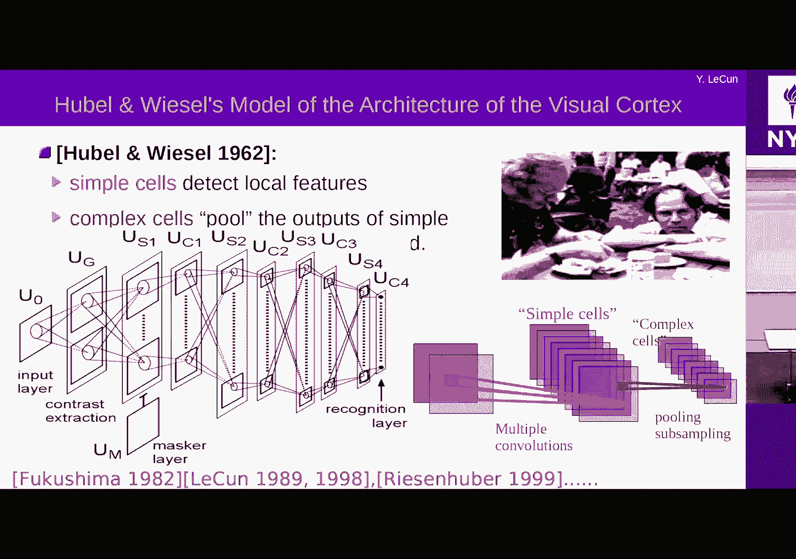

由于某种原因也没有使用背景等于此H max，这是我当时使用商业网进行的早期实验。

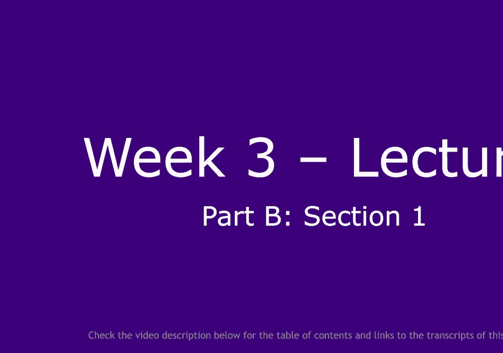

这是我当时使用商业网进行的早期实验，1988年在多伦多大学完成我的博士后工作，1988年在多伦多大学完成我的博士后工作，时间，我试图弄清楚您是否知道这种方法在小型机上效果更好，时间。

我试图弄清楚您是否知道这种方法在小型机上效果更好，数据集，因此，如果您有少量数据，则尝试完全连接到，数据集，因此，如果您有少量数据，则尝试完全连接到，仅有一层的网络或线性网络或具有本地连接的网络。

仅有一层的网络或线性网络或具有本地连接的网络，没有阴影，或者将其与尚未完成的内容进行比较，没有阴影，或者将其与尚未完成的内容进行比较，在您共享权重和本地连接的地方，哪一个最有效。

在您共享权重和本地连接的地方，哪一个最有效，事实证明，就泛化能力而言，事实证明，就泛化能力而言，左下角的曲线在这里您看到的是顶部上半曲线，左下角的曲线在这里您看到的是顶部上半曲线。

基本上是用非常简单的方法训练的婴儿卷积网络架构，基本上是用非常简单的方法训练的婴儿卷积网络架构，我们没有鼠标右键绘制的手写数字数据集，我们没有鼠标右键绘制的手写数字数据集，基本上任何时候收集图像的方式。

然后，基本上任何时候收集图像的方式，然后，没有权重的连接，您难道不知道它的工作情况更糟吗？没有权重的连接，您难道不知道它的工作情况更糟吗？然后，如果您拥有完全连接的网络，那么效果会更糟，如果，然后。

如果您拥有完全连接的网络，那么效果会更糟，如果，线性网络不仅效果更差，而且在火车上过分撞击，线性网络不仅效果更差，而且在火车上过分撞击，所以测试错误过了一会儿就下降了，这是由320 320训练的。

所以测试错误过了一会儿就下降了，这是由320 320训练的，训练样本是真实的，所有这些网络都会在，训练样本是真实的，所有这些网络都会在，五千个连接的顺序1000个参数，所以您知道十亿。

五千个连接的顺序1000个参数，所以您知道十亿，比今天小一百万倍我会说，然后我，比今天小一百万倍我会说，然后我，认为我的博士后我去过贝尔实验室和贝尔实验室，如果您知道稍大一点。

认为我的博士后我去过贝尔实验室和贝尔实验室，如果您知道稍大一点，计算机，但它们是邮政服务局提供的数据集，计算机，但它们是邮政服务局提供的数据集，他们有信封的邮政编码。

我们根据这些邮政编码建立了一个数据集，他们有信封的邮政编码，我们根据这些邮政编码建立了一个数据集，然后尝试稍大一点的神经网络三个星期，然后尝试稍大一点的神经网络三个星期，真正的结果。

所以这个委员会没有单独的委员会，真正的结果，所以这个委员会没有单独的委员会，并汇集了它跨越了委员会，所以系数在哪里，并汇集了它跨越了委员会，所以系数在哪里，窗口移动了一个以上的像素，所以这就是结果。

窗口移动了一个以上的像素，所以这就是结果，其结果是，当您进行合成时，输出图，其结果是，当您进行合成时，输出图，步幅大于一个，您会得到分辨率较小的输出，步幅大于一个，您会得到分辨率较小的输出，而不是输入。

您会在此处看到一个示例，因此这里的输入是16 x 16，而不是输入，您会在此处看到一个示例，因此这里的输入是16 x 16，我们可以负担得起的像素是5×5，但它们已移动，我们可以负担得起的像素是5×5。

但它们已移动，每次2像素，因此这里的输出较小，因为，每次2像素，因此这里的输出较小，因为，那，好的，然后当您稍后，这就是下一代，好的，然后当您稍后，这就是下一代，一个人有单独的商业广告和拉动广告。

那么那边的高级业务在哪里，一个人有单独的商业广告和拉动广告，那么那边的高级业务在哪里，当时的繁殖操作只是另一个神经元，除了，当时的繁殖操作只是另一个神经元，除了，该神经元的重量相等。

所以基本上需要一个推杆单元，该神经元的重量相等，所以基本上需要一个推杆单元，计算出其输入的平均值，然后削减，我做了一个偏见，然后，计算出其输入的平均值，然后削减，我做了一个偏见，然后，将其传递给非线性。

在这种情况下为双曲线正切，将其传递给非线性，在这种情况下为双曲线正切，函数很好，所有非线性都在该网络中，双曲线正切，函数很好，所有非线性都在该网络中，双曲线正切，那时人们正在做，而印刷操作是。

那时人们正在做，而印刷操作是，通过移动您在其中计算汇总的窗口来执行，通过移动您在其中计算汇总的窗口来执行，IP到上一层2像素就好，所以在这里您得到32 x 32，IP到上一层2像素就好。

所以在这里您得到32 x 32，输入输入窗口将其与505的滤镜卷积，是的，我应该，输入输入窗口将其与505的滤镜卷积，是的，我应该，提到组合内核有时也称为过滤器，因此，提到组合内核有时也称为过滤器。

因此，您得到的是输出，我猜负4是28 x 28好的，然后，您得到的是输出，我猜负4是28 x 28好的，然后，有一个池在这里计算2x2窗口的平均像素，有一个池在这里计算2x2窗口的平均像素。

然后将该窗口移动2倍，因此自，然后将该窗口移动2倍，因此自，图像是28 x 28，你用2除以14是14，好，所以这些图像是14，图像是28 x 28，你用2除以14是14，好，所以这些图像是14。

可以放大14像素，基本上是以前的一半，可以放大14像素，基本上是以前的一半，窗口，因为这个大步好吧，现在变得有趣，因为您，窗口，因为这个大步好吧，现在变得有趣，因为您，您想要的是下一层从。

您想要的是下一层从，上一层，所以执行此操作的方法是使用不同的完成过滤条件，上一层，所以执行此操作的方法是使用不同的完成过滤条件，将其应用于每个要素图，然后将它们汇总即可发送结果，将其应用于每个要素图。

然后将它们汇总即可发送结果，这些完全完成的结果，您通过非线性传递结果，这些完全完成的结果，您通过非线性传递结果，为您提供了下一层的特征图，因此，因为这些滤镜为5x5，为您提供了下一层的特征图，因此。

因为这些滤镜为5x5，那些图像是14 x 14那些家伙是10 x 10可以，那些图像是14 x 14那些家伙是10 x 10可以，具有边界效果，因此每个这些特征图都有16个，具有边界效果。

因此每个这些特征图都有16个，如果我记得正确使用了一组不同的内核来卷积前一个，如果我记得正确使用了一组不同的内核来卷积前一个，图层实际上是要素地图之间的连接模式，图层实际上是要素地图之间的连接模式。

这样，将来的包装器就在将来的映射器上，下一层实际上是，这样，将来的包装器就在将来的映射器上，下一层实际上是，不完整，因此并非每个与每个特征图相连的特征掩码都是，不完整。

因此并非每个与每个特征图相连的特征掩码都是，的特征图的不同组合的特定方案，的特征图的不同组合的特定方案，上一层的形成结合了两个以供将来的母版使用下一层和。

上一层的形成结合了两个以供将来的母版使用下一层和，这样做的原因仅仅是为了节省我们负担不起的计算机时间，这样做的原因仅仅是为了节省我们负担不起的计算机时间，将一切连接到原本需要花费两倍时间才能完成的一切。

将一切连接到原本需要花费两倍时间才能完成的一切，如今跑了更多的时间或多或少被迫实际上有一个，如今跑了更多的时间或多或少被迫实际上有一个，商业网中要素图之间的完全连接，因为，商业网中要素图之间的完全连接。

因为，在GPU中实施了多个竞赛，在GPU中实施了多个竞赛，这是可悲的，然后下一层，所以那些地图又是十乘十，这是可悲的，然后下一层，所以那些地图又是十乘十，要素地图是十乘十，而下一层又是通过放置。

要素地图是十乘十，而下一层又是通过放置，二次采样的二分之一，所以是五个，二次采样的二分之一，所以是五个，哦五好吧，然后这里又有一个五哦五比赛，哦五好吧，然后这里又有一个五哦五比赛。

您不能将窗口移到我们图片的五分之五。您不能将窗口移到我们图片的五分之五。完整的连接，但这实际上是卷积，可以记住这一点，但是，完整的连接，但这实际上是卷积，可以记住这一点，但是。

您基本上只有一个位置就可以了，顶部的那些功能图，您基本上只有一个位置就可以了，顶部的那些功能图，这是真正的输出，所以您有一个空间还可以，这是真正的输出，所以您有一个空间还可以。

因为您希望只能在一个光纤5图像中放置一个光纤五窗口，因为您希望只能在一个光纤5图像中放置一个光纤五窗口，并且您有10个匹配的特征，每个特征对应一个，并且您有10个匹配的特征，每个特征对应一个。

训练系统对您参加的0到9的数字进行分类时分类，训练系统对您参加的0到9的数字进行分类时分类，类别这是我从aundrea Kapiti借来的一个小动画。

类别这是我从aundrea Kapiti借来的一个小动画，花了一些时间来制作这个非常好的真实动画，这是两个，花了一些时间来制作这个非常好的真实动画，这是两个，可以正确表示或具有多个组合。

因此您具有三个特征垫，可以正确表示或具有多个组合，因此您具有三个特征垫，在此处输入，您有6个完成内核和功能图，在此处输入，您有6个完成内核和功能图，在输出上，因此这里的第一组三个特征垫与，在输出上。

因此这里的第一组三个特征垫与，三个输入功能涉及三个内核的三个输入，三个输入功能涉及三个内核的三个输入，映射以生成第一组，两个要素中的第一个以绿色填充，映射以生成第一组，两个要素中的第一个以绿色填充。

一个在顶部，然后动画开始，所以这是第一个，一个在顶部，然后动画开始，所以这是第一个，三个考纳斯小组与未来的垫子卷积，他们生产了，三个考纳斯小组与未来的垫子卷积，他们生产了，顶部的绿色地图。

然后切换到联盟的第二组，顶部的绿色地图，然后切换到联盟的第二组，您已经将两个输入要素图进行卷积以生成，您已经将两个输入要素图进行卷积以生成，底部的地图，确定，如果我在，底部的地图，确定，如果我在。

输入并关注输出和结束时间以及合成内核，输入并关注输出和结束时间以及合成内核，得到所有组合，我很久以前制作的动画的展示，我很久以前制作的动画的展示，在动作训练中试图识别数字，所以这是什么。

在动作训练中试图识别数字，所以这是什么，有趣的是，您在这里输入的是32，有趣的是，您在这里输入的是32，行乘64列，并用六个转换内核进行六次合成后，行乘64列，并用六个转换内核进行六次合成后。

偏斜后通过双曲线切线非线性传递它，偏斜后通过双曲线切线非线性传递它，此处有62张地图，每种地图针对不同类型的地图激活，此处有62张地图，每种地图针对不同类型的地图激活，特征，例如，当有，特征，例如。

当有，某种水平边缘，只要有一个，某种水平边缘，只要有一个，垂直边缘还可以，那些系数内核一直在学习，垂直边缘还可以，那些系数内核一直在学习，弹出的东西一直只是用背部道具训练，没有它用手说。

弹出的东西一直只是用背部道具训练，没有它用手说，他们说您通常是随机认识的，所以您会看到这种方差相等的概念，他们说您通常是随机认识的，所以您会看到这种方差相等的概念，在这里，如果我移动输入图像。

老师席上的激活会移动，在这里，如果我移动输入图像，老师席上的激活会移动，否则保持不变，那是50倍方差还可以，否则保持不变，那是50倍方差还可以，然后我们去进行繁殖操作，所以这里的第一个特征垫。

然后我们去进行繁殖操作，所以这里的第一个特征垫，对应于将第一个，第二个的合并版本放入，对应于将第一个，第二个的合并版本放入，到第二个三分之一转到第三个，到第二个三分之一转到第三个，再次是一个平均值。

那么它是一个类似的非线性，所以如果这，再次是一个平均值，那么它是一个类似的非线性，所以如果这，地图会移动一像素这个地图会移动一半像素，地图会移动一像素这个地图会移动一半像素，仍然有相等的方差。

但是您知道实际上您可以减少班次，仍然有相等的方差，但是您知道实际上您可以减少班次，您必须基本上可以，然后再进行第二阶段，您必须基本上可以，然后再进行第二阶段，这些垫子是对每个或部分子集进行卷积的结果。

这些垫子是对每个或部分子集进行卷积的结果，具有不同内核的先前映射总结了结果，具有不同内核的先前映射总结了结果，是乙状结肠，所以您在这里得到了那种抽象的特征，是乙状结肠，所以您在这里得到了那种抽象的特征。

你们当中的人很难在视觉上理解，但在两次转换中仍然相等，你们当中的人很难在视觉上理解，但在两次转换中仍然相等，好，然后再次进行证明和二次抽样，因此合并也有，好，然后再次进行证明和二次抽样，因此合并也有。

您知道这尝试了两倍的因数，所以您在这里得到的就是地图，您知道这尝试了两倍的因数，所以您在这里得到的就是地图，如果输入是一个像素就可以将那些映射移动四分之一像素。

如果输入是一个像素就可以将那些映射移动四分之一像素，因此，我们减少了变化，这变成了您可能会变得越来越容易，因此，我们减少了变化，这变成了您可能会变得越来越容易，接下来的几层来解释形状是什么，因为您交换。

接下来的几层来解释形状是什么，因为您交换，空间分辨率，以供将来使用类型分辨率时增加，空间分辨率，以供将来使用类型分辨率时增加，上层时，要素类型空间分辨率降低，因为，上层时，要素类型空间分辨率降低，因为。

修剪和二次采样，但Chitra Map的数量增加，因此，修剪和二次采样，但Chitra Map的数量增加，因此，您使表示更加抽象，但对，您使表示更加抽象，但对，移位和扭曲，下一层再次执行补全，但现在。

移位和扭曲，下一层再次执行补全，但现在，联合内核的大小等于图像的高度，所以您，联合内核的大小等于图像的高度，所以您，get是此特征图的一个波段，基本上它变成了一个，get是此特征图的一个波段。

基本上它变成了一个，尺寸，因此现在基本上消除了垂直偏移，尺寸，因此现在基本上消除了垂直偏移，转变成某种激活方式，但这不是转变，转变成某种激活方式，但这不是转变，再者，它是输入中某种更简单或更希望的转换。

再者，它是输入中某种更简单或更希望的转换，事实上，您可以证明它更简单，并且在某些方面可以使它变得更平坦，这就是。

事实上，您可以证明它更简单，并且在某些方面可以使它变得更平坦，这就是，我们拥有的体系结构有点一般性的条件，我们拥有的体系结构有点一般性的条件，您拥有某种形式的标准化批处理规范的更现代版本。

您拥有某种形式的标准化批处理规范的更现代版本，好的规范，如果您的kbank做到了这些都是，好的规范，如果您的kbank做到了这些都是，信号处理车辆滤波器组通常指向非线性。

信号处理车辆滤波器组通常指向非线性，值，然后在最常见的情况下通常最大程度地进行一些合并，值，然后在最常见的情况下通常最大程度地进行一些合并，称赞的实现当然会想象所有类型的。

称赞的实现当然会想象所有类型的，证明我说的是平均值，但更通用的版本是LP规范，证明我说的是平均值，但更通用的版本是LP规范，您知道将所有输入通过一个复杂的点然后，您知道将所有输入通过一个复杂的点然后。

一些力量，然后把你知道的总和，一些力量，然后把你知道的总和，将它们拿起来，然后将一点一点放在托盘上，将它们拿起来，然后将一点一点放在托盘上，是的，这应该是此处的根的总和，是的，这应该是此处的根的总和。

合并的另一种方式，您又知道任何修剪都会导致良好的修剪操作，合并的另一种方式，您又知道任何修剪都会导致良好的修剪操作，是对输入的a排列不变的操作，是对输入的a排列不变的操作，不管输入的顺序如何。

都可以得到相同的结果，不管输入的顺序如何，都可以得到相同的结果，这是我们在其中一个be log之前讨论此功能的另一个示例，这是我们在其中一个be log之前讨论此功能的另一个示例，e对X的一些输入。

指数DX又是一种对称聚合操作，指数DX又是一种对称聚合操作，可以使用，这样就可以完成一个阶段，然后您可以，可以使用，这样就可以完成一个阶段，然后您可以，重复这些定位规范化的各种方式。

重复这些定位规范化的各种方式，人们把它放在非线性之后，然后才知道它取决于池，人们把它放在非线性之后，然后才知道它取决于池，但是这很典型，所以如何在pi火炬传递中做到这一点，没有其他方法。

但是这很典型，所以如何在pi火炬传递中做到这一点，没有其他方法。

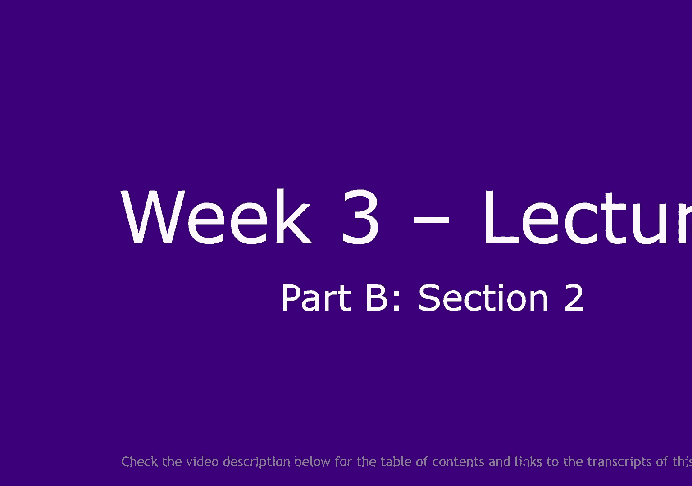

您可以通过明确地编写它来编写它来编写类，因此这是一个，您可以通过明确地编写它来编写它来编写类，因此这是一个，该类上的复合体的示例，当您这样做时，该类上的复合体的示例，当您这样做时。

完成值and和and Max完全可以，所以这里的构造函数创建，完成值and和and Max完全可以，所以这里的构造函数创建，联盟的联盟层中具有参数，而这一层具有，联盟的联盟层中具有参数，而这一层具有。

所谓的三层连通层我讨厌那样，所以有这个想法，所谓的三层连通层我讨厌那样，所以有这个想法。

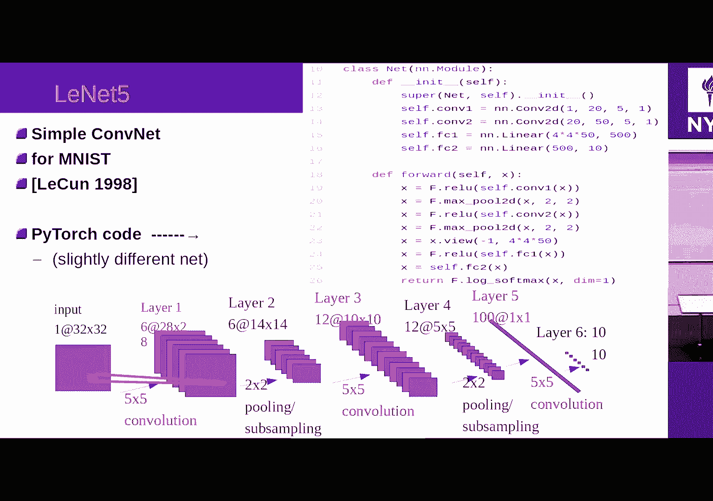

不知何故，像这样的卷积网的最后一层是。

不知何故，像这样的卷积网的最后一层是，完全连接，因为此层中的每个单元都连接到其中的每个单元，完全连接，因为此层中的每个单元都连接到其中的每个单元，该层，看起来像一个完整的连接，但实际上对，该层。

看起来像一个完整的连接，但实际上对，出于效率原因或某些原因，可以将其视为卷积，出于效率原因或某些原因，可以将其视为卷积，其他不好的原因，他们打电话给您，他们知道我们使用了漂亮的连接层，其他不好的原因。

他们打电话给您，他们知道我们使用了漂亮的连接层，类是线性的，但它打破了您的网络是一个，类是线性的，但它打破了您的网络是一个，有条件的网络，因此实际上最好将它们视为，有条件的网络。

因此实际上最好将它们视为，这种情况一个接一个的卷积，这有点奇怪，所以在这里，这种情况一个接一个的卷积，这有点奇怪，所以在这里，我们有四层-合成层和两层所谓的完全连接。

我们有四层-合成层和两层所谓的完全连接，层，然后我们需要在构造函数和，层，然后我们需要在构造函数和，我们在四遍中使用它们的方式是，您知道我们对，我们在四遍中使用它们的方式是，您知道我们对，输入。

然后应用该值，然后进行最大池化，然后运行，输入，然后应用该值，然后进行最大池化，然后运行，第二层并应用值并再次进行最大填充，然后我们，第二层并应用值并再次进行最大填充，然后我们，初始化输出。

因为它是一个漂亮的连接层，所以我们想，初始化输出，因为它是一个漂亮的连接层，所以我们想，将其设置为向量，以便在X视图中进行操作-然后执行一个值，将其设置为向量，以便在X视图中进行操作-然后执行一个值。

到它，你知道，这是第二个自由连接层，然后应用，到它，你知道，这是第二个自由连接层，然后应用，soft max，如果您想进行分类，那么这有点，soft max，如果您想进行分类，那么这有点。

类似于您在底部看到的架构，数字可能是，类似于您在底部看到的架构，数字可能是，在您了解要素地图和内容方面有所不同，但一般，在您了解要素地图和内容方面有所不同，但一般，架构就是我们正在谈论的内容，是的。

这又是您，架构就是我们正在谈论的内容，是的，这又是您，知道任何后代的繁殖决定我们可以看看他们，但是如果您训练有血统的，知道任何后代的繁殖决定我们可以看看他们，但是如果您训练有血统的，许多示例或自然图像。

例如过滤器，许多示例或自然图像，例如过滤器，第一层基本上将最终成为大部分定向的边缘检测器，第一层基本上将最终成为大部分定向的边缘检测器，类似于人-没有科学家在，类似于人-没有科学家在。

动物动物的个体交往，当您训练模型的全部时，它将改变，当您训练模型的全部时，它将改变，是的，这很简单，这是另一种定义这些的方法，这就是我，是的，这很简单，这是另一种定义这些的方法，这就是我。

猜想这是一种过时的方法，猜想这是一种过时的方法，不再有很多人这样做，但这只是一种简单的方式，不再有很多人这样做，但这只是一种简单的方式，邀请火炬中的类被调用，然后是顺序的，这基本上是一个。

邀请火炬中的类被调用，然后是顺序的，这基本上是一个，容器，然后继续将模块放入其中，它就会自动，容器，然后继续将模块放入其中，它就会自动，使用它们就像是按顺序连接一样，然后，使用它们就像是按顺序连接一样。

然后，您只需要打电话给您有关它的信息，它就可以了，您只需要打电话给您有关它的信息，它就可以了，只是以这种特殊形式计算正确的事物，在这里您可以通过，只是以这种特殊形式计算正确的事物，在这里您可以通过。

一堆对，就像一本字典，因此您可以为每个，一堆对，就像一本字典，因此您可以为每个，层，以后您可以访问它们，层，以后您可以访问它们，这是我们之前讨论的相同架构，是的，这是我们之前讨论的相同架构，是的。

背景是自动的，默认情况下您会自动调用它，背景是自动的，默认情况下您会自动调用它，它知道如何向后传播，很好的类将所有内容封装到您知道的对象中，很好的类将所有内容封装到您知道的对象中，你知道参数在哪里。

你有一种特殊的方式，你知道参数在哪里，你有一种特殊的方式，知道如何获取参数，并知道如何给它们喂狗，知道如何获取参数，并知道如何给它们喂狗，到优化器，因此优化器不需要知道您的网络，到优化器。

因此优化器不需要知道您的网络，看起来它只是知道有一个功能，并且有一堆，看起来它只是知道有一个功能，并且有一堆，参数，它会得到一个渐变，您知道它不需要知道什么，参数，它会得到一个渐变。

您知道它不需要知道什么，您的网络看起来像是的，您会，您将听到更多关于此的信息，您的网络看起来像是的，您会，您将听到更多关于此的信息，[音乐]明天还好，这是一个非常，[音乐]明天还好，这是一个非常。

国会网络有趣的方面，这是它们之所以如此的原因之一，国会网络有趣的方面，这是它们之所以如此的原因之一，在许多应用中它们如此成功的地方在于，如果，在许多应用中它们如此成功的地方在于，如果。

你们每个人都在商业网中作为惯例，所以没有酷，你们每个人都在商业网中作为惯例，所以没有酷，连接，可以说您不需要固定大小的输入即可，连接，可以说您不需要固定大小的输入即可，输入和网络的大小将相应地变化。

因为，输入和网络的大小将相应地变化，因为，当对图像应用卷积时，将其拟合为一定大小的图像，当对图像应用卷积时，将其拟合为一定大小的图像，你用内核做一个合成，你得到的图像的大小实际上就是你。

你用内核做一个合成，你得到的图像的大小实际上就是你，知道与输入的大小有关，但是您可以更改输入的大小，知道与输入的大小有关，但是您可以更改输入的大小，它只是改变输出的大小，这对于每个。

它只是改变输出的大小，这对于每个，对每个有条件的类似操作都进行大学培训，因此，如果您的网络是，对每个有条件的类似操作都进行大学培训，因此，如果您的网络是，仅由卷积组成，大小无关紧要，仅由卷积组成。

大小无关紧要，输入是要经过网络和每一层的大小，输入是要经过网络和每一层的大小，将根据输入的大小而变化，输出的总和将，将根据输入的大小而变化，输出的总和将，也会相应地更改，所以这里有一个小例子，您知道我。

也会相应地更改，所以这里有一个小例子，您知道我，想做草书手写识别，这很困难，因为我，想做草书手写识别，这很困难，因为我，不知道字母在哪里所以我不知道你只有一个字符。

不知道字母在哪里所以我不知道你只有一个字符，识别器，我的意思是系统将首先削减，识别器，我的意思是系统将首先削减，将单词分为两个字母R，然后将条件网应用于每个，将单词分为两个字母R。

然后将条件网应用于每个，字母，所以我能做的最好的就是将其取而代之，然后在，字母，所以我能做的最好的就是将其取而代之，然后在，输入，然后记录输出就可以了，所以您可以使用它来执行此操作，输入。

然后记录输出就可以了，所以您可以使用它来执行此操作，您将需要像这样的课程，因为它的窗口很大，您将需要像这样的课程，因为它的窗口很大，足以看到一个字符就可以了，然后拍摄输入图像并。

足以看到一个字符就可以了，然后拍摄输入图像并，您可以在每个位置计算您的神经网络，您可以在每个位置计算您的神经网络，将其移动一个像素或两个像素或四个像素或类似的东西。

将其移动一个像素或两个像素或四个像素或类似的东西，您知道足够少的像素，因此我们很少了解字符的位置，您知道足够少的像素，因此我们很少了解字符的位置，发生在输入中时，只要它习惯于，发生在输入中时。

只要它习惯于，认出一个，但事实证明那将是极其浪费的，因为您将，认出一个，但事实证明那将是极其浪费的，因为您将，多次参加同一个比赛，所以正确的方法是，多次参加同一个比赛，所以正确的方法是，做到这一点。

这很重要，要了解的是，你不做我做的事，做到这一点，这很重要，要了解的是，你不做我做的事，刚刚描述了您拥有适用于每个，刚刚描述了您拥有适用于每个，在窗口中，您要做的就是输入大量内容，然后将组合应用到。

在窗口中，您要做的就是输入大量内容，然后将组合应用到，输入图像，因为它越大，您将得到的输出越大，您就哭了，输入图像，因为它越大，您将得到的输出越大，您就哭了，第二层组成或池化无论您要得到什么。

第二层组成或池化无论您要得到什么，更大的输入再次一直到顶部，而在原始输入中，更大的输入再次一直到顶部，而在原始输入中，设计您现在仅获得一个输出，而现在您将获得多个输出，设计您现在仅获得一个输出。

而现在您将获得多个输出，因为您知道这是组成层，所以这非常重要，因为，因为您知道这是组成层，所以这非常重要，因为，这种使用带有滑动窗口的卷积网的方法要多得多，这种使用带有滑动窗口的卷积网的方法要多得多。

比在每个位置都重新计算商业方法便宜得多，比在每个位置都重新计算商业方法便宜得多，你不会，你不会相信说服人们花了数十年的时间，你不会，你不会相信说服人们花了数十年的时间，这是一件好事。

这是一个如何使用此示例的示例，这是常规示例，这是一个如何使用此示例的示例，这是常规示例，的网是由32到32的单个数字训练的，它正在尝试在列表上，的网是由32到32的单个数字训练的，它正在尝试在列表上。

好的32 x 32输入Windows，它已加载5，因此与，好的32 x 32输入Windows，它已加载5，因此与，架构我刚刚展示了可以接受的代码，架构我刚刚展示了可以接受的代码。

字符以仅将字符分类在图像的中心，并且，字符以仅将字符分类在图像的中心，并且，该方法试图说有一点数据增强，该方法试图说有一点数据增强，中心的角色在各种方面都有点偏移，中心的角色在各种方面都有点偏移。

位置已更改大小，然后您知道另外两个字符，位置已更改大小，然后您知道另外两个字符，那是要把它添加到一边，以使其在很多样本中都可以混淆，然后，那是要把它添加到一边，以使其在很多样本中都可以混淆，然后。

它也接受了第11类的训练，这不是以上所有的方法，它也接受了第11类的训练，这不是以上所有的方法，训练是在拍摄图像时拍摄空白图像，训练是在拍摄图像时拍摄空白图像，中心没有字符，我们的字符在一边，所以。

中心没有字符，我们的字符在一边，所以，它会检测何时介于两个字符之间，然后执行，它会检测何时介于两个字符之间，然后执行，你们都知道计算商业网络在，你们都知道计算商业网络在，输入，而无需实际移动商业网络。

而只是应用，输入，而无需实际移动商业网络，而只是应用，卷积到整个图像，这就是您得到的，因此在这里输入，卷积到整个图像，这就是您得到的，因此在这里输入，即使网络在32 x 32上使用。

即使网络在32 x 32上使用，这些生成的示例，您看到的是其中一些活动，这些生成的示例，您看到的是其中一些活动，这里的层并不是全部都代表了，您在顶部看到的是，这里的层并不是全部都代表了。

您在顶部看到的是，在这些有趣的形状中，您会看到三五到五的弹出，在这些有趣的形状中，您会看到三五到五的弹出，基本上是每个位置的获奖类别的奉献，基本上是每个位置的获奖类别的奉献，对。

所以您在顶部看到的8 8个输出基本上，对，所以您在顶部看到的8 8个输出基本上，将输出问题放到32 x 32输入窗口的八个不同位置，将输出问题放到32 x 32输入窗口的八个不同位置。

输入每次偏移4像素，这是什么，输入每次偏移4像素，这是什么，presentin是该窗口内的获胜类别，灰度表示，presentin是该窗口内的获胜类别，灰度表示，比分还好，所以您看到的是，您知道有两个。

比分还好，所以您看到的是，您知道有两个，检测器正在检测这五个，直到三种开始重叠并，检测器正在检测这五个，直到三种开始重叠并，然后有两个检测器正在检测三个这样的移动，因为您。

然后有两个检测器正在检测三个这样的移动，因为您，知道在32左32之内，我们将三个依附在32的左边，知道在32左32之内，我们将三个依附在32的左边，窗口，然后在其他32 x 32窗口的右侧移动4和。

窗口，然后在其他32 x 32窗口的右侧移动4和，因此，这两个检测器检测到3个或5个，那么您要做的就是，因此，这两个检测器检测到3个或5个，那么您要做的就是，所有这些得分都位于顶部。

您会进行一些后期处理，所有这些得分都位于顶部，您会进行一些后期处理，很简单，您会发现它是3和5，对此有趣的是，很简单，您会发现它是3和5，对此有趣的是，您不需要事先进行细分，您不需要事先进行细分。

在计算机视觉中必须要做的就是要识别物体，在计算机视觉中必须要做的就是要识别物体，必须将物体与背景分开，因为，必须将物体与背景分开，因为，系统，您知道我们被背景弄糊涂了，但是这里，系统。

您知道我们被背景弄糊涂了，但是这里，商业网，它已经过重叠字符训练，并且知道如何，商业网，它已经过重叠字符训练，并且知道如何，告诉他们，所以不会被重叠的字符所迷惑，告诉他们，所以不会被重叠的字符所迷惑。

那些动画在我的网站上有很多，那些动画在我的网站上有很多，九十年代初知道存在一个问题，这就是为什么，九十年代初知道存在一个问题，这就是为什么，您知道计算效果不佳是因为，您知道计算效果不佳是因为。

图一检测物体并识别物体的分离是相同的，图一检测物体并识别物体的分离是相同的，在分割之前，您无法识别该对象，但是您可以对其进行分割，直到，在分割之前，您无法识别该对象，但是您可以对其进行分割，直到。

你知道草书手写识别权是一样的，你知道草书手写识别权是一样的，你不能，这是我们有钢笔的例子，你不能，这是我们有钢笔的例子，看起来我们的笔不对哦，我们走了，这是真的，很抱歉，如果可以的话，我应该使用。

我们走了，这是真的，很抱歉，如果可以的话，我应该使用，哦，当然，好的，嘿，你们读得很好，我的意思是那是可怕的笔迹，嘿，你们读得很好，我的意思是那是可怕的笔迹，但这也是因为你知道我在屏幕上写东西好吗。

但这也是因为你知道我在屏幕上写东西好吗，阅读，最少，是的，好吧，您知道您可以在哪里将字母从该权利中分割出来，最少，是的，好吧，您知道您可以在哪里将字母从该权利中分割出来，意味着它是随机数量的波。

但是事实上，两只眼睛，意味着它是随机数量的波，但是事实上，两只眼睛，确定，那么至少在英语中基本上没有歧义，所以，确定，那么至少在英语中基本上没有歧义，所以，你的一个很好的例子知道你对单个对象的解释。

你的一个很好的例子知道你对单个对象的解释，知道根据他们的上下文和您需要的是某种高级，知道根据他们的上下文和您需要的是某种高级，语言模型，以了解如果您不懂英语或，语言模型，以了解如果您不懂英语或。

具有相同词的相似语言，您无法阅读，具有相同词的相似语言，您无法阅读，这个口语与此非常相似，所以我们所有人都有，这个口语与此非常相似，所以我们所有人都有，有学习外语的经验可能有经验。

有学习外语的经验可能有经验，你很难用一种新的语言来分割单词，然后，你很难用一种新的语言来分割单词，然后，识别单词是因为您没有正确的词汇，所以如果我说，识别单词是因为您没有正确的词汇，所以如果我说。

前面会看到您对手机的评论，无论何时需要，前面会看到您对手机的评论，无论何时需要，除非你会讲法语，否则我已经需要mo了，我说让我们专注于时态，除非你会讲法语，否则我已经需要mo了，我说让我们专注于时态。

它的单词，但您可以分辨出单词之间的边界，因为它是，它的单词，但您可以分辨出单词之间的边界，因为它是，基本上，您知道单词之间的癫痫发作，除非您知道，基本上，您知道单词之间的癫痫发作，除非您知道。

单词是预先正确的，所以这是您无法进行细分的程序，单词是预先正确的，所以这是您无法进行细分的程序，识别直到可以细分为止，直到您必须识别为止，识别直到可以细分为止，直到您必须识别为止，两者同时进行。

您就会知道早期的计算机视觉系统确实，两者同时进行，您就会知道早期的计算机视觉系统确实，真的很难做。

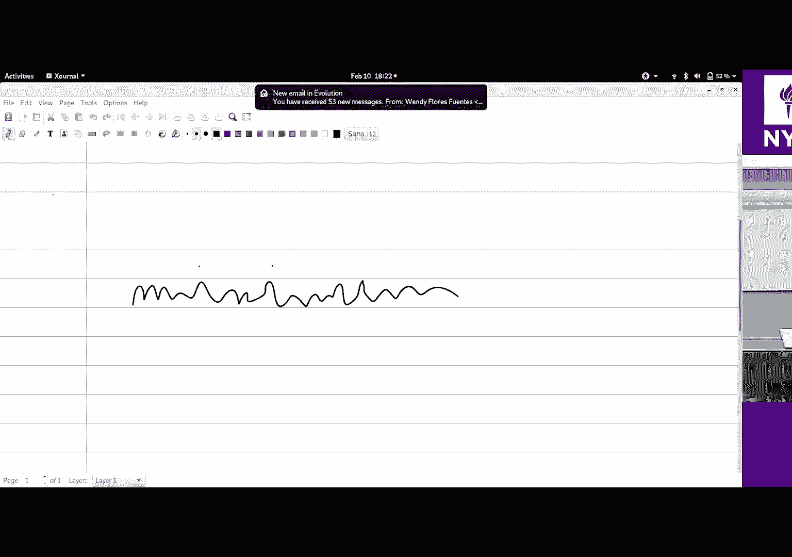

所以这就是为什么你知道这种东西是很大的进步的原因，因为，所以这就是为什么你知道这种东西是很大的进步的原因，因为，您不必事先进行细分，只需训练您的系统，您不必事先进行细分，只需训练您的系统。

对某种重叠的物体和诸如此类的东西具有较强的鲁棒性，对某种重叠的物体和诸如此类的东西具有较强的鲁棒性，返回是，这里有一个错误运行类，所以当您看到空白响应时，意味着，返回是，这里有一个错误运行类。

所以当您看到空白响应时，意味着，系统说上述基本都不对，因此经过培训可以，系统说上述基本都不对，因此经过培训可以，当输入为空白或有一个输入时，不会产生以上任何一个，当输入为空白或有一个输入时。

不会产生以上任何一个，您也知道中心以外或当您有两个角色时，您也知道中心以外或当您有两个角色时，字符，中间什么也没有，或者两个字符都没有，字符，中间什么也没有，或者两个字符都没有，重叠但没有中央字符。

所以您知道尝试，重叠但没有中央字符，所以您知道尝试，检测字符之间的边界，基本上这是另一个示例，因此，检测字符之间的边界，基本上这是另一个示例，因此，这是一个例子，说明即使是非常简单的广告，这是一个例子。

说明即使是非常简单的广告，净只有两个阶段，右联盟池强制池，然后两个，净只有两个阶段，右联盟池强制池，然后两个，您知道两层以后可以解决所谓的，您知道两层以后可以解决所谓的，未来的束带问题。

所以视觉神经科学家和计算机视觉，未来的束带问题，所以视觉神经科学家和计算机视觉，人们有这个问题，那是一个难题，我们怎么回事，人们有这个问题，那是一个难题，我们怎么回事，将对象视为对象。

您知道对象是功能的集合，但是，将对象视为对象，您知道对象是功能的集合，但是，我们如何将一个对象的所有特征绑定在一起以形成这个对象是，我们如何将一个对象的所有特征绑定在一起以形成这个对象是。

有某种神奇的方式做到这一点，他们知道吗，有某种神奇的方式做到这一点，他们知道吗，心理学家像你一样做实验，心理学家像你一样做实验，绘制它，然后再绘制，您将条形图视为单个条形图，因为，绘制它，然后再绘制。

您将条形图视为单个条形图，因为，您习惯于禁止被其他物体遮挡而被禁止，您习惯于禁止被其他物体遮挡而被禁止，所以你只是假设这是一个遮挡，然后有一些实验，所以你只是假设这是一个遮挡，然后有一些实验。

知道弄清楚我要把两个小节移到哪里，知道弄清楚我要把两个小节移到哪里，让我将它们视为两个独立的小节，但实际上您知道，让我将它们视为两个独立的小节，但实际上您知道，它们完美地对齐，如果您执行此操作。

则您知道与什么完全相同，它们完美地对齐，如果您执行此操作，则您知道与什么完全相同，您在这里看到了，但现在您将它们视为两个不同的对象，因此您，您在这里看到了，但现在您将它们视为两个不同的对象，因此您。

知道我们怎么做，我们似乎正在解决未来的粘接问题，知道我们怎么做，我们似乎正在解决未来的粘接问题，这表明您不需要任何特定的机制，这表明您不需要任何特定的机制，如果您具有足够的非线性并且您进行了足够的训练。

就会发生，如果您具有足够的非线性并且您进行了足够的训练，就会发生，数据，那么作为副作用，您可以获得解决未来绑定问题的系统，数据，那么作为副作用，您可以获得解决未来绑定问题的系统，问题没有任何特殊的机制。

所以在这里您有两种形状，问题没有任何特殊的机制，所以在这里您有两种形状，你移动一个，中风，你知道他从601到3到5，从1到7＆3等，中风，你知道他从601到3到5，从1到7＆3等，[音乐]，对的好问题。

所以问题是您如何区分两者，对的好问题，所以问题是您如何区分两者，在这种情况下，我们彼此相邻有两个5。在这种情况下，我们彼此相邻有两个5。单个战斗被两个不同的帧检测到，两个不同。

单个战斗被两个不同的帧检测到，两个不同，这五口井的构架中有此显式训练，因此当您，这五口井的构架中有此显式训练，因此当您，有两个感人的人物，但没有一个让你居中，有两个感人的人物，但没有一个让你居中。

训练系统说出上述任何一项都不是，所以总是这样，训练系统说出上述任何一项都不是，所以总是这样，你知道五个空白五个吗，它总是会像一个一样，你知道五个空白五个吗，它总是会像一个一样，空白的。

甚至那些可以很接近它，你会告诉你，空白的，甚至那些可以很接近它，你会告诉你，差异好吧，所以常见的东西对你有好处，所以你看的是这样，差异好吧，所以常见的东西对你有好处，所以你看的是这样。

现在你在这里是一个包括最后一层的卷积好吗，现在你在这里是一个包括最后一层的卷积好吗，看起来像一个完整的连接，因为第二层中的每个单元，看起来像一个完整的连接，因为第二层中的每个单元，进入输出。

但实际上这是一个卷积，恰好是，进入输出，但实际上这是一个卷积，恰好是，适用于单个位置，因此当我想到此故障位于顶部时，适用于单个位置，因此当我想到此故障位于顶部时，现在这是更大的好吧。

这代表现在这里的大小，现在这是更大的好吧，这代表现在这里的大小，内核是您之前在此处拥有的图像的大小，但现在是，内核是您之前在此处拥有的图像的大小，但现在是，有多个位置的卷积，所以您得到的是多个。

有多个位置的卷积，所以您得到的是多个，正确的输出是正确的，每个输出对应于您知道的，正确的输出是正确的，每个输出对应于您知道的，在我展示的示例中，输入窗口的大小是32 x 32，在我展示的示例中。

输入窗口的大小是32 x 32，而那些窗口以8个像素移动了8个像素，原因是，而那些窗口以8个像素移动了8个像素，原因是，我在这里展示的网络架构具有一种组合，然后尝试了一种。

我在这里展示的网络架构具有一种组合，然后尝试了一种，尝试组成的修剪尝试了一个布丁的修剪，尝试组成的修剪尝试了一个布丁的修剪，步幅是正确的，因此要获得新的输出，您需要移动输入，步幅是正确的。

因此要获得新的输出，您需要移动输入，由于工具放置，两个窗口可以得到其中之一，由于工具放置，两个窗口可以得到其中之一，层，也许我应该对此更加明确，层，也许我应该对此更加明确，画出一张更清晰的图片。

以便您输入如下内容，画出一张更清晰的图片，以便您输入如下内容，你并没有真正的补充，比如说三码的组合，是的，你并没有真正的补充，比如说三码的组合，是的，一个小行星，好吧，我不是，我不会画所有的。

那么你就玩了，一个小行星，好吧，我不是，我不会画所有的，那么你就玩了，带着感叹的声音-所以您停下来-而且您知道，让我们试试看-，带着感叹的声音-所以您停下来-而且您知道，让我们试试看-。

所以你塑造-没有重叠，好的，所以这里输入的是这个大小一二三四五五六七八，好的，所以这里输入的是这个大小一二三四五五六七八，因为组合的大小为三，所以这里得到的输出大小为六，因为组合的大小为三。

所以这里得到的输出大小为六，然后，当您知道用惠斯的二次采样进行拉动时，您会得到，然后，当您知道用惠斯的二次采样进行拉动时，您会得到，三个输出，因为您将输出除以两个就可以了，三个输出。

因为您将输出除以两个就可以了，我再添加一个，实际上是两个，所以现在的输出是10，我再添加一个，实际上是两个，所以现在的输出是10，这个家伙是八岁这个家伙是四岁我现在不能做认知了，也可以说。

这个家伙是八岁这个家伙是四岁我现在不能做认知了，也可以说，三个只有两个我只有两个输出，三个只有两个我只有两个输出，哎呀，嗯，不知道它不会画的方式不会画你的那个，哎呀，嗯。

不知道它不会画的方式不会画你的那个，有趣的啊哈，它不会对有趣的点击做出反应，它不会对有趣的点击做出反应，好的，确定发生了什么事，确定不是，好的，确定发生了什么事，确定不是，好的，我想它崩溃了，好的。

我想它崩溃了，那很烦人，是的，肯定崩溃了，当然你忘了，好吧，那么我们十岁了，是的，肯定崩溃了，当然你忘了，好吧，那么我们十岁了，八，因为与三的竞争，那么我们将尺寸二与，八，因为与三的竞争。

那么我们将尺寸二与，大步走，所以我们得到四个，然后我们与三个竞争，所以我们得到两个，大步走，所以我们得到四个，然后我们与三个竞争，所以我们得到两个，好吧，然后也许再叹一口气-所以直到我们得到一个好吧。

如此简单，好吧，然后也许再叹一口气-所以直到我们得到一个好吧，如此简单，十输入八四二，然后一个用于合并，这是条件三，十输入八四二，然后一个用于合并，这是条件三，你是对的，这是两个，那是三个，等等。

现在假设我添加，你是对的，这是两个，那是三个，等等，现在假设我添加，这里15个单位还可以，所以要添加四个单位，两个，这里15个单位还可以，所以要添加四个单位，两个，分钟在这里，[音乐]，是的。

这个像这样，这样的一个好四个，我得到另一个，是的，这个像这样，这样的一个好四个，我得到另一个，在这里好了，现在我只添加了四个四个输入，在这里好了，现在我只添加了四个四个输入，这里不是14我有两个输出。

为什么，因为我必须大步走，这里不是14我有两个输出，为什么，因为我必须大步走，-好的，所以从输入到输出的总二次采样率为4，所以为2，-好的，所以从输入到输出的总二次采样率为4，所以为2，乘以2乘以2。

所以现在是12，这是6，这是4，所以你知道，乘以2乘以2，所以现在是12，这是6，这是4，所以你知道，事实证明您知道您可以增加，事实证明您知道您可以增加，输入将增加每个图层的大小，如果您有一个包含。

输入将增加每个图层的大小，如果您有一个包含，大小1，它是一个合成层，其大小将是，大小1，它是一个合成层，其大小将是，增加是，像水平方向那样垂直改变字母的大小，是的，像水平方向那样垂直改变字母的大小。

是的，要如此，如果您希望系统具有这样的功能，则必须对其进行培训，要如此，如果您希望系统具有这样的功能，则必须对其进行培训，您必须使用多种尺寸的字符来训练它的多种尺寸。

您必须使用多种尺寸的字符来训练它的多种尺寸，如果您看到字符是，如果您看到字符是，归一化，这是第一件事，第二件事是凭经验简单的条件，归一化，这是第一件事，第二件事是凭经验简单的条件。

蚊帐只是不变的-叹息-在像您这样的罗杰斯维尔因素内，蚊帐只是不变的-叹息-在像您这样的罗杰斯维尔因素内，可以增加大约40％的尺寸，或者我意思是改变，可以增加大约40％的尺寸，或者我意思是改变。

大小大约是40％加上负20％-像这样的东西，大小大约是40％加上负20％-像这样的东西，除此之外，您知道您可能会遇到更多难于保持不变的情况，除此之外，您知道您可能会遇到更多难于保持不变的情况。

但是人们接受过训练，就像您知道输入一样，但是人们接受过训练，就像您知道输入一样，我的意思是物体的大小相差很大，所以处理这个问题的方法是，我的意思是物体的大小相差很大，所以处理这个问题的方法是。

想要处理可变大小是，如果您有图像并且不知道，想要处理可变大小是，如果您有图像并且不知道，您要在此图片上完成的尺寸是多少？您要在此图片上完成的尺寸是多少？那个图像，然后你花一秒钟，那个图像。

然后你花一秒钟，抵抗两倍以按比例缩放图像以运行相同的图像，抵抗两倍以按比例缩放图像以运行相同的图像，对该新图像进行条件处理，然后再将其缩小两倍，对该新图像进行条件处理，然后再将其缩小两倍。

并再次以该图像运行同一次国会，所以第一个，并再次以该图像运行同一次国会，所以第一个，这样我们就能够检测图像中的小物体，所以让我们，这样我们就能够检测图像中的小物体，所以让我们。

说您的网络已经过训练以检测大小不知道的物体20，说您的网络已经过训练以检测大小不知道的物体20，像人脸这样的像素，例如，有20个像素，它将检测人脸，像人脸这样的像素，例如，有20个像素，它将检测人脸。

在这张图片中大约有20个像素，然后当您通过，在这张图片中大约有20个像素，然后当您通过，系数为2，并且您应用相同的网络，它将检测到20个人脸，系数为2，并且您应用相同的网络，它将检测到20个人脸。

新图像中的像素，这意味着，新图像中的像素，这意味着，原始图片还可以，第一个网络不会看到，因为您知道，原始图片还可以，第一个网络不会看到，因为您知道，面部将大于其输入窗口，然后是下一个网络。

面部将大于其输入窗口，然后是下一个网络，会检测到80像素等的情况，因此通过组合分数，会检测到80像素等的情况，因此通过组合分数，从所有这些，并做一些所谓的最大抑制，你可以，从所有这些。

并做一些所谓的最大抑制，你可以，实际上对人们使用的对象进行检测和定位，实际上对人们使用的对象进行检测和定位，现在将要讨论的用于检测和定位的复杂技术，现在将要讨论的用于检测和定位的复杂技术，大约下周。

但这是基本想法，让我总结一下我们的殖民地，大约下周，但这是基本想法，让我总结一下我们的殖民地，对他们有好处，因为它们对以，对他们有好处，因为它们对以，多维权，但多维数组必须有两个，多维权。

但多维数组必须有两个，至少第一个特征是有很强的局部相关性，至少第一个特征是有很强的局部相关性，值之间的差异，因此，如果您拍摄图像，则随机图像在其中取两个像素，值之间的差异，因此，如果您拍摄图像。

则随机图像在其中取两个像素，图像您身体上有两个像素，这两个像素很可能具有，图像您身体上有两个像素，这两个像素很可能具有，可以使用类似的颜色拍摄此类图片，例如在，可以使用类似的颜色拍摄此类图片，例如在。

基本上是相同颜色的墙，看起来这里有很多物体，基本上是相同颜色的墙，看起来这里有很多物体，但可以为物体设置动画，但实际上从统计学上讲，大多数意味着您的邻居，但可以为物体设置动画，但实际上从统计学上讲。

大多数意味着您的邻居，像素与您从两个像素移动距离时的颜色基本相同，像素与您从两个像素移动距离时的颜色基本相同，距离，然后您计算具有相似像素的统计量是，距离，然后您计算具有相似像素的统计量是。

距离越来越少，所以这意味着，距离越来越少，所以这意味着，因为附近的像素可能具有相似的颜色，这意味着当您，因为附近的像素可能具有相似的颜色，这意味着当您，用一块像素说父亲五或八乘八或类似的类型。

用一块像素说父亲五或八乘八或类似的类型，您愿意观察的补丁很有可能会很顺利，您愿意观察的补丁很有可能会很顺利，变化的颜色或可能带有边缘，但在所有可能的组合中，变化的颜色或可能带有边缘。

但在所有可能的组合中，25像素，您在自然图像中实际观察到的像素很小，25像素，您在自然图像中实际观察到的像素很小，子集的意思是表示内容的优势，子集的意思是表示内容的优势。

该修补程序的向量可能小于25个值，这些值代表，该修补程序的向量可能小于25个值，这些值代表，该补丁的内容是否有边缘是否均匀，该补丁的内容是否有边缘是否均匀，你知道它是什么颜色，这基本上就是。

你知道它是什么颜色，这基本上就是，您完成的第一行的合成效果还不错，是的，您完成的第一行的合成效果还不错，是的，如果您具有局部相关性，则检测局部，如果您具有局部相关性，则检测局部。

我们在大脑中观察到的特征就是国会网，我们在大脑中观察到的特征就是国会网，如果您投放带有换向像素的商业广告，则会出现本地化的想法，如果您投放带有换向像素的商业广告，则会出现本地化的想法，即使识别图像。

也无法做好，即使识别图像，也无法做好，如果我们不关心连接，排列是固定的，如果我们不关心连接，排列是固定的，排列的第二个特征是，排列的第二个特征是，重要信息可能会出现在图像上的任何地方，因此才有理由分享。

重要信息可能会出现在图像上的任何地方，因此才有理由分享，权重好，相关性证明局部合理，权重好，相关性证明局部合理，与要素可以出现在统计信息中的任何地方有关的事实。

与要素可以出现在统计信息中的任何地方有关的事实，图像或信号均匀意味着您需要具有重复功能，图像或信号均匀意味着您需要具有重复功能，每个位置的探测器，这就是共享权重发挥作用的地方，每个位置的探测器。

这就是共享权重发挥作用的地方，它确实证明了布丁，因为布丁是您要保持不变，它确实证明了布丁，因为布丁是您要保持不变，这些特征的位置变化，因此，如果，这些特征的位置变化，因此，如果。

您尝试识别的对象不会因为某种原因而改变其性质，您尝试识别的对象不会因为某种原因而改变其性质，稍有扭曲，然后您要合并，所以人们是他对癌症的同志，所以人们是他对癌症的同志，实际上是相当不错的识别通讯单元。

使用了很多时间序列，实际上是相当不错的识别通讯单元，使用了很多时间序列，预测您知道类似的事情，并且您知道生物医学图像分析，所以如果，预测您知道类似的事情，并且您知道生物医学图像分析，所以如果。

您想知道要分析MRI，例如MRI或CT扫描是3d图像，您想知道要分析MRI，例如MRI或CT扫描是3d图像，人类之所以不能，是因为我们没有很好的可视化技术，人类之所以不能。

是因为我们没有很好的可视化技术，真的很担心，就像您知道了解一种3D值，但这是，真的很担心，就像您知道了解一种3D值，但这是，ComNet非常好，如果您制作了3D图像，ComNet非常好。

如果您制作了3D图像，它会处理它，这是一个很大的优势，因为您不必走，它会处理它，这是一个很大的优势，因为您不必走，通过切片找出图像中的对象，然后是最后一个，通过切片找出图像中的对象，然后是最后一个。

底部的东西我不知道你们是否知道高光谱图像在哪里，底部的东西我不知道你们是否知道高光谱图像在哪里，图像是如此的高光谱图像就是您几乎自然知道的图像，图像是如此的高光谱图像就是您几乎自然知道的图像。

彩色图像我的意思是您使用普通相机收集的图像，彩色图像我的意思是您使用普通相机收集的图像，三个颜色分量RGB，但我们可以构建具有更多光谱的相机，三个颜色分量RGB，但我们可以构建具有更多光谱的相机。

频段比这更重要，对于卫星成像来说尤其如此，频段比这更重要，对于卫星成像来说尤其如此，一些相机具有许多从红外到紫外的光谱带，一些相机具有许多从红外到紫外的光谱带。

这为您提供了有关每个像素中所见内容的许多信息，这为您提供了有关每个像素中所见内容的许多信息，我脑小的小动物发现更容易处理高光谱图像，我脑小的小动物发现更容易处理高光谱图像。

分辨率低而分辨率高的图像只有三种颜色，分辨率低而分辨率高的图像只有三种颜色，例子是虾的特别类型，他们有那些美丽的，例子是虾的特别类型，他们有那些美丽的，眼睛，它们有17个光谱带之类的东西，但是超低。

眼睛，它们有17个光谱带之类的东西，但是超低，分辨率，他们有一个很小的大脑来处理它，分辨率，他们有一个很小的大脑来处理它，好，今天是一个见到你。

