# 【NYU】纽约大学深度学习入门课程（with pytorch）中英文字幕 - P6：6. Week 3 – Practicum - Natural signals properties and CNNs - 大佬的迷弟的粉丝 - BV1o5411p7AB

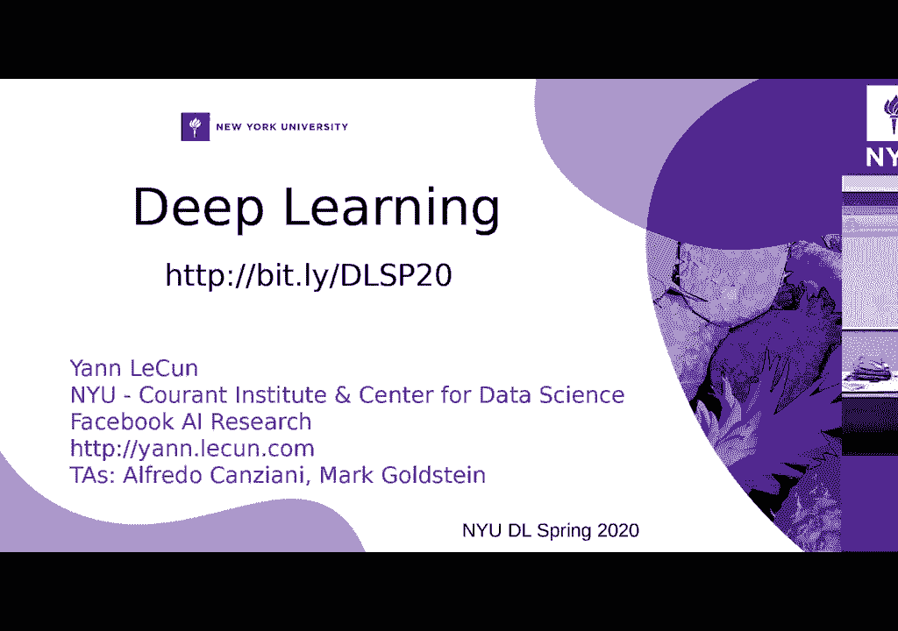

在您的网络上得出结论，我想今天我看到了基础，您知道我，在您的网络上得出结论，我想今天我看到了基础，您知道我。

在Twitter上发布好消息跟随我，我只是在开玩笑，所以再次，在Twitter上发布好消息跟随我，我只是在开玩笑，所以再次，任何时候你都不知道发生了什么事就阻止我问问题让我们问。

任何时候你都不知道发生了什么事就阻止我问问题让我们问，这些课程具有互动性，因此我可以尝试取悦您并提供，这些课程具有互动性，因此我可以尝试取悦您并提供，必要的信息，让您了解正在发生的事情，因此。

必要的信息，让您了解正在发生的事情，因此。

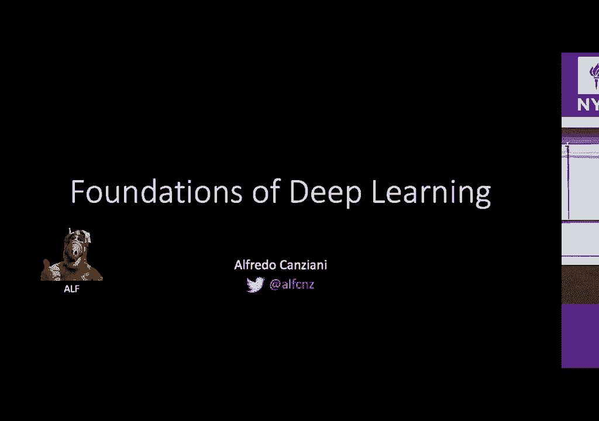

卷积神经网络这东西很酷。

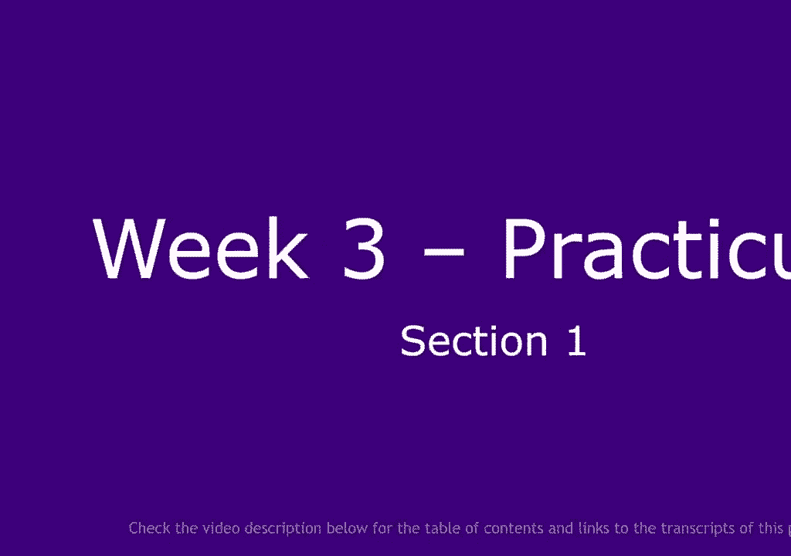

卷积神经网络这东西很酷，主要是因为在使用卷积网之前，主要是因为在使用卷积网之前，我们不能做太多，我们要弄清楚为什么现在为什么为什么为什么以及如何，我们不能做太多。

我们要弄清楚为什么现在为什么为什么为什么以及如何，这些网络是如此强大，它们将基本上使它们，这些网络是如此强大，它们将基本上使它们，正在像整个网络一样使用这些很大的块，正在像整个网络一样使用这些很大的块。

几天，更具体地说，我们会习惯于重复几次，几天，更具体地说，我们会习惯于重复几次，这三个词是理解卷积的关键词，但是我们，这三个词是理解卷积的关键词，但是我们，很快就会弄清楚，所以让我们开始吧，弄清楚如何。

很快就会弄清楚，所以让我们开始吧，弄清楚如何，这些信号这些图像和这些不同的项目看起来像这样，每当我们，这些信号这些图像和这些不同的项目看起来像这样，每当我们，谈论信号时，我们可以将其视为向量，例如。

谈论信号时，我们可以将其视为向量，例如，那里有一个代表单声道音频信号的信号，那里有一个代表单声道音频信号的信号，只是我们只有时间维度像信号一样进入，只是我们只有时间维度像信号一样进入，发生在一个维度上。

即时间维度，称为1d，发生在一个维度上，即时间维度，称为1d，信号，可以用奇异矢量表示，如上图所示，信号，可以用奇异矢量表示，如上图所示，该向量的每个值代表，该向量的每个值代表，波形的幅度，例如。

如果您只有一个符号，您将，波形的幅度，例如，如果您只有一个符号，您将，就像听到一些声音一样，如果你有不同的感觉，就像听到一些声音一样，如果你有不同的感觉，那种你知道这不只是一个标志，你会听到另一种。

那种你知道这不只是一个标志，你会听到另一种，另外，木材或声音的种类不同，另外，木材或声音的种类不同，您已经熟悉了声音的工作原理，所以现在我只是通过，您已经熟悉了声音的工作原理，所以现在我只是通过。

我的气管上有一些像膜一样的空气，我的气管上有一些像膜一样的空气，振动这些振动会通过空气传播，振动这些振动会通过空气传播，碰到你的耳朵和耳道，里面可能有一些小东西，碰到你的耳朵和耳道。

里面可能有一些小东西，正确的耳蜗，然后给出声音通过，正确的耳蜗，然后给出声音通过，耳蜗，您将要检测音高，然后添加不同的音高，耳蜗，您将要检测音高，然后添加不同的音高，您可以并且也喜欢其他类型的信息。

我想是演讲，您可以并且也喜欢其他类型的信息，我想是演讲，信息，然后弄清楚我在那儿发出的声音是什么，信息，然后弄清楚我在那儿发出的声音是什么，您可以使用自己的语言模型来重建自己的大脑。

您可以使用自己的语言模型来重建自己的大脑，如果您开始说另一种语言，那么云提到的是同一件事，那么您，如果您开始说另一种语言，那么云提到的是同一件事，那么您，因为您同时使用语音模型，所以将无法解析信息。

因为您同时使用语音模型，所以将无法解析信息，就像振动之间的转换，就像你知道你的大脑加上信号，就像振动之间的转换，就像你知道你的大脑加上信号，语言模型以便无论如何都可以说是一维信号。

语言模型以便无论如何都可以说是一维信号，我正在听音乐，所以在那里有什么信号，如果我听，我正在听音乐，所以在那里有什么信号，如果我听，音乐用户将成为立体声的凝视者，这意味着您。

音乐用户将成为立体声的凝视者，这意味着您，仍然会拥有两个频道的多少频道，仍然会拥有两个频道的多少频道，信号将是这个信号，虽然那里，信号将是这个信号，虽然那里，有两个渠道，所以无论有多少人高呼。

您都可以想一想，有两个渠道，所以无论有多少人高呼，您都可以想一想，频道，例如，如果您有杜比环绕声（Dolby Surround），您将拥有5。1这样的六个，频道，例如。

如果您有杜比环绕声（Dolby Surround），您将拥有5。1这样的六个，猜猜这就是你知道维多利亚信号的大小，猜猜这就是你知道维多利亚信号的大小，然后时间是唯一的变量，就像永远移动一样，所以。

然后时间是唯一的变量，就像永远移动一样，所以，那些是一维信号，所以让我们看一下吧，那些是一维信号，所以让我们看一下吧，所以我们有它的例子，例如在左侧，所以我们有它的例子，例如在左侧，就像正弦函数一样。

在您，就像正弦函数一样，在您，将会再次出现相同类型的功能，所以这是，将会再次出现相同类型的功能，所以这是，所谓的平稳性，你会一遍又一遍地看到，所谓的平稳性，你会一遍又一遍地看到。

时间维度上的模式类型还可以，所以，时间维度上的模式类型还可以，所以，这个信号是我们的自然信号，因为它发生在自然界中，这个信号是我们的自然信号，因为它发生在自然界中，我们说平稳，这是第一个，您如何看待。

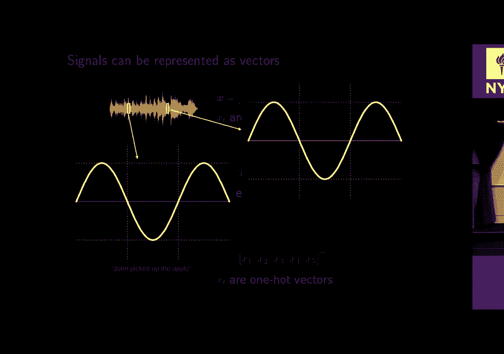

我们说平稳，这是第一个，您如何看待，可能是如果我左侧有一个峰也有一个峰，可能是如果我左侧有一个峰也有一个峰，附近，所以那里有一个高峰而不是那里有一个高峰的可能性是多少，附近。

所以那里有一个高峰而不是那里有一个高峰的可能性是多少，鉴于您之前或我继续前进时曾达到高峰，鉴于您之前或我继续前进时曾达到高峰，假设您有一个峰值，几秒钟后您知道峰值的可能性是多少，假设您有一个峰值。

几秒钟后您知道峰值的可能性是多少，峰值在左侧，所以应该有某种常识，峰值在左侧，所以应该有某种常识，众所周知，如果你们在一起很近，或者你们接近，众所周知，如果你们在一起很近，或者你们接近。

左侧是事情发生的可能性更大，左侧是事情发生的可能性更大，看起来很像，例如，您喜欢特定的声音，看起来很像，例如，您喜欢特定的声音，一种特定的形状，但是如果您离该形状稍远一点，一种特定的形状。

但是如果您离该形状稍远一点，声音，那么无论发生什么，这里都不再有关系，声音，那么无论发生什么，这里都不再有关系，因此，如果您计算信号之间的互相关，因此，如果您计算信号之间的互相关，而且本身。

您知道什么是互相关，如果您不知道的话，也会知道，而且本身，您知道什么是互相关，如果您不知道的话，也会知道，知道好吗，有多少人不知道，知道好吗，有多少人不知道，互相关好吧，那将是家庭作业，互相关好吧。

那将是家庭作业，对您来说，如果您只接受一个信号，只是一个信号音频信号，对您来说，如果您只接受一个信号，只是一个信号音频信号，他们会自行对信号进行卷积，他们会自行对信号进行卷积。

所以卷积将是你有自己的信号，你拿东西，所以卷积将是你有自己的信号，你拿东西，翻转它，然后越过它，然后相乘，翻转它，然后越过它，然后相乘，每当你要覆盖它们时，就像零时一样，每当你要覆盖它们时。

就像零时一样，错位，你会像尖峰，然后当你开始移动，错位，你会像尖峰，然后当你开始移动，你周围基本上会有两个癸烷面代表事实，你周围基本上会有两个癸烷面代表事实，事物有很多共同点，基本上就是点积运算。

事物有很多共同点，基本上就是点积运算，所以当它们非常接近一个特定的事物时有很多共同点，所以当它们非常接近一个特定的事物时有很多共同点，位置，如果您走得更远，事情就会开始平均，所以这里，位置。

如果您走得更远，事情就会开始平均，所以这里，这种自然信号的第二个特性是位置信息包含在，这种自然信号的第二个特性是位置信息包含在，在这种情况下，时域的特定部分和部分还可以，在这种情况下。

时域的特定部分和部分还可以，我们有平稳感，现在有本地性，好吧，不要祝福你，我们有平稳感，现在有本地性，好吧，不要祝福你，好吧，那怎么样呢，这与什么完全无关。

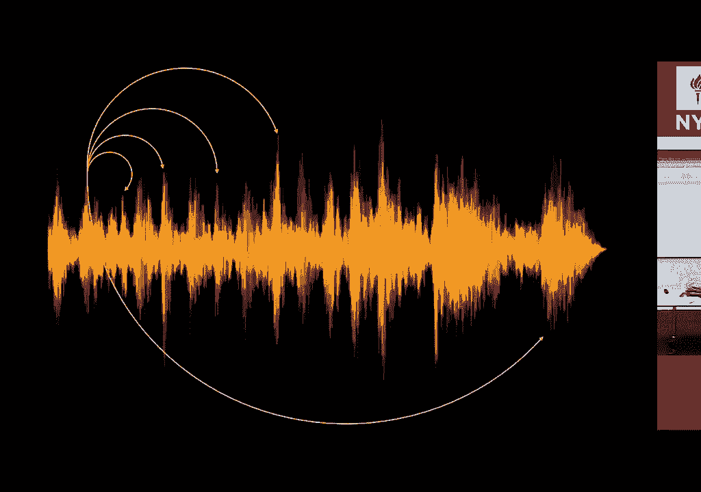

好吧，那怎么样呢，这与什么完全无关，发生在那边好吧，让我们看一下那只漂亮的小猫，发生在那边好吧，让我们看一下那只漂亮的小猫，什么样的尺寸什么样的尺寸，什么样的尺寸什么样的尺寸，你猜这是二维信号，为什么。

你猜这是二维信号，为什么，好吧，我们在这里还有一个三维信号选项，所以有人说两个，好吧，我们在这里还有一个三维信号选项，所以有人说两个，有人说三维，是二维，为什么对不起，有人说三维，是二维，为什么对不起。

噪音为什么是二维的，因为信息很抱歉信息是，噪音为什么是二维的，因为信息很抱歉信息是，特别是正确描绘的信息，因此信息基本上被编码为，特别是正确描绘的信息，因此信息基本上被编码为，这些点的空间位置。

尽管每个点都是，这些点的空间位置，尽管每个点都是，三个示例，或者如果是高光谱图像，则可以是多个平面，三个示例，或者如果是高光谱图像，则可以是多个平面，尽管如此，您仍然有两个方向可以移动点，尽管如此。

您仍然有两个方向可以移动点，对，厚度不会像，对，厚度不会像，给定的空间，所以给定的厚度，它不会正确改变，所以您可以，给定的空间，所以给定的厚度，它不会正确改变，所以您可以，尽可能多的人知道飞机。

但是信息基本上是，尽可能多的人知道飞机，但是信息基本上是，空间信息分布在整个平面上，所以它们是二维数据，空间信息分布在整个平面上，所以它们是二维数据，你也可以，好吧，我看到您的观点很像宽图像或灰度图像。

好吧，我看到您的观点很像宽图像或灰度图像，绝对是2d信号，也可以使用两个张量来表示，绝对是2d信号，也可以使用两个张量来表示，彩色图像具有RGB平面的尺寸，但厚度始终为三，彩色图像具有RGB平面的尺寸。

但厚度始终为三，不会改变，信息仍然分散在其他两个信息中，不会改变，信息仍然分散在其他两个信息中，尺寸，以便您可以更改彩色图像的尺寸，但不会更改，尺寸，以便您可以更改彩色图像的尺寸，但不会更改。

彩色图像的厚度，所以我们在这里讨论的是，彩色图像的厚度，所以我们在这里讨论的是，信号是信息基本上如何在周围传播，信号是信息基本上如何在周围传播，时间信息（如果有杜比环绕声）。

时间信息（如果有杜比环绕声），单声道单声道信号，或者您有立体声设备，随着时间的推移我们仍然拥有正确的声音，所以这是一个，单声道单声道信号，或者您有立体声设备，随着时间的推移我们仍然拥有正确的声音。

所以这是一个，二维图像是二维的，所以让我们看一下这只漂亮的小猫，二维图像是二维的，所以让我们看一下这只漂亮的小猫。

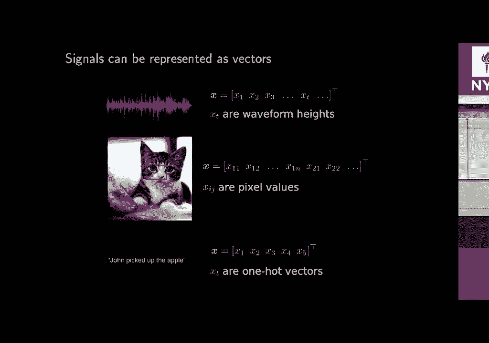

让我们专注于鼻子右边哦，天哪，这是一个怪物，让我们专注于鼻子右边哦，天哪，这是一个怪物，这里没有好的大生物，所以我们观察那里，这里没有好的大生物，所以我们观察那里，眼睛附近有某种黑暗的区域。

您可以观察到那种，眼睛附近有某种黑暗的区域，您可以观察到那种，模式出现在那边，那么自然信号的这个特性是什么，模式出现在那边，那么自然信号的这个特性是什么，告诉你两个属性，这是平稳的原因，告诉你两个属性。

这是平稳的原因，平稳性，因此相同的模式一遍又一遍地出现在，平稳性，因此相同的模式一遍又一遍地出现在，维，在这种情况下，维是二维，对不起，是什么，维，在这种情况下，维是二维，对不起，是什么。

假设瞳孔颜色为黑色，则，假设瞳孔颜色为黑色，则，箭头上的蜂窝状峰或峰顶上的湖泊的可能性，箭头上的蜂窝状峰或峰顶上的湖泊的可能性，箭头也是黑色的我会说这很有可能是正确的，因为它非常。

箭头也是黑色的我会说这很有可能是正确的，因为它非常，请关闭那一点，是的，如果我继续点击您，那不太可能，请关闭那一点，是的，如果我继续点击您，那不太可能，知道完全是明亮的，不，没有其他照片，所以。

知道完全是明亮的，不，没有其他照片，所以，您在空间维度上走得越远，获得的可能性就越小，您在空间维度上走得越远，获得的可能性就越小，您知道类似的信息，因此这称为位置信息，这意味着，您知道类似的信息。

因此这称为位置信息，这意味着，如果像信息一样的容器，则事物拥有的可能性更高，如果像信息一样的容器，则事物拥有的可能性更高，在特定区域中移动时，您会了解更多，在特定区域中移动时，您会了解更多，独立的好。

所以我们有两个属性第三个属性是，独立的好，所以我们有两个属性第三个属性是，以下是这是什么你饿了，以下是这是什么你饿了，所以你可以在这里看到一些甜甜圈，没有甜甜圈。所以你可以在这里看到一些甜甜圈。

没有甜甜圈。对，所以对您来说，戴眼镜的人之一，对，所以对您来说，戴眼镜的人之一，现在回答我的问题好吗[音乐]，现在回答我的问题好吗[音乐]，所以第三个属性是组合性等等，所以第三个属性是组合性等等。

组成性意味着这个词实际上是可以解释的，好吧，组成性意味着这个词实际上是可以解释的，好吧，享受的事情好吧，你必须回到我身边，我只是想让你，享受的事情好吧，你必须回到我身边，我只是想让你，生活。

[音乐]你好，好吧，那不是，[音乐]你好，好吧，那不是，戴眼镜问问戴眼镜的朋友，然后试戴好吧，现在不要，戴眼镜问问戴眼镜的朋友，然后试戴好吧，现在不要，如果不好的话就做吧，我只是在开玩笑，你可以着眼睛。

皇后不要，如果不好的话就做吧，我只是在开玩笑，你可以着眼睛，皇后不要，不要用其他人的眼镜好吗，是的，平稳性意味着您，不要用其他人的眼镜好吗，是的，平稳性意味着您，一遍又一遍地观察相同的模式。

您的数据局部性意味着，一遍又一遍地观察相同的模式，您的数据局部性意味着，该模式只是本地化的，因此您在此处有一些特定信息，该模式只是本地化的，因此您在此处有一些特定信息，这里的信息当您远离这一点时。

这里的信息，这里的信息当您远离这一点时，这里的信息，价值将几乎与这一点的价值无关，因此，价值将几乎与这一点的价值无关，因此，事情只在附近有关系，好吧，每个人都，事情只在附近有关系，好吧，每个人都。

现在试验斜眼，看着这张漂亮的照片好吧，这就是，现在试验斜眼，看着这张漂亮的照片好吧，这就是，第三部分是组成性，您可以在这里告诉您如何，第三部分是组成性，您可以在这里告诉您如何。

稍微模糊一下就可以看到东西，因为东西又是由，稍微模糊一下就可以看到东西，因为东西又是由，小零件，您实际上可以知道以这种方式组成事物，小零件，您实际上可以知道以这种方式组成事物。

这是自然信号的三个主要属性，它们使我们能够，这是自然信号的三个主要属性，它们使我们能够，被利用来让您知道我们的架构设计，被利用来让您知道我们的架构设计，实际上很容易提取具有这些属性的信息，所以我们。

实际上很容易提取具有这些属性的信息，所以我们，现在只讨论最终展现出这些特性的信号就可以了，现在只讨论最终展现出这些特性的信号就可以了，有最后一个我不说话，所以我们有最后一个。

有最后一个我不说话，所以我们有最后一个，约翰（John）的英语句子权利，约翰（John）的英语句子权利，无论如何，在这里您可以再次将每个单词表示为一个向量，无论如何。

在这里您可以再次将每个单词表示为一个向量，例如这些项目中的每一个都可以是一个对应的向量为1的向量，例如这些项目中的每一个都可以是一个对应的向量为1的向量，对应于该单词在字典中的位置的位置。

对应于该单词在字典中的位置的位置，好吧，如果您有10，000个单词的字典，则可以检查，好吧，如果您有10，000个单词的字典，则可以检查，是这本词典中的单词，您只需将页面加上任何内容。

是这本词典中的单词，您只需将页面加上任何内容，像您刚想到的数字那样，页面在字典中的位置，像您刚想到的数字那样，页面在字典中的位置，所以语言也具有附近的事物的那种属性，所以语言也具有附近的事物的那种属性。

你知道某种关系的事情不会少，除非你知道，你知道某种关系的事情不会少，除非你知道，相关的，然后类似的模式一遍又一遍地发生，相关的，然后类似的模式一遍又一遍地发生，用你知道的单词来造句来发表全文，最后。

用你知道的单词来造句来发表全文，最后，您的会议记录，我只是在开玩笑，好吧，所以我们已经，您的会议记录，我只是在开玩笑，好吧，所以我们已经，看过这个，所以我要走得很快，不应该有我，看过这个。

所以我要走得很快，不应该有我，思考问题，因为我们还在网站上写下了所有内容，思考问题，因为我们还在网站上写下了所有内容，正确，因此您可以随时在上查看上一课的摘要，正确，因此您可以随时在上查看上一课的摘要。

网站如此完整地连接在一起，因此这实际上可能是，网站如此完整地连接在一起，因此这实际上可能是，图这是我的XY在底部，低杠杆功能的甲板颜色是什么，认为还不错吧，低杠杆功能的甲板颜色是什么，认为还不错吧。

所以我们有一个箭头代表我是的，我觉得这是适当的名词，但我，所以我们有一个箭头代表我是的，我觉得这是适当的名词，但我，喜欢称他们为旋转，然后有一些挤压，喜欢称他们为旋转，然后有一些挤压，问题意味着非线性。

然后我有我的隐藏层，然后我有另一个，问题意味着非线性，然后我有我的隐藏层，然后我有另一个，旋转和最后的南瓜好吧，没必要，也许可以是线性的，旋转和最后的南瓜好吧，没必要，也许可以是线性的。

知道像线性线性函数那样的最终转换，知道像线性线性函数那样的最终转换，如果执行回归任务，则方程式正确，那些方程式，如果执行回归任务，则方程式正确，那些方程式，家伙可以是任何这些非线性函数甚至是线性函数。

家伙可以是任何这些非线性函数甚至是线性函数，对，如果您再次执行回归操作，那么您可以写下这些，对，如果您再次执行回归操作，那么您可以写下这些，我展开的图层，所以这个家伙，最下面的家伙实际上是一个向量。

我展开的图层，所以这个家伙，最下面的家伙实际上是一个向量，我只用一个极点代表向量G，我向大家展示所有，我只用一个极点代表向量G，我向大家展示所有，该向量的五个项目元素，所以第一层有X，然后。

该向量的五个项目元素，所以第一层有X，然后，具有第一隐藏第二隐藏第三击和最后一层，所以我们有，具有第一隐藏第二隐藏第三击和最后一层，所以我们有，多少层五个还可以，然后您也可以将它们称为激活层1。

多少层五个还可以，然后您也可以将它们称为激活层1，第2 3 4层随便什么，然后矩阵就是您存储自己的位置，第2 3 4层随便什么，然后矩阵就是您存储自己的位置，参数，您有那些不同的W，然后为了获得每个。

参数，您有那些不同的W，然后为了获得每个，重视您已经正确看过的东西，所以我走得更快，您执行的只是，重视您已经正确看过的东西，所以我走得更快，您执行的只是，标量产品。

这意味着您只需执行该操作即可获得所有这些权重，标量产品，这意味着您只需执行该操作即可获得所有这些权重，我将每个权重的输入相乘，然后继续这样，我将每个权重的输入相乘，然后继续这样。

然后将这些权重存储在这些矩阵中，依此类推，然后将这些权重存储在这些矩阵中，依此类推，有很多正确的箭头，无论我花了多少钱，有很多正确的箭头，无论我花了多少钱，花费很多时间进行绘制，这在计算上也非常昂贵。

花费很多时间进行绘制，这在计算上也非常昂贵，因为有很多计算，每个箭头代表一个权重，因为有很多计算，每个箭头代表一个权重，您必须将其乘以它自己的输入，以便我们现在可以做些什么，您必须将其乘以它自己的输入。

以便我们现在可以做些什么。

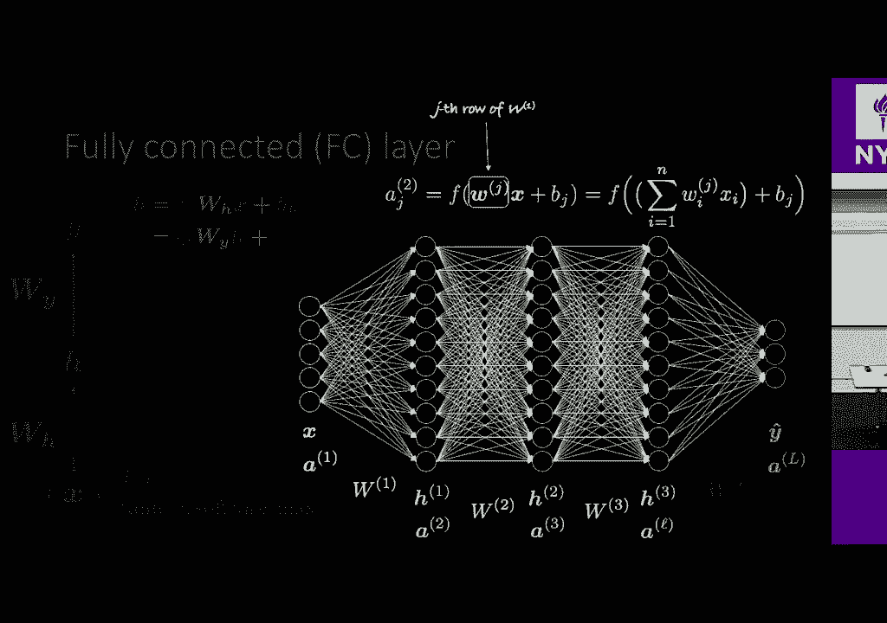

鉴于我们的信息具有本地性，我们的数据没有本地性，鉴于我们的信息具有本地性，我们的数据没有本地性。

是财产，如果我在这里有东西是什么意思，是财产，如果我在这里有东西是什么意思，我在乎这里发生了什么吗，所以你们中有些人只是在握手，我在乎这里发生了什么吗，所以你们中有些人只是在握手，其余的人有点不知所措。

我必须对您进行ping操作，其余的人有点不知所措，我必须对您进行ping操作，所以我们有地方性权利，所以事情只在您实际所在的特定区域，所以我们有地方性权利，所以事情只在您实际所在的特定区域。

关心远方看不好，关心远方看不好，所以我们简单地删除一些连接，所以我们从L层减去，所以我们简单地删除一些连接，所以我们从L层减去，通过使用第一个到L层，您知道五个十和十五右加，通过使用第一个到L层。

您知道五个十和十五右加，我这里有最后一个要从图层中添加十二个加一我有三个，我这里有最后一个要从图层中添加十二个加一我有三个，更正确，所以总共我们可以进行18次波计算，那么我们怎么样，更正确。

所以总共我们可以进行18次波计算，那么我们怎么样，丢掉我们不在乎的东西，比如说这个神经元，丢掉我们不在乎的东西，比如说这个神经元，也许为什么我们为什么要关心右下角的那些人，所以。

也许为什么我们为什么要关心右下角的那些人，所以，例如，我可以正确使用这三个权重，而我忘记了，例如，我可以正确使用这三个权重，而我忘记了，另外两个，然后我再次使用这三个波浪，我跳过了第一个和，另外两个。

然后我再次使用这三个波浪，我跳过了第一个和，最后等等，好吧，现在我们只有九个连接，最后等等，好吧，现在我们只有九个连接，九个乘法，最后三个，这样我们从左侧开始，九个乘法，最后三个，这样我们从左侧开始。

在右侧，我们爬升了层次结构，我们将拥有更大的，在右侧，我们爬升了层次结构，我们将拥有更大的，和更大的视野，所以尽管这些绿色的物体在这里看不到，和更大的视野，所以尽管这些绿色的物体在这里看不到。

整个输入就是您不断攀登您将能够看到的层次结构，整个输入就是您不断攀登您将能够看到的层次结构，输入权的整个范围，因此在这种情况下，我们将定义，输入权的整个范围，因此在这种情况下，我们将定义。

射频作为感受野，所以我的感受野从最后一个神经元到，射频作为感受野，所以我的感受野从最后一个神经元到，中层神经元是自由的，那么这将意味着最终，中层神经元是自由的，那么这将意味着最终。

神经元从上一层看到了三个神经元，那么接受力是什么，神经元从上一层看到了三个神经元，那么接受力是什么，相对于输入层的隐藏层的字段，答案是免费的，相对于输入层的隐藏层的字段，答案是免费的，是的。

但现在他们的化粪池领域是什么，是的，但现在他们的化粪池领域是什么，相对于输入层的输出层，相对于输入层的输出层，五对，这太棒了，好吧，所以现在整个架构，五对，这太棒了，好吧，所以现在整个架构。

看到整个输入，而每个子部分（如中间层）仅看到很小的部分，看到整个输入，而每个子部分（如中间层）仅看到很小的部分，地区，这非常好，因为您将节省计算量，地区，这非常好，因为您将节省计算量，不必要。

因为平均而言，他们没有任何信息，因此我们，不必要，因为平均而言，他们没有任何信息，因此我们，设法加快了您实际上可以在其中进行计算的计算速度，设法加快了您实际上可以在其中进行计算的计算速度，花费大量时间。

所以我们只能谈论稀疏性，因为，花费大量时间，所以我们只能谈论稀疏性，因为，假设我们的数据没有显示，我们的数据是否显示了本地性问题，假设我们的数据没有显示，我们的数据是否显示了本地性问题。

我可以使用稀疏性吗？我可以使用稀疏性吗？更多的东西，所以我们还说，这种自然信号是平稳的，因此，更多的东西，所以我们还说，这种自然信号是平稳的，因此，鉴于它们是静止的，一遍又一遍地出现，所以也许我们。

鉴于它们是静止的，一遍又一遍地出现，所以也许我们，不必再重新学习相同的东西，所以在，不必再重新学习相同的东西，所以在，在这种情况下，我们说了哦，我们将这两行删除了，所以我们如何使用，在这种情况下。

我们说了哦，我们将这两行删除了，所以我们如何使用，第一次连接时，您知道的斜连接会变成黄色，所以，第一次连接时，您知道的斜连接会变成黄色，所以，所有这些都是黄色，然后是橙色，最后一个是红色。

所有这些都是黄色，然后是橙色，最后一个是红色，对，所以我在这里有多少个砝码，然后我在这里九个对，对，所以我在这里有多少个砝码，然后我在这里九个对，在我们有15对之前，我们从15下降到3。

在我们有15对之前，我们从15下降到3，以及现在实际上怎么可能不起作用，因此我们必须稍作修复，但，以及现在实际上怎么可能不起作用，因此我们必须稍作修复，但，无论如何，当我训练网络时，我只需要训练三个。

无论如何，当我训练网络时，我只需要训练三个，权衡红色，对不起，黄色橙色，在租金中，权衡红色，对不起，黄色橙色，在租金中，实际上会变得更好，因为它只需要了解您，实际上会变得更好，因为它只需要了解您。

将有更多的信息，您将拥有更多的数据，因为您知道要训练那些，将有更多的信息，您将拥有更多的数据，因为您知道要训练那些，特定的重量，所以它们是那三种颜色，黄橙色和红色，特定的重量，所以它们是那三种颜色。

黄橙色和红色，被称为我的内核，所以我将它们存储到此处的向量中，被称为我的内核，所以我将它们存储到此处的向量中，因此，如果您谈论这些内容，他们就会知道卷积贴心性，因此，如果您谈论这些内容。

他们就会知道卷积贴心性，这些在这里的权重正好是我们正在使用的权重，这些在这里的权重正好是我们正在使用的权重，稀疏性然后使用参数共享参数共享意味着您使用，稀疏性然后使用参数共享参数共享意味着您使用。

在整个架构中，相同的参数会再次出现，在整个架构中，相同的参数会再次出现，以下是结合使用这两个方法的良好属性，因此参数共享，以下是结合使用这两个方法的良好属性，因此参数共享，我们可以更快地收敛。

因为您将有更多信息要使用，我们可以更快地收敛，因为您将有更多信息要使用，为了训练这些权重，您需要更好的概括性，因为您，为了训练这些权重，您需要更好的概括性，因为您，不必每次都学习某种特定类型的事情。

不必每次都学习某种特定类型的事情，在不同的地区，您只会学到有意义的东西，在不同的地区，您只会学到有意义的东西，您知道全球范围，那么我们也不受输入大小的限制，您知道全球范围，那么我们也不受输入大小的限制。

这是如此重要，雷也荣格昨天说了这件事三遍，为什么，这是如此重要，雷也荣格昨天说了这件事三遍，为什么，我们不限于输入大小，因为如果您在其他情况下，我们可以在此之前继续移入，因为如果您在其他情况下。

我们可以在此之前继续移入，有更多的神经元，在这种情况下，您必须学习新的知识，有更多的神经元，在这种情况下，您必须学习新的知识，添加更多的神经元，我继续在右边使用我的体重，这是，添加更多的神经元。

我继续在右边使用我的体重，这是，您知道的年轻要点在昨天特别强调了，您知道的年轻要点在昨天特别强调了，独立性，因此对于你们中的一个人，他们对优化很感兴趣，独立性，因此对于你们中的一个人。

他们对优化很感兴趣，像计算这样的优化非常酷，因为这个内核和另一个，像计算这样的优化非常酷，因为这个内核和另一个，曲线是完全独立的，所以您可以训练它们，您可以使瘫痪，曲线是完全独立的，所以您可以训练它们。

您可以使瘫痪，使事情变得更快，所以最后我们还有一些连接稀疏属性，使事情变得更快，所以最后我们还有一些连接稀疏属性，所以在这里我们减少了计算量，这也很好，所以在这里我们减少了计算量，这也很好。

所有这些特性使我们能够在很多方面训练该网络，所有这些特性使我们能够在很多方面训练该网络，数据，您仍然需要大量数据，但没有稀疏性，因此，数据，您仍然需要大量数据，但没有稀疏性，因此，没有稀疏性和参数共享。

您将无法实际，没有稀疏性和参数共享，您将无法实际，在合理的时间内完成了对该网络的培训，让我们来看看，在合理的时间内完成了对该网络的培训，让我们来看看，例如现在当您有多少个音频信号时，这是如何工作的。

例如现在当您有多少个音频信号时，这是如何工作的，维信号1维信号没问题，例如1d内核，维信号1维信号没问题，例如1d内核，右侧的数据，您可以再次看到我的神经元，我可以使用我的，右侧的数据。

您可以再次看到我的神经元，我可以使用我的，与这里的第一台扫描仪不同，所以我将内核存储在其中，与这里的第一台扫描仪不同，所以我将内核存储在其中，例如，该向量我可以右转第二个弯，所以现在我们有，例如。

该向量我可以右转第二个弯，所以现在我们有，两个内核，蓝色，紫色和粉红色，以及橙色和红色，所以我们说，两个内核，蓝色，紫色和粉红色，以及橙色和红色，所以我们说，我的输出是r2，所以这意味着每个气泡在这里。

我的输出是r2，所以这意味着每个气泡在这里，神经元实际上是正确地从板上出来的一两个，神经元实际上是正确地从板上出来的一两个，对，所以每个这些都有两个厚度，我们假设另一个，对，所以每个这些都有两个厚度。

我们假设另一个，这家伙的厚度是七对，这家伙的厚度是七对，他们从屏幕上走了出来，他们是七欧元，他们从屏幕上走了出来，他们是七欧元，这样，在这种情况下，我的内核的大小将是2乘7乘3，这样，在这种情况下。

我的内核的大小将是2乘7乘3，2表示我有两个内核，从7开始要给我3个输出，2表示我有两个内核，从7开始要给我3个输出，在我的床上，所以2表示您将我们的2放在这里，因为您有两个角，在我的床上。

所以2表示您将我们的2放在这里，因为您有两个角，因此，第一个内核将为您提供第一列的第一列，以及，因此，第一个内核将为您提供第一列的第一列，以及，第二个内核将给您第二列，然后它需要7。

第二个内核将给您第二列，然后它需要7，因为它需要匹配上一层的所有厚度，然后，因为它需要匹配上一层的所有厚度，然后，它有3个，因为有3个连接正确，所以也许我想念我，它有3个，因为有3个连接正确。

所以也许我想念我，考虑到我们的273表示，考虑到我们的273表示，您有两个内核，因此这里有两个项目，就像一个一个，您有两个内核，因此这里有两个项目，就像一个一个，每个列都有七个，因为每个列都有一个。

每个列都有七个，因为每个列都有一个，厚度为7，最后为3表示有3个连接，厚度为7，最后为3表示有3个连接，上一层正确，所以1数据使用3d内核好，所以如果我将此称为我的，上一层正确。

所以1数据使用3d内核好，所以如果我将此称为我的，卡罗琳（Carolyn）的集合，所以如果将其存储在张量中，卡罗琳（Carolyn）的集合，所以如果将其存储在张量中，张量将是三维张量，所以请问我是否要。

张量将是三维张量，所以请问我是否要，现在正在播放图像，您知道有多大的注意事项，现在正在播放图像，您知道有多大的注意事项，对于图像卷积网络形式，所以我们将有，对于图像卷积网络形式，所以我们将有，内核。

然后是厚度的数量，然后您将，内核，然后是厚度的数量，然后您将，在高度上有连接，在宽度上有连接，所以如果您，在高度上有连接，在宽度上有连接，所以如果您，将要检查当前的卷积内核，将要检查当前的卷积内核。

稍后在笔记本中，实际上您应该检查并找到，稍后在笔记本中，实际上您应该检查并找到，一样的尺寸好吧，到目前为止的问题很清楚，是的，很好，到目前为止的问题很清楚，是的，很好，问题如此折衷。

您知道这些卷积coevolution的大小，问题如此折衷，您知道这些卷积coevolution的大小，发生权正确吗，所以三乘三他似乎就像，发生权正确吗，所以三乘三他似乎就像，如果您真正关心空间信息。

例如Yun，如果您真正关心空间信息，例如Yun，指出您也可以一一使用卷积哦，对不起，一个像一个，指出您也可以一一使用卷积哦，对不起，一个像一个，卷积只有一个等待，或者如果您像在图像中那样使用，则有一个。

卷积只有一个等待，或者如果您像在图像中那样使用，则有一个，一个接一个的卷积用于最后一层，一个接一个的卷积用于最后一层，仍然是空间的我仍然可以将其应用于较大的输入图像。

仍然是空间的我仍然可以将其应用于较大的输入图像，现在我们只使用免费的内核，也许是五个，这是经验性的，所以，现在我们只使用免费的内核，也许是五个，这是经验性的，所以，并不是说我们没有魔幻公式。

而是我们一直在努力，并不是说我们没有魔幻公式，而是我们一直在努力，过去十年来弄清楚您知道什么是最好的超级，过去十年来弄清楚您知道什么是最好的超级，参数，以及是否检查每个字段（例如语音处理），参数。

以及是否检查每个字段（例如语音处理），视觉处理（例如图像处理），您将了解什么是，视觉处理（例如图像处理），您将了解什么是，对您的特定数据妥协是的，对您的特定数据妥协是的，第二个很好，这是一个很好的问题。

为什么所有这些数字为何Kernan具有，第二个很好，这是一个很好的问题，为什么所有这些数字为何Kernan具有，元素数量为奇数，因此，如果实际上元素数量为奇数，元素数量为奇数，因此。

如果实际上元素数量为奇数，如果您有偶数个元素，将有一个中心元素，如果您有偶数个元素，将有一个中心元素，那里我们会知道不会有中心价值，所以如果您再次感到奇怪，那里我们会知道不会有中心价值。

所以如果您再次感到奇怪，你知道从某个角度来看，你甚至会考虑，你知道从某个角度来看，你甚至会考虑，如果是偶数大小的内核，则左边项目数和右边项目数为偶数，如果是偶数大小的内核。

则左边项目数和右边项目数为偶数，你实际上不知道中心在哪里，中心将成为，你实际上不知道中心在哪里，中心将成为，两个相邻样本的平均值，实际上创建起来像一个低通滤波器，两个相邻样本的平均值。

实际上创建起来像一个低通滤波器，因此，即使是内核大小也通常不会，因此，即使是内核大小也通常不会，首选或不常用，因为它们暗示某种附加，首选或不常用，因为它们暗示某种附加，降低数据质量还可以。

所以我们还提到了另一件事，降低数据质量还可以，所以我们还提到了另一件事，昨天，如果它对，昨天，如果它对，最终结果使情况变得更糟，但是编程非常方便，最终结果使情况变得更糟，但是编程非常方便，一边。

所以如果我们有这样的话，当我们从，一边，所以如果我们有这样的话，当我们从，这层你最终会好起来，我们这里有多少个神经元，这层你最终会好起来，我们这里有多少个神经元，3，我们从文件开始。

所以如果我们使用3的卷积核，我们，3，我们从文件开始，所以如果我们使用3的卷积核，我们，如果您要使用卷积，则每侧会丢失多少个神经元，如果您要使用卷积，则每侧会丢失多少个神经元，大小为5的内核。

您将损失4个正确的大小，所以，大小为5的内核，您将损失4个正确的大小，所以，规则用户零填充，您必须在此处添加一个额外的神经元，规则用户零填充，您必须在此处添加一个额外的神经元，在这里。

所以您要对内核的边数做三减一，在这里，所以您要对内核的边数做三减一，除以二，然后在此处添加额外的任意数量的神经元，除以二，然后在此处添加额外的任意数量的神经元，您已将它们设置为零，Y设为零。

因为通常您的均值为零，您已将它们设置为零，Y设为零，因为通常您的均值为零，您的输入或通过使用一些归一化将每一层输出归零，您的输入或通过使用一些归一化将每一层输出归零，在这种情况下是三层。

是来自内核的大小，然后，在这种情况下是三层，是来自内核的大小，然后，播放一些动画，是的，你有一个额外的神经元，播放一些动画，是的，你有一个额外的神经元，在那里，然后我在那里有一个额外的你。

这样最后你最终得到，在那里，然后我在那里有一个额外的你，这样最后你最终得到，这些你知道那里有鬼神经元，但是现在你有相同数量的输入，这些你知道那里有鬼神经元，但是现在你有相同数量的输入，和相同数量的输出。

这非常方便，因为如果我们开始，和相同数量的输出，这非常方便，因为如果我们开始，我不知道64个神经元你进行卷积，你仍然有64个神经元，我不知道64个神经元你进行卷积，你仍然有64个神经元，因此。

您可以通过最多两个的池来使用它，最终将得到，因此，您可以通过最多两个的池来使用它，最终将得到，32年，否则您可以拥有这个，我不知道您是否认为我们拥有，32年，否则您可以拥有这个。

我不知道您是否认为我们拥有，正确的奇数，所以您不知道该怎么办，正确的奇数，所以您不知道该怎么办，好一点的笑声好吧，是的，你的大小都一样，所以，好一点的笑声好吧，是的，你的大小都一样，所以。

让我们看看您还有多少时间，还有一点时间，让我们看看，让我们看看您还有多少时间，还有一点时间，让我们看看，我们在实践中使用这个卷积网络，所以这就像理论，我们在实践中使用这个卷积网络，所以这就像理论。

在后面，我们已经说过我们可以使用卷积，所以这是一个卷积，在后面，我们已经说过我们可以使用卷积，所以这是一个卷积，运算符我什至没有定义什么是卷积我们只是说如果。

运算符我什至没有定义什么是卷积我们只是说如果，数据具有平稳性，实际上是组成成分，数据具有平稳性，实际上是组成成分，那么我们可以通过使用权重共享稀疏性来利用这一点，然后通过。

那么我们可以通过使用权重共享稀疏性来利用这一点，然后通过，堆叠该层中的几个层，您将拥有一种类似分层的方式，因此使用此方法，堆叠该层中的几个层，您将拥有一种类似分层的方式，因此使用此方法。

这种操作是一个卷积，我什至都没有定义它，我不在乎，这种操作是一个卷积，我什至都没有定义它，我不在乎，现在也许是下一堂课，所以这就像背后的理论，现在也许是下一堂课，所以这就像背后的理论。

现在我们将看到一些实用的知识，您将了解我们的建议，现在我们将看到一些实用的知识，您将了解我们的建议，实际上在实践中使用这些东西，所以接下来的事情我们就像一个标准，实际上在实践中使用这些东西。

所以接下来的事情我们就像一个标准，一个空间卷积网，它在操作哪种数据，一个空间卷积网，它在操作哪种数据，空间上的特殊之处在于，这是我的网络权利特殊之处，而不仅仅是在开玩笑，空间上的特殊之处在于。

这是我的网络权利特殊之处，而不仅仅是在开玩笑，您对空间的了解如此特别，所以在这种情况下，我们当然需要多层，您对空间的了解如此特别，所以在这种情况下，我们当然需要多层，我们贴了他们。

我们还谈到了为什么最好有几层，我们贴了他们，我们还谈到了为什么最好有几层，而不是有脂肪层，我们当然会有卷积，而不是有脂肪层，我们当然会有卷积，非线性，因为否则，下次还可以，我们将看看，非线性，因为否则。

下次还可以，我们将看看，卷积可以用矩阵实现，但是卷积只是，卷积可以用矩阵实现，但是卷积只是，线性运算符，带有多个零并且像相同的复本，线性运算符，带有多个零并且像相同的复本，权重，否则。

如果您不使用知识非线性，权重，否则，如果您不使用知识非线性，一个卷积的卷积将是一个卷积，所以我们必须清理，一个卷积的卷积将是一个卷积，所以我们必须清理，我们必须喜欢的东西放置了屏障强度，以避免崩溃。

我们必须喜欢的东西放置了屏障强度，以避免崩溃，在整个网络中，我们有一些池化运营商，在整个网络中，我们有一些池化运营商，乔佛里（Joffrey）说，那是你知道已经很糟糕的事情，但是你仍然知道。

乔佛里（Joffrey）说，那是你知道已经很糟糕的事情，但是你仍然知道，右戈弗里·欣顿（Geoffrey Hinton），右戈弗里·欣顿（Geoffrey Hinton），有一些东西，如果您不使用它。

您的网络将无法进行培训，因此，有一些东西，如果您不使用它，您的网络将无法进行培训，因此，我会用它，虽然我们不知道为什么会用，但我认为，我会用它，虽然我们不知道为什么会用，但我认为，是关于广场的问题。

我将在此处添加有关此批次的链接，是关于广场的问题，我将在此处添加有关此批次的链接，归一化也很年轻，将为所有归一化层着色，归一化也很年轻，将为所有归一化层着色，最后，我们还有一些最近的东西，称为残差或。

最后，我们还有一些最近的东西，称为残差或，旁路连接基本上就是这些额外的连接，它们使我，旁路连接基本上就是这些额外的连接，它们使我，要获取网络，您知道网络决定是否发送，要获取网络，您知道网络决定是否发送。

通过此行的信息，或者如果您进行堆叠则实际上将其转发，通过此行的信息，或者如果您进行堆叠则实际上将其转发，一层又一层的信号在经过一段时间后会丢失，一层又一层的信号在经过一段时间后会丢失，有时候。

如果您添加这些其他连接，您总会像一条路径，有时候，如果您添加这些其他连接，您总会像一条路径，为了从下到上再回到顶部，为了从下到上再回到顶部，梯度从上到下下降，这实际上是一个非常，梯度从上到下下降。

这实际上是一个非常，接收器连接和最佳归一化非常重要，接收器连接和最佳归一化非常重要，如果您不使用它们，对使该网络得到正确培训非常有帮助，如果您不使用它们，对使该网络得到正确培训非常有帮助。

那么要使这些网络真正为，那么要使这些网络真正为，训练部分，它是如何工作的，例如，这里有一张图片，训练部分，它是如何工作的，例如，这里有一张图片，大多数信息是空间信息，因此信息会传播。

大多数信息是空间信息，因此信息会传播，虽然有厚度，但我称其为厚度，虽然有厚度，但我称其为厚度，作为特征信息，这意味着它提供了相关信息，作为特征信息，这意味着它提供了相关信息，具体点。

所以这张图片中我的特征信息是什么，具体点，所以这张图片中我的特征信息是什么，使用RGB相位图像，这是一个彩色图像帧，因此我们可以充分利用，使用RGB相位图像，这是一个彩色图像帧，因此我们可以充分利用。

信息散布在特殊的空间信息上，例如您是否拥有我，信息散布在特殊的空间信息上，例如您是否拥有我，做鬼脸，但在每个点上，这都不是灰度图像，做鬼脸，但在每个点上，这都不是灰度图像，彩色图像。

所以每个点都会有一个附加信息，彩色图像，所以每个点都会有一个附加信息，我知道具体的特征信息在这种情况下是什么，我知道具体的特征信息在这种情况下是什么，代表RGB的三个值的向量是。

代表RGB的三个值的向量是，球，因为它们总体来说还可以，它代表的是什么强度，球，因为它们总体来说还可以，它代表的是什么强度，只要你知道用英语告诉我，没有奇怪的东西，像素的颜色，只要你知道用英语告诉我。

没有奇怪的东西，像素的颜色，是的，所以我的具体信息是我的性格是信息，是的，我不是，是的，所以我的具体信息是我的性格是信息，是的，我不是，知道您在说什么对不起，他们在这种情况下收集了此信息是。

知道您在说什么对不起，他们在这种情况下收集了此信息是，只是一种正确的颜色，所以颜色是那里唯一的信息，只是一种正确的颜色，所以颜色是那里唯一的信息，但是如果不这样，信息就会散布，就好像我们爬。

但是如果不这样，信息就会散布，就好像我们爬，您现在可以看到层次结构的最终向量，可以说我们正在做，您现在可以看到层次结构的最终向量，可以说我们正在做，在这种情况下分类，这样我就知道高度和宽度或东西。

在这种情况下分类，这样我就知道高度和宽度或东西，将一一对应，所以它只是一个向量，将一一对应，所以它只是一个向量，然后假设您有特定的最终logit，即，然后假设您有特定的最终logit，即。

最高的代表班级，最有可能是，最高的代表班级，最有可能是，如果它在中途训练得当，请更正，如果它在中途训练得当，请更正，知道空间信息之间的权衡，然后这些，知道空间信息之间的权衡，然后这些，特征信息好。

所以基本上就像是，特征信息好，所以基本上就像是，您将空间信息转化为特征信息，您将空间信息转化为特征信息，所以基本上是从事物输入数据到非常厚的事物，所以基本上是从事物输入数据到非常厚的事物。

则没有更多的空间信息，因此您可以在此处看到，则没有更多的空间信息，因此您可以在此处看到，我的忍者PowerPoint技能，如何使您知道减少的可用性，我的忍者PowerPoint技能。

如何使您知道减少的可用性，figner在我们的演示文稿中像一个较粗的人物，而您实际上却输，figner在我们的演示文稿中像一个较粗的人物，而您实际上却输，空间特别一好，所以又倒了一遍，空间特别一好。

所以又倒了一遍。

池只是简单地再次例如可以以这种方式执行，因此。

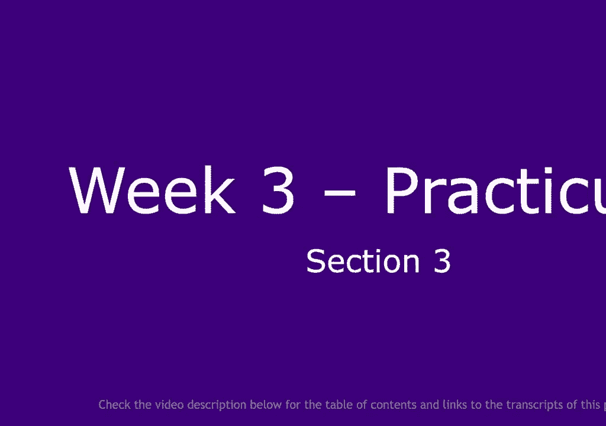

池只是简单地再次例如可以以这种方式执行，因此，你有一些手绘图，因为我不想做，你有时间做，你有一些手绘图，因为我不想做，你有时间做，它在乳胶中，因此您可以在不同的区域应用特定的运算符，它在乳胶中。

因此您可以在不同的区域应用特定的运算符，该特定区域，例如，您拥有P范数，然后是P，该特定区域，例如，您拥有P范数，然后是P，加上无限，你有最大，然后那个不给你一个价值，加上无限，你有最大。

然后那个不给你一个价值，对，然后您执行一个大步，谢谢，抱歉，跳转到Pyxis文件夹，然后，对，然后您执行一个大步，谢谢，抱歉，跳转到Pyxis文件夹，然后，您再次计算相同的东西。

在那里您将获得另一个价值，您再次计算相同的东西，在那里您将获得另一个价值，如此反复，直到最终得到以C通道为目标的n数据为止，如此反复，直到最终得到以C通道为目标的n数据为止，获得静止的C通道。

但是在这种情况下，您得到的是em和C，获得静止的C通道，但是在这种情况下，您得到的是em和C，好一半，这是图像，布尔值上没有参数，但是如何选择，布尔值上没有参数，但是如何选择。

我可以选择最大布丁平均数来拉任何布丁是错误的，所以，我可以选择最大布丁平均数来拉任何布丁是错误的，所以，是的，让我们也解决问题，所以这是我们幻灯片的重要部分，是的，让我们也解决问题。

所以这是我们幻灯片的重要部分，我会看到这次笔记本的速度会变慢，我会看到这次笔记本的速度会变慢，我有点着急的时间到目前为止，这部分是否还有任何问题，我们，我有点着急的时间到目前为止。

这部分是否还有任何问题，我们，是的，所以盖弗里·欣顿（Geoffrey Hinton）以说最大，是的，所以盖弗里·欣顿（Geoffrey Hinton）以说最大，沸腾是错误的，因为您只是丢弃信息。

沸腾是错误的，因为您只是丢弃信息，按您的平均水平或您的最高水平，您只是丢掉他一直在工作的东西，按您的平均水平或您的最高水平，您只是丢掉他一直在工作的东西，就像被称为“胶囊网络”的东西。

就像被称为“胶囊网络”的东西，选择的路由选择路径您知道一些更好的策略，以避免，选择的路由选择路径您知道一些更好的策略，以避免，就像丢掉信息一样，基本上这就是背后的论点，就像丢掉信息一样。

基本上这就是背后的论点，是的，所以使用此合并或跨步的主要目的实际上是，是的，所以使用此合并或跨步的主要目的实际上是，摆脱大量数据，以便您可以合理地计算事物，摆脱大量数据，以便您可以合理地计算事物。

通常您需要大量的时间或将其他第一层放在，通常您需要大量的时间或将其他第一层放在，底部，因为否则在计算上绝对不适合它，底部，因为否则在计算上绝对不适合它，昂贵的[音乐]，昂贵的[音乐]，玩家。

也喜欢那些脚踏实地的网络架构，玩家，也喜欢那些脚踏实地的网络架构，您所了解的最新技术完全是我们的经验基础，您所了解的最新技术完全是我们的经验基础，努力尝试，我们实际上去了。

我的意思是现在我们实际上到达了某种，努力尝试，我们实际上去了，我的意思是现在我们实际上到达了某种，标准，所以几年前我在回答，就像我不知道，但对，标准，所以几年前我在回答，就像我不知道，但对。

现在我们实际上已经确定了一些好的配置，尤其是使用，现在我们实际上已经确定了一些好的配置，尤其是使用，那些接收器连接以及我们实际上可以达到的最佳标准化，那些接收器连接以及我们实际上可以达到的最佳标准化。

基本上训练所有的东西，[音乐]，所以基本上您要在特定点上降低梯度，所以基本上您要在特定点上降低梯度，以及，然后您有另一个梯度下降，然后您有一个，以及，然后您有另一个梯度下降，然后您有一个，分支分支。

如果您有分支，那发生了什么事，分支分支，如果您有分支，那发生了什么事，是正确的渐变，是的，它们被正确添加了，所以您有两个，是正确的渐变，是的，它们被正确添加了，所以您有两个。

来自两个不同分支的渐变被加在一起，来自两个不同分支的渐变被加在一起，对，所以我们去笔记本电脑，这样我们就可以覆盖我们不着急的任何东西，对，所以我们去笔记本电脑，这样我们就可以覆盖我们不着急的任何东西。

所以在这里，我只是通过评论，所以这里我最初训练我加载，所以在这里，我只是通过评论，所以这里我最初训练我加载。

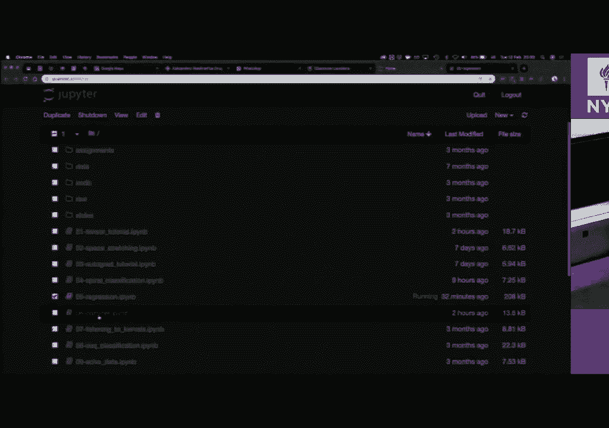

好的数据集，所以我在这里向您展示几个字符，我现在训练，好的数据集，所以我在这里向您展示几个字符，我现在训练。

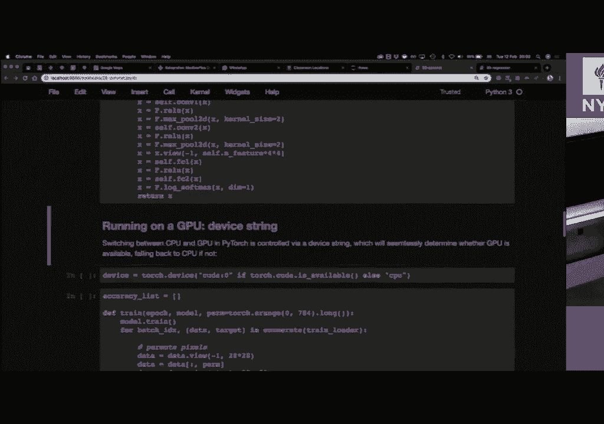

多层感知器，如完全连接的网络，如您所知的心情。

多层感知器，如完全连接的网络，如您所知的心情，是的，全连接网络和卷积神经网络具有，是的，全连接网络和卷积神经网络具有，参数数量相同，所以这两个模型的尺寸相同，参数数量相同，所以这两个模型的尺寸相同。

关于D如果您保存它们，我们将同样等待，因此我在这里进行培训，关于D如果您保存它们，我们将同样等待，因此我在这里进行培训。

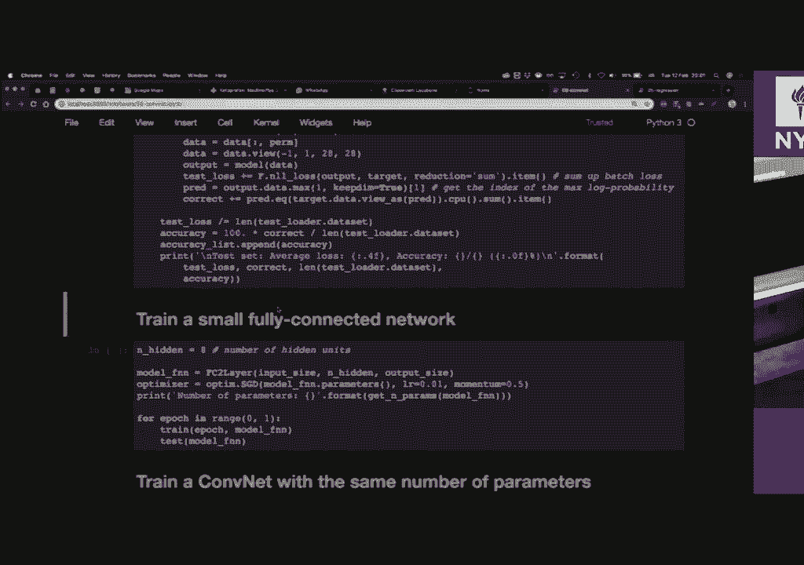

完全连接网络的人需要一点时间。

完全连接网络的人需要一点时间，并且他得到了87％的好处，这是针对。

并且他得到了87％的好处，这是针对，如果您检查一下，荣格的M位数字实际上是从他的网站下载的，如果您检查一下，荣格的M位数字实际上是从他的网站下载的，无论如何我用相同数量的参数训练卷积神经网络。

无论如何我用相同数量的参数训练卷积神经网络，您期望的结果会更好，但是我的多层感知器会变得更好。

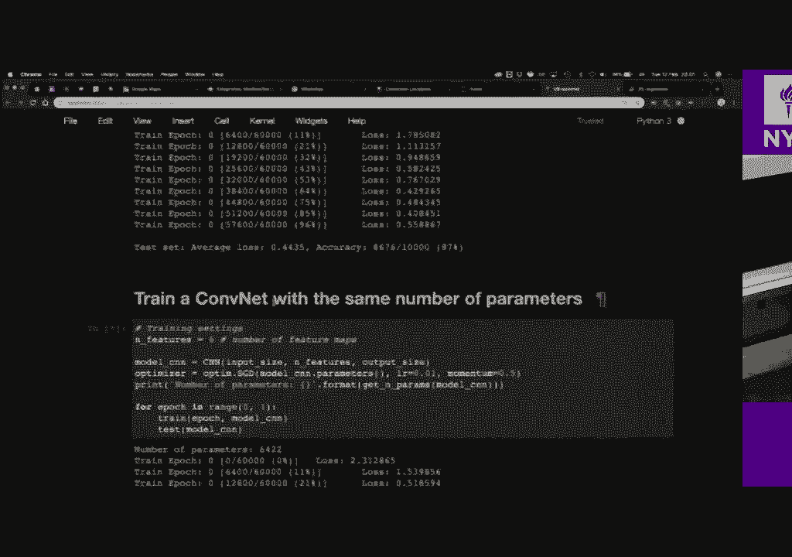

您期望的结果会更好，但是我的多层感知器会变得更好，87％我们用卷积网络能得到什么，87％我们用卷积网络能得到什么，好的，那么使用稀疏性的意义何在？好的，那么使用稀疏性的意义何在？具有相同数量的参数。

我们可以训练更多的过滤器，具有相同数量的参数，我们可以训练更多的过滤器，在第二种情况下，因为在第一种情况下，我们使用的过滤器完全，在第二种情况下，因为在第一种情况下，我们使用的过滤器完全。

试图在与事物相距遥远的事物之间获得某种依赖性，试图在与事物相距遥远的事物之间获得某种依赖性，被关闭，所以它们被完全浪费了，被关闭，所以它们被完全浪费了，基本上他们在卷积网中学习了0，而我拥有了所有这些。

基本上他们在卷积网中学习了0，而我拥有了所有这些，他们只是集中在弄清楚什么是关系的参数，他们只是集中在弄清楚什么是关系的参数，在附近的像素附近，所以现在可以拍摄照片了，在附近的像素附近。

所以现在可以拍摄照片了，摇晃一切都变得混乱，但我保持不变，我却一样混乱，摇晃一切都变得混乱，但我保持不变，我却一样混乱，所有图像的方式，所以我执行随机排列总是相同的随机，所有图像的方式。

所以我执行随机排列总是相同的随机，我所有图像或图像上像素的排列发生了什么情况，我所有图像或图像上像素的排列发生了什么情况，如果我同时训练两个网络，那么在这里我训练了，这里有照片图片。

如果我同时训练两个网络，那么在这里我训练了，这里有照片图片，在这里，我只是使用相同的加扰功能对所有像素进行加扰，在这里，我只是使用相同的加扰功能对所有像素进行加扰，是我的输入是这些图像吗？输出是。

是我的输入是这些图像吗？输出是，仍然是原始的类，所以这是一个四，你可以看到这是一个，仍然是原始的类，所以这是一个四，你可以看到这是一个，四个这是一个九这是一个1这是一个7是一个3。

四个这是一个九这是一个1这是一个7是一个3，是4，所以我保留了相同的标签，但是我扰乱了像素的顺序，是4，所以我保留了相同的标签，但是我扰乱了像素的顺序，每当您期望表现是谁时，都要进行相同的加扰。

每当您期望表现是谁时，都要进行相同的加扰，更好的是谁在工作谁是相同的，知觉是如何做到的，知觉他看到了什么，知觉是如何做到的，知觉他看到了什么，差不行，所以那家伙还是83元，差不行，所以那家伙还是83元。

网络你们知道什么是完全连接的，抱歉，我将更改，网络你们知道什么是完全连接的，抱歉，我将更改，点，是的，你走了，所以我不能，点，是的，你走了，所以我不能。

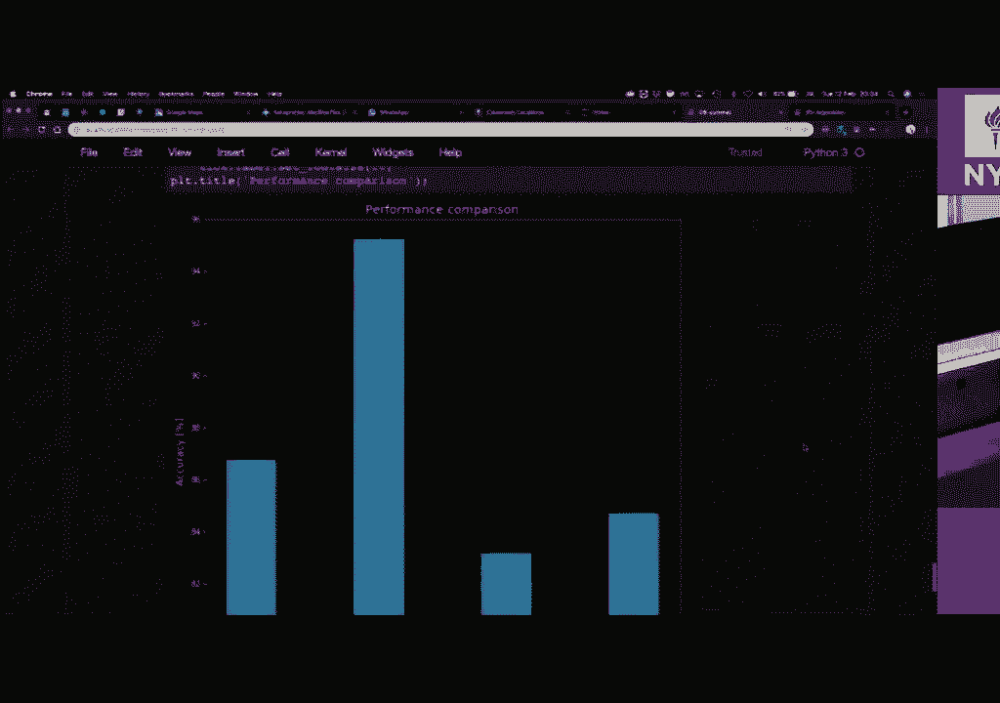

甚至还可以向您展示这个东西，所以完全连接的家伙基本上。

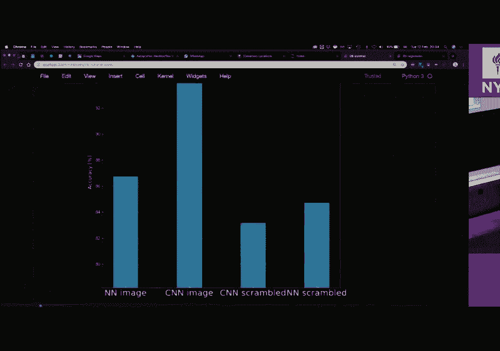

甚至还可以向您展示这个东西，所以完全连接的家伙基本上，执行相同的区别只是基于初始，执行相同的区别只是基于初始，随机初始化以某种方式获胜的卷积网，随机初始化以某种方式获胜的卷积网。

在实际执行类似的操作之前先获得优势，但是我，在实际执行类似的操作之前先获得优势，但是我。

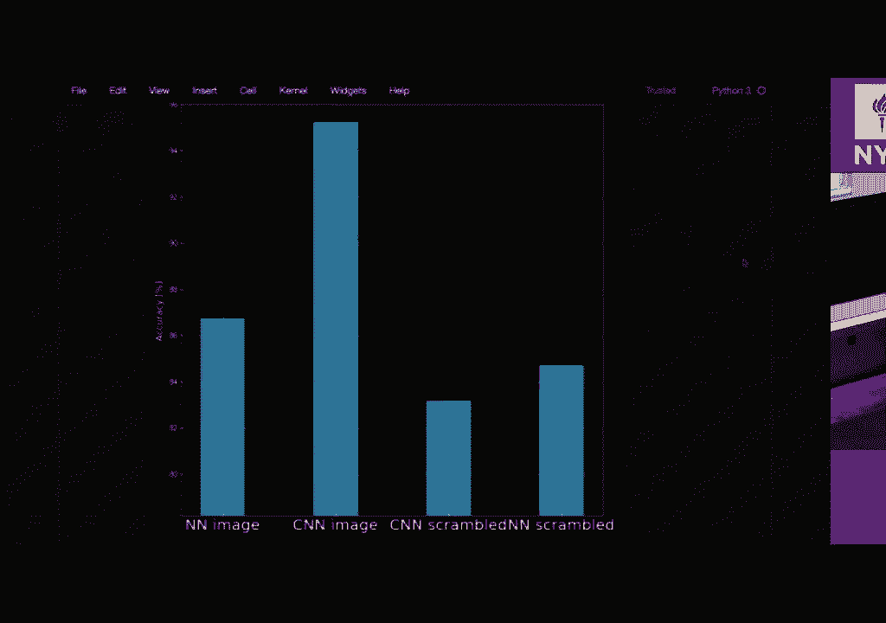

意思是比以前差很多，为什么现在的卷积网络，意思是比以前差很多，为什么现在的卷积网络，表现比我的全连接网络差，因为我们搞砸了，表现比我的全连接网络差，因为我们搞砸了，因此，每次使用卷积网络时，因此。

每次使用卷积网络时，想想我现在可以使用国会网络吗？想想我现在可以使用国会网络吗？那么这三个属性当然可以给你更好的，那么这三个属性当然可以给你更好的，如果这三个属性不成立，则使用卷积。

如果这三个属性不成立，则使用卷积，网络是BS的权利，这是他们的偏见，没关系，没关系，网络是BS的权利，这是他们的偏见，没关系，没关系。

