# 【NYU】纽约大学深度学习入门课程（with pytorch）中英文字幕 - P8：8.Week 5 – Lecture_ Optimisation - 大佬的迷弟的粉丝 - BV1o5411p7AB

好吧，今天您可以看到，我们没有雍勇在别的地方，好吧，今天您可以看到，我们没有雍勇在别的地方，玩得开心慧眼好，今天是我们的，玩得开心慧眼好，今天是我们的，事实上，他是Facebook的研究科学家。

主要从事，事实上，他是Facebook的研究科学家，主要从事，过去三年来他一直在优化，过去三年来他一直在优化，在他成为Amita的数据科学家之前，然后是，在他成为Amita的数据科学家之前，然后是。

澳大利亚国立大学，为什么我们不为此鼓掌，澳大利亚国立大学，为什么我们不为此鼓掌，今天我们的演讲者将讨论优化，如果我们有时间在。

今天我们的演讲者将讨论优化，如果我们有时间在，结束了优化的终结，所以这些是我今天要讨论的主题，结束了优化的终结，所以这些是我今天要讨论的主题，现在，优化是机器学习和某些方面的核心，现在。

优化是机器学习和某些方面的核心，今天要谈论的将每天都用在您的角色中，今天要谈论的将每天都用在您的角色中，潜在地作为应用科学家甚至研究科学家或数据，潜在地作为应用科学家甚至研究科学家或数据，科学家。

我将专注于这些方法的应用，科学家，我将专注于这些方法的应用，特别是而不是背后的理论，部分原因是，特别是而不是背后的理论，部分原因是，是我们还没有完全理解所有这些方法，所以我来这里。

是我们还没有完全理解所有这些方法，所以我来这里，并说这就是它为什么起作用的原因我会简化一些事情，但是我可以，并说这就是它为什么起作用的原因我会简化一些事情，但是我可以，告诉您如何使用它们。

我们如何知道它们在某些情况下会起作用，以及，告诉您如何使用它们，我们如何知道它们在某些情况下会起作用，以及，最好的方法是用来训练您的神经网络并，最好的方法是用来训练您的神经网络并。

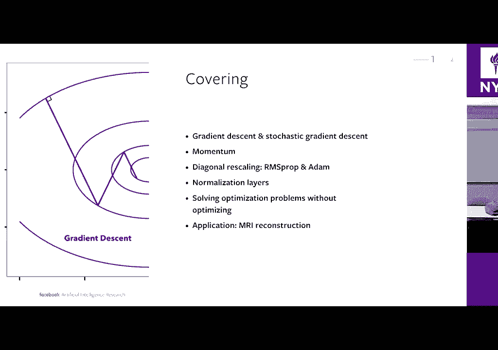

向您介绍优化主题，我需要从，向您介绍优化主题，我需要从，世界上最差的梯度下降方法，我将在稍后解释，世界上最差的梯度下降方法，我将在稍后解释。

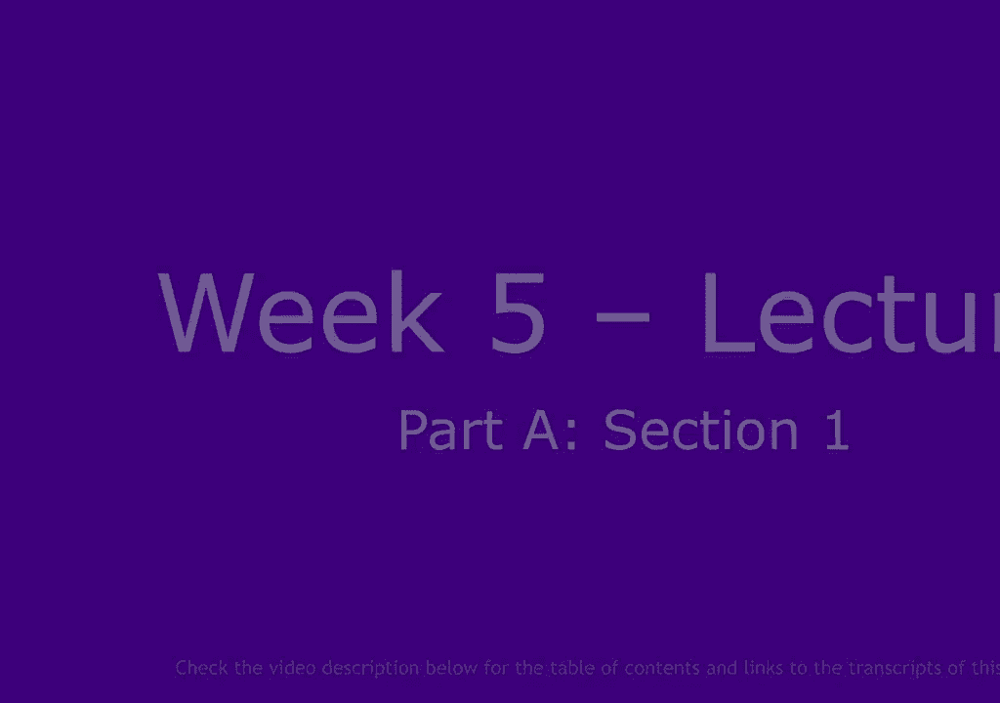

这是最糟糕的方法，但首先我们将使用最通用的方法，这是最糟糕的方法，但首先我们将使用最通用的方法，现在制定优化，您将要考虑的问题，现在制定优化，您将要考虑的问题，将会具有比这更多的结构。

但是从符号上来说这非常有用，将会具有比这更多的结构，但是从符号上来说这非常有用，以这种方式开始，所以我们现在讨论的是函数f，以这种方式开始，所以我们现在讨论的是函数f。

优化程序的属性将在f上采用其他结构，但在，优化程序的属性将在f上采用其他结构，但在，在我们的神经网络中练习结构基本上不遵循，在我们的神经网络中练习结构基本上不遵循，假设人们没有做出任何假设。

假设人们没有做出任何假设，练习，我将从通用F开始，练习，我将从通用F开始，即使我们已经将其视为连续且可区分的，即使我们已经将其视为连续且可区分的，自从神经网络进入错误假设的领域。

自从神经网络进入错误假设的领域，如今，大多数人在实践中都无法区分，而是，如今，大多数人在实践中都无法区分，而是，有一个等效的子差速器，您基本上可以将其插入所有这些，有一个等效的子差速器。

您基本上可以将其插入所有这些，公式，如果您不顾一切，就没有理论来支持它，公式，如果您不顾一切，就没有理论来支持它，应该可以工作，所以这里显示了梯度下降的方法，这是一个迭代，应该可以工作。

所以这里显示了梯度下降的方法，这是一个迭代，方法，因此您从点k等于零开始，并在每一步都更新，方法，因此您从点k等于零开始，并在每一步都更新，点，这里我们将使用W来表示当前的迭代，点。

这里我们将使用W来表示当前的迭代，是神经网络点的标准命名法，是神经网络点的标准命名法，将是一些重量的大集合，每层一个重量张量，但符号，将是一些重量的大集合，每层一个重量张量，但符号。

我们将整个东西压缩成一个向量，您可以，我们将整个东西压缩成一个向量，您可以，想像一下，通过将所有向量重塑为所有，想像一下，通过将所有向量重塑为所有，张量两个向量并将它们连接在一起，这种方法是。

张量两个向量并将它们连接在一起，这种方法是，我们要做的非常简单，就是遵循负梯度的方向，我们要做的非常简单，就是遵循负梯度的方向，它的原理很简单，所以让我给你一个图，它的原理很简单，所以让我给你一个图。

也许这将有助于解释为什么遵循负梯度，也许这将有助于解释为什么遵循负梯度，方向是一个好主意，所以我们对我们的功能知之甚少，方向是一个好主意，所以我们对我们的功能知之甚少，更好的是。

当我们优化要查看的功能时，这是一个高层次的想法，更好的是，当我们优化要查看的功能时，这是一个高层次的想法，景观局部优化景观，所以通过优化景观我，景观局部优化景观，所以通过优化景观我。

是指我们网络中所有可能的权重的域，现在我们不知道是什么，是指我们网络中所有可能的权重的域，现在我们不知道是什么，如果我们在您的网络上使用任何特定的权重，我们将不知道是否会发生。

如果我们在您的网络上使用任何特定的权重，我们将不知道是否会发生，它会更好地完成我们尝试将其培训到的任务，或更糟糕的是，但我们确实知道，它会更好地完成我们尝试将其培训到的任务，或更糟糕的是。

但我们确实知道，局部是当前为ad的点以及渐变和此渐变，局部是当前为ad的点以及渐变和此渐变，提供一些有关我们可以沿该方向行驶的信息，提供一些有关我们可以沿该方向行驶的信息，可能会改善我们网络的性能。

或者在这种情况下降低价值，可能会改善我们网络的性能，或者在这种情况下降低价值，在此设置中，我们的功能最小化，在此设置中，我们的功能最小化，最小化功能本质上就是在网络中进行培训，因此最小化。

最小化功能本质上就是在网络中进行培训，因此最小化，损失将使您在分类任务中表现最佳，损失将使您在分类任务中表现最佳，或您正在尝试做的任何事情，因为我们只看世界，或您正在尝试做的任何事情，因为我们只看世界。

在本地，此渐变基本上是我们拥有的最佳信息，您可以，在本地，此渐变基本上是我们拥有的最佳信息，您可以，认为这是从一个山谷开始，在那里您开始某个可怕的地方，认为这是从一个山谷开始。

在那里您开始某个可怕的地方，例如，山顶上的小指部分，您旅行，例如，山顶上的小指部分，您旅行，从那里下来，在每个点上，您都遵循您附近的方向，从那里下来，在每个点上，您都遵循您附近的方向。

最遗憾的是最陡峭的下降，实际上是对百分比进行分级的方法，最遗憾的是最陡峭的下降，实际上是对百分比进行分级的方法，有时被称为最速下降法，该方向将，有时被称为最速下降法，该方向将，如果您在本地移动仅一个。

如果您在本地移动仅一个，假设我之前提到的这种平滑度是无穷小，假设我之前提到的这种平滑度是无穷小，实际上在实践中是不正确的，但我们将假设，实际上在实践中是不正确的，但我们将假设。

平滑度这一小步长只会使梯度变化很小，因此，平滑度这一小步长只会使梯度变化很小，因此，您乘车的方向至少是一个好的方向，您乘车的方向至少是一个好的方向，小步骤，我们基本上只是沿着这条路走，采取更大的步骤。

小步骤，我们基本上只是沿着这条路走，采取更大的步骤，因为我们可以穿越风景，直到到达，因为我们可以穿越风景，直到到达，底部的山谷是我们的功能最小化现在有一个，底部的山谷是我们的功能最小化现在有一个。

我们可以针对一些问题类别说些什么，我将使用，我们可以针对一些问题类别说些什么，我将使用，我们可以做的最简单的问题类，因为这是我唯一的事情，我们可以做的最简单的问题类，因为这是我唯一的事情。

真的可以在一张幻灯片上完成任何数学运算，所以请多多包涵，真的可以在一张幻灯片上完成任何数学运算，所以请多多包涵，此类是二次的，因此对于二次优化问题，我们，此类是二次的，因此对于二次优化问题，我们。

实际上只基于渐变就知道很多，所以首先渐变，实际上只基于渐变就知道很多，所以首先渐变，离开整个空间的一半，现在用绿色来说明这一点，离开整个空间的一半，现在用绿色来说明这一点，线，所以我们在那一点。

线在绿线附近开始，线，所以我们在那一点，线在绿线附近开始，知道解决方案不能在空间的其余部分，并且从，知道解决方案不能在空间的其余部分，并且从，您的网络，但它仍然是我们要遵循的真正好的指导方针，您的网络。

但它仍然是我们要遵循的真正好的指导方针，负梯度的方向可能在其他地方有更好的解决方案，负梯度的方向可能在其他地方有更好的解决方案，空间，但要找到它们比仅仅寻找最好的要困难得多，空间。

但要找到它们比仅仅寻找最好的要困难得多，我们所处位置附近的解决方案，所以我们正在努力寻找最佳解决方案，我们所处位置附近的解决方案，所以我们正在努力寻找最佳解决方案，我们附近的解决方案，您可以想象这是。

我们附近的解决方案，您可以想象这是，地球上有许多丘陵和山谷，我们不希望知道，地球上有许多丘陵和山谷，我们不希望知道，关于地球另一边的一座山的东西，但我们当然可以，关于地球另一边的一座山的东西。

但我们当然可以，寻找我们目前所在的山下的山谷，寻找我们目前所在的山下的山谷，实际上，您可以在这里将这些功能表示为这些功能，实际上，您可以在这里将这些功能表示为这些功能，地形图这与您使用的地形图相同。

地形图这与您使用的地形图相同，熟悉来自地球的地球，这些环代表山，熟悉来自地球的地球，这些环代表山，现在这里的环代表下降，所以这是底部，现在这里的环代表下降，所以这是底部。

我们在这里显示的山谷不是那里中心的山顶，所以我们，我们在这里显示的山谷不是那里中心的山顶，所以我们，梯度消除了整个可能空间的一半，这非常合理，梯度消除了整个可能空间的一半，这非常合理。

然后去寻找这个负梯度，因为它是，然后去寻找这个负梯度，因为它是，正交于这条在空间后会切断的线，您可以看到我已经，正交于这条在空间后会切断的线，您可以看到我已经，得到了正交的指示，你在那里的小拉正方形。

所以，得到了正交的指示，你在那里的小拉正方形，所以，花费梯度下降的梯度属性在很大程度上取决于，花费梯度下降的梯度属性在很大程度上取决于，这些二次问题的问题结构实际上是，这些二次问题的问题结构实际上是。

相对容易地描述将要发生的事情，所以我将给您一个，相对容易地描述将要发生的事情，所以我将给您一个，这里有一些概述，我会花几分钟，因为它是，这里有一些概述，我会花几分钟，因为它是，非常有趣。

我希望你们中有一定背景的人，非常有趣，我希望你们中有一定背景的人，线性代数可以遵循此推导，但我们将考虑，线性代数可以遵循此推导，但我们将考虑，二次优化问题现在该问题在灰色框中表示。

二次优化问题现在该问题在灰色框中表示，在顶部，您可以看到这是一个二次数，其中a是一个正定，在顶部，您可以看到这是一个二次数，其中a是一个正定，矩阵，我们可以处理更广泛的Quadra二次方程，这可能。

矩阵，我们可以处理更广泛的Quadra二次方程，这可能，但是在正定情况和光栅下分析最简单，但是在正定情况和光栅下分析最简单，当然，用w- b和u作为，当然，用w- b和u作为，在二次方的情况下。

这个问题的形式是闭合的。在二次方的情况下，这个问题的形式是闭合的。时代B现在我们要做的是采取绿色框中显示的步骤，时代B现在我们要做的是采取绿色框中显示的步骤，我们只是将其插入到距解的距离中。

所以这个wk减去1减去W星，我们只是将其插入到距解的距离中，所以这个wk减去1减去W星，离解决方案还有一段距离，所以我们想看看随着时间的变化，离解决方案还有一段距离，所以我们想看看随着时间的变化。

这个想法是，如果随着时间的推移我们越来越接近解决方案，该方法就是，这个想法是，如果随着时间的推移我们越来越接近解决方案，该方法就是，收敛，因此我们从与解决方案的距离开始，将其插入，收敛。

因此我们从与解决方案的距离开始，将其插入，现在，通过重新整理一点点更新的价值，现在，通过重新整理一点点更新的价值，我们可以将这些术语组合在一起，并且我们可以将B写为反，我们可以将这些术语组合在一起。

并且我们可以将B写为反，所以我们可以拉或者我们可以将W星拉到里面的支架里面，所以我们可以拉或者我们可以将W星拉到里面的支架里面，然后我们得到这个表达式，它是矩阵乘以先前距离，然后我们得到这个表达式。

它是矩阵乘以先前距离，解矩阵乘以以前的距离解，现在我们不知道，解矩阵乘以以前的距离解，现在我们不知道，关于这个二次方在哪个方向上变化最大的任何事情，关于这个二次方在哪个方向上变化最大的任何事情。

但是我们不能仅仅通过采用，但是我们不能仅仅通过采用，矩阵作为范数，到解的距离在这里这个范数在底部，矩阵作为范数，到解的距离在这里这个范数在底部，这是现在当您考虑矩阵规范时的底线。

这是现在当您考虑矩阵规范时的底线，很明显，您将拥有一个表达式，其中，很明显，您将拥有一个表达式，其中，该矩阵的特征值将是1减去mu gamma或1减去，该矩阵的特征值将是1减去mu gamma或1减去。

L伽玛现在我得到这个的方式是我只看什么是极限本征，L伽玛现在我得到这个的方式是我只看什么是极限本征，a的值，我们称它们为mu和L，然后将它们插入，a的值，我们称它们为mu和L，然后将它们插入，表达式。

我们可以看到这种组合的极限特征值是什么，表达式，我们可以看到这种组合的极限特征值是什么，矩阵I减去gamma a，您现在具有此绝对值，您可以优化，矩阵I减去gamma a，您现在具有此绝对值。

您可以优化，并获得二次方的最佳学习率，并获得二次方的最佳学习率，但是最佳学习率在实践中并不可靠，您可能不会，但是最佳学习率在实践中并不可靠，您可能不会，想要使用它。

以便可以使用的更简单的值是L ll上的1，想要使用它，以便可以使用的更简单的值是L ll上的1，特征值，这使您的收敛速度为1减去，特征值，这使您的收敛速度为1减去。

缩短解决方案每一步的距离我们在这里有任何疑问吗？缩短解决方案每一步的距离我们在这里有任何疑问吗？知道有点密集，是的，是它在那个灰色框中的替代品，您是否看到底线，是的，是它在那个灰色框中的替代品。

您是否看到底线，在灰色框上，是的，按照定义，我们可以解决，在灰色框上，是的，按照定义，我们可以解决，因此，如果您在第二行看到，因此，如果您在第二行看到，渐变为零的盒子，渐变为零的盒子。

用零替换我们的渐变，然后重新排列就可以得到封闭形式，用零替换我们的渐变，然后重新排列就可以得到封闭形式，解决问题的方法，所以使用封闭形式的问题，解决问题的方法，所以使用封闭形式的问题。

在实践中的解决方案是我们必须反转矩阵并使用梯度，在实践中的解决方案是我们必须反转矩阵并使用梯度，下降，我们可以通过只做矩阵乘法来解决这个问题，下降，我们可以通过只做矩阵乘法来解决这个问题，相反。

我不是建议您实际使用此技术来解决，相反，我不是建议您实际使用此技术来解决，我之前提到的矩阵是世界上最糟糕的方法，我之前提到的矩阵是世界上最糟糕的方法，该方法的收敛速度由新的总量控制。

该方法的收敛速度由新的总量控制，现在这些是标准符号，所以我们从线性代数开始，现在这些是标准符号，所以我们从线性代数开始，您通常将最小特征值和最大特征值用于，您通常将最小特征值和最大特征值用于。

移动最小特征值L最大的优化领域，移动最小特征值L最大的优化领域，本征值，L上的这个mu是条件数的倒数，本征值，L上的这个mu是条件数的倒数，条件编号为L而不是Mir，这可以为您提供广泛的特征。

条件编号为L而不是Mir，这可以为您提供广泛的特征，优化方法将如何快速解决此问题，而这些，优化方法将如何快速解决此问题，而这些，军事术语，它们仅在神经网络中才不存在，军事术语。

它们仅在神经网络中才不存在，最简单的情况是我们是否存在L，而我们基本上从不存在mu，最简单的情况是我们是否存在L，而我们基本上从不存在mu，尽管如此，我们还是要谈论网络网络是极性的，尽管如此。

我们还是要谈论网络网络是极性的，条件好，条件好和条件差的通常是，条件好，条件好和条件差的通常是，L的一些近似值非常大且条件良好，也许L非常，L的一些近似值非常大且条件良好，也许L非常，接近一个。

所以我们在一次夏季训练中可以选择的步长取决于，接近一个，所以我们在一次夏季训练中可以选择的步长取决于，这些常数非常重要，让我给您一些直觉，这些常数非常重要，让我给您一些直觉，对于步长。

这在实践中非常重要，我自己发现，对于步长，这在实践中非常重要，我自己发现，我很多时间都花在治疗学习率上，我相信你会，我很多时间都花在治疗学习率上，我相信你会，涉及类似的程序，因此，如果发生以下几种情况。

涉及类似的程序，因此，如果发生以下几种情况，我们使用的学习率太低，会发现我们取得了稳步的进步，我们使用的学习率太低，会发现我们取得了稳步的进步，在这里，我们将一维二次方最小化，在这里。

我们将一维二次方最小化，稳定的进展，我的意思是每次迭代时，梯度都会保留在缓冲区中，稳定的进展，我的意思是每次迭代时，梯度都会保留在缓冲区中，相同的方向，您在解决方案中也会取得相似的进展，相同的方向。

您在解决方案中也会取得相似的进展，这比可能的速度慢，所以您理想的情况是去，这比可能的速度慢，所以您理想的情况是去，直接针对二次方，尤其是一维像这样的解决方案，直接针对二次方，尤其是一维像这样的解决方案。

将非常简单，将有一个精确的步长，将非常简单，将有一个精确的步长，那将带您一路解决问题，但更普遍的是您无法做到这一点，那将带您一路解决问题，但更普遍的是您无法做到这一点，而您通常要使用的步长实际上是一个。

而您通常要使用的步长实际上是一个，最佳，这是由于许多原因，它往往会更快，最佳，这是由于许多原因，它往往会更快，实践中，我们必须非常非常小心，因为您会出现分歧，实践中，我们必须非常非常小心。

因为您会出现分歧，分歧意味着迭代将比解决方案走得更远，分歧意味着迭代将比解决方案走得更远，如果您使用两次较大的学习，通常不会发生这种情况，如果您使用两次较大的学习，通常不会发生这种情况，不幸的是。

我们希望使用尽可能大的学习率，不幸的是，我们希望使用尽可能大的学习率，尽可能快地学习，因此我们始终处于分歧的边缘，尽可能快地学习，因此我们始终处于分歧的边缘，实际上，您很少会看到渐变遵循这种，实际上。

您很少会看到渐变遵循这种，它们都指向相同方向的轨迹，直到您到达，它们都指向相同方向的轨迹，直到您到达，解决方案在实践中几乎总是会发生什么，尤其是在梯度情况下，解决方案在实践中几乎总是会发生什么。

尤其是在梯度情况下，血统不变性是您现在观察到这种曲折行为，血统不变性是您现在观察到这种曲折行为，实际看到在百万维空间中曲折，我们训练您，实际看到在百万维空间中曲折，我们训练您，网络。

但是在这些二维二维图中非常明显，所以这里，网络，但是在这些二维二维图中非常明显，所以这里，我正在显示级别集，您可以看到数字或函数值，我正在显示级别集，您可以看到数字或函数值，在水平集上指出。

并且当我们使用良好的学习率时，在水平集上指出，并且当我们使用良好的学习率时，不是最佳选择，但是很好，我们可以很接近该解决方案所针对的那个蓝点，不是最佳选择，但是很好。

我们可以很接近该解决方案所针对的那个蓝点，我们使用学习率更好的10个步骤，因为它不是，我们使用学习率更好的10个步骤，因为它不是，当我们使用这样的学习率时，它的振荡表现就很好，当我们使用这样的学习率时。

它的振荡表现就很好，距离解决方案还很远，所以这是我们生活中的事实，距离解决方案还很远，所以这是我们生活中的事实，必须应对这些压力很高的学习率，必须应对这些压力很高的学习率，就像一场比赛一样。

您知道没人会通过安全驾驶赢得比赛，因此我们的网络，就像一场比赛一样，您知道没人会通过安全驾驶赢得比赛，因此我们的网络，培训应该与之相当，因此我们想谈的核心主题。

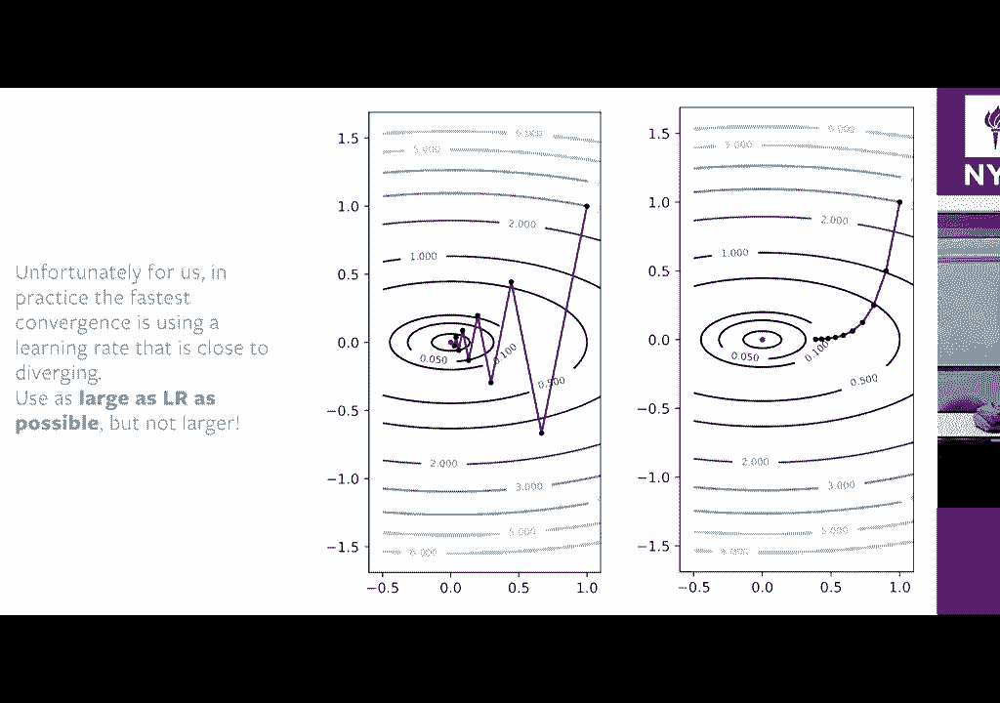

培训应该与之相当，因此我们想谈的核心主题，关于它实际上是随机优化，这就是，关于它实际上是随机优化，这就是。

我们将每天都在练习中训练神经网络，因此，我们将每天都在练习中训练神经网络，因此，投放优化实际上并没有什么不同，我们要做的是，投放优化实际上并没有什么不同，我们要做的是，用随机替换梯度下降步骤中的梯度。

用随机替换梯度下降步骤中的梯度，现在在神经网络中可以近似梯度，现在在神经网络中可以近似梯度，在这里，通过随机逼近来精确表示的是损失的梯度，在这里，通过随机逼近来精确表示的是损失的梯度。

对于单个数据点单个实例，您可能要调用它，所以我得到了，对于单个数据点单个实例，您可能要调用它，所以我得到了，在这里的记号中，这个函数L是一天的损失，在这里的记号中，这个函数L是一天的损失。

数据点由AI索引，我们通常将其写在，数据点由AI索引，我们通常将其写在，优化文献作为函数fi，我将使用此表示法，优化文献作为函数fi，我将使用此表示法，但您应该将fi想象成一个单一实例I和此处的损失。

但您应该将fi想象成一个单一实例I和此处的损失，我正在使用有监督的学习设置，其中有我标记为YI的数据点，我正在使用有监督的学习设置，其中有我标记为YI的数据点。

所以他们指出XI标签YI函数的全部损失显示在顶部，所以他们指出XI标签YI函数的全部损失显示在顶部，这是所有这些F的总和，现在让我给您更多解释，这是所有这些F的总和，现在让我给您更多解释。

对于我们在这里所做的事情，我们将其随机放置在渐变中，对于我们在这里所做的事情，我们将其随机放置在渐变中，梯度，这是一个Luisi近似值，这通常是在，梯度，这是一个Luisi近似值，这通常是在。

随机优化设置，因此我们具有渐变和，随机优化设置，因此我们具有渐变和，在我们的设置中，它的期望值等于整个梯度，因此您可以想到，在我们的设置中，它的期望值等于整个梯度，因此您可以想到。

随机梯度下降步骤为完全梯度步骤，随机梯度下降步骤为完全梯度步骤，期望现在这实际上并不是查看它的最佳方法，因为有一个，期望现在这实际上并不是查看它的最佳方法，因为有一个，发生的事情远不止于梯度下降和噪声。

所以让，发生的事情远不止于梯度下降和噪声，所以让，我给你一点细节，但是首先我让任何人问任何问题，我给你一点细节，但是首先我让任何人问任何问题，在我继续之前先在这里-嗯，我可以再说一点。

在我继续之前先在这里-嗯，我可以再说一点，关于这个，但是是的，所以你是对的，所以使用整个数据集来计算，关于这个，但是是的，所以你是对的，所以使用整个数据集来计算，梯度就是我所说的梯度下降。

梯度就是我所说的梯度下降，梯度下降在机器学习中我们现在几乎总是使用，梯度下降在机器学习中我们现在几乎总是使用，小批量生产，因此人们可能会在使用“梯度下降”之类的名称时，小批量生产。

因此人们可能会在使用“梯度下降”之类的名称时，他们真的在谈论随机梯度下降以及您提到的内容，他们真的在谈论随机梯度下降以及您提到的内容，是绝对正确的，所以训练神经网络有些困难，是绝对正确的。

所以训练神经网络有些困难，使用非常大的批量，这在一定程度上可以理解，我会，使用非常大的批量，这在一定程度上可以理解，我会，在下一张幻灯片上进行实际解释，让我让我进入您的，在下一张幻灯片上进行实际解释。

让我让我进入您的，首先指出问题的答案，首先指出问题的答案，实际上是这里的第三点随机梯度下降中的噪声，实际上是这里的第三点随机梯度下降中的噪声，引起这种现象，称为退火，并且该图直接，引起这种现象。

称为退火，并且该图直接，它的右边说明了这种现象，因此您的网络培训，它的右边说明了这种现象，因此您的网络培训，风景很多，有很多小地方，风景很多，有很多小地方。

不是好的极小值出现在通往好的极小值的路径上的极小值，不是好的极小值出现在通往好的极小值的路径上的极小值，很多人都赞成的理论是SGD，很多人都赞成的理论是SGD，渐变中产生的噪声实际上有助于优化器跳跃。

渐变中产生的噪声实际上有助于优化器跳跃，在这些坏的最小值上，理论上这些坏的最小值很小，在这些坏的最小值上，理论上这些坏的最小值很小，空间，所以他们很容易越过，我们是一个很好的最小值，导致，空间。

所以他们很容易越过，我们是一个很好的最小值，导致，您自己网络上的良好性能更大，更难跳过，所以，您自己网络上的良好性能更大，更难跳过，所以，这个回答你的问题是的，所以除了退火的观点之外，还有。

这个回答你的问题是的，所以除了退火的观点之外，还有，实际上还有其他一些原因，因此我们在，实际上还有其他一些原因，因此我们在，我们从每个术语梯度和使用随机梯度获得的信息。

我们从每个术语梯度和使用随机梯度获得的信息，让我们在很多情况下利用这种冗余，让我们在很多情况下利用这种冗余，几百个示例几乎与在完整数据上计算出的梯度一样好。

几百个示例几乎与在完整数据上计算出的梯度一样好，设置，通常便宜几千倍，具体取决于您的问题，就是，设置，通常便宜几千倍，具体取决于您的问题，就是，鉴于以下原因，很难提出令人信服的理由使用梯度下降。

鉴于以下原因，很难提出令人信服的理由使用梯度下降，随机梯度下降的成功，这就是为什么，随机梯度下降的成功，这就是为什么，厌恶的梯度说这是我们最好的错过之一，但梯度下降，厌恶的梯度说这是我们最好的错过之一。

但梯度下降，是最坏的情况之一，实际上，早期的相关性很明显，是最坏的情况之一，实际上，早期的相关性很明显，这个令人反感的梯度可以关联到高达0。999的系数，这个令人反感的梯度可以关联到高达0。

999的系数，那些早期阶段的真实梯度的相关系数，那些早期阶段的真实梯度的相关系数，优化，所以我想简要谈一谈您需要了解的内容，优化，所以我想简要谈一谈您需要了解的内容，我认为Jana已经简要提及了这一点。

但实际上我们不使用，我认为Jana已经简要提及了这一点，但实际上我们不使用，随机梯度下降中的单个实例我们如何使用小批量，随机梯度下降中的单个实例我们如何使用小批量，实例，所以我只是在这里使用一些符号。

但是每个人都使用，实例，所以我只是在这里使用一些符号，但是每个人都使用，迷你批处理使用不同的符号，因此您不应该过于依赖，迷你批处理使用不同的符号，因此您不应该过于依赖，记法。

但基本上每个步骤中我都会在这里，记法，但基本上每个步骤中我都会在这里，将其称为B，I为步长，您基本上使用，将其称为B，I为步长，您基本上使用，迷你批处理中的梯度，这是数据的子集，而不是。

迷你批处理中的梯度，这是数据的子集，而不是，现在，几乎每个人都将使用此mini，现在，几乎每个人都将使用此mini，随机选择统一批处理，有些人使用替换，随机选择统一批处理，有些人使用替换，采样。

有些人使用时没有替换采样，但是，采样，有些人使用时没有替换采样，但是，为此，差异并不重要，您可以使用，为此，差异并不重要，您可以使用，小型配料有很多优点，因此实际上有一些很好的推动作用。

小型配料有很多优点，因此实际上有一些很好的推动作用，理论上的理由不是任何批次，但实际的原因是，理论上的理由不是任何批次，但实际的原因是，这些实际原因中的绝大多数是我们进行的计算。

这些实际原因中的绝大多数是我们进行的计算，氨训练时，可能会以1％的效率利用我们的硬件。氨训练时，可能会以1％的效率利用我们的硬件。网络，如果我们尝试使用单个实例，我们将获得最大收益，网络。

如果我们尝试使用单个实例，我们将获得最大收益，批量有效使用数百种硬件的高效利用，批量有效使用数百种硬件的高效利用，例如，如果您正在训练典型的imagenet数据集，例如，例如。

如果您正在训练典型的imagenet数据集，例如，您不要使用小于64的批量来获得良好的效率，您不要使用小于64的批量来获得良好的效率，可以降到32，但另一个重要的应用是分布式培训和，可以降到32。

但另一个重要的应用是分布式培训和，正如之前提到的，这确实是一件大事，正如之前提到的，这确实是一件大事，最近能够训练imagenet天说，通常需要两天时间，最近能够训练imagenet天说。

通常需要两天时间，训练，不久前，只花了一个小时就花了一个星期的时间，训练，不久前，只花了一个小时就花了一个星期的时间，他们这样做的方法是使用非常大的微型批次，他们这样做的方法是使用非常大的微型批次。

大量批次中，您需要使用一些技巧才能使其正常工作，大量批次中，您需要使用一些技巧才能使其正常工作，您可能不会讲授入门课程，所以我，您可能不会讲授入门课程，所以我，鼓励您检查该纸。

如果您有兴趣将它作为图像网，鼓励您检查该纸，如果您有兴趣将它作为图像网，小时忘了我不记得的脸书作者，小时忘了我不记得的脸书作者，目前的第一作者作为旁注，在某些情况下，您，目前的第一作者作为旁注。

在某些情况下，您，需要进行完整的批次优化，不要在其中使用梯度下降，需要进行完整的批次优化，不要在其中使用梯度下降，这种情况我不能强调得足够多，即使有，这种情况我不能强调得足够多，即使有。

完整的批次数据是迄今为止最有效的方法，完整的批次数据是迄今为止最有效的方法，即插即用，您无需考虑它的积累，即l-bfgs，即插即用，您无需考虑它的积累，即l-bfgs，经过50年的优化研究，效果非常好。

经过50年的优化研究，效果非常好，火炬的实现非常好，但是SyFy的实现会导致一些，火炬的实现非常好，但是SyFy的实现会导致一些，过滤15年前编写的代码，这几乎是防弹的，过滤15年前编写的代码。

这几乎是防弹的，因为它们就是那些，所以这是一个好问题，因为它们就是那些，所以这是一个好问题，传统上，您确实需要使用完整的数据集，传统上，您确实需要使用完整的数据集，现在管焊炬实现实际上支持使用微型电池。

现在管焊炬实现实际上支持使用微型电池，有点灰色地带，因为实际上没有理论支持，有点灰色地带，因为实际上没有理论支持，这可能会很好地解决您的问题，也可能无法解决问题，这可能会很好地解决您的问题。

也可能无法解决问题，值得尝试，我的意思是您想为每个梯度使用整个数据集，值得尝试，我的意思是您想为每个梯度使用整个数据集，评估，或者更有可能，因为很少有人要这样做，评估，或者更有可能。

因为很少有人要这样做，可能更有可能您正在解决其他一些优化问题，可能更有可能您正在解决其他一些优化问题，不是在您的网络中训练，而是可能与一些辅助问题有关，您，不是在您的网络中训练。

而是可能与一些辅助问题有关，您，需要解决没有此数据点结构的优化问题，需要解决没有此数据点结构的优化问题，不是夏天不是数据点的总和，希望这是另一个，不是夏天不是数据点的总和，希望这是另一个，是的，哦。

是的，这个问题很年轻，建议我们使用小批量，是的，哦，是的，这个问题很年轻，建议我们使用小批量，等于我们数据集中的类数的大小，为什么是，等于我们数据集中的类数的大小，为什么是。

问题是合理的答案是我们想要任何向量，问题是合理的答案是我们想要任何向量，代表整个数据集，通常每个类都相当，代表整个数据集，通常每个类都相当，在属性上与其他类不同，因此使用小批量，在属性上与其他类不同。

因此使用小批量，实际上每个类平均包含一个实例，实际上每个类平均包含一个实例，可以显式执行该操作，尽管不必要，可以显式执行该操作，尽管不必要，通过具有大约等于该大小的尺寸，我们可以假定它具有。

通过具有大约等于该大小的尺寸，我们可以假定它具有，食物梯度的结构，因此您可以捕捉到很多相关性，食物梯度的结构，因此您可以捕捉到很多相关性，全梯度显示的数据，这是一个很好的指南，尤其是当您。

全梯度显示的数据，这是一个很好的指南，尤其是当您，在不受硬件过多约束的CPU上进行培训，在不受硬件过多约束的CPU上进行培训，当对CPU批处理量进行能量培训时，此处的效率对于。

当对CPU批处理量进行能量培训时，此处的效率对于，硬件利用率取决于问题，我总是会推荐迷你，硬件利用率取决于问题，我总是会推荐迷你，批处理我认为不值得尝试以1号为起点，批处理我认为不值得尝试以1号为起点。

赚取小额收益也许值得探索，是的，还有另一个，赚取小额收益也许值得探索，是的，还有另一个，问题是在退火示例中，所以问题是为什么丢失，问题是在退火示例中，所以问题是为什么丢失，风景如此动摇。

这实际上是非常非常，风景如此动摇，这实际上是非常非常，实际法则的逼真描述猛击了神经网络，实际法则的逼真描述猛击了神经网络，令人难以置信的是，他们有很多丘陵和山谷，这是，令人难以置信的是。

他们有很多丘陵和山谷，这是，现在我们正在积极研究的东西是，现在我们正在积极研究的东西是，有很多很好的极小值，所以山丘和山谷，有很多很好的极小值，所以山丘和山谷。

知道这一点是因为您的网络具有与之相关的组合方面，知道这一点是因为您的网络具有与之相关的组合方面，可以通过将所有权重转移到周围来收割电流表，使其成为神经网络，可以通过将所有权重转移到周围来收割电流表。

使其成为神经网络，您可以从事您的工作，您将知道它的输出是否完全相同，您可以从事您的工作，您将知道它的输出是否完全相同，所有这些权重都在移动，您正在执行的任务是什么，所有这些权重都在移动。

您正在执行的任务是什么，基本上对应于参数空间中的其他位置，因此，基本上对应于参数空间中的其他位置，因此，鉴于这些可能的重新排列方式呈指数级增长，鉴于这些可能的重新排列方式呈指数级增长。

获得与网络相同的权重，获得与网络相同的权重，这就是这些峰值的令人难以置信的尖峰数，现在的原因，这就是这些峰值的令人难以置信的尖峰数，现在的原因，为什么这些局部极小值仍然活跃。

为什么这些局部极小值仍然活跃，研究，所以我不确定我能给你一个很好的答案，但他们，研究，所以我不确定我能给你一个很好的答案，但他们，在实践中绝对可以观察到，我可以说的是，它们似乎少了一个。

在实践中绝对可以观察到，我可以说的是，它们似乎少了一个，问题我们非常，像最先进的网络一样，所以这些本地最小值被认为是，像最先进的网络一样，所以这些本地最小值被认为是，15年前的大问题。

但此刻人们基本上从未遭受打击，15年前的大问题，但此刻人们基本上从未遭受打击，在实践中，当使用某种推荐参数时，例如，在实践中，当使用某种推荐参数时，例如，当您使用非常大的批次时，您可能会遇到这些问题。

当您使用非常大的批次时，您可能会遇到这些问题，甚至清楚地表明，使用大批量生产时性能不佳甚至，甚至清楚地表明，使用大批量生产时性能不佳甚至，这些较大的最小值可归因于这些局部最小值，所以对。

这些较大的最小值可归因于这些局部最小值，所以对，正在进行的研究是的问题是您无法真正看到这种局部结构，正在进行的研究是的问题是您无法真正看到这种局部结构，因为我们处在这个百万维的空间中，这不是一个好方法。

因为我们处在这个百万维的空间中，这不是一个好方法，看到它，是的，我不知道人们是否已经探索过，我不是，看到它，是的，我不知道人们是否已经探索过，我不是，熟悉相关论文，但我敢打赌有人看过它，所以您可能。

熟悉相关论文，但我敢打赌有人看过它，所以您可能，想要对Google询问，是的，因此神经网络设计中的许多进步都有，想要对Google询问，是的，因此神经网络设计中的许多进步都有。

实际上在很多方面都减少了这种颠簸，所以这是，实际上在很多方面都减少了这种颠簸，所以这是，为什么它不再被认为是一个大问题的原因，为什么它不再被认为是一个大问题的原因，在过去被认为是一个大问题还有其他问题。

是的，在过去被认为是一个大问题还有其他问题，是的，很难看到，但是您可以做某些事情，我们可以，很难看到，但是您可以做某些事情，我们可以，峰谷肯定较小，并且通过重新缩放某些部分的神经，峰谷肯定较小。

并且通过重新缩放某些部分的神经，网络可以放大某些方向的曲率，网络可以放大某些方向的曲率，可以拉伸和压缩特定创新残差的方向，可以拉伸和压缩特定创新残差的方向，提到的连接很容易看到它们平滑。

提到的连接很容易看到它们平滑，损失实际上您可以在两点之间画两条线，损失实际上您可以在两点之间画两条线，空间，您会看到沿这条线发生的事情，这实际上是我们最好的方式，空间，您会看到沿这条线发生的事情。

这实际上是我们最好的方式，有一个可视化的百万维空间，所以我把他变成了一个维，有一个可视化的百万维空间，所以我把他变成了一个维，您会发现，这两点之间的关系要好得多，您会发现，这两点之间的关系要好得多。

使用这些剩余连接时选择的任何两点，我都会，使用这些剩余连接时选择的任何两点，我都会，在讲课中谈论所有关于闪避的问题，是的，如果希望我能，在讲课中谈论所有关于闪避的问题，是的，如果希望我能。

无需再次询问即可回答该问题，但我们会看到，无需再次询问即可回答该问题，但我们会看到，感谢任何其他问题，是的，所以l-bfgs很棒的方法，感谢任何其他问题，是的，所以l-bfgs很棒的方法。

优化研究人员的星座，我们仍在使用SGD，优化研究人员的星座，我们仍在使用SGD，60年代或更早时发明的方法仍是最先进的技术，但是，60年代或更早时发明的方法仍是最先进的技术，但是。

实际上是几年后的一些创新，但是有一些创新，实际上是几年后的一些创新，但是有一些创新，自sed发明以来的一项创新，其中一项创新是，自sed发明以来的一项创新，其中一项创新是，我稍后再谈，所以动力十足。

我稍后再谈，所以动力十足，当您使用随机时，应该几乎总是使用。

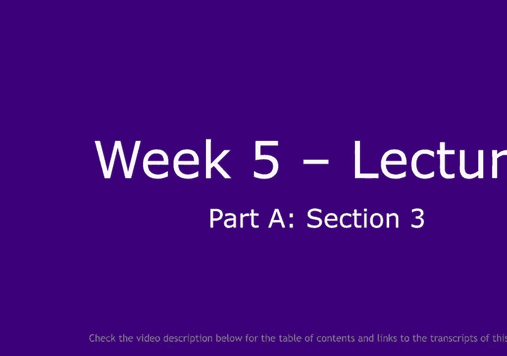

当您使用随机时，应该几乎总是使用，梯度下降，值得详细介绍一下，梯度下降，值得详细介绍一下，您经常会调整动量参数和网络，这是，您经常会调整动量参数和网络，这是，有助于了解调优过程中的实际操作，因此。

有助于了解调优过程中的实际操作，因此，动量的问题很容易被误解，这可以解释，动量的问题很容易被误解，这可以解释，实际上存在三种不同的动量写作方式，实际上存在三种不同的动量写作方式，看起来完全不同。

但结果却是相当的，我只想，看起来完全不同，但结果却是相当的，我只想，之所以介绍这两种方式，是因为第三种方式不是众所周知，而是，之所以介绍这两种方式，是因为第三种方式不是众所周知，而是，实际上。

我认为查看它的正确方法是我不谈论我的，实际上，我认为查看它的正确方法是我不谈论我的，在这里进行研究，我们将讨论它如何在，在这里进行研究，我们将讨论它如何在，您将要使用的软件包。

这里的第一种形式是实际实现的，您将要使用的软件包，这里的第一种形式是实际实现的，在Python和您将在此处使用的其他软件中，我们维护两个变量，在Python和您将在此处使用的其他软件中。

我们维护两个变量，现在您会看到许多使用不同符号的论文，这里P是，现在您会看到许多使用不同符号的论文，这里P是，在物理学中用于动量的符号，通常也将其用作，在物理学中用于动量的符号，通常也将其用作。

在讨论sed与动量时的动量变量，所以我将关注，在讨论sed与动量时的动量变量，所以我将关注，那个约定，所以我们现在不必再进行单个迭代，而必须使用Eretz P，那个约定，所以我们现在不必再进行单个迭代。

而必须使用Eretz P，和W，并在每一步都更新它们，这是一个非常简单的更新，因此，和W，并在每一步都更新它们，这是一个非常简单的更新，因此，P更新涉及添加到旧P，而不是完全添加到旧P。

P更新涉及添加到旧P，而不是完全添加到旧P，P我们对旧的P进行阻尼，我们通过将其乘以一个常数来减小它，P我们对旧的P进行阻尼，我们通过将其乘以一个常数来减小它，比一个更糟，所以减少旧的P。

在这里我使用beta帽子作为常数，比一个更糟，所以减少旧的P，在这里我使用beta帽子作为常数，因此在实践中可能会有0。9的少量阻尼和，因此在实践中可能会有0。9的少量阻尼和，我们添加了新的梯度。

所以P是这种累积的梯度缓冲区，我们添加了新的梯度，所以P是这种累积的梯度缓冲区，您可以想到新的梯度在何处可以达到全价，而过去的梯度又在哪里，您可以想到新的梯度在何处可以达到全价，而过去的梯度又在哪里。

在每一步都减少了一定的系数，通常为0。9，在每一步都减少了一定的系数，通常为0。9，减小，因此缓冲区往往是某种梯度的连续求和，减小，因此缓冲区往往是某种梯度的连续求和，基本上。

我们只是将其修改为custer梯度两步下降，基本上，我们只是将其修改为custer梯度两步下降，使用这个P而不是负梯度而不是梯度对不起，使用这个P而不是负梯度而不是梯度对不起，自从两行公式以来。

在更新中使用P而不是，自从两行公式以来，在更新中使用P而不是，最好以下面的第二种形式来理解，最好以下面的第二种形式来理解，等价的情况下，您需要对地图的beta进行较小的转换，所以它不是，等价的情况下。

您需要对地图的beta进行较小的转换，所以它不是，两种方法之间的beta完全相同，但实际上是相同的，两种方法之间的beta完全相同，但实际上是相同的，因为在实践中，这些基本相同，直到获得罗马化和。

因为在实践中，这些基本相同，直到获得罗马化和，我认为这部电影可能更清晰，这种形式称为随机重球，我认为这部电影可能更清晰，这种形式称为随机重球，方法，这里我们的更新仍然包括渐变，但我们也，方法。

这里我们的更新仍然包括渐变，但我们也，加上我们现在所走的过去方向的倍数副本，加上我们现在所走的过去方向的倍数副本，这意味着我们在这里实际上在做什么，所以实际上并不难，这意味着我们在这里实际上在做什么。

所以实际上并不难，进行可视化，我将使用一种经过提炼的可视化，进行可视化，我将使用一种经过提炼的可视化，出版物，您可以在那里看到底部的衣服，但我对此非常不同意，出版物，您可以在那里看到底部的衣服。

但我对此非常不同意，他们在该文档中讨论的内容，但我喜欢可视化，他们在该文档中讨论的内容，但我喜欢可视化，因此，让我们使用had，我将在后面解释为什么我不同意一些问题，但这是，因此，让我们使用had。

我将在后面解释为什么我不同意一些问题，但这是，非常简单，所以您可以将动量视为物理过程，而我，非常简单，所以您可以将动量视为物理过程，而我，提到你们中那些已经完成物理入门课程的人。

提到你们中那些已经完成物理入门课程的人，涵盖了这一点，所以动量是事物在不断移动中的特性，涵盖了这一点，所以动量是事物在不断移动中的特性，如果您熟悉牛顿法则，目前正在朝着正确的方向发展。

如果您熟悉牛顿法则，目前正在朝着正确的方向发展，法律规定事物要朝着前进的方向前进，这是，法律规定事物要朝着前进的方向前进，这是，动量，当您进行物理映射时，梯度有点像，动量，当您进行物理映射时。

梯度有点像，推动你识字的力量，以此类推，推动你识字的力量，以此类推，它在每个点上都推着沉重的球，而不是使戏剧性，它在每个点上都推着沉重的球，而不是使戏剧性，左侧显示的每一步的行进方向都发生了变化。

左侧显示的每一步的行进方向都发生了变化，图，而不是进行这些巨大的改变，我们将做一个，图，而不是进行这些巨大的改变，我们将做一个，适度的变化，所以当我们意识到自己走错了路时，适度的变化。

所以当我们意识到自己走错了路时，方向，我们有点掉头，而不是踩下手刹，方向，我们有点掉头，而不是踩下手刹，摆弄它在很多实际应用中，摆弄它在很多实际应用中，问题会给您带来很大的改善，所以在这里您可以看到您。

问题会给您带来很大的改善，所以在这里您可以看到您，到解决方案结束时更接近解决方案，并且振荡更少，到解决方案结束时更接近解决方案，并且振荡更少，您会看到这种振荡，因此，如果您使用，您会看到这种振荡，因此。

如果您使用，梯度下降型方法，所以我们在这里谈论梯度之上的动量，梯度下降型方法，所以我们在这里谈论梯度之上的动量，在可视化中下降，您将得到这种振荡，这只是，在可视化中下降，您将得到这种振荡，这只是。

梯度下降的特性，如果不修改，就无法摆脱它，梯度下降的特性，如果不修改，就无法摆脱它，方法，我们对他们来说在某种程度上可以减轻这种振荡，方法，我们对他们来说在某种程度上可以减轻这种振荡。

这里的另一种可视化效果将使您对如何，这里的另一种可视化效果将使您对如何，这个beta参数控制事物的系现在更大，这个beta参数控制事物的系现在更大，如果等于零，则返回零，您会在梯度下降中分散注意力。

必须，如果等于零，则返回零，您会在梯度下降中分散注意力，必须，小于1，否则Met在开始时一切都会炸毁，小于1，否则Met在开始时一切都会炸毁，包括过去的渐变，随着时间的流逝越来越重，包括过去的渐变。

随着时间的流逝越来越重，在零到一之间，典型值范围从0。25到小，在零到一之间，典型值范围从0。25到小，像0。99，所以在实践中您可以接近一个，发生的是，像0。99，所以在实践中您可以接近一个。

发生的是，较小的值会导致您更快地改变方向，所以在，较小的值会导致您更快地改变方向，所以在，您可以在左侧看到带有小Beta的图表，您可以在左侧看到带有小Beta的图表，接近解决方案。

您可以快速改变方向并前进，接近解决方案，您可以快速改变方向并前进，解决方案，当您使用这些较大的测试版时，您需要花费更长的时间，解决方案，当您使用这些较大的测试版时，您需要花费更长的时间。

做这个戏剧性的转弯，您可以将其视为转弯不良的汽车，做这个戏剧性的转弯，您可以将其视为转弯不良的汽车，需要很长时间才能绕过那个角落并走向，需要很长时间才能绕过那个角落并走向，解决方案，这似乎是一件坏事。

但实际上在实践中，解决方案，这似乎是一件坏事，但实际上在实践中，大大抑制了您从梯度下降和，大大抑制了您从梯度下降和，就实践而言，这是它的优点。我可以给你一些，就实践而言，这是它的优点。我可以给你一些。

非常明确的指导，您几乎总是想利用动量，非常明确的指导，您几乎总是想利用动量，很难发现实际上在某种程度上没有好处的问题，很难发现实际上在某种程度上没有好处的问题，现在部分原因是因为这只是一个额外的参数。

现在部分原因是因为这只是一个额外的参数，当您采用某种方法并向其中添加更多参数时，通常可以，当您采用某种方法并向其中添加更多参数时，通常可以，找到该参数的一些值，使我们现在稍微好一点，找到该参数的一些值。

使我们现在稍微好一点，有时候是这种情况，但通常动量的这些改进是，有时候是这种情况，但通常动量的这些改进是，实际上相当可观，使用第九点的动量值是，实际上相当可观，使用第九点的动量值是。

实际上是机器学习中经常使用的默认值，实际上是机器学习中经常使用的默认值，情况0。99可能更好，所以我建议您尝试使用两个值，情况0。99可能更好，所以我建议您尝试使用两个值，否则尝试9点。

但我必须警告动量的方式，否则尝试9点，但我必须警告动量的方式，如果您仔细看一下它，当我们增加，如果您仔细看一下它，当我们增加，动量，我们有点增加步长，现在不是步长，动量，我们有点增加步长，现在不是步长。

当前梯度，因此当前梯度包含在该步骤中，当前梯度，因此当前梯度包含在该步骤中，优势，但过去的渐变变得更高，优势，但过去的渐变变得更高，当您以其他形式书写动量时增加动量时的力量。

当您以其他形式书写动量时增加动量时的力量，这变得更加明显，所以这种坚强的遮挡力使您可以，这变得更加明显，所以这种坚强的遮挡力使您可以，通常，当您要更改动量时应该这样做，以便，通常。

当您要更改动量时应该这样做，以便，您的步长除以一个减beta就是您的新步长，因此，如果，您的步长除以一个减beta就是您的新步长，因此，如果，您的旧步长使用某个B，您是否想将其映射到该方程。

您的旧步长使用某个B，您是否想将其映射到该方程，然后将其映射回以获得新的步长，这可能是非常适度的更改，然后将其映射回以获得新的步长，这可能是非常适度的更改，但是如果您要从动量0。9变为动量0。99。

则可能需要降低，但是如果您要从动量0。9变为动量0。99，则可能需要降低，您的学习率大约是10倍，所以请注意，您的学习率大约是10倍，所以请注意，您不能期望保持相同的学习速度并改变势头。

您不能期望保持相同的学习速度并改变势头，现在我要在wallmart的工作参数中详细说明为什么，现在我要在wallmart的工作参数中详细说明为什么，动量的工作原理非常容易被误解，您会在其中看到解释。

动量的工作原理非常容易被误解，您会在其中看到解释，提炼后的职位是加速的过程，这当然是促成，提炼后的职位是加速的过程，这当然是促成，动量的性能现在加速是一个主题，如果您有疑问，可以。

动量的性能现在加速是一个主题，如果您有疑问，可以，问题是动量和，问题是动量和，使用小批量的两个，所以有动力在何时，使用小批量的两个，所以有动力在何时，使用梯度下降以及随机梯度下降。

使用梯度下降以及随机梯度下降，即将使用的该加速度说明在随机中均适用，即将使用的该加速度说明在随机中均适用，非随机的情况下，无论您要使用多大的批量，非随机的情况下，无论您要使用多大的批量。

动量的好处现在仍然显示出来，它在随机因素中也有好处，动量的好处现在仍然显示出来，它在随机因素中也有好处，以及我将在一两张幻灯片中介绍的案例，答案是，以及我将在一两张幻灯片中介绍的案例，答案是。

与批次大小不同，您不应该完成它们，与批次大小不同，您不应该完成它们，像真正地学习它一样，您应该在改变学习率时，像真正地学习它一样，您应该在改变学习率时，改变蝙蝠的大小而不是改变动量。

改变蝙蝠的大小而不是改变动量，批量大小学习率和批量大小之间存在明显的关系，但是，批量大小学习率和批量大小之间存在明显的关系，但是，对于小批量，目前尚不清楚，因此取决于其他问题，对于小批量，目前尚不清楚。

因此取决于其他问题，在我继续前进之前先提出一些问题，是的，这只是爆炸，所以，在我继续前进之前先提出一些问题，是的，这只是爆炸，所以，实际上是在物理解释中，实际上是在物理解释中，动量将刚好等于一个动量。

现在不好了，因为如果你处于，动量将刚好等于一个动量，现在不好了，因为如果你处于，一个没有摩擦的世界，然后你将一个沉重的球丢在它会保持的地方，一个没有摩擦的世界，然后你将一个沉重的球丢在它会保持的地方。

永远移动这不是好东西，所以我们需要一些阻尼，这就是地方，永远移动这不是好东西，所以我们需要一些阻尼，这就是地方，物理解释破裂了，所以您现在确实需要一些阻尼，物理解释破裂了，所以您现在确实需要一些阻尼。

可以想象如果您使用的值大于某个值，则过去的渐变会，可以想象如果您使用的值大于某个值，则过去的渐变会，放大了每个步骤，因此实际上是您评估的第一个梯度，放大了每个步骤，因此实际上是您评估的第一个梯度。

在优化过程中，网络不是明智的相关信息内容，但，在优化过程中，网络不是明智的相关信息内容，但，如果以前大于1，它将主导您所要执行的步骤，如果以前大于1，它将主导您所要执行的步骤，使用是否可以回答您的问题。

是的，关于其他任何问题，使用是否可以回答您的问题，是的，关于其他任何问题，我们继续前进之前的势头是特定的beta值，是的，我们继续前进之前的势头是特定的beta值，是的，严格等效，这不是很难。

您应该能够做到，严格等效，这不是很难，您应该能够做到，两行，如果您自己尝试进行对等，则没有投标者，两行，如果您自己尝试进行对等，则没有投标者，不太一样，但是伽玛是相同的，这就是为什么我使用相同的。

不太一样，但是伽玛是相同的，这就是为什么我使用相同的，记法哦，是的，这就是我提到的，所以当您更改测试版时，记法哦，是的，这就是我提到的，所以当您更改测试版时，您想用学习率除以一来缩放学习率。

您想用学习率除以一来缩放学习率，测试版，因此我不确定这种形式是否会以，测试版，因此我不确定这种形式是否会以，错误，但我认为我还可以，我认为这不在此公式中，但是，错误，但我认为我还可以。

我认为这不在此公式中，但是，当您更改Beta时肯定要做什么，您还需要更改学习率，当您更改Beta时肯定要做什么，您还需要更改学习率，保持平衡是的，哦，要么取平均值，要么，保持平衡是的，哦，要么取平均值。

要么，不值得去研究，但您可以将其视为动力正在发生变化，不值得去研究，但您可以将其视为动力正在发生变化，在标准公司中评估梯度的点，您评估，在标准公司中评估梯度的点，您评估。

以内部平均形式在此W点处进行渐变，以内部平均形式在此W点处进行渐变，您一直在评估Grady Nutt的平均分数，而您，您一直在评估Grady Nutt的平均分数，而您，在那一点进行评估。

因此基本上不是对梯度求平均值，在那一点进行评估，因此基本上不是对梯度求平均值，平均点很明显，珠宝是，是的，所以现在加速，平均点很明显，珠宝是，是的，所以现在加速，你可以花整个职业学习的东西，这有点差。

你可以花整个职业学习的东西，这有点差，如果您现在尝试阅读Nesterov的原始作品，现在可以理解，如果您现在尝试阅读Nesterov的原始作品，现在可以理解，内斯特罗夫几乎是现代优化的祖父。

内斯特罗夫几乎是现代优化的祖父，我们使用的方法在某种程度上以他的名字命名，这可能会造成混淆，我们使用的方法在某种程度上以他的名字命名，这可能会造成混淆，有时，在80年代，他想出了这个公式，但他没有写。

有时，在80年代，他想出了这个公式，但他没有写，他用这种形式写的另一种形式，人们过了一会儿才意识到，他用这种形式写的另一种形式，人们过了一会儿才意识到，可以这样写，他的分析也很不透明，可以这样写。

他的分析也很不透明，最初用俄语写对不幸的理解没有帮助，最初用俄语写对不幸的理解没有帮助，NSA那些好人当时翻译了所有的俄罗斯文学，NSA那些好人当时翻译了所有的俄罗斯文学，因此我们可以访问它们。

实际上是对它的很小的修改，因此我们可以访问它们，实际上是对它的很小的修改，动量步长，但我认为小修改会贬低它的作用，动量步长，但我认为小修改会贬低它的作用，实际上，实际上我可以说的完全不是同一种方法。

实际上，实际上我可以说的完全不是同一种方法，Nesterov Swimmer动量，如果您非常仔细地选择这些常数，则可以，Nesterov Swimmer动量，如果您非常仔细地选择这些常数，则可以。

得到所谓的加速收敛，现在这不适用于，得到所谓的加速收敛，现在这不适用于，您的网络，但对于凸问题，我不会详细介绍凸，但，您的网络，但对于凸问题，我不会详细介绍凸，但，你们中的一些人可能知道这意味着什么。

这是一个简单的结构，但是，你们中的一些人可能知道这意味着什么，这是一个简单的结构，但是，凸问题，这从根本上提高了收敛速度，凸问题，这从根本上提高了收敛速度，加速，但仅针对非常精心选择的常数，您真的不能。

加速，但仅针对非常精心选择的常数，您真的不能，请提前仔细选择这些内容，以便您进行大量搜索，请提前仔细选择这些内容，以便您进行大量搜索，在您的参数上，您的超级参数很抱歉，找不到正确的参数，在您的参数上。

您的超级参数很抱歉，找不到正确的参数，要获得加速的常数，我可以说这实际上是为，要获得加速的常数，我可以说这实际上是为，使用规则动量的二次方，这使很多人感到困惑，使用规则动量的二次方，这使很多人感到困惑。

所以你会看到很多人说动量是一种加速的方法，所以你会看到很多人说动量是一种加速的方法，我只为二次方程式而兴奋，即使那样，我还是有点，我只为二次方程式而兴奋，即使那样，我还是有点。

不建议将其用于二次方使用共轭梯度或一些新的，不建议将其用于二次方使用共轭梯度或一些新的，最近几年开发的方法，这是，最近几年开发的方法，这是，绝对是推动我们发展的动力，在实践中效果很好。

绝对是推动我们发展的动力，在实践中效果很好，肯定会有一些加速，但是这种加速很难，肯定会有一些加速，但是这种加速很难，当您看到什么时，就可以意识到当您具有随机梯度时，当您看到什么时。

就可以意识到当您具有随机梯度时，使加速工作噪音真正消除了它，这很难让人相信，使加速工作噪音真正消除了它，这很难让人相信，这是影响性能的主要因素，但肯定是，这是影响性能的主要因素，但肯定是，那里。

还有我提到的静态帖子的属性或性能，那里，还有我提到的静态帖子的属性或性能，加速的动力，但我不会走那么远，但这是，加速的动力，但我不会走那么远，但这是，绝对是一个促成因素，但可能是实际可行的。

绝对是一个促成因素，但可能是实际可行的，为什么加速为什么不知道为什么动量有帮助的原因是噪声平滑，为什么加速为什么不知道为什么动量有帮助的原因是噪声平滑，从某种意义上讲，这是非常直观的动量平均梯度。

从某种意义上讲，这是非常直观的动量平均梯度，我们用作步骤而不是单个的运行缓冲区梯度，我们用作步骤而不是单个的运行缓冲区梯度，渐变，这是平均的一种形式，事实证明，当您，渐变，这是平均的一种形式，事实证明。

当您，没有动量地使用s到D来证明一切，没有动量地使用s到D来证明一切，您实际上必须使用您访问过的所有点的平均值，您实际上必须使用您访问过的所有点的平均值，您可能会在最后到达的最后一点上得到非常弱的界限。

但是，您可能会在最后到达的最后一点上得到非常弱的界限，但是，真的，您必须使用平均点数，这是次优的，真的，您必须使用平均点数，这是次优的，就像我们从不希望在实践中实际采用这种平均水平。

就像我们从不希望在实践中实际采用这种平均水平，加权了我们很久以前访问过的点，这可能是不相关的，加权了我们很久以前访问过的点，这可能是不相关的，实际上，这种平均值在神经网络的实践中效果不佳，实际上。

这种平均值在神经网络的实践中效果不佳，网络，它实际上仅对凸问题很重要，但是，网络，它实际上仅对凸问题很重要，但是，分析常规s2d和动量的显着事实之一是必要的，分析常规s2d和动量的显着事实之一是必要的。

实际上，从理论上讲不再需要这种平均，所以从本质上讲，实际上，从理论上讲不再需要这种平均，所以从本质上讲，动量增加了平滑的梦境优化，使我们如此，动量增加了平滑的梦境优化，使我们如此。

您访问的最后一点仍然是SGG解决方案的一个很好的近似，您访问的最后一点仍然是SGG解决方案的一个很好的近似，真的，您想要对您看到的一堆最后的点求平均值，以便，真的，您想要对您看到的一堆最后的点求平均值。

以便，得到一个很好的解决方案，现在让我说明一下，得到一个很好的解决方案，现在让我说明一下，这是使用STD时发生的非常典型的示例，这是使用STD时发生的非常典型的示例，STD在开始时就取得了很大的进步。

梯度本质上是，STD在开始时就取得了很大的进步，梯度本质上是，几乎与随机梯度相同，因此您要做的前几步，几乎与随机梯度相同，因此您要做的前几步，解决方案方面取得了长足的进步，但您最终还是陷入了困境。

解决方案方面取得了长足的进步，但您最终还是陷入了困境，那是我们要去的山谷，所以这里的球有点像地板，那是我们要去的山谷，所以这里的球有点像地板，山谷里的东西，你在这层楼里跳来跳去，最常见，山谷里的东西。

你在这层楼里跳来跳去，最常见，解决方案是，如果您降低学习速度，您会跳动，解决方案是，如果您降低学习速度，您会跳动，慢速并不是一个很好的解决方案，但这是处理它的一种方法，但是当您。

慢速并不是一个很好的解决方案，但这是处理它的一种方法，但是当您，使用s来处理动量，您可以使这种反弹变得平滑，并且，使用s来处理动量，您可以使这种反弹变得平滑，并且，您现在只是绕着轮子走，路径不一定总是。

您现在只是绕着轮子走，路径不一定总是，这个开瓶器瓷砖路径实际上是相当随机的，您可能会摇摆，这个开瓶器瓷砖路径实际上是相当随机的，您可能会摇摆，左右，但是当我用42播种时，它就是展开的，所以，左右。

但是当我用42播种时，它就是展开的，所以，我在这里使用的东西通常是用这个开瓶器，用这个软木得分，我在这里使用的东西通常是用这个开瓶器，用这个软木得分，对于这组参数，是的，我认为这是一个很好的解释。

因此一些，对于这组参数，是的，我认为这是一个很好的解释，因此一些，加速度和噪声平滑的结合是动量起作用的原因，加速度和噪声平滑的结合是动量起作用的原因，哦，是的，所以我应该说，当我们在此处注入噪声时。

梯度可能不会，哦，是的，所以我应该说，当我们在此处注入噪声时，梯度可能不会，即使是正确的旅行方向，实际上也可能相反，即使是正确的旅行方向，实际上也可能相反，从您想去的方向出发。

这就是为什么您会在附近弹跳，从您想去的方向出发，这就是为什么您会在附近弹跳，那里的山谷，所以实际上您可以在这里看到灰色，第一步，那里的山谷，所以实际上您可以在这里看到灰色，第一步。

SUV实际上与此处设置的水平正交，因为，SUV实际上与此处设置的水平正交，因为，一开始是一个很好的步骤，但是一旦您走得更远，它就可以指出，一开始是一个很好的步骤，但是一旦您走得更远，它就可以指出。

在解决方案周围几乎没有任何方向，所以昨天，在解决方案周围几乎没有任何方向，所以昨天，动量是许多机器当前最先进的优化方法，动量是许多机器当前最先进的优化方法，学习问题，所以您很可能会在课程中使用它。

学习问题，所以您很可能会在课程中使用它，问题，但这些年来还有其他一些创新，这些创新是，问题，但这些年来还有其他一些创新，这些创新是，正如我所提到的，对于条件差的问题特别有用，正如我所提到的。

对于条件差的问题特别有用，在讲座的早期，一些问题具有这种良好的条件，在讲座的早期，一些问题具有这种良好的条件，我们无法真正表征神经网络的特性，但我们，我们无法真正表征神经网络的特性，但我们。

可以通过测试来衡量，如果s到D起作用，那么它条件良好，可以通过测试来衡量，如果s到D起作用，那么它条件良好，最终有做的工作，如果我必须步行条件差，所以我们，最终有做的工作，如果我必须步行条件差。

所以我们，还有其他可以处理的方法我们可以在某些情况下使用，还有其他可以处理的方法我们可以在某些情况下使用，情况，这些通常称为自适应方法，现在您需要。

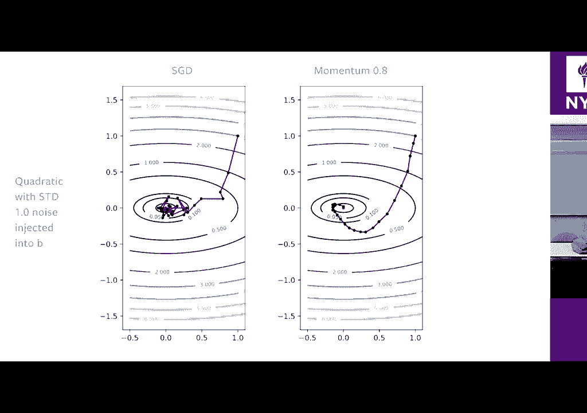

情况，这些通常称为自适应方法，现在您需要，请多加注意，因为您要适应文学界的人。

请多加注意，因为您要适应文学界的人，这种用于调整学习率，调整动量参数的术语，但是，这种用于调整学习率，调整动量参数的术语，但是，在我们的情况下，我们正在谈论一种特定类型的适应性罗马，在我们的情况下。

我们正在谈论一种特定类型的适应性罗马，适应性是个人学习率，现在我的意思是，适应性是个人学习率，现在我的意思是，模拟我已经向您展示了随机梯度下降，模拟我已经向您展示了随机梯度下降。

我使用全球学习率的意思是您网络中的每个学习率，我使用全球学习率的意思是您网络中的每个学习率，使用具有相同伽玛的方程式更新，现在伽玛可以随，使用具有相同伽玛的方程式更新，现在伽玛可以随，时间步长。

因此您在表示法中使用了伽玛K，但通常使用固定，时间步长，因此您在表示法中使用了伽玛K，但通常使用固定，相机很长一段时间，但对于自适应方法，我们想适应，相机很长一段时间，但对于自适应方法，我们想适应。

每个体重的学习率，我们想使用，每个体重的学习率，我们想使用，我们从每个权重的梯度中获得的信息可以对此进行调整，因此这似乎，我们从每个权重的梯度中获得的信息可以对此进行调整，因此这似乎。

喜欢做的显而易见的事情，人们一直在努力将这些东西，喜欢做的显而易见的事情，人们一直在努力将这些东西，工作了几十年，我们有点迷失了一些行之有效的方法，工作了几十年，我们有点迷失了一些行之有效的方法。

一些不是的，但是我想在这里问问题，一些不是的，但是我想在这里问问题，需要说明，所以我可以说，为什么需要，需要说明，所以我可以说，为什么需要，如果您的网络条件良好，则可以正确执行此操作，而无需执行此操作。

如果您的网络条件良好，则可以正确执行此操作，而无需执行此操作，可能，但通常我们在实践中使用的网络有很大的不同，可能，但通常我们在实践中使用的网络有很大的不同，网络不同部分的结构，例如早期部分。

网络不同部分的结构，例如早期部分，的卷积神经网络可能是非常浅的卷积层，的卷积神经网络可能是非常浅的卷积层，在网络中较大的图像之后，您将与，在网络中较大的图像之后，您将与，小图像上有大量通道。

现在这些操作非常，小图像上有大量通道，现在这些操作非常，不同，没有理由相信学习速度有效，不同，没有理由相信学习速度有效，对一个人来说会很好，对另一个人会很好，这就是为什么自适应，对一个人来说会很好。

对另一个人会很好，这就是为什么自适应，学习率对这里的任何问题都可能有用，学习率对这里的任何问题都可能有用，是的，很不幸，我们对神经网络没有很好的定义，是的，很不幸，我们对神经网络没有很好的定义。

即使有一个好的定义也无法测量它，所以我将使用它，即使有一个好的定义也无法测量它，所以我将使用它，从某种意义上说，它实际上是行不通的，而且效果很差，从某种意义上说，它实际上是行不通的，而且效果很差。

有条件的，是的，所以在某种二次情况下，如果您还记得我有一个明确的定义，是的，所以在某种二次情况下，如果您还记得我有一个明确的定义，条件值L超过mu L的值被最大化，其中mu为。

条件值L超过mu L的值被最大化，其中mu为，最小的特征值，是的，最大和最大之间的差距很大，最小的特征值，是的，最大和最大之间的差距很大，本征值较小最坏的情况是，这并不意味着，本征值较小最坏的情况是。

这并不意味着，网络，以便您的网络中不存在mu L仍然有一些，网络，以便您的网络中不存在mu L仍然有一些，信息，但我不会说这是决定性因素，只是，信息，但我不会说这是决定性因素，只是，很多事情正在进行。

所以有一些方法可以使您的外观看起来很简单，很多事情正在进行，所以有一些方法可以使您的外观看起来很简单，问题，但还有其他方法让我们有点犹豫不决，说，问题，但还有其他方法让我们有点犹豫不决，说。

他们喜欢他们，是的，是的，所以对于这个特定的网络，这是一个网络，他们喜欢他们，是的，是的，所以对于这个特定的网络，这是一个网络，实际上条件还不是太差，实际上条件还不是太差。

VDD 16实际上是火车上最好的网络方法最好的网络，VDD 16实际上是火车上最好的网络方法最好的网络，在发明某些技术以改善调理之前，在发明某些技术以改善调理之前，这几乎是您实际上可以达到的最佳条件。

这几乎是您实际上可以达到的最佳条件，这个网络的很多结构实际上是由这个定义的，这个网络的很多结构实际上是由这个定义的，就像我们在某些步骤后将通道数量加倍一样，就像我们在某些步骤后将通道数量加倍一样。

似乎导致网络处于世界状态，而不是其他任何情况，似乎导致网络处于世界状态，而不是其他任何情况，原因，但可以肯定的是重量很轻，原因，但可以肯定的是重量很轻，网络对输出的影响很大，最后一层。

网络对输出的影响很大，最后一层，如果其中有4096个砝码，那么这个网络的白人数量很少，如果其中有4096个砝码，那么这个网络的白人数量很少，有数以百万计的白人，我相信那4096磅的重量有非常强的作用。

有数以百万计的白人，我相信那4096磅的重量有非常强的作用，在输出上，因为它们直接决定了该输出，因此，在输出上，因为它们直接决定了该输出，因此，您通常希望使用较小的学习率，而。

您通常希望使用较小的学习率，而，网络初期的权重可能会产生很大的影响，但是，网络初期的权重可能会产生很大的影响，但是，特别是当您随机初始化网络时，它们通常会，特别是当您随机初始化网络时，它们通常会。

对那些较早的重量的影响较小，这是非常有用的，对那些较早的重量的影响较小，这是非常有用的，波浪状的原因是因为我们对这一点的理解不够，波浪状的原因是因为我们对这一点的理解不够，我要给你一个精确的精确陈述。

这里有1。2亿个权重，我要给你一个精确的精确陈述，这里有1。2亿个权重，这个网络实际上是这样，所以最后一层就像4096 x 4096矩阵，这个网络实际上是这样。

所以最后一层就像4096 x 4096矩阵，所以，是的，还有其他问题吗，是的，我建议仅在以下情况下使用它们，是的，还有其他问题吗，是的，我建议仅在以下情况下使用它们，您的问题没有分解成大量结构的结构。

您的问题没有分解成大量结构的结构，类似的事情好吧是的，但是当您，类似的事情好吧是的，但是当您，有一个总和的目标，其中总和的每一项都是模糊的，有一个总和的目标，其中总和的每一项都是模糊的，可比较。

因此在机器学习中，此总和的每个子项损失一个，可比较，因此在机器学习中，此总和的每个子项损失一个，数据点，它们具有非常相似的结构，单个损失是，数据点，它们具有非常相似的结构，单个损失是，波浪形的感觉。

因为它们各自的结构非常相似，波浪形的感觉，因为它们各自的结构非常相似，数据点可能会大不相同，但是当您的问题不大时，数据点可能会大不相同，但是当您的问题不大时，总和作为其结构的主要部分。

那么l-bfgs将是有用的，总和作为其结构的主要部分，那么l-bfgs将是有用的，一般回答我怀疑您在本课程中会使用它，l-bfgs怀疑它，一般回答我怀疑您在本课程中会使用它，l-bfgs怀疑它。

对于小型网络，您可以尝试使用它非常方便，对于小型网络，您可以尝试使用它非常方便，精简v网络或我确定您可能在本课程中使用的东西，精简v网络或我确定您可能在本课程中使用的东西。

您可以尝试使用l-bfgs并在那里获得一些成功，您可以尝试使用l-bfgs并在那里获得一些成功，现代网络培训中最重要的一种创建技术是rmsprop，现代网络培训中最重要的一种创建技术是rmsprop。

我现在将在某种程度上谈谈今年的标准，我现在将在某种程度上谈谈今年的标准，优化领域的实践是研究和优化的一种，优化领域的实践是研究和优化的一种，在训练神经网络和，在训练神经网络和。

这个IMS道具是一个破裂点，我们都以不同的方式出发，这个IMS道具是一个破裂点，我们都以不同的方式出发，方向，这个rmsprop通常归因于Geoffrey Hinton滑梯，方向。

这个rmsprop通常归因于Geoffrey Hinton滑梯，然后他将其归因于其他人未发表的论文，然后他将其归因于其他人未发表的论文，引用某人​​的幻灯片确实很不满意，但是。

引用某人​​的幻灯片确实很不满意，但是，无论如何，这是一种有一些方法的方法，没有任何背后的证据证明它为什么有效，但是，无论如何，这是一种有一些方法的方法，没有任何背后的证据证明它为什么有效，但是。

它类似于您可以证明有效的方法，至少，它类似于您可以证明有效的方法，至少，它在实践中效果很好，这就是为什么我要看是否要使用它，所以我想要，它在实践中效果很好，这就是为什么我要看是否要使用它，所以我想要。

在我实际解释之前先给您介绍，在我实际解释之前先给您介绍，is和rmsprop代表均方根传播，is和rmsprop代表均方根传播，这是从我们做燃料网络的时代开始的，这是从我们做燃料网络的时代开始的。

称为传播某某东西，例如反向支撑，现在我们称之为深度，称为传播某某东西，例如反向支撑，现在我们称之为深度，如果现在被埋藏起来，可能被称为Armas深丙基。如果现在被埋藏起来，可能被称为Armas深丙基。

这是一个修改，所以它仍然是行算法，但有一点，这是一个修改，所以它仍然是行算法，但有一点，有点不同，所以我将详细介绍这些术语，因为，有点不同，所以我将详细介绍这些术语，因为，现在要了解这一点很重要。

我们现在将这个V缓冲区保持在，现在要了解这一点很重要，我们现在将这个V缓冲区保持在，不是动量缓冲区，所以我们在这里使用不同的符号，不是动量缓冲区，所以我们在这里使用不同的符号，有些不同。

我将使用一些人的符号，有些不同，我将使用一些人的符号，真的很讨厌，但是我认为这很方便，真的很讨厌，但是我认为这很方便，只需对向量进行平方，就不会造成混淆，只需对向量进行平方，就不会造成混淆。

在几乎所有情况下都可以用符号表示，但这是一种很好的编写方式，因此在这里，在几乎所有情况下都可以用符号表示，但这是一种很好的编写方式，因此在这里，我正在写渐变平方，我的意思是您将所有元素都包含在内。

我正在写渐变平方，我的意思是您将所有元素都包含在内，该矢量百万元素矢量或它是什么，并将每个元素平方，该矢量百万元素矢量或它是什么，并将每个元素平方，因此，此视频更新就是所谓的指数移动，因此。

此视频更新就是所谓的指数移动，平均而言，我会快速展示一些熟悉指数的手，平均而言，我会快速展示一些熟悉指数的手，移动平均线我想知道是否需要进一步讨论，移动平均线我想知道是否需要进一步讨论。

它可能需要更深入地解释它，但需要揭露移动平均线，它可能需要更深入地解释它，但需要揭露移动平均线，这是在许多领域中使用了数十年的标准方法，这是在许多领域中使用了数十年的标准方法，维持一个平均值。

该平均值可能会随时间变化，维持一个平均值，该平均值可能会随时间变化，因此，当数量随时间变化时，我们需要将较大的权重放在新的，因此，当数量随时间变化时，我们需要将较大的权重放在新的，价值观。

因为它们提供了更多信息，而做到这一点的一种方法是，价值观，因为它们提供了更多信息，而做到这一点的一种方法是，以指数形式减少旧值，当您以指数形式这样做时，您的意思是，以指数形式减少旧值。

当您以指数形式这样做时，您的意思是，假设十步前的旧值的权重为，假设十步前的旧值的权重为，您的事物中的十个，因此这就是指数输出的地方，您的事物中的十个，因此这就是指数输出的地方，现在的十个不是真正的符号。

而是每个符号的符号，现在的十个不是真正的符号，而是每个符号的符号，步骤，我们只需通过此alpha常数下载通过向量，就好像您可以，步骤，我们只需通过此alpha常数下载通过向量，就好像您可以，想象一下。

该缓冲区中的V缓冲区中的东西很旧，想象一下，该缓冲区中的V缓冲区中的东西很旧，他们在每一步都按照与alpha相同的方式通过alpha下载，他们在每一步都按照与alpha相同的方式通过alpha下载。

这是介于0和1之间的值，因此我们不能使用大于1的值，这是介于0和1之间的值，因此我们不能使用大于1的值，在那里，这将抑制所有这些值，直到不再，在那里，这将抑制所有这些值，直到不再，指数移动平均线。

因此该方法保持指数移动，指数移动平均线，因此该方法保持指数移动，第二瞬间的平均值我指的是非中央第二瞬间，所以我们不，第二瞬间的平均值我指的是非中央第二瞬间，所以我们不，减去均值在这里。

零件或实现在其中有一个开关，减去均值在这里，零件或实现在其中有一个开关，如果愿意，可以告诉它减去平均博弈，如果愿意，可以告诉它减去平均博弈，在实践中表现可能非常相似，有一篇论文。

在实践中表现可能非常相似，有一篇论文，当然可以，但是原始方法不会减去那里的均值，我们使用，当然可以，但是原始方法不会减去那里的均值，我们使用，这第二个时刻对梯度进行归一化，我们按元素进行此操作。

这第二个时刻对梯度进行归一化，我们按元素进行此操作，所有这些表示法都是元素明智的，梯度的每个元素都被划分，所有这些表示法都是元素明智的，梯度的每个元素都被划分，通过第二个矩的平方根估计，如果您认为。

通过第二个矩的平方根估计，如果您认为，这个平方根实际上是标准偏差，即使这是，这个平方根实际上是标准偏差，即使这是，不是关键时刻，所以实际上不是标准偏差，不是关键时刻，所以实际上不是标准偏差。

这样的想法很有用，而且您知道root的名字表示平方是善良的，这样的想法很有用，而且您知道root的名字表示平方是善良的，用平方根和，用平方根和，重要的技术细节，您必须在此处添加epsilon。

重要的技术细节，您必须在此处添加epsilon，问题是，当您将0除以0时，一切都会中断，因此您偶尔会，问题是，当您将0除以0时，一切都会中断，因此您偶尔会，您的网络中存在零，在某些情况下。

您的网络中存在零，在某些情况下，梯度为零时的差值，但绝对可以，梯度为零时的差值，但绝对可以，在您的方法中需要该epsilon，您将看到这是一个重复出现的主题，在您的方法中需要该epsilon。

您将看到这是一个重复出现的主题，在这些没有适应性的方法中，基本上，当您的，在这些没有适应性的方法中，基本上，当您的，除法只是为了避免避免除以0，通常，除法只是为了避免避免除以0，通常。

epsilon将靠近您的机器Epsilon我不知道是否可以，epsilon将靠近您的机器Epsilon我不知道是否可以，熟悉该术语，但它大约是10到负7，熟悉该术语，但它大约是10到负7。

有时10到负8左右，所以实际上只有一小部分，有时10到负8左右，所以实际上只有一小部分，在我谈论这种方法为何有效之前，先要谈谈对价值的影响，在我谈论这种方法为何有效之前，先要谈谈对价值的影响。

关于这种方法的最新创新，以及，关于这种方法的最新创新，以及，这是我们在实践中实际使用的方法，因此rmsprop有时是，这是我们在实践中实际使用的方法，因此rmsprop有时是，仍在使用。

但更经常地我们使用一种方法来通知原子一个原子意味着自适应，仍在使用，但更经常地我们使用一种方法来通知原子一个原子意味着自适应，瞬间估计，所以亚当具有动力，所以我花了20分钟，瞬间估计，所以亚当具有动力。

所以我花了20分钟，告诉你我应该动量，所以我要说你应该穿上它，告诉你我应该动量，所以我要说你应该穿上它，rmsprop的顶部以及至少总是这样做，rmsprop的顶部以及至少总是这样做，每篇论文只有六篇。

但亚当是最流行的，每篇论文只有六篇，但亚当是最流行的，我们在这里提到的方法实际上是转换动量更新，我们在这里提到的方法实际上是转换动量更新，到指数移动平均线现在看起来也像一个数量。

到指数移动平均线现在看起来也像一个数量，质的不同更新，实际上是通过移动均线来做动量，质的不同更新，实际上是通过移动均线来做动量，我们之前所做的基本上等于您可以算出一些。

我们之前所做的基本上等于您可以算出一些，可以获取使用移动指数的方法的常量，可以获取使用移动指数的方法的常量，移动平均动量等于规律的动量，移动平均动量等于规律的动量，不要认为移动平均动量有什么不同。

不要认为移动平均动量有什么不同，比以前的动力要好，但是它具有很好的特性，您不需要，比以前的动力要好，但是它具有很好的特性，您不需要，当您在此处遇到beta时，请更改学习率，我认为这是一个。

当您在此处遇到beta时，请更改学习率，我认为这是一个，很大的进步，所以是的，我们增加了梯度的动量，很大的进步，所以是的，我们增加了梯度的动量，在使用rmsprop之前，我们具有。

在使用rmsprop之前，我们具有，平方梯度的基础上，我们基本上只是插入此移动，平方梯度的基础上，我们基本上只是插入此移动，平均梯度，我们在上一次更新中具有的梯度是，平均梯度。

我们在上一次更新中具有的梯度是，如果您实际阅读原子纸，现在不会太复杂，如果您实际阅读原子纸，现在不会太复杂，一堆额外的符号算法大约是十行，一堆额外的符号算法大约是十行，之三。

这是因为它们添加了一些称为偏差校正的内容，这是，之三，这是因为它们添加了一些称为偏差校正的内容，这是，其实不是必需的，但是会有所帮助，所以每个人都使用它，其实不是必需的，但是会有所帮助。

所以每个人都使用它，确实是在早期增加了这些参数的值，确实是在早期增加了这些参数的值，优化的原因以及您这样做的原因是因为您对此进行了初始化，优化的原因以及您这样做的原因是因为您对此进行了初始化，现在。

动量缓冲区通常为零，现在想象您的初始初始化程序为零，现在，动量缓冲区通常为零，现在想象您的初始初始化程序为零，然后在第一步之后，我们将其添加为1减去，然后在第一步之后，我们将其添加为1减去。

贝塔乘以现在的梯度乘以1减去贝塔通常为0。1，因为我们，贝塔乘以现在的梯度乘以1减去贝塔通常为0。1，因为我们，通常使用动量点9，所以当我们这样做时，我们的梯度步长实际上是，通常使用动量点9。

所以当我们这样做时，我们的梯度步长实际上是，使用小10倍的学习率，因为此动量缓冲的十分之一，使用小10倍的学习率，因为此动量缓冲的十分之一，的梯度，这是不可取的，所以所有的偏差，的梯度，这是不可取的。

所以所有的偏差，校正只是将这些早期迭代中的步骤乘以10，然后，校正只是将这些早期迭代中的步骤乘以10，然后，偏差校正公式基本上只是实现此目标的正确方法，偏差校正公式基本上只是实现此目标的正确方法。

导致步骤的公正性和公正性在这里意味着只是期望，导致步骤的公正性和公正性在这里意味着只是期望，动量缓冲是梯度，所以没什么太神秘的，动量缓冲是梯度，所以没什么太神秘的，是的，虽然我确实认为，是的。

虽然我确实认为，原子纸是第一个在主流中使用自行车动作的纸，原子纸是第一个在主流中使用自行车动作的纸，优化方法我不知道他们是否发明了它，但它无疑是开创性的，优化方法我不知道他们是否发明了它。

但它无疑是开创性的，基础校正，所以这些方法在实践中确实很好用，基础校正，所以这些方法在实践中确实很好用，现在给您一个常见的经验比较，我现在使用的这个二次方是，现在给您一个常见的经验比较。

我现在使用的这个二次方是，对角线二次方，所以使用一种有效的方法会有点阴影，对角线二次方，所以使用一种有效的方法会有点阴影，向下或二次方对角二次方，但我还是要这么做，向下或二次方对角二次方。

但我还是要这么做，您会发现他们的前进方向比SGD有了很大的改善，您会发现他们的前进方向比SGD有了很大的改善，所以在这个简化的问题中，这样会导致错误的方向，所以在这个简化的问题中，这样会导致错误的方向。

rmsprop基本上从正确的方向开始，现在是问题所在，rmsprop基本上从正确的方向开始，现在是问题所在，rmsprop会受到噪音的干扰，就像没有噪音的普通sut一样，所以您。

rmsprop会受到噪音的干扰，就像没有噪音的普通sut一样，所以您，遇到这种情况，即在最佳状态附近会有很大的反弹，遇到这种情况，即在最佳状态附近会有很大的反弹，当我们向原子添加动量时。

就像具有动量的std一样，我们得到相同的结果，当我们向原子添加动量时，就像具有动量的std一样，我们得到相同的结果，我们在开瓶器或有时倒开瓶器时的一种改进，我们在开瓶器或有时倒开瓶器时的一种改进。

解决方案之类的事情，这将带您进入解决方案，解决方案之类的事情，这将带您进入解决方案，更快，这意味着您当前所处的最后一点是一个很好的估计，更快，这意味着您当前所处的最后一点是一个很好的估计。

该解决方案不是一个嘈杂的估计，但这是您拥有的最佳估计，该解决方案不是一个嘈杂的估计，但这是您拥有的最佳估计，因此，我通常建议使用demova rmsprop，这样可以解决问题，因此。

我通常建议使用demova rmsprop，这样可以解决问题，对于某些问题，您只是不能使用SGD原子进行培训，对于某些问题，您只是不能使用SGD原子进行培训。

一些神经网络正在使用我们的语言模型或说我们的语言，一些神经网络正在使用我们的语言模型或说我们的语言，模型是训练网络所必需的，所以我要谈谈近距离，模型是训练网络所必需的，所以我要谈谈近距离。

本演示文稿的结尾是，通常是如果我必须推荐一些您应该使用的东西，通常是如果我必须推荐一些您应该使用的东西，应该尝试用动量或原子将s转换为D，因为您将使用以下方法，应该尝试用动量或原子将s转换为D。

因为您将使用以下方法，优化您的网络，以便亲自为您提供一些实用建议，优化您的网络，以便亲自为您提供一些实用建议，讨厌原子，因为我是优化研究人员，而且理论及其，讨厌原子，因为我是优化研究人员，而且理论及其。

纸是错误的，最近已经显示出来，所以该方法实际上并没有，纸是错误的，最近已经显示出来，所以该方法实际上并没有，收敛，您可以在非常简单的测试问题上展示这一点，因此是最常见的问题之一，收敛。

您可以在非常简单的测试问题上展示这一点，因此是最常见的问题之一，现代机器学习中大量使用音乐的方法，现代机器学习中大量使用音乐的方法，实际上在很多情况下都不起作用，这令人不满意，这是。

实际上在很多情况下都不起作用，这令人不满意，这是，我一直在研究解决此问题的最佳方法的研究问题，但我没有，我一直在研究解决此问题的最佳方法的研究问题，但我没有，认为只要稍微修改Adam即可尝试并修复它。

这确实是最好的，认为只要稍微修改Adam即可尝试并修复它，这确实是最好的，解决方案我认为这还有一些更基本的问题，但我不会介绍，解决方案我认为这还有一些更基本的问题，但我不会介绍。

他们需要谈论的一个非常实际的问题的任何细节，他们需要谈论的一个非常实际的问题的任何细节，虽然我认为亚当有时会给出更差的泛化错误，虽然我认为亚当有时会给出更差的泛化错误，Yara详细讨论了泛化错误。

我是否要解决，Yara详细讨论了泛化错误，我是否要解决，所以是的，泛化错误是您未训练数据的错误，所以是的，泛化错误是您未训练数据的错误，基本上是基于模型的，因此您的网络参数非常重要，基本上是基于模型的。

因此您的网络参数非常重要，参数化，如果您对它们进行了训练，则可以使训练数据的损失为零，参数化，如果您对它们进行了训练，则可以使训练数据的损失为零，它不会在其他数据点数据上带来零损失，这是从未见过的。

它不会在其他数据点数据上带来零损失，这是从未见过的，之前的错误是，该错误通常是我们最好的选择，之前的错误是，该错误通常是我们最好的选择，可以做的是最大程度地减少损失和我们拥有的数据。

但有时这不是最理想的，可以做的是最大程度地减少损失和我们拥有的数据，但有时这不是最理想的，事实证明，当您使用Adam时，在图像上尤其常见，事实证明，当您使用Adam时，在图像上尤其常见，与使用时相比。

您得到最差的泛化错误的问题，与使用时相比，您得到最差的泛化错误的问题，性病和人们将其归因于一堆可能不同的事物，性病和人们将其归因于一堆可能不同的事物，找到我前面提到的那些糟糕的局部最小值。

找到我前面提到的那些糟糕的局部最小值，越小，不幸的是您的优化方法越好，越小，不幸的是您的优化方法越好，更有可能达到那些小的局部最小值，因为它们更接近，更有可能达到那些小的局部最小值，因为它们更接近。

您目前所处的位置以及某种优化方法的目标是，您目前所处的位置以及某种优化方法的目标是，从某种意义上说，找到您最接近的最小值我们使用的这些局部优化方法，从某种意义上说。

找到您最接近的最小值我们使用的这些局部优化方法，但是还有很多其他原因可以归因于它，但是还有很多其他原因可以归因于它，亚当的噪音更少，也许可能是某种结构，亚当的噪音更少，也许可能是某种结构。

也许您在像这样重新缩放空间的这些方法中具有这一基本原理，也许您在像这样重新缩放空间的这些方法中具有这一基本原理，他们给出最差泛化的问题，我们实际上不是，他们给出最差泛化的问题，我们实际上不是。

了解这一点，但重要的是要知道这可能是一个问题或，了解这一点，但重要的是要知道这可能是一个问题或，在某些情况下，并不是说它会提供令人恐怖的性能，但您仍然，在某些情况下，并不是说它会提供令人恐怖的性能。

但您仍然，得到一个很好的神经元，最后锻炼，我可以告诉你的是，得到一个很好的神经元，最后锻炼，我可以告诉你的是，我们在Facebook上训练的语言模型使用的原子或原子等方法。

我们在Facebook上训练的语言模型使用的原子或原子等方法，本身，与使用STD相比，效果要好得多，本身，与使用STD相比，效果要好得多，有一件小事完全不会影响到你，有一件小事完全不会影响到你。

但是使用亚当，您必须维护这三个缓冲区，在其中有两个，但是使用亚当，您必须维护这三个缓冲区，在其中有两个，参数的缓冲区无关紧要，除非您正在训练，参数的缓冲区无关紧要，除非您正在训练，大约12 GB的型号。

那么这真的成为我没有的问题，大约12 GB的型号，那么这真的成为我没有的问题，认为您会在实践中遇到这种情况，并且肯定会有一些疑虑，因此，认为您会在实践中遇到这种情况，并且肯定会有一些疑虑，因此。

您必须修剪两个参数而不是一个，是的，这是实际建议，您必须修剪两个参数而不是一个，是的，这是实际建议，亚当逮捕了你，但是当做同样重要的事情时，这也是一个核心，亚当逮捕了你，但是当做同样重要的事情时。

这也是一个核心，事情哦，对不起，有一个问题，是的，你绝对正确，但通常我，事情哦，对不起，有一个问题，是的，你绝对正确，但通常我，猜到这个问题是不是在，猜到这个问题是不是在，如果分子等于。

分母肯定会导致爆炸，如果分子等于，分母肯定会导致爆炸，一除以十除以负七将是灾难性的，一除以十除以负七将是灾难性的，这是一个合理的问题，但通常是为了使V缓冲区能够，这是一个合理的问题。

但通常是为了使V缓冲区能够，具有非常小的值渐变也必须具有非常小的值，具有非常小的值渐变也必须具有非常小的值，可以看到从指数移动平均线更新的方式，可以看到从指数移动平均线更新的方式。

所以实际上当这个V令人难以置信时，这不是一个实际的问题，所以实际上当这个V令人难以置信时，这不是一个实际的问题，小动量也很小，当您将小东西除以，小动量也很小，当您将小东西除以，小东西你不会被炸掉哦是的。

所以问题是我应该买吗，小东西你不会被炸掉哦是的，所以问题是我应该买吗，一辆越野车和一辆原子车同时使用，然后看看哪个比较好，一辆越野车和一辆原子车同时使用，然后看看哪个比较好，实际上，这就是我们要做的。

因为我们有很多计算机，实际上，这就是我们要做的，因为我们有很多计算机，只有一台计算机运行器，您就需要一台计算机和一个原子，然后看看哪一个，只有一台计算机运行器，您就需要一台计算机和一个原子。

然后看看哪一个，尽管我们从大多数问题中知道哪一个是，尽管我们从大多数问题中知道哪一个是，遇到任何问题的更好选择，也许您可​​以尝试，遇到任何问题的更好选择，也许您可​​以尝试。

两者都取决于要花多长时间训练我不确定到底是什么，两者都取决于要花多长时间训练我不确定到底是什么，您将在本课程的实践中做，您将在本课程的实践中做，这样做的合法方法实际上，有些人在，这样做的合法方法实际上。

有些人在，开始，然后在末尾切换到atom，这肯定是一个好方法，开始，然后在末尾切换到atom，这肯定是一个好方法，只是使其变得更加复杂，就应该避免复杂性，只是使其变得更加复杂，就应该避免复杂性，是的。

这是那些未解决的深层问题之一，所以问题是我们应该，是的，这是那些未解决的深层问题之一，所以问题是我们应该，1s处理许多不同的初始化，看看哪个得到，1s处理许多不同的初始化，看看哪个得到。

最好的解决方案对颠簸我无济于事，最好的解决方案对颠簸我无济于事，小型神经网络就是这种情况，您将获得不同的解决方案，小型神经网络就是这种情况，您将获得不同的解决方案，现在取决于您的初始化。

现在取决于您的初始化，我们目前使用的大型网络和艺术网络，我们目前使用的大型网络和艺术网络，就初始化方差而言，您使用类似的随机初始化，就初始化方差而言，您使用类似的随机初始化。

您最终将获得类似质量的解决方案，这并不好，您最终将获得类似质量的解决方案，这并不好，了解，是的，您的神经网络可以，了解，是的，您的神经网络可以，训练300个纪元，您最终得到解决方案，测试错误是。

训练300个纪元，您最终得到解决方案，测试错误是，就像几乎完全一样，有些完全不同，就像几乎完全一样，有些完全不同，初始化我们不明白这一点，所以如果您真的需要精简一下，初始化我们不明白这一点。

所以如果您真的需要精简一下，通过运行可以提高性能，您可能可以获得更好的网络，通过运行可以提高性能，您可能可以获得更好的网络，并选择最好的，似乎您的网络和，并选择最好的，似乎您的网络和，问题越难。

从中获得的游戏越少，是的，所以这个问题，问题越难，从中获得的游戏越少，是的，所以这个问题，我们在答案的每个权重上都有三个缓冲区是是所以，我们在答案的每个权重上都有三个缓冲区是是所以，是的。

基本上我们在内存中有一个与我们的大小相同的副本，是的，基本上我们在内存中有一个与我们的大小相同的副本，重量数据，所以我们的重量将是我们拥有的一堆张量，重量数据，所以我们的重量将是我们拥有的一堆张量。

一个单独的一整堆张量，我们的动量张量和我们有一个整体，一个单独的一整堆张量，我们的动量张量和我们有一个整体，一堆是第二张量的其他张量，一堆是第二张量的其他张量。

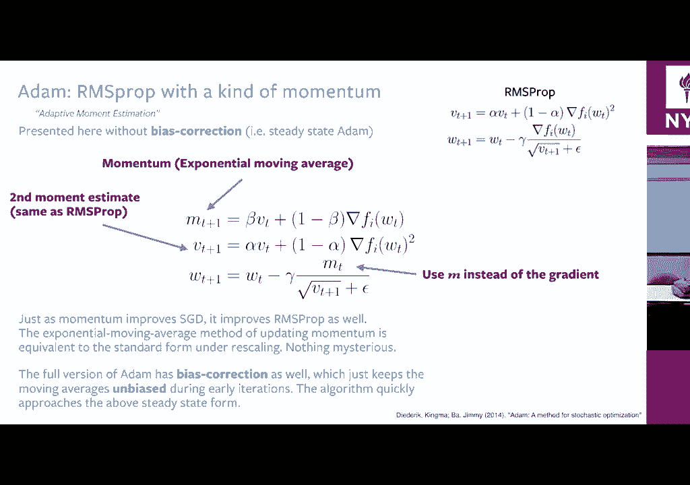

归一化层，所以这是一个聪明的主意，为什么要尝试并加盐为什么要尝试，归一化层，所以这是一个聪明的主意，为什么要尝试并加盐为什么要尝试。

并提出一个更好的优化算法，我们可以提出，并提出一个更好的优化算法，我们可以提出，更好的网络，这就是想法，现代神经网络通常我们通过添加其他来修改网络，现代神经网络通常我们通过添加其他来修改网络。

现有层之间的各个层，以及这些层改善目标的目标，现有层之间的各个层，以及这些层改善目标的目标，网络的优化和泛化性能及方式，网络的优化和泛化性能及方式，他们可以通过几种不同的方式来做到这一点。

但让我给你一个，他们可以通过几种不同的方式来做到这一点，但让我给你一个，例子，所以我们通常会采用标准的组合方式，例子，所以我们通常会采用标准的组合方式，知道在现代网络中，我们通常会交替进行线性运算。

知道在现代网络中，我们通常会交替进行线性运算，非线性运算，在这里我称之为激活函数，非线性运算，在这里我称之为激活函数，替代它们线性非线性线性非线性我们能做的是，替代它们线性非线性线性非线性我们能做的是。

将这些归一化层放置在线性阶非线性之间或，将这些归一化层放置在线性阶非线性之间或，在此之前，在这种情况下，我们正在使用这种类型的，在此之前，在这种情况下，我们正在使用这种类型的。

我们在卷积中恢复的真实网络中的结构，我们在卷积中恢复的真实网络中的结构，卷积或线性运算，然后进行批量归一化，这是，卷积或线性运算，然后进行批量归一化，这是，我将在稍后详细介绍的一种归一化类型。

我将在稍后详细介绍的一种归一化类型，其次是riilu，它是目前最流行的激活功能，我们，其次是riilu，它是目前最流行的激活功能，我们，将这种动员放在这些现有层和我想要做的之间。

将这种动员放在这些现有层和我想要做的之间，很清楚，这些归一化层会影响数据流，因此它们，很清楚，这些归一化层会影响数据流，因此它们，修改流过的数据，但它们不会改变，修改流过的数据，但它们不会改变。

网络的意义在于您可以在网络中设置权重，网络的意义在于您可以在网络中设置权重，某种方式仍然可以提供未知的变态结果，某种方式仍然可以提供未知的变态结果，网络与归一化的网络，因此您不会在归一化层。

网络与归一化的网络，因此您不会在归一化层，当我们添加时，它的功能更强大，通常会以其他方式对其进行改进，当我们添加时，它的功能更强大，通常会以其他方式对其进行改进，到神经网络的目的是使它更强大，是的。

到神经网络的目的是使它更强大，是的，归一化层也可以在激活之后或在线性或，归一化层也可以在激活之后或在线性或，你知道，因为这环绕我们这样做是为了使很多人，你知道，因为这环绕我们这样做是为了使很多人，等效。

但这里有任何问题，是这个位，是的，所以肯定，等效，但这里有任何问题，是这个位，是的，所以肯定，是的，但是我们有点想要真正的O2传感器一些数据，但是，是的，但是我们有点想要真正的O2传感器一些数据，但是。

不太多，但也不太准确，因为归一化层，不太多，但也不太准确，因为归一化层，也可以缩放和运送数据，因此虽然，也可以缩放和运送数据，因此虽然，当然是在初始化时，他们不会在船上进行缩放，当然是在初始化时。

他们不会在船上进行缩放，切断一半的数据，实际上，如果您尝试对此进行理论分析，切断一半的数据，实际上，如果您尝试对此进行理论分析，切断一半的数据非常方便，因此结构，切断一半的数据非常方便，因此结构。

归一化层，它们几乎都执行相同的操作，归一化层，它们几乎都执行相同的操作，有多少人在这里使用通用符号，所以您应该想象X是一个，有多少人在这里使用通用符号，所以您应该想象X是一个，输入到归一化层，Y是输出。

您要做的是使用，输入到归一化层，Y是输出，您要做的是使用，美白或归一化操作，其中减去一些估计值，美白或归一化操作，其中减去一些估计值，数据的平均值，然后除以一些标准估计值，数据的平均值。

然后除以一些标准估计值，偏差，并记得在此之前我提到我们要保持，偏差，并记得在此之前我提到我们要保持，网络的代表性力量相同，网络的代表性力量相同。

我们要做的是确保我们乘以一个alpha并在高度上添加一个对不起，我们要做的是确保我们乘以一个alpha并在高度上添加一个对不起，乘以一个嘿，我们加一个B，这只是为了使该层仍然可以，乘以一个嘿。

我们加一个B，这只是为了使该层仍然可以，输出任何特定范围内的值，或者如果我们总是每层都有，输出任何特定范围内的值，或者如果我们总是每层都有，以白色输出，网络无法输出价值百万或，以白色输出。

网络无法输出价值百万或，这样的事情不会，它只能以非常非常的方式做到，这样的事情不会，它只能以非常非常的方式做到，罕见的情况，因为这在正常情况下会非常沉重，罕见的情况，因为这在正常情况下会非常沉重，分布。

这样我们的图层就可以本质上输出，分布，这样我们的图层就可以本质上输出，与以前相同，是，因此规范化层具有参数和，与以前相同，是，因此规范化层具有参数和，在网络中有点复杂在传感器中有更多。

在网络中有点复杂在传感器中有更多，参数通常是很少的参数，例如舍入误差，参数通常是很少的参数，例如舍入误差，通常是在您计算网络参数时，是的，通常是在您计算网络参数时，是的。

这是关于如何计算均值和标准的一种含糊，这是关于如何计算均值和标准的一种含糊，偏离我这样做的原因是因为所有方法都在一个，偏离我这样做的原因是因为所有方法都在一个，以不同的方式。

我将详细说明第二个问题是重磅哦，这是，以不同的方式，我将详细说明第二个问题是重磅哦，这是，只是一个移位参数，因此数据可能具有非零均值，我们希望它，只是一个移位参数，因此数据可能具有非零均值，我们希望它。

延迟能够产生非零均值的输出，所以如果我们总是，延迟能够产生非零均值的输出，所以如果我们总是，减去它不能做到的意思，减去它不能做到的意思，所以它只是增加了图层的表示能力，是的，这个问题。

所以它只是增加了图层的表示能力，是的，这个问题，是不是这些a和B参数颠倒了标准化，并且in，是不是这些a和B参数颠倒了标准化，并且in，事实上，他们经常做类似的事情，但他们会以，事实上。

他们经常做类似的事情，但他们会以，不同的时间范围，因此在步骤之间或评估之间，不同的时间范围，因此在步骤之间或评估之间，网络的均值和方差可以根据，网络的均值和方差可以根据，您输入的数据。

但这些a和B参数非常稳定，它们会移动，您输入的数据，但这些a和B参数非常稳定，它们会移动，慢慢学习，因为它们最稳定，这对，慢慢学习，因为它们最稳定，这对，属性，稍后再介绍，但我想谈一谈，属性。

稍后再介绍，但我想谈一谈，正是您如何规范化数据，这是关键所在，正是您如何规范化数据，这是关键所在，所以最早开发的这些方法是批处理规范，他就是这个，所以最早开发的这些方法是批处理规范，他就是这个。

II认为这是一个可怕的想法的一种奇怪的归一化，II认为这是一个可怕的想法的一种奇怪的归一化，但不幸的是效果非常好，因此可以在多个批次之间进行标准化，但不幸的是效果非常好。

因此可以在多个批次之间进行标准化，我们需要有关卷积的某个通道召回的信息，我们需要有关卷积的某个通道召回的信息，神经网络哪个通道是您拥有的这些潜像之一，神经网络哪个通道是您拥有的这些潜像之一。

您的网络通过网络的一部分，而您却拥有一些数据，您的网络通过网络的一部分，而您却拥有一些数据，如果真的看的话，看起来真的很像图像，但是它是形状，如果真的看的话，看起来真的很像图像，但是它是形状。

就像图像一样，这是一个通道，所以我们要计算平均值，就像图像一样，这是一个通道，所以我们要计算平均值，在这个频道上，但是我们只有少量的数据，在这个频道上，但是我们只有少量的数据，如果是图像。

则该通道中的内容基本上是高度乘以宽度，如果是图像，则该通道中的内容基本上是高度乘以宽度，事实证明，没有足够的数据来获得这些均值和，事实证明，没有足够的数据来获得这些均值和，方差参数。

所以Batchman要做的是取均值和方差，方差参数，所以Batchman要做的是取均值和方差，估算迷你批次中的所有实例非常简单，估算迷你批次中的所有实例非常简单。

这就是为什么我不喜欢它的原因将它划分为蓝色，这就是为什么我不喜欢它的原因将它划分为蓝色，如果使用批量归一化，则更长的实际随机梯度下降，如果使用批量归一化，则更长的实际随机梯度下降。

所以它破坏了我为谋生而努力的所有理论，所以我更喜欢其他一些理论，所以它破坏了我为谋生而努力的所有理论，所以我更喜欢其他一些理论，实际上，在学士和人们之后不久，那里的标准化策略，实际上。

在学士和人们之后不久，那里的标准化策略，尝试通过其他所有可能的方式进行归一化，尝试通过其他所有可能的方式进行归一化，通过归一化，可以得出这三种工作：通过归一化，可以得出这三种工作：在此图中，您在所有。

在此图中，您在所有，通道和整个高度和宽度，现在无法解决所有问题，所以我，通道和整个高度和宽度，现在无法解决所有问题，所以我，只会在您知道它已经起作用的问题上推荐它，并且。

只会在您知道它已经起作用的问题上推荐它，并且，人们通常已经在使用它，因此通常要看一下，人们通常已经在使用它，因此通常要看一下，网络的人正在使用，如果这是一个好主意，将取决于，网络的人正在使用。

如果这是一个好主意，将取决于，实例规范化是现代语言中经常使用的东西，实例规范化是现代语言中经常使用的东西，型号，您不再在批次中平均了，这很好，我，型号，您不再在批次中平均了，这很好，我。

我们不会谈论那么多的深度吗？我们不会谈论那么多的深度吗？您在实践中使用的是组归一化，所以在这里我们有，您在实践中使用的是组归一化，所以在这里我们有，跨越一组渠道，这组被困是任意选择的，跨越一组渠道。

这组被困是任意选择的，并在一开始就固定好了，所以通常我们只按数字对事物进行分组，并在一开始就固定好了，所以通常我们只按数字对事物进行分组，频道0到10将是您知道10到的群组频道。

频道0到10将是您知道10到的群组频道，20确保您当然不会重叠不相交的频道组，20确保您当然不会重叠不相交的频道组，这些组的大小是您需要调整的参数，尽管我们总是，这些组的大小是您需要调整的参数。

尽管我们总是，在实践中使用32，您可以对其进行调整，因为没有，在实践中使用32，您可以对其进行调整，因为没有，在单个通道上使用足够的信息并使用所有通道太多，在单个通道上使用足够的信息并使用所有通道太多。

所以你只是在两者之间使用一个东西，这真的是一个很简单的想法，所以你只是在两者之间使用一个东西，这真的是一个很简单的想法，事实证明，这种群体规范通常比批量正常要好很多，事实证明。

这种群体规范通常比批量正常要好很多，问题，这确实意味着我研究的HUD理论仍然很平衡，问题，这确实意味着我研究的HUD理论仍然很平衡，所以我喜欢，那么为什么归一化可以帮助解决这个问题呢？

那么为什么归一化可以帮助解决这个问题呢？几年来有几篇关于这个主题的论文，几年来有几篇关于这个主题的论文，不幸的是，这些论文没有就其为何起作用达成共识，他们都完全，不幸的是。

这些论文没有就其为何起作用达成共识，他们都完全，单独的解释，但肯定会发生某些事情，单独的解释，但肯定会发生某些事情，因此我们可以确定它的形状，可以肯定地说，网络看起来更容易，因此我们可以确定它的形状。

可以肯定地说，网络看起来更容易，进行优化，这意味着您可以更好地利用较大的学习率，进行优化，这意味着您可以更好地利用较大的学习率，条件网络，您可以使用更大的学习率，因此会更快，条件网络。

您可以使用更大的学习率，因此会更快，收敛，因此当您使用归一化层时似乎确实如此，收敛，因此当您使用归一化层时似乎确实如此，另一个有争议的因素，但我认为这是合理的，另一个有争议的因素，但我认为这是合理的。

公认的，您在传递数据时会受到干扰，公认的，您在传递数据时会受到干扰，通过您的网络使用阴道正常化时，这种噪音，通过您的网络使用阴道正常化时，这种噪音，来自bash中的其他实例，因为它是我喜欢的随机对象。

来自bash中的其他实例，因为它是我喜欢的随机对象，当您使用其他实例计算平均值时，实例在您的批次中，当您使用其他实例计算平均值时，实例在您的批次中，意味着嘈杂的实例，然后添加或减去此噪声。

意味着嘈杂的实例，然后添加或减去此噪声，从您的体重出发，因此当您执行归一化操作时，此噪声为，从您的体重出发，因此当您执行归一化操作时，此噪声为，实际上有可能帮助您提高综合性能。

实际上有可能帮助您提高综合性能，网络现在有很多关于注入噪声的论文互联网作品，网络现在有很多关于注入噪声的论文互联网作品，有助于一般化，因此发出这种噪音并不是一个疯狂的主意，有助于一般化。

因此发出这种噪音并不是一个疯狂的主意，从实际考虑出发，这种标准化有助于，从实际考虑出发，这种标准化有助于，您使用的权重初始化不那么重要了，它曾经是，您使用的权重初始化不那么重要了，它曾经是。

选择初始化您的新网络以及，选择初始化您的新网络以及，真正好的动机常常是因为他们真的很擅长改变，真正好的动机常常是因为他们真的很擅长改变，它们的初始化，现在当我们使用，它们的初始化，现在当我们使用。

归一化层，如果可以将它们平铺在一起，也可以带来好处，归一化层，如果可以将它们平铺在一起，也可以带来好处，有罪不罚的图层，所以这曾经是这样的情况，如果您只是插入，有罪不罚的图层，所以这曾经是这样的情况。

如果您只是插入，您网络中的两种可能方式现在可能无法正常工作，您网络中的两种可能方式现在可能无法正常工作，我们使用归一化层可能会起作用，即使它是一个，我们使用归一化层可能会起作用，即使它是一个。

可怕的想法，这刺激了整个自动化架构领域，可怕的想法，这刺激了整个自动化架构领域，搜索他们只是随机地平静在一起的积木，然后尝试，搜索他们只是随机地平静在一起的积木，然后尝试，成千上万的人，看看有什么用。

而这实际上是不可能的，成千上万的人，看看有什么用，而这实际上是不可能的，因为这通常会导致网络条件差，您无法，因为这通常会导致网络条件差，您无法，训练，通过标准化，您通常可以进行一些实用的训练，训练。

通过标准化，您通常可以进行一些实用的训练，考虑因素，所以单身汉在纸上不是，考虑因素，所以单身汉在纸上不是，较早发明是一种非显而易见的事情，你必须支持，较早发明是一种非显而易见的事情，你必须支持。

如果不这样做，则通过平均值和标准偏差的计算来传播，如果不这样做，则通过平均值和标准偏差的计算来传播，这样做，一切都会炸毁，您可能需要自己做，因为那样会，这样做，一切都会炸毁，您可能需要自己做。

因为那样会，在您使用的实现中实现哦，是的，所以我没有，在您使用的实现中实现哦，是的，所以我没有，专业的回答，我觉得有时候是，专业的回答，我觉得有时候是，专利宠物方法就像人们喜欢穿着西装通常在那个领域。

专利宠物方法就像人们喜欢穿着西装通常在那个领域，更多，事实上，这是一个很好的规范，如果您的人数是小组人数的两倍，那么我，更多，事实上，这是一个很好的规范，如果您的人数是小组人数的两倍，那么我。

将确保您使用组可能获得相同的性能，将确保您使用组可能获得相同的性能，精心选择特定群体规模的规范，精心选择特定群体规模的规范，是的，选择National确实会影响并行化，因此实施，是的。

选择National确实会影响并行化，因此实施，您的计算机库或CPU库中的锌对于，您的计算机库或CPU库中的锌对于，这些都很复杂，但是当您扩展计算时会很复杂，这些都很复杂，但是当您扩展计算时会很复杂。

跨机器，您必须同步这些东西，并且，跨机器，您必须同步这些东西，并且，批处理规范在那里有点痛苦，因为这意味着您需要，批处理规范在那里有点痛苦，因为这意味着您需要，计算所有计算机和聚合器的平均值。

而如果使用，计算所有计算机和聚合器的平均值，而如果使用，组规范每个实例都在不同的计算机上，组规范每个实例都在不同的计算机上，完全计算范数，因此在所有其他三个中，它是独立的，完全计算范数。

因此在所有其他三个中，它是独立的，每个实例的规范化不依赖于其他实例，每个实例的规范化不依赖于其他实例，批次，因此在分发时效果更好，批次，因此在分发时效果更好，当人们在集群上使用批处理规范时。

他们实际上并不同步统计信息，当人们在集群上使用批处理规范时，他们实际上并不同步统计信息，跨度使它甚至不像SGD一样使我更加恼火，所以，跨度使它甚至不像SGD一样使我更加恼火，所以，是的。

单身汉基本上有很多，是的，单身汉基本上有很多，动量不是在优化意义上而是在人们的思想意义上，动量不是在优化意义上而是在人们的思想意义上，因此，它被大量使用，但我建议使用组规范，因此，它被大量使用。

但我建议使用组规范，而且有些像技术数据那样具有批处理规范，您不想，而且有些像技术数据那样具有批处理规范，您不想，在评估期间按批次计算这些均值和标准差，在评估期间按批次计算这些均值和标准差。

时间是评估时间，是指您在测试中实际运行网络的时间，时间是评估时间，是指您在测试中实际运行网络的时间，数据集，或者我们在现实世界中将其用于某些应用程序，通常用于，数据集。

或者我们在现实世界中将其用于某些应用程序，通常用于，那些情况下您没有批次或更多批次需要培训，那些情况下您没有批次或更多批次需要培训，东西，所以在这种情况下您需要一些替代，就可以计算出指数，东西。

所以在这种情况下您需要一些替代，就可以计算出指数，我们之前谈到的移动均线和均线和均线的EMA，我们之前谈到的移动均线和均线和均线的EMA，您可能会认为自己存在偏差，为什么我们不使用EMA。

您可能会认为自己存在偏差，为什么我们不使用EMA，批处理规范的实现答案是因为它似乎无法正常工作，批处理规范的实现答案是因为它似乎无法正常工作，就像一个非常合理的想法，人们对此进行了探索。

就像一个非常合理的想法，人们对此进行了探索，很多深度，但是没有用哦，是的，这非常关键，所以人们，很多深度，但是没有用哦，是的，这非常关键，所以人们，尝试在批处理规范之前对神经网络中的事物进行规范化。

尝试在批处理规范之前对神经网络中的事物进行规范化，发明了，但他们总是犯这样的错误：发明了，但他们总是犯这样的错误：均值和标准差以及他们不这样做的原因是，均值和标准差以及他们不这样做的原因是。

因为数学真的很棘手，如果您自己尝试实现它，它将，因为数学真的很棘手，如果您自己尝试实现它，它将，既然我们有计算梯度的饼图，可能就错了，既然我们有计算梯度的饼图，可能就错了。

在所有情况下都能为您正确地做到这一点，在所有情况下都能为您正确地做到这一点，只有一点点，但只有一点点，因为这令人惊讶，只有一点点，但只有一点点，因为这令人惊讶，很难，所以问题是，如果我们申请，很难。

所以问题是，如果我们申请，归一化之后比非线性和答案在那里，归一化之后比非线性和答案在那里，现在，您的网络性能会有些许差异，现在，您的网络性能会有些许差异，告诉你哪个更好，因为它在某些情况下会起作用。

告诉你哪个更好，因为它在某些情况下会起作用，在其他情况下稍微好一点，其他人可以更好地工作，在其他情况下稍微好一点，其他人可以更好地工作，告诉你我的绘制方式是PI项目中使用的方式。

告诉你我的绘制方式是PI项目中使用的方式，ResNet的实现和大多数共振的实现，因此，ResNet的实现和大多数共振的实现，因此，可能几乎和您能得到的一样好，我认为如果，可能几乎和您能得到的一样好。

我认为如果，更好，这当然是问题所在，这是其中的另一个，更好，这当然是问题所在，这是其中的另一个，可能没有正确答案的事情，那是，可能没有正确答案的事情，那是，只是随机效果更好我不知道是的，是的。

还有其他问题吗，只是随机效果更好我不知道是的，是的，还有其他问题吗，在继续之前，请先获取更多数据以获取准确的估算值，在继续之前，请先获取更多数据以获取准确的估算值，均值和标准差问题是为什么。

均值和标准差问题是为什么，跨多个渠道而不是单个渠道进行计算，是的，跨多个渠道而不是单个渠道进行计算，是的，是因为您只是有更多数据可以做出更好的估算，但您想，是因为您只是有更多数据可以做出更好的估算。

但您想，请注意，您没有太多的数据，因为那样您将无法获得，请注意，您没有太多的数据，因为那样您将无法获得，并记录下噪音实际上是有用的，所以基本上，并记录下噪音实际上是有用的，所以基本上。

组规范的大小只是调整我们基本上具有的噪声量，组规范的大小只是调整我们基本上具有的噪声量，问题是，这与群卷积有什么关系？问题是，这与群卷积有什么关系？在使用良好的卷积之前是先驱者，它肯定有一些相互作用。

在使用良好的卷积之前是先驱者，它肯定有一些相互作用，使用组卷积，如果您要使用它们，那么您需要，使用组卷积，如果您要使用它们，那么您需要，小心在那里，我不知道到底该做什么是正确的，小心在那里。

我不知道到底该做什么是正确的，情况，但我可以告诉您，在这些情况下，他们肯定会使用规范化，情况，但我可以告诉您，在这些情况下，他们肯定会使用规范化，由于我提到的势头。

Batchelor可能比团体规范更重要，由于我提到的势头，Batchelor可能比团体规范更重要，是阴道比较流行，所以问题是我们是否曾经使用过贝克，是阴道比较流行，所以问题是我们是否曾经使用过贝克。

组规范中的小批量生产实例还是总是一个实例，组规范中的小批量生产实例还是总是一个实例，实例，我们总是只使用一个实例，因为有很多，实例，我们总是只使用一个实例，因为有很多，这样做的好处是。

它在实现和理论上都非常简单，这样做的好处是，它在实现和理论上都非常简单，也许您可以从中得到一些改善，实际上我敢打赌您有一篇论文，也许您可以从中得到一些改善，实际上我敢打赌您有一篇论文，之所以这样做。

是因为他们尝试过在，之所以这样做，是因为他们尝试过在，实践中，我怀疑它是否运作良好，所以我们可能会使用它。

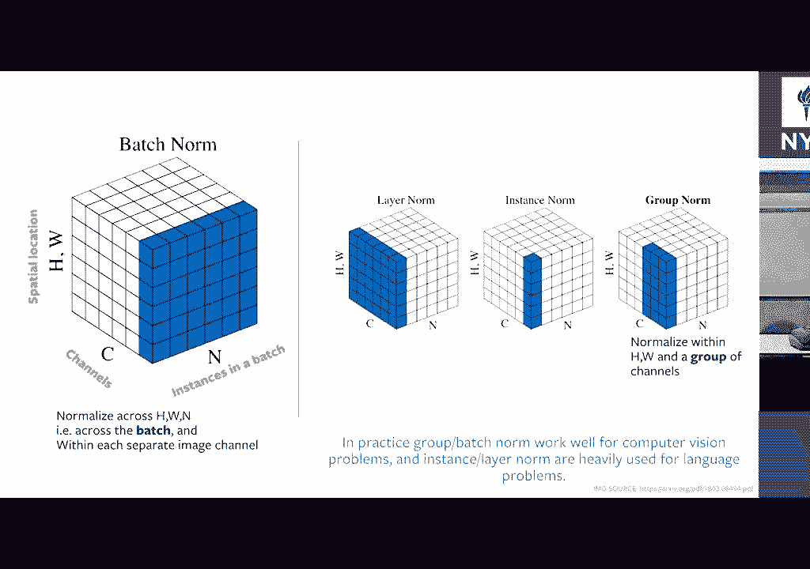

实践中，我怀疑它是否运作良好，所以我们可能会使用它，在我想提出的优化失败的背景下，可能效果不佳，在我想提出的优化失败的背景下，可能效果不佳。

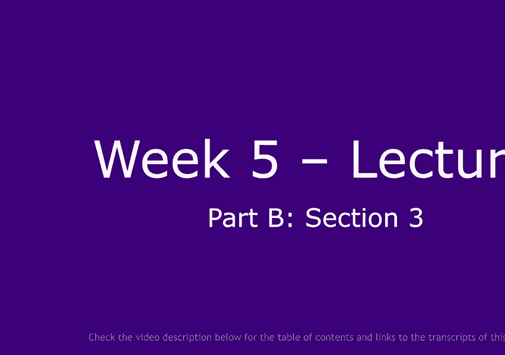

有点有趣，因为你们都坐在那里，有点有趣，因为你们都坐在那里，这是一场非常密集的演讲，所以这是我一直在做的，这是一场非常密集的演讲，所以这是我一直在做的，我有点工作，我想你可能会发现有趣，所以你可能有。

我有点工作，我想你可能会发现有趣，所以你可能有，在这里看到了我修改过的xkcd漫画，并不总是这样，在这里看到了我修改过的xkcd漫画，并不总是这样，它的意义所在，所以有时我们可以闯入一个领域。

它的意义所在，所以有时我们可以闯入一个领域，我们对此一无所知，并改进了他们目前的做法，尽管，我们对此一无所知，并改进了他们目前的做法，尽管，您必须要小心一点，所以我要谈的问题是，您必须要小心一点。

所以我要谈的问题是，我认为那个年轻人在第一堂课中曾简要提到过，但我想，我认为那个年轻人在第一堂课中曾简要提到过，但我想，现在是MRI重建问题中的MRI重建，现在是MRI重建问题中的MRI重建。

我们从MRI机上获取原始数据，医学成像机上，我们获取原始数据，我们从MRI机上获取原始数据，医学成像机上，我们获取原始数据，从那台机器上，我们重建图像，并且有一些管道，从那台机器上，我们重建图像。

并且有一些管道，中间产生图像和目标的算法，中间产生图像和目标的算法，基本上是要取代30年的研究，他们应该使用哪种算法，基本上是要取代30年的研究，他们应该使用哪种算法，将它们与神经网络配合使用。

因为那是我要得到的报酬，将它们与神经网络配合使用，因为那是我要得到的报酬，我会给你一些细节，以便这些MRI机器捕获，我会给你一些细节，以便这些MRI机器捕获，所谓的傅立叶域，我知道你们中很多人。

所谓的傅立叶域，我知道你们中很多人，处理你们中的一些人可能不知道这是什么，并且您不需要，处理你们中的一些人可能不知道这是什么，并且您不需要，了解这个问题哦，是的，是的。

所以您可能在一维的情况下看到了更多领域，是的，所以您可能在一维的情况下看到了更多领域，因此对于神经网络，对于MRI重建感到抱歉，我们有二维，因此对于神经网络，对于MRI重建感到抱歉，我们有二维。

傅立叶域您需要知道的是它是线性映射，傅立叶域您需要知道的是它是线性映射，从流体域到图像域，它都是线性的，非常有效，从流体域到图像域，它都是线性的，非常有效，不管您有多大，映射都要花费毫秒，不管您有多大。

映射都要花费毫秒，现代计算机上的图像如此线性且易于在之间来回转换，现代计算机上的图像如此线性且易于在之间来回转换，这两个和MRI机器实际上捕获了此行或列，这两个和MRI机器实际上捕获了此行或列。

傅立叶域作为样本在文献中被称为样本，傅立叶域作为样本在文献中被称为样本，机器会每隔几毫秒计算一次样本，机器会每隔几毫秒计算一次样本，该图像的列，实际上从技术上讲，它是一个复数值，该图像的列。

实际上从技术上讲，它是一个复数值，图片，但这对我的讨论无关紧要，因此您可以想象它是，图片，但这对我的讨论无关紧要，因此您可以想象它是，只是两个频道的图像，如果您想象一个真实和虚构的频道。

只是两个频道的图像，如果您想象一个真实和虚构的频道，它们作为颜色通道，我们要解决的问题是。

它们作为颜色通道，我们要解决的问题是，加速MRI加速是指更快，因此我们要运行，加速MRI加速是指更快，因此我们要运行，机器更快地产生相同质量的图像，机器更快地产生相同质量的图像，到目前为止。

我们可以以最成功的方式做到这一点的一种方式是，到目前为止，我们可以以最成功的方式做到这一点的一种方式是，捕获所有列，我们只是随机跳过一些列，这在，捕获所有列，我们只是随机跳过一些列，这在。

练习还捕获其中包含的一些中间列，练习还捕获其中包含的一些中间列，很多信息，但在中间之外，我们只是随机捕获，我们，很多信息，但在中间之外，我们只是随机捕获，我们，不能再使用一个好的线性运算了。

不能再使用一个好的线性运算了，右边的图是我提到的线性运算的输出，右边的图是我提到的线性运算的输出，应用于此数据，所以它不会给有用的苹果，他们只会做一些，应用于此数据，所以它不会给有用的苹果。

他们只会做一些，在我继续之前，对此有更多疑问。

在我继续之前，对此有更多疑问，它是频率和相位尺寸，所以在这种特殊情况下，我实际上是，它是频率和相位尺寸，所以在这种特殊情况下，我实际上是，确保此图的一维是频率，一维是相位，并且，确保此图的一维是频率。

一维是相位，并且，值是具有该频率和相位的正弦波的幅度，因此，如果您，值是具有该频率和相位的正弦波的幅度，因此，如果您，将所有正弦波加在一起以频率oh挥动它们，将所有正弦波加在一起以频率oh挥动它们。

这张图片的重量就得到了原始图片，所以有点，这张图片的重量就得到了原始图片，所以有点，更复杂，因为它是二维的，正弦波必须，更复杂，因为它是二维的，正弦波必须，稍微小心一点，但是基本上每个像素都是一个。

稍微小心一点，但是基本上每个像素都是一个，正弦波或如果您想与一维类比进行比较，正弦波或如果您想与一维类比进行比较，您只有频率，所以像素强度就是，您只有频率，所以像素强度就是，如果您有音符，请说出频率。

例如以C大调为其中之一的钢琴音，如果您有音符，请说出频率，例如以C大调为其中之一的钢琴音，该图像将是一个像素的频率将是C大调，该图像将是一个像素的频率将是C大调。

频率和另一个可能是未成年人或类似的东西和幅度，频率和另一个可能是未成年人或类似的东西和幅度，只是他们在钢琴上按琴键有多难，所以你有频率。

只是他们在钢琴上按琴键有多难，所以你有频率，信息是的，所以视频不起作用那是最大的视频之一。

信息是的，所以视频不起作用那是最大的视频之一，长期以来，Threat Achill数学的突破是，长期以来，Threat Achill数学的突破是，压缩感知的发明我敢肯定，你们中的一些人听说过压缩。

压缩感知的发明我敢肯定，你们中的一些人听说过压缩，感觉到手的显示的手被压缩感觉是的，你们中的一些人，感觉到手的显示的手被压缩感觉是的，你们中的一些人，特别是数学科学领域的工作会意识到这一点。

特别是数学科学领域的工作会意识到这一点，基本上，这是一份非凡的政治论文，表明我们，基本上，这是一份非凡的政治论文，表明我们，理论上可以从这些子采样中获得完美的重构。

理论上可以从这些子采样中获得完美的重构，测量，我们对此有一些要求，测量，我们对此有一些要求，要求是我们需要随机抽样，要求是我们需要随机抽样，实际上，您必须不连贯地采样，但实际上有点弱，实际上。

您必须不连贯地采样，但实际上有点弱，每个人都随机取样，所以这里基本上是同一件事，每个人都随机取样，所以这里基本上是同一件事，我们是对列进行随机抽样，但在列内我们不是随机抽样，我们是对列进行随机抽样。

但在列内我们不是随机抽样，采样的原因是它在机器上的速度不是更快，采样的原因是它在机器上的速度不是更快，捕获一列的速度要快于捕获一列的速度，所以我们只是，捕获一列的速度要快于捕获一列的速度，所以我们只是。

捕获整个列，从而使其不再是随机的，这是一种，捕获整个列，从而使其不再是随机的，这是一种，另一个问题是假设，另一个问题是假设，我们想要的那种图像违反了这种压缩感知理论。

我们想要的那种图像违反了这种压缩感知理论，重建我在右边显示给您看，它们是压缩感知的一个例子，重建我在右边显示给您看，它们是压缩感知的一个例子，理论重构这是他们所能做的一大步。

理论重构这是他们所能做的一大步，在您获得之前类似的东西之前。

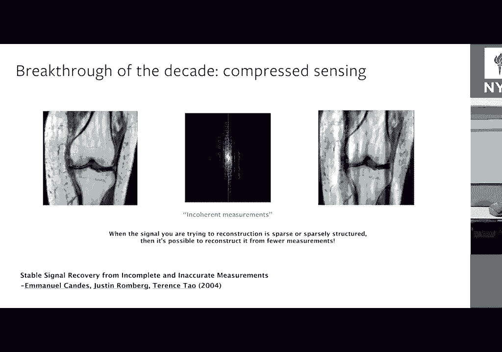

在您获得之前类似的东西之前，真的被认为是最好的，事实上，当结果出来时，有些人会。

真的被认为是最好的，事实上，当结果出来时，有些人会，发誓虽然这是不可能的，但实际上不是，但是您需要一些，发誓虽然这是不可能的，但实际上不是，但是您需要一些，假设和这些假设非常关键，我在那里提到。

假设和这些假设非常关键，我在那里提到，所以您现在需要图像的稀疏性，所以您现在需要图像的稀疏性，我的意思是它有很多零像素或黑色像素，这显然不是稀疏的，但是，我的意思是它有很多零像素或黑色像素。

这显然不是稀疏的，但是，可以稀疏或近似稀疏表示，可以稀疏或近似稀疏表示，小波分解现在我不会去谈细节了，小波分解现在我不会去谈细节了，问题，虽然它只是大约稀疏，当您执行该小波，问题，虽然它只是大约稀疏。

当您执行该小波，分解，这就是为什么这不是完美的重建的原因，分解，这就是为什么这不是完美的重建的原因，在小波域中稀疏，而完全在，在小波域中稀疏，而完全在，与左图相同，并且这种压缩感测基于，与左图相同。

并且这种压缩感测基于，在优化领域，它振兴了许多技术，在优化领域，它振兴了许多技术，人们已经使用很长时间了，您获得这种重建的方式是，人们已经使用很长时间了，您获得这种重建的方式是。

您可以在每张图片的每一步上解决一些小型优化问题，您可以在每张图片的每一步上解决一些小型优化问题，您要重建其他几台计算机，因此您的计算机必须解决，您要重建其他几台计算机，因此您的计算机必须解决。

每次解决这个小问题时每个图像的优化问题，每次解决这个小问题时每个图像的优化问题，这种复杂的正则化项的二次问题，所以这，这种复杂的正则化项的二次问题，所以这，对优化或所有这些获得低薪水的人非常有用。

对优化或所有这些获得低薪水的人非常有用，大学的工作突然间他们的研究很时髦，大学的工作突然间他们的研究很时髦，公司需要他们的帮助，所以这很棒，但是我们可以做得更好，所以我们，公司需要他们的帮助。

所以这很棒，但是我们可以做得更好，所以我们，而不是在每个步骤都解决这个最小化问题，我将使用，而不是在每个步骤都解决这个最小化问题，我将使用，神经网络显然很随意地在这里代表巨大的。

神经网络显然很随意地在这里代表巨大的，您的网络当然很重要，我们希望我们可以在您的网络中学习，您的网络当然很重要，我们希望我们可以在您的网络中学习，如此复杂，以至于基本上可以解决优化问题，如此复杂。

以至于基本上可以解决优化问题，问题只需一步就可以输出与，问题只需一步就可以输出与，优化问题解决方案，现在认为这是不可能的15，优化问题解决方案，现在认为这是不可能的15，几年前，我们知道得更多。

所以实际上我们并不困难，几年前，我们知道得更多，所以实际上我们并不困难，可以举一个例子，我们可以解决其中的一些我的意思是像一些，可以举一个例子，我们可以解决其中的一些我的意思是像一些。

这些优化问题中的十万个作为解决方案和输入，这些优化问题中的十万个作为解决方案和输入，我们将紧张神经网络以从输入映射到解决方案，我们将紧张神经网络以从输入映射到解决方案，实际上有点次优。

因为在某些情况下我们变得虚弱了，我们知道，实际上有点次优，因为在某些情况下我们变得虚弱了，我们知道，比优化问题的解决方案更好的解决方案，比优化问题的解决方案更好的解决方案，通过测量患者。

这就是我们在实践中实际要做的，所以我们不会，通过测量患者，这就是我们在实践中实际要做的，所以我们不会，尝试解决优化问题，我们尝试使问题变得更好。

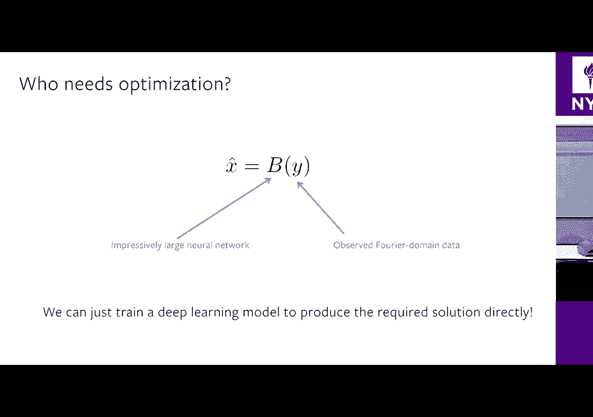

尝试解决优化问题，我们尝试使问题变得更好，解决方案，它确实很好用，所以我给你一个非常简单的例子，解决方案，它确实很好用，所以我给你一个非常简单的例子，因此，这比压缩感官要好得多，因此。

这比压缩感官要好得多，使用神经网络进行重建，该网络涉及技巧，使用神经网络进行重建，该网络涉及技巧，我已经提到过，所以它是使用Adam训练的，它使用组规范归一化，我已经提到过，所以它是使用Adam训练的。

它使用组规范归一化，层和卷积神经网络，正如您已经教过的那样，层和卷积神经网络，正如您已经教过的那样，使用一种称为u网的技术，您可能会在以后的课程中，使用一种称为u网的技术，您可能会在以后的课程中。

可以肯定，但这并不是对它的一个非常复杂的修改，可以肯定，但这并不是对它的一个非常复杂的修改，是的，这是您可以做的事情，这是非常，是的，这是您可以做的事情，这是非常，接近实际应用。

因此您将看到这些加速的MRI，接近实际应用，因此您将看到这些加速的MRI，仅在几年内就在临床实践中进行扫描，这很累，仅在几年内就在临床实践中进行扫描，这很累，蒸气器，是的，这就是我想谈的一切，蒸气器。

是的，这就是我想谈的一切，今天的优化和优化的终结谢谢。

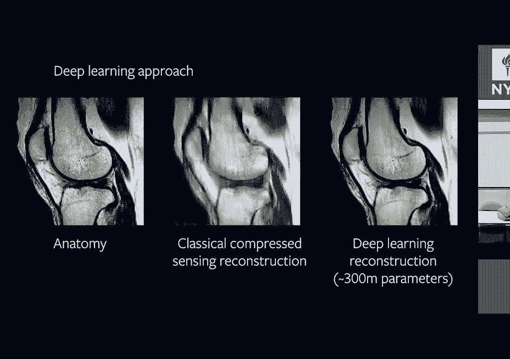

今天的优化和优化的终结谢谢。

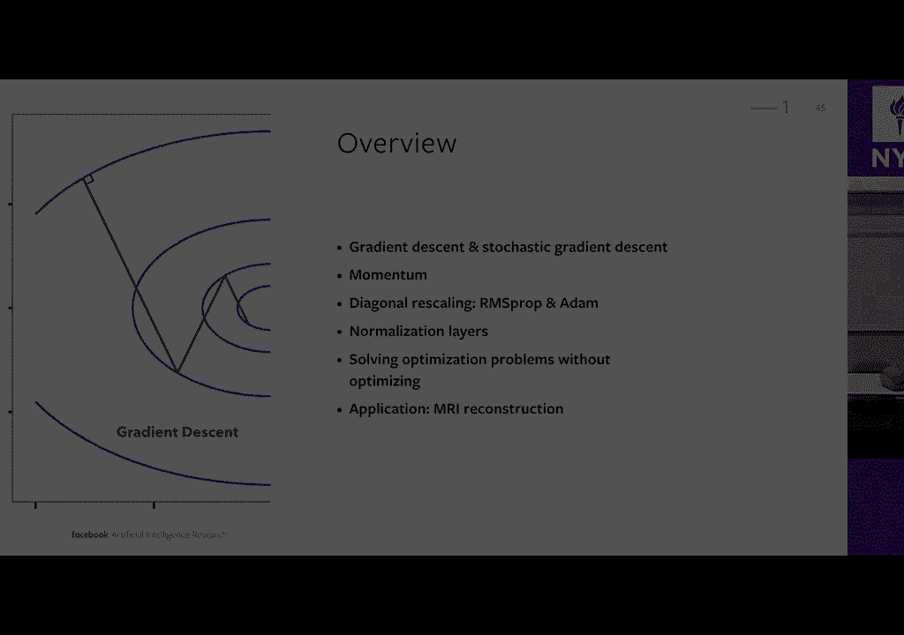