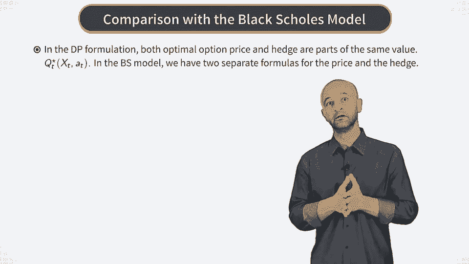
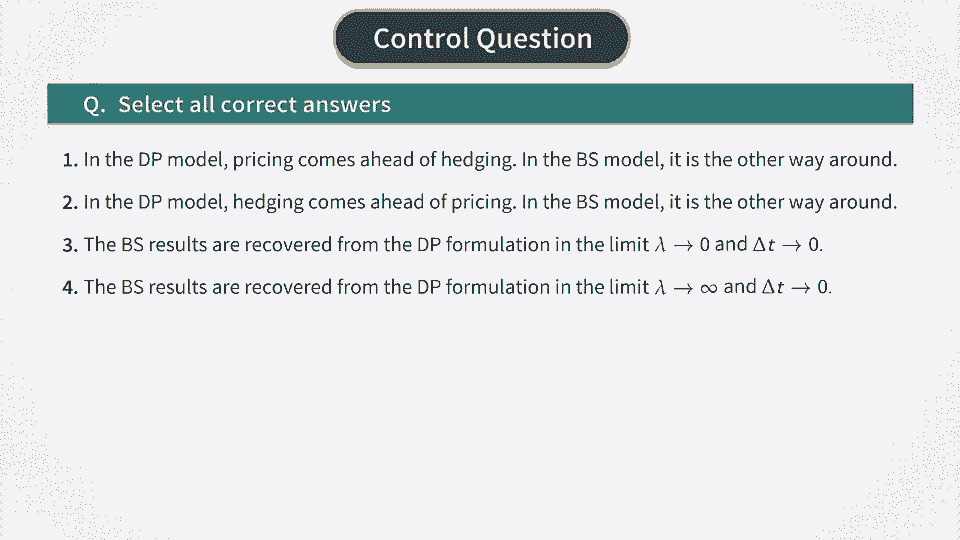

# P18：MDP for BSM - Q星的向后递归 - 兰心飞侠 - BV14P4y1u7TB

现在，在我们查看了最优动作或对冲是如何计算的之后，我们可以将两个主要公式结合起来，从而为期权的对冲和定价问题提供一个算法解决方案。

因此，我们得到了最优Q函数的递归关系，它适用于任何18的值。

这是由这里的第一个方程给出的。但我们已经计算了当前时间步T的最优动作A星，这是由这里的第二个方程给出的。

所以我们可以将第二个方程代入第一个方程，从而得到最优Q函数的递归关系Q星，该函数直接在最优动作A星处求值。这非常方便，因为它不需要额外的存储来保存其他动作值的Q星。如果我们最终的目标是在时间T等于零时评估Q星。

这就直接作用于最优动作A星，因此Q星和A星的逼近是我们所需要的。这确实是我们所需要的，如果我们现在要找出期权在时间T等于零时的最优价格和对冲。这是因为Q星在A等于A星时与V星相同，正如我们之前看到的那样。

但V星恰好是最优期权价格的负值，这符合我们对价值函数V的定义。因此，我们从时间T减一开始递归运行这两个公式，然后是T减二，依此类推，直到当前时间T等于零。

在每个时间步骤，我们首先从第二个方程计算出最优动作A星，然后将其代入第一个方程的右边。这给了我们一个简单的递归算法，用于计算最优对冲A零星和最优Q函数Q零星在A星处的值。

通过翻转符号，最后一个数字给出了期权价格。因此，总结这个过程，我们可以这样说：我们从时间T等于零开始，向后递归，一直到期权的最优对冲和价格。整个计算是半解析的，因为在每个时间步骤解决的优化问题是二次的。因此，可以像我们刚才做的那样半解析地解决。

另一个要点是，通常动态规划和强化学习的算法需要对动作空间进行总结性展示。更进一步，它们通常在适用于离散动作空间、连续动作空间或两者之间有所不同。

但在我们的设置中，由于可以获得最优对冲A*的解析公式，我们可以应用向后递归直接计算在最优对冲A*值处评估的Q*函数。因为在这个计算中我们只使用一个AT值，即最优值，所以在这种设置中不需要表示行动空间。

所以我们刚刚在离散时间马尔科夫决策过程（MDP）模型中得到了关于最优期权价格和对冲的算法解法。现在让我们将其与经典的黑-舒尔斯模型进行比较。

我们可以注意到的第一点是，在我们的公式中，对冲和价格是Q*表达式的一部分。

这与黑-舒尔斯模型不同，黑-舒尔斯模型中期权价格和对冲有两个独立的公式。

此外，在黑-舒尔斯模型中，我们首先通过求解黑-舒尔斯方程来计算期权价格，然后才计算期权对冲。

通过对该价格对股票价格求导来得到期权的对冲。

但在我们的MDP公式中，这些操作的顺序恰好相反。在每个时间步C中，我们首先计算最优对冲，然后将其代入Q*函数，并将其向后滚动。这个过程是直观的，实际上对应于市场上期权操作的实践，这些操作不频繁调整，比如每月一次。对于这种期权，风险显然存在，因为它无法被对冲掉。

期权价格是基于此类风险的分析来决定的。但如果我们遵循黑-舒尔斯模型，它假设我们可以在时间上持续对冲。这意味着，按照黑-舒尔斯模型，我们可以每秒钟或每毫秒重新对冲，从而完全消除期权中的任何风险。为了实现这一点，我们只需要在每毫秒内，在我们的对冲组合中保持股票的黑-舒尔斯delta的精确数值。

这意味着在连续时间的极限下，对冲变得微不足道，整个问题中唯一不容忽视的部分是定价，定价通过黑-舒尔斯方程来求解。我们可以将黑-舒尔斯模型中风险消失的过程分为两个步骤。

首先，如果我们保持lambda和delta t都大于零，我们就有一个具有二次风险的MDP问题，并且目标函数、期权价格和最优对冲之间有直接联系。现在，如果我们将lambda设为零，但仍然保持delta t为有限值，那么期权价格和最优对冲之间就不再有直接联系，因为没有合适的目标函数将它们关联起来。

但是风险依然存在，我们仍然可以在这种情况下进行二次风险对冲。当lambda和delta t都为零时，我们回到了黑-斯科尔斯模型，该模型声称期权没有任何风险，因为如果我们能够始终对冲，就可以将所有风险对冲掉。

当然，这是完全不现实的，忽视期权中实际风险的代价就是黑-斯科尔斯方程的美丽。另一方面，类似我在这里展示的离散时间模型虽然没有期权价格的闭式解，但它们更加现实，因为它们明确地对期权中的风险进行了建模。

当lambda和delta t都大于零时，MDP模型提供了一个一致的对冲和定价公式，考虑了期权中的剩余风险。我们刚刚看到一个简单的算法实现了这一点。

所以让我们停顿一下，接下来的视频中我们将看到如何实现这个算法。[BLANK_AUDIO]。

