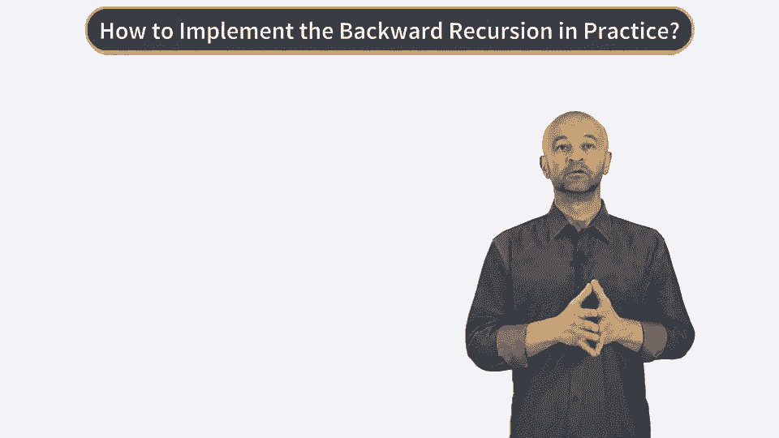

# P19：Monte Carlo - Basis Functions - 兰心飞侠 - BV14P4y1u7TB

 In the last lesson we derived an algorithmic solution to the problem of optimal hedging and pricing in our MDP option pricing model。

 To remind you these equations， they are given again here。

 So the backward recursion algorithm says that we have to run two equations shown here backwards in time starting from time capital T minus 1 and all the way back to the current time T。

 But as we already noticed on several occasions， these relations involve different conditional expectations。 So the question would be how we should compute these conditional expectations。 Now I would like to remind you that here we assume a Monte Carlo setting where a conditional conditioning informational set at time team that we called earlier F sub T is given by a set of all Monte Carlo paths up to up to time team。 So with this definition of conditional expectations， all is left to learn is how to compute them。

 Let's take a look first at how such expectations could be calculated in a discrete state setting。 We have mentioned in the last lesson that we could discretize if we wanted our MDP model using a Markov chain approximation to the Black Scholes model。 In this setting， we would have a finite set XM of different admissible values of the state variable X team。 where N would run between one and one and M and M would be the number of states in our discrete state setting。

 We would then have some values QN at this node。 These values can also be thought of as discrete valued function of a discrete value argument X team。 Now we can use an index free notation shown here to write it as a discrete valued function of X。 We simply take a sum of all QN's multiplied by the value of chronicle symbol of X and XN。 which is equal to one when X is equal to XN and equal zero otherwise。

 This formula simply produces an identity for each possible value of X that can appear as an argument of QX。 But the advantage of using such formula is that it's now valid for any input X。 similar to vector valued expressions in linear algebra that are valid for all elements of a vector。 We can now replace the delta symbol in this sum by a bit more suggestive notation phi N of X。

 which splits the two arguments of the delta symbol。 And so phi N of X is computed the same way as the delta symbol。 but now we can interpret it as what is called one-hot encoding of feature X。 How does this work？

 Let's take some fixed value of M and consider the function phi N of X for this M。 Now for a given input X， this function will be equal zero unless X can size with the node value XN。 Functions with such one-hot encoding can be called one-hot basis functions。 And the whole sum for QX can now be interpreted as an expansion in these basis functions。

 You may wonder what's the point of looking at such expansion given then it's extremely sparse。 In fact， only one value in the whole sum is nonzero here。 Well， this is certainly true。 but the main point of writing things this way is that it can now be generalized to a continuous state formulation。 All we need to do for a continuous state case， which is our assumed setting here。

 here is to replace delta peak-like basis functions that we had in the discrete state case。 By there are smooth-doubt versions。 Here you can see a set of 12 basis functions that we will be using going forward。 This is not the only choice for a continuous space formulation。 but is a very convenient one and we'll solve our needs， so we will stick to this one going forward。

 These basis functions are called B-splines。 Let's talk a bit on how these B-splines are constructed。 B-splines are very useful for problems of interpolation when we want to interpolate some function between node points X0 to Xm by a continuous and smooth-spline function of order n。

 With these splines， this is done as holes。 First， with additional node points。 X sub minus n to X sub minus 1 to the left of X0 and nodes X sub m plus 1 to X sub m plus m to the right of point Xm。 Next， we define a set of B-splines， B sub i and n of X， recursively。 To this end。 first we take n equal to 0 and set B-i of n of X equal 1 if X is in the interval between Xi and Xi plus 1 and set it to 0 otherwise。

 Then we define B sub i and n larger than 0 by the accuracy formula shown here。 This formula applies for X in the interval Xi to X sub i plus n plus 1。 Outside of this interval。 B-spline B， i， n is 0。 As you can see from this formula， if we take n equal to 3。 then B-i and n are non-negative cubic polynomials。

 These B-splines are called cubic B-splines and we will use them going forward。 So B-splines are very useful because they are non-negative。 they integrate to 1 and are only non-zero on intervals Xi to X sub i plus n plus 1。 Therefore。 they form a good basis for non-negative quantities。 If all coefficients are non-negative。

 the whole expression will be non-negative as the basis functions themselves are non-negative。

 So B-splines offer a very good choice of basis functions but this is not the only choice。 Other specifications have been also considered in the literature。 For example。 we could use Fourier cosine basis or a wavelet basis。 A harder question though is how to pick a set of basis functions when we have not just one but many stocks。

 We'll be dealing with these more complex settings later on when we consider multi-acid portfolios。 But for now we will continue with our single stock portfolio for an option on a single underline as it will keep us busy for the time being。

 [BLANK_AUDIO]。

