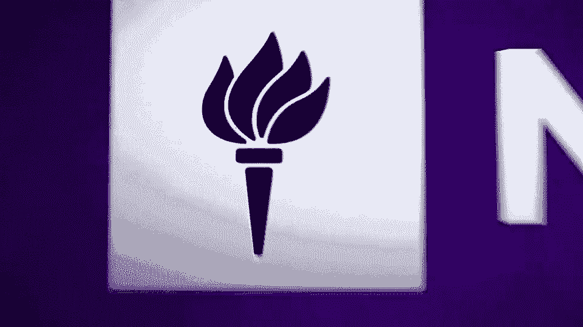

# P23：RL方法 - 批量强化学习 - 兰心飞侠 - BV14P4y1u7TB

在上一课中，我们为期权定价构建了马尔可夫决策过程（MDP）模型。

并且对冲后使用基于蒙特卡洛的动态规划方法解决了它。为了提醒你这是一个蒙特卡洛设置，我们模拟了基础股票的前向路径，然后计算了最优策略，从而得到了最优行动。最优期权价格作为时间零时最优Q函数的负值获得。

当第二个参数被视为最优行动时。现在我们转向强化学习。如我们之前多次提到的，强化学习解决的问题与动态规划相同，即它找到最优策略。但与动态规划不同，强化学习并不假设转移概率和奖励函数是已知的。相反，它依赖于样本来找到最优策略。

那么为什么这种方法很有趣？它之所以有趣，是因为它尝试直接进入问题的核心，但没有先解决另一个问题，即构建世界模型的问题。传统的期权定价方法要求我们首先构建一个股票动态模型，通过设计某种随机过程并对期权进行标定。

和股票定价数据。但我们需要注意的是，构建世界模型并不是我们的目标。我们的目的是找到最优的期权价格和对冲策略。换句话说，我们的任务是从数据中找到最优策略。但这显然与构建世界模型的任务有很大不同。

更进一步，在某些情况下，世界可能具有非常复杂的动态。而最优策略可能是一个非常简单的函数。支持向量机的创始人弗拉基米尔·沃普尼克曾提出一个原则，即在解决目标时，不应避免解决更困难的中间问题。

问题。我们在之前的课程中讨论的支持向量机实际上实现了沃普尼克的原则。现在，在我们的例子中，定价和对冲期权时，我们不需要解释世界，而是只需要学习如何在这个世界中采取最优行动。这是沃普尼克原则中的目标任务。中间任务则是解释世界，即构建世界模型。

然后是经典的量化金融方法，我们总是首先需要构建一个世界模型，即制定动力学定律并估计模型参数。这被称为模型标定，实际上是通过最小化可观察量与模型输出之间的某个损失函数来进行的。现在，根据模型的不同，这可能是一个非常资源密集型的过程。

但即使完成了这部分，问题还没有结束，因为我们仍然没有解决期权对冲和定价的主要问题。尽管这需要进行另一次计算，但通常比第一次计算所需的时间要少得多，因为它不涉及优化。因此，让我们从原始问题的角度来审视这种传统方法。

期权对冲问题，我们现在将其视为强化学习设置中的最优控制问题。如果我们首先构建世界模型，就可以应用动态规划来解决最优控制问题，但任何模型都会引入模型误差，因此这些误差可能会传播到我们最关心的量上，即最优价格和对冲。

那么，这种强化学习方法聚焦于原始任务，同时依赖数据样本而不是世界模型。因此，这种方法实施了WAPNIC规则。现在，一旦我们同意强化学习的总体方法至少在概念上将我们直接带到最终目标，我们就可以讨论不同的具体规格。

这种方法的例子。例如，我们仍然可以拥有一个世界模型，或者在强化学习设置中知道一些重要的模型参数。这种方法对应于所谓的基于模型的强化学习，与无模型强化学习相对。此外，强化学习有不同的类型。其中一些方法专注于直接的策略搜索，而另一些则最大化价值函数。

如前一课程中所述，我们现在将集中讨论基于价值的强化学习，它将从世界中提取所需的信息，以优化策略并转化为价值函数。现在，我们将考虑离线强化学习，也称为批量模式或简单的批量强化学习。在这种设置下，我们只能访问一些历史收集的数据。

无法访问实时环境，我们还假设没有这种环境的模拟器可用。那么，在批量强化学习的设置下，我们的数据是什么样的呢？数据由一组N条轨迹给出，在时间T时，信息集FT由所有独立的N条轨迹提供的FTN信息集给出。

每个集合F和T都包括直到时间T的以下这些历史值。这些值是什么？我们记录基础股票价格ST，并将其表示为X T的函数，其中X T是状态变量，H是仓位，AT是即时奖励RT，下一个时间值为X T+1。所以F和T是所有这些元组的集合，如这个方程所示。

实际上，只要一个包含 N 条长度为 T 的轨迹的动态子标记，每一条轨迹都相当于一个包含 N×T 单步转移的数据集。我们假设该数据集可以作为模拟数据或真实历史数据提供，并且结合一些人工数据来跟踪模型的表现。

假设的股票和现金复制组合用于给定期权的情况下。现在，在这种强化学习方法中，既不假设已知动态，也不假设已知真实奖励分布。给定的只是一个单步转移数据集。现在我们可以将此强化学习数据与动态规划中使用的数据进行比较。

在动态规划的设置下，我们唯一的数据是使用蒙特卡罗模拟的股票价格样本。在反向递归过程中，我们计算了即时奖励，然后计算了应采取的最优行动来对冲期权。现在让我们将此与批量强化学习的设置进行比较。我们有股票价格和下一个步骤的股票价格，这与动态规划中的数据相同。

编程设置。但在批量强化学习中，奖励和行动不是通过使用模型的知识来计算的，而是给定了奖励和行动的样本值。在下一段视频中，我们将看到如何处理这些数据。

[ 静默 ]。
